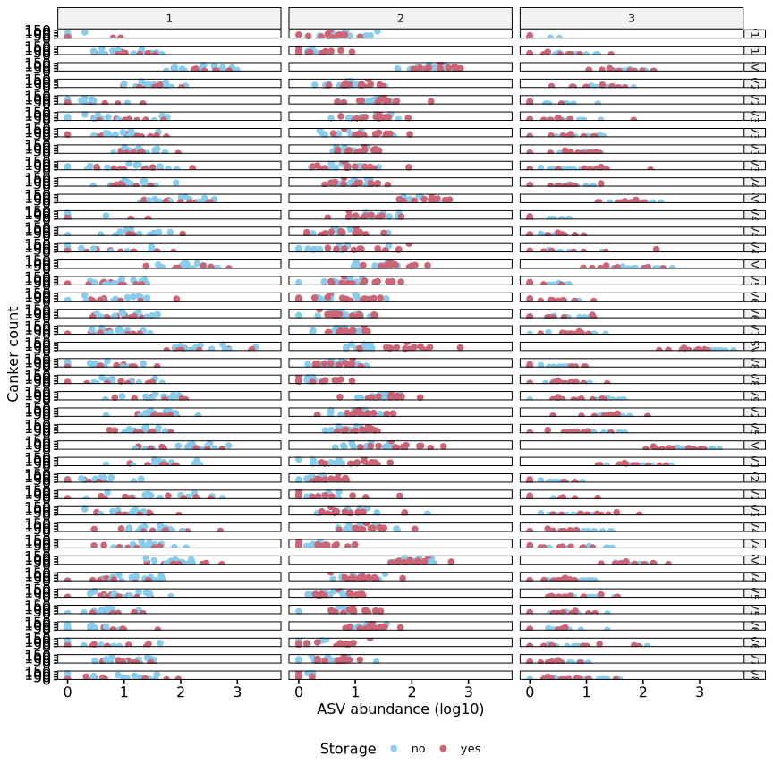

Built with R version  4.3.3.


## Setup

### Libraries


``` r
# library(car)
library(cowplot)
library(data.table)
library(DESeq2)
library(DHARMa)
library(ggpubr)
library(grid)
library(gridExtra)
library(iNEXT)
library(kableExtra)
library(knitr)
library(lmPerm)
library(MASS)
library(pscl)
# library(rcompanion)
library(seqinr)
library(tidyverse)
library(vegan)
library(viridis)

# devtools::install_github("eastmallingresearch/Metabarcoding_pipeline/scripts")
library(metafuncs)
```

### Functions and constants


``` r
ALPHA =      0.1   # DESeq2 alpha value
OTUFILTER =  0.01  # Remove OTUs with proportion of total reads below value
READFILTER = 0.05  # Will remove samples with read sum below sample_median_reads*READFILTER 
PAIREDONLY = F     # Will remove the pair of samples which fail the readfilter - probably only useful for DESeq separated by type NOTE removes pairs before DESeq object is created   
TAXCONF =    0.80  # Sets the taxonomy confidence level to get "rank" in taxonomy files
TOPOTU =     10    # Number of Top OTUs for summary information
DIFFOTU =    200    # Number of Top OTUs for correlation analysis

# graphics
DEVICE =     "png"
DPI =        1200
WIDTH =      9
HEIGHT =     9

# Model design
FACTORS = c("Site", "Storage", "Scion")
DESIGN = y ~ Site + Storage + Scion
FULL_DESIGN = y ~ Site * Storage * Scion
canker_design = "Cankers ~ Site * Storage * Scion"
```


``` r
# colour blind palette
cbPalette <- c(
  "#000000", "#E69F00", "#56B4E9", "#009E73", 
  "#F0E442", "#0072B2", "#D55E00", "#CC79A7"
)

source("functions/metabarcoding.R")
source("functions/loadme.R")
source("functions/rarefaction.R")
```

## Load data

Bacterial and fungal ASV (ZOTU) tables, sample metadata, and taxonomy files are
loaded into named lists using the `loadData` function from Greg's `metafuncs` 
package.

Site names are encoded as follows according to previous work:

- Avalon (East Sutton) -> 1
- Scripps (Brenchley) -> 2
- WWF (Pluckley) -> 3


``` r
metadata <- "sample_metadata.txt"

# Load data
ubiome_FUN <- loadData("data/FUN.zotu_table.txt",metadata,"data/zFUN.sintax.taxa",RHB="FUN")
ubiome_BAC <- loadData("data/BAC.zotu_table.txt",metadata,"data/zBAC.sintax.taxa",RHB="BAC")

# Change sites Avalon -> 1, Scripps -> 2, and WWF -> 3.
# Storage from planting date.
# No storage for December plantings, yes for March and April (4 months).
mutate_factors <- function(data){
  data <- data %>%
    rename(location = site, Scion = cultivar) %>%
    mutate(
      Site = case_when(
        location == "Avalon" ~ 1,
        location == "Scripps" ~ 2,
        location == "WWF" ~ 3
      ) %>% as.factor(),
      Storage = case_when(
        planting_date %in% c("march", "april") ~ "yes",
        planting_date %in% c("dec") ~ "no"
      ) %>% as.factor(),
      Scion = as.factor(Scion)
    )
  return(data)
}

ubiome_FUN$colData <- mutate_factors(ubiome_FUN$colData)
ubiome_BAC$colData <- mutate_factors(ubiome_BAC$colData)

# In taxData and countData replace 'OTU' with 'ASV'
rownames(ubiome_FUN$taxData) <- gsub("OTU", "ASV", rownames(ubiome_FUN$taxData))
rownames(ubiome_BAC$taxData) <- gsub("OTU", "ASV", rownames(ubiome_BAC$taxData))

rownames(ubiome_FUN$countData) <- gsub("OTU", "ASV", rownames(ubiome_FUN$countData))
rownames(ubiome_BAC$countData) <- gsub("OTU", "ASV", rownames(ubiome_BAC$countData))
```

### Global removals


``` r
# Sample "A2-7" removed due to missampling.
ubiome_BAC$colData <- ubiome_BAC$colData[!rownames(ubiome_BAC$colData) %in% "HMA27", ]
ubiome_BAC$countData <- ubiome_BAC$countData[, !colnames(ubiome_BAC$countData) %in% "HMA27"]
ubiome_FUN$colData <- ubiome_FUN$colData[!rownames(ubiome_FUN$colData) %in% "HMA27", ]
ubiome_FUN$countData <- ubiome_FUN$countData[, !colnames(ubiome_FUN$countData) %in% "HMA27"]
```

## Filter samples and ASVs

### Filtering taxa

Plantae taxa are filtered from fungal `taxData`.
Chloroplast and Eukaryote  taxa are filtered from bacterial `taxData`.
Corresponding ASVs are removed from `countData`.


``` r
# Filter Plant, Chloroplast, and Eukaryote ASVs

# Fungi: Plantae ASVs
cat("Fungi:", length(grep("Plantae", ubiome_FUN$taxData$kingdom)), "Plantae ASVs\n")
```

```
# Fungi: 0 Plantae ASVs
```

``` r
# Bacteria: Chloroplast (Streptophyta) and Eukaryote ASVs
cat(
  "Bacteria:", length(grep("Streptophyta", ubiome_BAC$taxData$genus)), "Chloroplast ASVs;", 
  length(grep("Eukaryota", ubiome_BAC$taxData$kingdom)), "Eukaryote ASVs\n"
)
```

```
# Bacteria: 37 Chloroplast ASVs; 188 Eukaryote ASVs
```

``` r
# Filter Chloroplast and Eukaryote
filt <- rownames(
  ubiome_BAC$taxData[
    grepl("Streptophyta", ubiome_BAC$taxData$genus) & 
    as.numeric(ubiome_BAC$taxData$g_conf) >= TAXCONF,
  ]
)

filt <- c(filt, rownames(ubiome_BAC$taxData[grep("Eukaryota", ubiome_BAC$taxData$kingdom), ]))

cat("Bacteria: removing", length(filt), "ASVs")
```

```
# Bacteria: removing 198 ASVs
```

``` r
ubiome_BAC$taxData <- ubiome_BAC$taxData[!rownames(ubiome_BAC$taxData) %in% filt, ]
ubiome_BAC$countData <- ubiome_BAC$countData[!rownames(ubiome_BAC$countData) %in% filt, ]
```

### Filtering samples

Plot rarefaction curves.

Remove samples with read count below 5 % of median.


``` r
invisible(mapply(assign, names(ubiome_BAC), ubiome_BAC, MoreArgs = list(envir = globalenv())))
rare_bac <- gfunc(countData, colData, "Bacteria")
# rare_bac <- gfunc(as.data.frame(counts(dds)), as.data.frame(colData(dds)), "Bacteria ZOTU")
invisible(mapply(assign, names(ubiome_FUN), ubiome_FUN, MoreArgs = list(envir = globalenv())))
rare_fun <- gfunc(countData, colData, "Fungi")
# rare_fun <- gfunc(as.data.frame(counts(dds)), as.data.frame(colData(dds)), "Fungi ZOTU")

rarefaction_plots <- grid.arrange(
  rare_bac, rare_fun,
  left = textGrob(label = expression("log"[10] * " aligned sequences"), rot = 90),
  bottom = "ASV count", nrow = 2
)

ggsave(filename = "rarefaction_plots.png", plot = rarefaction_plots, path = "figures/")

rarefaction_plots

# Fungi
med <- median(colSums(ubiome_FUN$countData))
filt <- !colSums(ubiome_FUN$countData) > med * READFILTER
cat("Fungi: ",sum(filt),"sample(s) removed\n")

# Bacteria
med <- median(colSums(ubiome_BAC$countData))
filt <- !colSums(ubiome_BAC$countData) > med * READFILTER
cat("Bacteria: ",sum(filt),"sample(s) removed\n")
```

### Filter ASVs

#### ASV read count

Number of ASVs which account for 50 %, 80 %, and 99 % of total reads.


``` r
asv_propotions <- function(countData, proportion){
  i <- sum(countData)
  y <- rowSums(countData)
  y <- y[order(y, decreasing = T)]
  asvs <- length(y[(cumsum(y) / i <= proportion)])
  return(asvs)
}

proportions <- c(0.5, 0.9, 0.99, 1)

top_asvs <- data.table(
  "proportion" = proportions,
  "Fungi" = lapply(proportions, function(x) asv_propotions(ubiome_FUN$countData, x)),
  "Bacteria" = lapply(proportions, function(x) asv_propotions(ubiome_BAC$countData, x))
)

top_asvs %>%
  kbl() %>%
  kable_styling("striped", full_width = F)
```

<table class="table table-striped" style="width: auto !important; margin-left: auto; margin-right: auto;">
 <thead>
  <tr>
   <th style="text-align:right;"> proportion </th>
   <th style="text-align:left;"> Fungi </th>
   <th style="text-align:left;"> Bacteria </th>
  </tr>
 </thead>
<tbody>
  <tr>
   <td style="text-align:right;"> 0.50 </td>
   <td style="text-align:left;"> 10 </td>
   <td style="text-align:left;"> 169 </td>
  </tr>
  <tr>
   <td style="text-align:right;"> 0.90 </td>
   <td style="text-align:left;"> 171 </td>
   <td style="text-align:left;"> 2186 </td>
  </tr>
  <tr>
   <td style="text-align:right;"> 0.99 </td>
   <td style="text-align:left;"> 995 </td>
   <td style="text-align:left;"> 5883 </td>
  </tr>
  <tr>
   <td style="text-align:right;"> 1.00 </td>
   <td style="text-align:left;"> 2401 </td>
   <td style="text-align:left;"> 7265 </td>
  </tr>
</tbody>
</table>

#### Filter ASVs

Remove ASVs with read count below 1 % of total reads.


``` r
# Fungi
keep <- filter_otus(ubiome_FUN$countData, OTUFILTER)
cat(
  "Fungi:\n", 
  " - total ASVs:", nrow(ubiome_FUN$countData), "\n",
  " - removing", nrow(ubiome_FUN$countData) - length(keep), "ASVs\n",
  " - remaining ASVs:", length(keep), "\n"
)
```

```
# Fungi:
#   - total ASVs: 2401 
#   - removing 1406 ASVs
#   - remaining ASVs: 995
```

``` r
ubiome_FUN$taxData <- ubiome_FUN$taxData[rownames(ubiome_FUN$taxData) %in% keep,]
ubiome_FUN$countData <- ubiome_FUN$countData[rownames(ubiome_FUN$countData) %in% keep,]

# Bacteria
keep <-  filter_otus(ubiome_BAC$countData, OTUFILTER)
cat(
  "Bacteria:\n",
  " - total ASVs:", nrow(ubiome_BAC$countData), "\n",
  " - removing", nrow(ubiome_BAC$countData) - length(keep), "ASVs\n",
  " - remaining ASVs:", length(keep), "\n"
)
```

```
# Bacteria:
#   - total ASVs: 7265 
#   - removing 1382 ASVs
#   - remaining ASVs: 5883
```

``` r
ubiome_BAC$taxData <- ubiome_BAC$taxData[rownames(ubiome_BAC$taxData) %in% keep,]
ubiome_BAC$countData <- ubiome_BAC$countData[rownames(ubiome_BAC$countData) %in% keep,]
```

## Absolute abundance normalisation

ASV normalisation is performed using qPCR theoretical copy number data.
Copy number is calculated per mg of root sample from the qPCR data.

### Prepare qPCR abundance data


``` r
abundance <- fread("mean_abundance.csv")

# Add sample ID to abundance data
abundance$id <- paste0("HM", gsub("-", "", abundance$Sample))
# abundance$id <- abundance$Sample
abundance$copy_number <- abundance$MeanAdjustedTCN_mg
abundance$log_copy_number <- log10(abundance$copy_number)

# Add bacterial (16S) and fungal (ITS) abundance to ubiome BAC and FUN named lists
ubiome_FUN$abundance <- abundance[abundance$Target == "ITS"] %>%
  column_to_rownames(var = "id")
ubiome_BAC$abundance <- abundance[abundance$Target == "16S"] %>%
  column_to_rownames(var = "id")

# Merge copy number from abundance with colData
ubiome_FUN$colData <- merge(
  ubiome_FUN$colData, 
  ubiome_FUN$abundance[, c("Target", "copy_number", "log_copy_number")], 
  by = 0
) %>% column_to_rownames(var = "Row.names")
ubiome_BAC$colData <- merge(
  ubiome_BAC$colData, 
  ubiome_BAC$abundance[, c("Target", "copy_number", "log_copy_number")], 
  by = 0
) %>% column_to_rownames(var = "Row.names")
```

#### Remove outliers


``` r
# Detect outliers with std > threshold from the median
detect_outliers <- function(x, val, threshold, na.rm = TRUE) {
  med_x <- median(x[[val]], na.rm = na.rm)
  sd_x <- sd(x[[val]], na.rm = na.rm)
  outliers <- x[x[[val]] > (med_x + threshold * sd_x) | x[[val]] < (med_x - threshold * sd_x), ]
  return(outliers)
}

outliers_FUN <- detect_outliers(ubiome_FUN$abundance, "MeanAdjustedTCN_mg", 3)
outliers_BAC <- detect_outliers(ubiome_BAC$abundance, "MeanAdjustedTCN_mg", 3)

# Remove samples with copy number > 3 std from the median
outliers <- rownames(outliers_FUN)
ubiome_FUN$abundance <- ubiome_FUN$abundance[!rownames(ubiome_FUN$abundance) %in% outliers, ]
ubiome_FUN$countData <- ubiome_FUN$countData[, !colnames(ubiome_FUN$countData) %in% outliers]
ubiome_FUN$colData <- ubiome_FUN$colData[!rownames(ubiome_FUN$colData) %in% outliers, ]

cat("Fungi: removing", length(outliers), "outlier(s)\n")
```

```
# Fungi: removing 1 outlier(s)
```

Sample A1-3 is removed from the fungal data due to abnormally high copy number.

## Canker count data

Canker count data for sampled trees only.


``` r
# Canker count data for sampled trees only

canker_data <- fread("canker_data.csv", select = c(1:5, 7:34))

# Remove spaces from column names and convert to lowercase
colnames(canker_data) <- tolower(gsub(" ", "_", colnames(canker_data)))

# Codify site names, add storage and total canker count for timepoint 4
canker_data <- mutate(
  canker_data,
  Site = case_when(
    site == "Avalon" ~ 1,
    site == "Scripps" ~ 2,
    site == "WWF" ~ 3
  ) %>% as.factor(),
  Storage = case_when(
    planting_date %in% c("March", "April") ~ "yes",
    planting_date %in% c("Dec") ~ "no"
  ),
  Scion = as.factor(cultivar),
  total_cankers = a4 + b4 + c4 + d4 + e4
)

# Identify samples with missing values
missing <- unique(canker_data[!complete.cases(canker_data), code])

# Also remove sample A2-7 due to missampling
missing <- c(missing, "HMA27")

# Remove missing samples from canker data
canker_data <- canker_data[!canker_data$code %in% missing, ]

# Verify that there are two trees for each sample
canker_data %>% group_by(code) %>% summarise(n = n()) %>% filter(n != 2)
```

```
# # A tibble: 0 × 2
# # ℹ 2 variables: code <chr>, n <int>
```

``` r
# Sum of total cankers for each pair of trees with matching code
cankers <- canker_data %>% 
  group_by(code) %>% 
  summarise(
    Site = first(Site),
    Storage = first(Storage),
    Scion = first(Scion),
    Cankers = sum(total_cankers)
  ) %>% 
  column_to_rownames("code")

# Add total canker count to colData for both FUN and BAC
ubiome_FUN$colData <- merge(
  ubiome_FUN$colData, 
  cankers["Cankers"], 
  by = 0,
  all.x = T
) %>% column_to_rownames("Row.names")

ubiome_BAC$colData <- merge(
  ubiome_BAC$colData, 
  cankers["Cankers"], 
  by = 0,
  all.x = T
) %>% column_to_rownames("Row.names")
```

Summary stats


``` r
# png("figures/hist.png", width = 800, height = 600)
# hist(cankers$Cankers, breaks = 20, main = "Total canker count", xlab = "Total canker count")
# dev.off()

cankers_hist <- ggdensity(
  cankers, x = "Cankers", fill = "Site", facet.by = "Site", ncol = 1,
  add = "mean", rug = T, palette = cbPalette,
  title = "Total canker count", xlab = "Total canker count"
)

cankers_hist
```

<!-- -->

``` r
ggsave(filename = "cankers_hist.png", plot = cankers_hist, path = "figures/")

cankers_box <- ggboxplot(
  cankers, x = "Site", y = "Cankers", palette = cbPalette,
  color = "Scion", add = "jitter", legend = "top", 
  title = "Total canker count", xlab = "Site", ylab = "Total canker count"
)

cankers_box
```

<!-- -->

``` r
ggsave(filename = "cankers_box.png", plot = cankers_box, path = "figures/")

cankers_bar <- ggbarplot(
  cankers, x = "Site", y = "Cankers", fill = "Scion", 
  palette = cbPalette, add = "mean_se", position = position_dodge(0.8),
  title = "Total canker count", xlab = "Site", ylab = "Total canker count"
)

cankers_bar
```

<!-- -->

``` r
ggsave(filename = "cankers_bar.png", plot = cankers_bar, path = "figures/")
```

GLM


``` r
# Effect of Site, Scion, and Storage on canker count

# Formula
formula <- update(FULL_DESIGN, Cankers ~ .)
# formula <- Cankers ~ Site + Storage + Scion + site:Storage + site:Scion + Storage:Scion

# Log-linear model
canker_lm <- lm(update(FULL_DESIGN, log(Cankers + 1) ~ .), data = cankers)

par(mfrow = c(2, 2))
plot(canker_lm)
```

<!-- -->

``` r
# Residual checking
res <- resid(canker_lm, type = "pearson")

# Poisson model
canker_poisson <- glm(formula, data = cankers, family = "poisson")

poisson_plot <- plot(simulateResiduals(canker_poisson), title = "Poisson model")
```

<!-- -->

``` r
# Model overdispersed

# Negative binomial model
canker_negbin <- glm.nb(formula, data = cankers)

sim <- simulateResiduals(canker_negbin)

plot(sim, title = "Negative binomial model")
```

<!-- -->

``` r
# canker_model_plots <- ggarrange(lm_plot, poisson_plot, negbin_plot, ncol = 3)

# ggsave(filename = "canker_model_plots.png", plot = canker_model_plots, path = "figures/")

# png("figures/canker_residuals.png", width = 800, height = 600)
# plot(sim)
# dev.off()

testZeroInflation(sim)
```

```
# 
# 	DHARMa zero-inflation test via comparison to expected zeros with
# 	simulation under H0 = fitted model
# 
# data:  simulationOutput
# ratioObsSim = 0.77399, p-value = 0.76
# alternative hypothesis: two.sided
```

``` r
nagelkerke(canker_negbin)
```

```
# Error in nagelkerke(canker_negbin): could not find function "nagelkerke"
```

``` r
# Model good fit

canker_anova <- anova(canker_negbin, test = "Chisq") %>% data.frame()
total_deviance <- sum(canker_anova$Deviance, na.rm = T) + tail(canker_anova$Resid..Dev, 1)
canker_anova$Perc..Dev <- canker_anova$Deviance / total_deviance * 100

canker_anova
```

```
#                    Df     Deviance Resid..Df Resid..Dev     Pr..Chi.
# NULL               NA           NA        73  314.98196           NA
# Site                2 118.75744595        71  196.22452 1.629852e-26
# Storage             1   0.02066259        70  196.20386 8.857019e-01
# Scion               6  24.29375368        64  171.91010 4.611042e-04
# Site:Storage        2  28.86115598        62  143.04895 5.406044e-07
# Site:Scion         12  31.65405909        50  111.39489 1.564383e-03
# Storage:Scion       6   7.40666778        44  103.98822 2.848693e-01
# Site:Storage:Scion 11  26.62949240        33   77.35873 5.225415e-03
#                       Perc..Dev
# NULL                         NA
# Site               37.702935303
# Storage             0.006559927
# Scion               7.712744377
# Site:Storage        9.162796386
# Site:Scion         10.049483066
# Storage:Scion       2.351457744
# Site:Storage:Scion  8.454291190
```

<!-- -->

## Create DESeq objects


``` r
# Make sure countData and colData still match, if they do, create DESeq objects, if not throw error
if(identical(colnames(ubiome_FUN$countData), rownames(ubiome_FUN$colData))) {
  # Create DESeq object
  ubiome_FUN$dds <- ubiom_to_des(ubiome_FUN)
  print("FUN DESeq object created")
} else {
  stop("FUN countData and colData do not match")
}
```

```
# [1] "FUN DESeq object created"
```

``` r
if(identical(colnames(ubiome_BAC$countData), rownames(ubiome_BAC$colData))) {
  # Create DESeq object
  ubiome_BAC$dds <- ubiom_to_des(ubiome_BAC)
  print("BAC DESeq object created")
} else {
  stop("BAC countData and colData do not match")
}
```

```
# [1] "BAC DESeq object created"
```

## Abundance normalisation

Absolute abundance normalisation using DESeq2 size factors.

Values are centred around the mean of the copy number.


``` r
# Normalise count data using DESeq2 size factors

ubiome_FUN$dds$sizeFactor <- ubiome_FUN$dds$copy_number / mean(ubiome_FUN$dds$copy_number)
ubiome_BAC$dds$sizeFactor <- ubiome_BAC$dds$copy_number / mean(ubiome_BAC$dds$copy_number)
```


``` r
# Save environment
save.image("data_loaded.RData")
```

<!-- #=============================================================================== -->
# **Fungi**
<!-- #=============================================================================== -->


``` r
# Unpack fungi data
invisible(mapply(assign, names(ubiome_FUN), ubiome_FUN, MoreArgs = list(envir = globalenv())))
```

## ASV and sample summary

### Read and sample summary


``` r
cat(
  "Raw reads", "\n\n",
  "Total raw reads:\t\t", sum(countData), "\n",
  "Mean raw reads per sample:\t", mean(colSums(countData)), "\n",
  "Median raw reads per sample:\t", median(colSums(countData)), "\n",
  "Max raw reads per sample:\t", max(colSums(countData)), "\n",
  "Min raw reads per sample:\t", min(colSums(countData)), "\n\n"
)
```

```
# Raw reads 
# 
#  Total raw reads:		 7293776 
#  Mean raw reads per sample:	 90046.62 
#  Median raw reads per sample:	 93435 
#  Max raw reads per sample:	 113518 
#  Min raw reads per sample:	 38472
```

``` r
#colSums(countData)

nct <- counts(dds, normalize = T)
cat("Normalised reads", "\n\n",
  "Total normalised reads:\t\t", sum(nct), "\n",
  "Mean normalised reads per sample:\t", mean(colSums(nct)), "\n",
  "Median normalised reads per sample:\t", median(colSums(nct)), "\n",
  "Min normalised reads per sample:\t", min(colSums(nct)), "\n",
  "Max normalised reads per sample:\t", max(colSums(nct)), "\n\n"
)
```

```
# Normalised reads 
# 
#  Total normalised reads:		 12468857 
#  Mean normalised reads per sample:	 153936.5 
#  Median normalised reads per sample:	 98624.28 
#  Min normalised reads per sample:	 28901.7 
#  Max normalised reads per sample:	 881441.3
```

``` r
#round(colSums(counts(dds,normalize = T)),0)
```

### ASV summary 


``` r
cat(
  "Total ASVs:\t\t", nrow(taxData),"\n\n",
  "Raw reads per ASV summary", "\n\n",
  "Mean raw reads per ASV:\t", mean(rowSums(countData)),"\n",
  "Median raw per ASV:\t\t", median(rowSums(countData)),"\n",
  "ASV raw Min reads:\t\t", min(rowSums(countData)),"\n",
  "ASV raw Max reads:\t\t", max(rowSums(countData)),"\n\n"
)
```

```
# Total ASVs:		 995 
# 
#  Raw reads per ASV summary 
# 
#  Mean raw reads per ASV:	 7330.428 
#  Median raw per ASV:		 588 
#  ASV raw Min reads:		 115 
#  ASV raw Max reads:		 714327
```

``` r
cat(
  "Normalised reads per ASV summary","\n\n",
  "Mean normalised reads per ASV:\t\t", mean(rowSums(nct)),"\n",
  "Median normalised reads per ASV:\t", median(rowSums(nct)),"\n",
  "ASV normalised Min reads:\t\t", min(rowSums(nct)),"\n",
  "ASV normalised Max reads:\t\t", max(rowSums(nct)),"\n\n"
)
```

```
# Normalised reads per ASV summary 
# 
#  Mean normalised reads per ASV:		 12531.51 
#  Median normalised reads per ASV:	 1025.725 
#  ASV normalised Min reads:		 101.2814 
#  ASV normalised Max reads:		 1509459
```

``` r
y <- rowSums(nct)
y <- y[order(y, decreasing = T)]
# proportion
xy <- y / sum(y)

cat("Top " ,TOPOTU, "ASVs:\n")
```

```
# Top  10 ASVs:
```

``` r
data.frame(
  counts = y[1:TOPOTU], 
  proportion = xy[1:TOPOTU], 
  rank = taxData[names(y)[1:TOPOTU],]$rank
) %>%
  kbl() %>%
  kable_styling("striped", full_width = F)
```

<table class="table table-striped" style="width: auto !important; margin-left: auto; margin-right: auto;">
 <thead>
  <tr>
   <th style="text-align:left;">   </th>
   <th style="text-align:right;"> counts </th>
   <th style="text-align:right;"> proportion </th>
   <th style="text-align:left;"> rank </th>
  </tr>
 </thead>
<tbody>
  <tr>
   <td style="text-align:left;"> ASV2 </td>
   <td style="text-align:right;"> 1509458.8 </td>
   <td style="text-align:right;"> 0.1210583 </td>
   <td style="text-align:left;"> Ascomycota(p) </td>
  </tr>
  <tr>
   <td style="text-align:left;"> ASV1 </td>
   <td style="text-align:right;"> 1490469.5 </td>
   <td style="text-align:right;"> 0.1195354 </td>
   <td style="text-align:left;"> Dactylonectria macrodidyma(s) </td>
  </tr>
  <tr>
   <td style="text-align:left;"> ASV5 </td>
   <td style="text-align:right;"> 1068164.1 </td>
   <td style="text-align:right;"> 0.0856666 </td>
   <td style="text-align:left;"> Leotiomycetes(c) </td>
  </tr>
  <tr>
   <td style="text-align:left;"> ASV4 </td>
   <td style="text-align:right;"> 1059908.0 </td>
   <td style="text-align:right;"> 0.0850044 </td>
   <td style="text-align:left;"> Ascomycota(p) </td>
  </tr>
  <tr>
   <td style="text-align:left;"> ASV3 </td>
   <td style="text-align:right;"> 480660.1 </td>
   <td style="text-align:right;"> 0.0385488 </td>
   <td style="text-align:left;"> Ilyonectria destructans(s) </td>
  </tr>
  <tr>
   <td style="text-align:left;"> ASV7 </td>
   <td style="text-align:right;"> 290896.6 </td>
   <td style="text-align:right;"> 0.0233299 </td>
   <td style="text-align:left;"> Fusarium(g) </td>
  </tr>
  <tr>
   <td style="text-align:left;"> ASV6 </td>
   <td style="text-align:right;"> 227927.9 </td>
   <td style="text-align:right;"> 0.0182798 </td>
   <td style="text-align:left;"> Ilyonectria robusta(s) </td>
  </tr>
  <tr>
   <td style="text-align:left;"> ASV9 </td>
   <td style="text-align:right;"> 201690.6 </td>
   <td style="text-align:right;"> 0.0161755 </td>
   <td style="text-align:left;"> Ascomycota(p) </td>
  </tr>
  <tr>
   <td style="text-align:left;"> ASV8 </td>
   <td style="text-align:right;"> 191083.5 </td>
   <td style="text-align:right;"> 0.0153249 </td>
   <td style="text-align:left;"> Fusarium(g) </td>
  </tr>
  <tr>
   <td style="text-align:left;"> ASV11 </td>
   <td style="text-align:right;"> 131684.2 </td>
   <td style="text-align:right;"> 0.0105610 </td>
   <td style="text-align:left;"> Truncatella angustata(s) </td>
  </tr>
</tbody>
</table>

## Taxonomy Summary

### Taxonomy identifiable

Proportion of ASVs which can be assigned (with the given confidence) at each taxonomic rank.


``` r
# Proportion of ASVs which can be assigned (with the given confidence) at each taxonomic rank

tx <- copy(taxData)
setDT(tx)
cols <- names(tx)[9:15]

tx[, (cols) := lapply(.SD, as.factor), .SDcols = cols]

data.table(
  rank = c("kingdom", "phylum", "class", "order", "family", "genus", "species"),
  "0.8" = round(unlist(lapply(cols, function(col) sum(as.number(tx[[col]]) >= 0.8) / nrow(tx))), 2),
  "0.65" = round(unlist(lapply(cols, function(col) sum(as.number(tx[[col]]) >= 0.65) / nrow(tx))), 2),
  "0.5" = round(unlist(lapply(cols, function(col) sum(as.number(tx[[col]]) >= 0.5) / nrow(tx))), 2)
) %>%
  kbl() %>%
  kable_styling("striped", full_width = F)
```

<table class="table table-striped" style="width: auto !important; margin-left: auto; margin-right: auto;">
 <thead>
  <tr>
   <th style="text-align:left;"> rank </th>
   <th style="text-align:right;"> 0.8 </th>
   <th style="text-align:right;"> 0.65 </th>
   <th style="text-align:right;"> 0.5 </th>
  </tr>
 </thead>
<tbody>
  <tr>
   <td style="text-align:left;"> kingdom </td>
   <td style="text-align:right;"> 1.00 </td>
   <td style="text-align:right;"> 1.00 </td>
   <td style="text-align:right;"> 1.00 </td>
  </tr>
  <tr>
   <td style="text-align:left;"> phylum </td>
   <td style="text-align:right;"> 0.84 </td>
   <td style="text-align:right;"> 0.87 </td>
   <td style="text-align:right;"> 0.90 </td>
  </tr>
  <tr>
   <td style="text-align:left;"> class </td>
   <td style="text-align:right;"> 0.70 </td>
   <td style="text-align:right;"> 0.74 </td>
   <td style="text-align:right;"> 0.78 </td>
  </tr>
  <tr>
   <td style="text-align:left;"> order </td>
   <td style="text-align:right;"> 0.54 </td>
   <td style="text-align:right;"> 0.60 </td>
   <td style="text-align:right;"> 0.64 </td>
  </tr>
  <tr>
   <td style="text-align:left;"> family </td>
   <td style="text-align:right;"> 0.42 </td>
   <td style="text-align:right;"> 0.45 </td>
   <td style="text-align:right;"> 0.49 </td>
  </tr>
  <tr>
   <td style="text-align:left;"> genus </td>
   <td style="text-align:right;"> 0.38 </td>
   <td style="text-align:right;"> 0.42 </td>
   <td style="text-align:right;"> 0.47 </td>
  </tr>
  <tr>
   <td style="text-align:left;"> species </td>
   <td style="text-align:right;"> 0.24 </td>
   <td style="text-align:right;"> 0.30 </td>
   <td style="text-align:right;"> 0.35 </td>
  </tr>
</tbody>
</table>

% of reads which can be assigned to each taxonomic ranks


``` r
tx <-taxData[rownames(dds),]
nc <- counts(dds, normalize = T)
ac <- sum(nc)

data.table(
  rank = c("kingdom", "phylum", "class", "order", "family", "genus", "species"),
  "0.8" = round(unlist(lapply(cols, function(col)(sum(nc[which(as.numeric(tx[[col]]) >= 0.8),]) / ac * 100))), 2),
  "0.65" = round(unlist(lapply(cols, function(col)(sum(nc[which(as.numeric(tx[[col]]) >= 0.65),]) / ac * 100))), 2),
  "0.5" = round(unlist(lapply(cols, function(col)(sum(nc[which(as.numeric(tx[[col]]) >= 0.5),]) / ac * 100))), 2)
) %>%
  kbl() %>%
  kable_styling("striped", full_width = F)
```

<table class="table table-striped" style="width: auto !important; margin-left: auto; margin-right: auto;">
 <thead>
  <tr>
   <th style="text-align:left;"> rank </th>
   <th style="text-align:right;"> 0.8 </th>
   <th style="text-align:right;"> 0.65 </th>
   <th style="text-align:right;"> 0.5 </th>
  </tr>
 </thead>
<tbody>
  <tr>
   <td style="text-align:left;"> kingdom </td>
   <td style="text-align:right;"> 100.00 </td>
   <td style="text-align:right;"> 100.00 </td>
   <td style="text-align:right;"> 100.00 </td>
  </tr>
  <tr>
   <td style="text-align:left;"> phylum </td>
   <td style="text-align:right;"> 84.14 </td>
   <td style="text-align:right;"> 96.59 </td>
   <td style="text-align:right;"> 96.83 </td>
  </tr>
  <tr>
   <td style="text-align:left;"> class </td>
   <td style="text-align:right;"> 60.12 </td>
   <td style="text-align:right;"> 70.92 </td>
   <td style="text-align:right;"> 71.47 </td>
  </tr>
  <tr>
   <td style="text-align:left;"> order </td>
   <td style="text-align:right;"> 53.49 </td>
   <td style="text-align:right;"> 58.87 </td>
   <td style="text-align:right;"> 68.76 </td>
  </tr>
  <tr>
   <td style="text-align:left;"> family </td>
   <td style="text-align:right;"> 44.97 </td>
   <td style="text-align:right;"> 46.80 </td>
   <td style="text-align:right;"> 50.25 </td>
  </tr>
  <tr>
   <td style="text-align:left;"> genus </td>
   <td style="text-align:right;"> 46.06 </td>
   <td style="text-align:right;"> 48.01 </td>
   <td style="text-align:right;"> 50.72 </td>
  </tr>
  <tr>
   <td style="text-align:left;"> species </td>
   <td style="text-align:right;"> 30.44 </td>
   <td style="text-align:right;"> 36.70 </td>
   <td style="text-align:right;"> 41.62 </td>
  </tr>
</tbody>
</table>

### Taxonomy plots

Plots of proportion of normalised reads assigned to members of phylum and class.


``` r
dat <- list(as.data.frame(counts(dds, normalize = T)), taxData, as.data.frame(colData(dds)))

design <- c("Site", "Storage")

# md1 <- getSummedTaxa(dat, conf = TAXCONF, design = design, cutoff = 0.1)
md1 <- getSummedTaxa(dat, conf = TAXCONF, design = design, taxon = "phylum", cutoff = 0.1)

md1[, Site := factor(Site, levels = c(1, 2, 3))]
md1[, Storage := factor(Storage, levels = c("no", "yes"))]
md1[, taxon := factor(taxon, levels = unique(taxon[order(value, decreasing = T)]))]

removals <- md1[, .(value = mean(value)), by = "taxon"][value < 0.5, taxon]
md1 <- md1[!taxon %in% removals, ]

fun_phylum_plot <- plotfun1(md1, x = "taxon", fill = "Site") +
  facet_wrap(~ Storage)

ggsave("figures/fun_phylum.png", fun_phylum_plot, width = 25, height = 15, units = "cm")

fun_phylum_plot
```

<!-- -->

``` r
md2 <- getSummedTaxa(dat, conf = TAXCONF, design = design, taxon = "class", cutoff = 0.1)

md2[, Site := factor(Site, levels = c(1, 2, 3))]
md2[, Storage := factor(Storage, levels = c("no", "yes"))]
md2[, taxon := factor(taxon, levels = unique(taxon[order(value, decreasing = T)]))]

removals <- md2[, .(value = mean(value)), by = "taxon"][value < 0.5, taxon]
md2 <- md2[!taxon %in% removals, ]

fun_class_plot <- plotfun1(md2, x = "taxon", fill = "Site") +
  facet_wrap(~ Storage)

ggsave("figures/fun_class.png", fun_class_plot, width = 25, height = 15, units = "cm")

fun_class_plot
```

<!-- -->

## Abundance

Plot copy number for each sample grouped by site, Scion, and Storage.
Test the effect of site, Scion, and Storage on copy number using ANOVA.


``` r
# abundance_plot <- ggplot(
#   data = as.data.frame(colData(dds)), 
#   aes(x = site, y = log_copy_number, colour = Scion, shape = Storage)
# ) + geom_jitter() + 
#   scale_colour_manual(values = cbPalette)

fun_abundance_box <- ggboxplot(
  data = as.data.frame(colData(dds)), x = "Site", y = "log_copy_number", 
  color = "Scion", add = "jitter", legend = "top", 
  title = "Fungal abundance", xlab = "Site", ylab = "log10 copy number"
)

ggsave(
  filename = "fun_abundance.png", plot = fun_abundance_box, path = "figures/", 
  height = 20, width = 20, units = "cm"
)

fun_abundance_box
```

<!-- -->

``` r
fun_abundance_bar <- ggbarplot(
  data = as.data.frame(colData(dds)), x = "Storage", y = "log_copy_number", 
  fill = "Site", add = "mean_se", 
  palette = cbPalette, position = position_dodge(0.8),
  title = "(a) Fungal abundance", xlab = "Storage ", ylab = "Mean copy number (log10)"
) + guides(fill = guide_legend(title = "Site"))

ggsave(
  filename = "fun_abundance_bar.png", plot = fun_abundance_bar, path = "figures/", 
  height = 20, width = 20, units = "cm"
)

fun_abundance_bar
```

<!-- -->

``` r
# Formula for ANOVA
formula <- update(FULL_DESIGN, log_copy_number ~ .)

abundance_anova <- aov(formula, data = as.data.frame(colData(dds)))

# Normality check
par(mfrow = c(2, 2))
plot(abundance_anova)
```

<!-- -->

``` r
png("figures/fun_abundance_norm.png", width = 800, height = 600)
par(mfrow = c(2, 2))
plot(abundance_anova)
dev.off()
```

```
# png 
#   2
```

``` r
# Results
summary(abundance_anova)
```

```
#                    Df Sum Sq Mean Sq F value Pr(>F)  
# Site                2  0.861  0.4306   4.663 0.0153 *
# Storage             1  0.501  0.5012   5.427 0.0251 *
# Scion               6  0.477  0.0795   0.860 0.5324  
# Site:Storage        2  0.683  0.3415   3.698 0.0338 *
# Site:Scion         12  1.203  0.1003   1.086 0.3981  
# Storage:Scion       6  0.458  0.0763   0.827 0.5564  
# Site:Storage:Scion 12  0.918  0.0765   0.828 0.6214  
# Residuals          39  3.602  0.0924                 
# ---
# Signif. codes:  0 '***' 0.001 '**' 0.01 '*' 0.05 '.' 0.1 ' ' 1
```

``` r
abundance_results <- abundance_anova %>% summary() %>% unclass() %>% data.frame()
total_variance <- sum(abundance_results$Sum.Sq)
abundance_results$Perc.Var <- abundance_results$Sum.Sq / total_variance * 100

abundance_results %>%
  kbl() %>%
  kable_styling("striped", full_width = F)
```

<table class="table table-striped" style="width: auto !important; margin-left: auto; margin-right: auto;">
 <thead>
  <tr>
   <th style="text-align:left;">   </th>
   <th style="text-align:right;"> Df </th>
   <th style="text-align:right;"> Sum.Sq </th>
   <th style="text-align:right;"> Mean.Sq </th>
   <th style="text-align:right;"> F.value </th>
   <th style="text-align:right;"> Pr..F. </th>
   <th style="text-align:right;"> Perc.Var </th>
  </tr>
 </thead>
<tbody>
  <tr>
   <td style="text-align:left;"> Site </td>
   <td style="text-align:right;"> 2 </td>
   <td style="text-align:right;"> 0.8612429 </td>
   <td style="text-align:right;"> 0.4306214 </td>
   <td style="text-align:right;"> 4.6626824 </td>
   <td style="text-align:right;"> 0.0152878 </td>
   <td style="text-align:right;"> 9.895484 </td>
  </tr>
  <tr>
   <td style="text-align:left;"> Storage </td>
   <td style="text-align:right;"> 1 </td>
   <td style="text-align:right;"> 0.5012156 </td>
   <td style="text-align:right;"> 0.5012156 </td>
   <td style="text-align:right;"> 5.4270616 </td>
   <td style="text-align:right;"> 0.0250969 </td>
   <td style="text-align:right;"> 5.758852 </td>
  </tr>
  <tr>
   <td style="text-align:left;"> Scion </td>
   <td style="text-align:right;"> 6 </td>
   <td style="text-align:right;"> 0.4767020 </td>
   <td style="text-align:right;"> 0.0794503 </td>
   <td style="text-align:right;"> 0.8602723 </td>
   <td style="text-align:right;"> 0.5323908 </td>
   <td style="text-align:right;"> 5.477197 </td>
  </tr>
  <tr>
   <td style="text-align:left;"> Site:Storage </td>
   <td style="text-align:right;"> 2 </td>
   <td style="text-align:right;"> 0.6830842 </td>
   <td style="text-align:right;"> 0.3415421 </td>
   <td style="text-align:right;"> 3.6981494 </td>
   <td style="text-align:right;"> 0.0338326 </td>
   <td style="text-align:right;"> 7.848482 </td>
  </tr>
  <tr>
   <td style="text-align:left;"> Site:Scion </td>
   <td style="text-align:right;"> 12 </td>
   <td style="text-align:right;"> 1.2031665 </td>
   <td style="text-align:right;"> 0.1002639 </td>
   <td style="text-align:right;"> 1.0856371 </td>
   <td style="text-align:right;"> 0.3981291 </td>
   <td style="text-align:right;"> 13.824108 </td>
  </tr>
  <tr>
   <td style="text-align:left;"> Storage:Scion </td>
   <td style="text-align:right;"> 6 </td>
   <td style="text-align:right;"> 0.4580790 </td>
   <td style="text-align:right;"> 0.0763465 </td>
   <td style="text-align:right;"> 0.8266645 </td>
   <td style="text-align:right;"> 0.5564216 </td>
   <td style="text-align:right;"> 5.263223 </td>
  </tr>
  <tr>
   <td style="text-align:left;"> Site:Storage:Scion </td>
   <td style="text-align:right;"> 12 </td>
   <td style="text-align:right;"> 0.9180631 </td>
   <td style="text-align:right;"> 0.0765053 </td>
   <td style="text-align:right;"> 0.8283835 </td>
   <td style="text-align:right;"> 0.6213710 </td>
   <td style="text-align:right;"> 10.548335 </td>
  </tr>
  <tr>
   <td style="text-align:left;"> Residuals </td>
   <td style="text-align:right;"> 39 </td>
   <td style="text-align:right;"> 3.6018401 </td>
   <td style="text-align:right;"> 0.0923549 </td>
   <td style="text-align:right;"> NA </td>
   <td style="text-align:right;"> NA </td>
   <td style="text-align:right;"> 41.384319 </td>
  </tr>
</tbody>
</table>

## Alpha diversity analysis

### Alpha diversity plot


``` r
# plot alpha diversity - plot_alpha will convert normalised abundances to integer values

fun_alpha_plot <- plot_alpha(
  counts(dds, normalize = F), colData(dds),
  design = "Scion", colour = "Site",
  measures = c("Shannon", "Simpson"),
  type = "bar"
) + scale_colour_manual(values = cbPalette) + 
  theme(axis.title.x = element_blank()) +
  ggtitle("Fungal α-diversity")

ggsave(
  filename = "fun_alpha.png", plot = fun_alpha_plot, path = "figures/", 
  height = 20, width = 40, units = "cm"
)
```

```
# Error in `geom_errorbar()`:
# ! Problem while computing aesthetics.
# ℹ Error occurred in the 2nd layer.
# Caused by error:
# ! object 'se' not found
```

``` r
fun_alpha_plot
```

```
# Error in `geom_errorbar()`:
# ! Problem while computing aesthetics.
# ℹ Error occurred in the 2nd layer.
# Caused by error:
# ! object 'se' not found
```

### Permutation based anova on diversity index ranks


``` r
# get the diversity index data
all_alpha_ord <- plot_alpha(
  counts(dds, normalize = F),
  colData(dds),
  returnData = T
)

# join diversity indices and metadata
all_alpha_ord <- all_alpha_ord[
  as.data.table(colData(dds), keep.rownames = "Samples"), 
  on = "Samples"
]

fun_alpha <- all_alpha_ord

formula <- FULL_DESIGN # x ~ Site * Storage * Scion + Site / Site.block
```

#### Chao1


``` r
setkey(all_alpha_ord, S.chao1)
all_alpha_ord[, measure := as.numeric(as.factor(S.chao1))]
result <- aovp(update(formula, measure ~ .), all_alpha_ord, seqs = T)
```

```
# [1] "Settings:  sequential SS "
```

``` r
summary(result)
```

```
# Component 1 :
#                    Df R Sum Sq R Mean Sq Iter Pr(Prob)    
# Site                2  11554.5    5777.2 5000  < 2e-16 ***
# Storage             1   2056.4    2056.4 1079  0.08526 .  
# Site:Storage        2    812.4     406.2  270  0.47778    
# Scion               6    875.7     145.9  315  0.93968    
# Site:Scion         12   2817.7     234.8  762  0.93832    
# Storage:Scion       6   2046.5     341.1  206  0.88350    
# Site:Storage:Scion 12   2735.3     227.9  431  0.94896    
# Residuals          39  21381.5     548.2                  
# ---
# Signif. codes:  0 '***' 0.001 '**' 0.01 '*' 0.05 '.' 0.1 ' ' 1
```

``` r
df <- result %>% summary() %>% unclass() %>% data.frame()
total_variance <- sum(df$R.Sum.Sq)
df$Perc.Var <- df$R.Sum.Sq / total_variance * 100
df %>%
  kbl() %>%
  kable_styling("striped", full_width = F)
```

<table class="table table-striped" style="width: auto !important; margin-left: auto; margin-right: auto;">
 <thead>
  <tr>
   <th style="text-align:left;">   </th>
   <th style="text-align:right;"> Df </th>
   <th style="text-align:right;"> R.Sum.Sq </th>
   <th style="text-align:right;"> R.Mean.Sq </th>
   <th style="text-align:right;"> Iter </th>
   <th style="text-align:right;"> Pr.Prob. </th>
   <th style="text-align:right;"> Perc.Var </th>
  </tr>
 </thead>
<tbody>
  <tr>
   <td style="text-align:left;"> Site </td>
   <td style="text-align:right;"> 2 </td>
   <td style="text-align:right;"> 11554.4684 </td>
   <td style="text-align:right;"> 5777.2342 </td>
   <td style="text-align:right;"> 5000 </td>
   <td style="text-align:right;"> 0.0000000 </td>
   <td style="text-align:right;"> 26.094102 </td>
  </tr>
  <tr>
   <td style="text-align:left;"> Storage </td>
   <td style="text-align:right;"> 1 </td>
   <td style="text-align:right;"> 2056.4245 </td>
   <td style="text-align:right;"> 2056.4245 </td>
   <td style="text-align:right;"> 1079 </td>
   <td style="text-align:right;"> 0.0852641 </td>
   <td style="text-align:right;"> 4.644139 </td>
  </tr>
  <tr>
   <td style="text-align:left;"> Site:Storage </td>
   <td style="text-align:right;"> 2 </td>
   <td style="text-align:right;"> 812.3544 </td>
   <td style="text-align:right;"> 406.1772 </td>
   <td style="text-align:right;"> 270 </td>
   <td style="text-align:right;"> 0.4777778 </td>
   <td style="text-align:right;"> 1.834585 </td>
  </tr>
  <tr>
   <td style="text-align:left;"> Scion </td>
   <td style="text-align:right;"> 6 </td>
   <td style="text-align:right;"> 875.6763 </td>
   <td style="text-align:right;"> 145.9461 </td>
   <td style="text-align:right;"> 315 </td>
   <td style="text-align:right;"> 0.9396825 </td>
   <td style="text-align:right;"> 1.977589 </td>
  </tr>
  <tr>
   <td style="text-align:left;"> Site:Scion </td>
   <td style="text-align:right;"> 12 </td>
   <td style="text-align:right;"> 2817.7201 </td>
   <td style="text-align:right;"> 234.8100 </td>
   <td style="text-align:right;"> 762 </td>
   <td style="text-align:right;"> 0.9383202 </td>
   <td style="text-align:right;"> 6.363415 </td>
  </tr>
  <tr>
   <td style="text-align:left;"> Storage:Scion </td>
   <td style="text-align:right;"> 6 </td>
   <td style="text-align:right;"> 2046.5389 </td>
   <td style="text-align:right;"> 341.0898 </td>
   <td style="text-align:right;"> 206 </td>
   <td style="text-align:right;"> 0.8834951 </td>
   <td style="text-align:right;"> 4.621813 </td>
  </tr>
  <tr>
   <td style="text-align:left;"> Site:Storage:Scion </td>
   <td style="text-align:right;"> 12 </td>
   <td style="text-align:right;"> 2735.3173 </td>
   <td style="text-align:right;"> 227.9431 </td>
   <td style="text-align:right;"> 431 </td>
   <td style="text-align:right;"> 0.9489559 </td>
   <td style="text-align:right;"> 6.177320 </td>
  </tr>
  <tr>
   <td style="text-align:left;"> Residuals </td>
   <td style="text-align:right;"> 39 </td>
   <td style="text-align:right;"> 21381.5000 </td>
   <td style="text-align:right;"> 548.2436 </td>
   <td style="text-align:right;"> NA </td>
   <td style="text-align:right;"> NA </td>
   <td style="text-align:right;"> 48.287037 </td>
  </tr>
</tbody>
</table>

#### Shannon


``` r
setkey(all_alpha_ord, shannon)
all_alpha_ord[, measure := as.numeric(as.factor(shannon))]
result <- aovp(update(formula, measure ~ .), all_alpha_ord, seqs = T)
```

```
# [1] "Settings:  sequential SS "
```

``` r
summary(result)
```

```
# Component 1 :
#                    Df R Sum Sq R Mean Sq Iter Pr(Prob)    
# Site                2  12291.8    6145.9 5000  < 2e-16 ***
# Storage             1   1077.6    1077.6 1219  0.07629 .  
# Site:Storage        2   2320.4    1160.2 2067  0.04644 *  
# Scion               6    570.9      95.1  188  1.00000    
# Site:Scion         12   3082.1     256.8  411  0.87348    
# Storage:Scion       6   2730.6     455.1 2262  0.42485    
# Site:Storage:Scion 12   5311.1     442.6 1751  0.54426    
# Residuals          39  16895.5     433.2                  
# ---
# Signif. codes:  0 '***' 0.001 '**' 0.01 '*' 0.05 '.' 0.1 ' ' 1
```

``` r
df <- result %>% summary() %>% unclass() %>% data.frame()
total_variance <- sum(df$R.Sum.Sq)
df$Perc.Var <- df$R.Sum.Sq / total_variance * 100
df %>%
  kbl() %>%
  kable_styling("striped", full_width = F)
```

<table class="table table-striped" style="width: auto !important; margin-left: auto; margin-right: auto;">
 <thead>
  <tr>
   <th style="text-align:left;">   </th>
   <th style="text-align:right;"> Df </th>
   <th style="text-align:right;"> R.Sum.Sq </th>
   <th style="text-align:right;"> R.Mean.Sq </th>
   <th style="text-align:right;"> Iter </th>
   <th style="text-align:right;"> Pr.Prob. </th>
   <th style="text-align:right;"> Perc.Var </th>
  </tr>
 </thead>
<tbody>
  <tr>
   <td style="text-align:left;"> Site </td>
   <td style="text-align:right;"> 2 </td>
   <td style="text-align:right;"> 12291.7504 </td>
   <td style="text-align:right;"> 6145.87520 </td>
   <td style="text-align:right;"> 5000 </td>
   <td style="text-align:right;"> 0.0000000 </td>
   <td style="text-align:right;"> 27.759147 </td>
  </tr>
  <tr>
   <td style="text-align:left;"> Storage </td>
   <td style="text-align:right;"> 1 </td>
   <td style="text-align:right;"> 1077.5749 </td>
   <td style="text-align:right;"> 1077.57489 </td>
   <td style="text-align:right;"> 1219 </td>
   <td style="text-align:right;"> 0.0762920 </td>
   <td style="text-align:right;"> 2.433548 </td>
  </tr>
  <tr>
   <td style="text-align:left;"> Site:Storage </td>
   <td style="text-align:right;"> 2 </td>
   <td style="text-align:right;"> 2320.4220 </td>
   <td style="text-align:right;"> 1160.21098 </td>
   <td style="text-align:right;"> 2067 </td>
   <td style="text-align:right;"> 0.0464441 </td>
   <td style="text-align:right;"> 5.240339 </td>
  </tr>
  <tr>
   <td style="text-align:left;"> Scion </td>
   <td style="text-align:right;"> 6 </td>
   <td style="text-align:right;"> 570.8675 </td>
   <td style="text-align:right;"> 95.14458 </td>
   <td style="text-align:right;"> 188 </td>
   <td style="text-align:right;"> 1.0000000 </td>
   <td style="text-align:right;"> 1.289222 </td>
  </tr>
  <tr>
   <td style="text-align:left;"> Site:Scion </td>
   <td style="text-align:right;"> 12 </td>
   <td style="text-align:right;"> 3082.1462 </td>
   <td style="text-align:right;"> 256.84552 </td>
   <td style="text-align:right;"> 411 </td>
   <td style="text-align:right;"> 0.8734793 </td>
   <td style="text-align:right;"> 6.960583 </td>
  </tr>
  <tr>
   <td style="text-align:left;"> Storage:Scion </td>
   <td style="text-align:right;"> 6 </td>
   <td style="text-align:right;"> 2730.6068 </td>
   <td style="text-align:right;"> 455.10114 </td>
   <td style="text-align:right;"> 2262 </td>
   <td style="text-align:right;"> 0.4248453 </td>
   <td style="text-align:right;"> 6.166682 </td>
  </tr>
  <tr>
   <td style="text-align:left;"> Site:Storage:Scion </td>
   <td style="text-align:right;"> 12 </td>
   <td style="text-align:right;"> 5311.1323 </td>
   <td style="text-align:right;"> 442.59435 </td>
   <td style="text-align:right;"> 1751 </td>
   <td style="text-align:right;"> 0.5442604 </td>
   <td style="text-align:right;"> 11.994427 </td>
  </tr>
  <tr>
   <td style="text-align:left;"> Residuals </td>
   <td style="text-align:right;"> 39 </td>
   <td style="text-align:right;"> 16895.5000 </td>
   <td style="text-align:right;"> 433.21795 </td>
   <td style="text-align:right;"> NA </td>
   <td style="text-align:right;"> NA </td>
   <td style="text-align:right;"> 38.156052 </td>
  </tr>
</tbody>
</table>

#### Simpson


``` r
setkey(all_alpha_ord, simpson)
all_alpha_ord[, measure := as.numeric(as.factor(simpson))]
result <- aovp(update(formula, measure ~ .), all_alpha_ord, seqs = T)
```

```
# [1] "Settings:  sequential SS "
```

``` r
summary(result)
```

```
# Component 1 :
#                    Df R Sum Sq R Mean Sq Iter Pr(Prob)    
# Site                2  12937.5    6468.8 5000  < 2e-16 ***
# Storage             1    764.2     764.2  392  0.20408    
# Site:Storage        2   2484.2    1242.1 2641  0.05604 .  
# Scion               6   1188.1     198.0 1059  0.87158    
# Site:Scion         12   2027.8     169.0  551  0.97641    
# Storage:Scion       6   2529.6     421.6 1215  0.37531    
# Site:Storage:Scion 12   5334.6     444.6 2035  0.46781    
# Residuals          39  17014.0     436.3                  
# ---
# Signif. codes:  0 '***' 0.001 '**' 0.01 '*' 0.05 '.' 0.1 ' ' 1
```

``` r
df <- result %>% summary() %>% unclass() %>% data.frame()
total_variance <- sum(df$R.Sum.Sq)
df$Perc.Var <- df$R.Sum.Sq / total_variance * 100
df %>%
  kbl() %>%
  kable_styling("striped", full_width = F)
```

<table class="table table-striped" style="width: auto !important; margin-left: auto; margin-right: auto;">
 <thead>
  <tr>
   <th style="text-align:left;">   </th>
   <th style="text-align:right;"> Df </th>
   <th style="text-align:right;"> R.Sum.Sq </th>
   <th style="text-align:right;"> R.Mean.Sq </th>
   <th style="text-align:right;"> Iter </th>
   <th style="text-align:right;"> Pr.Prob. </th>
   <th style="text-align:right;"> Perc.Var </th>
  </tr>
 </thead>
<tbody>
  <tr>
   <td style="text-align:left;"> Site </td>
   <td style="text-align:right;"> 2 </td>
   <td style="text-align:right;"> 12937.5044 </td>
   <td style="text-align:right;"> 6468.7522 </td>
   <td style="text-align:right;"> 5000 </td>
   <td style="text-align:right;"> 0.0000000 </td>
   <td style="text-align:right;"> 29.217490 </td>
  </tr>
  <tr>
   <td style="text-align:left;"> Storage </td>
   <td style="text-align:right;"> 1 </td>
   <td style="text-align:right;"> 764.2007 </td>
   <td style="text-align:right;"> 764.2007 </td>
   <td style="text-align:right;"> 392 </td>
   <td style="text-align:right;"> 0.2040816 </td>
   <td style="text-align:right;"> 1.725837 </td>
  </tr>
  <tr>
   <td style="text-align:left;"> Site:Storage </td>
   <td style="text-align:right;"> 2 </td>
   <td style="text-align:right;"> 2484.2454 </td>
   <td style="text-align:right;"> 1242.1227 </td>
   <td style="text-align:right;"> 2641 </td>
   <td style="text-align:right;"> 0.0560394 </td>
   <td style="text-align:right;"> 5.610310 </td>
  </tr>
  <tr>
   <td style="text-align:left;"> Scion </td>
   <td style="text-align:right;"> 6 </td>
   <td style="text-align:right;"> 1188.0542 </td>
   <td style="text-align:right;"> 198.0090 </td>
   <td style="text-align:right;"> 1059 </td>
   <td style="text-align:right;"> 0.8715770 </td>
   <td style="text-align:right;"> 2.683049 </td>
  </tr>
  <tr>
   <td style="text-align:left;"> Site:Scion </td>
   <td style="text-align:right;"> 12 </td>
   <td style="text-align:right;"> 2027.7819 </td>
   <td style="text-align:right;"> 168.9818 </td>
   <td style="text-align:right;"> 551 </td>
   <td style="text-align:right;"> 0.9764065 </td>
   <td style="text-align:right;"> 4.579453 </td>
  </tr>
  <tr>
   <td style="text-align:left;"> Storage:Scion </td>
   <td style="text-align:right;"> 6 </td>
   <td style="text-align:right;"> 2529.5940 </td>
   <td style="text-align:right;"> 421.5990 </td>
   <td style="text-align:right;"> 1215 </td>
   <td style="text-align:right;"> 0.3753086 </td>
   <td style="text-align:right;"> 5.712724 </td>
  </tr>
  <tr>
   <td style="text-align:left;"> Site:Storage:Scion </td>
   <td style="text-align:right;"> 12 </td>
   <td style="text-align:right;"> 5334.6194 </td>
   <td style="text-align:right;"> 444.5516 </td>
   <td style="text-align:right;"> 2035 </td>
   <td style="text-align:right;"> 0.4678133 </td>
   <td style="text-align:right;"> 12.047469 </td>
  </tr>
  <tr>
   <td style="text-align:left;"> Residuals </td>
   <td style="text-align:right;"> 39 </td>
   <td style="text-align:right;"> 17014.0000 </td>
   <td style="text-align:right;"> 436.2564 </td>
   <td style="text-align:right;"> NA </td>
   <td style="text-align:right;"> NA </td>
   <td style="text-align:right;"> 38.423668 </td>
  </tr>
</tbody>
</table>

## Beta diversity PCA/NMDS

### PCA


``` r
# Number of PCs to include
n_pcs <- 10

# Perform PC decomposition of DES object
mypca <- des_to_pca(dds)

# To get pca plot axis into the same scale create a dataframe of PC scores multiplied by their variance
fun_pca <- t(data.frame(t(mypca$x) * mypca$percentVar))

formula = FULL_DESIGN
```

#### Percent variation in first 10 PCs 


``` r
# Cumulative percentage of variance explained
pca_cum_var <- data.frame(
  cumulative = cumsum(mypca$percentVar * 100),
  no = 1:length(mypca$percentVar)
)

# Plot cumulative percentage of variance explained
fun_cum_pca <- ggline(
  pca_cum_var, x = "no", y = "cumulative", plot_type = "l",
  xlab = "Number of PCs", ylab = "Cumulative % variance explained",
  title = "Fungi: cumulative % variance explained by PCs"
)
ggsave(filename = "fun_cum_pca.png", plot = fun_cum_pca, path = "figures/",)
fun_cum_pca
```

<!-- -->

``` r
pca_var <- data.frame(
  PC = paste0("PC", 1:n_pcs),
  perc_var = round(mypca$percentVar[1:n_pcs] * 100, 1)
)

pca_var %>%
  kbl() %>%
  kable_styling("striped", full_width = F)
```

<table class="table table-striped" style="width: auto !important; margin-left: auto; margin-right: auto;">
 <thead>
  <tr>
   <th style="text-align:left;"> PC </th>
   <th style="text-align:right;"> perc_var </th>
  </tr>
 </thead>
<tbody>
  <tr>
   <td style="text-align:left;"> PC1 </td>
   <td style="text-align:right;"> 27.1 </td>
  </tr>
  <tr>
   <td style="text-align:left;"> PC2 </td>
   <td style="text-align:right;"> 21.2 </td>
  </tr>
  <tr>
   <td style="text-align:left;"> PC3 </td>
   <td style="text-align:right;"> 8.4 </td>
  </tr>
  <tr>
   <td style="text-align:left;"> PC4 </td>
   <td style="text-align:right;"> 4.2 </td>
  </tr>
  <tr>
   <td style="text-align:left;"> PC5 </td>
   <td style="text-align:right;"> 3.3 </td>
  </tr>
  <tr>
   <td style="text-align:left;"> PC6 </td>
   <td style="text-align:right;"> 2.6 </td>
  </tr>
  <tr>
   <td style="text-align:left;"> PC7 </td>
   <td style="text-align:right;"> 1.9 </td>
  </tr>
  <tr>
   <td style="text-align:left;"> PC8 </td>
   <td style="text-align:right;"> 1.8 </td>
  </tr>
  <tr>
   <td style="text-align:left;"> PC9 </td>
   <td style="text-align:right;"> 1.7 </td>
  </tr>
  <tr>
   <td style="text-align:left;"> PC10 </td>
   <td style="text-align:right;"> 1.6 </td>
  </tr>
</tbody>
</table>

#### ANOVA of first 10 PCs


``` r
pca_summary <- apply(
  mypca$x[, 1:n_pcs], 2, 
  function(x){
    summary(aov(update(formula, x ~ .), data = as.data.frame(cbind(x, colData(dds)))))
  }
)

pca_summary
```

```
# $PC1
#                    Df Sum Sq Mean Sq F value  Pr(>F)    
# Site                2  71073   35537 238.166 < 2e-16 ***
# Storage             1     31      31   0.208 0.65102    
# Scion               6    871     145   0.973 0.45635    
# Site:Storage        2   2232    1116   7.480 0.00178 ** 
# Site:Scion         12   1299     108   0.726 0.71791    
# Storage:Scion       6    696     116   0.777 0.59290    
# Site:Storage:Scion 12   1781     148   0.994 0.47159    
# Residuals          39   5819     149                    
# ---
# Signif. codes:  0 '***' 0.001 '**' 0.01 '*' 0.05 '.' 0.1 ' ' 1
# 
# $PC2
#                    Df Sum Sq Mean Sq F value   Pr(>F)    
# Site                2  41657   20829  62.213 7.35e-13 ***
# Storage             1    411     411   1.228  0.27459    
# Scion               6    125      21   0.062  0.99892    
# Site:Storage        2   5403    2701   8.069  0.00117 ** 
# Site:Scion         12   2269     189   0.565  0.85649    
# Storage:Scion       6    416      69   0.207  0.97246    
# Site:Storage:Scion 12   2080     173   0.518  0.89032    
# Residuals          39  13057     335                     
# ---
# Signif. codes:  0 '***' 0.001 '**' 0.01 '*' 0.05 '.' 0.1 ' ' 1
# 
# $PC3
#                    Df Sum Sq Mean Sq F value Pr(>F)  
# Site                2   2091  1045.4   3.075 0.0575 .
# Storage             1    250   250.4   0.737 0.3960  
# Scion               6    976   162.7   0.479 0.8202  
# Site:Storage        2   1598   798.8   2.350 0.1087  
# Site:Scion         12   3182   265.2   0.780 0.6668  
# Storage:Scion       6   1399   233.2   0.686 0.6619  
# Site:Storage:Scion 12   3176   264.7   0.779 0.6682  
# Residuals          39  13257   339.9                 
# ---
# Signif. codes:  0 '***' 0.001 '**' 0.01 '*' 0.05 '.' 0.1 ' ' 1
# 
# $PC4
#                    Df Sum Sq Mean Sq F value  Pr(>F)   
# Site                2   1692   846.2   5.486 0.00795 **
# Storage             1    156   155.8   1.010 0.32103   
# Scion               6    166    27.7   0.179 0.98087   
# Site:Storage        2   1216   608.2   3.943 0.02757 * 
# Site:Scion         12   1399   116.6   0.756 0.68963   
# Storage:Scion       6    637   106.1   0.688 0.66035   
# Site:Storage:Scion 12   1578   131.5   0.853 0.59855   
# Residuals          39   6016   154.2                   
# ---
# Signif. codes:  0 '***' 0.001 '**' 0.01 '*' 0.05 '.' 0.1 ' ' 1
# 
# $PC5
#                    Df Sum Sq Mean Sq F value Pr(>F)
# Site                2    238   119.1   0.739  0.484
# Storage             1    457   456.7   2.835  0.100
# Scion               6    326    54.4   0.338  0.913
# Site:Storage        2    313   156.3   0.970  0.388
# Site:Scion         12   1292   107.7   0.669  0.770
# Storage:Scion       6    534    88.9   0.552  0.765
# Site:Storage:Scion 12    680    56.7   0.352  0.973
# Residuals          39   6281   161.1               
# 
# $PC6
#                    Df Sum Sq Mean Sq F value Pr(>F)
# Site                2    141   70.29   0.602  0.553
# Storage             1    279  278.51   2.384  0.131
# Scion               6    225   37.51   0.321  0.922
# Site:Storage        2    262  130.85   1.120  0.337
# Site:Scion         12    428   35.65   0.305  0.985
# Storage:Scion       6    582   96.92   0.830  0.554
# Site:Storage:Scion 12   1540  128.37   1.099  0.388
# Residuals          39   4557  116.85               
# 
# $PC7
#                    Df Sum Sq Mean Sq F value Pr(>F)
# Site                2   44.9   22.47   0.283  0.755
# Storage             1   16.0   16.02   0.202  0.655
# Scion               6  689.5  114.92   1.450  0.221
# Site:Storage        2   13.3    6.67   0.084  0.919
# Site:Scion         12 1060.5   88.37   1.115  0.376
# Storage:Scion       6  265.0   44.16   0.557  0.761
# Site:Storage:Scion 12  838.4   69.87   0.881  0.572
# Residuals          39 3091.5   79.27               
# 
# $PC8
#                    Df Sum Sq Mean Sq F value Pr(>F)   
# Site                2    1.1     0.6   0.008 0.9919   
# Storage             1  425.5   425.5   6.057 0.0184 * 
# Scion               6  147.8    24.6   0.351 0.9051   
# Site:Storage        2  769.7   384.9   5.478 0.0080 **
# Site:Scion         12  613.2    51.1   0.727 0.7163   
# Storage:Scion       6  594.6    99.1   1.411 0.2352   
# Site:Storage:Scion 12  401.4    33.5   0.476 0.9166   
# Residuals          39 2739.9    70.3                  
# ---
# Signif. codes:  0 '***' 0.001 '**' 0.01 '*' 0.05 '.' 0.1 ' ' 1
# 
# $PC9
#                    Df Sum Sq Mean Sq F value   Pr(>F)    
# Site                2   74.9    37.4   0.648   0.5287    
# Storage             1  210.8   210.8   3.647   0.0635 .  
# Scion               6  246.7    41.1   0.711   0.6425    
# Site:Storage        2 1500.6   750.3  12.982 4.77e-05 ***
# Site:Scion         12  418.6    34.9   0.604   0.8258    
# Storage:Scion       6  238.5    39.8   0.688   0.6606    
# Site:Storage:Scion 12  206.8    17.2   0.298   0.9860    
# Residuals          39 2254.0    57.8                     
# ---
# Signif. codes:  0 '***' 0.001 '**' 0.01 '*' 0.05 '.' 0.1 ' ' 1
# 
# $PC10
#                    Df Sum Sq Mean Sq F value Pr(>F)
# Site                2   17.2    8.62   0.107  0.898
# Storage             1   13.0   12.98   0.162  0.690
# Scion               6  279.3   46.55   0.580  0.744
# Site:Storage        2  112.7   56.35   0.702  0.502
# Site:Scion         12  544.6   45.38   0.566  0.856
# Storage:Scion       6   80.8   13.46   0.168  0.984
# Site:Storage:Scion 12  646.4   53.87   0.671  0.767
# Residuals          39 3129.1   80.23
```

#### Percent variation in first 10 PCs for each factor


``` r
# Extract PC scores as a list of dataframes
pcas <- lapply(pca_summary, function(i) data.frame(unclass(i)))

# Merge into single dataframe
pcs_factors_tidy <- lapply(
  names(pcas),
  function(name) {
    pcas[[name]] %>%
    mutate(
      PC = name, #substring(name, 3),
      Factor = gsub(" ", "", rownames(pcas[[name]])),
      var = Sum.Sq / sum(pcas[[name]]$Sum.Sq) * 100,
      pc_var = subset(pca_var, PC == name)$"perc_var",
      total_var = var * pc_var / 100,
      sig = case_when(
        is.na(Pr..F.) ~ "",
        Pr..F. < 0.001 ~ "***",
        Pr..F. < 0.01 ~ "**",
        Pr..F. < 0.05 ~ "*",
        TRUE ~ ""
      ),
      variance = ifelse(
        total_var < 0.01, paste0("<0.01", sig),
        paste0(round(total_var, 2), sig)
      )
    )
  }
) %>% bind_rows() %>% data.table()

# Order PCs and factors
pcs_factors_tidy$PC <- factor(pcs_factors_tidy$PC, levels = paste0("PC", 1:n_pcs))
pcs_factors_tidy$Factor <- factor(pcs_factors_tidy$Factor, levels = unique(pcs_factors_tidy$Factor))

# Significant factors
pcs_factors_tidy[
  Pr..F. < 0.05, 
  c("PC", "Factor", "Df", "F.value", "Pr..F.", "var", "pc_var", "total_var")
] %>%
  kbl() %>%
  kable_styling("striped", full_width = F)
```

<table class="table table-striped" style="width: auto !important; margin-left: auto; margin-right: auto;">
 <thead>
  <tr>
   <th style="text-align:left;"> PC </th>
   <th style="text-align:left;"> Factor </th>
   <th style="text-align:right;"> Df </th>
   <th style="text-align:right;"> F.value </th>
   <th style="text-align:right;"> Pr..F. </th>
   <th style="text-align:right;"> var </th>
   <th style="text-align:right;"> pc_var </th>
   <th style="text-align:right;"> total_var </th>
  </tr>
 </thead>
<tbody>
  <tr>
   <td style="text-align:left;"> PC1 </td>
   <td style="text-align:left;"> Site </td>
   <td style="text-align:right;"> 2 </td>
   <td style="text-align:right;"> 238.165810 </td>
   <td style="text-align:right;"> 0.0000000 </td>
   <td style="text-align:right;"> 84.810927 </td>
   <td style="text-align:right;"> 27.1 </td>
   <td style="text-align:right;"> 22.9837611 </td>
  </tr>
  <tr>
   <td style="text-align:left;"> PC1 </td>
   <td style="text-align:left;"> Site:Storage </td>
   <td style="text-align:right;"> 2 </td>
   <td style="text-align:right;"> 7.479562 </td>
   <td style="text-align:right;"> 0.0017803 </td>
   <td style="text-align:right;"> 2.663475 </td>
   <td style="text-align:right;"> 27.1 </td>
   <td style="text-align:right;"> 0.7218016 </td>
  </tr>
  <tr>
   <td style="text-align:left;"> PC2 </td>
   <td style="text-align:left;"> Site </td>
   <td style="text-align:right;"> 2 </td>
   <td style="text-align:right;"> 62.212524 </td>
   <td style="text-align:right;"> 0.0000000 </td>
   <td style="text-align:right;"> 63.678672 </td>
   <td style="text-align:right;"> 21.2 </td>
   <td style="text-align:right;"> 13.4998786 </td>
  </tr>
  <tr>
   <td style="text-align:left;"> PC2 </td>
   <td style="text-align:left;"> Site:Storage </td>
   <td style="text-align:right;"> 2 </td>
   <td style="text-align:right;"> 8.068552 </td>
   <td style="text-align:right;"> 0.0011684 </td>
   <td style="text-align:right;"> 8.258702 </td>
   <td style="text-align:right;"> 21.2 </td>
   <td style="text-align:right;"> 1.7508448 </td>
  </tr>
  <tr>
   <td style="text-align:left;"> PC4 </td>
   <td style="text-align:left;"> Site </td>
   <td style="text-align:right;"> 2 </td>
   <td style="text-align:right;"> 5.485916 </td>
   <td style="text-align:right;"> 0.0079546 </td>
   <td style="text-align:right;"> 13.159308 </td>
   <td style="text-align:right;"> 4.2 </td>
   <td style="text-align:right;"> 0.5526910 </td>
  </tr>
  <tr>
   <td style="text-align:left;"> PC4 </td>
   <td style="text-align:left;"> Site:Storage </td>
   <td style="text-align:right;"> 2 </td>
   <td style="text-align:right;"> 3.942945 </td>
   <td style="text-align:right;"> 0.0275701 </td>
   <td style="text-align:right;"> 9.458115 </td>
   <td style="text-align:right;"> 4.2 </td>
   <td style="text-align:right;"> 0.3972408 </td>
  </tr>
  <tr>
   <td style="text-align:left;"> PC8 </td>
   <td style="text-align:left;"> Storage </td>
   <td style="text-align:right;"> 1 </td>
   <td style="text-align:right;"> 6.057208 </td>
   <td style="text-align:right;"> 0.0183793 </td>
   <td style="text-align:right;"> 7.474228 </td>
   <td style="text-align:right;"> 1.8 </td>
   <td style="text-align:right;"> 0.1345361 </td>
  </tr>
  <tr>
   <td style="text-align:left;"> PC8 </td>
   <td style="text-align:left;"> Site:Storage </td>
   <td style="text-align:right;"> 2 </td>
   <td style="text-align:right;"> 5.478399 </td>
   <td style="text-align:right;"> 0.0080014 </td>
   <td style="text-align:right;"> 13.520024 </td>
   <td style="text-align:right;"> 1.8 </td>
   <td style="text-align:right;"> 0.2433604 </td>
  </tr>
  <tr>
   <td style="text-align:left;"> PC9 </td>
   <td style="text-align:left;"> Site:Storage </td>
   <td style="text-align:right;"> 2 </td>
   <td style="text-align:right;"> 12.982328 </td>
   <td style="text-align:right;"> 0.0000477 </td>
   <td style="text-align:right;"> 29.133773 </td>
   <td style="text-align:right;"> 1.7 </td>
   <td style="text-align:right;"> 0.4952741 </td>
  </tr>
</tbody>
</table>

``` r
# Table with factors as columns and PCs as rows
# pcs_factors <- dcast(pcs_factors_tidy, PC ~ Factor, value.var = "variance")
pcs_factors <- pcs_factors_tidy %>%
  select(PC, pc_var, Factor, variance) %>%
  spread(key = Factor, value = variance)

# Add a row with sum of each column by removing '<' and '*' and converting to numeric
pc_sums <- pcs_factors %>%
  mutate_all(~ gsub("[<|*]", "", .)) %>%
  mutate_all(as.numeric) %>%
  colSums()

pcs_factors %>%
  kbl() %>%
  kable_styling("striped", full_width = F)
```

<table class="table table-striped" style="width: auto !important; margin-left: auto; margin-right: auto;">
 <thead>
  <tr>
   <th style="text-align:left;"> PC </th>
   <th style="text-align:right;"> pc_var </th>
   <th style="text-align:left;"> Site </th>
   <th style="text-align:left;"> Storage </th>
   <th style="text-align:left;"> Scion </th>
   <th style="text-align:left;"> Site:Storage </th>
   <th style="text-align:left;"> Site:Scion </th>
   <th style="text-align:left;"> Storage:Scion </th>
   <th style="text-align:left;"> Site:Storage:Scion </th>
   <th style="text-align:left;"> Residuals </th>
  </tr>
 </thead>
<tbody>
  <tr>
   <td style="text-align:left;"> PC1 </td>
   <td style="text-align:right;"> 27.1 </td>
   <td style="text-align:left;"> 22.98*** </td>
   <td style="text-align:left;"> 0.01 </td>
   <td style="text-align:left;"> 0.28 </td>
   <td style="text-align:left;"> 0.72** </td>
   <td style="text-align:left;"> 0.42 </td>
   <td style="text-align:left;"> 0.22 </td>
   <td style="text-align:left;"> 0.58 </td>
   <td style="text-align:left;"> 1.88 </td>
  </tr>
  <tr>
   <td style="text-align:left;"> PC2 </td>
   <td style="text-align:right;"> 21.2 </td>
   <td style="text-align:left;"> 13.5*** </td>
   <td style="text-align:left;"> 0.13 </td>
   <td style="text-align:left;"> 0.04 </td>
   <td style="text-align:left;"> 1.75** </td>
   <td style="text-align:left;"> 0.74 </td>
   <td style="text-align:left;"> 0.13 </td>
   <td style="text-align:left;"> 0.67 </td>
   <td style="text-align:left;"> 4.23 </td>
  </tr>
  <tr>
   <td style="text-align:left;"> PC3 </td>
   <td style="text-align:right;"> 8.4 </td>
   <td style="text-align:left;"> 0.68 </td>
   <td style="text-align:left;"> 0.08 </td>
   <td style="text-align:left;"> 0.32 </td>
   <td style="text-align:left;"> 0.52 </td>
   <td style="text-align:left;"> 1.03 </td>
   <td style="text-align:left;"> 0.45 </td>
   <td style="text-align:left;"> 1.03 </td>
   <td style="text-align:left;"> 4.29 </td>
  </tr>
  <tr>
   <td style="text-align:left;"> PC4 </td>
   <td style="text-align:right;"> 4.2 </td>
   <td style="text-align:left;"> 0.55** </td>
   <td style="text-align:left;"> 0.05 </td>
   <td style="text-align:left;"> 0.05 </td>
   <td style="text-align:left;"> 0.4* </td>
   <td style="text-align:left;"> 0.46 </td>
   <td style="text-align:left;"> 0.21 </td>
   <td style="text-align:left;"> 0.52 </td>
   <td style="text-align:left;"> 1.96 </td>
  </tr>
  <tr>
   <td style="text-align:left;"> PC5 </td>
   <td style="text-align:right;"> 3.3 </td>
   <td style="text-align:left;"> 0.08 </td>
   <td style="text-align:left;"> 0.15 </td>
   <td style="text-align:left;"> 0.11 </td>
   <td style="text-align:left;"> 0.1 </td>
   <td style="text-align:left;"> 0.42 </td>
   <td style="text-align:left;"> 0.17 </td>
   <td style="text-align:left;"> 0.22 </td>
   <td style="text-align:left;"> 2.05 </td>
  </tr>
  <tr>
   <td style="text-align:left;"> PC6 </td>
   <td style="text-align:right;"> 2.6 </td>
   <td style="text-align:left;"> 0.05 </td>
   <td style="text-align:left;"> 0.09 </td>
   <td style="text-align:left;"> 0.07 </td>
   <td style="text-align:left;"> 0.08 </td>
   <td style="text-align:left;"> 0.14 </td>
   <td style="text-align:left;"> 0.19 </td>
   <td style="text-align:left;"> 0.5 </td>
   <td style="text-align:left;"> 1.48 </td>
  </tr>
  <tr>
   <td style="text-align:left;"> PC7 </td>
   <td style="text-align:right;"> 1.9 </td>
   <td style="text-align:left;"> 0.01 </td>
   <td style="text-align:left;"> &lt;0.01 </td>
   <td style="text-align:left;"> 0.22 </td>
   <td style="text-align:left;"> &lt;0.01 </td>
   <td style="text-align:left;"> 0.33 </td>
   <td style="text-align:left;"> 0.08 </td>
   <td style="text-align:left;"> 0.26 </td>
   <td style="text-align:left;"> 0.98 </td>
  </tr>
  <tr>
   <td style="text-align:left;"> PC8 </td>
   <td style="text-align:right;"> 1.8 </td>
   <td style="text-align:left;"> &lt;0.01 </td>
   <td style="text-align:left;"> 0.13* </td>
   <td style="text-align:left;"> 0.05 </td>
   <td style="text-align:left;"> 0.24** </td>
   <td style="text-align:left;"> 0.19 </td>
   <td style="text-align:left;"> 0.19 </td>
   <td style="text-align:left;"> 0.13 </td>
   <td style="text-align:left;"> 0.87 </td>
  </tr>
  <tr>
   <td style="text-align:left;"> PC9 </td>
   <td style="text-align:right;"> 1.7 </td>
   <td style="text-align:left;"> 0.02 </td>
   <td style="text-align:left;"> 0.07 </td>
   <td style="text-align:left;"> 0.08 </td>
   <td style="text-align:left;"> 0.5*** </td>
   <td style="text-align:left;"> 0.14 </td>
   <td style="text-align:left;"> 0.08 </td>
   <td style="text-align:left;"> 0.07 </td>
   <td style="text-align:left;"> 0.74 </td>
  </tr>
  <tr>
   <td style="text-align:left;"> PC10 </td>
   <td style="text-align:right;"> 1.6 </td>
   <td style="text-align:left;"> &lt;0.01 </td>
   <td style="text-align:left;"> &lt;0.01 </td>
   <td style="text-align:left;"> 0.09 </td>
   <td style="text-align:left;"> 0.04 </td>
   <td style="text-align:left;"> 0.18 </td>
   <td style="text-align:left;"> 0.03 </td>
   <td style="text-align:left;"> 0.21 </td>
   <td style="text-align:left;"> 1.04 </td>
  </tr>
</tbody>
</table>

``` r
# save_kable(kable(pcs_factors, format = "pandoc"), "tables/FUN_pca_factors.docx")
```

#### PCA plot


``` r
fun_pca_plot <- plotOrd(
  fun_pca,
  colData(dds),
  design = "Site",
  shapes = "Storage",
  axes = c(1, 2),
  cbPalette = T,
  alpha = 0.75,
) # + facet_wrap(~facet) 
#   geom_line(aes(group=facet),alpha=0.25,linetype=3,colour="#000000") + 
#   theme(text = element_text(size=14))

ggsave(filename = "fun_pca_plot.png", plot = fun_pca_plot, path = "figures/")

fun_pca_plot
```

<!-- -->

#### PCA sum of squares (% var)


``` r
sum_squares <- apply(mypca$x, 2 ,function(x) 
  summary(aov(update(formula, x ~ .), data = cbind(x, colData(dds))))[[1]][2]
)
sum_squares <- do.call(cbind, sum_squares)
x <- t(apply(sum_squares, 2, prop.table))
perVar <- x * mypca$percentVar
#colSums(perVar)
round(colSums(perVar) / sum(colSums(perVar)) * 100, 3)
```

```
# Site               Storage            Scion              Site:Storage       
#             38.022              1.000              3.083              4.878 
# Site:Scion         Storage:Scion      Site:Storage:Scion Residuals          
#              7.803              4.057              8.281             32.876
```

### ADONIS


``` r
# Calculate Bray-Curtis distance matrix
vg <- vegdist(t(counts(dds, normalize = T)), method = "bray")

formula <- update(FULL_DESIGN, vg ~ .)

set.seed(sum(utf8ToInt("Hamish McLean")))
result <- adonis2(formula, colData(dds), permutations = 1000)
result
```

```
# Permutation test for adonis under reduced model
# Terms added sequentially (first to last)
# Permutation: free
# Number of permutations: 1000
# 
# adonis2(formula = formula, data = colData(dds), permutations = 1000)
#                    Df SumOfSqs      R2       F   Pr(>F)    
# Site                2   6.5423 0.31527 18.6694 0.000999 ***
# Storage             1   0.4053 0.01953  2.3133 0.014985 *  
# Scion               6   0.9096 0.04383  0.8652 0.769231    
# Site:Storage        2   0.7206 0.03472  2.0562 0.005994 ** 
# Site:Scion         12   2.1487 0.10354  1.0219 0.424575    
# Storage:Scion       6   1.1647 0.05613  1.1079 0.278721    
# Site:Storage:Scion 12   2.0269 0.09768  0.9640 0.580420    
# Residual           39   6.8334 0.32930                     
# Total              80  20.7514 1.00000                     
# ---
# Signif. codes:  0 '***' 0.001 '**' 0.01 '*' 0.05 '.' 0.1 ' ' 1
```

``` r
df <- result %>% data.frame()
df$Perc.Var <- df$SumOfSqs / df["Total", "SumOfSqs"] * 100
df %>%
  kbl() %>%
  kable_styling("striped", full_width = F)
```

<table class="table table-striped" style="width: auto !important; margin-left: auto; margin-right: auto;">
 <thead>
  <tr>
   <th style="text-align:left;">   </th>
   <th style="text-align:right;"> Df </th>
   <th style="text-align:right;"> SumOfSqs </th>
   <th style="text-align:right;"> R2 </th>
   <th style="text-align:right;"> F </th>
   <th style="text-align:right;"> Pr..F. </th>
   <th style="text-align:right;"> Perc.Var </th>
  </tr>
 </thead>
<tbody>
  <tr>
   <td style="text-align:left;"> Site </td>
   <td style="text-align:right;"> 2 </td>
   <td style="text-align:right;"> 6.5423049 </td>
   <td style="text-align:right;"> 0.3152702 </td>
   <td style="text-align:right;"> 18.6694186 </td>
   <td style="text-align:right;"> 0.0009990 </td>
   <td style="text-align:right;"> 31.527021 </td>
  </tr>
  <tr>
   <td style="text-align:left;"> Storage </td>
   <td style="text-align:right;"> 1 </td>
   <td style="text-align:right;"> 0.4053241 </td>
   <td style="text-align:right;"> 0.0195324 </td>
   <td style="text-align:right;"> 2.3133026 </td>
   <td style="text-align:right;"> 0.0149850 </td>
   <td style="text-align:right;"> 1.953235 </td>
  </tr>
  <tr>
   <td style="text-align:left;"> Scion </td>
   <td style="text-align:right;"> 6 </td>
   <td style="text-align:right;"> 0.9095936 </td>
   <td style="text-align:right;"> 0.0438328 </td>
   <td style="text-align:right;"> 0.8652192 </td>
   <td style="text-align:right;"> 0.7692308 </td>
   <td style="text-align:right;"> 4.383283 </td>
  </tr>
  <tr>
   <td style="text-align:left;"> Site:Storage </td>
   <td style="text-align:right;"> 2 </td>
   <td style="text-align:right;"> 0.7205681 </td>
   <td style="text-align:right;"> 0.0347238 </td>
   <td style="text-align:right;"> 2.0562460 </td>
   <td style="text-align:right;"> 0.0059940 </td>
   <td style="text-align:right;"> 3.472380 </td>
  </tr>
  <tr>
   <td style="text-align:left;"> Site:Scion </td>
   <td style="text-align:right;"> 12 </td>
   <td style="text-align:right;"> 2.1486813 </td>
   <td style="text-align:right;"> 0.1035438 </td>
   <td style="text-align:right;"> 1.0219291 </td>
   <td style="text-align:right;"> 0.4245754 </td>
   <td style="text-align:right;"> 10.354382 </td>
  </tr>
  <tr>
   <td style="text-align:left;"> Storage:Scion </td>
   <td style="text-align:right;"> 6 </td>
   <td style="text-align:right;"> 1.1646804 </td>
   <td style="text-align:right;"> 0.0561253 </td>
   <td style="text-align:right;"> 1.1078616 </td>
   <td style="text-align:right;"> 0.2787213 </td>
   <td style="text-align:right;"> 5.612533 </td>
  </tr>
  <tr>
   <td style="text-align:left;"> Site:Storage:Scion </td>
   <td style="text-align:right;"> 12 </td>
   <td style="text-align:right;"> 2.0269039 </td>
   <td style="text-align:right;"> 0.0976754 </td>
   <td style="text-align:right;"> 0.9640108 </td>
   <td style="text-align:right;"> 0.5804196 </td>
   <td style="text-align:right;"> 9.767543 </td>
  </tr>
  <tr>
   <td style="text-align:left;"> Residual </td>
   <td style="text-align:right;"> 39 </td>
   <td style="text-align:right;"> 6.8333647 </td>
   <td style="text-align:right;"> 0.3292962 </td>
   <td style="text-align:right;"> NA </td>
   <td style="text-align:right;"> NA </td>
   <td style="text-align:right;"> 32.929623 </td>
  </tr>
  <tr>
   <td style="text-align:left;"> Total </td>
   <td style="text-align:right;"> 80 </td>
   <td style="text-align:right;"> 20.7514210 </td>
   <td style="text-align:right;"> 1.0000000 </td>
   <td style="text-align:right;"> NA </td>
   <td style="text-align:right;"> NA </td>
   <td style="text-align:right;"> 100.000000 </td>
  </tr>
</tbody>
</table>

### NMDS ordination


``` r
set.seed(sum(utf8ToInt("Hamish McLean")))
ord <- metaMDS(vg,trace=0) 
#sratmax=20000,maxit=20000,try = 177, trymax = 177

fun_nmds <- scores(ord)

fun_nmds_plot <- plotOrd(
  fun_nmds, colData(dds), 
  design = "Site", 
  shape = "Storage", 
  alpha = 0.75, cbPalette = T
) #+ theme(text = element_text(size = 14))

ggsave(filename = "fun_nmds_plot.png", plot = fun_nmds_plot, path = "figures/")

fun_nmds_plot
```

<!-- -->

## ASV abundance

### Explore distribution of ASV read counts


``` r
# Extract normalised counts from DESeq object
asv_counts <- counts(dds, normalize = T) %>% as.data.frame()

# Sum ASV counts across samples
total_asv_counts <- rowSums(asv_counts)

# Sort ASVs by abundance
total_asv_counts <- total_asv_counts[order(total_asv_counts, decreasing = T)]

# Caculate cumulative percentage
cumulative <- data.frame(
  cumulative = cumsum(total_asv_counts) / sum(total_asv_counts) * 100,
  no = seq_along(total_asv_counts)
)

# Plot cumulative percentage of ASVs
fun_cum_asv <- ggline(
  data = cumulative, x = "no", y = "cumulative", 
  plot_type = "l", palette = cbPalette,
  title = "Cumulative percentage of fungal ASVs", xlab = "Number of ASVs", 
  ylab = "Cumulative percentage of reads"
)
ggsave(filename = "fun_cum_asv.png", plot = fun_cum_asv, path = "figures/")
fun_cum_asv
```

<!-- -->

``` r
# Find the number of ASVs that account for 50%, 80%, and 99% of total reads
cat(
  "Number of ASVs that account for 50%, 80%, and 99% of total reads", "\n\n",
  "50%:", sum(cumulative <= 50), "\n",
  "80%:", sum(cumulative <= 80), "\n",
  "99%:", sum(cumulative <= 99), "\n"
)
```

```
# Number of ASVs that account for 50%, 80%, and 99% of total reads 
# 
#  50%: 57 
#  80%: 140 
#  99%: 741
```

``` r
# Find the cumulative percentage accounted for by top x ASVs
cat(
  "Percentage of total reads accounted for by the top 100, 200,and 500 ASVs:", "\n\n",
  "100:", round(cumulative[cumulative$no == 100, "cumulative"], 1) , "\n",
  "200:", round(cumulative[cumulative$no == 200, "cumulative"], 1) , "\n",
  "500:", round(cumulative[cumulative$no == 500, "cumulative"], 1) , "\n"
)
```

```
# Percentage of total reads accounted for by the top 100, 200,and 500 ASVs: 
# 
#  100: 85.9 
#  200: 92.6 
#  500: 98.1
```

``` r
# Average ASV counts in order
mean_asv_counts <- rowMeans(asv_counts)
mean_asv_counts <- mean_asv_counts[order(mean_asv_counts, decreasing = T)]

# Plot read count distribution
fun_asv_counts <- ggline(
  data = data.frame(ASV = seq_along(mean_asv_counts), counts = mean_asv_counts),
  x = "ASV", y = "counts", plot_type = "l",
  title = "Fungal ASV read count distribution", xlab = "ASV", ylab = "Mean read count"
)
ggsave(filename = "fun_asv_counts.png", plot = fun_asv_counts, path = "figures/")
fun_asv_counts
```

<!-- -->

``` r
# Number of ASVs with mean read count > 100, 200, and 500
cat(
  "Number of ASVs with mean read count > 100, 200, and 500", "\n\n",
  "100:", sum(rowMeans(asv_counts) > 100), "\n",
  "200:", sum(rowMeans(asv_counts) > 200), "\n",
  "500:", sum(rowMeans(asv_counts) > 500), "\n"
)
```

```
# Number of ASVs with mean read count > 100, 200, and 500 
# 
#  100: 147 
#  200: 86 
#  500: 49
```

### Filter top ASVs with mean read count > 100


``` r
# Filter the top x abundant ASVs by the sum of their normalised counts
# top_asvs <- asv_counts[order(rowSums(asv_counts), decreasing = T)[1:DIFFOTU], ]

# Filter ASVs with mean read count > 100
top_asvs <- asv_counts[rowMeans(asv_counts) > 100, ]

# Check that sample names match
identical(names(top_asvs), rownames(colData))
```

```
# [1] TRUE
```

``` r
# Extract taxonomic data for top ASVs
top_taxa <- taxData[rownames(top_asvs), ]

# Log transform normalised counts
# top_asvs <- log10(top_asvs + 1)

top_asv_data <- data.frame(t(top_asvs))
top_asv_ids <- rownames(top_asvs)

# Check that sample names match
identical(rownames(top_asv_data), rownames(colData))
```

```
# [1] TRUE
```

``` r
# Add sample metadata to top ASV data
top_asv_data <- merge(top_asv_data, colData, by = 0) %>% column_to_rownames("Row.names")
```

### Effect of design factors on abundance of top ASVs

Effect of Site, Scion, and Storage on abundance of top 200 ASVs


``` r
# ANOVA of top ASVs
asv_lm_anova <- function(asv, formula, data) {
  f = update(formula, paste0("log(", asv, " + 1) ~ ."))
  a = aov(f, data = data) 
  a = a %>% summary() %>% unclass() %>% data.frame()
  return(a)
}

# Negative binomial regression model
asv_negbin_anova <- function(asv, formula, data) {
  f = update(formula, paste0(asv, " ~ ."))
  m = glm.nb(f, data = data)
  a = anova(m, test = "Chisq") %>% data.frame()
  return(a)
}

formula <- FULL_DESIGN

# Full design model does not converge
# formula <- y ~ site + Scion + Storage + site:Scion + site:Storage

# Extend ANOVA results with ASV metadata
extend_asv_anova <- function(anova_result, asv) {
  anova_result %>% mutate(
    ASV = asv,
    Taxonomy = taxData[asv, "rank"],
    Abundance = round(mean(top_asv_data[[asv]])),
    Factor = gsub(" ", "", rownames(anova_result)),
    perc_var = Sum.Sq / sum(anova_result$Sum.Sq) * 100,
    sig = case_when(
      is.na(Pr..F.) ~ "",
      Pr..F. < 0.001 ~ "***",
      Pr..F. < 0.01 ~ "**",
      Pr..F. < 0.05 ~ "*",
      TRUE ~ ""
    ),
    Variance = ifelse(
      perc_var < 0.01, paste0("<0.01", sig),
      paste0(round(perc_var, 2), sig)
    )
  )
}

# Perform ANOVA on list of top ASVs
top_asvs_anova_results <- lapply(
  top_asv_ids, 
  function(asv) {
    asv_lm_anova(asv, formula, top_asv_data) %>%
    extend_asv_anova(asv)
  }
) %>% bind_rows() %>% data.table()

# Group by factor and adjust p-values
top_asvs_anova_results <- top_asvs_anova_results %>% 
  group_by(Factor) %>% 
  mutate(p.adj = p.adjust(`Pr..F.`, method = "BH")) %>% 
  data.table()

# Order factors by original order
top_asvs_anova_results$Factor <- factor(top_asvs_anova_results$Factor, levels = unique(top_asvs_anova_results$Factor))

# Summary of top ASV ANOVA results
top_asvs_anova_summary <- top_asvs_anova_results %>% 
  select(ASV, Taxonomy, Abundance, Factor, Variance) %>% 
  spread(key = Factor, value = Variance) %>%
  data.table()

top_asvs_anova_summary %>%
  kbl() %>%
  kable_styling("striped", full_width = F)
```

<table class="table table-striped" style="width: auto !important; margin-left: auto; margin-right: auto;">
 <thead>
  <tr>
   <th style="text-align:left;"> ASV </th>
   <th style="text-align:left;"> Taxonomy </th>
   <th style="text-align:right;"> Abundance </th>
   <th style="text-align:left;"> Site </th>
   <th style="text-align:left;"> Storage </th>
   <th style="text-align:left;"> Scion </th>
   <th style="text-align:left;"> Site:Storage </th>
   <th style="text-align:left;"> Site:Scion </th>
   <th style="text-align:left;"> Storage:Scion </th>
   <th style="text-align:left;"> Site:Storage:Scion </th>
   <th style="text-align:left;"> Residuals </th>
  </tr>
 </thead>
<tbody>
  <tr>
   <td style="text-align:left;"> ASV1 </td>
   <td style="text-align:left;"> Dactylonectria macrodidyma(s) </td>
   <td style="text-align:right;"> 18401 </td>
   <td style="text-align:left;"> 53.48*** </td>
   <td style="text-align:left;"> 0.25 </td>
   <td style="text-align:left;"> 1.98 </td>
   <td style="text-align:left;"> 2.19 </td>
   <td style="text-align:left;"> 6.68 </td>
   <td style="text-align:left;"> 1.78 </td>
   <td style="text-align:left;"> 11.87 </td>
   <td style="text-align:left;"> 21.77 </td>
  </tr>
  <tr>
   <td style="text-align:left;"> ASV10 </td>
   <td style="text-align:left;"> Ilyonectria(g) </td>
   <td style="text-align:right;"> 1228 </td>
   <td style="text-align:left;"> 57.01*** </td>
   <td style="text-align:left;"> 1.33 </td>
   <td style="text-align:left;"> 4.54 </td>
   <td style="text-align:left;"> 1.38 </td>
   <td style="text-align:left;"> 3.47 </td>
   <td style="text-align:left;"> 2.26 </td>
   <td style="text-align:left;"> 6.47 </td>
   <td style="text-align:left;"> 23.55 </td>
  </tr>
  <tr>
   <td style="text-align:left;"> ASV100 </td>
   <td style="text-align:left;"> Microascales(o) </td>
   <td style="text-align:right;"> 164 </td>
   <td style="text-align:left;"> 81.47*** </td>
   <td style="text-align:left;"> &lt;0.01 </td>
   <td style="text-align:left;"> 2.38 </td>
   <td style="text-align:left;"> 1.94* </td>
   <td style="text-align:left;"> 1.79 </td>
   <td style="text-align:left;"> 1.53 </td>
   <td style="text-align:left;"> 2.79 </td>
   <td style="text-align:left;"> 8.1 </td>
  </tr>
  <tr>
   <td style="text-align:left;"> ASV101 </td>
   <td style="text-align:left;"> Cadophora luteo-olivacea(s) </td>
   <td style="text-align:right;"> 235 </td>
   <td style="text-align:left;"> 18.85** </td>
   <td style="text-align:left;"> 1.54 </td>
   <td style="text-align:left;"> 5.7 </td>
   <td style="text-align:left;"> 1.34 </td>
   <td style="text-align:left;"> 4.68 </td>
   <td style="text-align:left;"> 6.32 </td>
   <td style="text-align:left;"> 13.42 </td>
   <td style="text-align:left;"> 48.15 </td>
  </tr>
  <tr>
   <td style="text-align:left;"> ASV106 </td>
   <td style="text-align:left;"> Pleosporales(o) </td>
   <td style="text-align:right;"> 140 </td>
   <td style="text-align:left;"> 48.07*** </td>
   <td style="text-align:left;"> 0.64 </td>
   <td style="text-align:left;"> 0.86 </td>
   <td style="text-align:left;"> 1.32 </td>
   <td style="text-align:left;"> 8.39 </td>
   <td style="text-align:left;"> 1.79 </td>
   <td style="text-align:left;"> 7.08 </td>
   <td style="text-align:left;"> 31.86 </td>
  </tr>
  <tr>
   <td style="text-align:left;"> ASV107 </td>
   <td style="text-align:left;"> Udeniozyma(g) </td>
   <td style="text-align:right;"> 131 </td>
   <td style="text-align:left;"> 59.38*** </td>
   <td style="text-align:left;"> 1.34 </td>
   <td style="text-align:left;"> 1.19 </td>
   <td style="text-align:left;"> 2.65 </td>
   <td style="text-align:left;"> 3.43 </td>
   <td style="text-align:left;"> 3.42 </td>
   <td style="text-align:left;"> 4.82 </td>
   <td style="text-align:left;"> 23.76 </td>
  </tr>
  <tr>
   <td style="text-align:left;"> ASV108 </td>
   <td style="text-align:left;"> Fungi(k) </td>
   <td style="text-align:right;"> 286 </td>
   <td style="text-align:left;"> 16.1** </td>
   <td style="text-align:left;"> 0.09 </td>
   <td style="text-align:left;"> 1.32 </td>
   <td style="text-align:left;"> 16.02** </td>
   <td style="text-align:left;"> 7.53 </td>
   <td style="text-align:left;"> 1.31 </td>
   <td style="text-align:left;"> 4.81 </td>
   <td style="text-align:left;"> 52.82 </td>
  </tr>
  <tr>
   <td style="text-align:left;"> ASV109 </td>
   <td style="text-align:left;"> Stemphylium vesicarium(s) </td>
   <td style="text-align:right;"> 128 </td>
   <td style="text-align:left;"> 2.99 </td>
   <td style="text-align:left;"> 2.52 </td>
   <td style="text-align:left;"> 5.29 </td>
   <td style="text-align:left;"> 8.03 </td>
   <td style="text-align:left;"> 8.39 </td>
   <td style="text-align:left;"> 1.67 </td>
   <td style="text-align:left;"> 15.95 </td>
   <td style="text-align:left;"> 55.17 </td>
  </tr>
  <tr>
   <td style="text-align:left;"> ASV11 </td>
   <td style="text-align:left;"> Truncatella angustata(s) </td>
   <td style="text-align:right;"> 1626 </td>
   <td style="text-align:left;"> 3.62 </td>
   <td style="text-align:left;"> 2.38 </td>
   <td style="text-align:left;"> 8.3 </td>
   <td style="text-align:left;"> 12.44** </td>
   <td style="text-align:left;"> 9.96 </td>
   <td style="text-align:left;"> 9.45 </td>
   <td style="text-align:left;"> 12.97 </td>
   <td style="text-align:left;"> 40.88 </td>
  </tr>
  <tr>
   <td style="text-align:left;"> ASV110 </td>
   <td style="text-align:left;"> Agaricales(o) </td>
   <td style="text-align:right;"> 131 </td>
   <td style="text-align:left;"> 3.97 </td>
   <td style="text-align:left;"> 2.12 </td>
   <td style="text-align:left;"> 8.57 </td>
   <td style="text-align:left;"> 4.11 </td>
   <td style="text-align:left;"> 10.67 </td>
   <td style="text-align:left;"> 8.88 </td>
   <td style="text-align:left;"> 12.28 </td>
   <td style="text-align:left;"> 49.4 </td>
  </tr>
  <tr>
   <td style="text-align:left;"> ASV1100 </td>
   <td style="text-align:left;"> Ascomycota(p) </td>
   <td style="text-align:right;"> 108 </td>
   <td style="text-align:left;"> 74.62*** </td>
   <td style="text-align:left;"> 0.05 </td>
   <td style="text-align:left;"> 0.92 </td>
   <td style="text-align:left;"> 2.25* </td>
   <td style="text-align:left;"> 4.99 </td>
   <td style="text-align:left;"> 1.01 </td>
   <td style="text-align:left;"> 3.3 </td>
   <td style="text-align:left;"> 12.87 </td>
  </tr>
  <tr>
   <td style="text-align:left;"> ASV112 </td>
   <td style="text-align:left;"> Helotiales(o) </td>
   <td style="text-align:right;"> 199 </td>
   <td style="text-align:left;"> 40.61*** </td>
   <td style="text-align:left;"> 0.73 </td>
   <td style="text-align:left;"> 4.27 </td>
   <td style="text-align:left;"> 6.56* </td>
   <td style="text-align:left;"> 7.49 </td>
   <td style="text-align:left;"> 1.64 </td>
   <td style="text-align:left;"> 7.91 </td>
   <td style="text-align:left;"> 30.79 </td>
  </tr>
  <tr>
   <td style="text-align:left;"> ASV113 </td>
   <td style="text-align:left;"> Mrakia aquatica(s) </td>
   <td style="text-align:right;"> 294 </td>
   <td style="text-align:left;"> 12.8* </td>
   <td style="text-align:left;"> 0.61 </td>
   <td style="text-align:left;"> 2.01 </td>
   <td style="text-align:left;"> 20.02** </td>
   <td style="text-align:left;"> 5.78 </td>
   <td style="text-align:left;"> 4 </td>
   <td style="text-align:left;"> 5.07 </td>
   <td style="text-align:left;"> 49.7 </td>
  </tr>
  <tr>
   <td style="text-align:left;"> ASV115 </td>
   <td style="text-align:left;"> Chaetomium globosum(s) </td>
   <td style="text-align:right;"> 205 </td>
   <td style="text-align:left;"> 74.69*** </td>
   <td style="text-align:left;"> 0.87 </td>
   <td style="text-align:left;"> 2.09 </td>
   <td style="text-align:left;"> 2.12* </td>
   <td style="text-align:left;"> 1.86 </td>
   <td style="text-align:left;"> 1.79 </td>
   <td style="text-align:left;"> 3.88 </td>
   <td style="text-align:left;"> 12.71 </td>
  </tr>
  <tr>
   <td style="text-align:left;"> ASV117 </td>
   <td style="text-align:left;"> Candolleomyces candolleanus(s) </td>
   <td style="text-align:right;"> 230 </td>
   <td style="text-align:left;"> 31.11*** </td>
   <td style="text-align:left;"> 9.81** </td>
   <td style="text-align:left;"> 2.82 </td>
   <td style="text-align:left;"> 7.41* </td>
   <td style="text-align:left;"> 4 </td>
   <td style="text-align:left;"> 2.3 </td>
   <td style="text-align:left;"> 9.34 </td>
   <td style="text-align:left;"> 33.21 </td>
  </tr>
  <tr>
   <td style="text-align:left;"> ASV119 </td>
   <td style="text-align:left;"> Linnemannia elongata(s) </td>
   <td style="text-align:right;"> 121 </td>
   <td style="text-align:left;"> 5.57* </td>
   <td style="text-align:left;"> 9.09** </td>
   <td style="text-align:left;"> 1.59 </td>
   <td style="text-align:left;"> 17.29*** </td>
   <td style="text-align:left;"> 12.7 </td>
   <td style="text-align:left;"> 11.91* </td>
   <td style="text-align:left;"> 9.03 </td>
   <td style="text-align:left;"> 32.82 </td>
  </tr>
  <tr>
   <td style="text-align:left;"> ASV12 </td>
   <td style="text-align:left;"> Lachnum(g) </td>
   <td style="text-align:right;"> 1014 </td>
   <td style="text-align:left;"> 61.74*** </td>
   <td style="text-align:left;"> 0.31 </td>
   <td style="text-align:left;"> 2.58 </td>
   <td style="text-align:left;"> 2.11 </td>
   <td style="text-align:left;"> 7.33 </td>
   <td style="text-align:left;"> 3.06 </td>
   <td style="text-align:left;"> 2.2 </td>
   <td style="text-align:left;"> 20.67 </td>
  </tr>
  <tr>
   <td style="text-align:left;"> ASV120 </td>
   <td style="text-align:left;"> Tetracladium(g) </td>
   <td style="text-align:right;"> 116 </td>
   <td style="text-align:left;"> 8.29* </td>
   <td style="text-align:left;"> 2.05 </td>
   <td style="text-align:left;"> 4.87 </td>
   <td style="text-align:left;"> 3.82 </td>
   <td style="text-align:left;"> 24.02* </td>
   <td style="text-align:left;"> 7.1 </td>
   <td style="text-align:left;"> 14.23 </td>
   <td style="text-align:left;"> 35.61 </td>
  </tr>
  <tr>
   <td style="text-align:left;"> ASV122 </td>
   <td style="text-align:left;"> Keithomyces carneus(s) </td>
   <td style="text-align:right;"> 120 </td>
   <td style="text-align:left;"> 45.17*** </td>
   <td style="text-align:left;"> 0.11 </td>
   <td style="text-align:left;"> 3.86 </td>
   <td style="text-align:left;"> 0.74 </td>
   <td style="text-align:left;"> 5.82 </td>
   <td style="text-align:left;"> 5.85 </td>
   <td style="text-align:left;"> 6.35 </td>
   <td style="text-align:left;"> 32.1 </td>
  </tr>
  <tr>
   <td style="text-align:left;"> ASV123 </td>
   <td style="text-align:left;"> Fungi(k) </td>
   <td style="text-align:right;"> 121 </td>
   <td style="text-align:left;"> 45.28*** </td>
   <td style="text-align:left;"> 0.56 </td>
   <td style="text-align:left;"> 2.69 </td>
   <td style="text-align:left;"> 2.39 </td>
   <td style="text-align:left;"> 5.99 </td>
   <td style="text-align:left;"> 1.97 </td>
   <td style="text-align:left;"> 5.06 </td>
   <td style="text-align:left;"> 36.06 </td>
  </tr>
  <tr>
   <td style="text-align:left;"> ASV124 </td>
   <td style="text-align:left;"> Helotiales(o) </td>
   <td style="text-align:right;"> 103 </td>
   <td style="text-align:left;"> 31.03*** </td>
   <td style="text-align:left;"> 4.74** </td>
   <td style="text-align:left;"> 3.85 </td>
   <td style="text-align:left;"> 18.73*** </td>
   <td style="text-align:left;"> 4.96 </td>
   <td style="text-align:left;"> 3 </td>
   <td style="text-align:left;"> 10.04 </td>
   <td style="text-align:left;"> 23.66 </td>
  </tr>
  <tr>
   <td style="text-align:left;"> ASV127 </td>
   <td style="text-align:left;"> Ascomycota(p) </td>
   <td style="text-align:right;"> 216 </td>
   <td style="text-align:left;"> 41.61*** </td>
   <td style="text-align:left;"> 0.53 </td>
   <td style="text-align:left;"> 0.81 </td>
   <td style="text-align:left;"> 23.47*** </td>
   <td style="text-align:left;"> 4.48 </td>
   <td style="text-align:left;"> 1.18 </td>
   <td style="text-align:left;"> 6.79 </td>
   <td style="text-align:left;"> 21.13 </td>
  </tr>
  <tr>
   <td style="text-align:left;"> ASV128 </td>
   <td style="text-align:left;"> Chaetomiaceae(f) </td>
   <td style="text-align:right;"> 145 </td>
   <td style="text-align:left;"> 75.48*** </td>
   <td style="text-align:left;"> 0.03 </td>
   <td style="text-align:left;"> 2.52 </td>
   <td style="text-align:left;"> 3.88** </td>
   <td style="text-align:left;"> 2.15 </td>
   <td style="text-align:left;"> 1.09 </td>
   <td style="text-align:left;"> 3.68 </td>
   <td style="text-align:left;"> 11.18 </td>
  </tr>
  <tr>
   <td style="text-align:left;"> ASV129 </td>
   <td style="text-align:left;"> Sordariales(o) </td>
   <td style="text-align:right;"> 121 </td>
   <td style="text-align:left;"> 64.24*** </td>
   <td style="text-align:left;"> 0.02 </td>
   <td style="text-align:left;"> 0.93 </td>
   <td style="text-align:left;"> 4.08* </td>
   <td style="text-align:left;"> 1.62 </td>
   <td style="text-align:left;"> 3.46 </td>
   <td style="text-align:left;"> 2.07 </td>
   <td style="text-align:left;"> 23.59 </td>
  </tr>
  <tr>
   <td style="text-align:left;"> ASV13 </td>
   <td style="text-align:left;"> Apiotrichum porosum(s) </td>
   <td style="text-align:right;"> 955 </td>
   <td style="text-align:left;"> 49.39*** </td>
   <td style="text-align:left;"> 0.04 </td>
   <td style="text-align:left;"> 2.73 </td>
   <td style="text-align:left;"> 1.99 </td>
   <td style="text-align:left;"> 7.93 </td>
   <td style="text-align:left;"> 1.66 </td>
   <td style="text-align:left;"> 5.01 </td>
   <td style="text-align:left;"> 31.25 </td>
  </tr>
  <tr>
   <td style="text-align:left;"> ASV131 </td>
   <td style="text-align:left;"> Venturiaceae(f) </td>
   <td style="text-align:right;"> 651 </td>
   <td style="text-align:left;"> 25.63*** </td>
   <td style="text-align:left;"> 0.26 </td>
   <td style="text-align:left;"> 7.46 </td>
   <td style="text-align:left;"> 2.01 </td>
   <td style="text-align:left;"> 13.49 </td>
   <td style="text-align:left;"> 2.52 </td>
   <td style="text-align:left;"> 7.62 </td>
   <td style="text-align:left;"> 41 </td>
  </tr>
  <tr>
   <td style="text-align:left;"> ASV133 </td>
   <td style="text-align:left;"> Linnemannia elongata(s) </td>
   <td style="text-align:right;"> 117 </td>
   <td style="text-align:left;"> 20.07** </td>
   <td style="text-align:left;"> 0.91 </td>
   <td style="text-align:left;"> 2.18 </td>
   <td style="text-align:left;"> 2.55 </td>
   <td style="text-align:left;"> 9.76 </td>
   <td style="text-align:left;"> 9.03 </td>
   <td style="text-align:left;"> 4.19 </td>
   <td style="text-align:left;"> 51.3 </td>
  </tr>
  <tr>
   <td style="text-align:left;"> ASV1334 </td>
   <td style="text-align:left;"> Fusarium(g) </td>
   <td style="text-align:right;"> 1233 </td>
   <td style="text-align:left;"> 20.91*** </td>
   <td style="text-align:left;"> 2.27 </td>
   <td style="text-align:left;"> 7.86 </td>
   <td style="text-align:left;"> 1.93 </td>
   <td style="text-align:left;"> 9.26 </td>
   <td style="text-align:left;"> 1.97 </td>
   <td style="text-align:left;"> 19.03 </td>
   <td style="text-align:left;"> 36.77 </td>
  </tr>
  <tr>
   <td style="text-align:left;"> ASV134 </td>
   <td style="text-align:left;"> Sordariomycetes(c) </td>
   <td style="text-align:right;"> 156 </td>
   <td style="text-align:left;"> 63.07*** </td>
   <td style="text-align:left;"> 0.47 </td>
   <td style="text-align:left;"> 2.02 </td>
   <td style="text-align:left;"> 8.59*** </td>
   <td style="text-align:left;"> 5.19 </td>
   <td style="text-align:left;"> 0.67 </td>
   <td style="text-align:left;"> 3.5 </td>
   <td style="text-align:left;"> 16.49 </td>
  </tr>
  <tr>
   <td style="text-align:left;"> ASV137 </td>
   <td style="text-align:left;"> Pleotrichocladium opacum(s) </td>
   <td style="text-align:right;"> 109 </td>
   <td style="text-align:left;"> 42.58*** </td>
   <td style="text-align:left;"> 0.49 </td>
   <td style="text-align:left;"> 3.1 </td>
   <td style="text-align:left;"> 1.82 </td>
   <td style="text-align:left;"> 10.17 </td>
   <td style="text-align:left;"> 5.42 </td>
   <td style="text-align:left;"> 8.2 </td>
   <td style="text-align:left;"> 28.22 </td>
  </tr>
  <tr>
   <td style="text-align:left;"> ASV138 </td>
   <td style="text-align:left;"> Fungi(k) </td>
   <td style="text-align:right;"> 154 </td>
   <td style="text-align:left;"> 74.85*** </td>
   <td style="text-align:left;"> 0.22 </td>
   <td style="text-align:left;"> 2.86 </td>
   <td style="text-align:left;"> 5.03*** </td>
   <td style="text-align:left;"> 3.24 </td>
   <td style="text-align:left;"> 2.2 </td>
   <td style="text-align:left;"> 2.89 </td>
   <td style="text-align:left;"> 8.72 </td>
  </tr>
  <tr>
   <td style="text-align:left;"> ASV14 </td>
   <td style="text-align:left;"> Leotiomycetes(c) </td>
   <td style="text-align:right;"> 1333 </td>
   <td style="text-align:left;"> 75.8*** </td>
   <td style="text-align:left;"> 0.93 </td>
   <td style="text-align:left;"> 1.73 </td>
   <td style="text-align:left;"> 4.95*** </td>
   <td style="text-align:left;"> 3.38 </td>
   <td style="text-align:left;"> 0.7 </td>
   <td style="text-align:left;"> 2.33 </td>
   <td style="text-align:left;"> 10.18 </td>
  </tr>
  <tr>
   <td style="text-align:left;"> ASV140 </td>
   <td style="text-align:left;"> Ypsilina graminea(s) </td>
   <td style="text-align:right;"> 179 </td>
   <td style="text-align:left;"> 51.95*** </td>
   <td style="text-align:left;"> 1.83* </td>
   <td style="text-align:left;"> 0.96 </td>
   <td style="text-align:left;"> 17.5*** </td>
   <td style="text-align:left;"> 5.76 </td>
   <td style="text-align:left;"> 2.26 </td>
   <td style="text-align:left;"> 4.24 </td>
   <td style="text-align:left;"> 15.5 </td>
  </tr>
  <tr>
   <td style="text-align:left;"> ASV143 </td>
   <td style="text-align:left;"> Tetracladium setigerum(s) </td>
   <td style="text-align:right;"> 156 </td>
   <td style="text-align:left;"> 45.65*** </td>
   <td style="text-align:left;"> 0.12 </td>
   <td style="text-align:left;"> 2.4 </td>
   <td style="text-align:left;"> 2.69 </td>
   <td style="text-align:left;"> 5.73 </td>
   <td style="text-align:left;"> 1.96 </td>
   <td style="text-align:left;"> 7.41 </td>
   <td style="text-align:left;"> 34.04 </td>
  </tr>
  <tr>
   <td style="text-align:left;"> ASV145 </td>
   <td style="text-align:left;"> Candolleomyces candolleanus(s) </td>
   <td style="text-align:right;"> 122 </td>
   <td style="text-align:left;"> 18.44** </td>
   <td style="text-align:left;"> 0.36 </td>
   <td style="text-align:left;"> 1.88 </td>
   <td style="text-align:left;"> 5.32 </td>
   <td style="text-align:left;"> 9.4 </td>
   <td style="text-align:left;"> 2.55 </td>
   <td style="text-align:left;"> 6.02 </td>
   <td style="text-align:left;"> 56.03 </td>
  </tr>
  <tr>
   <td style="text-align:left;"> ASV148 </td>
   <td style="text-align:left;"> Trichoderma ovalisporum(s) </td>
   <td style="text-align:right;"> 152 </td>
   <td style="text-align:left;"> 41.83*** </td>
   <td style="text-align:left;"> 0.01 </td>
   <td style="text-align:left;"> 3.24 </td>
   <td style="text-align:left;"> 3.49 </td>
   <td style="text-align:left;"> 3.35 </td>
   <td style="text-align:left;"> 9.08 </td>
   <td style="text-align:left;"> 6.55 </td>
   <td style="text-align:left;"> 32.44 </td>
  </tr>
  <tr>
   <td style="text-align:left;"> ASV15 </td>
   <td style="text-align:left;"> Dactylonectria(g) </td>
   <td style="text-align:right;"> 1372 </td>
   <td style="text-align:left;"> 17.73*** </td>
   <td style="text-align:left;"> 3.72 </td>
   <td style="text-align:left;"> 4.59 </td>
   <td style="text-align:left;"> 0.21 </td>
   <td style="text-align:left;"> 7.21 </td>
   <td style="text-align:left;"> 6.15 </td>
   <td style="text-align:left;"> 19.43 </td>
   <td style="text-align:left;"> 40.96 </td>
  </tr>
  <tr>
   <td style="text-align:left;"> ASV151 </td>
   <td style="text-align:left;"> Chaetomiaceae(f) </td>
   <td style="text-align:right;"> 146 </td>
   <td style="text-align:left;"> 72.84*** </td>
   <td style="text-align:left;"> 0.12 </td>
   <td style="text-align:left;"> 2.75 </td>
   <td style="text-align:left;"> 2.18 </td>
   <td style="text-align:left;"> 2.15 </td>
   <td style="text-align:left;"> 1.95 </td>
   <td style="text-align:left;"> 4.84 </td>
   <td style="text-align:left;"> 13.17 </td>
  </tr>
  <tr>
   <td style="text-align:left;"> ASV152 </td>
   <td style="text-align:left;"> Hypocreales(o) </td>
   <td style="text-align:right;"> 1598 </td>
   <td style="text-align:left;"> 65.33*** </td>
   <td style="text-align:left;"> 0.03 </td>
   <td style="text-align:left;"> 2.8 </td>
   <td style="text-align:left;"> 3.6* </td>
   <td style="text-align:left;"> 3.48 </td>
   <td style="text-align:left;"> 1.37 </td>
   <td style="text-align:left;"> 6.13 </td>
   <td style="text-align:left;"> 17.26 </td>
  </tr>
  <tr>
   <td style="text-align:left;"> ASV16 </td>
   <td style="text-align:left;"> Plectosphaerella(g) </td>
   <td style="text-align:right;"> 1271 </td>
   <td style="text-align:left;"> 5.96 </td>
   <td style="text-align:left;"> 4.08 </td>
   <td style="text-align:left;"> 7.85 </td>
   <td style="text-align:left;"> 3.87 </td>
   <td style="text-align:left;"> 8.5 </td>
   <td style="text-align:left;"> 8.63 </td>
   <td style="text-align:left;"> 21.42 </td>
   <td style="text-align:left;"> 39.69 </td>
  </tr>
  <tr>
   <td style="text-align:left;"> ASV164 </td>
   <td style="text-align:left;"> Pleosporales(o) </td>
   <td style="text-align:right;"> 138 </td>
   <td style="text-align:left;"> 46.38*** </td>
   <td style="text-align:left;"> 0.32 </td>
   <td style="text-align:left;"> 1.49 </td>
   <td style="text-align:left;"> 17.44*** </td>
   <td style="text-align:left;"> 2.93 </td>
   <td style="text-align:left;"> 2.36 </td>
   <td style="text-align:left;"> 6.19 </td>
   <td style="text-align:left;"> 22.89 </td>
  </tr>
  <tr>
   <td style="text-align:left;"> ASV166 </td>
   <td style="text-align:left;"> Cephalotrichum stemonitis(s) </td>
   <td style="text-align:right;"> 287 </td>
   <td style="text-align:left;"> 80.78*** </td>
   <td style="text-align:left;"> &lt;0.01 </td>
   <td style="text-align:left;"> 1.44 </td>
   <td style="text-align:left;"> 1.86* </td>
   <td style="text-align:left;"> 1.09 </td>
   <td style="text-align:left;"> 1.6 </td>
   <td style="text-align:left;"> 3.42 </td>
   <td style="text-align:left;"> 9.81 </td>
  </tr>
  <tr>
   <td style="text-align:left;"> ASV17 </td>
   <td style="text-align:left;"> Saitozyma podzolica(s) </td>
   <td style="text-align:right;"> 788 </td>
   <td style="text-align:left;"> 24.08*** </td>
   <td style="text-align:left;"> 0.04 </td>
   <td style="text-align:left;"> 3.24 </td>
   <td style="text-align:left;"> 5.45 </td>
   <td style="text-align:left;"> 10.1 </td>
   <td style="text-align:left;"> 4.96 </td>
   <td style="text-align:left;"> 9 </td>
   <td style="text-align:left;"> 43.13 </td>
  </tr>
  <tr>
   <td style="text-align:left;"> ASV178 </td>
   <td style="text-align:left;"> Venturiaceae(f) </td>
   <td style="text-align:right;"> 106 </td>
   <td style="text-align:left;"> 20.79*** </td>
   <td style="text-align:left;"> 0.65 </td>
   <td style="text-align:left;"> 7.54 </td>
   <td style="text-align:left;"> 2.07 </td>
   <td style="text-align:left;"> 15.09 </td>
   <td style="text-align:left;"> 4.68 </td>
   <td style="text-align:left;"> 9.27 </td>
   <td style="text-align:left;"> 39.9 </td>
  </tr>
  <tr>
   <td style="text-align:left;"> ASV18 </td>
   <td style="text-align:left;"> Hypocreales(o) </td>
   <td style="text-align:right;"> 1421 </td>
   <td style="text-align:left;"> 38.66*** </td>
   <td style="text-align:left;"> 0.31 </td>
   <td style="text-align:left;"> 8.25 </td>
   <td style="text-align:left;"> 3.99 </td>
   <td style="text-align:left;"> 10.37 </td>
   <td style="text-align:left;"> 5.69 </td>
   <td style="text-align:left;"> 7.49 </td>
   <td style="text-align:left;"> 25.25 </td>
  </tr>
  <tr>
   <td style="text-align:left;"> ASV19 </td>
   <td style="text-align:left;"> Boeremia exigua(s) </td>
   <td style="text-align:right;"> 1314 </td>
   <td style="text-align:left;"> 36.4*** </td>
   <td style="text-align:left;"> 0.08 </td>
   <td style="text-align:left;"> 1.73 </td>
   <td style="text-align:left;"> 0.28 </td>
   <td style="text-align:left;"> 6.34 </td>
   <td style="text-align:left;"> 2.47 </td>
   <td style="text-align:left;"> 9.96 </td>
   <td style="text-align:left;"> 42.73 </td>
  </tr>
  <tr>
   <td style="text-align:left;"> ASV192 </td>
   <td style="text-align:left;"> Mycena flavoalba(s) </td>
   <td style="text-align:right;"> 159 </td>
   <td style="text-align:left;"> 25.61*** </td>
   <td style="text-align:left;"> 0.18 </td>
   <td style="text-align:left;"> 3.25 </td>
   <td style="text-align:left;"> 10.69* </td>
   <td style="text-align:left;"> 6.4 </td>
   <td style="text-align:left;"> 4.36 </td>
   <td style="text-align:left;"> 8.71 </td>
   <td style="text-align:left;"> 40.81 </td>
  </tr>
  <tr>
   <td style="text-align:left;"> ASV193 </td>
   <td style="text-align:left;"> Rhizophagus irregularis(s) </td>
   <td style="text-align:right;"> 121 </td>
   <td style="text-align:left;"> 21.86*** </td>
   <td style="text-align:left;"> 0.85 </td>
   <td style="text-align:left;"> 11.07 </td>
   <td style="text-align:left;"> 4.14 </td>
   <td style="text-align:left;"> 6.08 </td>
   <td style="text-align:left;"> 7.97 </td>
   <td style="text-align:left;"> 10.15 </td>
   <td style="text-align:left;"> 37.87 </td>
  </tr>
  <tr>
   <td style="text-align:left;"> ASV196 </td>
   <td style="text-align:left;"> Sordariaceae(f) </td>
   <td style="text-align:right;"> 159 </td>
   <td style="text-align:left;"> 71.01*** </td>
   <td style="text-align:left;"> 0.24 </td>
   <td style="text-align:left;"> 2.3 </td>
   <td style="text-align:left;"> 3.67** </td>
   <td style="text-align:left;"> 2.73 </td>
   <td style="text-align:left;"> 2.09 </td>
   <td style="text-align:left;"> 5.48 </td>
   <td style="text-align:left;"> 12.49 </td>
  </tr>
  <tr>
   <td style="text-align:left;"> ASV198 </td>
   <td style="text-align:left;"> Fungi(k) </td>
   <td style="text-align:right;"> 151 </td>
   <td style="text-align:left;"> 38.33*** </td>
   <td style="text-align:left;"> 1.1 </td>
   <td style="text-align:left;"> 5.48 </td>
   <td style="text-align:left;"> 5.07* </td>
   <td style="text-align:left;"> 7.72 </td>
   <td style="text-align:left;"> 5.06 </td>
   <td style="text-align:left;"> 9.18 </td>
   <td style="text-align:left;"> 28.05 </td>
  </tr>
  <tr>
   <td style="text-align:left;"> ASV199 </td>
   <td style="text-align:left;"> Helotiales(o) </td>
   <td style="text-align:right;"> 113 </td>
   <td style="text-align:left;"> 63.96*** </td>
   <td style="text-align:left;"> 0.82 </td>
   <td style="text-align:left;"> 1.5 </td>
   <td style="text-align:left;"> 4.63** </td>
   <td style="text-align:left;"> 4.93 </td>
   <td style="text-align:left;"> 2.85 </td>
   <td style="text-align:left;"> 4.4 </td>
   <td style="text-align:left;"> 16.92 </td>
  </tr>
  <tr>
   <td style="text-align:left;"> ASV2 </td>
   <td style="text-align:left;"> Ascomycota(p) </td>
   <td style="text-align:right;"> 18635 </td>
   <td style="text-align:left;"> 61.66*** </td>
   <td style="text-align:left;"> 0.01 </td>
   <td style="text-align:left;"> 2.17 </td>
   <td style="text-align:left;"> 3.84* </td>
   <td style="text-align:left;"> 5.56 </td>
   <td style="text-align:left;"> 1.38 </td>
   <td style="text-align:left;"> 3.9 </td>
   <td style="text-align:left;"> 21.47 </td>
  </tr>
  <tr>
   <td style="text-align:left;"> ASV20 </td>
   <td style="text-align:left;"> Exophiala sp.(s) </td>
   <td style="text-align:right;"> 1299 </td>
   <td style="text-align:left;"> 4.06 </td>
   <td style="text-align:left;"> 0.02 </td>
   <td style="text-align:left;"> 3.42 </td>
   <td style="text-align:left;"> 2.17 </td>
   <td style="text-align:left;"> 11.21 </td>
   <td style="text-align:left;"> 6.84 </td>
   <td style="text-align:left;"> 16.69 </td>
   <td style="text-align:left;"> 55.61 </td>
  </tr>
  <tr>
   <td style="text-align:left;"> ASV205 </td>
   <td style="text-align:left;"> Minutisphaera fimbriatispora(s) </td>
   <td style="text-align:right;"> 134 </td>
   <td style="text-align:left;"> 8.89* </td>
   <td style="text-align:left;"> 1.2 </td>
   <td style="text-align:left;"> 2.39 </td>
   <td style="text-align:left;"> 7.12 </td>
   <td style="text-align:left;"> 9.83 </td>
   <td style="text-align:left;"> 7.82 </td>
   <td style="text-align:left;"> 13.19 </td>
   <td style="text-align:left;"> 49.56 </td>
  </tr>
  <tr>
   <td style="text-align:left;"> ASV21 </td>
   <td style="text-align:left;"> Fusarium cerealis(s) </td>
   <td style="text-align:right;"> 762 </td>
   <td style="text-align:left;"> 12.7* </td>
   <td style="text-align:left;"> 2.3 </td>
   <td style="text-align:left;"> 0.96 </td>
   <td style="text-align:left;"> 0.59 </td>
   <td style="text-align:left;"> 10.05 </td>
   <td style="text-align:left;"> 8.86 </td>
   <td style="text-align:left;"> 12.6 </td>
   <td style="text-align:left;"> 51.93 </td>
  </tr>
  <tr>
   <td style="text-align:left;"> ASV213 </td>
   <td style="text-align:left;"> Leucoagaricus leucothites(s) </td>
   <td style="text-align:right;"> 155 </td>
   <td style="text-align:left;"> 24.16*** </td>
   <td style="text-align:left;"> &lt;0.01 </td>
   <td style="text-align:left;"> 6.85 </td>
   <td style="text-align:left;"> 7.93* </td>
   <td style="text-align:left;"> 6.84 </td>
   <td style="text-align:left;"> 6.92 </td>
   <td style="text-align:left;"> 7.83 </td>
   <td style="text-align:left;"> 39.46 </td>
  </tr>
  <tr>
   <td style="text-align:left;"> ASV22 </td>
   <td style="text-align:left;"> Hypocreales(o) </td>
   <td style="text-align:right;"> 1162 </td>
   <td style="text-align:left;"> 45.3*** </td>
   <td style="text-align:left;"> &lt;0.01 </td>
   <td style="text-align:left;"> 1.9 </td>
   <td style="text-align:left;"> 5.93* </td>
   <td style="text-align:left;"> 6.53 </td>
   <td style="text-align:left;"> 5.87 </td>
   <td style="text-align:left;"> 4.12 </td>
   <td style="text-align:left;"> 30.35 </td>
  </tr>
  <tr>
   <td style="text-align:left;"> ASV222 </td>
   <td style="text-align:left;"> Humicola(g) </td>
   <td style="text-align:right;"> 133 </td>
   <td style="text-align:left;"> 10.75* </td>
   <td style="text-align:left;"> 3.49 </td>
   <td style="text-align:left;"> 5.64 </td>
   <td style="text-align:left;"> 2.85 </td>
   <td style="text-align:left;"> 13.35 </td>
   <td style="text-align:left;"> 7 </td>
   <td style="text-align:left;"> 6.87 </td>
   <td style="text-align:left;"> 50.05 </td>
  </tr>
  <tr>
   <td style="text-align:left;"> ASV224 </td>
   <td style="text-align:left;"> Flagelloscypha minutissima(s) </td>
   <td style="text-align:right;"> 155 </td>
   <td style="text-align:left;"> 0.18 </td>
   <td style="text-align:left;"> &lt;0.01 </td>
   <td style="text-align:left;"> 3.37 </td>
   <td style="text-align:left;"> 7.33 </td>
   <td style="text-align:left;"> 21.26 </td>
   <td style="text-align:left;"> 8.96 </td>
   <td style="text-align:left;"> 9.5 </td>
   <td style="text-align:left;"> 49.39 </td>
  </tr>
  <tr>
   <td style="text-align:left;"> ASV23 </td>
   <td style="text-align:left;"> Tetracladium maxilliforme(s) </td>
   <td style="text-align:right;"> 1026 </td>
   <td style="text-align:left;"> 35.53*** </td>
   <td style="text-align:left;"> 0.02 </td>
   <td style="text-align:left;"> 3.23 </td>
   <td style="text-align:left;"> 0.87 </td>
   <td style="text-align:left;"> 11.49 </td>
   <td style="text-align:left;"> 2.61 </td>
   <td style="text-align:left;"> 15.89 </td>
   <td style="text-align:left;"> 30.35 </td>
  </tr>
  <tr>
   <td style="text-align:left;"> ASV24 </td>
   <td style="text-align:left;"> Herpotrichia juniperi(s) </td>
   <td style="text-align:right;"> 772 </td>
   <td style="text-align:left;"> 67.97*** </td>
   <td style="text-align:left;"> 1.73** </td>
   <td style="text-align:left;"> 0.78 </td>
   <td style="text-align:left;"> 11.31*** </td>
   <td style="text-align:left;"> 3.52 </td>
   <td style="text-align:left;"> 1.69 </td>
   <td style="text-align:left;"> 4.04 </td>
   <td style="text-align:left;"> 8.97 </td>
  </tr>
  <tr>
   <td style="text-align:left;"> ASV249 </td>
   <td style="text-align:left;"> Chaetomium globosum(s) </td>
   <td style="text-align:right;"> 135 </td>
   <td style="text-align:left;"> 38.67*** </td>
   <td style="text-align:left;"> 0.04 </td>
   <td style="text-align:left;"> 4.62 </td>
   <td style="text-align:left;"> 5.54 </td>
   <td style="text-align:left;"> 5.17 </td>
   <td style="text-align:left;"> 3.37 </td>
   <td style="text-align:left;"> 7.32 </td>
   <td style="text-align:left;"> 35.27 </td>
  </tr>
  <tr>
   <td style="text-align:left;"> ASV25 </td>
   <td style="text-align:left;"> Ilyonectria robusta(s) </td>
   <td style="text-align:right;"> 898 </td>
   <td style="text-align:left;"> 30.21*** </td>
   <td style="text-align:left;"> 0.6 </td>
   <td style="text-align:left;"> 2.96 </td>
   <td style="text-align:left;"> 0.61 </td>
   <td style="text-align:left;"> 8.97 </td>
   <td style="text-align:left;"> 2.77 </td>
   <td style="text-align:left;"> 10.57 </td>
   <td style="text-align:left;"> 43.3 </td>
  </tr>
  <tr>
   <td style="text-align:left;"> ASV255 </td>
   <td style="text-align:left;"> Paraphoma radicina(s) </td>
   <td style="text-align:right;"> 126 </td>
   <td style="text-align:left;"> 60.7*** </td>
   <td style="text-align:left;"> 4.73*** </td>
   <td style="text-align:left;"> 1.8 </td>
   <td style="text-align:left;"> 9.74*** </td>
   <td style="text-align:left;"> 3.2 </td>
   <td style="text-align:left;"> 1.97 </td>
   <td style="text-align:left;"> 8.12** </td>
   <td style="text-align:left;"> 9.73 </td>
  </tr>
  <tr>
   <td style="text-align:left;"> ASV26 </td>
   <td style="text-align:left;"> Cladosporium(g) </td>
   <td style="text-align:right;"> 880 </td>
   <td style="text-align:left;"> 45.92*** </td>
   <td style="text-align:left;"> 0.33 </td>
   <td style="text-align:left;"> 2.6 </td>
   <td style="text-align:left;"> 1.18 </td>
   <td style="text-align:left;"> 9.09 </td>
   <td style="text-align:left;"> 3.38 </td>
   <td style="text-align:left;"> 7.87 </td>
   <td style="text-align:left;"> 29.62 </td>
  </tr>
  <tr>
   <td style="text-align:left;"> ASV262 </td>
   <td style="text-align:left;"> Basidiomycota(p) </td>
   <td style="text-align:right;"> 135 </td>
   <td style="text-align:left;"> 16.56** </td>
   <td style="text-align:left;"> 0.51 </td>
   <td style="text-align:left;"> 5.07 </td>
   <td style="text-align:left;"> 6.64 </td>
   <td style="text-align:left;"> 11.21 </td>
   <td style="text-align:left;"> 3.03 </td>
   <td style="text-align:left;"> 16.92 </td>
   <td style="text-align:left;"> 40.05 </td>
  </tr>
  <tr>
   <td style="text-align:left;"> ASV264 </td>
   <td style="text-align:left;"> Ascomycota(p) </td>
   <td style="text-align:right;"> 180 </td>
   <td style="text-align:left;"> 36.39*** </td>
   <td style="text-align:left;"> 0.2 </td>
   <td style="text-align:left;"> 5.82 </td>
   <td style="text-align:left;"> 0.2 </td>
   <td style="text-align:left;"> 9.26 </td>
   <td style="text-align:left;"> 4.51 </td>
   <td style="text-align:left;"> 10.79 </td>
   <td style="text-align:left;"> 32.84 </td>
  </tr>
  <tr>
   <td style="text-align:left;"> ASV266 </td>
   <td style="text-align:left;"> Sordariaceae(f) </td>
   <td style="text-align:right;"> 165 </td>
   <td style="text-align:left;"> 83.51*** </td>
   <td style="text-align:left;"> 0.25 </td>
   <td style="text-align:left;"> 0.96 </td>
   <td style="text-align:left;"> 1.96* </td>
   <td style="text-align:left;"> 1.94 </td>
   <td style="text-align:left;"> 1.43 </td>
   <td style="text-align:left;"> 1.65 </td>
   <td style="text-align:left;"> 8.31 </td>
  </tr>
  <tr>
   <td style="text-align:left;"> ASV27 </td>
   <td style="text-align:left;"> Pleosporales(o) </td>
   <td style="text-align:right;"> 549 </td>
   <td style="text-align:left;"> 62.95*** </td>
   <td style="text-align:left;"> 4.21** </td>
   <td style="text-align:left;"> 1.01 </td>
   <td style="text-align:left;"> 8.56*** </td>
   <td style="text-align:left;"> 3.4 </td>
   <td style="text-align:left;"> 1.19 </td>
   <td style="text-align:left;"> 3.61 </td>
   <td style="text-align:left;"> 15.06 </td>
  </tr>
  <tr>
   <td style="text-align:left;"> ASV28 </td>
   <td style="text-align:left;"> Helotiales(o) </td>
   <td style="text-align:right;"> 467 </td>
   <td style="text-align:left;"> 66.44*** </td>
   <td style="text-align:left;"> 1.99* </td>
   <td style="text-align:left;"> 1.16 </td>
   <td style="text-align:left;"> 5.12** </td>
   <td style="text-align:left;"> 4.67 </td>
   <td style="text-align:left;"> 0.44 </td>
   <td style="text-align:left;"> 4.08 </td>
   <td style="text-align:left;"> 16.09 </td>
  </tr>
  <tr>
   <td style="text-align:left;"> ASV281 </td>
   <td style="text-align:left;"> Pezizomycetes(c) </td>
   <td style="text-align:right;"> 106 </td>
   <td style="text-align:left;"> 10.85** </td>
   <td style="text-align:left;"> 1.02 </td>
   <td style="text-align:left;"> 3.31 </td>
   <td style="text-align:left;"> 16.33** </td>
   <td style="text-align:left;"> 8.4 </td>
   <td style="text-align:left;"> 6.76 </td>
   <td style="text-align:left;"> 12.9 </td>
   <td style="text-align:left;"> 40.43 </td>
  </tr>
  <tr>
   <td style="text-align:left;"> ASV29 </td>
   <td style="text-align:left;"> Helotiales(o) </td>
   <td style="text-align:right;"> 973 </td>
   <td style="text-align:left;"> 67.18*** </td>
   <td style="text-align:left;"> 0.82 </td>
   <td style="text-align:left;"> 2.47 </td>
   <td style="text-align:left;"> 0.08 </td>
   <td style="text-align:left;"> 6.24 </td>
   <td style="text-align:left;"> 0.45 </td>
   <td style="text-align:left;"> 4.59 </td>
   <td style="text-align:left;"> 18.17 </td>
  </tr>
  <tr>
   <td style="text-align:left;"> ASV298 </td>
   <td style="text-align:left;"> Cephalotrichum stemonitis(s) </td>
   <td style="text-align:right;"> 146 </td>
   <td style="text-align:left;"> 79.89*** </td>
   <td style="text-align:left;"> &lt;0.01 </td>
   <td style="text-align:left;"> 1.55 </td>
   <td style="text-align:left;"> 2.68** </td>
   <td style="text-align:left;"> 1.4 </td>
   <td style="text-align:left;"> 1.75 </td>
   <td style="text-align:left;"> 4.13 </td>
   <td style="text-align:left;"> 8.59 </td>
  </tr>
  <tr>
   <td style="text-align:left;"> ASV3 </td>
   <td style="text-align:left;"> Ilyonectria destructans(s) </td>
   <td style="text-align:right;"> 5934 </td>
   <td style="text-align:left;"> 42.92*** </td>
   <td style="text-align:left;"> 1.16 </td>
   <td style="text-align:left;"> 5.52 </td>
   <td style="text-align:left;"> 0.16 </td>
   <td style="text-align:left;"> 7.55 </td>
   <td style="text-align:left;"> 5.38 </td>
   <td style="text-align:left;"> 8.86 </td>
   <td style="text-align:left;"> 28.45 </td>
  </tr>
  <tr>
   <td style="text-align:left;"> ASV30 </td>
   <td style="text-align:left;"> Cadophora luteo-olivacea(s) </td>
   <td style="text-align:right;"> 1294 </td>
   <td style="text-align:left;"> 7.38 </td>
   <td style="text-align:left;"> 3.88 </td>
   <td style="text-align:left;"> 4.17 </td>
   <td style="text-align:left;"> 1.35 </td>
   <td style="text-align:left;"> 7.86 </td>
   <td style="text-align:left;"> 5.72 </td>
   <td style="text-align:left;"> 13.85 </td>
   <td style="text-align:left;"> 55.79 </td>
  </tr>
  <tr>
   <td style="text-align:left;"> ASV31 </td>
   <td style="text-align:left;"> Thelonectria lucida(s) </td>
   <td style="text-align:right;"> 811 </td>
   <td style="text-align:left;"> 9.62* </td>
   <td style="text-align:left;"> 0.03 </td>
   <td style="text-align:left;"> 4.17 </td>
   <td style="text-align:left;"> 4.51 </td>
   <td style="text-align:left;"> 10.86 </td>
   <td style="text-align:left;"> 10.63 </td>
   <td style="text-align:left;"> 11.63 </td>
   <td style="text-align:left;"> 48.54 </td>
  </tr>
  <tr>
   <td style="text-align:left;"> ASV32 </td>
   <td style="text-align:left;"> Basidiomycota(p) </td>
   <td style="text-align:right;"> 547 </td>
   <td style="text-align:left;"> 43.28*** </td>
   <td style="text-align:left;"> 0.15 </td>
   <td style="text-align:left;"> 2.75 </td>
   <td style="text-align:left;"> 1.21 </td>
   <td style="text-align:left;"> 4.1 </td>
   <td style="text-align:left;"> 10.5* </td>
   <td style="text-align:left;"> 10.12 </td>
   <td style="text-align:left;"> 27.89 </td>
  </tr>
  <tr>
   <td style="text-align:left;"> ASV33 </td>
   <td style="text-align:left;"> Vishniacozyma victoriae(s) </td>
   <td style="text-align:right;"> 1150 </td>
   <td style="text-align:left;"> 58.4*** </td>
   <td style="text-align:left;"> 2.16 </td>
   <td style="text-align:left;"> 1 </td>
   <td style="text-align:left;"> 2.01 </td>
   <td style="text-align:left;"> 4.03 </td>
   <td style="text-align:left;"> 4.96 </td>
   <td style="text-align:left;"> 2.91 </td>
   <td style="text-align:left;"> 24.54 </td>
  </tr>
  <tr>
   <td style="text-align:left;"> ASV34 </td>
   <td style="text-align:left;"> Helotiales(o) </td>
   <td style="text-align:right;"> 332 </td>
   <td style="text-align:left;"> 61.63*** </td>
   <td style="text-align:left;"> 0.06 </td>
   <td style="text-align:left;"> 1.04 </td>
   <td style="text-align:left;"> 3.86 </td>
   <td style="text-align:left;"> 5.98 </td>
   <td style="text-align:left;"> 1.12 </td>
   <td style="text-align:left;"> 2.39 </td>
   <td style="text-align:left;"> 23.92 </td>
  </tr>
  <tr>
   <td style="text-align:left;"> ASV35 </td>
   <td style="text-align:left;"> Fusarium(g) </td>
   <td style="text-align:right;"> 507 </td>
   <td style="text-align:left;"> 3.75 </td>
   <td style="text-align:left;"> 2.2 </td>
   <td style="text-align:left;"> 7.14 </td>
   <td style="text-align:left;"> 6.56 </td>
   <td style="text-align:left;"> 11.67 </td>
   <td style="text-align:left;"> 6.31 </td>
   <td style="text-align:left;"> 11.9 </td>
   <td style="text-align:left;"> 50.46 </td>
  </tr>
  <tr>
   <td style="text-align:left;"> ASV36 </td>
   <td style="text-align:left;"> Pleosporales(o) </td>
   <td style="text-align:right;"> 369 </td>
   <td style="text-align:left;"> 46.01*** </td>
   <td style="text-align:left;"> 0.37 </td>
   <td style="text-align:left;"> 0.89 </td>
   <td style="text-align:left;"> 8.11* </td>
   <td style="text-align:left;"> 3.44 </td>
   <td style="text-align:left;"> 2.2 </td>
   <td style="text-align:left;"> 4.65 </td>
   <td style="text-align:left;"> 34.33 </td>
  </tr>
  <tr>
   <td style="text-align:left;"> ASV37 </td>
   <td style="text-align:left;"> Hypocreales(o) </td>
   <td style="text-align:right;"> 1030 </td>
   <td style="text-align:left;"> 67.45*** </td>
   <td style="text-align:left;"> 0.09 </td>
   <td style="text-align:left;"> 3.16 </td>
   <td style="text-align:left;"> 3.71* </td>
   <td style="text-align:left;"> 4.12 </td>
   <td style="text-align:left;"> 1.55 </td>
   <td style="text-align:left;"> 4.27 </td>
   <td style="text-align:left;"> 15.65 </td>
  </tr>
  <tr>
   <td style="text-align:left;"> ASV38 </td>
   <td style="text-align:left;"> Clonostachys rosea(s) </td>
   <td style="text-align:right;"> 543 </td>
   <td style="text-align:left;"> 26.75*** </td>
   <td style="text-align:left;"> 3.86* </td>
   <td style="text-align:left;"> 4.69 </td>
   <td style="text-align:left;"> 8.09* </td>
   <td style="text-align:left;"> 8.29 </td>
   <td style="text-align:left;"> 4.25 </td>
   <td style="text-align:left;"> 13.46 </td>
   <td style="text-align:left;"> 30.62 </td>
  </tr>
  <tr>
   <td style="text-align:left;"> ASV39 </td>
   <td style="text-align:left;"> Pleosporales(o) </td>
   <td style="text-align:right;"> 919 </td>
   <td style="text-align:left;"> 65.59*** </td>
   <td style="text-align:left;"> 0.09 </td>
   <td style="text-align:left;"> 0.83 </td>
   <td style="text-align:left;"> 0.82 </td>
   <td style="text-align:left;"> 6.74 </td>
   <td style="text-align:left;"> 3.45 </td>
   <td style="text-align:left;"> 4.84 </td>
   <td style="text-align:left;"> 17.64 </td>
  </tr>
  <tr>
   <td style="text-align:left;"> ASV395 </td>
   <td style="text-align:left;"> Flagelloscypha minutissima(s) </td>
   <td style="text-align:right;"> 101 </td>
   <td style="text-align:left;"> 10.96* </td>
   <td style="text-align:left;"> 4.35 </td>
   <td style="text-align:left;"> 4.22 </td>
   <td style="text-align:left;"> 0.98 </td>
   <td style="text-align:left;"> 14.58 </td>
   <td style="text-align:left;"> 2.69 </td>
   <td style="text-align:left;"> 6.37 </td>
   <td style="text-align:left;"> 55.85 </td>
  </tr>
  <tr>
   <td style="text-align:left;"> ASV4 </td>
   <td style="text-align:left;"> Ascomycota(p) </td>
   <td style="text-align:right;"> 13085 </td>
   <td style="text-align:left;"> 62.21*** </td>
   <td style="text-align:left;"> 0.02 </td>
   <td style="text-align:left;"> 2.11 </td>
   <td style="text-align:left;"> 2.58 </td>
   <td style="text-align:left;"> 5.64 </td>
   <td style="text-align:left;"> 2.92 </td>
   <td style="text-align:left;"> 2.02 </td>
   <td style="text-align:left;"> 22.51 </td>
  </tr>
  <tr>
   <td style="text-align:left;"> ASV40 </td>
   <td style="text-align:left;"> Lachnum(g) </td>
   <td style="text-align:right;"> 158 </td>
   <td style="text-align:left;"> 28.87*** </td>
   <td style="text-align:left;"> 5.21* </td>
   <td style="text-align:left;"> 1.32 </td>
   <td style="text-align:left;"> 2.84 </td>
   <td style="text-align:left;"> 7.04 </td>
   <td style="text-align:left;"> 1.22 </td>
   <td style="text-align:left;"> 6.6 </td>
   <td style="text-align:left;"> 46.89 </td>
  </tr>
  <tr>
   <td style="text-align:left;"> ASV41 </td>
   <td style="text-align:left;"> Tetracladium furcatum(s) </td>
   <td style="text-align:right;"> 633 </td>
   <td style="text-align:left;"> 58.12*** </td>
   <td style="text-align:left;"> 0.52 </td>
   <td style="text-align:left;"> 4.38 </td>
   <td style="text-align:left;"> 0.34 </td>
   <td style="text-align:left;"> 3.87 </td>
   <td style="text-align:left;"> 1.77 </td>
   <td style="text-align:left;"> 7.94 </td>
   <td style="text-align:left;"> 23.05 </td>
  </tr>
  <tr>
   <td style="text-align:left;"> ASV42 </td>
   <td style="text-align:left;"> Alternaria alternata(s) </td>
   <td style="text-align:right;"> 591 </td>
   <td style="text-align:left;"> 47.56*** </td>
   <td style="text-align:left;"> 3.78* </td>
   <td style="text-align:left;"> 1.93 </td>
   <td style="text-align:left;"> 1.91 </td>
   <td style="text-align:left;"> 3.83 </td>
   <td style="text-align:left;"> 0.57 </td>
   <td style="text-align:left;"> 6.09 </td>
   <td style="text-align:left;"> 34.32 </td>
  </tr>
  <tr>
   <td style="text-align:left;"> ASV43 </td>
   <td style="text-align:left;"> Fungi(k) </td>
   <td style="text-align:right;"> 925 </td>
   <td style="text-align:left;"> 67.03*** </td>
   <td style="text-align:left;"> 0.15 </td>
   <td style="text-align:left;"> 2.94 </td>
   <td style="text-align:left;"> 2.02 </td>
   <td style="text-align:left;"> 3.1 </td>
   <td style="text-align:left;"> 3.32 </td>
   <td style="text-align:left;"> 5.13 </td>
   <td style="text-align:left;"> 16.32 </td>
  </tr>
  <tr>
   <td style="text-align:left;"> ASV44 </td>
   <td style="text-align:left;"> Fungi(k) </td>
   <td style="text-align:right;"> 256 </td>
   <td style="text-align:left;"> 15.41** </td>
   <td style="text-align:left;"> 6.45* </td>
   <td style="text-align:left;"> 2.4 </td>
   <td style="text-align:left;"> 4.51 </td>
   <td style="text-align:left;"> 8.71 </td>
   <td style="text-align:left;"> 3.76 </td>
   <td style="text-align:left;"> 5.68 </td>
   <td style="text-align:left;"> 53.08 </td>
  </tr>
  <tr>
   <td style="text-align:left;"> ASV45 </td>
   <td style="text-align:left;"> Trichoderma evansii(s) </td>
   <td style="text-align:right;"> 423 </td>
   <td style="text-align:left;"> 35.29*** </td>
   <td style="text-align:left;"> 0.19 </td>
   <td style="text-align:left;"> 7.6 </td>
   <td style="text-align:left;"> 7.45** </td>
   <td style="text-align:left;"> 5.2 </td>
   <td style="text-align:left;"> 10.96* </td>
   <td style="text-align:left;"> 6.13 </td>
   <td style="text-align:left;"> 27.18 </td>
  </tr>
  <tr>
   <td style="text-align:left;"> ASV46 </td>
   <td style="text-align:left;"> Linnemannia elongata(s) </td>
   <td style="text-align:right;"> 564 </td>
   <td style="text-align:left;"> 31.61*** </td>
   <td style="text-align:left;"> 1.28 </td>
   <td style="text-align:left;"> 3.02 </td>
   <td style="text-align:left;"> 5.98 </td>
   <td style="text-align:left;"> 4.94 </td>
   <td style="text-align:left;"> 5.1 </td>
   <td style="text-align:left;"> 4.24 </td>
   <td style="text-align:left;"> 43.83 </td>
  </tr>
  <tr>
   <td style="text-align:left;"> ASV47 </td>
   <td style="text-align:left;"> Ascomycota(p) </td>
   <td style="text-align:right;"> 202 </td>
   <td style="text-align:left;"> 43.39*** </td>
   <td style="text-align:left;"> 2.58 </td>
   <td style="text-align:left;"> 2.09 </td>
   <td style="text-align:left;"> 3.91 </td>
   <td style="text-align:left;"> 8.35 </td>
   <td style="text-align:left;"> 4.47 </td>
   <td style="text-align:left;"> 6.76 </td>
   <td style="text-align:left;"> 28.45 </td>
  </tr>
  <tr>
   <td style="text-align:left;"> ASV48 </td>
   <td style="text-align:left;"> Mycena flavoalba(s) </td>
   <td style="text-align:right;"> 443 </td>
   <td style="text-align:left;"> 42.14*** </td>
   <td style="text-align:left;"> 0.4 </td>
   <td style="text-align:left;"> 0.75 </td>
   <td style="text-align:left;"> 5.1 </td>
   <td style="text-align:left;"> 2.66 </td>
   <td style="text-align:left;"> 3.09 </td>
   <td style="text-align:left;"> 7.74 </td>
   <td style="text-align:left;"> 38.12 </td>
  </tr>
  <tr>
   <td style="text-align:left;"> ASV49 </td>
   <td style="text-align:left;"> Dothideomycetes(c) </td>
   <td style="text-align:right;"> 489 </td>
   <td style="text-align:left;"> 32.19*** </td>
   <td style="text-align:left;"> 0.23 </td>
   <td style="text-align:left;"> 1.63 </td>
   <td style="text-align:left;"> 1.63 </td>
   <td style="text-align:left;"> 10.71 </td>
   <td style="text-align:left;"> 5.27 </td>
   <td style="text-align:left;"> 8.2 </td>
   <td style="text-align:left;"> 40.13 </td>
  </tr>
  <tr>
   <td style="text-align:left;"> ASV5 </td>
   <td style="text-align:left;"> Leotiomycetes(c) </td>
   <td style="text-align:right;"> 13187 </td>
   <td style="text-align:left;"> 36.12*** </td>
   <td style="text-align:left;"> 1.33 </td>
   <td style="text-align:left;"> 4.28 </td>
   <td style="text-align:left;"> 6.22* </td>
   <td style="text-align:left;"> 10.31 </td>
   <td style="text-align:left;"> 5.76 </td>
   <td style="text-align:left;"> 5.95 </td>
   <td style="text-align:left;"> 30.02 </td>
  </tr>
  <tr>
   <td style="text-align:left;"> ASV50 </td>
   <td style="text-align:left;"> Ascomycota(p) </td>
   <td style="text-align:right;"> 582 </td>
   <td style="text-align:left;"> 51.94*** </td>
   <td style="text-align:left;"> 0.91 </td>
   <td style="text-align:left;"> 0.42 </td>
   <td style="text-align:left;"> 4.55 </td>
   <td style="text-align:left;"> 7.01 </td>
   <td style="text-align:left;"> 1.77 </td>
   <td style="text-align:left;"> 3.96 </td>
   <td style="text-align:left;"> 29.44 </td>
  </tr>
  <tr>
   <td style="text-align:left;"> ASV51 </td>
   <td style="text-align:left;"> Fusarium haematococcum(s) </td>
   <td style="text-align:right;"> 392 </td>
   <td style="text-align:left;"> 46.18*** </td>
   <td style="text-align:left;"> 0.02 </td>
   <td style="text-align:left;"> 2.85 </td>
   <td style="text-align:left;"> 10.14*** </td>
   <td style="text-align:left;"> 7.43 </td>
   <td style="text-align:left;"> 1.1 </td>
   <td style="text-align:left;"> 10.11 </td>
   <td style="text-align:left;"> 22.16 </td>
  </tr>
  <tr>
   <td style="text-align:left;"> ASV52 </td>
   <td style="text-align:left;"> Diaporthe columnaris(s) </td>
   <td style="text-align:right;"> 403 </td>
   <td style="text-align:left;"> 42.46*** </td>
   <td style="text-align:left;"> 1.85 </td>
   <td style="text-align:left;"> 1.91 </td>
   <td style="text-align:left;"> 9.78** </td>
   <td style="text-align:left;"> 7.1 </td>
   <td style="text-align:left;"> 1.94 </td>
   <td style="text-align:left;"> 5.97 </td>
   <td style="text-align:left;"> 28.98 </td>
  </tr>
  <tr>
   <td style="text-align:left;"> ASV53 </td>
   <td style="text-align:left;"> Helotiales(o) </td>
   <td style="text-align:right;"> 945 </td>
   <td style="text-align:left;"> 24.98*** </td>
   <td style="text-align:left;"> 2.2 </td>
   <td style="text-align:left;"> 6.76 </td>
   <td style="text-align:left;"> 7.86* </td>
   <td style="text-align:left;"> 8.51 </td>
   <td style="text-align:left;"> 2.77 </td>
   <td style="text-align:left;"> 6.25 </td>
   <td style="text-align:left;"> 40.68 </td>
  </tr>
  <tr>
   <td style="text-align:left;"> ASV54 </td>
   <td style="text-align:left;"> Mycena flavoalba(s) </td>
   <td style="text-align:right;"> 532 </td>
   <td style="text-align:left;"> 44.45*** </td>
   <td style="text-align:left;"> 0.62 </td>
   <td style="text-align:left;"> 1.26 </td>
   <td style="text-align:left;"> 10.29** </td>
   <td style="text-align:left;"> 2.69 </td>
   <td style="text-align:left;"> 3.61 </td>
   <td style="text-align:left;"> 9.72 </td>
   <td style="text-align:left;"> 27.35 </td>
  </tr>
  <tr>
   <td style="text-align:left;"> ASV55 </td>
   <td style="text-align:left;"> Solicoccozyma terricola(s) </td>
   <td style="text-align:right;"> 215 </td>
   <td style="text-align:left;"> 23.33*** </td>
   <td style="text-align:left;"> &lt;0.01 </td>
   <td style="text-align:left;"> 3.33 </td>
   <td style="text-align:left;"> 10.67* </td>
   <td style="text-align:left;"> 11.06 </td>
   <td style="text-align:left;"> 2.21 </td>
   <td style="text-align:left;"> 5.69 </td>
   <td style="text-align:left;"> 43.71 </td>
  </tr>
  <tr>
   <td style="text-align:left;"> ASV56 </td>
   <td style="text-align:left;"> Mortierella alpina(s) </td>
   <td style="text-align:right;"> 305 </td>
   <td style="text-align:left;"> 28.51*** </td>
   <td style="text-align:left;"> 7.21** </td>
   <td style="text-align:left;"> 1.1 </td>
   <td style="text-align:left;"> 13.28** </td>
   <td style="text-align:left;"> 9.4 </td>
   <td style="text-align:left;"> 3.73 </td>
   <td style="text-align:left;"> 4.71 </td>
   <td style="text-align:left;"> 32.06 </td>
  </tr>
  <tr>
   <td style="text-align:left;"> ASV57 </td>
   <td style="text-align:left;"> Fungi(k) </td>
   <td style="text-align:right;"> 309 </td>
   <td style="text-align:left;"> 81.11*** </td>
   <td style="text-align:left;"> 0.39 </td>
   <td style="text-align:left;"> 0.74 </td>
   <td style="text-align:left;"> 2.19* </td>
   <td style="text-align:left;"> 3.36 </td>
   <td style="text-align:left;"> 1.33 </td>
   <td style="text-align:left;"> 2.1 </td>
   <td style="text-align:left;"> 8.78 </td>
  </tr>
  <tr>
   <td style="text-align:left;"> ASV58 </td>
   <td style="text-align:left;"> Ascomycota(p) </td>
   <td style="text-align:right;"> 439 </td>
   <td style="text-align:left;"> 58.52*** </td>
   <td style="text-align:left;"> 0.72 </td>
   <td style="text-align:left;"> 0.6 </td>
   <td style="text-align:left;"> 2.72 </td>
   <td style="text-align:left;"> 5.62 </td>
   <td style="text-align:left;"> 2.15 </td>
   <td style="text-align:left;"> 3.5 </td>
   <td style="text-align:left;"> 26.17 </td>
  </tr>
  <tr>
   <td style="text-align:left;"> ASV59 </td>
   <td style="text-align:left;"> Fungi(k) </td>
   <td style="text-align:right;"> 787 </td>
   <td style="text-align:left;"> 67.41*** </td>
   <td style="text-align:left;"> 0.25 </td>
   <td style="text-align:left;"> 1.69 </td>
   <td style="text-align:left;"> 2.65 </td>
   <td style="text-align:left;"> 3 </td>
   <td style="text-align:left;"> 1.91 </td>
   <td style="text-align:left;"> 2.99 </td>
   <td style="text-align:left;"> 20.11 </td>
  </tr>
  <tr>
   <td style="text-align:left;"> ASV6 </td>
   <td style="text-align:left;"> Ilyonectria robusta(s) </td>
   <td style="text-align:right;"> 2814 </td>
   <td style="text-align:left;"> 42.2*** </td>
   <td style="text-align:left;"> 1.27 </td>
   <td style="text-align:left;"> 2.78 </td>
   <td style="text-align:left;"> 0.14 </td>
   <td style="text-align:left;"> 5.68 </td>
   <td style="text-align:left;"> 3.64 </td>
   <td style="text-align:left;"> 12.22 </td>
   <td style="text-align:left;"> 32.07 </td>
  </tr>
  <tr>
   <td style="text-align:left;"> ASV60 </td>
   <td style="text-align:left;"> Vishniacozyma tephrensis(s) </td>
   <td style="text-align:right;"> 321 </td>
   <td style="text-align:left;"> 51.73*** </td>
   <td style="text-align:left;"> 0.1 </td>
   <td style="text-align:left;"> 1.69 </td>
   <td style="text-align:left;"> 0.94 </td>
   <td style="text-align:left;"> 4.07 </td>
   <td style="text-align:left;"> 4.29 </td>
   <td style="text-align:left;"> 4.2 </td>
   <td style="text-align:left;"> 32.99 </td>
  </tr>
  <tr>
   <td style="text-align:left;"> ASV61 </td>
   <td style="text-align:left;"> Chaetomiaceae(f) </td>
   <td style="text-align:right;"> 178 </td>
   <td style="text-align:left;"> 49.5*** </td>
   <td style="text-align:left;"> 0.34 </td>
   <td style="text-align:left;"> 2.42 </td>
   <td style="text-align:left;"> 1.64 </td>
   <td style="text-align:left;"> 11.56 </td>
   <td style="text-align:left;"> 2.6 </td>
   <td style="text-align:left;"> 10.45 </td>
   <td style="text-align:left;"> 21.49 </td>
  </tr>
  <tr>
   <td style="text-align:left;"> ASV63 </td>
   <td style="text-align:left;"> Fungi(k) </td>
   <td style="text-align:right;"> 297 </td>
   <td style="text-align:left;"> 75.66*** </td>
   <td style="text-align:left;"> 0.91 </td>
   <td style="text-align:left;"> 1.65 </td>
   <td style="text-align:left;"> 3.69** </td>
   <td style="text-align:left;"> 2.72 </td>
   <td style="text-align:left;"> 0.78 </td>
   <td style="text-align:left;"> 4.15 </td>
   <td style="text-align:left;"> 10.44 </td>
  </tr>
  <tr>
   <td style="text-align:left;"> ASV64 </td>
   <td style="text-align:left;"> Agaricomycetes(c) </td>
   <td style="text-align:right;"> 267 </td>
   <td style="text-align:left;"> 15.17** </td>
   <td style="text-align:left;"> 0.96 </td>
   <td style="text-align:left;"> 4.31 </td>
   <td style="text-align:left;"> 8.28 </td>
   <td style="text-align:left;"> 7.99 </td>
   <td style="text-align:left;"> 4.86 </td>
   <td style="text-align:left;"> 7.96 </td>
   <td style="text-align:left;"> 50.47 </td>
  </tr>
  <tr>
   <td style="text-align:left;"> ASV65 </td>
   <td style="text-align:left;"> Ypsilina graminea(s) </td>
   <td style="text-align:right;"> 644 </td>
   <td style="text-align:left;"> 60.61*** </td>
   <td style="text-align:left;"> 0.44 </td>
   <td style="text-align:left;"> 1.6 </td>
   <td style="text-align:left;"> 15.75*** </td>
   <td style="text-align:left;"> 3.23 </td>
   <td style="text-align:left;"> 2.76 </td>
   <td style="text-align:left;"> 2.5 </td>
   <td style="text-align:left;"> 13.11 </td>
  </tr>
  <tr>
   <td style="text-align:left;"> ASV66 </td>
   <td style="text-align:left;"> Epicoccum nigrum(s) </td>
   <td style="text-align:right;"> 256 </td>
   <td style="text-align:left;"> 30.26*** </td>
   <td style="text-align:left;"> 4.48* </td>
   <td style="text-align:left;"> 4.48 </td>
   <td style="text-align:left;"> 3.59 </td>
   <td style="text-align:left;"> 8.63 </td>
   <td style="text-align:left;"> 3.06 </td>
   <td style="text-align:left;"> 6.54 </td>
   <td style="text-align:left;"> 38.96 </td>
  </tr>
  <tr>
   <td style="text-align:left;"> ASV67 </td>
   <td style="text-align:left;"> Hypocreales(o) </td>
   <td style="text-align:right;"> 339 </td>
   <td style="text-align:left;"> 64.31*** </td>
   <td style="text-align:left;"> 0.08 </td>
   <td style="text-align:left;"> 3.15 </td>
   <td style="text-align:left;"> 3.86* </td>
   <td style="text-align:left;"> 1.4 </td>
   <td style="text-align:left;"> 2.27 </td>
   <td style="text-align:left;"> 9 </td>
   <td style="text-align:left;"> 15.93 </td>
  </tr>
  <tr>
   <td style="text-align:left;"> ASV68 </td>
   <td style="text-align:left;"> Ceratobasidium albasitensis(s) </td>
   <td style="text-align:right;"> 295 </td>
   <td style="text-align:left;"> 45.89*** </td>
   <td style="text-align:left;"> 0.26 </td>
   <td style="text-align:left;"> 6.8 </td>
   <td style="text-align:left;"> 1.26 </td>
   <td style="text-align:left;"> 2.91 </td>
   <td style="text-align:left;"> 9.7* </td>
   <td style="text-align:left;"> 7.4 </td>
   <td style="text-align:left;"> 25.77 </td>
  </tr>
  <tr>
   <td style="text-align:left;"> ASV69 </td>
   <td style="text-align:left;"> Tricholomataceae(f) </td>
   <td style="text-align:right;"> 384 </td>
   <td style="text-align:left;"> 20.14** </td>
   <td style="text-align:left;"> 0.08 </td>
   <td style="text-align:left;"> 1.55 </td>
   <td style="text-align:left;"> 8.68* </td>
   <td style="text-align:left;"> 6.57 </td>
   <td style="text-align:left;"> 3.19 </td>
   <td style="text-align:left;"> 8.28 </td>
   <td style="text-align:left;"> 51.5 </td>
  </tr>
  <tr>
   <td style="text-align:left;"> ASV7 </td>
   <td style="text-align:left;"> Fusarium(g) </td>
   <td style="text-align:right;"> 3591 </td>
   <td style="text-align:left;"> 10.88* </td>
   <td style="text-align:left;"> 1.47 </td>
   <td style="text-align:left;"> 5.61 </td>
   <td style="text-align:left;"> 2.08 </td>
   <td style="text-align:left;"> 12.5 </td>
   <td style="text-align:left;"> 4.48 </td>
   <td style="text-align:left;"> 16.77 </td>
   <td style="text-align:left;"> 46.22 </td>
  </tr>
  <tr>
   <td style="text-align:left;"> ASV70 </td>
   <td style="text-align:left;"> Hypocreales(o) </td>
   <td style="text-align:right;"> 253 </td>
   <td style="text-align:left;"> 72.44*** </td>
   <td style="text-align:left;"> &lt;0.01 </td>
   <td style="text-align:left;"> 1.08 </td>
   <td style="text-align:left;"> 3.78** </td>
   <td style="text-align:left;"> 4.04 </td>
   <td style="text-align:left;"> 1.43 </td>
   <td style="text-align:left;"> 3.68 </td>
   <td style="text-align:left;"> 13.55 </td>
  </tr>
  <tr>
   <td style="text-align:left;"> ASV71 </td>
   <td style="text-align:left;"> Hymenoscyphus(g) </td>
   <td style="text-align:right;"> 146 </td>
   <td style="text-align:left;"> 15.76** </td>
   <td style="text-align:left;"> 4.83 </td>
   <td style="text-align:left;"> 1.99 </td>
   <td style="text-align:left;"> 3.36 </td>
   <td style="text-align:left;"> 5.27 </td>
   <td style="text-align:left;"> 5.49 </td>
   <td style="text-align:left;"> 10.1 </td>
   <td style="text-align:left;"> 53.19 </td>
  </tr>
  <tr>
   <td style="text-align:left;"> ASV72 </td>
   <td style="text-align:left;"> Fusarium(g) </td>
   <td style="text-align:right;"> 171 </td>
   <td style="text-align:left;"> 17.93*** </td>
   <td style="text-align:left;"> 1.56 </td>
   <td style="text-align:left;"> 4.58 </td>
   <td style="text-align:left;"> 9.49* </td>
   <td style="text-align:left;"> 11.67 </td>
   <td style="text-align:left;"> 2.22 </td>
   <td style="text-align:left;"> 11.06 </td>
   <td style="text-align:left;"> 41.49 </td>
  </tr>
  <tr>
   <td style="text-align:left;"> ASV73 </td>
   <td style="text-align:left;"> Fungi(k) </td>
   <td style="text-align:right;"> 269 </td>
   <td style="text-align:left;"> 62.91*** </td>
   <td style="text-align:left;"> 0.79 </td>
   <td style="text-align:left;"> 0.48 </td>
   <td style="text-align:left;"> 3.57* </td>
   <td style="text-align:left;"> 2.16 </td>
   <td style="text-align:left;"> 2.31 </td>
   <td style="text-align:left;"> 6.76 </td>
   <td style="text-align:left;"> 21.03 </td>
  </tr>
  <tr>
   <td style="text-align:left;"> ASV74 </td>
   <td style="text-align:left;"> Basidiomycota(p) </td>
   <td style="text-align:right;"> 392 </td>
   <td style="text-align:left;"> 72.03*** </td>
   <td style="text-align:left;"> &lt;0.01 </td>
   <td style="text-align:left;"> 2.05 </td>
   <td style="text-align:left;"> 2.34 </td>
   <td style="text-align:left;"> 2.36 </td>
   <td style="text-align:left;"> 2.8 </td>
   <td style="text-align:left;"> 2.39 </td>
   <td style="text-align:left;"> 16.04 </td>
  </tr>
  <tr>
   <td style="text-align:left;"> ASV75 </td>
   <td style="text-align:left;"> Podila minutissima(s) </td>
   <td style="text-align:right;"> 142 </td>
   <td style="text-align:left;"> 3.04 </td>
   <td style="text-align:left;"> 0.5 </td>
   <td style="text-align:left;"> 2.24 </td>
   <td style="text-align:left;"> 3.2 </td>
   <td style="text-align:left;"> 10.09 </td>
   <td style="text-align:left;"> 16.12 </td>
   <td style="text-align:left;"> 15.45 </td>
   <td style="text-align:left;"> 49.36 </td>
  </tr>
  <tr>
   <td style="text-align:left;"> ASV76 </td>
   <td style="text-align:left;"> Holtermanniella festucosa(s) </td>
   <td style="text-align:right;"> 207 </td>
   <td style="text-align:left;"> 47.98*** </td>
   <td style="text-align:left;"> 0.76 </td>
   <td style="text-align:left;"> 2.65 </td>
   <td style="text-align:left;"> 1.4 </td>
   <td style="text-align:left;"> 4.17 </td>
   <td style="text-align:left;"> 3.26 </td>
   <td style="text-align:left;"> 6.86 </td>
   <td style="text-align:left;"> 32.92 </td>
  </tr>
  <tr>
   <td style="text-align:left;"> ASV77 </td>
   <td style="text-align:left;"> Leotiomycetes(c) </td>
   <td style="text-align:right;"> 315 </td>
   <td style="text-align:left;"> 43.61*** </td>
   <td style="text-align:left;"> &lt;0.01 </td>
   <td style="text-align:left;"> 5.71 </td>
   <td style="text-align:left;"> 2.22 </td>
   <td style="text-align:left;"> 7.32 </td>
   <td style="text-align:left;"> 1.76 </td>
   <td style="text-align:left;"> 8.53 </td>
   <td style="text-align:left;"> 30.84 </td>
  </tr>
  <tr>
   <td style="text-align:left;"> ASV78 </td>
   <td style="text-align:left;"> Basidiomycota(p) </td>
   <td style="text-align:right;"> 137 </td>
   <td style="text-align:left;"> 68.35*** </td>
   <td style="text-align:left;"> 0.76 </td>
   <td style="text-align:left;"> 2.79 </td>
   <td style="text-align:left;"> 2.05 </td>
   <td style="text-align:left;"> 2.68 </td>
   <td style="text-align:left;"> 1.59 </td>
   <td style="text-align:left;"> 5.64 </td>
   <td style="text-align:left;"> 16.15 </td>
  </tr>
  <tr>
   <td style="text-align:left;"> ASV79 </td>
   <td style="text-align:left;"> Fusarium(g) </td>
   <td style="text-align:right;"> 134 </td>
   <td style="text-align:left;"> 10.55* </td>
   <td style="text-align:left;"> 0.3 </td>
   <td style="text-align:left;"> 4.33 </td>
   <td style="text-align:left;"> 1.22 </td>
   <td style="text-align:left;"> 7.68 </td>
   <td style="text-align:left;"> 3.5 </td>
   <td style="text-align:left;"> 21.6 </td>
   <td style="text-align:left;"> 50.82 </td>
  </tr>
  <tr>
   <td style="text-align:left;"> ASV8 </td>
   <td style="text-align:left;"> Fusarium(g) </td>
   <td style="text-align:right;"> 2359 </td>
   <td style="text-align:left;"> 28.93*** </td>
   <td style="text-align:left;"> 2.55 </td>
   <td style="text-align:left;"> 1.46 </td>
   <td style="text-align:left;"> 1.07 </td>
   <td style="text-align:left;"> 12.39 </td>
   <td style="text-align:left;"> 1.99 </td>
   <td style="text-align:left;"> 14.36 </td>
   <td style="text-align:left;"> 37.25 </td>
  </tr>
  <tr>
   <td style="text-align:left;"> ASV80 </td>
   <td style="text-align:left;"> Neonectria(g) </td>
   <td style="text-align:right;"> 159 </td>
   <td style="text-align:left;"> 33.37*** </td>
   <td style="text-align:left;"> 0.51 </td>
   <td style="text-align:left;"> 11.77 </td>
   <td style="text-align:left;"> 5.26 </td>
   <td style="text-align:left;"> 7.38 </td>
   <td style="text-align:left;"> 4.33 </td>
   <td style="text-align:left;"> 4.1 </td>
   <td style="text-align:left;"> 33.28 </td>
  </tr>
  <tr>
   <td style="text-align:left;"> ASV81 </td>
   <td style="text-align:left;"> Pezicula(g) </td>
   <td style="text-align:right;"> 187 </td>
   <td style="text-align:left;"> 48.85*** </td>
   <td style="text-align:left;"> 1.24 </td>
   <td style="text-align:left;"> 1.3 </td>
   <td style="text-align:left;"> 9.07** </td>
   <td style="text-align:left;"> 4.3 </td>
   <td style="text-align:left;"> 5.63 </td>
   <td style="text-align:left;"> 7.96 </td>
   <td style="text-align:left;"> 21.64 </td>
  </tr>
  <tr>
   <td style="text-align:left;"> ASV82 </td>
   <td style="text-align:left;"> Fungi(k) </td>
   <td style="text-align:right;"> 225 </td>
   <td style="text-align:left;"> 16.28** </td>
   <td style="text-align:left;"> &lt;0.01 </td>
   <td style="text-align:left;"> 3.48 </td>
   <td style="text-align:left;"> 6.36 </td>
   <td style="text-align:left;"> 5.74 </td>
   <td style="text-align:left;"> 9.64 </td>
   <td style="text-align:left;"> 6.61 </td>
   <td style="text-align:left;"> 51.9 </td>
  </tr>
  <tr>
   <td style="text-align:left;"> ASV85 </td>
   <td style="text-align:left;"> Ascomycota(p) </td>
   <td style="text-align:right;"> 583 </td>
   <td style="text-align:left;"> 37.74*** </td>
   <td style="text-align:left;"> 0.06 </td>
   <td style="text-align:left;"> 3.07 </td>
   <td style="text-align:left;"> 1.02 </td>
   <td style="text-align:left;"> 10.91 </td>
   <td style="text-align:left;"> 2.04 </td>
   <td style="text-align:left;"> 14.08 </td>
   <td style="text-align:left;"> 31.09 </td>
  </tr>
  <tr>
   <td style="text-align:left;"> ASV86 </td>
   <td style="text-align:left;"> Flagelloscypha minutissima(s) </td>
   <td style="text-align:right;"> 293 </td>
   <td style="text-align:left;"> 2.76 </td>
   <td style="text-align:left;"> 0.03 </td>
   <td style="text-align:left;"> 6.69 </td>
   <td style="text-align:left;"> 5.58 </td>
   <td style="text-align:left;"> 24.45 </td>
   <td style="text-align:left;"> 3.27 </td>
   <td style="text-align:left;"> 15.77 </td>
   <td style="text-align:left;"> 41.44 </td>
  </tr>
  <tr>
   <td style="text-align:left;"> ASV87 </td>
   <td style="text-align:left;"> Pezizales(o) </td>
   <td style="text-align:right;"> 161 </td>
   <td style="text-align:left;"> 34.81*** </td>
   <td style="text-align:left;"> 0.7 </td>
   <td style="text-align:left;"> 2.2 </td>
   <td style="text-align:left;"> 16.22*** </td>
   <td style="text-align:left;"> 7.41 </td>
   <td style="text-align:left;"> 1.36 </td>
   <td style="text-align:left;"> 2.54 </td>
   <td style="text-align:left;"> 34.77 </td>
  </tr>
  <tr>
   <td style="text-align:left;"> ASV88 </td>
   <td style="text-align:left;"> Tetracladium setigerum(s) </td>
   <td style="text-align:right;"> 140 </td>
   <td style="text-align:left;"> 13.64** </td>
   <td style="text-align:left;"> 0.47 </td>
   <td style="text-align:left;"> 2.85 </td>
   <td style="text-align:left;"> 3.08 </td>
   <td style="text-align:left;"> 17.67 </td>
   <td style="text-align:left;"> 5.73 </td>
   <td style="text-align:left;"> 14.22 </td>
   <td style="text-align:left;"> 42.33 </td>
  </tr>
  <tr>
   <td style="text-align:left;"> ASV89 </td>
   <td style="text-align:left;"> Sordariales(o) </td>
   <td style="text-align:right;"> 103 </td>
   <td style="text-align:left;"> 26.37*** </td>
   <td style="text-align:left;"> 4.69* </td>
   <td style="text-align:left;"> 1.63 </td>
   <td style="text-align:left;"> 13.42*** </td>
   <td style="text-align:left;"> 7.73 </td>
   <td style="text-align:left;"> 3.74 </td>
   <td style="text-align:left;"> 14.9 </td>
   <td style="text-align:left;"> 27.52 </td>
  </tr>
  <tr>
   <td style="text-align:left;"> ASV9 </td>
   <td style="text-align:left;"> Ascomycota(p) </td>
   <td style="text-align:right;"> 2490 </td>
   <td style="text-align:left;"> 57.82*** </td>
   <td style="text-align:left;"> 0.45 </td>
   <td style="text-align:left;"> 1.29 </td>
   <td style="text-align:left;"> 10.38*** </td>
   <td style="text-align:left;"> 3.19 </td>
   <td style="text-align:left;"> 2.73 </td>
   <td style="text-align:left;"> 4.68 </td>
   <td style="text-align:left;"> 19.45 </td>
  </tr>
  <tr>
   <td style="text-align:left;"> ASV90 </td>
   <td style="text-align:left;"> Cladosporium iridis(s) </td>
   <td style="text-align:right;"> 154 </td>
   <td style="text-align:left;"> 43.48*** </td>
   <td style="text-align:left;"> 1.41 </td>
   <td style="text-align:left;"> 1.67 </td>
   <td style="text-align:left;"> 4.13 </td>
   <td style="text-align:left;"> 9.85 </td>
   <td style="text-align:left;"> 4.38 </td>
   <td style="text-align:left;"> 7.02 </td>
   <td style="text-align:left;"> 28.06 </td>
  </tr>
  <tr>
   <td style="text-align:left;"> ASV91 </td>
   <td style="text-align:left;"> Ascomycota(p) </td>
   <td style="text-align:right;"> 113 </td>
   <td style="text-align:left;"> 65.99*** </td>
   <td style="text-align:left;"> 0.01 </td>
   <td style="text-align:left;"> 2.61 </td>
   <td style="text-align:left;"> 1.32 </td>
   <td style="text-align:left;"> 5.43 </td>
   <td style="text-align:left;"> 0.9 </td>
   <td style="text-align:left;"> 5.47 </td>
   <td style="text-align:left;"> 18.26 </td>
  </tr>
  <tr>
   <td style="text-align:left;"> ASV93 </td>
   <td style="text-align:left;"> Mrakia aquatica(s) </td>
   <td style="text-align:right;"> 209 </td>
   <td style="text-align:left;"> 50.2*** </td>
   <td style="text-align:left;"> 0.36 </td>
   <td style="text-align:left;"> 1.82 </td>
   <td style="text-align:left;"> 8.31** </td>
   <td style="text-align:left;"> 7.09 </td>
   <td style="text-align:left;"> 2.14 </td>
   <td style="text-align:left;"> 7.18 </td>
   <td style="text-align:left;"> 22.9 </td>
  </tr>
  <tr>
   <td style="text-align:left;"> ASV94 </td>
   <td style="text-align:left;"> Acremonium(g) </td>
   <td style="text-align:right;"> 128 </td>
   <td style="text-align:left;"> 42.41*** </td>
   <td style="text-align:left;"> 0.03 </td>
   <td style="text-align:left;"> 3.17 </td>
   <td style="text-align:left;"> 3.73 </td>
   <td style="text-align:left;"> 5.98 </td>
   <td style="text-align:left;"> 9.37 </td>
   <td style="text-align:left;"> 9.08 </td>
   <td style="text-align:left;"> 26.23 </td>
  </tr>
  <tr>
   <td style="text-align:left;"> ASV95 </td>
   <td style="text-align:left;"> Ypsilina(g) </td>
   <td style="text-align:right;"> 478 </td>
   <td style="text-align:left;"> 61.81*** </td>
   <td style="text-align:left;"> 1.06 </td>
   <td style="text-align:left;"> 1.76 </td>
   <td style="text-align:left;"> 9.58*** </td>
   <td style="text-align:left;"> 4.66 </td>
   <td style="text-align:left;"> 3.5 </td>
   <td style="text-align:left;"> 3.14 </td>
   <td style="text-align:left;"> 14.49 </td>
  </tr>
  <tr>
   <td style="text-align:left;"> ASV96 </td>
   <td style="text-align:left;"> Thelonectria olida(s) </td>
   <td style="text-align:right;"> 169 </td>
   <td style="text-align:left;"> 20.83*** </td>
   <td style="text-align:left;"> 1.93 </td>
   <td style="text-align:left;"> 3.97 </td>
   <td style="text-align:left;"> 1.07 </td>
   <td style="text-align:left;"> 13.42 </td>
   <td style="text-align:left;"> 4.93 </td>
   <td style="text-align:left;"> 13.18 </td>
   <td style="text-align:left;"> 40.67 </td>
  </tr>
  <tr>
   <td style="text-align:left;"> ASV97 </td>
   <td style="text-align:left;"> Hypocreales(o) </td>
   <td style="text-align:right;"> 164 </td>
   <td style="text-align:left;"> 50.35*** </td>
   <td style="text-align:left;"> 0.87 </td>
   <td style="text-align:left;"> 2.43 </td>
   <td style="text-align:left;"> 4.68* </td>
   <td style="text-align:left;"> 7.13 </td>
   <td style="text-align:left;"> 3.32 </td>
   <td style="text-align:left;"> 3.71 </td>
   <td style="text-align:left;"> 27.51 </td>
  </tr>
  <tr>
   <td style="text-align:left;"> ASV98 </td>
   <td style="text-align:left;"> Cadophora(g) </td>
   <td style="text-align:right;"> 176 </td>
   <td style="text-align:left;"> 27.58*** </td>
   <td style="text-align:left;"> 1.64 </td>
   <td style="text-align:left;"> 4.29 </td>
   <td style="text-align:left;"> &lt;0.01 </td>
   <td style="text-align:left;"> 12.43 </td>
   <td style="text-align:left;"> 4.84 </td>
   <td style="text-align:left;"> 11.61 </td>
   <td style="text-align:left;"> 37.6 </td>
  </tr>
  <tr>
   <td style="text-align:left;"> ASV99 </td>
   <td style="text-align:left;"> Fusarium sp.(s) </td>
   <td style="text-align:right;"> 116 </td>
   <td style="text-align:left;"> 29.13*** </td>
   <td style="text-align:left;"> 0.25 </td>
   <td style="text-align:left;"> 4.63 </td>
   <td style="text-align:left;"> 0.94 </td>
   <td style="text-align:left;"> 13.89 </td>
   <td style="text-align:left;"> 1.15 </td>
   <td style="text-align:left;"> 22.06* </td>
   <td style="text-align:left;"> 27.94 </td>
  </tr>
</tbody>
</table>

``` r
cat(
  "Number of ASVs with statistically significant (*P* < 0.05) adjusted p-values", "\n\n",
  "Site:", nrow(top_asvs_anova_results[Factor == "Site" & p.adj < 0.05, ]), "\n",
  "Storage:", nrow(top_asvs_anova_results[Factor == "Storage" & p.adj < 0.05, ]), "\n",
  "Scion:", nrow(top_asvs_anova_results[Factor == "Scion" & p.adj < 0.05, ]), "\n",
  "Site:Storage:", nrow(top_asvs_anova_results[Factor == "Site:Storage" & p.adj < 0.05, ]), "\n",
  "Site:Scion:", nrow(top_asvs_anova_results[Factor == "Site:Scion" & p.adj < 0.05, ]), "\n",
  "Storage:Scion:", nrow(top_asvs_anova_results[Factor == "Storage:Scion" & p.adj < 0.05, ]), "\n",
  "Site:Storage:Scion:", nrow(top_asvs_anova_results[Factor == "Site:Storage:Scion" & p.adj < 0.05, ]), "\n\n",
  "Total ASVs:", length(unique(top_asvs_anova_results$ASV)), "\n\n"
)
```

```
# Number of ASVs with statistically significant (*P* < 0.05) adjusted p-values 
# 
#  Site: 126 
#  Storage: 5 
#  Scion: 0 
#  Site:Storage: 31 
#  Site:Scion: 0 
#  Storage:Scion: 0 
#  Site:Storage:Scion: 0 
# 
#  Total ASVs: 147
```

``` r
# Filter by significant effect of scion and its interactions
scion_asvs <- top_asvs_anova_results[grepl("Scion", Factor) & p.adj < 0.05, ]

scion_asvs %>%
  kbl() %>%
  kable_styling("striped", full_width = F)
```

<table class="table table-striped" style="width: auto !important; margin-left: auto; margin-right: auto;">
 <thead>
  <tr>
   <th style="text-align:right;"> Df </th>
   <th style="text-align:right;"> Sum.Sq </th>
   <th style="text-align:right;"> Mean.Sq </th>
   <th style="text-align:right;"> F.value </th>
   <th style="text-align:right;"> Pr..F. </th>
   <th style="text-align:left;"> ASV </th>
   <th style="text-align:left;"> Taxonomy </th>
   <th style="text-align:right;"> Abundance </th>
   <th style="text-align:left;"> Factor </th>
   <th style="text-align:right;"> perc_var </th>
   <th style="text-align:left;"> sig </th>
   <th style="text-align:left;"> Variance </th>
   <th style="text-align:right;"> p.adj </th>
  </tr>
 </thead>
<tbody>
  <tr>

  </tr>
</tbody>
</table>

``` r
cat(
  length(scion_asvs$ASV), 
  "ASVs with significant (*P* < 0.05) adjusted p-values for the effect of Scion and its interactions.", "\n\n"
)
```

```
# 0 ASVs with significant (*P* < 0.05) adjusted p-values for the effect of Scion and its interactions.
```

``` r
# Summary of ASVs with significant Scion effect
top_asvs_anova_summary[ASV %in% scion_asvs$ASV, ] %>%
  kbl() %>%
  kable_styling("striped", full_width = F)
```

<table class="table table-striped" style="width: auto !important; margin-left: auto; margin-right: auto;">
 <thead>
  <tr>
   <th style="text-align:left;"> ASV </th>
   <th style="text-align:left;"> Taxonomy </th>
   <th style="text-align:right;"> Abundance </th>
   <th style="text-align:left;"> Site </th>
   <th style="text-align:left;"> Storage </th>
   <th style="text-align:left;"> Scion </th>
   <th style="text-align:left;"> Site:Storage </th>
   <th style="text-align:left;"> Site:Scion </th>
   <th style="text-align:left;"> Storage:Scion </th>
   <th style="text-align:left;"> Site:Storage:Scion </th>
   <th style="text-align:left;"> Residuals </th>
  </tr>
 </thead>
<tbody>
  <tr>

  </tr>
</tbody>
</table>


``` r
# Export significant ASVs as fasta

# Read FUN ASVs
FUN_asvs <- read.fasta("data/FUN.zotus.fa")
# Replace 'OTU' with 'ASV' in sequence names
names(FUN_asvs) <- gsub("OTU", "ASV", names(FUN_asvs))

# Write significant ASVs to fasta
write.fasta(
  sequences = FUN_asvs[scion_asvs$ASV],
  names = paste(scion_asvs$ASV, taxData[scion_asvs$ASV, "rank"]),
  file = "fasta/FUN_scion_asvs.fasta"
)
```

## Canker counts

Testing the effects of of total abundance, ASV abundance, α-diversity, and β-diversity on canker counts.

This uses a nested negative binomial regression model.

The base model for canker counts uses the formula: Cankers ~ Site * Storage * Scion.


``` r
# Filter out samples with missing canker count
canker_abundance_data <- colData[complete.cases(colData$Cankers), ]

# Base model
canker_design <- "Cankers ~ Site * Storage * Scion"
base_model <- glm.nb(canker_design, data = canker_abundance_data)

# Abundance model
abundance_design <- paste(canker_design, "+ log(copy_number)")
abundance_model <- glm.nb(abundance_design, data = canker_abundance_data)

# ANOVA of abundance with canker count
anova(base_model, abundance_model) %>%
  kbl() %>%
  kable_styling("striped", full_width = F)
```

<table class="table table-striped" style="width: auto !important; margin-left: auto; margin-right: auto;">
 <thead>
  <tr>
   <th style="text-align:left;"> Model </th>
   <th style="text-align:right;"> theta </th>
   <th style="text-align:right;"> Resid. df </th>
   <th style="text-align:right;">    2 x log-lik. </th>
   <th style="text-align:left;"> Test </th>
   <th style="text-align:right;">    df </th>
   <th style="text-align:right;"> LR stat. </th>
   <th style="text-align:right;"> Pr(Chi) </th>
  </tr>
 </thead>
<tbody>
  <tr>
   <td style="text-align:left;"> Site * Storage * Scion </td>
   <td style="text-align:right;"> 2.828262 </td>
   <td style="text-align:right;"> 32 </td>
   <td style="text-align:right;"> -546.8670 </td>
   <td style="text-align:left;">  </td>
   <td style="text-align:right;"> NA </td>
   <td style="text-align:right;"> NA </td>
   <td style="text-align:right;"> NA </td>
  </tr>
  <tr>
   <td style="text-align:left;"> Site * Storage * Scion + log(copy_number) </td>
   <td style="text-align:right;"> 2.831854 </td>
   <td style="text-align:right;"> 31 </td>
   <td style="text-align:right;"> -546.8376 </td>
   <td style="text-align:left;"> 1 vs 2 </td>
   <td style="text-align:right;"> 1 </td>
   <td style="text-align:right;"> 0.0293702 </td>
   <td style="text-align:right;"> 0.863927 </td>
  </tr>
</tbody>
</table>

### Effect of ASV abundance on canker count


``` r
# Filter out samples with missing canker count
canker_top_asv_data <- top_asv_data[complete.cases(top_asv_data$Cankers), ]
# all.equal(top_asv_data[c("Site", "Storage", "Scion", "Cankers")],cankers)

# Base model design
canker_design <- "Cankers ~ Site * Storage * Scion"

# Base model with ASV abundance data
base_model <- glm.nb(canker_design, data = canker_top_asv_data)

# Fits glm.nb model and returns a list of the model and warnings
glm.nb_with_warnings <- function(f, data) {
  m = tryCatch(
    {
      list(
        fit = glm.nb(f, data = data),
        warning = NA
      )
    },
    warning = function(w) {
      list(
        fit = glm.nb(f, data = data),
        warning = paste(conditionMessage(w), collapse = ", ")
      )
    }
  )
  return(m)
}

# ANOVA of top ASVs with canker count
asv_canker_anova <- function(asv, design, base_model, data) {
  log_asv = paste0("log(", asv, " + 1)")
  f = paste(design, "+", log_asv)#, "+", log_asv, ":Site")
  m = glm.nb_with_warnings(f, data)
  a = anova(base_model, m$fit) %>% data.frame()
  b = suppressWarnings(anova(m$fit)) %>% data.frame()
  total_deviance = sum(b$Deviance, na.rm = T) + tail(b$Resid..Dev, 1)
  d = data.frame(
    ASV = asv,
    Taxonomy = taxData[asv, "rank"],
    Abundance = round(mean(data[[asv]])),
    coef = round(m$fit$coefficients[log_asv], 3),
    var = round(b[log_asv, 'Deviance'] / total_deviance * 100, 3),
    p = a[2, 'Pr.Chi.'],
    warning = m$warning
  )
  return(d)
}

# kable(asv_canker_anova(top_asv_ids[1], canker_design, base_model, canker_top_asv_data))

# Effect of ASV abundance on canker count for top ASVs
asv_canker_results <- sapply(
  top_asv_ids, 
  function(x) asv_canker_anova(x, canker_design, base_model, canker_top_asv_data)
) %>% t() %>% data.table()

# Adjust p-values for multiple testing
asv_canker_results$p_adjusted <- p.adjust(asv_canker_results$p, method = "BH")

# Summary of ASVs with statistically significant (*P* < 0.05) adjusted p-values
cat(
  nrow(asv_canker_results[p_adjusted < 0.05, ]), "of", nrow(asv_canker_results),
  "ASVs have statistically significant (*P* < 0.05) adjusted p-values\n\n"
)
```

```
# 0 of 147 ASVs have statistically significant (*P* < 0.05) adjusted p-values
```

``` r
if(nrow(asv_canker_results[p_adjusted < 0.05, ]) > 0) {
  asv_canker_results[p_adjusted < 0.05, ] %>%
    kbl() %>%
    kable_styling("striped", full_width = F)
}
```

#### Effect of ASV abundance on canker count per site


``` r
# For each site, select ASVs with mean abundance > 100
top_asvs_per_site <- lapply(
  unique(colData$Site),
  function(site) {
    samples <- filter(colData, Site == site)
    top_asv_data <- select(asv_counts, rownames(samples))
    top_asvs <- filter(top_asv_data, rowMeans(top_asv_data) > 100)
    top_asv_ids <- rownames(top_asvs)
    top_asvs <- data.frame(t(top_asvs)) %>% merge(samples, by = 0) %>% column_to_rownames("Row.names")
    top_asvs <- top_asvs[complete.cases(top_asvs$Cankers), ]
    return(list(asvs = top_asv_ids, data = top_asvs))
  }
)

cat(
  "Sites 1, 2, 3 contained",
  paste(sapply(top_asvs_per_site, function(x) length(x$asvs)), collapse = ", "),
  "ASVs respectively with mean read count > 100", "\n\n"
)
```

```
# Sites 1, 2, 3 contained 111, 163, 101 ASVs respectively with mean read count > 100
```

``` r
canker_site_design <- "Cankers ~ Storage * Scion"

# ANOVA of ASV abundance with canker count per ASV
asv_canker_site_anova <- function(asvs, data) {
  base_model <- glm.nb(canker_site_design, data = data)
  results <- sapply(
    asvs, 
    function(asv) asv_canker_anova(asv, canker_site_design, base_model, data)
  ) %>% t() %>% data.table()
  results$p_adjusted <- p.adjust(results$p, method = "BH")
  return(results)
}

# Run ANOVA per site
asv_canker_site_results <- lapply(
  top_asvs_per_site,
  function(x) asv_canker_site_anova(x$asvs, x$data)
)

# Add site to each result as new column and merge into single data.table
asv_canker_site_results <- lapply(
  1:3, 
  function(site) {
    result <- asv_canker_site_results[[site]]
    result$Site <- site
    result
  }
) %>% bind_rows()

# Significant ASVs
significant_asvs <- asv_canker_site_results[p_adjusted < 0.05 & is.na(warning), ]

significant_asvs[, c("Site", "ASV", "Taxonomy", "Abundance", "coef", "var", "p_adjusted")] %>%
  kbl("html", digits = 3) %>%
  kable_styling("striped", full_width = T) %>%
  column_spec(3, extra_css = "word-wrap: break-all; white-space: normal; width: 10cm;") %>%
  save_kable("tables/FUN_canker_site_asvs.html")

significant_asvs$Taxonomy %>% unlist
```

```
# [1] "Plectosphaerella(g)"     "Venturiaceae(f)"        
# [3] "Fungi(k)"                "Dothideomycetes(c)"     
# [5] "Alternaria alternata(s)" "Mortierella alpina(s)"  
# [7] "Fusarium(g)"             "Clonostachys rosea(s)"
```


``` r
# Export significant ASVs as FASTA
write.fasta(
  sequences = FUN_asvs[as.character(significant_asvs$ASV)],
  names = paste(significant_asvs$ASV, taxData[as.character(significant_asvs$ASV), "rank"]),
  file = "fasta/FUN_canker_asvs.fasta"
)
```

##### Plot of ASV abundance against canker count


``` r
# List of significant ASVs
significant_asv_list <- significant_asvs$ASV %>% unlist()

significant_asv_data <- asv_counts[significant_asv_list, ] %>% 
  t() %>% 
  data.frame() %>% 
  merge(colData, by = 0) %>% 
  column_to_rownames("Row.names") %>%
  select(c(significant_asv_list, "Site", "Storage", "Scion", "Cankers"))

# Melt data for ggplot
significant_asv_long_data <- significant_asv_data %>% reshape2::melt(
  id.vars = c("Site", "Storage", "Scion", "Cankers"), variable.name = "ASV", value.name = "Abundance"
)

# Log trasnform abundance
significant_asv_long_data$log10_abundance <- log10(significant_asv_long_data$Abundance + 1)

fun_asv_canker_plot <- ggscatter(
  data = significant_asv_long_data, x = "log10_abundance", y = "Cankers", 
  color = "Storage", facet.by = c("ASV", "Site"),
  xlab = "ASV abundance (log10)", ylab = "Canker count",
  palette = cbPalette, legend = "bottom"
)

ggsave(
  filename = "fun_asv_canker_plot.png", plot = fun_asv_canker_plot, path = "figures/",
  height = 40, width = 20, units = "cm"
)

fun_asv_canker_plot
```

<!-- -->

#### Effect of aggregated genera on canker counts


``` r
# Add genus from taxData to countData
fun_genus_data <- counts(dds, normalize = T) %>% as.data.frame() %>% mutate(
  genus = taxData[rownames(countData), "genus"]
)

# Group by genus
fun_genus_data <- fun_genus_data %>% group_by(genus) %>% summarise_all(sum) %>% as.data.frame()

# Set rownames as genus
rownames(fun_genus_data) <- fun_genus_data$genus
fun_genus_data <- dplyr::select(fun_genus_data, -genus)

# Filter genera with mean abundance < 100
fun_genus_data <- fun_genus_data[rowMeans(fun_genus_data) > 10, ]

# Rank not genus
not_genus <- rownames(fun_genus_data)[grep("\\([a-z]\\)", rownames(fun_genus_data))]
# Remove rows with genus in not_genus
fun_genus_data <- fun_genus_data[!rownames(fun_genus_data) %in% not_genus, ]
cat(
  length(not_genus), "non-genus ranks removed:\n\n",
  not_genus, "\n"
)
```

```
# 1 non-genus ranks removed:
# 
#  Clavicipitaceae(f)
```

``` r
# Final genus list
fun_genera <- rownames(fun_genus_data)

# Transpose and add metadata from colData
fun_genus_data <- t(fun_genus_data) %>% as.data.frame() %>% mutate(
  Site = colData[rownames(.), "Site"],
  Storage = colData[rownames(.), "Storage"],
  Scion = colData[rownames(.), "Scion"],
  Cankers = colData[rownames(.), "Cankers"]
)

# Filter out samples with missing canker count
fun_genus_data <- fun_genus_data[complete.cases(fun_genus_data$Cankers), ]
```


``` r
# Base model design
canker_design = "Cankers ~ Site * Storage * Scion"

# Base model with genus abundance data
base_model <- glm.nb(canker_design, data = fun_genus_data)

# ANOVA of genus abundance with canker count
genus_canker_anova <- function(genus, design, base_model, data) {
  log_genus = paste0("log(", genus, " + 1)")
  f = paste(design, "+", log_genus)#, "+", log_genus, ":Site")
  m = glm.nb(f, data = data)
  a = anova(base_model, m) %>% data.frame()
  b = suppressWarnings(anova(m)) %>% data.frame()
  total_deviance = sum(b$Deviance, na.rm = T) + tail(b$Resid..Dev, 1)
  d = data.table(
    Genus = genus,
    Abundance = mean(data[[genus]]),
    coef = m$coefficients[log_genus],
    var = b[log_genus, 'Deviance'] / total_deviance * 100,
    p = a[2, 'Pr.Chi.']
  )
  return(d)
}

# genus_canker_anova(fun_genera[1], canker_design, base_model, fun_genus_data)

# Effect of genera abundance on canker counts
genus_canker_results <- sapply(
  fun_genera, 
  function(x) genus_canker_anova(x, canker_design, base_model, fun_genus_data)
) %>% t() %>% data.table()

# Adjust p-values for multiple testing
genus_canker_results$p_adjusted <- p.adjust(genus_canker_results$p, method = "BH")

# Summary of genera with statistically significant (*P* < 0.05) adjusted p-values
cat(
  nrow(genus_canker_results[p_adjusted < 0.05, ]), "of", nrow(genus_canker_results),
  "genera have statistically significant (*P* < 0.05) adjusted p-values\n\n"
)
```

```
# 3 of 197 genera have statistically significant (*P* < 0.05) adjusted p-values
```

``` r
if(nrow(genus_canker_results[p_adjusted < 0.05, ]) > 0) {
  genus_canker_results[p_adjusted < 0.05, ] %>%
    kbl() %>%
    kable_styling("striped", full_width = F)
}
```

<table class="table table-striped" style="width: auto !important; margin-left: auto; margin-right: auto;">
 <thead>
  <tr>
   <th style="text-align:left;"> Genus </th>
   <th style="text-align:left;"> Abundance </th>
   <th style="text-align:left;"> coef </th>
   <th style="text-align:left;"> var </th>
   <th style="text-align:left;"> p </th>
   <th style="text-align:right;"> p_adjusted </th>
  </tr>
 </thead>
<tbody>
  <tr>
   <td style="text-align:left;"> Corynascus </td>
   <td style="text-align:left;"> 29.95440.... </td>
   <td style="text-align:left;"> 0.455313.... </td>
   <td style="text-align:left;"> 0.067400.... </td>
   <td style="text-align:left;"> 0.000448.... </td>
   <td style="text-align:right;"> 0.0337803 </td>
  </tr>
  <tr>
   <td style="text-align:left;"> Juxtiphoma </td>
   <td style="text-align:left;"> 10.55033.... </td>
   <td style="text-align:left;"> 0.557644.... </td>
   <td style="text-align:left;"> 3.793485.... </td>
   <td style="text-align:left;"> 3.410562.... </td>
   <td style="text-align:right;"> 0.0006719 </td>
  </tr>
  <tr>
   <td style="text-align:left;"> Lepiota </td>
   <td style="text-align:left;"> 26.45909.... </td>
   <td style="text-align:left;"> 0.308105.... </td>
   <td style="text-align:left;"> 0.272822.... </td>
   <td style="text-align:left;"> 0.000514.... </td>
   <td style="text-align:right;"> 0.0337803 </td>
  </tr>
</tbody>
</table>

``` r
sig_genus <- genus_canker_results[p_adjusted < 0.05]$Genus %>% unlist()

for (genus in sig_genus) {
  log_genus = paste0("log(", genus, " + 1)")
  f = paste(canker_design, "+", log_genus)
  m = glm.nb(f, data = fun_genus_data)
  print(anova(base_model, m))
}
```

```
# Likelihood ratio tests of Negative Binomial Models
# 
# Response: Cankers
#                                          Model    theta Resid. df
# 1                       Site * Storage * Scion 2.828262        32
# 2 Site * Storage * Scion + log(Corynascus + 1) 3.479988        31
#      2 x log-lik.   Test    df LR stat.      Pr(Chi)
# 1       -546.8670                                   
# 2       -534.5502 1 vs 2     1 12.31682 0.0004488953
# Likelihood ratio tests of Negative Binomial Models
# 
# Response: Cankers
#                                          Model    theta Resid. df
# 1                       Site * Storage * Scion 2.828262        32
# 2 Site * Storage * Scion + log(Juxtiphoma + 1) 4.208062        31
#      2 x log-lik.   Test    df LR stat.      Pr(Chi)
# 1       -546.8670                                   
# 2       -525.2965 1 vs 2     1 21.57051 3.410562e-06
# Likelihood ratio tests of Negative Binomial Models
# 
# Response: Cankers
#                                       Model    theta Resid. df    2 x log-lik.
# 1                    Site * Storage * Scion 2.828262        32       -546.8670
# 2 Site * Storage * Scion + log(Lepiota + 1) 3.532200        31       -534.8043
#     Test    df LR stat.      Pr(Chi)
# 1                                   
# 2 1 vs 2     1 12.06265 0.0005144214
```

##### Plot of genus abundance against canker count


``` r
significant_genera <- genus_canker_results[p_adjusted < 0.05]$Genus %>% unlist()

significant_genera_data <- fun_genus_data[, c(significant_genera, FACTORS, "Cankers")]

# Melt data for ggplot
significant_genera_data <- significant_genera_data %>% reshape2::melt(
  id.vars = c(FACTORS, "Cankers"), variable.name = "Genus", value.name = "Abundance"
)

# Log transform abundance
significant_genera_data$log10_abundance <- log(significant_genera_data$Abundance + 1)
# significant_genera_data$log10_cankers <- log(significant_genera_data$Cankers + 1)

# Plot of genus abundance against canker count
fun_genus_canker_plot <- ggscatter(
  data = significant_genera_data, x = "log10_abundance", y = "Cankers", 
  color = "Site", shape = "Storage",
  xlab = "Genus abundance (log10)", ylab = "Canker count",
  free_x = T, free_y = T, palette = cbPalette
) + facet_wrap(~ Genus, scales = "free")

ggsave(
  filename = "fun_genus_canker_plot.png", plot = fun_genus_canker_plot, path = "figures/",
  height = 10, width = 20, units = "cm"
)
```

### Effect of α-diversity on canker count


``` r
# ANOVA of α-diversity with canker count

# Base model with α-diversity data
base_model <- glm.nb(canker_design, data = all_alpha_ord)

measures <- c("S.chao1", "shannon", "simpson")

# ANOVA of α-diversity with canker count
alpha_canker_anova <- function(measure, data) {
  f = paste(canker_design, "+", measure)
  m = glm.nb(f, data = data)
  a = anova(base_model, m) %>% data.frame()
  b = anova(m) %>% data.frame()
  total_deviance = sum(b$Deviance, na.rm = T) + tail(b$Resid..Dev, 1)
  d = data.frame(
    measure = measure,
    df = a[2, 'X...df'],
    coef = m$coefficients[measure],
    lr = a[2, 'LR.stat.'],
    p = a[2, 'Pr.Chi.'],
    var = b[measure, 'Deviance'] / total_deviance * 100
  )
  return(d)
}

# alpha_canker_anova("shannon", all_alpha_ord)

# Effect of α-diversity on canker count for each measure
alpha_canker_results <- data.table(t(sapply(measures, function(x) alpha_canker_anova(x, all_alpha_ord))))

alpha_canker_results %>%
  kbl() %>%
  kable_styling("striped", full_width = F)
```

<table class="table table-striped" style="width: auto !important; margin-left: auto; margin-right: auto;">
 <thead>
  <tr>
   <th style="text-align:left;"> measure </th>
   <th style="text-align:left;"> df </th>
   <th style="text-align:left;"> coef </th>
   <th style="text-align:left;"> lr </th>
   <th style="text-align:left;"> p </th>
   <th style="text-align:left;"> var </th>
  </tr>
 </thead>
<tbody>
  <tr>
   <td style="text-align:left;"> S.chao1 </td>
   <td style="text-align:left;"> 1 </td>
   <td style="text-align:left;"> 0.003337.... </td>
   <td style="text-align:left;"> 2.911311.... </td>
   <td style="text-align:left;"> 0.087960.... </td>
   <td style="text-align:left;"> 0.038423.... </td>
  </tr>
  <tr>
   <td style="text-align:left;"> shannon </td>
   <td style="text-align:left;"> 1 </td>
   <td style="text-align:left;"> -0.08300.... </td>
   <td style="text-align:left;"> 0.072082.... </td>
   <td style="text-align:left;"> 0.788327.... </td>
   <td style="text-align:left;"> 0.210924.... </td>
  </tr>
  <tr>
   <td style="text-align:left;"> simpson </td>
   <td style="text-align:left;"> 1 </td>
   <td style="text-align:left;"> -4.03144.... </td>
   <td style="text-align:left;"> 4.140445.... </td>
   <td style="text-align:left;"> 0.041870.... </td>
   <td style="text-align:left;"> 1.819761.... </td>
  </tr>
</tbody>
</table>

``` r
# ANOVA results
for (measure in measures) {
  f = paste(canker_design, "+", measure)
  m = glm.nb(f, data = all_alpha_ord)
  print(anova(base_model, m))
}
```

```
# Likelihood ratio tests of Negative Binomial Models
# 
# Response: Cankers
#                              Model    theta Resid. df    2 x log-lik.   Test
# 1           Site * Storage * Scion 2.828262        32       -546.8670       
# 2 Site * Storage * Scion + S.chao1 2.934597        31       -543.9557 1 vs 2
#      df LR stat.    Pr(Chi)
# 1                          
# 2     1 2.911312 0.08796031
# Likelihood ratio tests of Negative Binomial Models
# 
# Response: Cankers
#                              Model    theta Resid. df    2 x log-lik.   Test
# 1           Site * Storage * Scion 2.828262        32       -546.8670       
# 2 Site * Storage * Scion + shannon 2.836456        31       -546.7949 1 vs 2
#      df   LR stat.   Pr(Chi)
# 1                           
# 2     1 0.07208289 0.7883279
# Likelihood ratio tests of Negative Binomial Models
# 
# Response: Cankers
#                              Model    theta Resid. df    2 x log-lik.   Test
# 1           Site * Storage * Scion 2.828262        32       -546.8670       
# 2 Site * Storage * Scion + simpson 3.056752        31       -542.7265 1 vs 2
#      df LR stat.    Pr(Chi)
# 1                          
# 2     1 4.140446 0.04187015
```

### Effect of β-diversity on canker count


``` r
no_pcs <- 10

# Merge PC scores with canker data
pc_scores <- merge(colData, data.frame(mypca$x[, 1:no_pcs]), by = "row.names") %>% 
  column_to_rownames("Row.names")

pcs <- tail(colnames(pc_scores), no_pcs)

# Base model with β-diversity data
base_model <- glm.nb(canker_design, data = pc_scores)

# ANOVA of β-diversity with canker count
beta_canker_anova <- function(pc, data) {
  f = paste0(canker_design, "+", pc)
  m = glm.nb(f, data = data)
  a = anova(base_model, m) %>% data.frame()
  b = anova(m) %>% data.frame()
  total_deviance = sum(b$Deviance, na.rm = T) + tail(b$Resid..Dev, 1)
  d = data.frame(
    PC = pc,
    df = a[2, 'X...df'],
    coef = m$coefficients[pc],
    lr = a[2, 'LR.stat.'],
    p = a[2, 'Pr.Chi.'],
    var = b[pc, 'Deviance'] / total_deviance * 100
  )
  return(d)
}

# Effect of β-diversity on canker count for each PC
beta_canker_results <- data.table(t(sapply(pcs, function(x) beta_canker_anova(x, pc_scores))))

beta_canker_results %>%
  kbl() %>%
  kable_styling("striped", full_width = F)
```

<table class="table table-striped" style="width: auto !important; margin-left: auto; margin-right: auto;">
 <thead>
  <tr>
   <th style="text-align:left;"> PC </th>
   <th style="text-align:left;"> df </th>
   <th style="text-align:left;"> coef </th>
   <th style="text-align:left;"> lr </th>
   <th style="text-align:left;"> p </th>
   <th style="text-align:left;"> var </th>
  </tr>
 </thead>
<tbody>
  <tr>
   <td style="text-align:left;"> PC1 </td>
   <td style="text-align:left;"> 1 </td>
   <td style="text-align:left;"> 0.012813.... </td>
   <td style="text-align:left;"> 0.985154.... </td>
   <td style="text-align:left;"> 0.320929.... </td>
   <td style="text-align:left;"> 4.654705.... </td>
  </tr>
  <tr>
   <td style="text-align:left;"> PC2 </td>
   <td style="text-align:left;"> 1 </td>
   <td style="text-align:left;"> -0.00251.... </td>
   <td style="text-align:left;"> 0.136550.... </td>
   <td style="text-align:left;"> 0.711734.... </td>
   <td style="text-align:left;"> 0.051306.... </td>
  </tr>
  <tr>
   <td style="text-align:left;"> PC3 </td>
   <td style="text-align:left;"> 1 </td>
   <td style="text-align:left;"> 0.011970.... </td>
   <td style="text-align:left;"> 2.574258.... </td>
   <td style="text-align:left;"> 0.108614.... </td>
   <td style="text-align:left;"> 0.114630.... </td>
  </tr>
  <tr>
   <td style="text-align:left;"> PC4 </td>
   <td style="text-align:left;"> 1 </td>
   <td style="text-align:left;"> 0.026331.... </td>
   <td style="text-align:left;"> 3.339521.... </td>
   <td style="text-align:left;"> 0.067634.... </td>
   <td style="text-align:left;"> 1.147527.... </td>
  </tr>
  <tr>
   <td style="text-align:left;"> PC5 </td>
   <td style="text-align:left;"> 1 </td>
   <td style="text-align:left;"> -0.00474.... </td>
   <td style="text-align:left;"> 0.071901.... </td>
   <td style="text-align:left;"> 0.788588.... </td>
   <td style="text-align:left;"> 0.593012.... </td>
  </tr>
  <tr>
   <td style="text-align:left;"> PC6 </td>
   <td style="text-align:left;"> 1 </td>
   <td style="text-align:left;"> -0.02640.... </td>
   <td style="text-align:left;"> 4.386350.... </td>
   <td style="text-align:left;"> 0.036227.... </td>
   <td style="text-align:left;"> 1.471438.... </td>
  </tr>
  <tr>
   <td style="text-align:left;"> PC7 </td>
   <td style="text-align:left;"> 1 </td>
   <td style="text-align:left;"> -0.00583.... </td>
   <td style="text-align:left;"> 0.143162.... </td>
   <td style="text-align:left;"> 0.705157.... </td>
   <td style="text-align:left;"> 0.027498.... </td>
  </tr>
  <tr>
   <td style="text-align:left;"> PC8 </td>
   <td style="text-align:left;"> 1 </td>
   <td style="text-align:left;"> -0.00938.... </td>
   <td style="text-align:left;"> 0.358109.... </td>
   <td style="text-align:left;"> 0.549558.... </td>
   <td style="text-align:left;"> 0.859675.... </td>
  </tr>
  <tr>
   <td style="text-align:left;"> PC9 </td>
   <td style="text-align:left;"> 1 </td>
   <td style="text-align:left;"> -0.01850.... </td>
   <td style="text-align:left;"> 1.045093.... </td>
   <td style="text-align:left;"> 0.306639.... </td>
   <td style="text-align:left;"> 0.143686.... </td>
  </tr>
  <tr>
   <td style="text-align:left;"> PC10 </td>
   <td style="text-align:left;"> 1 </td>
   <td style="text-align:left;"> -0.00656.... </td>
   <td style="text-align:left;"> 0.137998.... </td>
   <td style="text-align:left;"> 0.710279.... </td>
   <td style="text-align:left;"> 0.702871.... </td>
  </tr>
</tbody>
</table>


``` r
# Save environment
save.image("FUN.RData")
```

<!-- #=============================================================================== -->
# **Bacteria**
<!-- #=============================================================================== -->


``` r
# Unpack bacteria data
invisible(mapply(assign, names(ubiome_BAC), ubiome_BAC, MoreArgs = list(envir = globalenv())))
```

## ASV and sample summary

### Read and sample summary


``` r
cat(
  "Raw reads", "\n\n",
  "Total raw reads:\t\t", sum(countData), "\n",
  "Mean raw reads per sample:\t", mean(colSums(countData)), "\n",
  "Median raw reads per sample:\t", median(colSums(countData)), "\n",
  "Max raw reads per sample:\t", max(colSums(countData)), "\n",
  "Min raw reads per sample:\t", min(colSums(countData)), "\n\n"
)
```

```
# Raw reads 
# 
#  Total raw reads:		 3365816 
#  Mean raw reads per sample:	 41046.54 
#  Median raw reads per sample:	 40406.5 
#  Max raw reads per sample:	 89023 
#  Min raw reads per sample:	 15049
```

``` r
#colSums(countData)

nct <- counts(dds, normalize = T)
cat("Normalised reads", "\n\n",
  "Total normalised reads:\t\t", sum(nct), "\n",
  "Mean normalised reads per sample:\t", mean(colSums(nct)), "\n",
  "Median normalised reads per sample:\t", median(colSums(nct)), "\n",
  "Min normalised reads per sample:\t", min(colSums(nct)), "\n",
  "Max normalised reads per sample:\t", max(colSums(nct)), "\n\n"
)
```

```
# Normalised reads 
# 
#  Total normalised reads:		 4585124 
#  Mean normalised reads per sample:	 55916.14 
#  Median normalised reads per sample:	 53407.32 
#  Min normalised reads per sample:	 9940.045 
#  Max normalised reads per sample:	 139399.1
```

``` r
#round(colSums(counts(dds,normalize = T)),0)
```

### ASV summary 


``` r
cat(
  "Total ASVs:\t\t", nrow(taxData),"\n\n",
  "Raw reads per ASV summary", "\n\n",
  "Mean raw reads per ASV:\t", mean(rowSums(countData)),"\n",
  "Median raw per ASV:\t\t", median(rowSums(countData)),"\n",
  "ASV raw Min reads:\t\t", min(rowSums(countData)),"\n",
  "ASV raw Max reads:\t\t", max(rowSums(countData)),"\n\n"
)
```

```
# Total ASVs:		 5883 
# 
#  Raw reads per ASV summary 
# 
#  Mean raw reads per ASV:	 572.1258 
#  Median raw per ASV:		 120 
#  ASV raw Min reads:		 34 
#  ASV raw Max reads:		 106398
```

``` r
cat(
  "Normalised reads per ASV summary","\n\n",
  "Mean normalised reads per ASV:\t\t", mean(rowSums(nct)),"\n",
  "Median normalised reads per ASV:\t", median(rowSums(nct)),"\n",
  "ASV normalised Min reads:\t\t", min(rowSums(nct)),"\n",
  "ASV normalised Max reads:\t\t", max(rowSums(nct)),"\n\n"
)
```

```
# Normalised reads per ASV summary 
# 
#  Mean normalised reads per ASV:		 779.3853 
#  Median normalised reads per ASV:	 156.6744 
#  ASV normalised Min reads:		 20.59746 
#  ASV normalised Max reads:		 139400.3
```

``` r
y <- rowSums(nct)
y <- y[order(y, decreasing = T)]
# proportion
xy <- y/sum(y)

cat("Top ", TOPOTU, "ASVs:\n")
```

```
# Top  10 ASVs:
```

``` r
data.frame(
  counts = y[1:TOPOTU], 
  proportion = xy[1:TOPOTU], 
  rank = taxData[names(y)[1:TOPOTU],]$rank
) %>%
  kbl() %>%
  kable_styling("striped", full_width = F)
```

<table class="table table-striped" style="width: auto !important; margin-left: auto; margin-right: auto;">
 <thead>
  <tr>
   <th style="text-align:left;">   </th>
   <th style="text-align:right;"> counts </th>
   <th style="text-align:right;"> proportion </th>
   <th style="text-align:left;"> rank </th>
  </tr>
 </thead>
<tbody>
  <tr>
   <td style="text-align:left;"> ASV1 </td>
   <td style="text-align:right;"> 139400.30 </td>
   <td style="text-align:right;"> 0.0304027 </td>
   <td style="text-align:left;"> Streptomyces(g) </td>
  </tr>
  <tr>
   <td style="text-align:left;"> ASV2 </td>
   <td style="text-align:right;"> 124366.87 </td>
   <td style="text-align:right;"> 0.0271240 </td>
   <td style="text-align:left;"> Kineosporiales(o) </td>
  </tr>
  <tr>
   <td style="text-align:left;"> ASV3 </td>
   <td style="text-align:right;"> 113814.51 </td>
   <td style="text-align:right;"> 0.0248226 </td>
   <td style="text-align:left;"> Kineosporiaceae(f) </td>
  </tr>
  <tr>
   <td style="text-align:left;"> ASV4 </td>
   <td style="text-align:right;"> 99723.88 </td>
   <td style="text-align:right;"> 0.0217494 </td>
   <td style="text-align:left;"> Streptomyces(g) </td>
  </tr>
  <tr>
   <td style="text-align:left;"> ASV5 </td>
   <td style="text-align:right;"> 96979.25 </td>
   <td style="text-align:right;"> 0.0211508 </td>
   <td style="text-align:left;"> Streptomyces(g) </td>
  </tr>
  <tr>
   <td style="text-align:left;"> ASV6 </td>
   <td style="text-align:right;"> 79618.94 </td>
   <td style="text-align:right;"> 0.0173646 </td>
   <td style="text-align:left;"> Streptomyces(g) </td>
  </tr>
  <tr>
   <td style="text-align:left;"> ASV7 </td>
   <td style="text-align:right;"> 51308.93 </td>
   <td style="text-align:right;"> 0.0111903 </td>
   <td style="text-align:left;"> Bradyrhizobium(g) </td>
  </tr>
  <tr>
   <td style="text-align:left;"> ASV8 </td>
   <td style="text-align:right;"> 49535.82 </td>
   <td style="text-align:right;"> 0.0108036 </td>
   <td style="text-align:left;"> Actinoplanes(g) </td>
  </tr>
  <tr>
   <td style="text-align:left;"> ASV20 </td>
   <td style="text-align:right;"> 33817.55 </td>
   <td style="text-align:right;"> 0.0073755 </td>
   <td style="text-align:left;"> Actinobacteria(c) </td>
  </tr>
  <tr>
   <td style="text-align:left;"> ASV9 </td>
   <td style="text-align:right;"> 33580.42 </td>
   <td style="text-align:right;"> 0.0073238 </td>
   <td style="text-align:left;"> Nonomuraea(g) </td>
  </tr>
</tbody>
</table>

## Taxonomy Summary

### Taxonomy identifiable

Proportion of ASVs which can be assigned (with the given confidence) at each taxonomic rank


``` r
# Proportion of ASVs which can be assigned (with the given confidence) at each taxonomic rank

tx <- copy(taxData)
setDT(tx)
cols <- names(tx)[9:15]

tx[, (cols) := lapply(.SD, as.factor), .SDcols = cols]

data.table(
  rank = c("kingdom", "phylum", "class", "order", "family", "genus", "species"),
  "0.8" = round(unlist(lapply(cols, function(col) sum(as.number(tx[[col]]) >= 0.8) / nrow(tx))), 2),
  "0.65" = round(unlist(lapply(cols, function(col) sum(as.number(tx[[col]]) >= 0.65) / nrow(tx))), 2),
  "0.5" = round(unlist(lapply(cols, function(col) sum(as.number(tx[[col]]) >= 0.5) / nrow(tx))), 2)
) %>%
  kbl() %>%
  kable_styling("striped", full_width = F)
```

<table class="table table-striped" style="width: auto !important; margin-left: auto; margin-right: auto;">
 <thead>
  <tr>
   <th style="text-align:left;"> rank </th>
   <th style="text-align:right;"> 0.8 </th>
   <th style="text-align:right;"> 0.65 </th>
   <th style="text-align:right;"> 0.5 </th>
  </tr>
 </thead>
<tbody>
  <tr>
   <td style="text-align:left;"> kingdom </td>
   <td style="text-align:right;"> 1.00 </td>
   <td style="text-align:right;"> 1.00 </td>
   <td style="text-align:right;"> 1.00 </td>
  </tr>
  <tr>
   <td style="text-align:left;"> phylum </td>
   <td style="text-align:right;"> 0.94 </td>
   <td style="text-align:right;"> 0.97 </td>
   <td style="text-align:right;"> 0.99 </td>
  </tr>
  <tr>
   <td style="text-align:left;"> class </td>
   <td style="text-align:right;"> 0.84 </td>
   <td style="text-align:right;"> 0.90 </td>
   <td style="text-align:right;"> 0.93 </td>
  </tr>
  <tr>
   <td style="text-align:left;"> order </td>
   <td style="text-align:right;"> 0.65 </td>
   <td style="text-align:right;"> 0.72 </td>
   <td style="text-align:right;"> 0.79 </td>
  </tr>
  <tr>
   <td style="text-align:left;"> family </td>
   <td style="text-align:right;"> 0.51 </td>
   <td style="text-align:right;"> 0.57 </td>
   <td style="text-align:right;"> 0.64 </td>
  </tr>
  <tr>
   <td style="text-align:left;"> genus </td>
   <td style="text-align:right;"> 0.35 </td>
   <td style="text-align:right;"> 0.43 </td>
   <td style="text-align:right;"> 0.51 </td>
  </tr>
  <tr>
   <td style="text-align:left;"> species </td>
   <td style="text-align:right;"> 0.00 </td>
   <td style="text-align:right;"> 0.00 </td>
   <td style="text-align:right;"> 0.00 </td>
  </tr>
</tbody>
</table>

% of reads which can be assigned to each taxonomic ranks


``` r
tx <-taxData[rownames(dds),]
nc <- counts(dds, normalize = T)
ac <- sum(nc)

data.table(
  rank = c("kingdom", "phylum", "class", "order", "family", "genus", "species"),
  "0.8" = round(unlist(lapply(cols, function(col)(sum(nc[which(as.numeric(tx[[col]]) >= 0.8),]) / ac * 100))), 2),
  "0.65" = round(unlist(lapply(cols, function(col)(sum(nc[which(as.numeric(tx[[col]]) >= 0.65),]) / ac * 100))), 2),
  "0.5" = round(unlist(lapply(cols, function(col)(sum(nc[which(as.numeric(tx[[col]]) >= 0.5),]) / ac * 100))), 2)
) %>%
  kbl() %>%
  kable_styling("striped", full_width = F)
```

<table class="table table-striped" style="width: auto !important; margin-left: auto; margin-right: auto;">
 <thead>
  <tr>
   <th style="text-align:left;"> rank </th>
   <th style="text-align:right;"> 0.8 </th>
   <th style="text-align:right;"> 0.65 </th>
   <th style="text-align:right;"> 0.5 </th>
  </tr>
 </thead>
<tbody>
  <tr>
   <td style="text-align:left;"> kingdom </td>
   <td style="text-align:right;"> 99.95 </td>
   <td style="text-align:right;"> 100.00 </td>
   <td style="text-align:right;"> 100.00 </td>
  </tr>
  <tr>
   <td style="text-align:left;"> phylum </td>
   <td style="text-align:right;"> 97.78 </td>
   <td style="text-align:right;"> 99.43 </td>
   <td style="text-align:right;"> 99.75 </td>
  </tr>
  <tr>
   <td style="text-align:left;"> class </td>
   <td style="text-align:right;"> 92.63 </td>
   <td style="text-align:right;"> 95.82 </td>
   <td style="text-align:right;"> 98.05 </td>
  </tr>
  <tr>
   <td style="text-align:left;"> order </td>
   <td style="text-align:right;"> 71.84 </td>
   <td style="text-align:right;"> 81.25 </td>
   <td style="text-align:right;"> 87.03 </td>
  </tr>
  <tr>
   <td style="text-align:left;"> family </td>
   <td style="text-align:right;"> 58.63 </td>
   <td style="text-align:right;"> 67.80 </td>
   <td style="text-align:right;"> 73.01 </td>
  </tr>
  <tr>
   <td style="text-align:left;"> genus </td>
   <td style="text-align:right;"> 44.35 </td>
   <td style="text-align:right;"> 51.20 </td>
   <td style="text-align:right;"> 58.33 </td>
  </tr>
  <tr>
   <td style="text-align:left;"> species </td>
   <td style="text-align:right;"> 0.00 </td>
   <td style="text-align:right;"> 0.00 </td>
   <td style="text-align:right;"> 0.00 </td>
  </tr>
</tbody>
</table>

### Taxonomy plots

Plots of proportion of normalised reads assigned to members of phylum and class.


``` r
dat <- list(as.data.frame(counts(dds, normalize = T)), taxData, as.data.frame(colData(dds)))

design <- c("Site", "Storage")

# md1 <- getSummedTaxa(dat, conf = TAXCONF, design = design, cutoff = 0.1)
md1 <- getSummedTaxa(dat, conf = TAXCONF, design = design, taxon = "phylum", cutoff = 0.1)

md1[, Site := factor(Site, levels = c(1, 2, 3))]
md1[, Storage := factor(Storage, levels = c("no", "yes"))]
md1[, taxon := factor(taxon, levels = unique(taxon[order(value, decreasing = T)]))]

removals <- md1[, .(value = mean(value)), by = "taxon"][value < 0.5, taxon]
md1 <- md1[!taxon %in% removals, ]

bac_phylum_plot <- plotfun1(md1, x = "taxon", fill = "Site") +
  facet_wrap(~ Storage)

ggsave("figures/bac_phylum.png", bac_phylum_plot, width = 25, height = 15, units = "cm")

bac_phylum_plot
```

<!-- -->

``` r
md2 <- getSummedTaxa(dat, conf = TAXCONF, design = design, taxon = "class", cutoff = 0.1, topn = 9)

md2[, Site := factor(Site, levels = c(1, 2, 3))]
md2[, Storage := factor(Storage, levels = c("no", "yes"))]
md2[, taxon := factor(taxon, levels = unique(taxon[order(value, decreasing = T)]))]

removals <- md2[, .(value = mean(value)), by = "taxon"][value < 0.5, taxon]
md2 <- md2[!taxon %in% removals, ]

bac_class_plot <- plotfun1(md2, x = "taxon", fill = "Site") +
  facet_wrap(~ Storage)

ggsave("figures/bac_class.png", bac_class_plot, width = 25, height = 15, units = "cm")

bac_class_plot
```

<!-- -->

## Abundance


``` r
abundance_plot <- ggplot(
  data = as.data.frame(colData(dds)), 
  aes(x = Site, y = log_copy_number, colour = Scion, shape = Storage)
) + geom_jitter() + 
  scale_colour_manual(values = cbPalette)

abundance_plot <- ggboxplot(
  data = as.data.frame(colData(dds)), x = "Site", y = "log_copy_number", 
  color = "Scion", add = "jitter", legend = "top", 
  title = "Bacterial abundance", xlab = "Site", ylab = "log10 copy number"
)

ggsave(
  filename = "bac_abundance.png", plot = abundance_plot, path = "figures/", 
  height = 20, width = 20, units = "cm"
)

abundance_plot
```

<!-- -->

``` r
# Formula for ANOVA
formula <- update(FULL_DESIGN, log_copy_number ~ .)

abundance_anova <- aov(formula, data = as.data.frame(colData(dds)))

# Normality check
par(mfrow = c(2, 2))
plot(abundance_anova)
```

<!-- -->

``` r
png("figures/bac_abundance_norm.png", width = 800, height = 600)
par(mfrow = c(2, 2))
plot(abundance_anova)
dev.off()
```

```
# png 
#   2
```

``` r
# Results
summary(abundance_anova)
```

```
#                    Df Sum Sq Mean Sq F value   Pr(>F)    
# Site                2 1.9657  0.9828  25.302 7.91e-08 ***
# Storage             1 0.0798  0.0798   2.056   0.1594    
# Scion               6 0.5131  0.0855   2.202   0.0628 .  
# Site:Storage        2 0.0768  0.0384   0.989   0.3809    
# Site:Scion         12 0.2677  0.0223   0.574   0.8494    
# Storage:Scion       6 0.1640  0.0273   0.704   0.6484    
# Site:Storage:Scion 12 0.1889  0.0157   0.405   0.9530    
# Residuals          40 1.5538  0.0388                     
# ---
# Signif. codes:  0 '***' 0.001 '**' 0.01 '*' 0.05 '.' 0.1 ' ' 1
```

``` r
abundance_results <- abundance_anova %>% summary() %>% unclass() %>% data.frame()
total_variance <- sum(abundance_results$Sum.Sq)
abundance_results$Perc.Var <- abundance_results$Sum.Sq / total_variance * 100

abundance_results %>%
  kbl() %>%
  kable_styling("striped", full_width = F)
```

<table class="table table-striped" style="width: auto !important; margin-left: auto; margin-right: auto;">
 <thead>
  <tr>
   <th style="text-align:left;">   </th>
   <th style="text-align:right;"> Df </th>
   <th style="text-align:right;"> Sum.Sq </th>
   <th style="text-align:right;"> Mean.Sq </th>
   <th style="text-align:right;"> F.value </th>
   <th style="text-align:right;"> Pr..F. </th>
   <th style="text-align:right;"> Perc.Var </th>
  </tr>
 </thead>
<tbody>
  <tr>
   <td style="text-align:left;"> Site </td>
   <td style="text-align:right;"> 2 </td>
   <td style="text-align:right;"> 1.9656600 </td>
   <td style="text-align:right;"> 0.9828300 </td>
   <td style="text-align:right;"> 25.3015018 </td>
   <td style="text-align:right;"> 0.0000001 </td>
   <td style="text-align:right;"> 40.867065 </td>
  </tr>
  <tr>
   <td style="text-align:left;"> Storage </td>
   <td style="text-align:right;"> 1 </td>
   <td style="text-align:right;"> 0.0798455 </td>
   <td style="text-align:right;"> 0.0798455 </td>
   <td style="text-align:right;"> 2.0555037 </td>
   <td style="text-align:right;"> 0.1594283 </td>
   <td style="text-align:right;"> 1.660028 </td>
  </tr>
  <tr>
   <td style="text-align:left;"> Scion </td>
   <td style="text-align:right;"> 6 </td>
   <td style="text-align:right;"> 0.5131282 </td>
   <td style="text-align:right;"> 0.0855214 </td>
   <td style="text-align:right;"> 2.2016206 </td>
   <td style="text-align:right;"> 0.0628090 </td>
   <td style="text-align:right;"> 10.668194 </td>
  </tr>
  <tr>
   <td style="text-align:left;"> Site:Storage </td>
   <td style="text-align:right;"> 2 </td>
   <td style="text-align:right;"> 0.0768326 </td>
   <td style="text-align:right;"> 0.0384163 </td>
   <td style="text-align:right;"> 0.9889711 </td>
   <td style="text-align:right;"> 0.3808702 </td>
   <td style="text-align:right;"> 1.597389 </td>
  </tr>
  <tr>
   <td style="text-align:left;"> Site:Scion </td>
   <td style="text-align:right;"> 12 </td>
   <td style="text-align:right;"> 0.2677207 </td>
   <td style="text-align:right;"> 0.0223101 </td>
   <td style="text-align:right;"> 0.5743394 </td>
   <td style="text-align:right;"> 0.8494197 </td>
   <td style="text-align:right;"> 5.566049 </td>
  </tr>
  <tr>
   <td style="text-align:left;"> Storage:Scion </td>
   <td style="text-align:right;"> 6 </td>
   <td style="text-align:right;"> 0.1639852 </td>
   <td style="text-align:right;"> 0.0273309 </td>
   <td style="text-align:right;"> 0.7035927 </td>
   <td style="text-align:right;"> 0.6484006 </td>
   <td style="text-align:right;"> 3.409335 </td>
  </tr>
  <tr>
   <td style="text-align:left;"> Site:Storage:Scion </td>
   <td style="text-align:right;"> 12 </td>
   <td style="text-align:right;"> 0.1889265 </td>
   <td style="text-align:right;"> 0.0157439 </td>
   <td style="text-align:right;"> 0.4053027 </td>
   <td style="text-align:right;"> 0.9530223 </td>
   <td style="text-align:right;"> 3.927877 </td>
  </tr>
  <tr>
   <td style="text-align:left;"> Residuals </td>
   <td style="text-align:right;"> 40 </td>
   <td style="text-align:right;"> 1.5537892 </td>
   <td style="text-align:right;"> 0.0388447 </td>
   <td style="text-align:right;"> NA </td>
   <td style="text-align:right;"> NA </td>
   <td style="text-align:right;"> 32.304063 </td>
  </tr>
</tbody>
</table>

## Alpha diversity analysis

### Alpha diversity plot


``` r
# plot alpha diversity - plot_alpha will convert normalised abundances to integer values

bac_alpha_plot <- plot_alpha(
  counts(dds,normalize = F), colData(dds),
  design = "Scion", colour = "Site",
  measures = c("Shannon", "Simpson"),
  type="box"
) + 
  scale_colour_manual(values = cbPalette) + 
  theme(axis.title.x =  element_blank()) + 
  ggtitle("Bacterial α-diversity")

abundance_plot <- ggboxplot(
  data = as.data.frame(colData(dds)), x = "Site", y = "log_copy_number", 
  color = "Scion", add = "jitter", legend = "top", 
  title = "Bacterial abundance", xlab = "Site", ylab = "log10 copy number"
)

ggsave(
  filename = "bac_alpha.png", plot = bac_alpha_plot, path = "figures/", 
  height = 20, width = 40, units = "cm"
)

bac_alpha_plot
```

<!-- -->

### Permutation based anova on diversity index ranks


``` r
# get the diversity index data
all_alpha_ord <- plot_alpha(
  counts(dds, normalize = F), colData(dds), design = "Site", returnData = T
)

# join diversity indices and metadata
all_alpha_ord <- all_alpha_ord[
  as.data.table(colData(dds), keep.rownames = "Samples"), on = "Samples"
]

bac_alpha <- all_alpha_ord

formula <- FULL_DESIGN
```

#### Chao1


``` r
setkey(all_alpha_ord, S.chao1)
all_alpha_ord[, measure := as.numeric(as.factor(S.chao1))]
result <- aovp(update(formula, measure ~ .), all_alpha_ord, seqs = T)
```

```
# [1] "Settings:  sequential SS "
```

``` r
summary(result)
```

```
# Component 1 :
#                    Df R Sum Sq R Mean Sq Iter Pr(Prob)    
# Site                2  20914.4   10457.2 5000   <2e-16 ***
# Storage             1    113.5     113.5  110   0.4818    
# Site:Storage        2   3319.8    1659.9 5000   0.0094 ** 
# Scion               6   1291.7     215.3  407   0.5037    
# Site:Scion         12   5425.8     452.1 2201   0.1577    
# Storage:Scion       6    867.4     144.6  699   0.8054    
# Site:Storage:Scion 12   1912.4     159.4  551   0.9456    
# Residuals          40  12095.5     302.4                  
# ---
# Signif. codes:  0 '***' 0.001 '**' 0.01 '*' 0.05 '.' 0.1 ' ' 1
```

``` r
df <- result %>% summary() %>% unclass() %>% data.frame()
total_variance <- sum(df$R.Sum.Sq)
df$Perc.Var <- df$R.Sum.Sq / total_variance * 100
df %>%
  kbl() %>%
  kable_styling("striped", full_width = F)
```

<table class="table table-striped" style="width: auto !important; margin-left: auto; margin-right: auto;">
 <thead>
  <tr>
   <th style="text-align:left;">   </th>
   <th style="text-align:right;"> Df </th>
   <th style="text-align:right;"> R.Sum.Sq </th>
   <th style="text-align:right;"> R.Mean.Sq </th>
   <th style="text-align:right;"> Iter </th>
   <th style="text-align:right;"> Pr.Prob. </th>
   <th style="text-align:right;"> Perc.Var </th>
  </tr>
 </thead>
<tbody>
  <tr>
   <td style="text-align:left;"> Site </td>
   <td style="text-align:right;"> 2 </td>
   <td style="text-align:right;"> 20914.3677 </td>
   <td style="text-align:right;"> 10457.1839 </td>
   <td style="text-align:right;"> 5000 </td>
   <td style="text-align:right;"> 0.0000000 </td>
   <td style="text-align:right;"> 45.5249023 </td>
  </tr>
  <tr>
   <td style="text-align:left;"> Storage </td>
   <td style="text-align:right;"> 1 </td>
   <td style="text-align:right;"> 113.5359 </td>
   <td style="text-align:right;"> 113.5359 </td>
   <td style="text-align:right;"> 110 </td>
   <td style="text-align:right;"> 0.4818182 </td>
   <td style="text-align:right;"> 0.2471368 </td>
  </tr>
  <tr>
   <td style="text-align:left;"> Site:Storage </td>
   <td style="text-align:right;"> 2 </td>
   <td style="text-align:right;"> 3319.8162 </td>
   <td style="text-align:right;"> 1659.9081 </td>
   <td style="text-align:right;"> 5000 </td>
   <td style="text-align:right;"> 0.0094000 </td>
   <td style="text-align:right;"> 7.2263388 </td>
  </tr>
  <tr>
   <td style="text-align:left;"> Scion </td>
   <td style="text-align:right;"> 6 </td>
   <td style="text-align:right;"> 1291.7022 </td>
   <td style="text-align:right;"> 215.2837 </td>
   <td style="text-align:right;"> 407 </td>
   <td style="text-align:right;"> 0.5036855 </td>
   <td style="text-align:right;"> 2.8116852 </td>
  </tr>
  <tr>
   <td style="text-align:left;"> Site:Scion </td>
   <td style="text-align:right;"> 12 </td>
   <td style="text-align:right;"> 5425.7655 </td>
   <td style="text-align:right;"> 452.1471 </td>
   <td style="text-align:right;"> 2201 </td>
   <td style="text-align:right;"> 0.1576556 </td>
   <td style="text-align:right;"> 11.8104189 </td>
  </tr>
  <tr>
   <td style="text-align:left;"> Storage:Scion </td>
   <td style="text-align:right;"> 6 </td>
   <td style="text-align:right;"> 867.3693 </td>
   <td style="text-align:right;"> 144.5615 </td>
   <td style="text-align:right;"> 699 </td>
   <td style="text-align:right;"> 0.8054363 </td>
   <td style="text-align:right;"> 1.8880275 </td>
  </tr>
  <tr>
   <td style="text-align:left;"> Site:Storage:Scion </td>
   <td style="text-align:right;"> 12 </td>
   <td style="text-align:right;"> 1912.4432 </td>
   <td style="text-align:right;"> 159.3703 </td>
   <td style="text-align:right;"> 551 </td>
   <td style="text-align:right;"> 0.9455535 </td>
   <td style="text-align:right;"> 4.1628699 </td>
  </tr>
  <tr>
   <td style="text-align:left;"> Residuals </td>
   <td style="text-align:right;"> 40 </td>
   <td style="text-align:right;"> 12095.5000 </td>
   <td style="text-align:right;"> 302.3875 </td>
   <td style="text-align:right;"> NA </td>
   <td style="text-align:right;"> NA </td>
   <td style="text-align:right;"> 26.3286207 </td>
  </tr>
</tbody>
</table>

#### Shannon


``` r
setkey(all_alpha_ord, shannon)
all_alpha_ord[, measure := as.numeric(as.factor(shannon))]
result <- aovp(update(formula, measure ~ .), all_alpha_ord, seqs = T)
```

```
# [1] "Settings:  sequential SS "
```

``` r
summary(result)
```

```
# Component 1 :
#                    Df R Sum Sq R Mean Sq Iter Pr(Prob)    
# Site                2  23583.2   11791.6 5000   <2e-16 ***
# Storage             1     89.3      89.3  120   0.4583    
# Site:Storage        2    898.4     449.2  714   0.2983    
# Scion               6    994.0     165.7  165   0.7939    
# Site:Scion         12   3435.7     286.3 5000   0.7100    
# Storage:Scion       6    481.5      80.3   84   1.0000    
# Site:Storage:Scion 12   2143.3     178.6 2635   0.9450    
# Residuals          40  14315.0     357.9                  
# ---
# Signif. codes:  0 '***' 0.001 '**' 0.01 '*' 0.05 '.' 0.1 ' ' 1
```

``` r
df <- result %>% summary() %>% unclass() %>% data.frame()
total_variance <- sum(df$R.Sum.Sq)
df$Perc.Var <- df$R.Sum.Sq / total_variance * 100
df %>%
  kbl() %>%
  kable_styling("striped", full_width = F)
```

<table class="table table-striped" style="width: auto !important; margin-left: auto; margin-right: auto;">
 <thead>
  <tr>
   <th style="text-align:left;">   </th>
   <th style="text-align:right;"> Df </th>
   <th style="text-align:right;"> R.Sum.Sq </th>
   <th style="text-align:right;"> R.Mean.Sq </th>
   <th style="text-align:right;"> Iter </th>
   <th style="text-align:right;"> Pr.Prob. </th>
   <th style="text-align:right;"> Perc.Var </th>
  </tr>
 </thead>
<tbody>
  <tr>
   <td style="text-align:left;"> Site </td>
   <td style="text-align:right;"> 2 </td>
   <td style="text-align:right;"> 23583.23942 </td>
   <td style="text-align:right;"> 11791.61971 </td>
   <td style="text-align:right;"> 5000 </td>
   <td style="text-align:right;"> 0.0000000 </td>
   <td style="text-align:right;"> 51.3343116 </td>
  </tr>
  <tr>
   <td style="text-align:left;"> Storage </td>
   <td style="text-align:right;"> 1 </td>
   <td style="text-align:right;"> 89.26865 </td>
   <td style="text-align:right;"> 89.26865 </td>
   <td style="text-align:right;"> 120 </td>
   <td style="text-align:right;"> 0.4583333 </td>
   <td style="text-align:right;"> 0.1943136 </td>
  </tr>
  <tr>
   <td style="text-align:left;"> Site:Storage </td>
   <td style="text-align:right;"> 2 </td>
   <td style="text-align:right;"> 898.39852 </td>
   <td style="text-align:right;"> 449.19926 </td>
   <td style="text-align:right;"> 714 </td>
   <td style="text-align:right;"> 0.2983193 </td>
   <td style="text-align:right;"> 1.9555698 </td>
  </tr>
  <tr>
   <td style="text-align:left;"> Scion </td>
   <td style="text-align:right;"> 6 </td>
   <td style="text-align:right;"> 994.03480 </td>
   <td style="text-align:right;"> 165.67247 </td>
   <td style="text-align:right;"> 165 </td>
   <td style="text-align:right;"> 0.7939394 </td>
   <td style="text-align:right;"> 2.1637440 </td>
  </tr>
  <tr>
   <td style="text-align:left;"> Site:Scion </td>
   <td style="text-align:right;"> 12 </td>
   <td style="text-align:right;"> 3435.70147 </td>
   <td style="text-align:right;"> 286.30846 </td>
   <td style="text-align:right;"> 5000 </td>
   <td style="text-align:right;"> 0.7100000 </td>
   <td style="text-align:right;"> 7.4785896 </td>
  </tr>
  <tr>
   <td style="text-align:left;"> Storage:Scion </td>
   <td style="text-align:right;"> 6 </td>
   <td style="text-align:right;"> 481.54603 </td>
   <td style="text-align:right;"> 80.25767 </td>
   <td style="text-align:right;"> 84 </td>
   <td style="text-align:right;"> 1.0000000 </td>
   <td style="text-align:right;"> 1.0481950 </td>
  </tr>
  <tr>
   <td style="text-align:left;"> Site:Storage:Scion </td>
   <td style="text-align:right;"> 12 </td>
   <td style="text-align:right;"> 2143.31111 </td>
   <td style="text-align:right;"> 178.60926 </td>
   <td style="text-align:right;"> 2635 </td>
   <td style="text-align:right;"> 0.9449715 </td>
   <td style="text-align:right;"> 4.6654066 </td>
  </tr>
  <tr>
   <td style="text-align:left;"> Residuals </td>
   <td style="text-align:right;"> 40 </td>
   <td style="text-align:right;"> 14315.00000 </td>
   <td style="text-align:right;"> 357.87500 </td>
   <td style="text-align:right;"> NA </td>
   <td style="text-align:right;"> NA </td>
   <td style="text-align:right;"> 31.1598698 </td>
  </tr>
</tbody>
</table>

#### Simpson


``` r
setkey(all_alpha_ord, simpson)
all_alpha_ord[, measure := as.numeric(as.factor(simpson))]
result <- aovp(update(formula, measure ~ .), all_alpha_ord, seqs = T)
```

```
# [1] "Settings:  sequential SS "
```

``` r
summary(result)
```

```
# Component 1 :
#                    Df R Sum Sq R Mean Sq Iter Pr(Prob)    
# Site                2  20851.3   10425.7 5000   <2e-16 ***
# Storage             1     31.0      31.0  163   0.3804    
# Site:Storage        2   1422.3     711.2 1690   0.1118    
# Scion               6   1995.8     332.6  609   0.3924    
# Site:Scion         12   3933.8     327.8 1536   0.4915    
# Storage:Scion       6   1003.5     167.3  677   0.5968    
# Site:Storage:Scion 12   3012.3     251.0 3909   0.7135    
# Residuals          40  13690.5     342.3                  
# ---
# Signif. codes:  0 '***' 0.001 '**' 0.01 '*' 0.05 '.' 0.1 ' ' 1
```

``` r
df <- result %>% summary() %>% unclass() %>% data.frame()
total_variance <- sum(df$R.Sum.Sq)
df$Perc.Var <- df$R.Sum.Sq / total_variance * 100
df %>%
  kbl() %>%
  kable_styling("striped", full_width = F)
```

<table class="table table-striped" style="width: auto !important; margin-left: auto; margin-right: auto;">
 <thead>
  <tr>
   <th style="text-align:left;">   </th>
   <th style="text-align:right;"> Df </th>
   <th style="text-align:right;"> R.Sum.Sq </th>
   <th style="text-align:right;"> R.Mean.Sq </th>
   <th style="text-align:right;"> Iter </th>
   <th style="text-align:right;"> Pr.Prob. </th>
   <th style="text-align:right;"> Perc.Var </th>
  </tr>
 </thead>
<tbody>
  <tr>
   <td style="text-align:left;"> Site </td>
   <td style="text-align:right;"> 2 </td>
   <td style="text-align:right;"> 20851.30423 </td>
   <td style="text-align:right;"> 10425.65212 </td>
   <td style="text-align:right;"> 5000 </td>
   <td style="text-align:right;"> 0.0000000 </td>
   <td style="text-align:right;"> 45.3876302 </td>
  </tr>
  <tr>
   <td style="text-align:left;"> Storage </td>
   <td style="text-align:right;"> 1 </td>
   <td style="text-align:right;"> 30.96912 </td>
   <td style="text-align:right;"> 30.96912 </td>
   <td style="text-align:right;"> 163 </td>
   <td style="text-align:right;"> 0.3803681 </td>
   <td style="text-align:right;"> 0.0674114 </td>
  </tr>
  <tr>
   <td style="text-align:left;"> Site:Storage </td>
   <td style="text-align:right;"> 2 </td>
   <td style="text-align:right;"> 1422.32005 </td>
   <td style="text-align:right;"> 711.16002 </td>
   <td style="text-align:right;"> 1690 </td>
   <td style="text-align:right;"> 0.1118343 </td>
   <td style="text-align:right;"> 3.0960047 </td>
  </tr>
  <tr>
   <td style="text-align:left;"> Scion </td>
   <td style="text-align:right;"> 6 </td>
   <td style="text-align:right;"> 1995.82345 </td>
   <td style="text-align:right;"> 332.63724 </td>
   <td style="text-align:right;"> 609 </td>
   <td style="text-align:right;"> 0.3924466 </td>
   <td style="text-align:right;"> 4.3443660 </td>
  </tr>
  <tr>
   <td style="text-align:left;"> Site:Scion </td>
   <td style="text-align:right;"> 12 </td>
   <td style="text-align:right;"> 3933.80635 </td>
   <td style="text-align:right;"> 327.81720 </td>
   <td style="text-align:right;"> 1536 </td>
   <td style="text-align:right;"> 0.4915365 </td>
   <td style="text-align:right;"> 8.5628288 </td>
  </tr>
  <tr>
   <td style="text-align:left;"> Storage:Scion </td>
   <td style="text-align:right;"> 6 </td>
   <td style="text-align:right;"> 1003.51689 </td>
   <td style="text-align:right;"> 167.25281 </td>
   <td style="text-align:right;"> 677 </td>
   <td style="text-align:right;"> 0.5967504 </td>
   <td style="text-align:right;"> 2.1843839 </td>
  </tr>
  <tr>
   <td style="text-align:left;"> Site:Storage:Scion </td>
   <td style="text-align:right;"> 12 </td>
   <td style="text-align:right;"> 3012.25990 </td>
   <td style="text-align:right;"> 251.02166 </td>
   <td style="text-align:right;"> 3909 </td>
   <td style="text-align:right;"> 0.7134817 </td>
   <td style="text-align:right;"> 6.5568722 </td>
  </tr>
  <tr>
   <td style="text-align:left;"> Residuals </td>
   <td style="text-align:right;"> 40 </td>
   <td style="text-align:right;"> 13690.50000 </td>
   <td style="text-align:right;"> 342.26250 </td>
   <td style="text-align:right;"> NA </td>
   <td style="text-align:right;"> NA </td>
   <td style="text-align:right;"> 29.8005028 </td>
  </tr>
</tbody>
</table>

## Beta diversity PCA/NMDS

### PCA 

``` r
# Number of PCs to include
n_pcs <- 10

# perform PC decomposition of DES object
mypca <- des_to_pca(dds)

# to get pca plot axis into the same scale create a dataframe of PC scores multiplied by their variance
bac_pca <- t(data.frame(t(mypca$x) * mypca$percentVar))

formula = FULL_DESIGN
```

#### Percent variation in first 10 PCs 

``` r
# Cumulative percentage of variance explained
pca_cum_var <- data.frame(
  cumulative = cumsum(mypca$percentVar * 100),
  no = 1:length(mypca$percentVar)
)

# Plot cumulative percentage of variance explained
bac_cum_pca <- ggline(
  pca_cum_var, x = "no", y = "cumulative", plot_type = "l",
  xlab = "Number of PCs", ylab = "Cumulative % variance explained",
  title = "Bacteria: cumulative % variance explained by PCs"
)
ggsave(filename = "bac_cum_pca.png", plot = bac_cum_pca, path = "figures/",)
bac_cum_pca
```

<!-- -->

``` r
pca_var <- data.frame(
  PC = paste0("PC", 1:n_pcs),
  perc_var = round(mypca$percentVar[1:n_pcs] * 100, 1)
)

pca_var %>%
  kbl() %>%
  kable_styling("striped", full_width = F)
```

<table class="table table-striped" style="width: auto !important; margin-left: auto; margin-right: auto;">
 <thead>
  <tr>
   <th style="text-align:left;"> PC </th>
   <th style="text-align:right;"> perc_var </th>
  </tr>
 </thead>
<tbody>
  <tr>
   <td style="text-align:left;"> PC1 </td>
   <td style="text-align:right;"> 18.6 </td>
  </tr>
  <tr>
   <td style="text-align:left;"> PC2 </td>
   <td style="text-align:right;"> 12.7 </td>
  </tr>
  <tr>
   <td style="text-align:left;"> PC3 </td>
   <td style="text-align:right;"> 7.1 </td>
  </tr>
  <tr>
   <td style="text-align:left;"> PC4 </td>
   <td style="text-align:right;"> 4.0 </td>
  </tr>
  <tr>
   <td style="text-align:left;"> PC5 </td>
   <td style="text-align:right;"> 3.0 </td>
  </tr>
  <tr>
   <td style="text-align:left;"> PC6 </td>
   <td style="text-align:right;"> 2.1 </td>
  </tr>
  <tr>
   <td style="text-align:left;"> PC7 </td>
   <td style="text-align:right;"> 1.8 </td>
  </tr>
  <tr>
   <td style="text-align:left;"> PC8 </td>
   <td style="text-align:right;"> 1.6 </td>
  </tr>
  <tr>
   <td style="text-align:left;"> PC9 </td>
   <td style="text-align:right;"> 1.3 </td>
  </tr>
  <tr>
   <td style="text-align:left;"> PC10 </td>
   <td style="text-align:right;"> 1.3 </td>
  </tr>
</tbody>
</table>

#### ANOVA of first 10 PCs

``` r
pca_summary <- apply(
  mypca$x[, 1:n_pcs], 2, 
  function(x){
    summary(aov(update(formula, x ~ .), data = as.data.frame(cbind(x, colData(dds)))))
  }
)

pca_summary
```

```
# $PC1
#                    Df Sum Sq Mean Sq F value Pr(>F)    
# Site                2 190646   95323 224.072 <2e-16 ***
# Storage             1     25      25   0.058 0.8106    
# Scion               6   4227     704   1.656 0.1572    
# Site:Storage        2   2566    1283   3.015 0.0603 .  
# Site:Scion         12   8401     700   1.646 0.1176    
# Storage:Scion       6   1527     255   0.598 0.7298    
# Site:Storage:Scion 12   5124     427   1.004 0.4634    
# Residuals          40  17016     425                   
# ---
# Signif. codes:  0 '***' 0.001 '**' 0.01 '*' 0.05 '.' 0.1 ' ' 1
# 
# $PC2
#                    Df Sum Sq Mean Sq F value Pr(>F)    
# Site                2 137668   68834 276.644 <2e-16 ***
# Storage             1    142     142   0.572  0.454    
# Scion               6   1474     246   0.987  0.447    
# Site:Storage        2    604     302   1.213  0.308    
# Site:Scion         12   4425     369   1.482  0.172    
# Storage:Scion       6    711     119   0.476  0.822    
# Site:Storage:Scion 12   2035     170   0.681  0.759    
# Residuals          40   9953     249                   
# ---
# Signif. codes:  0 '***' 0.001 '**' 0.01 '*' 0.05 '.' 0.1 ' ' 1
# 
# $PC3
#                    Df Sum Sq Mean Sq F value   Pr(>F)    
# Site                2   2673    1337   1.562 0.222149    
# Storage             1     30      30   0.035 0.851920    
# Scion               6  13665    2278   2.663 0.028714 *  
# Site:Storage        2  14748    7374   8.621 0.000771 ***
# Site:Scion         12  10740     895   1.046 0.428331    
# Storage:Scion       6   8140    1357   1.586 0.176467    
# Site:Storage:Scion 12   2870     239   0.280 0.989466    
# Residuals          40  34217     855                     
# ---
# Signif. codes:  0 '***' 0.001 '**' 0.01 '*' 0.05 '.' 0.1 ' ' 1
# 
# $PC4
#                    Df Sum Sq Mean Sq F value  Pr(>F)   
# Site                2   5281  2640.3   5.834 0.00598 **
# Storage             1    635   634.6   1.402 0.24336   
# Scion               6   3161   526.9   1.164 0.34456   
# Site:Storage        2    630   315.1   0.696 0.50442   
# Site:Scion         12  13692  1141.0   2.521 0.01418 * 
# Storage:Scion       6   1827   304.5   0.673 0.67221   
# Site:Storage:Scion 12   6439   536.6   1.186 0.32589   
# Residuals          40  18104   452.6                   
# ---
# Signif. codes:  0 '***' 0.001 '**' 0.01 '*' 0.05 '.' 0.1 ' ' 1
# 
# $PC5
#                    Df Sum Sq Mean Sq F value  Pr(>F)   
# Site                2      5       2   0.006 0.99447   
# Storage             1   4033    4033   9.433 0.00382 **
# Scion               6   1458     243   0.568 0.75299   
# Site:Storage        2   5967    2984   6.979 0.00251 **
# Site:Scion         12   2582     215   0.503 0.90010   
# Storage:Scion       6   1984     331   0.773 0.59554   
# Site:Storage:Scion 12   3480     290   0.678 0.76149   
# Residuals          40  17102     428                   
# ---
# Signif. codes:  0 '***' 0.001 '**' 0.01 '*' 0.05 '.' 0.1 ' ' 1
# 
# $PC6
#                    Df Sum Sq Mean Sq F value Pr(>F)  
# Site                2     32    16.2   0.055 0.9467  
# Storage             1   1498  1497.8   5.070 0.0299 *
# Scion               6   4754   792.3   2.682 0.0278 *
# Site:Storage        2    811   405.3   1.372 0.2653  
# Site:Scion         12   2040   170.0   0.575 0.8486  
# Storage:Scion       6   1724   287.4   0.973 0.4560  
# Site:Storage:Scion 12   3166   263.8   0.893 0.5611  
# Residuals          40  11817   295.4                 
# ---
# Signif. codes:  0 '***' 0.001 '**' 0.01 '*' 0.05 '.' 0.1 ' ' 1
# 
# $PC7
#                    Df Sum Sq Mean Sq F value Pr(>F)  
# Site                2     85    42.7   0.157 0.8556  
# Storage             1    448   448.2   1.645 0.2070  
# Scion               6   2285   380.9   1.398 0.2393  
# Site:Storage        2   2000   999.9   3.670 0.0344 *
# Site:Scion         12   2462   205.1   0.753 0.6925  
# Storage:Scion       6    983   163.9   0.602 0.7273  
# Site:Storage:Scion 12   3081   256.7   0.942 0.5166  
# Residuals          40  10898   272.4                 
# ---
# Signif. codes:  0 '***' 0.001 '**' 0.01 '*' 0.05 '.' 0.1 ' ' 1
# 
# $PC8
#                    Df Sum Sq Mean Sq F value Pr(>F)
# Site                2    110    55.1   0.197  0.822
# Storage             1    549   548.5   1.963  0.169
# Scion               6    750   125.1   0.448  0.842
# Site:Storage        2    334   167.1   0.598  0.555
# Site:Scion         12   1153    96.1   0.344  0.975
# Storage:Scion       6   1856   309.4   1.108  0.375
# Site:Storage:Scion 12   3233   269.4   0.964  0.497
# Residuals          40  11175   279.4               
# 
# $PC9
#                    Df Sum Sq Mean Sq F value  Pr(>F)   
# Site                2    291   145.4   0.624 0.54101   
# Storage             1    120   120.0   0.515 0.47731   
# Scion               6    658   109.6   0.470 0.82619   
# Site:Storage        2   3474  1737.2   7.452 0.00177 **
# Site:Scion         12   1215   101.2   0.434 0.93963   
# Storage:Scion       6    606   101.0   0.433 0.85225   
# Site:Storage:Scion 12    970    80.9   0.347 0.97417   
# Residuals          40   9324   233.1                   
# ---
# Signif. codes:  0 '***' 0.001 '**' 0.01 '*' 0.05 '.' 0.1 ' ' 1
# 
# $PC10
#                    Df Sum Sq Mean Sq F value  Pr(>F)   
# Site                2    131    65.4   0.396 0.67572   
# Storage             1    365   365.5   2.213 0.14466   
# Scion               6   1060   176.7   1.070 0.39635   
# Site:Storage        2   2202  1100.8   6.666 0.00317 **
# Site:Scion         12   2043   170.2   1.031 0.44086   
# Storage:Scion       6   1947   324.4   1.965 0.09381 . 
# Site:Storage:Scion 12   1980   165.0   0.999 0.46711   
# Residuals          40   6605   165.1                   
# ---
# Signif. codes:  0 '***' 0.001 '**' 0.01 '*' 0.05 '.' 0.1 ' ' 1
```

#### Percent variation in first 10 PCs for each factor


``` r
# Extract PC scores as a list of dataframes
pcas <- lapply(pca_summary, function(i) data.frame(unclass(i)))

# Merge into single dataframe
pcs_factors_tidy <- lapply(
  names(pcas),
  function(name) {
    pcas[[name]] %>%
    mutate(
      PC = name, #substring(name, 3),
      Factor = gsub(" ", "", rownames(pcas[[name]])),
      var = Sum.Sq / sum(pcas[[name]]$Sum.Sq) * 100,
      pc_var = subset(pca_var, PC == name)$"perc_var",
      total_var = var * pc_var / 100,
      sig = case_when(
        is.na(Pr..F.) ~ "",
        Pr..F. < 0.001 ~ "***",
        Pr..F. < 0.01 ~ "**",
        Pr..F. < 0.05 ~ "*",
        TRUE ~ ""
      ),
      variance = ifelse(
        total_var < 0.01, paste0("<0.01", sig),
        paste0(round(total_var, 2), sig)
      )
    )
  }
) %>% bind_rows() %>% data.table()

# Order PCs and factors
pcs_factors_tidy$PC <- factor(pcs_factors_tidy$PC, levels = paste0("PC", 1:n_pcs))
pcs_factors_tidy$Factor <- factor(pcs_factors_tidy$Factor, levels = unique(pcs_factors_tidy$Factor))

# Significant factors
pcs_factors_tidy[
  Pr..F. < 0.05, 
  c("PC", "Factor", "Df", "F.value", "Pr..F.", "var", "pc_var", "total_var")
] %>%
  kbl() %>%
  kable_styling("striped", full_width = F)
```

<table class="table table-striped" style="width: auto !important; margin-left: auto; margin-right: auto;">
 <thead>
  <tr>
   <th style="text-align:left;"> PC </th>
   <th style="text-align:left;"> Factor </th>
   <th style="text-align:right;"> Df </th>
   <th style="text-align:right;"> F.value </th>
   <th style="text-align:right;"> Pr..F. </th>
   <th style="text-align:right;"> var </th>
   <th style="text-align:right;"> pc_var </th>
   <th style="text-align:right;"> total_var </th>
  </tr>
 </thead>
<tbody>
  <tr>
   <td style="text-align:left;"> PC1 </td>
   <td style="text-align:left;"> Site </td>
   <td style="text-align:right;"> 2 </td>
   <td style="text-align:right;"> 224.072105 </td>
   <td style="text-align:right;"> 0.0000000 </td>
   <td style="text-align:right;"> 83.058689 </td>
   <td style="text-align:right;"> 18.6 </td>
   <td style="text-align:right;"> 15.4489162 </td>
  </tr>
  <tr>
   <td style="text-align:left;"> PC2 </td>
   <td style="text-align:left;"> Site </td>
   <td style="text-align:right;"> 2 </td>
   <td style="text-align:right;"> 276.643717 </td>
   <td style="text-align:right;"> 0.0000000 </td>
   <td style="text-align:right;"> 87.680340 </td>
   <td style="text-align:right;"> 12.7 </td>
   <td style="text-align:right;"> 11.1354032 </td>
  </tr>
  <tr>
   <td style="text-align:left;"> PC3 </td>
   <td style="text-align:left;"> Scion </td>
   <td style="text-align:right;"> 6 </td>
   <td style="text-align:right;"> 2.662540 </td>
   <td style="text-align:right;"> 0.0287140 </td>
   <td style="text-align:right;"> 15.692236 </td>
   <td style="text-align:right;"> 7.1 </td>
   <td style="text-align:right;"> 1.1141487 </td>
  </tr>
  <tr>
   <td style="text-align:left;"> PC3 </td>
   <td style="text-align:left;"> Site:Storage </td>
   <td style="text-align:right;"> 2 </td>
   <td style="text-align:right;"> 8.620505 </td>
   <td style="text-align:right;"> 0.0007710 </td>
   <td style="text-align:right;"> 16.935585 </td>
   <td style="text-align:right;"> 7.1 </td>
   <td style="text-align:right;"> 1.2024266 </td>
  </tr>
  <tr>
   <td style="text-align:left;"> PC4 </td>
   <td style="text-align:left;"> Site </td>
   <td style="text-align:right;"> 2 </td>
   <td style="text-align:right;"> 5.833732 </td>
   <td style="text-align:right;"> 0.0059821 </td>
   <td style="text-align:right;"> 10.610344 </td>
   <td style="text-align:right;"> 4.0 </td>
   <td style="text-align:right;"> 0.4244137 </td>
  </tr>
  <tr>
   <td style="text-align:left;"> PC4 </td>
   <td style="text-align:left;"> Site:Scion </td>
   <td style="text-align:right;"> 12 </td>
   <td style="text-align:right;"> 2.521003 </td>
   <td style="text-align:right;"> 0.0141754 </td>
   <td style="text-align:right;"> 27.511079 </td>
   <td style="text-align:right;"> 4.0 </td>
   <td style="text-align:right;"> 1.1004432 </td>
  </tr>
  <tr>
   <td style="text-align:left;"> PC5 </td>
   <td style="text-align:left;"> Storage </td>
   <td style="text-align:right;"> 1 </td>
   <td style="text-align:right;"> 9.432657 </td>
   <td style="text-align:right;"> 0.0038232 </td>
   <td style="text-align:right;"> 11.015538 </td>
   <td style="text-align:right;"> 3.0 </td>
   <td style="text-align:right;"> 0.3304662 </td>
  </tr>
  <tr>
   <td style="text-align:left;"> PC5 </td>
   <td style="text-align:left;"> Site:Storage </td>
   <td style="text-align:right;"> 2 </td>
   <td style="text-align:right;"> 6.978586 </td>
   <td style="text-align:right;"> 0.0025131 </td>
   <td style="text-align:right;"> 16.299308 </td>
   <td style="text-align:right;"> 3.0 </td>
   <td style="text-align:right;"> 0.4889792 </td>
  </tr>
  <tr>
   <td style="text-align:left;"> PC6 </td>
   <td style="text-align:left;"> Storage </td>
   <td style="text-align:right;"> 1 </td>
   <td style="text-align:right;"> 5.069838 </td>
   <td style="text-align:right;"> 0.0299066 </td>
   <td style="text-align:right;"> 5.795920 </td>
   <td style="text-align:right;"> 2.1 </td>
   <td style="text-align:right;"> 0.1217143 </td>
  </tr>
  <tr>
   <td style="text-align:left;"> PC6 </td>
   <td style="text-align:left;"> Scion </td>
   <td style="text-align:right;"> 6 </td>
   <td style="text-align:right;"> 2.681842 </td>
   <td style="text-align:right;"> 0.0277905 </td>
   <td style="text-align:right;"> 18.395545 </td>
   <td style="text-align:right;"> 2.1 </td>
   <td style="text-align:right;"> 0.3863064 </td>
  </tr>
  <tr>
   <td style="text-align:left;"> PC7 </td>
   <td style="text-align:left;"> Site:Storage </td>
   <td style="text-align:right;"> 2 </td>
   <td style="text-align:right;"> 3.670184 </td>
   <td style="text-align:right;"> 0.0344007 </td>
   <td style="text-align:right;"> 8.991247 </td>
   <td style="text-align:right;"> 1.8 </td>
   <td style="text-align:right;"> 0.1618424 </td>
  </tr>
  <tr>
   <td style="text-align:left;"> PC9 </td>
   <td style="text-align:left;"> Site:Storage </td>
   <td style="text-align:right;"> 2 </td>
   <td style="text-align:right;"> 7.452304 </td>
   <td style="text-align:right;"> 0.0017743 </td>
   <td style="text-align:right;"> 20.856556 </td>
   <td style="text-align:right;"> 1.3 </td>
   <td style="text-align:right;"> 0.2711352 </td>
  </tr>
  <tr>
   <td style="text-align:left;"> PC10 </td>
   <td style="text-align:left;"> Site:Storage </td>
   <td style="text-align:right;"> 2 </td>
   <td style="text-align:right;"> 6.666103 </td>
   <td style="text-align:right;"> 0.0031726 </td>
   <td style="text-align:right;"> 13.479337 </td>
   <td style="text-align:right;"> 1.3 </td>
   <td style="text-align:right;"> 0.1752314 </td>
  </tr>
</tbody>
</table>

``` r
# Table with factors as columns and PCs as rows
# pcs_factors <- dcast(pcs_factors_tidy, PC ~ Factor, value.var = "variance")
pcs_factors <- pcs_factors_tidy %>%
  select(PC, pc_var, Factor, variance) %>%
  spread(key = Factor, value = variance)

pcs_factors %>%
  kbl() %>%
  kable_styling("striped", full_width = F)
```

<table class="table table-striped" style="width: auto !important; margin-left: auto; margin-right: auto;">
 <thead>
  <tr>
   <th style="text-align:left;"> PC </th>
   <th style="text-align:right;"> pc_var </th>
   <th style="text-align:left;"> Site </th>
   <th style="text-align:left;"> Storage </th>
   <th style="text-align:left;"> Scion </th>
   <th style="text-align:left;"> Site:Storage </th>
   <th style="text-align:left;"> Site:Scion </th>
   <th style="text-align:left;"> Storage:Scion </th>
   <th style="text-align:left;"> Site:Storage:Scion </th>
   <th style="text-align:left;"> Residuals </th>
  </tr>
 </thead>
<tbody>
  <tr>
   <td style="text-align:left;"> PC1 </td>
   <td style="text-align:right;"> 18.6 </td>
   <td style="text-align:left;"> 15.45*** </td>
   <td style="text-align:left;"> &lt;0.01 </td>
   <td style="text-align:left;"> 0.34 </td>
   <td style="text-align:left;"> 0.21 </td>
   <td style="text-align:left;"> 0.68 </td>
   <td style="text-align:left;"> 0.12 </td>
   <td style="text-align:left;"> 0.42 </td>
   <td style="text-align:left;"> 1.38 </td>
  </tr>
  <tr>
   <td style="text-align:left;"> PC2 </td>
   <td style="text-align:right;"> 12.7 </td>
   <td style="text-align:left;"> 11.14*** </td>
   <td style="text-align:left;"> 0.01 </td>
   <td style="text-align:left;"> 0.12 </td>
   <td style="text-align:left;"> 0.05 </td>
   <td style="text-align:left;"> 0.36 </td>
   <td style="text-align:left;"> 0.06 </td>
   <td style="text-align:left;"> 0.16 </td>
   <td style="text-align:left;"> 0.81 </td>
  </tr>
  <tr>
   <td style="text-align:left;"> PC3 </td>
   <td style="text-align:right;"> 7.1 </td>
   <td style="text-align:left;"> 0.22 </td>
   <td style="text-align:left;"> &lt;0.01 </td>
   <td style="text-align:left;"> 1.11* </td>
   <td style="text-align:left;"> 1.2*** </td>
   <td style="text-align:left;"> 0.88 </td>
   <td style="text-align:left;"> 0.66 </td>
   <td style="text-align:left;"> 0.23 </td>
   <td style="text-align:left;"> 2.79 </td>
  </tr>
  <tr>
   <td style="text-align:left;"> PC4 </td>
   <td style="text-align:right;"> 4.0 </td>
   <td style="text-align:left;"> 0.42** </td>
   <td style="text-align:left;"> 0.05 </td>
   <td style="text-align:left;"> 0.25 </td>
   <td style="text-align:left;"> 0.05 </td>
   <td style="text-align:left;"> 1.1* </td>
   <td style="text-align:left;"> 0.15 </td>
   <td style="text-align:left;"> 0.52 </td>
   <td style="text-align:left;"> 1.46 </td>
  </tr>
  <tr>
   <td style="text-align:left;"> PC5 </td>
   <td style="text-align:right;"> 3.0 </td>
   <td style="text-align:left;"> &lt;0.01 </td>
   <td style="text-align:left;"> 0.33** </td>
   <td style="text-align:left;"> 0.12 </td>
   <td style="text-align:left;"> 0.49** </td>
   <td style="text-align:left;"> 0.21 </td>
   <td style="text-align:left;"> 0.16 </td>
   <td style="text-align:left;"> 0.29 </td>
   <td style="text-align:left;"> 1.4 </td>
  </tr>
  <tr>
   <td style="text-align:left;"> PC6 </td>
   <td style="text-align:right;"> 2.1 </td>
   <td style="text-align:left;"> &lt;0.01 </td>
   <td style="text-align:left;"> 0.12* </td>
   <td style="text-align:left;"> 0.39* </td>
   <td style="text-align:left;"> 0.07 </td>
   <td style="text-align:left;"> 0.17 </td>
   <td style="text-align:left;"> 0.14 </td>
   <td style="text-align:left;"> 0.26 </td>
   <td style="text-align:left;"> 0.96 </td>
  </tr>
  <tr>
   <td style="text-align:left;"> PC7 </td>
   <td style="text-align:right;"> 1.8 </td>
   <td style="text-align:left;"> &lt;0.01 </td>
   <td style="text-align:left;"> 0.04 </td>
   <td style="text-align:left;"> 0.18 </td>
   <td style="text-align:left;"> 0.16* </td>
   <td style="text-align:left;"> 0.2 </td>
   <td style="text-align:left;"> 0.08 </td>
   <td style="text-align:left;"> 0.25 </td>
   <td style="text-align:left;"> 0.88 </td>
  </tr>
  <tr>
   <td style="text-align:left;"> PC8 </td>
   <td style="text-align:right;"> 1.6 </td>
   <td style="text-align:left;"> &lt;0.01 </td>
   <td style="text-align:left;"> 0.05 </td>
   <td style="text-align:left;"> 0.06 </td>
   <td style="text-align:left;"> 0.03 </td>
   <td style="text-align:left;"> 0.1 </td>
   <td style="text-align:left;"> 0.16 </td>
   <td style="text-align:left;"> 0.27 </td>
   <td style="text-align:left;"> 0.93 </td>
  </tr>
  <tr>
   <td style="text-align:left;"> PC9 </td>
   <td style="text-align:right;"> 1.3 </td>
   <td style="text-align:left;"> 0.02 </td>
   <td style="text-align:left;"> &lt;0.01 </td>
   <td style="text-align:left;"> 0.05 </td>
   <td style="text-align:left;"> 0.27** </td>
   <td style="text-align:left;"> 0.09 </td>
   <td style="text-align:left;"> 0.05 </td>
   <td style="text-align:left;"> 0.08 </td>
   <td style="text-align:left;"> 0.73 </td>
  </tr>
  <tr>
   <td style="text-align:left;"> PC10 </td>
   <td style="text-align:right;"> 1.3 </td>
   <td style="text-align:left;"> 0.01 </td>
   <td style="text-align:left;"> 0.03 </td>
   <td style="text-align:left;"> 0.08 </td>
   <td style="text-align:left;"> 0.18** </td>
   <td style="text-align:left;"> 0.16 </td>
   <td style="text-align:left;"> 0.15 </td>
   <td style="text-align:left;"> 0.16 </td>
   <td style="text-align:left;"> 0.53 </td>
  </tr>
</tbody>
</table>

#### PCA plot

``` r
bac_pca_plot <- plotOrd(
  bac_pca,
  colData(dds),
  design = "Site",
  shape = "Storage",
  axes = c(1, 2),
  # facet = "Storage", 
  cbPalette = T,
  alpha = 0.75,
) #+ facet_wrap(~facet)

ggsave(filename = "bac_pca_plot.png", plot = bac_pca_plot, path = "figures/")

bac_pca_plot
```

<!-- -->

``` r
bac_pca_3_6_plot <- plotOrd(
  bac_pca,
  colData(dds),
  design = "Scion",
  shape = "Storage",
  axes = c(3, 6), 
  cbPalette = T,
  alpha = 0.75,
)

ggsave(filename = "bac_pca_3_6_plot.png", plot = bac_pca_3_6_plot, path = "figures/")

bac_pca_3_6_plot
```

<!-- -->

#### PCA sum of squares (% var)


``` r
sum_squares <- apply(mypca$x, 2 ,function(x) 
  summary(aov(update(formula, x ~ .), data = cbind(x, colData(dds))))[[1]][2]
)
sum_squares <- do.call(cbind, sum_squares)
x <- t(apply(sum_squares, 2, prop.table))
perVar <- x * mypca$percentVar
#colSums(perVar)
round(colSums(perVar) / sum(colSums(perVar)) * 100, 3)
```

```
# Site               Storage            Scion              Site:Storage       
#             27.377              1.163              6.201              3.608 
# Site:Scion         Storage:Scion      Site:Storage:Scion Residuals          
#             11.077              5.262              9.804             35.509
```

### ADONIS


``` r
# Calculate Bray-Curtis distance matrix
vg <- vegdist(t(counts(dds, normalize = T)), method = "bray")

formula <- update(FULL_DESIGN, vg ~ .)

set.seed(sum(utf8ToInt("Hamish McLean")))
result <- adonis2(formula, colData(dds), permutations = 1000)
result
```

```
# Permutation test for adonis under reduced model
# Terms added sequentially (first to last)
# Permutation: free
# Number of permutations: 1000
# 
# adonis2(formula = formula, data = colData(dds), permutations = 1000)
#                    Df SumOfSqs      R2       F   Pr(>F)    
# Site                2   4.6757 0.31606 19.4091 0.000999 ***
# Storage             1   0.2240 0.01514  1.8596 0.056943 .  
# Scion               6   0.9812 0.06633  1.3577 0.062937 .  
# Site:Storage        2   0.7189 0.04859  2.9841 0.002997 ** 
# Site:Scion         12   1.4891 0.10066  1.0302 0.406593    
# Storage:Scion       6   0.6866 0.04641  0.9500 0.556444    
# Site:Storage:Scion 12   1.2000 0.08112  0.8302 0.891109    
# Residual           40   4.8180 0.32569                     
# Total              81  14.7934 1.00000                     
# ---
# Signif. codes:  0 '***' 0.001 '**' 0.01 '*' 0.05 '.' 0.1 ' ' 1
```

``` r
df <- result %>% data.frame()
df$Perc.Var <- df$SumOfSqs / df["Total", "SumOfSqs"] * 100
df %>%
  kbl() %>%
  kable_styling("striped", full_width = F)
```

<table class="table table-striped" style="width: auto !important; margin-left: auto; margin-right: auto;">
 <thead>
  <tr>
   <th style="text-align:left;">   </th>
   <th style="text-align:right;"> Df </th>
   <th style="text-align:right;"> SumOfSqs </th>
   <th style="text-align:right;"> R2 </th>
   <th style="text-align:right;"> F </th>
   <th style="text-align:right;"> Pr..F. </th>
   <th style="text-align:right;"> Perc.Var </th>
  </tr>
 </thead>
<tbody>
  <tr>
   <td style="text-align:left;"> Site </td>
   <td style="text-align:right;"> 2 </td>
   <td style="text-align:right;"> 4.6756525 </td>
   <td style="text-align:right;"> 0.3160640 </td>
   <td style="text-align:right;"> 19.4090620 </td>
   <td style="text-align:right;"> 0.0009990 </td>
   <td style="text-align:right;"> 31.606401 </td>
  </tr>
  <tr>
   <td style="text-align:left;"> Storage </td>
   <td style="text-align:right;"> 1 </td>
   <td style="text-align:right;"> 0.2239849 </td>
   <td style="text-align:right;"> 0.0151409 </td>
   <td style="text-align:right;"> 1.8595639 </td>
   <td style="text-align:right;"> 0.0569431 </td>
   <td style="text-align:right;"> 1.514090 </td>
  </tr>
  <tr>
   <td style="text-align:left;"> Scion </td>
   <td style="text-align:right;"> 6 </td>
   <td style="text-align:right;"> 0.9812079 </td>
   <td style="text-align:right;"> 0.0663275 </td>
   <td style="text-align:right;"> 1.3576946 </td>
   <td style="text-align:right;"> 0.0629371 </td>
   <td style="text-align:right;"> 6.632753 </td>
  </tr>
  <tr>
   <td style="text-align:left;"> Site:Storage </td>
   <td style="text-align:right;"> 2 </td>
   <td style="text-align:right;"> 0.7188806 </td>
   <td style="text-align:right;"> 0.0485948 </td>
   <td style="text-align:right;"> 2.9841392 </td>
   <td style="text-align:right;"> 0.0029970 </td>
   <td style="text-align:right;"> 4.859477 </td>
  </tr>
  <tr>
   <td style="text-align:left;"> Site:Scion </td>
   <td style="text-align:right;"> 12 </td>
   <td style="text-align:right;"> 1.4890925 </td>
   <td style="text-align:right;"> 0.1006594 </td>
   <td style="text-align:right;"> 1.0302266 </td>
   <td style="text-align:right;"> 0.4065934 </td>
   <td style="text-align:right;"> 10.065944 </td>
  </tr>
  <tr>
   <td style="text-align:left;"> Storage:Scion </td>
   <td style="text-align:right;"> 6 </td>
   <td style="text-align:right;"> 0.6865717 </td>
   <td style="text-align:right;"> 0.0464108 </td>
   <td style="text-align:right;"> 0.9500073 </td>
   <td style="text-align:right;"> 0.5564436 </td>
   <td style="text-align:right;"> 4.641076 </td>
  </tr>
  <tr>
   <td style="text-align:left;"> Site:Storage:Scion </td>
   <td style="text-align:right;"> 12 </td>
   <td style="text-align:right;"> 1.1999721 </td>
   <td style="text-align:right;"> 0.0811155 </td>
   <td style="text-align:right;"> 0.8301990 </td>
   <td style="text-align:right;"> 0.8911089 </td>
   <td style="text-align:right;"> 8.111553 </td>
  </tr>
  <tr>
   <td style="text-align:left;"> Residual </td>
   <td style="text-align:right;"> 40 </td>
   <td style="text-align:right;"> 4.8180097 </td>
   <td style="text-align:right;"> 0.3256871 </td>
   <td style="text-align:right;"> NA </td>
   <td style="text-align:right;"> NA </td>
   <td style="text-align:right;"> 32.568705 </td>
  </tr>
  <tr>
   <td style="text-align:left;"> Total </td>
   <td style="text-align:right;"> 81 </td>
   <td style="text-align:right;"> 14.7933719 </td>
   <td style="text-align:right;"> 1.0000000 </td>
   <td style="text-align:right;"> NA </td>
   <td style="text-align:right;"> NA </td>
   <td style="text-align:right;"> 100.000000 </td>
  </tr>
</tbody>
</table>

### NMDS ordination


``` r
set.seed(sum(utf8ToInt("Hamish McLean")))
ord <- metaMDS(vg,trace=0) 
#sratmax=20000,maxit=20000,try = 177, trymax = 177

bac_nmds <- scores(ord)

bac_nmds_plot <- plotOrd(
  bac_nmds, colData(dds), 
  design = "Site", 
  shape = "Storage", 
  alpha = 0.75, cbPalette = T
) #+ theme(text = element_text(size = 14))

ggsave(filename = "fun_nmds_plot.png", plot = bac_nmds_plot, path = "figures/")

bac_nmds_plot
```

<!-- -->

## ASV abundance

### Explore distribution of ASV counts


``` r
# Extract normalised counts from DESeq object
asv_counts <- counts(dds, normalize = T) %>% as.data.frame()

# Sum ASV counts across samples
total_asv_counts <- rowSums(asv_counts)

# Sort ASVs by abundance
total_asv_counts <- total_asv_counts[order(total_asv_counts, decreasing = T)]

# Caculate cumulative percentage
cumulative <- data.frame(
  cumulative = cumsum(total_asv_counts) / sum(total_asv_counts) * 100,
  no = seq_along(total_asv_counts)
)

# Plot cumulative percentage of ASVs
bac_cum_asv <- ggline(
  data = cumulative, x = "no", y = "cumulative", 
  plot_type = "l", palette = cbPalette,
  title = "Cumulative percentage of bacterial ASVs", xlab = "Number of ASVs", 
  ylab = "Cumulative percentage of reads"
)
ggsave(filename = "bac_cum_asv.png", plot = bac_cum_asv, path = "figures/")
bac_cum_asv
```

<!-- -->

``` r
# Find the number of ASVs that account for 50%, 80%, and 99% of total reads
cat(
  "Number of ASVs that account for 50%, 80%, and 99% of total reads", "\n\n",
  "50%:", sum(cumulative <= 50), "\n",
  "80%:", sum(cumulative <= 80), "\n",
  "99%:", sum(cumulative <= 99), "\n"
)
```

```
# Number of ASVs that account for 50%, 80%, and 99% of total reads 
# 
#  50%: 205 
#  80%: 1055 
#  99%: 5037
```

``` r
# Find the cumulative percentage accounted for by top x ASVs
cat(
  "Percentage of total reads accounted for by the top 100, 200,and 500 ASVs:", "\n\n",
  "100:", round(cumulative[cumulative$no == 100, "cumulative"], 1) , "\n",
  "200:", round(cumulative[cumulative$no == 200, "cumulative"], 1) , "\n",
  "500:", round(cumulative[cumulative$no == 500, "cumulative"], 1) , "\n"
)
```

```
# Percentage of total reads accounted for by the top 100, 200,and 500 ASVs: 
# 
#  100: 43.7 
#  200: 53.9 
#  500: 69.1
```

``` r
# Average ASV counts in order
mean_asv_counts <- rowMeans(asv_counts)
mean_asv_counts <- mean_asv_counts[order(mean_asv_counts, decreasing = T)]

# Plot read count distribution
bac_asv_counts <- ggline(
  data = data.frame(ASV = seq_along(mean_asv_counts), counts = mean_asv_counts),
  x = "ASV", y = "counts", plot_type = "l",
  title = "Bacterial ASV read count distribution", xlab = "ASV", ylab = "Mean read count"
)
ggsave(filename = "bac_asv_counts.png", plot = bac_asv_counts, path = "figures/")
bac_asv_counts
```

<!-- -->

``` r
# Number of ASVs with mean read count > 100, 200, and 500
cat(
  "Number of ASVs with mean read count > 100, 200, and 500", "\n\n",
  "100:", sum(rowMeans(asv_counts) > 100), "\n",
  "200:", sum(rowMeans(asv_counts) > 200), "\n",
  "500:", sum(rowMeans(asv_counts) > 500), "\n"
)
```

```
# Number of ASVs with mean read count > 100, 200, and 500 
# 
#  100: 71 
#  200: 32 
#  500: 8
```

### Filter top ASVs with mean read count > 100


``` r
# Filter the top x abundant ASVs by the sum of their normalised counts
# top_asvs <- asv_counts[order(rowSums(asv_counts), decreasing = T)[1:DIFFOTU], ]

# Filter ASVs with mean read count > 100
top_asvs <- asv_counts[rowMeans(asv_counts) > 100, ]

# Check that sample names match
identical(names(top_asvs), rownames(colData))
```

```
# [1] TRUE
```

``` r
# Extract taxonomic data for top ASVs
top_taxa <- taxData[rownames(top_asvs), ]

# Log transform normalised counts
# top_asvs <- log10(top_asvs + 1) # Log transform in models instead

top_asv_data <- data.frame(t(top_asvs))
top_asv_ids <- rownames(top_asvs)
identical(rownames(top_asv_data), rownames(colData))
```

```
# [1] TRUE
```

``` r
top_asv_data <- merge(top_asv_data, colData, by = 0) %>% column_to_rownames("Row.names")
```

### Effect of design factors on abundance of top ASVs

Effect of Site, Scion, and Storage on abundance of top 200 ASVs


``` r
# Perform ANOVA on list of top ASVs
top_asvs_anova_results <- lapply(
  top_asv_ids, 
  function(asv) {
    asv_lm_anova(asv, formula, top_asv_data) %>%
    extend_asv_anova(asv)
  }
) %>% bind_rows() %>% data.table()

# Group by factor and adjust p-values
top_asvs_anova_results <- top_asvs_anova_results %>% 
  group_by(Factor) %>% 
  mutate(p.adj = p.adjust(`Pr..F.`, method = "BH")) %>% 
  data.table()

# Order factors by original order
top_asvs_anova_results$Factor <- factor(top_asvs_anova_results$Factor, levels = unique(top_asvs_anova_results$Factor))

# Summary of top ASV ANOVA results
top_asvs_anova_summary <- top_asvs_anova_results %>% 
  select(ASV, Taxonomy, Abundance, Factor, Variance) %>% 
  spread(key = Factor, value = Variance) %>%
  data.table()

top_asvs_anova_summary %>%
  kbl() %>%
  kable_styling("striped", full_width = F)
```

<table class="table table-striped" style="width: auto !important; margin-left: auto; margin-right: auto;">
 <thead>
  <tr>
   <th style="text-align:left;"> ASV </th>
   <th style="text-align:left;"> Taxonomy </th>
   <th style="text-align:right;"> Abundance </th>
   <th style="text-align:left;"> Site </th>
   <th style="text-align:left;"> Storage </th>
   <th style="text-align:left;"> Scion </th>
   <th style="text-align:left;"> Site:Storage </th>
   <th style="text-align:left;"> Site:Scion </th>
   <th style="text-align:left;"> Storage:Scion </th>
   <th style="text-align:left;"> Site:Storage:Scion </th>
   <th style="text-align:left;"> Residuals </th>
  </tr>
 </thead>
<tbody>
  <tr>
   <td style="text-align:left;"> ASV1 </td>
   <td style="text-align:left;"> Streptomyces(g) </td>
   <td style="text-align:right;"> 1700 </td>
   <td style="text-align:left;"> 28.73*** </td>
   <td style="text-align:left;"> 0.05 </td>
   <td style="text-align:left;"> 3.02 </td>
   <td style="text-align:left;"> 10.97** </td>
   <td style="text-align:left;"> 14.56 </td>
   <td style="text-align:left;"> 5.57 </td>
   <td style="text-align:left;"> 7.43 </td>
   <td style="text-align:left;"> 29.66 </td>
  </tr>
  <tr>
   <td style="text-align:left;"> ASV10 </td>
   <td style="text-align:left;"> Acidimicrobiales(o) </td>
   <td style="text-align:right;"> 349 </td>
   <td style="text-align:left;"> 13.45** </td>
   <td style="text-align:left;"> 0.8 </td>
   <td style="text-align:left;"> 19.01** </td>
   <td style="text-align:left;"> 4.57 </td>
   <td style="text-align:left;"> 11.69 </td>
   <td style="text-align:left;"> 9.96 </td>
   <td style="text-align:left;"> 5.64 </td>
   <td style="text-align:left;"> 34.89 </td>
  </tr>
  <tr>
   <td style="text-align:left;"> ASV1043 </td>
   <td style="text-align:left;"> Streptomyces(g) </td>
   <td style="text-align:right;"> 146 </td>
   <td style="text-align:left;"> 27.68*** </td>
   <td style="text-align:left;"> 0.04 </td>
   <td style="text-align:left;"> 3.89 </td>
   <td style="text-align:left;"> 12.12** </td>
   <td style="text-align:left;"> 9.29 </td>
   <td style="text-align:left;"> 6.83 </td>
   <td style="text-align:left;"> 6.12 </td>
   <td style="text-align:left;"> 34.02 </td>
  </tr>
  <tr>
   <td style="text-align:left;"> ASV11 </td>
   <td style="text-align:left;"> Actinoplanes(g) </td>
   <td style="text-align:right;"> 363 </td>
   <td style="text-align:left;"> 57.01*** </td>
   <td style="text-align:left;"> 0.83 </td>
   <td style="text-align:left;"> 8.78** </td>
   <td style="text-align:left;"> 10.66*** </td>
   <td style="text-align:left;"> 3.05 </td>
   <td style="text-align:left;"> 2.8 </td>
   <td style="text-align:left;"> 2.38 </td>
   <td style="text-align:left;"> 14.49 </td>
  </tr>
  <tr>
   <td style="text-align:left;"> ASV12 </td>
   <td style="text-align:left;"> Pseudomonas(g) </td>
   <td style="text-align:right;"> 344 </td>
   <td style="text-align:left;"> 10.44* </td>
   <td style="text-align:left;"> 3.95 </td>
   <td style="text-align:left;"> 13.96 </td>
   <td style="text-align:left;"> 4.07 </td>
   <td style="text-align:left;"> 5.23 </td>
   <td style="text-align:left;"> 2.8 </td>
   <td style="text-align:left;"> 10.47 </td>
   <td style="text-align:left;"> 49.07 </td>
  </tr>
  <tr>
   <td style="text-align:left;"> ASV124 </td>
   <td style="text-align:left;"> Micromonosporales(o) </td>
   <td style="text-align:right;"> 121 </td>
   <td style="text-align:left;"> 39.92*** </td>
   <td style="text-align:left;"> &lt;0.01 </td>
   <td style="text-align:left;"> 5.55 </td>
   <td style="text-align:left;"> 17.24*** </td>
   <td style="text-align:left;"> 3.67 </td>
   <td style="text-align:left;"> 4.92 </td>
   <td style="text-align:left;"> 4.48 </td>
   <td style="text-align:left;"> 24.22 </td>
  </tr>
  <tr>
   <td style="text-align:left;"> ASV13 </td>
   <td style="text-align:left;"> Gammaproteobacteria(c) </td>
   <td style="text-align:right;"> 401 </td>
   <td style="text-align:left;"> 55.78*** </td>
   <td style="text-align:left;"> 0.65 </td>
   <td style="text-align:left;"> 5.14 </td>
   <td style="text-align:left;"> 5.63** </td>
   <td style="text-align:left;"> 8.69 </td>
   <td style="text-align:left;"> 2.04 </td>
   <td style="text-align:left;"> 5.66 </td>
   <td style="text-align:left;"> 16.41 </td>
  </tr>
  <tr>
   <td style="text-align:left;"> ASV14 </td>
   <td style="text-align:left;"> Micromonosporaceae(f) </td>
   <td style="text-align:right;"> 338 </td>
   <td style="text-align:left;"> 56.68*** </td>
   <td style="text-align:left;"> 0.28 </td>
   <td style="text-align:left;"> 5.48 </td>
   <td style="text-align:left;"> 9.36*** </td>
   <td style="text-align:left;"> 5.76 </td>
   <td style="text-align:left;"> 4.87 </td>
   <td style="text-align:left;"> 1.47 </td>
   <td style="text-align:left;"> 16.1 </td>
  </tr>
  <tr>
   <td style="text-align:left;"> ASV147 </td>
   <td style="text-align:left;"> Actinobacteria(c) </td>
   <td style="text-align:right;"> 114 </td>
   <td style="text-align:left;"> 35.46*** </td>
   <td style="text-align:left;"> 0.16 </td>
   <td style="text-align:left;"> 11.93* </td>
   <td style="text-align:left;"> 12.3*** </td>
   <td style="text-align:left;"> 5.4 </td>
   <td style="text-align:left;"> 2.55 </td>
   <td style="text-align:left;"> 4.03 </td>
   <td style="text-align:left;"> 28.18 </td>
  </tr>
  <tr>
   <td style="text-align:left;"> ASV15 </td>
   <td style="text-align:left;"> Actinocorallia(g) </td>
   <td style="text-align:right;"> 346 </td>
   <td style="text-align:left;"> 61.09*** </td>
   <td style="text-align:left;"> 0.04 </td>
   <td style="text-align:left;"> 6.95* </td>
   <td style="text-align:left;"> 2.47* </td>
   <td style="text-align:left;"> 6.54 </td>
   <td style="text-align:left;"> 3.03 </td>
   <td style="text-align:left;"> 5.42 </td>
   <td style="text-align:left;"> 14.45 </td>
  </tr>
  <tr>
   <td style="text-align:left;"> ASV16 </td>
   <td style="text-align:left;"> Acidimicrobiia(c) </td>
   <td style="text-align:right;"> 233 </td>
   <td style="text-align:left;"> 53.48*** </td>
   <td style="text-align:left;"> &lt;0.01 </td>
   <td style="text-align:left;"> 7.35 </td>
   <td style="text-align:left;"> 1.74 </td>
   <td style="text-align:left;"> 9.01 </td>
   <td style="text-align:left;"> 2.3 </td>
   <td style="text-align:left;"> 5.12 </td>
   <td style="text-align:left;"> 20.99 </td>
  </tr>
  <tr>
   <td style="text-align:left;"> ASV17 </td>
   <td style="text-align:left;"> Mycobacteriaceae(f) </td>
   <td style="text-align:right;"> 337 </td>
   <td style="text-align:left;"> 63.95*** </td>
   <td style="text-align:left;"> 0.15 </td>
   <td style="text-align:left;"> 8.08*** </td>
   <td style="text-align:left;"> 5.82*** </td>
   <td style="text-align:left;"> 4.63 </td>
   <td style="text-align:left;"> 2.54 </td>
   <td style="text-align:left;"> 4.09 </td>
   <td style="text-align:left;"> 10.74 </td>
  </tr>
  <tr>
   <td style="text-align:left;"> ASV18 </td>
   <td style="text-align:left;"> Cellvibrionales(o) </td>
   <td style="text-align:right;"> 240 </td>
   <td style="text-align:left;"> 16.69*** </td>
   <td style="text-align:left;"> 0.25 </td>
   <td style="text-align:left;"> 11.82 </td>
   <td style="text-align:left;"> 11.42** </td>
   <td style="text-align:left;"> 7.19 </td>
   <td style="text-align:left;"> 4.76 </td>
   <td style="text-align:left;"> 12.79 </td>
   <td style="text-align:left;"> 35.09 </td>
  </tr>
  <tr>
   <td style="text-align:left;"> ASV19 </td>
   <td style="text-align:left;"> Erwinia(g) </td>
   <td style="text-align:right;"> 229 </td>
   <td style="text-align:left;"> 39.5*** </td>
   <td style="text-align:left;"> 0.96 </td>
   <td style="text-align:left;"> 6.57 </td>
   <td style="text-align:left;"> 1.24 </td>
   <td style="text-align:left;"> 3.64 </td>
   <td style="text-align:left;"> 3.36 </td>
   <td style="text-align:left;"> 7.11 </td>
   <td style="text-align:left;"> 37.62 </td>
  </tr>
  <tr>
   <td style="text-align:left;"> ASV2 </td>
   <td style="text-align:left;"> Kineosporiales(o) </td>
   <td style="text-align:right;"> 1517 </td>
   <td style="text-align:left;"> 19.1*** </td>
   <td style="text-align:left;"> 0.13 </td>
   <td style="text-align:left;"> 19.22* </td>
   <td style="text-align:left;"> 7.63* </td>
   <td style="text-align:left;"> 6.71 </td>
   <td style="text-align:left;"> 4.31 </td>
   <td style="text-align:left;"> 3.22 </td>
   <td style="text-align:left;"> 39.68 </td>
  </tr>
  <tr>
   <td style="text-align:left;"> ASV20 </td>
   <td style="text-align:left;"> Actinobacteria(c) </td>
   <td style="text-align:right;"> 412 </td>
   <td style="text-align:left;"> 78.84*** </td>
   <td style="text-align:left;"> 0.5 </td>
   <td style="text-align:left;"> 1.78 </td>
   <td style="text-align:left;"> 0.85 </td>
   <td style="text-align:left;"> 4.73 </td>
   <td style="text-align:left;"> 0.79 </td>
   <td style="text-align:left;"> 2.02 </td>
   <td style="text-align:left;"> 10.49 </td>
  </tr>
  <tr>
   <td style="text-align:left;"> ASV2064 </td>
   <td style="text-align:left;"> Actinocorallia(g) </td>
   <td style="text-align:right;"> 108 </td>
   <td style="text-align:left;"> 53.93*** </td>
   <td style="text-align:left;"> 0.1 </td>
   <td style="text-align:left;"> 8.55* </td>
   <td style="text-align:left;"> 6.5** </td>
   <td style="text-align:left;"> 3.58 </td>
   <td style="text-align:left;"> 4.27 </td>
   <td style="text-align:left;"> 2.98 </td>
   <td style="text-align:left;"> 20.1 </td>
  </tr>
  <tr>
   <td style="text-align:left;"> ASV21 </td>
   <td style="text-align:left;"> Streptomyces(g) </td>
   <td style="text-align:right;"> 316 </td>
   <td style="text-align:left;"> 36.15*** </td>
   <td style="text-align:left;"> 0.1 </td>
   <td style="text-align:left;"> 3.35 </td>
   <td style="text-align:left;"> 1.99 </td>
   <td style="text-align:left;"> 14.21 </td>
   <td style="text-align:left;"> 3.61 </td>
   <td style="text-align:left;"> 8.79 </td>
   <td style="text-align:left;"> 31.8 </td>
  </tr>
  <tr>
   <td style="text-align:left;"> ASV22 </td>
   <td style="text-align:left;"> Rhizobium(g) </td>
   <td style="text-align:right;"> 292 </td>
   <td style="text-align:left;"> 5.65 </td>
   <td style="text-align:left;"> 0.03 </td>
   <td style="text-align:left;"> 8.89 </td>
   <td style="text-align:left;"> 6.49 </td>
   <td style="text-align:left;"> 15.93 </td>
   <td style="text-align:left;"> 9.25 </td>
   <td style="text-align:left;"> 6.63 </td>
   <td style="text-align:left;"> 47.13 </td>
  </tr>
  <tr>
   <td style="text-align:left;"> ASV2209 </td>
   <td style="text-align:left;"> Streptomycetales(o) </td>
   <td style="text-align:right;"> 117 </td>
   <td style="text-align:left;"> 37.67*** </td>
   <td style="text-align:left;"> 0.45 </td>
   <td style="text-align:left;"> 4 </td>
   <td style="text-align:left;"> 10.97** </td>
   <td style="text-align:left;"> 7.65 </td>
   <td style="text-align:left;"> 4.85 </td>
   <td style="text-align:left;"> 5.27 </td>
   <td style="text-align:left;"> 29.13 </td>
  </tr>
  <tr>
   <td style="text-align:left;"> ASV23 </td>
   <td style="text-align:left;"> Mycobacterium(g) </td>
   <td style="text-align:right;"> 281 </td>
   <td style="text-align:left;"> 54.35*** </td>
   <td style="text-align:left;"> 0.03 </td>
   <td style="text-align:left;"> 7.1* </td>
   <td style="text-align:left;"> 1.26 </td>
   <td style="text-align:left;"> 7.2 </td>
   <td style="text-align:left;"> 4.33 </td>
   <td style="text-align:left;"> 6.1 </td>
   <td style="text-align:left;"> 19.62 </td>
  </tr>
  <tr>
   <td style="text-align:left;"> ASV24 </td>
   <td style="text-align:left;"> Arthrobacter(g) </td>
   <td style="text-align:right;"> 355 </td>
   <td style="text-align:left;"> 16.15*** </td>
   <td style="text-align:left;"> 4.99** </td>
   <td style="text-align:left;"> 11.22* </td>
   <td style="text-align:left;"> 17.29*** </td>
   <td style="text-align:left;"> 4.02 </td>
   <td style="text-align:left;"> 6.86 </td>
   <td style="text-align:left;"> 12.88 </td>
   <td style="text-align:left;"> 26.58 </td>
  </tr>
  <tr>
   <td style="text-align:left;"> ASV25 </td>
   <td style="text-align:left;"> Pseudomonas(g) </td>
   <td style="text-align:right;"> 287 </td>
   <td style="text-align:left;"> 18.54*** </td>
   <td style="text-align:left;"> 6.26* </td>
   <td style="text-align:left;"> 12.54 </td>
   <td style="text-align:left;"> 3.21 </td>
   <td style="text-align:left;"> 7.11 </td>
   <td style="text-align:left;"> 2.63 </td>
   <td style="text-align:left;"> 9.51 </td>
   <td style="text-align:left;"> 40.2 </td>
  </tr>
  <tr>
   <td style="text-align:left;"> ASV26 </td>
   <td style="text-align:left;"> Streptomyces(g) </td>
   <td style="text-align:right;"> 318 </td>
   <td style="text-align:left;"> 49.23*** </td>
   <td style="text-align:left;"> &lt;0.01 </td>
   <td style="text-align:left;"> 4.17 </td>
   <td style="text-align:left;"> 6.22** </td>
   <td style="text-align:left;"> 7.24 </td>
   <td style="text-align:left;"> 1.53 </td>
   <td style="text-align:left;"> 11.24 </td>
   <td style="text-align:left;"> 20.37 </td>
  </tr>
  <tr>
   <td style="text-align:left;"> ASV27 </td>
   <td style="text-align:left;"> Micromonosporaceae(f) </td>
   <td style="text-align:right;"> 176 </td>
   <td style="text-align:left;"> 43.52*** </td>
   <td style="text-align:left;"> 0.38 </td>
   <td style="text-align:left;"> 5.69* </td>
   <td style="text-align:left;"> 10.92*** </td>
   <td style="text-align:left;"> 11.76* </td>
   <td style="text-align:left;"> 2.14 </td>
   <td style="text-align:left;"> 9.35 </td>
   <td style="text-align:left;"> 16.23 </td>
  </tr>
  <tr>
   <td style="text-align:left;"> ASV28 </td>
   <td style="text-align:left;"> Amycolatopsis(g) </td>
   <td style="text-align:right;"> 305 </td>
   <td style="text-align:left;"> 57.08*** </td>
   <td style="text-align:left;"> 0.12 </td>
   <td style="text-align:left;"> 11.85*** </td>
   <td style="text-align:left;"> 3.98* </td>
   <td style="text-align:left;"> 3.31 </td>
   <td style="text-align:left;"> 4.08 </td>
   <td style="text-align:left;"> 3.21 </td>
   <td style="text-align:left;"> 16.36 </td>
  </tr>
  <tr>
   <td style="text-align:left;"> ASV29 </td>
   <td style="text-align:left;"> Streptomyces(g) </td>
   <td style="text-align:right;"> 287 </td>
   <td style="text-align:left;"> 39.42*** </td>
   <td style="text-align:left;"> &lt;0.01 </td>
   <td style="text-align:left;"> 5.45 </td>
   <td style="text-align:left;"> 9.08** </td>
   <td style="text-align:left;"> 11.39 </td>
   <td style="text-align:left;"> 6.1 </td>
   <td style="text-align:left;"> 3.14 </td>
   <td style="text-align:left;"> 25.41 </td>
  </tr>
  <tr>
   <td style="text-align:left;"> ASV3 </td>
   <td style="text-align:left;"> Kineosporiaceae(f) </td>
   <td style="text-align:right;"> 1388 </td>
   <td style="text-align:left;"> 31.94*** </td>
   <td style="text-align:left;"> 0.17 </td>
   <td style="text-align:left;"> 9.67 </td>
   <td style="text-align:left;"> 6.4* </td>
   <td style="text-align:left;"> 9.21 </td>
   <td style="text-align:left;"> 4.18 </td>
   <td style="text-align:left;"> 6.42 </td>
   <td style="text-align:left;"> 32.02 </td>
  </tr>
  <tr>
   <td style="text-align:left;"> ASV30 </td>
   <td style="text-align:left;"> Streptomyces(g) </td>
   <td style="text-align:right;"> 195 </td>
   <td style="text-align:left;"> 51.85*** </td>
   <td style="text-align:left;"> 2.25* </td>
   <td style="text-align:left;"> 5.91 </td>
   <td style="text-align:left;"> 4.42* </td>
   <td style="text-align:left;"> 11.94* </td>
   <td style="text-align:left;"> 2.23 </td>
   <td style="text-align:left;"> 1.62 </td>
   <td style="text-align:left;"> 19.78 </td>
  </tr>
  <tr>
   <td style="text-align:left;"> ASV31 </td>
   <td style="text-align:left;"> Streptomyces(g) </td>
   <td style="text-align:right;"> 262 </td>
   <td style="text-align:left;"> 42.65*** </td>
   <td style="text-align:left;"> 0.34 </td>
   <td style="text-align:left;"> 3.04 </td>
   <td style="text-align:left;"> 5.72* </td>
   <td style="text-align:left;"> 11.17 </td>
   <td style="text-align:left;"> 0.7 </td>
   <td style="text-align:left;"> 6.14 </td>
   <td style="text-align:left;"> 30.24 </td>
  </tr>
  <tr>
   <td style="text-align:left;"> ASV32 </td>
   <td style="text-align:left;"> Streptomyces(g) </td>
   <td style="text-align:right;"> 250 </td>
   <td style="text-align:left;"> 52.64*** </td>
   <td style="text-align:left;"> &lt;0.01 </td>
   <td style="text-align:left;"> 6.61 </td>
   <td style="text-align:left;"> 4.62* </td>
   <td style="text-align:left;"> 5.26 </td>
   <td style="text-align:left;"> 4.29 </td>
   <td style="text-align:left;"> 2.22 </td>
   <td style="text-align:left;"> 24.36 </td>
  </tr>
  <tr>
   <td style="text-align:left;"> ASV33 </td>
   <td style="text-align:left;"> Bradyrhizobium(g) </td>
   <td style="text-align:right;"> 215 </td>
   <td style="text-align:left;"> 60.57*** </td>
   <td style="text-align:left;"> 0.04 </td>
   <td style="text-align:left;"> 5.94* </td>
   <td style="text-align:left;"> 5.89** </td>
   <td style="text-align:left;"> 7.08 </td>
   <td style="text-align:left;"> 1.2 </td>
   <td style="text-align:left;"> 3.6 </td>
   <td style="text-align:left;"> 15.68 </td>
  </tr>
  <tr>
   <td style="text-align:left;"> ASV34 </td>
   <td style="text-align:left;"> Gammaproteobacteria(c) </td>
   <td style="text-align:right;"> 164 </td>
   <td style="text-align:left;"> 17.83*** </td>
   <td style="text-align:left;"> 0.6 </td>
   <td style="text-align:left;"> 16.63* </td>
   <td style="text-align:left;"> 5.65 </td>
   <td style="text-align:left;"> 5.36 </td>
   <td style="text-align:left;"> 6.8 </td>
   <td style="text-align:left;"> 7.3 </td>
   <td style="text-align:left;"> 39.84 </td>
  </tr>
  <tr>
   <td style="text-align:left;"> ASV340 </td>
   <td style="text-align:left;"> Streptomyces(g) </td>
   <td style="text-align:right;"> 119 </td>
   <td style="text-align:left;"> 25.65*** </td>
   <td style="text-align:left;"> 0.47 </td>
   <td style="text-align:left;"> 2.19 </td>
   <td style="text-align:left;"> 14.48*** </td>
   <td style="text-align:left;"> 16.75 </td>
   <td style="text-align:left;"> 6.19 </td>
   <td style="text-align:left;"> 4.63 </td>
   <td style="text-align:left;"> 29.63 </td>
  </tr>
  <tr>
   <td style="text-align:left;"> ASV3482 </td>
   <td style="text-align:left;"> Streptomyces(g) </td>
   <td style="text-align:right;"> 113 </td>
   <td style="text-align:left;"> 36.02*** </td>
   <td style="text-align:left;"> 0.01 </td>
   <td style="text-align:left;"> 7.18 </td>
   <td style="text-align:left;"> 10.92*** </td>
   <td style="text-align:left;"> 8.3 </td>
   <td style="text-align:left;"> 6.73 </td>
   <td style="text-align:left;"> 5.61 </td>
   <td style="text-align:left;"> 25.22 </td>
  </tr>
  <tr>
   <td style="text-align:left;"> ASV35 </td>
   <td style="text-align:left;"> Solirubrobacterales(o) </td>
   <td style="text-align:right;"> 154 </td>
   <td style="text-align:left;"> 22.55*** </td>
   <td style="text-align:left;"> 0.25 </td>
   <td style="text-align:left;"> 14.43 </td>
   <td style="text-align:left;"> 0.85 </td>
   <td style="text-align:left;"> 6.78 </td>
   <td style="text-align:left;"> 4.58 </td>
   <td style="text-align:left;"> 8.04 </td>
   <td style="text-align:left;"> 42.53 </td>
  </tr>
  <tr>
   <td style="text-align:left;"> ASV36 </td>
   <td style="text-align:left;"> Bacillaceae_1(f) </td>
   <td style="text-align:right;"> 167 </td>
   <td style="text-align:left;"> 20.73*** </td>
   <td style="text-align:left;"> 0.36 </td>
   <td style="text-align:left;"> 14.84** </td>
   <td style="text-align:left;"> 5.63* </td>
   <td style="text-align:left;"> 8.08 </td>
   <td style="text-align:left;"> 8.72 </td>
   <td style="text-align:left;"> 11.6 </td>
   <td style="text-align:left;"> 30.04 </td>
  </tr>
  <tr>
   <td style="text-align:left;"> ASV37 </td>
   <td style="text-align:left;"> Sphingomonadales(o) </td>
   <td style="text-align:right;"> 178 </td>
   <td style="text-align:left;"> 8.53* </td>
   <td style="text-align:left;"> 0.85 </td>
   <td style="text-align:left;"> 11.19 </td>
   <td style="text-align:left;"> 9.2** </td>
   <td style="text-align:left;"> 17.89 </td>
   <td style="text-align:left;"> 6.52 </td>
   <td style="text-align:left;"> 10.66 </td>
   <td style="text-align:left;"> 35.17 </td>
  </tr>
  <tr>
   <td style="text-align:left;"> ASV38 </td>
   <td style="text-align:left;"> Mycobacterium(g) </td>
   <td style="text-align:right;"> 160 </td>
   <td style="text-align:left;"> 37.99*** </td>
   <td style="text-align:left;"> 0.05 </td>
   <td style="text-align:left;"> 11.27* </td>
   <td style="text-align:left;"> 2.49 </td>
   <td style="text-align:left;"> 7.43 </td>
   <td style="text-align:left;"> 9.07* </td>
   <td style="text-align:left;"> 7.87 </td>
   <td style="text-align:left;"> 23.84 </td>
  </tr>
  <tr>
   <td style="text-align:left;"> ASV39 </td>
   <td style="text-align:left;"> Streptomyces(g) </td>
   <td style="text-align:right;"> 145 </td>
   <td style="text-align:left;"> 45.47*** </td>
   <td style="text-align:left;"> 0.21 </td>
   <td style="text-align:left;"> 2.27 </td>
   <td style="text-align:left;"> 5.8* </td>
   <td style="text-align:left;"> 9.72 </td>
   <td style="text-align:left;"> 3.89 </td>
   <td style="text-align:left;"> 6.17 </td>
   <td style="text-align:left;"> 26.47 </td>
  </tr>
  <tr>
   <td style="text-align:left;"> ASV4 </td>
   <td style="text-align:left;"> Streptomyces(g) </td>
   <td style="text-align:right;"> 1216 </td>
   <td style="text-align:left;"> 38.85*** </td>
   <td style="text-align:left;"> 0.26 </td>
   <td style="text-align:left;"> 1.97 </td>
   <td style="text-align:left;"> 11.57*** </td>
   <td style="text-align:left;"> 7.87 </td>
   <td style="text-align:left;"> 5.36 </td>
   <td style="text-align:left;"> 9.29 </td>
   <td style="text-align:left;"> 24.83 </td>
  </tr>
  <tr>
   <td style="text-align:left;"> ASV40 </td>
   <td style="text-align:left;"> Mycobacteriales(o) </td>
   <td style="text-align:right;"> 176 </td>
   <td style="text-align:left;"> 55.81*** </td>
   <td style="text-align:left;"> 0.51 </td>
   <td style="text-align:left;"> 7.82* </td>
   <td style="text-align:left;"> 1.71 </td>
   <td style="text-align:left;"> 5.35 </td>
   <td style="text-align:left;"> 5.08 </td>
   <td style="text-align:left;"> 5.63 </td>
   <td style="text-align:left;"> 18.1 </td>
  </tr>
  <tr>
   <td style="text-align:left;"> ASV41 </td>
   <td style="text-align:left;"> Yersiniaceae(f) </td>
   <td style="text-align:right;"> 146 </td>
   <td style="text-align:left;"> 28.91*** </td>
   <td style="text-align:left;"> 3.77 </td>
   <td style="text-align:left;"> 0.46 </td>
   <td style="text-align:left;"> 4.04 </td>
   <td style="text-align:left;"> 2.29 </td>
   <td style="text-align:left;"> 6.99 </td>
   <td style="text-align:left;"> 9.12 </td>
   <td style="text-align:left;"> 44.43 </td>
  </tr>
  <tr>
   <td style="text-align:left;"> ASV42 </td>
   <td style="text-align:left;"> Gammaproteobacteria(c) </td>
   <td style="text-align:right;"> 125 </td>
   <td style="text-align:left;"> 14.98*** </td>
   <td style="text-align:left;"> 0.35 </td>
   <td style="text-align:left;"> 16.58* </td>
   <td style="text-align:left;"> 5.01 </td>
   <td style="text-align:left;"> 14.82 </td>
   <td style="text-align:left;"> 8.53 </td>
   <td style="text-align:left;"> 4.16 </td>
   <td style="text-align:left;"> 35.57 </td>
  </tr>
  <tr>
   <td style="text-align:left;"> ASV43 </td>
   <td style="text-align:left;"> Solirubrobacterales(o) </td>
   <td style="text-align:right;"> 156 </td>
   <td style="text-align:left;"> 64.17*** </td>
   <td style="text-align:left;"> 0.21 </td>
   <td style="text-align:left;"> 7.74* </td>
   <td style="text-align:left;"> 1.86 </td>
   <td style="text-align:left;"> 3.23 </td>
   <td style="text-align:left;"> 3.37 </td>
   <td style="text-align:left;"> 3.45 </td>
   <td style="text-align:left;"> 15.98 </td>
  </tr>
  <tr>
   <td style="text-align:left;"> ASV44 </td>
   <td style="text-align:left;"> Aquabacterium(g) </td>
   <td style="text-align:right;"> 118 </td>
   <td style="text-align:left;"> 45.69*** </td>
   <td style="text-align:left;"> 0.08 </td>
   <td style="text-align:left;"> 3.92 </td>
   <td style="text-align:left;"> 8.53** </td>
   <td style="text-align:left;"> 4.5 </td>
   <td style="text-align:left;"> 5.91 </td>
   <td style="text-align:left;"> 4.29 </td>
   <td style="text-align:left;"> 27.08 </td>
  </tr>
  <tr>
   <td style="text-align:left;"> ASV46 </td>
   <td style="text-align:left;"> Bradyrhizobium(g) </td>
   <td style="text-align:right;"> 119 </td>
   <td style="text-align:left;"> 32.98*** </td>
   <td style="text-align:left;"> 0.02 </td>
   <td style="text-align:left;"> 7.82 </td>
   <td style="text-align:left;"> 4.61 </td>
   <td style="text-align:left;"> 14.35 </td>
   <td style="text-align:left;"> 2.27 </td>
   <td style="text-align:left;"> 3.13 </td>
   <td style="text-align:left;"> 34.83 </td>
  </tr>
  <tr>
   <td style="text-align:left;"> ASV47 </td>
   <td style="text-align:left;"> Variovorax(g) </td>
   <td style="text-align:right;"> 112 </td>
   <td style="text-align:left;"> 10.73* </td>
   <td style="text-align:left;"> 2.99 </td>
   <td style="text-align:left;"> 6.64 </td>
   <td style="text-align:left;"> 1.08 </td>
   <td style="text-align:left;"> 12.65 </td>
   <td style="text-align:left;"> 2.9 </td>
   <td style="text-align:left;"> 11.73 </td>
   <td style="text-align:left;"> 51.28 </td>
  </tr>
  <tr>
   <td style="text-align:left;"> ASV48 </td>
   <td style="text-align:left;"> Gammaproteobacteria(c) </td>
   <td style="text-align:right;"> 127 </td>
   <td style="text-align:left;"> 10.48* </td>
   <td style="text-align:left;"> 0.07 </td>
   <td style="text-align:left;"> 13 </td>
   <td style="text-align:left;"> 8.81* </td>
   <td style="text-align:left;"> 9.03 </td>
   <td style="text-align:left;"> 4.59 </td>
   <td style="text-align:left;"> 12.01 </td>
   <td style="text-align:left;"> 42.02 </td>
  </tr>
  <tr>
   <td style="text-align:left;"> ASV49 </td>
   <td style="text-align:left;"> Novosphingobium(g) </td>
   <td style="text-align:right;"> 140 </td>
   <td style="text-align:left;"> 31.51*** </td>
   <td style="text-align:left;"> 0.05 </td>
   <td style="text-align:left;"> 13.07** </td>
   <td style="text-align:left;"> 6.61* </td>
   <td style="text-align:left;"> 11.28 </td>
   <td style="text-align:left;"> 5.24 </td>
   <td style="text-align:left;"> 6.65 </td>
   <td style="text-align:left;"> 25.6 </td>
  </tr>
  <tr>
   <td style="text-align:left;"> ASV5 </td>
   <td style="text-align:left;"> Streptomyces(g) </td>
   <td style="text-align:right;"> 1183 </td>
   <td style="text-align:left;"> 43.71*** </td>
   <td style="text-align:left;"> 0.13 </td>
   <td style="text-align:left;"> 3.36 </td>
   <td style="text-align:left;"> 13.96*** </td>
   <td style="text-align:left;"> 13.2* </td>
   <td style="text-align:left;"> 2.66 </td>
   <td style="text-align:left;"> 4.53 </td>
   <td style="text-align:left;"> 18.44 </td>
  </tr>
  <tr>
   <td style="text-align:left;"> ASV50 </td>
   <td style="text-align:left;"> Dokdonella(g) </td>
   <td style="text-align:right;"> 110 </td>
   <td style="text-align:left;"> 48.4*** </td>
   <td style="text-align:left;"> 0.69 </td>
   <td style="text-align:left;"> 4.14 </td>
   <td style="text-align:left;"> 7.82** </td>
   <td style="text-align:left;"> 8.91 </td>
   <td style="text-align:left;"> 2.76 </td>
   <td style="text-align:left;"> 1.49 </td>
   <td style="text-align:left;"> 25.8 </td>
  </tr>
  <tr>
   <td style="text-align:left;"> ASV51 </td>
   <td style="text-align:left;"> Rhodanobacteraceae(f) </td>
   <td style="text-align:right;"> 113 </td>
   <td style="text-align:left;"> 18.95*** </td>
   <td style="text-align:left;"> 0.34 </td>
   <td style="text-align:left;"> 12.02 </td>
   <td style="text-align:left;"> 6.73 </td>
   <td style="text-align:left;"> 5.86 </td>
   <td style="text-align:left;"> 9.77 </td>
   <td style="text-align:left;"> 4.46 </td>
   <td style="text-align:left;"> 41.85 </td>
  </tr>
  <tr>
   <td style="text-align:left;"> ASV54 </td>
   <td style="text-align:left;"> Comamonadaceae(f) </td>
   <td style="text-align:right;"> 122 </td>
   <td style="text-align:left;"> 65.96*** </td>
   <td style="text-align:left;"> 0.42 </td>
   <td style="text-align:left;"> 2.36 </td>
   <td style="text-align:left;"> 8.12*** </td>
   <td style="text-align:left;"> 5.59 </td>
   <td style="text-align:left;"> 0.66 </td>
   <td style="text-align:left;"> 3.14 </td>
   <td style="text-align:left;"> 13.75 </td>
  </tr>
  <tr>
   <td style="text-align:left;"> ASV55 </td>
   <td style="text-align:left;"> Comamonadaceae(f) </td>
   <td style="text-align:right;"> 137 </td>
   <td style="text-align:left;"> 63.52*** </td>
   <td style="text-align:left;"> 0.55 </td>
   <td style="text-align:left;"> 1.88 </td>
   <td style="text-align:left;"> 3.53* </td>
   <td style="text-align:left;"> 8.33 </td>
   <td style="text-align:left;"> 0.67 </td>
   <td style="text-align:left;"> 4.32 </td>
   <td style="text-align:left;"> 17.19 </td>
  </tr>
  <tr>
   <td style="text-align:left;"> ASV56 </td>
   <td style="text-align:left;"> Gammaproteobacteria(c) </td>
   <td style="text-align:right;"> 119 </td>
   <td style="text-align:left;"> 33.11*** </td>
   <td style="text-align:left;"> 0.15 </td>
   <td style="text-align:left;"> 8.38 </td>
   <td style="text-align:left;"> 6.79* </td>
   <td style="text-align:left;"> 6.9 </td>
   <td style="text-align:left;"> 3.51 </td>
   <td style="text-align:left;"> 8.16 </td>
   <td style="text-align:left;"> 32.99 </td>
  </tr>
  <tr>
   <td style="text-align:left;"> ASV58 </td>
   <td style="text-align:left;"> Thermomonosporaceae(f) </td>
   <td style="text-align:right;"> 119 </td>
   <td style="text-align:left;"> 53.85*** </td>
   <td style="text-align:left;"> 0.05 </td>
   <td style="text-align:left;"> 7.25* </td>
   <td style="text-align:left;"> 7.21*** </td>
   <td style="text-align:left;"> 5.08 </td>
   <td style="text-align:left;"> 4.53 </td>
   <td style="text-align:left;"> 7.24 </td>
   <td style="text-align:left;"> 14.8 </td>
  </tr>
  <tr>
   <td style="text-align:left;"> ASV59 </td>
   <td style="text-align:left;"> Streptosporangiales(o) </td>
   <td style="text-align:right;"> 104 </td>
   <td style="text-align:left;"> 42.95*** </td>
   <td style="text-align:left;"> 0.28 </td>
   <td style="text-align:left;"> 6.77 </td>
   <td style="text-align:left;"> 2.44 </td>
   <td style="text-align:left;"> 12.23 </td>
   <td style="text-align:left;"> 4.13 </td>
   <td style="text-align:left;"> 5.91 </td>
   <td style="text-align:left;"> 25.3 </td>
  </tr>
  <tr>
   <td style="text-align:left;"> ASV5965 </td>
   <td style="text-align:left;"> Streptomycetaceae(f) </td>
   <td style="text-align:right;"> 135 </td>
   <td style="text-align:left;"> 64.4*** </td>
   <td style="text-align:left;"> 0.02 </td>
   <td style="text-align:left;"> 3.84 </td>
   <td style="text-align:left;"> 5.41** </td>
   <td style="text-align:left;"> 6.82 </td>
   <td style="text-align:left;"> 1.47 </td>
   <td style="text-align:left;"> 2.9 </td>
   <td style="text-align:left;"> 15.16 </td>
  </tr>
  <tr>
   <td style="text-align:left;"> ASV6 </td>
   <td style="text-align:left;"> Streptomyces(g) </td>
   <td style="text-align:right;"> 971 </td>
   <td style="text-align:left;"> 49.18*** </td>
   <td style="text-align:left;"> 0.27 </td>
   <td style="text-align:left;"> 6.22 </td>
   <td style="text-align:left;"> 7.34** </td>
   <td style="text-align:left;"> 12.29 </td>
   <td style="text-align:left;"> 2.35 </td>
   <td style="text-align:left;"> 1.74 </td>
   <td style="text-align:left;"> 20.59 </td>
  </tr>
  <tr>
   <td style="text-align:left;"> ASV61 </td>
   <td style="text-align:left;"> Kribbella(g) </td>
   <td style="text-align:right;"> 101 </td>
   <td style="text-align:left;"> 34.63*** </td>
   <td style="text-align:left;"> 1.56 </td>
   <td style="text-align:left;"> 11.88** </td>
   <td style="text-align:left;"> 9.08** </td>
   <td style="text-align:left;"> 7.53 </td>
   <td style="text-align:left;"> 7.94 </td>
   <td style="text-align:left;"> 3.97 </td>
   <td style="text-align:left;"> 23.42 </td>
  </tr>
  <tr>
   <td style="text-align:left;"> ASV63 </td>
   <td style="text-align:left;"> Povalibacter(g) </td>
   <td style="text-align:right;"> 198 </td>
   <td style="text-align:left;"> 30.97*** </td>
   <td style="text-align:left;"> 0.5 </td>
   <td style="text-align:left;"> 11.65* </td>
   <td style="text-align:left;"> 6.99* </td>
   <td style="text-align:left;"> 7.06 </td>
   <td style="text-align:left;"> 7.72 </td>
   <td style="text-align:left;"> 4.18 </td>
   <td style="text-align:left;"> 30.94 </td>
  </tr>
  <tr>
   <td style="text-align:left;"> ASV64 </td>
   <td style="text-align:left;"> Actinobacteria(c) </td>
   <td style="text-align:right;"> 393 </td>
   <td style="text-align:left;"> 24.07*** </td>
   <td style="text-align:left;"> 0.83 </td>
   <td style="text-align:left;"> 6.96 </td>
   <td style="text-align:left;"> 10.88** </td>
   <td style="text-align:left;"> 8.79 </td>
   <td style="text-align:left;"> 4.6 </td>
   <td style="text-align:left;"> 3.51 </td>
   <td style="text-align:left;"> 40.36 </td>
  </tr>
  <tr>
   <td style="text-align:left;"> ASV65 </td>
   <td style="text-align:left;"> Nocardia(g) </td>
   <td style="text-align:right;"> 100 </td>
   <td style="text-align:left;"> 53.35*** </td>
   <td style="text-align:left;"> 2.61* </td>
   <td style="text-align:left;"> 6.11 </td>
   <td style="text-align:left;"> 3.41* </td>
   <td style="text-align:left;"> 5.71 </td>
   <td style="text-align:left;"> 4.92 </td>
   <td style="text-align:left;"> 4.74 </td>
   <td style="text-align:left;"> 19.16 </td>
  </tr>
  <tr>
   <td style="text-align:left;"> ASV7 </td>
   <td style="text-align:left;"> Bradyrhizobium(g) </td>
   <td style="text-align:right;"> 626 </td>
   <td style="text-align:left;"> 13.23*** </td>
   <td style="text-align:left;"> 0.5 </td>
   <td style="text-align:left;"> 18.28** </td>
   <td style="text-align:left;"> 14.72*** </td>
   <td style="text-align:left;"> 11.14 </td>
   <td style="text-align:left;"> 8.41 </td>
   <td style="text-align:left;"> 2.68 </td>
   <td style="text-align:left;"> 31.04 </td>
  </tr>
  <tr>
   <td style="text-align:left;"> ASV70 </td>
   <td style="text-align:left;"> Kribbella(g) </td>
   <td style="text-align:right;"> 103 </td>
   <td style="text-align:left;"> 37.87*** </td>
   <td style="text-align:left;"> 0.21 </td>
   <td style="text-align:left;"> 11.18** </td>
   <td style="text-align:left;"> 17.38*** </td>
   <td style="text-align:left;"> 7.14 </td>
   <td style="text-align:left;"> 4.75 </td>
   <td style="text-align:left;"> 3.1 </td>
   <td style="text-align:left;"> 18.38 </td>
  </tr>
  <tr>
   <td style="text-align:left;"> ASV8 </td>
   <td style="text-align:left;"> Actinoplanes(g) </td>
   <td style="text-align:right;"> 604 </td>
   <td style="text-align:left;"> 62.8*** </td>
   <td style="text-align:left;"> 0.82 </td>
   <td style="text-align:left;"> 4.12* </td>
   <td style="text-align:left;"> 11.2*** </td>
   <td style="text-align:left;"> 4.15 </td>
   <td style="text-align:left;"> 6.31** </td>
   <td style="text-align:left;"> 1.46 </td>
   <td style="text-align:left;"> 9.13 </td>
  </tr>
  <tr>
   <td style="text-align:left;"> ASV83 </td>
   <td style="text-align:left;"> Steroidobacter(g) </td>
   <td style="text-align:right;"> 128 </td>
   <td style="text-align:left;"> 1.08 </td>
   <td style="text-align:left;"> 0.01 </td>
   <td style="text-align:left;"> 25.68*** </td>
   <td style="text-align:left;"> 9.95** </td>
   <td style="text-align:left;"> 13.74 </td>
   <td style="text-align:left;"> 9.19 </td>
   <td style="text-align:left;"> 5.77 </td>
   <td style="text-align:left;"> 34.58 </td>
  </tr>
  <tr>
   <td style="text-align:left;"> ASV88 </td>
   <td style="text-align:left;"> Nocardia(g) </td>
   <td style="text-align:right;"> 107 </td>
   <td style="text-align:left;"> 75.76*** </td>
   <td style="text-align:left;"> 0.18 </td>
   <td style="text-align:left;"> 2.7 </td>
   <td style="text-align:left;"> 0.33 </td>
   <td style="text-align:left;"> 5.93 </td>
   <td style="text-align:left;"> 1.01 </td>
   <td style="text-align:left;"> 2.03 </td>
   <td style="text-align:left;"> 12.07 </td>
  </tr>
  <tr>
   <td style="text-align:left;"> ASV9 </td>
   <td style="text-align:left;"> Nonomuraea(g) </td>
   <td style="text-align:right;"> 410 </td>
   <td style="text-align:left;"> 3.44 </td>
   <td style="text-align:left;"> 1.95 </td>
   <td style="text-align:left;"> 7.95 </td>
   <td style="text-align:left;"> 18.98*** </td>
   <td style="text-align:left;"> 11.16 </td>
   <td style="text-align:left;"> 12.14 </td>
   <td style="text-align:left;"> 6.34 </td>
   <td style="text-align:left;"> 38.04 </td>
  </tr>
  <tr>
   <td style="text-align:left;"> ASV944 </td>
   <td style="text-align:left;"> Streptomyces(g) </td>
   <td style="text-align:right;"> 126 </td>
   <td style="text-align:left;"> 57.47*** </td>
   <td style="text-align:left;"> 0.04 </td>
   <td style="text-align:left;"> 2.33 </td>
   <td style="text-align:left;"> 9.15*** </td>
   <td style="text-align:left;"> 7.79 </td>
   <td style="text-align:left;"> 1.94 </td>
   <td style="text-align:left;"> 4.06 </td>
   <td style="text-align:left;"> 17.23 </td>
  </tr>
</tbody>
</table>

``` r
cat(
  "Number of ASVs with statistically significant (*P* < 0.05) adjusted p-values", "\n\n",
  "Site:", nrow(top_asvs_anova_results[Factor == "Site" & p.adj < 0.05, ]), "\n",
  "Storage:", nrow(top_asvs_anova_results[Factor == "Storage" & p.adj < 0.05, ]), "\n",
  "Scion:", nrow(top_asvs_anova_results[Factor == "Scion" & p.adj < 0.05, ]), "\n",
  "Site:Storage:", nrow(top_asvs_anova_results[Factor == "Site:Storage" & p.adj < 0.05, ]), "\n",
  "Site:Scion:", nrow(top_asvs_anova_results[Factor == "Site:Scion" & p.adj < 0.05, ]), "\n",
  "Storage:Scion:", nrow(top_asvs_anova_results[Factor == "Storage:Scion" & p.adj < 0.05, ]), "\n",
  "Site:Storage:Scion:", nrow(top_asvs_anova_results[Factor == "Site:Storage:Scion" & p.adj < 0.05, ]), "\n\n",
  "Total ASVs:", length(unique(top_asvs_anova_results$ASV)), "\n\n"
)
```

```
# Number of ASVs with statistically significant (*P* < 0.05) adjusted p-values 
# 
#  Site: 65 
#  Storage: 1 
#  Scion: 14 
#  Site:Storage: 36 
#  Site:Scion: 0 
#  Storage:Scion: 1 
#  Site:Storage:Scion: 0 
# 
#  Total ASVs: 71
```

``` r
# Filter by significant effect of scion and its interactions
scion_asvs <- top_asvs_anova_results[grepl("Scion", Factor) & p.adj < 0.05, ]

scion_asvs %>%
  kbl() %>%
  kable_styling("striped", full_width = F)
```

<table class="table table-striped" style="width: auto !important; margin-left: auto; margin-right: auto;">
 <thead>
  <tr>
   <th style="text-align:right;"> Df </th>
   <th style="text-align:right;"> Sum.Sq </th>
   <th style="text-align:right;"> Mean.Sq </th>
   <th style="text-align:right;"> F.value </th>
   <th style="text-align:right;"> Pr..F. </th>
   <th style="text-align:left;"> ASV </th>
   <th style="text-align:left;"> Taxonomy </th>
   <th style="text-align:right;"> Abundance </th>
   <th style="text-align:left;"> Factor </th>
   <th style="text-align:right;"> perc_var </th>
   <th style="text-align:left;"> sig </th>
   <th style="text-align:left;"> Variance </th>
   <th style="text-align:right;"> p.adj </th>
  </tr>
 </thead>
<tbody>
  <tr>
   <td style="text-align:right;"> 6 </td>
   <td style="text-align:right;"> 6.462816 </td>
   <td style="text-align:right;"> 1.077136 </td>
   <td style="text-align:right;"> 3.632478 </td>
   <td style="text-align:right;"> 0.0057001 </td>
   <td style="text-align:left;"> ASV10 </td>
   <td style="text-align:left;"> Acidimicrobiales(o) </td>
   <td style="text-align:right;"> 349 </td>
   <td style="text-align:left;"> Scion </td>
   <td style="text-align:right;"> 19.008777 </td>
   <td style="text-align:left;"> ** </td>
   <td style="text-align:left;"> 19.01** </td>
   <td style="text-align:right;"> 0.0272400 </td>
  </tr>
  <tr>
   <td style="text-align:right;"> 6 </td>
   <td style="text-align:right;"> 10.164244 </td>
   <td style="text-align:right;"> 1.694041 </td>
   <td style="text-align:right;"> 4.038754 </td>
   <td style="text-align:right;"> 0.0029568 </td>
   <td style="text-align:left;"> ASV11 </td>
   <td style="text-align:left;"> Actinoplanes(g) </td>
   <td style="text-align:right;"> 363 </td>
   <td style="text-align:left;"> Scion </td>
   <td style="text-align:right;"> 8.779256 </td>
   <td style="text-align:left;"> ** </td>
   <td style="text-align:left;"> 8.78** </td>
   <td style="text-align:right;"> 0.0151495 </td>
  </tr>
  <tr>
   <td style="text-align:right;"> 6 </td>
   <td style="text-align:right;"> 13.711397 </td>
   <td style="text-align:right;"> 2.285233 </td>
   <td style="text-align:right;"> 3.205277 </td>
   <td style="text-align:right;"> 0.0115314 </td>
   <td style="text-align:left;"> ASV15 </td>
   <td style="text-align:left;"> Actinocorallia(g) </td>
   <td style="text-align:right;"> 346 </td>
   <td style="text-align:left;"> Scion </td>
   <td style="text-align:right;"> 6.948747 </td>
   <td style="text-align:left;"> * </td>
   <td style="text-align:left;"> 6.95* </td>
   <td style="text-align:right;"> 0.0494062 </td>
  </tr>
  <tr>
   <td style="text-align:right;"> 6 </td>
   <td style="text-align:right;"> 9.239304 </td>
   <td style="text-align:right;"> 1.539884 </td>
   <td style="text-align:right;"> 5.014190 </td>
   <td style="text-align:right;"> 0.0006493 </td>
   <td style="text-align:left;"> ASV17 </td>
   <td style="text-align:left;"> Mycobacteriaceae(f) </td>
   <td style="text-align:right;"> 337 </td>
   <td style="text-align:left;"> Scion </td>
   <td style="text-align:right;"> 8.075128 </td>
   <td style="text-align:left;"> *** </td>
   <td style="text-align:left;"> 8.08*** </td>
   <td style="text-align:right;"> 0.0041374 </td>
  </tr>
  <tr>
   <td style="text-align:right;"> 6 </td>
   <td style="text-align:right;"> 15.526618 </td>
   <td style="text-align:right;"> 2.587770 </td>
   <td style="text-align:right;"> 3.228422 </td>
   <td style="text-align:right;"> 0.0110957 </td>
   <td style="text-align:left;"> ASV2 </td>
   <td style="text-align:left;"> Kineosporiales(o) </td>
   <td style="text-align:right;"> 1517 </td>
   <td style="text-align:left;"> Scion </td>
   <td style="text-align:right;"> 19.217052 </td>
   <td style="text-align:left;"> * </td>
   <td style="text-align:left;"> 19.22* </td>
   <td style="text-align:right;"> 0.0479624 </td>
  </tr>
  <tr>
   <td style="text-align:right;"> 6 </td>
   <td style="text-align:right;"> 16.024984 </td>
   <td style="text-align:right;"> 2.670831 </td>
   <td style="text-align:right;"> 4.828893 </td>
   <td style="text-align:right;"> 0.0008602 </td>
   <td style="text-align:left;"> ASV28 </td>
   <td style="text-align:left;"> Amycolatopsis(g) </td>
   <td style="text-align:right;"> 305 </td>
   <td style="text-align:left;"> Scion </td>
   <td style="text-align:right;"> 11.853513 </td>
   <td style="text-align:left;"> *** </td>
   <td style="text-align:left;"> 11.85*** </td>
   <td style="text-align:right;"> 0.0051511 </td>
  </tr>
  <tr>
   <td style="text-align:right;"> 6 </td>
   <td style="text-align:right;"> 25.717650 </td>
   <td style="text-align:right;"> 4.286275 </td>
   <td style="text-align:right;"> 3.293104 </td>
   <td style="text-align:right;"> 0.0099654 </td>
   <td style="text-align:left;"> ASV36 </td>
   <td style="text-align:left;"> Bacillaceae_1(f) </td>
   <td style="text-align:right;"> 167 </td>
   <td style="text-align:left;"> Scion </td>
   <td style="text-align:right;"> 14.839456 </td>
   <td style="text-align:left;"> ** </td>
   <td style="text-align:left;"> 14.84** </td>
   <td style="text-align:right;"> 0.0446197 </td>
  </tr>
  <tr>
   <td style="text-align:right;"> 6 </td>
   <td style="text-align:right;"> 6.662841 </td>
   <td style="text-align:right;"> 1.110473 </td>
   <td style="text-align:right;"> 3.228302 </td>
   <td style="text-align:right;"> 0.0110979 </td>
   <td style="text-align:left;"> ASV43 </td>
   <td style="text-align:left;"> Solirubrobacterales(o) </td>
   <td style="text-align:right;"> 156 </td>
   <td style="text-align:left;"> Scion </td>
   <td style="text-align:right;"> 7.736463 </td>
   <td style="text-align:left;"> * </td>
   <td style="text-align:left;"> 7.74* </td>
   <td style="text-align:right;"> 0.0479624 </td>
  </tr>
  <tr>
   <td style="text-align:right;"> 6 </td>
   <td style="text-align:right;"> 6.477019 </td>
   <td style="text-align:right;"> 1.079503 </td>
   <td style="text-align:right;"> 3.404861 </td>
   <td style="text-align:right;"> 0.0082828 </td>
   <td style="text-align:left;"> ASV49 </td>
   <td style="text-align:left;"> Novosphingobium(g) </td>
   <td style="text-align:right;"> 140 </td>
   <td style="text-align:left;"> Scion </td>
   <td style="text-align:right;"> 13.074252 </td>
   <td style="text-align:left;"> ** </td>
   <td style="text-align:left;"> 13.07** </td>
   <td style="text-align:right;"> 0.0388356 </td>
  </tr>
  <tr>
   <td style="text-align:right;"> 6 </td>
   <td style="text-align:right;"> 11.385314 </td>
   <td style="text-align:right;"> 1.897552 </td>
   <td style="text-align:right;"> 3.266670 </td>
   <td style="text-align:right;"> 0.0104123 </td>
   <td style="text-align:left;"> ASV58 </td>
   <td style="text-align:left;"> Thermomonosporaceae(f) </td>
   <td style="text-align:right;"> 119 </td>
   <td style="text-align:left;"> Scion </td>
   <td style="text-align:right;"> 7.250910 </td>
   <td style="text-align:left;"> * </td>
   <td style="text-align:left;"> 7.25* </td>
   <td style="text-align:right;"> 0.0457957 </td>
  </tr>
  <tr>
   <td style="text-align:right;"> 6 </td>
   <td style="text-align:right;"> 10.646995 </td>
   <td style="text-align:right;"> 1.774499 </td>
   <td style="text-align:right;"> 3.380295 </td>
   <td style="text-align:right;"> 0.0086258 </td>
   <td style="text-align:left;"> ASV61 </td>
   <td style="text-align:left;"> Kribbella(g) </td>
   <td style="text-align:right;"> 101 </td>
   <td style="text-align:left;"> Scion </td>
   <td style="text-align:right;"> 11.875110 </td>
   <td style="text-align:left;"> ** </td>
   <td style="text-align:left;"> 11.88** </td>
   <td style="text-align:right;"> 0.0396946 </td>
  </tr>
  <tr>
   <td style="text-align:right;"> 6 </td>
   <td style="text-align:right;"> 6.128484 </td>
   <td style="text-align:right;"> 1.021414 </td>
   <td style="text-align:right;"> 3.925699 </td>
   <td style="text-align:right;"> 0.0035442 </td>
   <td style="text-align:left;"> ASV7 </td>
   <td style="text-align:left;"> Bradyrhizobium(g) </td>
   <td style="text-align:right;"> 626 </td>
   <td style="text-align:left;"> Scion </td>
   <td style="text-align:right;"> 18.278756 </td>
   <td style="text-align:left;"> ** </td>
   <td style="text-align:left;"> 18.28** </td>
   <td style="text-align:right;"> 0.0179641 </td>
  </tr>
  <tr>
   <td style="text-align:right;"> 6 </td>
   <td style="text-align:right;"> 8.955213 </td>
   <td style="text-align:right;"> 1.492536 </td>
   <td style="text-align:right;"> 4.056045 </td>
   <td style="text-align:right;"> 0.0028762 </td>
   <td style="text-align:left;"> ASV70 </td>
   <td style="text-align:left;"> Kribbella(g) </td>
   <td style="text-align:right;"> 103 </td>
   <td style="text-align:left;"> Scion </td>
   <td style="text-align:right;"> 11.179662 </td>
   <td style="text-align:left;"> ** </td>
   <td style="text-align:left;"> 11.18** </td>
   <td style="text-align:right;"> 0.0148903 </td>
  </tr>
  <tr>
   <td style="text-align:right;"> 6 </td>
   <td style="text-align:right;"> 14.890921 </td>
   <td style="text-align:right;"> 2.481820 </td>
   <td style="text-align:right;"> 4.610217 </td>
   <td style="text-align:right;"> 0.0012038 </td>
   <td style="text-align:left;"> ASV8 </td>
   <td style="text-align:left;"> Actinoplanes(g) </td>
   <td style="text-align:right;"> 604 </td>
   <td style="text-align:left;"> Storage:Scion </td>
   <td style="text-align:right;"> 6.314704 </td>
   <td style="text-align:left;"> ** </td>
   <td style="text-align:left;"> 6.31** </td>
   <td style="text-align:right;"> 0.0070386 </td>
  </tr>
  <tr>
   <td style="text-align:right;"> 6 </td>
   <td style="text-align:right;"> 14.755142 </td>
   <td style="text-align:right;"> 2.459190 </td>
   <td style="text-align:right;"> 4.950265 </td>
   <td style="text-align:right;"> 0.0007152 </td>
   <td style="text-align:left;"> ASV83 </td>
   <td style="text-align:left;"> Steroidobacter(g) </td>
   <td style="text-align:right;"> 128 </td>
   <td style="text-align:left;"> Scion </td>
   <td style="text-align:right;"> 25.675544 </td>
   <td style="text-align:left;"> *** </td>
   <td style="text-align:left;"> 25.68*** </td>
   <td style="text-align:right;"> 0.0044434 </td>
  </tr>
</tbody>
</table>

``` r
cat(
  length(scion_asvs$ASV), 
  "ASVs with significant (*P* < 0.05) adjusted p-values for the effect of Scion and its interactions.", "\n\n"
)
```

```
# 15 ASVs with significant (*P* < 0.05) adjusted p-values for the effect of Scion and its interactions.
```

``` r
# Summary of ASVs with significant Scion effect
top_asvs_anova_summary[ASV %in% scion_asvs$ASV, ] %>%
  kbl() %>%
  kable_styling("striped", full_width = F)
```

<table class="table table-striped" style="width: auto !important; margin-left: auto; margin-right: auto;">
 <thead>
  <tr>
   <th style="text-align:left;"> ASV </th>
   <th style="text-align:left;"> Taxonomy </th>
   <th style="text-align:right;"> Abundance </th>
   <th style="text-align:left;"> Site </th>
   <th style="text-align:left;"> Storage </th>
   <th style="text-align:left;"> Scion </th>
   <th style="text-align:left;"> Site:Storage </th>
   <th style="text-align:left;"> Site:Scion </th>
   <th style="text-align:left;"> Storage:Scion </th>
   <th style="text-align:left;"> Site:Storage:Scion </th>
   <th style="text-align:left;"> Residuals </th>
  </tr>
 </thead>
<tbody>
  <tr>
   <td style="text-align:left;"> ASV10 </td>
   <td style="text-align:left;"> Acidimicrobiales(o) </td>
   <td style="text-align:right;"> 349 </td>
   <td style="text-align:left;"> 13.45** </td>
   <td style="text-align:left;"> 0.8 </td>
   <td style="text-align:left;"> 19.01** </td>
   <td style="text-align:left;"> 4.57 </td>
   <td style="text-align:left;"> 11.69 </td>
   <td style="text-align:left;"> 9.96 </td>
   <td style="text-align:left;"> 5.64 </td>
   <td style="text-align:left;"> 34.89 </td>
  </tr>
  <tr>
   <td style="text-align:left;"> ASV11 </td>
   <td style="text-align:left;"> Actinoplanes(g) </td>
   <td style="text-align:right;"> 363 </td>
   <td style="text-align:left;"> 57.01*** </td>
   <td style="text-align:left;"> 0.83 </td>
   <td style="text-align:left;"> 8.78** </td>
   <td style="text-align:left;"> 10.66*** </td>
   <td style="text-align:left;"> 3.05 </td>
   <td style="text-align:left;"> 2.8 </td>
   <td style="text-align:left;"> 2.38 </td>
   <td style="text-align:left;"> 14.49 </td>
  </tr>
  <tr>
   <td style="text-align:left;"> ASV15 </td>
   <td style="text-align:left;"> Actinocorallia(g) </td>
   <td style="text-align:right;"> 346 </td>
   <td style="text-align:left;"> 61.09*** </td>
   <td style="text-align:left;"> 0.04 </td>
   <td style="text-align:left;"> 6.95* </td>
   <td style="text-align:left;"> 2.47* </td>
   <td style="text-align:left;"> 6.54 </td>
   <td style="text-align:left;"> 3.03 </td>
   <td style="text-align:left;"> 5.42 </td>
   <td style="text-align:left;"> 14.45 </td>
  </tr>
  <tr>
   <td style="text-align:left;"> ASV17 </td>
   <td style="text-align:left;"> Mycobacteriaceae(f) </td>
   <td style="text-align:right;"> 337 </td>
   <td style="text-align:left;"> 63.95*** </td>
   <td style="text-align:left;"> 0.15 </td>
   <td style="text-align:left;"> 8.08*** </td>
   <td style="text-align:left;"> 5.82*** </td>
   <td style="text-align:left;"> 4.63 </td>
   <td style="text-align:left;"> 2.54 </td>
   <td style="text-align:left;"> 4.09 </td>
   <td style="text-align:left;"> 10.74 </td>
  </tr>
  <tr>
   <td style="text-align:left;"> ASV2 </td>
   <td style="text-align:left;"> Kineosporiales(o) </td>
   <td style="text-align:right;"> 1517 </td>
   <td style="text-align:left;"> 19.1*** </td>
   <td style="text-align:left;"> 0.13 </td>
   <td style="text-align:left;"> 19.22* </td>
   <td style="text-align:left;"> 7.63* </td>
   <td style="text-align:left;"> 6.71 </td>
   <td style="text-align:left;"> 4.31 </td>
   <td style="text-align:left;"> 3.22 </td>
   <td style="text-align:left;"> 39.68 </td>
  </tr>
  <tr>
   <td style="text-align:left;"> ASV28 </td>
   <td style="text-align:left;"> Amycolatopsis(g) </td>
   <td style="text-align:right;"> 305 </td>
   <td style="text-align:left;"> 57.08*** </td>
   <td style="text-align:left;"> 0.12 </td>
   <td style="text-align:left;"> 11.85*** </td>
   <td style="text-align:left;"> 3.98* </td>
   <td style="text-align:left;"> 3.31 </td>
   <td style="text-align:left;"> 4.08 </td>
   <td style="text-align:left;"> 3.21 </td>
   <td style="text-align:left;"> 16.36 </td>
  </tr>
  <tr>
   <td style="text-align:left;"> ASV36 </td>
   <td style="text-align:left;"> Bacillaceae_1(f) </td>
   <td style="text-align:right;"> 167 </td>
   <td style="text-align:left;"> 20.73*** </td>
   <td style="text-align:left;"> 0.36 </td>
   <td style="text-align:left;"> 14.84** </td>
   <td style="text-align:left;"> 5.63* </td>
   <td style="text-align:left;"> 8.08 </td>
   <td style="text-align:left;"> 8.72 </td>
   <td style="text-align:left;"> 11.6 </td>
   <td style="text-align:left;"> 30.04 </td>
  </tr>
  <tr>
   <td style="text-align:left;"> ASV43 </td>
   <td style="text-align:left;"> Solirubrobacterales(o) </td>
   <td style="text-align:right;"> 156 </td>
   <td style="text-align:left;"> 64.17*** </td>
   <td style="text-align:left;"> 0.21 </td>
   <td style="text-align:left;"> 7.74* </td>
   <td style="text-align:left;"> 1.86 </td>
   <td style="text-align:left;"> 3.23 </td>
   <td style="text-align:left;"> 3.37 </td>
   <td style="text-align:left;"> 3.45 </td>
   <td style="text-align:left;"> 15.98 </td>
  </tr>
  <tr>
   <td style="text-align:left;"> ASV49 </td>
   <td style="text-align:left;"> Novosphingobium(g) </td>
   <td style="text-align:right;"> 140 </td>
   <td style="text-align:left;"> 31.51*** </td>
   <td style="text-align:left;"> 0.05 </td>
   <td style="text-align:left;"> 13.07** </td>
   <td style="text-align:left;"> 6.61* </td>
   <td style="text-align:left;"> 11.28 </td>
   <td style="text-align:left;"> 5.24 </td>
   <td style="text-align:left;"> 6.65 </td>
   <td style="text-align:left;"> 25.6 </td>
  </tr>
  <tr>
   <td style="text-align:left;"> ASV58 </td>
   <td style="text-align:left;"> Thermomonosporaceae(f) </td>
   <td style="text-align:right;"> 119 </td>
   <td style="text-align:left;"> 53.85*** </td>
   <td style="text-align:left;"> 0.05 </td>
   <td style="text-align:left;"> 7.25* </td>
   <td style="text-align:left;"> 7.21*** </td>
   <td style="text-align:left;"> 5.08 </td>
   <td style="text-align:left;"> 4.53 </td>
   <td style="text-align:left;"> 7.24 </td>
   <td style="text-align:left;"> 14.8 </td>
  </tr>
  <tr>
   <td style="text-align:left;"> ASV61 </td>
   <td style="text-align:left;"> Kribbella(g) </td>
   <td style="text-align:right;"> 101 </td>
   <td style="text-align:left;"> 34.63*** </td>
   <td style="text-align:left;"> 1.56 </td>
   <td style="text-align:left;"> 11.88** </td>
   <td style="text-align:left;"> 9.08** </td>
   <td style="text-align:left;"> 7.53 </td>
   <td style="text-align:left;"> 7.94 </td>
   <td style="text-align:left;"> 3.97 </td>
   <td style="text-align:left;"> 23.42 </td>
  </tr>
  <tr>
   <td style="text-align:left;"> ASV7 </td>
   <td style="text-align:left;"> Bradyrhizobium(g) </td>
   <td style="text-align:right;"> 626 </td>
   <td style="text-align:left;"> 13.23*** </td>
   <td style="text-align:left;"> 0.5 </td>
   <td style="text-align:left;"> 18.28** </td>
   <td style="text-align:left;"> 14.72*** </td>
   <td style="text-align:left;"> 11.14 </td>
   <td style="text-align:left;"> 8.41 </td>
   <td style="text-align:left;"> 2.68 </td>
   <td style="text-align:left;"> 31.04 </td>
  </tr>
  <tr>
   <td style="text-align:left;"> ASV70 </td>
   <td style="text-align:left;"> Kribbella(g) </td>
   <td style="text-align:right;"> 103 </td>
   <td style="text-align:left;"> 37.87*** </td>
   <td style="text-align:left;"> 0.21 </td>
   <td style="text-align:left;"> 11.18** </td>
   <td style="text-align:left;"> 17.38*** </td>
   <td style="text-align:left;"> 7.14 </td>
   <td style="text-align:left;"> 4.75 </td>
   <td style="text-align:left;"> 3.1 </td>
   <td style="text-align:left;"> 18.38 </td>
  </tr>
  <tr>
   <td style="text-align:left;"> ASV8 </td>
   <td style="text-align:left;"> Actinoplanes(g) </td>
   <td style="text-align:right;"> 604 </td>
   <td style="text-align:left;"> 62.8*** </td>
   <td style="text-align:left;"> 0.82 </td>
   <td style="text-align:left;"> 4.12* </td>
   <td style="text-align:left;"> 11.2*** </td>
   <td style="text-align:left;"> 4.15 </td>
   <td style="text-align:left;"> 6.31** </td>
   <td style="text-align:left;"> 1.46 </td>
   <td style="text-align:left;"> 9.13 </td>
  </tr>
  <tr>
   <td style="text-align:left;"> ASV83 </td>
   <td style="text-align:left;"> Steroidobacter(g) </td>
   <td style="text-align:right;"> 128 </td>
   <td style="text-align:left;"> 1.08 </td>
   <td style="text-align:left;"> 0.01 </td>
   <td style="text-align:left;"> 25.68*** </td>
   <td style="text-align:left;"> 9.95** </td>
   <td style="text-align:left;"> 13.74 </td>
   <td style="text-align:left;"> 9.19 </td>
   <td style="text-align:left;"> 5.77 </td>
   <td style="text-align:left;"> 34.58 </td>
  </tr>
</tbody>
</table>


``` r
# Export significant ASVs as fasta

# Read BAC ASVs
BAC_asvs <- read.fasta("data/BAC.zotus.fa")
# Replace 'OTU' with 'ASV' in sequence names
names(BAC_asvs) <- gsub("OTU", "ASV", names(BAC_asvs))

# Write significant ASVs to fasta
write.fasta(
  sequences = BAC_asvs[scion_asvs$ASV],
  names = paste(scion_asvs$ASV, taxData[scion_asvs$ASV, "rank"]),
  file = "fasta/BAC_scion_asvs.fasta"
)
```

## Canker counts

Testing the effects of of ASV abundance, α-diversity, and β-diversity on canker counts.

This uses a nested negative binomial regression model.

The base model for canker counts uses the formula: Cankers ~ Site * Storage * Scion.


``` r
# Filter out samples with missing canker count
canker_abundance_data <- colData[complete.cases(colData$Cankers), ]

# Base model
canker_design = "Cankers ~ Site * Storage * Scion"
base_model <- glm.nb(canker_design, data = canker_abundance_data)

# Abundance model
abundance_design = paste(canker_design, "+ log(copy_number)")
abundance_model <- glm.nb(abundance_design, data = canker_abundance_data)

# ANOVA of abundance with canker count
anova(base_model, abundance_model) %>%
  kbl() %>%
  kable_styling("striped", full_width = F)
```

<table class="table table-striped" style="width: auto !important; margin-left: auto; margin-right: auto;">
 <thead>
  <tr>
   <th style="text-align:left;"> Model </th>
   <th style="text-align:right;"> theta </th>
   <th style="text-align:right;"> Resid. df </th>
   <th style="text-align:right;">    2 x log-lik. </th>
   <th style="text-align:left;"> Test </th>
   <th style="text-align:right;">    df </th>
   <th style="text-align:right;"> LR stat. </th>
   <th style="text-align:right;"> Pr(Chi) </th>
  </tr>
 </thead>
<tbody>
  <tr>
   <td style="text-align:left;"> Site * Storage * Scion </td>
   <td style="text-align:right;"> 2.882191 </td>
   <td style="text-align:right;"> 33 </td>
   <td style="text-align:right;"> -554.6118 </td>
   <td style="text-align:left;">  </td>
   <td style="text-align:right;"> NA </td>
   <td style="text-align:right;"> NA </td>
   <td style="text-align:right;"> NA </td>
  </tr>
  <tr>
   <td style="text-align:left;"> Site * Storage * Scion + log(copy_number) </td>
   <td style="text-align:right;"> 2.980708 </td>
   <td style="text-align:right;"> 32 </td>
   <td style="text-align:right;"> -551.9342 </td>
   <td style="text-align:left;"> 1 vs 2 </td>
   <td style="text-align:right;"> 1 </td>
   <td style="text-align:right;"> 2.677645 </td>
   <td style="text-align:right;"> 0.1017661 </td>
  </tr>
</tbody>
</table>

### Effect of ASV abundance on canker count


``` r
# Filter out samples with missing canker count
top_asv_data <- top_asv_data[complete.cases(top_asv_data$Cankers), ]

# Base model design
canker_design = "Cankers ~ Site * Storage * Scion"

# Base model with ASV abundance data
base_model <- glm.nb(canker_design, data = top_asv_data)

# kable(asv_canker_anova(top_asv_ids[1], canker_design, base_model, canker_top_asv_data))

# Effect of ASV abundance on canker count for top ASVs
asv_canker_results <- sapply(
  top_asv_ids, 
  function(x) asv_canker_anova(x, canker_design, base_model, top_asv_data)
) %>% t() %>% data.table()

# Adjust p-values for multiple testing
asv_canker_results$p_adjusted <- p.adjust(asv_canker_results$p, method = "BH")

# Summary of ASVs with statistically significant (*P* < 0.05) adjusted p-values
cat(
  nrow(asv_canker_results[p_adjusted < 0.05, ]), 
  "ASVs have statistically significant (*P* < 0.05) adjusted p-values"
)
```

```
# 1 ASVs have statistically significant (*P* < 0.05) adjusted p-values
```

``` r
asv_canker_results[p_adjusted < 0.05, ] %>%
  kbl() %>%
  kable_styling("striped", full_width = F)
```

<table class="table table-striped" style="width: auto !important; margin-left: auto; margin-right: auto;">
 <thead>
  <tr>
   <th style="text-align:left;"> ASV </th>
   <th style="text-align:left;"> Taxonomy </th>
   <th style="text-align:left;"> Abundance </th>
   <th style="text-align:left;"> coef </th>
   <th style="text-align:left;"> var </th>
   <th style="text-align:left;"> p </th>
   <th style="text-align:left;"> warning </th>
   <th style="text-align:right;"> p_adjusted </th>
  </tr>
 </thead>
<tbody>
  <tr>
   <td style="text-align:left;"> ASV40 </td>
   <td style="text-align:left;"> Mycobact.... </td>
   <td style="text-align:left;"> 157 </td>
   <td style="text-align:left;"> -0.535 </td>
   <td style="text-align:left;"> 1.07 </td>
   <td style="text-align:left;"> 0.000462.... </td>
   <td style="text-align:left;"> NA </td>
   <td style="text-align:right;"> 0.0328079 </td>
  </tr>
</tbody>
</table>

#### Effect of ASV abundance on canker count per site


``` r
# For each site, select ASVs with mean abundance > 100
top_asvs_per_site <- lapply(
  unique(colData$Site),
  function(site) {
    samples <- filter(colData, Site == site)
    top_asv_data <- select(asv_counts, rownames(samples))
    top_asvs <- filter(top_asv_data, rowMeans(top_asv_data) > 100)
    top_asv_ids <- rownames(top_asvs)
    top_asvs <- data.frame(t(top_asvs)) %>% merge(samples, by = 0) %>% column_to_rownames("Row.names")
    top_asvs <- top_asvs[complete.cases(top_asvs$Cankers), ]
    return(list(asvs = top_asv_ids, data = top_asvs))
  }
)

cat(
  "Sites 1, 2, 3 contained",
  paste(sapply(top_asvs_per_site, function(x) length(x$asvs)), collapse = ", "),
  "ASVs respectively with mean read count > 100", "\n\n"
)
```

```
# Sites 1, 2, 3 contained 113, 39, 78 ASVs respectively with mean read count > 100
```

``` r
canker_site_design <- "Cankers ~ Storage * Scion"

# ANOVA of ASV abundance with canker count per ASV
asv_canker_site_anova <- function(asvs, data) {
  base_model <- glm.nb(canker_site_design, data = data)
  results <- sapply(
    asvs, 
    function(asv) asv_canker_anova(asv, canker_site_design, base_model, data)
  ) %>% t() %>% data.table()
  results$p_adjusted <- p.adjust(results$p, method = "BH")
  return(results)
}

# Run ANOVA per site
asv_canker_site_results <- lapply(
  top_asvs_per_site,
  function(x) asv_canker_site_anova(x$asvs, x$data)
)

# Add site to each result as new column and merge into single data.table
asv_canker_site_results <- lapply(
  1:3, 
  function(site) {
    result <- asv_canker_site_results[[site]]
    result$Site <- site
    result
  }
) %>% bind_rows()

# Significant ASVs
significant_asvs <- asv_canker_site_results[p_adjusted < 0.05 & is.na(warning), ]

significant_asvs[, c("Site", "ASV", "Taxonomy", "Abundance", "coef", "var", "p_adjusted")] %>%
  kbl("html", digits = 3) %>%
  kable_styling("striped", full_width = T) %>%
  column_spec(3, extra_css = "word-wrap: break-word;")
```

<table class="table table-striped" style="margin-left: auto; margin-right: auto;">
 <thead>
  <tr>
   <th style="text-align:right;"> Site </th>
   <th style="text-align:left;"> ASV </th>
   <th style="text-align:left;"> Taxonomy </th>
   <th style="text-align:left;"> Abundance </th>
   <th style="text-align:left;"> coef </th>
   <th style="text-align:left;"> var </th>
   <th style="text-align:right;"> p_adjusted </th>
  </tr>
 </thead>
<tbody>
  <tr>
   <td style="text-align:right;"> 2 </td>
   <td style="text-align:left;"> ASV2 </td>
   <td style="text-align:left;word-wrap: break-word;"> Kineospo.... </td>
   <td style="text-align:left;"> 671 </td>
   <td style="text-align:left;"> 0.628 </td>
   <td style="text-align:left;"> 6.997 </td>
   <td style="text-align:right;"> 0.024 </td>
  </tr>
  <tr>
   <td style="text-align:right;"> 2 </td>
   <td style="text-align:left;"> ASV27 </td>
   <td style="text-align:left;word-wrap: break-word;"> Micromon.... </td>
   <td style="text-align:left;"> 320 </td>
   <td style="text-align:left;"> 0.404 </td>
   <td style="text-align:left;"> 2.947 </td>
   <td style="text-align:right;"> 0.042 </td>
  </tr>
  <tr>
   <td style="text-align:right;"> 2 </td>
   <td style="text-align:left;"> ASV3 </td>
   <td style="text-align:left;word-wrap: break-word;"> Kineospo.... </td>
   <td style="text-align:left;"> 780 </td>
   <td style="text-align:left;"> 0.622 </td>
   <td style="text-align:left;"> 10.361 </td>
   <td style="text-align:right;"> 0.024 </td>
  </tr>
  <tr>
   <td style="text-align:right;"> 2 </td>
   <td style="text-align:left;"> ASV4 </td>
   <td style="text-align:left;word-wrap: break-word;"> Streptom.... </td>
   <td style="text-align:left;"> 400 </td>
   <td style="text-align:left;"> 0.945 </td>
   <td style="text-align:left;"> 2.16 </td>
   <td style="text-align:right;"> 0.001 </td>
  </tr>
  <tr>
   <td style="text-align:right;"> 2 </td>
   <td style="text-align:left;"> ASV7 </td>
   <td style="text-align:left;word-wrap: break-word;"> Bradyrhi.... </td>
   <td style="text-align:left;"> 459 </td>
   <td style="text-align:left;"> 0.59 </td>
   <td style="text-align:left;"> 3.74 </td>
   <td style="text-align:right;"> 0.042 </td>
  </tr>
  <tr>
   <td style="text-align:right;"> 2 </td>
   <td style="text-align:left;"> ASV81 </td>
   <td style="text-align:left;word-wrap: break-word;"> Steroido.... </td>
   <td style="text-align:left;"> 103 </td>
   <td style="text-align:left;"> 0.477 </td>
   <td style="text-align:left;"> 3.93 </td>
   <td style="text-align:right;"> 0.042 </td>
  </tr>
  <tr>
   <td style="text-align:right;"> 3 </td>
   <td style="text-align:left;"> ASV1043 </td>
   <td style="text-align:left;word-wrap: break-word;"> Streptom.... </td>
   <td style="text-align:left;"> 126 </td>
   <td style="text-align:left;"> -1.625 </td>
   <td style="text-align:left;"> 12.865 </td>
   <td style="text-align:right;"> 0.006 </td>
  </tr>
  <tr>
   <td style="text-align:right;"> 3 </td>
   <td style="text-align:left;"> ASV124 </td>
   <td style="text-align:left;word-wrap: break-word;"> Micromon.... </td>
   <td style="text-align:left;"> 229 </td>
   <td style="text-align:left;"> -1.12 </td>
   <td style="text-align:left;"> 7.142 </td>
   <td style="text-align:right;"> 0.014 </td>
  </tr>
  <tr>
   <td style="text-align:right;"> 3 </td>
   <td style="text-align:left;"> ASV226 </td>
   <td style="text-align:left;word-wrap: break-word;"> Streptom.... </td>
   <td style="text-align:left;"> 133 </td>
   <td style="text-align:left;"> -0.891 </td>
   <td style="text-align:left;"> 11.517 </td>
   <td style="text-align:right;"> 0.028 </td>
  </tr>
  <tr>
   <td style="text-align:right;"> 3 </td>
   <td style="text-align:left;"> ASV26 </td>
   <td style="text-align:left;word-wrap: break-word;"> Streptom.... </td>
   <td style="text-align:left;"> 334 </td>
   <td style="text-align:left;"> -1.176 </td>
   <td style="text-align:left;"> 11.112 </td>
   <td style="text-align:right;"> 0.039 </td>
  </tr>
  <tr>
   <td style="text-align:right;"> 3 </td>
   <td style="text-align:left;"> ASV497 </td>
   <td style="text-align:left;word-wrap: break-word;"> Micromon.... </td>
   <td style="text-align:left;"> 117 </td>
   <td style="text-align:left;"> -2.339 </td>
   <td style="text-align:left;"> 11.942 </td>
   <td style="text-align:right;"> 0.000 </td>
  </tr>
  <tr>
   <td style="text-align:right;"> 3 </td>
   <td style="text-align:left;"> ASV5732 </td>
   <td style="text-align:left;word-wrap: break-word;"> Streptom.... </td>
   <td style="text-align:left;"> 108 </td>
   <td style="text-align:left;"> -1.099 </td>
   <td style="text-align:left;"> 14.367 </td>
   <td style="text-align:right;"> 0.009 </td>
  </tr>
</tbody>
</table>


``` r
# Export significant ASVs as FASTA
write.fasta(
  sequences = BAC_asvs[as.character(significant_asvs$ASV)],
  names = paste(significant_asvs$ASV, taxData[as.character(significant_asvs$ASV), "rank"]),
  file = "fasta/BAC_canker_asvs.fasta"
)
```

##### Plot of ASV abundance against canker count


``` r
# List of significant ASVs
significant_asv_list <- significant_asvs$ASV %>% unlist()

significant_asv_data <- asv_counts[significant_asv_list, ] %>% 
  t() %>% 
  data.frame() %>% 
  merge(colData, by = 0) %>% 
  column_to_rownames("Row.names") %>%
  select(c(significant_asv_list, "Site", "Storage", "Scion", "Cankers"))

# Melt data for ggplot
significant_asv_long_data <- significant_asv_data %>% reshape2::melt(
  id.vars = c("Site", "Storage", "Scion", "Cankers"), variable.name = "ASV", value.name = "Abundance"
)

# Log trasnform abundance
significant_asv_long_data$log10_abundance <- log10(significant_asv_long_data$Abundance + 1)

bac_asv_canker_plot <- ggscatter(
  data = significant_asv_long_data, x = "log10_abundance", y = "Cankers", 
  color = "Storage", facet.by = c("ASV", "Site"),
  xlab = "ASV abundance (log10)", ylab = "Canker count",
  palette = cbPalette, legend = "bottom"
)

ggsave(
  filename = "bac_asv_canker_plot.png", plot = bac_asv_canker_plot, path = "figures/",
  height = 40, width = 20, units = "cm"
)

bac_asv_canker_plot
```

<!-- -->

#### Effect of aggregated genera on canker counts


``` r
# Add genus from taxData to countData
bac_genus_data <- counts(dds, normalize = T) %>% as.data.frame() %>% mutate(
  genus = taxData[rownames(countData), "genus"]
)

# Group by genus and set genus to rownames
bac_genus_data <- bac_genus_data %>% group_by(genus) %>% summarise_all(sum) %>% as.data.frame()

# Set rownames as genus
rownames(bac_genus_data) <- bac_genus_data$genus
bac_genus_data <- dplyr::select(bac_genus_data, -genus)

# Filter genera with mean abundance < 100
bac_genus_data <- bac_genus_data[rowMeans(bac_genus_data) > 10, ]

# Rank not genus
not_genus <- rownames(bac_genus_data)[grep("\\([a-z]\\)", rownames(bac_genus_data))]
# Remove rows with genus in not_genus
bac_genus_data <- bac_genus_data[!rownames(bac_genus_data) %in% not_genus, ]
cat(
  length(not_genus), "non-genus ranks removed:\n\n",
  not_genus, "\n"
)
```

```
# 0 non-genus ranks removed:
# 
# 
```

``` r
# Remove any with slashes or underscores
removals <- rownames(bac_genus_data)[grep("[/_]", rownames(bac_genus_data))]
# Remove rows with symbols in the name
bac_genus_data <- bac_genus_data[!rownames(bac_genus_data) %in% removals, ]
cat(
  length(removals), "ranks with slashes or underscores removed:\n\n",
  removals, "\n"
)
```

```
# 4 ranks with slashes or underscores removed:
# 
#  Armatimonas/Armatimonadetes_gp1 Candidatus_Solibacter Saccharibacteria_genera_incertae_sedis Subdivision3_genera_incertae_sedis
```

``` r
# Set rownames as genus
bac_genera <- rownames(bac_genus_data)

# Transpose and add metadata from colData
bac_genus_data <- t(bac_genus_data) %>% as.data.frame() %>% mutate(
  Site = colData[rownames(.), "Site"],
  Storage = colData[rownames(.), "Storage"],
  Scion = colData[rownames(.), "Scion"],
  Cankers = colData[rownames(.), "Cankers"]
)

# Filter out samples with missing canker count
bac_genus_data <- bac_genus_data[complete.cases(bac_genus_data$Cankers), ]
```


``` r
# Base model design
canker_design = "Cankers ~ Site * Storage * Scion"

# Base model with genus abundance data
base_model <- glm.nb(canker_design, data = bac_genus_data)

# ANOVA of genus abundance with canker count
genus_canker_anova <- function(genus, design, base_model, data) {
  log_genus = paste0("log(", genus, " + 1)")
  f = paste(design, "+", log_genus)#, "+", log_genus, ":Site")
  m = glm.nb(f, data = data)
  a = anova(base_model, m) %>% data.frame()
  b = suppressWarnings(anova(m)) %>% data.frame()
  total_deviance = sum(b$Deviance, na.rm = T) + tail(b$Resid..Dev, 1)
  d = data.table(
    Genus = genus,
    Abundance = mean(data[[genus]]),
    coef = m$coefficients[log_genus],
    var = b[log_genus, 'Deviance'] / total_deviance * 100,
    p = a[2, 'Pr.Chi.']
  )
  return(d)
}

# genus_canker_anova(bac_genera[1], canker_design, base_model, bac_genus_data)

# Effect of genera abundance on canker counts
genus_canker_results <- sapply(
  bac_genera, 
  function(x) genus_canker_anova(x, canker_design, base_model, bac_genus_data)
) %>% t() %>% data.table()

# Adjust p-values for multiple testing
genus_canker_results$p_adjusted <- p.adjust(genus_canker_results$p, method = "BH")

# Summary of ASVs with statistically significant (*P* < 0.05) adjusted p-values
cat(
  nrow(genus_canker_results[p_adjusted < 0.05, ]), "of", nrow(genus_canker_results),
  "genera have statistically significant (*P* < 0.05) adjusted p-values\n\n"
)
```

```
# 2 of 238 genera have statistically significant (*P* < 0.05) adjusted p-values
```

``` r
if(nrow(genus_canker_results[p_adjusted < 0.05, ]) > 0) {
  genus_canker_results[p_adjusted < 0.05, ] %>%
  kbl() %>%
  kable_styling("striped", full_width = F)
}
```

<table class="table table-striped" style="width: auto !important; margin-left: auto; margin-right: auto;">
 <thead>
  <tr>
   <th style="text-align:left;"> Genus </th>
   <th style="text-align:left;"> Abundance </th>
   <th style="text-align:left;"> coef </th>
   <th style="text-align:left;"> var </th>
   <th style="text-align:left;"> p </th>
   <th style="text-align:right;"> p_adjusted </th>
  </tr>
 </thead>
<tbody>
  <tr>
   <td style="text-align:left;"> Marisedi.... </td>
   <td style="text-align:left;"> 11.01665.... </td>
   <td style="text-align:left;"> -0.79084.... </td>
   <td style="text-align:left;"> 1.442856.... </td>
   <td style="text-align:left;"> 1.264144.... </td>
   <td style="text-align:right;"> 0.0015043 </td>
  </tr>
  <tr>
   <td style="text-align:left;"> Pedomicr.... </td>
   <td style="text-align:left;"> 22.65008.... </td>
   <td style="text-align:left;"> 0.773691.... </td>
   <td style="text-align:left;"> 1.317756.... </td>
   <td style="text-align:left;"> 3.761192.... </td>
   <td style="text-align:right;"> 0.0000895 </td>
  </tr>
</tbody>
</table>

``` r
sig_genus <- genus_canker_results[p_adjusted < 0.05]$Genus %>% unlist()

for (genus in sig_genus) {
  log_genus = paste0("log(", genus, " + 1)")
  f = paste(canker_design, "+", log_genus)
  m = glm.nb(f, data = bac_genus_data)
  print(anova(base_model, m))
}
```

```
# Likelihood ratio tests of Negative Binomial Models
# 
# Response: Cankers
#                                                Model    theta Resid. df
# 1                             Site * Storage * Scion 2.882191        33
# 2 Site * Storage * Scion + log(Marisediminicola + 1) 3.878220        32
#      2 x log-lik.   Test    df LR stat.      Pr(Chi)
# 1       -554.6118                                   
# 2       -535.5479 1 vs 2     1 19.06389 1.264145e-05
# Likelihood ratio tests of Negative Binomial Models
# 
# Response: Cankers
#                                             Model    theta Resid. df
# 1                          Site * Storage * Scion 2.882191        33
# 2 Site * Storage * Scion + log(Pedomicrobium + 1) 4.520792        32
#      2 x log-lik.   Test    df LR stat.      Pr(Chi)
# 1       -554.6118                                   
# 2       -528.7987 1 vs 2     1 25.81314 3.761193e-07
```

##### Plot of genus abundance against canker count


``` r
significant_genera <- genus_canker_results[p_adjusted < 0.05]$Genus %>% unlist()

significant_genera_data <- bac_genus_data[, c(significant_genera, FACTORS, "Cankers")]

# Melt data for ggplot
significant_genera_data <- significant_genera_data %>% reshape2::melt(
  id.vars = c(FACTORS, "Cankers"), variable.name = "Genus", value.name = "Abundance"
)

# Log transform abundance
significant_genera_data$log10_abundance <- log10(significant_genera_data$Abundance + 1)

# Plot of genus abundance against canker count
bac_genus_canker_plot <- ggscatter(
  data = significant_genera_data, x = "log10_abundance", y = "Cankers", 
  color = "Site", shape = "Storage",
  xlab = "Genus abundance (log10)", ylab = "Canker count",
  free_x = T, free_y = T, palette = cbPalette
) + facet_wrap(~ Genus, scales = "free")

ggsave(
  filename = "bac_genus_canker_plot.png", plot = bac_genus_canker_plot, path = "figures/",
  height = 10, width = 20, units = "cm"
)
```

### Effect of α-diversity on canker count


``` r
# ANOVA of α-diversity with canker count

# Base model with α-diversity data
base_model <- glm.nb(canker_design, data = all_alpha_ord)

measures <- c("S.chao1", "shannon", "simpson")

# ANOVA of α-diversity with canker count
alpha_canker_anova <- function(measure, data) {
  f = paste(canker_design, "+", measure)
  m = glm.nb(f, data = data)
  a = anova(base_model, m) %>% data.frame()
  b = anova(m) %>% data.frame()
  total_deviance = sum(b$Deviance, na.rm = T) + tail(b$Resid..Dev, 1)
  d = data.frame(
    measure = measure,
    df = a[2, 'X...df'],
    coef = m$coefficients[measure],
    lr = a[2, 'LR.stat.'],
    p = a[2, 'Pr.Chi.'],
    var = b[measure, 'Deviance'] / total_deviance * 100
  )
  return(d)
}

# Effect of α-diversity on canker count for each measure
alpha_canker_results <- data.table(t(sapply(measures, function(x) alpha_canker_anova(x, all_alpha_ord))))

alpha_canker_results %>%
  kbl() %>%
  kable_styling("striped", full_width = F)
```

<table class="table table-striped" style="width: auto !important; margin-left: auto; margin-right: auto;">
 <thead>
  <tr>
   <th style="text-align:left;"> measure </th>
   <th style="text-align:left;"> df </th>
   <th style="text-align:left;"> coef </th>
   <th style="text-align:left;"> lr </th>
   <th style="text-align:left;"> p </th>
   <th style="text-align:left;"> var </th>
  </tr>
 </thead>
<tbody>
  <tr>
   <td style="text-align:left;"> S.chao1 </td>
   <td style="text-align:left;"> 1 </td>
   <td style="text-align:left;"> 0.000326.... </td>
   <td style="text-align:left;"> 0.826984.... </td>
   <td style="text-align:left;"> 0.363145.... </td>
   <td style="text-align:left;"> 0.194919.... </td>
  </tr>
  <tr>
   <td style="text-align:left;"> shannon </td>
   <td style="text-align:left;"> 1 </td>
   <td style="text-align:left;"> 1.047427.... </td>
   <td style="text-align:left;"> 4.486679.... </td>
   <td style="text-align:left;"> 0.034159.... </td>
   <td style="text-align:left;"> 3.043469.... </td>
  </tr>
  <tr>
   <td style="text-align:left;"> simpson </td>
   <td style="text-align:left;"> 1 </td>
   <td style="text-align:left;"> 74.20115.... </td>
   <td style="text-align:left;"> 6.333313.... </td>
   <td style="text-align:left;"> 0.011849.... </td>
   <td style="text-align:left;"> 2.554056.... </td>
  </tr>
</tbody>
</table>

``` r
# ANOVA results
for (measure in measures) {
  f = paste(canker_design, "+", measure)
  m = glm.nb(f, data = all_alpha_ord)
  print(anova(base_model, m))
}
```

```
# Likelihood ratio tests of Negative Binomial Models
# 
# Response: Cankers
#                              Model    theta Resid. df    2 x log-lik.   Test
# 1           Site * Storage * Scion 2.882191        33       -554.6118       
# 2 Site * Storage * Scion + S.chao1 2.904996        32       -553.7848 1 vs 2
#      df  LR stat.   Pr(Chi)
# 1                          
# 2     1 0.8269849 0.3631458
# Likelihood ratio tests of Negative Binomial Models
# 
# Response: Cankers
#                              Model    theta Resid. df    2 x log-lik.   Test
# 1           Site * Storage * Scion 2.882191        33       -554.6118       
# 2 Site * Storage * Scion + shannon 3.049289        32       -550.1251 1 vs 2
#      df LR stat.    Pr(Chi)
# 1                          
# 2     1 4.486679 0.03415997
# Likelihood ratio tests of Negative Binomial Models
# 
# Response: Cankers
#                              Model    theta Resid. df    2 x log-lik.   Test
# 1           Site * Storage * Scion 2.882191        33       -554.6118       
# 2 Site * Storage * Scion + simpson 3.136392        32       -548.2785 1 vs 2
#      df LR stat.    Pr(Chi)
# 1                          
# 2     1 6.333314 0.01184907
```

### Effect of β-diversity on canker count


``` r
no_pcs <- 10

# Merge PC scores with canker data
pc_scores <- merge(colData, data.frame(mypca$x[, 1:no_pcs]), by = "row.names") %>% 
  column_to_rownames("Row.names")

pcs <- tail(colnames(pc_scores), no_pcs)

# Base model with β-diversity data
base_model <- glm.nb(canker_design, data = pc_scores)

# ANOVA of β-diversity with canker count
beta_canker_anova <- function(pc, data) {
  f = paste0(canker_design, "+", pc)
  m = glm.nb(f, data = data)
  a = anova(base_model, m) %>% data.frame()
  b = anova(m) %>% data.frame()
  total_deviance = sum(b$Deviance, na.rm = T) + tail(b$Resid..Dev, 1)
  d = data.frame(
    PC = pc,
    df = a[2, 'X...df'],
    coef = m$coefficients[pc],
    lr = a[2, 'LR.stat.'],
    p = a[2, 'Pr.Chi.'],
    var = b[pc, 'Deviance'] / total_deviance * 100
  )
  return(d)
}

# Effect of β-diversity on canker count for each PC
beta_canker_results <- data.table(t(sapply(pcs, function(x) beta_canker_anova(x, pc_scores))))

beta_canker_results %>%
  kbl() %>%
  kable_styling("striped", full_width = F)
```

<table class="table table-striped" style="width: auto !important; margin-left: auto; margin-right: auto;">
 <thead>
  <tr>
   <th style="text-align:left;"> PC </th>
   <th style="text-align:left;"> df </th>
   <th style="text-align:left;"> coef </th>
   <th style="text-align:left;"> lr </th>
   <th style="text-align:left;"> p </th>
   <th style="text-align:left;"> var </th>
  </tr>
 </thead>
<tbody>
  <tr>
   <td style="text-align:left;"> PC1 </td>
   <td style="text-align:left;"> 1 </td>
   <td style="text-align:left;"> -0.02475.... </td>
   <td style="text-align:left;"> 14.57632.... </td>
   <td style="text-align:left;"> 0.000134.... </td>
   <td style="text-align:left;"> 0.224560.... </td>
  </tr>
  <tr>
   <td style="text-align:left;"> PC2 </td>
   <td style="text-align:left;"> 1 </td>
   <td style="text-align:left;"> -0.00717.... </td>
   <td style="text-align:left;"> 0.983397.... </td>
   <td style="text-align:left;"> 0.321361.... </td>
   <td style="text-align:left;"> 0.027632.... </td>
  </tr>
  <tr>
   <td style="text-align:left;"> PC3 </td>
   <td style="text-align:left;"> 1 </td>
   <td style="text-align:left;"> -0.00366.... </td>
   <td style="text-align:left;"> 0.485554.... </td>
   <td style="text-align:left;"> 0.485917.... </td>
   <td style="text-align:left;"> 0.314547.... </td>
  </tr>
  <tr>
   <td style="text-align:left;"> PC4 </td>
   <td style="text-align:left;"> 1 </td>
   <td style="text-align:left;"> 0.015708.... </td>
   <td style="text-align:left;"> 6.815526.... </td>
   <td style="text-align:left;"> 0.009036.... </td>
   <td style="text-align:left;"> 0.298321.... </td>
  </tr>
  <tr>
   <td style="text-align:left;"> PC5 </td>
   <td style="text-align:left;"> 1 </td>
   <td style="text-align:left;"> 0.004038.... </td>
   <td style="text-align:left;"> 0.477299.... </td>
   <td style="text-align:left;"> 0.489648.... </td>
   <td style="text-align:left;"> 3.429847.... </td>
  </tr>
  <tr>
   <td style="text-align:left;"> PC6 </td>
   <td style="text-align:left;"> 1 </td>
   <td style="text-align:left;"> -0.00924.... </td>
   <td style="text-align:left;"> 1.025189.... </td>
   <td style="text-align:left;"> 0.311291.... </td>
   <td style="text-align:left;"> 0.932028.... </td>
  </tr>
  <tr>
   <td style="text-align:left;"> PC7 </td>
   <td style="text-align:left;"> 1 </td>
   <td style="text-align:left;"> -0.00172.... </td>
   <td style="text-align:left;"> 0.031883.... </td>
   <td style="text-align:left;"> 0.858284.... </td>
   <td style="text-align:left;"> 0.029250.... </td>
  </tr>
  <tr>
   <td style="text-align:left;"> PC8 </td>
   <td style="text-align:left;"> 1 </td>
   <td style="text-align:left;"> 0.012751.... </td>
   <td style="text-align:left;"> 2.253111.... </td>
   <td style="text-align:left;"> 0.133346.... </td>
   <td style="text-align:left;"> 0.459556.... </td>
  </tr>
  <tr>
   <td style="text-align:left;"> PC9 </td>
   <td style="text-align:left;"> 1 </td>
   <td style="text-align:left;"> 0.006128.... </td>
   <td style="text-align:left;"> 0.338362.... </td>
   <td style="text-align:left;"> 0.560776.... </td>
   <td style="text-align:left;"> 0.041264.... </td>
  </tr>
  <tr>
   <td style="text-align:left;"> PC10 </td>
   <td style="text-align:left;"> 1 </td>
   <td style="text-align:left;"> 0.001298.... </td>
   <td style="text-align:left;"> 0.009753.... </td>
   <td style="text-align:left;"> 0.921329.... </td>
   <td style="text-align:left;"> 3.528365.... </td>
  </tr>
</tbody>
</table>

# Extra figures

## Abundance


``` r
abundance_combined <- rbind(
  as.data.frame(colData(ubiome_FUN$dds)), as.data.frame(colData(ubiome_BAC$dds))
) %>% mutate(kingdom = ifelse(Target == "ITS", "Fungi", "Bacteria")) %>%
  mutate(kingdom = factor(kingdom, levels = c("Fungi", "Bacteria"))) %>%
  mutate(Storage = factor(Storage, levels = c("no", "yes")))

# abundance_bar <- ggbarplot(
#   data = abundance_combined, x = "Storage", y = "log_copy_number", 
#   fill = "Site", add = "mean_se", facet.by = "kingdom",
#   palette = cbPalette, position = position_dodge(0.8),
#   ylab = "Mean copy number (log10)", xlab = F, legend = "right"
# ) + guides(fill = guide_legend(title = "Site"))

# ggsave(
#   filename = "abundance_bar.png", plot = abundance_bar, path = "figures/", 
#   height = 12, width = 24, units = "cm"
# )

# abundance_bar

abundance_box <- ggboxplot(
  data = abundance_combined, x = "Site", y = "log_copy_number", 
  color = "Storage", add = "jitter", facet.by = "kingdom",
  palette = cbPalette, legend = "bottom",
  ylab = "Copy number (log10)", xlab = "Site"
) 

ggsave(
  filename = "abundance_box.png", plot = abundance_box, path = "figures/", 
  height = 12, width = 24, units = "cm"
)

abundance_box
```

<!-- -->

## Alpha diversity


``` r
alpha_combined <- rbind(fun_alpha, bac_alpha) %>% 
  subset(select = c("Site", "Storage", "Scion", "Target", "S.chao1", "shannon", "simpson")) %>%
  mutate(kingdom = ifelse(Target == "ITS", "Fungi", "Bacteria")) %>%
  mutate(kingdom = factor(kingdom, levels = c("Fungi", "Bacteria"))) %>%
  mutate(Storage = factor(Storage, levels = c("no", "yes"))) %>%
  rename(Chao1 = S.chao1, Shannon = shannon, Simpson = simpson) %>%
  pivot_longer(
    cols = c("Chao1", "Shannon", "Simpson"), names_to = "measure", values_to = "value"
  )
```

```
# Error in rename(., Chao1 = S.chao1, Shannon = shannon, Simpson = simpson): unused arguments (Chao1 = S.chao1, Shannon = shannon, Simpson = simpson)
```

``` r
# alpha_bar <- ggbarplot(
#   data = alpha_combined, x = "Storage", y = "value", 
#   fill = "Site", add = "mean_se", facet.by = c("measure", "kingdom"), 
#   palette = cbPalette, position = position_dodge(0.8), scales = "free_y",
#   ylab = "Mean diversity index", xlab = F, legend = "right"
# ) + guides(fill = guide_legend(title = "Site"))

# ggsave(
#   filename = "alpha_bar.png", plot = alpha_bar, path = "figures/", 
#   height = 12, width = 24, units = "cm"
# )

# alpha_bar

alpha_box <- ggboxplot(
  data = alpha_combined, x = "Site", y = "value", 
  color = "Storage", add = "jitter", facet.by = c("measure", "kingdom"),
  palette = cbPalette, scales = "free_y", legend = "bottom",
  ylab = "Mean diversity index", xlab = "Site"
) #+ guides(color = guide_legend(position = "right"))
ggsave(
  filename = "alpha_box.png", plot = alpha_box, path = "figures/", 
  height = 24, width = 24, units = "cm"
)

alpha_box
```

<!-- -->

``` r
alpha_box_fungi <- ggboxplot(
  data = alpha_combined[alpha_combined$kingdom == "Fungi", ], x = "Site", y = "value", 
  color = "Storage", add = "jitter", facet.by = "measure",
  palette = cbPalette, scales = "free_y", legend = "bottom",
  ylab = "Diversity index", xlab = "Site"
)
ggsave(
  filename = "alpha_box_fungi.png", plot = alpha_box_fungi, path = "figures/", 
  height = 12, width = 24, units = "cm"
)

alpha_box_bacteria <- ggboxplot(
  data = alpha_combined[alpha_combined$kingdom == "Bacteria", ], x = "Site", y = "value", 
  color = "Storage", add = "jitter", facet.by = "measure",
  palette = cbPalette, scales = "free_y", legend = "bottom",
  ylab = "Diversity index", xlab = "Site"
)
ggsave(
  filename = "alpha_box_bacteria.png", plot = alpha_box_bacteria, path = "figures/", 
  height = 12, width = 24, units = "cm"
)

alpha_box_combined <- ggarrange(
  alpha_box_fungi, alpha_box_bacteria,
  ncol = 1, nrow = 2, labels = c("A", "B"),
  common.legend = T, legend = "bottom"
)
ggsave(
  filename = "alpha_box_combined.png", plot = alpha_box_combined, path = "figures/", 
  height = 20, width = 24, units = "cm"
)
```

## PCA
  

``` r
pca_combo_plot <- ggarrange(
  fun_pca_plot, bac_pca_plot,
  ncol = 2, nrow = 1, labels = c("A", "B"),
  common.legend = T, legend = "bottom"
)

ggsave(
  filename = "pca_combo_plot.png", plot = pca_combo_plot, path = "figures/", 
  height = 10, width = 24, units = "cm"
)

pca_combo_plot
```

<!-- -->

``` r
nmds_combo_plot <- ggarrange(
  fun_nmds_plot, bac_nmds_plot,
  ncol = 2, nrow = 1, widths = c(1.19, 1),
  common.legend = T, legend = "bottom"
)

ggsave(
  filename = "nmds_combo_plot.png", plot = nmds_combo_plot, path = "figures/", 
  height = 13, width = 24, units = "cm"
)

nmds_combo_plot
```

<!-- -->

``` r
mega_combo_plot <- ggarrange(
  fun_pca_plot, bac_pca_plot,
  fun_nmds_plot, bac_nmds_plot,
  ncol = 2, nrow = 2, labels = c("A", "B", "C", "D"),
  common.legend = T, legend = "bottom"
) + labs(shape = "Storage")

ggsave(
  filename = "mega_combo_plot.png", plot = mega_combo_plot, path = "figures/", 
  height = 25, width = 30, units = "cm"
)

mega_combo_plot
```

<!-- -->


``` r
# Save environment
save.image("BAC.RData")
```
