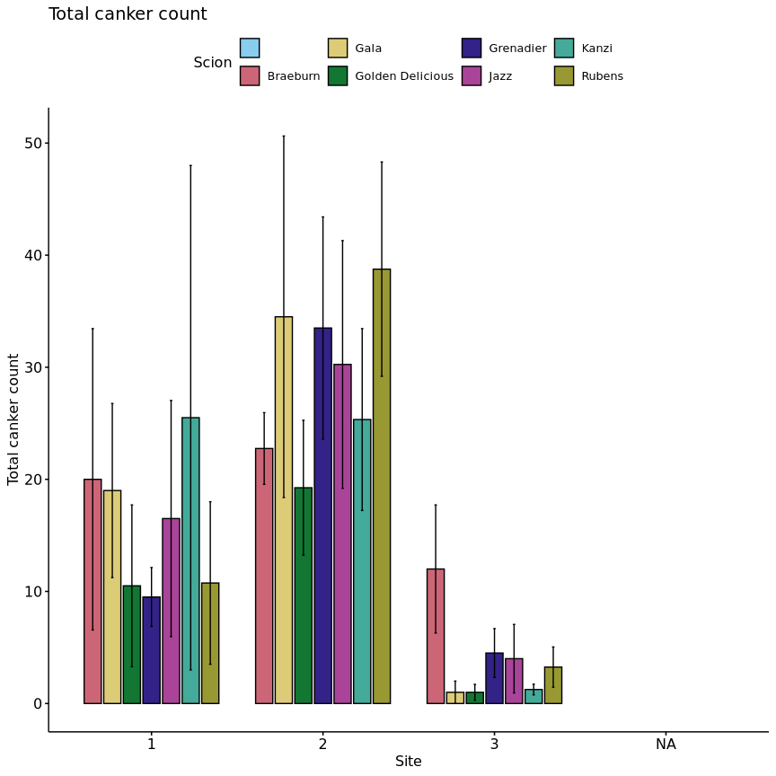
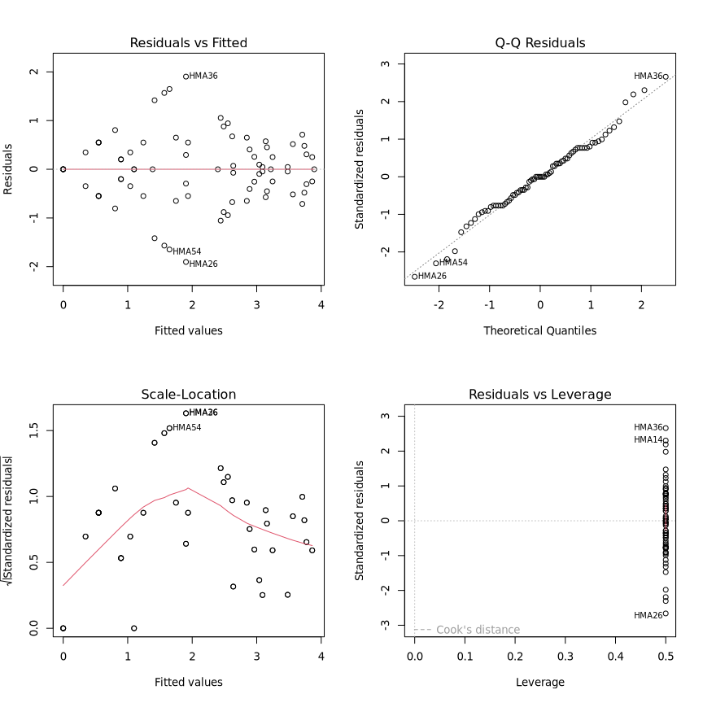
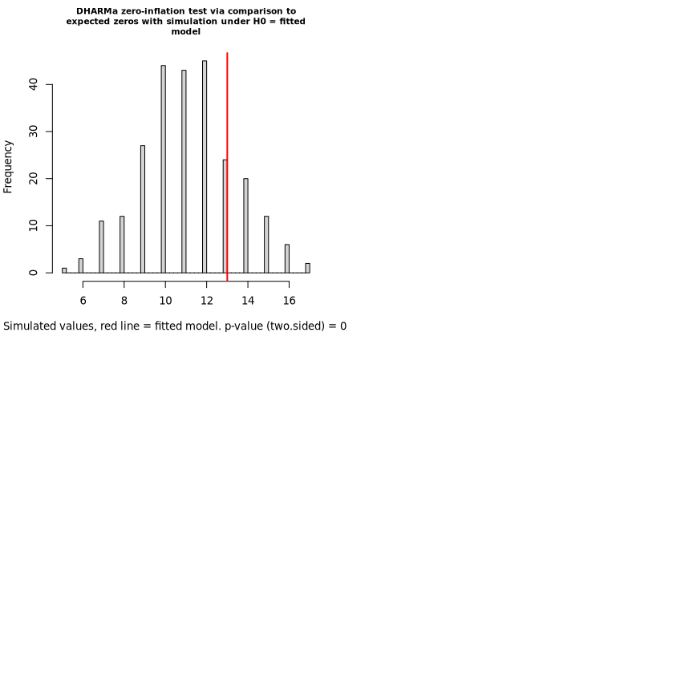
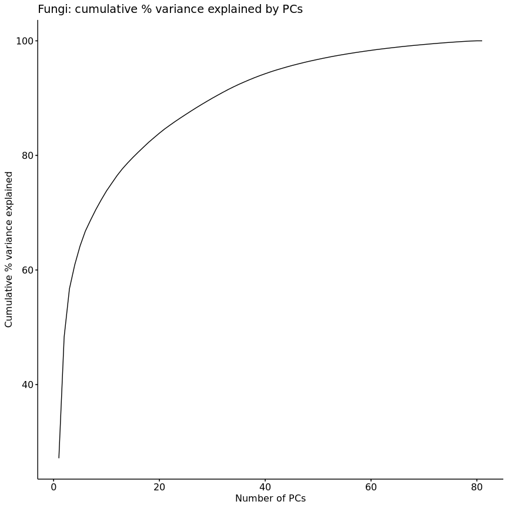
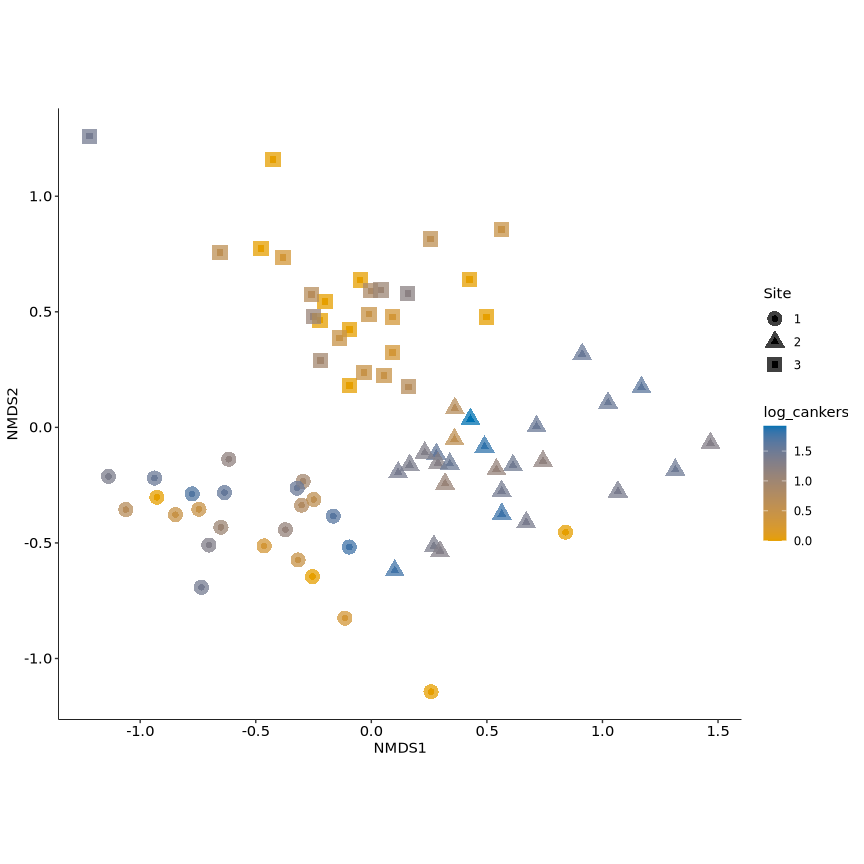
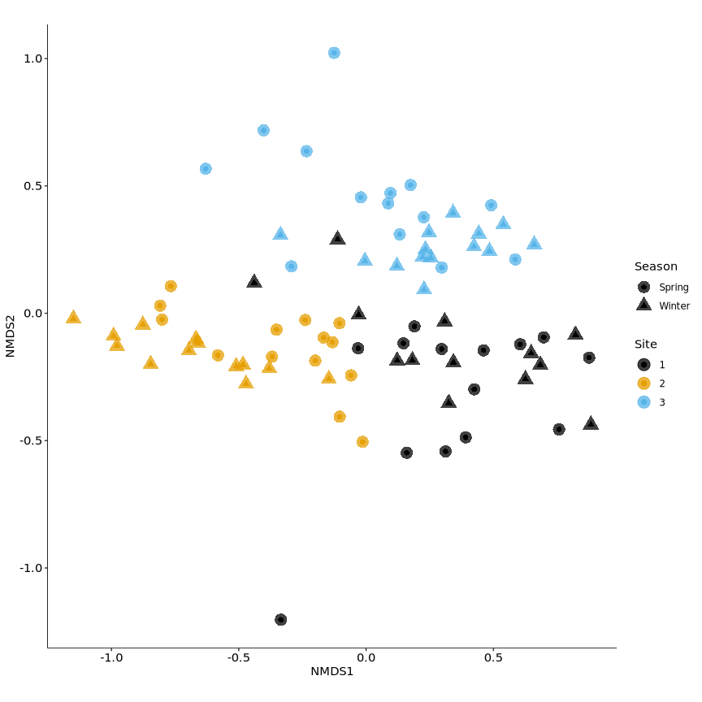
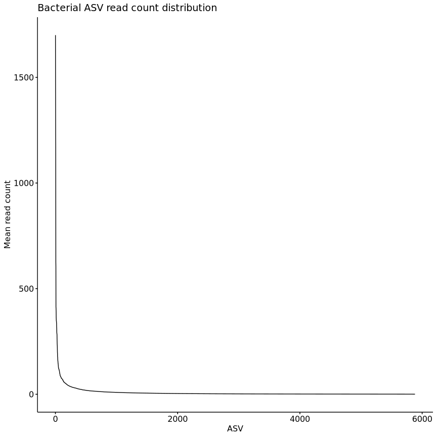
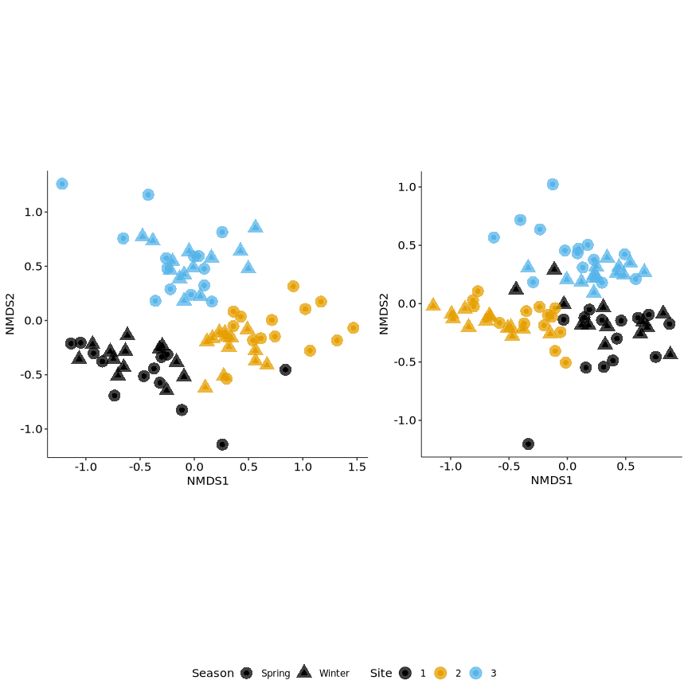

Built with R version  4.3.3.


## Setup

### Libraries


``` r
# library(car)
library(cowplot)
library(data.table)
library(DESeq2)
library(DHARMa)
library(ggpubr)
library(grid)
library(gridExtra)
library(iNEXT)
library(kableExtra)
library(knitr)
library(lmPerm)
library(MASS)
# library(matrixcalc)
library(pscl)
# library(rcompanion)
library(seqinr)
library(tidyverse)
library(vegan)
library(viridis)

# devtools::install_github("eastmallingresearch/Metabarcoding_pipeline/scripts")
library(metafuncs)
```

### Functions and constants


``` r
ALPHA <-        0.1   # DESeq2 alpha value
OTUFILTER <-    0.01  # Remove OTUs with proportion of total reads below value
READFILTER <-   0.05  # Remove samples with read sum < sample_median_reads*READFILTER 
PAIREDONLY <-   FALSE # Will remove the pair of samples which fail the readfilter - probably only useful for DESeq separated by type NOTE removes pairs before DESeq object is created   
TAXCONF <-      0.80  # Sets the taxonomy confidence level to get "rank" in taxonomy files
TOPOTU <-       10    # Number of Top OTUs for summary information
DIFFOTU <-      200   # Number of Top OTUs for correlation analysis
FUNASVFILTER <- 0 # 0.05  # Filter fungal ASVs with proportion of total reads below value
BACASVFILTER <- 0 # 0.5   # Filter bacterial ASVs with proportion of total reads below value

# graphics
DEVICE <- "png"
DPI <-    1200
WIDTH <-  9
HEIGHT <- 9

# Model design
FACTORS <-            c("Site", "Storage", "Scion")
DESIGN <-             y ~ Site + Storage + Scion
FULL_DESIGN <-        y ~ Site * Storage * Scion
design_with_canker <- y ~ Site + Storage + Scion + Cankers + Site:Storage + Site:Scion + Storage:Scion + Cankers:Site + Cankers:Storage + Cankers:Scion
canker_design <-      "Cankers ~ Site * Storage * Scion"

# Control
ASV_FACTOR <- FALSE # Toggle for ASV ~ factor models
ASV_CANKER <- FALSE  # Toggle for ASV ~ Canker linear models
CANKER_ASV <- FALSE # Toggle for Canker ~ ASV nested models
```


``` r
# colour blind palette
cbPalette <- c(
  "#000000", "#E69F00", "#56B4E9", "#009E73", 
  "#F0E442", "#0072B2", "#D55E00", "#CC79A7"
)

source("functions/metabarcoding.R")
source("functions/loadme.R")
source("functions/rarefaction.R")
```

## Load data

Bacterial and fungal ASV (ZOTU) tables, sample metadata, and taxonomy files are
loaded into named lists using the `loadData` function from Greg's `metafuncs` 
package.

Site names are encoded as follows according to previous work:

- Avalon (East Sutton) -> 1
- Scripps (Brenchley) -> 2
- WWF (Pluckley) -> 3


``` r
metadata <- "sample_metadata.txt"

# Load data
ubiome_FUN <- loadData(
  "data/FUN.zotu_table.txt", metadata,
  "data/zFUN.sintax.taxa", RHB="FUN"
)

ubiome_BAC <- loadData(
  "data/BAC.zotu_table.txt", metadata,
  "data/zBAC.sintax.taxa", RHB="BAC"
)

# Change sites Avalon -> 1, Scripps -> 2, and WWF -> 3.
# Storage from planting date.
# No storage for December plantings, yes for March and April (4 months).
mutate_factors <- function(data){
  data <- data %>%
    rename(location = site, Scion = cultivar) %>%
    mutate(
      Site = case_when(
        location == "Avalon" ~ 1,
        location == "Scripps" ~ 2,
        location == "WWF" ~ 3
      ) %>% as.factor(),
      Storage = case_when(
        planting_date %in% c("march", "april") ~ "yes",
        planting_date %in% c("dec") ~ "no"
      ) %>% as.factor(),
      Scion = as.factor(Scion)
    )
  return(data)
}

ubiome_FUN$colData <- mutate_factors(ubiome_FUN$colData)
ubiome_BAC$colData <- mutate_factors(ubiome_BAC$colData)

# In taxData and countData replace 'OTU' with 'ASV'
rownames(ubiome_FUN$taxData) <- gsub("OTU", "ASV", rownames(ubiome_FUN$taxData))
rownames(ubiome_BAC$taxData) <- gsub("OTU", "ASV", rownames(ubiome_BAC$taxData))

rownames(ubiome_FUN$countData) <- gsub("OTU", "ASV", rownames(ubiome_FUN$countData))
rownames(ubiome_BAC$countData) <- gsub("OTU", "ASV", rownames(ubiome_BAC$countData))
```

### Global removals


``` r
# Sample "A2-7" removed due to missampling.
ubiome_BAC$colData <- ubiome_BAC$colData[!rownames(ubiome_BAC$colData) %in% "HMA27", ]
ubiome_BAC$countData <- ubiome_BAC$countData[, !colnames(ubiome_BAC$countData) %in% "HMA27"]
ubiome_FUN$colData <- ubiome_FUN$colData[!rownames(ubiome_FUN$colData) %in% "HMA27", ]
ubiome_FUN$countData <- ubiome_FUN$countData[, !colnames(ubiome_FUN$countData) %in% "HMA27"]
```

## Filter samples and ASVs

### Filtering taxa

Plantae taxa are filtered from fungal `taxData`.
Chloroplast and Eukaryote  taxa are filtered from bacterial `taxData`.
Corresponding ASVs are removed from `countData`.


``` r
# Filter Plant, Chloroplast, and Eukaryote ASVs

# Fungi: Plantae ASVs
cat("Fungi:", length(grep("Plantae", ubiome_FUN$taxData$kingdom)), "Plantae ASVs\n")
```

```
# Fungi: 0 Plantae ASVs
```

``` r
# Bacteria: Chloroplast (Streptophyta) and Eukaryote ASVs
cat(
  "Bacteria:", length(grep("Streptophyta", ubiome_BAC$taxData$genus)), "Chloroplast ASVs;", 
  length(grep("Eukaryota", ubiome_BAC$taxData$kingdom)), "Eukaryote ASVs\n"
)
```

```
# Bacteria: 37 Chloroplast ASVs; 188 Eukaryote ASVs
```

``` r
# Filter Chloroplast and Eukaryote
filt <- rownames(
  ubiome_BAC$taxData[
    grepl("Streptophyta", ubiome_BAC$taxData$genus) & 
    as.numeric(ubiome_BAC$taxData$g_conf) >= TAXCONF,
  ]
)

filt <- c(filt, rownames(ubiome_BAC$taxData[grep("Eukaryota", ubiome_BAC$taxData$kingdom), ]))

cat("Bacteria: removing", length(filt), "ASVs")
```

```
# Bacteria: removing 198 ASVs
```

``` r
ubiome_BAC$taxData <- ubiome_BAC$taxData[!rownames(ubiome_BAC$taxData) %in% filt, ]
ubiome_BAC$countData <- ubiome_BAC$countData[!rownames(ubiome_BAC$countData) %in% filt, ]
```

### Filtering samples

Plot rarefaction curves.

Remove samples with read count below 5 % of median.


``` r
invisible(mapply(assign, names(ubiome_BAC), ubiome_BAC, MoreArgs = list(envir = globalenv())))
rare_bac <- gfunc(countData, colData, "Bacteria")
# rare_bac <- gfunc(as.data.frame(counts(dds)), as.data.frame(colData(dds)), "Bacteria ZOTU")
invisible(mapply(assign, names(ubiome_FUN), ubiome_FUN, MoreArgs = list(envir = globalenv())))
rare_fun <- gfunc(countData, colData, "Fungi")
# rare_fun <- gfunc(as.data.frame(counts(dds)), as.data.frame(colData(dds)), "Fungi ZOTU")

rarefaction_plots <- grid.arrange(
  rare_bac, rare_fun,
  left = textGrob(label = expression("log"[10] * " aligned sequences"), rot = 90),
  bottom = "ASV count", nrow = 2
)

ggsave(filename = "rarefaction_plots.png", plot = rarefaction_plots, path = "figures/")

rarefaction_plots

# Fungi
med <- median(colSums(ubiome_FUN$countData))
filt <- !colSums(ubiome_FUN$countData) > med * READFILTER
cat("Fungi: ",sum(filt),"sample(s) removed\n")

# Bacteria
med <- median(colSums(ubiome_BAC$countData))
filt <- !colSums(ubiome_BAC$countData) > med * READFILTER
cat("Bacteria: ",sum(filt),"sample(s) removed\n")
```

### Filter ASVs

#### ASV read count

Number of ASVs which account for 50 %, 80 %, and 99 % of total reads.


``` r
asv_propotions <- function(countData, proportion){
  i <- sum(countData)
  y <- rowSums(countData)
  y <- y[order(y, decreasing = T)]
  asvs <- length(y[(cumsum(y) / i <= proportion)])
  return(asvs)
}

proportions <- c(0.5, 0.9, 0.99, 1)

top_asvs <- data.table(
  "proportion" = proportions,
  "Fungi" = lapply(proportions, function(x) asv_propotions(ubiome_FUN$countData, x)),
  "Bacteria" = lapply(proportions, function(x) asv_propotions(ubiome_BAC$countData, x))
)

top_asvs %>%
  kbl() %>%
  kable_styling("striped", full_width = F)
```

<table class="table table-striped" style="width: auto !important; margin-left: auto; margin-right: auto;">
 <thead>
  <tr>
   <th style="text-align:right;"> proportion </th>
   <th style="text-align:left;"> Fungi </th>
   <th style="text-align:left;"> Bacteria </th>
  </tr>
 </thead>
<tbody>
  <tr>
   <td style="text-align:right;"> 0.50 </td>
   <td style="text-align:left;"> 10 </td>
   <td style="text-align:left;"> 169 </td>
  </tr>
  <tr>
   <td style="text-align:right;"> 0.90 </td>
   <td style="text-align:left;"> 171 </td>
   <td style="text-align:left;"> 2186 </td>
  </tr>
  <tr>
   <td style="text-align:right;"> 0.99 </td>
   <td style="text-align:left;"> 995 </td>
   <td style="text-align:left;"> 5883 </td>
  </tr>
  <tr>
   <td style="text-align:right;"> 1.00 </td>
   <td style="text-align:left;"> 2401 </td>
   <td style="text-align:left;"> 7265 </td>
  </tr>
</tbody>
</table>

#### Filter ASVs

Remove ASVs with read count below 1 % of total reads.


``` r
# Fungi
keep <- filter_otus(ubiome_FUN$countData, OTUFILTER)
cat(
  "Fungi:\n", 
  " - total ASVs:", nrow(ubiome_FUN$countData), "\n",
  " - removing", nrow(ubiome_FUN$countData) - length(keep), "ASVs\n",
  " - remaining ASVs:", length(keep), "\n"
)
```

```
# Fungi:
#   - total ASVs: 2401 
#   - removing 1406 ASVs
#   - remaining ASVs: 995
```

``` r
ubiome_FUN$taxData <- ubiome_FUN$taxData[rownames(ubiome_FUN$taxData) %in% keep,]
ubiome_FUN$countData <- ubiome_FUN$countData[rownames(ubiome_FUN$countData) %in% keep,]

# Bacteria
keep <-  filter_otus(ubiome_BAC$countData, OTUFILTER)
cat(
  "Bacteria:\n",
  " - total ASVs:", nrow(ubiome_BAC$countData), "\n",
  " - removing", nrow(ubiome_BAC$countData) - length(keep), "ASVs\n",
  " - remaining ASVs:", length(keep), "\n"
)
```

```
# Bacteria:
#   - total ASVs: 7265 
#   - removing 1382 ASVs
#   - remaining ASVs: 5883
```

``` r
ubiome_BAC$taxData <- ubiome_BAC$taxData[rownames(ubiome_BAC$taxData) %in% keep,]
ubiome_BAC$countData <- ubiome_BAC$countData[rownames(ubiome_BAC$countData) %in% keep,]
```

## Absolute abundance normalisation

ASV normalisation is performed using qPCR theoretical copy number data.
Copy number is calculated per mg of root sample from the qPCR data.

### Prepare qPCR abundance data


``` r
abundance <- fread("mean_abundance.csv")

# Add sample ID to abundance data
abundance$id <- paste0("HM", gsub("-", "", abundance$Sample))
# abundance$id <- abundance$Sample
abundance$copy_number <- abundance$MeanAdjustedTCN_mg
abundance$log_copy_number <- log10(abundance$copy_number)

# Add bacterial (16S) and fungal (ITS) abundance to ubiome BAC and FUN named lists
ubiome_FUN$abundance <- abundance[abundance$Target == "ITS"] %>%
  column_to_rownames(var = "id")
ubiome_BAC$abundance <- abundance[abundance$Target == "16S"] %>%
  column_to_rownames(var = "id")

# Merge copy number from abundance with colData
ubiome_FUN$colData <- merge(
  ubiome_FUN$colData, 
  ubiome_FUN$abundance[, c("Target", "copy_number", "log_copy_number")], 
  by = "row.names", all.x = TRUE
) %>% column_to_rownames(var = "Row.names")

ubiome_BAC$colData <- merge(
  ubiome_BAC$colData, 
  ubiome_BAC$abundance[, c("Target", "copy_number", "log_copy_number")], 
  by = "row.names", all.x = TRUE
) %>% column_to_rownames(var = "Row.names")
```

#### Remove outliers

``` r
# Detect outliers with std > threshold from the median
detect_outliers <- function(x, val, threshold, na.rm = TRUE) {
  med_x <- median(x[[val]], na.rm = na.rm)
  sd_x <- sd(x[[val]], na.rm = na.rm)
  outliers <- x[x[[val]] > (med_x + threshold * sd_x) | x[[val]] < (med_x - threshold * sd_x), ]
  return(outliers)
}

outliers_FUN <- detect_outliers(ubiome_FUN$abundance, "MeanAdjustedTCN_mg", 3)
outliers_BAC <- detect_outliers(ubiome_BAC$abundance, "MeanAdjustedTCN_mg", 3)

# Remove samples with copy number > 3 std from the median
outliers <- rownames(outliers_FUN)
ubiome_FUN$abundance <- ubiome_FUN$abundance[!rownames(ubiome_FUN$abundance) %in% outliers, ]
ubiome_FUN$countData <- ubiome_FUN$countData[, !colnames(ubiome_FUN$countData) %in% outliers]
ubiome_FUN$colData <- ubiome_FUN$colData[!rownames(ubiome_FUN$colData) %in% outliers, ]

cat("Fungi: removing", length(outliers), "outlier(s)\n")
```

```
# Fungi: removing 1 outlier(s)
```

Sample A1-3 is removed from the fungal data due to abnormally high copy number.

## Canker count data

Canker count data for sampled trees only.


``` r
# Canker count data for sampled trees only

canker_data <- fread("canker_data.csv", select = c(1:5, 7:34))

# Remove spaces from column names and convert to lowercase
colnames(canker_data) <- tolower(gsub(" ", "_", colnames(canker_data)))

# Codify site names, add storage and total canker count for timepoint 4
canker_data <- mutate(
  canker_data,
  Site = case_when(
    site == "Avalon" ~ 1,
    site == "Scripps" ~ 2,
    site == "WWF" ~ 3
  ) %>% as.factor(),
  Storage = case_when(
    planting_date %in% c("March", "April") ~ "yes",
    planting_date %in% c("Dec") ~ "no"
  ),
  Scion = as.factor(cultivar),
  total_cankers = a4 + b4 + c4 + d4 + e4
)

# Identify samples with missing values
missing <- unique(canker_data[!complete.cases(canker_data), code])

# Also remove sample A2-7 due to missampling
missing <- c(missing, "HMA27")

# Remove missing samples from canker data
# canker_data <- canker_data[!canker_data$code %in% missing, ]
canker_data <- canker_data[!canker_data$code %in% "HMA27", ]

# Verify that there are two trees for each sample
canker_data %>% group_by(code) %>% summarise(n = n()) %>% filter(n != 2)
```

```
# # A tibble: 0 × 2
# # ℹ 2 variables: code <chr>, n <int>
```

``` r
# Sum of total cankers for each pair of trees with matching code
cankers <- canker_data %>% 
  group_by(code) %>% 
  summarise(
    Site = first(Site),
    Storage = first(Storage),
    Scion = first(Scion),
    Cankers_sum = sum(total_cankers),
    Cankers = round(mean(total_cankers, na.rm = TRUE))
  ) %>% 
  column_to_rownames("code")

# Add total canker count to colData for both FUN and BAC
ubiome_FUN$colData <- merge(
  ubiome_FUN$colData, 
  cankers[, c("Cankers", "Cankers_sum")],, 
  by = 0,
  all.x = TRUE
) %>% column_to_rownames("Row.names")

ubiome_BAC$colData <- merge(
  ubiome_BAC$colData, 
  cankers[, c("Cankers", "Cankers_sum")], 
  by = 0,
  all.x = T
) %>% column_to_rownames("Row.names")
```

Summary stats


``` r
# png("figures/hist.png", width = 800, height = 600)
# hist(cankers$Cankers, breaks = 20, main = "Total canker count", xlab = "Total canker count")
# dev.off()

cankers_hist <- ggdensity(
  cankers, x = "Cankers", fill = "Site", facet.by = "Site", ncol = 1,
  add = "mean", rug = T, palette = cbPalette,
  title = "Total canker count", xlab = "Total canker count"
)

cankers_hist
```

<!-- -->

``` r
ggsave(filename = "cankers_hist.png", plot = cankers_hist, path = "figures/")

cankers_box <- ggboxplot(
  cankers, x = "Site", y = "Cankers", palette = cbPalette,
  color = "Scion", add = "jitter", legend = "top", 
  title = "Total canker count", xlab = "Site", ylab = "Total canker count"
)

cankers_box
```

<!-- -->

``` r
ggsave(filename = "cankers_box.png", plot = cankers_box, path = "figures/")

cankers_bar <- ggbarplot(
  cankers, x = "Site", y = "Cankers", fill = "Scion", 
  palette = cbPalette, add = "mean_se", position = position_dodge(0.8),
  title = "Total canker count", xlab = "Site", ylab = "Total canker count"
)

cankers_bar
```

<!-- -->

``` r
ggsave(filename = "cankers_bar.png", plot = cankers_bar, path = "figures/")
```

GLM


``` r
# Effect of Site, Scion, and Storage on canker count

# Formula
formula <- update(FULL_DESIGN, Cankers ~ .)
# formula <- Cankers ~ Site + Storage + Scion + site:Storage + site:Scion + Storage:Scion

# Log-linear model
canker_lm <- lm(update(FULL_DESIGN, log(Cankers + 1) ~ .), data = cankers)

par(mfrow = c(2, 2))
plot(canker_lm)
```

<!-- -->

``` r
# Residual checking
res <- resid(canker_lm, type = "pearson")

# Poisson model
canker_poisson <- glm(formula, data = cankers, family = "poisson")

poisson_plot <- plot(simulateResiduals(canker_poisson), title = "Poisson model")
```

<!-- -->

``` r
# Model overdispersed

# Negative binomial model
canker_negbin <- glm.nb(formula, data = cankers)

sim <- simulateResiduals(canker_negbin)

plot(sim, title = "Negative binomial model")
```

<!-- -->

``` r
# canker_model_plots <- ggarrange(lm_plot, poisson_plot, negbin_plot, ncol = 3)

# ggsave(filename = "canker_model_plots.png", plot = canker_model_plots, path = "figures/")

# png("figures/canker_residuals.png", width = 800, height = 600)
# plot(sim)
# dev.off()

testZeroInflation(sim)
```

```
# 
# 	DHARMa zero-inflation test via comparison to expected zeros with
# 	simulation under H0 = fitted model
# 
# data:  simulationOutput
# ratioObsSim = 1.1632, p-value = 0.512
# alternative hypothesis: two.sided
```

``` r
nagelkerke(canker_negbin)
```

```
# Error in nagelkerke(canker_negbin): could not find function "nagelkerke"
```

``` r
# Model good fit

canker_anova <- anova(canker_negbin, test = "Chisq") %>% data.frame()
total_deviance <- sum(canker_anova$Deviance, na.rm = T) + tail(canker_anova$Resid..Dev, 1)
canker_anova$Perc..Dev <- canker_anova$Deviance / total_deviance * 100

canker_anova
```

```
#                    Df   Deviance Resid..Df Resid..Dev     Pr..Chi.  Perc..Dev
# NULL               NA         NA        79   304.3502           NA         NA
# Site                2 102.641603        77   201.7086 5.148244e-23 33.7248331
# Storage             1   1.585954        76   200.1227 2.079052e-01  0.5210949
# Scion               6  13.206882        70   186.9158 3.986579e-02  4.3393699
# Site:Storage        2  34.419859        68   152.4959 3.356005e-08 11.3092933
# Site:Scion         12  29.660625        56   122.8353 3.140170e-03  9.7455573
# Storage:Scion       6   9.810476        50   113.0248 1.328636e-01  3.2234167
# Site:Storage:Scion 12  25.591616        38    87.4332 1.225523e-02  8.4086077
```

<!-- -->

## Create DESeq objects


``` r
# Make sure countData and colData still match, if they do, create DESeq objects, if not throw error
if(identical(colnames(ubiome_FUN$countData), rownames(ubiome_FUN$colData))) {
  # Create DESeq object
  ubiome_FUN$dds <- ubiom_to_des(ubiome_FUN)
  print("FUN DESeq object created")
} else {
  stop("FUN countData and colData do not match")
}
```

```
# [1] "FUN DESeq object created"
```

``` r
if(identical(colnames(ubiome_BAC$countData), rownames(ubiome_BAC$colData))) {
  # Create DESeq object
  ubiome_BAC$dds <- ubiom_to_des(ubiome_BAC)
  print("BAC DESeq object created")
} else {
  stop("BAC countData and colData do not match")
}
```

```
# [1] "BAC DESeq object created"
```

## Abundance normalisation

Absolute abundance normalisation using DESeq2 size factors.

Values are centred around the mean of the copy number.


``` r
# Normalise count data using DESeq2 size factors

ubiome_FUN$dds$sizeFactor <- ubiome_FUN$dds$copy_number / mean(ubiome_FUN$dds$copy_number)
ubiome_BAC$dds$sizeFactor <- ubiome_BAC$dds$copy_number / mean(ubiome_BAC$dds$copy_number)
```


``` r
# Save environment
save.image("data_loaded.RData")
```

<!-- #=============================================================================== -->
# **Fungi**
<!-- #=============================================================================== -->


``` r
# Unpack fungi data
invisible(mapply(assign, names(ubiome_FUN), ubiome_FUN, MoreArgs = list(envir = globalenv())))
```

## ASV and sample summary

### Read and sample summary


``` r
cat(
  "Raw reads", "\n\n",
  "Total raw reads:\t\t", sum(countData), "\n",
  "Mean raw reads per sample:\t", mean(colSums(countData)), "\n",
  "Median raw reads per sample:\t", median(colSums(countData)), "\n",
  "Max raw reads per sample:\t", max(colSums(countData)), "\n",
  "Min raw reads per sample:\t", min(colSums(countData)), "\n\n"
)
```

```
# Raw reads 
# 
#  Total raw reads:		 7293776 
#  Mean raw reads per sample:	 90046.62 
#  Median raw reads per sample:	 93435 
#  Max raw reads per sample:	 113518 
#  Min raw reads per sample:	 38472
```

``` r
#colSums(countData)

nct <- counts(dds, normalize = T)
cat("Normalised reads", "\n\n",
  "Total normalised reads:\t\t", sum(nct), "\n",
  "Mean normalised reads per sample:\t", mean(colSums(nct)), "\n",
  "Median normalised reads per sample:\t", median(colSums(nct)), "\n",
  "Min normalised reads per sample:\t", min(colSums(nct)), "\n",
  "Max normalised reads per sample:\t", max(colSums(nct)), "\n\n"
)
```

```
# Normalised reads 
# 
#  Total normalised reads:		 12468857 
#  Mean normalised reads per sample:	 153936.5 
#  Median normalised reads per sample:	 98624.28 
#  Min normalised reads per sample:	 28901.7 
#  Max normalised reads per sample:	 881441.3
```

``` r
#round(colSums(counts(dds,normalize = T)),0)
```

### ASV summary 


``` r
cat(
  "Total ASVs:\t\t", nrow(taxData),"\n\n",
  "Raw reads per ASV summary", "\n\n",
  "Mean raw reads per ASV:\t", mean(rowSums(countData)),"\n",
  "Median raw per ASV:\t\t", median(rowSums(countData)),"\n",
  "ASV raw Min reads:\t\t", min(rowSums(countData)),"\n",
  "ASV raw Max reads:\t\t", max(rowSums(countData)),"\n\n"
)
```

```
# Total ASVs:		 995 
# 
#  Raw reads per ASV summary 
# 
#  Mean raw reads per ASV:	 7330.428 
#  Median raw per ASV:		 588 
#  ASV raw Min reads:		 115 
#  ASV raw Max reads:		 714327
```

``` r
cat(
  "Normalised reads per ASV summary","\n\n",
  "Mean normalised reads per ASV:\t\t", mean(rowSums(nct)),"\n",
  "Median normalised reads per ASV:\t", median(rowSums(nct)),"\n",
  "ASV normalised Min reads:\t\t", min(rowSums(nct)),"\n",
  "ASV normalised Max reads:\t\t", max(rowSums(nct)),"\n\n"
)
```

```
# Normalised reads per ASV summary 
# 
#  Mean normalised reads per ASV:		 12531.51 
#  Median normalised reads per ASV:	 1025.725 
#  ASV normalised Min reads:		 101.2814 
#  ASV normalised Max reads:		 1509459
```

``` r
y <- rowSums(nct)
y <- y[order(y, decreasing = T)]
# proportion
xy <- y / sum(y)

cat("Top " ,TOPOTU, "ASVs:\n")
```

```
# Top  10 ASVs:
```

``` r
data.frame(
  counts = y[1:TOPOTU], 
  proportion = xy[1:TOPOTU], 
  rank = taxData[names(y)[1:TOPOTU],]$rank
) %>%
  kbl() %>%
  kable_styling("striped", full_width = F)
```

<table class="table table-striped" style="width: auto !important; margin-left: auto; margin-right: auto;">
 <thead>
  <tr>
   <th style="text-align:left;">   </th>
   <th style="text-align:right;"> counts </th>
   <th style="text-align:right;"> proportion </th>
   <th style="text-align:left;"> rank </th>
  </tr>
 </thead>
<tbody>
  <tr>
   <td style="text-align:left;"> ASV2 </td>
   <td style="text-align:right;"> 1509458.8 </td>
   <td style="text-align:right;"> 0.1210583 </td>
   <td style="text-align:left;"> Ascomycota(p) </td>
  </tr>
  <tr>
   <td style="text-align:left;"> ASV1 </td>
   <td style="text-align:right;"> 1490469.5 </td>
   <td style="text-align:right;"> 0.1195354 </td>
   <td style="text-align:left;"> Dactylonectria macrodidyma(s) </td>
  </tr>
  <tr>
   <td style="text-align:left;"> ASV5 </td>
   <td style="text-align:right;"> 1068164.1 </td>
   <td style="text-align:right;"> 0.0856666 </td>
   <td style="text-align:left;"> Leotiomycetes(c) </td>
  </tr>
  <tr>
   <td style="text-align:left;"> ASV4 </td>
   <td style="text-align:right;"> 1059908.0 </td>
   <td style="text-align:right;"> 0.0850044 </td>
   <td style="text-align:left;"> Ascomycota(p) </td>
  </tr>
  <tr>
   <td style="text-align:left;"> ASV3 </td>
   <td style="text-align:right;"> 480660.1 </td>
   <td style="text-align:right;"> 0.0385488 </td>
   <td style="text-align:left;"> Ilyonectria destructans(s) </td>
  </tr>
  <tr>
   <td style="text-align:left;"> ASV7 </td>
   <td style="text-align:right;"> 290896.6 </td>
   <td style="text-align:right;"> 0.0233299 </td>
   <td style="text-align:left;"> Fusarium(g) </td>
  </tr>
  <tr>
   <td style="text-align:left;"> ASV6 </td>
   <td style="text-align:right;"> 227927.9 </td>
   <td style="text-align:right;"> 0.0182798 </td>
   <td style="text-align:left;"> Ilyonectria robusta(s) </td>
  </tr>
  <tr>
   <td style="text-align:left;"> ASV9 </td>
   <td style="text-align:right;"> 201690.6 </td>
   <td style="text-align:right;"> 0.0161755 </td>
   <td style="text-align:left;"> Ascomycota(p) </td>
  </tr>
  <tr>
   <td style="text-align:left;"> ASV8 </td>
   <td style="text-align:right;"> 191083.5 </td>
   <td style="text-align:right;"> 0.0153249 </td>
   <td style="text-align:left;"> Fusarium(g) </td>
  </tr>
  <tr>
   <td style="text-align:left;"> ASV11 </td>
   <td style="text-align:right;"> 131684.2 </td>
   <td style="text-align:right;"> 0.0105610 </td>
   <td style="text-align:left;"> Truncatella angustata(s) </td>
  </tr>
</tbody>
</table>

## Taxonomy Summary

### Taxonomy identifiable

Proportion of ASVs which can be assigned (with the given confidence) at each taxonomic rank.


``` r
# Proportion of ASVs which can be assigned (with the given confidence) at each taxonomic rank

tx <- copy(taxData)
setDT(tx)
cols <- names(tx)[9:15]

tx[, (cols) := lapply(.SD, as.factor), .SDcols = cols]

data.table(
  rank = c("kingdom", "phylum", "class", "order", "family", "genus", "species"),
  "0.8" = round(unlist(lapply(cols, function(col) sum(as.number(tx[[col]]) >= 0.8) / nrow(tx))), 2),
  "0.65" = round(unlist(lapply(cols, function(col) sum(as.number(tx[[col]]) >= 0.65) / nrow(tx))), 2),
  "0.5" = round(unlist(lapply(cols, function(col) sum(as.number(tx[[col]]) >= 0.5) / nrow(tx))), 2)
) %>%
  kbl() %>%
  kable_styling("striped", full_width = F)
```

<table class="table table-striped" style="width: auto !important; margin-left: auto; margin-right: auto;">
 <thead>
  <tr>
   <th style="text-align:left;"> rank </th>
   <th style="text-align:right;"> 0.8 </th>
   <th style="text-align:right;"> 0.65 </th>
   <th style="text-align:right;"> 0.5 </th>
  </tr>
 </thead>
<tbody>
  <tr>
   <td style="text-align:left;"> kingdom </td>
   <td style="text-align:right;"> 1.00 </td>
   <td style="text-align:right;"> 1.00 </td>
   <td style="text-align:right;"> 1.00 </td>
  </tr>
  <tr>
   <td style="text-align:left;"> phylum </td>
   <td style="text-align:right;"> 0.84 </td>
   <td style="text-align:right;"> 0.87 </td>
   <td style="text-align:right;"> 0.90 </td>
  </tr>
  <tr>
   <td style="text-align:left;"> class </td>
   <td style="text-align:right;"> 0.70 </td>
   <td style="text-align:right;"> 0.74 </td>
   <td style="text-align:right;"> 0.78 </td>
  </tr>
  <tr>
   <td style="text-align:left;"> order </td>
   <td style="text-align:right;"> 0.54 </td>
   <td style="text-align:right;"> 0.60 </td>
   <td style="text-align:right;"> 0.64 </td>
  </tr>
  <tr>
   <td style="text-align:left;"> family </td>
   <td style="text-align:right;"> 0.42 </td>
   <td style="text-align:right;"> 0.45 </td>
   <td style="text-align:right;"> 0.49 </td>
  </tr>
  <tr>
   <td style="text-align:left;"> genus </td>
   <td style="text-align:right;"> 0.38 </td>
   <td style="text-align:right;"> 0.42 </td>
   <td style="text-align:right;"> 0.47 </td>
  </tr>
  <tr>
   <td style="text-align:left;"> species </td>
   <td style="text-align:right;"> 0.24 </td>
   <td style="text-align:right;"> 0.30 </td>
   <td style="text-align:right;"> 0.35 </td>
  </tr>
</tbody>
</table>

% of reads which can be assigned to each taxonomic ranks


``` r
tx <-taxData[rownames(dds),]
nc <- counts(dds, normalize = T)
ac <- sum(nc)

data.table(
  rank = c("kingdom", "phylum", "class", "order", "family", "genus", "species"),
  "0.8" = round(unlist(lapply(cols, function(col)(sum(nc[which(as.numeric(tx[[col]]) >= 0.8),]) / ac * 100))), 2),
  "0.65" = round(unlist(lapply(cols, function(col)(sum(nc[which(as.numeric(tx[[col]]) >= 0.65),]) / ac * 100))), 2),
  "0.5" = round(unlist(lapply(cols, function(col)(sum(nc[which(as.numeric(tx[[col]]) >= 0.5),]) / ac * 100))), 2)
) %>%
  kbl() %>%
  kable_styling("striped", full_width = F)
```

<table class="table table-striped" style="width: auto !important; margin-left: auto; margin-right: auto;">
 <thead>
  <tr>
   <th style="text-align:left;"> rank </th>
   <th style="text-align:right;"> 0.8 </th>
   <th style="text-align:right;"> 0.65 </th>
   <th style="text-align:right;"> 0.5 </th>
  </tr>
 </thead>
<tbody>
  <tr>
   <td style="text-align:left;"> kingdom </td>
   <td style="text-align:right;"> 100.00 </td>
   <td style="text-align:right;"> 100.00 </td>
   <td style="text-align:right;"> 100.00 </td>
  </tr>
  <tr>
   <td style="text-align:left;"> phylum </td>
   <td style="text-align:right;"> 84.14 </td>
   <td style="text-align:right;"> 96.59 </td>
   <td style="text-align:right;"> 96.83 </td>
  </tr>
  <tr>
   <td style="text-align:left;"> class </td>
   <td style="text-align:right;"> 60.12 </td>
   <td style="text-align:right;"> 70.92 </td>
   <td style="text-align:right;"> 71.47 </td>
  </tr>
  <tr>
   <td style="text-align:left;"> order </td>
   <td style="text-align:right;"> 53.49 </td>
   <td style="text-align:right;"> 58.87 </td>
   <td style="text-align:right;"> 68.76 </td>
  </tr>
  <tr>
   <td style="text-align:left;"> family </td>
   <td style="text-align:right;"> 44.97 </td>
   <td style="text-align:right;"> 46.80 </td>
   <td style="text-align:right;"> 50.25 </td>
  </tr>
  <tr>
   <td style="text-align:left;"> genus </td>
   <td style="text-align:right;"> 46.06 </td>
   <td style="text-align:right;"> 48.01 </td>
   <td style="text-align:right;"> 50.72 </td>
  </tr>
  <tr>
   <td style="text-align:left;"> species </td>
   <td style="text-align:right;"> 30.44 </td>
   <td style="text-align:right;"> 36.70 </td>
   <td style="text-align:right;"> 41.62 </td>
  </tr>
</tbody>
</table>

### Taxonomy plots

Plots of proportion of normalised reads assigned to members of phylum and class.


``` r
# First just site
dat <- list(as.data.frame(counts(dds, normalize = T)), taxData, as.data.frame(colData(dds)))

design <- "Site"

# md1 <- getSummedTaxa(dat, conf = TAXCONF, design = design, cutoff = 0.1)
md1 <- getSummedTaxa(dat, conf = TAXCONF, design = design, taxon = "phylum", cutoff = 0.1)

md1[, Site := factor(Site, levels = c(1, 2, 3))]
md1[, taxon := factor(taxon, levels = unique(taxon[order(value, decreasing = T)]))]

removals <- md1[, .(value = mean(value)), by = "taxon"][value < 0.5, taxon]
md1 <- md1[!taxon %in% removals, ]

fun_phylum_site_plot <- plotfun1(md1, x = "taxon", fill = "Site")

ggsave("figures/fun_phylum_site.png", fun_phylum_site_plot, width = 20, height = 15, units = "cm")

fun_phylum_site_plot
```

<!-- -->

``` r
md2 <- getSummedTaxa(dat, conf = TAXCONF, design = design, taxon = "class", cutoff = 0.1)

md2[, Site := factor(Site, levels = c(1, 2, 3))]
md2[, taxon := factor(taxon, levels = unique(taxon[order(value, decreasing = T)]))]

removals <- md2[, .(value = mean(value)), by = "taxon"][value < 0.5, taxon]
md2 <- md2[!taxon %in% removals, ]

fun_class_site_plot <- plotfun1(md2, x = "taxon", fill = "Site")

ggsave("figures/fun_class_site.png", fun_class_site_plot, width = 20, height = 15, units = "cm")

fun_class_site_plot
```

<!-- -->

``` r
# Next site and storage

design <- c("Site", "Storage")

md1 <- getSummedTaxa(dat, conf = TAXCONF, design = design, taxon = "phylum", cutoff = 0.1)

md1[, Site := factor(Site, levels = c(1, 2, 3))]
md1[, Storage := factor(Storage, levels = c("no", "yes"))]
md1[, taxon := factor(taxon, levels = unique(taxon[order(value, decreasing = T)]))]

removals <- md1[, .(value = mean(value)), by = "taxon"][value < 0.5, taxon]
md1 <- md1[!taxon %in% removals, ]

fun_phylum_plot <- plotfun1(md1, x = "taxon", fill = "Site") +
  facet_wrap(~ Storage)

ggsave("figures/fun_phylum.png", fun_phylum_plot, width = 25, height = 15, units = "cm")

md2 <- getSummedTaxa(dat, conf = TAXCONF, design = design, taxon = "class", cutoff = 0.1)

md2[, Site := factor(Site, levels = c(1, 2, 3))]
md2[, Storage := factor(Storage, levels = c("no", "yes"))]
md2[, taxon := factor(taxon, levels = unique(taxon[order(value, decreasing = T)]))]

removals <- md2[, .(value = mean(value)), by = "taxon"][value < 0.5, taxon]
md2 <- md2[!taxon %in% removals, ]

fun_class_plot <- plotfun1(md2, x = "taxon", fill = "Site") +
  facet_wrap(~ Storage)

ggsave("figures/fun_class.png", fun_class_plot, width = 25, height = 15, units = "cm")
```

## Community size

Plot copy number for each sample grouped by site, Scion, and Storage.
Test the effect of site, Scion, and Storage on copy number using ANOVA.


``` r
# abundance_plot <- ggplot(
#   data = as.data.frame(colData(dds)), 
#   aes(x = site, y = log_copy_number, colour = Scion, shape = Storage)
# ) + geom_jitter() + 
#   scale_colour_manual(values = cbPalette)

fun_abundance_box <- ggboxplot(
  data = as.data.frame(colData(dds)), x = "Site", y = "log_copy_number", 
  color = "Scion", add = "jitter", legend = "top", 
  title = "Fungal abundance", xlab = "Site", ylab = "log10 copy number"
)

ggsave(
  filename = "fun_abundance.png", plot = fun_abundance_box, path = "figures/", 
  height = 20, width = 20, units = "cm"
)

fun_abundance_box
```

<!-- -->

``` r
fun_abundance_bar <- ggbarplot(
  data = as.data.frame(colData(dds)), x = "Storage", y = "log_copy_number", 
  fill = "Site", add = "mean_se", 
  palette = cbPalette, position = position_dodge(0.8),
  title = "(a) Fungal abundance", xlab = "Storage ", ylab = "Mean copy number (log10)"
) + guides(fill = guide_legend(title = "Site"))

ggsave(
  filename = "fun_abundance_bar.png", plot = fun_abundance_bar, path = "figures/", 
  height = 20, width = 20, units = "cm"
)

fun_abundance_bar
```

<!-- -->

``` r
# Formula for ANOVA
formula <- update(FULL_DESIGN, log_copy_number ~ .)

abundance_anova <- aov(formula, data = as.data.frame(colData(dds)))

# Normality check
par(mfrow = c(2, 2))
plot(abundance_anova)
```

<!-- -->

``` r
png("figures/fun_abundance_norm.png", width = 800, height = 600)
par(mfrow = c(2, 2))
plot(abundance_anova)
dev.off()
```

```
# png 
#   2
```

``` r
# Results
summary(abundance_anova)
```

```
#                    Df Sum Sq Mean Sq F value Pr(>F)  
# Site                2  0.861  0.4306   4.663 0.0153 *
# Storage             1  0.501  0.5012   5.427 0.0251 *
# Scion               6  0.477  0.0795   0.860 0.5324  
# Site:Storage        2  0.683  0.3415   3.698 0.0338 *
# Site:Scion         12  1.203  0.1003   1.086 0.3981  
# Storage:Scion       6  0.458  0.0763   0.827 0.5564  
# Site:Storage:Scion 12  0.918  0.0765   0.828 0.6214  
# Residuals          39  3.602  0.0924                 
# ---
# Signif. codes:  0 '***' 0.001 '**' 0.01 '*' 0.05 '.' 0.1 ' ' 1
```

``` r
abundance_results <- abundance_anova %>% summary() %>% unclass() %>% data.frame()
total_variance <- sum(abundance_results$Sum.Sq)
abundance_results$Perc.Var <- abundance_results$Sum.Sq / total_variance * 100

abundance_results %>%
  kbl() %>%
  kable_styling("striped", full_width = F)
```

<table class="table table-striped" style="width: auto !important; margin-left: auto; margin-right: auto;">
 <thead>
  <tr>
   <th style="text-align:left;">   </th>
   <th style="text-align:right;"> Df </th>
   <th style="text-align:right;"> Sum.Sq </th>
   <th style="text-align:right;"> Mean.Sq </th>
   <th style="text-align:right;"> F.value </th>
   <th style="text-align:right;"> Pr..F. </th>
   <th style="text-align:right;"> Perc.Var </th>
  </tr>
 </thead>
<tbody>
  <tr>
   <td style="text-align:left;"> Site </td>
   <td style="text-align:right;"> 2 </td>
   <td style="text-align:right;"> 0.8612429 </td>
   <td style="text-align:right;"> 0.4306214 </td>
   <td style="text-align:right;"> 4.6626824 </td>
   <td style="text-align:right;"> 0.0152878 </td>
   <td style="text-align:right;"> 9.895484 </td>
  </tr>
  <tr>
   <td style="text-align:left;"> Storage </td>
   <td style="text-align:right;"> 1 </td>
   <td style="text-align:right;"> 0.5012156 </td>
   <td style="text-align:right;"> 0.5012156 </td>
   <td style="text-align:right;"> 5.4270616 </td>
   <td style="text-align:right;"> 0.0250969 </td>
   <td style="text-align:right;"> 5.758852 </td>
  </tr>
  <tr>
   <td style="text-align:left;"> Scion </td>
   <td style="text-align:right;"> 6 </td>
   <td style="text-align:right;"> 0.4767020 </td>
   <td style="text-align:right;"> 0.0794503 </td>
   <td style="text-align:right;"> 0.8602723 </td>
   <td style="text-align:right;"> 0.5323908 </td>
   <td style="text-align:right;"> 5.477197 </td>
  </tr>
  <tr>
   <td style="text-align:left;"> Site:Storage </td>
   <td style="text-align:right;"> 2 </td>
   <td style="text-align:right;"> 0.6830842 </td>
   <td style="text-align:right;"> 0.3415421 </td>
   <td style="text-align:right;"> 3.6981494 </td>
   <td style="text-align:right;"> 0.0338326 </td>
   <td style="text-align:right;"> 7.848482 </td>
  </tr>
  <tr>
   <td style="text-align:left;"> Site:Scion </td>
   <td style="text-align:right;"> 12 </td>
   <td style="text-align:right;"> 1.2031665 </td>
   <td style="text-align:right;"> 0.1002639 </td>
   <td style="text-align:right;"> 1.0856371 </td>
   <td style="text-align:right;"> 0.3981291 </td>
   <td style="text-align:right;"> 13.824108 </td>
  </tr>
  <tr>
   <td style="text-align:left;"> Storage:Scion </td>
   <td style="text-align:right;"> 6 </td>
   <td style="text-align:right;"> 0.4580790 </td>
   <td style="text-align:right;"> 0.0763465 </td>
   <td style="text-align:right;"> 0.8266645 </td>
   <td style="text-align:right;"> 0.5564216 </td>
   <td style="text-align:right;"> 5.263223 </td>
  </tr>
  <tr>
   <td style="text-align:left;"> Site:Storage:Scion </td>
   <td style="text-align:right;"> 12 </td>
   <td style="text-align:right;"> 0.9180631 </td>
   <td style="text-align:right;"> 0.0765053 </td>
   <td style="text-align:right;"> 0.8283835 </td>
   <td style="text-align:right;"> 0.6213710 </td>
   <td style="text-align:right;"> 10.548335 </td>
  </tr>
  <tr>
   <td style="text-align:left;"> Residuals </td>
   <td style="text-align:right;"> 39 </td>
   <td style="text-align:right;"> 3.6018401 </td>
   <td style="text-align:right;"> 0.0923549 </td>
   <td style="text-align:right;"> NA </td>
   <td style="text-align:right;"> NA </td>
   <td style="text-align:right;"> 41.384319 </td>
  </tr>
</tbody>
</table>

### Communtiy size with canker count


``` r
cat("Model formula: ", deparse(update(design_with_canker, log_copy_number ~ .)), "\n")
```

```
# Model formula:  log_copy_number ~ Site + Storage + Scion + Cankers + Site:Storage +      Site:Scion + Storage:Scion + Site:Cankers + Storage:Cankers +      Scion:Cankers
```

``` r
abundance_canker_anova <- aov(update(design_with_canker, log_copy_number ~ .), data = as.data.frame(colData(dds)))
summary(abundance_canker_anova)
```

```
#                 Df Sum Sq Mean Sq F value Pr(>F)  
# Site             2  0.780  0.3898   3.826 0.0304 *
# Storage          1  0.575  0.5749   5.644 0.0225 *
# Scion            6  0.581  0.0968   0.950 0.4714  
# Cankers          1  0.050  0.0499   0.490 0.4882  
# Site:Storage     2  0.613  0.3067   3.011 0.0608 .
# Site:Scion      12  1.002  0.0835   0.819 0.6297  
# Storage:Scion    6  0.417  0.0695   0.682 0.6649  
# Site:Cankers     2  0.187  0.0936   0.919 0.4075  
# Storage:Cankers  1  0.010  0.0097   0.095 0.7593  
# Scion:Cankers    6  0.321  0.0535   0.525 0.7858  
# Residuals       39  3.973  0.1019                 
# ---
# Signif. codes:  0 '***' 0.001 '**' 0.01 '*' 0.05 '.' 0.1 ' ' 1
# 2 observations deleted due to missingness
```

``` r
abundance_canker_results <- abundance_canker_anova %>% summary() %>% unclass() %>% data.frame()
total_variance <- sum(abundance_canker_results$Sum.Sq)
abundance_canker_results$Perc.Var <- abundance_canker_results$Sum.Sq / total_variance * 100
abundance_canker_results %>%
  kbl() %>%
  kable_styling("striped", full_width = F)
```

<table class="table table-striped" style="width: auto !important; margin-left: auto; margin-right: auto;">
 <thead>
  <tr>
   <th style="text-align:left;">   </th>
   <th style="text-align:right;"> Df </th>
   <th style="text-align:right;"> Sum.Sq </th>
   <th style="text-align:right;"> Mean.Sq </th>
   <th style="text-align:right;"> F.value </th>
   <th style="text-align:right;"> Pr..F. </th>
   <th style="text-align:right;"> Perc.Var </th>
  </tr>
 </thead>
<tbody>
  <tr>
   <td style="text-align:left;"> Site </td>
   <td style="text-align:right;"> 2 </td>
   <td style="text-align:right;"> 0.7796132 </td>
   <td style="text-align:right;"> 0.3898066 </td>
   <td style="text-align:right;"> 3.8264193 </td>
   <td style="text-align:right;"> 0.0303835 </td>
   <td style="text-align:right;"> 9.1633108 </td>
  </tr>
  <tr>
   <td style="text-align:left;"> Storage </td>
   <td style="text-align:right;"> 1 </td>
   <td style="text-align:right;"> 0.5749285 </td>
   <td style="text-align:right;"> 0.5749285 </td>
   <td style="text-align:right;"> 5.6436127 </td>
   <td style="text-align:right;"> 0.0225290 </td>
   <td style="text-align:right;"> 6.7575159 </td>
  </tr>
  <tr>
   <td style="text-align:left;"> Scion </td>
   <td style="text-align:right;"> 6 </td>
   <td style="text-align:right;"> 0.5805056 </td>
   <td style="text-align:right;"> 0.0967509 </td>
   <td style="text-align:right;"> 0.9497265 </td>
   <td style="text-align:right;"> 0.4713815 </td>
   <td style="text-align:right;"> 6.8230675 </td>
  </tr>
  <tr>
   <td style="text-align:left;"> Cankers </td>
   <td style="text-align:right;"> 1 </td>
   <td style="text-align:right;"> 0.0499015 </td>
   <td style="text-align:right;"> 0.0499015 </td>
   <td style="text-align:right;"> 0.4898427 </td>
   <td style="text-align:right;"> 0.4881516 </td>
   <td style="text-align:right;"> 0.5865249 </td>
  </tr>
  <tr>
   <td style="text-align:left;"> Site:Storage </td>
   <td style="text-align:right;"> 2 </td>
   <td style="text-align:right;"> 0.6134679 </td>
   <td style="text-align:right;"> 0.3067340 </td>
   <td style="text-align:right;"> 3.0109620 </td>
   <td style="text-align:right;"> 0.0608122 </td>
   <td style="text-align:right;"> 7.2104959 </td>
  </tr>
  <tr>
   <td style="text-align:left;"> Site:Scion </td>
   <td style="text-align:right;"> 12 </td>
   <td style="text-align:right;"> 1.0017806 </td>
   <td style="text-align:right;"> 0.0834817 </td>
   <td style="text-align:right;"> 0.8194732 </td>
   <td style="text-align:right;"> 0.6297497 </td>
   <td style="text-align:right;"> 11.7745925 </td>
  </tr>
  <tr>
   <td style="text-align:left;"> Storage:Scion </td>
   <td style="text-align:right;"> 6 </td>
   <td style="text-align:right;"> 0.4169670 </td>
   <td style="text-align:right;"> 0.0694945 </td>
   <td style="text-align:right;"> 0.6821718 </td>
   <td style="text-align:right;"> 0.6649206 </td>
   <td style="text-align:right;"> 4.9008893 </td>
  </tr>
  <tr>
   <td style="text-align:left;"> Site:Cankers </td>
   <td style="text-align:right;"> 2 </td>
   <td style="text-align:right;"> 0.1871726 </td>
   <td style="text-align:right;"> 0.0935863 </td>
   <td style="text-align:right;"> 0.9186619 </td>
   <td style="text-align:right;"> 0.4075144 </td>
   <td style="text-align:right;"> 2.1999640 </td>
  </tr>
  <tr>
   <td style="text-align:left;"> Storage:Cankers </td>
   <td style="text-align:right;"> 1 </td>
   <td style="text-align:right;"> 0.0096995 </td>
   <td style="text-align:right;"> 0.0096995 </td>
   <td style="text-align:right;"> 0.0952120 </td>
   <td style="text-align:right;"> 0.7592951 </td>
   <td style="text-align:right;"> 0.1140044 </td>
  </tr>
  <tr>
   <td style="text-align:left;"> Scion:Cankers </td>
   <td style="text-align:right;"> 6 </td>
   <td style="text-align:right;"> 0.3209250 </td>
   <td style="text-align:right;"> 0.0534875 </td>
   <td style="text-align:right;"> 0.5250439 </td>
   <td style="text-align:right;"> 0.7857697 </td>
   <td style="text-align:right;"> 3.7720440 </td>
  </tr>
  <tr>
   <td style="text-align:left;"> Residuals </td>
   <td style="text-align:right;"> 39 </td>
   <td style="text-align:right;"> 3.9730243 </td>
   <td style="text-align:right;"> 0.1018724 </td>
   <td style="text-align:right;"> NA </td>
   <td style="text-align:right;"> NA </td>
   <td style="text-align:right;"> 46.6975908 </td>
  </tr>
</tbody>
</table>

## Alpha diversity analysis

### Alpha diversity plot


``` r
# plot alpha diversity - plot_alpha will convert normalised abundances to integer values

fun_alpha_plot <- plot_alpha(
  counts(dds, normalize = F), colData(dds),
  design = "Scion", colour = "Site",
  measures = c("Shannon", "Simpson"),
  type = "bar"
) + scale_colour_manual(values = cbPalette) + 
  theme(axis.title.x = element_blank()) +
  ggtitle("Fungal α-diversity")

ggsave(
  filename = "fun_alpha.png", plot = fun_alpha_plot, path = "figures/", 
  height = 20, width = 40, units = "cm"
)
```

```
# Error in `geom_errorbar()`:
# ! Problem while computing aesthetics.
# ℹ Error occurred in the 2nd layer.
# Caused by error:
# ! object 'se' not found
```

``` r
fun_alpha_plot
```

```
# Error in `geom_errorbar()`:
# ! Problem while computing aesthetics.
# ℹ Error occurred in the 2nd layer.
# Caused by error:
# ! object 'se' not found
```

### Permutation based anova on α-diversity index ranks


``` r
# get the diversity index data
all_alpha_ord <- plot_alpha(
  counts(dds, normalize = F),
  colData(dds),
  returnData = T
)

# join diversity indices and metadata
all_alpha_ord <- all_alpha_ord[
  as.data.table(colData(dds), keep.rownames = "Samples"), 
  on = "Samples"
]

fun_alpha <- all_alpha_ord

formula <- FULL_DESIGN # x ~ Site * Storage * Scion + Site / Site.block

# Chao1

setkey(all_alpha_ord, S.chao1)
all_alpha_ord[, measure := as.numeric(as.factor(S.chao1))]
result <- aovp(update(formula, measure ~ .), all_alpha_ord, seqs = T)
```

```
# [1] "Settings:  sequential SS "
```

``` r
summary(result)
```

```
# Component 1 :
#                    Df R Sum Sq R Mean Sq Iter Pr(Prob)    
# Site                2  11554.5    5777.2 5000  < 2e-16 ***
# Storage             1   2056.4    2056.4 1458  0.06447 .  
# Site:Storage        2    812.4     406.2   51  1.00000    
# Scion               6    875.7     145.9  117  0.99145    
# Site:Scion         12   2817.7     234.8  604  0.97020    
# Storage:Scion       6   2046.5     341.1 1000  0.80000    
# Site:Storage:Scion 12   2735.3     227.9  692  0.96387    
# Residuals          39  21381.5     548.2                  
# ---
# Signif. codes:  0 '***' 0.001 '**' 0.01 '*' 0.05 '.' 0.1 ' ' 1
```

``` r
df <- result %>% summary() %>% unclass() %>% data.frame()
total_variance <- sum(df$R.Sum.Sq)
df$Perc.Var <- df$R.Sum.Sq / total_variance * 100
df %>%
  kbl() %>%
  kable_styling("striped", full_width = F)
```

<table class="table table-striped" style="width: auto !important; margin-left: auto; margin-right: auto;">
 <thead>
  <tr>
   <th style="text-align:left;">   </th>
   <th style="text-align:right;"> Df </th>
   <th style="text-align:right;"> R.Sum.Sq </th>
   <th style="text-align:right;"> R.Mean.Sq </th>
   <th style="text-align:right;"> Iter </th>
   <th style="text-align:right;"> Pr.Prob. </th>
   <th style="text-align:right;"> Perc.Var </th>
  </tr>
 </thead>
<tbody>
  <tr>
   <td style="text-align:left;"> Site </td>
   <td style="text-align:right;"> 2 </td>
   <td style="text-align:right;"> 11554.4684 </td>
   <td style="text-align:right;"> 5777.2342 </td>
   <td style="text-align:right;"> 5000 </td>
   <td style="text-align:right;"> 0.0000000 </td>
   <td style="text-align:right;"> 26.094102 </td>
  </tr>
  <tr>
   <td style="text-align:left;"> Storage </td>
   <td style="text-align:right;"> 1 </td>
   <td style="text-align:right;"> 2056.4245 </td>
   <td style="text-align:right;"> 2056.4245 </td>
   <td style="text-align:right;"> 1458 </td>
   <td style="text-align:right;"> 0.0644719 </td>
   <td style="text-align:right;"> 4.644139 </td>
  </tr>
  <tr>
   <td style="text-align:left;"> Site:Storage </td>
   <td style="text-align:right;"> 2 </td>
   <td style="text-align:right;"> 812.3544 </td>
   <td style="text-align:right;"> 406.1772 </td>
   <td style="text-align:right;"> 51 </td>
   <td style="text-align:right;"> 1.0000000 </td>
   <td style="text-align:right;"> 1.834585 </td>
  </tr>
  <tr>
   <td style="text-align:left;"> Scion </td>
   <td style="text-align:right;"> 6 </td>
   <td style="text-align:right;"> 875.6763 </td>
   <td style="text-align:right;"> 145.9461 </td>
   <td style="text-align:right;"> 117 </td>
   <td style="text-align:right;"> 0.9914530 </td>
   <td style="text-align:right;"> 1.977589 </td>
  </tr>
  <tr>
   <td style="text-align:left;"> Site:Scion </td>
   <td style="text-align:right;"> 12 </td>
   <td style="text-align:right;"> 2817.7201 </td>
   <td style="text-align:right;"> 234.8100 </td>
   <td style="text-align:right;"> 604 </td>
   <td style="text-align:right;"> 0.9701987 </td>
   <td style="text-align:right;"> 6.363415 </td>
  </tr>
  <tr>
   <td style="text-align:left;"> Storage:Scion </td>
   <td style="text-align:right;"> 6 </td>
   <td style="text-align:right;"> 2046.5389 </td>
   <td style="text-align:right;"> 341.0898 </td>
   <td style="text-align:right;"> 1000 </td>
   <td style="text-align:right;"> 0.8000000 </td>
   <td style="text-align:right;"> 4.621813 </td>
  </tr>
  <tr>
   <td style="text-align:left;"> Site:Storage:Scion </td>
   <td style="text-align:right;"> 12 </td>
   <td style="text-align:right;"> 2735.3173 </td>
   <td style="text-align:right;"> 227.9431 </td>
   <td style="text-align:right;"> 692 </td>
   <td style="text-align:right;"> 0.9638728 </td>
   <td style="text-align:right;"> 6.177320 </td>
  </tr>
  <tr>
   <td style="text-align:left;"> Residuals </td>
   <td style="text-align:right;"> 39 </td>
   <td style="text-align:right;"> 21381.5000 </td>
   <td style="text-align:right;"> 548.2436 </td>
   <td style="text-align:right;"> NA </td>
   <td style="text-align:right;"> NA </td>
   <td style="text-align:right;"> 48.287037 </td>
  </tr>
</tbody>
</table>

``` r
# Shannon

setkey(all_alpha_ord, shannon)
all_alpha_ord[, measure := as.numeric(as.factor(shannon))]
result <- aovp(update(formula, measure ~ .), all_alpha_ord, seqs = T)
```

```
# [1] "Settings:  sequential SS "
```

``` r
summary(result)
```

```
# Component 1 :
#                    Df R Sum Sq R Mean Sq Iter Pr(Prob)    
# Site                2  12291.8    6145.9 5000   <2e-16 ***
# Storage             1   1077.6    1077.6  616   0.1412    
# Site:Storage        2   2320.4    1160.2 2443   0.0528 .  
# Scion               6    570.9      95.1   63   1.0000    
# Site:Scion         12   3082.1     256.8  556   0.7788    
# Storage:Scion       6   2730.6     455.1 2292   0.4625    
# Site:Storage:Scion 12   5311.1     442.6 1503   0.4039    
# Residuals          39  16895.5     433.2                  
# ---
# Signif. codes:  0 '***' 0.001 '**' 0.01 '*' 0.05 '.' 0.1 ' ' 1
```

``` r
df <- result %>% summary() %>% unclass() %>% data.frame()
total_variance <- sum(df$R.Sum.Sq)
df$Perc.Var <- df$R.Sum.Sq / total_variance * 100
df %>%
  kbl() %>%
  kable_styling("striped", full_width = F)
```

<table class="table table-striped" style="width: auto !important; margin-left: auto; margin-right: auto;">
 <thead>
  <tr>
   <th style="text-align:left;">   </th>
   <th style="text-align:right;"> Df </th>
   <th style="text-align:right;"> R.Sum.Sq </th>
   <th style="text-align:right;"> R.Mean.Sq </th>
   <th style="text-align:right;"> Iter </th>
   <th style="text-align:right;"> Pr.Prob. </th>
   <th style="text-align:right;"> Perc.Var </th>
  </tr>
 </thead>
<tbody>
  <tr>
   <td style="text-align:left;"> Site </td>
   <td style="text-align:right;"> 2 </td>
   <td style="text-align:right;"> 12291.7504 </td>
   <td style="text-align:right;"> 6145.87520 </td>
   <td style="text-align:right;"> 5000 </td>
   <td style="text-align:right;"> 0.0000000 </td>
   <td style="text-align:right;"> 27.759147 </td>
  </tr>
  <tr>
   <td style="text-align:left;"> Storage </td>
   <td style="text-align:right;"> 1 </td>
   <td style="text-align:right;"> 1077.5749 </td>
   <td style="text-align:right;"> 1077.57489 </td>
   <td style="text-align:right;"> 616 </td>
   <td style="text-align:right;"> 0.1412338 </td>
   <td style="text-align:right;"> 2.433548 </td>
  </tr>
  <tr>
   <td style="text-align:left;"> Site:Storage </td>
   <td style="text-align:right;"> 2 </td>
   <td style="text-align:right;"> 2320.4220 </td>
   <td style="text-align:right;"> 1160.21098 </td>
   <td style="text-align:right;"> 2443 </td>
   <td style="text-align:right;"> 0.0528039 </td>
   <td style="text-align:right;"> 5.240339 </td>
  </tr>
  <tr>
   <td style="text-align:left;"> Scion </td>
   <td style="text-align:right;"> 6 </td>
   <td style="text-align:right;"> 570.8675 </td>
   <td style="text-align:right;"> 95.14458 </td>
   <td style="text-align:right;"> 63 </td>
   <td style="text-align:right;"> 1.0000000 </td>
   <td style="text-align:right;"> 1.289222 </td>
  </tr>
  <tr>
   <td style="text-align:left;"> Site:Scion </td>
   <td style="text-align:right;"> 12 </td>
   <td style="text-align:right;"> 3082.1462 </td>
   <td style="text-align:right;"> 256.84552 </td>
   <td style="text-align:right;"> 556 </td>
   <td style="text-align:right;"> 0.7787770 </td>
   <td style="text-align:right;"> 6.960583 </td>
  </tr>
  <tr>
   <td style="text-align:left;"> Storage:Scion </td>
   <td style="text-align:right;"> 6 </td>
   <td style="text-align:right;"> 2730.6068 </td>
   <td style="text-align:right;"> 455.10114 </td>
   <td style="text-align:right;"> 2292 </td>
   <td style="text-align:right;"> 0.4624782 </td>
   <td style="text-align:right;"> 6.166682 </td>
  </tr>
  <tr>
   <td style="text-align:left;"> Site:Storage:Scion </td>
   <td style="text-align:right;"> 12 </td>
   <td style="text-align:right;"> 5311.1323 </td>
   <td style="text-align:right;"> 442.59435 </td>
   <td style="text-align:right;"> 1503 </td>
   <td style="text-align:right;"> 0.4038589 </td>
   <td style="text-align:right;"> 11.994427 </td>
  </tr>
  <tr>
   <td style="text-align:left;"> Residuals </td>
   <td style="text-align:right;"> 39 </td>
   <td style="text-align:right;"> 16895.5000 </td>
   <td style="text-align:right;"> 433.21795 </td>
   <td style="text-align:right;"> NA </td>
   <td style="text-align:right;"> NA </td>
   <td style="text-align:right;"> 38.156052 </td>
  </tr>
</tbody>
</table>

``` r
# Simpson

setkey(all_alpha_ord, simpson)
all_alpha_ord[, measure := as.numeric(as.factor(simpson))]
result <- aovp(update(formula, measure ~ .), all_alpha_ord, seqs = T)
```

```
# [1] "Settings:  sequential SS "
```

``` r
summary(result)
```

```
# Component 1 :
#                    Df R Sum Sq R Mean Sq Iter Pr(Prob)    
# Site                2  12937.5    6468.8 5000   <2e-16 ***
# Storage             1    764.2     764.2  308   0.2468    
# Site:Storage        2   2484.2    1242.1  420   0.2024    
# Scion               6   1188.1     198.0  269   0.7955    
# Site:Scion         12   2027.8     169.0  472   0.9915    
# Storage:Scion       6   2529.6     421.6  800   0.5800    
# Site:Storage:Scion 12   5334.6     444.6 1288   0.5435    
# Residuals          39  17014.0     436.3                  
# ---
# Signif. codes:  0 '***' 0.001 '**' 0.01 '*' 0.05 '.' 0.1 ' ' 1
```

``` r
df <- result %>% summary() %>% unclass() %>% data.frame()
total_variance <- sum(df$R.Sum.Sq)
df$Perc.Var <- df$R.Sum.Sq / total_variance * 100
df %>%
  kbl() %>%
  kable_styling("striped", full_width = F)
```

<table class="table table-striped" style="width: auto !important; margin-left: auto; margin-right: auto;">
 <thead>
  <tr>
   <th style="text-align:left;">   </th>
   <th style="text-align:right;"> Df </th>
   <th style="text-align:right;"> R.Sum.Sq </th>
   <th style="text-align:right;"> R.Mean.Sq </th>
   <th style="text-align:right;"> Iter </th>
   <th style="text-align:right;"> Pr.Prob. </th>
   <th style="text-align:right;"> Perc.Var </th>
  </tr>
 </thead>
<tbody>
  <tr>
   <td style="text-align:left;"> Site </td>
   <td style="text-align:right;"> 2 </td>
   <td style="text-align:right;"> 12937.5044 </td>
   <td style="text-align:right;"> 6468.7522 </td>
   <td style="text-align:right;"> 5000 </td>
   <td style="text-align:right;"> 0.0000000 </td>
   <td style="text-align:right;"> 29.217490 </td>
  </tr>
  <tr>
   <td style="text-align:left;"> Storage </td>
   <td style="text-align:right;"> 1 </td>
   <td style="text-align:right;"> 764.2007 </td>
   <td style="text-align:right;"> 764.2007 </td>
   <td style="text-align:right;"> 308 </td>
   <td style="text-align:right;"> 0.2467532 </td>
   <td style="text-align:right;"> 1.725837 </td>
  </tr>
  <tr>
   <td style="text-align:left;"> Site:Storage </td>
   <td style="text-align:right;"> 2 </td>
   <td style="text-align:right;"> 2484.2454 </td>
   <td style="text-align:right;"> 1242.1227 </td>
   <td style="text-align:right;"> 420 </td>
   <td style="text-align:right;"> 0.2023810 </td>
   <td style="text-align:right;"> 5.610310 </td>
  </tr>
  <tr>
   <td style="text-align:left;"> Scion </td>
   <td style="text-align:right;"> 6 </td>
   <td style="text-align:right;"> 1188.0542 </td>
   <td style="text-align:right;"> 198.0090 </td>
   <td style="text-align:right;"> 269 </td>
   <td style="text-align:right;"> 0.7955390 </td>
   <td style="text-align:right;"> 2.683049 </td>
  </tr>
  <tr>
   <td style="text-align:left;"> Site:Scion </td>
   <td style="text-align:right;"> 12 </td>
   <td style="text-align:right;"> 2027.7819 </td>
   <td style="text-align:right;"> 168.9818 </td>
   <td style="text-align:right;"> 472 </td>
   <td style="text-align:right;"> 0.9915254 </td>
   <td style="text-align:right;"> 4.579453 </td>
  </tr>
  <tr>
   <td style="text-align:left;"> Storage:Scion </td>
   <td style="text-align:right;"> 6 </td>
   <td style="text-align:right;"> 2529.5940 </td>
   <td style="text-align:right;"> 421.5990 </td>
   <td style="text-align:right;"> 800 </td>
   <td style="text-align:right;"> 0.5800000 </td>
   <td style="text-align:right;"> 5.712724 </td>
  </tr>
  <tr>
   <td style="text-align:left;"> Site:Storage:Scion </td>
   <td style="text-align:right;"> 12 </td>
   <td style="text-align:right;"> 5334.6194 </td>
   <td style="text-align:right;"> 444.5516 </td>
   <td style="text-align:right;"> 1288 </td>
   <td style="text-align:right;"> 0.5434783 </td>
   <td style="text-align:right;"> 12.047469 </td>
  </tr>
  <tr>
   <td style="text-align:left;"> Residuals </td>
   <td style="text-align:right;"> 39 </td>
   <td style="text-align:right;"> 17014.0000 </td>
   <td style="text-align:right;"> 436.2564 </td>
   <td style="text-align:right;"> NA </td>
   <td style="text-align:right;"> NA </td>
   <td style="text-align:right;"> 38.423668 </td>
  </tr>
</tbody>
</table>

#### Permutation based anova on α-diversity index ranks iwth canker lesion counts


``` r
cat("Model formula: ", deparse(design_with_canker), "\n")
```

```
# Model formula:  y ~ Site + Storage + Scion + Cankers + Site:Storage + Site:Scion +      Storage:Scion + Cankers:Site + Cankers:Storage + Cankers:Scion
```

``` r
# Chao1

setkey(all_alpha_ord, S.chao1)
all_alpha_ord[, measure := as.numeric(as.factor(S.chao1))]
result <- aovp(update(design_with_canker, measure ~ .), all_alpha_ord, seqs = T)
```

```
# [1] "Settings:  sequential SS : numeric variables centered"
```

``` r
summary(result)
```

```
# Component 1 :
#                 Df R Sum Sq R Mean Sq Iter Pr(Prob)    
# Site             2  10705.9    5353.0 5000  < 2e-16 ***
# Storage          1   2000.3    2000.3 1788  0.05313 .  
# Site:Storage     2   1102.9     551.5  704  0.45881    
# Scion            6   1343.8     224.0  453  0.81015    
# Site:Scion      12   2791.5     232.6  587  0.96082    
# Storage:Scion    6   2435.1     405.9  193  0.89637    
# Cankers          1      5.4       5.4   51  0.94118    
# Site:Cankers     2     74.7      37.4   51  0.98039    
# Storage:Cankers  1   1309.8    1309.8 1141  0.08063 .  
# Scion:Cankers    6    838.5     139.8   91  1.00000    
# Residuals       39  20339.1     521.5                  
# ---
# Signif. codes:  0 '***' 0.001 '**' 0.01 '*' 0.05 '.' 0.1 ' ' 1
```

``` r
df <- result %>% summary() %>% unclass() %>% data.frame()
total_variance <- sum(df$R.Sum.Sq)
df$Perc.Var <- df$R.Sum.Sq / total_variance * 100
df %>%
  kbl() %>%
  kable_styling("striped", full_width = F)
```

<table class="table table-striped" style="width: auto !important; margin-left: auto; margin-right: auto;">
 <thead>
  <tr>
   <th style="text-align:left;">   </th>
   <th style="text-align:right;"> Df </th>
   <th style="text-align:right;"> R.Sum.Sq </th>
   <th style="text-align:right;"> R.Mean.Sq </th>
   <th style="text-align:right;"> Iter </th>
   <th style="text-align:right;"> Pr.Prob. </th>
   <th style="text-align:right;"> Perc.Var </th>
  </tr>
 </thead>
<tbody>
  <tr>
   <td style="text-align:left;"> Site </td>
   <td style="text-align:right;"> 2 </td>
   <td style="text-align:right;"> 10705.94490 </td>
   <td style="text-align:right;"> 5352.97245 </td>
   <td style="text-align:right;"> 5000 </td>
   <td style="text-align:right;"> 0.0000000 </td>
   <td style="text-align:right;"> 24.9282204 </td>
  </tr>
  <tr>
   <td style="text-align:left;"> Storage </td>
   <td style="text-align:right;"> 1 </td>
   <td style="text-align:right;"> 2000.30721 </td>
   <td style="text-align:right;"> 2000.30721 </td>
   <td style="text-align:right;"> 1788 </td>
   <td style="text-align:right;"> 0.0531320 </td>
   <td style="text-align:right;"> 4.6576084 </td>
  </tr>
  <tr>
   <td style="text-align:left;"> Site:Storage </td>
   <td style="text-align:right;"> 2 </td>
   <td style="text-align:right;"> 1102.90059 </td>
   <td style="text-align:right;"> 551.45030 </td>
   <td style="text-align:right;"> 704 </td>
   <td style="text-align:right;"> 0.4588068 </td>
   <td style="text-align:right;"> 2.5680451 </td>
  </tr>
  <tr>
   <td style="text-align:left;"> Scion </td>
   <td style="text-align:right;"> 6 </td>
   <td style="text-align:right;"> 1343.79825 </td>
   <td style="text-align:right;"> 223.96637 </td>
   <td style="text-align:right;"> 453 </td>
   <td style="text-align:right;"> 0.8101545 </td>
   <td style="text-align:right;"> 3.1289624 </td>
  </tr>
  <tr>
   <td style="text-align:left;"> Site:Scion </td>
   <td style="text-align:right;"> 12 </td>
   <td style="text-align:right;"> 2791.47549 </td>
   <td style="text-align:right;"> 232.62296 </td>
   <td style="text-align:right;"> 587 </td>
   <td style="text-align:right;"> 0.9608177 </td>
   <td style="text-align:right;"> 6.4998015 </td>
  </tr>
  <tr>
   <td style="text-align:left;"> Storage:Scion </td>
   <td style="text-align:right;"> 6 </td>
   <td style="text-align:right;"> 2435.14654 </td>
   <td style="text-align:right;"> 405.85776 </td>
   <td style="text-align:right;"> 193 </td>
   <td style="text-align:right;"> 0.8963731 </td>
   <td style="text-align:right;"> 5.6701085 </td>
  </tr>
  <tr>
   <td style="text-align:left;"> Cankers </td>
   <td style="text-align:right;"> 1 </td>
   <td style="text-align:right;"> 5.41797 </td>
   <td style="text-align:right;"> 5.41797 </td>
   <td style="text-align:right;"> 51 </td>
   <td style="text-align:right;"> 0.9411765 </td>
   <td style="text-align:right;"> 0.0126155 </td>
  </tr>
  <tr>
   <td style="text-align:left;"> Site:Cankers </td>
   <td style="text-align:right;"> 2 </td>
   <td style="text-align:right;"> 74.70363 </td>
   <td style="text-align:right;"> 37.35182 </td>
   <td style="text-align:right;"> 51 </td>
   <td style="text-align:right;"> 0.9803922 </td>
   <td style="text-align:right;"> 0.1739434 </td>
  </tr>
  <tr>
   <td style="text-align:left;"> Storage:Cankers </td>
   <td style="text-align:right;"> 1 </td>
   <td style="text-align:right;"> 1309.75912 </td>
   <td style="text-align:right;"> 1309.75912 </td>
   <td style="text-align:right;"> 1141 </td>
   <td style="text-align:right;"> 0.0806310 </td>
   <td style="text-align:right;"> 3.0497041 </td>
  </tr>
  <tr>
   <td style="text-align:left;"> Scion:Cankers </td>
   <td style="text-align:right;"> 6 </td>
   <td style="text-align:right;"> 838.54430 </td>
   <td style="text-align:right;"> 139.75738 </td>
   <td style="text-align:right;"> 91 </td>
   <td style="text-align:right;"> 1.0000000 </td>
   <td style="text-align:right;"> 1.9525056 </td>
  </tr>
  <tr>
   <td style="text-align:left;"> Residuals </td>
   <td style="text-align:right;"> 39 </td>
   <td style="text-align:right;"> 20339.09060 </td>
   <td style="text-align:right;"> 521.51514 </td>
   <td style="text-align:right;"> NA </td>
   <td style="text-align:right;"> NA </td>
   <td style="text-align:right;"> 47.3584852 </td>
  </tr>
</tbody>
</table>

``` r
# Shannon

setkey(all_alpha_ord, shannon)
all_alpha_ord[, measure := as.numeric(as.factor(shannon))]
result <- aovp(update(design_with_canker, measure ~ .), all_alpha_ord, seqs = T)
```

```
# [1] "Settings:  sequential SS : numeric variables centered"
```

``` r
summary(result)
```

```
# Component 1 :
#                 Df R Sum Sq R Mean Sq Iter Pr(Prob)    
# Site             2  13852.6    6926.3 5000  < 2e-16 ***
# Storage          1   1251.7    1251.7 1851  0.05132 .  
# Site:Storage     2   1768.4     884.2 1655  0.08882 .  
# Scion            6    762.0     127.0  319  0.86207    
# Site:Scion      12   2630.3     219.2  437  0.95195    
# Storage:Scion    6   2739.4     456.6 1989  0.46757    
# Cankers          1    185.8     185.8  236  0.30085    
# Site:Cankers     2    813.1     406.6  546  0.15568    
# Storage:Cankers  1    548.6     548.6  216  0.31944    
# Scion:Cankers    6   2265.9     377.7 1101  0.52770    
# Residuals       39  16718.0     428.7                  
# ---
# Signif. codes:  0 '***' 0.001 '**' 0.01 '*' 0.05 '.' 0.1 ' ' 1
```

``` r
df <- result %>% summary() %>% unclass() %>% data.frame()
total_variance <- sum(df$R.Sum.Sq)
df$Perc.Var <- df$R.Sum.Sq / total_variance * 100
df %>%
  kbl() %>%
  kable_styling("striped", full_width = F)
```

<table class="table table-striped" style="width: auto !important; margin-left: auto; margin-right: auto;">
 <thead>
  <tr>
   <th style="text-align:left;">   </th>
   <th style="text-align:right;"> Df </th>
   <th style="text-align:right;"> R.Sum.Sq </th>
   <th style="text-align:right;"> R.Mean.Sq </th>
   <th style="text-align:right;"> Iter </th>
   <th style="text-align:right;"> Pr.Prob. </th>
   <th style="text-align:right;"> Perc.Var </th>
  </tr>
 </thead>
<tbody>
  <tr>
   <td style="text-align:left;"> Site </td>
   <td style="text-align:right;"> 2 </td>
   <td style="text-align:right;"> 13852.6128 </td>
   <td style="text-align:right;"> 6926.3064 </td>
   <td style="text-align:right;"> 5000 </td>
   <td style="text-align:right;"> 0.0000000 </td>
   <td style="text-align:right;"> 31.8188282 </td>
  </tr>
  <tr>
   <td style="text-align:left;"> Storage </td>
   <td style="text-align:right;"> 1 </td>
   <td style="text-align:right;"> 1251.7195 </td>
   <td style="text-align:right;"> 1251.7195 </td>
   <td style="text-align:right;"> 1851 </td>
   <td style="text-align:right;"> 0.0513236 </td>
   <td style="text-align:right;"> 2.8751434 </td>
  </tr>
  <tr>
   <td style="text-align:left;"> Site:Storage </td>
   <td style="text-align:right;"> 2 </td>
   <td style="text-align:right;"> 1768.4025 </td>
   <td style="text-align:right;"> 884.2012 </td>
   <td style="text-align:right;"> 1655 </td>
   <td style="text-align:right;"> 0.0888218 </td>
   <td style="text-align:right;"> 4.0619409 </td>
  </tr>
  <tr>
   <td style="text-align:left;"> Scion </td>
   <td style="text-align:right;"> 6 </td>
   <td style="text-align:right;"> 761.9823 </td>
   <td style="text-align:right;"> 126.9970 </td>
   <td style="text-align:right;"> 319 </td>
   <td style="text-align:right;"> 0.8620690 </td>
   <td style="text-align:right;"> 1.7502390 </td>
  </tr>
  <tr>
   <td style="text-align:left;"> Site:Scion </td>
   <td style="text-align:right;"> 12 </td>
   <td style="text-align:right;"> 2630.3353 </td>
   <td style="text-align:right;"> 219.1946 </td>
   <td style="text-align:right;"> 437 </td>
   <td style="text-align:right;"> 0.9519451 </td>
   <td style="text-align:right;"> 6.0417619 </td>
  </tr>
  <tr>
   <td style="text-align:left;"> Storage:Scion </td>
   <td style="text-align:right;"> 6 </td>
   <td style="text-align:right;"> 2739.3643 </td>
   <td style="text-align:right;"> 456.5607 </td>
   <td style="text-align:right;"> 1989 </td>
   <td style="text-align:right;"> 0.4675716 </td>
   <td style="text-align:right;"> 6.2921965 </td>
  </tr>
  <tr>
   <td style="text-align:left;"> Cankers </td>
   <td style="text-align:right;"> 1 </td>
   <td style="text-align:right;"> 185.7798 </td>
   <td style="text-align:right;"> 185.7798 </td>
   <td style="text-align:right;"> 236 </td>
   <td style="text-align:right;"> 0.3008475 </td>
   <td style="text-align:right;"> 0.4267277 </td>
  </tr>
  <tr>
   <td style="text-align:left;"> Site:Cankers </td>
   <td style="text-align:right;"> 2 </td>
   <td style="text-align:right;"> 813.1388 </td>
   <td style="text-align:right;"> 406.5694 </td>
   <td style="text-align:right;"> 546 </td>
   <td style="text-align:right;"> 0.1556777 </td>
   <td style="text-align:right;"> 1.8677433 </td>
  </tr>
  <tr>
   <td style="text-align:left;"> Storage:Cankers </td>
   <td style="text-align:right;"> 1 </td>
   <td style="text-align:right;"> 548.6167 </td>
   <td style="text-align:right;"> 548.6167 </td>
   <td style="text-align:right;"> 216 </td>
   <td style="text-align:right;"> 0.3194444 </td>
   <td style="text-align:right;"> 1.2601479 </td>
  </tr>
  <tr>
   <td style="text-align:left;"> Scion:Cankers </td>
   <td style="text-align:right;"> 6 </td>
   <td style="text-align:right;"> 2265.9159 </td>
   <td style="text-align:right;"> 377.6527 </td>
   <td style="text-align:right;"> 1101 </td>
   <td style="text-align:right;"> 0.5277021 </td>
   <td style="text-align:right;"> 5.2047069 </td>
  </tr>
  <tr>
   <td style="text-align:left;"> Residuals </td>
   <td style="text-align:right;"> 39 </td>
   <td style="text-align:right;"> 16718.0307 </td>
   <td style="text-align:right;"> 428.6675 </td>
   <td style="text-align:right;"> NA </td>
   <td style="text-align:right;"> NA </td>
   <td style="text-align:right;"> 38.4005642 </td>
  </tr>
</tbody>
</table>

``` r
# Simpson

setkey(all_alpha_ord, simpson)
all_alpha_ord[, measure := as.numeric(as.factor(simpson))]
result <- aovp(update(design_with_canker, measure ~ .), all_alpha_ord, seqs = T)
```

```
# [1] "Settings:  sequential SS : numeric variables centered"
```

``` r
summary(result)
```

```
# Component 1 :
#                 Df R Sum Sq R Mean Sq Iter Pr(Prob)    
# Site             2  14033.2    7016.6 5000  < 2e-16 ***
# Storage          1    717.3     717.3  303  0.25083    
# Site:Storage     2   2039.3    1019.6 1171  0.07942 .  
# Scion            6   1448.1     241.3  276  0.88768    
# Site:Scion      12   1930.5     160.9  281  1.00000    
# Storage:Scion    6   2599.3     433.2 1826  0.36583    
# Cankers          1    221.4     221.4   51  0.98039    
# Site:Cankers     2   1657.7     828.9 1728  0.08970 .  
# Storage:Cankers  1     12.5      12.5   51  1.00000    
# Scion:Cankers    6   3837.5     639.6 3357  0.15162    
# Residuals       39  15602.8     400.1                  
# ---
# Signif. codes:  0 '***' 0.001 '**' 0.01 '*' 0.05 '.' 0.1 ' ' 1
```

``` r
df <- result %>% summary() %>% unclass() %>% data.frame()
total_variance <- sum(df$R.Sum.Sq)
df$Perc.Var <- df$R.Sum.Sq / total_variance * 100
df %>%
  kbl() %>%
  kable_styling("striped", full_width = F)
```

<table class="table table-striped" style="width: auto !important; margin-left: auto; margin-right: auto;">
 <thead>
  <tr>
   <th style="text-align:left;">   </th>
   <th style="text-align:right;"> Df </th>
   <th style="text-align:right;"> R.Sum.Sq </th>
   <th style="text-align:right;"> R.Mean.Sq </th>
   <th style="text-align:right;"> Iter </th>
   <th style="text-align:right;"> Pr.Prob. </th>
   <th style="text-align:right;"> Perc.Var </th>
  </tr>
 </thead>
<tbody>
  <tr>
   <td style="text-align:left;"> Site </td>
   <td style="text-align:right;"> 2 </td>
   <td style="text-align:right;"> 14033.17393 </td>
   <td style="text-align:right;"> 7016.58697 </td>
   <td style="text-align:right;"> 5000 </td>
   <td style="text-align:right;"> 0.0000000 </td>
   <td style="text-align:right;"> 31.8215849 </td>
  </tr>
  <tr>
   <td style="text-align:left;"> Storage </td>
   <td style="text-align:right;"> 1 </td>
   <td style="text-align:right;"> 717.33454 </td>
   <td style="text-align:right;"> 717.33454 </td>
   <td style="text-align:right;"> 303 </td>
   <td style="text-align:right;"> 0.2508251 </td>
   <td style="text-align:right;"> 1.6266257 </td>
  </tr>
  <tr>
   <td style="text-align:left;"> Site:Storage </td>
   <td style="text-align:right;"> 2 </td>
   <td style="text-align:right;"> 2039.26202 </td>
   <td style="text-align:right;"> 1019.63101 </td>
   <td style="text-align:right;"> 1171 </td>
   <td style="text-align:right;"> 0.0794193 </td>
   <td style="text-align:right;"> 4.6242247 </td>
  </tr>
  <tr>
   <td style="text-align:left;"> Scion </td>
   <td style="text-align:right;"> 6 </td>
   <td style="text-align:right;"> 1448.08338 </td>
   <td style="text-align:right;"> 241.34723 </td>
   <td style="text-align:right;"> 276 </td>
   <td style="text-align:right;"> 0.8876812 </td>
   <td style="text-align:right;"> 3.2836697 </td>
  </tr>
  <tr>
   <td style="text-align:left;"> Site:Scion </td>
   <td style="text-align:right;"> 12 </td>
   <td style="text-align:right;"> 1930.46171 </td>
   <td style="text-align:right;"> 160.87181 </td>
   <td style="text-align:right;"> 281 </td>
   <td style="text-align:right;"> 1.0000000 </td>
   <td style="text-align:right;"> 4.3775094 </td>
  </tr>
  <tr>
   <td style="text-align:left;"> Storage:Scion </td>
   <td style="text-align:right;"> 6 </td>
   <td style="text-align:right;"> 2599.34969 </td>
   <td style="text-align:right;"> 433.22495 </td>
   <td style="text-align:right;"> 1826 </td>
   <td style="text-align:right;"> 0.3658269 </td>
   <td style="text-align:right;"> 5.8942779 </td>
  </tr>
  <tr>
   <td style="text-align:left;"> Cankers </td>
   <td style="text-align:right;"> 1 </td>
   <td style="text-align:right;"> 221.37410 </td>
   <td style="text-align:right;"> 221.37410 </td>
   <td style="text-align:right;"> 51 </td>
   <td style="text-align:right;"> 0.9803922 </td>
   <td style="text-align:right;"> 0.5019873 </td>
  </tr>
  <tr>
   <td style="text-align:left;"> Site:Cankers </td>
   <td style="text-align:right;"> 2 </td>
   <td style="text-align:right;"> 1657.73502 </td>
   <td style="text-align:right;"> 828.86751 </td>
   <td style="text-align:right;"> 1728 </td>
   <td style="text-align:right;"> 0.0896991 </td>
   <td style="text-align:right;"> 3.7590752 </td>
  </tr>
  <tr>
   <td style="text-align:left;"> Storage:Cankers </td>
   <td style="text-align:right;"> 1 </td>
   <td style="text-align:right;"> 12.46303 </td>
   <td style="text-align:right;"> 12.46303 </td>
   <td style="text-align:right;"> 51 </td>
   <td style="text-align:right;"> 1.0000000 </td>
   <td style="text-align:right;"> 0.0282611 </td>
  </tr>
  <tr>
   <td style="text-align:left;"> Scion:Cankers </td>
   <td style="text-align:right;"> 6 </td>
   <td style="text-align:right;"> 3837.52206 </td>
   <td style="text-align:right;"> 639.58701 </td>
   <td style="text-align:right;"> 3357 </td>
   <td style="text-align:right;"> 0.1516235 </td>
   <td style="text-align:right;"> 8.7019540 </td>
  </tr>
  <tr>
   <td style="text-align:left;"> Residuals </td>
   <td style="text-align:right;"> 39 </td>
   <td style="text-align:right;"> 15602.78482 </td>
   <td style="text-align:right;"> 400.07141 </td>
   <td style="text-align:right;"> NA </td>
   <td style="text-align:right;"> NA </td>
   <td style="text-align:right;"> 35.3808300 </td>
  </tr>
</tbody>
</table>

## Beta diversity PCA/NMDS

### PCA


``` r
# Number of PCs to include
n_pcs <- 10

# Perform PC decomposition of DES object
mypca <- des_to_pca(dds)

# To get pca plot axis into the same scale create a dataframe of PC scores multiplied by their variance
fun_pca <- t(data.frame(t(mypca$x) * mypca$percentVar))

formula = FULL_DESIGN
```

#### Percent variation in first 10 PCs 


``` r
# Cumulative percentage of variance explained
pca_cum_var <- data.frame(
  cumulative = cumsum(mypca$percentVar * 100),
  no = 1:length(mypca$percentVar)
)

# Plot cumulative percentage of variance explained
fun_cum_pca <- ggline(
  pca_cum_var, x = "no", y = "cumulative", plot_type = "l",
  xlab = "Number of PCs", ylab = "Cumulative % variance explained",
  title = "Fungi: cumulative % variance explained by PCs"
)
ggsave(filename = "fun_cum_pca.png", plot = fun_cum_pca, path = "figures/",)
fun_cum_pca
```

<!-- -->

``` r
pca_var <- data.frame(
  PC = paste0("PC", 1:n_pcs),
  perc_var = round(mypca$percentVar[1:n_pcs] * 100, 1)
)

pca_var %>%
  kbl() %>%
  kable_styling("striped", full_width = F)
```

<table class="table table-striped" style="width: auto !important; margin-left: auto; margin-right: auto;">
 <thead>
  <tr>
   <th style="text-align:left;"> PC </th>
   <th style="text-align:right;"> perc_var </th>
  </tr>
 </thead>
<tbody>
  <tr>
   <td style="text-align:left;"> PC1 </td>
   <td style="text-align:right;"> 27.1 </td>
  </tr>
  <tr>
   <td style="text-align:left;"> PC2 </td>
   <td style="text-align:right;"> 21.2 </td>
  </tr>
  <tr>
   <td style="text-align:left;"> PC3 </td>
   <td style="text-align:right;"> 8.4 </td>
  </tr>
  <tr>
   <td style="text-align:left;"> PC4 </td>
   <td style="text-align:right;"> 4.2 </td>
  </tr>
  <tr>
   <td style="text-align:left;"> PC5 </td>
   <td style="text-align:right;"> 3.3 </td>
  </tr>
  <tr>
   <td style="text-align:left;"> PC6 </td>
   <td style="text-align:right;"> 2.6 </td>
  </tr>
  <tr>
   <td style="text-align:left;"> PC7 </td>
   <td style="text-align:right;"> 1.9 </td>
  </tr>
  <tr>
   <td style="text-align:left;"> PC8 </td>
   <td style="text-align:right;"> 1.8 </td>
  </tr>
  <tr>
   <td style="text-align:left;"> PC9 </td>
   <td style="text-align:right;"> 1.7 </td>
  </tr>
  <tr>
   <td style="text-align:left;"> PC10 </td>
   <td style="text-align:right;"> 1.6 </td>
  </tr>
</tbody>
</table>

#### ANOVA of first 10 PCs


``` r
pca_summary <- apply(
  mypca$x[, 1:n_pcs], 2, 
  function(x){
    summary(aov(update(formula, x ~ .), data = as.data.frame(cbind(x, colData(dds)))))
  }
)

pca_summary
```

```
# $PC1
#                    Df Sum Sq Mean Sq F value  Pr(>F)    
# Site                2  71073   35537 238.166 < 2e-16 ***
# Storage             1     31      31   0.208 0.65102    
# Scion               6    871     145   0.973 0.45635    
# Site:Storage        2   2232    1116   7.480 0.00178 ** 
# Site:Scion         12   1299     108   0.726 0.71791    
# Storage:Scion       6    696     116   0.777 0.59290    
# Site:Storage:Scion 12   1781     148   0.994 0.47159    
# Residuals          39   5819     149                    
# ---
# Signif. codes:  0 '***' 0.001 '**' 0.01 '*' 0.05 '.' 0.1 ' ' 1
# 
# $PC2
#                    Df Sum Sq Mean Sq F value   Pr(>F)    
# Site                2  41657   20829  62.213 7.35e-13 ***
# Storage             1    411     411   1.228  0.27459    
# Scion               6    125      21   0.062  0.99892    
# Site:Storage        2   5403    2701   8.069  0.00117 ** 
# Site:Scion         12   2269     189   0.565  0.85649    
# Storage:Scion       6    416      69   0.207  0.97246    
# Site:Storage:Scion 12   2080     173   0.518  0.89032    
# Residuals          39  13057     335                     
# ---
# Signif. codes:  0 '***' 0.001 '**' 0.01 '*' 0.05 '.' 0.1 ' ' 1
# 
# $PC3
#                    Df Sum Sq Mean Sq F value Pr(>F)  
# Site                2   2091  1045.4   3.075 0.0575 .
# Storage             1    250   250.4   0.737 0.3960  
# Scion               6    976   162.7   0.479 0.8202  
# Site:Storage        2   1598   798.8   2.350 0.1087  
# Site:Scion         12   3182   265.2   0.780 0.6668  
# Storage:Scion       6   1399   233.2   0.686 0.6619  
# Site:Storage:Scion 12   3176   264.7   0.779 0.6682  
# Residuals          39  13257   339.9                 
# ---
# Signif. codes:  0 '***' 0.001 '**' 0.01 '*' 0.05 '.' 0.1 ' ' 1
# 
# $PC4
#                    Df Sum Sq Mean Sq F value  Pr(>F)   
# Site                2   1692   846.2   5.486 0.00795 **
# Storage             1    156   155.8   1.010 0.32103   
# Scion               6    166    27.7   0.179 0.98087   
# Site:Storage        2   1216   608.2   3.943 0.02757 * 
# Site:Scion         12   1399   116.6   0.756 0.68963   
# Storage:Scion       6    637   106.1   0.688 0.66035   
# Site:Storage:Scion 12   1578   131.5   0.853 0.59855   
# Residuals          39   6016   154.2                   
# ---
# Signif. codes:  0 '***' 0.001 '**' 0.01 '*' 0.05 '.' 0.1 ' ' 1
# 
# $PC5
#                    Df Sum Sq Mean Sq F value Pr(>F)
# Site                2    238   119.1   0.739  0.484
# Storage             1    457   456.7   2.835  0.100
# Scion               6    326    54.4   0.338  0.913
# Site:Storage        2    313   156.3   0.970  0.388
# Site:Scion         12   1292   107.7   0.669  0.770
# Storage:Scion       6    534    88.9   0.552  0.765
# Site:Storage:Scion 12    680    56.7   0.352  0.973
# Residuals          39   6281   161.1               
# 
# $PC6
#                    Df Sum Sq Mean Sq F value Pr(>F)
# Site                2    141   70.29   0.602  0.553
# Storage             1    279  278.51   2.384  0.131
# Scion               6    225   37.51   0.321  0.922
# Site:Storage        2    262  130.85   1.120  0.337
# Site:Scion         12    428   35.65   0.305  0.985
# Storage:Scion       6    582   96.92   0.830  0.554
# Site:Storage:Scion 12   1540  128.37   1.099  0.388
# Residuals          39   4557  116.85               
# 
# $PC7
#                    Df Sum Sq Mean Sq F value Pr(>F)
# Site                2   44.9   22.47   0.283  0.755
# Storage             1   16.0   16.02   0.202  0.655
# Scion               6  689.5  114.92   1.450  0.221
# Site:Storage        2   13.3    6.67   0.084  0.919
# Site:Scion         12 1060.5   88.37   1.115  0.376
# Storage:Scion       6  265.0   44.16   0.557  0.761
# Site:Storage:Scion 12  838.4   69.87   0.881  0.572
# Residuals          39 3091.5   79.27               
# 
# $PC8
#                    Df Sum Sq Mean Sq F value Pr(>F)   
# Site                2    1.1     0.6   0.008 0.9919   
# Storage             1  425.5   425.5   6.057 0.0184 * 
# Scion               6  147.8    24.6   0.351 0.9051   
# Site:Storage        2  769.7   384.9   5.478 0.0080 **
# Site:Scion         12  613.2    51.1   0.727 0.7163   
# Storage:Scion       6  594.6    99.1   1.411 0.2352   
# Site:Storage:Scion 12  401.4    33.5   0.476 0.9166   
# Residuals          39 2739.9    70.3                  
# ---
# Signif. codes:  0 '***' 0.001 '**' 0.01 '*' 0.05 '.' 0.1 ' ' 1
# 
# $PC9
#                    Df Sum Sq Mean Sq F value   Pr(>F)    
# Site                2   74.9    37.4   0.648   0.5287    
# Storage             1  210.8   210.8   3.647   0.0635 .  
# Scion               6  246.7    41.1   0.711   0.6425    
# Site:Storage        2 1500.6   750.3  12.982 4.77e-05 ***
# Site:Scion         12  418.6    34.9   0.604   0.8258    
# Storage:Scion       6  238.5    39.8   0.688   0.6606    
# Site:Storage:Scion 12  206.8    17.2   0.298   0.9860    
# Residuals          39 2254.0    57.8                     
# ---
# Signif. codes:  0 '***' 0.001 '**' 0.01 '*' 0.05 '.' 0.1 ' ' 1
# 
# $PC10
#                    Df Sum Sq Mean Sq F value Pr(>F)
# Site                2   17.2    8.62   0.107  0.898
# Storage             1   13.0   12.98   0.162  0.690
# Scion               6  279.3   46.55   0.580  0.744
# Site:Storage        2  112.7   56.35   0.702  0.502
# Site:Scion         12  544.6   45.38   0.566  0.856
# Storage:Scion       6   80.8   13.46   0.168  0.984
# Site:Storage:Scion 12  646.4   53.87   0.671  0.767
# Residuals          39 3129.1   80.23
```

#### Percent variation in first 10 PCs for each factor


``` r
# Extract PC scores as a list of dataframes
pcas <- lapply(pca_summary, function(i) data.frame(unclass(i)))

# Merge into single dataframe
pcs_factors_tidy <- lapply(
  names(pcas),
  function(name) {
    pcas[[name]] %>%
    mutate(
      PC = name, #substring(name, 3),
      Factor = gsub(" ", "", rownames(pcas[[name]])),
      var = Sum.Sq / sum(pcas[[name]]$Sum.Sq) * 100,
      pc_var = subset(pca_var, PC == name)$"perc_var",
      total_var = var * pc_var / 100,
      sig = case_when(
        is.na(Pr..F.) ~ "",
        Pr..F. < 0.001 ~ "***",
        Pr..F. < 0.01 ~ "**",
        Pr..F. < 0.05 ~ "*",
        TRUE ~ ""
      ),
      variance = ifelse(
        total_var < 0.01, paste0("<0.01", sig),
        paste0(round(total_var, 2), sig)
      )
    )
  }
) %>% bind_rows() %>% data.table()

# Order PCs and factors
pcs_factors_tidy$PC <- factor(pcs_factors_tidy$PC, levels = paste0("PC", 1:n_pcs))
pcs_factors_tidy$Factor <- factor(pcs_factors_tidy$Factor, levels = unique(pcs_factors_tidy$Factor))

# Significant factors
pcs_factors_tidy[
  Pr..F. < 0.05, 
  c("PC", "Factor", "Df", "F.value", "Pr..F.", "var", "pc_var", "total_var")
] %>%
  kbl() %>%
  kable_styling("striped", full_width = F)
```

<table class="table table-striped" style="width: auto !important; margin-left: auto; margin-right: auto;">
 <thead>
  <tr>
   <th style="text-align:left;"> PC </th>
   <th style="text-align:left;"> Factor </th>
   <th style="text-align:right;"> Df </th>
   <th style="text-align:right;"> F.value </th>
   <th style="text-align:right;"> Pr..F. </th>
   <th style="text-align:right;"> var </th>
   <th style="text-align:right;"> pc_var </th>
   <th style="text-align:right;"> total_var </th>
  </tr>
 </thead>
<tbody>
  <tr>
   <td style="text-align:left;"> PC1 </td>
   <td style="text-align:left;"> Site </td>
   <td style="text-align:right;"> 2 </td>
   <td style="text-align:right;"> 238.165810 </td>
   <td style="text-align:right;"> 0.0000000 </td>
   <td style="text-align:right;"> 84.810927 </td>
   <td style="text-align:right;"> 27.1 </td>
   <td style="text-align:right;"> 22.9837611 </td>
  </tr>
  <tr>
   <td style="text-align:left;"> PC1 </td>
   <td style="text-align:left;"> Site:Storage </td>
   <td style="text-align:right;"> 2 </td>
   <td style="text-align:right;"> 7.479562 </td>
   <td style="text-align:right;"> 0.0017803 </td>
   <td style="text-align:right;"> 2.663475 </td>
   <td style="text-align:right;"> 27.1 </td>
   <td style="text-align:right;"> 0.7218016 </td>
  </tr>
  <tr>
   <td style="text-align:left;"> PC2 </td>
   <td style="text-align:left;"> Site </td>
   <td style="text-align:right;"> 2 </td>
   <td style="text-align:right;"> 62.212524 </td>
   <td style="text-align:right;"> 0.0000000 </td>
   <td style="text-align:right;"> 63.678672 </td>
   <td style="text-align:right;"> 21.2 </td>
   <td style="text-align:right;"> 13.4998786 </td>
  </tr>
  <tr>
   <td style="text-align:left;"> PC2 </td>
   <td style="text-align:left;"> Site:Storage </td>
   <td style="text-align:right;"> 2 </td>
   <td style="text-align:right;"> 8.068552 </td>
   <td style="text-align:right;"> 0.0011684 </td>
   <td style="text-align:right;"> 8.258702 </td>
   <td style="text-align:right;"> 21.2 </td>
   <td style="text-align:right;"> 1.7508448 </td>
  </tr>
  <tr>
   <td style="text-align:left;"> PC4 </td>
   <td style="text-align:left;"> Site </td>
   <td style="text-align:right;"> 2 </td>
   <td style="text-align:right;"> 5.485916 </td>
   <td style="text-align:right;"> 0.0079546 </td>
   <td style="text-align:right;"> 13.159308 </td>
   <td style="text-align:right;"> 4.2 </td>
   <td style="text-align:right;"> 0.5526910 </td>
  </tr>
  <tr>
   <td style="text-align:left;"> PC4 </td>
   <td style="text-align:left;"> Site:Storage </td>
   <td style="text-align:right;"> 2 </td>
   <td style="text-align:right;"> 3.942945 </td>
   <td style="text-align:right;"> 0.0275701 </td>
   <td style="text-align:right;"> 9.458115 </td>
   <td style="text-align:right;"> 4.2 </td>
   <td style="text-align:right;"> 0.3972408 </td>
  </tr>
  <tr>
   <td style="text-align:left;"> PC8 </td>
   <td style="text-align:left;"> Storage </td>
   <td style="text-align:right;"> 1 </td>
   <td style="text-align:right;"> 6.057208 </td>
   <td style="text-align:right;"> 0.0183793 </td>
   <td style="text-align:right;"> 7.474228 </td>
   <td style="text-align:right;"> 1.8 </td>
   <td style="text-align:right;"> 0.1345361 </td>
  </tr>
  <tr>
   <td style="text-align:left;"> PC8 </td>
   <td style="text-align:left;"> Site:Storage </td>
   <td style="text-align:right;"> 2 </td>
   <td style="text-align:right;"> 5.478399 </td>
   <td style="text-align:right;"> 0.0080014 </td>
   <td style="text-align:right;"> 13.520024 </td>
   <td style="text-align:right;"> 1.8 </td>
   <td style="text-align:right;"> 0.2433604 </td>
  </tr>
  <tr>
   <td style="text-align:left;"> PC9 </td>
   <td style="text-align:left;"> Site:Storage </td>
   <td style="text-align:right;"> 2 </td>
   <td style="text-align:right;"> 12.982328 </td>
   <td style="text-align:right;"> 0.0000477 </td>
   <td style="text-align:right;"> 29.133773 </td>
   <td style="text-align:right;"> 1.7 </td>
   <td style="text-align:right;"> 0.4952741 </td>
  </tr>
</tbody>
</table>

``` r
# Table with factors as columns and PCs as rows
# pcs_factors <- dcast(pcs_factors_tidy, PC ~ Factor, value.var = "variance")
pcs_factors <- pcs_factors_tidy %>%
  select(PC, pc_var, Factor, variance) %>%
  spread(key = Factor, value = variance)

# Add a row with sum of each column by removing '<' and '*' and converting to numeric
pc_sums <- pcs_factors %>%
  mutate_all(~ gsub("[<|*]", "", .)) %>%
  mutate_all(as.numeric) %>%
  colSums()

pcs_factors %>%
  kbl() %>%
  kable_styling("striped", full_width = F)
```

<table class="table table-striped" style="width: auto !important; margin-left: auto; margin-right: auto;">
 <thead>
  <tr>
   <th style="text-align:left;"> PC </th>
   <th style="text-align:right;"> pc_var </th>
   <th style="text-align:left;"> Site </th>
   <th style="text-align:left;"> Storage </th>
   <th style="text-align:left;"> Scion </th>
   <th style="text-align:left;"> Site:Storage </th>
   <th style="text-align:left;"> Site:Scion </th>
   <th style="text-align:left;"> Storage:Scion </th>
   <th style="text-align:left;"> Site:Storage:Scion </th>
   <th style="text-align:left;"> Residuals </th>
  </tr>
 </thead>
<tbody>
  <tr>
   <td style="text-align:left;"> PC1 </td>
   <td style="text-align:right;"> 27.1 </td>
   <td style="text-align:left;"> 22.98*** </td>
   <td style="text-align:left;"> 0.01 </td>
   <td style="text-align:left;"> 0.28 </td>
   <td style="text-align:left;"> 0.72** </td>
   <td style="text-align:left;"> 0.42 </td>
   <td style="text-align:left;"> 0.22 </td>
   <td style="text-align:left;"> 0.58 </td>
   <td style="text-align:left;"> 1.88 </td>
  </tr>
  <tr>
   <td style="text-align:left;"> PC2 </td>
   <td style="text-align:right;"> 21.2 </td>
   <td style="text-align:left;"> 13.5*** </td>
   <td style="text-align:left;"> 0.13 </td>
   <td style="text-align:left;"> 0.04 </td>
   <td style="text-align:left;"> 1.75** </td>
   <td style="text-align:left;"> 0.74 </td>
   <td style="text-align:left;"> 0.13 </td>
   <td style="text-align:left;"> 0.67 </td>
   <td style="text-align:left;"> 4.23 </td>
  </tr>
  <tr>
   <td style="text-align:left;"> PC3 </td>
   <td style="text-align:right;"> 8.4 </td>
   <td style="text-align:left;"> 0.68 </td>
   <td style="text-align:left;"> 0.08 </td>
   <td style="text-align:left;"> 0.32 </td>
   <td style="text-align:left;"> 0.52 </td>
   <td style="text-align:left;"> 1.03 </td>
   <td style="text-align:left;"> 0.45 </td>
   <td style="text-align:left;"> 1.03 </td>
   <td style="text-align:left;"> 4.29 </td>
  </tr>
  <tr>
   <td style="text-align:left;"> PC4 </td>
   <td style="text-align:right;"> 4.2 </td>
   <td style="text-align:left;"> 0.55** </td>
   <td style="text-align:left;"> 0.05 </td>
   <td style="text-align:left;"> 0.05 </td>
   <td style="text-align:left;"> 0.4* </td>
   <td style="text-align:left;"> 0.46 </td>
   <td style="text-align:left;"> 0.21 </td>
   <td style="text-align:left;"> 0.52 </td>
   <td style="text-align:left;"> 1.96 </td>
  </tr>
  <tr>
   <td style="text-align:left;"> PC5 </td>
   <td style="text-align:right;"> 3.3 </td>
   <td style="text-align:left;"> 0.08 </td>
   <td style="text-align:left;"> 0.15 </td>
   <td style="text-align:left;"> 0.11 </td>
   <td style="text-align:left;"> 0.1 </td>
   <td style="text-align:left;"> 0.42 </td>
   <td style="text-align:left;"> 0.17 </td>
   <td style="text-align:left;"> 0.22 </td>
   <td style="text-align:left;"> 2.05 </td>
  </tr>
  <tr>
   <td style="text-align:left;"> PC6 </td>
   <td style="text-align:right;"> 2.6 </td>
   <td style="text-align:left;"> 0.05 </td>
   <td style="text-align:left;"> 0.09 </td>
   <td style="text-align:left;"> 0.07 </td>
   <td style="text-align:left;"> 0.08 </td>
   <td style="text-align:left;"> 0.14 </td>
   <td style="text-align:left;"> 0.19 </td>
   <td style="text-align:left;"> 0.5 </td>
   <td style="text-align:left;"> 1.48 </td>
  </tr>
  <tr>
   <td style="text-align:left;"> PC7 </td>
   <td style="text-align:right;"> 1.9 </td>
   <td style="text-align:left;"> 0.01 </td>
   <td style="text-align:left;"> &lt;0.01 </td>
   <td style="text-align:left;"> 0.22 </td>
   <td style="text-align:left;"> &lt;0.01 </td>
   <td style="text-align:left;"> 0.33 </td>
   <td style="text-align:left;"> 0.08 </td>
   <td style="text-align:left;"> 0.26 </td>
   <td style="text-align:left;"> 0.98 </td>
  </tr>
  <tr>
   <td style="text-align:left;"> PC8 </td>
   <td style="text-align:right;"> 1.8 </td>
   <td style="text-align:left;"> &lt;0.01 </td>
   <td style="text-align:left;"> 0.13* </td>
   <td style="text-align:left;"> 0.05 </td>
   <td style="text-align:left;"> 0.24** </td>
   <td style="text-align:left;"> 0.19 </td>
   <td style="text-align:left;"> 0.19 </td>
   <td style="text-align:left;"> 0.13 </td>
   <td style="text-align:left;"> 0.87 </td>
  </tr>
  <tr>
   <td style="text-align:left;"> PC9 </td>
   <td style="text-align:right;"> 1.7 </td>
   <td style="text-align:left;"> 0.02 </td>
   <td style="text-align:left;"> 0.07 </td>
   <td style="text-align:left;"> 0.08 </td>
   <td style="text-align:left;"> 0.5*** </td>
   <td style="text-align:left;"> 0.14 </td>
   <td style="text-align:left;"> 0.08 </td>
   <td style="text-align:left;"> 0.07 </td>
   <td style="text-align:left;"> 0.74 </td>
  </tr>
  <tr>
   <td style="text-align:left;"> PC10 </td>
   <td style="text-align:right;"> 1.6 </td>
   <td style="text-align:left;"> &lt;0.01 </td>
   <td style="text-align:left;"> &lt;0.01 </td>
   <td style="text-align:left;"> 0.09 </td>
   <td style="text-align:left;"> 0.04 </td>
   <td style="text-align:left;"> 0.18 </td>
   <td style="text-align:left;"> 0.03 </td>
   <td style="text-align:left;"> 0.21 </td>
   <td style="text-align:left;"> 1.04 </td>
  </tr>
</tbody>
</table>

``` r
# save_kable(kable(pcs_factors, format = "pandoc"), "tables/FUN_pca_factors.docx")
```

#### PCA plot


``` r
fun_pca_plot <- plotOrd(
  fun_pca,
  colData(dds),
  design = "Site",
  shapes = "Storage",
  axes = c(1, 2),
  cbPalette = T,
  alpha = 0.75,
) # + facet_wrap(~facet) 
#   geom_line(aes(group=facet),alpha=0.25,linetype=3,colour="#000000") + 
#   theme(text = element_text(size=14))

ggsave(filename = "fun_pca_plot.png", plot = fun_pca_plot, path = "figures/")

fun_pca_plot
```

<!-- -->

#### PCA sum of squares (% var)


``` r
sum_squares <- apply(mypca$x, 2 ,function(x) 
  summary(aov(update(formula, x ~ .), data = cbind(x, colData(dds))))[[1]][2]
)
sum_squares <- do.call(cbind, sum_squares)
x <- t(apply(sum_squares, 2, prop.table))
perVar <- x * mypca$percentVar
#colSums(perVar)
round(colSums(perVar) / sum(colSums(perVar)) * 100, 3)
```

```
# Site               Storage            Scion              Site:Storage       
#             38.022              1.000              3.083              4.878 
# Site:Scion         Storage:Scion      Site:Storage:Scion Residuals          
#              7.803              4.057              8.281             32.876
```

### PCA with canker lesion counts


``` r
pca_summary <- apply(
  mypca$x[, 1:n_pcs], 2, 
  function(x){
    summary(aov(update(design_with_canker, x ~ .), data = as.data.frame(cbind(x, colData(dds)))))
  }
)

pca_summary
```

```
# $PC1
#                 Df Sum Sq Mean Sq F value  Pr(>F)    
# Site             2  69121   34561 229.792 < 2e-16 ***
# Storage          1     78      78   0.517 0.47620    
# Scion            6    793     132   0.879 0.51919    
# Cankers          1    466     466   3.101 0.08609 .  
# Site:Storage     2   1756     878   5.837 0.00606 ** 
# Site:Scion      12   1853     154   1.026 0.44497    
# Storage:Scion    6    604     101   0.670 0.67448    
# Site:Cankers     2     40      20   0.132 0.87642    
# Storage:Cankers  1    116     116   0.772 0.38508    
# Scion:Cankers    6    686     114   0.761 0.60518    
# Residuals       39   5866     150                    
# ---
# Signif. codes:  0 '***' 0.001 '**' 0.01 '*' 0.05 '.' 0.1 ' ' 1
# 2 observations deleted due to missingness
# 
# $PC2
#                 Df Sum Sq Mean Sq F value   Pr(>F)    
# Site             2  42751   21376  72.560 7.18e-14 ***
# Storage          1    624     624   2.118 0.153610    
# Scion            6    234      39   0.132 0.991345    
# Cankers          1    439     439   1.491 0.229455    
# Site:Storage     2   5049    2524   8.569 0.000823 ***
# Site:Scion      12   1761     147   0.498 0.903184    
# Storage:Scion    6    633     105   0.358 0.900753    
# Site:Cankers     2    652     326   1.106 0.340990    
# Storage:Cankers  1     78      78   0.263 0.610901    
# Scion:Cankers    6   1126     188   0.637 0.699825    
# Residuals       39  11489     295                     
# ---
# Signif. codes:  0 '***' 0.001 '**' 0.01 '*' 0.05 '.' 0.1 ' ' 1
# 2 observations deleted due to missingness
# 
# $PC3
#                 Df Sum Sq Mean Sq F value Pr(>F)  
# Site             2   2617  1308.3   4.052 0.0252 *
# Storage          1    218   217.9   0.675 0.4164  
# Scion            6   1456   242.6   0.751 0.6120  
# Cankers          1     35    35.0   0.108 0.7437  
# Site:Storage     2   1629   814.7   2.523 0.0932 .
# Site:Scion      12   2669   222.4   0.689 0.7517  
# Storage:Scion    6   1253   208.8   0.647 0.6922  
# Site:Cankers     2    294   146.9   0.455 0.6378  
# Storage:Cankers  1    409   409.0   1.267 0.2673  
# Scion:Cankers    6   2094   349.0   1.081 0.3905  
# Residuals       39  12591   322.9                 
# ---
# Signif. codes:  0 '***' 0.001 '**' 0.01 '*' 0.05 '.' 0.1 ' ' 1
# 2 observations deleted due to missingness
# 
# $PC4
#                 Df Sum Sq Mean Sq F value Pr(>F)  
# Site             2   1229   614.7   4.319 0.0202 *
# Storage          1     90    89.8   0.631 0.4319  
# Scion            6    363    60.5   0.425 0.8578  
# Cankers          1      0     0.0   0.000 0.9965  
# Site:Storage     2    887   443.3   3.115 0.0556 .
# Site:Scion      12    996    83.0   0.583 0.8423  
# Storage:Scion    6    561    93.5   0.657 0.6845  
# Site:Cankers     2    219   109.5   0.769 0.4703  
# Storage:Cankers  1    177   177.0   1.244 0.2716  
# Scion:Cankers    6    997   166.2   1.168 0.3432  
# Residuals       39   5550   142.3                 
# ---
# Signif. codes:  0 '***' 0.001 '**' 0.01 '*' 0.05 '.' 0.1 ' ' 1
# 2 observations deleted due to missingness
# 
# $PC5
#                 Df Sum Sq Mean Sq F value Pr(>F)  
# Site             2    222   111.1   0.754 0.4771  
# Storage          1    564   564.4   3.831 0.0575 .
# Scion            6    341    56.9   0.386 0.8835  
# Cankers          1    306   305.7   2.075 0.1577  
# Site:Storage     2    307   153.3   1.040 0.3629  
# Site:Scion      12   1023    85.3   0.579 0.8456  
# Storage:Scion    6    479    79.8   0.542 0.7731  
# Site:Cankers     2    245   122.6   0.832 0.4428  
# Storage:Cankers  1    380   379.7   2.578 0.1164  
# Scion:Cankers    6    266    44.3   0.301 0.9328  
# Residuals       39   5745   147.3                 
# ---
# Signif. codes:  0 '***' 0.001 '**' 0.01 '*' 0.05 '.' 0.1 ' ' 1
# 2 observations deleted due to missingness
# 
# $PC6
#                 Df Sum Sq Mean Sq F value Pr(>F)  
# Site             2    153   76.25   0.652 0.5268  
# Storage          1    272  272.44   2.328 0.1351  
# Scion            6    216   36.04   0.308 0.9290  
# Cankers          1     60   59.78   0.511 0.4790  
# Site:Storage     2    347  173.30   1.481 0.2399  
# Site:Scion      12    475   39.61   0.338 0.9765  
# Storage:Scion    6    538   89.67   0.766 0.6009  
# Site:Cankers     2    603  301.73   2.578 0.0888 .
# Storage:Cankers  1     23   23.33   0.199 0.6577  
# Scion:Cankers    6    756  126.03   1.077 0.3929  
# Residuals       39   4564  117.02                 
# ---
# Signif. codes:  0 '***' 0.001 '**' 0.01 '*' 0.05 '.' 0.1 ' ' 1
# 2 observations deleted due to missingness
# 
# $PC7
#                 Df Sum Sq Mean Sq F value Pr(>F)
# Site             2     41   20.61   0.219  0.804
# Storage          1     14   13.62   0.145  0.706
# Scion            6    741  123.46   1.312  0.275
# Cankers          1     10    9.54   0.101  0.752
# Site:Storage     2      5    2.32   0.025  0.976
# Site:Scion      12   1123   93.61   0.995  0.471
# Storage:Scion    6    221   36.84   0.391  0.880
# Site:Cankers     2      2    0.96   0.010  0.990
# Storage:Cankers  1     14   14.05   0.149  0.701
# Scion:Cankers    6    166   27.64   0.294  0.936
# Residuals       39   3670   94.11               
# 2 observations deleted due to missingness
# 
# $PC8
#                 Df Sum Sq Mean Sq F value Pr(>F)  
# Site             2    1.5     0.8   0.012 0.9886  
# Storage          1  435.7   435.7   6.646 0.0138 *
# Scion            6  161.7    26.9   0.411 0.8672  
# Cankers          1  106.9   106.9   1.630 0.2093  
# Site:Storage     2  655.5   327.7   4.999 0.0117 *
# Site:Scion      12  603.5    50.3   0.767 0.6792  
# Storage:Scion    6  591.3    98.5   1.503 0.2028  
# Site:Cankers     2   16.4     8.2   0.125 0.8831  
# Storage:Cankers  1   11.0    11.0   0.167 0.6849  
# Scion:Cankers    6  552.7    92.1   1.405 0.2373  
# Residuals       39 2556.9    65.6                 
# ---
# Signif. codes:  0 '***' 0.001 '**' 0.01 '*' 0.05 '.' 0.1 ' ' 1
# 2 observations deleted due to missingness
# 
# $PC9
#                 Df Sum Sq Mean Sq F value   Pr(>F)    
# Site             2   58.9    29.4   0.611   0.5477    
# Storage          1  198.2   198.2   4.114   0.0494 *  
# Scion            6  336.4    56.1   1.164   0.3451    
# Cankers          1    9.6     9.6   0.198   0.6586    
# Site:Storage     2 1548.6   774.3  16.076 8.09e-06 ***
# Site:Scion      12  439.7    36.6   0.761   0.6851    
# Storage:Scion    6  245.9    41.0   0.851   0.5391    
# Site:Cankers     2   14.9     7.5   0.155   0.8569    
# Storage:Cankers  1   40.1    40.1   0.832   0.3674    
# Scion:Cankers    6  300.9    50.1   1.041   0.4140    
# Residuals       39 1878.5    48.2                     
# ---
# Signif. codes:  0 '***' 0.001 '**' 0.01 '*' 0.05 '.' 0.1 ' ' 1
# 2 observations deleted due to missingness
# 
# $PC10
#                 Df Sum Sq Mean Sq F value Pr(>F)
# Site             2   11.8    5.89   0.073  0.929
# Storage          1   23.9   23.92   0.297  0.589
# Scion            6  309.2   51.53   0.641  0.697
# Cankers          1   11.8   11.82   0.147  0.704
# Site:Storage     2  120.7   60.37   0.751  0.479
# Site:Scion      12  478.8   39.90   0.496  0.904
# Storage:Scion    6  117.8   19.64   0.244  0.959
# Site:Cankers     2   33.3   16.67   0.207  0.814
# Storage:Cankers  1    0.5    0.55   0.007  0.935
# Scion:Cankers    6  509.2   84.87   1.055  0.406
# Residuals       39 3136.7   80.43               
# 2 observations deleted due to missingness
```

``` r
# Extract PC scores as a list of dataframes
pcas <- lapply(pca_summary, function(i) data.frame(unclass(i)))

# Merge into single dataframe
pcs_factors_tidy <- lapply(
  names(pcas),
  function(name) {
    pcas[[name]] %>%
    mutate(
      PC = name, #substring(name, 3),
      Factor = gsub(" ", "", rownames(pcas[[name]])),
      var = Sum.Sq / sum(pcas[[name]]$Sum.Sq) * 100,
      pc_var = subset(pca_var, PC == name)$"perc_var",
      total_var = var * pc_var / 100,
      sig = case_when(
        is.na(Pr..F.) ~ "",
        Pr..F. < 0.001 ~ "***",
        Pr..F. < 0.01 ~ "**",
        Pr..F. < 0.05 ~ "*",
        TRUE ~ ""
      ),
      variance = ifelse(
        total_var < 0.01, paste0("<0.01", sig),
        paste0(round(total_var, 2), sig)
      )
    )
  }
) %>% bind_rows() %>% data.table()

# Order PCs and factors
pcs_factors_tidy$PC <- factor(pcs_factors_tidy$PC, levels = paste0("PC", 1:n_pcs))
pcs_factors_tidy$Factor <- factor(pcs_factors_tidy$Factor, levels = unique(pcs_factors_tidy$Factor))

# Significant factors
pcs_factors_tidy[
  Pr..F. < 0.05, 
  c("PC", "Factor", "Df", "F.value", "Pr..F.", "var", "pc_var", "total_var")
] %>%
  kbl() %>%
  kable_styling("striped", full_width = F)
```

<table class="table table-striped" style="width: auto !important; margin-left: auto; margin-right: auto;">
 <thead>
  <tr>
   <th style="text-align:left;"> PC </th>
   <th style="text-align:left;"> Factor </th>
   <th style="text-align:right;"> Df </th>
   <th style="text-align:right;"> F.value </th>
   <th style="text-align:right;"> Pr..F. </th>
   <th style="text-align:right;"> var </th>
   <th style="text-align:right;"> pc_var </th>
   <th style="text-align:right;"> total_var </th>
  </tr>
 </thead>
<tbody>
  <tr>
   <td style="text-align:left;"> PC1 </td>
   <td style="text-align:left;"> Site </td>
   <td style="text-align:right;"> 2 </td>
   <td style="text-align:right;"> 229.792043 </td>
   <td style="text-align:right;"> 0.0000000 </td>
   <td style="text-align:right;"> 84.937120 </td>
   <td style="text-align:right;"> 27.1 </td>
   <td style="text-align:right;"> 23.0179596 </td>
  </tr>
  <tr>
   <td style="text-align:left;"> PC1 </td>
   <td style="text-align:left;"> Site:Storage </td>
   <td style="text-align:right;"> 2 </td>
   <td style="text-align:right;"> 5.837224 </td>
   <td style="text-align:right;"> 0.0060586 </td>
   <td style="text-align:right;"> 2.157590 </td>
   <td style="text-align:right;"> 27.1 </td>
   <td style="text-align:right;"> 0.5847069 </td>
  </tr>
  <tr>
   <td style="text-align:left;"> PC2 </td>
   <td style="text-align:left;"> Site </td>
   <td style="text-align:right;"> 2 </td>
   <td style="text-align:right;"> 72.559889 </td>
   <td style="text-align:right;"> 0.0000000 </td>
   <td style="text-align:right;"> 65.938449 </td>
   <td style="text-align:right;"> 21.2 </td>
   <td style="text-align:right;"> 13.9789512 </td>
  </tr>
  <tr>
   <td style="text-align:left;"> PC2 </td>
   <td style="text-align:left;"> Site:Storage </td>
   <td style="text-align:right;"> 2 </td>
   <td style="text-align:right;"> 8.569066 </td>
   <td style="text-align:right;"> 0.0008227 </td>
   <td style="text-align:right;"> 7.787097 </td>
   <td style="text-align:right;"> 21.2 </td>
   <td style="text-align:right;"> 1.6508646 </td>
  </tr>
  <tr>
   <td style="text-align:left;"> PC3 </td>
   <td style="text-align:left;"> Site </td>
   <td style="text-align:right;"> 2 </td>
   <td style="text-align:right;"> 4.052404 </td>
   <td style="text-align:right;"> 0.0251761 </td>
   <td style="text-align:right;"> 10.356904 </td>
   <td style="text-align:right;"> 8.4 </td>
   <td style="text-align:right;"> 0.8699800 </td>
  </tr>
  <tr>
   <td style="text-align:left;"> PC4 </td>
   <td style="text-align:left;"> Site </td>
   <td style="text-align:right;"> 2 </td>
   <td style="text-align:right;"> 4.319264 </td>
   <td style="text-align:right;"> 0.0202103 </td>
   <td style="text-align:right;"> 11.106999 </td>
   <td style="text-align:right;"> 4.2 </td>
   <td style="text-align:right;"> 0.4664940 </td>
  </tr>
  <tr>
   <td style="text-align:left;"> PC8 </td>
   <td style="text-align:left;"> Storage </td>
   <td style="text-align:right;"> 1 </td>
   <td style="text-align:right;"> 6.645691 </td>
   <td style="text-align:right;"> 0.0138323 </td>
   <td style="text-align:right;"> 7.653518 </td>
   <td style="text-align:right;"> 1.8 </td>
   <td style="text-align:right;"> 0.1377633 </td>
  </tr>
  <tr>
   <td style="text-align:left;"> PC8 </td>
   <td style="text-align:left;"> Site:Storage </td>
   <td style="text-align:right;"> 2 </td>
   <td style="text-align:right;"> 4.998939 </td>
   <td style="text-align:right;"> 0.0116762 </td>
   <td style="text-align:right;"> 11.514069 </td>
   <td style="text-align:right;"> 1.8 </td>
   <td style="text-align:right;"> 0.2072532 </td>
  </tr>
  <tr>
   <td style="text-align:left;"> PC9 </td>
   <td style="text-align:left;"> Storage </td>
   <td style="text-align:right;"> 1 </td>
   <td style="text-align:right;"> 4.114180 </td>
   <td style="text-align:right;"> 0.0493937 </td>
   <td style="text-align:right;"> 3.907370 </td>
   <td style="text-align:right;"> 1.7 </td>
   <td style="text-align:right;"> 0.0664253 </td>
  </tr>
  <tr>
   <td style="text-align:left;"> PC9 </td>
   <td style="text-align:left;"> Site:Storage </td>
   <td style="text-align:right;"> 2 </td>
   <td style="text-align:right;"> 16.075611 </td>
   <td style="text-align:right;"> 0.0000081 </td>
   <td style="text-align:right;"> 30.535060 </td>
   <td style="text-align:right;"> 1.7 </td>
   <td style="text-align:right;"> 0.5190960 </td>
  </tr>
</tbody>
</table>

``` r
# Table with factors as columns and PCs as rows
# pcs_factors <- dcast(pcs_factors_tidy, PC ~ Factor, value.var = "variance")
pcs_factors <- pcs_factors_tidy %>%
  select(PC, pc_var, Factor, variance) %>%
  spread(key = Factor, value = variance)

# Add a row with sum of each column by removing '<' and '*' and converting to numeric
pc_sums <- pcs_factors %>%
  mutate_all(~ gsub("[<|*]", "", .)) %>%
  mutate_all(as.numeric) %>%
  colSums()

pcs_factors %>%
  kbl() %>%
  kable_styling("striped", full_width = F)
```

<table class="table table-striped" style="width: auto !important; margin-left: auto; margin-right: auto;">
 <thead>
  <tr>
   <th style="text-align:left;"> PC </th>
   <th style="text-align:right;"> pc_var </th>
   <th style="text-align:left;"> Site </th>
   <th style="text-align:left;"> Storage </th>
   <th style="text-align:left;"> Scion </th>
   <th style="text-align:left;"> Cankers </th>
   <th style="text-align:left;"> Site:Storage </th>
   <th style="text-align:left;"> Site:Scion </th>
   <th style="text-align:left;"> Storage:Scion </th>
   <th style="text-align:left;"> Site:Cankers </th>
   <th style="text-align:left;"> Storage:Cankers </th>
   <th style="text-align:left;"> Scion:Cankers </th>
   <th style="text-align:left;"> Residuals </th>
  </tr>
 </thead>
<tbody>
  <tr>
   <td style="text-align:left;"> PC1 </td>
   <td style="text-align:right;"> 27.1 </td>
   <td style="text-align:left;"> 23.02*** </td>
   <td style="text-align:left;"> 0.03 </td>
   <td style="text-align:left;"> 0.26 </td>
   <td style="text-align:left;"> 0.16 </td>
   <td style="text-align:left;"> 0.58** </td>
   <td style="text-align:left;"> 0.62 </td>
   <td style="text-align:left;"> 0.2 </td>
   <td style="text-align:left;"> 0.01 </td>
   <td style="text-align:left;"> 0.04 </td>
   <td style="text-align:left;"> 0.23 </td>
   <td style="text-align:left;"> 1.95 </td>
  </tr>
  <tr>
   <td style="text-align:left;"> PC2 </td>
   <td style="text-align:right;"> 21.2 </td>
   <td style="text-align:left;"> 13.98*** </td>
   <td style="text-align:left;"> 0.2 </td>
   <td style="text-align:left;"> 0.08 </td>
   <td style="text-align:left;"> 0.14 </td>
   <td style="text-align:left;"> 1.65*** </td>
   <td style="text-align:left;"> 0.58 </td>
   <td style="text-align:left;"> 0.21 </td>
   <td style="text-align:left;"> 0.21 </td>
   <td style="text-align:left;"> 0.03 </td>
   <td style="text-align:left;"> 0.37 </td>
   <td style="text-align:left;"> 3.76 </td>
  </tr>
  <tr>
   <td style="text-align:left;"> PC3 </td>
   <td style="text-align:right;"> 8.4 </td>
   <td style="text-align:left;"> 0.87* </td>
   <td style="text-align:left;"> 0.07 </td>
   <td style="text-align:left;"> 0.48 </td>
   <td style="text-align:left;"> 0.01 </td>
   <td style="text-align:left;"> 0.54 </td>
   <td style="text-align:left;"> 0.89 </td>
   <td style="text-align:left;"> 0.42 </td>
   <td style="text-align:left;"> 0.1 </td>
   <td style="text-align:left;"> 0.14 </td>
   <td style="text-align:left;"> 0.7 </td>
   <td style="text-align:left;"> 4.19 </td>
  </tr>
  <tr>
   <td style="text-align:left;"> PC4 </td>
   <td style="text-align:right;"> 4.2 </td>
   <td style="text-align:left;"> 0.47* </td>
   <td style="text-align:left;"> 0.03 </td>
   <td style="text-align:left;"> 0.14 </td>
   <td style="text-align:left;"> &lt;0.01 </td>
   <td style="text-align:left;"> 0.34 </td>
   <td style="text-align:left;"> 0.38 </td>
   <td style="text-align:left;"> 0.21 </td>
   <td style="text-align:left;"> 0.08 </td>
   <td style="text-align:left;"> 0.07 </td>
   <td style="text-align:left;"> 0.38 </td>
   <td style="text-align:left;"> 2.11 </td>
  </tr>
  <tr>
   <td style="text-align:left;"> PC5 </td>
   <td style="text-align:right;"> 3.3 </td>
   <td style="text-align:left;"> 0.07 </td>
   <td style="text-align:left;"> 0.19 </td>
   <td style="text-align:left;"> 0.11 </td>
   <td style="text-align:left;"> 0.1 </td>
   <td style="text-align:left;"> 0.1 </td>
   <td style="text-align:left;"> 0.34 </td>
   <td style="text-align:left;"> 0.16 </td>
   <td style="text-align:left;"> 0.08 </td>
   <td style="text-align:left;"> 0.13 </td>
   <td style="text-align:left;"> 0.09 </td>
   <td style="text-align:left;"> 1.92 </td>
  </tr>
  <tr>
   <td style="text-align:left;"> PC6 </td>
   <td style="text-align:right;"> 2.6 </td>
   <td style="text-align:left;"> 0.05 </td>
   <td style="text-align:left;"> 0.09 </td>
   <td style="text-align:left;"> 0.07 </td>
   <td style="text-align:left;"> 0.02 </td>
   <td style="text-align:left;"> 0.11 </td>
   <td style="text-align:left;"> 0.15 </td>
   <td style="text-align:left;"> 0.17 </td>
   <td style="text-align:left;"> 0.2 </td>
   <td style="text-align:left;"> &lt;0.01 </td>
   <td style="text-align:left;"> 0.25 </td>
   <td style="text-align:left;"> 1.48 </td>
  </tr>
  <tr>
   <td style="text-align:left;"> PC7 </td>
   <td style="text-align:right;"> 1.9 </td>
   <td style="text-align:left;"> 0.01 </td>
   <td style="text-align:left;"> &lt;0.01 </td>
   <td style="text-align:left;"> 0.23 </td>
   <td style="text-align:left;"> &lt;0.01 </td>
   <td style="text-align:left;"> &lt;0.01 </td>
   <td style="text-align:left;"> 0.36 </td>
   <td style="text-align:left;"> 0.07 </td>
   <td style="text-align:left;"> &lt;0.01 </td>
   <td style="text-align:left;"> &lt;0.01 </td>
   <td style="text-align:left;"> 0.05 </td>
   <td style="text-align:left;"> 1.16 </td>
  </tr>
  <tr>
   <td style="text-align:left;"> PC8 </td>
   <td style="text-align:right;"> 1.8 </td>
   <td style="text-align:left;"> &lt;0.01 </td>
   <td style="text-align:left;"> 0.14* </td>
   <td style="text-align:left;"> 0.05 </td>
   <td style="text-align:left;"> 0.03 </td>
   <td style="text-align:left;"> 0.21* </td>
   <td style="text-align:left;"> 0.19 </td>
   <td style="text-align:left;"> 0.19 </td>
   <td style="text-align:left;"> &lt;0.01 </td>
   <td style="text-align:left;"> &lt;0.01 </td>
   <td style="text-align:left;"> 0.17 </td>
   <td style="text-align:left;"> 0.81 </td>
  </tr>
  <tr>
   <td style="text-align:left;"> PC9 </td>
   <td style="text-align:right;"> 1.7 </td>
   <td style="text-align:left;"> 0.02 </td>
   <td style="text-align:left;"> 0.07* </td>
   <td style="text-align:left;"> 0.11 </td>
   <td style="text-align:left;"> &lt;0.01 </td>
   <td style="text-align:left;"> 0.52*** </td>
   <td style="text-align:left;"> 0.15 </td>
   <td style="text-align:left;"> 0.08 </td>
   <td style="text-align:left;"> &lt;0.01 </td>
   <td style="text-align:left;"> 0.01 </td>
   <td style="text-align:left;"> 0.1 </td>
   <td style="text-align:left;"> 0.63 </td>
  </tr>
  <tr>
   <td style="text-align:left;"> PC10 </td>
   <td style="text-align:right;"> 1.6 </td>
   <td style="text-align:left;"> &lt;0.01 </td>
   <td style="text-align:left;"> &lt;0.01 </td>
   <td style="text-align:left;"> 0.1 </td>
   <td style="text-align:left;"> &lt;0.01 </td>
   <td style="text-align:left;"> 0.04 </td>
   <td style="text-align:left;"> 0.16 </td>
   <td style="text-align:left;"> 0.04 </td>
   <td style="text-align:left;"> 0.01 </td>
   <td style="text-align:left;"> &lt;0.01 </td>
   <td style="text-align:left;"> 0.17 </td>
   <td style="text-align:left;"> 1.06 </td>
  </tr>
</tbody>
</table>

### ADONIS


``` r
# Calculate Bray-Curtis distance matrix
vg <- vegdist(t(counts(dds, normalize = T)), method = "bray")

formula <- update(FULL_DESIGN, vg ~ .)

set.seed(sum(utf8ToInt("Hamish McLean")))
result <- adonis2(formula, colData(dds), permutations = 1000)
result
```

```
# Permutation test for adonis under reduced model
# Terms added sequentially (first to last)
# Permutation: free
# Number of permutations: 1000
# 
# adonis2(formula = formula, data = colData(dds), permutations = 1000)
#                    Df SumOfSqs      R2       F   Pr(>F)    
# Site                2   6.5423 0.31527 18.6694 0.000999 ***
# Storage             1   0.4053 0.01953  2.3133 0.014985 *  
# Scion               6   0.9096 0.04383  0.8652 0.769231    
# Site:Storage        2   0.7206 0.03472  2.0562 0.005994 ** 
# Site:Scion         12   2.1487 0.10354  1.0219 0.424575    
# Storage:Scion       6   1.1647 0.05613  1.1079 0.278721    
# Site:Storage:Scion 12   2.0269 0.09768  0.9640 0.580420    
# Residual           39   6.8334 0.32930                     
# Total              80  20.7514 1.00000                     
# ---
# Signif. codes:  0 '***' 0.001 '**' 0.01 '*' 0.05 '.' 0.1 ' ' 1
```

``` r
df <- result %>% data.frame()
df$Perc.Var <- df$SumOfSqs / df["Total", "SumOfSqs"] * 100
df %>%
  kbl() %>%
  kable_styling("striped", full_width = F)
```

<table class="table table-striped" style="width: auto !important; margin-left: auto; margin-right: auto;">
 <thead>
  <tr>
   <th style="text-align:left;">   </th>
   <th style="text-align:right;"> Df </th>
   <th style="text-align:right;"> SumOfSqs </th>
   <th style="text-align:right;"> R2 </th>
   <th style="text-align:right;"> F </th>
   <th style="text-align:right;"> Pr..F. </th>
   <th style="text-align:right;"> Perc.Var </th>
  </tr>
 </thead>
<tbody>
  <tr>
   <td style="text-align:left;"> Site </td>
   <td style="text-align:right;"> 2 </td>
   <td style="text-align:right;"> 6.5423049 </td>
   <td style="text-align:right;"> 0.3152702 </td>
   <td style="text-align:right;"> 18.6694186 </td>
   <td style="text-align:right;"> 0.0009990 </td>
   <td style="text-align:right;"> 31.527021 </td>
  </tr>
  <tr>
   <td style="text-align:left;"> Storage </td>
   <td style="text-align:right;"> 1 </td>
   <td style="text-align:right;"> 0.4053241 </td>
   <td style="text-align:right;"> 0.0195324 </td>
   <td style="text-align:right;"> 2.3133026 </td>
   <td style="text-align:right;"> 0.0149850 </td>
   <td style="text-align:right;"> 1.953235 </td>
  </tr>
  <tr>
   <td style="text-align:left;"> Scion </td>
   <td style="text-align:right;"> 6 </td>
   <td style="text-align:right;"> 0.9095936 </td>
   <td style="text-align:right;"> 0.0438328 </td>
   <td style="text-align:right;"> 0.8652192 </td>
   <td style="text-align:right;"> 0.7692308 </td>
   <td style="text-align:right;"> 4.383283 </td>
  </tr>
  <tr>
   <td style="text-align:left;"> Site:Storage </td>
   <td style="text-align:right;"> 2 </td>
   <td style="text-align:right;"> 0.7205681 </td>
   <td style="text-align:right;"> 0.0347238 </td>
   <td style="text-align:right;"> 2.0562460 </td>
   <td style="text-align:right;"> 0.0059940 </td>
   <td style="text-align:right;"> 3.472380 </td>
  </tr>
  <tr>
   <td style="text-align:left;"> Site:Scion </td>
   <td style="text-align:right;"> 12 </td>
   <td style="text-align:right;"> 2.1486813 </td>
   <td style="text-align:right;"> 0.1035438 </td>
   <td style="text-align:right;"> 1.0219291 </td>
   <td style="text-align:right;"> 0.4245754 </td>
   <td style="text-align:right;"> 10.354382 </td>
  </tr>
  <tr>
   <td style="text-align:left;"> Storage:Scion </td>
   <td style="text-align:right;"> 6 </td>
   <td style="text-align:right;"> 1.1646804 </td>
   <td style="text-align:right;"> 0.0561253 </td>
   <td style="text-align:right;"> 1.1078616 </td>
   <td style="text-align:right;"> 0.2787213 </td>
   <td style="text-align:right;"> 5.612533 </td>
  </tr>
  <tr>
   <td style="text-align:left;"> Site:Storage:Scion </td>
   <td style="text-align:right;"> 12 </td>
   <td style="text-align:right;"> 2.0269039 </td>
   <td style="text-align:right;"> 0.0976754 </td>
   <td style="text-align:right;"> 0.9640108 </td>
   <td style="text-align:right;"> 0.5804196 </td>
   <td style="text-align:right;"> 9.767543 </td>
  </tr>
  <tr>
   <td style="text-align:left;"> Residual </td>
   <td style="text-align:right;"> 39 </td>
   <td style="text-align:right;"> 6.8333647 </td>
   <td style="text-align:right;"> 0.3292962 </td>
   <td style="text-align:right;"> NA </td>
   <td style="text-align:right;"> NA </td>
   <td style="text-align:right;"> 32.929623 </td>
  </tr>
  <tr>
   <td style="text-align:left;"> Total </td>
   <td style="text-align:right;"> 80 </td>
   <td style="text-align:right;"> 20.7514210 </td>
   <td style="text-align:right;"> 1.0000000 </td>
   <td style="text-align:right;"> NA </td>
   <td style="text-align:right;"> NA </td>
   <td style="text-align:right;"> 100.000000 </td>
  </tr>
</tbody>
</table>

#### ADONIS with canker


``` r
missing <- rownames(colData[is.na(colData$Cankers), ])
# Calculate Bray-Curtis distance matrix
vg_canker <- vegdist(t(counts(dds, normalize = T)[, !colnames(counts(dds)) %in% missing]), method = "bray")

formula <- update(design_with_canker, vg_canker ~ .)

set.seed(sum(utf8ToInt("Hamish McLean")))
result <- adonis2(formula, colData[!is.na(colData$Cankers), ], permutations = 1000)
result
```

```
# Permutation test for adonis under reduced model
# Terms added sequentially (first to last)
# Permutation: free
# Number of permutations: 1000
# 
# adonis2(formula = formula, data = colData[!is.na(colData$Cankers), ], permutations = 1000)
#                 Df SumOfSqs      R2       F   Pr(>F)    
# Site             2   6.3619 0.31441 17.5313 0.000999 ***
# Storage          1   0.4141 0.02047  2.2822 0.010989 *  
# Scion            6   0.9411 0.04651  0.8645 0.753247    
# Cankers          1   0.1250 0.00618  0.6887 0.782218    
# Site:Storage     2   0.6798 0.03359  1.8732 0.007992 ** 
# Site:Scion      12   2.0945 0.10351  0.9620 0.586414    
# Storage:Scion    6   1.1682 0.05773  1.0731 0.343656    
# Site:Cankers     2   0.3686 0.01821  1.0156 0.424575    
# Storage:Cankers  1   0.1206 0.00596  0.6649 0.799201    
# Scion:Cankers    6   0.8842 0.04370  0.8122 0.874126    
# Residual        39   7.0764 0.34972                     
# Total           78  20.2344 1.00000                     
# ---
# Signif. codes:  0 '***' 0.001 '**' 0.01 '*' 0.05 '.' 0.1 ' ' 1
```

``` r
df <- result %>% data.frame()
df$Perc.Var <- df$SumOfSqs / df["Total", "SumOfSqs"] * 100
df %>%
  kbl() %>%
  kable_styling("striped", full_width = F)
```

<table class="table table-striped" style="width: auto !important; margin-left: auto; margin-right: auto;">
 <thead>
  <tr>
   <th style="text-align:left;">   </th>
   <th style="text-align:right;"> Df </th>
   <th style="text-align:right;"> SumOfSqs </th>
   <th style="text-align:right;"> R2 </th>
   <th style="text-align:right;"> F </th>
   <th style="text-align:right;"> Pr..F. </th>
   <th style="text-align:right;"> Perc.Var </th>
  </tr>
 </thead>
<tbody>
  <tr>
   <td style="text-align:left;"> Site </td>
   <td style="text-align:right;"> 2 </td>
   <td style="text-align:right;"> 6.3619296 </td>
   <td style="text-align:right;"> 0.3144108 </td>
   <td style="text-align:right;"> 17.5312594 </td>
   <td style="text-align:right;"> 0.0009990 </td>
   <td style="text-align:right;"> 31.4410824 </td>
  </tr>
  <tr>
   <td style="text-align:left;"> Storage </td>
   <td style="text-align:right;"> 1 </td>
   <td style="text-align:right;"> 0.4141019 </td>
   <td style="text-align:right;"> 0.0204652 </td>
   <td style="text-align:right;"> 2.2822411 </td>
   <td style="text-align:right;"> 0.0109890 </td>
   <td style="text-align:right;"> 2.0465195 </td>
  </tr>
  <tr>
   <td style="text-align:left;"> Scion </td>
   <td style="text-align:right;"> 6 </td>
   <td style="text-align:right;"> 0.9411190 </td>
   <td style="text-align:right;"> 0.0465107 </td>
   <td style="text-align:right;"> 0.8644652 </td>
   <td style="text-align:right;"> 0.7532468 </td>
   <td style="text-align:right;"> 4.6510730 </td>
  </tr>
  <tr>
   <td style="text-align:left;"> Cankers </td>
   <td style="text-align:right;"> 1 </td>
   <td style="text-align:right;"> 0.1249674 </td>
   <td style="text-align:right;"> 0.0061760 </td>
   <td style="text-align:right;"> 0.6887333 </td>
   <td style="text-align:right;"> 0.7822178 </td>
   <td style="text-align:right;"> 0.6175974 </td>
  </tr>
  <tr>
   <td style="text-align:left;"> Site:Storage </td>
   <td style="text-align:right;"> 2 </td>
   <td style="text-align:right;"> 0.6797549 </td>
   <td style="text-align:right;"> 0.0335939 </td>
   <td style="text-align:right;"> 1.8731675 </td>
   <td style="text-align:right;"> 0.0079920 </td>
   <td style="text-align:right;"> 3.3593944 </td>
  </tr>
  <tr>
   <td style="text-align:left;"> Site:Scion </td>
   <td style="text-align:right;"> 12 </td>
   <td style="text-align:right;"> 2.0945273 </td>
   <td style="text-align:right;"> 0.1035129 </td>
   <td style="text-align:right;"> 0.9619645 </td>
   <td style="text-align:right;"> 0.5864136 </td>
   <td style="text-align:right;"> 10.3512943 </td>
  </tr>
  <tr>
   <td style="text-align:left;"> Storage:Scion </td>
   <td style="text-align:right;"> 6 </td>
   <td style="text-align:right;"> 1.1682282 </td>
   <td style="text-align:right;"> 0.0577346 </td>
   <td style="text-align:right;"> 1.0730765 </td>
   <td style="text-align:right;"> 0.3436563 </td>
   <td style="text-align:right;"> 5.7734622 </td>
  </tr>
  <tr>
   <td style="text-align:left;"> Site:Cankers </td>
   <td style="text-align:right;"> 2 </td>
   <td style="text-align:right;"> 0.3685599 </td>
   <td style="text-align:right;"> 0.0182145 </td>
   <td style="text-align:right;"> 1.0156224 </td>
   <td style="text-align:right;"> 0.4245754 </td>
   <td style="text-align:right;"> 1.8214475 </td>
  </tr>
  <tr>
   <td style="text-align:left;"> Storage:Cankers </td>
   <td style="text-align:right;"> 1 </td>
   <td style="text-align:right;"> 0.1206467 </td>
   <td style="text-align:right;"> 0.0059624 </td>
   <td style="text-align:right;"> 0.6649207 </td>
   <td style="text-align:right;"> 0.7992008 </td>
   <td style="text-align:right;"> 0.5962443 </td>
  </tr>
  <tr>
   <td style="text-align:left;"> Scion:Cankers </td>
   <td style="text-align:right;"> 6 </td>
   <td style="text-align:right;"> 0.8842463 </td>
   <td style="text-align:right;"> 0.0437000 </td>
   <td style="text-align:right;"> 0.8122248 </td>
   <td style="text-align:right;"> 0.8741259 </td>
   <td style="text-align:right;"> 4.3700046 </td>
  </tr>
  <tr>
   <td style="text-align:left;"> Residual </td>
   <td style="text-align:right;"> 39 </td>
   <td style="text-align:right;"> 7.0763671 </td>
   <td style="text-align:right;"> 0.3497188 </td>
   <td style="text-align:right;"> NA </td>
   <td style="text-align:right;"> NA </td>
   <td style="text-align:right;"> 34.9718804 </td>
  </tr>
  <tr>
   <td style="text-align:left;"> Total </td>
   <td style="text-align:right;"> 78 </td>
   <td style="text-align:right;"> 20.2344485 </td>
   <td style="text-align:right;"> 1.0000000 </td>
   <td style="text-align:right;"> NA </td>
   <td style="text-align:right;"> NA </td>
   <td style="text-align:right;"> 100.0000000 </td>
  </tr>
</tbody>
</table>

#### Bray-Curtis canker correlation


``` r
# Convert Bray-Curtis distance matrix to table
bc <- as.matrix(vg)
bc[lower.tri(bc, diag = TRUE)] <- NA
bc <- melt(bc, value.name = "BC", na.rm = TRUE)

# Calculate canker count difference matrix
cankers <- colData$Cankers
cankers_diff <- abs(outer(cankers, cankers, "-"))
rownames(cankers_diff) <- rownames(colData)
colnames(cankers_diff) <- rownames(colData)
cankers_diff[lower.tri(cankers_diff, diag = TRUE)] <- NA
cankers_diff <- melt(cankers_diff, value.name = "Cankers", na.rm = TRUE)

# Merge Bray-Curtis and canker count difference matrices
bc_cankers <- merge(bc, cankers_diff, by = c("Var1", "Var2"))

# Calculate correlation between Bray-Curtis and canker count difference
cor.test(bc_cankers$BC, bc_cankers$Cankers, method = "spearman")
```

```
# 
# 	Spearman's rank correlation rho
# 
# data:  bc_cankers$BC and bc_cankers$Cankers
# S = 4443807996, p-value = 9.05e-07
# alternative hypothesis: true rho is not equal to 0
# sample estimates:
#        rho 
# 0.08834297
```

``` r
# Plot correlation between Bray-Curtis and canker count difference
ggscatter(bc_cankers, x = "BC", y = "Cankers", add = "reg.line", conf.int = TRUE)
```

<!-- -->

### NMDS ordination


``` r
set.seed(sum(utf8ToInt("Hamish McLean")))
ord <- metaMDS(vg, trace=0) 
#sratmax=20000,maxit=20000,try = 177, trymax = 177

fun_nmds <- scores(ord)

fun_nmds_plot <- plotOrd(
  fun_nmds, colData(dds), 
  design = "Site", 
  shape = "Storage", 
  alpha = 0.75, cbPalette = T
) #+ theme(text = element_text(size = 14))

ggsave(filename = "fun_nmds_plot.png", plot = fun_nmds_plot, path = "figures/")

fun_nmds_plot
```

<!-- -->

#### NMDS with canker counts


``` r
# Rownames for which Cankers is NA
missing <- rownames(colData[is.na(colData$Cankers), ])

colData$log_cankers <- log10(colData$Cankers + 1)

fun_nmds_canker_plot <- plotOrd(
  fun_nmds, colData, 
  design = "log_cankers",
  shape = "Site",
  continuous = TRUE,
  colourScale = c(low = "#E69F00", high = "#0072B2"),
  legendDesign = "colourbar",
  exclude = missing,
  alpha = 0.75, cbPalette = TRUE
)

fun_nmds_canker_plot
```

<!-- -->

## ASV abundance

### Explore distribution of ASV read counts


``` r
# Extract normalised counts from DESeq object
asv_counts <- counts(dds, normalize = T) %>% as.data.frame()

# Sum ASV counts across samples
total_asv_counts <- rowSums(asv_counts)

# Sort ASVs by abundance
total_asv_counts <- total_asv_counts[order(total_asv_counts, decreasing = T)]

# Caculate cumulative percentage
cumulative <- data.frame(
  cumulative = cumsum(total_asv_counts) / sum(total_asv_counts) * 100,
  no = seq_along(total_asv_counts)
)

# Plot cumulative percentage of ASVs
fun_cum_asv <- ggline(
  data = cumulative, x = "no", y = "cumulative", 
  plot_type = "l", palette = cbPalette,
  title = "Cumulative percentage of fungal ASVs", xlab = "Number of ASVs", 
  ylab = "Cumulative percentage of reads"
)
ggsave(filename = "fun_cum_asv.png", plot = fun_cum_asv, path = "figures/")
fun_cum_asv
```

<!-- -->

``` r
# Find the number of ASVs that account for 50%, 80%, and 99% of total reads
cat(
  "Number of ASVs that account for 50%, 80%, 90%, and 99% of total reads", "\n\n",
  "50%:", sum(cumulative <= 50), "\n",
  "80%:", sum(cumulative <= 80), "\n",
  "90%:", sum(cumulative <= 90), "\n",
  "99%:", sum(cumulative <= 99), "\n"
)
```

```
# Number of ASVs that account for 50%, 80%, 90%, and 99% of total reads 
# 
#  50%: 57 
#  80%: 140 
#  90%: 238 
#  99%: 741
```

``` r
# Find the cumulative percentage accounted for by top x ASVs
cat(
  "Percentage of total reads accounted for by the top 100, 200,and 500 ASVs:", "\n\n",
  "100:", round(cumulative[cumulative$no == 100, "cumulative"], 1) , "\n",
  "200:", round(cumulative[cumulative$no == 200, "cumulative"], 1) , "\n",
  "500:", round(cumulative[cumulative$no == 500, "cumulative"], 1) , "\n"
)
```

```
# Percentage of total reads accounted for by the top 100, 200,and 500 ASVs: 
# 
#  100: 85.9 
#  200: 92.6 
#  500: 98.1
```

``` r
# Average ASV counts in order
mean_asv_counts <- rowMeans(asv_counts)
mean_asv_counts <- mean_asv_counts[order(mean_asv_counts, decreasing = T)]

# Plot read count distribution
fun_asv_counts <- ggline(
  data = data.frame(ASV = seq_along(mean_asv_counts), counts = mean_asv_counts),
  x = "ASV", y = "counts", plot_type = "l",
  title = "Fungal ASV read count distribution", xlab = "ASV", ylab = "Mean read count"
)
ggsave(filename = "fun_asv_counts.png", plot = fun_asv_counts, path = "figures/")
fun_asv_counts
```

<!-- -->

``` r
# Number of ASVs with mean read count > 100, 200, and 500
cat(
  "Number of ASVs with mean read count > 100, 200, and 500", "\n\n",
  "100:", sum(rowMeans(asv_counts) > 100), "\n",
  "200:", sum(rowMeans(asv_counts) > 200), "\n",
  "500:", sum(rowMeans(asv_counts) > 500), "\n"
)
```

```
# Number of ASVs with mean read count > 100, 200, and 500 
# 
#  100: 147 
#  200: 86 
#  500: 49
```

### Filter top ASVs with 100 % of reads


``` r
# Filter the top x abundant ASVs by the sum of their normalised counts
# top_asvs <- asv_counts[order(rowSums(asv_counts), decreasing = T)[1:DIFFOTU], ]

# Filter ASVs with mean read count > 100
# top_asvs <- asv_counts[rowMeans(asv_counts) > 100, ]

# Filter top ASVs with 90% of reads
# top_asvs <- asv_counts[filter_otus(asv_counts, FUNASVFILTER), ]

# No filtering
top_asvs <- asv_counts

# Check that sample names match
identical(names(top_asvs), rownames(colData))
```

```
# [1] TRUE
```

``` r
# Extract taxonomic data for top ASVs
top_taxa <- taxData[rownames(top_asvs), ]

# Log transform normalised counts
# top_asvs <- log10(top_asvs + 1)

top_asv_data <- data.frame(t(top_asvs))
top_asv_ids <- rownames(top_asvs)

# Check that sample names match
identical(rownames(top_asv_data), rownames(colData))
```

```
# [1] TRUE
```

``` r
# Add sample metadata to top ASV data
top_asv_data <- merge(top_asv_data, colData, by = 0) %>% column_to_rownames("Row.names")
```

### Effect of design factors on abundance of top ASVs

Effect of Site, Scion, and Storage on abundance of top ASVs


``` r
# ANOVA of top ASVs
asv_lm_anova <- function(asv, formula, data) {
  f = update(formula, paste0("log(", asv, " + 1) ~ ."))
  a = aov(f, data = data) 
  a = a %>% summary() %>% unclass() %>% data.frame()
  return(a)
}

# Negative binomial regression model
asv_negbin_anova <- function(asv, formula, data) {
  f = update(formula, paste0(asv, " ~ ."))
  m = glm.nb(f, data = data)
  a = anova(m, test = "Chisq") %>% data.frame()
  return(a)
}

formula <- FULL_DESIGN

# Full design model does not converge
# formula <- y ~ site + Scion + Storage + site:Scion + site:Storage

# Extend ANOVA results with ASV metadata
extend_asv_anova <- function(anova_result, asv) {
  anova_result %>% mutate(
    ASV = asv,
    Taxonomy = taxData[asv, "rank"],
    Abundance = round(mean(top_asv_data[[asv]]), 3),
    Factor = gsub(" ", "", rownames(anova_result)),
    var = Sum.Sq / sum(anova_result$Sum.Sq) * 100,
    sig = case_when(
      is.na(Pr..F.) ~ "",
      Pr..F. < 0.001 ~ "***",
      Pr..F. < 0.01 ~ "**",
      Pr..F. < 0.05 ~ "*",
      TRUE ~ ""
    )#,
    # Variance = ifelse(
    #   perc_var < 0.01, paste0("<0.01", sig),
    #   paste0(round(perc_var, 2), sig)
    # )
  )
}

# Perform ANOVA on list of top ASVs
top_asvs_anova_results <- lapply(
  top_asv_ids, 
  function(asv) {
    asv_lm_anova(asv, formula, top_asv_data) %>%
    extend_asv_anova(asv)
  }
) %>% bind_rows() %>% data.table()

# Group by factor and adjust p-values
top_asvs_anova_results <- top_asvs_anova_results %>% 
  group_by(Factor) %>% 
  mutate(p.adj = p.adjust(`Pr..F.`, method = "BH")) %>% 
  data.table()

# Order factors by original order
top_asvs_anova_results$Factor <- factor(top_asvs_anova_results$Factor, levels = unique(top_asvs_anova_results$Factor))

# Summary of top ASV ANOVA results
top_asvs_anova_summary <- top_asvs_anova_results %>% 
  select(ASV, Taxonomy, Abundance, Factor, var, p.adj) %>% 
  pivot_wider(names_from = Factor, values_from = c(var, p.adj), names_glue = "{Factor}_{.value}") %>%
  select(
    ASV, Taxonomy, Abundance, Site_var, Site_p.adj, Storage_var, Storage_p.adj, 
    Scion_var, Scion_p.adj, "Site:Storage_var", "Site:Storage_p.adj", "Site:Scion_var", 
    "Site:Scion_p.adj", "Storage:Scion_var", "Storage:Scion_p.adj", "Site:Storage:Scion_var", 
    "Site:Storage:Scion_p.adj"
  ) %>%
  data.table()

# top_asvs_anova_summary %>%
#   kbl() %>%
#   kable_styling("striped", full_width = F)

cat(
  "Number of ASVs with statistically significant (*P* < 0.05) adjusted p-values", "\n\n",
  "Site:", nrow(top_asvs_anova_results[Factor == "Site" & p.adj < 0.05, ]), "\n",
  "Storage:", nrow(top_asvs_anova_results[Factor == "Storage" & p.adj < 0.05, ]), "\n",
  "Scion:", nrow(top_asvs_anova_results[Factor == "Scion" & p.adj < 0.05, ]), "\n",
  "Site:Storage:", nrow(top_asvs_anova_results[Factor == "Site:Storage" & p.adj < 0.05, ]), "\n",
  "Site:Scion:", nrow(top_asvs_anova_results[Factor == "Site:Scion" & p.adj < 0.05, ]), "\n",
  "Storage:Scion:", nrow(top_asvs_anova_results[Factor == "Storage:Scion" & p.adj < 0.05, ]), "\n",
  "Site:Storage:Scion:", nrow(top_asvs_anova_results[Factor == "Site:Storage:Scion" & p.adj < 0.05, ]), "\n\n",
  "Total ASVs:", length(unique(top_asvs_anova_results$ASV)), "\n\n"
)

# Filter by significant effect of scion and its interactions
scion_asvs <- top_asvs_anova_results[grepl("Scion", Factor) & p.adj < 0.05, ]

# scion_asvs %>%
#   kbl() %>%
#   kable_styling("striped", full_width = F)

cat(
  length(unique(scion_asvs$ASV)), 
  "ASVs with significant (*P* < 0.05) adjusted p-values for the effect of Scion and its interactions.", "\n\n"
)

# Summary of ASVs with significant Scion effect
fun_significant_scion <- top_asvs_anova_summary[ASV %in% scion_asvs$ASV, ] %>%
  arrange(desc(Abundance))

# kbl(fun_significant_scion) %>%
#   kable_styling("striped")

kbl(fun_significant_scion) %>%
  kable_styling("striped") %>%
  save_kable("tables/FUN_scion_asvs.html")

top_asvs_anova_summary %>%
  arrange(desc(Abundance)) %>%
  kbl() %>%
  kable_styling("striped") %>%
  save_kable("tables/FUN_all_asvs.html")
```


``` r
# Export significant ASVs as fasta

# Read FUN ASVs
FUN_asvs <- read.fasta("data/FUN.zotus.fa")
# Replace 'OTU' with 'ASV' in sequence names
names(FUN_asvs) <- gsub("OTU", "ASV", names(FUN_asvs))

# Write significant ASVs to fasta
write.fasta(
  sequences = FUN_asvs[scion_asvs$ASV],
  names = paste(scion_asvs$ASV, taxData[scion_asvs$ASV, "rank"]),
  file = "fasta/FUN_scion_asvs.fasta"
)
```

### Effect of design factors and canker counts on abundance of top ASVs


``` r
# ANOVA of top ASVs
asv_lm_anova_canker <- function(asv, formula, data) {
  f = update(formula, paste0("log(", asv, " + 1) ~ ."))
  a = aov(f, data = data)
  df = a %>% summary() %>% unclass() %>% data.frame()
  df[4, "coef"] <- coef(a)["Cankers"]
  return(df)
}

# Extend ANOVA results with ASV metadata
extend_asv_anova_canker <- function(anova_result, asv) {
  anova_result %>% mutate(
    ASV = asv,
    Taxonomy = taxData[asv, "rank"],
    Abundance = round(mean(top_asv_data[[asv]]), 3),
    Factor = gsub(" ", "", rownames(anova_result)),
    var = Sum.Sq / sum(anova_result$Sum.Sq) * 100
    # coef = anova_result$coef
  )
}

formula <- design_with_canker

# Perform ANOVA on list of top ASVs
asv_canker_anova_results <- lapply(
  top_asv_ids, 
  function(asv) {
    asv_lm_anova_canker(asv, formula, top_asv_data) %>%
    extend_asv_anova_canker(asv)
  }
) %>% bind_rows() %>% data.table()

# Group by factor and adjust p-values
asv_canker_anova_results <- asv_canker_anova_results %>% 
  group_by(Factor) %>% 
  mutate(p.adj = p.adjust(`Pr..F.`, method = "BH")) %>% 
  data.table()

# Order factors by original order
asv_canker_anova_results$Factor <- factor(asv_canker_anova_results$Factor, levels = unique(asv_canker_anova_results$Factor))

# Summary of top ASV ANOVA results
asv_canker_anova_summary <- asv_canker_anova_results %>% 
  select(ASV, Taxonomy, Abundance, Factor, var, p.adj, coef) %>% 
  pivot_wider(names_from = Factor, values_from = c(var, p.adj, coef), names_glue = "{Factor}_{.value}") %>%
  select(
    ASV, Taxonomy, Abundance, 
    Site_var, Site_p.adj, Storage_var, Storage_p.adj, 
    Scion_var, Scion_p.adj, Cankers_var, Cankers_p.adj, 
    "Site:Storage_var", "Site:Storage_p.adj", 
    "Site:Scion_var", "Site:Scion_p.adj", 
    "Storage:Scion_var", "Storage:Scion_p.adj", 
    "Site:Cankers_var", "Site:Cankers_p.adj",
    "Storage:Cankers_var", "Storage:Cankers_p.adj", 
    "Scion:Cankers_var", "Scion:Cankers_p.adj",
    "Cankers_coef"
    # "Site:Storage:Scion_var", "Site:Storage:Scion_p.adj", 
    # "Site:Storage:Cankers_var", "Site:Storage:Cankers_p.adj",
    # "Site:Storage:Scion:Cankers_var", "Site:Storage:Scion:Cankers_p.adj"
  ) %>%
  data.table()

cat(
  "Number of ASVs with statistically significant (*P* < 0.05) adjusted p-values", "\n\n",
  "Site:", nrow(asv_canker_anova_results[Factor == "Site" & p.adj < 0.05, ]), "\n",
  "Storage:", nrow(asv_canker_anova_results[Factor == "Storage" & p.adj < 0.05, ]), "\n",
  "Scion:", nrow(asv_canker_anova_results[Factor == "Scion" & p.adj < 0.05, ]), "\n",
  "Cankers:", nrow(asv_canker_anova_results[Factor == "Cankers" & p.adj < 0.05, ]), "\n",
  "Site:Storage:", nrow(asv_canker_anova_results[Factor == "Site:Storage" & p.adj < 0.05, ]), "\n",
  "Site:Scion:", nrow(asv_canker_anova_results[Factor == "Site:Scion" & p.adj < 0.05, ]), "\n",
  "Storage:Scion:", nrow(asv_canker_anova_results[Factor == "Storage:Scion" & p.adj < 0.05, ]), "\n",
  "Site:Cankers:", nrow(asv_canker_anova_results[Factor == "Site:Cankers" & p.adj < 0.05, ]), "\n",
  "Storage:Cankers:", nrow(asv_canker_anova_results[Factor == "Storage:Cankers" & p.adj < 0.05, ]), "\n",
  "Scion:Cankers:", nrow(asv_canker_anova_results[Factor == "Scion:Cankers" & p.adj < 0.05, ]), "\n",
  "Total ASVs:", length(unique(asv_canker_anova_results$ASV)), "\n\n"
)

# Filter by significant effect of scion and its interactions
canker_asvs <- asv_canker_anova_results[grepl("Cankers", Factor) & p.adj < 0.05, ]

# canker_asvs %>%
#   kbl() %>%
#   kable_styling("striped", full_width = F)

cat(
  length(unique(canker_asvs$ASV)), 
  "ASVs with significant (*P* < 0.05) adjusted p-values for the effect of Cankers and its interactions.", "\n\n"
)

# Summary of ASVs with significant Scion effect
fun_significant_canker <- asv_canker_anova_summary[ASV %in% canker_asvs$ASV, ] %>%
  arrange(desc(Abundance))

kbl(fun_significant_canker) %>%
  kable_styling("striped") %>%
  save_kable("tables/FUN_asvs_design_canker.html")

asv_canker_anova_summary %>%
  arrange(desc(Abundance)) %>%
  kbl() %>%
  kable_styling("striped") %>%
  save_kable("tables/FUN_asvs_design_canker_all.html")
```

## Canker counts

Testing the effects of of total abundance, ASV abundance, α-diversity, and β-diversity on canker counts.

This uses a nested negative binomial regression model.

The base model for canker counts uses the formula: Cankers ~ Site * Storage * Scion.


``` r
# Filter out samples with missing canker count
canker_abundance_data <- colData[complete.cases(colData$Cankers), ]

# Base model
# canker_design <- "Cankers ~ Site * Storage * Scion"
base_model <- glm.nb(canker_design, data = canker_abundance_data)

# Abundance model
abundance_design <- paste(canker_design, "+ log(copy_number)")
abundance_model <- glm.nb(abundance_design, data = canker_abundance_data)

# ANOVA of abundance with canker count
anova(base_model, abundance_model) %>%
  kbl() %>%
  kable_styling("striped")
```

<table class="table table-striped" style="margin-left: auto; margin-right: auto;">
 <thead>
  <tr>
   <th style="text-align:left;"> Model </th>
   <th style="text-align:right;"> theta </th>
   <th style="text-align:right;"> Resid. df </th>
   <th style="text-align:right;">    2 x log-lik. </th>
   <th style="text-align:left;"> Test </th>
   <th style="text-align:right;">    df </th>
   <th style="text-align:right;"> LR stat. </th>
   <th style="text-align:right;"> Pr(Chi) </th>
  </tr>
 </thead>
<tbody>
  <tr>
   <td style="text-align:left;"> Site * Storage * Scion </td>
   <td style="text-align:right;"> 2.595139 </td>
   <td style="text-align:right;"> 37 </td>
   <td style="text-align:right;"> -484.7664 </td>
   <td style="text-align:left;">  </td>
   <td style="text-align:right;"> NA </td>
   <td style="text-align:right;"> NA </td>
   <td style="text-align:right;"> NA </td>
  </tr>
  <tr>
   <td style="text-align:left;"> Site * Storage * Scion + log(copy_number) </td>
   <td style="text-align:right;"> 2.611957 </td>
   <td style="text-align:right;"> 36 </td>
   <td style="text-align:right;"> -483.7606 </td>
   <td style="text-align:left;"> 1 vs 2 </td>
   <td style="text-align:right;"> 1 </td>
   <td style="text-align:right;"> 1.005758 </td>
   <td style="text-align:right;"> 0.3159211 </td>
  </tr>
</tbody>
</table>

### Effect of ASV abundance on canker count


``` r
# Filter out samples with missing canker count
canker_top_asv_data <- top_asv_data[complete.cases(top_asv_data$Cankers), ]
# all.equal(top_asv_data[c("Site", "Storage", "Scion", "Cankers")],cankers)

# Base model design
canker_design <- "Cankers ~ Site * Storage * Scion"

# Base model with ASV abundance data
base_model <- glm.nb(canker_design, data = canker_top_asv_data)

# Fits glm.nb model and returns a list of the model and warnings
glm.nb_with_warnings <- function(f, data) {
  m = tryCatch(
    {
      list(
        fit = glm.nb(f, data = data),
        warning = NA
      )
    },
    warning = function(w) {
      list(
        fit = glm.nb(f, data = data),
        warning = paste(conditionMessage(w), collapse = ", ")
      )
    }
  )
  return(m)
}

# ANOVA of top ASVs with canker count
asv_canker_anova <- function(asv, design, base_model, data) {
  tryCatch({
    log_asv = paste0("log(", asv, " + 1)")
    f = paste(design, "+", log_asv)#, "+", log_asv, ":Site")
    m = glm.nb_with_warnings(f, data)
    a = anova(base_model, m$fit) %>% data.frame()
    b = suppressWarnings(anova(m$fit)) %>% data.frame()
    total_deviance = sum(b$Deviance, na.rm = T) + tail(b$Resid..Dev, 1)
    d = data.frame(
      ASV = asv,
      Taxonomy = taxData[asv, "rank"],
      Abundance = round(mean(data[[asv]]), 3),
      coef = round(m$fit$coefficients[log_asv], 3),
      var = round(b[log_asv, 'Deviance'] / total_deviance * 100, 3),
      p = a[2, 'Pr.Chi.'],
      warning = m$warning
    )
    return(d)
  }, warning = function(w) {
    return(data.frame(
      ASV = asv,
      Taxonomy = taxData[asv, "rank"],
      Abundance = round(mean(data[[asv]])),
      coef = NA,
      var = NA,
      p = NA,
      warning = paste("Warning: ", conditionMessage(w))
    ))
  }, error = function(e) {
    return(data.frame(
      ASV = asv,
      Taxonomy = taxData[asv, "rank"],
      Abundance = round(mean(data[[asv]])),
      coef = NA,
      var = NA,
      p = NA,
      warning = paste("Error: ", conditionMessage(e))
    ))
  })
}

# Effect of ASV abundance on canker count for top ASVs
asv_canker_results <- lapply(
  top_asv_ids, 
  function(x) asv_canker_anova(x, canker_design, base_model, canker_top_asv_data)
) %>% bind_rows() %>% data.table()

# Adjust p-values for multiple testing
asv_canker_results$p_adjusted <- p.adjust(asv_canker_results$p, method = "BH")

# Summary of ASVs with statistically significant (*P* < 0.05) adjusted p-values
cat(
  nrow(asv_canker_results[p_adjusted < 0.05, ]), "of", nrow(asv_canker_results),
  "ASVs have statistically significant (*P* < 0.05) adjusted p-values\n\n"
)

fun_sig_canker_asvs <- asv_canker_results[p_adjusted < 0.05, ] %>%
  arrange(desc(Abundance))

# kbl(fun_sig_canker_asvs) %>%
#   kable_styling("striped")

kbl(fun_sig_canker_asvs) %>%
  kable_styling("striped") %>%
  save_kable("tables/FUN_canker_asvs.html")

cat(
  "\nSignificant canker bacterial ASVs\n",
  "\nTotal ASVs: ", nrow(asv_canker_results),
  "\nWarnings: ", nrow(asv_canker_results[!is.na(warning)]),
  "\nTotal ASVs without warnings: ", nrow(asv_canker_results[is.na(warning)]),
  "\nTotal significant ASVs: ", nrow(asv_canker_results[p_adjusted < 0.05]),
  "\nASVs with negative effect: ", nrow(asv_canker_results[p_adjusted < 0.05 & coef < 0]),
  "\nASVs with positive effect: ", nrow(asv_canker_results[p_adjusted < 0.05 & coef > 0]), "\n"
)
```

#### Effect of ASV abundance on canker count per site

Filter top ASVs with 100 % of reads per site
and test the effect of ASV abundance on canker count per site.


``` r
# For each site, select top ASVs with 90% of reads
top_asvs_per_site <- lapply(
  unique(colData$Site),
  function(site) {
    samples <- filter(colData, Site == site)
    top_asv_data <- select(asv_counts, rownames(samples))
    # top_asvs <- filter(top_asv_data, rowMeans(top_asv_data) > 100)
    # top_asvs <- top_asv_data[filter_otus(top_asv_data, FUNASVFILTER), ]
    top_asvs <- top_asv_data[rowSums(top_asv_data) > 0, ]
    top_asv_ids <- rownames(top_asvs)
    top_asvs <- data.frame(t(top_asvs)) %>% merge(samples, by = 0) %>% column_to_rownames("Row.names")
    top_asvs <- top_asvs[complete.cases(top_asvs$Cankers), ]
    return(list(asvs = top_asv_ids, data = top_asvs))
  }
)

# Summary of top ASVs per site
data.table(
  Site = 1:3,
  topASVs = sapply(top_asvs_per_site, function(x) length(x$asvs)),
  totalASVs = sapply(top_asvs_per_site, function(x) sum(rowSums(asv_counts[, rownames(x$data)]) > 0, na.rm = TRUE)),
  topreads = sapply(top_asvs_per_site, function(x) sum(select(x$data, starts_with("ASV")))),
  totalreads = sapply(top_asvs_per_site, function(x) sum(asv_counts[, rownames(x$data)]))
) %>% mutate(
  "ASV%" = round(topASVs / totalASVs * 100),
  "Read%" = round(topreads / totalreads * 100)
) %>% kbl() %>% kable_styling("striped")  

canker_site_design <- "Cankers ~ Storage * Scion"

# ANOVA of ASV abundance with canker count per ASV
asv_canker_site_anova <- function(asvs, data) {
  base_model <- glm.nb(canker_site_design, data = data)
  results <- lapply(
    asvs, 
    function(asv) asv_canker_anova(asv, canker_site_design, base_model, data)
  ) %>% bind_rows() %>% data.table()
  results$p_adjusted <- p.adjust(results$p, method = "BH")
  return(results)
}

# Run ANOVA per site
asv_canker_site_results <- lapply(
  top_asvs_per_site,
  function(x) asv_canker_site_anova(x$asvs, x$data)
)

# Add site to each result as new column and merge into single data.table
asv_canker_site_results <- lapply(
  1:3, 
  function(site) {
    result <- asv_canker_site_results[[site]]
    result$Site <- site
    result
  }
) %>% bind_rows()

# Significant ASVs
significant_asvs <- asv_canker_site_results[p_adjusted < 0.05 & is.na(warning), ]

fun_canker_site_asvs <- significant_asvs[, c("Site", "ASV", "Taxonomy", "Abundance", "coef", "var", "p_adjusted", "warning")] %>%
  arrange(Site, desc(Abundance))

# kbl(fun_canker_site_asvs) %>%
#   kable_styling("striped")

kbl(fun_canker_site_asvs) %>%
  kable_styling("striped") %>%
  save_kable("tables/FUN_canker_site_asvs.html")

for(site in 1:3){
  cat(
    "\nSignificant canker fungal ASVs for site ", site, "\n",
    "\nTotal ASVs: ", nrow(asv_canker_site_results[Site == site]),
    "\nWarnings: ", nrow(asv_canker_site_results[Site == site & !is.na(warning)]),
    "\nTotal ASVs without warnings: ", nrow(asv_canker_site_results[Site == site & is.na(warning)]),
    "\nTotal significant ASVs: ", nrow(asv_canker_site_results[Site == site & p_adjusted < 0.05]),
    "\nASVs with negative effect: ", nrow(asv_canker_site_results[Site == site & p_adjusted < 0.05 & coef < 0]),
    "\nASVs with positive effect: ", nrow(asv_canker_site_results[Site == site & p_adjusted < 0.05 & coef > 0]), "\n"
  )
}
```


``` r
# Export significant ASVs as FASTA
write.fasta(
  sequences = FUN_asvs[as.character(significant_asvs$ASV)],
  names = paste(significant_asvs$ASV, taxData[as.character(significant_asvs$ASV), "rank"]),
  file = "fasta/FUN_canker_asvs.fasta"
)
```

##### Plot of ASV abundance against canker count


``` r
# List of significant ASVs
significant_asv_list <- significant_asvs$ASV %>% unlist()

significant_asv_data <- asv_counts[significant_asv_list, ] %>% 
  t() %>% 
  data.frame() %>% 
  merge(colData, by = 0) %>% 
  column_to_rownames("Row.names") %>%
  select(c(significant_asv_list, "Site", "Storage", "Scion", "Cankers"))

# Melt data for ggplot
significant_asv_long_data <- significant_asv_data %>% reshape2::melt(
  id.vars = c("Site", "Storage", "Scion", "Cankers"), variable.name = "ASV", value.name = "Abundance"
)

# Log trasnform abundance
significant_asv_long_data$log10_abundance <- log10(significant_asv_long_data$Abundance + 1)

fun_asv_canker_plot <- ggscatter(
  data = significant_asv_long_data, x = "log10_abundance", y = "Cankers", 
  color = "Storage", facet.by = c("ASV", "Site"),
  xlab = "ASV abundance (log10)", ylab = "Canker count",
  palette = cbPalette, legend = "bottom"
)

ggsave(
  filename = "fun_asv_canker_plot.png", plot = fun_asv_canker_plot, path = "figures/",
  height = 40, width = 20, units = "cm"
)

fun_asv_canker_plot
```

### Effect of α-diversity on canker count


``` r
# ANOVA of α-diversity with canker count

# Base model with α-diversity data
base_model <- glm.nb(canker_design, data = all_alpha_ord)

measures <- c("S.chao1", "shannon", "simpson")

# ANOVA of α-diversity with canker count
alpha_canker_anova <- function(measure, data) {
  f = paste(canker_design, "+", measure)
  m = glm.nb(f, data = data)
  a = anova(base_model, m) %>% data.frame()
  b = anova(m) %>% data.frame()
  total_deviance = sum(b$Deviance, na.rm = T) + tail(b$Resid..Dev, 1)
  d = data.frame(
    measure = measure,
    df = a[2, 'X...df'],
    coef = m$coefficients[measure],
    lr = a[2, 'LR.stat.'],
    p = a[2, 'Pr.Chi.'],
    var = b[measure, 'Deviance'] / total_deviance * 100
  )
  return(d)
}

# alpha_canker_anova("shannon", all_alpha_ord)

# Effect of α-diversity on canker count for each measure
alpha_canker_results <- data.table(bind_rows(lapply(measures, function(x) alpha_canker_anova(x, all_alpha_ord))))

alpha_canker_results %>%
  kbl() %>%
  kable_styling("striped")
```

<table class="table table-striped" style="margin-left: auto; margin-right: auto;">
 <thead>
  <tr>
   <th style="text-align:left;"> measure </th>
   <th style="text-align:right;"> df </th>
   <th style="text-align:right;"> coef </th>
   <th style="text-align:right;"> lr </th>
   <th style="text-align:right;"> p </th>
   <th style="text-align:right;"> var </th>
  </tr>
 </thead>
<tbody>
  <tr>
   <td style="text-align:left;"> S.chao1 </td>
   <td style="text-align:right;"> 1 </td>
   <td style="text-align:right;"> 0.0049896 </td>
   <td style="text-align:right;"> 5.0147312 </td>
   <td style="text-align:right;"> 0.0251325 </td>
   <td style="text-align:right;"> 0.0098104 </td>
  </tr>
  <tr>
   <td style="text-align:left;"> shannon </td>
   <td style="text-align:right;"> 1 </td>
   <td style="text-align:right;"> -0.0692738 </td>
   <td style="text-align:right;"> 0.0461614 </td>
   <td style="text-align:right;"> 0.8298827 </td>
   <td style="text-align:right;"> 0.2244448 </td>
  </tr>
  <tr>
   <td style="text-align:left;"> simpson </td>
   <td style="text-align:right;"> 1 </td>
   <td style="text-align:right;"> -4.4455272 </td>
   <td style="text-align:right;"> 4.4394324 </td>
   <td style="text-align:right;"> 0.0351179 </td>
   <td style="text-align:right;"> 2.0944989 </td>
  </tr>
</tbody>
</table>

``` r
# ANOVA results
for (measure in measures) {
  f = paste(canker_design, "+", measure)
  m = glm.nb(f, data = all_alpha_ord)
  print(anova(base_model, m))
}
```

```
# Likelihood ratio tests of Negative Binomial Models
# 
# Response: Cankers
#                              Model    theta Resid. df    2 x log-lik.   Test
# 1           Site * Storage * Scion 2.595139        37       -484.7664       
# 2 Site * Storage * Scion + S.chao1 2.692885        36       -479.7517 1 vs 2
#      df LR stat.    Pr(Chi)
# 1                          
# 2     1 5.014731 0.02513253
# Likelihood ratio tests of Negative Binomial Models
# 
# Response: Cankers
#                              Model    theta Resid. df    2 x log-lik.   Test
# 1           Site * Storage * Scion 2.595139        37       -484.7664       
# 2 Site * Storage * Scion + shannon 2.605238        36       -484.7202 1 vs 2
#      df   LR stat.   Pr(Chi)
# 1                           
# 2     1 0.04616136 0.8298827
# Likelihood ratio tests of Negative Binomial Models
# 
# Response: Cankers
#                              Model    theta Resid. df    2 x log-lik.   Test
# 1           Site * Storage * Scion 2.595139        37       -484.7664       
# 2 Site * Storage * Scion + simpson 2.852303        36       -480.3270 1 vs 2
#      df LR stat.    Pr(Chi)
# 1                          
# 2     1 4.439432 0.03511792
```

### Effect of β-diversity on canker count


``` r
no_pcs <- 10

# Merge PC scores with canker data
pc_scores <- merge(colData, data.frame(mypca$x[, 1:no_pcs]), by = "row.names") %>% 
  column_to_rownames("Row.names")

pcs <- tail(colnames(pc_scores), no_pcs)

# Base model with β-diversity data
base_model <- glm.nb(canker_design, data = pc_scores)

# ANOVA of β-diversity with canker count
beta_canker_anova <- function(pc, data) {
  f = paste0(canker_design, "+", pc)
  m = glm.nb(f, data = data)
  a = anova(base_model, m) %>% data.frame()
  b = anova(m) %>% data.frame()
  total_deviance = sum(b$Deviance, na.rm = T) + tail(b$Resid..Dev, 1)
  d = data.frame(
    PC = pc,
    df = a[2, 'X...df'],
    coef = m$coefficients[pc],
    lr = a[2, 'LR.stat.'],
    p = a[2, 'Pr.Chi.'],
    var = b[pc, 'Deviance'] / total_deviance * 100
  )
  return(d)
}

# Effect of β-diversity on canker count for each PC
beta_canker_results <- data.table(bind_rows(lapply(pcs, function(x) beta_canker_anova(x, pc_scores))))

beta_canker_results %>%
  kbl() %>%
  kable_styling("striped")
```

<table class="table table-striped" style="margin-left: auto; margin-right: auto;">
 <thead>
  <tr>
   <th style="text-align:left;"> PC </th>
   <th style="text-align:right;"> df </th>
   <th style="text-align:right;"> coef </th>
   <th style="text-align:right;"> lr </th>
   <th style="text-align:right;"> p </th>
   <th style="text-align:right;"> var </th>
  </tr>
 </thead>
<tbody>
  <tr>
   <td style="text-align:left;"> PC1 </td>
   <td style="text-align:right;"> 1 </td>
   <td style="text-align:right;"> 0.0022700 </td>
   <td style="text-align:right;"> 0.0279064 </td>
   <td style="text-align:right;"> 0.8673291 </td>
   <td style="text-align:right;"> 4.1323896 </td>
  </tr>
  <tr>
   <td style="text-align:left;"> PC2 </td>
   <td style="text-align:right;"> 1 </td>
   <td style="text-align:right;"> -0.0014543 </td>
   <td style="text-align:right;"> 0.0426109 </td>
   <td style="text-align:right;"> 0.8364596 </td>
   <td style="text-align:right;"> 0.0543428 </td>
  </tr>
  <tr>
   <td style="text-align:left;"> PC3 </td>
   <td style="text-align:right;"> 1 </td>
   <td style="text-align:right;"> 0.0107231 </td>
   <td style="text-align:right;"> 1.8179758 </td>
   <td style="text-align:right;"> 0.1775544 </td>
   <td style="text-align:right;"> 0.0401283 </td>
  </tr>
  <tr>
   <td style="text-align:left;"> PC4 </td>
   <td style="text-align:right;"> 1 </td>
   <td style="text-align:right;"> 0.0287338 </td>
   <td style="text-align:right;"> 5.4800245 </td>
   <td style="text-align:right;"> 0.0192350 </td>
   <td style="text-align:right;"> 0.9113811 </td>
  </tr>
  <tr>
   <td style="text-align:left;"> PC5 </td>
   <td style="text-align:right;"> 1 </td>
   <td style="text-align:right;"> -0.0309608 </td>
   <td style="text-align:right;"> 6.1852132 </td>
   <td style="text-align:right;"> 0.0128822 </td>
   <td style="text-align:right;"> 5.3449420 </td>
  </tr>
  <tr>
   <td style="text-align:left;"> PC6 </td>
   <td style="text-align:right;"> 1 </td>
   <td style="text-align:right;"> -0.0182933 </td>
   <td style="text-align:right;"> 1.6895956 </td>
   <td style="text-align:right;"> 0.1936543 </td>
   <td style="text-align:right;"> 0.5421702 </td>
  </tr>
  <tr>
   <td style="text-align:left;"> PC7 </td>
   <td style="text-align:right;"> 1 </td>
   <td style="text-align:right;"> -0.0115734 </td>
   <td style="text-align:right;"> 0.4475079 </td>
   <td style="text-align:right;"> 0.5035208 </td>
   <td style="text-align:right;"> 0.1686176 </td>
  </tr>
  <tr>
   <td style="text-align:left;"> PC8 </td>
   <td style="text-align:right;"> 1 </td>
   <td style="text-align:right;"> -0.0085332 </td>
   <td style="text-align:right;"> 0.2556047 </td>
   <td style="text-align:right;"> 0.6131560 </td>
   <td style="text-align:right;"> 1.4483160 </td>
  </tr>
  <tr>
   <td style="text-align:left;"> PC9 </td>
   <td style="text-align:right;"> 1 </td>
   <td style="text-align:right;"> -0.0013281 </td>
   <td style="text-align:right;"> 0.0045119 </td>
   <td style="text-align:right;"> 0.9464458 </td>
   <td style="text-align:right;"> 0.0112952 </td>
  </tr>
  <tr>
   <td style="text-align:left;"> PC10 </td>
   <td style="text-align:right;"> 1 </td>
   <td style="text-align:right;"> 0.0045824 </td>
   <td style="text-align:right;"> 0.0618138 </td>
   <td style="text-align:right;"> 0.8036517 </td>
   <td style="text-align:right;"> 0.4510428 </td>
  </tr>
</tbody>
</table>


``` r
# Save environment
save.image("FUN.RData")
```

<!-- #=============================================================================== -->
# **Bacteria**
<!-- #=============================================================================== -->


``` r
# Unpack bacteria data
invisible(mapply(assign, names(ubiome_BAC), ubiome_BAC, MoreArgs = list(envir = globalenv())))
```

## ASV and sample summary

### Read and sample summary


``` r
cat(
  "Raw reads", "\n\n",
  "Total raw reads:\t\t", sum(countData), "\n",
  "Mean raw reads per sample:\t", mean(colSums(countData)), "\n",
  "Median raw reads per sample:\t", median(colSums(countData)), "\n",
  "Max raw reads per sample:\t", max(colSums(countData)), "\n",
  "Min raw reads per sample:\t", min(colSums(countData)), "\n\n"
)
```

```
# Raw reads 
# 
#  Total raw reads:		 3365816 
#  Mean raw reads per sample:	 41046.54 
#  Median raw reads per sample:	 40406.5 
#  Max raw reads per sample:	 89023 
#  Min raw reads per sample:	 15049
```

``` r
#colSums(countData)

nct <- counts(dds, normalize = T)
cat("Normalised reads", "\n\n",
  "Total normalised reads:\t\t", sum(nct), "\n",
  "Mean normalised reads per sample:\t", mean(colSums(nct)), "\n",
  "Median normalised reads per sample:\t", median(colSums(nct)), "\n",
  "Min normalised reads per sample:\t", min(colSums(nct)), "\n",
  "Max normalised reads per sample:\t", max(colSums(nct)), "\n\n"
)
```

```
# Normalised reads 
# 
#  Total normalised reads:		 4585124 
#  Mean normalised reads per sample:	 55916.14 
#  Median normalised reads per sample:	 53407.32 
#  Min normalised reads per sample:	 9940.045 
#  Max normalised reads per sample:	 139399.1
```

``` r
#round(colSums(counts(dds,normalize = T)),0)
```

### ASV summary 


``` r
cat(
  "Total ASVs:\t\t", nrow(taxData),"\n\n",
  "Raw reads per ASV summary", "\n\n",
  "Mean raw reads per ASV:\t", mean(rowSums(countData)),"\n",
  "Median raw per ASV:\t\t", median(rowSums(countData)),"\n",
  "ASV raw Min reads:\t\t", min(rowSums(countData)),"\n",
  "ASV raw Max reads:\t\t", max(rowSums(countData)),"\n\n"
)
```

```
# Total ASVs:		 5883 
# 
#  Raw reads per ASV summary 
# 
#  Mean raw reads per ASV:	 572.1258 
#  Median raw per ASV:		 120 
#  ASV raw Min reads:		 34 
#  ASV raw Max reads:		 106398
```

``` r
cat(
  "Normalised reads per ASV summary","\n\n",
  "Mean normalised reads per ASV:\t\t", mean(rowSums(nct)),"\n",
  "Median normalised reads per ASV:\t", median(rowSums(nct)),"\n",
  "ASV normalised Min reads:\t\t", min(rowSums(nct)),"\n",
  "ASV normalised Max reads:\t\t", max(rowSums(nct)),"\n\n"
)
```

```
# Normalised reads per ASV summary 
# 
#  Mean normalised reads per ASV:		 779.3853 
#  Median normalised reads per ASV:	 156.6744 
#  ASV normalised Min reads:		 20.59746 
#  ASV normalised Max reads:		 139400.3
```

``` r
y <- rowSums(nct)
y <- y[order(y, decreasing = T)]
# proportion
xy <- y/sum(y)

cat("Top ", TOPOTU, "ASVs:\n")
```

```
# Top  10 ASVs:
```

``` r
data.frame(
  counts = y[1:TOPOTU], 
  proportion = xy[1:TOPOTU], 
  rank = taxData[names(y)[1:TOPOTU],]$rank
) %>%
  kbl() %>%
  kable_styling("striped", full_width = F)
```

<table class="table table-striped" style="width: auto !important; margin-left: auto; margin-right: auto;">
 <thead>
  <tr>
   <th style="text-align:left;">   </th>
   <th style="text-align:right;"> counts </th>
   <th style="text-align:right;"> proportion </th>
   <th style="text-align:left;"> rank </th>
  </tr>
 </thead>
<tbody>
  <tr>
   <td style="text-align:left;"> ASV1 </td>
   <td style="text-align:right;"> 139400.30 </td>
   <td style="text-align:right;"> 0.0304027 </td>
   <td style="text-align:left;"> Streptomyces(g) </td>
  </tr>
  <tr>
   <td style="text-align:left;"> ASV2 </td>
   <td style="text-align:right;"> 124366.87 </td>
   <td style="text-align:right;"> 0.0271240 </td>
   <td style="text-align:left;"> Kineosporiales(o) </td>
  </tr>
  <tr>
   <td style="text-align:left;"> ASV3 </td>
   <td style="text-align:right;"> 113814.51 </td>
   <td style="text-align:right;"> 0.0248226 </td>
   <td style="text-align:left;"> Kineosporiaceae(f) </td>
  </tr>
  <tr>
   <td style="text-align:left;"> ASV4 </td>
   <td style="text-align:right;"> 99723.88 </td>
   <td style="text-align:right;"> 0.0217494 </td>
   <td style="text-align:left;"> Streptomyces(g) </td>
  </tr>
  <tr>
   <td style="text-align:left;"> ASV5 </td>
   <td style="text-align:right;"> 96979.25 </td>
   <td style="text-align:right;"> 0.0211508 </td>
   <td style="text-align:left;"> Streptomyces(g) </td>
  </tr>
  <tr>
   <td style="text-align:left;"> ASV6 </td>
   <td style="text-align:right;"> 79618.94 </td>
   <td style="text-align:right;"> 0.0173646 </td>
   <td style="text-align:left;"> Streptomyces(g) </td>
  </tr>
  <tr>
   <td style="text-align:left;"> ASV7 </td>
   <td style="text-align:right;"> 51308.93 </td>
   <td style="text-align:right;"> 0.0111903 </td>
   <td style="text-align:left;"> Bradyrhizobium(g) </td>
  </tr>
  <tr>
   <td style="text-align:left;"> ASV8 </td>
   <td style="text-align:right;"> 49535.82 </td>
   <td style="text-align:right;"> 0.0108036 </td>
   <td style="text-align:left;"> Actinoplanes(g) </td>
  </tr>
  <tr>
   <td style="text-align:left;"> ASV20 </td>
   <td style="text-align:right;"> 33817.55 </td>
   <td style="text-align:right;"> 0.0073755 </td>
   <td style="text-align:left;"> Actinobacteria(c) </td>
  </tr>
  <tr>
   <td style="text-align:left;"> ASV9 </td>
   <td style="text-align:right;"> 33580.42 </td>
   <td style="text-align:right;"> 0.0073238 </td>
   <td style="text-align:left;"> Nonomuraea(g) </td>
  </tr>
</tbody>
</table>

## Taxonomy Summary

### Taxonomy identifiable

Proportion of ASVs which can be assigned (with the given confidence) at each taxonomic rank


``` r
# Proportion of ASVs which can be assigned (with the given confidence) at each taxonomic rank

tx <- copy(taxData)
setDT(tx)
cols <- names(tx)[9:15]

tx[, (cols) := lapply(.SD, as.factor), .SDcols = cols]

data.table(
  rank = c("kingdom", "phylum", "class", "order", "family", "genus", "species"),
  "0.8" = round(unlist(lapply(cols, function(col) sum(as.number(tx[[col]]) >= 0.8) / nrow(tx))), 2),
  "0.65" = round(unlist(lapply(cols, function(col) sum(as.number(tx[[col]]) >= 0.65) / nrow(tx))), 2),
  "0.5" = round(unlist(lapply(cols, function(col) sum(as.number(tx[[col]]) >= 0.5) / nrow(tx))), 2)
) %>%
  kbl() %>%
  kable_styling("striped", full_width = F)
```

<table class="table table-striped" style="width: auto !important; margin-left: auto; margin-right: auto;">
 <thead>
  <tr>
   <th style="text-align:left;"> rank </th>
   <th style="text-align:right;"> 0.8 </th>
   <th style="text-align:right;"> 0.65 </th>
   <th style="text-align:right;"> 0.5 </th>
  </tr>
 </thead>
<tbody>
  <tr>
   <td style="text-align:left;"> kingdom </td>
   <td style="text-align:right;"> 1.00 </td>
   <td style="text-align:right;"> 1.00 </td>
   <td style="text-align:right;"> 1.00 </td>
  </tr>
  <tr>
   <td style="text-align:left;"> phylum </td>
   <td style="text-align:right;"> 0.94 </td>
   <td style="text-align:right;"> 0.97 </td>
   <td style="text-align:right;"> 0.99 </td>
  </tr>
  <tr>
   <td style="text-align:left;"> class </td>
   <td style="text-align:right;"> 0.84 </td>
   <td style="text-align:right;"> 0.90 </td>
   <td style="text-align:right;"> 0.93 </td>
  </tr>
  <tr>
   <td style="text-align:left;"> order </td>
   <td style="text-align:right;"> 0.65 </td>
   <td style="text-align:right;"> 0.72 </td>
   <td style="text-align:right;"> 0.79 </td>
  </tr>
  <tr>
   <td style="text-align:left;"> family </td>
   <td style="text-align:right;"> 0.51 </td>
   <td style="text-align:right;"> 0.57 </td>
   <td style="text-align:right;"> 0.64 </td>
  </tr>
  <tr>
   <td style="text-align:left;"> genus </td>
   <td style="text-align:right;"> 0.35 </td>
   <td style="text-align:right;"> 0.43 </td>
   <td style="text-align:right;"> 0.51 </td>
  </tr>
  <tr>
   <td style="text-align:left;"> species </td>
   <td style="text-align:right;"> 0.00 </td>
   <td style="text-align:right;"> 0.00 </td>
   <td style="text-align:right;"> 0.00 </td>
  </tr>
</tbody>
</table>

% of reads which can be assigned to each taxonomic ranks


``` r
tx <-taxData[rownames(dds),]
nc <- counts(dds, normalize = T)
ac <- sum(nc)

data.table(
  rank = c("kingdom", "phylum", "class", "order", "family", "genus", "species"),
  "0.8" = round(unlist(lapply(cols, function(col)(sum(nc[which(as.numeric(tx[[col]]) >= 0.8),]) / ac * 100))), 2),
  "0.65" = round(unlist(lapply(cols, function(col)(sum(nc[which(as.numeric(tx[[col]]) >= 0.65),]) / ac * 100))), 2),
  "0.5" = round(unlist(lapply(cols, function(col)(sum(nc[which(as.numeric(tx[[col]]) >= 0.5),]) / ac * 100))), 2)
) %>%
  kbl() %>%
  kable_styling("striped", full_width = F)
```

<table class="table table-striped" style="width: auto !important; margin-left: auto; margin-right: auto;">
 <thead>
  <tr>
   <th style="text-align:left;"> rank </th>
   <th style="text-align:right;"> 0.8 </th>
   <th style="text-align:right;"> 0.65 </th>
   <th style="text-align:right;"> 0.5 </th>
  </tr>
 </thead>
<tbody>
  <tr>
   <td style="text-align:left;"> kingdom </td>
   <td style="text-align:right;"> 99.95 </td>
   <td style="text-align:right;"> 100.00 </td>
   <td style="text-align:right;"> 100.00 </td>
  </tr>
  <tr>
   <td style="text-align:left;"> phylum </td>
   <td style="text-align:right;"> 97.78 </td>
   <td style="text-align:right;"> 99.43 </td>
   <td style="text-align:right;"> 99.75 </td>
  </tr>
  <tr>
   <td style="text-align:left;"> class </td>
   <td style="text-align:right;"> 92.63 </td>
   <td style="text-align:right;"> 95.82 </td>
   <td style="text-align:right;"> 98.05 </td>
  </tr>
  <tr>
   <td style="text-align:left;"> order </td>
   <td style="text-align:right;"> 71.84 </td>
   <td style="text-align:right;"> 81.25 </td>
   <td style="text-align:right;"> 87.03 </td>
  </tr>
  <tr>
   <td style="text-align:left;"> family </td>
   <td style="text-align:right;"> 58.63 </td>
   <td style="text-align:right;"> 67.80 </td>
   <td style="text-align:right;"> 73.01 </td>
  </tr>
  <tr>
   <td style="text-align:left;"> genus </td>
   <td style="text-align:right;"> 44.35 </td>
   <td style="text-align:right;"> 51.20 </td>
   <td style="text-align:right;"> 58.33 </td>
  </tr>
  <tr>
   <td style="text-align:left;"> species </td>
   <td style="text-align:right;"> 0.00 </td>
   <td style="text-align:right;"> 0.00 </td>
   <td style="text-align:right;"> 0.00 </td>
  </tr>
</tbody>
</table>

### Taxonomy plots

Plots of proportion of normalised reads assigned to members of phylum and class.


``` r
# First just site
dat <- list(as.data.frame(counts(dds, normalize = T)), taxData, as.data.frame(colData(dds)))

design <- "Site"

md1 <- getSummedTaxa(dat, conf = TAXCONF, design = design, taxon = "phylum", cutoff = 0.1)

md1[, Site := factor(Site, levels = c(1, 2, 3))]
md1[, taxon := factor(taxon, levels = unique(taxon[order(value, decreasing = T)]))]

removals <- md1[, .(value = mean(value)), by = "taxon"][value < 0.5, taxon]
md1 <- md1[!taxon %in% removals, ]

bac_phylum_site_plot <- plotfun1(md1, x = "taxon", fill = "Site")

ggsave("figures/bac_phylum_site.png", bac_phylum_site_plot, width = 20, height = 15, units = "cm")

bac_phylum_site_plot
```

<!-- -->

``` r
md2 <- getSummedTaxa(dat, conf = TAXCONF, design = design, taxon = "class", cutoff = 0.1, topn = 9)

md2[, Site := factor(Site, levels = c(1, 2, 3))]
md2[, taxon := factor(taxon, levels = unique(taxon[order(value, decreasing = T)]))]

removals <- md2[, .(value = mean(value)), by = "taxon"][value < 0.5, taxon]
md2 <- md2[!taxon %in% removals, ]

bac_class_site_plot <- plotfun1(md2, x = "taxon", fill = "Site")

ggsave("figures/bac_class_site.png", bac_class_site_plot, width = 20, height = 15, units = "cm")

bac_class_site_plot
```

<!-- -->

``` r
# Next site and storage
design <- c("Site", "Storage")

md1 <- getSummedTaxa(dat, conf = TAXCONF, design = design, taxon = "phylum", cutoff = 0.1)

md1[, Site := factor(Site, levels = c(1, 2, 3))]
md1[, Storage := factor(Storage, levels = c("no", "yes"))]
md1[, taxon := factor(taxon, levels = unique(taxon[order(value, decreasing = T)]))]

removals <- md1[, .(value = mean(value)), by = "taxon"][value < 0.5, taxon]
md1 <- md1[!taxon %in% removals, ]

bac_phylum_plot <- plotfun1(md1, x = "taxon", fill = "Site") +
  facet_wrap(~ Storage)

ggsave("figures/bac_phylum.png", bac_phylum_plot, width = 25, height = 15, units = "cm")

md2 <- getSummedTaxa(dat, conf = TAXCONF, design = design, taxon = "class", cutoff = 0.1, topn = 9)

md2[, Site := factor(Site, levels = c(1, 2, 3))]
md2[, Storage := factor(Storage, levels = c("no", "yes"))]
md2[, taxon := factor(taxon, levels = unique(taxon[order(value, decreasing = T)]))]

removals <- md2[, .(value = mean(value)), by = "taxon"][value < 0.5, taxon]
md2 <- md2[!taxon %in% removals, ]

bac_class_plot <- plotfun1(md2, x = "taxon", fill = "Site") +
  facet_wrap(~ Storage)

ggsave("figures/bac_class.png", bac_class_plot, width = 25, height = 15, units = "cm")
```

## Community size


``` r
abundance_plot <- ggplot(
  data = as.data.frame(colData(dds)), 
  aes(x = Site, y = log_copy_number, colour = Scion, shape = Storage)
) + geom_jitter() + 
  scale_colour_manual(values = cbPalette)

abundance_plot <- ggboxplot(
  data = as.data.frame(colData(dds)), x = "Site", y = "log_copy_number", 
  color = "Scion", add = "jitter", legend = "top", 
  title = "Bacterial abundance", xlab = "Site", ylab = "log10 copy number"
)

ggsave(
  filename = "bac_abundance.png", plot = abundance_plot, path = "figures/", 
  height = 20, width = 20, units = "cm"
)

abundance_plot
```

<!-- -->

``` r
# Formula for ANOVA
formula <- update(FULL_DESIGN, log_copy_number ~ .)

abundance_anova <- aov(formula, data = as.data.frame(colData(dds)))

# Normality check
par(mfrow = c(2, 2))
plot(abundance_anova)
```

<!-- -->

``` r
png("figures/bac_abundance_norm.png", width = 800, height = 600)
par(mfrow = c(2, 2))
plot(abundance_anova)
dev.off()
```

```
# png 
#   2
```

``` r
# Results
summary(abundance_anova)
```

```
#                    Df Sum Sq Mean Sq F value   Pr(>F)    
# Site                2 1.9657  0.9828  25.302 7.91e-08 ***
# Storage             1 0.0798  0.0798   2.056   0.1594    
# Scion               6 0.5131  0.0855   2.202   0.0628 .  
# Site:Storage        2 0.0768  0.0384   0.989   0.3809    
# Site:Scion         12 0.2677  0.0223   0.574   0.8494    
# Storage:Scion       6 0.1640  0.0273   0.704   0.6484    
# Site:Storage:Scion 12 0.1889  0.0157   0.405   0.9530    
# Residuals          40 1.5538  0.0388                     
# ---
# Signif. codes:  0 '***' 0.001 '**' 0.01 '*' 0.05 '.' 0.1 ' ' 1
```

``` r
abundance_results <- abundance_anova %>% summary() %>% unclass() %>% data.frame()
total_variance <- sum(abundance_results$Sum.Sq)
abundance_results$Perc.Var <- abundance_results$Sum.Sq / total_variance * 100

abundance_results %>%
  kbl() %>%
  kable_styling("striped", full_width = F)
```

<table class="table table-striped" style="width: auto !important; margin-left: auto; margin-right: auto;">
 <thead>
  <tr>
   <th style="text-align:left;">   </th>
   <th style="text-align:right;"> Df </th>
   <th style="text-align:right;"> Sum.Sq </th>
   <th style="text-align:right;"> Mean.Sq </th>
   <th style="text-align:right;"> F.value </th>
   <th style="text-align:right;"> Pr..F. </th>
   <th style="text-align:right;"> Perc.Var </th>
  </tr>
 </thead>
<tbody>
  <tr>
   <td style="text-align:left;"> Site </td>
   <td style="text-align:right;"> 2 </td>
   <td style="text-align:right;"> 1.9656600 </td>
   <td style="text-align:right;"> 0.9828300 </td>
   <td style="text-align:right;"> 25.3015018 </td>
   <td style="text-align:right;"> 0.0000001 </td>
   <td style="text-align:right;"> 40.867065 </td>
  </tr>
  <tr>
   <td style="text-align:left;"> Storage </td>
   <td style="text-align:right;"> 1 </td>
   <td style="text-align:right;"> 0.0798455 </td>
   <td style="text-align:right;"> 0.0798455 </td>
   <td style="text-align:right;"> 2.0555037 </td>
   <td style="text-align:right;"> 0.1594283 </td>
   <td style="text-align:right;"> 1.660028 </td>
  </tr>
  <tr>
   <td style="text-align:left;"> Scion </td>
   <td style="text-align:right;"> 6 </td>
   <td style="text-align:right;"> 0.5131282 </td>
   <td style="text-align:right;"> 0.0855214 </td>
   <td style="text-align:right;"> 2.2016206 </td>
   <td style="text-align:right;"> 0.0628090 </td>
   <td style="text-align:right;"> 10.668194 </td>
  </tr>
  <tr>
   <td style="text-align:left;"> Site:Storage </td>
   <td style="text-align:right;"> 2 </td>
   <td style="text-align:right;"> 0.0768326 </td>
   <td style="text-align:right;"> 0.0384163 </td>
   <td style="text-align:right;"> 0.9889711 </td>
   <td style="text-align:right;"> 0.3808702 </td>
   <td style="text-align:right;"> 1.597389 </td>
  </tr>
  <tr>
   <td style="text-align:left;"> Site:Scion </td>
   <td style="text-align:right;"> 12 </td>
   <td style="text-align:right;"> 0.2677207 </td>
   <td style="text-align:right;"> 0.0223101 </td>
   <td style="text-align:right;"> 0.5743394 </td>
   <td style="text-align:right;"> 0.8494197 </td>
   <td style="text-align:right;"> 5.566049 </td>
  </tr>
  <tr>
   <td style="text-align:left;"> Storage:Scion </td>
   <td style="text-align:right;"> 6 </td>
   <td style="text-align:right;"> 0.1639852 </td>
   <td style="text-align:right;"> 0.0273309 </td>
   <td style="text-align:right;"> 0.7035927 </td>
   <td style="text-align:right;"> 0.6484006 </td>
   <td style="text-align:right;"> 3.409335 </td>
  </tr>
  <tr>
   <td style="text-align:left;"> Site:Storage:Scion </td>
   <td style="text-align:right;"> 12 </td>
   <td style="text-align:right;"> 0.1889265 </td>
   <td style="text-align:right;"> 0.0157439 </td>
   <td style="text-align:right;"> 0.4053027 </td>
   <td style="text-align:right;"> 0.9530223 </td>
   <td style="text-align:right;"> 3.927877 </td>
  </tr>
  <tr>
   <td style="text-align:left;"> Residuals </td>
   <td style="text-align:right;"> 40 </td>
   <td style="text-align:right;"> 1.5537892 </td>
   <td style="text-align:right;"> 0.0388447 </td>
   <td style="text-align:right;"> NA </td>
   <td style="text-align:right;"> NA </td>
   <td style="text-align:right;"> 32.304063 </td>
  </tr>
</tbody>
</table>

### Communtiy size with canker count


``` r
cat("Model formula: ", deparse(update(design_with_canker, log_copy_number ~ .)), "\n")
```

```
# Model formula:  log_copy_number ~ Site + Storage + Scion + Cankers + Site:Storage +      Site:Scion + Storage:Scion + Site:Cankers + Storage:Cankers +      Scion:Cankers
```

``` r
abundance_canker_anova <- aov(update(design_with_canker, log_copy_number ~ .), data = as.data.frame(colData(dds)))
summary(abundance_canker_anova)
```

```
#                 Df Sum Sq Mean Sq F value   Pr(>F)    
# Site             2 1.8693  0.9347  26.061 5.67e-08 ***
# Storage          1 0.0599  0.0599   1.670   0.2037    
# Scion            6 0.5203  0.0867   2.418   0.0435 *  
# Cankers          1 0.0006  0.0006   0.016   0.8985    
# Site:Storage     2 0.0832  0.0416   1.160   0.3237    
# Site:Scion      12 0.2195  0.0183   0.510   0.8957    
# Storage:Scion    6 0.1795  0.0299   0.834   0.5507    
# Site:Cankers     2 0.0576  0.0288   0.803   0.4551    
# Storage:Cankers  1 0.0468  0.0468   1.304   0.2602    
# Scion:Cankers    6 0.1694  0.0282   0.787   0.5850    
# Residuals       40 1.4346  0.0359                     
# ---
# Signif. codes:  0 '***' 0.001 '**' 0.01 '*' 0.05 '.' 0.1 ' ' 1
# 2 observations deleted due to missingness
```

``` r
abundance_canker_results <- abundance_canker_anova %>% summary() %>% unclass() %>% data.frame()
total_variance <- sum(abundance_canker_results$Sum.Sq)
abundance_canker_results$Perc.Var <- abundance_canker_results$Sum.Sq / total_variance * 100
abundance_canker_results %>%
  kbl() %>%
  kable_styling("striped", full_width = F)
```

<table class="table table-striped" style="width: auto !important; margin-left: auto; margin-right: auto;">
 <thead>
  <tr>
   <th style="text-align:left;">   </th>
   <th style="text-align:right;"> Df </th>
   <th style="text-align:right;"> Sum.Sq </th>
   <th style="text-align:right;"> Mean.Sq </th>
   <th style="text-align:right;"> F.value </th>
   <th style="text-align:right;"> Pr..F. </th>
   <th style="text-align:right;"> Perc.Var </th>
  </tr>
 </thead>
<tbody>
  <tr>
   <td style="text-align:left;"> Site </td>
   <td style="text-align:right;"> 2 </td>
   <td style="text-align:right;"> 1.8693344 </td>
   <td style="text-align:right;"> 0.9346672 </td>
   <td style="text-align:right;"> 26.0614432 </td>
   <td style="text-align:right;"> 0.0000001 </td>
   <td style="text-align:right;"> 40.2808617 </td>
  </tr>
  <tr>
   <td style="text-align:left;"> Storage </td>
   <td style="text-align:right;"> 1 </td>
   <td style="text-align:right;"> 0.0598882 </td>
   <td style="text-align:right;"> 0.0598882 </td>
   <td style="text-align:right;"> 1.6698702 </td>
   <td style="text-align:right;"> 0.2036918 </td>
   <td style="text-align:right;"> 1.2904851 </td>
  </tr>
  <tr>
   <td style="text-align:left;"> Scion </td>
   <td style="text-align:right;"> 6 </td>
   <td style="text-align:right;"> 0.5202960 </td>
   <td style="text-align:right;"> 0.0867160 </td>
   <td style="text-align:right;"> 2.4179132 </td>
   <td style="text-align:right;"> 0.0434910 </td>
   <td style="text-align:right;"> 11.2114621 </td>
  </tr>
  <tr>
   <td style="text-align:left;"> Cankers </td>
   <td style="text-align:right;"> 1 </td>
   <td style="text-align:right;"> 0.0005911 </td>
   <td style="text-align:right;"> 0.0005911 </td>
   <td style="text-align:right;"> 0.0164808 </td>
   <td style="text-align:right;"> 0.8984936 </td>
   <td style="text-align:right;"> 0.0127364 </td>
  </tr>
  <tr>
   <td style="text-align:left;"> Site:Storage </td>
   <td style="text-align:right;"> 2 </td>
   <td style="text-align:right;"> 0.0832292 </td>
   <td style="text-align:right;"> 0.0416146 </td>
   <td style="text-align:right;"> 1.1603449 </td>
   <td style="text-align:right;"> 0.3237018 </td>
   <td style="text-align:right;"> 1.7934422 </td>
  </tr>
  <tr>
   <td style="text-align:left;"> Site:Scion </td>
   <td style="text-align:right;"> 12 </td>
   <td style="text-align:right;"> 0.2194944 </td>
   <td style="text-align:right;"> 0.0182912 </td>
   <td style="text-align:right;"> 0.5100159 </td>
   <td style="text-align:right;"> 0.8957429 </td>
   <td style="text-align:right;"> 4.7297183 </td>
  </tr>
  <tr>
   <td style="text-align:left;"> Storage:Scion </td>
   <td style="text-align:right;"> 6 </td>
   <td style="text-align:right;"> 0.1795479 </td>
   <td style="text-align:right;"> 0.0299246 </td>
   <td style="text-align:right;"> 0.8343927 </td>
   <td style="text-align:right;"> 0.5506600 </td>
   <td style="text-align:right;"> 3.8689403 </td>
  </tr>
  <tr>
   <td style="text-align:left;"> Site:Cankers </td>
   <td style="text-align:right;"> 2 </td>
   <td style="text-align:right;"> 0.0575936 </td>
   <td style="text-align:right;"> 0.0287968 </td>
   <td style="text-align:right;"> 0.8029453 </td>
   <td style="text-align:right;"> 0.4550964 </td>
   <td style="text-align:right;"> 1.2410414 </td>
  </tr>
  <tr>
   <td style="text-align:left;"> Storage:Cankers </td>
   <td style="text-align:right;"> 1 </td>
   <td style="text-align:right;"> 0.0467824 </td>
   <td style="text-align:right;"> 0.0467824 </td>
   <td style="text-align:right;"> 1.3044400 </td>
   <td style="text-align:right;"> 0.2601947 </td>
   <td style="text-align:right;"> 1.0080786 </td>
  </tr>
  <tr>
   <td style="text-align:left;"> Scion:Cankers </td>
   <td style="text-align:right;"> 6 </td>
   <td style="text-align:right;"> 0.1694341 </td>
   <td style="text-align:right;"> 0.0282390 </td>
   <td style="text-align:right;"> 0.7873923 </td>
   <td style="text-align:right;"> 0.5850378 </td>
   <td style="text-align:right;"> 3.6510073 </td>
  </tr>
  <tr>
   <td style="text-align:left;"> Residuals </td>
   <td style="text-align:right;"> 40 </td>
   <td style="text-align:right;"> 1.4345594 </td>
   <td style="text-align:right;"> 0.0358640 </td>
   <td style="text-align:right;"> NA </td>
   <td style="text-align:right;"> NA </td>
   <td style="text-align:right;"> 30.9122265 </td>
  </tr>
</tbody>
</table>

## Alpha diversity analysis

### Alpha diversity plot


``` r
# plot alpha diversity - plot_alpha will convert normalised abundances to integer values

bac_alpha_plot <- plot_alpha(
  counts(dds,normalize = F), colData(dds),
  design = "Scion", colour = "Site",
  measures = c("Shannon", "Simpson"),
  type="box"
) + 
  scale_colour_manual(values = cbPalette) + 
  theme(axis.title.x =  element_blank()) + 
  ggtitle("Bacterial α-diversity")

abundance_plot <- ggboxplot(
  data = as.data.frame(colData(dds)), x = "Site", y = "log_copy_number", 
  color = "Scion", add = "jitter", legend = "top", 
  title = "Bacterial abundance", xlab = "Site", ylab = "log10 copy number"
)

ggsave(
  filename = "bac_alpha.png", plot = bac_alpha_plot, path = "figures/", 
  height = 20, width = 40, units = "cm"
)

bac_alpha_plot
```

<!-- -->

### Permutation based anova on α-diversity index ranks


``` r
# get the diversity index data
all_alpha_ord <- plot_alpha(
  counts(dds, normalize = F), colData(dds), design = "Site", returnData = T
)

# join diversity indices and metadata
all_alpha_ord <- all_alpha_ord[
  as.data.table(colData(dds), keep.rownames = "Samples"), on = "Samples"
]

bac_alpha <- all_alpha_ord

formula <- FULL_DESIGN

# Chao1

setkey(all_alpha_ord, S.chao1)
all_alpha_ord[, measure := as.numeric(as.factor(S.chao1))]
result <- aovp(update(formula, measure ~ .), all_alpha_ord, seqs = T)
```

```
# [1] "Settings:  sequential SS "
```

``` r
summary(result)
```

```
# Component 1 :
#                    Df R Sum Sq R Mean Sq Iter Pr(Prob)    
# Site                2  20914.4   10457.2 5000   <2e-16 ***
# Storage             1    113.5     113.5  110   0.4818    
# Site:Storage        2   3319.8    1659.9 5000   0.0094 ** 
# Scion               6   1291.7     215.3  407   0.5037    
# Site:Scion         12   5425.8     452.1 2201   0.1577    
# Storage:Scion       6    867.4     144.6  699   0.8054    
# Site:Storage:Scion 12   1912.4     159.4  551   0.9456    
# Residuals          40  12095.5     302.4                  
# ---
# Signif. codes:  0 '***' 0.001 '**' 0.01 '*' 0.05 '.' 0.1 ' ' 1
```

``` r
df <- result %>% summary() %>% unclass() %>% data.frame()
total_variance <- sum(df$R.Sum.Sq)
df$Perc.Var <- df$R.Sum.Sq / total_variance * 100
df %>%
  kbl() %>%
  kable_styling("striped", full_width = F)
```

<table class="table table-striped" style="width: auto !important; margin-left: auto; margin-right: auto;">
 <thead>
  <tr>
   <th style="text-align:left;">   </th>
   <th style="text-align:right;"> Df </th>
   <th style="text-align:right;"> R.Sum.Sq </th>
   <th style="text-align:right;"> R.Mean.Sq </th>
   <th style="text-align:right;"> Iter </th>
   <th style="text-align:right;"> Pr.Prob. </th>
   <th style="text-align:right;"> Perc.Var </th>
  </tr>
 </thead>
<tbody>
  <tr>
   <td style="text-align:left;"> Site </td>
   <td style="text-align:right;"> 2 </td>
   <td style="text-align:right;"> 20914.3677 </td>
   <td style="text-align:right;"> 10457.1839 </td>
   <td style="text-align:right;"> 5000 </td>
   <td style="text-align:right;"> 0.0000000 </td>
   <td style="text-align:right;"> 45.5249023 </td>
  </tr>
  <tr>
   <td style="text-align:left;"> Storage </td>
   <td style="text-align:right;"> 1 </td>
   <td style="text-align:right;"> 113.5359 </td>
   <td style="text-align:right;"> 113.5359 </td>
   <td style="text-align:right;"> 110 </td>
   <td style="text-align:right;"> 0.4818182 </td>
   <td style="text-align:right;"> 0.2471368 </td>
  </tr>
  <tr>
   <td style="text-align:left;"> Site:Storage </td>
   <td style="text-align:right;"> 2 </td>
   <td style="text-align:right;"> 3319.8162 </td>
   <td style="text-align:right;"> 1659.9081 </td>
   <td style="text-align:right;"> 5000 </td>
   <td style="text-align:right;"> 0.0094000 </td>
   <td style="text-align:right;"> 7.2263388 </td>
  </tr>
  <tr>
   <td style="text-align:left;"> Scion </td>
   <td style="text-align:right;"> 6 </td>
   <td style="text-align:right;"> 1291.7022 </td>
   <td style="text-align:right;"> 215.2837 </td>
   <td style="text-align:right;"> 407 </td>
   <td style="text-align:right;"> 0.5036855 </td>
   <td style="text-align:right;"> 2.8116852 </td>
  </tr>
  <tr>
   <td style="text-align:left;"> Site:Scion </td>
   <td style="text-align:right;"> 12 </td>
   <td style="text-align:right;"> 5425.7655 </td>
   <td style="text-align:right;"> 452.1471 </td>
   <td style="text-align:right;"> 2201 </td>
   <td style="text-align:right;"> 0.1576556 </td>
   <td style="text-align:right;"> 11.8104189 </td>
  </tr>
  <tr>
   <td style="text-align:left;"> Storage:Scion </td>
   <td style="text-align:right;"> 6 </td>
   <td style="text-align:right;"> 867.3693 </td>
   <td style="text-align:right;"> 144.5615 </td>
   <td style="text-align:right;"> 699 </td>
   <td style="text-align:right;"> 0.8054363 </td>
   <td style="text-align:right;"> 1.8880275 </td>
  </tr>
  <tr>
   <td style="text-align:left;"> Site:Storage:Scion </td>
   <td style="text-align:right;"> 12 </td>
   <td style="text-align:right;"> 1912.4432 </td>
   <td style="text-align:right;"> 159.3703 </td>
   <td style="text-align:right;"> 551 </td>
   <td style="text-align:right;"> 0.9455535 </td>
   <td style="text-align:right;"> 4.1628699 </td>
  </tr>
  <tr>
   <td style="text-align:left;"> Residuals </td>
   <td style="text-align:right;"> 40 </td>
   <td style="text-align:right;"> 12095.5000 </td>
   <td style="text-align:right;"> 302.3875 </td>
   <td style="text-align:right;"> NA </td>
   <td style="text-align:right;"> NA </td>
   <td style="text-align:right;"> 26.3286207 </td>
  </tr>
</tbody>
</table>

``` r
# Shannon

setkey(all_alpha_ord, shannon)
all_alpha_ord[, measure := as.numeric(as.factor(shannon))]
result <- aovp(update(formula, measure ~ .), all_alpha_ord, seqs = T)
```

```
# [1] "Settings:  sequential SS "
```

``` r
summary(result)
```

```
# Component 1 :
#                    Df R Sum Sq R Mean Sq Iter Pr(Prob)    
# Site                2  23583.2   11791.6 5000   <2e-16 ***
# Storage             1     89.3      89.3  120   0.4583    
# Site:Storage        2    898.4     449.2  714   0.2983    
# Scion               6    994.0     165.7  165   0.7939    
# Site:Scion         12   3435.7     286.3 5000   0.7100    
# Storage:Scion       6    481.5      80.3   84   1.0000    
# Site:Storage:Scion 12   2143.3     178.6 2635   0.9450    
# Residuals          40  14315.0     357.9                  
# ---
# Signif. codes:  0 '***' 0.001 '**' 0.01 '*' 0.05 '.' 0.1 ' ' 1
```

``` r
df <- result %>% summary() %>% unclass() %>% data.frame()
total_variance <- sum(df$R.Sum.Sq)
df$Perc.Var <- df$R.Sum.Sq / total_variance * 100
df %>%
  kbl() %>%
  kable_styling("striped", full_width = F)
```

<table class="table table-striped" style="width: auto !important; margin-left: auto; margin-right: auto;">
 <thead>
  <tr>
   <th style="text-align:left;">   </th>
   <th style="text-align:right;"> Df </th>
   <th style="text-align:right;"> R.Sum.Sq </th>
   <th style="text-align:right;"> R.Mean.Sq </th>
   <th style="text-align:right;"> Iter </th>
   <th style="text-align:right;"> Pr.Prob. </th>
   <th style="text-align:right;"> Perc.Var </th>
  </tr>
 </thead>
<tbody>
  <tr>
   <td style="text-align:left;"> Site </td>
   <td style="text-align:right;"> 2 </td>
   <td style="text-align:right;"> 23583.23942 </td>
   <td style="text-align:right;"> 11791.61971 </td>
   <td style="text-align:right;"> 5000 </td>
   <td style="text-align:right;"> 0.0000000 </td>
   <td style="text-align:right;"> 51.3343116 </td>
  </tr>
  <tr>
   <td style="text-align:left;"> Storage </td>
   <td style="text-align:right;"> 1 </td>
   <td style="text-align:right;"> 89.26865 </td>
   <td style="text-align:right;"> 89.26865 </td>
   <td style="text-align:right;"> 120 </td>
   <td style="text-align:right;"> 0.4583333 </td>
   <td style="text-align:right;"> 0.1943136 </td>
  </tr>
  <tr>
   <td style="text-align:left;"> Site:Storage </td>
   <td style="text-align:right;"> 2 </td>
   <td style="text-align:right;"> 898.39852 </td>
   <td style="text-align:right;"> 449.19926 </td>
   <td style="text-align:right;"> 714 </td>
   <td style="text-align:right;"> 0.2983193 </td>
   <td style="text-align:right;"> 1.9555698 </td>
  </tr>
  <tr>
   <td style="text-align:left;"> Scion </td>
   <td style="text-align:right;"> 6 </td>
   <td style="text-align:right;"> 994.03480 </td>
   <td style="text-align:right;"> 165.67247 </td>
   <td style="text-align:right;"> 165 </td>
   <td style="text-align:right;"> 0.7939394 </td>
   <td style="text-align:right;"> 2.1637440 </td>
  </tr>
  <tr>
   <td style="text-align:left;"> Site:Scion </td>
   <td style="text-align:right;"> 12 </td>
   <td style="text-align:right;"> 3435.70147 </td>
   <td style="text-align:right;"> 286.30846 </td>
   <td style="text-align:right;"> 5000 </td>
   <td style="text-align:right;"> 0.7100000 </td>
   <td style="text-align:right;"> 7.4785896 </td>
  </tr>
  <tr>
   <td style="text-align:left;"> Storage:Scion </td>
   <td style="text-align:right;"> 6 </td>
   <td style="text-align:right;"> 481.54603 </td>
   <td style="text-align:right;"> 80.25767 </td>
   <td style="text-align:right;"> 84 </td>
   <td style="text-align:right;"> 1.0000000 </td>
   <td style="text-align:right;"> 1.0481950 </td>
  </tr>
  <tr>
   <td style="text-align:left;"> Site:Storage:Scion </td>
   <td style="text-align:right;"> 12 </td>
   <td style="text-align:right;"> 2143.31111 </td>
   <td style="text-align:right;"> 178.60926 </td>
   <td style="text-align:right;"> 2635 </td>
   <td style="text-align:right;"> 0.9449715 </td>
   <td style="text-align:right;"> 4.6654066 </td>
  </tr>
  <tr>
   <td style="text-align:left;"> Residuals </td>
   <td style="text-align:right;"> 40 </td>
   <td style="text-align:right;"> 14315.00000 </td>
   <td style="text-align:right;"> 357.87500 </td>
   <td style="text-align:right;"> NA </td>
   <td style="text-align:right;"> NA </td>
   <td style="text-align:right;"> 31.1598698 </td>
  </tr>
</tbody>
</table>

``` r
# Simpson

setkey(all_alpha_ord, simpson)
all_alpha_ord[, measure := as.numeric(as.factor(simpson))]
result <- aovp(update(formula, measure ~ .), all_alpha_ord, seqs = T)
```

```
# [1] "Settings:  sequential SS "
```

``` r
summary(result)
```

```
# Component 1 :
#                    Df R Sum Sq R Mean Sq Iter Pr(Prob)    
# Site                2  20851.3   10425.7 5000   <2e-16 ***
# Storage             1     31.0      31.0  163   0.3804    
# Site:Storage        2   1422.3     711.2 1690   0.1118    
# Scion               6   1995.8     332.6  609   0.3924    
# Site:Scion         12   3933.8     327.8 1536   0.4915    
# Storage:Scion       6   1003.5     167.3  677   0.5968    
# Site:Storage:Scion 12   3012.3     251.0 3909   0.7135    
# Residuals          40  13690.5     342.3                  
# ---
# Signif. codes:  0 '***' 0.001 '**' 0.01 '*' 0.05 '.' 0.1 ' ' 1
```

``` r
df <- result %>% summary() %>% unclass() %>% data.frame()
total_variance <- sum(df$R.Sum.Sq)
df$Perc.Var <- df$R.Sum.Sq / total_variance * 100
df %>%
  kbl() %>%
  kable_styling("striped", full_width = F)
```

<table class="table table-striped" style="width: auto !important; margin-left: auto; margin-right: auto;">
 <thead>
  <tr>
   <th style="text-align:left;">   </th>
   <th style="text-align:right;"> Df </th>
   <th style="text-align:right;"> R.Sum.Sq </th>
   <th style="text-align:right;"> R.Mean.Sq </th>
   <th style="text-align:right;"> Iter </th>
   <th style="text-align:right;"> Pr.Prob. </th>
   <th style="text-align:right;"> Perc.Var </th>
  </tr>
 </thead>
<tbody>
  <tr>
   <td style="text-align:left;"> Site </td>
   <td style="text-align:right;"> 2 </td>
   <td style="text-align:right;"> 20851.30423 </td>
   <td style="text-align:right;"> 10425.65212 </td>
   <td style="text-align:right;"> 5000 </td>
   <td style="text-align:right;"> 0.0000000 </td>
   <td style="text-align:right;"> 45.3876302 </td>
  </tr>
  <tr>
   <td style="text-align:left;"> Storage </td>
   <td style="text-align:right;"> 1 </td>
   <td style="text-align:right;"> 30.96912 </td>
   <td style="text-align:right;"> 30.96912 </td>
   <td style="text-align:right;"> 163 </td>
   <td style="text-align:right;"> 0.3803681 </td>
   <td style="text-align:right;"> 0.0674114 </td>
  </tr>
  <tr>
   <td style="text-align:left;"> Site:Storage </td>
   <td style="text-align:right;"> 2 </td>
   <td style="text-align:right;"> 1422.32005 </td>
   <td style="text-align:right;"> 711.16002 </td>
   <td style="text-align:right;"> 1690 </td>
   <td style="text-align:right;"> 0.1118343 </td>
   <td style="text-align:right;"> 3.0960047 </td>
  </tr>
  <tr>
   <td style="text-align:left;"> Scion </td>
   <td style="text-align:right;"> 6 </td>
   <td style="text-align:right;"> 1995.82345 </td>
   <td style="text-align:right;"> 332.63724 </td>
   <td style="text-align:right;"> 609 </td>
   <td style="text-align:right;"> 0.3924466 </td>
   <td style="text-align:right;"> 4.3443660 </td>
  </tr>
  <tr>
   <td style="text-align:left;"> Site:Scion </td>
   <td style="text-align:right;"> 12 </td>
   <td style="text-align:right;"> 3933.80635 </td>
   <td style="text-align:right;"> 327.81720 </td>
   <td style="text-align:right;"> 1536 </td>
   <td style="text-align:right;"> 0.4915365 </td>
   <td style="text-align:right;"> 8.5628288 </td>
  </tr>
  <tr>
   <td style="text-align:left;"> Storage:Scion </td>
   <td style="text-align:right;"> 6 </td>
   <td style="text-align:right;"> 1003.51689 </td>
   <td style="text-align:right;"> 167.25281 </td>
   <td style="text-align:right;"> 677 </td>
   <td style="text-align:right;"> 0.5967504 </td>
   <td style="text-align:right;"> 2.1843839 </td>
  </tr>
  <tr>
   <td style="text-align:left;"> Site:Storage:Scion </td>
   <td style="text-align:right;"> 12 </td>
   <td style="text-align:right;"> 3012.25990 </td>
   <td style="text-align:right;"> 251.02166 </td>
   <td style="text-align:right;"> 3909 </td>
   <td style="text-align:right;"> 0.7134817 </td>
   <td style="text-align:right;"> 6.5568722 </td>
  </tr>
  <tr>
   <td style="text-align:left;"> Residuals </td>
   <td style="text-align:right;"> 40 </td>
   <td style="text-align:right;"> 13690.50000 </td>
   <td style="text-align:right;"> 342.26250 </td>
   <td style="text-align:right;"> NA </td>
   <td style="text-align:right;"> NA </td>
   <td style="text-align:right;"> 29.8005028 </td>
  </tr>
</tbody>
</table>

#### Permutation based anova on α-diversity index ranks with canker lesion counts


``` r
cat("Model formula: ", deparse(design_with_canker), "\n")
```

```
# Model formula:  y ~ Site + Storage + Scion + Cankers + Site:Storage + Site:Scion +      Storage:Scion + Cankers:Site + Cankers:Storage + Cankers:Scion
```

``` r
# Chao1

setkey(all_alpha_ord, S.chao1)
all_alpha_ord[, measure := as.numeric(as.factor(S.chao1))]
result <- aovp(update(design_with_canker, measure ~ .), all_alpha_ord, seqs = T)
```

```
# [1] "Settings:  sequential SS : numeric variables centered"
```

``` r
summary(result)
```

```
# Component 1 :
#                 Df R Sum Sq R Mean Sq Iter Pr(Prob)    
# Site             2  19947.7    9973.9 5000  < 2e-16 ***
# Storage          1     58.2      58.2   51  0.86275    
# Site:Storage     2   3190.2    1595.1 5000  0.00240 ** 
# Scion            6   1339.7     223.3  691  0.51809    
# Site:Scion      12   5577.6     464.8 4492  0.04052 *  
# Storage:Scion    6    912.5     152.1  254  0.75197    
# Cankers          1      7.9       7.9   51  0.86275    
# Site:Cankers     2   1180.5     590.3 2132  0.07270 .  
# Storage:Cankers  1    595.0     595.0 1442  0.06519 .  
# Scion:Cankers    6   2762.1     460.4 5000  0.10600    
# Residuals       40   8976.5     224.4                  
# ---
# Signif. codes:  0 '***' 0.001 '**' 0.01 '*' 0.05 '.' 0.1 ' ' 1
```

``` r
df <- result %>% summary() %>% unclass() %>% data.frame()
total_variance <- sum(df$R.Sum.Sq)
df$Perc.Var <- df$R.Sum.Sq / total_variance * 100
df %>%
  kbl() %>%
  kable_styling("striped", full_width = F)
```

<table class="table table-striped" style="width: auto !important; margin-left: auto; margin-right: auto;">
 <thead>
  <tr>
   <th style="text-align:left;">   </th>
   <th style="text-align:right;"> Df </th>
   <th style="text-align:right;"> R.Sum.Sq </th>
   <th style="text-align:right;"> R.Mean.Sq </th>
   <th style="text-align:right;"> Iter </th>
   <th style="text-align:right;"> Pr.Prob. </th>
   <th style="text-align:right;"> Perc.Var </th>
  </tr>
 </thead>
<tbody>
  <tr>
   <td style="text-align:left;"> Site </td>
   <td style="text-align:right;"> 2 </td>
   <td style="text-align:right;"> 19947.732514 </td>
   <td style="text-align:right;"> 9973.866257 </td>
   <td style="text-align:right;"> 5000 </td>
   <td style="text-align:right;"> 0.0000000 </td>
   <td style="text-align:right;"> 44.7780778 </td>
  </tr>
  <tr>
   <td style="text-align:left;"> Storage </td>
   <td style="text-align:right;"> 1 </td>
   <td style="text-align:right;"> 58.169104 </td>
   <td style="text-align:right;"> 58.169104 </td>
   <td style="text-align:right;"> 51 </td>
   <td style="text-align:right;"> 0.8627451 </td>
   <td style="text-align:right;"> 0.1305763 </td>
  </tr>
  <tr>
   <td style="text-align:left;"> Site:Storage </td>
   <td style="text-align:right;"> 2 </td>
   <td style="text-align:right;"> 3190.234234 </td>
   <td style="text-align:right;"> 1595.117117 </td>
   <td style="text-align:right;"> 5000 </td>
   <td style="text-align:right;"> 0.0024000 </td>
   <td style="text-align:right;"> 7.1613431 </td>
  </tr>
  <tr>
   <td style="text-align:left;"> Scion </td>
   <td style="text-align:right;"> 6 </td>
   <td style="text-align:right;"> 1339.733199 </td>
   <td style="text-align:right;"> 223.288867 </td>
   <td style="text-align:right;"> 691 </td>
   <td style="text-align:right;"> 0.5180897 </td>
   <td style="text-align:right;"> 3.0073933 </td>
  </tr>
  <tr>
   <td style="text-align:left;"> Site:Scion </td>
   <td style="text-align:right;"> 12 </td>
   <td style="text-align:right;"> 5577.605949 </td>
   <td style="text-align:right;"> 464.800496 </td>
   <td style="text-align:right;"> 4492 </td>
   <td style="text-align:right;"> 0.0405165 </td>
   <td style="text-align:right;"> 12.5204443 </td>
  </tr>
  <tr>
   <td style="text-align:left;"> Storage:Scion </td>
   <td style="text-align:right;"> 6 </td>
   <td style="text-align:right;"> 912.459044 </td>
   <td style="text-align:right;"> 152.076507 </td>
   <td style="text-align:right;"> 254 </td>
   <td style="text-align:right;"> 0.7519685 </td>
   <td style="text-align:right;"> 2.0482610 </td>
  </tr>
  <tr>
   <td style="text-align:left;"> Cankers </td>
   <td style="text-align:right;"> 1 </td>
   <td style="text-align:right;"> 7.943258 </td>
   <td style="text-align:right;"> 7.943258 </td>
   <td style="text-align:right;"> 51 </td>
   <td style="text-align:right;"> 0.8627451 </td>
   <td style="text-align:right;"> 0.0178308 </td>
  </tr>
  <tr>
   <td style="text-align:left;"> Site:Cankers </td>
   <td style="text-align:right;"> 2 </td>
   <td style="text-align:right;"> 1180.530290 </td>
   <td style="text-align:right;"> 590.265145 </td>
   <td style="text-align:right;"> 2132 </td>
   <td style="text-align:right;"> 0.0727017 </td>
   <td style="text-align:right;"> 2.6500194 </td>
  </tr>
  <tr>
   <td style="text-align:left;"> Storage:Cankers </td>
   <td style="text-align:right;"> 1 </td>
   <td style="text-align:right;"> 594.966068 </td>
   <td style="text-align:right;"> 594.966068 </td>
   <td style="text-align:right;"> 1442 </td>
   <td style="text-align:right;"> 0.0651872 </td>
   <td style="text-align:right;"> 1.3355622 </td>
  </tr>
  <tr>
   <td style="text-align:left;"> Scion:Cankers </td>
   <td style="text-align:right;"> 6 </td>
   <td style="text-align:right;"> 2762.126818 </td>
   <td style="text-align:right;"> 460.354470 </td>
   <td style="text-align:right;"> 5000 </td>
   <td style="text-align:right;"> 0.1060000 </td>
   <td style="text-align:right;"> 6.2003403 </td>
  </tr>
  <tr>
   <td style="text-align:left;"> Residuals </td>
   <td style="text-align:right;"> 40 </td>
   <td style="text-align:right;"> 8976.487022 </td>
   <td style="text-align:right;"> 224.412175 </td>
   <td style="text-align:right;"> NA </td>
   <td style="text-align:right;"> NA </td>
   <td style="text-align:right;"> 20.1501516 </td>
  </tr>
</tbody>
</table>

``` r
# Shannon

setkey(all_alpha_ord, shannon)
all_alpha_ord[, measure := as.numeric(as.factor(shannon))]
result <- aovp(update(design_with_canker, measure ~ .), all_alpha_ord, seqs = T)
```

```
# [1] "Settings:  sequential SS : numeric variables centered"
```

``` r
summary(result)
```

```
# Component 1 :
#                 Df R Sum Sq R Mean Sq Iter Pr(Prob)    
# Site             2  23123.2   11561.6 5000   <2e-16 ***
# Storage          1    107.5     107.5  130   0.4385    
# Site:Storage     2    850.7     425.4 1173   0.1373    
# Scion            6   1025.4     170.9  382   0.6492    
# Site:Scion      12   3930.7     327.6 5000   0.2170    
# Storage:Scion    6    725.7     120.9  244   0.7090    
# Cankers          1    182.5     182.5  283   0.2615    
# Site:Cankers     2   2709.7    1354.9 5000   0.0110 *  
# Storage:Cankers  1    375.0     375.0  397   0.2015    
# Scion:Cankers    6   2393.0     398.8 5000   0.1888    
# Residuals       40   9974.5     249.4                  
# ---
# Signif. codes:  0 '***' 0.001 '**' 0.01 '*' 0.05 '.' 0.1 ' ' 1
```

``` r
df <- result %>% summary() %>% unclass() %>% data.frame()
total_variance <- sum(df$R.Sum.Sq)
df$Perc.Var <- df$R.Sum.Sq / total_variance * 100
df %>%
  kbl() %>%
  kable_styling("striped", full_width = F)
```

<table class="table table-striped" style="width: auto !important; margin-left: auto; margin-right: auto;">
 <thead>
  <tr>
   <th style="text-align:left;">   </th>
   <th style="text-align:right;"> Df </th>
   <th style="text-align:right;"> R.Sum.Sq </th>
   <th style="text-align:right;"> R.Mean.Sq </th>
   <th style="text-align:right;"> Iter </th>
   <th style="text-align:right;"> Pr.Prob. </th>
   <th style="text-align:right;"> Perc.Var </th>
  </tr>
 </thead>
<tbody>
  <tr>
   <td style="text-align:left;"> Site </td>
   <td style="text-align:right;"> 2 </td>
   <td style="text-align:right;"> 23123.1855 </td>
   <td style="text-align:right;"> 11561.5928 </td>
   <td style="text-align:right;"> 5000 </td>
   <td style="text-align:right;"> 0.0000000 </td>
   <td style="text-align:right;"> 50.9343845 </td>
  </tr>
  <tr>
   <td style="text-align:left;"> Storage </td>
   <td style="text-align:right;"> 1 </td>
   <td style="text-align:right;"> 107.5243 </td>
   <td style="text-align:right;"> 107.5243 </td>
   <td style="text-align:right;"> 130 </td>
   <td style="text-align:right;"> 0.4384615 </td>
   <td style="text-align:right;"> 0.2368481 </td>
  </tr>
  <tr>
   <td style="text-align:left;"> Site:Storage </td>
   <td style="text-align:right;"> 2 </td>
   <td style="text-align:right;"> 850.7448 </td>
   <td style="text-align:right;"> 425.3724 </td>
   <td style="text-align:right;"> 1173 </td>
   <td style="text-align:right;"> 0.1372549 </td>
   <td style="text-align:right;"> 1.8739702 </td>
  </tr>
  <tr>
   <td style="text-align:left;"> Scion </td>
   <td style="text-align:right;"> 6 </td>
   <td style="text-align:right;"> 1025.4058 </td>
   <td style="text-align:right;"> 170.9010 </td>
   <td style="text-align:right;"> 382 </td>
   <td style="text-align:right;"> 0.6492147 </td>
   <td style="text-align:right;"> 2.2587033 </td>
  </tr>
  <tr>
   <td style="text-align:left;"> Site:Scion </td>
   <td style="text-align:right;"> 12 </td>
   <td style="text-align:right;"> 3930.7425 </td>
   <td style="text-align:right;"> 327.5619 </td>
   <td style="text-align:right;"> 5000 </td>
   <td style="text-align:right;"> 0.2170000 </td>
   <td style="text-align:right;"> 8.6584070 </td>
  </tr>
  <tr>
   <td style="text-align:left;"> Storage:Scion </td>
   <td style="text-align:right;"> 6 </td>
   <td style="text-align:right;"> 725.6609 </td>
   <td style="text-align:right;"> 120.9435 </td>
   <td style="text-align:right;"> 244 </td>
   <td style="text-align:right;"> 0.7090164 </td>
   <td style="text-align:right;"> 1.5984428 </td>
  </tr>
  <tr>
   <td style="text-align:left;"> Cankers </td>
   <td style="text-align:right;"> 1 </td>
   <td style="text-align:right;"> 182.4523 </td>
   <td style="text-align:right;"> 182.4523 </td>
   <td style="text-align:right;"> 283 </td>
   <td style="text-align:right;"> 0.2614841 </td>
   <td style="text-align:right;"> 0.4018952 </td>
  </tr>
  <tr>
   <td style="text-align:left;"> Site:Cankers </td>
   <td style="text-align:right;"> 2 </td>
   <td style="text-align:right;"> 2709.7440 </td>
   <td style="text-align:right;"> 1354.8720 </td>
   <td style="text-align:right;"> 5000 </td>
   <td style="text-align:right;"> 0.0110000 </td>
   <td style="text-align:right;"> 5.9688637 </td>
  </tr>
  <tr>
   <td style="text-align:left;"> Storage:Cankers </td>
   <td style="text-align:right;"> 1 </td>
   <td style="text-align:right;"> 375.0416 </td>
   <td style="text-align:right;"> 375.0416 </td>
   <td style="text-align:right;"> 397 </td>
   <td style="text-align:right;"> 0.2015113 </td>
   <td style="text-align:right;"> 0.8261195 </td>
  </tr>
  <tr>
   <td style="text-align:left;"> Scion:Cankers </td>
   <td style="text-align:right;"> 6 </td>
   <td style="text-align:right;"> 2393.0267 </td>
   <td style="text-align:right;"> 398.8378 </td>
   <td style="text-align:right;"> 5000 </td>
   <td style="text-align:right;"> 0.1888000 </td>
   <td style="text-align:right;"> 5.2712177 </td>
  </tr>
  <tr>
   <td style="text-align:left;"> Residuals </td>
   <td style="text-align:right;"> 40 </td>
   <td style="text-align:right;"> 9974.4591 </td>
   <td style="text-align:right;"> 249.3615 </td>
   <td style="text-align:right;"> NA </td>
   <td style="text-align:right;"> NA </td>
   <td style="text-align:right;"> 21.9711481 </td>
  </tr>
</tbody>
</table>

``` r
# Simpson

setkey(all_alpha_ord, simpson)
all_alpha_ord[, measure := as.numeric(as.factor(simpson))]
result <- aovp(update(design_with_canker, measure ~ .), all_alpha_ord, seqs = T)
```

```
# [1] "Settings:  sequential SS : numeric variables centered"
```

``` r
summary(result)
```

```
# Component 1 :
#                 Df R Sum Sq R Mean Sq Iter Pr(Prob)    
# Site             2  21042.0   10521.0 5000  < 2e-16 ***
# Storage          1     11.7      11.7   51  0.84314    
# Site:Storage     2   1383.1     691.5 4307  0.05619 .  
# Scion            6   2047.5     341.2 1109  0.37962    
# Site:Scion      12   3877.8     323.1 3435  0.39214    
# Storage:Scion    6   1014.4     169.1  790  0.75570    
# Cankers          1    118.5     118.5   51  0.94118    
# Site:Cankers     2   3017.2    1508.6 5000  0.00480 ** 
# Storage:Cankers  1    165.5     165.5  104  0.49038    
# Scion:Cankers    6   2877.6     479.6 5000  0.12040    
# Residuals       40  10362.8     259.1                  
# ---
# Signif. codes:  0 '***' 0.001 '**' 0.01 '*' 0.05 '.' 0.1 ' ' 1
```

``` r
df <- result %>% summary() %>% unclass() %>% data.frame()
total_variance <- sum(df$R.Sum.Sq)
df$Perc.Var <- df$R.Sum.Sq / total_variance * 100
df %>%
  kbl() %>%
  kable_styling("striped", full_width = F)
```

<table class="table table-striped" style="width: auto !important; margin-left: auto; margin-right: auto;">
 <thead>
  <tr>
   <th style="text-align:left;">   </th>
   <th style="text-align:right;"> Df </th>
   <th style="text-align:right;"> R.Sum.Sq </th>
   <th style="text-align:right;"> R.Mean.Sq </th>
   <th style="text-align:right;"> Iter </th>
   <th style="text-align:right;"> Pr.Prob. </th>
   <th style="text-align:right;"> Perc.Var </th>
  </tr>
 </thead>
<tbody>
  <tr>
   <td style="text-align:left;"> Site </td>
   <td style="text-align:right;"> 2 </td>
   <td style="text-align:right;"> 21041.97439 </td>
   <td style="text-align:right;"> 10520.98720 </td>
   <td style="text-align:right;"> 5000 </td>
   <td style="text-align:right;"> 0.0000000 </td>
   <td style="text-align:right;"> 45.8252231 </td>
  </tr>
  <tr>
   <td style="text-align:left;"> Storage </td>
   <td style="text-align:right;"> 1 </td>
   <td style="text-align:right;"> 11.68134 </td>
   <td style="text-align:right;"> 11.68134 </td>
   <td style="text-align:right;"> 51 </td>
   <td style="text-align:right;"> 0.8431373 </td>
   <td style="text-align:right;"> 0.0254396 </td>
  </tr>
  <tr>
   <td style="text-align:left;"> Site:Storage </td>
   <td style="text-align:right;"> 2 </td>
   <td style="text-align:right;"> 1383.06144 </td>
   <td style="text-align:right;"> 691.53072 </td>
   <td style="text-align:right;"> 4307 </td>
   <td style="text-align:right;"> 0.0561876 </td>
   <td style="text-align:right;"> 3.0120319 </td>
  </tr>
  <tr>
   <td style="text-align:left;"> Scion </td>
   <td style="text-align:right;"> 6 </td>
   <td style="text-align:right;"> 2047.47993 </td>
   <td style="text-align:right;"> 341.24666 </td>
   <td style="text-align:right;"> 1109 </td>
   <td style="text-align:right;"> 0.3796213 </td>
   <td style="text-align:right;"> 4.4590029 </td>
  </tr>
  <tr>
   <td style="text-align:left;"> Site:Scion </td>
   <td style="text-align:right;"> 12 </td>
   <td style="text-align:right;"> 3877.77886 </td>
   <td style="text-align:right;"> 323.14824 </td>
   <td style="text-align:right;"> 3435 </td>
   <td style="text-align:right;"> 0.3921397 </td>
   <td style="text-align:right;"> 8.4450289 </td>
  </tr>
  <tr>
   <td style="text-align:left;"> Storage:Scion </td>
   <td style="text-align:right;"> 6 </td>
   <td style="text-align:right;"> 1014.35808 </td>
   <td style="text-align:right;"> 169.05968 </td>
   <td style="text-align:right;"> 790 </td>
   <td style="text-align:right;"> 0.7556962 </td>
   <td style="text-align:right;"> 2.2090696 </td>
  </tr>
  <tr>
   <td style="text-align:left;"> Cankers </td>
   <td style="text-align:right;"> 1 </td>
   <td style="text-align:right;"> 118.53077 </td>
   <td style="text-align:right;"> 118.53077 </td>
   <td style="text-align:right;"> 51 </td>
   <td style="text-align:right;"> 0.9411765 </td>
   <td style="text-align:right;"> 0.2581364 </td>
  </tr>
  <tr>
   <td style="text-align:left;"> Site:Cankers </td>
   <td style="text-align:right;"> 2 </td>
   <td style="text-align:right;"> 3017.15968 </td>
   <td style="text-align:right;"> 1508.57984 </td>
   <td style="text-align:right;"> 5000 </td>
   <td style="text-align:right;"> 0.0048000 </td>
   <td style="text-align:right;"> 6.5707720 </td>
  </tr>
  <tr>
   <td style="text-align:left;"> Storage:Cankers </td>
   <td style="text-align:right;"> 1 </td>
   <td style="text-align:right;"> 165.47167 </td>
   <td style="text-align:right;"> 165.47167 </td>
   <td style="text-align:right;"> 104 </td>
   <td style="text-align:right;"> 0.4903846 </td>
   <td style="text-align:right;"> 0.3603643 </td>
  </tr>
  <tr>
   <td style="text-align:left;"> Scion:Cankers </td>
   <td style="text-align:right;"> 6 </td>
   <td style="text-align:right;"> 2877.60198 </td>
   <td style="text-align:right;"> 479.60033 </td>
   <td style="text-align:right;"> 5000 </td>
   <td style="text-align:right;"> 0.1204000 </td>
   <td style="text-align:right;"> 6.2668431 </td>
  </tr>
  <tr>
   <td style="text-align:left;"> Residuals </td>
   <td style="text-align:right;"> 40 </td>
   <td style="text-align:right;"> 10362.78936 </td>
   <td style="text-align:right;"> 259.06973 </td>
   <td style="text-align:right;"> NA </td>
   <td style="text-align:right;"> NA </td>
   <td style="text-align:right;"> 22.5680882 </td>
  </tr>
</tbody>
</table>

## Beta diversity PCA/NMDS

### PCA 

``` r
# Number of PCs to include
n_pcs <- 10

# perform PC decomposition of DES object
mypca <- des_to_pca(dds)

# to get pca plot axis into the same scale create a dataframe of PC scores multiplied by their variance
bac_pca <- t(data.frame(t(mypca$x) * mypca$percentVar))

formula = FULL_DESIGN
```

#### Percent variation in first 10 PCs 

``` r
# Cumulative percentage of variance explained
pca_cum_var <- data.frame(
  cumulative = cumsum(mypca$percentVar * 100),
  no = 1:length(mypca$percentVar)
)

# Plot cumulative percentage of variance explained
bac_cum_pca <- ggline(
  pca_cum_var, x = "no", y = "cumulative", plot_type = "l",
  xlab = "Number of PCs", ylab = "Cumulative % variance explained",
  title = "Bacteria: cumulative % variance explained by PCs"
)
ggsave(filename = "bac_cum_pca.png", plot = bac_cum_pca, path = "figures/",)
bac_cum_pca
```

<!-- -->

``` r
pca_var <- data.frame(
  PC = paste0("PC", 1:n_pcs),
  perc_var = round(mypca$percentVar[1:n_pcs] * 100, 1)
)

pca_var %>%
  kbl() %>%
  kable_styling("striped", full_width = F)
```

<table class="table table-striped" style="width: auto !important; margin-left: auto; margin-right: auto;">
 <thead>
  <tr>
   <th style="text-align:left;"> PC </th>
   <th style="text-align:right;"> perc_var </th>
  </tr>
 </thead>
<tbody>
  <tr>
   <td style="text-align:left;"> PC1 </td>
   <td style="text-align:right;"> 18.6 </td>
  </tr>
  <tr>
   <td style="text-align:left;"> PC2 </td>
   <td style="text-align:right;"> 12.7 </td>
  </tr>
  <tr>
   <td style="text-align:left;"> PC3 </td>
   <td style="text-align:right;"> 7.1 </td>
  </tr>
  <tr>
   <td style="text-align:left;"> PC4 </td>
   <td style="text-align:right;"> 4.0 </td>
  </tr>
  <tr>
   <td style="text-align:left;"> PC5 </td>
   <td style="text-align:right;"> 3.0 </td>
  </tr>
  <tr>
   <td style="text-align:left;"> PC6 </td>
   <td style="text-align:right;"> 2.1 </td>
  </tr>
  <tr>
   <td style="text-align:left;"> PC7 </td>
   <td style="text-align:right;"> 1.8 </td>
  </tr>
  <tr>
   <td style="text-align:left;"> PC8 </td>
   <td style="text-align:right;"> 1.6 </td>
  </tr>
  <tr>
   <td style="text-align:left;"> PC9 </td>
   <td style="text-align:right;"> 1.3 </td>
  </tr>
  <tr>
   <td style="text-align:left;"> PC10 </td>
   <td style="text-align:right;"> 1.3 </td>
  </tr>
</tbody>
</table>

#### ANOVA of first 10 PCs

``` r
pca_summary <- apply(
  mypca$x[, 1:n_pcs], 2, 
  function(x){
    summary(aov(update(formula, x ~ .), data = as.data.frame(cbind(x, colData(dds)))))
  }
)

pca_summary
```

```
# $PC1
#                    Df Sum Sq Mean Sq F value Pr(>F)    
# Site                2 190646   95323 224.072 <2e-16 ***
# Storage             1     25      25   0.058 0.8106    
# Scion               6   4227     704   1.656 0.1572    
# Site:Storage        2   2566    1283   3.015 0.0603 .  
# Site:Scion         12   8401     700   1.646 0.1176    
# Storage:Scion       6   1527     255   0.598 0.7298    
# Site:Storage:Scion 12   5124     427   1.004 0.4634    
# Residuals          40  17016     425                   
# ---
# Signif. codes:  0 '***' 0.001 '**' 0.01 '*' 0.05 '.' 0.1 ' ' 1
# 
# $PC2
#                    Df Sum Sq Mean Sq F value Pr(>F)    
# Site                2 137668   68834 276.644 <2e-16 ***
# Storage             1    142     142   0.572  0.454    
# Scion               6   1474     246   0.987  0.447    
# Site:Storage        2    604     302   1.213  0.308    
# Site:Scion         12   4425     369   1.482  0.172    
# Storage:Scion       6    711     119   0.476  0.822    
# Site:Storage:Scion 12   2035     170   0.681  0.759    
# Residuals          40   9953     249                   
# ---
# Signif. codes:  0 '***' 0.001 '**' 0.01 '*' 0.05 '.' 0.1 ' ' 1
# 
# $PC3
#                    Df Sum Sq Mean Sq F value   Pr(>F)    
# Site                2   2673    1337   1.562 0.222149    
# Storage             1     30      30   0.035 0.851920    
# Scion               6  13665    2278   2.663 0.028714 *  
# Site:Storage        2  14748    7374   8.621 0.000771 ***
# Site:Scion         12  10740     895   1.046 0.428331    
# Storage:Scion       6   8140    1357   1.586 0.176467    
# Site:Storage:Scion 12   2870     239   0.280 0.989466    
# Residuals          40  34217     855                     
# ---
# Signif. codes:  0 '***' 0.001 '**' 0.01 '*' 0.05 '.' 0.1 ' ' 1
# 
# $PC4
#                    Df Sum Sq Mean Sq F value  Pr(>F)   
# Site                2   5281  2640.3   5.834 0.00598 **
# Storage             1    635   634.6   1.402 0.24336   
# Scion               6   3161   526.9   1.164 0.34456   
# Site:Storage        2    630   315.1   0.696 0.50442   
# Site:Scion         12  13692  1141.0   2.521 0.01418 * 
# Storage:Scion       6   1827   304.5   0.673 0.67221   
# Site:Storage:Scion 12   6439   536.6   1.186 0.32589   
# Residuals          40  18104   452.6                   
# ---
# Signif. codes:  0 '***' 0.001 '**' 0.01 '*' 0.05 '.' 0.1 ' ' 1
# 
# $PC5
#                    Df Sum Sq Mean Sq F value  Pr(>F)   
# Site                2      5       2   0.006 0.99447   
# Storage             1   4033    4033   9.433 0.00382 **
# Scion               6   1458     243   0.568 0.75299   
# Site:Storage        2   5967    2984   6.979 0.00251 **
# Site:Scion         12   2582     215   0.503 0.90010   
# Storage:Scion       6   1984     331   0.773 0.59554   
# Site:Storage:Scion 12   3480     290   0.678 0.76149   
# Residuals          40  17102     428                   
# ---
# Signif. codes:  0 '***' 0.001 '**' 0.01 '*' 0.05 '.' 0.1 ' ' 1
# 
# $PC6
#                    Df Sum Sq Mean Sq F value Pr(>F)  
# Site                2     32    16.2   0.055 0.9467  
# Storage             1   1498  1497.8   5.070 0.0299 *
# Scion               6   4754   792.3   2.682 0.0278 *
# Site:Storage        2    811   405.3   1.372 0.2653  
# Site:Scion         12   2040   170.0   0.575 0.8486  
# Storage:Scion       6   1724   287.4   0.973 0.4560  
# Site:Storage:Scion 12   3166   263.8   0.893 0.5611  
# Residuals          40  11817   295.4                 
# ---
# Signif. codes:  0 '***' 0.001 '**' 0.01 '*' 0.05 '.' 0.1 ' ' 1
# 
# $PC7
#                    Df Sum Sq Mean Sq F value Pr(>F)  
# Site                2     85    42.7   0.157 0.8556  
# Storage             1    448   448.2   1.645 0.2070  
# Scion               6   2285   380.9   1.398 0.2393  
# Site:Storage        2   2000   999.9   3.670 0.0344 *
# Site:Scion         12   2462   205.1   0.753 0.6925  
# Storage:Scion       6    983   163.9   0.602 0.7273  
# Site:Storage:Scion 12   3081   256.7   0.942 0.5166  
# Residuals          40  10898   272.4                 
# ---
# Signif. codes:  0 '***' 0.001 '**' 0.01 '*' 0.05 '.' 0.1 ' ' 1
# 
# $PC8
#                    Df Sum Sq Mean Sq F value Pr(>F)
# Site                2    110    55.1   0.197  0.822
# Storage             1    549   548.5   1.963  0.169
# Scion               6    750   125.1   0.448  0.842
# Site:Storage        2    334   167.1   0.598  0.555
# Site:Scion         12   1153    96.1   0.344  0.975
# Storage:Scion       6   1856   309.4   1.108  0.375
# Site:Storage:Scion 12   3233   269.4   0.964  0.497
# Residuals          40  11175   279.4               
# 
# $PC9
#                    Df Sum Sq Mean Sq F value  Pr(>F)   
# Site                2    291   145.4   0.624 0.54101   
# Storage             1    120   120.0   0.515 0.47731   
# Scion               6    658   109.6   0.470 0.82619   
# Site:Storage        2   3474  1737.2   7.452 0.00177 **
# Site:Scion         12   1215   101.2   0.434 0.93963   
# Storage:Scion       6    606   101.0   0.433 0.85225   
# Site:Storage:Scion 12    970    80.9   0.347 0.97417   
# Residuals          40   9324   233.1                   
# ---
# Signif. codes:  0 '***' 0.001 '**' 0.01 '*' 0.05 '.' 0.1 ' ' 1
# 
# $PC10
#                    Df Sum Sq Mean Sq F value  Pr(>F)   
# Site                2    131    65.4   0.396 0.67572   
# Storage             1    365   365.5   2.213 0.14466   
# Scion               6   1060   176.7   1.070 0.39635   
# Site:Storage        2   2202  1100.8   6.666 0.00317 **
# Site:Scion         12   2043   170.2   1.031 0.44086   
# Storage:Scion       6   1947   324.4   1.965 0.09381 . 
# Site:Storage:Scion 12   1980   165.0   0.999 0.46711   
# Residuals          40   6605   165.1                   
# ---
# Signif. codes:  0 '***' 0.001 '**' 0.01 '*' 0.05 '.' 0.1 ' ' 1
```

#### Percent variation in first 10 PCs for each factor


``` r
# Extract PC scores as a list of dataframes
pcas <- lapply(pca_summary, function(i) data.frame(unclass(i)))

# Merge into single dataframe
pcs_factors_tidy <- lapply(
  names(pcas),
  function(name) {
    pcas[[name]] %>%
    mutate(
      PC = name, #substring(name, 3),
      Factor = gsub(" ", "", rownames(pcas[[name]])),
      var = Sum.Sq / sum(pcas[[name]]$Sum.Sq) * 100,
      pc_var = subset(pca_var, PC == name)$"perc_var",
      total_var = var * pc_var / 100,
      sig = case_when(
        is.na(Pr..F.) ~ "",
        Pr..F. < 0.001 ~ "***",
        Pr..F. < 0.01 ~ "**",
        Pr..F. < 0.05 ~ "*",
        TRUE ~ ""
      ),
      variance = ifelse(
        total_var < 0.01, paste0("<0.01", sig),
        paste0(round(total_var, 2), sig)
      )
    )
  }
) %>% bind_rows() %>% data.table()

# Order PCs and factors
pcs_factors_tidy$PC <- factor(pcs_factors_tidy$PC, levels = paste0("PC", 1:n_pcs))
pcs_factors_tidy$Factor <- factor(pcs_factors_tidy$Factor, levels = unique(pcs_factors_tidy$Factor))

# Significant factors
pcs_factors_tidy[
  Pr..F. < 0.05, 
  c("PC", "Factor", "Df", "F.value", "Pr..F.", "var", "pc_var", "total_var")
] %>%
  kbl() %>%
  kable_styling("striped", full_width = F)
```

<table class="table table-striped" style="width: auto !important; margin-left: auto; margin-right: auto;">
 <thead>
  <tr>
   <th style="text-align:left;"> PC </th>
   <th style="text-align:left;"> Factor </th>
   <th style="text-align:right;"> Df </th>
   <th style="text-align:right;"> F.value </th>
   <th style="text-align:right;"> Pr..F. </th>
   <th style="text-align:right;"> var </th>
   <th style="text-align:right;"> pc_var </th>
   <th style="text-align:right;"> total_var </th>
  </tr>
 </thead>
<tbody>
  <tr>
   <td style="text-align:left;"> PC1 </td>
   <td style="text-align:left;"> Site </td>
   <td style="text-align:right;"> 2 </td>
   <td style="text-align:right;"> 224.072105 </td>
   <td style="text-align:right;"> 0.0000000 </td>
   <td style="text-align:right;"> 83.058689 </td>
   <td style="text-align:right;"> 18.6 </td>
   <td style="text-align:right;"> 15.4489162 </td>
  </tr>
  <tr>
   <td style="text-align:left;"> PC2 </td>
   <td style="text-align:left;"> Site </td>
   <td style="text-align:right;"> 2 </td>
   <td style="text-align:right;"> 276.643717 </td>
   <td style="text-align:right;"> 0.0000000 </td>
   <td style="text-align:right;"> 87.680340 </td>
   <td style="text-align:right;"> 12.7 </td>
   <td style="text-align:right;"> 11.1354032 </td>
  </tr>
  <tr>
   <td style="text-align:left;"> PC3 </td>
   <td style="text-align:left;"> Scion </td>
   <td style="text-align:right;"> 6 </td>
   <td style="text-align:right;"> 2.662540 </td>
   <td style="text-align:right;"> 0.0287140 </td>
   <td style="text-align:right;"> 15.692236 </td>
   <td style="text-align:right;"> 7.1 </td>
   <td style="text-align:right;"> 1.1141487 </td>
  </tr>
  <tr>
   <td style="text-align:left;"> PC3 </td>
   <td style="text-align:left;"> Site:Storage </td>
   <td style="text-align:right;"> 2 </td>
   <td style="text-align:right;"> 8.620505 </td>
   <td style="text-align:right;"> 0.0007710 </td>
   <td style="text-align:right;"> 16.935585 </td>
   <td style="text-align:right;"> 7.1 </td>
   <td style="text-align:right;"> 1.2024266 </td>
  </tr>
  <tr>
   <td style="text-align:left;"> PC4 </td>
   <td style="text-align:left;"> Site </td>
   <td style="text-align:right;"> 2 </td>
   <td style="text-align:right;"> 5.833732 </td>
   <td style="text-align:right;"> 0.0059821 </td>
   <td style="text-align:right;"> 10.610344 </td>
   <td style="text-align:right;"> 4.0 </td>
   <td style="text-align:right;"> 0.4244137 </td>
  </tr>
  <tr>
   <td style="text-align:left;"> PC4 </td>
   <td style="text-align:left;"> Site:Scion </td>
   <td style="text-align:right;"> 12 </td>
   <td style="text-align:right;"> 2.521003 </td>
   <td style="text-align:right;"> 0.0141754 </td>
   <td style="text-align:right;"> 27.511079 </td>
   <td style="text-align:right;"> 4.0 </td>
   <td style="text-align:right;"> 1.1004432 </td>
  </tr>
  <tr>
   <td style="text-align:left;"> PC5 </td>
   <td style="text-align:left;"> Storage </td>
   <td style="text-align:right;"> 1 </td>
   <td style="text-align:right;"> 9.432657 </td>
   <td style="text-align:right;"> 0.0038232 </td>
   <td style="text-align:right;"> 11.015538 </td>
   <td style="text-align:right;"> 3.0 </td>
   <td style="text-align:right;"> 0.3304662 </td>
  </tr>
  <tr>
   <td style="text-align:left;"> PC5 </td>
   <td style="text-align:left;"> Site:Storage </td>
   <td style="text-align:right;"> 2 </td>
   <td style="text-align:right;"> 6.978586 </td>
   <td style="text-align:right;"> 0.0025131 </td>
   <td style="text-align:right;"> 16.299308 </td>
   <td style="text-align:right;"> 3.0 </td>
   <td style="text-align:right;"> 0.4889792 </td>
  </tr>
  <tr>
   <td style="text-align:left;"> PC6 </td>
   <td style="text-align:left;"> Storage </td>
   <td style="text-align:right;"> 1 </td>
   <td style="text-align:right;"> 5.069838 </td>
   <td style="text-align:right;"> 0.0299066 </td>
   <td style="text-align:right;"> 5.795920 </td>
   <td style="text-align:right;"> 2.1 </td>
   <td style="text-align:right;"> 0.1217143 </td>
  </tr>
  <tr>
   <td style="text-align:left;"> PC6 </td>
   <td style="text-align:left;"> Scion </td>
   <td style="text-align:right;"> 6 </td>
   <td style="text-align:right;"> 2.681842 </td>
   <td style="text-align:right;"> 0.0277905 </td>
   <td style="text-align:right;"> 18.395545 </td>
   <td style="text-align:right;"> 2.1 </td>
   <td style="text-align:right;"> 0.3863064 </td>
  </tr>
  <tr>
   <td style="text-align:left;"> PC7 </td>
   <td style="text-align:left;"> Site:Storage </td>
   <td style="text-align:right;"> 2 </td>
   <td style="text-align:right;"> 3.670184 </td>
   <td style="text-align:right;"> 0.0344007 </td>
   <td style="text-align:right;"> 8.991247 </td>
   <td style="text-align:right;"> 1.8 </td>
   <td style="text-align:right;"> 0.1618424 </td>
  </tr>
  <tr>
   <td style="text-align:left;"> PC9 </td>
   <td style="text-align:left;"> Site:Storage </td>
   <td style="text-align:right;"> 2 </td>
   <td style="text-align:right;"> 7.452304 </td>
   <td style="text-align:right;"> 0.0017743 </td>
   <td style="text-align:right;"> 20.856556 </td>
   <td style="text-align:right;"> 1.3 </td>
   <td style="text-align:right;"> 0.2711352 </td>
  </tr>
  <tr>
   <td style="text-align:left;"> PC10 </td>
   <td style="text-align:left;"> Site:Storage </td>
   <td style="text-align:right;"> 2 </td>
   <td style="text-align:right;"> 6.666103 </td>
   <td style="text-align:right;"> 0.0031726 </td>
   <td style="text-align:right;"> 13.479337 </td>
   <td style="text-align:right;"> 1.3 </td>
   <td style="text-align:right;"> 0.1752314 </td>
  </tr>
</tbody>
</table>

``` r
# Table with factors as columns and PCs as rows
# pcs_factors <- dcast(pcs_factors_tidy, PC ~ Factor, value.var = "variance")
pcs_factors <- pcs_factors_tidy %>%
  select(PC, pc_var, Factor, variance) %>%
  spread(key = Factor, value = variance)

pcs_factors %>%
  kbl() %>%
  kable_styling("striped", full_width = F)
```

<table class="table table-striped" style="width: auto !important; margin-left: auto; margin-right: auto;">
 <thead>
  <tr>
   <th style="text-align:left;"> PC </th>
   <th style="text-align:right;"> pc_var </th>
   <th style="text-align:left;"> Site </th>
   <th style="text-align:left;"> Storage </th>
   <th style="text-align:left;"> Scion </th>
   <th style="text-align:left;"> Site:Storage </th>
   <th style="text-align:left;"> Site:Scion </th>
   <th style="text-align:left;"> Storage:Scion </th>
   <th style="text-align:left;"> Site:Storage:Scion </th>
   <th style="text-align:left;"> Residuals </th>
  </tr>
 </thead>
<tbody>
  <tr>
   <td style="text-align:left;"> PC1 </td>
   <td style="text-align:right;"> 18.6 </td>
   <td style="text-align:left;"> 15.45*** </td>
   <td style="text-align:left;"> &lt;0.01 </td>
   <td style="text-align:left;"> 0.34 </td>
   <td style="text-align:left;"> 0.21 </td>
   <td style="text-align:left;"> 0.68 </td>
   <td style="text-align:left;"> 0.12 </td>
   <td style="text-align:left;"> 0.42 </td>
   <td style="text-align:left;"> 1.38 </td>
  </tr>
  <tr>
   <td style="text-align:left;"> PC2 </td>
   <td style="text-align:right;"> 12.7 </td>
   <td style="text-align:left;"> 11.14*** </td>
   <td style="text-align:left;"> 0.01 </td>
   <td style="text-align:left;"> 0.12 </td>
   <td style="text-align:left;"> 0.05 </td>
   <td style="text-align:left;"> 0.36 </td>
   <td style="text-align:left;"> 0.06 </td>
   <td style="text-align:left;"> 0.16 </td>
   <td style="text-align:left;"> 0.81 </td>
  </tr>
  <tr>
   <td style="text-align:left;"> PC3 </td>
   <td style="text-align:right;"> 7.1 </td>
   <td style="text-align:left;"> 0.22 </td>
   <td style="text-align:left;"> &lt;0.01 </td>
   <td style="text-align:left;"> 1.11* </td>
   <td style="text-align:left;"> 1.2*** </td>
   <td style="text-align:left;"> 0.88 </td>
   <td style="text-align:left;"> 0.66 </td>
   <td style="text-align:left;"> 0.23 </td>
   <td style="text-align:left;"> 2.79 </td>
  </tr>
  <tr>
   <td style="text-align:left;"> PC4 </td>
   <td style="text-align:right;"> 4.0 </td>
   <td style="text-align:left;"> 0.42** </td>
   <td style="text-align:left;"> 0.05 </td>
   <td style="text-align:left;"> 0.25 </td>
   <td style="text-align:left;"> 0.05 </td>
   <td style="text-align:left;"> 1.1* </td>
   <td style="text-align:left;"> 0.15 </td>
   <td style="text-align:left;"> 0.52 </td>
   <td style="text-align:left;"> 1.46 </td>
  </tr>
  <tr>
   <td style="text-align:left;"> PC5 </td>
   <td style="text-align:right;"> 3.0 </td>
   <td style="text-align:left;"> &lt;0.01 </td>
   <td style="text-align:left;"> 0.33** </td>
   <td style="text-align:left;"> 0.12 </td>
   <td style="text-align:left;"> 0.49** </td>
   <td style="text-align:left;"> 0.21 </td>
   <td style="text-align:left;"> 0.16 </td>
   <td style="text-align:left;"> 0.29 </td>
   <td style="text-align:left;"> 1.4 </td>
  </tr>
  <tr>
   <td style="text-align:left;"> PC6 </td>
   <td style="text-align:right;"> 2.1 </td>
   <td style="text-align:left;"> &lt;0.01 </td>
   <td style="text-align:left;"> 0.12* </td>
   <td style="text-align:left;"> 0.39* </td>
   <td style="text-align:left;"> 0.07 </td>
   <td style="text-align:left;"> 0.17 </td>
   <td style="text-align:left;"> 0.14 </td>
   <td style="text-align:left;"> 0.26 </td>
   <td style="text-align:left;"> 0.96 </td>
  </tr>
  <tr>
   <td style="text-align:left;"> PC7 </td>
   <td style="text-align:right;"> 1.8 </td>
   <td style="text-align:left;"> &lt;0.01 </td>
   <td style="text-align:left;"> 0.04 </td>
   <td style="text-align:left;"> 0.18 </td>
   <td style="text-align:left;"> 0.16* </td>
   <td style="text-align:left;"> 0.2 </td>
   <td style="text-align:left;"> 0.08 </td>
   <td style="text-align:left;"> 0.25 </td>
   <td style="text-align:left;"> 0.88 </td>
  </tr>
  <tr>
   <td style="text-align:left;"> PC8 </td>
   <td style="text-align:right;"> 1.6 </td>
   <td style="text-align:left;"> &lt;0.01 </td>
   <td style="text-align:left;"> 0.05 </td>
   <td style="text-align:left;"> 0.06 </td>
   <td style="text-align:left;"> 0.03 </td>
   <td style="text-align:left;"> 0.1 </td>
   <td style="text-align:left;"> 0.16 </td>
   <td style="text-align:left;"> 0.27 </td>
   <td style="text-align:left;"> 0.93 </td>
  </tr>
  <tr>
   <td style="text-align:left;"> PC9 </td>
   <td style="text-align:right;"> 1.3 </td>
   <td style="text-align:left;"> 0.02 </td>
   <td style="text-align:left;"> &lt;0.01 </td>
   <td style="text-align:left;"> 0.05 </td>
   <td style="text-align:left;"> 0.27** </td>
   <td style="text-align:left;"> 0.09 </td>
   <td style="text-align:left;"> 0.05 </td>
   <td style="text-align:left;"> 0.08 </td>
   <td style="text-align:left;"> 0.73 </td>
  </tr>
  <tr>
   <td style="text-align:left;"> PC10 </td>
   <td style="text-align:right;"> 1.3 </td>
   <td style="text-align:left;"> 0.01 </td>
   <td style="text-align:left;"> 0.03 </td>
   <td style="text-align:left;"> 0.08 </td>
   <td style="text-align:left;"> 0.18** </td>
   <td style="text-align:left;"> 0.16 </td>
   <td style="text-align:left;"> 0.15 </td>
   <td style="text-align:left;"> 0.16 </td>
   <td style="text-align:left;"> 0.53 </td>
  </tr>
</tbody>
</table>

#### PCA plot

``` r
bac_pca_plot <- plotOrd(
  bac_pca,
  colData(dds),
  design = "Site",
  shape = "Storage",
  axes = c(1, 2),
  # facet = "Storage", 
  cbPalette = T,
  alpha = 0.75,
) #+ facet_wrap(~facet)

ggsave(filename = "bac_pca_plot.png", plot = bac_pca_plot, path = "figures/")

bac_pca_plot
```

<!-- -->

``` r
bac_pca_3_6_plot <- plotOrd(
  bac_pca,
  colData(dds),
  design = "Scion",
  shape = "Storage",
  axes = c(3, 6), 
  cbPalette = T,
  alpha = 0.75,
)

ggsave(filename = "bac_pca_3_6_plot.png", plot = bac_pca_3_6_plot, path = "figures/")

bac_pca_3_6_plot
```

<!-- -->

#### PCA sum of squares (% var)


``` r
sum_squares <- apply(mypca$x, 2 ,function(x) 
  summary(aov(update(formula, x ~ .), data = cbind(x, colData(dds))))[[1]][2]
)
sum_squares <- do.call(cbind, sum_squares)
x <- t(apply(sum_squares, 2, prop.table))
perVar <- x * mypca$percentVar
#colSums(perVar)
round(colSums(perVar) / sum(colSums(perVar)) * 100, 3)
```

```
# Site               Storage            Scion              Site:Storage       
#             27.377              1.163              6.201              3.608 
# Site:Scion         Storage:Scion      Site:Storage:Scion Residuals          
#             11.077              5.262              9.804             35.509
```

### PCA with canker lesion counts


``` r
pca_summary <- apply(
  mypca$x[, 1:n_pcs], 2, 
  function(x){
    summary(aov(update(design_with_canker, x ~ .), data = as.data.frame(cbind(x, colData(dds)))))
  }
)

pca_summary
```

```
# $PC1
#                 Df Sum Sq Mean Sq F value Pr(>F)    
# Site             2 186046   93023 202.510 <2e-16 ***
# Storage          1      2       2   0.003 0.9542    
# Scion            6   3688     615   1.338 0.2632    
# Cankers          1     74      74   0.160 0.6912    
# Site:Storage     2   3018    1509   3.285 0.0478 *  
# Site:Scion      12   8019     668   1.455 0.1825    
# Storage:Scion    6   1599     267   0.580 0.7437    
# Site:Cankers     2    591     295   0.643 0.5310    
# Storage:Cankers  1    177     177   0.385 0.5386    
# Scion:Cankers    6   2237     373   0.811 0.5673    
# Residuals       40  18374     459                   
# ---
# Signif. codes:  0 '***' 0.001 '**' 0.01 '*' 0.05 '.' 0.1 ' ' 1
# 2 observations deleted due to missingness
# 
# $PC2
#                 Df Sum Sq Mean Sq F value Pr(>F)    
# Site             2 130756   65378 277.199 <2e-16 ***
# Storage          1    184     184   0.779  0.383    
# Scion            6   1286     214   0.909  0.498    
# Cankers          1     28      28   0.118  0.733    
# Site:Storage     2    620     310   1.314  0.280    
# Site:Scion      12   4421     368   1.562  0.143    
# Storage:Scion    6    799     133   0.565  0.756    
# Site:Cankers     2    417     209   0.884  0.421    
# Storage:Cankers  1      1       1   0.002  0.961    
# Scion:Cankers    6   1869     311   1.321  0.271    
# Residuals       40   9434     236                   
# ---
# Signif. codes:  0 '***' 0.001 '**' 0.01 '*' 0.05 '.' 0.1 ' ' 1
# 2 observations deleted due to missingness
# 
# $PC3
#                 Df Sum Sq Mean Sq F value   Pr(>F)    
# Site             2   2270    1135   1.422 0.253201    
# Storage          1     62      62   0.077 0.782435    
# Scion            6  14682    2447   3.065 0.014576 *  
# Cankers          1    298     298   0.373 0.544625    
# Site:Storage     2  14440    7220   9.043 0.000575 ***
# Site:Scion      12  11151     929   1.164 0.340581    
# Storage:Scion    6   8828    1471   1.843 0.115171    
# Site:Cankers     2    778     389   0.487 0.618093    
# Storage:Cankers  1     83      83   0.104 0.748775    
# Scion:Cankers    6   1727     288   0.360 0.899475    
# Residuals       40  31935     798                     
# ---
# Signif. codes:  0 '***' 0.001 '**' 0.01 '*' 0.05 '.' 0.1 ' ' 1
# 2 observations deleted due to missingness
# 
# $PC4
#                 Df Sum Sq Mean Sq F value  Pr(>F)   
# Site             2   5865  2932.6   6.248 0.00435 **
# Storage          1    448   448.0   0.955 0.33444   
# Scion            6   2902   483.6   1.030 0.42010   
# Cankers          1    281   280.5   0.598 0.44401   
# Site:Storage     2    450   224.8   0.479 0.62296   
# Site:Scion      12  14005  1167.1   2.486 0.01542 * 
# Storage:Scion    6   2035   339.2   0.723 0.63384   
# Site:Cankers     2   2264  1132.1   2.412 0.10257   
# Storage:Cankers  1     58    58.5   0.125 0.72596   
# Scion:Cankers    6   2137   356.2   0.759 0.60643   
# Residuals       40  18776   469.4                   
# ---
# Signif. codes:  0 '***' 0.001 '**' 0.01 '*' 0.05 '.' 0.1 ' ' 1
# 2 observations deleted due to missingness
# 
# $PC5
#                 Df Sum Sq Mean Sq F value  Pr(>F)   
# Site             2     41      21   0.050 0.95124   
# Storage          1   4073    4073   9.880 0.00314 **
# Scion            6   1313     219   0.531 0.78148   
# Cankers          1    890     890   2.160 0.14950   
# Site:Storage     2   4717    2359   5.722 0.00653 **
# Site:Scion      12   2365     197   0.478 0.91582   
# Storage:Scion    6   1980     330   0.801 0.57530   
# Site:Cankers     2   2037    1019   2.471 0.09729 . 
# Storage:Cankers  1    414     414   1.004 0.32238   
# Scion:Cankers    6   1135     189   0.459 0.83430   
# Residuals       40  16490     412                   
# ---
# Signif. codes:  0 '***' 0.001 '**' 0.01 '*' 0.05 '.' 0.1 ' ' 1
# 2 observations deleted due to missingness
# 
# $PC6
#                 Df Sum Sq Mean Sq F value Pr(>F)  
# Site             2     11     5.7   0.022 0.9779  
# Storage          1   1229  1228.9   4.800 0.0343 *
# Scion            6   4637   772.9   3.019 0.0157 *
# Cankers          1      2     1.9   0.007 0.9323  
# Site:Storage     2   1209   604.3   2.360 0.1074  
# Site:Scion      12   2261   188.4   0.736 0.7085  
# Storage:Scion    6   2793   465.6   1.818 0.1200  
# Site:Cankers     2     23    11.4   0.044 0.9565  
# Storage:Cankers  1     50    50.4   0.197 0.6596  
# Scion:Cankers    6   1665   277.4   1.084 0.3886  
# Residuals       40  10241   256.0                 
# ---
# Signif. codes:  0 '***' 0.001 '**' 0.01 '*' 0.05 '.' 0.1 ' ' 1
# 2 observations deleted due to missingness
# 
# $PC7
#                 Df Sum Sq Mean Sq F value Pr(>F)  
# Site             2    223   111.3   0.447 0.6429  
# Storage          1    212   211.5   0.849 0.3623  
# Scion            6   2014   335.6   1.347 0.2594  
# Cankers          1      1     0.5   0.002 0.9629  
# Site:Storage     2   1415   707.6   2.840 0.0702 .
# Site:Scion      12   1909   159.1   0.639 0.7966  
# Storage:Scion    6    925   154.2   0.619 0.7138  
# Site:Cankers     2    302   150.8   0.606 0.5507  
# Storage:Cankers  1    245   245.0   0.984 0.3273  
# Scion:Cankers    6   1695   282.4   1.134 0.3607  
# Residuals       40   9964   249.1                 
# ---
# Signif. codes:  0 '***' 0.001 '**' 0.01 '*' 0.05 '.' 0.1 ' ' 1
# 2 observations deleted due to missingness
# 
# $PC8
#                 Df Sum Sq Mean Sq F value Pr(>F)  
# Site             2    148    74.0   0.276 0.7605  
# Storage          1    501   501.2   1.867 0.1795  
# Scion            6    722   120.3   0.448 0.8419  
# Cankers          1     15    15.5   0.058 0.8116  
# Site:Storage     2    253   126.4   0.471 0.6279  
# Site:Scion      12   1393   116.1   0.433 0.9405  
# Storage:Scion    6   1718   286.3   1.066 0.3986  
# Site:Cankers     2   2188  1093.8   4.074 0.0245 *
# Storage:Cankers  1     92    91.6   0.341 0.5624  
# Scion:Cankers    6   1214   202.3   0.753 0.6105  
# Residuals       40  10739   268.5                 
# ---
# Signif. codes:  0 '***' 0.001 '**' 0.01 '*' 0.05 '.' 0.1 ' ' 1
# 2 observations deleted due to missingness
# 
# $PC9
#                 Df Sum Sq Mean Sq F value   Pr(>F)    
# Site             2    320   160.2   0.790 0.460583    
# Storage          1    160   159.6   0.787 0.380175    
# Scion            6    777   129.5   0.639 0.698140    
# Cankers          1     68    67.8   0.335 0.566178    
# Site:Storage     2   3731  1865.5   9.205 0.000514 ***
# Site:Scion      12   2017   168.1   0.829 0.620440    
# Storage:Scion    6    889   148.1   0.731 0.627587    
# Site:Cankers     2     96    48.0   0.237 0.790182    
# Storage:Cankers  1    153   153.4   0.757 0.389537    
# Scion:Cankers    6    268    44.6   0.220 0.968101    
# Residuals       40   8106   202.7                     
# ---
# Signif. codes:  0 '***' 0.001 '**' 0.01 '*' 0.05 '.' 0.1 ' ' 1
# 2 observations deleted due to missingness
# 
# $PC10
#                 Df Sum Sq Mean Sq F value  Pr(>F)   
# Site             2    111    55.5   0.334 0.71811   
# Storage          1    256   256.1   1.542 0.22152   
# Scion            6    915   152.4   0.918 0.49231   
# Cankers          1    272   272.0   1.638 0.20801   
# Site:Storage     2   2172  1086.0   6.539 0.00349 **
# Site:Scion      12   2323   193.6   1.166 0.33939   
# Storage:Scion    6   1875   312.5   1.881 0.10794   
# Site:Cankers     2     70    35.2   0.212 0.81010   
# Storage:Cankers  1     27    26.7   0.161 0.69061   
# Scion:Cankers    6   1104   184.0   1.108 0.37476   
# Residuals       40   6643   166.1                   
# ---
# Signif. codes:  0 '***' 0.001 '**' 0.01 '*' 0.05 '.' 0.1 ' ' 1
# 2 observations deleted due to missingness
```

``` r
# Extract PC scores as a list of dataframes
pcas <- lapply(pca_summary, function(i) data.frame(unclass(i)))

# Merge into single dataframe
pcs_factors_tidy <- lapply(
  names(pcas),
  function(name) {
    pcas[[name]] %>%
    mutate(
      PC = name, #substring(name, 3),
      Factor = gsub(" ", "", rownames(pcas[[name]])),
      var = Sum.Sq / sum(pcas[[name]]$Sum.Sq) * 100,
      pc_var = subset(pca_var, PC == name)$"perc_var",
      total_var = var * pc_var / 100,
      sig = case_when(
        is.na(Pr..F.) ~ "",
        Pr..F. < 0.001 ~ "***",
        Pr..F. < 0.01 ~ "**",
        Pr..F. < 0.05 ~ "*",
        TRUE ~ ""
      ),
      variance = ifelse(
        total_var < 0.01, paste0("<0.01", sig),
        paste0(round(total_var, 2), sig)
      )
    )
  }
) %>% bind_rows() %>% data.table()

# Order PCs and factors
pcs_factors_tidy$PC <- factor(pcs_factors_tidy$PC, levels = paste0("PC", 1:n_pcs))
pcs_factors_tidy$Factor <- factor(pcs_factors_tidy$Factor, levels = unique(pcs_factors_tidy$Factor))

# Significant factors
pcs_factors_tidy[
  Pr..F. < 0.05, 
  c("PC", "Factor", "Df", "F.value", "Pr..F.", "var", "pc_var", "total_var")
] %>%
  kbl() %>%
  kable_styling("striped", full_width = F)
```

<table class="table table-striped" style="width: auto !important; margin-left: auto; margin-right: auto;">
 <thead>
  <tr>
   <th style="text-align:left;"> PC </th>
   <th style="text-align:left;"> Factor </th>
   <th style="text-align:right;"> Df </th>
   <th style="text-align:right;"> F.value </th>
   <th style="text-align:right;"> Pr..F. </th>
   <th style="text-align:right;"> var </th>
   <th style="text-align:right;"> pc_var </th>
   <th style="text-align:right;"> total_var </th>
  </tr>
 </thead>
<tbody>
  <tr>
   <td style="text-align:left;"> PC1 </td>
   <td style="text-align:left;"> Site </td>
   <td style="text-align:right;"> 2 </td>
   <td style="text-align:right;"> 202.509822 </td>
   <td style="text-align:right;"> 0.0000000 </td>
   <td style="text-align:right;"> 83.121844 </td>
   <td style="text-align:right;"> 18.6 </td>
   <td style="text-align:right;"> 15.4606630 </td>
  </tr>
  <tr>
   <td style="text-align:left;"> PC1 </td>
   <td style="text-align:left;"> Site:Storage </td>
   <td style="text-align:right;"> 2 </td>
   <td style="text-align:right;"> 3.285046 </td>
   <td style="text-align:right;"> 0.0477593 </td>
   <td style="text-align:right;"> 1.348375 </td>
   <td style="text-align:right;"> 18.6 </td>
   <td style="text-align:right;"> 0.2507977 </td>
  </tr>
  <tr>
   <td style="text-align:left;"> PC2 </td>
   <td style="text-align:left;"> Site </td>
   <td style="text-align:right;"> 2 </td>
   <td style="text-align:right;"> 277.199470 </td>
   <td style="text-align:right;"> 0.0000000 </td>
   <td style="text-align:right;"> 87.278860 </td>
   <td style="text-align:right;"> 12.7 </td>
   <td style="text-align:right;"> 11.0844152 </td>
  </tr>
  <tr>
   <td style="text-align:left;"> PC3 </td>
   <td style="text-align:left;"> Scion </td>
   <td style="text-align:right;"> 6 </td>
   <td style="text-align:right;"> 3.064928 </td>
   <td style="text-align:right;"> 0.0145764 </td>
   <td style="text-align:right;"> 17.021901 </td>
   <td style="text-align:right;"> 7.1 </td>
   <td style="text-align:right;"> 1.2085550 </td>
  </tr>
  <tr>
   <td style="text-align:left;"> PC3 </td>
   <td style="text-align:left;"> Site:Storage </td>
   <td style="text-align:right;"> 2 </td>
   <td style="text-align:right;"> 9.043026 </td>
   <td style="text-align:right;"> 0.0005751 </td>
   <td style="text-align:right;"> 16.740962 </td>
   <td style="text-align:right;"> 7.1 </td>
   <td style="text-align:right;"> 1.1886083 </td>
  </tr>
  <tr>
   <td style="text-align:left;"> PC4 </td>
   <td style="text-align:left;"> Site </td>
   <td style="text-align:right;"> 2 </td>
   <td style="text-align:right;"> 6.247708 </td>
   <td style="text-align:right;"> 0.0043528 </td>
   <td style="text-align:right;"> 11.916259 </td>
   <td style="text-align:right;"> 4.0 </td>
   <td style="text-align:right;"> 0.4766504 </td>
  </tr>
  <tr>
   <td style="text-align:left;"> PC4 </td>
   <td style="text-align:left;"> Site:Scion </td>
   <td style="text-align:right;"> 12 </td>
   <td style="text-align:right;"> 2.486364 </td>
   <td style="text-align:right;"> 0.0154216 </td>
   <td style="text-align:right;"> 28.453463 </td>
   <td style="text-align:right;"> 4.0 </td>
   <td style="text-align:right;"> 1.1381385 </td>
  </tr>
  <tr>
   <td style="text-align:left;"> PC5 </td>
   <td style="text-align:left;"> Storage </td>
   <td style="text-align:right;"> 1 </td>
   <td style="text-align:right;"> 9.879594 </td>
   <td style="text-align:right;"> 0.0031445 </td>
   <td style="text-align:right;"> 11.486966 </td>
   <td style="text-align:right;"> 3.0 </td>
   <td style="text-align:right;"> 0.3446090 </td>
  </tr>
  <tr>
   <td style="text-align:left;"> PC5 </td>
   <td style="text-align:left;"> Site:Storage </td>
   <td style="text-align:right;"> 2 </td>
   <td style="text-align:right;"> 5.721542 </td>
   <td style="text-align:right;"> 0.0065262 </td>
   <td style="text-align:right;"> 13.304828 </td>
   <td style="text-align:right;"> 3.0 </td>
   <td style="text-align:right;"> 0.3991449 </td>
  </tr>
  <tr>
   <td style="text-align:left;"> PC6 </td>
   <td style="text-align:left;"> Storage </td>
   <td style="text-align:right;"> 1 </td>
   <td style="text-align:right;"> 4.799872 </td>
   <td style="text-align:right;"> 0.0343487 </td>
   <td style="text-align:right;"> 5.094552 </td>
   <td style="text-align:right;"> 2.1 </td>
   <td style="text-align:right;"> 0.1069856 </td>
  </tr>
  <tr>
   <td style="text-align:left;"> PC6 </td>
   <td style="text-align:left;"> Scion </td>
   <td style="text-align:right;"> 6 </td>
   <td style="text-align:right;"> 3.018893 </td>
   <td style="text-align:right;"> 0.0157452 </td>
   <td style="text-align:right;"> 19.225394 </td>
   <td style="text-align:right;"> 2.1 </td>
   <td style="text-align:right;"> 0.4037333 </td>
  </tr>
  <tr>
   <td style="text-align:left;"> PC8 </td>
   <td style="text-align:left;"> Site:Cankers </td>
   <td style="text-align:right;"> 2 </td>
   <td style="text-align:right;"> 4.074157 </td>
   <td style="text-align:right;"> 0.0245233 </td>
   <td style="text-align:right;"> 11.524320 </td>
   <td style="text-align:right;"> 1.6 </td>
   <td style="text-align:right;"> 0.1843891 </td>
  </tr>
  <tr>
   <td style="text-align:left;"> PC9 </td>
   <td style="text-align:left;"> Site:Storage </td>
   <td style="text-align:right;"> 2 </td>
   <td style="text-align:right;"> 9.205488 </td>
   <td style="text-align:right;"> 0.0005144 </td>
   <td style="text-align:right;"> 22.497108 </td>
   <td style="text-align:right;"> 1.3 </td>
   <td style="text-align:right;"> 0.2924624 </td>
  </tr>
  <tr>
   <td style="text-align:left;"> PC10 </td>
   <td style="text-align:left;"> Site:Storage </td>
   <td style="text-align:right;"> 2 </td>
   <td style="text-align:right;"> 6.539066 </td>
   <td style="text-align:right;"> 0.0034905 </td>
   <td style="text-align:right;"> 13.774722 </td>
   <td style="text-align:right;"> 1.3 </td>
   <td style="text-align:right;"> 0.1790714 </td>
  </tr>
</tbody>
</table>

``` r
# Table with factors as columns and PCs as rows
# pcs_factors <- dcast(pcs_factors_tidy, PC ~ Factor, value.var = "variance")
pcs_factors <- pcs_factors_tidy %>%
  select(PC, pc_var, Factor, variance) %>%
  spread(key = Factor, value = variance)

# Add a row with sum of each column by removing '<' and '*' and converting to numeric
pc_sums <- pcs_factors %>%
  mutate_all(~ gsub("[<|*]", "", .)) %>%
  mutate_all(as.numeric) %>%
  colSums()

pcs_factors %>%
  kbl() %>%
  kable_styling("striped", full_width = F)
```

<table class="table table-striped" style="width: auto !important; margin-left: auto; margin-right: auto;">
 <thead>
  <tr>
   <th style="text-align:left;"> PC </th>
   <th style="text-align:right;"> pc_var </th>
   <th style="text-align:left;"> Site </th>
   <th style="text-align:left;"> Storage </th>
   <th style="text-align:left;"> Scion </th>
   <th style="text-align:left;"> Cankers </th>
   <th style="text-align:left;"> Site:Storage </th>
   <th style="text-align:left;"> Site:Scion </th>
   <th style="text-align:left;"> Storage:Scion </th>
   <th style="text-align:left;"> Site:Cankers </th>
   <th style="text-align:left;"> Storage:Cankers </th>
   <th style="text-align:left;"> Scion:Cankers </th>
   <th style="text-align:left;"> Residuals </th>
  </tr>
 </thead>
<tbody>
  <tr>
   <td style="text-align:left;"> PC1 </td>
   <td style="text-align:right;"> 18.6 </td>
   <td style="text-align:left;"> 15.46*** </td>
   <td style="text-align:left;"> &lt;0.01 </td>
   <td style="text-align:left;"> 0.31 </td>
   <td style="text-align:left;"> &lt;0.01 </td>
   <td style="text-align:left;"> 0.25* </td>
   <td style="text-align:left;"> 0.67 </td>
   <td style="text-align:left;"> 0.13 </td>
   <td style="text-align:left;"> 0.05 </td>
   <td style="text-align:left;"> 0.01 </td>
   <td style="text-align:left;"> 0.19 </td>
   <td style="text-align:left;"> 1.53 </td>
  </tr>
  <tr>
   <td style="text-align:left;"> PC2 </td>
   <td style="text-align:right;"> 12.7 </td>
   <td style="text-align:left;"> 11.08*** </td>
   <td style="text-align:left;"> 0.02 </td>
   <td style="text-align:left;"> 0.11 </td>
   <td style="text-align:left;"> &lt;0.01 </td>
   <td style="text-align:left;"> 0.05 </td>
   <td style="text-align:left;"> 0.37 </td>
   <td style="text-align:left;"> 0.07 </td>
   <td style="text-align:left;"> 0.04 </td>
   <td style="text-align:left;"> &lt;0.01 </td>
   <td style="text-align:left;"> 0.16 </td>
   <td style="text-align:left;"> 0.8 </td>
  </tr>
  <tr>
   <td style="text-align:left;"> PC3 </td>
   <td style="text-align:right;"> 7.1 </td>
   <td style="text-align:left;"> 0.19 </td>
   <td style="text-align:left;"> &lt;0.01 </td>
   <td style="text-align:left;"> 1.21* </td>
   <td style="text-align:left;"> 0.02 </td>
   <td style="text-align:left;"> 1.19*** </td>
   <td style="text-align:left;"> 0.92 </td>
   <td style="text-align:left;"> 0.73 </td>
   <td style="text-align:left;"> 0.06 </td>
   <td style="text-align:left;"> &lt;0.01 </td>
   <td style="text-align:left;"> 0.14 </td>
   <td style="text-align:left;"> 2.63 </td>
  </tr>
  <tr>
   <td style="text-align:left;"> PC4 </td>
   <td style="text-align:right;"> 4.0 </td>
   <td style="text-align:left;"> 0.48** </td>
   <td style="text-align:left;"> 0.04 </td>
   <td style="text-align:left;"> 0.24 </td>
   <td style="text-align:left;"> 0.02 </td>
   <td style="text-align:left;"> 0.04 </td>
   <td style="text-align:left;"> 1.14* </td>
   <td style="text-align:left;"> 0.17 </td>
   <td style="text-align:left;"> 0.18 </td>
   <td style="text-align:left;"> &lt;0.01 </td>
   <td style="text-align:left;"> 0.17 </td>
   <td style="text-align:left;"> 1.53 </td>
  </tr>
  <tr>
   <td style="text-align:left;"> PC5 </td>
   <td style="text-align:right;"> 3.0 </td>
   <td style="text-align:left;"> &lt;0.01 </td>
   <td style="text-align:left;"> 0.34** </td>
   <td style="text-align:left;"> 0.11 </td>
   <td style="text-align:left;"> 0.08 </td>
   <td style="text-align:left;"> 0.4** </td>
   <td style="text-align:left;"> 0.2 </td>
   <td style="text-align:left;"> 0.17 </td>
   <td style="text-align:left;"> 0.17 </td>
   <td style="text-align:left;"> 0.04 </td>
   <td style="text-align:left;"> 0.1 </td>
   <td style="text-align:left;"> 1.4 </td>
  </tr>
  <tr>
   <td style="text-align:left;"> PC6 </td>
   <td style="text-align:right;"> 2.1 </td>
   <td style="text-align:left;"> &lt;0.01 </td>
   <td style="text-align:left;"> 0.11* </td>
   <td style="text-align:left;"> 0.4* </td>
   <td style="text-align:left;"> &lt;0.01 </td>
   <td style="text-align:left;"> 0.11 </td>
   <td style="text-align:left;"> 0.2 </td>
   <td style="text-align:left;"> 0.24 </td>
   <td style="text-align:left;"> &lt;0.01 </td>
   <td style="text-align:left;"> &lt;0.01 </td>
   <td style="text-align:left;"> 0.14 </td>
   <td style="text-align:left;"> 0.89 </td>
  </tr>
  <tr>
   <td style="text-align:left;"> PC7 </td>
   <td style="text-align:right;"> 1.8 </td>
   <td style="text-align:left;"> 0.02 </td>
   <td style="text-align:left;"> 0.02 </td>
   <td style="text-align:left;"> 0.19 </td>
   <td style="text-align:left;"> &lt;0.01 </td>
   <td style="text-align:left;"> 0.13 </td>
   <td style="text-align:left;"> 0.18 </td>
   <td style="text-align:left;"> 0.09 </td>
   <td style="text-align:left;"> 0.03 </td>
   <td style="text-align:left;"> 0.02 </td>
   <td style="text-align:left;"> 0.16 </td>
   <td style="text-align:left;"> 0.95 </td>
  </tr>
  <tr>
   <td style="text-align:left;"> PC8 </td>
   <td style="text-align:right;"> 1.6 </td>
   <td style="text-align:left;"> 0.01 </td>
   <td style="text-align:left;"> 0.04 </td>
   <td style="text-align:left;"> 0.06 </td>
   <td style="text-align:left;"> &lt;0.01 </td>
   <td style="text-align:left;"> 0.02 </td>
   <td style="text-align:left;"> 0.12 </td>
   <td style="text-align:left;"> 0.14 </td>
   <td style="text-align:left;"> 0.18* </td>
   <td style="text-align:left;"> &lt;0.01 </td>
   <td style="text-align:left;"> 0.1 </td>
   <td style="text-align:left;"> 0.91 </td>
  </tr>
  <tr>
   <td style="text-align:left;"> PC9 </td>
   <td style="text-align:right;"> 1.3 </td>
   <td style="text-align:left;"> 0.03 </td>
   <td style="text-align:left;"> 0.01 </td>
   <td style="text-align:left;"> 0.06 </td>
   <td style="text-align:left;"> &lt;0.01 </td>
   <td style="text-align:left;"> 0.29*** </td>
   <td style="text-align:left;"> 0.16 </td>
   <td style="text-align:left;"> 0.07 </td>
   <td style="text-align:left;"> &lt;0.01 </td>
   <td style="text-align:left;"> 0.01 </td>
   <td style="text-align:left;"> 0.02 </td>
   <td style="text-align:left;"> 0.64 </td>
  </tr>
  <tr>
   <td style="text-align:left;"> PC10 </td>
   <td style="text-align:right;"> 1.3 </td>
   <td style="text-align:left;"> &lt;0.01 </td>
   <td style="text-align:left;"> 0.02 </td>
   <td style="text-align:left;"> 0.08 </td>
   <td style="text-align:left;"> 0.02 </td>
   <td style="text-align:left;"> 0.18** </td>
   <td style="text-align:left;"> 0.19 </td>
   <td style="text-align:left;"> 0.15 </td>
   <td style="text-align:left;"> &lt;0.01 </td>
   <td style="text-align:left;"> &lt;0.01 </td>
   <td style="text-align:left;"> 0.09 </td>
   <td style="text-align:left;"> 0.55 </td>
  </tr>
</tbody>
</table>

### ADONIS


``` r
# Calculate Bray-Curtis distance matrix
vg <- vegdist(t(counts(dds, normalize = T)), method = "bray")

formula <- update(FULL_DESIGN, vg ~ .)

set.seed(sum(utf8ToInt("Hamish McLean")))
result <- adonis2(formula, colData(dds), permutations = 1000)
result
```

```
# Permutation test for adonis under reduced model
# Terms added sequentially (first to last)
# Permutation: free
# Number of permutations: 1000
# 
# adonis2(formula = formula, data = colData(dds), permutations = 1000)
#                    Df SumOfSqs      R2       F   Pr(>F)    
# Site                2   4.6757 0.31606 19.4091 0.000999 ***
# Storage             1   0.2240 0.01514  1.8596 0.056943 .  
# Scion               6   0.9812 0.06633  1.3577 0.062937 .  
# Site:Storage        2   0.7189 0.04859  2.9841 0.002997 ** 
# Site:Scion         12   1.4891 0.10066  1.0302 0.406593    
# Storage:Scion       6   0.6866 0.04641  0.9500 0.556444    
# Site:Storage:Scion 12   1.2000 0.08112  0.8302 0.891109    
# Residual           40   4.8180 0.32569                     
# Total              81  14.7934 1.00000                     
# ---
# Signif. codes:  0 '***' 0.001 '**' 0.01 '*' 0.05 '.' 0.1 ' ' 1
```

``` r
df <- result %>% data.frame()
df$Perc.Var <- df$SumOfSqs / df["Total", "SumOfSqs"] * 100
df %>%
  kbl() %>%
  kable_styling("striped", full_width = F)
```

<table class="table table-striped" style="width: auto !important; margin-left: auto; margin-right: auto;">
 <thead>
  <tr>
   <th style="text-align:left;">   </th>
   <th style="text-align:right;"> Df </th>
   <th style="text-align:right;"> SumOfSqs </th>
   <th style="text-align:right;"> R2 </th>
   <th style="text-align:right;"> F </th>
   <th style="text-align:right;"> Pr..F. </th>
   <th style="text-align:right;"> Perc.Var </th>
  </tr>
 </thead>
<tbody>
  <tr>
   <td style="text-align:left;"> Site </td>
   <td style="text-align:right;"> 2 </td>
   <td style="text-align:right;"> 4.6756525 </td>
   <td style="text-align:right;"> 0.3160640 </td>
   <td style="text-align:right;"> 19.4090620 </td>
   <td style="text-align:right;"> 0.0009990 </td>
   <td style="text-align:right;"> 31.606401 </td>
  </tr>
  <tr>
   <td style="text-align:left;"> Storage </td>
   <td style="text-align:right;"> 1 </td>
   <td style="text-align:right;"> 0.2239849 </td>
   <td style="text-align:right;"> 0.0151409 </td>
   <td style="text-align:right;"> 1.8595639 </td>
   <td style="text-align:right;"> 0.0569431 </td>
   <td style="text-align:right;"> 1.514090 </td>
  </tr>
  <tr>
   <td style="text-align:left;"> Scion </td>
   <td style="text-align:right;"> 6 </td>
   <td style="text-align:right;"> 0.9812079 </td>
   <td style="text-align:right;"> 0.0663275 </td>
   <td style="text-align:right;"> 1.3576946 </td>
   <td style="text-align:right;"> 0.0629371 </td>
   <td style="text-align:right;"> 6.632753 </td>
  </tr>
  <tr>
   <td style="text-align:left;"> Site:Storage </td>
   <td style="text-align:right;"> 2 </td>
   <td style="text-align:right;"> 0.7188806 </td>
   <td style="text-align:right;"> 0.0485948 </td>
   <td style="text-align:right;"> 2.9841392 </td>
   <td style="text-align:right;"> 0.0029970 </td>
   <td style="text-align:right;"> 4.859477 </td>
  </tr>
  <tr>
   <td style="text-align:left;"> Site:Scion </td>
   <td style="text-align:right;"> 12 </td>
   <td style="text-align:right;"> 1.4890925 </td>
   <td style="text-align:right;"> 0.1006594 </td>
   <td style="text-align:right;"> 1.0302266 </td>
   <td style="text-align:right;"> 0.4065934 </td>
   <td style="text-align:right;"> 10.065944 </td>
  </tr>
  <tr>
   <td style="text-align:left;"> Storage:Scion </td>
   <td style="text-align:right;"> 6 </td>
   <td style="text-align:right;"> 0.6865717 </td>
   <td style="text-align:right;"> 0.0464108 </td>
   <td style="text-align:right;"> 0.9500073 </td>
   <td style="text-align:right;"> 0.5564436 </td>
   <td style="text-align:right;"> 4.641076 </td>
  </tr>
  <tr>
   <td style="text-align:left;"> Site:Storage:Scion </td>
   <td style="text-align:right;"> 12 </td>
   <td style="text-align:right;"> 1.1999721 </td>
   <td style="text-align:right;"> 0.0811155 </td>
   <td style="text-align:right;"> 0.8301990 </td>
   <td style="text-align:right;"> 0.8911089 </td>
   <td style="text-align:right;"> 8.111553 </td>
  </tr>
  <tr>
   <td style="text-align:left;"> Residual </td>
   <td style="text-align:right;"> 40 </td>
   <td style="text-align:right;"> 4.8180097 </td>
   <td style="text-align:right;"> 0.3256871 </td>
   <td style="text-align:right;"> NA </td>
   <td style="text-align:right;"> NA </td>
   <td style="text-align:right;"> 32.568705 </td>
  </tr>
  <tr>
   <td style="text-align:left;"> Total </td>
   <td style="text-align:right;"> 81 </td>
   <td style="text-align:right;"> 14.7933719 </td>
   <td style="text-align:right;"> 1.0000000 </td>
   <td style="text-align:right;"> NA </td>
   <td style="text-align:right;"> NA </td>
   <td style="text-align:right;"> 100.000000 </td>
  </tr>
</tbody>
</table>

#### ADONIS with canker


``` r
missing <- rownames(colData[is.na(colData$Cankers), ])
# Calculate Bray-Curtis distance matrix
vg_canker <- vegdist(t(counts(dds, normalize = T)[, !colnames(counts(dds)) %in% missing]), method = "bray")

formula <- update(design_with_canker, vg_canker ~ .)

set.seed(sum(utf8ToInt("Hamish McLean")))
result <- adonis2(formula, colData[!is.na(colData$Cankers), ], permutations = 1000)
result
```

```
# Permutation test for adonis under reduced model
# Terms added sequentially (first to last)
# Permutation: free
# Number of permutations: 1000
# 
# adonis2(formula = formula, data = colData[!is.na(colData$Cankers), ], permutations = 1000)
#                 Df SumOfSqs      R2       F   Pr(>F)    
# Site             2   4.5388 0.31374 18.9094 0.000999 ***
# Storage          1   0.2237 0.01546  1.8637 0.053946 .  
# Scion            6   0.9600 0.06636  1.3332 0.065934 .  
# Cankers          1   0.1061 0.00734  0.8843 0.518482    
# Site:Storage     2   0.6951 0.04805  2.8960 0.000999 ***
# Site:Scion      12   1.4607 0.10097  1.0143 0.413586    
# Storage:Scion    6   0.7168 0.04955  0.9954 0.468531    
# Site:Cankers     2   0.3051 0.02109  1.2711 0.156843    
# Storage:Cankers  1   0.0907 0.00627  0.7555 0.649351    
# Scion:Cankers    6   0.5692 0.03935  0.7905 0.889111    
# Residual        40   4.8006 0.33183                     
# Total           79  14.4667 1.00000                     
# ---
# Signif. codes:  0 '***' 0.001 '**' 0.01 '*' 0.05 '.' 0.1 ' ' 1
```

``` r
df <- result %>% data.frame()
df$Perc.Var <- df$SumOfSqs / df["Total", "SumOfSqs"] * 100
df %>%
  kbl() %>%
  kable_styling("striped", full_width = F)
```

<table class="table table-striped" style="width: auto !important; margin-left: auto; margin-right: auto;">
 <thead>
  <tr>
   <th style="text-align:left;">   </th>
   <th style="text-align:right;"> Df </th>
   <th style="text-align:right;"> SumOfSqs </th>
   <th style="text-align:right;"> R2 </th>
   <th style="text-align:right;"> F </th>
   <th style="text-align:right;"> Pr..F. </th>
   <th style="text-align:right;"> Perc.Var </th>
  </tr>
 </thead>
<tbody>
  <tr>
   <td style="text-align:left;"> Site </td>
   <td style="text-align:right;"> 2 </td>
   <td style="text-align:right;"> 4.5387876 </td>
   <td style="text-align:right;"> 0.3137402 </td>
   <td style="text-align:right;"> 18.9094163 </td>
   <td style="text-align:right;"> 0.0009990 </td>
   <td style="text-align:right;"> 31.3740216 </td>
  </tr>
  <tr>
   <td style="text-align:left;"> Storage </td>
   <td style="text-align:right;"> 1 </td>
   <td style="text-align:right;"> 0.2236693 </td>
   <td style="text-align:right;"> 0.0154610 </td>
   <td style="text-align:right;"> 1.8636939 </td>
   <td style="text-align:right;"> 0.0539461 </td>
   <td style="text-align:right;"> 1.5460967 </td>
  </tr>
  <tr>
   <td style="text-align:left;"> Scion </td>
   <td style="text-align:right;"> 6 </td>
   <td style="text-align:right;"> 0.9599864 </td>
   <td style="text-align:right;"> 0.0663583 </td>
   <td style="text-align:right;"> 1.3331594 </td>
   <td style="text-align:right;"> 0.0659341 </td>
   <td style="text-align:right;"> 6.6358322 </td>
  </tr>
  <tr>
   <td style="text-align:left;"> Cankers </td>
   <td style="text-align:right;"> 1 </td>
   <td style="text-align:right;"> 0.1061281 </td>
   <td style="text-align:right;"> 0.0073360 </td>
   <td style="text-align:right;"> 0.8842979 </td>
   <td style="text-align:right;"> 0.5184815 </td>
   <td style="text-align:right;"> 0.7336022 </td>
  </tr>
  <tr>
   <td style="text-align:left;"> Site:Storage </td>
   <td style="text-align:right;"> 2 </td>
   <td style="text-align:right;"> 0.6951141 </td>
   <td style="text-align:right;"> 0.0480492 </td>
   <td style="text-align:right;"> 2.8959719 </td>
   <td style="text-align:right;"> 0.0009990 </td>
   <td style="text-align:right;"> 4.8049229 </td>
  </tr>
  <tr>
   <td style="text-align:left;"> Site:Scion </td>
   <td style="text-align:right;"> 12 </td>
   <td style="text-align:right;"> 1.4606976 </td>
   <td style="text-align:right;"> 0.1009696 </td>
   <td style="text-align:right;"> 1.0142554 </td>
   <td style="text-align:right;"> 0.4135864 </td>
   <td style="text-align:right;"> 10.0969599 </td>
  </tr>
  <tr>
   <td style="text-align:left;"> Storage:Scion </td>
   <td style="text-align:right;"> 6 </td>
   <td style="text-align:right;"> 0.7167982 </td>
   <td style="text-align:right;"> 0.0495481 </td>
   <td style="text-align:right;"> 0.9954373 </td>
   <td style="text-align:right;"> 0.4685315 </td>
   <td style="text-align:right;"> 4.9548127 </td>
  </tr>
  <tr>
   <td style="text-align:left;"> Site:Cankers </td>
   <td style="text-align:right;"> 2 </td>
   <td style="text-align:right;"> 0.3050940 </td>
   <td style="text-align:right;"> 0.0210894 </td>
   <td style="text-align:right;"> 1.2710771 </td>
   <td style="text-align:right;"> 0.1568432 </td>
   <td style="text-align:right;"> 2.1089388 </td>
  </tr>
  <tr>
   <td style="text-align:left;"> Storage:Cankers </td>
   <td style="text-align:right;"> 1 </td>
   <td style="text-align:right;"> 0.0906752 </td>
   <td style="text-align:right;"> 0.0062679 </td>
   <td style="text-align:right;"> 0.7555386 </td>
   <td style="text-align:right;"> 0.6493506 </td>
   <td style="text-align:right;"> 0.6267852 </td>
  </tr>
  <tr>
   <td style="text-align:left;"> Scion:Cankers </td>
   <td style="text-align:right;"> 6 </td>
   <td style="text-align:right;"> 0.5691980 </td>
   <td style="text-align:right;"> 0.0393454 </td>
   <td style="text-align:right;"> 0.7904609 </td>
   <td style="text-align:right;"> 0.8891109 </td>
   <td style="text-align:right;"> 3.9345375 </td>
  </tr>
  <tr>
   <td style="text-align:left;"> Residual </td>
   <td style="text-align:right;"> 40 </td>
   <td style="text-align:right;"> 4.8005582 </td>
   <td style="text-align:right;"> 0.3318349 </td>
   <td style="text-align:right;"> NA </td>
   <td style="text-align:right;"> NA </td>
   <td style="text-align:right;"> 33.1834903 </td>
  </tr>
  <tr>
   <td style="text-align:left;"> Total </td>
   <td style="text-align:right;"> 79 </td>
   <td style="text-align:right;"> 14.4667065 </td>
   <td style="text-align:right;"> 1.0000000 </td>
   <td style="text-align:right;"> NA </td>
   <td style="text-align:right;"> NA </td>
   <td style="text-align:right;"> 100.0000000 </td>
  </tr>
</tbody>
</table>

#### Bray-Curtis canker correlation


``` r
# Convert Bray-Curtis distance matrix to table
bc <- as.matrix(vg)
bc[lower.tri(bc, diag = TRUE)] <- NA
bc <- melt(bc, value.name = "BC", na.rm = TRUE)


# Calculate canker count difference matrix
cankers <- colData$Cankers
cankers_diff <- abs(outer(cankers, cankers, "-"))
rownames(cankers_diff) <- rownames(colData)
colnames(cankers_diff) <- rownames(colData)
cankers_diff[lower.tri(cankers_diff, diag = TRUE)] <- NA
cankers_diff <- melt(cankers_diff, value.name = "Cankers", na.rm = TRUE)

# Merge Bray-Curtis and canker count difference matrices
bc_cankers <- merge(bc, cankers_diff, by = c("Var1", "Var2"))

# Calculate correlation between Bray-Curtis and canker count difference
cor.test(bc_cankers$BC, bc_cankers$Cankers, method = "spearman")
```

```
# 
# 	Spearman's rank correlation rho
# 
# data:  bc_cankers$BC and bc_cankers$Cankers
# S = 4544747655, p-value = 1.747e-14
# alternative hypothesis: true rho is not equal to 0
# sample estimates:
#       rho 
# 0.1358287
```

``` r
# Plot correlation between Bray-Curtis and canker count difference
ggscatter(bc_cankers, x = "BC", y = "Cankers", add = "reg.line", conf.int = TRUE)
```

<!-- -->

### NMDS ordination


``` r
set.seed(sum(utf8ToInt("Hamish McLean")))
ord <- metaMDS(vg,trace=0) 
#sratmax=20000,maxit=20000,try = 177, trymax = 177

bac_nmds <- scores(ord)

bac_nmds_plot <- plotOrd(
  bac_nmds, colData(dds), 
  design = "Site", 
  shape = "Storage", 
  alpha = 0.75, cbPalette = T
) #+ theme(text = element_text(size = 14))

ggsave(filename = "bac_nmds_plot.png", plot = bac_nmds_plot, path = "figures/")

bac_nmds_plot
```

<!-- -->

#### NMDS with canker counts


``` r
# Rownames for which Cankers is NA
missing <- rownames(colData[is.na(colData$Cankers), ])

colData$log_cankers <- log10(colData$Cankers + 1)

bac_nmds_canker_plot <- plotOrd(
  bac_nmds, colData, 
  design = "log_cankers",
  shape = "Site",
  continuous = TRUE,
  colourScale = c(low = "#E69F00", high = "#0072B2"),
  legendDesign = "colourbar",
  exclude = missing,
  alpha = 0.75, cbPalette = TRUE
)

bac_nmds_canker_plot
```

<!-- -->

## ASV abundance

### Explore distribution of ASV counts


``` r
# Extract normalised counts from DESeq object
asv_counts <- counts(dds, normalize = T) %>% as.data.frame()

# Sum ASV counts across samples
total_asv_counts <- rowSums(asv_counts)

# Sort ASVs by abundance
total_asv_counts <- total_asv_counts[order(total_asv_counts, decreasing = T)]

# Caculate cumulative percentage
cumulative <- data.frame(
  cumulative = cumsum(total_asv_counts) / sum(total_asv_counts) * 100,
  no = seq_along(total_asv_counts)
)

# Plot cumulative percentage of ASVs
bac_cum_asv <- ggline(
  data = cumulative, x = "no", y = "cumulative", 
  plot_type = "l", palette = cbPalette,
  title = "Cumulative percentage of bacterial ASVs", xlab = "Number of ASVs", 
  ylab = "Cumulative percentage of reads"
)
ggsave(filename = "bac_cum_asv.png", plot = bac_cum_asv, path = "figures/")
bac_cum_asv
```

<!-- -->

``` r
# Find the number of ASVs that account for 50%, 80%, and 99% of total reads
cat(
  "Number of ASVs that account for 50%, 80%, 90%, and 99% of total reads", "\n\n",
  "50%:", sum(cumulative <= 50), "\n",
  "80%:", sum(cumulative <= 80), "\n",
  "90%:", sum(cumulative <= 90), "\n",
  "99%:", sum(cumulative <= 99), "\n"
)
```

```
# Number of ASVs that account for 50%, 80%, 90%, and 99% of total reads 
# 
#  50%: 205 
#  80%: 1055 
#  90%: 2036 
#  99%: 5037
```

``` r
# Find the cumulative percentage accounted for by top x ASVs
cat(
  "Percentage of total reads accounted for by the top 100, 200,and 500 ASVs:", "\n\n",
  "100:", round(cumulative[cumulative$no == 100, "cumulative"], 1) , "\n",
  "200:", round(cumulative[cumulative$no == 200, "cumulative"], 1) , "\n",
  "500:", round(cumulative[cumulative$no == 500, "cumulative"], 1) , "\n"
)
```

```
# Percentage of total reads accounted for by the top 100, 200,and 500 ASVs: 
# 
#  100: 43.7 
#  200: 53.9 
#  500: 69.1
```

``` r
# Average ASV counts in order
mean_asv_counts <- rowMeans(asv_counts)
mean_asv_counts <- mean_asv_counts[order(mean_asv_counts, decreasing = T)]

# Plot read count distribution
bac_asv_counts <- ggline(
  data = data.frame(ASV = seq_along(mean_asv_counts), counts = mean_asv_counts),
  x = "ASV", y = "counts", plot_type = "l",
  title = "Bacterial ASV read count distribution", xlab = "ASV", ylab = "Mean read count"
)
ggsave(filename = "bac_asv_counts.png", plot = bac_asv_counts, path = "figures/")
bac_asv_counts
```

<!-- -->

``` r
# Number of ASVs with mean read count > 100, 200, and 500
cat(
  "Number of ASVs with mean read count > 100, 200, and 500", "\n\n",
  "100:", sum(rowMeans(asv_counts) > 100), "\n",
  "200:", sum(rowMeans(asv_counts) > 200), "\n",
  "500:", sum(rowMeans(asv_counts) > 500), "\n"
)
```

```
# Number of ASVs with mean read count > 100, 200, and 500 
# 
#  100: 71 
#  200: 32 
#  500: 8
```

### Filter top ASVs with 100 % of reads


``` r
# Filter the top x abundant ASVs by the sum of their normalised counts
# top_asvs <- asv_counts[order(rowSums(asv_counts), decreasing = T)[1:DIFFOTU], ]

# Filter ASVs with mean read count > 100
# top_asvs <- asv_counts[rowMeans(asv_counts) > 100, ]

# Filter top ASVs with 90% of reads
# top_asvs <- asv_counts[filter_otus(asv_counts, BACASVFILTER), ]

# No filtering
top_asvs <- asv_counts

# Check that sample names match
identical(names(top_asvs), rownames(colData))
```

```
# [1] TRUE
```

``` r
# Extract taxonomic data for top ASVs
top_taxa <- taxData[rownames(top_asvs), ]

# Log transform normalised counts
# top_asvs <- log10(top_asvs + 1) # Log transform in models instead

top_asv_data <- data.frame(t(top_asvs))
top_asv_ids <- rownames(top_asvs)
identical(rownames(top_asv_data), rownames(colData))
```

```
# [1] TRUE
```

``` r
top_asv_data <- merge(top_asv_data, colData, by = 0) %>% column_to_rownames("Row.names")
```

### Effect of design factors on abundance of top ASVs

Effect of Site, Scion, and Storage on abundance of top 200 ASVs


``` r
# Perform ANOVA on list of top ASVs
top_asvs_anova_results <- lapply(
  top_asv_ids, 
  function(asv) {
    asv_lm_anova(asv, formula, top_asv_data) %>%
    extend_asv_anova(asv)
  }
) %>% bind_rows() %>% data.table()

# Group by factor and adjust p-values
top_asvs_anova_results <- top_asvs_anova_results %>% 
  group_by(Factor) %>% 
  mutate(p.adj = p.adjust(`Pr..F.`, method = "BH")) %>% 
  data.table()

# Order factors by original order
top_asvs_anova_results$Factor <- factor(top_asvs_anova_results$Factor, levels = unique(top_asvs_anova_results$Factor))

# Summary of top ASV ANOVA results
top_asvs_anova_summary <- top_asvs_anova_results %>% 
  select(ASV, Taxonomy, Abundance, Factor, var, p.adj) %>% 
  pivot_wider(names_from = Factor, values_from = c(var, p.adj), names_glue = "{Factor}_{.value}") %>%
  select(
    ASV, Taxonomy, Abundance, Site_var, Site_p.adj, Storage_var, Storage_p.adj, 
    Scion_var, Scion_p.adj, "Site:Storage_var", "Site:Storage_p.adj", "Site:Scion_var", 
    "Site:Scion_p.adj", "Storage:Scion_var", "Storage:Scion_p.adj", "Site:Storage:Scion_var", 
    "Site:Storage:Scion_p.adj"
  ) %>%
  data.table()

# top_asvs_anova_summary %>%
#   kbl() %>%
#   kable_styling("striped", full_width = F)

cat(
  "Number of ASVs with statistically significant (*P* < 0.05) adjusted p-values", "\n\n",
  "Site:", nrow(top_asvs_anova_results[Factor == "Site" & p.adj < 0.05, ]), "\n",
  "Storage:", nrow(top_asvs_anova_results[Factor == "Storage" & p.adj < 0.05, ]), "\n",
  "Scion:", nrow(top_asvs_anova_results[Factor == "Scion" & p.adj < 0.05, ]), "\n",
  "Site:Storage:", nrow(top_asvs_anova_results[Factor == "Site:Storage" & p.adj < 0.05, ]), "\n",
  "Site:Scion:", nrow(top_asvs_anova_results[Factor == "Site:Scion" & p.adj < 0.05, ]), "\n",
  "Storage:Scion:", nrow(top_asvs_anova_results[Factor == "Storage:Scion" & p.adj < 0.05, ]), "\n",
  "Site:Storage:Scion:", nrow(top_asvs_anova_results[Factor == "Site:Storage:Scion" & p.adj < 0.05, ]), "\n\n",
  "Total ASVs:", length(unique(top_asvs_anova_results$ASV)), "\n\n"
)

# Filter by significant effect of scion and its interactions
scion_asvs <- top_asvs_anova_results[grepl("Scion", Factor) & p.adj < 0.05, ]

# scion_asvs %>%
#   kbl() %>%
#   kable_styling("striped", full_width = F)

cat(
  length(unique(scion_asvs$ASV)), 
  "ASVs with significant (*P* < 0.05) adjusted p-values for the effect of Scion and its interactions.", "\n\n"
)

# Summary of ASVs with significant Scion effect
# bac_significant_scion <- top_asvs_anova_summary[ASV %in% scion_asvs$ASV, ] %>%
#   arrange(desc(Abundance))

# kbl(bac_significant_scion) %>%
#   kable_styling("striped")

# kbl(bac_significant_scion) %>%
#   kable_styling("striped") %>%
#   save_kable("tables/BAC_scion_asvs.html")

top_asvs_anova_summary %>%
  arrange(desc(Abundance)) %>%
  kbl() %>%
  kable_styling("striped") %>%
  save_kable("tables/BAC_all_asvs.html")
```


``` r
# Export significant ASVs as fasta

# Read BAC ASVs
BAC_asvs <- read.fasta("data/BAC.zotus.fa")
# Replace 'OTU' with 'ASV' in sequence names
names(BAC_asvs) <- gsub("OTU", "ASV", names(BAC_asvs))

# Write significant ASVs to fasta
write.fasta(
  sequences = BAC_asvs[scion_asvs$ASV],
  names = paste(scion_asvs$ASV, taxData[scion_asvs$ASV, "rank"]),
  file = "fasta/BAC_scion_asvs.fasta"
)
```

### Effect of design factors and canker counts on abundance of top ASVs


``` r
formula <- design_with_canker

# Perform ANOVA on list of top ASVs
asv_canker_anova_results <- lapply(
  top_asv_ids, 
  function(asv) {
    asv_lm_anova_canker(asv, formula, top_asv_data) %>%
    extend_asv_anova_canker(asv)
  }
) %>% bind_rows() %>% data.table()

# Group by factor and adjust p-values
asv_canker_anova_results <- asv_canker_anova_results %>% 
  group_by(Factor) %>% 
  mutate(p.adj = p.adjust(`Pr..F.`, method = "BH")) %>% 
  data.table()

# Order factors by original order
asv_canker_anova_results$Factor <- factor(asv_canker_anova_results$Factor, levels = unique(asv_canker_anova_results$Factor))

# Summary of top ASV ANOVA results
asv_canker_anova_summary <- asv_canker_anova_results %>% 
  select(ASV, Taxonomy, Abundance, Factor, var, p.adj, coef) %>% 
  pivot_wider(names_from = Factor, values_from = c(var, p.adj, coef), names_glue = "{Factor}_{.value}") %>%
  select(
    ASV, Taxonomy, Abundance, 
    Site_var, Site_p.adj, Storage_var, Storage_p.adj, 
    Scion_var, Scion_p.adj, Cankers_var, Cankers_p.adj, 
    "Site:Storage_var", "Site:Storage_p.adj", 
    "Site:Scion_var", "Site:Scion_p.adj", 
    "Storage:Scion_var", "Storage:Scion_p.adj", 
    "Site:Cankers_var", "Site:Cankers_p.adj",
    "Storage:Cankers_var", "Storage:Cankers_p.adj", 
    "Scion:Cankers_var", "Scion:Cankers_p.adj",
    "Cankers_coef"
    # "Site:Storage:Scion_var", "Site:Storage:Scion_p.adj", 
    # "Site:Storage:Cankers_var", "Site:Storage:Cankers_p.adj",
    # "Site:Storage:Scion:Cankers_var", "Site:Storage:Scion:Cankers_p.adj"
  ) %>%
  data.table()

cat(
  "Number of ASVs with statistically significant (*P* < 0.05) adjusted p-values", "\n\n",
  "Site:", nrow(asv_canker_anova_results[Factor == "Site" & p.adj < 0.05, ]), "\n",
  "Storage:", nrow(asv_canker_anova_results[Factor == "Storage" & p.adj < 0.05, ]), "\n",
  "Scion:", nrow(asv_canker_anova_results[Factor == "Scion" & p.adj < 0.05, ]), "\n",
  "Cankers:", nrow(asv_canker_anova_results[Factor == "Cankers" & p.adj < 0.05, ]), "\n",
  "Site:Storage:", nrow(asv_canker_anova_results[Factor == "Site:Storage" & p.adj < 0.05, ]), "\n",
  "Site:Scion:", nrow(asv_canker_anova_results[Factor == "Site:Scion" & p.adj < 0.05, ]), "\n",
  "Storage:Scion:", nrow(asv_canker_anova_results[Factor == "Storage:Scion" & p.adj < 0.05, ]), "\n",
  "Site:Cankers:", nrow(asv_canker_anova_results[Factor == "Site:Cankers" & p.adj < 0.05, ]), "\n",
  "Storage:Cankers:", nrow(asv_canker_anova_results[Factor == "Storage:Cankers" & p.adj < 0.05, ]), "\n",
  "Scion:Cankers:", nrow(asv_canker_anova_results[Factor == "Scion:Cankers" & p.adj < 0.05, ]), "\n",
  "Total ASVs:", length(unique(asv_canker_anova_results$ASV)), "\n\n"
)

# Filter by significant effect of scion and its interactions
canker_asvs <- asv_canker_anova_results[grepl("Cankers", Factor) & p.adj < 0.05, ]

# canker_asvs %>%
#   kbl() %>%
#   kable_styling("striped", full_width = F)

cat(
  length(unique(canker_asvs$ASV)), 
  "ASVs with significant (*P* < 0.05) adjusted p-values for the effect of Cankers and its interactions.", "\n\n"
)

# Summary of ASVs with significant Scion effect
bac_significant_canker <- asv_canker_anova_summary[ASV %in% canker_asvs$ASV, ] %>%
  arrange(desc(Abundance))

kbl(bac_significant_canker) %>%
  kable_styling("striped") %>%
  save_kable("tables/BAC_asvs_design_canker.html")

asv_canker_anova_summary %>%
  arrange(desc(Abundance)) %>%
  kbl() %>%
  kable_styling("striped") %>%
  save_kable("tables/BAC_asvs_design_canker_all.html")
```

## Canker counts

Testing the effects of of ASV abundance, α-diversity, and β-diversity on canker counts.

This uses a nested negative binomial regression model.

The base model for canker counts uses the formula: Cankers ~ Site * Storage * Scion.


``` r
# Filter out samples with missing canker count
canker_abundance_data <- colData[complete.cases(colData$Cankers), ]

# Base model
# canker_design = "Cankers ~ Site * Storage * Scion"
base_model <- glm.nb(canker_design, data = canker_abundance_data)

# Abundance model
abundance_design = paste(canker_design, "+ log(copy_number)")
abundance_model <- glm.nb(abundance_design, data = canker_abundance_data)

# ANOVA of abundance with canker count
anova(base_model, abundance_model) %>%
  kbl() %>%
  kable_styling("striped")
```

<table class="table table-striped" style="margin-left: auto; margin-right: auto;">
 <thead>
  <tr>
   <th style="text-align:left;"> Model </th>
   <th style="text-align:right;"> theta </th>
   <th style="text-align:right;"> Resid. df </th>
   <th style="text-align:right;">    2 x log-lik. </th>
   <th style="text-align:left;"> Test </th>
   <th style="text-align:right;">    df </th>
   <th style="text-align:right;"> LR stat. </th>
   <th style="text-align:right;"> Pr(Chi) </th>
  </tr>
 </thead>
<tbody>
  <tr>
   <td style="text-align:left;"> Site * Storage * Scion </td>
   <td style="text-align:right;"> 2.655307 </td>
   <td style="text-align:right;"> 38 </td>
   <td style="text-align:right;"> -491.1801 </td>
   <td style="text-align:left;">  </td>
   <td style="text-align:right;"> NA </td>
   <td style="text-align:right;"> NA </td>
   <td style="text-align:right;"> NA </td>
  </tr>
  <tr>
   <td style="text-align:left;"> Site * Storage * Scion + log(copy_number) </td>
   <td style="text-align:right;"> 2.694830 </td>
   <td style="text-align:right;"> 37 </td>
   <td style="text-align:right;"> -490.0226 </td>
   <td style="text-align:left;"> 1 vs 2 </td>
   <td style="text-align:right;"> 1 </td>
   <td style="text-align:right;"> 1.157469 </td>
   <td style="text-align:right;"> 0.2819912 </td>
  </tr>
</tbody>
</table>

### Effect of ASV abundance on canker count


``` r
# Filter out samples with missing canker count
top_asv_data <- top_asv_data[complete.cases(top_asv_data$Cankers), ]

# Base model design
canker_design = "Cankers ~ Site * Storage * Scion"

# Base model with ASV abundance data
base_model <- glm.nb(canker_design, data = top_asv_data)

# Effect of ASV abundance on canker count for top ASVs
asv_canker_results <- lapply(
  top_asv_ids, 
  function(x) asv_canker_anova(x, canker_design, base_model, top_asv_data)
) %>% bind_rows() %>% data.table()

# Adjust p-values for multiple testing
asv_canker_results$p_adjusted <- p.adjust(asv_canker_results$p, method = "BH")

# Summary of ASVs with statistically significant (*P* < 0.05) adjusted p-values
cat(
  nrow(asv_canker_results[p_adjusted < 0.05, ]), 
  "ASVs have statistically significant (*P* < 0.05) adjusted p-values"
)

bac_sig_canker_asvs <- asv_canker_results[p_adjusted < 0.05, ] %>%
  arrange(desc(Abundance))

# kbl(bac_sig_canker_asvs) %>%
#   kable_styling("striped")

kbl(bac_sig_canker_asvs) %>%
  kable_styling("striped") %>%
  save_kable("tables/BAC_canker_asvs.html")

cat(
  "\nSignificant canker bacterial ASVs\n",
  "\nTotal ASVs: ", nrow(asv_canker_results),
  "\nWarnings: ", nrow(asv_canker_results[!is.na(warning)]),
  "\nTotal ASVs without warnings: ", nrow(asv_canker_results[is.na(warning)]),
  "\nTotal significant ASVs: ", nrow(asv_canker_results[p_adjusted < 0.05]),
  "\nASVs with negative effect: ", nrow(asv_canker_results[p_adjusted < 0.05 & coef < 0]),
  "\nASVs with positive effect: ", nrow(asv_canker_results[p_adjusted < 0.05 & coef > 0]), "\n"
)
```

#### Effect of ASV abundance on canker count per site

Filter top ASVs with 100 % of reads per site
and test the effect of ASV abundance on canker count per site.


``` r
# For each site, select top ASVs with 50% of reads
top_asvs_per_site <- lapply(
  unique(colData$Site),
  function(site) {
    samples <- filter(colData, Site == site)
    top_asv_data <- select(asv_counts, rownames(samples))
    # top_asvs <- filter(top_asv_data, rowMeans(top_asv_data) > 100)
    # top_asvs <- top_asv_data[filter_otus(top_asv_data, BACASVFILTER), ]
    top_asvs <- top_asv_data[rowSums(top_asv_data) > 0, ]
    # top_asvs <- top_asvs[ , colSums(is.na(top_asvs)) == 0] # Remove ASVs with missing values
    top_asv_ids <- rownames(top_asvs)
    top_asvs <- data.frame(t(top_asvs)) %>% merge(samples, by = 0) %>% column_to_rownames("Row.names")
    top_asvs <- top_asvs[complete.cases(top_asvs$Cankers), ]
    return(list(asvs = top_asv_ids, data = top_asvs))
  }
)

# Summary of top ASVs per site
data.table(
  Site = 1:3,
  topASVs = sapply(top_asvs_per_site, function(x) length(x$asvs)),
  totalASVs = sapply(top_asvs_per_site, function(x) sum(rowSums(asv_counts[, rownames(x$data)]) > 0, na.rm = TRUE)),
  topreads = sapply(top_asvs_per_site, function(x) sum(select(x$data, starts_with("ASV")))),
  totalreads = sapply(top_asvs_per_site, function(x) sum(asv_counts[, rownames(x$data)]))
) %>% mutate(
  "ASV%" = round(topASVs / totalASVs * 100),
  "Read%" = round(topreads / totalreads * 100)
) %>% kbl() %>% kable_styling("striped")

canker_site_design <- "Cankers ~ Storage * Scion"

# ANOVA of ASV abundance with canker count per ASV
asv_canker_site_anova <- function(asvs, data) {
  base_model <- glm.nb(canker_site_design, data = data)
  results <- lapply(
    asvs, 
    function(asv) asv_canker_anova(asv, canker_site_design, base_model, data)
  ) %>% bind_rows() %>% data.table()
  results$p_adjusted <- p.adjust(results$p, method = "BH")
  return(results)
}

# Run ANOVA per site
asv_canker_site_results <- lapply(
  top_asvs_per_site,
  function(x) asv_canker_site_anova(x$asvs, x$data)
)

# Add site to each result as new column and merge into single data.table
asv_canker_site_results <- lapply(
  1:3, 
  function(site) {
    result <- asv_canker_site_results[[site]]
    result$Site <- site
    return(result)
  }
) %>% bind_rows()

# Significant ASVs
significant_asvs <- asv_canker_site_results[p_adjusted < 0.05 & is.na(warning), ]

bac_canker_site_asvs <- significant_asvs[, c("Site", "ASV", "Taxonomy", "Abundance", "coef", "var", "p_adjusted", "warning")] %>%
  arrange(Site, desc(Abundance))

# kbl(bac_canker_site_asvs) %>%
#   kable_styling("striped")
  
kbl(bac_canker_site_asvs) %>%
  kable_styling("striped") %>%
  save_kable("tables/BAC_significant_site_canker_asvs.html")

for(site in 1:3){
  cat(
    "\nSignificant canker fungal ASVs for site ", site, "\n",
    "\nTotal ASVs: ", nrow(asv_canker_site_results[Site == site]),
    "\nWarnings: ", nrow(asv_canker_site_results[Site == site & !is.na(warning)]),
    "\nTotal ASVs without warnings: ", nrow(asv_canker_site_results[Site == site & is.na(warning)]),
    "\nTotal significant ASVs: ", nrow(asv_canker_site_results[Site == site & p_adjusted < 0.05]),
    "\nASVs with negative effect: ", nrow(asv_canker_site_results[Site == site & p_adjusted < 0.05 & coef < 0]),
    "\nASVs with positive effect: ", nrow(asv_canker_site_results[Site == site & p_adjusted < 0.05 & coef > 0]), "\n"
  )
}
```


``` r
# Export significant ASVs as FASTA
write.fasta(
  sequences = BAC_asvs[as.character(significant_asvs$ASV)],
  names = paste(significant_asvs$ASV, taxData[as.character(significant_asvs$ASV), "rank"]),
  file = "fasta/BAC_canker_asvs.fasta"
)
```

##### Plot of ASV abundance against canker count


``` r
# List of significant ASVs
significant_asv_list <- significant_asvs$ASV %>% unlist()

significant_asv_data <- asv_counts[significant_asv_list, ] %>% 
  t() %>% 
  data.frame() %>% 
  merge(colData, by = 0) %>% 
  column_to_rownames("Row.names") %>%
  select(c(significant_asv_list, "Site", "Storage", "Scion", "Cankers"))

# Melt data for ggplot
significant_asv_long_data <- significant_asv_data %>% reshape2::melt(
  id.vars = c("Site", "Storage", "Scion", "Cankers"), variable.name = "ASV", value.name = "Abundance"
)

# Log trasnform abundance
significant_asv_long_data$log10_abundance <- log10(significant_asv_long_data$Abundance + 1)

bac_asv_canker_plot <- ggscatter(
  data = significant_asv_long_data, x = "log10_abundance", y = "Cankers", 
  color = "Storage", facet.by = c("ASV", "Site"),
  xlab = "ASV abundance (log10)", ylab = "Canker count",
  palette = cbPalette, legend = "bottom"
)

ggsave(
  filename = "bac_asv_canker_plot.png", plot = bac_asv_canker_plot, path = "figures/",
  height = 40, width = 20, units = "cm"
)

bac_asv_canker_plot
```

### Effect of α-diversity on canker count


``` r
# ANOVA of α-diversity with canker count

# Base model with α-diversity data
base_model <- glm.nb(canker_design, data = all_alpha_ord)

measures <- c("S.chao1", "shannon", "simpson")

# ANOVA of α-diversity with canker count
alpha_canker_anova <- function(measure, data) {
  f = paste(canker_design, "+", measure)
  m = glm.nb(f, data = data)
  a = anova(base_model, m) %>% data.frame()
  b = anova(m) %>% data.frame()
  total_deviance = sum(b$Deviance, na.rm = T) + tail(b$Resid..Dev, 1)
  d = data.frame(
    measure = measure,
    df = a[2, 'X...df'],
    coef = m$coefficients[measure],
    lr = a[2, 'LR.stat.'],
    p = a[2, 'Pr.Chi.'],
    var = b[measure, 'Deviance'] / total_deviance * 100
  )
  return(d)
}

# Effect of α-diversity on canker count for each measure
alpha_canker_results <- data.table(bind_rows(lapply(measures, function(x) alpha_canker_anova(x, all_alpha_ord))))

alpha_canker_results %>%
  kbl() %>%
  kable_styling("striped")
```

<table class="table table-striped" style="margin-left: auto; margin-right: auto;">
 <thead>
  <tr>
   <th style="text-align:left;"> measure </th>
   <th style="text-align:right;"> df </th>
   <th style="text-align:right;"> coef </th>
   <th style="text-align:right;"> lr </th>
   <th style="text-align:right;"> p </th>
   <th style="text-align:right;"> var </th>
  </tr>
 </thead>
<tbody>
  <tr>
   <td style="text-align:left;"> S.chao1 </td>
   <td style="text-align:right;"> 1 </td>
   <td style="text-align:right;"> 0.0000410 </td>
   <td style="text-align:right;"> 0.0119547 </td>
   <td style="text-align:right;"> 0.9129349 </td>
   <td style="text-align:right;"> 0.5530746 </td>
  </tr>
  <tr>
   <td style="text-align:left;"> shannon </td>
   <td style="text-align:right;"> 1 </td>
   <td style="text-align:right;"> 0.0698324 </td>
   <td style="text-align:right;"> 0.0208478 </td>
   <td style="text-align:right;"> 0.8851943 </td>
   <td style="text-align:right;"> 2.9745180 </td>
  </tr>
  <tr>
   <td style="text-align:left;"> simpson </td>
   <td style="text-align:right;"> 1 </td>
   <td style="text-align:right;"> 7.0743118 </td>
   <td style="text-align:right;"> 0.0800212 </td>
   <td style="text-align:right;"> 0.7772687 </td>
   <td style="text-align:right;"> 2.2721929 </td>
  </tr>
</tbody>
</table>

``` r
# ANOVA results
for (measure in measures) {
  f = paste(canker_design, "+", measure)
  m = glm.nb(f, data = all_alpha_ord)
  print(anova(base_model, m))
}
```

```
# Likelihood ratio tests of Negative Binomial Models
# 
# Response: Cankers
#                              Model    theta Resid. df    2 x log-lik.   Test
# 1           Site * Storage * Scion 2.655307        38       -491.1801       
# 2 Site * Storage * Scion + S.chao1 2.655326        37       -491.1682 1 vs 2
#      df   LR stat.   Pr(Chi)
# 1                           
# 2     1 0.01195467 0.9129349
# Likelihood ratio tests of Negative Binomial Models
# 
# Response: Cankers
#                              Model    theta Resid. df    2 x log-lik.   Test
# 1           Site * Storage * Scion 2.655307        38       -491.1801       
# 2 Site * Storage * Scion + shannon 2.651381        37       -491.1593 1 vs 2
#      df   LR stat.   Pr(Chi)
# 1                           
# 2     1 0.02084783 0.8851943
# Likelihood ratio tests of Negative Binomial Models
# 
# Response: Cankers
#                              Model    theta Resid. df    2 x log-lik.   Test
# 1           Site * Storage * Scion 2.655307        38       -491.1801       
# 2 Site * Storage * Scion + simpson 2.643467        37       -491.1001 1 vs 2
#      df   LR stat.   Pr(Chi)
# 1                           
# 2     1 0.08002122 0.7772687
```

Plot of Simpson against canker counts


``` r
ggscatter(all_alpha_ord, y = "Cankers", x = "simpson", add = "reg.line", conf.int = T, cor.coef = T)
```

<!-- -->

``` r
ggsave("figures/bac_alpha_test.png")

m <- glm.nb("Cankers ~ Site * Storage * Scion + simpson", data = all_alpha_ord)
```

Spearman correlation of α-diversity indices with canker lesion


``` r
cor.test(all_alpha_ord$S.chao1, all_alpha_ord$Cankers, method = "spearman", use = "complete.obs")
```

```
# 
# 	Spearman's rank correlation rho
# 
# data:  all_alpha_ord$S.chao1 and all_alpha_ord$Cankers
# S = 60458, p-value = 0.00873
# alternative hypothesis: true rho is not equal to 0
# sample estimates:
#      rho 
# 0.291394
```

``` r
cor.test(all_alpha_ord$shannon, all_alpha_ord$Cankers, method = "spearman", use = "complete.obs")
```

```
# 
# 	Spearman's rank correlation rho
# 
# data:  all_alpha_ord$shannon and all_alpha_ord$Cankers
# S = 42110, p-value = 1.643e-06
# alternative hypothesis: true rho is not equal to 0
# sample estimates:
#       rho 
# 0.5064419
```

``` r
cor.test(all_alpha_ord$simpson, all_alpha_ord$Cankers, method = "spearman", use = "complete.obs")
```

```
# 
# 	Spearman's rank correlation rho
# 
# data:  all_alpha_ord$simpson and all_alpha_ord$Cankers
# S = 41204, p-value = 9.075e-07
# alternative hypothesis: true rho is not equal to 0
# sample estimates:
#       rho 
# 0.5170697
```

### Effect of β-diversity on canker count


``` r
no_pcs <- 10

# Merge PC scores with canker data
pc_scores <- merge(colData, data.frame(mypca$x[, 1:no_pcs]), by = "row.names") %>% 
  column_to_rownames("Row.names")

pcs <- tail(colnames(pc_scores), no_pcs)

# Base model with β-diversity data
base_model <- glm.nb(canker_design, data = pc_scores)

# ANOVA of β-diversity with canker count
beta_canker_anova <- function(pc, data) {
  f = paste0(canker_design, "+", pc)
  m = glm.nb(f, data = data)
  a = anova(base_model, m) %>% data.frame()
  b = anova(m) %>% data.frame()
  total_deviance = sum(b$Deviance, na.rm = T) + tail(b$Resid..Dev, 1)
  d = data.frame(
    PC = pc,
    df = a[2, 'X...df'],
    coef = m$coefficients[pc],
    lr = a[2, 'LR.stat.'],
    p = a[2, 'Pr.Chi.'],
    var = b[pc, 'Deviance'] / total_deviance * 100
  )
  return(d)
}

# Effect of β-diversity on canker count for each PC
beta_canker_results <- data.table(bind_rows(lapply(pcs, function(x) beta_canker_anova(x, pc_scores))))

beta_canker_results %>%
  kbl() %>%
  kable_styling("striped")
```

<table class="table table-striped" style="margin-left: auto; margin-right: auto;">
 <thead>
  <tr>
   <th style="text-align:left;"> PC </th>
   <th style="text-align:right;"> df </th>
   <th style="text-align:right;"> coef </th>
   <th style="text-align:right;"> lr </th>
   <th style="text-align:right;"> p </th>
   <th style="text-align:right;"> var </th>
  </tr>
 </thead>
<tbody>
  <tr>
   <td style="text-align:left;"> PC1 </td>
   <td style="text-align:right;"> 1 </td>
   <td style="text-align:right;"> -0.0216280 </td>
   <td style="text-align:right;"> 10.9282185 </td>
   <td style="text-align:right;"> 0.0009471 </td>
   <td style="text-align:right;"> 0.0903210 </td>
  </tr>
  <tr>
   <td style="text-align:left;"> PC2 </td>
   <td style="text-align:right;"> 1 </td>
   <td style="text-align:right;"> -0.0067956 </td>
   <td style="text-align:right;"> 0.7944704 </td>
   <td style="text-align:right;"> 0.3727518 </td>
   <td style="text-align:right;"> 0.0012699 </td>
  </tr>
  <tr>
   <td style="text-align:left;"> PC3 </td>
   <td style="text-align:right;"> 1 </td>
   <td style="text-align:right;"> 0.0047999 </td>
   <td style="text-align:right;"> 0.8885566 </td>
   <td style="text-align:right;"> 0.3458688 </td>
   <td style="text-align:right;"> 0.8306058 </td>
  </tr>
  <tr>
   <td style="text-align:left;"> PC4 </td>
   <td style="text-align:right;"> 1 </td>
   <td style="text-align:right;"> 0.0102419 </td>
   <td style="text-align:right;"> 2.7308844 </td>
   <td style="text-align:right;"> 0.0984248 </td>
   <td style="text-align:right;"> 0.2547056 </td>
  </tr>
  <tr>
   <td style="text-align:left;"> PC5 </td>
   <td style="text-align:right;"> 1 </td>
   <td style="text-align:right;"> 0.0093638 </td>
   <td style="text-align:right;"> 2.5739438 </td>
   <td style="text-align:right;"> 0.1086366 </td>
   <td style="text-align:right;"> 4.4558678 </td>
  </tr>
  <tr>
   <td style="text-align:left;"> PC6 </td>
   <td style="text-align:right;"> 1 </td>
   <td style="text-align:right;"> -0.0054873 </td>
   <td style="text-align:right;"> 0.3135379 </td>
   <td style="text-align:right;"> 0.5755173 </td>
   <td style="text-align:right;"> 0.3874969 </td>
  </tr>
  <tr>
   <td style="text-align:left;"> PC7 </td>
   <td style="text-align:right;"> 1 </td>
   <td style="text-align:right;"> 0.0008678 </td>
   <td style="text-align:right;"> 0.0085771 </td>
   <td style="text-align:right;"> 0.9262112 </td>
   <td style="text-align:right;"> 0.0357120 </td>
  </tr>
  <tr>
   <td style="text-align:left;"> PC8 </td>
   <td style="text-align:right;"> 1 </td>
   <td style="text-align:right;"> 0.0048905 </td>
   <td style="text-align:right;"> 0.3467445 </td>
   <td style="text-align:right;"> 0.5559618 </td>
   <td style="text-align:right;"> 0.6151065 </td>
  </tr>
  <tr>
   <td style="text-align:left;"> PC9 </td>
   <td style="text-align:right;"> 1 </td>
   <td style="text-align:right;"> -0.0079893 </td>
   <td style="text-align:right;"> 0.5454910 </td>
   <td style="text-align:right;"> 0.4601659 </td>
   <td style="text-align:right;"> 0.3454398 </td>
  </tr>
  <tr>
   <td style="text-align:left;"> PC10 </td>
   <td style="text-align:right;"> 1 </td>
   <td style="text-align:right;"> -0.0139458 </td>
   <td style="text-align:right;"> 1.1246464 </td>
   <td style="text-align:right;"> 0.2889202 </td>
   <td style="text-align:right;"> 2.8731064 </td>
  </tr>
</tbody>
</table>

# Extra figures

## Taxonomy


``` r
combined_phylum <- ggarrange(
  fun_phylum_site_plot, bac_phylum_site_plot,
  ncol = 2, nrow = 1, labels = c("A", "B"),
  common.legend = T, legend = "bottom"
)

ggsave(
  filename = "combined_phylum.png", plot = combined_phylum, path = "figures/", 
  height = 15, width = 25, units = "cm"
)

combined_phylum
```

<!-- -->

``` r
combined_class <- ggarrange(
  fun_class_site_plot, bac_class_site_plot,
  ncol = 2, nrow = 1, labels = c("A", "B"),
  common.legend = T, legend = "bottom"
)

ggsave(
  filename = "combined_class.png", plot = combined_class, path = "figures/", 
  height = 15, width = 25, units = "cm"
)

combined_class
```

<!-- -->

## Abundance


``` r
abundance_combined <- rbind(
  as.data.frame(colData(ubiome_FUN$dds)), as.data.frame(colData(ubiome_BAC$dds))
) %>% mutate(kingdom = ifelse(Target == "ITS", "Fungi", "Bacteria")) %>%
  mutate(kingdom = factor(kingdom, levels = c("Fungi", "Bacteria"))) %>%
  mutate(Storage = factor(Storage, levels = c("no", "yes")))

# abundance_bar <- ggbarplot(
#   data = abundance_combined, x = "Storage", y = "log_copy_number", 
#   fill = "Site", add = "mean_se", facet.by = "kingdom",
#   palette = cbPalette, position = position_dodge(0.8),
#   ylab = "Mean copy number (log10)", xlab = F, legend = "right"
# ) + guides(fill = guide_legend(title = "Site"))

# ggsave(
#   filename = "abundance_bar.png", plot = abundance_bar, path = "figures/", 
#   height = 12, width = 24, units = "cm"
# )

# abundance_bar

abundance_box <- ggboxplot(
  data = abundance_combined, x = "Site", y = "log_copy_number", 
  color = "Storage", add = "jitter", facet.by = "kingdom",
  palette = cbPalette, legend = "bottom",
  ylab = "Copy number (log10)", xlab = "Site"
) 

ggsave(
  filename = "abundance_box.png", plot = abundance_box, path = "figures/", 
  height = 12, width = 24, units = "cm"
)

abundance_box
```

<!-- -->

## Alpha diversity


``` r
alpha_combined <- rbind(fun_alpha, bac_alpha) %>% 
  subset(select = c("Site", "Storage", "Scion", "Target", "S.chao1", "shannon", "simpson")) %>%
  mutate(kingdom = ifelse(Target == "ITS", "Fungi", "Bacteria")) %>%
  mutate(kingdom = factor(kingdom, levels = c("Fungi", "Bacteria"))) %>%
  mutate(Storage = factor(Storage, levels = c("no", "yes"))) %>%
  rename(Chao1 = S.chao1, Shannon = shannon, Simpson = simpson) %>%
  pivot_longer(
    cols = c("Chao1", "Shannon", "Simpson"), names_to = "measure", values_to = "value"
  )
```

```
# Error in rename(., Chao1 = S.chao1, Shannon = shannon, Simpson = simpson): unused arguments (Chao1 = S.chao1, Shannon = shannon, Simpson = simpson)
```

``` r
# alpha_bar <- ggbarplot(
#   data = alpha_combined, x = "Storage", y = "value", 
#   fill = "Site", add = "mean_se", facet.by = c("measure", "kingdom"), 
#   palette = cbPalette, position = position_dodge(0.8), scales = "free_y",
#   ylab = "Mean diversity index", xlab = F, legend = "right"
# ) + guides(fill = guide_legend(title = "Site"))

# ggsave(
#   filename = "alpha_bar.png", plot = alpha_bar, path = "figures/", 
#   height = 12, width = 24, units = "cm"
# )

# alpha_bar

alpha_box <- ggboxplot(
  data = alpha_combined, x = "Site", y = "value", 
  color = "Storage", add = "jitter", facet.by = c("measure", "kingdom"),
  palette = cbPalette, scales = "free_y", legend = "bottom",
  ylab = "Mean diversity index", xlab = "Site"
) #+ guides(color = guide_legend(position = "right"))
```

```
# Error in eval(expr, envir, enclos): object 'alpha_combined' not found
```

``` r
ggsave(
  filename = "alpha_box.png", plot = alpha_box, path = "figures/", 
  height = 24, width = 24, units = "cm"
)
```

```
# Error in eval(expr, envir, enclos): object 'alpha_box' not found
```

``` r
alpha_box
```

```
# Error in eval(expr, envir, enclos): object 'alpha_box' not found
```

``` r
alpha_box_fungi <- ggboxplot(
  data = alpha_combined[alpha_combined$kingdom == "Fungi", ], x = "Site", y = "value", 
  color = "Storage", add = "jitter", facet.by = "measure",
  palette = cbPalette, scales = "free_y", legend = "bottom",
  ylab = "Diversity index", xlab = "Site"
)
```

```
# Error in eval(expr, envir, enclos): object 'alpha_combined' not found
```

``` r
ggsave(
  filename = "alpha_box_fungi.png", plot = alpha_box_fungi, path = "figures/", 
  height = 12, width = 24, units = "cm"
)
```

```
# Error in eval(expr, envir, enclos): object 'alpha_box_fungi' not found
```

``` r
alpha_box_bacteria <- ggboxplot(
  data = alpha_combined[alpha_combined$kingdom == "Bacteria", ], x = "Site", y = "value", 
  color = "Storage", add = "jitter", facet.by = "measure",
  palette = cbPalette, scales = "free_y", legend = "bottom",
  ylab = "Diversity index", xlab = "Site"
)
```

```
# Error in eval(expr, envir, enclos): object 'alpha_combined' not found
```

``` r
ggsave(
  filename = "alpha_box_bacteria.png", plot = alpha_box_bacteria, path = "figures/", 
  height = 12, width = 24, units = "cm"
)
```

```
# Error in eval(expr, envir, enclos): object 'alpha_box_bacteria' not found
```

``` r
alpha_box_combined <- ggarrange(
  alpha_box_fungi, alpha_box_bacteria,
  ncol = 1, nrow = 2, labels = c("A", "B"),
  common.legend = T, legend = "bottom"
)
```

```
# Error in eval(expr, envir, enclos): object 'alpha_box_fungi' not found
```

``` r
ggsave(
  filename = "alpha_box_combined.png", plot = alpha_box_combined, path = "figures/", 
  height = 20, width = 24, units = "cm"
)
```

```
# Error in eval(expr, envir, enclos): object 'alpha_box_combined' not found
```

## PCA
  

``` r
pca_combo_plot <- ggarrange(
  fun_pca_plot, bac_pca_plot,
  ncol = 2, nrow = 1, labels = c("A", "B"),
  common.legend = T, legend = "bottom"
)

ggsave(
  filename = "pca_combo_plot.png", plot = pca_combo_plot, path = "figures/", 
  height = 10, width = 24, units = "cm"
)

pca_combo_plot
```

<!-- -->

``` r
nmds_combo_plot <- ggarrange(
  fun_nmds_plot, bac_nmds_plot,
  ncol = 2, nrow = 1, widths = c(1.19, 1),
  common.legend = T, legend = "bottom"
)

ggsave(
  filename = "nmds_combo_plot.png", plot = nmds_combo_plot, path = "figures/", 
  height = 13, width = 24, units = "cm"
)

nmds_combo_plot
```

<!-- -->

``` r
mega_combo_plot <- ggarrange(
  fun_pca_plot, bac_pca_plot,
  fun_nmds_plot, bac_nmds_plot,
  ncol = 2, nrow = 2, labels = c("A", "B", "C", "D"),
  common.legend = T, legend = "bottom"
) + labs(shape = "Storage")

ggsave(
  filename = "mega_combo_plot.png", plot = mega_combo_plot, path = "figures/", 
  height = 25, width = 30, units = "cm"
)

mega_combo_plot
```

<!-- -->

## NMDS with canker


``` r
combined_nmds_canker <- ggarrange(
  fun_nmds_canker_plot, bac_nmds_canker_plot,
  ncol = 2, nrow = 1, labels = c("A", "B"),
  common.legend = T, legend = "bottom"
)

ggsave(
  filename = "combined_nmds_canker.png", plot = combined_nmds_canker, path = "figures/", 
  height = 10, width = 24, units = "cm"
)

combined_nmds_canker
```

<!-- -->


``` r
# Save environment
save.image("BAC.RData")
```
