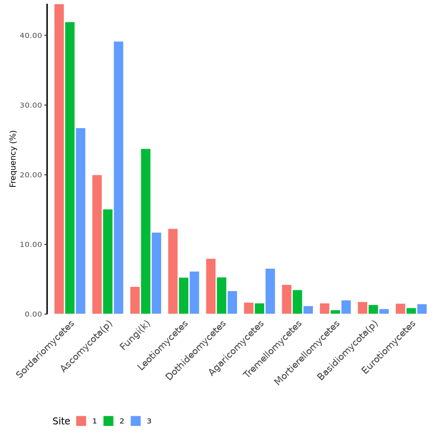

Built with R version  4.3.1.


## Setup

### Libraries


```r
# library(car)
library(cowplot)
library(data.table)
library(DESeq2)
library(DHARMa)
library(ggpubr)
library(grid)
library(gridExtra)
library(iNEXT)
library(kableExtra)
library(knitr)
library(lmPerm)
library(MASS)
library(matrixcalc)
library(pscl)
# library(rcompanion)
library(seqinr)
library(tidyverse)
library(vegan)
library(viridis)

# devtools::install_github("eastmallingresearch/Metabarcoding_pipeline/scripts")
library(metafuncs)
```

### Functions and constants


```r
ALPHA <-        0.1   # DESeq2 alpha value
OTUFILTER <-    0.01  # Remove OTUs with proportion of total reads below value
READFILTER <-   0.05  # Remove samples with read sum < sample_median_reads*READFILTER 
PAIREDONLY <-   FALSE # Will remove the pair of samples which fail the readfilter - probably only useful for DESeq separated by type NOTE removes pairs before DESeq object is created   
TAXCONF <-      0.80  # Sets the taxonomy confidence level to get "rank" in taxonomy files
TOPOTU <-       10    # Number of Top OTUs for summary information
DIFFOTU <-      200   # Number of Top OTUs for correlation analysis
FUNASVFILTER <- 0 # 0.05  # Filter fungal ASVs with proportion of total reads below value
BACASVFILTER <- 0 # 0.5   # Filter bacterial ASVs with proportion of total reads below value

# graphics
DEVICE <- "png"
DPI <-    1200
WIDTH <-  9
HEIGHT <- 9

# Model design
FACTORS <-            c("Site", "Storage", "Scion")
DESIGN <-             y ~ Site + Storage + Scion
FULL_DESIGN <-        y ~ Site * Storage * Scion
design_with_canker <- y ~ Site * Storage * Scion * Cankers_avg
canker_design <-      "Cankers ~ Site * Storage * Scion"

# Control
ASV_MODELS <- FALSE # Toggle for ASV model cells
```


```r
# colour blind palette
cbPalette <- c(
  "#000000", "#E69F00", "#56B4E9", "#009E73", 
  "#F0E442", "#0072B2", "#D55E00", "#CC79A7"
)

source("functions/metabarcoding.R")
source("functions/loadme.R")
source("functions/rarefaction.R")
```

## Load data

Bacterial and fungal ASV (ZOTU) tables, sample metadata, and taxonomy files are
loaded into named lists using the `loadData` function from Greg's `metafuncs` 
package.

Site names are encoded as follows according to previous work:

- Avalon (East Sutton) -> 1
- Scripps (Brenchley) -> 2
- WWF (Pluckley) -> 3


```r
metadata <- "sample_metadata.txt"

# Load data
ubiome_FUN <- loadData(
  "data/FUN.zotu_table.txt", metadata,
  "data/zFUN.sintax.taxa", RHB="FUN"
)

ubiome_BAC <- loadData(
  "data/BAC.zotu_table.txt", metadata,
  "data/zBAC.sintax.taxa", RHB="BAC"
)

# Change sites Avalon -> 1, Scripps -> 2, and WWF -> 3.
# Storage from planting date.
# No storage for December plantings, yes for March and April (4 months).
mutate_factors <- function(data){
  data <- data %>%
    rename(location = site, Scion = cultivar) %>%
    mutate(
      Site = case_when(
        location == "Avalon" ~ 1,
        location == "Scripps" ~ 2,
        location == "WWF" ~ 3
      ) %>% as.factor(),
      Storage = case_when(
        planting_date %in% c("march", "april") ~ "yes",
        planting_date %in% c("dec") ~ "no"
      ) %>% as.factor(),
      Scion = as.factor(Scion)
    )
  return(data)
}

ubiome_FUN$colData <- mutate_factors(ubiome_FUN$colData)
ubiome_BAC$colData <- mutate_factors(ubiome_BAC$colData)

# In taxData and countData replace 'OTU' with 'ASV'
rownames(ubiome_FUN$taxData) <- gsub("OTU", "ASV", rownames(ubiome_FUN$taxData))
rownames(ubiome_BAC$taxData) <- gsub("OTU", "ASV", rownames(ubiome_BAC$taxData))

rownames(ubiome_FUN$countData) <- gsub("OTU", "ASV", rownames(ubiome_FUN$countData))
rownames(ubiome_BAC$countData) <- gsub("OTU", "ASV", rownames(ubiome_BAC$countData))
```

### Global removals


```r
# Sample "A2-7" removed due to missampling.
ubiome_BAC$colData <- ubiome_BAC$colData[!rownames(ubiome_BAC$colData) %in% "HMA27", ]
ubiome_BAC$countData <- ubiome_BAC$countData[, !colnames(ubiome_BAC$countData) %in% "HMA27"]
ubiome_FUN$colData <- ubiome_FUN$colData[!rownames(ubiome_FUN$colData) %in% "HMA27", ]
ubiome_FUN$countData <- ubiome_FUN$countData[, !colnames(ubiome_FUN$countData) %in% "HMA27"]
```

## Filter samples and ASVs

### Filtering taxa

Plantae taxa are filtered from fungal `taxData`.
Chloroplast and Eukaryote  taxa are filtered from bacterial `taxData`.
Corresponding ASVs are removed from `countData`.


```r
# Filter Plant, Chloroplast, and Eukaryote ASVs

# Fungi: Plantae ASVs
cat("Fungi:", length(grep("Plantae", ubiome_FUN$taxData$kingdom)), "Plantae ASVs\n")
```

```
# Fungi: 0 Plantae ASVs
```

```r
# Bacteria: Chloroplast (Streptophyta) and Eukaryote ASVs
cat(
  "Bacteria:", length(grep("Streptophyta", ubiome_BAC$taxData$genus)), "Chloroplast ASVs;", 
  length(grep("Eukaryota", ubiome_BAC$taxData$kingdom)), "Eukaryote ASVs\n"
)
```

```
# Bacteria: 37 Chloroplast ASVs; 188 Eukaryote ASVs
```

```r
# Filter Chloroplast and Eukaryote
filt <- rownames(
  ubiome_BAC$taxData[
    grepl("Streptophyta", ubiome_BAC$taxData$genus) & 
    as.numeric(ubiome_BAC$taxData$g_conf) >= TAXCONF,
  ]
)

filt <- c(filt, rownames(ubiome_BAC$taxData[grep("Eukaryota", ubiome_BAC$taxData$kingdom), ]))

cat("Bacteria: removing", length(filt), "ASVs")
```

```
# Bacteria: removing 198 ASVs
```

```r
ubiome_BAC$taxData <- ubiome_BAC$taxData[!rownames(ubiome_BAC$taxData) %in% filt, ]
ubiome_BAC$countData <- ubiome_BAC$countData[!rownames(ubiome_BAC$countData) %in% filt, ]
```

### Filtering samples

Plot rarefaction curves.

Remove samples with read count below 5 % of median.


```r
invisible(mapply(assign, names(ubiome_BAC), ubiome_BAC, MoreArgs = list(envir = globalenv())))
rare_bac <- gfunc(countData, colData, "Bacteria")
# rare_bac <- gfunc(as.data.frame(counts(dds)), as.data.frame(colData(dds)), "Bacteria ZOTU")
invisible(mapply(assign, names(ubiome_FUN), ubiome_FUN, MoreArgs = list(envir = globalenv())))
rare_fun <- gfunc(countData, colData, "Fungi")
# rare_fun <- gfunc(as.data.frame(counts(dds)), as.data.frame(colData(dds)), "Fungi ZOTU")

rarefaction_plots <- grid.arrange(
  rare_bac, rare_fun,
  left = textGrob(label = expression("log"[10] * " aligned sequences"), rot = 90),
  bottom = "ASV count", nrow = 2
)

ggsave(filename = "rarefaction_plots.png", plot = rarefaction_plots, path = "figures/")

rarefaction_plots

# Fungi
med <- median(colSums(ubiome_FUN$countData))
filt <- !colSums(ubiome_FUN$countData) > med * READFILTER
cat("Fungi: ",sum(filt),"sample(s) removed\n")

# Bacteria
med <- median(colSums(ubiome_BAC$countData))
filt <- !colSums(ubiome_BAC$countData) > med * READFILTER
cat("Bacteria: ",sum(filt),"sample(s) removed\n")
```

### Filter ASVs

#### ASV read count

Number of ASVs which account for 50 %, 80 %, and 99 % of total reads.


```r
asv_propotions <- function(countData, proportion){
  i <- sum(countData)
  y <- rowSums(countData)
  y <- y[order(y, decreasing = T)]
  asvs <- length(y[(cumsum(y) / i <= proportion)])
  return(asvs)
}

proportions <- c(0.5, 0.9, 0.99, 1)

top_asvs <- data.table(
  "proportion" = proportions,
  "Fungi" = lapply(proportions, function(x) asv_propotions(ubiome_FUN$countData, x)),
  "Bacteria" = lapply(proportions, function(x) asv_propotions(ubiome_BAC$countData, x))
)

top_asvs %>%
  kbl() %>%
  kable_styling("striped", full_width = F)
```

<table class="table table-striped" style="width: auto !important; margin-left: auto; margin-right: auto;">
 <thead>
  <tr>
   <th style="text-align:right;"> proportion </th>
   <th style="text-align:left;"> Fungi </th>
   <th style="text-align:left;"> Bacteria </th>
  </tr>
 </thead>
<tbody>
  <tr>
   <td style="text-align:right;"> 0.50 </td>
   <td style="text-align:left;"> 10 </td>
   <td style="text-align:left;"> 169 </td>
  </tr>
  <tr>
   <td style="text-align:right;"> 0.90 </td>
   <td style="text-align:left;"> 171 </td>
   <td style="text-align:left;"> 2186 </td>
  </tr>
  <tr>
   <td style="text-align:right;"> 0.99 </td>
   <td style="text-align:left;"> 995 </td>
   <td style="text-align:left;"> 5883 </td>
  </tr>
  <tr>
   <td style="text-align:right;"> 1.00 </td>
   <td style="text-align:left;"> 2401 </td>
   <td style="text-align:left;"> 7265 </td>
  </tr>
</tbody>
</table>

#### Filter ASVs

Remove ASVs with read count below 1 % of total reads.


```r
# Fungi
keep <- filter_otus(ubiome_FUN$countData, OTUFILTER)
cat(
  "Fungi:\n", 
  " - total ASVs:", nrow(ubiome_FUN$countData), "\n",
  " - removing", nrow(ubiome_FUN$countData) - length(keep), "ASVs\n",
  " - remaining ASVs:", length(keep), "\n"
)
```

```
# Fungi:
#   - total ASVs: 2401 
#   - removing 1406 ASVs
#   - remaining ASVs: 995
```

```r
ubiome_FUN$taxData <- ubiome_FUN$taxData[rownames(ubiome_FUN$taxData) %in% keep,]
ubiome_FUN$countData <- ubiome_FUN$countData[rownames(ubiome_FUN$countData) %in% keep,]

# Bacteria
keep <-  filter_otus(ubiome_BAC$countData, OTUFILTER)
cat(
  "Bacteria:\n",
  " - total ASVs:", nrow(ubiome_BAC$countData), "\n",
  " - removing", nrow(ubiome_BAC$countData) - length(keep), "ASVs\n",
  " - remaining ASVs:", length(keep), "\n"
)
```

```
# Bacteria:
#   - total ASVs: 7265 
#   - removing 1382 ASVs
#   - remaining ASVs: 5883
```

```r
ubiome_BAC$taxData <- ubiome_BAC$taxData[rownames(ubiome_BAC$taxData) %in% keep,]
ubiome_BAC$countData <- ubiome_BAC$countData[rownames(ubiome_BAC$countData) %in% keep,]
```

## Absolute abundance normalisation

ASV normalisation is performed using qPCR theoretical copy number data.
Copy number is calculated per mg of root sample from the qPCR data.

### Prepare qPCR abundance data


```r
abundance <- fread("mean_abundance.csv")

# Add sample ID to abundance data
abundance$id <- paste0("HM", gsub("-", "", abundance$Sample))
# abundance$id <- abundance$Sample
abundance$copy_number <- abundance$MeanAdjustedTCN_mg
abundance$log_copy_number <- log10(abundance$copy_number)

# Add bacterial (16S) and fungal (ITS) abundance to ubiome BAC and FUN named lists
ubiome_FUN$abundance <- abundance[abundance$Target == "ITS"] %>%
  column_to_rownames(var = "id")
ubiome_BAC$abundance <- abundance[abundance$Target == "16S"] %>%
  column_to_rownames(var = "id")

// ...existing code...
ubiome_FUN$colData <- merge(
  ubiome_FUN$colData, 
  ubiome_FUN$abundance[, c("Target", "copy_number", "log_copy_number")], 
  by = "row.names", all.x = TRUE
) %>% column_to_rownames(var = "Row.names")

ubiome_BAC$colData <- merge(
  ubiome_BAC$colData, 
  ubiome_BAC$abundance[, c("Target", "copy_number", "log_copy_number")], 
  by = "row.names", all.x = TRUE
) %>% column_to_rownames(var = "Row.names")
```

```
# Error: <text>:15:1: unexpected '/'
# 14: 
# 15: /
#     ^
```

#### Remove outliers

```r
# Detect outliers with std > threshold from the median
detect_outliers <- function(x, val, threshold, na.rm = TRUE) {
  med_x <- median(x[[val]], na.rm = na.rm)
  sd_x <- sd(x[[val]], na.rm = na.rm)
  outliers <- x[x[[val]] > (med_x + threshold * sd_x) | x[[val]] < (med_x - threshold * sd_x), ]
  return(outliers)
}

outliers_FUN <- detect_outliers(ubiome_FUN$abundance, "MeanAdjustedTCN_mg", 3)
outliers_BAC <- detect_outliers(ubiome_BAC$abundance, "MeanAdjustedTCN_mg", 3)

# Remove samples with copy number > 3 std from the median
outliers <- rownames(outliers_FUN)
ubiome_FUN$abundance <- ubiome_FUN$abundance[!rownames(ubiome_FUN$abundance) %in% outliers, ]
ubiome_FUN$countData <- ubiome_FUN$countData[, !colnames(ubiome_FUN$countData) %in% outliers]
ubiome_FUN$colData <- ubiome_FUN$colData[!rownames(ubiome_FUN$colData) %in% outliers, ]

cat("Fungi: removing", length(outliers), "outlier(s)\n")
```

```
# Fungi: removing 0 outlier(s)
```

Sample A1-3 is removed from the fungal data due to abnormally high copy number.

## Canker count data

Canker count data for sampled trees only.


```r
# Canker count data for sampled trees only

canker_data <- fread("canker_data.csv", select = c(1:5, 7:34))

# Remove spaces from column names and convert to lowercase
colnames(canker_data) <- tolower(gsub(" ", "_", colnames(canker_data)))

# Codify site names, add storage and total canker count for timepoint 4
canker_data <- mutate(
  canker_data,
  Site = case_when(
    site == "Avalon" ~ 1,
    site == "Scripps" ~ 2,
    site == "WWF" ~ 3
  ) %>% as.factor(),
  Storage = case_when(
    planting_date %in% c("March", "April") ~ "yes",
    planting_date %in% c("Dec") ~ "no"
  ),
  Scion = as.factor(cultivar),
  total_cankers = a4 + b4 + c4 + d4 + e4
)

# Identify samples with missing values
missing <- unique(canker_data[!complete.cases(canker_data), code])

# Also remove sample A2-7 due to missampling
missing <- c(missing, "HMA27")

# Remove missing samples from canker data
# canker_data <- canker_data[!canker_data$code %in% missing, ]
canker_data <- canker_data[!canker_data$code %in% "HMA27", ]

# Verify that there are two trees for each sample
canker_data %>% group_by(code) %>% summarise(n = n()) %>% filter(n != 2)
```

```
# # A tibble: 0 × 2
# # ℹ 2 variables: code <chr>, n <int>
```

```r
# Sum of total cankers for each pair of trees with matching code
cankers <- canker_data %>% 
  group_by(code) %>% 
  summarise(
    Site = first(Site),
    Storage = first(Storage),
    Scion = first(Scion),
    Cankers = sum(total_cankers),
    Cankers_avg = mean(total_cankers, na.rm = TRUE)
  ) %>% 
  column_to_rownames("code")

# Add total canker count to colData for both FUN and BAC
ubiome_FUN$colData <- merge(
  ubiome_FUN$colData, 
  cankers[, c("Cankers", "Cankers_avg")], 
  by = 0,
  all.x = TRUE
) %>% column_to_rownames("Row.names")

ubiome_BAC$colData <- merge(
  ubiome_BAC$colData, 
  cankers[, c("Cankers", "Cankers_avg")], 
  by = 0,
  all.x = T
) %>% column_to_rownames("Row.names")
```

Summary stats


```r
# png("figures/hist.png", width = 800, height = 600)
# hist(cankers$Cankers, breaks = 20, main = "Total canker count", xlab = "Total canker count")
# dev.off()

cankers_hist <- ggdensity(
  cankers, x = "Cankers", fill = "Site", facet.by = "Site", ncol = 1,
  add = "mean", rug = T, palette = cbPalette,
  title = "Total canker count", xlab = "Total canker count"
)

cankers_hist
```

<!-- -->

```r
ggsave(filename = "cankers_hist.png", plot = cankers_hist, path = "figures/")

cankers_box <- ggboxplot(
  cankers, x = "Site", y = "Cankers", palette = cbPalette,
  color = "Scion", add = "jitter", legend = "top", 
  title = "Total canker count", xlab = "Site", ylab = "Total canker count"
)

cankers_box
```

<!-- -->

```r
ggsave(filename = "cankers_box.png", plot = cankers_box, path = "figures/")

cankers_bar <- ggbarplot(
  cankers, x = "Site", y = "Cankers", fill = "Scion", 
  palette = cbPalette, add = "mean_se", position = position_dodge(0.8),
  title = "Total canker count", xlab = "Site", ylab = "Total canker count"
)

cankers_bar
```

<!-- -->

```r
ggsave(filename = "cankers_bar.png", plot = cankers_bar, path = "figures/")
```

GLM


```r
# Effect of Site, Scion, and Storage on canker count

# Formula
formula <- update(FULL_DESIGN, Cankers ~ .)
# formula <- Cankers ~ Site + Storage + Scion + site:Storage + site:Scion + Storage:Scion

# Log-linear model
canker_lm <- lm(update(FULL_DESIGN, log(Cankers + 1) ~ .), data = cankers)

par(mfrow = c(2, 2))
plot(canker_lm)
```

<!-- -->

```r
# Residual checking
res <- resid(canker_lm, type = "pearson")

# Poisson model
canker_poisson <- glm(formula, data = cankers, family = "poisson")

poisson_plot <- plot(simulateResiduals(canker_poisson), title = "Poisson model")
```

<!-- -->

```r
# Model overdispersed

# Negative binomial model
canker_negbin <- glm.nb(formula, data = cankers)

sim <- simulateResiduals(canker_negbin)

plot(sim, title = "Negative binomial model")
```

<!-- -->

```r
# canker_model_plots <- ggarrange(lm_plot, poisson_plot, negbin_plot, ncol = 3)

# ggsave(filename = "canker_model_plots.png", plot = canker_model_plots, path = "figures/")

# png("figures/canker_residuals.png", width = 800, height = 600)
# plot(sim)
# dev.off()

testZeroInflation(sim)
```

```
# 
# 	DHARMa zero-inflation test via comparison to expected zeros with
# 	simulation under H0 = fitted model
# 
# data:  simulationOutput
# ratioObsSim = 0.77399, p-value = 0.76
# alternative hypothesis: two.sided
```

```r
nagelkerke(canker_negbin)
```

```
# Error in nagelkerke(canker_negbin): could not find function "nagelkerke"
```

```r
# Model good fit

canker_anova <- anova(canker_negbin, test = "Chisq") %>% data.frame()
total_deviance <- sum(canker_anova$Deviance, na.rm = T) + tail(canker_anova$Resid..Dev, 1)
canker_anova$Perc..Dev <- canker_anova$Deviance / total_deviance * 100

canker_anova
```

```
#                    Df     Deviance Resid..Df Resid..Dev     Pr..Chi.
# NULL               NA           NA        73  314.98196           NA
# Site                2 118.75744595        71  196.22452 1.629852e-26
# Storage             1   0.02066259        70  196.20386 8.857019e-01
# Scion               6  24.29375368        64  171.91010 4.611042e-04
# Site:Storage        2  28.86115598        62  143.04895 5.406044e-07
# Site:Scion         12  31.65405909        50  111.39489 1.564383e-03
# Storage:Scion       6   7.40666778        44  103.98822 2.848693e-01
# Site:Storage:Scion 11  26.62949240        33   77.35873 5.225415e-03
#                       Perc..Dev
# NULL                         NA
# Site               37.702935303
# Storage             0.006559927
# Scion               7.712744377
# Site:Storage        9.162796386
# Site:Scion         10.049483066
# Storage:Scion       2.351457744
# Site:Storage:Scion  8.454291190
```

<!-- -->

## Create DESeq objects


```r
# Make sure countData and colData still match, if they do, create DESeq objects, if not throw error
if(identical(colnames(ubiome_FUN$countData), rownames(ubiome_FUN$colData))) {
  # Create DESeq object
  ubiome_FUN$dds <- ubiom_to_des(ubiome_FUN)
  print("FUN DESeq object created")
} else {
  stop("FUN countData and colData do not match")
}
```

```
# [1] "FUN DESeq object created"
```

```r
if(identical(colnames(ubiome_BAC$countData), rownames(ubiome_BAC$colData))) {
  # Create DESeq object
  ubiome_BAC$dds <- ubiom_to_des(ubiome_BAC)
  print("BAC DESeq object created")
} else {
  stop("BAC countData and colData do not match")
}
```

```
# [1] "BAC DESeq object created"
```

## Abundance normalisation

Absolute abundance normalisation using DESeq2 size factors.

Values are centred around the mean of the copy number.


```r
# Normalise count data using DESeq2 size factors

ubiome_FUN$dds$sizeFactor <- ubiome_FUN$dds$copy_number / mean(ubiome_FUN$dds$copy_number)
```

```
# Error in `[[<-`(`*tmp*`, name, value = numeric(0)): 0 elements in value to replace 82 elements
```

```r
ubiome_BAC$dds$sizeFactor <- ubiome_BAC$dds$copy_number / mean(ubiome_BAC$dds$copy_number)
```

```
# Error in `[[<-`(`*tmp*`, name, value = numeric(0)): 0 elements in value to replace 82 elements
```


```r
# Save environment
save.image("data_loaded.RData")
```

<!-- #=============================================================================== -->
# **Fungi**
<!-- #=============================================================================== -->


```r
# Unpack fungi data
invisible(mapply(assign, names(ubiome_FUN), ubiome_FUN, MoreArgs = list(envir = globalenv())))
```

## ASV and sample summary

### Read and sample summary


```r
cat(
  "Raw reads", "\n\n",
  "Total raw reads:\t\t", sum(countData), "\n",
  "Mean raw reads per sample:\t", mean(colSums(countData)), "\n",
  "Median raw reads per sample:\t", median(colSums(countData)), "\n",
  "Max raw reads per sample:\t", max(colSums(countData)), "\n",
  "Min raw reads per sample:\t", min(colSums(countData)), "\n\n"
)
```

```
# Raw reads 
# 
#  Total raw reads:		 7376047 
#  Mean raw reads per sample:	 89951.79 
#  Median raw reads per sample:	 93327.5 
#  Max raw reads per sample:	 113518 
#  Min raw reads per sample:	 38472
```

```r
#colSums(countData)

nct <- counts(dds, normalize = T)
cat("Normalised reads", "\n\n",
  "Total normalised reads:\t\t", sum(nct), "\n",
  "Mean normalised reads per sample:\t", mean(colSums(nct)), "\n",
  "Median normalised reads per sample:\t", median(colSums(nct)), "\n",
  "Min normalised reads per sample:\t", min(colSums(nct)), "\n",
  "Max normalised reads per sample:\t", max(colSums(nct)), "\n\n"
)
```

```
# Normalised reads 
# 
#  Total normalised reads:		 7828697 
#  Mean normalised reads per sample:	 95471.91 
#  Median normalised reads per sample:	 84956.9 
#  Min normalised reads per sample:	 34336.46 
#  Max normalised reads per sample:	 258064.1
```

```r
#round(colSums(counts(dds,normalize = T)),0)
```

### ASV summary 


```r
cat(
  "Total ASVs:\t\t", nrow(taxData),"\n\n",
  "Raw reads per ASV summary", "\n\n",
  "Mean raw reads per ASV:\t", mean(rowSums(countData)),"\n",
  "Median raw per ASV:\t\t", median(rowSums(countData)),"\n",
  "ASV raw Min reads:\t\t", min(rowSums(countData)),"\n",
  "ASV raw Max reads:\t\t", max(rowSums(countData)),"\n\n"
)
```

```
# Total ASVs:		 995 
# 
#  Raw reads per ASV summary 
# 
#  Mean raw reads per ASV:	 7413.113 
#  Median raw per ASV:		 594 
#  ASV raw Min reads:		 143 
#  ASV raw Max reads:		 714713
```

```r
cat(
  "Normalised reads per ASV summary","\n\n",
  "Mean normalised reads per ASV:\t\t", mean(rowSums(nct)),"\n",
  "Median normalised reads per ASV:\t", median(rowSums(nct)),"\n",
  "ASV normalised Min reads:\t\t", min(rowSums(nct)),"\n",
  "ASV normalised Max reads:\t\t", max(rowSums(nct)),"\n\n"
)
```

```
# Normalised reads per ASV summary 
# 
#  Mean normalised reads per ASV:		 7868.037 
#  Median normalised reads per ASV:	 594.0175 
#  ASV normalised Min reads:		 84.53636 
#  ASV normalised Max reads:		 825983
```

```r
y <- rowSums(nct)
y <- y[order(y, decreasing = T)]
# proportion
xy <- y / sum(y)

cat("Top " ,TOPOTU, "ASVs:\n")
```

```
# Top  10 ASVs:
```

```r
data.frame(
  counts = y[1:TOPOTU], 
  proportion = xy[1:TOPOTU], 
  rank = taxData[names(y)[1:TOPOTU],]$rank
) %>%
  kbl() %>%
  kable_styling("striped", full_width = F)
```

<table class="table table-striped" style="width: auto !important; margin-left: auto; margin-right: auto;">
 <thead>
  <tr>
   <th style="text-align:left;">   </th>
   <th style="text-align:right;"> counts </th>
   <th style="text-align:right;"> proportion </th>
   <th style="text-align:left;"> rank </th>
  </tr>
 </thead>
<tbody>
  <tr>
   <td style="text-align:left;"> ASV2 </td>
   <td style="text-align:right;"> 825983.0 </td>
   <td style="text-align:right;"> 0.1055071 </td>
   <td style="text-align:left;"> Ascomycota(p) </td>
  </tr>
  <tr>
   <td style="text-align:left;"> ASV5 </td>
   <td style="text-align:right;"> 737632.6 </td>
   <td style="text-align:right;"> 0.0942216 </td>
   <td style="text-align:left;"> Leotiomycetes(c) </td>
  </tr>
  <tr>
   <td style="text-align:left;"> ASV4 </td>
   <td style="text-align:right;"> 693562.5 </td>
   <td style="text-align:right;"> 0.0885923 </td>
   <td style="text-align:left;"> Ascomycota(p) </td>
  </tr>
  <tr>
   <td style="text-align:left;"> ASV1 </td>
   <td style="text-align:right;"> 638834.2 </td>
   <td style="text-align:right;"> 0.0816016 </td>
   <td style="text-align:left;"> Dactylonectria macrodidyma(s) </td>
  </tr>
  <tr>
   <td style="text-align:left;"> ASV3 </td>
   <td style="text-align:right;"> 381457.0 </td>
   <td style="text-align:right;"> 0.0487255 </td>
   <td style="text-align:left;"> Ilyonectria destructans(s) </td>
  </tr>
  <tr>
   <td style="text-align:left;"> ASV12 </td>
   <td style="text-align:right;"> 219726.9 </td>
   <td style="text-align:right;"> 0.0280669 </td>
   <td style="text-align:left;"> Lachnum(g) </td>
  </tr>
  <tr>
   <td style="text-align:left;"> ASV7 </td>
   <td style="text-align:right;"> 167236.3 </td>
   <td style="text-align:right;"> 0.0213620 </td>
   <td style="text-align:left;"> Fusarium(g) </td>
  </tr>
  <tr>
   <td style="text-align:left;"> ASV6 </td>
   <td style="text-align:right;"> 143588.4 </td>
   <td style="text-align:right;"> 0.0183413 </td>
   <td style="text-align:left;"> Ilyonectria robusta(s) </td>
  </tr>
  <tr>
   <td style="text-align:left;"> ASV11 </td>
   <td style="text-align:right;"> 123619.4 </td>
   <td style="text-align:right;"> 0.0157905 </td>
   <td style="text-align:left;"> Truncatella angustata(s) </td>
  </tr>
  <tr>
   <td style="text-align:left;"> ASV8 </td>
   <td style="text-align:right;"> 110330.4 </td>
   <td style="text-align:right;"> 0.0140931 </td>
   <td style="text-align:left;"> Fusarium(g) </td>
  </tr>
</tbody>
</table>

## Taxonomy Summary

### Taxonomy identifiable

Proportion of ASVs which can be assigned (with the given confidence) at each taxonomic rank.


```r
# Proportion of ASVs which can be assigned (with the given confidence) at each taxonomic rank

tx <- copy(taxData)
setDT(tx)
cols <- names(tx)[9:15]

tx[, (cols) := lapply(.SD, as.factor), .SDcols = cols]

data.table(
  rank = c("kingdom", "phylum", "class", "order", "family", "genus", "species"),
  "0.8" = round(unlist(lapply(cols, function(col) sum(as.number(tx[[col]]) >= 0.8) / nrow(tx))), 2),
  "0.65" = round(unlist(lapply(cols, function(col) sum(as.number(tx[[col]]) >= 0.65) / nrow(tx))), 2),
  "0.5" = round(unlist(lapply(cols, function(col) sum(as.number(tx[[col]]) >= 0.5) / nrow(tx))), 2)
) %>%
  kbl() %>%
  kable_styling("striped", full_width = F)
```

<table class="table table-striped" style="width: auto !important; margin-left: auto; margin-right: auto;">
 <thead>
  <tr>
   <th style="text-align:left;"> rank </th>
   <th style="text-align:right;"> 0.8 </th>
   <th style="text-align:right;"> 0.65 </th>
   <th style="text-align:right;"> 0.5 </th>
  </tr>
 </thead>
<tbody>
  <tr>
   <td style="text-align:left;"> kingdom </td>
   <td style="text-align:right;"> 1.00 </td>
   <td style="text-align:right;"> 1.00 </td>
   <td style="text-align:right;"> 1.00 </td>
  </tr>
  <tr>
   <td style="text-align:left;"> phylum </td>
   <td style="text-align:right;"> 0.84 </td>
   <td style="text-align:right;"> 0.87 </td>
   <td style="text-align:right;"> 0.90 </td>
  </tr>
  <tr>
   <td style="text-align:left;"> class </td>
   <td style="text-align:right;"> 0.70 </td>
   <td style="text-align:right;"> 0.74 </td>
   <td style="text-align:right;"> 0.78 </td>
  </tr>
  <tr>
   <td style="text-align:left;"> order </td>
   <td style="text-align:right;"> 0.54 </td>
   <td style="text-align:right;"> 0.60 </td>
   <td style="text-align:right;"> 0.64 </td>
  </tr>
  <tr>
   <td style="text-align:left;"> family </td>
   <td style="text-align:right;"> 0.42 </td>
   <td style="text-align:right;"> 0.45 </td>
   <td style="text-align:right;"> 0.49 </td>
  </tr>
  <tr>
   <td style="text-align:left;"> genus </td>
   <td style="text-align:right;"> 0.38 </td>
   <td style="text-align:right;"> 0.42 </td>
   <td style="text-align:right;"> 0.47 </td>
  </tr>
  <tr>
   <td style="text-align:left;"> species </td>
   <td style="text-align:right;"> 0.24 </td>
   <td style="text-align:right;"> 0.30 </td>
   <td style="text-align:right;"> 0.35 </td>
  </tr>
</tbody>
</table>

% of reads which can be assigned to each taxonomic ranks


```r
tx <-taxData[rownames(dds),]
nc <- counts(dds, normalize = T)
ac <- sum(nc)

data.table(
  rank = c("kingdom", "phylum", "class", "order", "family", "genus", "species"),
  "0.8" = round(unlist(lapply(cols, function(col)(sum(nc[which(as.numeric(tx[[col]]) >= 0.8),]) / ac * 100))), 2),
  "0.65" = round(unlist(lapply(cols, function(col)(sum(nc[which(as.numeric(tx[[col]]) >= 0.65),]) / ac * 100))), 2),
  "0.5" = round(unlist(lapply(cols, function(col)(sum(nc[which(as.numeric(tx[[col]]) >= 0.5),]) / ac * 100))), 2)
) %>%
  kbl() %>%
  kable_styling("striped", full_width = F)
```

<table class="table table-striped" style="width: auto !important; margin-left: auto; margin-right: auto;">
 <thead>
  <tr>
   <th style="text-align:left;"> rank </th>
   <th style="text-align:right;"> 0.8 </th>
   <th style="text-align:right;"> 0.65 </th>
   <th style="text-align:right;"> 0.5 </th>
  </tr>
 </thead>
<tbody>
  <tr>
   <td style="text-align:left;"> kingdom </td>
   <td style="text-align:right;"> 100.00 </td>
   <td style="text-align:right;"> 100.00 </td>
   <td style="text-align:right;"> 100.00 </td>
  </tr>
  <tr>
   <td style="text-align:left;"> phylum </td>
   <td style="text-align:right;"> 86.05 </td>
   <td style="text-align:right;"> 96.89 </td>
   <td style="text-align:right;"> 97.11 </td>
  </tr>
  <tr>
   <td style="text-align:left;"> class </td>
   <td style="text-align:right;"> 61.03 </td>
   <td style="text-align:right;"> 72.95 </td>
   <td style="text-align:right;"> 73.43 </td>
  </tr>
  <tr>
   <td style="text-align:left;"> order </td>
   <td style="text-align:right;"> 55.05 </td>
   <td style="text-align:right;"> 59.67 </td>
   <td style="text-align:right;"> 70.52 </td>
  </tr>
  <tr>
   <td style="text-align:left;"> family </td>
   <td style="text-align:right;"> 45.08 </td>
   <td style="text-align:right;"> 48.84 </td>
   <td style="text-align:right;"> 52.20 </td>
  </tr>
  <tr>
   <td style="text-align:left;"> genus </td>
   <td style="text-align:right;"> 45.80 </td>
   <td style="text-align:right;"> 49.84 </td>
   <td style="text-align:right;"> 52.28 </td>
  </tr>
  <tr>
   <td style="text-align:left;"> species </td>
   <td style="text-align:right;"> 29.64 </td>
   <td style="text-align:right;"> 35.84 </td>
   <td style="text-align:right;"> 41.33 </td>
  </tr>
</tbody>
</table>

### Taxonomy plots

Plots of proportion of normalised reads assigned to members of phylum and class.


```r
dat <- list(as.data.frame(counts(dds, normalize = T)), taxData, as.data.frame(colData(dds)))

design <- c("Site", "Storage")

# md1 <- getSummedTaxa(dat, conf = TAXCONF, design = design, cutoff = 0.1)
md1 <- getSummedTaxa(dat, conf = TAXCONF, design = design, taxon = "phylum", cutoff = 0.1)

md1[, Site := factor(Site, levels = c(1, 2, 3))]
md1[, Storage := factor(Storage, levels = c("no", "yes"))]
md1[, taxon := factor(taxon, levels = unique(taxon[order(value, decreasing = T)]))]

removals <- md1[, .(value = mean(value)), by = "taxon"][value < 0.5, taxon]
md1 <- md1[!taxon %in% removals, ]

fun_phylum_plot <- plotfun1(md1, x = "taxon", fill = "Site") +
  facet_wrap(~ Storage)

ggsave("figures/fun_phylum.png", fun_phylum_plot, width = 25, height = 15, units = "cm")

fun_phylum_plot
```

<!-- -->

```r
md2 <- getSummedTaxa(dat, conf = TAXCONF, design = design, taxon = "class", cutoff = 0.1)

md2[, Site := factor(Site, levels = c(1, 2, 3))]
md2[, Storage := factor(Storage, levels = c("no", "yes"))]
md2[, taxon := factor(taxon, levels = unique(taxon[order(value, decreasing = T)]))]

removals <- md2[, .(value = mean(value)), by = "taxon"][value < 0.5, taxon]
md2 <- md2[!taxon %in% removals, ]

fun_class_plot <- plotfun1(md2, x = "taxon", fill = "Site") +
  facet_wrap(~ Storage)

ggsave("figures/fun_class.png", fun_class_plot, width = 25, height = 15, units = "cm")

fun_class_plot
```

<!-- -->

## Community size

Plot copy number for each sample grouped by site, Scion, and Storage.
Test the effect of site, Scion, and Storage on copy number using ANOVA.


```r
# abundance_plot <- ggplot(
#   data = as.data.frame(colData(dds)), 
#   aes(x = site, y = log_copy_number, colour = Scion, shape = Storage)
# ) + geom_jitter() + 
#   scale_colour_manual(values = cbPalette)

fun_abundance_box <- ggboxplot(
  data = as.data.frame(colData(dds)), x = "Site", y = "log_copy_number", 
  color = "Scion", add = "jitter", legend = "top", 
  title = "Fungal abundance", xlab = "Site", ylab = "log10 copy number"
)

ggsave(
  filename = "fun_abundance.png", plot = fun_abundance_box, path = "figures/", 
  height = 20, width = 20, units = "cm"
)
```

```
# Error:
# ! Problem while computing aesthetics.
# ℹ Error occurred in the 1st layer.
# Caused by error:
# ! object 'log_copy_number' not found
```

```r
fun_abundance_box
```

```
# Error:
# ! Problem while computing aesthetics.
# ℹ Error occurred in the 1st layer.
# Caused by error:
# ! object 'log_copy_number' not found
```

```r
fun_abundance_bar <- ggbarplot(
  data = as.data.frame(colData(dds)), x = "Storage", y = "log_copy_number", 
  fill = "Site", add = "mean_se", 
  palette = cbPalette, position = position_dodge(0.8),
  title = "(a) Fungal abundance", xlab = "Storage ", ylab = "Mean copy number (log10)"
) + guides(fill = guide_legend(title = "Site"))
```

```
# Error in `purrr::pmap()`:
# ℹ In index: 1.
# ℹ With name: log_copy_number.
# Caused by error in `.[, measure.var]`:
# ! Can't subset columns that don't exist.
# ✖ Column `log_copy_number` doesn't exist.
```

```r
ggsave(
  filename = "fun_abundance_bar.png", plot = fun_abundance_bar, path = "figures/", 
  height = 20, width = 20, units = "cm"
)
```

```
# Error in eval(expr, envir, enclos): object 'fun_abundance_bar' not found
```

```r
fun_abundance_bar
```

```
# Error in eval(expr, envir, enclos): object 'fun_abundance_bar' not found
```

```r
# Formula for ANOVA
formula <- update(FULL_DESIGN, log_copy_number ~ .)

abundance_anova <- aov(formula, data = as.data.frame(colData(dds)))
```

```
# Error in eval(predvars, data, env): object 'log_copy_number' not found
```

```r
# Normality check
par(mfrow = c(2, 2))
plot(abundance_anova)
```

```
# Error in h(simpleError(msg, call)): error in evaluating the argument 'x' in selecting a method for function 'plot': object 'abundance_anova' not found
```

```r
png("figures/fun_abundance_norm.png", width = 800, height = 600)
par(mfrow = c(2, 2))
plot(abundance_anova)
```

```
# Error in h(simpleError(msg, call)): error in evaluating the argument 'x' in selecting a method for function 'plot': object 'abundance_anova' not found
```

```r
dev.off()
```

```
# png 
#   2
```

```r
# Results
summary(abundance_anova)
```

```
# Error in h(simpleError(msg, call)): error in evaluating the argument 'object' in selecting a method for function 'summary': object 'abundance_anova' not found
```

```r
abundance_results <- abundance_anova %>% summary() %>% unclass() %>% data.frame()
```

```
# Error in h(simpleError(msg, call)): error in evaluating the argument 'object' in selecting a method for function 'summary': object 'abundance_anova' not found
```

```r
total_variance <- sum(abundance_results$Sum.Sq)
```

```
# Error in eval(expr, envir, enclos): object 'abundance_results' not found
```

```r
abundance_results$Perc.Var <- abundance_results$Sum.Sq / total_variance * 100
```

```
# Error in eval(expr, envir, enclos): object 'abundance_results' not found
```

```r
abundance_results %>%
  kbl() %>%
  kable_styling("striped", full_width = F)
```

```
# Error in eval(expr, envir, enclos): object 'abundance_results' not found
```

### Communtiy size with canker count


```r
cat("Model formula: ", deparse(update(design_with_canker, log_copy_number ~ .)), "\n")
```

```
# Model formula:  log_copy_number ~ Site + Storage + Scion + Cankers_avg + Site:Storage +      Site:Scion + Storage:Scion + Site:Cankers_avg + Storage:Cankers_avg +      Scion:Cankers_avg + Site:Storage:Scion + Site:Storage:Cankers_avg +      Site:Scion:Cankers_avg + Storage:Scion:Cankers_avg + Site:Storage:Scion:Cankers_avg
```

```r
abundance_canker_anova <- aov(update(design_with_canker, log_copy_number ~ .), data = as.data.frame(colData(dds)))
```

```
# Error in eval(predvars, data, env): object 'log_copy_number' not found
```

```r
summary(abundance_canker_anova)
```

```
# Error in h(simpleError(msg, call)): error in evaluating the argument 'object' in selecting a method for function 'summary': object 'abundance_canker_anova' not found
```

```r
abundance_canker_results <- abundance_canker_anova %>% summary() %>% unclass() %>% data.frame()
```

```
# Error in h(simpleError(msg, call)): error in evaluating the argument 'object' in selecting a method for function 'summary': object 'abundance_canker_anova' not found
```

```r
total_variance <- sum(abundance_canker_results$Sum.Sq)
```

```
# Error in eval(expr, envir, enclos): object 'abundance_canker_results' not found
```

```r
abundance_canker_results$Perc.Var <- abundance_canker_results$Sum.Sq / total_variance * 100
```

```
# Error in eval(expr, envir, enclos): object 'abundance_canker_results' not found
```

```r
abundance_canker_results %>%
  kbl() %>%
  kable_styling("striped", full_width = F)
```

```
# Error in eval(expr, envir, enclos): object 'abundance_canker_results' not found
```

## Alpha diversity analysis

### Alpha diversity plot


```r
# plot alpha diversity - plot_alpha will convert normalised abundances to integer values

fun_alpha_plot <- plot_alpha(
  counts(dds, normalize = F), colData(dds),
  design = "Scion", colour = "Site",
  measures = c("Shannon", "Simpson"),
  type = "bar"
) + scale_colour_manual(values = cbPalette) + 
  theme(axis.title.x = element_blank()) +
  ggtitle("Fungal α-diversity")

ggsave(
  filename = "fun_alpha.png", plot = fun_alpha_plot, path = "figures/", 
  height = 20, width = 40, units = "cm"
)
```

```
# Error in `geom_errorbar()` at metafuncs/R/plot_phylo.R:243:11:
# ! Problem while computing aesthetics.
# ℹ Error occurred in the 2nd layer.
# Caused by error:
# ! object 'se' not found
```

```r
fun_alpha_plot
```

```
# Error in `geom_errorbar()` at metafuncs/R/plot_phylo.R:243:11:
# ! Problem while computing aesthetics.
# ℹ Error occurred in the 2nd layer.
# Caused by error:
# ! object 'se' not found
```

### Permutation based anova on α-diversity index ranks


```r
# get the diversity index data
all_alpha_ord <- plot_alpha(
  counts(dds, normalize = F),
  colData(dds),
  returnData = T
)

# join diversity indices and metadata
all_alpha_ord <- all_alpha_ord[
  as.data.table(colData(dds), keep.rownames = "Samples"), 
  on = "Samples"
]

fun_alpha <- all_alpha_ord

formula <- FULL_DESIGN # x ~ Site * Storage * Scion + Site / Site.block

# Chao1

setkey(all_alpha_ord, S.chao1)
all_alpha_ord[, measure := as.numeric(as.factor(S.chao1))]
result <- aovp(update(formula, measure ~ .), all_alpha_ord, seqs = T)
```

```
# [1] "Settings:  sequential SS "
```

```r
summary(result)
```

```
# Component 1 :
#                    Df R Sum Sq R Mean Sq Iter Pr(Prob)    
# Site                2  11491.5    5745.7 5000  < 2e-16 ***
# Storage             1   1945.8    1945.8 2253  0.04261 *  
# Site:Storage        2   1095.6     547.8  712  0.39466    
# Scion               6    925.1     154.2  402  0.84826    
# Site:Scion         12   3104.4     258.7  710  0.93099    
# Storage:Scion       6   2080.0     346.7  587  0.60136    
# Site:Storage:Scion 12   2707.1     225.6 1321  0.93944    
# Residuals          40  22591.0     564.8                  
# ---
# Signif. codes:  0 '***' 0.001 '**' 0.01 '*' 0.05 '.' 0.1 ' ' 1
```

```r
df <- result %>% summary() %>% unclass() %>% data.frame()
total_variance <- sum(df$R.Sum.Sq)
df$Perc.Var <- df$R.Sum.Sq / total_variance * 100
df %>%
  kbl() %>%
  kable_styling("striped", full_width = F)
```

<table class="table table-striped" style="width: auto !important; margin-left: auto; margin-right: auto;">
 <thead>
  <tr>
   <th style="text-align:left;">   </th>
   <th style="text-align:right;"> Df </th>
   <th style="text-align:right;"> R.Sum.Sq </th>
   <th style="text-align:right;"> R.Mean.Sq </th>
   <th style="text-align:right;"> Iter </th>
   <th style="text-align:right;"> Pr.Prob. </th>
   <th style="text-align:right;"> Perc.Var </th>
  </tr>
 </thead>
<tbody>
  <tr>
   <td style="text-align:left;"> Site </td>
   <td style="text-align:right;"> 2 </td>
   <td style="text-align:right;"> 11491.4894 </td>
   <td style="text-align:right;"> 5745.7447 </td>
   <td style="text-align:right;"> 5000 </td>
   <td style="text-align:right;"> 0.0000000 </td>
   <td style="text-align:right;"> 25.013854 </td>
  </tr>
  <tr>
   <td style="text-align:left;"> Storage </td>
   <td style="text-align:right;"> 1 </td>
   <td style="text-align:right;"> 1945.7571 </td>
   <td style="text-align:right;"> 1945.7571 </td>
   <td style="text-align:right;"> 2253 </td>
   <td style="text-align:right;"> 0.0426099 </td>
   <td style="text-align:right;"> 4.235385 </td>
  </tr>
  <tr>
   <td style="text-align:left;"> Site:Storage </td>
   <td style="text-align:right;"> 2 </td>
   <td style="text-align:right;"> 1095.5996 </td>
   <td style="text-align:right;"> 547.7998 </td>
   <td style="text-align:right;"> 712 </td>
   <td style="text-align:right;"> 0.3946629 </td>
   <td style="text-align:right;"> 2.384823 </td>
  </tr>
  <tr>
   <td style="text-align:left;"> Scion </td>
   <td style="text-align:right;"> 6 </td>
   <td style="text-align:right;"> 925.1205 </td>
   <td style="text-align:right;"> 154.1867 </td>
   <td style="text-align:right;"> 402 </td>
   <td style="text-align:right;"> 0.8482587 </td>
   <td style="text-align:right;"> 2.013736 </td>
  </tr>
  <tr>
   <td style="text-align:left;"> Site:Scion </td>
   <td style="text-align:right;"> 12 </td>
   <td style="text-align:right;"> 3104.4137 </td>
   <td style="text-align:right;"> 258.7011 </td>
   <td style="text-align:right;"> 710 </td>
   <td style="text-align:right;"> 0.9309859 </td>
   <td style="text-align:right;"> 6.757466 </td>
  </tr>
  <tr>
   <td style="text-align:left;"> Storage:Scion </td>
   <td style="text-align:right;"> 6 </td>
   <td style="text-align:right;"> 2079.9972 </td>
   <td style="text-align:right;"> 346.6662 </td>
   <td style="text-align:right;"> 587 </td>
   <td style="text-align:right;"> 0.6013629 </td>
   <td style="text-align:right;"> 4.527590 </td>
  </tr>
  <tr>
   <td style="text-align:left;"> Site:Storage:Scion </td>
   <td style="text-align:right;"> 12 </td>
   <td style="text-align:right;"> 2707.1224 </td>
   <td style="text-align:right;"> 225.5935 </td>
   <td style="text-align:right;"> 1321 </td>
   <td style="text-align:right;"> 0.9394398 </td>
   <td style="text-align:right;"> 5.892671 </td>
  </tr>
  <tr>
   <td style="text-align:left;"> Residuals </td>
   <td style="text-align:right;"> 40 </td>
   <td style="text-align:right;"> 22591.0000 </td>
   <td style="text-align:right;"> 564.7750 </td>
   <td style="text-align:right;"> NA </td>
   <td style="text-align:right;"> NA </td>
   <td style="text-align:right;"> 49.174476 </td>
  </tr>
</tbody>
</table>

```r
# Shannon

setkey(all_alpha_ord, shannon)
all_alpha_ord[, measure := as.numeric(as.factor(shannon))]
result <- aovp(update(formula, measure ~ .), all_alpha_ord, seqs = T)
```

```
# [1] "Settings:  sequential SS "
```

```r
summary(result)
```

```
# Component 1 :
#                    Df R Sum Sq R Mean Sq Iter Pr(Prob)    
# Site                2  13211.0    6605.5 5000  < 2e-16 ***
# Storage             1    931.6     931.6 1233  0.07543 .  
# Site:Storage        2   2282.7    1141.4 2613  0.05013 .  
# Scion               6    677.6     112.9  100  0.89000    
# Site:Scion         12   3463.7     288.6  490  0.74898    
# Storage:Scion       6   2790.2     465.0  412  0.49515    
# Site:Storage:Scion 12   5413.7     451.1 1656  0.45229    
# Residuals          40  17170.0     429.3                  
# ---
# Signif. codes:  0 '***' 0.001 '**' 0.01 '*' 0.05 '.' 0.1 ' ' 1
```

```r
df <- result %>% summary() %>% unclass() %>% data.frame()
total_variance <- sum(df$R.Sum.Sq)
df$Perc.Var <- df$R.Sum.Sq / total_variance * 100
df %>%
  kbl() %>%
  kable_styling("striped", full_width = F)
```

<table class="table table-striped" style="width: auto !important; margin-left: auto; margin-right: auto;">
 <thead>
  <tr>
   <th style="text-align:left;">   </th>
   <th style="text-align:right;"> Df </th>
   <th style="text-align:right;"> R.Sum.Sq </th>
   <th style="text-align:right;"> R.Mean.Sq </th>
   <th style="text-align:right;"> Iter </th>
   <th style="text-align:right;"> Pr.Prob. </th>
   <th style="text-align:right;"> Perc.Var </th>
  </tr>
 </thead>
<tbody>
  <tr>
   <td style="text-align:left;"> Site </td>
   <td style="text-align:right;"> 2 </td>
   <td style="text-align:right;"> 13210.9854 </td>
   <td style="text-align:right;"> 6605.4927 </td>
   <td style="text-align:right;"> 5000 </td>
   <td style="text-align:right;"> 0.0000000 </td>
   <td style="text-align:right;"> 28.756730 </td>
  </tr>
  <tr>
   <td style="text-align:left;"> Storage </td>
   <td style="text-align:right;"> 1 </td>
   <td style="text-align:right;"> 931.5632 </td>
   <td style="text-align:right;"> 931.5632 </td>
   <td style="text-align:right;"> 1233 </td>
   <td style="text-align:right;"> 0.0754258 </td>
   <td style="text-align:right;"> 2.027760 </td>
  </tr>
  <tr>
   <td style="text-align:left;"> Site:Storage </td>
   <td style="text-align:right;"> 2 </td>
   <td style="text-align:right;"> 2282.7261 </td>
   <td style="text-align:right;"> 1141.3630 </td>
   <td style="text-align:right;"> 2613 </td>
   <td style="text-align:right;"> 0.0501339 </td>
   <td style="text-align:right;"> 4.968875 </td>
  </tr>
  <tr>
   <td style="text-align:left;"> Scion </td>
   <td style="text-align:right;"> 6 </td>
   <td style="text-align:right;"> 677.6272 </td>
   <td style="text-align:right;"> 112.9379 </td>
   <td style="text-align:right;"> 100 </td>
   <td style="text-align:right;"> 0.8900000 </td>
   <td style="text-align:right;"> 1.475010 </td>
  </tr>
  <tr>
   <td style="text-align:left;"> Site:Scion </td>
   <td style="text-align:right;"> 12 </td>
   <td style="text-align:right;"> 3463.7071 </td>
   <td style="text-align:right;"> 288.6423 </td>
   <td style="text-align:right;"> 490 </td>
   <td style="text-align:right;"> 0.7489796 </td>
   <td style="text-align:right;"> 7.539550 </td>
  </tr>
  <tr>
   <td style="text-align:left;"> Storage:Scion </td>
   <td style="text-align:right;"> 6 </td>
   <td style="text-align:right;"> 2790.1937 </td>
   <td style="text-align:right;"> 465.0323 </td>
   <td style="text-align:right;"> 412 </td>
   <td style="text-align:right;"> 0.4951456 </td>
   <td style="text-align:right;"> 6.073494 </td>
  </tr>
  <tr>
   <td style="text-align:left;"> Site:Storage:Scion </td>
   <td style="text-align:right;"> 12 </td>
   <td style="text-align:right;"> 5413.6974 </td>
   <td style="text-align:right;"> 451.1414 </td>
   <td style="text-align:right;"> 1656 </td>
   <td style="text-align:right;"> 0.4522947 </td>
   <td style="text-align:right;"> 11.784150 </td>
  </tr>
  <tr>
   <td style="text-align:left;"> Residuals </td>
   <td style="text-align:right;"> 40 </td>
   <td style="text-align:right;"> 17170.0000 </td>
   <td style="text-align:right;"> 429.2500 </td>
   <td style="text-align:right;"> NA </td>
   <td style="text-align:right;"> NA </td>
   <td style="text-align:right;"> 37.374430 </td>
  </tr>
</tbody>
</table>

```r
# Simpson

setkey(all_alpha_ord, simpson)
all_alpha_ord[, measure := as.numeric(as.factor(simpson))]
result <- aovp(update(formula, measure ~ .), all_alpha_ord, seqs = T)
```

```
# [1] "Settings:  sequential SS "
```

```r
summary(result)
```

```
# Component 1 :
#                    Df R Sum Sq R Mean Sq Iter Pr(Prob)    
# Site                2  13976.8    6988.4 5000  < 2e-16 ***
# Storage             1    645.9     645.9  187  0.35294    
# Site:Storage        2   2324.6    1162.3 1674  0.08901 .  
# Scion               6   1365.9     227.7  333  0.78679    
# Site:Scion         12   2379.1     198.3  683  0.92094    
# Storage:Scion       6   2537.6     422.9 1482  0.40756    
# Site:Storage:Scion 12   5540.6     461.7 1417  0.35145    
# Residuals          40  17170.0     429.3                  
# ---
# Signif. codes:  0 '***' 0.001 '**' 0.01 '*' 0.05 '.' 0.1 ' ' 1
```

```r
df <- result %>% summary() %>% unclass() %>% data.frame()
total_variance <- sum(df$R.Sum.Sq)
df$Perc.Var <- df$R.Sum.Sq / total_variance * 100
df %>%
  kbl() %>%
  kable_styling("striped", full_width = F)
```

<table class="table table-striped" style="width: auto !important; margin-left: auto; margin-right: auto;">
 <thead>
  <tr>
   <th style="text-align:left;">   </th>
   <th style="text-align:right;"> Df </th>
   <th style="text-align:right;"> R.Sum.Sq </th>
   <th style="text-align:right;"> R.Mean.Sq </th>
   <th style="text-align:right;"> Iter </th>
   <th style="text-align:right;"> Pr.Prob. </th>
   <th style="text-align:right;"> Perc.Var </th>
  </tr>
 </thead>
<tbody>
  <tr>
   <td style="text-align:left;"> Site </td>
   <td style="text-align:right;"> 2 </td>
   <td style="text-align:right;"> 13976.7950 </td>
   <td style="text-align:right;"> 6988.3975 </td>
   <td style="text-align:right;"> 5000 </td>
   <td style="text-align:right;"> 0.0000000 </td>
   <td style="text-align:right;"> 30.423689 </td>
  </tr>
  <tr>
   <td style="text-align:left;"> Storage </td>
   <td style="text-align:right;"> 1 </td>
   <td style="text-align:right;"> 645.9132 </td>
   <td style="text-align:right;"> 645.9132 </td>
   <td style="text-align:right;"> 187 </td>
   <td style="text-align:right;"> 0.3529412 </td>
   <td style="text-align:right;"> 1.405978 </td>
  </tr>
  <tr>
   <td style="text-align:left;"> Site:Storage </td>
   <td style="text-align:right;"> 2 </td>
   <td style="text-align:right;"> 2324.5775 </td>
   <td style="text-align:right;"> 1162.2888 </td>
   <td style="text-align:right;"> 1674 </td>
   <td style="text-align:right;"> 0.0890084 </td>
   <td style="text-align:right;"> 5.059974 </td>
  </tr>
  <tr>
   <td style="text-align:left;"> Scion </td>
   <td style="text-align:right;"> 6 </td>
   <td style="text-align:right;"> 1365.9388 </td>
   <td style="text-align:right;"> 227.6565 </td>
   <td style="text-align:right;"> 333 </td>
   <td style="text-align:right;"> 0.7867868 </td>
   <td style="text-align:right;"> 2.973278 </td>
  </tr>
  <tr>
   <td style="text-align:left;"> Site:Scion </td>
   <td style="text-align:right;"> 12 </td>
   <td style="text-align:right;"> 2379.0612 </td>
   <td style="text-align:right;"> 198.2551 </td>
   <td style="text-align:right;"> 683 </td>
   <td style="text-align:right;"> 0.9209370 </td>
   <td style="text-align:right;"> 5.178571 </td>
  </tr>
  <tr>
   <td style="text-align:left;"> Storage:Scion </td>
   <td style="text-align:right;"> 6 </td>
   <td style="text-align:right;"> 2537.6365 </td>
   <td style="text-align:right;"> 422.9394 </td>
   <td style="text-align:right;"> 1482 </td>
   <td style="text-align:right;"> 0.4075574 </td>
   <td style="text-align:right;"> 5.523746 </td>
  </tr>
  <tr>
   <td style="text-align:left;"> Site:Storage:Scion </td>
   <td style="text-align:right;"> 12 </td>
   <td style="text-align:right;"> 5540.5778 </td>
   <td style="text-align:right;"> 461.7148 </td>
   <td style="text-align:right;"> 1417 </td>
   <td style="text-align:right;"> 0.3514467 </td>
   <td style="text-align:right;"> 12.060334 </td>
  </tr>
  <tr>
   <td style="text-align:left;"> Residuals </td>
   <td style="text-align:right;"> 40 </td>
   <td style="text-align:right;"> 17170.0000 </td>
   <td style="text-align:right;"> 429.2500 </td>
   <td style="text-align:right;"> NA </td>
   <td style="text-align:right;"> NA </td>
   <td style="text-align:right;"> 37.374430 </td>
  </tr>
</tbody>
</table>

#### Permutation based anova on α-diversity index ranks iwth canker lesion counts


```r
cat("Model formula: ", deparse(design_with_canker), "\n")
```

```
# Model formula:  y ~ Site * Storage * Scion * Cankers_avg
```

```r
# Chao1

setkey(all_alpha_ord, S.chao1)
all_alpha_ord[, measure := as.numeric(as.factor(S.chao1))]
result <- aovp(update(design_with_canker, measure ~ .), all_alpha_ord, seqs = T)
```

```
# [1] "Settings:  sequential SS : numeric variables centered"
```

```r
summary(result)
```

```
# Component 1 :
#                                Df R Sum Sq R Mean Sq Iter Pr(Prob)
# Site                            2  10651.3    5325.6 1598   0.1033
# Storage                         1   1891.8    1891.8  354   0.2203
# Site:Storage                    2   1441.2     720.6  295   0.5627
# Scion                           6   1435.2     239.2  232   0.9655
# Site:Scion                     12   3015.7     251.3  191   0.8534
# Storage:Scion                   6   2494.5     415.8  296   0.7939
# Site:Storage:Scion             12   3091.5     257.6  280   0.9821
# Cankers_avg                     1    458.7     458.7   80   0.5625
# Site:Cankers_avg                2     19.6       9.8   51   1.0000
# Storage:Cankers_avg             1   1667.9    1667.9   51   0.8431
# Site:Storage:Cankers_avg        2   1113.7     556.8  206   0.5583
# Scion:Cankers_avg               6   2022.8     337.1  292   0.6712
# Site:Scion:Cankers_avg         11   7325.1     665.9  663   0.4118
# Storage:Scion:Cankers_avg       6   4036.1     672.7  673   0.4205
# Site:Storage:Scion:Cankers_avg  7   2504.6     357.8  375   0.9333
# Residuals                       2   1392.5     696.2
```

```r
df <- result %>% summary() %>% unclass() %>% data.frame()
total_variance <- sum(df$R.Sum.Sq)
df$Perc.Var <- df$R.Sum.Sq / total_variance * 100
df %>%
  kbl() %>%
  kable_styling("striped", full_width = F)
```

<table class="table table-striped" style="width: auto !important; margin-left: auto; margin-right: auto;">
 <thead>
  <tr>
   <th style="text-align:left;">   </th>
   <th style="text-align:right;"> Df </th>
   <th style="text-align:right;"> R.Sum.Sq </th>
   <th style="text-align:right;"> R.Mean.Sq </th>
   <th style="text-align:right;"> Iter </th>
   <th style="text-align:right;"> Pr.Prob. </th>
   <th style="text-align:right;"> Perc.Var </th>
  </tr>
 </thead>
<tbody>
  <tr>
   <td style="text-align:left;"> Site </td>
   <td style="text-align:right;"> 2 </td>
   <td style="text-align:right;"> 10651.26585 </td>
   <td style="text-align:right;"> 5325.632924 </td>
   <td style="text-align:right;"> 1598 </td>
   <td style="text-align:right;"> 0.1032541 </td>
   <td style="text-align:right;"> 23.9020265 </td>
  </tr>
  <tr>
   <td style="text-align:left;"> Storage </td>
   <td style="text-align:right;"> 1 </td>
   <td style="text-align:right;"> 1891.82372 </td>
   <td style="text-align:right;"> 1891.823722 </td>
   <td style="text-align:right;"> 354 </td>
   <td style="text-align:right;"> 0.2203390 </td>
   <td style="text-align:right;"> 4.2453565 </td>
  </tr>
  <tr>
   <td style="text-align:left;"> Site:Storage </td>
   <td style="text-align:right;"> 2 </td>
   <td style="text-align:right;"> 1441.18584 </td>
   <td style="text-align:right;"> 720.592921 </td>
   <td style="text-align:right;"> 295 </td>
   <td style="text-align:right;"> 0.5627119 </td>
   <td style="text-align:right;"> 3.2341003 </td>
  </tr>
  <tr>
   <td style="text-align:left;"> Scion </td>
   <td style="text-align:right;"> 6 </td>
   <td style="text-align:right;"> 1435.17247 </td>
   <td style="text-align:right;"> 239.195412 </td>
   <td style="text-align:right;"> 232 </td>
   <td style="text-align:right;"> 0.9655172 </td>
   <td style="text-align:right;"> 3.2206060 </td>
  </tr>
  <tr>
   <td style="text-align:left;"> Site:Scion </td>
   <td style="text-align:right;"> 12 </td>
   <td style="text-align:right;"> 3015.71173 </td>
   <td style="text-align:right;"> 251.309311 </td>
   <td style="text-align:right;"> 191 </td>
   <td style="text-align:right;"> 0.8534031 </td>
   <td style="text-align:right;"> 6.7674230 </td>
  </tr>
  <tr>
   <td style="text-align:left;"> Storage:Scion </td>
   <td style="text-align:right;"> 6 </td>
   <td style="text-align:right;"> 2494.53296 </td>
   <td style="text-align:right;"> 415.755493 </td>
   <td style="text-align:right;"> 296 </td>
   <td style="text-align:right;"> 0.7939189 </td>
   <td style="text-align:right;"> 5.5978692 </td>
  </tr>
  <tr>
   <td style="text-align:left;"> Site:Storage:Scion </td>
   <td style="text-align:right;"> 12 </td>
   <td style="text-align:right;"> 3091.49493 </td>
   <td style="text-align:right;"> 257.624577 </td>
   <td style="text-align:right;"> 280 </td>
   <td style="text-align:right;"> 0.9821429 </td>
   <td style="text-align:right;"> 6.9374847 </td>
  </tr>
  <tr>
   <td style="text-align:left;"> Cankers_avg </td>
   <td style="text-align:right;"> 1 </td>
   <td style="text-align:right;"> 458.73237 </td>
   <td style="text-align:right;"> 458.732369 </td>
   <td style="text-align:right;"> 80 </td>
   <td style="text-align:right;"> 0.5625000 </td>
   <td style="text-align:right;"> 1.0294207 </td>
  </tr>
  <tr>
   <td style="text-align:left;"> Site:Cankers_avg </td>
   <td style="text-align:right;"> 2 </td>
   <td style="text-align:right;"> 19.64513 </td>
   <td style="text-align:right;"> 9.822564 </td>
   <td style="text-align:right;"> 51 </td>
   <td style="text-align:right;"> 1.0000000 </td>
   <td style="text-align:right;"> 0.0440847 </td>
  </tr>
  <tr>
   <td style="text-align:left;"> Storage:Cankers_avg </td>
   <td style="text-align:right;"> 1 </td>
   <td style="text-align:right;"> 1667.88142 </td>
   <td style="text-align:right;"> 1667.881418 </td>
   <td style="text-align:right;"> 51 </td>
   <td style="text-align:right;"> 0.8431373 </td>
   <td style="text-align:right;"> 3.7428176 </td>
  </tr>
  <tr>
   <td style="text-align:left;"> Site:Storage:Cankers_avg </td>
   <td style="text-align:right;"> 2 </td>
   <td style="text-align:right;"> 1113.66756 </td>
   <td style="text-align:right;"> 556.833779 </td>
   <td style="text-align:right;"> 206 </td>
   <td style="text-align:right;"> 0.5582524 </td>
   <td style="text-align:right;"> 2.4991313 </td>
  </tr>
  <tr>
   <td style="text-align:left;"> Scion:Cankers_avg </td>
   <td style="text-align:right;"> 6 </td>
   <td style="text-align:right;"> 2022.78413 </td>
   <td style="text-align:right;"> 337.130689 </td>
   <td style="text-align:right;"> 292 </td>
   <td style="text-align:right;"> 0.6712329 </td>
   <td style="text-align:right;"> 4.5392389 </td>
  </tr>
  <tr>
   <td style="text-align:left;"> Site:Scion:Cankers_avg </td>
   <td style="text-align:right;"> 11 </td>
   <td style="text-align:right;"> 7325.12563 </td>
   <td style="text-align:right;"> 665.920511 </td>
   <td style="text-align:right;"> 663 </td>
   <td style="text-align:right;"> 0.4117647 </td>
   <td style="text-align:right;"> 16.4379848 </td>
  </tr>
  <tr>
   <td style="text-align:left;"> Storage:Scion:Cankers_avg </td>
   <td style="text-align:right;"> 6 </td>
   <td style="text-align:right;"> 4036.09762 </td>
   <td style="text-align:right;"> 672.682937 </td>
   <td style="text-align:right;"> 673 </td>
   <td style="text-align:right;"> 0.4205052 </td>
   <td style="text-align:right;"> 9.0572251 </td>
  </tr>
  <tr>
   <td style="text-align:left;"> Site:Storage:Scion:Cankers_avg </td>
   <td style="text-align:right;"> 7 </td>
   <td style="text-align:right;"> 2504.56615 </td>
   <td style="text-align:right;"> 357.795164 </td>
   <td style="text-align:right;"> 375 </td>
   <td style="text-align:right;"> 0.9333333 </td>
   <td style="text-align:right;"> 5.6203842 </td>
  </tr>
  <tr>
   <td style="text-align:left;"> Residuals </td>
   <td style="text-align:right;"> 2 </td>
   <td style="text-align:right;"> 1392.50000 </td>
   <td style="text-align:right;"> 696.250000 </td>
   <td style="text-align:right;"> NA </td>
   <td style="text-align:right;"> NA </td>
   <td style="text-align:right;"> 3.1248466 </td>
  </tr>
</tbody>
</table>

```r
# Shannon

setkey(all_alpha_ord, shannon)
all_alpha_ord[, measure := as.numeric(as.factor(shannon))]
result <- aovp(update(design_with_canker, measure ~ .), all_alpha_ord, seqs = T)
```

```
# [1] "Settings:  sequential SS : numeric variables centered"
```

```r
summary(result)
```

```
# Component 1 :
#                                Df R Sum Sq R Mean Sq Iter Pr(Prob)   
# Site                            2  14830.5    7415.2 5000  0.00680 **
# Storage                         1   1090.2    1090.2 3445  0.02845 * 
# Site:Storage                    2   1779.5     889.7 5000  0.03960 * 
# Scion                           6    878.6     146.4  776  0.21392   
# Site:Scion                     12   2942.8     245.2 2763  0.15273   
# Storage:Scion                   6   2800.0     466.7 3298  0.08126 . 
# Site:Storage:Scion             12   5116.8     426.4 5000  0.07160 . 
# Cankers_avg                     1     11.8      11.8   51  0.74510   
# Site:Cankers_avg                2    540.3     270.1 1565  0.08946 . 
# Storage:Cankers_avg             1    729.0     729.0 1447  0.06496 . 
# Site:Storage:Cankers_avg        2    153.0      76.5  451  0.29047   
# Scion:Cankers_avg               6   3488.9     581.5 3368  0.06799 . 
# Site:Scion:Cankers_avg         11   4349.7     395.4 2522  0.07058 . 
# Storage:Scion:Cankers_avg       6   1928.3     321.4 1743  0.10040   
# Site:Storage:Scion:Cankers_avg  7   4472.5     638.9 5000  0.05920 . 
# Residuals                       2    102.5      51.3                 
# ---
# Signif. codes:  0 '***' 0.001 '**' 0.01 '*' 0.05 '.' 0.1 ' ' 1
```

```r
df <- result %>% summary() %>% unclass() %>% data.frame()
total_variance <- sum(df$R.Sum.Sq)
df$Perc.Var <- df$R.Sum.Sq / total_variance * 100
df %>%
  kbl() %>%
  kable_styling("striped", full_width = F)
```

<table class="table table-striped" style="width: auto !important; margin-left: auto; margin-right: auto;">
 <thead>
  <tr>
   <th style="text-align:left;">   </th>
   <th style="text-align:right;"> Df </th>
   <th style="text-align:right;"> R.Sum.Sq </th>
   <th style="text-align:right;"> R.Mean.Sq </th>
   <th style="text-align:right;"> Iter </th>
   <th style="text-align:right;"> Pr.Prob. </th>
   <th style="text-align:right;"> Perc.Var </th>
  </tr>
 </thead>
<tbody>
  <tr>
   <td style="text-align:left;"> Site </td>
   <td style="text-align:right;"> 2 </td>
   <td style="text-align:right;"> 14830.47867 </td>
   <td style="text-align:right;"> 7415.23933 </td>
   <td style="text-align:right;"> 5000 </td>
   <td style="text-align:right;"> 0.0068000 </td>
   <td style="text-align:right;"> 32.8003529 </td>
  </tr>
  <tr>
   <td style="text-align:left;"> Storage </td>
   <td style="text-align:right;"> 1 </td>
   <td style="text-align:right;"> 1090.18810 </td>
   <td style="text-align:right;"> 1090.18810 </td>
   <td style="text-align:right;"> 3445 </td>
   <td style="text-align:right;"> 0.0284470 </td>
   <td style="text-align:right;"> 2.4111531 </td>
  </tr>
  <tr>
   <td style="text-align:left;"> Site:Storage </td>
   <td style="text-align:right;"> 2 </td>
   <td style="text-align:right;"> 1779.47348 </td>
   <td style="text-align:right;"> 889.73674 </td>
   <td style="text-align:right;"> 5000 </td>
   <td style="text-align:right;"> 0.0396000 </td>
   <td style="text-align:right;"> 3.9356355 </td>
  </tr>
  <tr>
   <td style="text-align:left;"> Scion </td>
   <td style="text-align:right;"> 6 </td>
   <td style="text-align:right;"> 878.63265 </td>
   <td style="text-align:right;"> 146.43877 </td>
   <td style="text-align:right;"> 776 </td>
   <td style="text-align:right;"> 0.2139175 </td>
   <td style="text-align:right;"> 1.9432590 </td>
  </tr>
  <tr>
   <td style="text-align:left;"> Site:Scion </td>
   <td style="text-align:right;"> 12 </td>
   <td style="text-align:right;"> 2942.84345 </td>
   <td style="text-align:right;"> 245.23695 </td>
   <td style="text-align:right;"> 2763 </td>
   <td style="text-align:right;"> 0.1527325 </td>
   <td style="text-align:right;"> 6.5086438 </td>
  </tr>
  <tr>
   <td style="text-align:left;"> Storage:Scion </td>
   <td style="text-align:right;"> 6 </td>
   <td style="text-align:right;"> 2799.99863 </td>
   <td style="text-align:right;"> 466.66644 </td>
   <td style="text-align:right;"> 3298 </td>
   <td style="text-align:right;"> 0.0812614 </td>
   <td style="text-align:right;"> 6.1927161 </td>
  </tr>
  <tr>
   <td style="text-align:left;"> Site:Storage:Scion </td>
   <td style="text-align:right;"> 12 </td>
   <td style="text-align:right;"> 5116.77252 </td>
   <td style="text-align:right;"> 426.39771 </td>
   <td style="text-align:right;"> 5000 </td>
   <td style="text-align:right;"> 0.0716000 </td>
   <td style="text-align:right;"> 11.3166910 </td>
  </tr>
  <tr>
   <td style="text-align:left;"> Cankers_avg </td>
   <td style="text-align:right;"> 1 </td>
   <td style="text-align:right;"> 11.79213 </td>
   <td style="text-align:right;"> 11.79213 </td>
   <td style="text-align:right;"> 51 </td>
   <td style="text-align:right;"> 0.7450980 </td>
   <td style="text-align:right;"> 0.0260805 </td>
  </tr>
  <tr>
   <td style="text-align:left;"> Site:Cankers_avg </td>
   <td style="text-align:right;"> 2 </td>
   <td style="text-align:right;"> 540.25184 </td>
   <td style="text-align:right;"> 270.12592 </td>
   <td style="text-align:right;"> 1565 </td>
   <td style="text-align:right;"> 0.0894569 </td>
   <td style="text-align:right;"> 1.1948671 </td>
  </tr>
  <tr>
   <td style="text-align:left;"> Storage:Cankers_avg </td>
   <td style="text-align:right;"> 1 </td>
   <td style="text-align:right;"> 729.00821 </td>
   <td style="text-align:right;"> 729.00821 </td>
   <td style="text-align:right;"> 1447 </td>
   <td style="text-align:right;"> 0.0649620 </td>
   <td style="text-align:right;"> 1.6123368 </td>
  </tr>
  <tr>
   <td style="text-align:left;"> Site:Storage:Cankers_avg </td>
   <td style="text-align:right;"> 2 </td>
   <td style="text-align:right;"> 153.02595 </td>
   <td style="text-align:right;"> 76.51297 </td>
   <td style="text-align:right;"> 451 </td>
   <td style="text-align:right;"> 0.2904656 </td>
   <td style="text-align:right;"> 0.3384453 </td>
  </tr>
  <tr>
   <td style="text-align:left;"> Scion:Cankers_avg </td>
   <td style="text-align:right;"> 6 </td>
   <td style="text-align:right;"> 3488.91447 </td>
   <td style="text-align:right;"> 581.48575 </td>
   <td style="text-align:right;"> 3368 </td>
   <td style="text-align:right;"> 0.0679929 </td>
   <td style="text-align:right;"> 7.7163811 </td>
  </tr>
  <tr>
   <td style="text-align:left;"> Site:Scion:Cankers_avg </td>
   <td style="text-align:right;"> 11 </td>
   <td style="text-align:right;"> 4349.69970 </td>
   <td style="text-align:right;"> 395.42725 </td>
   <td style="text-align:right;"> 2522 </td>
   <td style="text-align:right;"> 0.0705789 </td>
   <td style="text-align:right;"> 9.6201673 </td>
  </tr>
  <tr>
   <td style="text-align:left;"> Storage:Scion:Cankers_avg </td>
   <td style="text-align:right;"> 6 </td>
   <td style="text-align:right;"> 1928.33707 </td>
   <td style="text-align:right;"> 321.38951 </td>
   <td style="text-align:right;"> 1743 </td>
   <td style="text-align:right;"> 0.1004016 </td>
   <td style="text-align:right;"> 4.2648749 </td>
  </tr>
  <tr>
   <td style="text-align:left;"> Site:Storage:Scion:Cankers_avg </td>
   <td style="text-align:right;"> 7 </td>
   <td style="text-align:right;"> 4472.47064 </td>
   <td style="text-align:right;"> 638.92438 </td>
   <td style="text-align:right;"> 5000 </td>
   <td style="text-align:right;"> 0.0592000 </td>
   <td style="text-align:right;"> 9.8916979 </td>
  </tr>
  <tr>
   <td style="text-align:left;"> Residuals </td>
   <td style="text-align:right;"> 2 </td>
   <td style="text-align:right;"> 102.50000 </td>
   <td style="text-align:right;"> 51.25000 </td>
   <td style="text-align:right;"> NA </td>
   <td style="text-align:right;"> NA </td>
   <td style="text-align:right;"> 0.2266978 </td>
  </tr>
</tbody>
</table>

```r
# Simpson

setkey(all_alpha_ord, simpson)
all_alpha_ord[, measure := as.numeric(as.factor(simpson))]
result <- aovp(update(design_with_canker, measure ~ .), all_alpha_ord, seqs = T)
```

```
# [1] "Settings:  sequential SS : numeric variables centered"
```

```r
summary(result)
```

```
# Component 1 :
#                                Df R Sum Sq R Mean Sq Iter Pr(Prob)  
# Site                            2  15114.0    7557.0 5000  0.01600 *
# Storage                         1    603.1     603.1  393  0.20356  
# Site:Storage                    2   1919.7     959.9 1234  0.07536 .
# Scion                           6   1615.3     269.2  955  0.32356  
# Site:Scion                     12   2221.2     185.1  386  0.47668  
# Storage:Scion                   6   2608.5     434.8 1446  0.23928  
# Site:Storage:Scion             12   5366.7     447.2 1297  0.19738  
# Cankers_avg                     1      7.5       7.5   51  0.68627  
# Site:Cankers_avg                2   1170.1     585.0 1162  0.10843  
# Storage:Cankers_avg             1     67.8      67.8   51  0.82353  
# Site:Storage:Cankers_avg        2    934.8     467.4 1445  0.16401  
# Scion:Cankers_avg               6   4642.8     773.8 1857  0.14809  
# Site:Scion:Cankers_avg         11   3773.0     343.0  700  0.28143  
# Storage:Scion:Cankers_avg       6    831.9     138.6  368  0.57065  
# Site:Storage:Scion:Cankers_avg  7   4572.3     653.2 1576  0.18782  
# Residuals                       2    305.0     152.5                
# ---
# Signif. codes:  0 '***' 0.001 '**' 0.01 '*' 0.05 '.' 0.1 ' ' 1
```

```r
df <- result %>% summary() %>% unclass() %>% data.frame()
total_variance <- sum(df$R.Sum.Sq)
df$Perc.Var <- df$R.Sum.Sq / total_variance * 100
df %>%
  kbl() %>%
  kable_styling("striped", full_width = F)
```

<table class="table table-striped" style="width: auto !important; margin-left: auto; margin-right: auto;">
 <thead>
  <tr>
   <th style="text-align:left;">   </th>
   <th style="text-align:right;"> Df </th>
   <th style="text-align:right;"> R.Sum.Sq </th>
   <th style="text-align:right;"> R.Mean.Sq </th>
   <th style="text-align:right;"> Iter </th>
   <th style="text-align:right;"> Pr.Prob. </th>
   <th style="text-align:right;"> Perc.Var </th>
  </tr>
 </thead>
<tbody>
  <tr>
   <td style="text-align:left;"> Site </td>
   <td style="text-align:right;"> 2 </td>
   <td style="text-align:right;"> 15113.974395 </td>
   <td style="text-align:right;"> 7556.987197 </td>
   <td style="text-align:right;"> 5000 </td>
   <td style="text-align:right;"> 0.0160000 </td>
   <td style="text-align:right;"> 33.0335637 </td>
  </tr>
  <tr>
   <td style="text-align:left;"> Storage </td>
   <td style="text-align:right;"> 1 </td>
   <td style="text-align:right;"> 603.116466 </td>
   <td style="text-align:right;"> 603.116466 </td>
   <td style="text-align:right;"> 393 </td>
   <td style="text-align:right;"> 0.2035623 </td>
   <td style="text-align:right;"> 1.3181898 </td>
  </tr>
  <tr>
   <td style="text-align:left;"> Site:Storage </td>
   <td style="text-align:right;"> 2 </td>
   <td style="text-align:right;"> 1919.703233 </td>
   <td style="text-align:right;"> 959.851616 </td>
   <td style="text-align:right;"> 1234 </td>
   <td style="text-align:right;"> 0.0753647 </td>
   <td style="text-align:right;"> 4.1957620 </td>
  </tr>
  <tr>
   <td style="text-align:left;"> Scion </td>
   <td style="text-align:right;"> 6 </td>
   <td style="text-align:right;"> 1615.283908 </td>
   <td style="text-align:right;"> 269.213985 </td>
   <td style="text-align:right;"> 955 </td>
   <td style="text-align:right;"> 0.3235602 </td>
   <td style="text-align:right;"> 3.5304138 </td>
  </tr>
  <tr>
   <td style="text-align:left;"> Site:Scion </td>
   <td style="text-align:right;"> 12 </td>
   <td style="text-align:right;"> 2221.150844 </td>
   <td style="text-align:right;"> 185.095904 </td>
   <td style="text-align:right;"> 386 </td>
   <td style="text-align:right;"> 0.4766839 </td>
   <td style="text-align:right;"> 4.8546151 </td>
  </tr>
  <tr>
   <td style="text-align:left;"> Storage:Scion </td>
   <td style="text-align:right;"> 6 </td>
   <td style="text-align:right;"> 2608.503358 </td>
   <td style="text-align:right;"> 434.750560 </td>
   <td style="text-align:right;"> 1446 </td>
   <td style="text-align:right;"> 0.2392808 </td>
   <td style="text-align:right;"> 5.7012245 </td>
  </tr>
  <tr>
   <td style="text-align:left;"> Site:Storage:Scion </td>
   <td style="text-align:right;"> 12 </td>
   <td style="text-align:right;"> 5366.655295 </td>
   <td style="text-align:right;"> 447.221275 </td>
   <td style="text-align:right;"> 1297 </td>
   <td style="text-align:right;"> 0.1973786 </td>
   <td style="text-align:right;"> 11.7295256 </td>
  </tr>
  <tr>
   <td style="text-align:left;"> Cankers_avg </td>
   <td style="text-align:right;"> 1 </td>
   <td style="text-align:right;"> 7.475313 </td>
   <td style="text-align:right;"> 7.475313 </td>
   <td style="text-align:right;"> 51 </td>
   <td style="text-align:right;"> 0.6862745 </td>
   <td style="text-align:right;"> 0.0163383 </td>
  </tr>
  <tr>
   <td style="text-align:left;"> Site:Cankers_avg </td>
   <td style="text-align:right;"> 2 </td>
   <td style="text-align:right;"> 1170.070391 </td>
   <td style="text-align:right;"> 585.035196 </td>
   <td style="text-align:right;"> 1162 </td>
   <td style="text-align:right;"> 0.1084337 </td>
   <td style="text-align:right;"> 2.5573416 </td>
  </tr>
  <tr>
   <td style="text-align:left;"> Storage:Cankers_avg </td>
   <td style="text-align:right;"> 1 </td>
   <td style="text-align:right;"> 67.759841 </td>
   <td style="text-align:right;"> 67.759841 </td>
   <td style="text-align:right;"> 51 </td>
   <td style="text-align:right;"> 0.8235294 </td>
   <td style="text-align:right;"> 0.1480980 </td>
  </tr>
  <tr>
   <td style="text-align:left;"> Site:Storage:Cankers_avg </td>
   <td style="text-align:right;"> 2 </td>
   <td style="text-align:right;"> 934.750926 </td>
   <td style="text-align:right;"> 467.375463 </td>
   <td style="text-align:right;"> 1445 </td>
   <td style="text-align:right;"> 0.1640138 </td>
   <td style="text-align:right;"> 2.0430202 </td>
  </tr>
  <tr>
   <td style="text-align:left;"> Scion:Cankers_avg </td>
   <td style="text-align:right;"> 6 </td>
   <td style="text-align:right;"> 4642.780665 </td>
   <td style="text-align:right;"> 773.796777 </td>
   <td style="text-align:right;"> 1857 </td>
   <td style="text-align:right;"> 0.1480883 </td>
   <td style="text-align:right;"> 10.1474031 </td>
  </tr>
  <tr>
   <td style="text-align:left;"> Site:Scion:Cankers_avg </td>
   <td style="text-align:right;"> 11 </td>
   <td style="text-align:right;"> 3772.985095 </td>
   <td style="text-align:right;"> 342.998645 </td>
   <td style="text-align:right;"> 700 </td>
   <td style="text-align:right;"> 0.2814286 </td>
   <td style="text-align:right;"> 8.2463514 </td>
  </tr>
  <tr>
   <td style="text-align:left;"> Storage:Scion:Cankers_avg </td>
   <td style="text-align:right;"> 6 </td>
   <td style="text-align:right;"> 831.870140 </td>
   <td style="text-align:right;"> 138.645023 </td>
   <td style="text-align:right;"> 368 </td>
   <td style="text-align:right;"> 0.5706522 </td>
   <td style="text-align:right;"> 1.8181608 </td>
  </tr>
  <tr>
   <td style="text-align:left;"> Site:Storage:Scion:Cankers_avg </td>
   <td style="text-align:right;"> 7 </td>
   <td style="text-align:right;"> 4572.307628 </td>
   <td style="text-align:right;"> 653.186804 </td>
   <td style="text-align:right;"> 1576 </td>
   <td style="text-align:right;"> 0.1878173 </td>
   <td style="text-align:right;"> 9.9933751 </td>
  </tr>
  <tr>
   <td style="text-align:left;"> Residuals </td>
   <td style="text-align:right;"> 2 </td>
   <td style="text-align:right;"> 305.000000 </td>
   <td style="text-align:right;"> 152.500000 </td>
   <td style="text-align:right;"> NA </td>
   <td style="text-align:right;"> NA </td>
   <td style="text-align:right;"> 0.6666173 </td>
  </tr>
</tbody>
</table>

## Beta diversity PCA/NMDS

### PCA


```r
# Number of PCs to include
n_pcs <- 10

# Perform PC decomposition of DES object
mypca <- des_to_pca(dds)

# To get pca plot axis into the same scale create a dataframe of PC scores multiplied by their variance
fun_pca <- t(data.frame(t(mypca$x) * mypca$percentVar))

formula = FULL_DESIGN
```

#### Percent variation in first 10 PCs 


```r
# Cumulative percentage of variance explained
pca_cum_var <- data.frame(
  cumulative = cumsum(mypca$percentVar * 100),
  no = 1:length(mypca$percentVar)
)

# Plot cumulative percentage of variance explained
fun_cum_pca <- ggline(
  pca_cum_var, x = "no", y = "cumulative", plot_type = "l",
  xlab = "Number of PCs", ylab = "Cumulative % variance explained",
  title = "Fungi: cumulative % variance explained by PCs"
)
ggsave(filename = "fun_cum_pca.png", plot = fun_cum_pca, path = "figures/",)
fun_cum_pca
```

<!-- -->

```r
pca_var <- data.frame(
  PC = paste0("PC", 1:n_pcs),
  perc_var = round(mypca$percentVar[1:n_pcs] * 100, 1)
)

pca_var %>%
  kbl() %>%
  kable_styling("striped", full_width = F)
```

<table class="table table-striped" style="width: auto !important; margin-left: auto; margin-right: auto;">
 <thead>
  <tr>
   <th style="text-align:left;"> PC </th>
   <th style="text-align:right;"> perc_var </th>
  </tr>
 </thead>
<tbody>
  <tr>
   <td style="text-align:left;"> PC1 </td>
   <td style="text-align:right;"> 27.0 </td>
  </tr>
  <tr>
   <td style="text-align:left;"> PC2 </td>
   <td style="text-align:right;"> 23.5 </td>
  </tr>
  <tr>
   <td style="text-align:left;"> PC3 </td>
   <td style="text-align:right;"> 4.9 </td>
  </tr>
  <tr>
   <td style="text-align:left;"> PC4 </td>
   <td style="text-align:right;"> 4.3 </td>
  </tr>
  <tr>
   <td style="text-align:left;"> PC5 </td>
   <td style="text-align:right;"> 2.8 </td>
  </tr>
  <tr>
   <td style="text-align:left;"> PC6 </td>
   <td style="text-align:right;"> 2.5 </td>
  </tr>
  <tr>
   <td style="text-align:left;"> PC7 </td>
   <td style="text-align:right;"> 2.2 </td>
  </tr>
  <tr>
   <td style="text-align:left;"> PC8 </td>
   <td style="text-align:right;"> 1.7 </td>
  </tr>
  <tr>
   <td style="text-align:left;"> PC9 </td>
   <td style="text-align:right;"> 1.6 </td>
  </tr>
  <tr>
   <td style="text-align:left;"> PC10 </td>
   <td style="text-align:right;"> 1.6 </td>
  </tr>
</tbody>
</table>

#### ANOVA of first 10 PCs


```r
pca_summary <- apply(
  mypca$x[, 1:n_pcs], 2, 
  function(x){
    summary(aov(update(formula, x ~ .), data = as.data.frame(cbind(x, colData(dds)))))
  }
)

pca_summary
```

```
# $PC1
#                    Df Sum Sq Mean Sq F value  Pr(>F)    
# Site                2  74284   37142 250.425 < 2e-16 ***
# Storage             1     51      51   0.343 0.56119    
# Scion               6    355      59   0.399 0.87546    
# Site:Storage        2   1818     909   6.127 0.00477 ** 
# Site:Scion         12   1329     111   0.747 0.69853    
# Storage:Scion       6    193      32   0.216 0.96937    
# Site:Storage:Scion 12   1008      84   0.566 0.85567    
# Residuals          40   5933     148                    
# ---
# Signif. codes:  0 '***' 0.001 '**' 0.01 '*' 0.05 '.' 0.1 ' ' 1
# 
# $PC2
#                    Df Sum Sq Mean Sq F value   Pr(>F)    
# Site                2  53200   26600 102.928  < 2e-16 ***
# Storage             1    498     498   1.926 0.172898    
# Scion               6    169      28   0.109 0.994866    
# Site:Storage        2   5240    2620  10.139 0.000274 ***
# Site:Scion         12   2089     174   0.674 0.765844    
# Storage:Scion       6    562      94   0.362 0.898331    
# Site:Storage:Scion 12   1922     160   0.620 0.812546    
# Residuals          40  10337     258                     
# ---
# Signif. codes:  0 '***' 0.001 '**' 0.01 '*' 0.05 '.' 0.1 ' ' 1
# 
# $PC3
#                    Df Sum Sq Mean Sq F value Pr(>F)  
# Site                2   1199   599.6   2.557 0.0902 .
# Storage             1     39    38.5   0.164 0.6875  
# Scion               6    190    31.7   0.135 0.9909  
# Site:Storage        2   1541   770.4   3.285 0.0478 *
# Site:Scion         12   1716   143.0   0.610 0.8209  
# Storage:Scion       6    993   165.6   0.706 0.6466  
# Site:Storage:Scion 12    196    16.3   0.070 1.0000  
# Residuals          40   9381   234.5                 
# ---
# Signif. codes:  0 '***' 0.001 '**' 0.01 '*' 0.05 '.' 0.1 ' ' 1
# 
# $PC4
#                    Df Sum Sq Mean Sq F value Pr(>F)  
# Site                2   1023   511.7   2.931 0.0649 .
# Storage             1    261   260.7   1.493 0.2289  
# Scion               6    193    32.2   0.185 0.9795  
# Site:Storage        2   1045   522.4   2.993 0.0615 .
# Site:Scion         12   1612   134.3   0.770 0.6770  
# Storage:Scion       6    723   120.5   0.690 0.6588  
# Site:Storage:Scion 12   1602   133.5   0.765 0.6812  
# Residuals          40   6982   174.6                 
# ---
# Signif. codes:  0 '***' 0.001 '**' 0.01 '*' 0.05 '.' 0.1 ' ' 1
# 
# $PC5
#                    Df Sum Sq Mean Sq F value Pr(>F)  
# Site                2     37    18.3   0.130 0.8782  
# Storage             1    178   178.1   1.271 0.2664  
# Scion               6    182    30.4   0.217 0.9693  
# Site:Storage        2    946   473.1   3.375 0.0442 *
# Site:Scion         12   1054    87.8   0.626 0.8070  
# Storage:Scion       6    323    53.8   0.384 0.8848  
# Site:Storage:Scion 12    545    45.4   0.324 0.9803  
# Residuals          40   5606   140.2                 
# ---
# Signif. codes:  0 '***' 0.001 '**' 0.01 '*' 0.05 '.' 0.1 ' ' 1
# 
# $PC6
#                    Df Sum Sq Mean Sq F value Pr(>F)  
# Site                2     80    40.2   0.302 0.7413  
# Storage             1    824   824.0   6.188 0.0171 *
# Scion               6     57     9.5   0.071 0.9984  
# Site:Storage        2    349   174.7   1.312 0.2805  
# Site:Scion         12    410    34.2   0.257 0.9928  
# Storage:Scion       6    196    32.7   0.245 0.9583  
# Site:Storage:Scion 12    675    56.2   0.422 0.9455  
# Residuals          40   5326   133.1                 
# ---
# Signif. codes:  0 '***' 0.001 '**' 0.01 '*' 0.05 '.' 0.1 ' ' 1
# 
# $PC7
#                    Df Sum Sq Mean Sq F value Pr(>F)
# Site                2     80   40.23   0.442  0.646
# Storage             1     37   37.17   0.408  0.527
# Scion               6    690  114.97   1.262  0.296
# Site:Storage        2     59   29.55   0.324  0.725
# Site:Scion         12   1260  105.00   1.153  0.348
# Storage:Scion       6    251   41.76   0.458  0.835
# Site:Storage:Scion 12    891   74.28   0.815  0.634
# Residuals          40   3643   91.08               
# 
# $PC8
#                    Df Sum Sq Mean Sq F value   Pr(>F)    
# Site                2   85.4    42.7   0.740  0.48343    
# Storage             1  512.5   512.5   8.889  0.00487 ** 
# Scion               6  147.7    24.6   0.427  0.85653    
# Site:Storage        2 1590.7   795.3  13.794 2.78e-05 ***
# Site:Scion         12  308.6    25.7   0.446  0.93365    
# Storage:Scion       6  323.6    53.9   0.935  0.48050    
# Site:Storage:Scion 12  220.8    18.4   0.319  0.98160    
# Residuals          40 2306.3    57.7                     
# ---
# Signif. codes:  0 '***' 0.001 '**' 0.01 '*' 0.05 '.' 0.1 ' ' 1
# 
# $PC9
#                    Df Sum Sq Mean Sq F value Pr(>F)
# Site                2     44   21.92   0.276  0.761
# Storage             1     16   15.81   0.199  0.658
# Scion               6    197   32.91   0.414  0.866
# Site:Storage        2     47   23.42   0.294  0.747
# Site:Scion         12    764   63.66   0.800  0.648
# Storage:Scion       6    307   51.14   0.643  0.695
# Site:Storage:Scion 12    621   51.78   0.651  0.786
# Residuals          40   3183   79.58               
# 
# $PC10
#                    Df Sum Sq Mean Sq F value Pr(>F)
# Site                2     46   23.13   0.290  0.750
# Storage             1     32   32.43   0.407  0.527
# Scion               6    116   19.26   0.242  0.960
# Site:Storage        2    232  115.96   1.455  0.245
# Site:Scion         12    484   40.31   0.506  0.898
# Storage:Scion       6    417   69.52   0.872  0.524
# Site:Storage:Scion 12    576   47.96   0.602  0.827
# Residuals          40   3188   79.69
```

#### Percent variation in first 10 PCs for each factor


```r
# Extract PC scores as a list of dataframes
pcas <- lapply(pca_summary, function(i) data.frame(unclass(i)))

# Merge into single dataframe
pcs_factors_tidy <- lapply(
  names(pcas),
  function(name) {
    pcas[[name]] %>%
    mutate(
      PC = name, #substring(name, 3),
      Factor = gsub(" ", "", rownames(pcas[[name]])),
      var = Sum.Sq / sum(pcas[[name]]$Sum.Sq) * 100,
      pc_var = subset(pca_var, PC == name)$"perc_var",
      total_var = var * pc_var / 100,
      sig = case_when(
        is.na(Pr..F.) ~ "",
        Pr..F. < 0.001 ~ "***",
        Pr..F. < 0.01 ~ "**",
        Pr..F. < 0.05 ~ "*",
        TRUE ~ ""
      ),
      variance = ifelse(
        total_var < 0.01, paste0("<0.01", sig),
        paste0(round(total_var, 2), sig)
      )
    )
  }
) %>% bind_rows() %>% data.table()

# Order PCs and factors
pcs_factors_tidy$PC <- factor(pcs_factors_tidy$PC, levels = paste0("PC", 1:n_pcs))
pcs_factors_tidy$Factor <- factor(pcs_factors_tidy$Factor, levels = unique(pcs_factors_tidy$Factor))

# Significant factors
pcs_factors_tidy[
  Pr..F. < 0.05, 
  c("PC", "Factor", "Df", "F.value", "Pr..F.", "var", "pc_var", "total_var")
] %>%
  kbl() %>%
  kable_styling("striped", full_width = F)
```

<table class="table table-striped" style="width: auto !important; margin-left: auto; margin-right: auto;">
 <thead>
  <tr>
   <th style="text-align:left;"> PC </th>
   <th style="text-align:left;"> Factor </th>
   <th style="text-align:right;"> Df </th>
   <th style="text-align:right;"> F.value </th>
   <th style="text-align:right;"> Pr..F. </th>
   <th style="text-align:right;"> var </th>
   <th style="text-align:right;"> pc_var </th>
   <th style="text-align:right;"> total_var </th>
  </tr>
 </thead>
<tbody>
  <tr>
   <td style="text-align:left;"> PC1 </td>
   <td style="text-align:left;"> Site </td>
   <td style="text-align:right;"> 2 </td>
   <td style="text-align:right;"> 250.425330 </td>
   <td style="text-align:right;"> 0.0000000 </td>
   <td style="text-align:right;"> 87.424794 </td>
   <td style="text-align:right;"> 27.0 </td>
   <td style="text-align:right;"> 23.6046945 </td>
  </tr>
  <tr>
   <td style="text-align:left;"> PC1 </td>
   <td style="text-align:left;"> Site:Storage </td>
   <td style="text-align:right;"> 2 </td>
   <td style="text-align:right;"> 6.127493 </td>
   <td style="text-align:right;"> 0.0047714 </td>
   <td style="text-align:right;"> 2.139140 </td>
   <td style="text-align:right;"> 27.0 </td>
   <td style="text-align:right;"> 0.5775678 </td>
  </tr>
  <tr>
   <td style="text-align:left;"> PC2 </td>
   <td style="text-align:left;"> Site </td>
   <td style="text-align:right;"> 2 </td>
   <td style="text-align:right;"> 102.927537 </td>
   <td style="text-align:right;"> 0.0000000 </td>
   <td style="text-align:right;"> 71.874609 </td>
   <td style="text-align:right;"> 23.5 </td>
   <td style="text-align:right;"> 16.8905330 </td>
  </tr>
  <tr>
   <td style="text-align:left;"> PC2 </td>
   <td style="text-align:left;"> Site:Storage </td>
   <td style="text-align:right;"> 2 </td>
   <td style="text-align:right;"> 10.138827 </td>
   <td style="text-align:right;"> 0.0002742 </td>
   <td style="text-align:right;"> 7.079974 </td>
   <td style="text-align:right;"> 23.5 </td>
   <td style="text-align:right;"> 1.6637938 </td>
  </tr>
  <tr>
   <td style="text-align:left;"> PC3 </td>
   <td style="text-align:left;"> Site:Storage </td>
   <td style="text-align:right;"> 2 </td>
   <td style="text-align:right;"> 3.284966 </td>
   <td style="text-align:right;"> 0.0477626 </td>
   <td style="text-align:right;"> 10.099905 </td>
   <td style="text-align:right;"> 4.9 </td>
   <td style="text-align:right;"> 0.4948954 </td>
  </tr>
  <tr>
   <td style="text-align:left;"> PC5 </td>
   <td style="text-align:left;"> Site:Storage </td>
   <td style="text-align:right;"> 2 </td>
   <td style="text-align:right;"> 3.375493 </td>
   <td style="text-align:right;"> 0.0441962 </td>
   <td style="text-align:right;"> 10.665871 </td>
   <td style="text-align:right;"> 2.8 </td>
   <td style="text-align:right;"> 0.2986444 </td>
  </tr>
  <tr>
   <td style="text-align:left;"> PC6 </td>
   <td style="text-align:left;"> Storage </td>
   <td style="text-align:right;"> 1 </td>
   <td style="text-align:right;"> 6.188450 </td>
   <td style="text-align:right;"> 0.0171261 </td>
   <td style="text-align:right;"> 10.407021 </td>
   <td style="text-align:right;"> 2.5 </td>
   <td style="text-align:right;"> 0.2601755 </td>
  </tr>
  <tr>
   <td style="text-align:left;"> PC8 </td>
   <td style="text-align:left;"> Storage </td>
   <td style="text-align:right;"> 1 </td>
   <td style="text-align:right;"> 8.888824 </td>
   <td style="text-align:right;"> 0.0048655 </td>
   <td style="text-align:right;"> 9.325852 </td>
   <td style="text-align:right;"> 1.7 </td>
   <td style="text-align:right;"> 0.1585395 </td>
  </tr>
  <tr>
   <td style="text-align:left;"> PC8 </td>
   <td style="text-align:left;"> Site:Storage </td>
   <td style="text-align:right;"> 2 </td>
   <td style="text-align:right;"> 13.794180 </td>
   <td style="text-align:right;"> 0.0000278 </td>
   <td style="text-align:right;"> 28.944770 </td>
   <td style="text-align:right;"> 1.7 </td>
   <td style="text-align:right;"> 0.4920611 </td>
  </tr>
</tbody>
</table>

```r
# Table with factors as columns and PCs as rows
# pcs_factors <- dcast(pcs_factors_tidy, PC ~ Factor, value.var = "variance")
pcs_factors <- pcs_factors_tidy %>%
  select(PC, pc_var, Factor, variance) %>%
  spread(key = Factor, value = variance)

# Add a row with sum of each column by removing '<' and '*' and converting to numeric
pc_sums <- pcs_factors %>%
  mutate_all(~ gsub("[<|*]", "", .)) %>%
  mutate_all(as.numeric) %>%
  colSums()

pcs_factors %>%
  kbl() %>%
  kable_styling("striped", full_width = F)
```

<table class="table table-striped" style="width: auto !important; margin-left: auto; margin-right: auto;">
 <thead>
  <tr>
   <th style="text-align:left;"> PC </th>
   <th style="text-align:right;"> pc_var </th>
   <th style="text-align:left;"> Site </th>
   <th style="text-align:left;"> Storage </th>
   <th style="text-align:left;"> Scion </th>
   <th style="text-align:left;"> Site:Storage </th>
   <th style="text-align:left;"> Site:Scion </th>
   <th style="text-align:left;"> Storage:Scion </th>
   <th style="text-align:left;"> Site:Storage:Scion </th>
   <th style="text-align:left;"> Residuals </th>
  </tr>
 </thead>
<tbody>
  <tr>
   <td style="text-align:left;"> PC1 </td>
   <td style="text-align:right;"> 27.0 </td>
   <td style="text-align:left;"> 23.6*** </td>
   <td style="text-align:left;"> 0.02 </td>
   <td style="text-align:left;"> 0.11 </td>
   <td style="text-align:left;"> 0.58** </td>
   <td style="text-align:left;"> 0.42 </td>
   <td style="text-align:left;"> 0.06 </td>
   <td style="text-align:left;"> 0.32 </td>
   <td style="text-align:left;"> 1.89 </td>
  </tr>
  <tr>
   <td style="text-align:left;"> PC2 </td>
   <td style="text-align:right;"> 23.5 </td>
   <td style="text-align:left;"> 16.89*** </td>
   <td style="text-align:left;"> 0.16 </td>
   <td style="text-align:left;"> 0.05 </td>
   <td style="text-align:left;"> 1.66*** </td>
   <td style="text-align:left;"> 0.66 </td>
   <td style="text-align:left;"> 0.18 </td>
   <td style="text-align:left;"> 0.61 </td>
   <td style="text-align:left;"> 3.28 </td>
  </tr>
  <tr>
   <td style="text-align:left;"> PC3 </td>
   <td style="text-align:right;"> 4.9 </td>
   <td style="text-align:left;"> 0.39 </td>
   <td style="text-align:left;"> 0.01 </td>
   <td style="text-align:left;"> 0.06 </td>
   <td style="text-align:left;"> 0.49* </td>
   <td style="text-align:left;"> 0.55 </td>
   <td style="text-align:left;"> 0.32 </td>
   <td style="text-align:left;"> 0.06 </td>
   <td style="text-align:left;"> 3.01 </td>
  </tr>
  <tr>
   <td style="text-align:left;"> PC4 </td>
   <td style="text-align:right;"> 4.3 </td>
   <td style="text-align:left;"> 0.33 </td>
   <td style="text-align:left;"> 0.08 </td>
   <td style="text-align:left;"> 0.06 </td>
   <td style="text-align:left;"> 0.33 </td>
   <td style="text-align:left;"> 0.52 </td>
   <td style="text-align:left;"> 0.23 </td>
   <td style="text-align:left;"> 0.51 </td>
   <td style="text-align:left;"> 2.23 </td>
  </tr>
  <tr>
   <td style="text-align:left;"> PC5 </td>
   <td style="text-align:right;"> 2.8 </td>
   <td style="text-align:left;"> 0.01 </td>
   <td style="text-align:left;"> 0.06 </td>
   <td style="text-align:left;"> 0.06 </td>
   <td style="text-align:left;"> 0.3* </td>
   <td style="text-align:left;"> 0.33 </td>
   <td style="text-align:left;"> 0.1 </td>
   <td style="text-align:left;"> 0.17 </td>
   <td style="text-align:left;"> 1.77 </td>
  </tr>
  <tr>
   <td style="text-align:left;"> PC6 </td>
   <td style="text-align:right;"> 2.5 </td>
   <td style="text-align:left;"> 0.03 </td>
   <td style="text-align:left;"> 0.26* </td>
   <td style="text-align:left;"> 0.02 </td>
   <td style="text-align:left;"> 0.11 </td>
   <td style="text-align:left;"> 0.13 </td>
   <td style="text-align:left;"> 0.06 </td>
   <td style="text-align:left;"> 0.21 </td>
   <td style="text-align:left;"> 1.68 </td>
  </tr>
  <tr>
   <td style="text-align:left;"> PC7 </td>
   <td style="text-align:right;"> 2.2 </td>
   <td style="text-align:left;"> 0.03 </td>
   <td style="text-align:left;"> 0.01 </td>
   <td style="text-align:left;"> 0.22 </td>
   <td style="text-align:left;"> 0.02 </td>
   <td style="text-align:left;"> 0.4 </td>
   <td style="text-align:left;"> 0.08 </td>
   <td style="text-align:left;"> 0.28 </td>
   <td style="text-align:left;"> 1.16 </td>
  </tr>
  <tr>
   <td style="text-align:left;"> PC8 </td>
   <td style="text-align:right;"> 1.7 </td>
   <td style="text-align:left;"> 0.03 </td>
   <td style="text-align:left;"> 0.16** </td>
   <td style="text-align:left;"> 0.05 </td>
   <td style="text-align:left;"> 0.49*** </td>
   <td style="text-align:left;"> 0.1 </td>
   <td style="text-align:left;"> 0.1 </td>
   <td style="text-align:left;"> 0.07 </td>
   <td style="text-align:left;"> 0.71 </td>
  </tr>
  <tr>
   <td style="text-align:left;"> PC9 </td>
   <td style="text-align:right;"> 1.6 </td>
   <td style="text-align:left;"> 0.01 </td>
   <td style="text-align:left;"> &lt;0.01 </td>
   <td style="text-align:left;"> 0.06 </td>
   <td style="text-align:left;"> 0.01 </td>
   <td style="text-align:left;"> 0.24 </td>
   <td style="text-align:left;"> 0.09 </td>
   <td style="text-align:left;"> 0.19 </td>
   <td style="text-align:left;"> 0.98 </td>
  </tr>
  <tr>
   <td style="text-align:left;"> PC10 </td>
   <td style="text-align:right;"> 1.6 </td>
   <td style="text-align:left;"> 0.01 </td>
   <td style="text-align:left;"> 0.01 </td>
   <td style="text-align:left;"> 0.04 </td>
   <td style="text-align:left;"> 0.07 </td>
   <td style="text-align:left;"> 0.15 </td>
   <td style="text-align:left;"> 0.13 </td>
   <td style="text-align:left;"> 0.18 </td>
   <td style="text-align:left;"> 1 </td>
  </tr>
</tbody>
</table>

```r
# save_kable(kable(pcs_factors, format = "pandoc"), "tables/FUN_pca_factors.docx")
```

#### PCA plot


```r
fun_pca_plot <- plotOrd(
  fun_pca,
  colData(dds),
  design = "Site",
  shapes = "Storage",
  axes = c(1, 2),
  cbPalette = T,
  alpha = 0.75,
) # + facet_wrap(~facet) 
#   geom_line(aes(group=facet),alpha=0.25,linetype=3,colour="#000000") + 
#   theme(text = element_text(size=14))

ggsave(filename = "fun_pca_plot.png", plot = fun_pca_plot, path = "figures/")

fun_pca_plot
```

<!-- -->

#### PCA sum of squares (% var)


```r
sum_squares <- apply(mypca$x, 2 ,function(x) 
  summary(aov(update(formula, x ~ .), data = cbind(x, colData(dds))))[[1]][2]
)
sum_squares <- do.call(cbind, sum_squares)
x <- t(apply(sum_squares, 2, prop.table))
perVar <- x * mypca$percentVar
#colSums(perVar)
round(colSums(perVar) / sum(colSums(perVar)) * 100, 3)
```

```
# Site               Storage            Scion              Site:Storage       
#             41.432              1.026              2.703              4.658 
# Site:Scion         Storage:Scion      Site:Storage:Scion Residuals          
#              7.391              3.723              7.070             31.996
```

### PCA with canker lesion counts


```r
pca_summary <- apply(
  mypca$x[, 1:n_pcs], 2, 
  function(x){
    summary(aov(update(design_with_canker, x ~ .), data = as.data.frame(cbind(x, colData(dds)))))
  }
)

pca_summary
```

```
# $PC1
#                                Df Sum Sq Mean Sq F value Pr(>F)   
# Site                            2  72076   36038 332.299  0.003 **
# Storage                         1      9       9   0.083  0.801   
# Scion                           6    238      40   0.366  0.856   
# Cankers_avg                     1    457     457   4.215  0.176   
# Site:Storage                    2   1286     643   5.931  0.144   
# Site:Scion                     12   2011     168   1.545  0.459   
# Storage:Scion                   6    309      52   0.475  0.797   
# Site:Cankers_avg                2    200     100   0.922  0.520   
# Storage:Cankers_avg             1    485     485   4.470  0.169   
# Scion:Cankers_avg               6    760     127   1.167  0.529   
# Site:Storage:Scion             12    573      48   0.440  0.854   
# Site:Storage:Cankers_avg        2    160      80   0.736  0.576   
# Site:Scion:Cankers_avg         11   1021      93   0.856  0.653   
# Storage:Scion:Cankers_avg       6    682     114   1.048  0.563   
# Site:Storage:Scion:Cankers_avg  7   1419     203   1.870  0.392   
# Residuals                       2    217     108                  
# ---
# Signif. codes:  0 '***' 0.001 '**' 0.01 '*' 0.05 '.' 0.1 ' ' 1
# 2 observations deleted due to missingness
# 
# $PC2
#                                Df Sum Sq Mean Sq F value  Pr(>F)   
# Site                            2  54059   27030 123.769 0.00801 **
# Storage                         1    786     786   3.601 0.19817   
# Scion                           6    247      41   0.188 0.95302   
# Cankers_avg                     1    508     508   2.326 0.26675   
# Site:Storage                    2   4811    2406  11.015 0.08323 . 
# Site:Scion                     12   1511     126   0.577 0.78200   
# Storage:Scion                   6    695     116   0.530 0.76840   
# Site:Cankers_avg                2    466     233   1.068 0.48355   
# Storage:Cankers_avg             1    154     154   0.704 0.48979   
# Scion:Cankers_avg               6   1270     212   0.969 0.58805   
# Site:Storage:Scion             12   2402     200   0.916 0.63307   
# Site:Storage:Cankers_avg        2    159      80   0.364 0.73303   
# Site:Scion:Cankers_avg         11   2446     222   1.018 0.59487   
# Storage:Scion:Cankers_avg       6   2237     373   1.707 0.41438   
# Site:Storage:Scion:Cankers_avg  7    899     128   0.588 0.74978   
# Residuals                       2    437     218                   
# ---
# Signif. codes:  0 '***' 0.001 '**' 0.01 '*' 0.05 '.' 0.1 ' ' 1
# 2 observations deleted due to missingness
# 
# $PC3
#                                Df Sum Sq Mean Sq F value Pr(>F)
# Site                            2 1252.9   626.4   1.642  0.378
# Storage                         1   61.3    61.3   0.161  0.727
# Scion                           6  199.2    33.2   0.087  0.991
# Cankers_avg                     1  268.1   268.1   0.703  0.490
# Site:Storage                    2 1884.5   942.3   2.470  0.288
# Site:Scion                     12 1828.4   152.4   0.399  0.877
# Storage:Scion                   6  841.0   140.2   0.367  0.856
# Site:Cankers_avg                2  173.8    86.9   0.228  0.814
# Storage:Cankers_avg             1  275.9   275.9   0.723  0.485
# Scion:Cankers_avg               6  721.1   120.2   0.315  0.885
# Site:Storage:Scion             12  746.9    62.2   0.163  0.985
# Site:Storage:Cankers_avg        2  834.5   417.3   1.094  0.478
# Site:Scion:Cankers_avg         11 2502.9   227.5   0.597  0.769
# Storage:Scion:Cankers_avg       6  956.4   159.4   0.418  0.828
# Site:Storage:Scion:Cankers_avg  7 1877.6   268.2   0.703  0.697
# Residuals                       2  762.9   381.4               
# 2 observations deleted due to missingness
# 
# $PC4
#                                Df Sum Sq Mean Sq F value Pr(>F)  
# Site                            2  647.6   323.8  65.691 0.0150 *
# Storage                         1  202.9   202.9  41.158 0.0234 *
# Scion                           6  365.0    60.8  12.341 0.0768 .
# Cankers_avg                     1    5.0     5.0   1.021 0.4187  
# Site:Storage                    2  702.8   351.4  71.296 0.0138 *
# Site:Scion                     12 1214.0   101.2  20.525 0.0474 *
# Storage:Scion                   6  678.3   113.1  22.937 0.0424 *
# Site:Cankers_avg                2  231.8   115.9  23.509 0.0408 *
# Storage:Cankers_avg             1  167.0   167.0  33.871 0.0283 *
# Scion:Cankers_avg               6 1432.4   238.7  48.434 0.0204 *
# Site:Storage:Scion             12 1017.7    84.8  17.206 0.0562 .
# Site:Storage:Cankers_avg        2  268.7   134.3  27.253 0.0354 *
# Site:Scion:Cankers_avg         11 2807.7   255.2  51.783 0.0191 *
# Storage:Scion:Cankers_avg       6  785.7   130.9  26.566 0.0367 *
# Site:Storage:Scion:Cankers_avg  7 1235.6   176.5  35.810 0.0274 *
# Residuals                       2    9.9     4.9                 
# ---
# Signif. codes:  0 '***' 0.001 '**' 0.01 '*' 0.05 '.' 0.1 ' ' 1
# 2 observations deleted due to missingness
# 
# $PC5
#                                Df Sum Sq Mean Sq F value Pr(>F)
# Site                            2   64.7    32.3   0.164  0.859
# Storage                         1  232.4   232.4   1.178  0.391
# Scion                           6  189.0    31.5   0.160  0.966
# Cankers_avg                     1   66.5    66.5   0.337  0.620
# Site:Storage                    2  924.9   462.4   2.345  0.299
# Site:Scion                     12  791.1    65.9   0.334  0.912
# Storage:Scion                   6  340.0    56.7   0.287  0.901
# Site:Cankers_avg                2   78.7    39.3   0.199  0.834
# Storage:Cankers_avg             1  190.3   190.3   0.965  0.430
# Scion:Cankers_avg               6  317.2    52.9   0.268  0.911
# Site:Storage:Scion             12  748.5    62.4   0.316  0.921
# Site:Storage:Cankers_avg        2  330.0   165.0   0.837  0.544
# Site:Scion:Cankers_avg         11 1959.5   178.1   0.903  0.635
# Storage:Scion:Cankers_avg       6  795.3   132.6   0.672  0.701
# Site:Storage:Scion:Cankers_avg  7 1268.3   181.2   0.919  0.612
# Residuals                       2  394.5   197.2               
# 2 observations deleted due to missingness
# 
# $PC6
#                                Df Sum Sq Mean Sq F value Pr(>F)
# Site                            2   89.5    44.7   0.375  0.727
# Storage                         1  881.1   881.1   7.378  0.113
# Scion                           6   67.1    11.2   0.094  0.989
# Cankers_avg                     1  161.4   161.4   1.352  0.365
# Site:Storage                    2  219.5   109.8   0.919  0.521
# Site:Scion                     12  339.4    28.3   0.237  0.959
# Storage:Scion                   6  198.0    33.0   0.276  0.907
# Site:Cankers_avg                2  457.0   228.5   1.913  0.343
# Storage:Cankers_avg             1    9.0     9.0   0.075  0.810
# Scion:Cankers_avg               6  397.6    66.3   0.555  0.756
# Site:Storage:Scion             12  871.1    72.6   0.608  0.766
# Site:Storage:Cankers_avg        2 1087.5   543.7   4.553  0.180
# Site:Scion:Cankers_avg         11 2395.8   217.8   1.824  0.407
# Storage:Scion:Cankers_avg       6  160.2    26.7   0.224  0.935
# Site:Storage:Scion:Cankers_avg  7  322.3    46.0   0.386  0.856
# Residuals                       2  238.8   119.4               
# 2 observations deleted due to missingness
# 
# $PC7
#                                Df Sum Sq Mean Sq F value Pr(>F)
# Site                            2   73.6   36.82   0.200  0.833
# Storage                         1   45.6   45.55   0.247  0.668
# Scion                           6  670.8  111.81   0.607  0.731
# Cankers_avg                     1    4.5    4.50   0.024  0.890
# Site:Storage                    2   52.2   26.08   0.142  0.876
# Site:Scion                     12 1374.5  114.54   0.622  0.759
# Storage:Scion                   6  226.0   37.67   0.204  0.945
# Site:Cankers_avg                2    0.4    0.21   0.001  0.999
# Storage:Cankers_avg             1   24.9   24.94   0.135  0.748
# Scion:Cankers_avg               6  215.4   35.90   0.195  0.950
# Site:Storage:Scion             12  941.8   78.48   0.426  0.862
# Site:Storage:Cankers_avg        2   76.9   38.47   0.209  0.827
# Site:Scion:Cankers_avg         11 1125.0  102.27   0.555  0.790
# Storage:Scion:Cankers_avg       6  578.0   96.33   0.523  0.772
# Site:Storage:Scion:Cankers_avg  7 1113.0  158.99   0.863  0.632
# Residuals                       2  368.5  184.24               
# 2 observations deleted due to missingness
# 
# $PC8
#                                Df Sum Sq Mean Sq F value Pr(>F)  
# Site                            2   98.4    49.2   0.956 0.5113  
# Storage                         1  451.6   451.6   8.773 0.0976 .
# Scion                           6  191.7    31.9   0.621 0.7246  
# Cankers_avg                     1   21.0    21.0   0.408 0.5883  
# Site:Storage                    2 1691.1   845.5  16.424 0.0574 .
# Site:Scion                     12  335.2    27.9   0.543 0.7995  
# Storage:Scion                   6  305.3    50.9   0.988 0.5818  
# Site:Cankers_avg                2   56.5    28.3   0.549 0.6455  
# Storage:Cankers_avg             1   33.8    33.8   0.657 0.5028  
# Scion:Cankers_avg               6  312.8    52.1   1.013 0.5742  
# Site:Storage:Scion             12  311.5    26.0   0.504 0.8198  
# Site:Storage:Cankers_avg        2  249.3   124.7   2.422 0.2922  
# Site:Scion:Cankers_avg         11  412.9    37.5   0.729 0.7061  
# Storage:Scion:Cankers_avg       6  300.7    50.1   0.974 0.5866  
# Site:Storage:Scion:Cankers_avg  7  472.6    67.5   1.311 0.4984  
# Residuals                       2  103.0    51.5                 
# ---
# Signif. codes:  0 '***' 0.001 '**' 0.01 '*' 0.05 '.' 0.1 ' ' 1
# 2 observations deleted due to missingness
# 
# $PC9
#                                Df Sum Sq Mean Sq F value Pr(>F)
# Site                            2   34.5    17.3   0.031  0.970
# Storage                         1   34.9    34.9   0.062  0.827
# Scion                           6  246.3    41.1   0.073  0.994
# Cankers_avg                     1   17.0    17.0   0.030  0.878
# Site:Storage                    2   43.8    21.9   0.039  0.963
# Site:Scion                     12  705.4    58.8   0.104  0.997
# Storage:Scion                   6  349.7    58.3   0.103  0.987
# Site:Cankers_avg                2    6.9     3.4   0.006  0.994
# Storage:Cankers_avg             1   15.8    15.8   0.028  0.882
# Scion:Cankers_avg               6  493.3    82.2   0.146  0.972
# Site:Storage:Scion             12  862.9    71.9   0.128  0.993
# Site:Storage:Cankers_avg        2   95.6    47.8   0.085  0.922
# Site:Scion:Cankers_avg         11  538.4    48.9   0.087  0.998
# Storage:Scion:Cankers_avg       6  318.8    53.1   0.094  0.989
# Site:Storage:Scion:Cankers_avg  7  129.7    18.5   0.033  1.000
# Residuals                       2 1127.8   563.9               
# 2 observations deleted due to missingness
# 
# $PC10
#                                Df Sum Sq Mean Sq F value Pr(>F)
# Site                            2   43.3   21.65   0.281  0.780
# Storage                         1   19.6   19.63   0.255  0.664
# Scion                           6   99.8   16.64   0.216  0.939
# Cankers_avg                     1   19.3   19.32   0.251  0.666
# Site:Storage                    2  248.4  124.22   1.614  0.383
# Site:Scion                     12  434.5   36.21   0.470  0.838
# Storage:Scion                   6  390.0   64.99   0.844  0.631
# Site:Cankers_avg                2   24.0   12.01   0.156  0.865
# Storage:Cankers_avg             1   11.2   11.16   0.145  0.740
# Scion:Cankers_avg               6  214.2   35.70   0.464  0.803
# Site:Storage:Scion             12  538.2   44.85   0.583  0.779
# Site:Storage:Cankers_avg        2   69.9   34.97   0.454  0.688
# Site:Scion:Cankers_avg         11 2202.3  200.21   2.601  0.310
# Storage:Scion:Cankers_avg       6  315.1   52.52   0.682  0.697
# Site:Storage:Scion:Cankers_avg  7  232.0   33.14   0.431  0.832
# Residuals                       2  153.9   76.97               
# 2 observations deleted due to missingness
```

```r
# Extract PC scores as a list of dataframes
pcas <- lapply(pca_summary, function(i) data.frame(unclass(i)))

# Merge into single dataframe
pcs_factors_tidy <- lapply(
  names(pcas),
  function(name) {
    pcas[[name]] %>%
    mutate(
      PC = name, #substring(name, 3),
      Factor = gsub(" ", "", rownames(pcas[[name]])),
      var = Sum.Sq / sum(pcas[[name]]$Sum.Sq) * 100,
      pc_var = subset(pca_var, PC == name)$"perc_var",
      total_var = var * pc_var / 100,
      sig = case_when(
        is.na(Pr..F.) ~ "",
        Pr..F. < 0.001 ~ "***",
        Pr..F. < 0.01 ~ "**",
        Pr..F. < 0.05 ~ "*",
        TRUE ~ ""
      ),
      variance = ifelse(
        total_var < 0.01, paste0("<0.01", sig),
        paste0(round(total_var, 2), sig)
      )
    )
  }
) %>% bind_rows() %>% data.table()

# Order PCs and factors
pcs_factors_tidy$PC <- factor(pcs_factors_tidy$PC, levels = paste0("PC", 1:n_pcs))
pcs_factors_tidy$Factor <- factor(pcs_factors_tidy$Factor, levels = unique(pcs_factors_tidy$Factor))

# Significant factors
pcs_factors_tidy[
  Pr..F. < 0.05, 
  c("PC", "Factor", "Df", "F.value", "Pr..F.", "var", "pc_var", "total_var")
] %>%
  kbl() %>%
  kable_styling("striped", full_width = F)
```

<table class="table table-striped" style="width: auto !important; margin-left: auto; margin-right: auto;">
 <thead>
  <tr>
   <th style="text-align:left;"> PC </th>
   <th style="text-align:left;"> Factor </th>
   <th style="text-align:right;"> Df </th>
   <th style="text-align:right;"> F.value </th>
   <th style="text-align:right;"> Pr..F. </th>
   <th style="text-align:right;"> var </th>
   <th style="text-align:right;"> pc_var </th>
   <th style="text-align:right;"> total_var </th>
  </tr>
 </thead>
<tbody>
  <tr>
   <td style="text-align:left;"> PC1 </td>
   <td style="text-align:left;"> Site </td>
   <td style="text-align:right;"> 2 </td>
   <td style="text-align:right;"> 332.29885 </td>
   <td style="text-align:right;"> 0.0030003 </td>
   <td style="text-align:right;"> 88.000972 </td>
   <td style="text-align:right;"> 27.0 </td>
   <td style="text-align:right;"> 23.7602625 </td>
  </tr>
  <tr>
   <td style="text-align:left;"> PC2 </td>
   <td style="text-align:left;"> Site </td>
   <td style="text-align:right;"> 2 </td>
   <td style="text-align:right;"> 123.76917 </td>
   <td style="text-align:right;"> 0.0080148 </td>
   <td style="text-align:right;"> 73.964856 </td>
   <td style="text-align:right;"> 23.5 </td>
   <td style="text-align:right;"> 17.3817412 </td>
  </tr>
  <tr>
   <td style="text-align:left;"> PC4 </td>
   <td style="text-align:left;"> Site </td>
   <td style="text-align:right;"> 2 </td>
   <td style="text-align:right;"> 65.69138 </td>
   <td style="text-align:right;"> 0.0149944 </td>
   <td style="text-align:right;"> 5.501170 </td>
   <td style="text-align:right;"> 4.3 </td>
   <td style="text-align:right;"> 0.2365503 </td>
  </tr>
  <tr>
   <td style="text-align:left;"> PC4 </td>
   <td style="text-align:left;"> Storage </td>
   <td style="text-align:right;"> 1 </td>
   <td style="text-align:right;"> 41.15794 </td>
   <td style="text-align:right;"> 0.0234456 </td>
   <td style="text-align:right;"> 1.723337 </td>
   <td style="text-align:right;"> 4.3 </td>
   <td style="text-align:right;"> 0.0741035 </td>
  </tr>
  <tr>
   <td style="text-align:left;"> PC4 </td>
   <td style="text-align:left;"> Site:Storage </td>
   <td style="text-align:right;"> 2 </td>
   <td style="text-align:right;"> 71.29559 </td>
   <td style="text-align:right;"> 0.0138321 </td>
   <td style="text-align:right;"> 5.970481 </td>
   <td style="text-align:right;"> 4.3 </td>
   <td style="text-align:right;"> 0.2567307 </td>
  </tr>
  <tr>
   <td style="text-align:left;"> PC4 </td>
   <td style="text-align:left;"> Site:Scion </td>
   <td style="text-align:right;"> 12 </td>
   <td style="text-align:right;"> 20.52463 </td>
   <td style="text-align:right;"> 0.0473667 </td>
   <td style="text-align:right;"> 10.312723 </td>
   <td style="text-align:right;"> 4.3 </td>
   <td style="text-align:right;"> 0.4434471 </td>
  </tr>
  <tr>
   <td style="text-align:left;"> PC4 </td>
   <td style="text-align:left;"> Storage:Scion </td>
   <td style="text-align:right;"> 6 </td>
   <td style="text-align:right;"> 22.93681 </td>
   <td style="text-align:right;"> 0.0423609 </td>
   <td style="text-align:right;"> 5.762367 </td>
   <td style="text-align:right;"> 4.3 </td>
   <td style="text-align:right;"> 0.2477818 </td>
  </tr>
  <tr>
   <td style="text-align:left;"> PC4 </td>
   <td style="text-align:left;"> Site:Cankers_avg </td>
   <td style="text-align:right;"> 2 </td>
   <td style="text-align:right;"> 23.50898 </td>
   <td style="text-align:right;"> 0.0408014 </td>
   <td style="text-align:right;"> 1.968704 </td>
   <td style="text-align:right;"> 4.3 </td>
   <td style="text-align:right;"> 0.0846543 </td>
  </tr>
  <tr>
   <td style="text-align:left;"> PC4 </td>
   <td style="text-align:left;"> Storage:Cankers_avg </td>
   <td style="text-align:right;"> 1 </td>
   <td style="text-align:right;"> 33.87105 </td>
   <td style="text-align:right;"> 0.0282774 </td>
   <td style="text-align:right;"> 1.418225 </td>
   <td style="text-align:right;"> 4.3 </td>
   <td style="text-align:right;"> 0.0609837 </td>
  </tr>
  <tr>
   <td style="text-align:left;"> PC4 </td>
   <td style="text-align:left;"> Scion:Cankers_avg </td>
   <td style="text-align:right;"> 6 </td>
   <td style="text-align:right;"> 48.43364 </td>
   <td style="text-align:right;"> 0.0203658 </td>
   <td style="text-align:right;"> 12.167882 </td>
   <td style="text-align:right;"> 4.3 </td>
   <td style="text-align:right;"> 0.5232189 </td>
  </tr>
  <tr>
   <td style="text-align:left;"> PC4 </td>
   <td style="text-align:left;"> Site:Storage:Cankers_avg </td>
   <td style="text-align:right;"> 2 </td>
   <td style="text-align:right;"> 27.25278 </td>
   <td style="text-align:right;"> 0.0353947 </td>
   <td style="text-align:right;"> 2.282220 </td>
   <td style="text-align:right;"> 4.3 </td>
   <td style="text-align:right;"> 0.0981354 </td>
  </tr>
  <tr>
   <td style="text-align:left;"> PC4 </td>
   <td style="text-align:left;"> Site:Scion:Cankers_avg </td>
   <td style="text-align:right;"> 11 </td>
   <td style="text-align:right;"> 51.78343 </td>
   <td style="text-align:right;"> 0.0190928 </td>
   <td style="text-align:right;"> 23.850649 </td>
   <td style="text-align:right;"> 4.3 </td>
   <td style="text-align:right;"> 1.0255779 </td>
  </tr>
  <tr>
   <td style="text-align:left;"> PC4 </td>
   <td style="text-align:left;"> Storage:Scion:Cankers_avg </td>
   <td style="text-align:right;"> 6 </td>
   <td style="text-align:right;"> 26.56591 </td>
   <td style="text-align:right;"> 0.0367170 </td>
   <td style="text-align:right;"> 6.674099 </td>
   <td style="text-align:right;"> 4.3 </td>
   <td style="text-align:right;"> 0.2869863 </td>
  </tr>
  <tr>
   <td style="text-align:left;"> PC4 </td>
   <td style="text-align:left;"> Site:Storage:Scion:Cankers_avg </td>
   <td style="text-align:right;"> 7 </td>
   <td style="text-align:right;"> 35.81024 </td>
   <td style="text-align:right;"> 0.0274309 </td>
   <td style="text-align:right;"> 10.495956 </td>
   <td style="text-align:right;"> 4.3 </td>
   <td style="text-align:right;"> 0.4513261 </td>
  </tr>
</tbody>
</table>

```r
# Table with factors as columns and PCs as rows
# pcs_factors <- dcast(pcs_factors_tidy, PC ~ Factor, value.var = "variance")
pcs_factors <- pcs_factors_tidy %>%
  select(PC, pc_var, Factor, variance) %>%
  spread(key = Factor, value = variance)

# Add a row with sum of each column by removing '<' and '*' and converting to numeric
pc_sums <- pcs_factors %>%
  mutate_all(~ gsub("[<|*]", "", .)) %>%
  mutate_all(as.numeric) %>%
  colSums()

pcs_factors %>%
  kbl() %>%
  kable_styling("striped", full_width = F)
```

<table class="table table-striped" style="width: auto !important; margin-left: auto; margin-right: auto;">
 <thead>
  <tr>
   <th style="text-align:left;"> PC </th>
   <th style="text-align:right;"> pc_var </th>
   <th style="text-align:left;"> Site </th>
   <th style="text-align:left;"> Storage </th>
   <th style="text-align:left;"> Scion </th>
   <th style="text-align:left;"> Cankers_avg </th>
   <th style="text-align:left;"> Site:Storage </th>
   <th style="text-align:left;"> Site:Scion </th>
   <th style="text-align:left;"> Storage:Scion </th>
   <th style="text-align:left;"> Site:Cankers_avg </th>
   <th style="text-align:left;"> Storage:Cankers_avg </th>
   <th style="text-align:left;"> Scion:Cankers_avg </th>
   <th style="text-align:left;"> Site:Storage:Scion </th>
   <th style="text-align:left;"> Site:Storage:Cankers_avg </th>
   <th style="text-align:left;"> Site:Scion:Cankers_avg </th>
   <th style="text-align:left;"> Storage:Scion:Cankers_avg </th>
   <th style="text-align:left;"> Site:Storage:Scion:Cankers_avg </th>
   <th style="text-align:left;"> Residuals </th>
  </tr>
 </thead>
<tbody>
  <tr>
   <td style="text-align:left;"> PC1 </td>
   <td style="text-align:right;"> 27.0 </td>
   <td style="text-align:left;"> 23.76** </td>
   <td style="text-align:left;"> &lt;0.01 </td>
   <td style="text-align:left;"> 0.08 </td>
   <td style="text-align:left;"> 0.15 </td>
   <td style="text-align:left;"> 0.42 </td>
   <td style="text-align:left;"> 0.66 </td>
   <td style="text-align:left;"> 0.1 </td>
   <td style="text-align:left;"> 0.07 </td>
   <td style="text-align:left;"> 0.16 </td>
   <td style="text-align:left;"> 0.25 </td>
   <td style="text-align:left;"> 0.19 </td>
   <td style="text-align:left;"> 0.05 </td>
   <td style="text-align:left;"> 0.34 </td>
   <td style="text-align:left;"> 0.22 </td>
   <td style="text-align:left;"> 0.47 </td>
   <td style="text-align:left;"> 0.07 </td>
  </tr>
  <tr>
   <td style="text-align:left;"> PC2 </td>
   <td style="text-align:right;"> 23.5 </td>
   <td style="text-align:left;"> 17.38** </td>
   <td style="text-align:left;"> 0.25 </td>
   <td style="text-align:left;"> 0.08 </td>
   <td style="text-align:left;"> 0.16 </td>
   <td style="text-align:left;"> 1.55 </td>
   <td style="text-align:left;"> 0.49 </td>
   <td style="text-align:left;"> 0.22 </td>
   <td style="text-align:left;"> 0.15 </td>
   <td style="text-align:left;"> 0.05 </td>
   <td style="text-align:left;"> 0.41 </td>
   <td style="text-align:left;"> 0.77 </td>
   <td style="text-align:left;"> 0.05 </td>
   <td style="text-align:left;"> 0.79 </td>
   <td style="text-align:left;"> 0.72 </td>
   <td style="text-align:left;"> 0.29 </td>
   <td style="text-align:left;"> 0.14 </td>
  </tr>
  <tr>
   <td style="text-align:left;"> PC3 </td>
   <td style="text-align:right;"> 4.9 </td>
   <td style="text-align:left;"> 0.4 </td>
   <td style="text-align:left;"> 0.02 </td>
   <td style="text-align:left;"> 0.06 </td>
   <td style="text-align:left;"> 0.09 </td>
   <td style="text-align:left;"> 0.61 </td>
   <td style="text-align:left;"> 0.59 </td>
   <td style="text-align:left;"> 0.27 </td>
   <td style="text-align:left;"> 0.06 </td>
   <td style="text-align:left;"> 0.09 </td>
   <td style="text-align:left;"> 0.23 </td>
   <td style="text-align:left;"> 0.24 </td>
   <td style="text-align:left;"> 0.27 </td>
   <td style="text-align:left;"> 0.81 </td>
   <td style="text-align:left;"> 0.31 </td>
   <td style="text-align:left;"> 0.61 </td>
   <td style="text-align:left;"> 0.25 </td>
  </tr>
  <tr>
   <td style="text-align:left;"> PC4 </td>
   <td style="text-align:right;"> 4.3 </td>
   <td style="text-align:left;"> 0.24* </td>
   <td style="text-align:left;"> 0.07* </td>
   <td style="text-align:left;"> 0.13 </td>
   <td style="text-align:left;"> &lt;0.01 </td>
   <td style="text-align:left;"> 0.26* </td>
   <td style="text-align:left;"> 0.44* </td>
   <td style="text-align:left;"> 0.25* </td>
   <td style="text-align:left;"> 0.08* </td>
   <td style="text-align:left;"> 0.06* </td>
   <td style="text-align:left;"> 0.52* </td>
   <td style="text-align:left;"> 0.37 </td>
   <td style="text-align:left;"> 0.1* </td>
   <td style="text-align:left;"> 1.03* </td>
   <td style="text-align:left;"> 0.29* </td>
   <td style="text-align:left;"> 0.45* </td>
   <td style="text-align:left;"> &lt;0.01 </td>
  </tr>
  <tr>
   <td style="text-align:left;"> PC5 </td>
   <td style="text-align:right;"> 2.8 </td>
   <td style="text-align:left;"> 0.02 </td>
   <td style="text-align:left;"> 0.07 </td>
   <td style="text-align:left;"> 0.06 </td>
   <td style="text-align:left;"> 0.02 </td>
   <td style="text-align:left;"> 0.3 </td>
   <td style="text-align:left;"> 0.25 </td>
   <td style="text-align:left;"> 0.11 </td>
   <td style="text-align:left;"> 0.03 </td>
   <td style="text-align:left;"> 0.06 </td>
   <td style="text-align:left;"> 0.1 </td>
   <td style="text-align:left;"> 0.24 </td>
   <td style="text-align:left;"> 0.11 </td>
   <td style="text-align:left;"> 0.63 </td>
   <td style="text-align:left;"> 0.26 </td>
   <td style="text-align:left;"> 0.41 </td>
   <td style="text-align:left;"> 0.13 </td>
  </tr>
  <tr>
   <td style="text-align:left;"> PC6 </td>
   <td style="text-align:right;"> 2.5 </td>
   <td style="text-align:left;"> 0.03 </td>
   <td style="text-align:left;"> 0.28 </td>
   <td style="text-align:left;"> 0.02 </td>
   <td style="text-align:left;"> 0.05 </td>
   <td style="text-align:left;"> 0.07 </td>
   <td style="text-align:left;"> 0.11 </td>
   <td style="text-align:left;"> 0.06 </td>
   <td style="text-align:left;"> 0.14 </td>
   <td style="text-align:left;"> &lt;0.01 </td>
   <td style="text-align:left;"> 0.13 </td>
   <td style="text-align:left;"> 0.28 </td>
   <td style="text-align:left;"> 0.34 </td>
   <td style="text-align:left;"> 0.76 </td>
   <td style="text-align:left;"> 0.05 </td>
   <td style="text-align:left;"> 0.1 </td>
   <td style="text-align:left;"> 0.08 </td>
  </tr>
  <tr>
   <td style="text-align:left;"> PC7 </td>
   <td style="text-align:right;"> 2.2 </td>
   <td style="text-align:left;"> 0.02 </td>
   <td style="text-align:left;"> 0.01 </td>
   <td style="text-align:left;"> 0.21 </td>
   <td style="text-align:left;"> &lt;0.01 </td>
   <td style="text-align:left;"> 0.02 </td>
   <td style="text-align:left;"> 0.44 </td>
   <td style="text-align:left;"> 0.07 </td>
   <td style="text-align:left;"> &lt;0.01 </td>
   <td style="text-align:left;"> &lt;0.01 </td>
   <td style="text-align:left;"> 0.07 </td>
   <td style="text-align:left;"> 0.3 </td>
   <td style="text-align:left;"> 0.02 </td>
   <td style="text-align:left;"> 0.36 </td>
   <td style="text-align:left;"> 0.18 </td>
   <td style="text-align:left;"> 0.36 </td>
   <td style="text-align:left;"> 0.12 </td>
  </tr>
  <tr>
   <td style="text-align:left;"> PC8 </td>
   <td style="text-align:right;"> 1.7 </td>
   <td style="text-align:left;"> 0.03 </td>
   <td style="text-align:left;"> 0.14 </td>
   <td style="text-align:left;"> 0.06 </td>
   <td style="text-align:left;"> &lt;0.01 </td>
   <td style="text-align:left;"> 0.54 </td>
   <td style="text-align:left;"> 0.11 </td>
   <td style="text-align:left;"> 0.1 </td>
   <td style="text-align:left;"> 0.02 </td>
   <td style="text-align:left;"> 0.01 </td>
   <td style="text-align:left;"> 0.1 </td>
   <td style="text-align:left;"> 0.1 </td>
   <td style="text-align:left;"> 0.08 </td>
   <td style="text-align:left;"> 0.13 </td>
   <td style="text-align:left;"> 0.1 </td>
   <td style="text-align:left;"> 0.15 </td>
   <td style="text-align:left;"> 0.03 </td>
  </tr>
  <tr>
   <td style="text-align:left;"> PC9 </td>
   <td style="text-align:right;"> 1.6 </td>
   <td style="text-align:left;"> 0.01 </td>
   <td style="text-align:left;"> 0.01 </td>
   <td style="text-align:left;"> 0.08 </td>
   <td style="text-align:left;"> &lt;0.01 </td>
   <td style="text-align:left;"> 0.01 </td>
   <td style="text-align:left;"> 0.22 </td>
   <td style="text-align:left;"> 0.11 </td>
   <td style="text-align:left;"> &lt;0.01 </td>
   <td style="text-align:left;"> &lt;0.01 </td>
   <td style="text-align:left;"> 0.16 </td>
   <td style="text-align:left;"> 0.27 </td>
   <td style="text-align:left;"> 0.03 </td>
   <td style="text-align:left;"> 0.17 </td>
   <td style="text-align:left;"> 0.1 </td>
   <td style="text-align:left;"> 0.04 </td>
   <td style="text-align:left;"> 0.36 </td>
  </tr>
  <tr>
   <td style="text-align:left;"> PC10 </td>
   <td style="text-align:right;"> 1.6 </td>
   <td style="text-align:left;"> 0.01 </td>
   <td style="text-align:left;"> &lt;0.01 </td>
   <td style="text-align:left;"> 0.03 </td>
   <td style="text-align:left;"> &lt;0.01 </td>
   <td style="text-align:left;"> 0.08 </td>
   <td style="text-align:left;"> 0.14 </td>
   <td style="text-align:left;"> 0.12 </td>
   <td style="text-align:left;"> &lt;0.01 </td>
   <td style="text-align:left;"> &lt;0.01 </td>
   <td style="text-align:left;"> 0.07 </td>
   <td style="text-align:left;"> 0.17 </td>
   <td style="text-align:left;"> 0.02 </td>
   <td style="text-align:left;"> 0.7 </td>
   <td style="text-align:left;"> 0.1 </td>
   <td style="text-align:left;"> 0.07 </td>
   <td style="text-align:left;"> 0.05 </td>
  </tr>
</tbody>
</table>

### ADONIS


```r
# Calculate Bray-Curtis distance matrix
vg <- vegdist(t(counts(dds, normalize = T)), method = "bray")

formula <- update(FULL_DESIGN, vg ~ .)

set.seed(sum(utf8ToInt("Hamish McLean")))
result <- adonis2(formula, colData(dds), permutations = 1000)
result
```

```
# Permutation test for adonis under reduced model
# Permutation: free
# Number of permutations: 1000
# 
# adonis2(formula = formula, data = colData(dds), permutations = 1000)
#          Df SumOfSqs      R2      F   Pr(>F)    
# Model    41  12.8474 0.68813 2.1526 0.000999 ***
# Residual 40   5.8227 0.31187                    
# Total    81  18.6701 1.00000                    
# ---
# Signif. codes:  0 '***' 0.001 '**' 0.01 '*' 0.05 '.' 0.1 ' ' 1
```

```r
df <- result %>% data.frame()
df$Perc.Var <- df$SumOfSqs / df["Total", "SumOfSqs"] * 100
df %>%
  kbl() %>%
  kable_styling("striped", full_width = F)
```

<table class="table table-striped" style="width: auto !important; margin-left: auto; margin-right: auto;">
 <thead>
  <tr>
   <th style="text-align:left;">   </th>
   <th style="text-align:right;"> Df </th>
   <th style="text-align:right;"> SumOfSqs </th>
   <th style="text-align:right;"> R2 </th>
   <th style="text-align:right;"> F </th>
   <th style="text-align:right;"> Pr..F. </th>
   <th style="text-align:right;"> Perc.Var </th>
  </tr>
 </thead>
<tbody>
  <tr>
   <td style="text-align:left;"> Model </td>
   <td style="text-align:right;"> 41 </td>
   <td style="text-align:right;"> 12.847390 </td>
   <td style="text-align:right;"> 0.6881268 </td>
   <td style="text-align:right;"> 2.152616 </td>
   <td style="text-align:right;"> 0.000999 </td>
   <td style="text-align:right;"> 68.81268 </td>
  </tr>
  <tr>
   <td style="text-align:left;"> Residual </td>
   <td style="text-align:right;"> 40 </td>
   <td style="text-align:right;"> 5.822702 </td>
   <td style="text-align:right;"> 0.3118732 </td>
   <td style="text-align:right;"> NA </td>
   <td style="text-align:right;"> NA </td>
   <td style="text-align:right;"> 31.18732 </td>
  </tr>
  <tr>
   <td style="text-align:left;"> Total </td>
   <td style="text-align:right;"> 81 </td>
   <td style="text-align:right;"> 18.670092 </td>
   <td style="text-align:right;"> 1.0000000 </td>
   <td style="text-align:right;"> NA </td>
   <td style="text-align:right;"> NA </td>
   <td style="text-align:right;"> 100.00000 </td>
  </tr>
</tbody>
</table>

#### Bray-Curtis canker correlation


```r
# Convert Bray-Curtis distance matrix to table
bc <- as.matrix(vg)
bc[lower.tri(bc, diag = TRUE)] <- NA
bc <- melt(bc, value.name = "BC", na.rm = TRUE)

# Calculate canker count difference matrix
cankers <- colData$Cankers_avg
cankers_diff <- abs(outer(cankers, cankers, "-"))
rownames(cankers_diff) <- rownames(colData)
colnames(cankers_diff) <- rownames(colData)
cankers_diff[lower.tri(cankers_diff, diag = TRUE)] <- NA
cankers_diff <- melt(cankers_diff, value.name = "Cankers", na.rm = TRUE)

# Merge Bray-Curtis and canker count difference matrices
bc_cankers <- merge(bc, cankers_diff, by = c("Var1", "Var2"))

# Calculate correlation between Bray-Curtis and canker count difference
cor.test(bc_cankers$BC, bc_cankers$Cankers, method = "spearman")
```

```
# 
# 	Spearman's rank correlation rho
# 
# data:  bc_cankers$BC and bc_cankers$Cankers
# S = 4765262904, p-value = 1.237e-07
# alternative hypothesis: true rho is not equal to 0
# sample estimates:
#        rho 
# 0.09389837
```

```r
# Plot correlation between Bray-Curtis and canker count difference
ggscatter(bc_cankers, x = "BC", y = "Cankers", add = "reg.line", conf.int = TRUE)
```

<!-- -->

### NMDS ordination


```r
set.seed(sum(utf8ToInt("Hamish McLean")))
ord <- metaMDS(vg, trace=0) 
#sratmax=20000,maxit=20000,try = 177, trymax = 177

fun_nmds <- scores(ord)

fun_nmds_plot <- plotOrd(
  fun_nmds, colData(dds), 
  design = "Site", 
  shape = "Storage", 
  alpha = 0.75, cbPalette = T
) #+ theme(text = element_text(size = 14))

ggsave(filename = "fun_nmds_plot.png", plot = fun_nmds_plot, path = "figures/")

fun_nmds_plot
```

<!-- -->

## ASV abundance

### Explore distribution of ASV read counts


```r
# Extract normalised counts from DESeq object
asv_counts <- counts(dds, normalize = T) %>% as.data.frame()

# Sum ASV counts across samples
total_asv_counts <- rowSums(asv_counts)

# Sort ASVs by abundance
total_asv_counts <- total_asv_counts[order(total_asv_counts, decreasing = T)]

# Caculate cumulative percentage
cumulative <- data.frame(
  cumulative = cumsum(total_asv_counts) / sum(total_asv_counts) * 100,
  no = seq_along(total_asv_counts)
)

# Plot cumulative percentage of ASVs
fun_cum_asv <- ggline(
  data = cumulative, x = "no", y = "cumulative", 
  plot_type = "l", palette = cbPalette,
  title = "Cumulative percentage of fungal ASVs", xlab = "Number of ASVs", 
  ylab = "Cumulative percentage of reads"
)
ggsave(filename = "fun_cum_asv.png", plot = fun_cum_asv, path = "figures/")
fun_cum_asv
```

<!-- -->

```r
# Find the number of ASVs that account for 50%, 80%, and 99% of total reads
cat(
  "Number of ASVs that account for 50%, 80%, 90%, and 99% of total reads", "\n\n",
  "50%:", sum(cumulative <= 50), "\n",
  "80%:", sum(cumulative <= 80), "\n",
  "90%:", sum(cumulative <= 90), "\n",
  "99%:", sum(cumulative <= 99), "\n"
)
```

```
# Number of ASVs that account for 50%, 80%, 90%, and 99% of total reads 
# 
#  50%: 58 
#  80%: 141 
#  90%: 236 
#  99%: 735
```

```r
# Find the cumulative percentage accounted for by top x ASVs
cat(
  "Percentage of total reads accounted for by the top 100, 200,and 500 ASVs:", "\n\n",
  "100:", round(cumulative[cumulative$no == 100, "cumulative"], 1) , "\n",
  "200:", round(cumulative[cumulative$no == 200, "cumulative"], 1) , "\n",
  "500:", round(cumulative[cumulative$no == 500, "cumulative"], 1) , "\n"
)
```

```
# Percentage of total reads accounted for by the top 100, 200,and 500 ASVs: 
# 
#  100: 86.2 
#  200: 92.7 
#  500: 98.2
```

```r
# Average ASV counts in order
mean_asv_counts <- rowMeans(asv_counts)
mean_asv_counts <- mean_asv_counts[order(mean_asv_counts, decreasing = T)]

# Plot read count distribution
fun_asv_counts <- ggline(
  data = data.frame(ASV = seq_along(mean_asv_counts), counts = mean_asv_counts),
  x = "ASV", y = "counts", plot_type = "l",
  title = "Fungal ASV read count distribution", xlab = "ASV", ylab = "Mean read count"
)
ggsave(filename = "fun_asv_counts.png", plot = fun_asv_counts, path = "figures/")
fun_asv_counts
```

<!-- -->

```r
# Number of ASVs with mean read count > 100, 200, and 500
cat(
  "Number of ASVs with mean read count > 100, 200, and 500", "\n\n",
  "100:", sum(rowMeans(asv_counts) > 100), "\n",
  "200:", sum(rowMeans(asv_counts) > 200), "\n",
  "500:", sum(rowMeans(asv_counts) > 500), "\n"
)
```

```
# Number of ASVs with mean read count > 100, 200, and 500 
# 
#  100: 101 
#  200: 71 
#  500: 32
```

### Filter top ASVs with 100 % of reads


```r
# Filter the top x abundant ASVs by the sum of their normalised counts
# top_asvs <- asv_counts[order(rowSums(asv_counts), decreasing = T)[1:DIFFOTU], ]

# Filter ASVs with mean read count > 100
# top_asvs <- asv_counts[rowMeans(asv_counts) > 100, ]

# Filter top ASVs with 90% of reads
# top_asvs <- asv_counts[filter_otus(asv_counts, FUNASVFILTER), ]

# No filtering
top_asvs <- asv_counts

# Check that sample names match
identical(names(top_asvs), rownames(colData))
```

```
# [1] TRUE
```

```r
# Extract taxonomic data for top ASVs
top_taxa <- taxData[rownames(top_asvs), ]

# Log transform normalised counts
# top_asvs <- log10(top_asvs + 1)

top_asv_data <- data.frame(t(top_asvs))
top_asv_ids <- rownames(top_asvs)

# Check that sample names match
identical(rownames(top_asv_data), rownames(colData))
```

```
# [1] TRUE
```

```r
# Add sample metadata to top ASV data
top_asv_data <- merge(top_asv_data, colData, by = 0) %>% column_to_rownames("Row.names")
```

### Effect of design factors on abundance of top ASVs

Effect of Site, Scion, and Storage on abundance of top ASVs


```r
# ANOVA of top ASVs
asv_lm_anova <- function(asv, formula, data) {
  f = update(formula, paste0("log(", asv, " + 1) ~ ."))
  a = aov(f, data = data) 
  a = a %>% summary() %>% unclass() %>% data.frame()
  return(a)
}

# Negative binomial regression model
asv_negbin_anova <- function(asv, formula, data) {
  f = update(formula, paste0(asv, " ~ ."))
  m = glm.nb(f, data = data)
  a = anova(m, test = "Chisq") %>% data.frame()
  return(a)
}

formula <- FULL_DESIGN

# Full design model does not converge
# formula <- y ~ site + Scion + Storage + site:Scion + site:Storage

# Extend ANOVA results with ASV metadata
extend_asv_anova <- function(anova_result, asv) {
  anova_result %>% mutate(
    ASV = asv,
    Taxonomy = taxData[asv, "rank"],
    Abundance = round(mean(top_asv_data[[asv]]), 3),
    Factor = gsub(" ", "", rownames(anova_result)),
    var = Sum.Sq / sum(anova_result$Sum.Sq) * 100,
    # sig = case_when(
    #   is.na(Pr..F.) ~ "",
    #   Pr..F. < 0.001 ~ "***",
    #   Pr..F. < 0.01 ~ "**",
    #   Pr..F. < 0.05 ~ "*",
    #   TRUE ~ ""
    # ),
    # Variance = ifelse(
    #   perc_var < 0.01, paste0("<0.01", sig),
    #   paste0(round(perc_var, 2), sig)
    # )
  )
}

# Perform ANOVA on list of top ASVs
top_asvs_anova_results <- lapply(
  top_asv_ids, 
  function(asv) {
    asv_lm_anova(asv, formula, top_asv_data) %>%
    extend_asv_anova(asv)
  }
) %>% bind_rows() %>% data.table()

# Group by factor and adjust p-values
top_asvs_anova_results <- top_asvs_anova_results %>% 
  group_by(Factor) %>% 
  mutate(p.adj = p.adjust(`Pr..F.`, method = "BH")) %>% 
  data.table()

# Order factors by original order
top_asvs_anova_results$Factor <- factor(top_asvs_anova_results$Factor, levels = unique(top_asvs_anova_results$Factor))

# Summary of top ASV ANOVA results
top_asvs_anova_summary <- top_asvs_anova_results %>% 
  select(ASV, Taxonomy, Abundance, Factor, var, p.adj) %>% 
  pivot_wider(names_from = Factor, values_from = c(var, p.adj), names_glue = "{Factor}_{.value}") %>%
  select(
    ASV, Taxonomy, Abundance, Site_var, Site_p.adj, Storage_var, Storage_p.adj, 
    Scion_var, Scion_p.adj, "Site:Storage_var", "Site:Storage_p.adj", "Site:Scion_var", 
    "Site:Scion_p.adj", "Storage:Scion_var", "Storage:Scion_p.adj", "Site:Storage:Scion_var", 
    "Site:Storage:Scion_p.adj"
  ) %>%
  data.table()

# top_asvs_anova_summary %>%
#   kbl() %>%
#   kable_styling("striped", full_width = F)

cat(
  "Number of ASVs with statistically significant (*P* < 0.05) adjusted p-values", "\n\n",
  "Site:", nrow(top_asvs_anova_results[Factor == "Site" & p.adj < 0.05, ]), "\n",
  "Storage:", nrow(top_asvs_anova_results[Factor == "Storage" & p.adj < 0.05, ]), "\n",
  "Scion:", nrow(top_asvs_anova_results[Factor == "Scion" & p.adj < 0.05, ]), "\n",
  "Site:Storage:", nrow(top_asvs_anova_results[Factor == "Site:Storage" & p.adj < 0.05, ]), "\n",
  "Site:Scion:", nrow(top_asvs_anova_results[Factor == "Site:Scion" & p.adj < 0.05, ]), "\n",
  "Storage:Scion:", nrow(top_asvs_anova_results[Factor == "Storage:Scion" & p.adj < 0.05, ]), "\n",
  "Site:Storage:Scion:", nrow(top_asvs_anova_results[Factor == "Site:Storage:Scion" & p.adj < 0.05, ]), "\n\n",
  "Total ASVs:", length(unique(top_asvs_anova_results$ASV)), "\n\n"
)

# Filter by significant effect of scion and its interactions
scion_asvs <- top_asvs_anova_results[grepl("Scion", Factor) & p.adj < 0.05, ]

# scion_asvs %>%
#   kbl() %>%
#   kable_styling("striped", full_width = F)

cat(
  length(scion_asvs$ASV), 
  "ASVs with significant (*P* < 0.05) adjusted p-values for the effect of Scion and its interactions.", "\n\n"
)

# Summary of ASVs with significant Scion effect
fun_significant_scion <- top_asvs_anova_summary[ASV %in% scion_asvs$ASV, ] %>%
  arrange(desc(Abundance))

# kbl(fun_significant_scion) %>%
#   kable_styling("striped")

kbl(fun_significant_scion) %>%
  kable_styling("striped") %>%
  save_kable("tables/FUN_scion_asvs.html")

top_asvs_anova_summary %>%
  arrange(desc(Abundance)) %>%
  kbl() %>%
  kable_styling("striped") %>%
  save_kable("tables/FUN_all_asvs.html")
```


```r
# Export significant ASVs as fasta

# Read FUN ASVs
FUN_asvs <- read.fasta("data/FUN.zotus.fa")
# Replace 'OTU' with 'ASV' in sequence names
names(FUN_asvs) <- gsub("OTU", "ASV", names(FUN_asvs))

# Write significant ASVs to fasta
write.fasta(
  sequences = FUN_asvs[scion_asvs$ASV],
  names = paste(scion_asvs$ASV, taxData[scion_asvs$ASV, "rank"]),
  file = "fasta/FUN_scion_asvs.fasta"
)
```

## Canker counts

Testing the effects of of total abundance, ASV abundance, α-diversity, and β-diversity on canker counts.

This uses a nested negative binomial regression model.

The base model for canker counts uses the formula: Cankers ~ Site * Storage * Scion.


```r
# Filter out samples with missing canker count
canker_abundance_data <- colData[complete.cases(colData$Cankers), ]

# Base model
canker_design <- "Cankers ~ Site * Storage * Scion"
base_model <- glm.nb(canker_design, data = canker_abundance_data)

# Abundance model
abundance_design <- paste(canker_design, "+ log(copy_number)")
abundance_model <- glm.nb(abundance_design, data = canker_abundance_data)
```

```
# Error in eval(predvars, data, env): object 'copy_number' not found
```

```r
# ANOVA of abundance with canker count
anova(base_model, abundance_model) %>%
  kbl() %>%
  kable_styling("striped")
```

```
# Error in eval(expr, envir, enclos): object 'abundance_model' not found
```

### Effect of ASV abundance on canker count


```r
# Filter out samples with missing canker count
canker_top_asv_data <- top_asv_data[complete.cases(top_asv_data$Cankers), ]
# all.equal(top_asv_data[c("Site", "Storage", "Scion", "Cankers")],cankers)

# Base model design
canker_design <- "Cankers ~ Site * Storage * Scion"

# Base model with ASV abundance data
base_model <- glm.nb(canker_design, data = canker_top_asv_data)

# Fits glm.nb model and returns a list of the model and warnings
glm.nb_with_warnings <- function(f, data) {
  m = tryCatch(
    {
      list(
        fit = glm.nb(f, data = data),
        warning = NA
      )
    },
    warning = function(w) {
      list(
        fit = glm.nb(f, data = data),
        warning = paste(conditionMessage(w), collapse = ", ")
      )
    }
  )
  return(m)
}

# ANOVA of top ASVs with canker count
asv_canker_anova <- function(asv, design, base_model, data) {
  tryCatch({
    log_asv = paste0("log(", asv, " + 1)")
    f = paste(design, "+", log_asv)#, "+", log_asv, ":Site")
    m = glm.nb_with_warnings(f, data)
    a = anova(base_model, m$fit) %>% data.frame()
    b = suppressWarnings(anova(m$fit)) %>% data.frame()
    total_deviance = sum(b$Deviance, na.rm = T) + tail(b$Resid..Dev, 1)
    d = data.frame(
      ASV = asv,
      Taxonomy = taxData[asv, "rank"],
      Abundance = round(mean(data[[asv]]), 3),
      coef = round(m$fit$coefficients[log_asv], 3),
      var = round(b[log_asv, 'Deviance'] / total_deviance * 100, 3),
      p = a[2, 'Pr.Chi.'],
      warning = m$warning
    )
    return(d)
  }, warning = function(w) {
    return(data.frame(
      ASV = asv,
      Taxonomy = taxData[asv, "rank"],
      Abundance = round(mean(data[[asv]])),
      coef = NA,
      var = NA,
      p = NA,
      warning = paste("Warning: ", conditionMessage(w))
    ))
  }, error = function(e) {
    return(data.frame(
      ASV = asv,
      Taxonomy = taxData[asv, "rank"],
      Abundance = round(mean(data[[asv]])),
      coef = NA,
      var = NA,
      p = NA,
      warning = paste("Error: ", conditionMessage(e))
    ))
  })
}

# Effect of ASV abundance on canker count for top ASVs
asv_canker_results <- lapply(
  top_asv_ids, 
  function(x) asv_canker_anova(x, canker_design, base_model, canker_top_asv_data)
) %>% bind_rows() %>% data.table()

# Adjust p-values for multiple testing
asv_canker_results$p_adjusted <- p.adjust(asv_canker_results$p, method = "BH")

# Summary of ASVs with statistically significant (*P* < 0.05) adjusted p-values
cat(
  nrow(asv_canker_results[p_adjusted < 0.05, ]), "of", nrow(asv_canker_results),
  "ASVs have statistically significant (*P* < 0.05) adjusted p-values\n\n"
)

fun_sig_canker_asvs <- asv_canker_results[p_adjusted < 0.05, ] %>%
  arrange(desc(Abundance))

# kbl(fun_sig_canker_asvs) %>%
#   kable_styling("striped")

kbl(fun_sig_canker_asvs) %>%
  kable_styling("striped") %>%
  save_kable("tables/FUN_canker_asvs.html")

cat(
  "\nSignificant canker bacterial ASVs\n",
  "\nTotal ASVs: ", nrow(asv_canker_results),
  "\nWarnings: ", nrow(asv_canker_results[!is.na(warning)]),
  "\nTotal ASVs without warnings: ", nrow(asv_canker_results[is.na(warning)]),
  "\nTotal significant ASVs: ", nrow(asv_canker_results[p_adjusted < 0.05]),
  "\nASVs with negative effect: ", nrow(asv_canker_results[p_adjusted < 0.05 & coef < 0]),
  "\nASVs with positive effect: ", nrow(asv_canker_results[p_adjusted < 0.05 & coef > 0]), "\n"
)
```

#### Effect of ASV abundance on canker count per site

Filter top ASVs with 100 % of reads per site
and test the effect of ASV abundance on canker count per site.


```r
# For each site, select top ASVs with 90% of reads
top_asvs_per_site <- lapply(
  unique(colData$Site),
  function(site) {
    samples <- filter(colData, Site == site)
    top_asv_data <- select(asv_counts, rownames(samples))
    # top_asvs <- filter(top_asv_data, rowMeans(top_asv_data) > 100)
    # top_asvs <- top_asv_data[filter_otus(top_asv_data, FUNASVFILTER), ]
    top_asvs <- top_asv_data[rowSums(top_asv_data) > 0, ]
    top_asv_ids <- rownames(top_asvs)
    top_asvs <- data.frame(t(top_asvs)) %>% merge(samples, by = 0) %>% column_to_rownames("Row.names")
    top_asvs <- top_asvs[complete.cases(top_asvs$Cankers), ]
    return(list(asvs = top_asv_ids, data = top_asvs))
  }
)

# Summary of top ASVs per site
data.table(
  Site = 1:3,
  topASVs = sapply(top_asvs_per_site, function(x) length(x$asvs)),
  totalASVs = sapply(top_asvs_per_site, function(x) sum(rowSums(asv_counts[, rownames(x$data)]) > 0, na.rm = TRUE)),
  topreads = sapply(top_asvs_per_site, function(x) sum(select(x$data, starts_with("ASV")))),
  totalreads = sapply(top_asvs_per_site, function(x) sum(asv_counts[, rownames(x$data)]))
) %>% mutate(
  "ASV%" = round(topASVs / totalASVs * 100),
  "Read%" = round(topreads / totalreads * 100)
) %>% kbl() %>% kable_styling("striped")  

canker_site_design <- "Cankers ~ Storage * Scion"

# ANOVA of ASV abundance with canker count per ASV
asv_canker_site_anova <- function(asvs, data) {
  base_model <- glm.nb(canker_site_design, data = data)
  results <- lapply(
    asvs, 
    function(asv) asv_canker_anova(asv, canker_site_design, base_model, data)
  ) %>% bind_rows() %>% data.table()
  results$p_adjusted <- p.adjust(results$p, method = "BH")
  return(results)
}

# Run ANOVA per site
asv_canker_site_results <- lapply(
  top_asvs_per_site,
  function(x) asv_canker_site_anova(x$asvs, x$data)
)

# Add site to each result as new column and merge into single data.table
asv_canker_site_results <- lapply(
  1:3, 
  function(site) {
    result <- asv_canker_site_results[[site]]
    result$Site <- site
    result
  }
) %>% bind_rows()

# Significant ASVs
significant_asvs <- asv_canker_site_results[p_adjusted < 0.05 & is.na(warning), ]

fun_canker_site_asvs <- significant_asvs[, c("Site", "ASV", "Taxonomy", "Abundance", "coef", "var", "p_adjusted", "warning")] %>%
  arrange(Site, desc(Abundance))

# kbl(fun_canker_site_asvs) %>%
#   kable_styling("striped")

kbl(fun_canker_site_asvs) %>%
  kable_styling("striped") %>%
  save_kable("tables/FUN_canker_site_asvs.html")

for(site in 1:3){
  cat(
    "\nSignificant canker fungal ASVs for site ", site, "\n",
    "\nTotal ASVs: ", nrow(asv_canker_site_results[Site == site]),
    "\nWarnings: ", nrow(asv_canker_site_results[Site == site & !is.na(warning)]),
    "\nTotal ASVs without warnings: ", nrow(asv_canker_site_results[Site == site & is.na(warning)]),
    "\nTotal significant ASVs: ", nrow(asv_canker_site_results[Site == site & p_adjusted < 0.05]),
    "\nASVs with negative effect: ", nrow(asv_canker_site_results[Site == site & p_adjusted < 0.05 & coef < 0]),
    "\nASVs with positive effect: ", nrow(asv_canker_site_results[Site == site & p_adjusted < 0.05 & coef > 0]), "\n"
  )
}
```


```r
# Export significant ASVs as FASTA
write.fasta(
  sequences = FUN_asvs[as.character(significant_asvs$ASV)],
  names = paste(significant_asvs$ASV, taxData[as.character(significant_asvs$ASV), "rank"]),
  file = "fasta/FUN_canker_asvs.fasta"
)
```

```
# Error in eval(expr, envir, enclos): object 'FUN_asvs' not found
```

##### Plot of ASV abundance against canker count


```r
# List of significant ASVs
significant_asv_list <- significant_asvs$ASV %>% unlist()

significant_asv_data <- asv_counts[significant_asv_list, ] %>% 
  t() %>% 
  data.frame() %>% 
  merge(colData, by = 0) %>% 
  column_to_rownames("Row.names") %>%
  select(c(significant_asv_list, "Site", "Storage", "Scion", "Cankers"))

# Melt data for ggplot
significant_asv_long_data <- significant_asv_data %>% reshape2::melt(
  id.vars = c("Site", "Storage", "Scion", "Cankers"), variable.name = "ASV", value.name = "Abundance"
)

# Log trasnform abundance
significant_asv_long_data$log10_abundance <- log10(significant_asv_long_data$Abundance + 1)

fun_asv_canker_plot <- ggscatter(
  data = significant_asv_long_data, x = "log10_abundance", y = "Cankers", 
  color = "Storage", facet.by = c("ASV", "Site"),
  xlab = "ASV abundance (log10)", ylab = "Canker count",
  palette = cbPalette, legend = "bottom"
)

ggsave(
  filename = "fun_asv_canker_plot.png", plot = fun_asv_canker_plot, path = "figures/",
  height = 40, width = 20, units = "cm"
)

fun_asv_canker_plot
```

#### Effect of aggregated genera on canker counts


```r
# Add genus from taxData to countData
fun_genus_data <- counts(dds, normalize = T) %>% as.data.frame() %>% mutate(
  genus = taxData[rownames(countData), "genus"]
)

# Group by genus
fun_genus_data <- fun_genus_data %>% group_by(genus) %>% summarise_all(sum) %>% as.data.frame()

# Set rownames as genus
rownames(fun_genus_data) <- fun_genus_data$genus
fun_genus_data <- dplyr::select(fun_genus_data, -genus)

# Filter genera with mean abundance < 100
fun_genus_data <- fun_genus_data[rowMeans(fun_genus_data) > 10, ]

# Rank not genus
not_genus <- rownames(fun_genus_data)[grep("\\([a-z]\\)", rownames(fun_genus_data))]
# Remove rows with genus in not_genus
fun_genus_data <- fun_genus_data[!rownames(fun_genus_data) %in% not_genus, ]
cat(
  length(not_genus), "non-genus ranks removed:\n\n",
  not_genus, "\n"
)

# Final genus list
fun_genera <- rownames(fun_genus_data)

# Transpose and add metadata from colData
fun_genus_data <- t(fun_genus_data) %>% as.data.frame() %>% mutate(
  Site = colData[rownames(.), "Site"],
  Storage = colData[rownames(.), "Storage"],
  Scion = colData[rownames(.), "Scion"],
  Cankers = colData[rownames(.), "Cankers"]
)

# Filter out samples with missing canker count
fun_genus_data <- fun_genus_data[complete.cases(fun_genus_data$Cankers), ]
```


```r
# Base model design
canker_design = "Cankers ~ Site * Storage * Scion"

# Base model with genus abundance data
base_model <- glm.nb(canker_design, data = fun_genus_data)

# ANOVA of genus abundance with canker count
genus_canker_anova <- function(genus, design, base_model, data) {
  log_genus = paste0("log(", genus, " + 1)")
  f = paste(design, "+", log_genus)#, "+", log_genus, ":Site")
  m = glm.nb(f, data = data)
  a = anova(base_model, m) %>% data.frame()
  b = suppressWarnings(anova(m)) %>% data.frame()
  total_deviance = sum(b$Deviance, na.rm = T) + tail(b$Resid..Dev, 1)
  d = data.table(
    Genus = genus,
    Abundance = mean(data[[genus]]),
    coef = m$coefficients[log_genus],
    var = b[log_genus, 'Deviance'] / total_deviance * 100,
    p = a[2, 'Pr.Chi.']
  )
  return(d)
}

# genus_canker_anova(fun_genera[1], canker_design, base_model, fun_genus_data)

# Effect of genera abundance on canker counts
genus_canker_results <- lapply(
  fun_genera, 
  function(x) genus_canker_anova(x, canker_design, base_model, fun_genus_data)
) %>% bind_rows() %>% data.table()

# Adjust p-values for multiple testing
genus_canker_results$p_adjusted <- p.adjust(genus_canker_results$p, method = "BH")

# Summary of genera with statistically significant (*P* < 0.05) adjusted p-values
cat(
  nrow(genus_canker_results[p_adjusted < 0.05, ]), "of", nrow(genus_canker_results),
  "genera have statistically significant (*P* < 0.05) adjusted p-values\n\n"
)
if(nrow(genus_canker_results[p_adjusted < 0.05, ]) > 0) {
  genus_canker_results[p_adjusted < 0.05, ] %>%
    arrange(desc(Abundance)) %>%
    kbl() %>%
    kable_styling("striped")
}

# for (genus in sig_genus) {
#   log_genus = paste0("log(", genus, " + 1)")
#   f = paste(canker_design, "+", log_genus)
#   m = glm.nb(f, data = fun_genus_data)
#   print(anova(base_model, m))
# }
```

##### Plot of genus abundance against canker count


```r
significant_genera <- genus_canker_results[p_adjusted < 0.05]$Genus %>% unlist()

significant_genera_data <- fun_genus_data[, c(significant_genera, FACTORS, "Cankers")]

# Melt data for ggplot
significant_genera_data <- significant_genera_data %>% reshape2::melt(
  id.vars = c(FACTORS, "Cankers"), variable.name = "Genus", value.name = "Abundance"
)

# Log transform abundance
significant_genera_data$log10_abundance <- log(significant_genera_data$Abundance + 1)
# significant_genera_data$log10_cankers <- log(significant_genera_data$Cankers + 1)

# Plot of genus abundance against canker count
fun_genus_canker_plot <- ggscatter(
  data = significant_genera_data, x = "log10_abundance", y = "Cankers", 
  color = "Site", shape = "Storage",
  xlab = "Genus abundance (log10)", ylab = "Canker count",
  free_x = T, free_y = T, palette = cbPalette
) + facet_wrap(~ Genus, scales = "free")

ggsave(
  filename = "fun_genus_canker_plot.png", plot = fun_genus_canker_plot, path = "figures/",
  height = 10, width = 20, units = "cm"
)
```

### Effect of α-diversity on canker count


```r
# ANOVA of α-diversity with canker count

# Base model with α-diversity data
base_model <- glm.nb(canker_design, data = all_alpha_ord)

measures <- c("S.chao1", "shannon", "simpson")

# ANOVA of α-diversity with canker count
alpha_canker_anova <- function(measure, data) {
  f = paste(canker_design, "+", measure)
  m = glm.nb(f, data = data)
  a = anova(base_model, m) %>% data.frame()
  b = anova(m) %>% data.frame()
  total_deviance = sum(b$Deviance, na.rm = T) + tail(b$Resid..Dev, 1)
  d = data.frame(
    measure = measure,
    df = a[2, 'X...df'],
    coef = m$coefficients[measure],
    lr = a[2, 'LR.stat.'],
    p = a[2, 'Pr.Chi.'],
    var = b[measure, 'Deviance'] / total_deviance * 100
  )
  return(d)
}

# alpha_canker_anova("shannon", all_alpha_ord)

# Effect of α-diversity on canker count for each measure
alpha_canker_results <- data.table(bind_rows(lapply(measures, function(x) alpha_canker_anova(x, all_alpha_ord))))

alpha_canker_results %>%
  kbl() %>%
  kable_styling("striped")
```

<table class="table table-striped" style="margin-left: auto; margin-right: auto;">
 <thead>
  <tr>
   <th style="text-align:left;"> measure </th>
   <th style="text-align:right;"> df </th>
   <th style="text-align:right;"> coef </th>
   <th style="text-align:right;"> lr </th>
   <th style="text-align:right;"> p </th>
   <th style="text-align:right;"> var </th>
  </tr>
 </thead>
<tbody>
  <tr>
   <td style="text-align:left;"> S.chao1 </td>
   <td style="text-align:right;"> 1 </td>
   <td style="text-align:right;"> 0.0033441 </td>
   <td style="text-align:right;"> 3.0137822 </td>
   <td style="text-align:right;"> 0.0825594 </td>
   <td style="text-align:right;"> 0.0468872 </td>
  </tr>
  <tr>
   <td style="text-align:left;"> shannon </td>
   <td style="text-align:right;"> 1 </td>
   <td style="text-align:right;"> -0.0804305 </td>
   <td style="text-align:right;"> 0.0690061 </td>
   <td style="text-align:right;"> 0.7927894 </td>
   <td style="text-align:right;"> 0.2194037 </td>
  </tr>
  <tr>
   <td style="text-align:left;"> simpson </td>
   <td style="text-align:right;"> 1 </td>
   <td style="text-align:right;"> -4.0274757 </td>
   <td style="text-align:right;"> 4.2043591 </td>
   <td style="text-align:right;"> 0.0403202 </td>
   <td style="text-align:right;"> 1.8352675 </td>
  </tr>
</tbody>
</table>

```r
# ANOVA results
for (measure in measures) {
  f = paste(canker_design, "+", measure)
  m = glm.nb(f, data = all_alpha_ord)
  print(anova(base_model, m))
}
```

```
# Likelihood ratio tests of Negative Binomial Models
# 
# Response: Cankers
#                              Model    theta Resid. df    2 x log-lik.   Test
# 1           Site * Storage * Scion 2.882191        33       -554.6118       
# 2 Site * Storage * Scion + S.chao1 2.993448        32       -551.5980 1 vs 2
#      df LR stat.    Pr(Chi)
# 1                          
# 2     1 3.013782 0.08255944
# Likelihood ratio tests of Negative Binomial Models
# 
# Response: Cankers
#                              Model    theta Resid. df    2 x log-lik.   Test
# 1           Site * Storage * Scion 2.882191        33       -554.6118       
# 2 Site * Storage * Scion + shannon 2.890240        32       -554.5428 1 vs 2
#      df   LR stat.   Pr(Chi)
# 1                           
# 2     1 0.06900613 0.7927894
# Likelihood ratio tests of Negative Binomial Models
# 
# Response: Cankers
#                              Model    theta Resid. df    2 x log-lik.   Test
# 1           Site * Storage * Scion 2.882191        33       -554.6118       
# 2 Site * Storage * Scion + simpson 3.115987        32       -550.4075 1 vs 2
#      df LR stat.    Pr(Chi)
# 1                          
# 2     1 4.204359 0.04032021
```

### Effect of β-diversity on canker count


```r
no_pcs <- 10

# Merge PC scores with canker data
pc_scores <- merge(colData, data.frame(mypca$x[, 1:no_pcs]), by = "row.names") %>% 
  column_to_rownames("Row.names")

pcs <- tail(colnames(pc_scores), no_pcs)

# Base model with β-diversity data
base_model <- glm.nb(canker_design, data = pc_scores)

# ANOVA of β-diversity with canker count
beta_canker_anova <- function(pc, data) {
  f = paste0(canker_design, "+", pc)
  m = glm.nb(f, data = data)
  a = anova(base_model, m) %>% data.frame()
  b = anova(m) %>% data.frame()
  total_deviance = sum(b$Deviance, na.rm = T) + tail(b$Resid..Dev, 1)
  d = data.frame(
    PC = pc,
    df = a[2, 'X...df'],
    coef = m$coefficients[pc],
    lr = a[2, 'LR.stat.'],
    p = a[2, 'Pr.Chi.'],
    var = b[pc, 'Deviance'] / total_deviance * 100
  )
  return(d)
}

# Effect of β-diversity on canker count for each PC
beta_canker_results <- data.table(bind_rows(lapply(pcs, function(x) beta_canker_anova(x, pc_scores))))

beta_canker_results %>%
  kbl() %>%
  kable_styling("striped")
```

<table class="table table-striped" style="margin-left: auto; margin-right: auto;">
 <thead>
  <tr>
   <th style="text-align:left;"> PC </th>
   <th style="text-align:right;"> df </th>
   <th style="text-align:right;"> coef </th>
   <th style="text-align:right;"> lr </th>
   <th style="text-align:right;"> p </th>
   <th style="text-align:right;"> var </th>
  </tr>
 </thead>
<tbody>
  <tr>
   <td style="text-align:left;"> PC1 </td>
   <td style="text-align:right;"> 1 </td>
   <td style="text-align:right;"> 0.0159949 </td>
   <td style="text-align:right;"> 1.0446573 </td>
   <td style="text-align:right;"> 0.3067408 </td>
   <td style="text-align:right;"> 3.6103442 </td>
  </tr>
  <tr>
   <td style="text-align:left;"> PC2 </td>
   <td style="text-align:right;"> 1 </td>
   <td style="text-align:right;"> -0.0070966 </td>
   <td style="text-align:right;"> 0.8040013 </td>
   <td style="text-align:right;"> 0.3698997 </td>
   <td style="text-align:right;"> 0.5412207 </td>
  </tr>
  <tr>
   <td style="text-align:left;"> PC3 </td>
   <td style="text-align:right;"> 1 </td>
   <td style="text-align:right;"> 0.0169434 </td>
   <td style="text-align:right;"> 3.7413650 </td>
   <td style="text-align:right;"> 0.0530811 </td>
   <td style="text-align:right;"> 0.0911849 </td>
  </tr>
  <tr>
   <td style="text-align:left;"> PC4 </td>
   <td style="text-align:right;"> 1 </td>
   <td style="text-align:right;"> -0.0267593 </td>
   <td style="text-align:right;"> 5.2827453 </td>
   <td style="text-align:right;"> 0.0215378 </td>
   <td style="text-align:right;"> 1.8067016 </td>
  </tr>
  <tr>
   <td style="text-align:left;"> PC5 </td>
   <td style="text-align:right;"> 1 </td>
   <td style="text-align:right;"> -0.0265405 </td>
   <td style="text-align:right;"> 3.1133778 </td>
   <td style="text-align:right;"> 0.0776518 </td>
   <td style="text-align:right;"> 0.5809110 </td>
  </tr>
  <tr>
   <td style="text-align:left;"> PC6 </td>
   <td style="text-align:right;"> 1 </td>
   <td style="text-align:right;"> 0.0125746 </td>
   <td style="text-align:right;"> 1.1887694 </td>
   <td style="text-align:right;"> 0.2755779 </td>
   <td style="text-align:right;"> 2.1444839 </td>
  </tr>
  <tr>
   <td style="text-align:left;"> PC7 </td>
   <td style="text-align:right;"> 1 </td>
   <td style="text-align:right;"> -0.0150881 </td>
   <td style="text-align:right;"> 0.9838207 </td>
   <td style="text-align:right;"> 0.3212573 </td>
   <td style="text-align:right;"> 0.0297215 </td>
  </tr>
  <tr>
   <td style="text-align:left;"> PC8 </td>
   <td style="text-align:right;"> 1 </td>
   <td style="text-align:right;"> -0.0315597 </td>
   <td style="text-align:right;"> 2.8242482 </td>
   <td style="text-align:right;"> 0.0928504 </td>
   <td style="text-align:right;"> 0.0359416 </td>
  </tr>
  <tr>
   <td style="text-align:left;"> PC9 </td>
   <td style="text-align:right;"> 1 </td>
   <td style="text-align:right;"> -0.0003302 </td>
   <td style="text-align:right;"> 0.0003404 </td>
   <td style="text-align:right;"> 0.9852802 </td>
   <td style="text-align:right;"> 0.6333911 </td>
  </tr>
  <tr>
   <td style="text-align:left;"> PC10 </td>
   <td style="text-align:right;"> 1 </td>
   <td style="text-align:right;"> 0.0008050 </td>
   <td style="text-align:right;"> 0.0028133 </td>
   <td style="text-align:right;"> 0.9576993 </td>
   <td style="text-align:right;"> 0.2433133 </td>
  </tr>
</tbody>
</table>


```r
# Save environment
save.image("FUN.RData")
```

<!-- #=============================================================================== -->
# **Bacteria**
<!-- #=============================================================================== -->


```r
# Unpack bacteria data
invisible(mapply(assign, names(ubiome_BAC), ubiome_BAC, MoreArgs = list(envir = globalenv())))
```

## ASV and sample summary

### Read and sample summary


```r
cat(
  "Raw reads", "\n\n",
  "Total raw reads:\t\t", sum(countData), "\n",
  "Mean raw reads per sample:\t", mean(colSums(countData)), "\n",
  "Median raw reads per sample:\t", median(colSums(countData)), "\n",
  "Max raw reads per sample:\t", max(colSums(countData)), "\n",
  "Min raw reads per sample:\t", min(colSums(countData)), "\n\n"
)
```

```
# Raw reads 
# 
#  Total raw reads:		 3365816 
#  Mean raw reads per sample:	 41046.54 
#  Median raw reads per sample:	 40406.5 
#  Max raw reads per sample:	 89023 
#  Min raw reads per sample:	 15049
```

```r
#colSums(countData)

nct <- counts(dds, normalize = T)
cat("Normalised reads", "\n\n",
  "Total normalised reads:\t\t", sum(nct), "\n",
  "Mean normalised reads per sample:\t", mean(colSums(nct)), "\n",
  "Median normalised reads per sample:\t", median(colSums(nct)), "\n",
  "Min normalised reads per sample:\t", min(colSums(nct)), "\n",
  "Max normalised reads per sample:\t", max(colSums(nct)), "\n\n"
)
```

```
# Normalised reads 
# 
#  Total normalised reads:		 3320183 
#  Mean normalised reads per sample:	 40490.04 
#  Median normalised reads per sample:	 37288.83 
#  Min normalised reads per sample:	 27934.11 
#  Max normalised reads per sample:	 124847.3
```

```r
#round(colSums(counts(dds,normalize = T)),0)
```

### ASV summary 


```r
cat(
  "Total ASVs:\t\t", nrow(taxData),"\n\n",
  "Raw reads per ASV summary", "\n\n",
  "Mean raw reads per ASV:\t", mean(rowSums(countData)),"\n",
  "Median raw per ASV:\t\t", median(rowSums(countData)),"\n",
  "ASV raw Min reads:\t\t", min(rowSums(countData)),"\n",
  "ASV raw Max reads:\t\t", max(rowSums(countData)),"\n\n"
)
```

```
# Total ASVs:		 5883 
# 
#  Raw reads per ASV summary 
# 
#  Mean raw reads per ASV:	 572.1258 
#  Median raw per ASV:		 120 
#  ASV raw Min reads:		 34 
#  ASV raw Max reads:		 106398
```

```r
cat(
  "Normalised reads per ASV summary","\n\n",
  "Mean normalised reads per ASV:\t\t", mean(rowSums(nct)),"\n",
  "Median normalised reads per ASV:\t", median(rowSums(nct)),"\n",
  "ASV normalised Min reads:\t\t", min(rowSums(nct)),"\n",
  "ASV normalised Max reads:\t\t", max(rowSums(nct)),"\n\n"
)
```

```
# Normalised reads per ASV summary 
# 
#  Mean normalised reads per ASV:		 564.3691 
#  Median normalised reads per ASV:	 120.2535 
#  ASV normalised Min reads:		 26.5718 
#  ASV normalised Max reads:		 96251.39
```

```r
y <- rowSums(nct)
y <- y[order(y, decreasing = T)]
# proportion
xy <- y/sum(y)

cat("Top ", TOPOTU, "ASVs:\n")
```

```
# Top  10 ASVs:
```

```r
data.frame(
  counts = y[1:TOPOTU], 
  proportion = xy[1:TOPOTU], 
  rank = taxData[names(y)[1:TOPOTU],]$rank
) %>%
  kbl() %>%
  kable_styling("striped", full_width = F)
```

<table class="table table-striped" style="width: auto !important; margin-left: auto; margin-right: auto;">
 <thead>
  <tr>
   <th style="text-align:left;">   </th>
   <th style="text-align:right;"> counts </th>
   <th style="text-align:right;"> proportion </th>
   <th style="text-align:left;"> rank </th>
  </tr>
 </thead>
<tbody>
  <tr>
   <td style="text-align:left;"> ASV1 </td>
   <td style="text-align:right;"> 96251.39 </td>
   <td style="text-align:right;"> 0.0289898 </td>
   <td style="text-align:left;"> Streptomyces(g) </td>
  </tr>
  <tr>
   <td style="text-align:left;"> ASV2 </td>
   <td style="text-align:right;"> 83070.10 </td>
   <td style="text-align:right;"> 0.0250197 </td>
   <td style="text-align:left;"> Kineosporiales(o) </td>
  </tr>
  <tr>
   <td style="text-align:left;"> ASV3 </td>
   <td style="text-align:right;"> 75433.73 </td>
   <td style="text-align:right;"> 0.0227197 </td>
   <td style="text-align:left;"> Kineosporiaceae(f) </td>
  </tr>
  <tr>
   <td style="text-align:left;"> ASV4 </td>
   <td style="text-align:right;"> 63478.04 </td>
   <td style="text-align:right;"> 0.0191188 </td>
   <td style="text-align:left;"> Streptomyces(g) </td>
  </tr>
  <tr>
   <td style="text-align:left;"> ASV5 </td>
   <td style="text-align:right;"> 60738.10 </td>
   <td style="text-align:right;"> 0.0182936 </td>
   <td style="text-align:left;"> Streptomyces(g) </td>
  </tr>
  <tr>
   <td style="text-align:left;"> ASV6 </td>
   <td style="text-align:right;"> 44480.00 </td>
   <td style="text-align:right;"> 0.0133969 </td>
   <td style="text-align:left;"> Streptomyces(g) </td>
  </tr>
  <tr>
   <td style="text-align:left;"> ASV7 </td>
   <td style="text-align:right;"> 38075.98 </td>
   <td style="text-align:right;"> 0.0114680 </td>
   <td style="text-align:left;"> Bradyrhizobium(g) </td>
  </tr>
  <tr>
   <td style="text-align:left;"> ASV8 </td>
   <td style="text-align:right;"> 34459.55 </td>
   <td style="text-align:right;"> 0.0103788 </td>
   <td style="text-align:left;"> Actinoplanes(g) </td>
  </tr>
  <tr>
   <td style="text-align:left;"> ASV12 </td>
   <td style="text-align:right;"> 33662.75 </td>
   <td style="text-align:right;"> 0.0101388 </td>
   <td style="text-align:left;"> Pseudomonas(g) </td>
  </tr>
  <tr>
   <td style="text-align:left;"> ASV9 </td>
   <td style="text-align:right;"> 26190.45 </td>
   <td style="text-align:right;"> 0.0078883 </td>
   <td style="text-align:left;"> Nonomuraea(g) </td>
  </tr>
</tbody>
</table>

## Taxonomy Summary

### Taxonomy identifiable

Proportion of ASVs which can be assigned (with the given confidence) at each taxonomic rank


```r
# Proportion of ASVs which can be assigned (with the given confidence) at each taxonomic rank

tx <- copy(taxData)
setDT(tx)
cols <- names(tx)[9:15]

tx[, (cols) := lapply(.SD, as.factor), .SDcols = cols]

data.table(
  rank = c("kingdom", "phylum", "class", "order", "family", "genus", "species"),
  "0.8" = round(unlist(lapply(cols, function(col) sum(as.number(tx[[col]]) >= 0.8) / nrow(tx))), 2),
  "0.65" = round(unlist(lapply(cols, function(col) sum(as.number(tx[[col]]) >= 0.65) / nrow(tx))), 2),
  "0.5" = round(unlist(lapply(cols, function(col) sum(as.number(tx[[col]]) >= 0.5) / nrow(tx))), 2)
) %>%
  kbl() %>%
  kable_styling("striped", full_width = F)
```

<table class="table table-striped" style="width: auto !important; margin-left: auto; margin-right: auto;">
 <thead>
  <tr>
   <th style="text-align:left;"> rank </th>
   <th style="text-align:right;"> 0.8 </th>
   <th style="text-align:right;"> 0.65 </th>
   <th style="text-align:right;"> 0.5 </th>
  </tr>
 </thead>
<tbody>
  <tr>
   <td style="text-align:left;"> kingdom </td>
   <td style="text-align:right;"> 1.00 </td>
   <td style="text-align:right;"> 1.00 </td>
   <td style="text-align:right;"> 1.00 </td>
  </tr>
  <tr>
   <td style="text-align:left;"> phylum </td>
   <td style="text-align:right;"> 0.94 </td>
   <td style="text-align:right;"> 0.97 </td>
   <td style="text-align:right;"> 0.99 </td>
  </tr>
  <tr>
   <td style="text-align:left;"> class </td>
   <td style="text-align:right;"> 0.84 </td>
   <td style="text-align:right;"> 0.90 </td>
   <td style="text-align:right;"> 0.93 </td>
  </tr>
  <tr>
   <td style="text-align:left;"> order </td>
   <td style="text-align:right;"> 0.65 </td>
   <td style="text-align:right;"> 0.72 </td>
   <td style="text-align:right;"> 0.79 </td>
  </tr>
  <tr>
   <td style="text-align:left;"> family </td>
   <td style="text-align:right;"> 0.51 </td>
   <td style="text-align:right;"> 0.57 </td>
   <td style="text-align:right;"> 0.64 </td>
  </tr>
  <tr>
   <td style="text-align:left;"> genus </td>
   <td style="text-align:right;"> 0.35 </td>
   <td style="text-align:right;"> 0.43 </td>
   <td style="text-align:right;"> 0.51 </td>
  </tr>
  <tr>
   <td style="text-align:left;"> species </td>
   <td style="text-align:right;"> 0.00 </td>
   <td style="text-align:right;"> 0.00 </td>
   <td style="text-align:right;"> 0.00 </td>
  </tr>
</tbody>
</table>

% of reads which can be assigned to each taxonomic ranks


```r
tx <-taxData[rownames(dds),]
nc <- counts(dds, normalize = T)
ac <- sum(nc)

data.table(
  rank = c("kingdom", "phylum", "class", "order", "family", "genus", "species"),
  "0.8" = round(unlist(lapply(cols, function(col)(sum(nc[which(as.numeric(tx[[col]]) >= 0.8),]) / ac * 100))), 2),
  "0.65" = round(unlist(lapply(cols, function(col)(sum(nc[which(as.numeric(tx[[col]]) >= 0.65),]) / ac * 100))), 2),
  "0.5" = round(unlist(lapply(cols, function(col)(sum(nc[which(as.numeric(tx[[col]]) >= 0.5),]) / ac * 100))), 2)
) %>%
  kbl() %>%
  kable_styling("striped", full_width = F)
```

<table class="table table-striped" style="width: auto !important; margin-left: auto; margin-right: auto;">
 <thead>
  <tr>
   <th style="text-align:left;"> rank </th>
   <th style="text-align:right;"> 0.8 </th>
   <th style="text-align:right;"> 0.65 </th>
   <th style="text-align:right;"> 0.5 </th>
  </tr>
 </thead>
<tbody>
  <tr>
   <td style="text-align:left;"> kingdom </td>
   <td style="text-align:right;"> 99.96 </td>
   <td style="text-align:right;"> 100.00 </td>
   <td style="text-align:right;"> 100.00 </td>
  </tr>
  <tr>
   <td style="text-align:left;"> phylum </td>
   <td style="text-align:right;"> 97.81 </td>
   <td style="text-align:right;"> 99.44 </td>
   <td style="text-align:right;"> 99.75 </td>
  </tr>
  <tr>
   <td style="text-align:left;"> class </td>
   <td style="text-align:right;"> 92.64 </td>
   <td style="text-align:right;"> 95.88 </td>
   <td style="text-align:right;"> 98.00 </td>
  </tr>
  <tr>
   <td style="text-align:left;"> order </td>
   <td style="text-align:right;"> 72.68 </td>
   <td style="text-align:right;"> 81.93 </td>
   <td style="text-align:right;"> 87.43 </td>
  </tr>
  <tr>
   <td style="text-align:left;"> family </td>
   <td style="text-align:right;"> 59.55 </td>
   <td style="text-align:right;"> 68.42 </td>
   <td style="text-align:right;"> 73.46 </td>
  </tr>
  <tr>
   <td style="text-align:left;"> genus </td>
   <td style="text-align:right;"> 44.19 </td>
   <td style="text-align:right;"> 51.13 </td>
   <td style="text-align:right;"> 58.25 </td>
  </tr>
  <tr>
   <td style="text-align:left;"> species </td>
   <td style="text-align:right;"> 0.00 </td>
   <td style="text-align:right;"> 0.00 </td>
   <td style="text-align:right;"> 0.00 </td>
  </tr>
</tbody>
</table>

### Taxonomy plots

Plots of proportion of normalised reads assigned to members of phylum and class.


```r
dat <- list(as.data.frame(counts(dds, normalize = T)), taxData, as.data.frame(colData(dds)))

design <- c("Site", "Storage")

# md1 <- getSummedTaxa(dat, conf = TAXCONF, design = design, cutoff = 0.1)
md1 <- getSummedTaxa(dat, conf = TAXCONF, design = design, taxon = "phylum", cutoff = 0.1)

md1[, Site := factor(Site, levels = c(1, 2, 3))]
md1[, Storage := factor(Storage, levels = c("no", "yes"))]
md1[, taxon := factor(taxon, levels = unique(taxon[order(value, decreasing = T)]))]

removals <- md1[, .(value = mean(value)), by = "taxon"][value < 0.5, taxon]
md1 <- md1[!taxon %in% removals, ]

bac_phylum_plot <- plotfun1(md1, x = "taxon", fill = "Site") +
  facet_wrap(~ Storage)

ggsave("figures/bac_phylum.png", bac_phylum_plot, width = 25, height = 15, units = "cm")

bac_phylum_plot
```

<!-- -->

```r
md2 <- getSummedTaxa(dat, conf = TAXCONF, design = design, taxon = "class", cutoff = 0.1, topn = 9)

md2[, Site := factor(Site, levels = c(1, 2, 3))]
md2[, Storage := factor(Storage, levels = c("no", "yes"))]
md2[, taxon := factor(taxon, levels = unique(taxon[order(value, decreasing = T)]))]

removals <- md2[, .(value = mean(value)), by = "taxon"][value < 0.5, taxon]
md2 <- md2[!taxon %in% removals, ]

bac_class_plot <- plotfun1(md2, x = "taxon", fill = "Site") +
  facet_wrap(~ Storage)

ggsave("figures/bac_class.png", bac_class_plot, width = 25, height = 15, units = "cm")

bac_class_plot
```

<!-- -->

## Community size


```r
abundance_plot <- ggplot(
  data = as.data.frame(colData(dds)), 
  aes(x = Site, y = log_copy_number, colour = Scion, shape = Storage)
) + geom_jitter() + 
  scale_colour_manual(values = cbPalette)

abundance_plot <- ggboxplot(
  data = as.data.frame(colData(dds)), x = "Site", y = "log_copy_number", 
  color = "Scion", add = "jitter", legend = "top", 
  title = "Bacterial abundance", xlab = "Site", ylab = "log10 copy number"
)

ggsave(
  filename = "bac_abundance.png", plot = abundance_plot, path = "figures/", 
  height = 20, width = 20, units = "cm"
)
```

```
# Error:
# ! Problem while computing aesthetics.
# ℹ Error occurred in the 1st layer.
# Caused by error:
# ! object 'log_copy_number' not found
```

```r
abundance_plot
```

```
# Error:
# ! Problem while computing aesthetics.
# ℹ Error occurred in the 1st layer.
# Caused by error:
# ! object 'log_copy_number' not found
```

```r
# Formula for ANOVA
formula <- update(FULL_DESIGN, log_copy_number ~ .)

abundance_anova <- aov(formula, data = as.data.frame(colData(dds)))
```

```
# Error in eval(predvars, data, env): object 'log_copy_number' not found
```

```r
# Normality check
par(mfrow = c(2, 2))
plot(abundance_anova)
```

```
# Error in h(simpleError(msg, call)): error in evaluating the argument 'x' in selecting a method for function 'plot': object 'abundance_anova' not found
```

```r
png("figures/bac_abundance_norm.png", width = 800, height = 600)
par(mfrow = c(2, 2))
plot(abundance_anova)
```

```
# Error in h(simpleError(msg, call)): error in evaluating the argument 'x' in selecting a method for function 'plot': object 'abundance_anova' not found
```

```r
dev.off()
```

```
# png 
#   2
```

```r
# Results
summary(abundance_anova)
```

```
# Error in h(simpleError(msg, call)): error in evaluating the argument 'object' in selecting a method for function 'summary': object 'abundance_anova' not found
```

```r
abundance_results <- abundance_anova %>% summary() %>% unclass() %>% data.frame()
```

```
# Error in h(simpleError(msg, call)): error in evaluating the argument 'object' in selecting a method for function 'summary': object 'abundance_anova' not found
```

```r
total_variance <- sum(abundance_results$Sum.Sq)
```

```
# Error in eval(expr, envir, enclos): object 'abundance_results' not found
```

```r
abundance_results$Perc.Var <- abundance_results$Sum.Sq / total_variance * 100
```

```
# Error in eval(expr, envir, enclos): object 'abundance_results' not found
```

```r
abundance_results %>%
  kbl() %>%
  kable_styling("striped", full_width = F)
```

```
# Error in eval(expr, envir, enclos): object 'abundance_results' not found
```

### Communtiy size with canker count


```r
cat("Model formula: ", deparse(update(design_with_canker, log_copy_number ~ .)), "\n")
```

```
# Model formula:  log_copy_number ~ Site + Storage + Scion + Cankers_avg + Site:Storage +      Site:Scion + Storage:Scion + Site:Cankers_avg + Storage:Cankers_avg +      Scion:Cankers_avg + Site:Storage:Scion + Site:Storage:Cankers_avg +      Site:Scion:Cankers_avg + Storage:Scion:Cankers_avg + Site:Storage:Scion:Cankers_avg
```

```r
abundance_canker_anova <- aov(update(design_with_canker, log_copy_number ~ .), data = as.data.frame(colData(dds)))
```

```
# Error in eval(predvars, data, env): object 'log_copy_number' not found
```

```r
summary(abundance_canker_anova)
```

```
# Error in h(simpleError(msg, call)): error in evaluating the argument 'object' in selecting a method for function 'summary': object 'abundance_canker_anova' not found
```

```r
abundance_canker_results <- abundance_canker_anova %>% summary() %>% unclass() %>% data.frame()
```

```
# Error in h(simpleError(msg, call)): error in evaluating the argument 'object' in selecting a method for function 'summary': object 'abundance_canker_anova' not found
```

```r
total_variance <- sum(abundance_canker_results$Sum.Sq)
```

```
# Error in eval(expr, envir, enclos): object 'abundance_canker_results' not found
```

```r
abundance_canker_results$Perc.Var <- abundance_canker_results$Sum.Sq / total_variance * 100
```

```
# Error in eval(expr, envir, enclos): object 'abundance_canker_results' not found
```

```r
abundance_canker_results %>%
  kbl() %>%
  kable_styling("striped", full_width = F)
```

```
# Error in eval(expr, envir, enclos): object 'abundance_canker_results' not found
```

## Alpha diversity analysis

### Alpha diversity plot


```r
# plot alpha diversity - plot_alpha will convert normalised abundances to integer values

bac_alpha_plot <- plot_alpha(
  counts(dds,normalize = F), colData(dds),
  design = "Scion", colour = "Site",
  measures = c("Shannon", "Simpson"),
  type="box"
) + 
  scale_colour_manual(values = cbPalette) + 
  theme(axis.title.x =  element_blank()) + 
  ggtitle("Bacterial α-diversity")

abundance_plot <- ggboxplot(
  data = as.data.frame(colData(dds)), x = "Site", y = "log_copy_number", 
  color = "Scion", add = "jitter", legend = "top", 
  title = "Bacterial abundance", xlab = "Site", ylab = "log10 copy number"
)

ggsave(
  filename = "bac_alpha.png", plot = bac_alpha_plot, path = "figures/", 
  height = 20, width = 40, units = "cm"
)

bac_alpha_plot
```

<!-- -->

### Permutation based anova on α-diversity index ranks


```r
# get the diversity index data
all_alpha_ord <- plot_alpha(
  counts(dds, normalize = F), colData(dds), design = "Site", returnData = T
)

# join diversity indices and metadata
all_alpha_ord <- all_alpha_ord[
  as.data.table(colData(dds), keep.rownames = "Samples"), on = "Samples"
]

bac_alpha <- all_alpha_ord

formula <- FULL_DESIGN

# Chao1

setkey(all_alpha_ord, S.chao1)
all_alpha_ord[, measure := as.numeric(as.factor(S.chao1))]
result <- aovp(update(formula, measure ~ .), all_alpha_ord, seqs = T)
```

```
# [1] "Settings:  sequential SS "
```

```r
summary(result)
```

```
# Component 1 :
#                    Df R Sum Sq R Mean Sq Iter Pr(Prob)    
# Site                2  20914.4   10457.2 5000   <2e-16 ***
# Storage             1    113.5     113.5  247   0.2915    
# Site:Storage        2   3319.8    1659.9 5000   0.0172 *  
# Scion               6   1291.7     215.3  299   0.7191    
# Site:Scion         12   5425.8     452.1 1500   0.1400    
# Storage:Scion       6    867.4     144.6  595   0.7849    
# Site:Storage:Scion 12   1912.4     159.4  441   0.9546    
# Residuals          40  12095.5     302.4                  
# ---
# Signif. codes:  0 '***' 0.001 '**' 0.01 '*' 0.05 '.' 0.1 ' ' 1
```

```r
df <- result %>% summary() %>% unclass() %>% data.frame()
total_variance <- sum(df$R.Sum.Sq)
df$Perc.Var <- df$R.Sum.Sq / total_variance * 100
df %>%
  kbl() %>%
  kable_styling("striped", full_width = F)
```

<table class="table table-striped" style="width: auto !important; margin-left: auto; margin-right: auto;">
 <thead>
  <tr>
   <th style="text-align:left;">   </th>
   <th style="text-align:right;"> Df </th>
   <th style="text-align:right;"> R.Sum.Sq </th>
   <th style="text-align:right;"> R.Mean.Sq </th>
   <th style="text-align:right;"> Iter </th>
   <th style="text-align:right;"> Pr.Prob. </th>
   <th style="text-align:right;"> Perc.Var </th>
  </tr>
 </thead>
<tbody>
  <tr>
   <td style="text-align:left;"> Site </td>
   <td style="text-align:right;"> 2 </td>
   <td style="text-align:right;"> 20914.3677 </td>
   <td style="text-align:right;"> 10457.1839 </td>
   <td style="text-align:right;"> 5000 </td>
   <td style="text-align:right;"> 0.0000000 </td>
   <td style="text-align:right;"> 45.5249023 </td>
  </tr>
  <tr>
   <td style="text-align:left;"> Storage </td>
   <td style="text-align:right;"> 1 </td>
   <td style="text-align:right;"> 113.5359 </td>
   <td style="text-align:right;"> 113.5359 </td>
   <td style="text-align:right;"> 247 </td>
   <td style="text-align:right;"> 0.2914980 </td>
   <td style="text-align:right;"> 0.2471368 </td>
  </tr>
  <tr>
   <td style="text-align:left;"> Site:Storage </td>
   <td style="text-align:right;"> 2 </td>
   <td style="text-align:right;"> 3319.8162 </td>
   <td style="text-align:right;"> 1659.9081 </td>
   <td style="text-align:right;"> 5000 </td>
   <td style="text-align:right;"> 0.0172000 </td>
   <td style="text-align:right;"> 7.2263388 </td>
  </tr>
  <tr>
   <td style="text-align:left;"> Scion </td>
   <td style="text-align:right;"> 6 </td>
   <td style="text-align:right;"> 1291.7022 </td>
   <td style="text-align:right;"> 215.2837 </td>
   <td style="text-align:right;"> 299 </td>
   <td style="text-align:right;"> 0.7190635 </td>
   <td style="text-align:right;"> 2.8116852 </td>
  </tr>
  <tr>
   <td style="text-align:left;"> Site:Scion </td>
   <td style="text-align:right;"> 12 </td>
   <td style="text-align:right;"> 5425.7655 </td>
   <td style="text-align:right;"> 452.1471 </td>
   <td style="text-align:right;"> 1500 </td>
   <td style="text-align:right;"> 0.1400000 </td>
   <td style="text-align:right;"> 11.8104189 </td>
  </tr>
  <tr>
   <td style="text-align:left;"> Storage:Scion </td>
   <td style="text-align:right;"> 6 </td>
   <td style="text-align:right;"> 867.3693 </td>
   <td style="text-align:right;"> 144.5615 </td>
   <td style="text-align:right;"> 595 </td>
   <td style="text-align:right;"> 0.7848739 </td>
   <td style="text-align:right;"> 1.8880275 </td>
  </tr>
  <tr>
   <td style="text-align:left;"> Site:Storage:Scion </td>
   <td style="text-align:right;"> 12 </td>
   <td style="text-align:right;"> 1912.4432 </td>
   <td style="text-align:right;"> 159.3703 </td>
   <td style="text-align:right;"> 441 </td>
   <td style="text-align:right;"> 0.9546485 </td>
   <td style="text-align:right;"> 4.1628699 </td>
  </tr>
  <tr>
   <td style="text-align:left;"> Residuals </td>
   <td style="text-align:right;"> 40 </td>
   <td style="text-align:right;"> 12095.5000 </td>
   <td style="text-align:right;"> 302.3875 </td>
   <td style="text-align:right;"> NA </td>
   <td style="text-align:right;"> NA </td>
   <td style="text-align:right;"> 26.3286207 </td>
  </tr>
</tbody>
</table>

```r
# Shannon

setkey(all_alpha_ord, shannon)
all_alpha_ord[, measure := as.numeric(as.factor(shannon))]
result <- aovp(update(formula, measure ~ .), all_alpha_ord, seqs = T)
```

```
# [1] "Settings:  sequential SS "
```

```r
summary(result)
```

```
# Component 1 :
#                    Df R Sum Sq R Mean Sq Iter Pr(Prob)    
# Site                2  23583.2   11791.6 5000   <2e-16 ***
# Storage             1     89.3      89.3  142   0.4155    
# Site:Storage        2    898.4     449.2 1134   0.2284    
# Scion               6    994.0     165.7  142   0.9648    
# Site:Scion         12   3435.7     286.3 1324   0.6307    
# Storage:Scion       6    481.5      80.3  152   0.8618    
# Site:Storage:Scion 12   2143.3     178.6 1129   0.8955    
# Residuals          40  14315.0     357.9                  
# ---
# Signif. codes:  0 '***' 0.001 '**' 0.01 '*' 0.05 '.' 0.1 ' ' 1
```

```r
df <- result %>% summary() %>% unclass() %>% data.frame()
total_variance <- sum(df$R.Sum.Sq)
df$Perc.Var <- df$R.Sum.Sq / total_variance * 100
df %>%
  kbl() %>%
  kable_styling("striped", full_width = F)
```

<table class="table table-striped" style="width: auto !important; margin-left: auto; margin-right: auto;">
 <thead>
  <tr>
   <th style="text-align:left;">   </th>
   <th style="text-align:right;"> Df </th>
   <th style="text-align:right;"> R.Sum.Sq </th>
   <th style="text-align:right;"> R.Mean.Sq </th>
   <th style="text-align:right;"> Iter </th>
   <th style="text-align:right;"> Pr.Prob. </th>
   <th style="text-align:right;"> Perc.Var </th>
  </tr>
 </thead>
<tbody>
  <tr>
   <td style="text-align:left;"> Site </td>
   <td style="text-align:right;"> 2 </td>
   <td style="text-align:right;"> 23583.23942 </td>
   <td style="text-align:right;"> 11791.61971 </td>
   <td style="text-align:right;"> 5000 </td>
   <td style="text-align:right;"> 0.0000000 </td>
   <td style="text-align:right;"> 51.3343116 </td>
  </tr>
  <tr>
   <td style="text-align:left;"> Storage </td>
   <td style="text-align:right;"> 1 </td>
   <td style="text-align:right;"> 89.26865 </td>
   <td style="text-align:right;"> 89.26865 </td>
   <td style="text-align:right;"> 142 </td>
   <td style="text-align:right;"> 0.4154930 </td>
   <td style="text-align:right;"> 0.1943136 </td>
  </tr>
  <tr>
   <td style="text-align:left;"> Site:Storage </td>
   <td style="text-align:right;"> 2 </td>
   <td style="text-align:right;"> 898.39852 </td>
   <td style="text-align:right;"> 449.19926 </td>
   <td style="text-align:right;"> 1134 </td>
   <td style="text-align:right;"> 0.2283951 </td>
   <td style="text-align:right;"> 1.9555698 </td>
  </tr>
  <tr>
   <td style="text-align:left;"> Scion </td>
   <td style="text-align:right;"> 6 </td>
   <td style="text-align:right;"> 994.03480 </td>
   <td style="text-align:right;"> 165.67247 </td>
   <td style="text-align:right;"> 142 </td>
   <td style="text-align:right;"> 0.9647887 </td>
   <td style="text-align:right;"> 2.1637440 </td>
  </tr>
  <tr>
   <td style="text-align:left;"> Site:Scion </td>
   <td style="text-align:right;"> 12 </td>
   <td style="text-align:right;"> 3435.70147 </td>
   <td style="text-align:right;"> 286.30846 </td>
   <td style="text-align:right;"> 1324 </td>
   <td style="text-align:right;"> 0.6306647 </td>
   <td style="text-align:right;"> 7.4785896 </td>
  </tr>
  <tr>
   <td style="text-align:left;"> Storage:Scion </td>
   <td style="text-align:right;"> 6 </td>
   <td style="text-align:right;"> 481.54603 </td>
   <td style="text-align:right;"> 80.25767 </td>
   <td style="text-align:right;"> 152 </td>
   <td style="text-align:right;"> 0.8618421 </td>
   <td style="text-align:right;"> 1.0481950 </td>
  </tr>
  <tr>
   <td style="text-align:left;"> Site:Storage:Scion </td>
   <td style="text-align:right;"> 12 </td>
   <td style="text-align:right;"> 2143.31111 </td>
   <td style="text-align:right;"> 178.60926 </td>
   <td style="text-align:right;"> 1129 </td>
   <td style="text-align:right;"> 0.8954827 </td>
   <td style="text-align:right;"> 4.6654066 </td>
  </tr>
  <tr>
   <td style="text-align:left;"> Residuals </td>
   <td style="text-align:right;"> 40 </td>
   <td style="text-align:right;"> 14315.00000 </td>
   <td style="text-align:right;"> 357.87500 </td>
   <td style="text-align:right;"> NA </td>
   <td style="text-align:right;"> NA </td>
   <td style="text-align:right;"> 31.1598698 </td>
  </tr>
</tbody>
</table>

```r
# Simpson

setkey(all_alpha_ord, simpson)
all_alpha_ord[, measure := as.numeric(as.factor(simpson))]
result <- aovp(update(formula, measure ~ .), all_alpha_ord, seqs = T)
```

```
# [1] "Settings:  sequential SS "
```

```r
summary(result)
```

```
# Component 1 :
#                    Df R Sum Sq R Mean Sq Iter Pr(Prob)    
# Site                2  20851.3   10425.7 5000   <2e-16 ***
# Storage             1     31.0      31.0   51   0.9020    
# Site:Storage        2   1422.3     711.2  669   0.2392    
# Scion               6   1995.8     332.6  446   0.6345    
# Site:Scion         12   3933.8     327.8 1392   0.4540    
# Storage:Scion       6   1003.5     167.3  267   0.7753    
# Site:Storage:Scion 12   3012.3     251.0 5000   0.6760    
# Residuals          40  13690.5     342.3                  
# ---
# Signif. codes:  0 '***' 0.001 '**' 0.01 '*' 0.05 '.' 0.1 ' ' 1
```

```r
df <- result %>% summary() %>% unclass() %>% data.frame()
total_variance <- sum(df$R.Sum.Sq)
df$Perc.Var <- df$R.Sum.Sq / total_variance * 100
df %>%
  kbl() %>%
  kable_styling("striped", full_width = F)
```

<table class="table table-striped" style="width: auto !important; margin-left: auto; margin-right: auto;">
 <thead>
  <tr>
   <th style="text-align:left;">   </th>
   <th style="text-align:right;"> Df </th>
   <th style="text-align:right;"> R.Sum.Sq </th>
   <th style="text-align:right;"> R.Mean.Sq </th>
   <th style="text-align:right;"> Iter </th>
   <th style="text-align:right;"> Pr.Prob. </th>
   <th style="text-align:right;"> Perc.Var </th>
  </tr>
 </thead>
<tbody>
  <tr>
   <td style="text-align:left;"> Site </td>
   <td style="text-align:right;"> 2 </td>
   <td style="text-align:right;"> 20851.30423 </td>
   <td style="text-align:right;"> 10425.65212 </td>
   <td style="text-align:right;"> 5000 </td>
   <td style="text-align:right;"> 0.0000000 </td>
   <td style="text-align:right;"> 45.3876302 </td>
  </tr>
  <tr>
   <td style="text-align:left;"> Storage </td>
   <td style="text-align:right;"> 1 </td>
   <td style="text-align:right;"> 30.96912 </td>
   <td style="text-align:right;"> 30.96912 </td>
   <td style="text-align:right;"> 51 </td>
   <td style="text-align:right;"> 0.9019608 </td>
   <td style="text-align:right;"> 0.0674114 </td>
  </tr>
  <tr>
   <td style="text-align:left;"> Site:Storage </td>
   <td style="text-align:right;"> 2 </td>
   <td style="text-align:right;"> 1422.32005 </td>
   <td style="text-align:right;"> 711.16002 </td>
   <td style="text-align:right;"> 669 </td>
   <td style="text-align:right;"> 0.2391629 </td>
   <td style="text-align:right;"> 3.0960047 </td>
  </tr>
  <tr>
   <td style="text-align:left;"> Scion </td>
   <td style="text-align:right;"> 6 </td>
   <td style="text-align:right;"> 1995.82345 </td>
   <td style="text-align:right;"> 332.63724 </td>
   <td style="text-align:right;"> 446 </td>
   <td style="text-align:right;"> 0.6345291 </td>
   <td style="text-align:right;"> 4.3443660 </td>
  </tr>
  <tr>
   <td style="text-align:left;"> Site:Scion </td>
   <td style="text-align:right;"> 12 </td>
   <td style="text-align:right;"> 3933.80635 </td>
   <td style="text-align:right;"> 327.81720 </td>
   <td style="text-align:right;"> 1392 </td>
   <td style="text-align:right;"> 0.4540230 </td>
   <td style="text-align:right;"> 8.5628288 </td>
  </tr>
  <tr>
   <td style="text-align:left;"> Storage:Scion </td>
   <td style="text-align:right;"> 6 </td>
   <td style="text-align:right;"> 1003.51689 </td>
   <td style="text-align:right;"> 167.25281 </td>
   <td style="text-align:right;"> 267 </td>
   <td style="text-align:right;"> 0.7752809 </td>
   <td style="text-align:right;"> 2.1843839 </td>
  </tr>
  <tr>
   <td style="text-align:left;"> Site:Storage:Scion </td>
   <td style="text-align:right;"> 12 </td>
   <td style="text-align:right;"> 3012.25990 </td>
   <td style="text-align:right;"> 251.02166 </td>
   <td style="text-align:right;"> 5000 </td>
   <td style="text-align:right;"> 0.6760000 </td>
   <td style="text-align:right;"> 6.5568722 </td>
  </tr>
  <tr>
   <td style="text-align:left;"> Residuals </td>
   <td style="text-align:right;"> 40 </td>
   <td style="text-align:right;"> 13690.50000 </td>
   <td style="text-align:right;"> 342.26250 </td>
   <td style="text-align:right;"> NA </td>
   <td style="text-align:right;"> NA </td>
   <td style="text-align:right;"> 29.8005028 </td>
  </tr>
</tbody>
</table>

#### Permutation based anova on α-diversity index ranks with canker lesion counts


```r
cat("Model formula: ", deparse(design_with_canker), "\n")
```

```
# Model formula:  y ~ Site * Storage * Scion * Cankers_avg
```

```r
# Chao1

setkey(all_alpha_ord, S.chao1)
all_alpha_ord[, measure := as.numeric(as.factor(S.chao1))]
result <- aovp(update(design_with_canker, measure ~ .), all_alpha_ord, seqs = T)
```

```
# [1] "Settings:  sequential SS : numeric variables centered"
```

```r
summary(result)
```

```
# Component 1 :
#                                Df R Sum Sq R Mean Sq Iter Pr(Prob)    
# Site                            2  19947.7    9973.9 5000  < 2e-16 ***
# Storage                         1     58.2      58.2  471  0.17622    
# Site:Storage                    2   3190.2    1595.1 5000  0.00660 ** 
# Scion                           6   1339.7     223.3 3474  0.08060 .  
# Site:Scion                     12   5577.6     464.8 5000  0.03800 *  
# Storage:Scion                   6    912.5     152.1 3383  0.12592    
# Site:Storage:Scion             12   2111.6     176.0 5000  0.10100    
# Cankers_avg                     1     52.3      52.3  112  0.47321    
# Site:Cankers_avg                2   1303.3     651.6 5000  0.02140 *  
# Storage:Cankers_avg             1    318.6     318.6 1958  0.04903 *  
# Site:Storage:Cankers_avg        2    106.3      53.1  696  0.21983    
# Scion:Cankers_avg               6   2622.0     437.0 5000  0.03840 *  
# Site:Scion:Cankers_avg         11   3464.0     314.9 5000  0.05040 .  
# Storage:Scion:Cankers_avg       6    663.3     110.5 2280  0.18114    
# Site:Storage:Scion:Cankers_avg  7   2844.2     406.3 5000  0.03740 *  
# Residuals                       2     36.5      18.2                  
# ---
# Signif. codes:  0 '***' 0.001 '**' 0.01 '*' 0.05 '.' 0.1 ' ' 1
```

```r
df <- result %>% summary() %>% unclass() %>% data.frame()
total_variance <- sum(df$R.Sum.Sq)
df$Perc.Var <- df$R.Sum.Sq / total_variance * 100
df %>%
  kbl() %>%
  kable_styling("striped", full_width = F)
```

<table class="table table-striped" style="width: auto !important; margin-left: auto; margin-right: auto;">
 <thead>
  <tr>
   <th style="text-align:left;">   </th>
   <th style="text-align:right;"> Df </th>
   <th style="text-align:right;"> R.Sum.Sq </th>
   <th style="text-align:right;"> R.Mean.Sq </th>
   <th style="text-align:right;"> Iter </th>
   <th style="text-align:right;"> Pr.Prob. </th>
   <th style="text-align:right;"> Perc.Var </th>
  </tr>
 </thead>
<tbody>
  <tr>
   <td style="text-align:left;"> Site </td>
   <td style="text-align:right;"> 2 </td>
   <td style="text-align:right;"> 19947.73251 </td>
   <td style="text-align:right;"> 9973.86626 </td>
   <td style="text-align:right;"> 5000 </td>
   <td style="text-align:right;"> 0.0000000 </td>
   <td style="text-align:right;"> 44.7780778 </td>
  </tr>
  <tr>
   <td style="text-align:left;"> Storage </td>
   <td style="text-align:right;"> 1 </td>
   <td style="text-align:right;"> 58.16910 </td>
   <td style="text-align:right;"> 58.16910 </td>
   <td style="text-align:right;"> 471 </td>
   <td style="text-align:right;"> 0.1762208 </td>
   <td style="text-align:right;"> 0.1305763 </td>
  </tr>
  <tr>
   <td style="text-align:left;"> Site:Storage </td>
   <td style="text-align:right;"> 2 </td>
   <td style="text-align:right;"> 3190.23423 </td>
   <td style="text-align:right;"> 1595.11712 </td>
   <td style="text-align:right;"> 5000 </td>
   <td style="text-align:right;"> 0.0066000 </td>
   <td style="text-align:right;"> 7.1613431 </td>
  </tr>
  <tr>
   <td style="text-align:left;"> Scion </td>
   <td style="text-align:right;"> 6 </td>
   <td style="text-align:right;"> 1339.73320 </td>
   <td style="text-align:right;"> 223.28887 </td>
   <td style="text-align:right;"> 3474 </td>
   <td style="text-align:right;"> 0.0805987 </td>
   <td style="text-align:right;"> 3.0073933 </td>
  </tr>
  <tr>
   <td style="text-align:left;"> Site:Scion </td>
   <td style="text-align:right;"> 12 </td>
   <td style="text-align:right;"> 5577.60595 </td>
   <td style="text-align:right;"> 464.80050 </td>
   <td style="text-align:right;"> 5000 </td>
   <td style="text-align:right;"> 0.0380000 </td>
   <td style="text-align:right;"> 12.5204443 </td>
  </tr>
  <tr>
   <td style="text-align:left;"> Storage:Scion </td>
   <td style="text-align:right;"> 6 </td>
   <td style="text-align:right;"> 912.45904 </td>
   <td style="text-align:right;"> 152.07651 </td>
   <td style="text-align:right;"> 3383 </td>
   <td style="text-align:right;"> 0.1259237 </td>
   <td style="text-align:right;"> 2.0482610 </td>
  </tr>
  <tr>
   <td style="text-align:left;"> Site:Storage:Scion </td>
   <td style="text-align:right;"> 12 </td>
   <td style="text-align:right;"> 2111.55346 </td>
   <td style="text-align:right;"> 175.96279 </td>
   <td style="text-align:right;"> 5000 </td>
   <td style="text-align:right;"> 0.1010000 </td>
   <td style="text-align:right;"> 4.7399525 </td>
  </tr>
  <tr>
   <td style="text-align:left;"> Cankers_avg </td>
   <td style="text-align:right;"> 1 </td>
   <td style="text-align:right;"> 52.27463 </td>
   <td style="text-align:right;"> 52.27463 </td>
   <td style="text-align:right;"> 112 </td>
   <td style="text-align:right;"> 0.4732143 </td>
   <td style="text-align:right;"> 0.1173445 </td>
  </tr>
  <tr>
   <td style="text-align:left;"> Site:Cankers_avg </td>
   <td style="text-align:right;"> 2 </td>
   <td style="text-align:right;"> 1303.26970 </td>
   <td style="text-align:right;"> 651.63485 </td>
   <td style="text-align:right;"> 5000 </td>
   <td style="text-align:right;"> 0.0214000 </td>
   <td style="text-align:right;"> 2.9255411 </td>
  </tr>
  <tr>
   <td style="text-align:left;"> Storage:Cankers_avg </td>
   <td style="text-align:right;"> 1 </td>
   <td style="text-align:right;"> 318.60477 </td>
   <td style="text-align:right;"> 318.60477 </td>
   <td style="text-align:right;"> 1958 </td>
   <td style="text-align:right;"> 0.0490296 </td>
   <td style="text-align:right;"> 0.7151945 </td>
  </tr>
  <tr>
   <td style="text-align:left;"> Site:Storage:Cankers_avg </td>
   <td style="text-align:right;"> 2 </td>
   <td style="text-align:right;"> 106.29388 </td>
   <td style="text-align:right;"> 53.14694 </td>
   <td style="text-align:right;"> 696 </td>
   <td style="text-align:right;"> 0.2198276 </td>
   <td style="text-align:right;"> 0.2386054 </td>
  </tr>
  <tr>
   <td style="text-align:left;"> Scion:Cankers_avg </td>
   <td style="text-align:right;"> 6 </td>
   <td style="text-align:right;"> 2622.03763 </td>
   <td style="text-align:right;"> 437.00627 </td>
   <td style="text-align:right;"> 5000 </td>
   <td style="text-align:right;"> 0.0384000 </td>
   <td style="text-align:right;"> 5.8858722 </td>
  </tr>
  <tr>
   <td style="text-align:left;"> Site:Scion:Cankers_avg </td>
   <td style="text-align:right;"> 11 </td>
   <td style="text-align:right;"> 3463.99944 </td>
   <td style="text-align:right;"> 314.90904 </td>
   <td style="text-align:right;"> 5000 </td>
   <td style="text-align:right;"> 0.0504000 </td>
   <td style="text-align:right;"> 7.7758831 </td>
  </tr>
  <tr>
   <td style="text-align:left;"> Storage:Scion:Cankers_avg </td>
   <td style="text-align:right;"> 6 </td>
   <td style="text-align:right;"> 663.27595 </td>
   <td style="text-align:right;"> 110.54599 </td>
   <td style="text-align:right;"> 2280 </td>
   <td style="text-align:right;"> 0.1811404 </td>
   <td style="text-align:right;"> 1.4889022 </td>
  </tr>
  <tr>
   <td style="text-align:left;"> Site:Storage:Scion:Cankers_avg </td>
   <td style="text-align:right;"> 7 </td>
   <td style="text-align:right;"> 2844.24400 </td>
   <td style="text-align:right;"> 406.32057 </td>
   <td style="text-align:right;"> 5000 </td>
   <td style="text-align:right;"> 0.0374000 </td>
   <td style="text-align:right;"> 6.3846745 </td>
  </tr>
  <tr>
   <td style="text-align:left;"> Residuals </td>
   <td style="text-align:right;"> 2 </td>
   <td style="text-align:right;"> 36.50000 </td>
   <td style="text-align:right;"> 18.25000 </td>
   <td style="text-align:right;"> NA </td>
   <td style="text-align:right;"> NA </td>
   <td style="text-align:right;"> 0.0819341 </td>
  </tr>
</tbody>
</table>

```r
# Shannon

setkey(all_alpha_ord, shannon)
all_alpha_ord[, measure := as.numeric(as.factor(shannon))]
result <- aovp(update(design_with_canker, measure ~ .), all_alpha_ord, seqs = T)
```

```
# [1] "Settings:  sequential SS : numeric variables centered"
```

```r
summary(result)
```

```
# Component 1 :
#                                Df R Sum Sq R Mean Sq Iter Pr(Prob)   
# Site                            2  23123.2   11561.6 5000  0.00740 **
# Storage                         1    107.5     107.5  196  0.34184   
# Site:Storage                    2    850.7     425.4 2390  0.08536 . 
# Scion                           6   1025.4     170.9 1036  0.29247   
# Site:Scion                     12   3930.7     327.6 2150  0.20512   
# Storage:Scion                   6    725.7     120.9  248  0.67339   
# Site:Storage:Scion             12   2203.7     183.6 2208  0.35417   
# Cankers_avg                     1    117.1     117.1   51  1.00000   
# Site:Cankers_avg                2   2889.8    1444.9 2460  0.05935 . 
# Storage:Cankers_avg             1    615.7     615.7  149  0.40268   
# Site:Storage:Cankers_avg        2   1165.0     582.5 1252  0.11821   
# Scion:Cankers_avg               6   1736.4     289.4 1479  0.21433   
# Site:Scion:Cankers_avg         11   4398.8     399.9 2419  0.12898   
# Storage:Scion:Cankers_avg       6   1949.9     325.0 1172  0.16638   
# Site:Storage:Scion:Cankers_avg  7    405.4      57.9  229  0.82533   
# Residuals                       2    153.0      76.5                 
# ---
# Signif. codes:  0 '***' 0.001 '**' 0.01 '*' 0.05 '.' 0.1 ' ' 1
```

```r
df <- result %>% summary() %>% unclass() %>% data.frame()
total_variance <- sum(df$R.Sum.Sq)
df$Perc.Var <- df$R.Sum.Sq / total_variance * 100
df %>%
  kbl() %>%
  kable_styling("striped", full_width = F)
```

<table class="table table-striped" style="width: auto !important; margin-left: auto; margin-right: auto;">
 <thead>
  <tr>
   <th style="text-align:left;">   </th>
   <th style="text-align:right;"> Df </th>
   <th style="text-align:right;"> R.Sum.Sq </th>
   <th style="text-align:right;"> R.Mean.Sq </th>
   <th style="text-align:right;"> Iter </th>
   <th style="text-align:right;"> Pr.Prob. </th>
   <th style="text-align:right;"> Perc.Var </th>
  </tr>
 </thead>
<tbody>
  <tr>
   <td style="text-align:left;"> Site </td>
   <td style="text-align:right;"> 2 </td>
   <td style="text-align:right;"> 23123.1855 </td>
   <td style="text-align:right;"> 11561.59275 </td>
   <td style="text-align:right;"> 5000 </td>
   <td style="text-align:right;"> 0.0074000 </td>
   <td style="text-align:right;"> 50.9343845 </td>
  </tr>
  <tr>
   <td style="text-align:left;"> Storage </td>
   <td style="text-align:right;"> 1 </td>
   <td style="text-align:right;"> 107.5243 </td>
   <td style="text-align:right;"> 107.52427 </td>
   <td style="text-align:right;"> 196 </td>
   <td style="text-align:right;"> 0.3418367 </td>
   <td style="text-align:right;"> 0.2368481 </td>
  </tr>
  <tr>
   <td style="text-align:left;"> Site:Storage </td>
   <td style="text-align:right;"> 2 </td>
   <td style="text-align:right;"> 850.7448 </td>
   <td style="text-align:right;"> 425.37238 </td>
   <td style="text-align:right;"> 2390 </td>
   <td style="text-align:right;"> 0.0853556 </td>
   <td style="text-align:right;"> 1.8739702 </td>
  </tr>
  <tr>
   <td style="text-align:left;"> Scion </td>
   <td style="text-align:right;"> 6 </td>
   <td style="text-align:right;"> 1025.4058 </td>
   <td style="text-align:right;"> 170.90097 </td>
   <td style="text-align:right;"> 1036 </td>
   <td style="text-align:right;"> 0.2924710 </td>
   <td style="text-align:right;"> 2.2587033 </td>
  </tr>
  <tr>
   <td style="text-align:left;"> Site:Scion </td>
   <td style="text-align:right;"> 12 </td>
   <td style="text-align:right;"> 3930.7425 </td>
   <td style="text-align:right;"> 327.56188 </td>
   <td style="text-align:right;"> 2150 </td>
   <td style="text-align:right;"> 0.2051163 </td>
   <td style="text-align:right;"> 8.6584070 </td>
  </tr>
  <tr>
   <td style="text-align:left;"> Storage:Scion </td>
   <td style="text-align:right;"> 6 </td>
   <td style="text-align:right;"> 725.6609 </td>
   <td style="text-align:right;"> 120.94348 </td>
   <td style="text-align:right;"> 248 </td>
   <td style="text-align:right;"> 0.6733871 </td>
   <td style="text-align:right;"> 1.5984428 </td>
  </tr>
  <tr>
   <td style="text-align:left;"> Site:Storage:Scion </td>
   <td style="text-align:right;"> 12 </td>
   <td style="text-align:right;"> 2203.7237 </td>
   <td style="text-align:right;"> 183.64365 </td>
   <td style="text-align:right;"> 2208 </td>
   <td style="text-align:right;"> 0.3541667 </td>
   <td style="text-align:right;"> 4.8542322 </td>
  </tr>
  <tr>
   <td style="text-align:left;"> Cankers_avg </td>
   <td style="text-align:right;"> 1 </td>
   <td style="text-align:right;"> 117.1164 </td>
   <td style="text-align:right;"> 117.11638 </td>
   <td style="text-align:right;"> 51 </td>
   <td style="text-align:right;"> 1.0000000 </td>
   <td style="text-align:right;"> 0.2579770 </td>
  </tr>
  <tr>
   <td style="text-align:left;"> Site:Cankers_avg </td>
   <td style="text-align:right;"> 2 </td>
   <td style="text-align:right;"> 2889.7503 </td>
   <td style="text-align:right;"> 1444.87514 </td>
   <td style="text-align:right;"> 2460 </td>
   <td style="text-align:right;"> 0.0593496 </td>
   <td style="text-align:right;"> 6.3653709 </td>
  </tr>
  <tr>
   <td style="text-align:left;"> Storage:Cankers_avg </td>
   <td style="text-align:right;"> 1 </td>
   <td style="text-align:right;"> 615.6584 </td>
   <td style="text-align:right;"> 615.65837 </td>
   <td style="text-align:right;"> 149 </td>
   <td style="text-align:right;"> 0.4026846 </td>
   <td style="text-align:right;"> 1.3561358 </td>
  </tr>
  <tr>
   <td style="text-align:left;"> Site:Storage:Cankers_avg </td>
   <td style="text-align:right;"> 2 </td>
   <td style="text-align:right;"> 1165.0054 </td>
   <td style="text-align:right;"> 582.50269 </td>
   <td style="text-align:right;"> 1252 </td>
   <td style="text-align:right;"> 0.1182109 </td>
   <td style="text-align:right;"> 2.5662049 </td>
  </tr>
  <tr>
   <td style="text-align:left;"> Scion:Cankers_avg </td>
   <td style="text-align:right;"> 6 </td>
   <td style="text-align:right;"> 1736.4016 </td>
   <td style="text-align:right;"> 289.40027 </td>
   <td style="text-align:right;"> 1479 </td>
   <td style="text-align:right;"> 0.2143340 </td>
   <td style="text-align:right;"> 3.8248427 </td>
  </tr>
  <tr>
   <td style="text-align:left;"> Site:Scion:Cankers_avg </td>
   <td style="text-align:right;"> 11 </td>
   <td style="text-align:right;"> 4398.7758 </td>
   <td style="text-align:right;"> 399.88871 </td>
   <td style="text-align:right;"> 2419 </td>
   <td style="text-align:right;"> 0.1289789 </td>
   <td style="text-align:right;"> 9.6893631 </td>
  </tr>
  <tr>
   <td style="text-align:left;"> Storage:Scion:Cankers_avg </td>
   <td style="text-align:right;"> 6 </td>
   <td style="text-align:right;"> 1949.9155 </td>
   <td style="text-align:right;"> 324.98591 </td>
   <td style="text-align:right;"> 1172 </td>
   <td style="text-align:right;"> 0.1663823 </td>
   <td style="text-align:right;"> 4.2951584 </td>
  </tr>
  <tr>
   <td style="text-align:left;"> Site:Storage:Scion:Cankers_avg </td>
   <td style="text-align:right;"> 7 </td>
   <td style="text-align:right;"> 405.3766 </td>
   <td style="text-align:right;"> 57.91095 </td>
   <td style="text-align:right;"> 229 </td>
   <td style="text-align:right;"> 0.8253275 </td>
   <td style="text-align:right;"> 0.8929397 </td>
  </tr>
  <tr>
   <td style="text-align:left;"> Residuals </td>
   <td style="text-align:right;"> 2 </td>
   <td style="text-align:right;"> 153.0000 </td>
   <td style="text-align:right;"> 76.50000 </td>
   <td style="text-align:right;"> NA </td>
   <td style="text-align:right;"> NA </td>
   <td style="text-align:right;"> 0.3370193 </td>
  </tr>
</tbody>
</table>

```r
# Simpson

setkey(all_alpha_ord, simpson)
all_alpha_ord[, measure := as.numeric(as.factor(simpson))]
result <- aovp(update(design_with_canker, measure ~ .), all_alpha_ord, seqs = T)
```

```
# [1] "Settings:  sequential SS : numeric variables centered"
```

```r
summary(result)
```

```
# Component 1 :
#                                Df R Sum Sq R Mean Sq Iter Pr(Prob)   
# Site                            2  21042.0   10521.0 5000  0.00580 **
# Storage                         1     11.7      11.7   51  1.00000   
# Site:Storage                    2   1383.1     691.5 1078  0.11410   
# Scion                           6   2047.5     341.2 2329  0.15286   
# Site:Scion                     12   3877.8     323.1 3064  0.14850   
# Storage:Scion                   6   1014.4     169.1  665  0.17143   
# Site:Storage:Scion             12   3377.6     281.5 2319  0.18672   
# Cankers_avg                     1     82.8      82.8  381  0.20997   
# Site:Cankers_avg                2   3038.6    1519.3 5000  0.04080 * 
# Storage:Cankers_avg             1    441.8     441.8  786  0.11323   
# Site:Storage:Cankers_avg        2   1417.4     708.7 1187  0.08846 . 
# Scion:Cankers_avg               6   1860.3     310.1 1427  0.17169   
# Site:Scion:Cankers_avg         11   4409.0     400.8 2326  0.13156   
# Storage:Scion:Cankers_avg       6   1334.2     222.4 1195  0.28452   
# Site:Storage:Scion:Cankers_avg  7    463.4      66.2  749  0.41255   
# Residuals                       2    116.5      58.2                 
# ---
# Signif. codes:  0 '***' 0.001 '**' 0.01 '*' 0.05 '.' 0.1 ' ' 1
```

```r
df <- result %>% summary() %>% unclass() %>% data.frame()
total_variance <- sum(df$R.Sum.Sq)
df$Perc.Var <- df$R.Sum.Sq / total_variance * 100
df %>%
  kbl() %>%
  kable_styling("striped", full_width = F)
```

<table class="table table-striped" style="width: auto !important; margin-left: auto; margin-right: auto;">
 <thead>
  <tr>
   <th style="text-align:left;">   </th>
   <th style="text-align:right;"> Df </th>
   <th style="text-align:right;"> R.Sum.Sq </th>
   <th style="text-align:right;"> R.Mean.Sq </th>
   <th style="text-align:right;"> Iter </th>
   <th style="text-align:right;"> Pr.Prob. </th>
   <th style="text-align:right;"> Perc.Var </th>
  </tr>
 </thead>
<tbody>
  <tr>
   <td style="text-align:left;"> Site </td>
   <td style="text-align:right;"> 2 </td>
   <td style="text-align:right;"> 21041.97439 </td>
   <td style="text-align:right;"> 10520.98720 </td>
   <td style="text-align:right;"> 5000 </td>
   <td style="text-align:right;"> 0.0058000 </td>
   <td style="text-align:right;"> 45.8252231 </td>
  </tr>
  <tr>
   <td style="text-align:left;"> Storage </td>
   <td style="text-align:right;"> 1 </td>
   <td style="text-align:right;"> 11.68134 </td>
   <td style="text-align:right;"> 11.68134 </td>
   <td style="text-align:right;"> 51 </td>
   <td style="text-align:right;"> 1.0000000 </td>
   <td style="text-align:right;"> 0.0254396 </td>
  </tr>
  <tr>
   <td style="text-align:left;"> Site:Storage </td>
   <td style="text-align:right;"> 2 </td>
   <td style="text-align:right;"> 1383.06144 </td>
   <td style="text-align:right;"> 691.53072 </td>
   <td style="text-align:right;"> 1078 </td>
   <td style="text-align:right;"> 0.1141002 </td>
   <td style="text-align:right;"> 3.0120319 </td>
  </tr>
  <tr>
   <td style="text-align:left;"> Scion </td>
   <td style="text-align:right;"> 6 </td>
   <td style="text-align:right;"> 2047.47993 </td>
   <td style="text-align:right;"> 341.24666 </td>
   <td style="text-align:right;"> 2329 </td>
   <td style="text-align:right;"> 0.1528553 </td>
   <td style="text-align:right;"> 4.4590029 </td>
  </tr>
  <tr>
   <td style="text-align:left;"> Site:Scion </td>
   <td style="text-align:right;"> 12 </td>
   <td style="text-align:right;"> 3877.77886 </td>
   <td style="text-align:right;"> 323.14824 </td>
   <td style="text-align:right;"> 3064 </td>
   <td style="text-align:right;"> 0.1484987 </td>
   <td style="text-align:right;"> 8.4450289 </td>
  </tr>
  <tr>
   <td style="text-align:left;"> Storage:Scion </td>
   <td style="text-align:right;"> 6 </td>
   <td style="text-align:right;"> 1014.35808 </td>
   <td style="text-align:right;"> 169.05968 </td>
   <td style="text-align:right;"> 665 </td>
   <td style="text-align:right;"> 0.1714286 </td>
   <td style="text-align:right;"> 2.2090696 </td>
  </tr>
  <tr>
   <td style="text-align:left;"> Site:Storage:Scion </td>
   <td style="text-align:right;"> 12 </td>
   <td style="text-align:right;"> 3377.55346 </td>
   <td style="text-align:right;"> 281.46279 </td>
   <td style="text-align:right;"> 2319 </td>
   <td style="text-align:right;"> 0.1867184 </td>
   <td style="text-align:right;"> 7.3556377 </td>
  </tr>
  <tr>
   <td style="text-align:left;"> Cankers_avg </td>
   <td style="text-align:right;"> 1 </td>
   <td style="text-align:right;"> 82.82755 </td>
   <td style="text-align:right;"> 82.82755 </td>
   <td style="text-align:right;"> 381 </td>
   <td style="text-align:right;"> 0.2099738 </td>
   <td style="text-align:right;"> 0.1803819 </td>
  </tr>
  <tr>
   <td style="text-align:left;"> Site:Cankers_avg </td>
   <td style="text-align:right;"> 2 </td>
   <td style="text-align:right;"> 3038.64251 </td>
   <td style="text-align:right;"> 1519.32125 </td>
   <td style="text-align:right;"> 5000 </td>
   <td style="text-align:right;"> 0.0408000 </td>
   <td style="text-align:right;"> 6.6175573 </td>
  </tr>
  <tr>
   <td style="text-align:left;"> Storage:Cankers_avg </td>
   <td style="text-align:right;"> 1 </td>
   <td style="text-align:right;"> 441.82086 </td>
   <td style="text-align:right;"> 441.82086 </td>
   <td style="text-align:right;"> 786 </td>
   <td style="text-align:right;"> 0.1132316 </td>
   <td style="text-align:right;"> 0.9621977 </td>
  </tr>
  <tr>
   <td style="text-align:left;"> Site:Storage:Cankers_avg </td>
   <td style="text-align:right;"> 2 </td>
   <td style="text-align:right;"> 1417.36515 </td>
   <td style="text-align:right;"> 708.68258 </td>
   <td style="text-align:right;"> 1187 </td>
   <td style="text-align:right;"> 0.0884583 </td>
   <td style="text-align:right;"> 3.0867386 </td>
  </tr>
  <tr>
   <td style="text-align:left;"> Scion:Cankers_avg </td>
   <td style="text-align:right;"> 6 </td>
   <td style="text-align:right;"> 1860.30778 </td>
   <td style="text-align:right;"> 310.05130 </td>
   <td style="text-align:right;"> 1427 </td>
   <td style="text-align:right;"> 0.1716889 </td>
   <td style="text-align:right;"> 4.0513793 </td>
  </tr>
  <tr>
   <td style="text-align:left;"> Site:Scion:Cankers_avg </td>
   <td style="text-align:right;"> 11 </td>
   <td style="text-align:right;"> 4408.95332 </td>
   <td style="text-align:right;"> 400.81394 </td>
   <td style="text-align:right;"> 2326 </td>
   <td style="text-align:right;"> 0.1315563 </td>
   <td style="text-align:right;"> 9.6018209 </td>
  </tr>
  <tr>
   <td style="text-align:left;"> Storage:Scion:Cankers_avg </td>
   <td style="text-align:right;"> 6 </td>
   <td style="text-align:right;"> 1334.20545 </td>
   <td style="text-align:right;"> 222.36757 </td>
   <td style="text-align:right;"> 1195 </td>
   <td style="text-align:right;"> 0.2845188 </td>
   <td style="text-align:right;"> 2.9056333 </td>
  </tr>
  <tr>
   <td style="text-align:left;"> Site:Storage:Scion:Cankers_avg </td>
   <td style="text-align:right;"> 7 </td>
   <td style="text-align:right;"> 463.37738 </td>
   <td style="text-align:right;"> 66.19677 </td>
   <td style="text-align:right;"> 749 </td>
   <td style="text-align:right;"> 0.4125501 </td>
   <td style="text-align:right;"> 1.0091435 </td>
  </tr>
  <tr>
   <td style="text-align:left;"> Residuals </td>
   <td style="text-align:right;"> 2 </td>
   <td style="text-align:right;"> 116.50000 </td>
   <td style="text-align:right;"> 58.25000 </td>
   <td style="text-align:right;"> NA </td>
   <td style="text-align:right;"> NA </td>
   <td style="text-align:right;"> 0.2537138 </td>
  </tr>
</tbody>
</table>

## Beta diversity PCA/NMDS

### PCA 

```r
# Number of PCs to include
n_pcs <- 10

# perform PC decomposition of DES object
mypca <- des_to_pca(dds)

# to get pca plot axis into the same scale create a dataframe of PC scores multiplied by their variance
bac_pca <- t(data.frame(t(mypca$x) * mypca$percentVar))

formula = FULL_DESIGN
```

#### Percent variation in first 10 PCs 

```r
# Cumulative percentage of variance explained
pca_cum_var <- data.frame(
  cumulative = cumsum(mypca$percentVar * 100),
  no = 1:length(mypca$percentVar)
)

# Plot cumulative percentage of variance explained
bac_cum_pca <- ggline(
  pca_cum_var, x = "no", y = "cumulative", plot_type = "l",
  xlab = "Number of PCs", ylab = "Cumulative % variance explained",
  title = "Bacteria: cumulative % variance explained by PCs"
)
ggsave(filename = "bac_cum_pca.png", plot = bac_cum_pca, path = "figures/",)
bac_cum_pca
```

<!-- -->

```r
pca_var <- data.frame(
  PC = paste0("PC", 1:n_pcs),
  perc_var = round(mypca$percentVar[1:n_pcs] * 100, 1)
)

pca_var %>%
  kbl() %>%
  kable_styling("striped", full_width = F)
```

<table class="table table-striped" style="width: auto !important; margin-left: auto; margin-right: auto;">
 <thead>
  <tr>
   <th style="text-align:left;"> PC </th>
   <th style="text-align:right;"> perc_var </th>
  </tr>
 </thead>
<tbody>
  <tr>
   <td style="text-align:left;"> PC1 </td>
   <td style="text-align:right;"> 22.1 </td>
  </tr>
  <tr>
   <td style="text-align:left;"> PC2 </td>
   <td style="text-align:right;"> 11.2 </td>
  </tr>
  <tr>
   <td style="text-align:left;"> PC3 </td>
   <td style="text-align:right;"> 4.3 </td>
  </tr>
  <tr>
   <td style="text-align:left;"> PC4 </td>
   <td style="text-align:right;"> 3.7 </td>
  </tr>
  <tr>
   <td style="text-align:left;"> PC5 </td>
   <td style="text-align:right;"> 2.4 </td>
  </tr>
  <tr>
   <td style="text-align:left;"> PC6 </td>
   <td style="text-align:right;"> 2.1 </td>
  </tr>
  <tr>
   <td style="text-align:left;"> PC7 </td>
   <td style="text-align:right;"> 1.7 </td>
  </tr>
  <tr>
   <td style="text-align:left;"> PC8 </td>
   <td style="text-align:right;"> 1.6 </td>
  </tr>
  <tr>
   <td style="text-align:left;"> PC9 </td>
   <td style="text-align:right;"> 1.5 </td>
  </tr>
  <tr>
   <td style="text-align:left;"> PC10 </td>
   <td style="text-align:right;"> 1.3 </td>
  </tr>
</tbody>
</table>

#### ANOVA of first 10 PCs

```r
pca_summary <- apply(
  mypca$x[, 1:n_pcs], 2, 
  function(x){
    summary(aov(update(formula, x ~ .), data = as.data.frame(cbind(x, colData(dds)))))
  }
)

pca_summary
```

```
# $PC1
#                    Df Sum Sq Mean Sq F value  Pr(>F)    
# Site                2 189007   94504 341.900 < 2e-16 ***
# Storage             1   1150    1150   4.162 0.04798 *  
# Scion               6   1132     189   0.683 0.66450    
# Site:Storage        2   2883    1442   5.215 0.00971 ** 
# Site:Scion         12   4501     375   1.357 0.22663    
# Storage:Scion       6    635     106   0.383 0.88541    
# Site:Storage:Scion 12   2769     231   0.835 0.61522    
# Residuals          40  11056     276                    
# ---
# Signif. codes:  0 '***' 0.001 '**' 0.01 '*' 0.05 '.' 0.1 ' ' 1
# 
# $PC2
#                    Df Sum Sq Mean Sq F value Pr(>F)    
# Site                2  96411   48205 279.053 <2e-16 ***
# Storage             1    533     533   3.084 0.0867 .  
# Scion               6    896     149   0.864 0.5295    
# Site:Storage        2     55      27   0.158 0.8541    
# Site:Scion         12   1700     142   0.820 0.6292    
# Storage:Scion       6    612     102   0.591 0.7356    
# Site:Storage:Scion 12   1091      91   0.526 0.8847    
# Residuals          40   6910     173                   
# ---
# Signif. codes:  0 '***' 0.001 '**' 0.01 '*' 0.05 '.' 0.1 ' ' 1
# 
# $PC3
#                    Df Sum Sq Mean Sq F value Pr(>F)  
# Site                2   1897   948.3   1.920 0.1599  
# Storage             1   1747  1747.5   3.537 0.0673 .
# Scion               6   1412   235.4   0.476 0.8217  
# Site:Storage        2   2787  1393.4   2.821 0.0715 .
# Site:Scion         12   4964   413.7   0.837 0.6128  
# Storage:Scion       6   3702   616.9   1.249 0.3026  
# Site:Storage:Scion 12   5238   436.5   0.884 0.5699  
# Residuals          40  19760   494.0                 
# ---
# Signif. codes:  0 '***' 0.001 '**' 0.01 '*' 0.05 '.' 0.1 ' ' 1
# 
# $PC4
#                    Df Sum Sq Mean Sq F value Pr(>F)  
# Site                2   1102   551.1   1.388 0.2614  
# Storage             1   1925  1925.1   4.848 0.0335 *
# Scion               6   2519   419.8   1.057 0.4041  
# Site:Storage        2   2487  1243.7   3.132 0.0545 .
# Site:Scion         12   7241   603.4   1.519 0.1575  
# Storage:Scion       6   1276   212.7   0.536 0.7780  
# Site:Storage:Scion 12   3188   265.7   0.669 0.7699  
# Residuals          40  15885   397.1                 
# ---
# Signif. codes:  0 '***' 0.001 '**' 0.01 '*' 0.05 '.' 0.1 ' ' 1
# 
# $PC5
#                    Df Sum Sq Mean Sq F value Pr(>F)  
# Site                2    145    72.6   0.259 0.7730  
# Storage             1     57    56.6   0.202 0.6556  
# Scion               6   1405   234.2   0.836 0.5495  
# Site:Storage        2   2446  1222.8   4.365 0.0193 *
# Site:Scion         12   3095   257.9   0.921 0.5358  
# Storage:Scion       6    679   113.2   0.404 0.8718  
# Site:Storage:Scion 12   3621   301.7   1.077 0.4040  
# Residuals          40  11204   280.1                 
# ---
# Signif. codes:  0 '***' 0.001 '**' 0.01 '*' 0.05 '.' 0.1 ' ' 1
# 
# $PC6
#                    Df Sum Sq Mean Sq F value Pr(>F)  
# Site                2      4     2.0   0.009 0.9911  
# Storage             1   1585  1585.0   7.122 0.0109 *
# Scion               6   3147   524.5   2.357 0.0483 *
# Site:Storage        2   1227   613.7   2.758 0.0755 .
# Site:Scion         12   1361   113.4   0.510 0.8960  
# Storage:Scion       6   1537   256.1   1.151 0.3516  
# Site:Storage:Scion 12   2824   235.4   1.058 0.4193  
# Residuals          40   8902   222.6                 
# ---
# Signif. codes:  0 '***' 0.001 '**' 0.01 '*' 0.05 '.' 0.1 ' ' 1
# 
# $PC7
#                    Df Sum Sq Mean Sq F value Pr(>F)  
# Site                2    254   126.8   0.501 0.6097  
# Storage             1    198   198.2   0.783 0.3816  
# Scion               6    719   119.9   0.473 0.8239  
# Site:Storage        2   1925   962.5   3.801 0.0308 *
# Site:Scion         12   1104    92.0   0.363 0.9690  
# Storage:Scion       6    745   124.2   0.491 0.8115  
# Site:Storage:Scion 12   1643   136.9   0.541 0.8746  
# Residuals          40  10129   253.2                 
# ---
# Signif. codes:  0 '***' 0.001 '**' 0.01 '*' 0.05 '.' 0.1 ' ' 1
# 
# $PC8
#                    Df Sum Sq Mean Sq F value   Pr(>F)    
# Site                2    187    93.5   0.592    0.558    
# Storage             1    176   176.2   1.115    0.297    
# Scion               6    558    93.0   0.589    0.737    
# Site:Storage        2   4372  2185.9  13.830 2.72e-05 ***
# Site:Scion         12    989    82.4   0.522    0.888    
# Storage:Scion       6   1495   249.1   1.576    0.179    
# Site:Storage:Scion 12   1049    87.4   0.553    0.866    
# Residuals          40   6322   158.1                     
# ---
# Signif. codes:  0 '***' 0.001 '**' 0.01 '*' 0.05 '.' 0.1 ' ' 1
# 
# $PC9
#                    Df Sum Sq Mean Sq F value  Pr(>F)   
# Site                2     71    35.7   0.253 0.77745   
# Storage             1    367   367.4   2.610 0.11407   
# Scion               6   2763   460.5   3.271 0.01034 * 
# Site:Storage        2   2021  1010.3   7.176 0.00217 **
# Site:Scion         12   1463   121.9   0.866 0.58637   
# Storage:Scion       6    624   104.0   0.738 0.62181   
# Site:Storage:Scion 12   1046    87.2   0.619 0.81295   
# Residuals          40   5631   140.8                   
# ---
# Signif. codes:  0 '***' 0.001 '**' 0.01 '*' 0.05 '.' 0.1 ' ' 1
# 
# $PC10
#                    Df Sum Sq Mean Sq F value Pr(>F)
# Site                2     22   11.24   0.049  0.952
# Storage             1      6    6.39   0.028  0.868
# Scion               6    450   75.00   0.329  0.918
# Site:Storage        2    132   65.76   0.288  0.751
# Site:Scion         12    578   48.13   0.211  0.997
# Storage:Scion       6   1000  166.66   0.730  0.628
# Site:Storage:Scion 12   1461  121.75   0.533  0.880
# Residuals          40   9129  228.22
```

#### Percent variation in first 10 PCs for each factor


```r
# Extract PC scores as a list of dataframes
pcas <- lapply(pca_summary, function(i) data.frame(unclass(i)))

# Merge into single dataframe
pcs_factors_tidy <- lapply(
  names(pcas),
  function(name) {
    pcas[[name]] %>%
    mutate(
      PC = name, #substring(name, 3),
      Factor = gsub(" ", "", rownames(pcas[[name]])),
      var = Sum.Sq / sum(pcas[[name]]$Sum.Sq) * 100,
      pc_var = subset(pca_var, PC == name)$"perc_var",
      total_var = var * pc_var / 100,
      sig = case_when(
        is.na(Pr..F.) ~ "",
        Pr..F. < 0.001 ~ "***",
        Pr..F. < 0.01 ~ "**",
        Pr..F. < 0.05 ~ "*",
        TRUE ~ ""
      ),
      variance = ifelse(
        total_var < 0.01, paste0("<0.01", sig),
        paste0(round(total_var, 2), sig)
      )
    )
  }
) %>% bind_rows() %>% data.table()

# Order PCs and factors
pcs_factors_tidy$PC <- factor(pcs_factors_tidy$PC, levels = paste0("PC", 1:n_pcs))
pcs_factors_tidy$Factor <- factor(pcs_factors_tidy$Factor, levels = unique(pcs_factors_tidy$Factor))

# Significant factors
pcs_factors_tidy[
  Pr..F. < 0.05, 
  c("PC", "Factor", "Df", "F.value", "Pr..F.", "var", "pc_var", "total_var")
] %>%
  kbl() %>%
  kable_styling("striped", full_width = F)
```

<table class="table table-striped" style="width: auto !important; margin-left: auto; margin-right: auto;">
 <thead>
  <tr>
   <th style="text-align:left;"> PC </th>
   <th style="text-align:left;"> Factor </th>
   <th style="text-align:right;"> Df </th>
   <th style="text-align:right;"> F.value </th>
   <th style="text-align:right;"> Pr..F. </th>
   <th style="text-align:right;"> var </th>
   <th style="text-align:right;"> pc_var </th>
   <th style="text-align:right;"> total_var </th>
  </tr>
 </thead>
<tbody>
  <tr>
   <td style="text-align:left;"> PC1 </td>
   <td style="text-align:left;"> Site </td>
   <td style="text-align:right;"> 2 </td>
   <td style="text-align:right;"> 341.900067 </td>
   <td style="text-align:right;"> 0.0000000 </td>
   <td style="text-align:right;"> 88.6793644 </td>
   <td style="text-align:right;"> 22.1 </td>
   <td style="text-align:right;"> 19.5981395 </td>
  </tr>
  <tr>
   <td style="text-align:left;"> PC1 </td>
   <td style="text-align:left;"> Storage </td>
   <td style="text-align:right;"> 1 </td>
   <td style="text-align:right;"> 4.162211 </td>
   <td style="text-align:right;"> 0.0479760 </td>
   <td style="text-align:right;"> 0.5397808 </td>
   <td style="text-align:right;"> 22.1 </td>
   <td style="text-align:right;"> 0.1192916 </td>
  </tr>
  <tr>
   <td style="text-align:left;"> PC1 </td>
   <td style="text-align:left;"> Site:Storage </td>
   <td style="text-align:right;"> 2 </td>
   <td style="text-align:right;"> 5.215471 </td>
   <td style="text-align:right;"> 0.0097109 </td>
   <td style="text-align:right;"> 1.3527480 </td>
   <td style="text-align:right;"> 22.1 </td>
   <td style="text-align:right;"> 0.2989573 </td>
  </tr>
  <tr>
   <td style="text-align:left;"> PC2 </td>
   <td style="text-align:left;"> Site </td>
   <td style="text-align:right;"> 2 </td>
   <td style="text-align:right;"> 279.052830 </td>
   <td style="text-align:right;"> 0.0000000 </td>
   <td style="text-align:right;"> 89.0984618 </td>
   <td style="text-align:right;"> 11.2 </td>
   <td style="text-align:right;"> 9.9790277 </td>
  </tr>
  <tr>
   <td style="text-align:left;"> PC4 </td>
   <td style="text-align:left;"> Storage </td>
   <td style="text-align:right;"> 1 </td>
   <td style="text-align:right;"> 4.847554 </td>
   <td style="text-align:right;"> 0.0335146 </td>
   <td style="text-align:right;"> 5.4040084 </td>
   <td style="text-align:right;"> 3.7 </td>
   <td style="text-align:right;"> 0.1999483 </td>
  </tr>
  <tr>
   <td style="text-align:left;"> PC5 </td>
   <td style="text-align:left;"> Site:Storage </td>
   <td style="text-align:right;"> 2 </td>
   <td style="text-align:right;"> 4.365246 </td>
   <td style="text-align:right;"> 0.0192834 </td>
   <td style="text-align:right;"> 10.7960726 </td>
   <td style="text-align:right;"> 2.4 </td>
   <td style="text-align:right;"> 0.2591057 </td>
  </tr>
  <tr>
   <td style="text-align:left;"> PC6 </td>
   <td style="text-align:left;"> Storage </td>
   <td style="text-align:right;"> 1 </td>
   <td style="text-align:right;"> 7.121938 </td>
   <td style="text-align:right;"> 0.0109459 </td>
   <td style="text-align:right;"> 7.6988603 </td>
   <td style="text-align:right;"> 2.1 </td>
   <td style="text-align:right;"> 0.1616761 </td>
  </tr>
  <tr>
   <td style="text-align:left;"> PC6 </td>
   <td style="text-align:left;"> Scion </td>
   <td style="text-align:right;"> 6 </td>
   <td style="text-align:right;"> 2.356580 </td>
   <td style="text-align:right;"> 0.0482692 </td>
   <td style="text-align:right;"> 15.2848637 </td>
   <td style="text-align:right;"> 2.1 </td>
   <td style="text-align:right;"> 0.3209821 </td>
  </tr>
  <tr>
   <td style="text-align:left;"> PC7 </td>
   <td style="text-align:left;"> Site:Storage </td>
   <td style="text-align:right;"> 2 </td>
   <td style="text-align:right;"> 3.800857 </td>
   <td style="text-align:right;"> 0.0308140 </td>
   <td style="text-align:right;"> 11.5149203 </td>
   <td style="text-align:right;"> 1.7 </td>
   <td style="text-align:right;"> 0.1957536 </td>
  </tr>
  <tr>
   <td style="text-align:left;"> PC8 </td>
   <td style="text-align:left;"> Site:Storage </td>
   <td style="text-align:right;"> 2 </td>
   <td style="text-align:right;"> 13.830311 </td>
   <td style="text-align:right;"> 0.0000272 </td>
   <td style="text-align:right;"> 28.8608475 </td>
   <td style="text-align:right;"> 1.6 </td>
   <td style="text-align:right;"> 0.4617736 </td>
  </tr>
  <tr>
   <td style="text-align:left;"> PC9 </td>
   <td style="text-align:left;"> Scion </td>
   <td style="text-align:right;"> 6 </td>
   <td style="text-align:right;"> 3.271126 </td>
   <td style="text-align:right;"> 0.0103356 </td>
   <td style="text-align:right;"> 19.7556388 </td>
   <td style="text-align:right;"> 1.5 </td>
   <td style="text-align:right;"> 0.2963346 </td>
  </tr>
  <tr>
   <td style="text-align:left;"> PC9 </td>
   <td style="text-align:left;"> Site:Storage </td>
   <td style="text-align:right;"> 2 </td>
   <td style="text-align:right;"> 7.176359 </td>
   <td style="text-align:right;"> 0.0021716 </td>
   <td style="text-align:right;"> 14.4469698 </td>
   <td style="text-align:right;"> 1.5 </td>
   <td style="text-align:right;"> 0.2167045 </td>
  </tr>
</tbody>
</table>

```r
# Table with factors as columns and PCs as rows
# pcs_factors <- dcast(pcs_factors_tidy, PC ~ Factor, value.var = "variance")
pcs_factors <- pcs_factors_tidy %>%
  select(PC, pc_var, Factor, variance) %>%
  spread(key = Factor, value = variance)

pcs_factors %>%
  kbl() %>%
  kable_styling("striped", full_width = F)
```

<table class="table table-striped" style="width: auto !important; margin-left: auto; margin-right: auto;">
 <thead>
  <tr>
   <th style="text-align:left;"> PC </th>
   <th style="text-align:right;"> pc_var </th>
   <th style="text-align:left;"> Site </th>
   <th style="text-align:left;"> Storage </th>
   <th style="text-align:left;"> Scion </th>
   <th style="text-align:left;"> Site:Storage </th>
   <th style="text-align:left;"> Site:Scion </th>
   <th style="text-align:left;"> Storage:Scion </th>
   <th style="text-align:left;"> Site:Storage:Scion </th>
   <th style="text-align:left;"> Residuals </th>
  </tr>
 </thead>
<tbody>
  <tr>
   <td style="text-align:left;"> PC1 </td>
   <td style="text-align:right;"> 22.1 </td>
   <td style="text-align:left;"> 19.6*** </td>
   <td style="text-align:left;"> 0.12* </td>
   <td style="text-align:left;"> 0.12 </td>
   <td style="text-align:left;"> 0.3** </td>
   <td style="text-align:left;"> 0.47 </td>
   <td style="text-align:left;"> 0.07 </td>
   <td style="text-align:left;"> 0.29 </td>
   <td style="text-align:left;"> 1.15 </td>
  </tr>
  <tr>
   <td style="text-align:left;"> PC2 </td>
   <td style="text-align:right;"> 11.2 </td>
   <td style="text-align:left;"> 9.98*** </td>
   <td style="text-align:left;"> 0.06 </td>
   <td style="text-align:left;"> 0.09 </td>
   <td style="text-align:left;"> &lt;0.01 </td>
   <td style="text-align:left;"> 0.18 </td>
   <td style="text-align:left;"> 0.06 </td>
   <td style="text-align:left;"> 0.11 </td>
   <td style="text-align:left;"> 0.72 </td>
  </tr>
  <tr>
   <td style="text-align:left;"> PC3 </td>
   <td style="text-align:right;"> 4.3 </td>
   <td style="text-align:left;"> 0.2 </td>
   <td style="text-align:left;"> 0.18 </td>
   <td style="text-align:left;"> 0.15 </td>
   <td style="text-align:left;"> 0.29 </td>
   <td style="text-align:left;"> 0.51 </td>
   <td style="text-align:left;"> 0.38 </td>
   <td style="text-align:left;"> 0.54 </td>
   <td style="text-align:left;"> 2.05 </td>
  </tr>
  <tr>
   <td style="text-align:left;"> PC4 </td>
   <td style="text-align:right;"> 3.7 </td>
   <td style="text-align:left;"> 0.11 </td>
   <td style="text-align:left;"> 0.2* </td>
   <td style="text-align:left;"> 0.26 </td>
   <td style="text-align:left;"> 0.26 </td>
   <td style="text-align:left;"> 0.75 </td>
   <td style="text-align:left;"> 0.13 </td>
   <td style="text-align:left;"> 0.33 </td>
   <td style="text-align:left;"> 1.65 </td>
  </tr>
  <tr>
   <td style="text-align:left;"> PC5 </td>
   <td style="text-align:right;"> 2.4 </td>
   <td style="text-align:left;"> 0.02 </td>
   <td style="text-align:left;"> &lt;0.01 </td>
   <td style="text-align:left;"> 0.15 </td>
   <td style="text-align:left;"> 0.26* </td>
   <td style="text-align:left;"> 0.33 </td>
   <td style="text-align:left;"> 0.07 </td>
   <td style="text-align:left;"> 0.38 </td>
   <td style="text-align:left;"> 1.19 </td>
  </tr>
  <tr>
   <td style="text-align:left;"> PC6 </td>
   <td style="text-align:right;"> 2.1 </td>
   <td style="text-align:left;"> &lt;0.01 </td>
   <td style="text-align:left;"> 0.16* </td>
   <td style="text-align:left;"> 0.32* </td>
   <td style="text-align:left;"> 0.13 </td>
   <td style="text-align:left;"> 0.14 </td>
   <td style="text-align:left;"> 0.16 </td>
   <td style="text-align:left;"> 0.29 </td>
   <td style="text-align:left;"> 0.91 </td>
  </tr>
  <tr>
   <td style="text-align:left;"> PC7 </td>
   <td style="text-align:right;"> 1.7 </td>
   <td style="text-align:left;"> 0.03 </td>
   <td style="text-align:left;"> 0.02 </td>
   <td style="text-align:left;"> 0.07 </td>
   <td style="text-align:left;"> 0.2* </td>
   <td style="text-align:left;"> 0.11 </td>
   <td style="text-align:left;"> 0.08 </td>
   <td style="text-align:left;"> 0.17 </td>
   <td style="text-align:left;"> 1.03 </td>
  </tr>
  <tr>
   <td style="text-align:left;"> PC8 </td>
   <td style="text-align:right;"> 1.6 </td>
   <td style="text-align:left;"> 0.02 </td>
   <td style="text-align:left;"> 0.02 </td>
   <td style="text-align:left;"> 0.06 </td>
   <td style="text-align:left;"> 0.46*** </td>
   <td style="text-align:left;"> 0.1 </td>
   <td style="text-align:left;"> 0.16 </td>
   <td style="text-align:left;"> 0.11 </td>
   <td style="text-align:left;"> 0.67 </td>
  </tr>
  <tr>
   <td style="text-align:left;"> PC9 </td>
   <td style="text-align:right;"> 1.5 </td>
   <td style="text-align:left;"> &lt;0.01 </td>
   <td style="text-align:left;"> 0.04 </td>
   <td style="text-align:left;"> 0.3* </td>
   <td style="text-align:left;"> 0.22** </td>
   <td style="text-align:left;"> 0.16 </td>
   <td style="text-align:left;"> 0.07 </td>
   <td style="text-align:left;"> 0.11 </td>
   <td style="text-align:left;"> 0.6 </td>
  </tr>
  <tr>
   <td style="text-align:left;"> PC10 </td>
   <td style="text-align:right;"> 1.3 </td>
   <td style="text-align:left;"> &lt;0.01 </td>
   <td style="text-align:left;"> &lt;0.01 </td>
   <td style="text-align:left;"> 0.05 </td>
   <td style="text-align:left;"> 0.01 </td>
   <td style="text-align:left;"> 0.06 </td>
   <td style="text-align:left;"> 0.1 </td>
   <td style="text-align:left;"> 0.15 </td>
   <td style="text-align:left;"> 0.93 </td>
  </tr>
</tbody>
</table>

#### PCA plot

```r
bac_pca_plot <- plotOrd(
  bac_pca,
  colData(dds),
  design = "Site",
  shape = "Storage",
  axes = c(1, 2),
  # facet = "Storage", 
  cbPalette = T,
  alpha = 0.75,
) #+ facet_wrap(~facet)

ggsave(filename = "bac_pca_plot.png", plot = bac_pca_plot, path = "figures/")

bac_pca_plot
```

<!-- -->

```r
bac_pca_3_6_plot <- plotOrd(
  bac_pca,
  colData(dds),
  design = "Scion",
  shape = "Storage",
  axes = c(3, 6), 
  cbPalette = T,
  alpha = 0.75,
)

ggsave(filename = "bac_pca_3_6_plot.png", plot = bac_pca_3_6_plot, path = "figures/")

bac_pca_3_6_plot
```

<!-- -->

#### PCA sum of squares (% var)


```r
sum_squares <- apply(mypca$x, 2 ,function(x) 
  summary(aov(update(formula, x ~ .), data = cbind(x, colData(dds))))[[1]][2]
)
sum_squares <- do.call(cbind, sum_squares)
x <- t(apply(sum_squares, 2, prop.table))
perVar <- x * mypca$percentVar
#colSums(perVar)
round(colSums(perVar) / sum(colSums(perVar)) * 100, 3)
```

```
# Site               Storage            Scion              Site:Storage       
#             30.125              1.381              5.177              3.009 
# Site:Scion         Storage:Scion      Site:Storage:Scion Residuals          
#             10.292              5.016              9.942             35.058
```

### PCA with canker lesion counts


```r
pca_summary <- apply(
  mypca$x[, 1:n_pcs], 2, 
  function(x){
    summary(aov(update(design_with_canker, x ~ .), data = as.data.frame(cbind(x, colData(dds)))))
  }
)

pca_summary
```

```
# $PC1
#                                Df Sum Sq Mean Sq  F value   Pr(>F)    
# Site                            2 185887   92944 1130.335 0.000884 ***
# Storage                         1   1053    1053   12.802 0.070011 .  
# Scion                           6    968     161    1.962 0.375434    
# Cankers_avg                     1     17      17    0.209 0.692116    
# Site:Storage                    2   3174    1587   19.302 0.049256 *  
# Site:Scion                     12   4822     402    4.886 0.182280    
# Storage:Scion                   6    705     118    1.429 0.466801    
# Site:Cankers_avg                2    143      71    0.868 0.535252    
# Storage:Cankers_avg             1    379     379    4.608 0.164935    
# Scion:Cankers_avg               6   1408     235    2.854 0.282054    
# Site:Storage:Scion             12   3485     290    3.532 0.241677    
# Site:Storage:Cankers_avg        2    330     165    2.007 0.332548    
# Site:Scion:Cankers_avg         11   2444     222    2.702 0.301045    
# Storage:Scion:Cankers_avg       6   1816     303    3.681 0.229010    
# Site:Storage:Scion:Cankers_avg  7   2844     406    4.941 0.178596    
# Residuals                       2    164      82                      
# ---
# Signif. codes:  0 '***' 0.001 '**' 0.01 '*' 0.05 '.' 0.1 ' ' 1
# 2 observations deleted due to missingness
# 
# $PC2
#                                Df Sum Sq Mean Sq  F value   Pr(>F)    
# Site                            2  91724   45862 1043.424 0.000957 ***
# Storage                         1    614     614   13.973 0.064698 .  
# Scion                           6    976     163    3.702 0.227896    
# Cankers_avg                     1      5       5    0.108 0.773679    
# Site:Storage                    2     55      28    0.628 0.614382    
# Site:Scion                     12   1595     133    3.024 0.275192    
# Storage:Scion                   6    686     114    2.601 0.303543    
# Site:Cankers_avg                2    262     131    2.986 0.250884    
# Storage:Cankers_avg             1    144     144    3.277 0.211958    
# Scion:Cankers_avg               6   1213     202    4.600 0.189307    
# Site:Storage:Scion             12   1518     126    2.878 0.286683    
# Site:Storage:Cankers_avg        2    477     239    5.429 0.155544    
# Site:Scion:Cankers_avg         11   1109     101    2.294 0.342676    
# Storage:Scion:Cankers_avg       6    510      85    1.933 0.379473    
# Site:Storage:Scion:Cankers_avg  7   2366     338    7.691 0.119850    
# Residuals                       2     88      44                      
# ---
# Signif. codes:  0 '***' 0.001 '**' 0.01 '*' 0.05 '.' 0.1 ' ' 1
# 2 observations deleted due to missingness
# 
# $PC3
#                                Df Sum Sq Mean Sq F value Pr(>F)  
# Site                            2   2009  1004.6   6.896 0.1267  
# Storage                         1   1590  1589.6  10.912 0.0807 .
# Scion                           6   1514   252.3   1.732 0.4102  
# Cankers_avg                     1    136   136.1   0.935 0.4357  
# Site:Storage                    2   2558  1278.9   8.779 0.1023  
# Site:Scion                     12   4954   412.8   2.834 0.2903  
# Storage:Scion                   6   3770   628.3   4.313 0.2002  
# Site:Cankers_avg                2   2326  1162.9   7.983 0.1113  
# Storage:Cankers_avg             1    595   594.8   4.083 0.1807  
# Scion:Cankers_avg               6   1853   308.8   2.119 0.3548  
# Site:Storage:Scion             12   8621   718.4   4.931 0.1808  
# Site:Storage:Cankers_avg        2    211   105.7   0.725 0.5795  
# Site:Scion:Cankers_avg         11   4418   401.6   2.757 0.2962  
# Storage:Scion:Cankers_avg       6   3007   501.2   3.441 0.2423  
# Site:Storage:Scion:Cankers_avg  7   3512   501.7   3.443 0.2434  
# Residuals                       2    291   145.7                 
# ---
# Signif. codes:  0 '***' 0.001 '**' 0.01 '*' 0.05 '.' 0.1 ' ' 1
# 2 observations deleted due to missingness
# 
# $PC4
#                                Df Sum Sq Mean Sq F value Pr(>F)  
# Site                            2   1439   719.6   6.128 0.1403  
# Storage                         1   2179  2178.6  18.551 0.0499 *
# Scion                           6   2306   384.4   3.273 0.2524  
# Cankers_avg                     1   1184  1183.8  10.080 0.0865 .
# Site:Storage                    2   1820   909.8   7.747 0.1143  
# Site:Scion                     12   6919   576.6   4.910 0.1815  
# Storage:Scion                   6   1548   258.0   2.197 0.3455  
# Site:Cankers_avg                2   2648  1324.1  11.274 0.0815 .
# Storage:Cankers_avg             1    230   230.3   1.961 0.2964  
# Scion:Cankers_avg               6    338    56.4   0.480 0.7944  
# Site:Storage:Scion             12   4254   354.5   3.019 0.2756  
# Site:Storage:Cankers_avg        2    466   233.1   1.985 0.3351  
# Site:Scion:Cankers_avg         11   3487   317.0   2.700 0.3013  
# Storage:Scion:Cankers_avg       6   1954   325.6   2.773 0.2886  
# Site:Storage:Scion:Cankers_avg  7   3892   556.0   4.734 0.1854  
# Residuals                       2    235   117.4                 
# ---
# Signif. codes:  0 '***' 0.001 '**' 0.01 '*' 0.05 '.' 0.1 ' ' 1
# 2 observations deleted due to missingness
# 
# $PC5
#                                Df Sum Sq Mean Sq F value Pr(>F)  
# Site                            2    154    76.8   0.781 0.5614  
# Storage                         1      7     7.1   0.072 0.8139  
# Scion                           6   1358   226.4   2.303 0.3334  
# Cankers_avg                     1     19    18.8   0.191 0.7044  
# Site:Storage                    2   2125  1062.5  10.806 0.0847 .
# Site:Scion                     12   2753   229.4   2.333 0.3390  
# Storage:Scion                   6    620   103.3   1.051 0.5625  
# Site:Cankers_avg                2   3444  1722.2  17.515 0.0540 .
# Storage:Cankers_avg             1      8     8.3   0.084 0.7987  
# Scion:Cankers_avg               6   1409   234.8   2.388 0.3243  
# Site:Storage:Scion             12   3015   251.3   2.555 0.3155  
# Site:Storage:Cankers_avg        2   1211   605.5   6.158 0.1397  
# Site:Scion:Cankers_avg         11   3366   306.0   3.112 0.2683  
# Storage:Scion:Cankers_avg       6   1049   174.9   1.779 0.4027  
# Site:Storage:Scion:Cankers_avg  7    636    90.9   0.925 0.6103  
# Residuals                       2    197    98.3                 
# ---
# Signif. codes:  0 '***' 0.001 '**' 0.01 '*' 0.05 '.' 0.1 ' ' 1
# 2 observations deleted due to missingness
# 
# $PC6
#                                Df Sum Sq Mean Sq F value Pr(>F)  
# Site                            2   40.7    20.3   0.142 0.8759  
# Storage                         1 1402.2  1402.2   9.775 0.0889 .
# Scion                           6 3156.5   526.1   3.668 0.2297  
# Cankers_avg                     1    2.5     2.5   0.017 0.9074  
# Site:Storage                    2 1565.7   782.9   5.458 0.1549  
# Site:Scion                     12 1204.7   100.4   0.700 0.7224  
# Storage:Scion                   6 2383.3   397.2   2.769 0.2889  
# Site:Cankers_avg                2  595.2   297.6   2.075 0.3253  
# Storage:Cankers_avg             1   51.2    51.2   0.357 0.6108  
# Scion:Cankers_avg               6 1055.3   175.9   1.226 0.5140  
# Site:Storage:Scion             12 2022.0   168.5   1.175 0.5489  
# Site:Storage:Cankers_avg        2 1019.0   509.5   3.552 0.2197  
# Site:Scion:Cankers_avg         11 3083.1   280.3   1.954 0.3870  
# Storage:Scion:Cankers_avg       6  895.2   149.2   1.040 0.5657  
# Site:Storage:Scion:Cankers_avg  7 1000.2   142.9   0.996 0.5863  
# Residuals                       2  286.9   143.4                 
# ---
# Signif. codes:  0 '***' 0.001 '**' 0.01 '*' 0.05 '.' 0.1 ' ' 1
# 2 observations deleted due to missingness
# 
# $PC7
#                                Df Sum Sq Mean Sq F value Pr(>F)  
# Site                            2    368   183.9   2.917 0.2553  
# Storage                         1    135   134.6   2.134 0.2815  
# Scion                           6    761   126.8   2.010 0.3689  
# Cankers_avg                     1      0     0.0   0.000 0.9939  
# Site:Storage                    2   1741   870.4  13.801 0.0676 .
# Site:Scion                     12   1025    85.4   1.354 0.5017  
# Storage:Scion                   6    723   120.4   1.910 0.3829  
# Site:Cankers_avg                2    935   467.7   7.415 0.1188  
# Storage:Cankers_avg             1    280   280.0   4.440 0.1697  
# Scion:Cankers_avg               6    169    28.1   0.445 0.8129  
# Site:Storage:Scion             12   1442   120.2   1.906 0.3953  
# Site:Storage:Cankers_avg        2   1080   540.0   8.563 0.1046  
# Site:Scion:Cankers_avg         11   4421   401.9   6.373 0.1433  
# Storage:Scion:Cankers_avg       6    672   112.0   1.775 0.4032  
# Site:Storage:Scion:Cankers_avg  7   2240   320.0   5.073 0.1745  
# Residuals                       2    126    63.1                 
# ---
# Signif. codes:  0 '***' 0.001 '**' 0.01 '*' 0.05 '.' 0.1 ' ' 1
# 2 observations deleted due to missingness
# 
# $PC8
#                                Df Sum Sq Mean Sq F value Pr(>F)   
# Site                            2    188    93.9  12.723 0.0729 . 
# Storage                         1    176   176.4  23.909 0.0394 * 
# Scion                           6    575    95.8  12.979 0.0733 . 
# Cankers_avg                     1     53    53.1   7.193 0.1154   
# Site:Storage                    2   4329  2164.7 293.419 0.0034 **
# Site:Scion                     12   1121    93.4  12.662 0.0755 . 
# Storage:Scion                   6   1414   235.6  31.940 0.0307 * 
# Site:Cankers_avg                2    127    63.5   8.606 0.1041   
# Storage:Cankers_avg             1      2     2.1   0.279 0.6500   
# Scion:Cankers_avg               6    509    84.8  11.493 0.0822 . 
# Site:Storage:Scion             12   2067   172.3  23.354 0.0418 * 
# Site:Storage:Cankers_avg        2    802   401.2  54.383 0.0181 * 
# Site:Scion:Cankers_avg         11   1892   172.0  23.314 0.0418 * 
# Storage:Scion:Cankers_avg       6   1166   194.4  26.351 0.0370 * 
# Site:Storage:Scion:Cankers_avg  7    711   101.6  13.771 0.0694 . 
# Residuals                       2     15     7.4                  
# ---
# Signif. codes:  0 '***' 0.001 '**' 0.01 '*' 0.05 '.' 0.1 ' ' 1
# 2 observations deleted due to missingness
# 
# $PC9
#                                Df Sum Sq Mean Sq F value Pr(>F)
# Site                            2   89.8    44.9   0.202  0.832
# Storage                         1  361.2   361.2   1.624  0.331
# Scion                           6 2811.4   468.6   2.106  0.356
# Cankers_avg                     1    2.3     2.3   0.010  0.928
# Site:Storage                    2 2081.4  1040.7   4.679  0.176
# Site:Scion                     12 1311.9   109.3   0.491  0.827
# Storage:Scion                   6  594.1    99.0   0.445  0.813
# Site:Cankers_avg                2  537.6   268.8   1.208  0.453
# Storage:Cankers_avg             1   83.0    83.0   0.373  0.603
# Scion:Cankers_avg               6  253.3    42.2   0.190  0.952
# Site:Storage:Scion             12  850.2    70.8   0.319  0.920
# Site:Storage:Cankers_avg        2  442.9   221.4   0.995  0.501
# Site:Scion:Cankers_avg         11 2282.8   207.5   0.933  0.624
# Storage:Scion:Cankers_avg       6 1065.7   177.6   0.799  0.649
# Site:Storage:Scion:Cankers_avg  7  673.1    96.2   0.432  0.831
# Residuals                       2  444.9   222.4               
# 2 observations deleted due to missingness
# 
# $PC10
#                                Df Sum Sq Mean Sq F value Pr(>F)
# Site                            2     18     9.1   0.108  0.903
# Storage                         1     13    13.5   0.160  0.728
# Scion                           6    522    86.9   1.035  0.567
# Cankers_avg                     1     60    60.0   0.715  0.487
# Site:Storage                    2     67    33.6   0.400  0.714
# Site:Scion                     12    611    50.9   0.606  0.767
# Storage:Scion                   6   1019   169.9   2.022  0.367
# Site:Cankers_avg                2    366   183.1   2.180  0.314
# Storage:Cankers_avg             1     46    45.6   0.543  0.538
# Scion:Cankers_avg               6    773   128.9   1.534  0.446
# Site:Storage:Scion             12   1158    96.5   1.148  0.557
# Site:Storage:Cankers_avg        2    162    81.1   0.965  0.509
# Site:Scion:Cankers_avg         11   2471   224.6   2.674  0.304
# Storage:Scion:Cankers_avg       6   3658   609.7   7.258  0.126
# Site:Storage:Scion:Cankers_avg  7   1586   226.5   2.697  0.297
# Residuals                       2    168    84.0               
# 2 observations deleted due to missingness
```

```r
# Extract PC scores as a list of dataframes
pcas <- lapply(pca_summary, function(i) data.frame(unclass(i)))

# Merge into single dataframe
pcs_factors_tidy <- lapply(
  names(pcas),
  function(name) {
    pcas[[name]] %>%
    mutate(
      PC = name, #substring(name, 3),
      Factor = gsub(" ", "", rownames(pcas[[name]])),
      var = Sum.Sq / sum(pcas[[name]]$Sum.Sq) * 100,
      pc_var = subset(pca_var, PC == name)$"perc_var",
      total_var = var * pc_var / 100,
      sig = case_when(
        is.na(Pr..F.) ~ "",
        Pr..F. < 0.001 ~ "***",
        Pr..F. < 0.01 ~ "**",
        Pr..F. < 0.05 ~ "*",
        TRUE ~ ""
      ),
      variance = ifelse(
        total_var < 0.01, paste0("<0.01", sig),
        paste0(round(total_var, 2), sig)
      )
    )
  }
) %>% bind_rows() %>% data.table()

# Order PCs and factors
pcs_factors_tidy$PC <- factor(pcs_factors_tidy$PC, levels = paste0("PC", 1:n_pcs))
pcs_factors_tidy$Factor <- factor(pcs_factors_tidy$Factor, levels = unique(pcs_factors_tidy$Factor))

# Significant factors
pcs_factors_tidy[
  Pr..F. < 0.05, 
  c("PC", "Factor", "Df", "F.value", "Pr..F.", "var", "pc_var", "total_var")
] %>%
  kbl() %>%
  kable_styling("striped", full_width = F)
```

<table class="table table-striped" style="width: auto !important; margin-left: auto; margin-right: auto;">
 <thead>
  <tr>
   <th style="text-align:left;"> PC </th>
   <th style="text-align:left;"> Factor </th>
   <th style="text-align:right;"> Df </th>
   <th style="text-align:right;"> F.value </th>
   <th style="text-align:right;"> Pr..F. </th>
   <th style="text-align:right;"> var </th>
   <th style="text-align:right;"> pc_var </th>
   <th style="text-align:right;"> total_var </th>
  </tr>
 </thead>
<tbody>
  <tr>
   <td style="text-align:left;"> PC1 </td>
   <td style="text-align:left;"> Site </td>
   <td style="text-align:right;"> 2 </td>
   <td style="text-align:right;"> 1130.33496 </td>
   <td style="text-align:right;"> 0.0008839 </td>
   <td style="text-align:right;"> 88.669845 </td>
   <td style="text-align:right;"> 22.1 </td>
   <td style="text-align:right;"> 19.5960357 </td>
  </tr>
  <tr>
   <td style="text-align:left;"> PC1 </td>
   <td style="text-align:left;"> Site:Storage </td>
   <td style="text-align:right;"> 2 </td>
   <td style="text-align:right;"> 19.30214 </td>
   <td style="text-align:right;"> 0.0492559 </td>
   <td style="text-align:right;"> 1.514169 </td>
   <td style="text-align:right;"> 22.1 </td>
   <td style="text-align:right;"> 0.3346313 </td>
  </tr>
  <tr>
   <td style="text-align:left;"> PC2 </td>
   <td style="text-align:left;"> Site </td>
   <td style="text-align:right;"> 2 </td>
   <td style="text-align:right;"> 1043.42364 </td>
   <td style="text-align:right;"> 0.0009575 </td>
   <td style="text-align:right;"> 88.756589 </td>
   <td style="text-align:right;"> 11.2 </td>
   <td style="text-align:right;"> 9.9407379 </td>
  </tr>
  <tr>
   <td style="text-align:left;"> PC4 </td>
   <td style="text-align:left;"> Storage </td>
   <td style="text-align:right;"> 1 </td>
   <td style="text-align:right;"> 18.55075 </td>
   <td style="text-align:right;"> 0.0499053 </td>
   <td style="text-align:right;"> 6.242541 </td>
   <td style="text-align:right;"> 3.7 </td>
   <td style="text-align:right;"> 0.2309740 </td>
  </tr>
  <tr>
   <td style="text-align:left;"> PC8 </td>
   <td style="text-align:left;"> Storage </td>
   <td style="text-align:right;"> 1 </td>
   <td style="text-align:right;"> 23.90933 </td>
   <td style="text-align:right;"> 0.0393712 </td>
   <td style="text-align:right;"> 1.164455 </td>
   <td style="text-align:right;"> 1.6 </td>
   <td style="text-align:right;"> 0.0186313 </td>
  </tr>
  <tr>
   <td style="text-align:left;"> PC8 </td>
   <td style="text-align:left;"> Site:Storage </td>
   <td style="text-align:right;"> 2 </td>
   <td style="text-align:right;"> 293.41883 </td>
   <td style="text-align:right;"> 0.0033965 </td>
   <td style="text-align:right;"> 28.580738 </td>
   <td style="text-align:right;"> 1.6 </td>
   <td style="text-align:right;"> 0.4572918 </td>
  </tr>
  <tr>
   <td style="text-align:left;"> PC8 </td>
   <td style="text-align:left;"> Storage:Scion </td>
   <td style="text-align:right;"> 6 </td>
   <td style="text-align:right;"> 31.94034 </td>
   <td style="text-align:right;"> 0.0306661 </td>
   <td style="text-align:right;"> 9.333536 </td>
   <td style="text-align:right;"> 1.6 </td>
   <td style="text-align:right;"> 0.1493366 </td>
  </tr>
  <tr>
   <td style="text-align:left;"> PC8 </td>
   <td style="text-align:left;"> Site:Storage:Scion </td>
   <td style="text-align:right;"> 12 </td>
   <td style="text-align:right;"> 23.35353 </td>
   <td style="text-align:right;"> 0.0417705 </td>
   <td style="text-align:right;"> 13.648633 </td>
   <td style="text-align:right;"> 1.6 </td>
   <td style="text-align:right;"> 0.2183781 </td>
  </tr>
  <tr>
   <td style="text-align:left;"> PC8 </td>
   <td style="text-align:left;"> Site:Storage:Cankers_avg </td>
   <td style="text-align:right;"> 2 </td>
   <td style="text-align:right;"> 54.38253 </td>
   <td style="text-align:right;"> 0.0180562 </td>
   <td style="text-align:right;"> 5.297182 </td>
   <td style="text-align:right;"> 1.6 </td>
   <td style="text-align:right;"> 0.0847549 </td>
  </tr>
  <tr>
   <td style="text-align:left;"> PC8 </td>
   <td style="text-align:left;"> Site:Scion:Cankers_avg </td>
   <td style="text-align:right;"> 11 </td>
   <td style="text-align:right;"> 23.31423 </td>
   <td style="text-align:right;"> 0.0418260 </td>
   <td style="text-align:right;"> 12.490194 </td>
   <td style="text-align:right;"> 1.6 </td>
   <td style="text-align:right;"> 0.1998431 </td>
  </tr>
  <tr>
   <td style="text-align:left;"> PC8 </td>
   <td style="text-align:left;"> Storage:Scion:Cankers_avg </td>
   <td style="text-align:right;"> 6 </td>
   <td style="text-align:right;"> 26.35104 </td>
   <td style="text-align:right;"> 0.0370089 </td>
   <td style="text-align:right;"> 7.700245 </td>
   <td style="text-align:right;"> 1.6 </td>
   <td style="text-align:right;"> 0.1232039 </td>
  </tr>
</tbody>
</table>

```r
# Table with factors as columns and PCs as rows
# pcs_factors <- dcast(pcs_factors_tidy, PC ~ Factor, value.var = "variance")
pcs_factors <- pcs_factors_tidy %>%
  select(PC, pc_var, Factor, variance) %>%
  spread(key = Factor, value = variance)

# Add a row with sum of each column by removing '<' and '*' and converting to numeric
pc_sums <- pcs_factors %>%
  mutate_all(~ gsub("[<|*]", "", .)) %>%
  mutate_all(as.numeric) %>%
  colSums()

pcs_factors %>%
  kbl() %>%
  kable_styling("striped", full_width = F)
```

<table class="table table-striped" style="width: auto !important; margin-left: auto; margin-right: auto;">
 <thead>
  <tr>
   <th style="text-align:left;"> PC </th>
   <th style="text-align:right;"> pc_var </th>
   <th style="text-align:left;"> Site </th>
   <th style="text-align:left;"> Storage </th>
   <th style="text-align:left;"> Scion </th>
   <th style="text-align:left;"> Cankers_avg </th>
   <th style="text-align:left;"> Site:Storage </th>
   <th style="text-align:left;"> Site:Scion </th>
   <th style="text-align:left;"> Storage:Scion </th>
   <th style="text-align:left;"> Site:Cankers_avg </th>
   <th style="text-align:left;"> Storage:Cankers_avg </th>
   <th style="text-align:left;"> Scion:Cankers_avg </th>
   <th style="text-align:left;"> Site:Storage:Scion </th>
   <th style="text-align:left;"> Site:Storage:Cankers_avg </th>
   <th style="text-align:left;"> Site:Scion:Cankers_avg </th>
   <th style="text-align:left;"> Storage:Scion:Cankers_avg </th>
   <th style="text-align:left;"> Site:Storage:Scion:Cankers_avg </th>
   <th style="text-align:left;"> Residuals </th>
  </tr>
 </thead>
<tbody>
  <tr>
   <td style="text-align:left;"> PC1 </td>
   <td style="text-align:right;"> 22.1 </td>
   <td style="text-align:left;"> 19.6*** </td>
   <td style="text-align:left;"> 0.11 </td>
   <td style="text-align:left;"> 0.1 </td>
   <td style="text-align:left;"> &lt;0.01 </td>
   <td style="text-align:left;"> 0.33* </td>
   <td style="text-align:left;"> 0.51 </td>
   <td style="text-align:left;"> 0.07 </td>
   <td style="text-align:left;"> 0.02 </td>
   <td style="text-align:left;"> 0.04 </td>
   <td style="text-align:left;"> 0.15 </td>
   <td style="text-align:left;"> 0.37 </td>
   <td style="text-align:left;"> 0.03 </td>
   <td style="text-align:left;"> 0.26 </td>
   <td style="text-align:left;"> 0.19 </td>
   <td style="text-align:left;"> 0.3 </td>
   <td style="text-align:left;"> 0.02 </td>
  </tr>
  <tr>
   <td style="text-align:left;"> PC2 </td>
   <td style="text-align:right;"> 11.2 </td>
   <td style="text-align:left;"> 9.94*** </td>
   <td style="text-align:left;"> 0.07 </td>
   <td style="text-align:left;"> 0.11 </td>
   <td style="text-align:left;"> &lt;0.01 </td>
   <td style="text-align:left;"> &lt;0.01 </td>
   <td style="text-align:left;"> 0.17 </td>
   <td style="text-align:left;"> 0.07 </td>
   <td style="text-align:left;"> 0.03 </td>
   <td style="text-align:left;"> 0.02 </td>
   <td style="text-align:left;"> 0.13 </td>
   <td style="text-align:left;"> 0.16 </td>
   <td style="text-align:left;"> 0.05 </td>
   <td style="text-align:left;"> 0.12 </td>
   <td style="text-align:left;"> 0.06 </td>
   <td style="text-align:left;"> 0.26 </td>
   <td style="text-align:left;"> &lt;0.01 </td>
  </tr>
  <tr>
   <td style="text-align:left;"> PC3 </td>
   <td style="text-align:right;"> 4.3 </td>
   <td style="text-align:left;"> 0.21 </td>
   <td style="text-align:left;"> 0.17 </td>
   <td style="text-align:left;"> 0.16 </td>
   <td style="text-align:left;"> 0.01 </td>
   <td style="text-align:left;"> 0.27 </td>
   <td style="text-align:left;"> 0.51 </td>
   <td style="text-align:left;"> 0.39 </td>
   <td style="text-align:left;"> 0.24 </td>
   <td style="text-align:left;"> 0.06 </td>
   <td style="text-align:left;"> 0.19 </td>
   <td style="text-align:left;"> 0.9 </td>
   <td style="text-align:left;"> 0.02 </td>
   <td style="text-align:left;"> 0.46 </td>
   <td style="text-align:left;"> 0.31 </td>
   <td style="text-align:left;"> 0.37 </td>
   <td style="text-align:left;"> 0.03 </td>
  </tr>
  <tr>
   <td style="text-align:left;"> PC4 </td>
   <td style="text-align:right;"> 3.7 </td>
   <td style="text-align:left;"> 0.15 </td>
   <td style="text-align:left;"> 0.23* </td>
   <td style="text-align:left;"> 0.24 </td>
   <td style="text-align:left;"> 0.13 </td>
   <td style="text-align:left;"> 0.19 </td>
   <td style="text-align:left;"> 0.73 </td>
   <td style="text-align:left;"> 0.16 </td>
   <td style="text-align:left;"> 0.28 </td>
   <td style="text-align:left;"> 0.02 </td>
   <td style="text-align:left;"> 0.04 </td>
   <td style="text-align:left;"> 0.45 </td>
   <td style="text-align:left;"> 0.05 </td>
   <td style="text-align:left;"> 0.37 </td>
   <td style="text-align:left;"> 0.21 </td>
   <td style="text-align:left;"> 0.41 </td>
   <td style="text-align:left;"> 0.02 </td>
  </tr>
  <tr>
   <td style="text-align:left;"> PC5 </td>
   <td style="text-align:right;"> 2.4 </td>
   <td style="text-align:left;"> 0.02 </td>
   <td style="text-align:left;"> &lt;0.01 </td>
   <td style="text-align:left;"> 0.15 </td>
   <td style="text-align:left;"> &lt;0.01 </td>
   <td style="text-align:left;"> 0.24 </td>
   <td style="text-align:left;"> 0.31 </td>
   <td style="text-align:left;"> 0.07 </td>
   <td style="text-align:left;"> 0.39 </td>
   <td style="text-align:left;"> &lt;0.01 </td>
   <td style="text-align:left;"> 0.16 </td>
   <td style="text-align:left;"> 0.34 </td>
   <td style="text-align:left;"> 0.14 </td>
   <td style="text-align:left;"> 0.38 </td>
   <td style="text-align:left;"> 0.12 </td>
   <td style="text-align:left;"> 0.07 </td>
   <td style="text-align:left;"> 0.02 </td>
  </tr>
  <tr>
   <td style="text-align:left;"> PC6 </td>
   <td style="text-align:right;"> 2.1 </td>
   <td style="text-align:left;"> &lt;0.01 </td>
   <td style="text-align:left;"> 0.15 </td>
   <td style="text-align:left;"> 0.34 </td>
   <td style="text-align:left;"> &lt;0.01 </td>
   <td style="text-align:left;"> 0.17 </td>
   <td style="text-align:left;"> 0.13 </td>
   <td style="text-align:left;"> 0.25 </td>
   <td style="text-align:left;"> 0.06 </td>
   <td style="text-align:left;"> &lt;0.01 </td>
   <td style="text-align:left;"> 0.11 </td>
   <td style="text-align:left;"> 0.21 </td>
   <td style="text-align:left;"> 0.11 </td>
   <td style="text-align:left;"> 0.33 </td>
   <td style="text-align:left;"> 0.1 </td>
   <td style="text-align:left;"> 0.11 </td>
   <td style="text-align:left;"> 0.03 </td>
  </tr>
  <tr>
   <td style="text-align:left;"> PC7 </td>
   <td style="text-align:right;"> 1.7 </td>
   <td style="text-align:left;"> 0.04 </td>
   <td style="text-align:left;"> 0.01 </td>
   <td style="text-align:left;"> 0.08 </td>
   <td style="text-align:left;"> &lt;0.01 </td>
   <td style="text-align:left;"> 0.18 </td>
   <td style="text-align:left;"> 0.11 </td>
   <td style="text-align:left;"> 0.08 </td>
   <td style="text-align:left;"> 0.1 </td>
   <td style="text-align:left;"> 0.03 </td>
   <td style="text-align:left;"> 0.02 </td>
   <td style="text-align:left;"> 0.15 </td>
   <td style="text-align:left;"> 0.11 </td>
   <td style="text-align:left;"> 0.47 </td>
   <td style="text-align:left;"> 0.07 </td>
   <td style="text-align:left;"> 0.24 </td>
   <td style="text-align:left;"> 0.01 </td>
  </tr>
  <tr>
   <td style="text-align:left;"> PC8 </td>
   <td style="text-align:right;"> 1.6 </td>
   <td style="text-align:left;"> 0.02 </td>
   <td style="text-align:left;"> 0.02* </td>
   <td style="text-align:left;"> 0.06 </td>
   <td style="text-align:left;"> &lt;0.01 </td>
   <td style="text-align:left;"> 0.46** </td>
   <td style="text-align:left;"> 0.12 </td>
   <td style="text-align:left;"> 0.15* </td>
   <td style="text-align:left;"> 0.01 </td>
   <td style="text-align:left;"> &lt;0.01 </td>
   <td style="text-align:left;"> 0.05 </td>
   <td style="text-align:left;"> 0.22* </td>
   <td style="text-align:left;"> 0.08* </td>
   <td style="text-align:left;"> 0.2* </td>
   <td style="text-align:left;"> 0.12* </td>
   <td style="text-align:left;"> 0.08 </td>
   <td style="text-align:left;"> &lt;0.01 </td>
  </tr>
  <tr>
   <td style="text-align:left;"> PC9 </td>
   <td style="text-align:right;"> 1.5 </td>
   <td style="text-align:left;"> &lt;0.01 </td>
   <td style="text-align:left;"> 0.04 </td>
   <td style="text-align:left;"> 0.3 </td>
   <td style="text-align:left;"> &lt;0.01 </td>
   <td style="text-align:left;"> 0.22 </td>
   <td style="text-align:left;"> 0.14 </td>
   <td style="text-align:left;"> 0.06 </td>
   <td style="text-align:left;"> 0.06 </td>
   <td style="text-align:left;"> &lt;0.01 </td>
   <td style="text-align:left;"> 0.03 </td>
   <td style="text-align:left;"> 0.09 </td>
   <td style="text-align:left;"> 0.05 </td>
   <td style="text-align:left;"> 0.25 </td>
   <td style="text-align:left;"> 0.12 </td>
   <td style="text-align:left;"> 0.07 </td>
   <td style="text-align:left;"> 0.05 </td>
  </tr>
  <tr>
   <td style="text-align:left;"> PC10 </td>
   <td style="text-align:right;"> 1.3 </td>
   <td style="text-align:left;"> &lt;0.01 </td>
   <td style="text-align:left;"> &lt;0.01 </td>
   <td style="text-align:left;"> 0.05 </td>
   <td style="text-align:left;"> &lt;0.01 </td>
   <td style="text-align:left;"> &lt;0.01 </td>
   <td style="text-align:left;"> 0.06 </td>
   <td style="text-align:left;"> 0.1 </td>
   <td style="text-align:left;"> 0.04 </td>
   <td style="text-align:left;"> &lt;0.01 </td>
   <td style="text-align:left;"> 0.08 </td>
   <td style="text-align:left;"> 0.12 </td>
   <td style="text-align:left;"> 0.02 </td>
   <td style="text-align:left;"> 0.25 </td>
   <td style="text-align:left;"> 0.37 </td>
   <td style="text-align:left;"> 0.16 </td>
   <td style="text-align:left;"> 0.02 </td>
  </tr>
</tbody>
</table>

### ADONIS


```r
# Calculate Bray-Curtis distance matrix
vg <- vegdist(t(counts(dds, normalize = T)), method = "bray")

formula <- update(FULL_DESIGN, vg ~ .)

set.seed(sum(utf8ToInt("Hamish McLean")))
result <- adonis2(formula, colData(dds), permutations = 1000)
result
```

```
# Permutation test for adonis under reduced model
# Permutation: free
# Number of permutations: 1000
# 
# adonis2(formula = formula, data = colData(dds), permutations = 1000)
#          Df SumOfSqs      R2      F   Pr(>F)    
# Model    41   7.7175 0.67673 2.0423 0.000999 ***
# Residual 40   3.6866 0.32327                    
# Total    81  11.4040 1.00000                    
# ---
# Signif. codes:  0 '***' 0.001 '**' 0.01 '*' 0.05 '.' 0.1 ' ' 1
```

```r
df <- result %>% data.frame()
df$Perc.Var <- df$SumOfSqs / df["Total", "SumOfSqs"] * 100
df %>%
  kbl() %>%
  kable_styling("striped", full_width = F)
```

<table class="table table-striped" style="width: auto !important; margin-left: auto; margin-right: auto;">
 <thead>
  <tr>
   <th style="text-align:left;">   </th>
   <th style="text-align:right;"> Df </th>
   <th style="text-align:right;"> SumOfSqs </th>
   <th style="text-align:right;"> R2 </th>
   <th style="text-align:right;"> F </th>
   <th style="text-align:right;"> Pr..F. </th>
   <th style="text-align:right;"> Perc.Var </th>
  </tr>
 </thead>
<tbody>
  <tr>
   <td style="text-align:left;"> Model </td>
   <td style="text-align:right;"> 41 </td>
   <td style="text-align:right;"> 7.717453 </td>
   <td style="text-align:right;"> 0.6767304 </td>
   <td style="text-align:right;"> 2.042335 </td>
   <td style="text-align:right;"> 0.000999 </td>
   <td style="text-align:right;"> 67.67304 </td>
  </tr>
  <tr>
   <td style="text-align:left;"> Residual </td>
   <td style="text-align:right;"> 40 </td>
   <td style="text-align:right;"> 3.686576 </td>
   <td style="text-align:right;"> 0.3232696 </td>
   <td style="text-align:right;"> NA </td>
   <td style="text-align:right;"> NA </td>
   <td style="text-align:right;"> 32.32696 </td>
  </tr>
  <tr>
   <td style="text-align:left;"> Total </td>
   <td style="text-align:right;"> 81 </td>
   <td style="text-align:right;"> 11.404029 </td>
   <td style="text-align:right;"> 1.0000000 </td>
   <td style="text-align:right;"> NA </td>
   <td style="text-align:right;"> NA </td>
   <td style="text-align:right;"> 100.00000 </td>
  </tr>
</tbody>
</table>

#### Bray-Curtis canker correlation


```r
# Convert Bray-Curtis distance matrix to table
bc <- as.matrix(vg)
bc[lower.tri(bc, diag = TRUE)] <- NA
bc <- melt(bc, value.name = "BC", na.rm = TRUE)


# Calculate canker count difference matrix
cankers <- colData$Cankers_avg
cankers_diff <- abs(outer(cankers, cankers, "-"))
rownames(cankers_diff) <- rownames(colData)
colnames(cankers_diff) <- rownames(colData)
cankers_diff[lower.tri(cankers_diff, diag = TRUE)] <- NA
cankers_diff <- melt(cankers_diff, value.name = "Cankers", na.rm = TRUE)

# Merge Bray-Curtis and canker count difference matrices
bc_cankers <- merge(bc, cankers_diff, by = c("Var1", "Var2"))

# Calculate correlation between Bray-Curtis and canker count difference
cor.test(bc_cankers$BC, bc_cankers$Cankers, method = "spearman")
```

```
# 
# 	Spearman's rank correlation rho
# 
# data:  bc_cankers$BC and bc_cankers$Cankers
# S = 4623475672, p-value = 9.345e-12
# alternative hypothesis: true rho is not equal to 0
# sample estimates:
#       rho 
# 0.1208588
```

```r
# Plot correlation between Bray-Curtis and canker count difference
ggscatter(bc_cankers, x = "BC", y = "Cankers", add = "reg.line", conf.int = TRUE)
```

<!-- -->

### NMDS ordination


```r
set.seed(sum(utf8ToInt("Hamish McLean")))
ord <- metaMDS(vg,trace=0) 
#sratmax=20000,maxit=20000,try = 177, trymax = 177

bac_nmds <- scores(ord)

bac_nmds_plot <- plotOrd(
  bac_nmds, colData(dds), 
  design = "Site", 
  shape = "Storage", 
  alpha = 0.75, cbPalette = T
) #+ theme(text = element_text(size = 14))

ggsave(filename = "fun_nmds_plot.png", plot = bac_nmds_plot, path = "figures/")

bac_nmds_plot
```

<!-- -->

## ASV abundance

### Explore distribution of ASV counts


```r
# Extract normalised counts from DESeq object
asv_counts <- counts(dds, normalize = T) %>% as.data.frame()

# Sum ASV counts across samples
total_asv_counts <- rowSums(asv_counts)

# Sort ASVs by abundance
total_asv_counts <- total_asv_counts[order(total_asv_counts, decreasing = T)]

# Caculate cumulative percentage
cumulative <- data.frame(
  cumulative = cumsum(total_asv_counts) / sum(total_asv_counts) * 100,
  no = seq_along(total_asv_counts)
)

# Plot cumulative percentage of ASVs
bac_cum_asv <- ggline(
  data = cumulative, x = "no", y = "cumulative", 
  plot_type = "l", palette = cbPalette,
  title = "Cumulative percentage of bacterial ASVs", xlab = "Number of ASVs", 
  ylab = "Cumulative percentage of reads"
)
ggsave(filename = "bac_cum_asv.png", plot = bac_cum_asv, path = "figures/")
bac_cum_asv
```

<!-- -->

```r
# Find the number of ASVs that account for 50%, 80%, and 99% of total reads
cat(
  "Number of ASVs that account for 50%, 80%, 90%, and 99% of total reads", "\n\n",
  "50%:", sum(cumulative <= 50), "\n",
  "80%:", sum(cumulative <= 80), "\n",
  "90%:", sum(cumulative <= 90), "\n",
  "99%:", sum(cumulative <= 99), "\n"
)
```

```
# Number of ASVs that account for 50%, 80%, 90%, and 99% of total reads 
# 
#  50%: 217 
#  80%: 1123 
#  90%: 2160 
#  99%: 5153
```

```r
# Find the cumulative percentage accounted for by top x ASVs
cat(
  "Percentage of total reads accounted for by the top 100, 200,and 500 ASVs:", "\n\n",
  "100:", round(cumulative[cumulative$no == 100, "cumulative"], 1) , "\n",
  "200:", round(cumulative[cumulative$no == 200, "cumulative"], 1) , "\n",
  "500:", round(cumulative[cumulative$no == 500, "cumulative"], 1) , "\n"
)
```

```
# Percentage of total reads accounted for by the top 100, 200,and 500 ASVs: 
# 
#  100: 42.6 
#  200: 52.7 
#  500: 68
```

```r
# Average ASV counts in order
mean_asv_counts <- rowMeans(asv_counts)
mean_asv_counts <- mean_asv_counts[order(mean_asv_counts, decreasing = T)]

# Plot read count distribution
bac_asv_counts <- ggline(
  data = data.frame(ASV = seq_along(mean_asv_counts), counts = mean_asv_counts),
  x = "ASV", y = "counts", plot_type = "l",
  title = "Bacterial ASV read count distribution", xlab = "ASV", ylab = "Mean read count"
)
ggsave(filename = "bac_asv_counts.png", plot = bac_asv_counts, path = "figures/")
bac_asv_counts
```

<!-- -->

```r
# Number of ASVs with mean read count > 100, 200, and 500
cat(
  "Number of ASVs with mean read count > 100, 200, and 500", "\n\n",
  "100:", sum(rowMeans(asv_counts) > 100), "\n",
  "200:", sum(rowMeans(asv_counts) > 200), "\n",
  "500:", sum(rowMeans(asv_counts) > 500), "\n"
)
```

```
# Number of ASVs with mean read count > 100, 200, and 500 
# 
#  100: 45 
#  200: 23 
#  500: 6
```

### Filter top ASVs with 100 % of reads


```r
# Filter the top x abundant ASVs by the sum of their normalised counts
# top_asvs <- asv_counts[order(rowSums(asv_counts), decreasing = T)[1:DIFFOTU], ]

# Filter ASVs with mean read count > 100
# top_asvs <- asv_counts[rowMeans(asv_counts) > 100, ]

# Filter top ASVs with 90% of reads
# top_asvs <- asv_counts[filter_otus(asv_counts, BACASVFILTER), ]

# No filtering
top_asvs <- asv_counts

# Check that sample names match
identical(names(top_asvs), rownames(colData))
```

```
# [1] TRUE
```

```r
# Extract taxonomic data for top ASVs
top_taxa <- taxData[rownames(top_asvs), ]

# Log transform normalised counts
# top_asvs <- log10(top_asvs + 1) # Log transform in models instead

top_asv_data <- data.frame(t(top_asvs))
top_asv_ids <- rownames(top_asvs)
identical(rownames(top_asv_data), rownames(colData))
```

```
# [1] TRUE
```

```r
top_asv_data <- merge(top_asv_data, colData, by = 0) %>% column_to_rownames("Row.names")
```

### Effect of design factors on abundance of top ASVs

Effect of Site, Scion, and Storage on abundance of top 200 ASVs


```r
# Perform ANOVA on list of top ASVs
top_asvs_anova_results <- lapply(
  top_asv_ids, 
  function(asv) {
    asv_lm_anova(asv, formula, top_asv_data) %>%
    extend_asv_anova(asv)
  }
) %>% bind_rows() %>% data.table()

# Group by factor and adjust p-values
top_asvs_anova_results <- top_asvs_anova_results %>% 
  group_by(Factor) %>% 
  mutate(p.adj = p.adjust(`Pr..F.`, method = "BH")) %>% 
  data.table()

# Order factors by original order
top_asvs_anova_results$Factor <- factor(top_asvs_anova_results$Factor, levels = unique(top_asvs_anova_results$Factor))

# Summary of top ASV ANOVA results
top_asvs_anova_summary <- top_asvs_anova_results %>% 
  select(ASV, Taxonomy, Abundance, Factor, var, p.adj) %>% 
  pivot_wider(names_from = Factor, values_from = c(var, p.adj), names_glue = "{Factor}_{.value}") %>%
  select(
    ASV, Taxonomy, Abundance, Site_var, Site_p.adj, Storage_var, Storage_p.adj, 
    Scion_var, Scion_p.adj, "Site:Storage_var", "Site:Storage_p.adj", "Site:Scion_var", 
    "Site:Scion_p.adj", "Storage:Scion_var", "Storage:Scion_p.adj", "Site:Storage:Scion_var", 
    "Site:Storage:Scion_p.adj"
  ) %>%
  data.table()

# top_asvs_anova_summary %>%
#   kbl() %>%
#   kable_styling("striped", full_width = F)

cat(
  "Number of ASVs with statistically significant (*P* < 0.05) adjusted p-values", "\n\n",
  "Site:", nrow(top_asvs_anova_results[Factor == "Site" & p.adj < 0.05, ]), "\n",
  "Storage:", nrow(top_asvs_anova_results[Factor == "Storage" & p.adj < 0.05, ]), "\n",
  "Scion:", nrow(top_asvs_anova_results[Factor == "Scion" & p.adj < 0.05, ]), "\n",
  "Site:Storage:", nrow(top_asvs_anova_results[Factor == "Site:Storage" & p.adj < 0.05, ]), "\n",
  "Site:Scion:", nrow(top_asvs_anova_results[Factor == "Site:Scion" & p.adj < 0.05, ]), "\n",
  "Storage:Scion:", nrow(top_asvs_anova_results[Factor == "Storage:Scion" & p.adj < 0.05, ]), "\n",
  "Site:Storage:Scion:", nrow(top_asvs_anova_results[Factor == "Site:Storage:Scion" & p.adj < 0.05, ]), "\n\n",
  "Total ASVs:", length(unique(top_asvs_anova_results$ASV)), "\n\n"
)

# Filter by significant effect of scion and its interactions
scion_asvs <- top_asvs_anova_results[grepl("Scion", Factor) & p.adj < 0.05, ]

# scion_asvs %>%
#   kbl() %>%
#   kable_styling("striped", full_width = F)

cat(
  length(scion_asvs$ASV), 
  "ASVs with significant (*P* < 0.05) adjusted p-values for the effect of Scion and its interactions.", "\n\n"
)

# Summary of ASVs with significant Scion effect
# bac_significant_scion <- top_asvs_anova_summary[ASV %in% scion_asvs$ASV, ] %>%
#   arrange(desc(Abundance))

# kbl(bac_significant_scion) %>%
#   kable_styling("striped")

# kbl(bac_significant_scion) %>%
#   kable_styling("striped") %>%
#   save_kable("tables/BAC_scion_asvs.html")

top_asvs_anova_summary %>%
  arrange(desc(Abundance)) %>%
  kbl() %>%
  kable_styling("striped") %>%
  save_kable("tables/BAC_all_asvs.html")
```


```r
# Export significant ASVs as fasta

# Read BAC ASVs
BAC_asvs <- read.fasta("data/BAC.zotus.fa")
# Replace 'OTU' with 'ASV' in sequence names
names(BAC_asvs) <- gsub("OTU", "ASV", names(BAC_asvs))

# Write significant ASVs to fasta
write.fasta(
  sequences = BAC_asvs[scion_asvs$ASV],
  names = paste(scion_asvs$ASV, taxData[scion_asvs$ASV, "rank"]),
  file = "fasta/BAC_scion_asvs.fasta"
)
```

## Canker counts

Testing the effects of of ASV abundance, α-diversity, and β-diversity on canker counts.

This uses a nested negative binomial regression model.

The base model for canker counts uses the formula: Cankers ~ Site * Storage * Scion.


```r
# Filter out samples with missing canker count
canker_abundance_data <- colData[complete.cases(colData$Cankers), ]

# Base model
canker_design = "Cankers ~ Site * Storage * Scion"
base_model <- glm.nb(canker_design, data = canker_abundance_data)

# Abundance model
abundance_design = paste(canker_design, "+ log(copy_number)")
abundance_model <- glm.nb(abundance_design, data = canker_abundance_data)
```

```
# Error in eval(predvars, data, env): object 'copy_number' not found
```

```r
# ANOVA of abundance with canker count
anova(base_model, abundance_model) %>%
  kbl() %>%
  kable_styling("striped")
```

```
# Error in eval(expr, envir, enclos): object 'abundance_model' not found
```

### Effect of ASV abundance on canker count


```r
# Filter out samples with missing canker count
top_asv_data <- top_asv_data[complete.cases(top_asv_data$Cankers), ]

# Base model design
canker_design = "Cankers ~ Site * Storage * Scion"

# Base model with ASV abundance data
base_model <- glm.nb(canker_design, data = top_asv_data)

# Effect of ASV abundance on canker count for top ASVs
asv_canker_results <- lapply(
  top_asv_ids, 
  function(x) asv_canker_anova(x, canker_design, base_model, top_asv_data)
) %>% bind_rows() %>% data.table()

# Adjust p-values for multiple testing
asv_canker_results$p_adjusted <- p.adjust(asv_canker_results$p, method = "BH")

# Summary of ASVs with statistically significant (*P* < 0.05) adjusted p-values
cat(
  nrow(asv_canker_results[p_adjusted < 0.05, ]), 
  "ASVs have statistically significant (*P* < 0.05) adjusted p-values"
)

bac_sig_canker_asvs <- asv_canker_results[p_adjusted < 0.05, ] %>%
  arrange(desc(Abundance))

# kbl(bac_sig_canker_asvs) %>%
#   kable_styling("striped")

kbl(bac_sig_canker_asvs) %>%
  kable_styling("striped") %>%
  save_kable("tables/BAC_canker_asvs.html")

cat(
  "\nSignificant canker bacterial ASVs\n",
  "\nTotal ASVs: ", nrow(asv_canker_results),
  "\nWarnings: ", nrow(asv_canker_results[!is.na(warning)]),
  "\nTotal ASVs without warnings: ", nrow(asv_canker_results[is.na(warning)]),
  "\nTotal significant ASVs: ", nrow(asv_canker_results[p_adjusted < 0.05]),
  "\nASVs with negative effect: ", nrow(asv_canker_results[p_adjusted < 0.05 & coef < 0]),
  "\nASVs with positive effect: ", nrow(asv_canker_results[p_adjusted < 0.05 & coef > 0]), "\n"
)
```

#### Effect of ASV abundance on canker count per site

Filter top ASVs with 100 % of reads per site
and test the effect of ASV abundance on canker count per site.


```r
# For each site, select top ASVs with 50% of reads
top_asvs_per_site <- lapply(
  unique(colData$Site),
  function(site) {
    samples <- filter(colData, Site == site)
    top_asv_data <- select(asv_counts, rownames(samples))
    # top_asvs <- filter(top_asv_data, rowMeans(top_asv_data) > 100)
    # top_asvs <- top_asv_data[filter_otus(top_asv_data, BACASVFILTER), ]
    top_asvs <- top_asv_data[rowSums(top_asv_data) > 0, ]
    # top_asvs <- top_asvs[ , colSums(is.na(top_asvs)) == 0] # Remove ASVs with missing values
    top_asv_ids <- rownames(top_asvs)
    top_asvs <- data.frame(t(top_asvs)) %>% merge(samples, by = 0) %>% column_to_rownames("Row.names")
    top_asvs <- top_asvs[complete.cases(top_asvs$Cankers), ]
    return(list(asvs = top_asv_ids, data = top_asvs))
  }
)

# Summary of top ASVs per site
data.table(
  Site = 1:3,
  topASVs = sapply(top_asvs_per_site, function(x) length(x$asvs)),
  totalASVs = sapply(top_asvs_per_site, function(x) sum(rowSums(asv_counts[, rownames(x$data)]) > 0, na.rm = TRUE)),
  topreads = sapply(top_asvs_per_site, function(x) sum(select(x$data, starts_with("ASV")))),
  totalreads = sapply(top_asvs_per_site, function(x) sum(asv_counts[, rownames(x$data)]))
) %>% mutate(
  "ASV%" = round(topASVs / totalASVs * 100),
  "Read%" = round(topreads / totalreads * 100)
) %>% kbl() %>% kable_styling("striped")

canker_site_design <- "Cankers ~ Storage * Scion"

# ANOVA of ASV abundance with canker count per ASV
asv_canker_site_anova <- function(asvs, data) {
  base_model <- glm.nb(canker_site_design, data = data)
  results <- lapply(
    asvs, 
    function(asv) asv_canker_anova(asv, canker_site_design, base_model, data)
  ) %>% bind_rows() %>% data.table()
  results$p_adjusted <- p.adjust(results$p, method = "BH")
  return(results)
}

# Run ANOVA per site
asv_canker_site_results <- lapply(
  top_asvs_per_site,
  function(x) asv_canker_site_anova(x$asvs, x$data)
)

# Add site to each result as new column and merge into single data.table
asv_canker_site_results <- lapply(
  1:3, 
  function(site) {
    result <- asv_canker_site_results[[site]]
    result$Site <- site
    return(result)
  }
) %>% bind_rows()

# Significant ASVs
significant_asvs <- asv_canker_site_results[p_adjusted < 0.05 & is.na(warning), ]

bac_canker_site_asvs <- significant_asvs[, c("Site", "ASV", "Taxonomy", "Abundance", "coef", "var", "p_adjusted", "warning")] %>%
  arrange(Site, desc(Abundance))

# kbl(bac_canker_site_asvs) %>%
#   kable_styling("striped")
  
kbl(bac_canker_site_asvs) %>%
  kable_styling("striped") %>%
  save_kable("tables/BAC_significant_site_canker_asvs.html")

for(site in 1:3){
  cat(
    "\nSignificant canker fungal ASVs for site ", site, "\n",
    "\nTotal ASVs: ", nrow(asv_canker_site_results[Site == site]),
    "\nWarnings: ", nrow(asv_canker_site_results[Site == site & !is.na(warning)]),
    "\nTotal ASVs without warnings: ", nrow(asv_canker_site_results[Site == site & is.na(warning)]),
    "\nTotal significant ASVs: ", nrow(asv_canker_site_results[Site == site & p_adjusted < 0.05]),
    "\nASVs with negative effect: ", nrow(asv_canker_site_results[Site == site & p_adjusted < 0.05 & coef < 0]),
    "\nASVs with positive effect: ", nrow(asv_canker_site_results[Site == site & p_adjusted < 0.05 & coef > 0]), "\n"
  )
}
```


```r
# Export significant ASVs as FASTA
write.fasta(
  sequences = BAC_asvs[as.character(significant_asvs$ASV)],
  names = paste(significant_asvs$ASV, taxData[as.character(significant_asvs$ASV), "rank"]),
  file = "fasta/BAC_canker_asvs.fasta"
)
```

##### Plot of ASV abundance against canker count


```r
# List of significant ASVs
significant_asv_list <- significant_asvs$ASV %>% unlist()

significant_asv_data <- asv_counts[significant_asv_list, ] %>% 
  t() %>% 
  data.frame() %>% 
  merge(colData, by = 0) %>% 
  column_to_rownames("Row.names") %>%
  select(c(significant_asv_list, "Site", "Storage", "Scion", "Cankers"))

# Melt data for ggplot
significant_asv_long_data <- significant_asv_data %>% reshape2::melt(
  id.vars = c("Site", "Storage", "Scion", "Cankers"), variable.name = "ASV", value.name = "Abundance"
)

# Log trasnform abundance
significant_asv_long_data$log10_abundance <- log10(significant_asv_long_data$Abundance + 1)

bac_asv_canker_plot <- ggscatter(
  data = significant_asv_long_data, x = "log10_abundance", y = "Cankers", 
  color = "Storage", facet.by = c("ASV", "Site"),
  xlab = "ASV abundance (log10)", ylab = "Canker count",
  palette = cbPalette, legend = "bottom"
)

ggsave(
  filename = "bac_asv_canker_plot.png", plot = bac_asv_canker_plot, path = "figures/",
  height = 40, width = 20, units = "cm"
)

bac_asv_canker_plot
```

#### Effect of aggregated genera on canker counts


```r
# Add genus from taxData to countData
bac_genus_data <- counts(dds, normalize = T) %>% as.data.frame() %>% mutate(
  genus = taxData[rownames(countData), "genus"]
)

# Group by genus and set genus to rownames
bac_genus_data <- bac_genus_data %>% group_by(genus) %>% summarise_all(sum) %>% as.data.frame()

# Set rownames as genus
rownames(bac_genus_data) <- bac_genus_data$genus
bac_genus_data <- dplyr::select(bac_genus_data, -genus)

# Filter genera with mean abundance < 100
bac_genus_data <- bac_genus_data[rowMeans(bac_genus_data) > 10, ]

# Rank not genus
not_genus <- rownames(bac_genus_data)[grep("\\([a-z]\\)", rownames(bac_genus_data))]
# Remove rows with genus in not_genus
bac_genus_data <- bac_genus_data[!rownames(bac_genus_data) %in% not_genus, ]
cat(
  length(not_genus), "non-genus ranks removed:\n\n",
  not_genus, "\n"
)

# Remove any with slashes or underscores
removals <- rownames(bac_genus_data)[grep("[/_]", rownames(bac_genus_data))]
# Remove rows with symbols in the name
bac_genus_data <- bac_genus_data[!rownames(bac_genus_data) %in% removals, ]
cat(
  length(removals), "ranks with slashes or underscores removed:\n\n",
  removals, "\n"
)

# Set rownames as genus
bac_genera <- rownames(bac_genus_data)

# Transpose and add metadata from colData
bac_genus_data <- t(bac_genus_data) %>% as.data.frame() %>% mutate(
  Site = colData[rownames(.), "Site"],
  Storage = colData[rownames(.), "Storage"],
  Scion = colData[rownames(.), "Scion"],
  Cankers = colData[rownames(.), "Cankers"]
)

# Filter out samples with missing canker count
bac_genus_data <- bac_genus_data[complete.cases(bac_genus_data$Cankers), ]
```


```r
# Base model design
canker_design = "Cankers ~ Site * Storage * Scion"

# Base model with genus abundance data
base_model <- glm.nb(canker_design, data = bac_genus_data)

# ANOVA of genus abundance with canker count
genus_canker_anova <- function(genus, design, base_model, data) {
  log_genus = paste0("log(", genus, " + 1)")
  f = paste(design, "+", log_genus)#, "+", log_genus, ":Site")
  m = glm.nb(f, data = data)
  a = anova(base_model, m) %>% data.frame()
  b = suppressWarnings(anova(m)) %>% data.frame()
  total_deviance = sum(b$Deviance, na.rm = T) + tail(b$Resid..Dev, 1)
  d = data.table(
    Genus = genus,
    Abundance = mean(data[[genus]]),
    coef = m$coefficients[log_genus],
    var = b[log_genus, 'Deviance'] / total_deviance * 100,
    p = a[2, 'Pr.Chi.']
  )
  return(d)
}

# genus_canker_anova(bac_genera[1], canker_design, base_model, bac_genus_data)

# Effect of genera abundance on canker counts
genus_canker_results <- lapply(
  bac_genera, 
  function(x) genus_canker_anova(x, canker_design, base_model, bac_genus_data)
) %>% bind_rows() %>% data.table()

# Adjust p-values for multiple testing
genus_canker_results$p_adjusted <- p.adjust(genus_canker_results$p, method = "BH")

# Summary of ASVs with statistically significant (*P* < 0.05) adjusted p-values
cat(
  nrow(genus_canker_results[p_adjusted < 0.05, ]), "of", nrow(genus_canker_results),
  "genera have statistically significant (*P* < 0.05) adjusted p-values\n\n"
)
if(nrow(genus_canker_results[p_adjusted < 0.05, ]) > 0) {
  genus_canker_results[p_adjusted < 0.05, ] %>%
    arrange(desc(Abundance)) %>%
    kbl() %>%
    kable_styling("striped")
}

sig_genus <- genus_canker_results[p_adjusted < 0.05]$Genus %>% unlist()

for (genus in sig_genus) {
  log_genus = paste0("log(", genus, " + 1)")
  f = paste(canker_design, "+", log_genus)
  m = glm.nb(f, data = bac_genus_data)
  print(anova(base_model, m))
}
```

##### Plot of genus abundance against canker count


```r
significant_genera <- genus_canker_results[p_adjusted < 0.05]$Genus %>% unlist()

significant_genera_data <- bac_genus_data[, c(significant_genera, FACTORS, "Cankers")]

# Melt data for ggplot
significant_genera_data <- significant_genera_data %>% reshape2::melt(
  id.vars = c(FACTORS, "Cankers"), variable.name = "Genus", value.name = "Abundance"
)

# Log transform abundance
significant_genera_data$log10_abundance <- log10(significant_genera_data$Abundance + 1)

# Plot of genus abundance against canker count
bac_genus_canker_plot <- ggscatter(
  data = significant_genera_data, x = "log10_abundance", y = "Cankers", 
  color = "Site", shape = "Storage",
  xlab = "Genus abundance (log10)", ylab = "Canker count",
  free_x = T, free_y = T, palette = cbPalette
) + facet_wrap(~ Genus, scales = "free")

ggsave(
  filename = "bac_genus_canker_plot.png", plot = bac_genus_canker_plot, path = "figures/",
  height = 10, width = 20, units = "cm"
)
```

### Effect of α-diversity on canker count


```r
# ANOVA of α-diversity with canker count

# Base model with α-diversity data
base_model <- glm.nb(canker_design, data = all_alpha_ord)

measures <- c("S.chao1", "shannon", "simpson")

# ANOVA of α-diversity with canker count
alpha_canker_anova <- function(measure, data) {
  f = paste(canker_design, "+", measure)
  m = glm.nb(f, data = data)
  a = anova(base_model, m) %>% data.frame()
  b = anova(m) %>% data.frame()
  total_deviance = sum(b$Deviance, na.rm = T) + tail(b$Resid..Dev, 1)
  d = data.frame(
    measure = measure,
    df = a[2, 'X...df'],
    coef = m$coefficients[measure],
    lr = a[2, 'LR.stat.'],
    p = a[2, 'Pr.Chi.'],
    var = b[measure, 'Deviance'] / total_deviance * 100
  )
  return(d)
}

# Effect of α-diversity on canker count for each measure
alpha_canker_results <- data.table(bind_rows(lapply(measures, function(x) alpha_canker_anova(x, all_alpha_ord))))

alpha_canker_results %>%
  kbl() %>%
  kable_styling("striped")
```

<table class="table table-striped" style="margin-left: auto; margin-right: auto;">
 <thead>
  <tr>
   <th style="text-align:left;"> measure </th>
   <th style="text-align:right;"> df </th>
   <th style="text-align:right;"> coef </th>
   <th style="text-align:right;"> lr </th>
   <th style="text-align:right;"> p </th>
   <th style="text-align:right;"> var </th>
  </tr>
 </thead>
<tbody>
  <tr>
   <td style="text-align:left;"> S.chao1 </td>
   <td style="text-align:right;"> 1 </td>
   <td style="text-align:right;"> 0.000326 </td>
   <td style="text-align:right;"> 0.8269849 </td>
   <td style="text-align:right;"> 0.3631458 </td>
   <td style="text-align:right;"> 0.1949192 </td>
  </tr>
  <tr>
   <td style="text-align:left;"> shannon </td>
   <td style="text-align:right;"> 1 </td>
   <td style="text-align:right;"> 1.047427 </td>
   <td style="text-align:right;"> 4.4866793 </td>
   <td style="text-align:right;"> 0.0341600 </td>
   <td style="text-align:right;"> 3.0434692 </td>
  </tr>
  <tr>
   <td style="text-align:left;"> simpson </td>
   <td style="text-align:right;"> 1 </td>
   <td style="text-align:right;"> 74.201152 </td>
   <td style="text-align:right;"> 6.3333138 </td>
   <td style="text-align:right;"> 0.0118491 </td>
   <td style="text-align:right;"> 2.5540565 </td>
  </tr>
</tbody>
</table>

```r
# ANOVA results
for (measure in measures) {
  f = paste(canker_design, "+", measure)
  m = glm.nb(f, data = all_alpha_ord)
  print(anova(base_model, m))
}
```

```
# Likelihood ratio tests of Negative Binomial Models
# 
# Response: Cankers
#                              Model    theta Resid. df    2 x log-lik.   Test
# 1           Site * Storage * Scion 2.882191        33       -554.6118       
# 2 Site * Storage * Scion + S.chao1 2.904996        32       -553.7848 1 vs 2
#      df  LR stat.   Pr(Chi)
# 1                          
# 2     1 0.8269849 0.3631458
# Likelihood ratio tests of Negative Binomial Models
# 
# Response: Cankers
#                              Model    theta Resid. df    2 x log-lik.   Test
# 1           Site * Storage * Scion 2.882191        33       -554.6118       
# 2 Site * Storage * Scion + shannon 3.049289        32       -550.1251 1 vs 2
#      df LR stat.    Pr(Chi)
# 1                          
# 2     1 4.486679 0.03415997
# Likelihood ratio tests of Negative Binomial Models
# 
# Response: Cankers
#                              Model    theta Resid. df    2 x log-lik.   Test
# 1           Site * Storage * Scion 2.882191        33       -554.6118       
# 2 Site * Storage * Scion + simpson 3.136392        32       -548.2785 1 vs 2
#      df LR stat.    Pr(Chi)
# 1                          
# 2     1 6.333314 0.01184907
```

Plot of Simpson against canker counts


```r
ggscatter(all_alpha_ord, y = "Cankers", x = "simpson", add = "reg.line", conf.int = T, cor.coef = T)
```

<!-- -->

```r
ggsave("figures/bac_alpha_test.png")

m <- glm.nb("Cankers ~ Site * Storage * Scion + simpson", data = all_alpha_ord)
```

Spearman correlation of α-diversity indices with canker lesion


```r
cor.test(all_alpha_ord$S.chao1, all_alpha_ord$Cankers, method = "spearman", use = "complete.obs")
```

```
# 
# 	Spearman's rank correlation rho
# 
# data:  all_alpha_ord$S.chao1 and all_alpha_ord$Cankers
# S = 45495, p-value = 0.004557
# alternative hypothesis: true rho is not equal to 0
# sample estimates:
#       rho 
# 0.3262464
```

```r
cor.test(all_alpha_ord$shannon, all_alpha_ord$Cankers, method = "spearman", use = "complete.obs")
```

```
# 
# 	Spearman's rank correlation rho
# 
# data:  all_alpha_ord$shannon and all_alpha_ord$Cankers
# S = 33051, p-value = 3.366e-06
# alternative hypothesis: true rho is not equal to 0
# sample estimates:
#       rho 
# 0.5105344
```

```r
cor.test(all_alpha_ord$simpson, all_alpha_ord$Cankers, method = "spearman", use = "complete.obs")
```

```
# 
# 	Spearman's rank correlation rho
# 
# data:  all_alpha_ord$simpson and all_alpha_ord$Cankers
# S = 32444, p-value = 2.104e-06
# alternative hypothesis: true rho is not equal to 0
# sample estimates:
#       rho 
# 0.5195309
```

### Effect of β-diversity on canker count


```r
no_pcs <- 10

# Merge PC scores with canker data
pc_scores <- merge(colData, data.frame(mypca$x[, 1:no_pcs]), by = "row.names") %>% 
  column_to_rownames("Row.names")

pcs <- tail(colnames(pc_scores), no_pcs)

# Base model with β-diversity data
base_model <- glm.nb(canker_design, data = pc_scores)

# ANOVA of β-diversity with canker count
beta_canker_anova <- function(pc, data) {
  f = paste0(canker_design, "+", pc)
  m = glm.nb(f, data = data)
  a = anova(base_model, m) %>% data.frame()
  b = anova(m) %>% data.frame()
  total_deviance = sum(b$Deviance, na.rm = T) + tail(b$Resid..Dev, 1)
  d = data.frame(
    PC = pc,
    df = a[2, 'X...df'],
    coef = m$coefficients[pc],
    lr = a[2, 'LR.stat.'],
    p = a[2, 'Pr.Chi.'],
    var = b[pc, 'Deviance'] / total_deviance * 100
  )
  return(d)
}

# Effect of β-diversity on canker count for each PC
beta_canker_results <- data.table(bind_rows(lapply(pcs, function(x) beta_canker_anova(x, pc_scores))))

beta_canker_results %>%
  kbl() %>%
  kable_styling("striped")
```

<table class="table table-striped" style="margin-left: auto; margin-right: auto;">
 <thead>
  <tr>
   <th style="text-align:left;"> PC </th>
   <th style="text-align:right;"> df </th>
   <th style="text-align:right;"> coef </th>
   <th style="text-align:right;"> lr </th>
   <th style="text-align:right;"> p </th>
   <th style="text-align:right;"> var </th>
  </tr>
 </thead>
<tbody>
  <tr>
   <td style="text-align:left;"> PC1 </td>
   <td style="text-align:right;"> 1 </td>
   <td style="text-align:right;"> -0.0238554 </td>
   <td style="text-align:right;"> 8.3717360 </td>
   <td style="text-align:right;"> 0.0038110 </td>
   <td style="text-align:right;"> 0.0442935 </td>
  </tr>
  <tr>
   <td style="text-align:left;"> PC2 </td>
   <td style="text-align:right;"> 1 </td>
   <td style="text-align:right;"> -0.0245196 </td>
   <td style="text-align:right;"> 4.1548921 </td>
   <td style="text-align:right;"> 0.0415144 </td>
   <td style="text-align:right;"> 0.0758930 </td>
  </tr>
  <tr>
   <td style="text-align:left;"> PC3 </td>
   <td style="text-align:right;"> 1 </td>
   <td style="text-align:right;"> -0.0092357 </td>
   <td style="text-align:right;"> 2.0048964 </td>
   <td style="text-align:right;"> 0.1567920 </td>
   <td style="text-align:right;"> 1.0361723 </td>
  </tr>
  <tr>
   <td style="text-align:left;"> PC4 </td>
   <td style="text-align:right;"> 1 </td>
   <td style="text-align:right;"> 0.0128765 </td>
   <td style="text-align:right;"> 4.8221152 </td>
   <td style="text-align:right;"> 0.0280968 </td>
   <td style="text-align:right;"> 3.2372695 </td>
  </tr>
  <tr>
   <td style="text-align:left;"> PC5 </td>
   <td style="text-align:right;"> 1 </td>
   <td style="text-align:right;"> -0.0142465 </td>
   <td style="text-align:right;"> 3.6606561 </td>
   <td style="text-align:right;"> 0.0557117 </td>
   <td style="text-align:right;"> 0.9076106 </td>
  </tr>
  <tr>
   <td style="text-align:left;"> PC6 </td>
   <td style="text-align:right;"> 1 </td>
   <td style="text-align:right;"> 0.0036907 </td>
   <td style="text-align:right;"> 0.1457427 </td>
   <td style="text-align:right;"> 0.7026375 </td>
   <td style="text-align:right;"> 0.1770253 </td>
  </tr>
  <tr>
   <td style="text-align:left;"> PC7 </td>
   <td style="text-align:right;"> 1 </td>
   <td style="text-align:right;"> -0.0149372 </td>
   <td style="text-align:right;"> 1.8081226 </td>
   <td style="text-align:right;"> 0.1787336 </td>
   <td style="text-align:right;"> 0.2931012 </td>
  </tr>
  <tr>
   <td style="text-align:left;"> PC8 </td>
   <td style="text-align:right;"> 1 </td>
   <td style="text-align:right;"> 0.0004173 </td>
   <td style="text-align:right;"> 0.0015885 </td>
   <td style="text-align:right;"> 0.9682080 </td>
   <td style="text-align:right;"> 1.1951705 </td>
  </tr>
  <tr>
   <td style="text-align:left;"> PC9 </td>
   <td style="text-align:right;"> 1 </td>
   <td style="text-align:right;"> -0.0095843 </td>
   <td style="text-align:right;"> 0.8980270 </td>
   <td style="text-align:right;"> 0.3433113 </td>
   <td style="text-align:right;"> 0.1090572 </td>
  </tr>
  <tr>
   <td style="text-align:left;"> PC10 </td>
   <td style="text-align:right;"> 1 </td>
   <td style="text-align:right;"> -0.0034517 </td>
   <td style="text-align:right;"> 0.2381191 </td>
   <td style="text-align:right;"> 0.6255679 </td>
   <td style="text-align:right;"> 1.1691315 </td>
  </tr>
</tbody>
</table>

# Extra figures

## Abundance


```r
abundance_combined <- rbind(
  as.data.frame(colData(ubiome_FUN$dds)), as.data.frame(colData(ubiome_BAC$dds))
) %>% mutate(kingdom = ifelse(Target == "ITS", "Fungi", "Bacteria")) %>%
  mutate(kingdom = factor(kingdom, levels = c("Fungi", "Bacteria"))) %>%
  mutate(Storage = factor(Storage, levels = c("no", "yes")))
```

```
# Error in eval(cols[[col]], .data, parent.frame()): object 'Target' not found
```

```r
# abundance_bar <- ggbarplot(
#   data = abundance_combined, x = "Storage", y = "log_copy_number", 
#   fill = "Site", add = "mean_se", facet.by = "kingdom",
#   palette = cbPalette, position = position_dodge(0.8),
#   ylab = "Mean copy number (log10)", xlab = F, legend = "right"
# ) + guides(fill = guide_legend(title = "Site"))

# ggsave(
#   filename = "abundance_bar.png", plot = abundance_bar, path = "figures/", 
#   height = 12, width = 24, units = "cm"
# )

# abundance_bar

abundance_box <- ggboxplot(
  data = abundance_combined, x = "Site", y = "log_copy_number", 
  color = "Storage", add = "jitter", facet.by = "kingdom",
  palette = cbPalette, legend = "bottom",
  ylab = "Copy number (log10)", xlab = "Site"
) 
```

```
# Error in eval(expr, envir, enclos): object 'abundance_combined' not found
```

```r
ggsave(
  filename = "abundance_box.png", plot = abundance_box, path = "figures/", 
  height = 12, width = 24, units = "cm"
)
```

```
# Error in eval(expr, envir, enclos): object 'abundance_box' not found
```

```r
abundance_box
```

```
# Error in eval(expr, envir, enclos): object 'abundance_box' not found
```

## Alpha diversity


```r
alpha_combined <- rbind(fun_alpha, bac_alpha) %>% 
  subset(select = c("Site", "Storage", "Scion", "Target", "S.chao1", "shannon", "simpson")) %>%
  mutate(kingdom = ifelse(Target == "ITS", "Fungi", "Bacteria")) %>%
  mutate(kingdom = factor(kingdom, levels = c("Fungi", "Bacteria"))) %>%
  mutate(Storage = factor(Storage, levels = c("no", "yes"))) %>%
  rename(Chao1 = S.chao1, Shannon = shannon, Simpson = simpson) %>%
  pivot_longer(
    cols = c("Chao1", "Shannon", "Simpson"), names_to = "measure", values_to = "value"
  )
```

```
# Error in rename(., Chao1 = S.chao1, Shannon = shannon, Simpson = simpson): unused arguments (Chao1 = S.chao1, Shannon = shannon, Simpson = simpson)
```

```r
# alpha_bar <- ggbarplot(
#   data = alpha_combined, x = "Storage", y = "value", 
#   fill = "Site", add = "mean_se", facet.by = c("measure", "kingdom"), 
#   palette = cbPalette, position = position_dodge(0.8), scales = "free_y",
#   ylab = "Mean diversity index", xlab = F, legend = "right"
# ) + guides(fill = guide_legend(title = "Site"))

# ggsave(
#   filename = "alpha_bar.png", plot = alpha_bar, path = "figures/", 
#   height = 12, width = 24, units = "cm"
# )

# alpha_bar

alpha_box <- ggboxplot(
  data = alpha_combined, x = "Site", y = "value", 
  color = "Storage", add = "jitter", facet.by = c("measure", "kingdom"),
  palette = cbPalette, scales = "free_y", legend = "bottom",
  ylab = "Mean diversity index", xlab = "Site"
) #+ guides(color = guide_legend(position = "right"))
```

```
# Error in eval(expr, envir, enclos): object 'alpha_combined' not found
```

```r
ggsave(
  filename = "alpha_box.png", plot = alpha_box, path = "figures/", 
  height = 24, width = 24, units = "cm"
)
```

```
# Error in eval(expr, envir, enclos): object 'alpha_box' not found
```

```r
alpha_box
```

```
# Error in eval(expr, envir, enclos): object 'alpha_box' not found
```

```r
alpha_box_fungi <- ggboxplot(
  data = alpha_combined[alpha_combined$kingdom == "Fungi", ], x = "Site", y = "value", 
  color = "Storage", add = "jitter", facet.by = "measure",
  palette = cbPalette, scales = "free_y", legend = "bottom",
  ylab = "Diversity index", xlab = "Site"
)
```

```
# Error in eval(expr, envir, enclos): object 'alpha_combined' not found
```

```r
ggsave(
  filename = "alpha_box_fungi.png", plot = alpha_box_fungi, path = "figures/", 
  height = 12, width = 24, units = "cm"
)
```

```
# Error in eval(expr, envir, enclos): object 'alpha_box_fungi' not found
```

```r
alpha_box_bacteria <- ggboxplot(
  data = alpha_combined[alpha_combined$kingdom == "Bacteria", ], x = "Site", y = "value", 
  color = "Storage", add = "jitter", facet.by = "measure",
  palette = cbPalette, scales = "free_y", legend = "bottom",
  ylab = "Diversity index", xlab = "Site"
)
```

```
# Error in eval(expr, envir, enclos): object 'alpha_combined' not found
```

```r
ggsave(
  filename = "alpha_box_bacteria.png", plot = alpha_box_bacteria, path = "figures/", 
  height = 12, width = 24, units = "cm"
)
```

```
# Error in eval(expr, envir, enclos): object 'alpha_box_bacteria' not found
```

```r
alpha_box_combined <- ggarrange(
  alpha_box_fungi, alpha_box_bacteria,
  ncol = 1, nrow = 2, labels = c("A", "B"),
  common.legend = T, legend = "bottom"
)
```

```
# Error in eval(expr, envir, enclos): object 'alpha_box_fungi' not found
```

```r
ggsave(
  filename = "alpha_box_combined.png", plot = alpha_box_combined, path = "figures/", 
  height = 20, width = 24, units = "cm"
)
```

```
# Error in eval(expr, envir, enclos): object 'alpha_box_combined' not found
```

## PCA
  

```r
pca_combo_plot <- ggarrange(
  fun_pca_plot, bac_pca_plot,
  ncol = 2, nrow = 1, labels = c("A", "B"),
  common.legend = T, legend = "bottom"
)

ggsave(
  filename = "pca_combo_plot.png", plot = pca_combo_plot, path = "figures/", 
  height = 10, width = 24, units = "cm"
)

pca_combo_plot
```

<!-- -->

```r
nmds_combo_plot <- ggarrange(
  fun_nmds_plot, bac_nmds_plot,
  ncol = 2, nrow = 1, widths = c(1.19, 1),
  common.legend = T, legend = "bottom"
)

ggsave(
  filename = "nmds_combo_plot.png", plot = nmds_combo_plot, path = "figures/", 
  height = 13, width = 24, units = "cm"
)

nmds_combo_plot
```

<!-- -->

```r
mega_combo_plot <- ggarrange(
  fun_pca_plot, bac_pca_plot,
  fun_nmds_plot, bac_nmds_plot,
  ncol = 2, nrow = 2, labels = c("A", "B", "C", "D"),
  common.legend = T, legend = "bottom"
) + labs(shape = "Storage")

ggsave(
  filename = "mega_combo_plot.png", plot = mega_combo_plot, path = "figures/", 
  height = 25, width = 30, units = "cm"
)

mega_combo_plot
```

<!-- -->


```r
# Save environment
save.image("BAC.RData")
```
