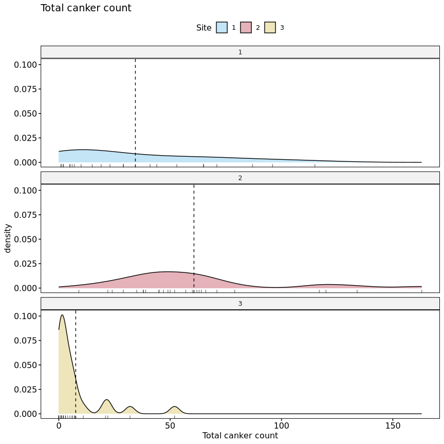
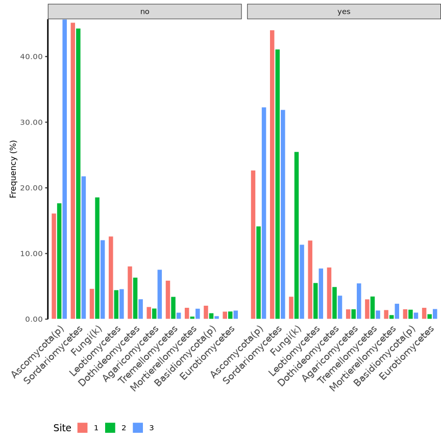
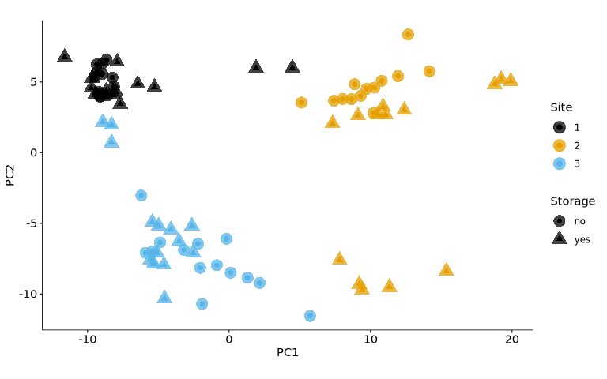
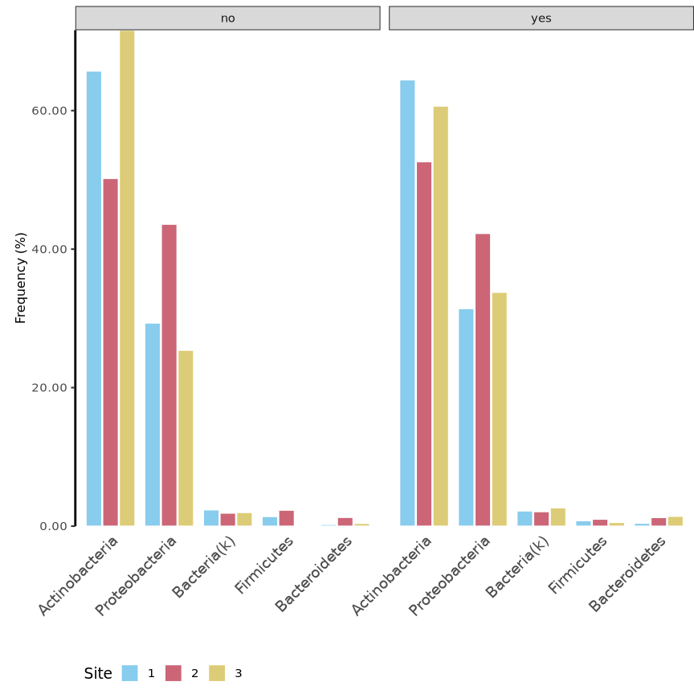
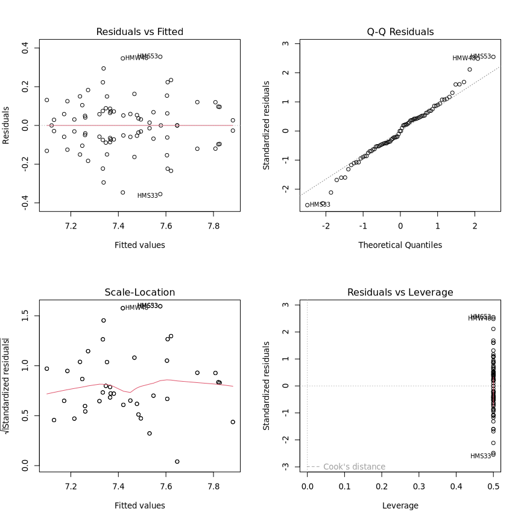
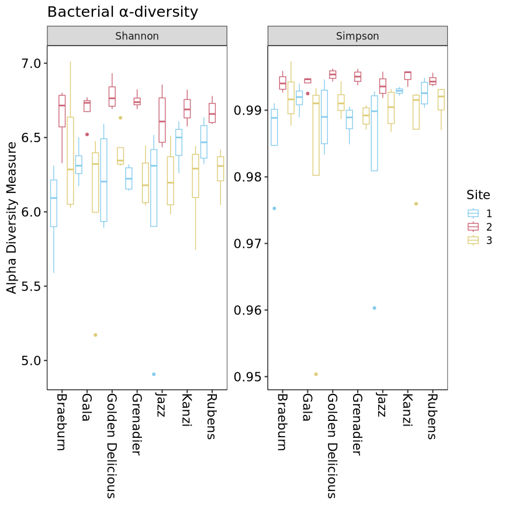
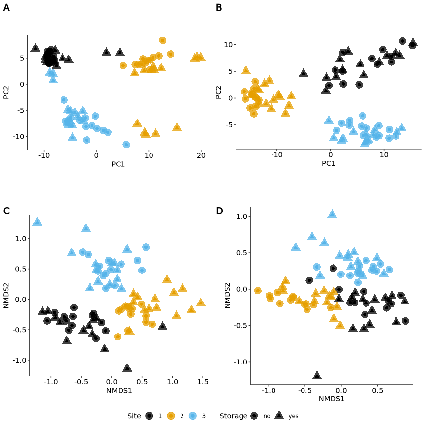

Built with R version  4.3.3.


## Setup

### Libraries


``` r
# library(car)
library(cowplot)
library(data.table)
library(DESeq2)
library(DHARMa)
library(ggpubr)
library(grid)
library(gridExtra)
library(iNEXT)
library(kableExtra)
library(knitr)
library(lmPerm)
library(MASS)
library(pscl)
# library(rcompanion)
library(seqinr)
library(tidyverse)
library(vegan)
library(viridis)

# devtools::install_github("eastmallingresearch/Metabarcoding_pipeline/scripts")
library(metafuncs)
```

### Functions and constants


``` r
ALPHA =        0.1   # DESeq2 alpha value
OTUFILTER =    0.01  # Remove OTUs with proportion of total reads below value
READFILTER =   0.05  # Will remove samples with read sum below sample_median_reads*READFILTER 
PAIREDONLY =   F     # Will remove the pair of samples which fail the readfilter - probably only useful for DESeq separated by type NOTE removes pairs before DESeq object is created   
TAXCONF =      0.80  # Sets the taxonomy confidence level to get "rank" in taxonomy files
TOPOTU =       10    # Number of Top OTUs for summary information
DIFFOTU =      200   # Number of Top OTUs for correlation analysis
FUNASVFILTER = 0 # 0.05  # Filter fungal ASVs with proportion of total reads below value
BACASVFILTER = 0 # 0.5   # Filter bacterial ASVs with proportion of total reads below value

# graphics
DEVICE =       "png"
DPI =          1200
WIDTH =        9
HEIGHT =       9

# Model design
FACTORS = c("Site", "Storage", "Scion")
DESIGN = y ~ Site + Storage + Scion
FULL_DESIGN = y ~ Site * Storage * Scion
canker_design = "Cankers ~ Site * Storage * Scion"
```


``` r
# colour blind palette
cbPalette <- c(
  "#000000", "#E69F00", "#56B4E9", "#009E73", 
  "#F0E442", "#0072B2", "#D55E00", "#CC79A7"
)

source("functions/metabarcoding.R")
source("functions/loadme.R")
source("functions/rarefaction.R")
```

## Load data

Bacterial and fungal ASV (ZOTU) tables, sample metadata, and taxonomy files are
loaded into named lists using the `loadData` function from Greg's `metafuncs` 
package.

Site names are encoded as follows according to previous work:

- Avalon (East Sutton) -> 1
- Scripps (Brenchley) -> 2
- WWF (Pluckley) -> 3


``` r
metadata <- "sample_metadata.txt"

# Load data
ubiome_FUN <- loadData("data/FUN.zotu_table.txt",metadata,"data/zFUN.sintax.taxa",RHB="FUN")
ubiome_BAC <- loadData("data/BAC.zotu_table.txt",metadata,"data/zBAC.sintax.taxa",RHB="BAC")

# Change sites Avalon -> 1, Scripps -> 2, and WWF -> 3.
# Storage from planting date.
# No storage for December plantings, yes for March and April (4 months).
mutate_factors <- function(data){
  data <- data %>%
    rename(location = site, Scion = cultivar) %>%
    mutate(
      Site = case_when(
        location == "Avalon" ~ 1,
        location == "Scripps" ~ 2,
        location == "WWF" ~ 3
      ) %>% as.factor(),
      Storage = case_when(
        planting_date %in% c("march", "april") ~ "yes",
        planting_date %in% c("dec") ~ "no"
      ) %>% as.factor(),
      Scion = as.factor(Scion)
    )
  return(data)
}

ubiome_FUN$colData <- mutate_factors(ubiome_FUN$colData)
ubiome_BAC$colData <- mutate_factors(ubiome_BAC$colData)

# In taxData and countData replace 'OTU' with 'ASV'
rownames(ubiome_FUN$taxData) <- gsub("OTU", "ASV", rownames(ubiome_FUN$taxData))
rownames(ubiome_BAC$taxData) <- gsub("OTU", "ASV", rownames(ubiome_BAC$taxData))

rownames(ubiome_FUN$countData) <- gsub("OTU", "ASV", rownames(ubiome_FUN$countData))
rownames(ubiome_BAC$countData) <- gsub("OTU", "ASV", rownames(ubiome_BAC$countData))
```

### Global removals


``` r
# Sample "A2-7" removed due to missampling.
ubiome_BAC$colData <- ubiome_BAC$colData[!rownames(ubiome_BAC$colData) %in% "HMA27", ]
ubiome_BAC$countData <- ubiome_BAC$countData[, !colnames(ubiome_BAC$countData) %in% "HMA27"]
ubiome_FUN$colData <- ubiome_FUN$colData[!rownames(ubiome_FUN$colData) %in% "HMA27", ]
ubiome_FUN$countData <- ubiome_FUN$countData[, !colnames(ubiome_FUN$countData) %in% "HMA27"]
```

## Filter samples and ASVs

### Filtering taxa

Plantae taxa are filtered from fungal `taxData`.
Chloroplast and Eukaryote  taxa are filtered from bacterial `taxData`.
Corresponding ASVs are removed from `countData`.


``` r
# Filter Plant, Chloroplast, and Eukaryote ASVs

# Fungi: Plantae ASVs
cat("Fungi:", length(grep("Plantae", ubiome_FUN$taxData$kingdom)), "Plantae ASVs\n")
```

```
# Fungi: 0 Plantae ASVs
```

``` r
# Bacteria: Chloroplast (Streptophyta) and Eukaryote ASVs
cat(
  "Bacteria:", length(grep("Streptophyta", ubiome_BAC$taxData$genus)), "Chloroplast ASVs;", 
  length(grep("Eukaryota", ubiome_BAC$taxData$kingdom)), "Eukaryote ASVs\n"
)
```

```
# Bacteria: 37 Chloroplast ASVs; 188 Eukaryote ASVs
```

``` r
# Filter Chloroplast and Eukaryote
filt <- rownames(
  ubiome_BAC$taxData[
    grepl("Streptophyta", ubiome_BAC$taxData$genus) & 
    as.numeric(ubiome_BAC$taxData$g_conf) >= TAXCONF,
  ]
)

filt <- c(filt, rownames(ubiome_BAC$taxData[grep("Eukaryota", ubiome_BAC$taxData$kingdom), ]))

cat("Bacteria: removing", length(filt), "ASVs")
```

```
# Bacteria: removing 198 ASVs
```

``` r
ubiome_BAC$taxData <- ubiome_BAC$taxData[!rownames(ubiome_BAC$taxData) %in% filt, ]
ubiome_BAC$countData <- ubiome_BAC$countData[!rownames(ubiome_BAC$countData) %in% filt, ]
```

### Filtering samples

Plot rarefaction curves.

Remove samples with read count below 5 % of median.


``` r
invisible(mapply(assign, names(ubiome_BAC), ubiome_BAC, MoreArgs = list(envir = globalenv())))
rare_bac <- gfunc(countData, colData, "Bacteria")
# rare_bac <- gfunc(as.data.frame(counts(dds)), as.data.frame(colData(dds)), "Bacteria ZOTU")
invisible(mapply(assign, names(ubiome_FUN), ubiome_FUN, MoreArgs = list(envir = globalenv())))
rare_fun <- gfunc(countData, colData, "Fungi")
# rare_fun <- gfunc(as.data.frame(counts(dds)), as.data.frame(colData(dds)), "Fungi ZOTU")

rarefaction_plots <- grid.arrange(
  rare_bac, rare_fun,
  left = textGrob(label = expression("log"[10] * " aligned sequences"), rot = 90),
  bottom = "ASV count", nrow = 2
)

ggsave(filename = "rarefaction_plots.png", plot = rarefaction_plots, path = "figures/")

rarefaction_plots

# Fungi
med <- median(colSums(ubiome_FUN$countData))
filt <- !colSums(ubiome_FUN$countData) > med * READFILTER
cat("Fungi: ",sum(filt),"sample(s) removed\n")

# Bacteria
med <- median(colSums(ubiome_BAC$countData))
filt <- !colSums(ubiome_BAC$countData) > med * READFILTER
cat("Bacteria: ",sum(filt),"sample(s) removed\n")
```

### Filter ASVs

#### ASV read count

Number of ASVs which account for 50 %, 80 %, and 99 % of total reads.


``` r
asv_propotions <- function(countData, proportion){
  i <- sum(countData)
  y <- rowSums(countData)
  y <- y[order(y, decreasing = T)]
  asvs <- length(y[(cumsum(y) / i <= proportion)])
  return(asvs)
}

proportions <- c(0.5, 0.9, 0.99, 1)

top_asvs <- data.table(
  "proportion" = proportions,
  "Fungi" = lapply(proportions, function(x) asv_propotions(ubiome_FUN$countData, x)),
  "Bacteria" = lapply(proportions, function(x) asv_propotions(ubiome_BAC$countData, x))
)

top_asvs %>%
  kbl() %>%
  kable_styling("striped", full_width = F)
```

<table class="table table-striped" style="width: auto !important; margin-left: auto; margin-right: auto;">
 <thead>
  <tr>
   <th style="text-align:right;"> proportion </th>
   <th style="text-align:left;"> Fungi </th>
   <th style="text-align:left;"> Bacteria </th>
  </tr>
 </thead>
<tbody>
  <tr>
   <td style="text-align:right;"> 0.50 </td>
   <td style="text-align:left;"> 10 </td>
   <td style="text-align:left;"> 169 </td>
  </tr>
  <tr>
   <td style="text-align:right;"> 0.90 </td>
   <td style="text-align:left;"> 171 </td>
   <td style="text-align:left;"> 2186 </td>
  </tr>
  <tr>
   <td style="text-align:right;"> 0.99 </td>
   <td style="text-align:left;"> 995 </td>
   <td style="text-align:left;"> 5883 </td>
  </tr>
  <tr>
   <td style="text-align:right;"> 1.00 </td>
   <td style="text-align:left;"> 2401 </td>
   <td style="text-align:left;"> 7265 </td>
  </tr>
</tbody>
</table>

#### Filter ASVs

Remove ASVs with read count below 1 % of total reads.


``` r
# Fungi
keep <- filter_otus(ubiome_FUN$countData, OTUFILTER)
cat(
  "Fungi:\n", 
  " - total ASVs:", nrow(ubiome_FUN$countData), "\n",
  " - removing", nrow(ubiome_FUN$countData) - length(keep), "ASVs\n",
  " - remaining ASVs:", length(keep), "\n"
)
```

```
# Fungi:
#   - total ASVs: 2401 
#   - removing 1406 ASVs
#   - remaining ASVs: 995
```

``` r
ubiome_FUN$taxData <- ubiome_FUN$taxData[rownames(ubiome_FUN$taxData) %in% keep,]
ubiome_FUN$countData <- ubiome_FUN$countData[rownames(ubiome_FUN$countData) %in% keep,]

# Bacteria
keep <-  filter_otus(ubiome_BAC$countData, OTUFILTER)
cat(
  "Bacteria:\n",
  " - total ASVs:", nrow(ubiome_BAC$countData), "\n",
  " - removing", nrow(ubiome_BAC$countData) - length(keep), "ASVs\n",
  " - remaining ASVs:", length(keep), "\n"
)
```

```
# Bacteria:
#   - total ASVs: 7265 
#   - removing 1382 ASVs
#   - remaining ASVs: 5883
```

``` r
ubiome_BAC$taxData <- ubiome_BAC$taxData[rownames(ubiome_BAC$taxData) %in% keep,]
ubiome_BAC$countData <- ubiome_BAC$countData[rownames(ubiome_BAC$countData) %in% keep,]
```

## Absolute abundance normalisation

ASV normalisation is performed using qPCR theoretical copy number data.
Copy number is calculated per mg of root sample from the qPCR data.

### Prepare qPCR abundance data


``` r
abundance <- fread("mean_abundance.csv")

# Add sample ID to abundance data
abundance$id <- paste0("HM", gsub("-", "", abundance$Sample))
# abundance$id <- abundance$Sample
abundance$copy_number <- abundance$MeanAdjustedTCN_mg
abundance$log_copy_number <- log10(abundance$copy_number)

# Add bacterial (16S) and fungal (ITS) abundance to ubiome BAC and FUN named lists
ubiome_FUN$abundance <- abundance[abundance$Target == "ITS"] %>%
  column_to_rownames(var = "id")
ubiome_BAC$abundance <- abundance[abundance$Target == "16S"] %>%
  column_to_rownames(var = "id")

# Merge copy number from abundance with colData
ubiome_FUN$colData <- merge(
  ubiome_FUN$colData, 
  ubiome_FUN$abundance[, c("Target", "copy_number", "log_copy_number")], 
  by = 0
) %>% column_to_rownames(var = "Row.names")
ubiome_BAC$colData <- merge(
  ubiome_BAC$colData, 
  ubiome_BAC$abundance[, c("Target", "copy_number", "log_copy_number")], 
  by = 0
) %>% column_to_rownames(var = "Row.names")
```

#### Remove outliers


``` r
# Detect outliers with std > threshold from the median
detect_outliers <- function(x, val, threshold, na.rm = TRUE) {
  med_x <- median(x[[val]], na.rm = na.rm)
  sd_x <- sd(x[[val]], na.rm = na.rm)
  outliers <- x[x[[val]] > (med_x + threshold * sd_x) | x[[val]] < (med_x - threshold * sd_x), ]
  return(outliers)
}

outliers_FUN <- detect_outliers(ubiome_FUN$abundance, "MeanAdjustedTCN_mg", 3)
outliers_BAC <- detect_outliers(ubiome_BAC$abundance, "MeanAdjustedTCN_mg", 3)

# Remove samples with copy number > 3 std from the median
outliers <- rownames(outliers_FUN)
ubiome_FUN$abundance <- ubiome_FUN$abundance[!rownames(ubiome_FUN$abundance) %in% outliers, ]
ubiome_FUN$countData <- ubiome_FUN$countData[, !colnames(ubiome_FUN$countData) %in% outliers]
ubiome_FUN$colData <- ubiome_FUN$colData[!rownames(ubiome_FUN$colData) %in% outliers, ]

cat("Fungi: removing", length(outliers), "outlier(s)\n")
```

```
# Fungi: removing 1 outlier(s)
```

Sample A1-3 is removed from the fungal data due to abnormally high copy number.

## Canker count data

Canker count data for sampled trees only.


``` r
# Canker count data for sampled trees only

canker_data <- fread("canker_data.csv", select = c(1:5, 7:34))

# Remove spaces from column names and convert to lowercase
colnames(canker_data) <- tolower(gsub(" ", "_", colnames(canker_data)))

# Codify site names, add storage and total canker count for timepoint 4
canker_data <- mutate(
  canker_data,
  Site = case_when(
    site == "Avalon" ~ 1,
    site == "Scripps" ~ 2,
    site == "WWF" ~ 3
  ) %>% as.factor(),
  Storage = case_when(
    planting_date %in% c("March", "April") ~ "yes",
    planting_date %in% c("Dec") ~ "no"
  ),
  Scion = as.factor(cultivar),
  total_cankers = a4 + b4 + c4 + d4 + e4
)

# Identify samples with missing values
missing <- unique(canker_data[!complete.cases(canker_data), code])

# Also remove sample A2-7 due to missampling
missing <- c(missing, "HMA27")

# Remove missing samples from canker data
canker_data <- canker_data[!canker_data$code %in% missing, ]

# Verify that there are two trees for each sample
canker_data %>% group_by(code) %>% summarise(n = n()) %>% filter(n != 2)
```

```
# # A tibble: 0 × 2
# # ℹ 2 variables: code <chr>, n <int>
```

``` r
# Sum of total cankers for each pair of trees with matching code
cankers <- canker_data %>% 
  group_by(code) %>% 
  summarise(
    Site = first(Site),
    Storage = first(Storage),
    Scion = first(Scion),
    Cankers = sum(total_cankers)
  ) %>% 
  column_to_rownames("code")

# Add total canker count to colData for both FUN and BAC
ubiome_FUN$colData <- merge(
  ubiome_FUN$colData, 
  cankers["Cankers"], 
  by = 0,
  all.x = T
) %>% column_to_rownames("Row.names")

ubiome_BAC$colData <- merge(
  ubiome_BAC$colData, 
  cankers["Cankers"], 
  by = 0,
  all.x = T
) %>% column_to_rownames("Row.names")
```

Summary stats


``` r
# png("figures/hist.png", width = 800, height = 600)
# hist(cankers$Cankers, breaks = 20, main = "Total canker count", xlab = "Total canker count")
# dev.off()

cankers_hist <- ggdensity(
  cankers, x = "Cankers", fill = "Site", facet.by = "Site", ncol = 1,
  add = "mean", rug = T, palette = cbPalette,
  title = "Total canker count", xlab = "Total canker count"
)

cankers_hist
```

<!-- -->

``` r
ggsave(filename = "cankers_hist.png", plot = cankers_hist, path = "figures/")

cankers_box <- ggboxplot(
  cankers, x = "Site", y = "Cankers", palette = cbPalette,
  color = "Scion", add = "jitter", legend = "top", 
  title = "Total canker count", xlab = "Site", ylab = "Total canker count"
)

cankers_box
```

<!-- -->

``` r
ggsave(filename = "cankers_box.png", plot = cankers_box, path = "figures/")

cankers_bar <- ggbarplot(
  cankers, x = "Site", y = "Cankers", fill = "Scion", 
  palette = cbPalette, add = "mean_se", position = position_dodge(0.8),
  title = "Total canker count", xlab = "Site", ylab = "Total canker count"
)

cankers_bar
```

<!-- -->

``` r
ggsave(filename = "cankers_bar.png", plot = cankers_bar, path = "figures/")
```

GLM


``` r
# Effect of Site, Scion, and Storage on canker count

# Formula
formula <- update(FULL_DESIGN, Cankers ~ .)
# formula <- Cankers ~ Site + Storage + Scion + site:Storage + site:Scion + Storage:Scion

# Log-linear model
canker_lm <- lm(update(FULL_DESIGN, log(Cankers + 1) ~ .), data = cankers)

par(mfrow = c(2, 2))
plot(canker_lm)
```

<!-- -->

``` r
# Residual checking
res <- resid(canker_lm, type = "pearson")

# Poisson model
canker_poisson <- glm(formula, data = cankers, family = "poisson")

poisson_plot <- plot(simulateResiduals(canker_poisson), title = "Poisson model")
```

<!-- -->

``` r
# Model overdispersed

# Negative binomial model
canker_negbin <- glm.nb(formula, data = cankers)

sim <- simulateResiduals(canker_negbin)

plot(sim, title = "Negative binomial model")
```

<!-- -->

``` r
# canker_model_plots <- ggarrange(lm_plot, poisson_plot, negbin_plot, ncol = 3)

# ggsave(filename = "canker_model_plots.png", plot = canker_model_plots, path = "figures/")

# png("figures/canker_residuals.png", width = 800, height = 600)
# plot(sim)
# dev.off()

testZeroInflation(sim)
```

```
# 
# 	DHARMa zero-inflation test via comparison to expected zeros with
# 	simulation under H0 = fitted model
# 
# data:  simulationOutput
# ratioObsSim = 0.77399, p-value = 0.76
# alternative hypothesis: two.sided
```

``` r
nagelkerke(canker_negbin)
```

```
# Error in nagelkerke(canker_negbin): could not find function "nagelkerke"
```

``` r
# Model good fit

canker_anova <- anova(canker_negbin, test = "Chisq") %>% data.frame()
total_deviance <- sum(canker_anova$Deviance, na.rm = T) + tail(canker_anova$Resid..Dev, 1)
canker_anova$Perc..Dev <- canker_anova$Deviance / total_deviance * 100

canker_anova
```

```
#                    Df     Deviance Resid..Df Resid..Dev     Pr..Chi.
# NULL               NA           NA        73  314.98196           NA
# Site                2 118.75744595        71  196.22452 1.629852e-26
# Storage             1   0.02066259        70  196.20386 8.857019e-01
# Scion               6  24.29375368        64  171.91010 4.611042e-04
# Site:Storage        2  28.86115598        62  143.04895 5.406044e-07
# Site:Scion         12  31.65405909        50  111.39489 1.564383e-03
# Storage:Scion       6   7.40666778        44  103.98822 2.848693e-01
# Site:Storage:Scion 11  26.62949240        33   77.35873 5.225415e-03
#                       Perc..Dev
# NULL                         NA
# Site               37.702935303
# Storage             0.006559927
# Scion               7.712744377
# Site:Storage        9.162796386
# Site:Scion         10.049483066
# Storage:Scion       2.351457744
# Site:Storage:Scion  8.454291190
```

<!-- -->

## Create DESeq objects


``` r
# Make sure countData and colData still match, if they do, create DESeq objects, if not throw error
if(identical(colnames(ubiome_FUN$countData), rownames(ubiome_FUN$colData))) {
  # Create DESeq object
  ubiome_FUN$dds <- ubiom_to_des(ubiome_FUN)
  print("FUN DESeq object created")
} else {
  stop("FUN countData and colData do not match")
}
```

```
# [1] "FUN DESeq object created"
```

``` r
if(identical(colnames(ubiome_BAC$countData), rownames(ubiome_BAC$colData))) {
  # Create DESeq object
  ubiome_BAC$dds <- ubiom_to_des(ubiome_BAC)
  print("BAC DESeq object created")
} else {
  stop("BAC countData and colData do not match")
}
```

```
# [1] "BAC DESeq object created"
```

## Abundance normalisation

Absolute abundance normalisation using DESeq2 size factors.

Values are centred around the mean of the copy number.


``` r
# Normalise count data using DESeq2 size factors

ubiome_FUN$dds$sizeFactor <- ubiome_FUN$dds$copy_number / mean(ubiome_FUN$dds$copy_number)
ubiome_BAC$dds$sizeFactor <- ubiome_BAC$dds$copy_number / mean(ubiome_BAC$dds$copy_number)
```


``` r
# Save environment
save.image("data_loaded.RData")
```

<!-- #=============================================================================== -->
# **Fungi**
<!-- #=============================================================================== -->


``` r
# Unpack fungi data
invisible(mapply(assign, names(ubiome_FUN), ubiome_FUN, MoreArgs = list(envir = globalenv())))
```

## ASV and sample summary

### Read and sample summary


``` r
cat(
  "Raw reads", "\n\n",
  "Total raw reads:\t\t", sum(countData), "\n",
  "Mean raw reads per sample:\t", mean(colSums(countData)), "\n",
  "Median raw reads per sample:\t", median(colSums(countData)), "\n",
  "Max raw reads per sample:\t", max(colSums(countData)), "\n",
  "Min raw reads per sample:\t", min(colSums(countData)), "\n\n"
)
```

```
# Raw reads 
# 
#  Total raw reads:		 7293776 
#  Mean raw reads per sample:	 90046.62 
#  Median raw reads per sample:	 93435 
#  Max raw reads per sample:	 113518 
#  Min raw reads per sample:	 38472
```

``` r
#colSums(countData)

nct <- counts(dds, normalize = T)
cat("Normalised reads", "\n\n",
  "Total normalised reads:\t\t", sum(nct), "\n",
  "Mean normalised reads per sample:\t", mean(colSums(nct)), "\n",
  "Median normalised reads per sample:\t", median(colSums(nct)), "\n",
  "Min normalised reads per sample:\t", min(colSums(nct)), "\n",
  "Max normalised reads per sample:\t", max(colSums(nct)), "\n\n"
)
```

```
# Normalised reads 
# 
#  Total normalised reads:		 12468857 
#  Mean normalised reads per sample:	 153936.5 
#  Median normalised reads per sample:	 98624.28 
#  Min normalised reads per sample:	 28901.7 
#  Max normalised reads per sample:	 881441.3
```

``` r
#round(colSums(counts(dds,normalize = T)),0)
```

### ASV summary 


``` r
cat(
  "Total ASVs:\t\t", nrow(taxData),"\n\n",
  "Raw reads per ASV summary", "\n\n",
  "Mean raw reads per ASV:\t", mean(rowSums(countData)),"\n",
  "Median raw per ASV:\t\t", median(rowSums(countData)),"\n",
  "ASV raw Min reads:\t\t", min(rowSums(countData)),"\n",
  "ASV raw Max reads:\t\t", max(rowSums(countData)),"\n\n"
)
```

```
# Total ASVs:		 995 
# 
#  Raw reads per ASV summary 
# 
#  Mean raw reads per ASV:	 7330.428 
#  Median raw per ASV:		 588 
#  ASV raw Min reads:		 115 
#  ASV raw Max reads:		 714327
```

``` r
cat(
  "Normalised reads per ASV summary","\n\n",
  "Mean normalised reads per ASV:\t\t", mean(rowSums(nct)),"\n",
  "Median normalised reads per ASV:\t", median(rowSums(nct)),"\n",
  "ASV normalised Min reads:\t\t", min(rowSums(nct)),"\n",
  "ASV normalised Max reads:\t\t", max(rowSums(nct)),"\n\n"
)
```

```
# Normalised reads per ASV summary 
# 
#  Mean normalised reads per ASV:		 12531.51 
#  Median normalised reads per ASV:	 1025.725 
#  ASV normalised Min reads:		 101.2814 
#  ASV normalised Max reads:		 1509459
```

``` r
y <- rowSums(nct)
y <- y[order(y, decreasing = T)]
# proportion
xy <- y / sum(y)

cat("Top " ,TOPOTU, "ASVs:\n")
```

```
# Top  10 ASVs:
```

``` r
data.frame(
  counts = y[1:TOPOTU], 
  proportion = xy[1:TOPOTU], 
  rank = taxData[names(y)[1:TOPOTU],]$rank
) %>%
  kbl() %>%
  kable_styling("striped", full_width = F)
```

<table class="table table-striped" style="width: auto !important; margin-left: auto; margin-right: auto;">
 <thead>
  <tr>
   <th style="text-align:left;">   </th>
   <th style="text-align:right;"> counts </th>
   <th style="text-align:right;"> proportion </th>
   <th style="text-align:left;"> rank </th>
  </tr>
 </thead>
<tbody>
  <tr>
   <td style="text-align:left;"> ASV2 </td>
   <td style="text-align:right;"> 1509458.8 </td>
   <td style="text-align:right;"> 0.1210583 </td>
   <td style="text-align:left;"> Ascomycota(p) </td>
  </tr>
  <tr>
   <td style="text-align:left;"> ASV1 </td>
   <td style="text-align:right;"> 1490469.5 </td>
   <td style="text-align:right;"> 0.1195354 </td>
   <td style="text-align:left;"> Dactylonectria macrodidyma(s) </td>
  </tr>
  <tr>
   <td style="text-align:left;"> ASV5 </td>
   <td style="text-align:right;"> 1068164.1 </td>
   <td style="text-align:right;"> 0.0856666 </td>
   <td style="text-align:left;"> Leotiomycetes(c) </td>
  </tr>
  <tr>
   <td style="text-align:left;"> ASV4 </td>
   <td style="text-align:right;"> 1059908.0 </td>
   <td style="text-align:right;"> 0.0850044 </td>
   <td style="text-align:left;"> Ascomycota(p) </td>
  </tr>
  <tr>
   <td style="text-align:left;"> ASV3 </td>
   <td style="text-align:right;"> 480660.1 </td>
   <td style="text-align:right;"> 0.0385488 </td>
   <td style="text-align:left;"> Ilyonectria destructans(s) </td>
  </tr>
  <tr>
   <td style="text-align:left;"> ASV7 </td>
   <td style="text-align:right;"> 290896.6 </td>
   <td style="text-align:right;"> 0.0233299 </td>
   <td style="text-align:left;"> Fusarium(g) </td>
  </tr>
  <tr>
   <td style="text-align:left;"> ASV6 </td>
   <td style="text-align:right;"> 227927.9 </td>
   <td style="text-align:right;"> 0.0182798 </td>
   <td style="text-align:left;"> Ilyonectria robusta(s) </td>
  </tr>
  <tr>
   <td style="text-align:left;"> ASV9 </td>
   <td style="text-align:right;"> 201690.6 </td>
   <td style="text-align:right;"> 0.0161755 </td>
   <td style="text-align:left;"> Ascomycota(p) </td>
  </tr>
  <tr>
   <td style="text-align:left;"> ASV8 </td>
   <td style="text-align:right;"> 191083.5 </td>
   <td style="text-align:right;"> 0.0153249 </td>
   <td style="text-align:left;"> Fusarium(g) </td>
  </tr>
  <tr>
   <td style="text-align:left;"> ASV11 </td>
   <td style="text-align:right;"> 131684.2 </td>
   <td style="text-align:right;"> 0.0105610 </td>
   <td style="text-align:left;"> Truncatella angustata(s) </td>
  </tr>
</tbody>
</table>

## Taxonomy Summary

### Taxonomy identifiable

Proportion of ASVs which can be assigned (with the given confidence) at each taxonomic rank.


``` r
# Proportion of ASVs which can be assigned (with the given confidence) at each taxonomic rank

tx <- copy(taxData)
setDT(tx)
cols <- names(tx)[9:15]

tx[, (cols) := lapply(.SD, as.factor), .SDcols = cols]

data.table(
  rank = c("kingdom", "phylum", "class", "order", "family", "genus", "species"),
  "0.8" = round(unlist(lapply(cols, function(col) sum(as.number(tx[[col]]) >= 0.8) / nrow(tx))), 2),
  "0.65" = round(unlist(lapply(cols, function(col) sum(as.number(tx[[col]]) >= 0.65) / nrow(tx))), 2),
  "0.5" = round(unlist(lapply(cols, function(col) sum(as.number(tx[[col]]) >= 0.5) / nrow(tx))), 2)
) %>%
  kbl() %>%
  kable_styling("striped", full_width = F)
```

<table class="table table-striped" style="width: auto !important; margin-left: auto; margin-right: auto;">
 <thead>
  <tr>
   <th style="text-align:left;"> rank </th>
   <th style="text-align:right;"> 0.8 </th>
   <th style="text-align:right;"> 0.65 </th>
   <th style="text-align:right;"> 0.5 </th>
  </tr>
 </thead>
<tbody>
  <tr>
   <td style="text-align:left;"> kingdom </td>
   <td style="text-align:right;"> 1.00 </td>
   <td style="text-align:right;"> 1.00 </td>
   <td style="text-align:right;"> 1.00 </td>
  </tr>
  <tr>
   <td style="text-align:left;"> phylum </td>
   <td style="text-align:right;"> 0.84 </td>
   <td style="text-align:right;"> 0.87 </td>
   <td style="text-align:right;"> 0.90 </td>
  </tr>
  <tr>
   <td style="text-align:left;"> class </td>
   <td style="text-align:right;"> 0.70 </td>
   <td style="text-align:right;"> 0.74 </td>
   <td style="text-align:right;"> 0.78 </td>
  </tr>
  <tr>
   <td style="text-align:left;"> order </td>
   <td style="text-align:right;"> 0.54 </td>
   <td style="text-align:right;"> 0.60 </td>
   <td style="text-align:right;"> 0.64 </td>
  </tr>
  <tr>
   <td style="text-align:left;"> family </td>
   <td style="text-align:right;"> 0.42 </td>
   <td style="text-align:right;"> 0.45 </td>
   <td style="text-align:right;"> 0.49 </td>
  </tr>
  <tr>
   <td style="text-align:left;"> genus </td>
   <td style="text-align:right;"> 0.38 </td>
   <td style="text-align:right;"> 0.42 </td>
   <td style="text-align:right;"> 0.47 </td>
  </tr>
  <tr>
   <td style="text-align:left;"> species </td>
   <td style="text-align:right;"> 0.24 </td>
   <td style="text-align:right;"> 0.30 </td>
   <td style="text-align:right;"> 0.35 </td>
  </tr>
</tbody>
</table>

% of reads which can be assigned to each taxonomic ranks


``` r
tx <-taxData[rownames(dds),]
nc <- counts(dds, normalize = T)
ac <- sum(nc)

data.table(
  rank = c("kingdom", "phylum", "class", "order", "family", "genus", "species"),
  "0.8" = round(unlist(lapply(cols, function(col)(sum(nc[which(as.numeric(tx[[col]]) >= 0.8),]) / ac * 100))), 2),
  "0.65" = round(unlist(lapply(cols, function(col)(sum(nc[which(as.numeric(tx[[col]]) >= 0.65),]) / ac * 100))), 2),
  "0.5" = round(unlist(lapply(cols, function(col)(sum(nc[which(as.numeric(tx[[col]]) >= 0.5),]) / ac * 100))), 2)
) %>%
  kbl() %>%
  kable_styling("striped", full_width = F)
```

<table class="table table-striped" style="width: auto !important; margin-left: auto; margin-right: auto;">
 <thead>
  <tr>
   <th style="text-align:left;"> rank </th>
   <th style="text-align:right;"> 0.8 </th>
   <th style="text-align:right;"> 0.65 </th>
   <th style="text-align:right;"> 0.5 </th>
  </tr>
 </thead>
<tbody>
  <tr>
   <td style="text-align:left;"> kingdom </td>
   <td style="text-align:right;"> 100.00 </td>
   <td style="text-align:right;"> 100.00 </td>
   <td style="text-align:right;"> 100.00 </td>
  </tr>
  <tr>
   <td style="text-align:left;"> phylum </td>
   <td style="text-align:right;"> 84.14 </td>
   <td style="text-align:right;"> 96.59 </td>
   <td style="text-align:right;"> 96.83 </td>
  </tr>
  <tr>
   <td style="text-align:left;"> class </td>
   <td style="text-align:right;"> 60.12 </td>
   <td style="text-align:right;"> 70.92 </td>
   <td style="text-align:right;"> 71.47 </td>
  </tr>
  <tr>
   <td style="text-align:left;"> order </td>
   <td style="text-align:right;"> 53.49 </td>
   <td style="text-align:right;"> 58.87 </td>
   <td style="text-align:right;"> 68.76 </td>
  </tr>
  <tr>
   <td style="text-align:left;"> family </td>
   <td style="text-align:right;"> 44.97 </td>
   <td style="text-align:right;"> 46.80 </td>
   <td style="text-align:right;"> 50.25 </td>
  </tr>
  <tr>
   <td style="text-align:left;"> genus </td>
   <td style="text-align:right;"> 46.06 </td>
   <td style="text-align:right;"> 48.01 </td>
   <td style="text-align:right;"> 50.72 </td>
  </tr>
  <tr>
   <td style="text-align:left;"> species </td>
   <td style="text-align:right;"> 30.44 </td>
   <td style="text-align:right;"> 36.70 </td>
   <td style="text-align:right;"> 41.62 </td>
  </tr>
</tbody>
</table>

### Taxonomy plots

Plots of proportion of normalised reads assigned to members of phylum and class.


``` r
dat <- list(as.data.frame(counts(dds, normalize = T)), taxData, as.data.frame(colData(dds)))

design <- c("Site", "Storage")

# md1 <- getSummedTaxa(dat, conf = TAXCONF, design = design, cutoff = 0.1)
md1 <- getSummedTaxa(dat, conf = TAXCONF, design = design, taxon = "phylum", cutoff = 0.1)

md1[, Site := factor(Site, levels = c(1, 2, 3))]
md1[, Storage := factor(Storage, levels = c("no", "yes"))]
md1[, taxon := factor(taxon, levels = unique(taxon[order(value, decreasing = T)]))]

removals <- md1[, .(value = mean(value)), by = "taxon"][value < 0.5, taxon]
md1 <- md1[!taxon %in% removals, ]

fun_phylum_plot <- plotfun1(md1, x = "taxon", fill = "Site") +
  facet_wrap(~ Storage)

ggsave("figures/fun_phylum.png", fun_phylum_plot, width = 25, height = 15, units = "cm")

fun_phylum_plot
```

<!-- -->

``` r
md2 <- getSummedTaxa(dat, conf = TAXCONF, design = design, taxon = "class", cutoff = 0.1)

md2[, Site := factor(Site, levels = c(1, 2, 3))]
md2[, Storage := factor(Storage, levels = c("no", "yes"))]
md2[, taxon := factor(taxon, levels = unique(taxon[order(value, decreasing = T)]))]

removals <- md2[, .(value = mean(value)), by = "taxon"][value < 0.5, taxon]
md2 <- md2[!taxon %in% removals, ]

fun_class_plot <- plotfun1(md2, x = "taxon", fill = "Site") +
  facet_wrap(~ Storage)

ggsave("figures/fun_class.png", fun_class_plot, width = 25, height = 15, units = "cm")

fun_class_plot
```

<!-- -->

## Abundance

Plot copy number for each sample grouped by site, Scion, and Storage.
Test the effect of site, Scion, and Storage on copy number using ANOVA.


``` r
# abundance_plot <- ggplot(
#   data = as.data.frame(colData(dds)), 
#   aes(x = site, y = log_copy_number, colour = Scion, shape = Storage)
# ) + geom_jitter() + 
#   scale_colour_manual(values = cbPalette)

fun_abundance_box <- ggboxplot(
  data = as.data.frame(colData(dds)), x = "Site", y = "log_copy_number", 
  color = "Scion", add = "jitter", legend = "top", 
  title = "Fungal abundance", xlab = "Site", ylab = "log10 copy number"
)

ggsave(
  filename = "fun_abundance.png", plot = fun_abundance_box, path = "figures/", 
  height = 20, width = 20, units = "cm"
)

fun_abundance_box
```

<!-- -->

``` r
fun_abundance_bar <- ggbarplot(
  data = as.data.frame(colData(dds)), x = "Storage", y = "log_copy_number", 
  fill = "Site", add = "mean_se", 
  palette = cbPalette, position = position_dodge(0.8),
  title = "(a) Fungal abundance", xlab = "Storage ", ylab = "Mean copy number (log10)"
) + guides(fill = guide_legend(title = "Site"))

ggsave(
  filename = "fun_abundance_bar.png", plot = fun_abundance_bar, path = "figures/", 
  height = 20, width = 20, units = "cm"
)

fun_abundance_bar
```

<!-- -->

``` r
# Formula for ANOVA
formula <- update(FULL_DESIGN, log_copy_number ~ .)

abundance_anova <- aov(formula, data = as.data.frame(colData(dds)))

# Normality check
par(mfrow = c(2, 2))
plot(abundance_anova)
```

<!-- -->

``` r
png("figures/fun_abundance_norm.png", width = 800, height = 600)
par(mfrow = c(2, 2))
plot(abundance_anova)
dev.off()
```

```
# png 
#   2
```

``` r
# Results
summary(abundance_anova)
```

```
#                    Df Sum Sq Mean Sq F value Pr(>F)  
# Site                2  0.861  0.4306   4.663 0.0153 *
# Storage             1  0.501  0.5012   5.427 0.0251 *
# Scion               6  0.477  0.0795   0.860 0.5324  
# Site:Storage        2  0.683  0.3415   3.698 0.0338 *
# Site:Scion         12  1.203  0.1003   1.086 0.3981  
# Storage:Scion       6  0.458  0.0763   0.827 0.5564  
# Site:Storage:Scion 12  0.918  0.0765   0.828 0.6214  
# Residuals          39  3.602  0.0924                 
# ---
# Signif. codes:  0 '***' 0.001 '**' 0.01 '*' 0.05 '.' 0.1 ' ' 1
```

``` r
abundance_results <- abundance_anova %>% summary() %>% unclass() %>% data.frame()
total_variance <- sum(abundance_results$Sum.Sq)
abundance_results$Perc.Var <- abundance_results$Sum.Sq / total_variance * 100

abundance_results %>%
  kbl() %>%
  kable_styling("striped", full_width = F)
```

<table class="table table-striped" style="width: auto !important; margin-left: auto; margin-right: auto;">
 <thead>
  <tr>
   <th style="text-align:left;">   </th>
   <th style="text-align:right;"> Df </th>
   <th style="text-align:right;"> Sum.Sq </th>
   <th style="text-align:right;"> Mean.Sq </th>
   <th style="text-align:right;"> F.value </th>
   <th style="text-align:right;"> Pr..F. </th>
   <th style="text-align:right;"> Perc.Var </th>
  </tr>
 </thead>
<tbody>
  <tr>
   <td style="text-align:left;"> Site </td>
   <td style="text-align:right;"> 2 </td>
   <td style="text-align:right;"> 0.8612429 </td>
   <td style="text-align:right;"> 0.4306214 </td>
   <td style="text-align:right;"> 4.6626824 </td>
   <td style="text-align:right;"> 0.0152878 </td>
   <td style="text-align:right;"> 9.895484 </td>
  </tr>
  <tr>
   <td style="text-align:left;"> Storage </td>
   <td style="text-align:right;"> 1 </td>
   <td style="text-align:right;"> 0.5012156 </td>
   <td style="text-align:right;"> 0.5012156 </td>
   <td style="text-align:right;"> 5.4270616 </td>
   <td style="text-align:right;"> 0.0250969 </td>
   <td style="text-align:right;"> 5.758852 </td>
  </tr>
  <tr>
   <td style="text-align:left;"> Scion </td>
   <td style="text-align:right;"> 6 </td>
   <td style="text-align:right;"> 0.4767020 </td>
   <td style="text-align:right;"> 0.0794503 </td>
   <td style="text-align:right;"> 0.8602723 </td>
   <td style="text-align:right;"> 0.5323908 </td>
   <td style="text-align:right;"> 5.477197 </td>
  </tr>
  <tr>
   <td style="text-align:left;"> Site:Storage </td>
   <td style="text-align:right;"> 2 </td>
   <td style="text-align:right;"> 0.6830842 </td>
   <td style="text-align:right;"> 0.3415421 </td>
   <td style="text-align:right;"> 3.6981494 </td>
   <td style="text-align:right;"> 0.0338326 </td>
   <td style="text-align:right;"> 7.848482 </td>
  </tr>
  <tr>
   <td style="text-align:left;"> Site:Scion </td>
   <td style="text-align:right;"> 12 </td>
   <td style="text-align:right;"> 1.2031665 </td>
   <td style="text-align:right;"> 0.1002639 </td>
   <td style="text-align:right;"> 1.0856371 </td>
   <td style="text-align:right;"> 0.3981291 </td>
   <td style="text-align:right;"> 13.824108 </td>
  </tr>
  <tr>
   <td style="text-align:left;"> Storage:Scion </td>
   <td style="text-align:right;"> 6 </td>
   <td style="text-align:right;"> 0.4580790 </td>
   <td style="text-align:right;"> 0.0763465 </td>
   <td style="text-align:right;"> 0.8266645 </td>
   <td style="text-align:right;"> 0.5564216 </td>
   <td style="text-align:right;"> 5.263223 </td>
  </tr>
  <tr>
   <td style="text-align:left;"> Site:Storage:Scion </td>
   <td style="text-align:right;"> 12 </td>
   <td style="text-align:right;"> 0.9180631 </td>
   <td style="text-align:right;"> 0.0765053 </td>
   <td style="text-align:right;"> 0.8283835 </td>
   <td style="text-align:right;"> 0.6213710 </td>
   <td style="text-align:right;"> 10.548335 </td>
  </tr>
  <tr>
   <td style="text-align:left;"> Residuals </td>
   <td style="text-align:right;"> 39 </td>
   <td style="text-align:right;"> 3.6018401 </td>
   <td style="text-align:right;"> 0.0923549 </td>
   <td style="text-align:right;"> NA </td>
   <td style="text-align:right;"> NA </td>
   <td style="text-align:right;"> 41.384319 </td>
  </tr>
</tbody>
</table>

## Alpha diversity analysis

### Alpha diversity plot


``` r
# plot alpha diversity - plot_alpha will convert normalised abundances to integer values

fun_alpha_plot <- plot_alpha(
  counts(dds, normalize = F), colData(dds),
  design = "Scion", colour = "Site",
  measures = c("Shannon", "Simpson"),
  type = "bar"
) + scale_colour_manual(values = cbPalette) + 
  theme(axis.title.x = element_blank()) +
  ggtitle("Fungal α-diversity")

ggsave(
  filename = "fun_alpha.png", plot = fun_alpha_plot, path = "figures/", 
  height = 20, width = 40, units = "cm"
)
```

```
# Error in `geom_errorbar()`:
# ! Problem while computing aesthetics.
# ℹ Error occurred in the 2nd layer.
# Caused by error:
# ! object 'se' not found
```

``` r
fun_alpha_plot
```

```
# Error in `geom_errorbar()`:
# ! Problem while computing aesthetics.
# ℹ Error occurred in the 2nd layer.
# Caused by error:
# ! object 'se' not found
```

### Permutation based anova on diversity index ranks


``` r
# get the diversity index data
all_alpha_ord <- plot_alpha(
  counts(dds, normalize = F),
  colData(dds),
  returnData = T
)

# join diversity indices and metadata
all_alpha_ord <- all_alpha_ord[
  as.data.table(colData(dds), keep.rownames = "Samples"), 
  on = "Samples"
]

fun_alpha <- all_alpha_ord

formula <- FULL_DESIGN # x ~ Site * Storage * Scion + Site / Site.block
```

#### Chao1


``` r
setkey(all_alpha_ord, S.chao1)
all_alpha_ord[, measure := as.numeric(as.factor(S.chao1))]
result <- aovp(update(formula, measure ~ .), all_alpha_ord, seqs = T)
```

```
# [1] "Settings:  sequential SS "
```

``` r
summary(result)
```

```
# Component 1 :
#                    Df R Sum Sq R Mean Sq Iter Pr(Prob)    
# Site                2  11554.5    5777.2 5000   <2e-16 ***
# Storage             1   2056.4    2056.4  876   0.1027    
# Site:Storage        2    812.4     406.2  772   0.4754    
# Scion               6    875.7     145.9  162   0.8148    
# Site:Scion         12   2817.7     234.8  596   0.9631    
# Storage:Scion       6   2046.5     341.1  595   0.7647    
# Site:Storage:Scion 12   2735.3     227.9  249   0.9880    
# Residuals          39  21381.5     548.2                  
# ---
# Signif. codes:  0 '***' 0.001 '**' 0.01 '*' 0.05 '.' 0.1 ' ' 1
```

``` r
df <- result %>% summary() %>% unclass() %>% data.frame()
total_variance <- sum(df$R.Sum.Sq)
df$Perc.Var <- df$R.Sum.Sq / total_variance * 100
df %>%
  kbl() %>%
  kable_styling("striped", full_width = F)
```

<table class="table table-striped" style="width: auto !important; margin-left: auto; margin-right: auto;">
 <thead>
  <tr>
   <th style="text-align:left;">   </th>
   <th style="text-align:right;"> Df </th>
   <th style="text-align:right;"> R.Sum.Sq </th>
   <th style="text-align:right;"> R.Mean.Sq </th>
   <th style="text-align:right;"> Iter </th>
   <th style="text-align:right;"> Pr.Prob. </th>
   <th style="text-align:right;"> Perc.Var </th>
  </tr>
 </thead>
<tbody>
  <tr>
   <td style="text-align:left;"> Site </td>
   <td style="text-align:right;"> 2 </td>
   <td style="text-align:right;"> 11554.4684 </td>
   <td style="text-align:right;"> 5777.2342 </td>
   <td style="text-align:right;"> 5000 </td>
   <td style="text-align:right;"> 0.0000000 </td>
   <td style="text-align:right;"> 26.094102 </td>
  </tr>
  <tr>
   <td style="text-align:left;"> Storage </td>
   <td style="text-align:right;"> 1 </td>
   <td style="text-align:right;"> 2056.4245 </td>
   <td style="text-align:right;"> 2056.4245 </td>
   <td style="text-align:right;"> 876 </td>
   <td style="text-align:right;"> 0.1027397 </td>
   <td style="text-align:right;"> 4.644139 </td>
  </tr>
  <tr>
   <td style="text-align:left;"> Site:Storage </td>
   <td style="text-align:right;"> 2 </td>
   <td style="text-align:right;"> 812.3544 </td>
   <td style="text-align:right;"> 406.1772 </td>
   <td style="text-align:right;"> 772 </td>
   <td style="text-align:right;"> 0.4753886 </td>
   <td style="text-align:right;"> 1.834585 </td>
  </tr>
  <tr>
   <td style="text-align:left;"> Scion </td>
   <td style="text-align:right;"> 6 </td>
   <td style="text-align:right;"> 875.6763 </td>
   <td style="text-align:right;"> 145.9461 </td>
   <td style="text-align:right;"> 162 </td>
   <td style="text-align:right;"> 0.8148148 </td>
   <td style="text-align:right;"> 1.977589 </td>
  </tr>
  <tr>
   <td style="text-align:left;"> Site:Scion </td>
   <td style="text-align:right;"> 12 </td>
   <td style="text-align:right;"> 2817.7201 </td>
   <td style="text-align:right;"> 234.8100 </td>
   <td style="text-align:right;"> 596 </td>
   <td style="text-align:right;"> 0.9630872 </td>
   <td style="text-align:right;"> 6.363415 </td>
  </tr>
  <tr>
   <td style="text-align:left;"> Storage:Scion </td>
   <td style="text-align:right;"> 6 </td>
   <td style="text-align:right;"> 2046.5389 </td>
   <td style="text-align:right;"> 341.0898 </td>
   <td style="text-align:right;"> 595 </td>
   <td style="text-align:right;"> 0.7647059 </td>
   <td style="text-align:right;"> 4.621813 </td>
  </tr>
  <tr>
   <td style="text-align:left;"> Site:Storage:Scion </td>
   <td style="text-align:right;"> 12 </td>
   <td style="text-align:right;"> 2735.3173 </td>
   <td style="text-align:right;"> 227.9431 </td>
   <td style="text-align:right;"> 249 </td>
   <td style="text-align:right;"> 0.9879518 </td>
   <td style="text-align:right;"> 6.177320 </td>
  </tr>
  <tr>
   <td style="text-align:left;"> Residuals </td>
   <td style="text-align:right;"> 39 </td>
   <td style="text-align:right;"> 21381.5000 </td>
   <td style="text-align:right;"> 548.2436 </td>
   <td style="text-align:right;"> NA </td>
   <td style="text-align:right;"> NA </td>
   <td style="text-align:right;"> 48.287037 </td>
  </tr>
</tbody>
</table>

#### Shannon


``` r
setkey(all_alpha_ord, shannon)
all_alpha_ord[, measure := as.numeric(as.factor(shannon))]
result <- aovp(update(formula, measure ~ .), all_alpha_ord, seqs = T)
```

```
# [1] "Settings:  sequential SS "
```

``` r
summary(result)
```

```
# Component 1 :
#                    Df R Sum Sq R Mean Sq Iter Pr(Prob)    
# Site                2  12291.8    6145.9 5000  < 2e-16 ***
# Storage             1   1077.6    1077.6 1693  0.05611 .  
# Site:Storage        2   2320.4    1160.2 1722  0.05517 .  
# Scion               6    570.9      95.1  226  0.96460    
# Site:Scion         12   3082.1     256.8  958  0.83716    
# Storage:Scion       6   2730.6     455.1 1854  0.42341    
# Site:Storage:Scion 12   5311.1     442.6 1415  0.56113    
# Residuals          39  16895.5     433.2                  
# ---
# Signif. codes:  0 '***' 0.001 '**' 0.01 '*' 0.05 '.' 0.1 ' ' 1
```

``` r
df <- result %>% summary() %>% unclass() %>% data.frame()
total_variance <- sum(df$R.Sum.Sq)
df$Perc.Var <- df$R.Sum.Sq / total_variance * 100
df %>%
  kbl() %>%
  kable_styling("striped", full_width = F)
```

<table class="table table-striped" style="width: auto !important; margin-left: auto; margin-right: auto;">
 <thead>
  <tr>
   <th style="text-align:left;">   </th>
   <th style="text-align:right;"> Df </th>
   <th style="text-align:right;"> R.Sum.Sq </th>
   <th style="text-align:right;"> R.Mean.Sq </th>
   <th style="text-align:right;"> Iter </th>
   <th style="text-align:right;"> Pr.Prob. </th>
   <th style="text-align:right;"> Perc.Var </th>
  </tr>
 </thead>
<tbody>
  <tr>
   <td style="text-align:left;"> Site </td>
   <td style="text-align:right;"> 2 </td>
   <td style="text-align:right;"> 12291.7504 </td>
   <td style="text-align:right;"> 6145.87520 </td>
   <td style="text-align:right;"> 5000 </td>
   <td style="text-align:right;"> 0.0000000 </td>
   <td style="text-align:right;"> 27.759147 </td>
  </tr>
  <tr>
   <td style="text-align:left;"> Storage </td>
   <td style="text-align:right;"> 1 </td>
   <td style="text-align:right;"> 1077.5749 </td>
   <td style="text-align:right;"> 1077.57489 </td>
   <td style="text-align:right;"> 1693 </td>
   <td style="text-align:right;"> 0.0561134 </td>
   <td style="text-align:right;"> 2.433548 </td>
  </tr>
  <tr>
   <td style="text-align:left;"> Site:Storage </td>
   <td style="text-align:right;"> 2 </td>
   <td style="text-align:right;"> 2320.4220 </td>
   <td style="text-align:right;"> 1160.21098 </td>
   <td style="text-align:right;"> 1722 </td>
   <td style="text-align:right;"> 0.0551684 </td>
   <td style="text-align:right;"> 5.240339 </td>
  </tr>
  <tr>
   <td style="text-align:left;"> Scion </td>
   <td style="text-align:right;"> 6 </td>
   <td style="text-align:right;"> 570.8675 </td>
   <td style="text-align:right;"> 95.14458 </td>
   <td style="text-align:right;"> 226 </td>
   <td style="text-align:right;"> 0.9646018 </td>
   <td style="text-align:right;"> 1.289222 </td>
  </tr>
  <tr>
   <td style="text-align:left;"> Site:Scion </td>
   <td style="text-align:right;"> 12 </td>
   <td style="text-align:right;"> 3082.1462 </td>
   <td style="text-align:right;"> 256.84552 </td>
   <td style="text-align:right;"> 958 </td>
   <td style="text-align:right;"> 0.8371608 </td>
   <td style="text-align:right;"> 6.960583 </td>
  </tr>
  <tr>
   <td style="text-align:left;"> Storage:Scion </td>
   <td style="text-align:right;"> 6 </td>
   <td style="text-align:right;"> 2730.6068 </td>
   <td style="text-align:right;"> 455.10114 </td>
   <td style="text-align:right;"> 1854 </td>
   <td style="text-align:right;"> 0.4234088 </td>
   <td style="text-align:right;"> 6.166682 </td>
  </tr>
  <tr>
   <td style="text-align:left;"> Site:Storage:Scion </td>
   <td style="text-align:right;"> 12 </td>
   <td style="text-align:right;"> 5311.1323 </td>
   <td style="text-align:right;"> 442.59435 </td>
   <td style="text-align:right;"> 1415 </td>
   <td style="text-align:right;"> 0.5611307 </td>
   <td style="text-align:right;"> 11.994427 </td>
  </tr>
  <tr>
   <td style="text-align:left;"> Residuals </td>
   <td style="text-align:right;"> 39 </td>
   <td style="text-align:right;"> 16895.5000 </td>
   <td style="text-align:right;"> 433.21795 </td>
   <td style="text-align:right;"> NA </td>
   <td style="text-align:right;"> NA </td>
   <td style="text-align:right;"> 38.156052 </td>
  </tr>
</tbody>
</table>

#### Simpson


``` r
setkey(all_alpha_ord, simpson)
all_alpha_ord[, measure := as.numeric(as.factor(simpson))]
result <- aovp(update(formula, measure ~ .), all_alpha_ord, seqs = T)
```

```
# [1] "Settings:  sequential SS "
```

``` r
summary(result)
```

```
# Component 1 :
#                    Df R Sum Sq R Mean Sq Iter Pr(Prob)    
# Site                2  12937.5    6468.8 5000  < 2e-16 ***
# Storage             1    764.2     764.2  395  0.20253    
# Site:Storage        2   2484.2    1242.1 1845  0.06341 .  
# Scion               6   1188.1     198.0  554  0.76173    
# Site:Scion         12   2027.8     169.0  363  0.98898    
# Storage:Scion       6   2529.6     421.6 1464  0.37090    
# Site:Storage:Scion 12   5334.6     444.6 1156  0.47751    
# Residuals          39  17014.0     436.3                  
# ---
# Signif. codes:  0 '***' 0.001 '**' 0.01 '*' 0.05 '.' 0.1 ' ' 1
```

``` r
df <- result %>% summary() %>% unclass() %>% data.frame()
total_variance <- sum(df$R.Sum.Sq)
df$Perc.Var <- df$R.Sum.Sq / total_variance * 100
df %>%
  kbl() %>%
  kable_styling("striped", full_width = F)
```

<table class="table table-striped" style="width: auto !important; margin-left: auto; margin-right: auto;">
 <thead>
  <tr>
   <th style="text-align:left;">   </th>
   <th style="text-align:right;"> Df </th>
   <th style="text-align:right;"> R.Sum.Sq </th>
   <th style="text-align:right;"> R.Mean.Sq </th>
   <th style="text-align:right;"> Iter </th>
   <th style="text-align:right;"> Pr.Prob. </th>
   <th style="text-align:right;"> Perc.Var </th>
  </tr>
 </thead>
<tbody>
  <tr>
   <td style="text-align:left;"> Site </td>
   <td style="text-align:right;"> 2 </td>
   <td style="text-align:right;"> 12937.5044 </td>
   <td style="text-align:right;"> 6468.7522 </td>
   <td style="text-align:right;"> 5000 </td>
   <td style="text-align:right;"> 0.0000000 </td>
   <td style="text-align:right;"> 29.217490 </td>
  </tr>
  <tr>
   <td style="text-align:left;"> Storage </td>
   <td style="text-align:right;"> 1 </td>
   <td style="text-align:right;"> 764.2007 </td>
   <td style="text-align:right;"> 764.2007 </td>
   <td style="text-align:right;"> 395 </td>
   <td style="text-align:right;"> 0.2025316 </td>
   <td style="text-align:right;"> 1.725837 </td>
  </tr>
  <tr>
   <td style="text-align:left;"> Site:Storage </td>
   <td style="text-align:right;"> 2 </td>
   <td style="text-align:right;"> 2484.2454 </td>
   <td style="text-align:right;"> 1242.1227 </td>
   <td style="text-align:right;"> 1845 </td>
   <td style="text-align:right;"> 0.0634146 </td>
   <td style="text-align:right;"> 5.610310 </td>
  </tr>
  <tr>
   <td style="text-align:left;"> Scion </td>
   <td style="text-align:right;"> 6 </td>
   <td style="text-align:right;"> 1188.0542 </td>
   <td style="text-align:right;"> 198.0090 </td>
   <td style="text-align:right;"> 554 </td>
   <td style="text-align:right;"> 0.7617329 </td>
   <td style="text-align:right;"> 2.683049 </td>
  </tr>
  <tr>
   <td style="text-align:left;"> Site:Scion </td>
   <td style="text-align:right;"> 12 </td>
   <td style="text-align:right;"> 2027.7819 </td>
   <td style="text-align:right;"> 168.9818 </td>
   <td style="text-align:right;"> 363 </td>
   <td style="text-align:right;"> 0.9889807 </td>
   <td style="text-align:right;"> 4.579453 </td>
  </tr>
  <tr>
   <td style="text-align:left;"> Storage:Scion </td>
   <td style="text-align:right;"> 6 </td>
   <td style="text-align:right;"> 2529.5940 </td>
   <td style="text-align:right;"> 421.5990 </td>
   <td style="text-align:right;"> 1464 </td>
   <td style="text-align:right;"> 0.3709016 </td>
   <td style="text-align:right;"> 5.712724 </td>
  </tr>
  <tr>
   <td style="text-align:left;"> Site:Storage:Scion </td>
   <td style="text-align:right;"> 12 </td>
   <td style="text-align:right;"> 5334.6194 </td>
   <td style="text-align:right;"> 444.5516 </td>
   <td style="text-align:right;"> 1156 </td>
   <td style="text-align:right;"> 0.4775087 </td>
   <td style="text-align:right;"> 12.047469 </td>
  </tr>
  <tr>
   <td style="text-align:left;"> Residuals </td>
   <td style="text-align:right;"> 39 </td>
   <td style="text-align:right;"> 17014.0000 </td>
   <td style="text-align:right;"> 436.2564 </td>
   <td style="text-align:right;"> NA </td>
   <td style="text-align:right;"> NA </td>
   <td style="text-align:right;"> 38.423668 </td>
  </tr>
</tbody>
</table>

## Beta diversity PCA/NMDS

### PCA


``` r
# Number of PCs to include
n_pcs <- 10

# Perform PC decomposition of DES object
mypca <- des_to_pca(dds)

# To get pca plot axis into the same scale create a dataframe of PC scores multiplied by their variance
fun_pca <- t(data.frame(t(mypca$x) * mypca$percentVar))

formula = FULL_DESIGN
```

#### Percent variation in first 10 PCs 


``` r
# Cumulative percentage of variance explained
pca_cum_var <- data.frame(
  cumulative = cumsum(mypca$percentVar * 100),
  no = 1:length(mypca$percentVar)
)

# Plot cumulative percentage of variance explained
fun_cum_pca <- ggline(
  pca_cum_var, x = "no", y = "cumulative", plot_type = "l",
  xlab = "Number of PCs", ylab = "Cumulative % variance explained",
  title = "Fungi: cumulative % variance explained by PCs"
)
ggsave(filename = "fun_cum_pca.png", plot = fun_cum_pca, path = "figures/",)
fun_cum_pca
```

<!-- -->

``` r
pca_var <- data.frame(
  PC = paste0("PC", 1:n_pcs),
  perc_var = round(mypca$percentVar[1:n_pcs] * 100, 1)
)

pca_var %>%
  kbl() %>%
  kable_styling("striped", full_width = F)
```

<table class="table table-striped" style="width: auto !important; margin-left: auto; margin-right: auto;">
 <thead>
  <tr>
   <th style="text-align:left;"> PC </th>
   <th style="text-align:right;"> perc_var </th>
  </tr>
 </thead>
<tbody>
  <tr>
   <td style="text-align:left;"> PC1 </td>
   <td style="text-align:right;"> 27.1 </td>
  </tr>
  <tr>
   <td style="text-align:left;"> PC2 </td>
   <td style="text-align:right;"> 21.2 </td>
  </tr>
  <tr>
   <td style="text-align:left;"> PC3 </td>
   <td style="text-align:right;"> 8.4 </td>
  </tr>
  <tr>
   <td style="text-align:left;"> PC4 </td>
   <td style="text-align:right;"> 4.2 </td>
  </tr>
  <tr>
   <td style="text-align:left;"> PC5 </td>
   <td style="text-align:right;"> 3.3 </td>
  </tr>
  <tr>
   <td style="text-align:left;"> PC6 </td>
   <td style="text-align:right;"> 2.6 </td>
  </tr>
  <tr>
   <td style="text-align:left;"> PC7 </td>
   <td style="text-align:right;"> 1.9 </td>
  </tr>
  <tr>
   <td style="text-align:left;"> PC8 </td>
   <td style="text-align:right;"> 1.8 </td>
  </tr>
  <tr>
   <td style="text-align:left;"> PC9 </td>
   <td style="text-align:right;"> 1.7 </td>
  </tr>
  <tr>
   <td style="text-align:left;"> PC10 </td>
   <td style="text-align:right;"> 1.6 </td>
  </tr>
</tbody>
</table>

#### ANOVA of first 10 PCs


``` r
pca_summary <- apply(
  mypca$x[, 1:n_pcs], 2, 
  function(x){
    summary(aov(update(formula, x ~ .), data = as.data.frame(cbind(x, colData(dds)))))
  }
)

pca_summary
```

```
# $PC1
#                    Df Sum Sq Mean Sq F value  Pr(>F)    
# Site                2  71073   35537 238.166 < 2e-16 ***
# Storage             1     31      31   0.208 0.65102    
# Scion               6    871     145   0.973 0.45635    
# Site:Storage        2   2232    1116   7.480 0.00178 ** 
# Site:Scion         12   1299     108   0.726 0.71791    
# Storage:Scion       6    696     116   0.777 0.59290    
# Site:Storage:Scion 12   1781     148   0.994 0.47159    
# Residuals          39   5819     149                    
# ---
# Signif. codes:  0 '***' 0.001 '**' 0.01 '*' 0.05 '.' 0.1 ' ' 1
# 
# $PC2
#                    Df Sum Sq Mean Sq F value   Pr(>F)    
# Site                2  41657   20829  62.213 7.35e-13 ***
# Storage             1    411     411   1.228  0.27459    
# Scion               6    125      21   0.062  0.99892    
# Site:Storage        2   5403    2701   8.069  0.00117 ** 
# Site:Scion         12   2269     189   0.565  0.85649    
# Storage:Scion       6    416      69   0.207  0.97246    
# Site:Storage:Scion 12   2080     173   0.518  0.89032    
# Residuals          39  13057     335                     
# ---
# Signif. codes:  0 '***' 0.001 '**' 0.01 '*' 0.05 '.' 0.1 ' ' 1
# 
# $PC3
#                    Df Sum Sq Mean Sq F value Pr(>F)  
# Site                2   2091  1045.4   3.075 0.0575 .
# Storage             1    250   250.4   0.737 0.3960  
# Scion               6    976   162.7   0.479 0.8202  
# Site:Storage        2   1598   798.8   2.350 0.1087  
# Site:Scion         12   3182   265.2   0.780 0.6668  
# Storage:Scion       6   1399   233.2   0.686 0.6619  
# Site:Storage:Scion 12   3176   264.7   0.779 0.6682  
# Residuals          39  13257   339.9                 
# ---
# Signif. codes:  0 '***' 0.001 '**' 0.01 '*' 0.05 '.' 0.1 ' ' 1
# 
# $PC4
#                    Df Sum Sq Mean Sq F value  Pr(>F)   
# Site                2   1692   846.2   5.486 0.00795 **
# Storage             1    156   155.8   1.010 0.32103   
# Scion               6    166    27.7   0.179 0.98087   
# Site:Storage        2   1216   608.2   3.943 0.02757 * 
# Site:Scion         12   1399   116.6   0.756 0.68963   
# Storage:Scion       6    637   106.1   0.688 0.66035   
# Site:Storage:Scion 12   1578   131.5   0.853 0.59855   
# Residuals          39   6016   154.2                   
# ---
# Signif. codes:  0 '***' 0.001 '**' 0.01 '*' 0.05 '.' 0.1 ' ' 1
# 
# $PC5
#                    Df Sum Sq Mean Sq F value Pr(>F)
# Site                2    238   119.1   0.739  0.484
# Storage             1    457   456.7   2.835  0.100
# Scion               6    326    54.4   0.338  0.913
# Site:Storage        2    313   156.3   0.970  0.388
# Site:Scion         12   1292   107.7   0.669  0.770
# Storage:Scion       6    534    88.9   0.552  0.765
# Site:Storage:Scion 12    680    56.7   0.352  0.973
# Residuals          39   6281   161.1               
# 
# $PC6
#                    Df Sum Sq Mean Sq F value Pr(>F)
# Site                2    141   70.29   0.602  0.553
# Storage             1    279  278.51   2.384  0.131
# Scion               6    225   37.51   0.321  0.922
# Site:Storage        2    262  130.85   1.120  0.337
# Site:Scion         12    428   35.65   0.305  0.985
# Storage:Scion       6    582   96.92   0.830  0.554
# Site:Storage:Scion 12   1540  128.37   1.099  0.388
# Residuals          39   4557  116.85               
# 
# $PC7
#                    Df Sum Sq Mean Sq F value Pr(>F)
# Site                2   44.9   22.47   0.283  0.755
# Storage             1   16.0   16.02   0.202  0.655
# Scion               6  689.5  114.92   1.450  0.221
# Site:Storage        2   13.3    6.67   0.084  0.919
# Site:Scion         12 1060.5   88.37   1.115  0.376
# Storage:Scion       6  265.0   44.16   0.557  0.761
# Site:Storage:Scion 12  838.4   69.87   0.881  0.572
# Residuals          39 3091.5   79.27               
# 
# $PC8
#                    Df Sum Sq Mean Sq F value Pr(>F)   
# Site                2    1.1     0.6   0.008 0.9919   
# Storage             1  425.5   425.5   6.057 0.0184 * 
# Scion               6  147.8    24.6   0.351 0.9051   
# Site:Storage        2  769.7   384.9   5.478 0.0080 **
# Site:Scion         12  613.2    51.1   0.727 0.7163   
# Storage:Scion       6  594.6    99.1   1.411 0.2352   
# Site:Storage:Scion 12  401.4    33.5   0.476 0.9166   
# Residuals          39 2739.9    70.3                  
# ---
# Signif. codes:  0 '***' 0.001 '**' 0.01 '*' 0.05 '.' 0.1 ' ' 1
# 
# $PC9
#                    Df Sum Sq Mean Sq F value   Pr(>F)    
# Site                2   74.9    37.4   0.648   0.5287    
# Storage             1  210.8   210.8   3.647   0.0635 .  
# Scion               6  246.7    41.1   0.711   0.6425    
# Site:Storage        2 1500.6   750.3  12.982 4.77e-05 ***
# Site:Scion         12  418.6    34.9   0.604   0.8258    
# Storage:Scion       6  238.5    39.8   0.688   0.6606    
# Site:Storage:Scion 12  206.8    17.2   0.298   0.9860    
# Residuals          39 2254.0    57.8                     
# ---
# Signif. codes:  0 '***' 0.001 '**' 0.01 '*' 0.05 '.' 0.1 ' ' 1
# 
# $PC10
#                    Df Sum Sq Mean Sq F value Pr(>F)
# Site                2   17.2    8.62   0.107  0.898
# Storage             1   13.0   12.98   0.162  0.690
# Scion               6  279.3   46.55   0.580  0.744
# Site:Storage        2  112.7   56.35   0.702  0.502
# Site:Scion         12  544.6   45.38   0.566  0.856
# Storage:Scion       6   80.8   13.46   0.168  0.984
# Site:Storage:Scion 12  646.4   53.87   0.671  0.767
# Residuals          39 3129.1   80.23
```

#### Percent variation in first 10 PCs for each factor


``` r
# Extract PC scores as a list of dataframes
pcas <- lapply(pca_summary, function(i) data.frame(unclass(i)))

# Merge into single dataframe
pcs_factors_tidy <- lapply(
  names(pcas),
  function(name) {
    pcas[[name]] %>%
    mutate(
      PC = name, #substring(name, 3),
      Factor = gsub(" ", "", rownames(pcas[[name]])),
      var = Sum.Sq / sum(pcas[[name]]$Sum.Sq) * 100,
      pc_var = subset(pca_var, PC == name)$"perc_var",
      total_var = var * pc_var / 100,
      sig = case_when(
        is.na(Pr..F.) ~ "",
        Pr..F. < 0.001 ~ "***",
        Pr..F. < 0.01 ~ "**",
        Pr..F. < 0.05 ~ "*",
        TRUE ~ ""
      ),
      variance = ifelse(
        total_var < 0.01, paste0("<0.01", sig),
        paste0(round(total_var, 2), sig)
      )
    )
  }
) %>% bind_rows() %>% data.table()

# Order PCs and factors
pcs_factors_tidy$PC <- factor(pcs_factors_tidy$PC, levels = paste0("PC", 1:n_pcs))
pcs_factors_tidy$Factor <- factor(pcs_factors_tidy$Factor, levels = unique(pcs_factors_tidy$Factor))

# Significant factors
pcs_factors_tidy[
  Pr..F. < 0.05, 
  c("PC", "Factor", "Df", "F.value", "Pr..F.", "var", "pc_var", "total_var")
] %>%
  kbl() %>%
  kable_styling("striped", full_width = F)
```

<table class="table table-striped" style="width: auto !important; margin-left: auto; margin-right: auto;">
 <thead>
  <tr>
   <th style="text-align:left;"> PC </th>
   <th style="text-align:left;"> Factor </th>
   <th style="text-align:right;"> Df </th>
   <th style="text-align:right;"> F.value </th>
   <th style="text-align:right;"> Pr..F. </th>
   <th style="text-align:right;"> var </th>
   <th style="text-align:right;"> pc_var </th>
   <th style="text-align:right;"> total_var </th>
  </tr>
 </thead>
<tbody>
  <tr>
   <td style="text-align:left;"> PC1 </td>
   <td style="text-align:left;"> Site </td>
   <td style="text-align:right;"> 2 </td>
   <td style="text-align:right;"> 238.165810 </td>
   <td style="text-align:right;"> 0.0000000 </td>
   <td style="text-align:right;"> 84.810927 </td>
   <td style="text-align:right;"> 27.1 </td>
   <td style="text-align:right;"> 22.9837611 </td>
  </tr>
  <tr>
   <td style="text-align:left;"> PC1 </td>
   <td style="text-align:left;"> Site:Storage </td>
   <td style="text-align:right;"> 2 </td>
   <td style="text-align:right;"> 7.479562 </td>
   <td style="text-align:right;"> 0.0017803 </td>
   <td style="text-align:right;"> 2.663475 </td>
   <td style="text-align:right;"> 27.1 </td>
   <td style="text-align:right;"> 0.7218016 </td>
  </tr>
  <tr>
   <td style="text-align:left;"> PC2 </td>
   <td style="text-align:left;"> Site </td>
   <td style="text-align:right;"> 2 </td>
   <td style="text-align:right;"> 62.212524 </td>
   <td style="text-align:right;"> 0.0000000 </td>
   <td style="text-align:right;"> 63.678672 </td>
   <td style="text-align:right;"> 21.2 </td>
   <td style="text-align:right;"> 13.4998786 </td>
  </tr>
  <tr>
   <td style="text-align:left;"> PC2 </td>
   <td style="text-align:left;"> Site:Storage </td>
   <td style="text-align:right;"> 2 </td>
   <td style="text-align:right;"> 8.068552 </td>
   <td style="text-align:right;"> 0.0011684 </td>
   <td style="text-align:right;"> 8.258702 </td>
   <td style="text-align:right;"> 21.2 </td>
   <td style="text-align:right;"> 1.7508448 </td>
  </tr>
  <tr>
   <td style="text-align:left;"> PC4 </td>
   <td style="text-align:left;"> Site </td>
   <td style="text-align:right;"> 2 </td>
   <td style="text-align:right;"> 5.485916 </td>
   <td style="text-align:right;"> 0.0079546 </td>
   <td style="text-align:right;"> 13.159308 </td>
   <td style="text-align:right;"> 4.2 </td>
   <td style="text-align:right;"> 0.5526910 </td>
  </tr>
  <tr>
   <td style="text-align:left;"> PC4 </td>
   <td style="text-align:left;"> Site:Storage </td>
   <td style="text-align:right;"> 2 </td>
   <td style="text-align:right;"> 3.942945 </td>
   <td style="text-align:right;"> 0.0275701 </td>
   <td style="text-align:right;"> 9.458115 </td>
   <td style="text-align:right;"> 4.2 </td>
   <td style="text-align:right;"> 0.3972408 </td>
  </tr>
  <tr>
   <td style="text-align:left;"> PC8 </td>
   <td style="text-align:left;"> Storage </td>
   <td style="text-align:right;"> 1 </td>
   <td style="text-align:right;"> 6.057208 </td>
   <td style="text-align:right;"> 0.0183793 </td>
   <td style="text-align:right;"> 7.474228 </td>
   <td style="text-align:right;"> 1.8 </td>
   <td style="text-align:right;"> 0.1345361 </td>
  </tr>
  <tr>
   <td style="text-align:left;"> PC8 </td>
   <td style="text-align:left;"> Site:Storage </td>
   <td style="text-align:right;"> 2 </td>
   <td style="text-align:right;"> 5.478399 </td>
   <td style="text-align:right;"> 0.0080014 </td>
   <td style="text-align:right;"> 13.520024 </td>
   <td style="text-align:right;"> 1.8 </td>
   <td style="text-align:right;"> 0.2433604 </td>
  </tr>
  <tr>
   <td style="text-align:left;"> PC9 </td>
   <td style="text-align:left;"> Site:Storage </td>
   <td style="text-align:right;"> 2 </td>
   <td style="text-align:right;"> 12.982328 </td>
   <td style="text-align:right;"> 0.0000477 </td>
   <td style="text-align:right;"> 29.133773 </td>
   <td style="text-align:right;"> 1.7 </td>
   <td style="text-align:right;"> 0.4952741 </td>
  </tr>
</tbody>
</table>

``` r
# Table with factors as columns and PCs as rows
# pcs_factors <- dcast(pcs_factors_tidy, PC ~ Factor, value.var = "variance")
pcs_factors <- pcs_factors_tidy %>%
  select(PC, pc_var, Factor, variance) %>%
  spread(key = Factor, value = variance)

# Add a row with sum of each column by removing '<' and '*' and converting to numeric
pc_sums <- pcs_factors %>%
  mutate_all(~ gsub("[<|*]", "", .)) %>%
  mutate_all(as.numeric) %>%
  colSums()

pcs_factors %>%
  kbl() %>%
  kable_styling("striped", full_width = F)
```

<table class="table table-striped" style="width: auto !important; margin-left: auto; margin-right: auto;">
 <thead>
  <tr>
   <th style="text-align:left;"> PC </th>
   <th style="text-align:right;"> pc_var </th>
   <th style="text-align:left;"> Site </th>
   <th style="text-align:left;"> Storage </th>
   <th style="text-align:left;"> Scion </th>
   <th style="text-align:left;"> Site:Storage </th>
   <th style="text-align:left;"> Site:Scion </th>
   <th style="text-align:left;"> Storage:Scion </th>
   <th style="text-align:left;"> Site:Storage:Scion </th>
   <th style="text-align:left;"> Residuals </th>
  </tr>
 </thead>
<tbody>
  <tr>
   <td style="text-align:left;"> PC1 </td>
   <td style="text-align:right;"> 27.1 </td>
   <td style="text-align:left;"> 22.98*** </td>
   <td style="text-align:left;"> 0.01 </td>
   <td style="text-align:left;"> 0.28 </td>
   <td style="text-align:left;"> 0.72** </td>
   <td style="text-align:left;"> 0.42 </td>
   <td style="text-align:left;"> 0.22 </td>
   <td style="text-align:left;"> 0.58 </td>
   <td style="text-align:left;"> 1.88 </td>
  </tr>
  <tr>
   <td style="text-align:left;"> PC2 </td>
   <td style="text-align:right;"> 21.2 </td>
   <td style="text-align:left;"> 13.5*** </td>
   <td style="text-align:left;"> 0.13 </td>
   <td style="text-align:left;"> 0.04 </td>
   <td style="text-align:left;"> 1.75** </td>
   <td style="text-align:left;"> 0.74 </td>
   <td style="text-align:left;"> 0.13 </td>
   <td style="text-align:left;"> 0.67 </td>
   <td style="text-align:left;"> 4.23 </td>
  </tr>
  <tr>
   <td style="text-align:left;"> PC3 </td>
   <td style="text-align:right;"> 8.4 </td>
   <td style="text-align:left;"> 0.68 </td>
   <td style="text-align:left;"> 0.08 </td>
   <td style="text-align:left;"> 0.32 </td>
   <td style="text-align:left;"> 0.52 </td>
   <td style="text-align:left;"> 1.03 </td>
   <td style="text-align:left;"> 0.45 </td>
   <td style="text-align:left;"> 1.03 </td>
   <td style="text-align:left;"> 4.29 </td>
  </tr>
  <tr>
   <td style="text-align:left;"> PC4 </td>
   <td style="text-align:right;"> 4.2 </td>
   <td style="text-align:left;"> 0.55** </td>
   <td style="text-align:left;"> 0.05 </td>
   <td style="text-align:left;"> 0.05 </td>
   <td style="text-align:left;"> 0.4* </td>
   <td style="text-align:left;"> 0.46 </td>
   <td style="text-align:left;"> 0.21 </td>
   <td style="text-align:left;"> 0.52 </td>
   <td style="text-align:left;"> 1.96 </td>
  </tr>
  <tr>
   <td style="text-align:left;"> PC5 </td>
   <td style="text-align:right;"> 3.3 </td>
   <td style="text-align:left;"> 0.08 </td>
   <td style="text-align:left;"> 0.15 </td>
   <td style="text-align:left;"> 0.11 </td>
   <td style="text-align:left;"> 0.1 </td>
   <td style="text-align:left;"> 0.42 </td>
   <td style="text-align:left;"> 0.17 </td>
   <td style="text-align:left;"> 0.22 </td>
   <td style="text-align:left;"> 2.05 </td>
  </tr>
  <tr>
   <td style="text-align:left;"> PC6 </td>
   <td style="text-align:right;"> 2.6 </td>
   <td style="text-align:left;"> 0.05 </td>
   <td style="text-align:left;"> 0.09 </td>
   <td style="text-align:left;"> 0.07 </td>
   <td style="text-align:left;"> 0.08 </td>
   <td style="text-align:left;"> 0.14 </td>
   <td style="text-align:left;"> 0.19 </td>
   <td style="text-align:left;"> 0.5 </td>
   <td style="text-align:left;"> 1.48 </td>
  </tr>
  <tr>
   <td style="text-align:left;"> PC7 </td>
   <td style="text-align:right;"> 1.9 </td>
   <td style="text-align:left;"> 0.01 </td>
   <td style="text-align:left;"> &lt;0.01 </td>
   <td style="text-align:left;"> 0.22 </td>
   <td style="text-align:left;"> &lt;0.01 </td>
   <td style="text-align:left;"> 0.33 </td>
   <td style="text-align:left;"> 0.08 </td>
   <td style="text-align:left;"> 0.26 </td>
   <td style="text-align:left;"> 0.98 </td>
  </tr>
  <tr>
   <td style="text-align:left;"> PC8 </td>
   <td style="text-align:right;"> 1.8 </td>
   <td style="text-align:left;"> &lt;0.01 </td>
   <td style="text-align:left;"> 0.13* </td>
   <td style="text-align:left;"> 0.05 </td>
   <td style="text-align:left;"> 0.24** </td>
   <td style="text-align:left;"> 0.19 </td>
   <td style="text-align:left;"> 0.19 </td>
   <td style="text-align:left;"> 0.13 </td>
   <td style="text-align:left;"> 0.87 </td>
  </tr>
  <tr>
   <td style="text-align:left;"> PC9 </td>
   <td style="text-align:right;"> 1.7 </td>
   <td style="text-align:left;"> 0.02 </td>
   <td style="text-align:left;"> 0.07 </td>
   <td style="text-align:left;"> 0.08 </td>
   <td style="text-align:left;"> 0.5*** </td>
   <td style="text-align:left;"> 0.14 </td>
   <td style="text-align:left;"> 0.08 </td>
   <td style="text-align:left;"> 0.07 </td>
   <td style="text-align:left;"> 0.74 </td>
  </tr>
  <tr>
   <td style="text-align:left;"> PC10 </td>
   <td style="text-align:right;"> 1.6 </td>
   <td style="text-align:left;"> &lt;0.01 </td>
   <td style="text-align:left;"> &lt;0.01 </td>
   <td style="text-align:left;"> 0.09 </td>
   <td style="text-align:left;"> 0.04 </td>
   <td style="text-align:left;"> 0.18 </td>
   <td style="text-align:left;"> 0.03 </td>
   <td style="text-align:left;"> 0.21 </td>
   <td style="text-align:left;"> 1.04 </td>
  </tr>
</tbody>
</table>

``` r
# save_kable(kable(pcs_factors, format = "pandoc"), "tables/FUN_pca_factors.docx")
```

#### PCA plot


``` r
fun_pca_plot <- plotOrd(
  fun_pca,
  colData(dds),
  design = "Site",
  shapes = "Storage",
  axes = c(1, 2),
  cbPalette = T,
  alpha = 0.75,
) # + facet_wrap(~facet) 
#   geom_line(aes(group=facet),alpha=0.25,linetype=3,colour="#000000") + 
#   theme(text = element_text(size=14))

ggsave(filename = "fun_pca_plot.png", plot = fun_pca_plot, path = "figures/")

fun_pca_plot
```

<!-- -->

#### PCA sum of squares (% var)


``` r
sum_squares <- apply(mypca$x, 2 ,function(x) 
  summary(aov(update(formula, x ~ .), data = cbind(x, colData(dds))))[[1]][2]
)
sum_squares <- do.call(cbind, sum_squares)
x <- t(apply(sum_squares, 2, prop.table))
perVar <- x * mypca$percentVar
#colSums(perVar)
round(colSums(perVar) / sum(colSums(perVar)) * 100, 3)
```

```
# Site               Storage            Scion              Site:Storage       
#             38.022              1.000              3.083              4.878 
# Site:Scion         Storage:Scion      Site:Storage:Scion Residuals          
#              7.803              4.057              8.281             32.876
```

### ADONIS


``` r
# Calculate Bray-Curtis distance matrix
vg <- vegdist(t(counts(dds, normalize = T)), method = "bray")

formula <- update(FULL_DESIGN, vg ~ .)

set.seed(sum(utf8ToInt("Hamish McLean")))
result <- adonis2(formula, colData(dds), permutations = 1000)
result
```

```
# Permutation test for adonis under reduced model
# Terms added sequentially (first to last)
# Permutation: free
# Number of permutations: 1000
# 
# adonis2(formula = formula, data = colData(dds), permutations = 1000)
#                    Df SumOfSqs      R2       F   Pr(>F)    
# Site                2   6.5423 0.31527 18.6694 0.000999 ***
# Storage             1   0.4053 0.01953  2.3133 0.014985 *  
# Scion               6   0.9096 0.04383  0.8652 0.769231    
# Site:Storage        2   0.7206 0.03472  2.0562 0.005994 ** 
# Site:Scion         12   2.1487 0.10354  1.0219 0.424575    
# Storage:Scion       6   1.1647 0.05613  1.1079 0.278721    
# Site:Storage:Scion 12   2.0269 0.09768  0.9640 0.580420    
# Residual           39   6.8334 0.32930                     
# Total              80  20.7514 1.00000                     
# ---
# Signif. codes:  0 '***' 0.001 '**' 0.01 '*' 0.05 '.' 0.1 ' ' 1
```

``` r
df <- result %>% data.frame()
df$Perc.Var <- df$SumOfSqs / df["Total", "SumOfSqs"] * 100
df %>%
  kbl() %>%
  kable_styling("striped", full_width = F)
```

<table class="table table-striped" style="width: auto !important; margin-left: auto; margin-right: auto;">
 <thead>
  <tr>
   <th style="text-align:left;">   </th>
   <th style="text-align:right;"> Df </th>
   <th style="text-align:right;"> SumOfSqs </th>
   <th style="text-align:right;"> R2 </th>
   <th style="text-align:right;"> F </th>
   <th style="text-align:right;"> Pr..F. </th>
   <th style="text-align:right;"> Perc.Var </th>
  </tr>
 </thead>
<tbody>
  <tr>
   <td style="text-align:left;"> Site </td>
   <td style="text-align:right;"> 2 </td>
   <td style="text-align:right;"> 6.5423049 </td>
   <td style="text-align:right;"> 0.3152702 </td>
   <td style="text-align:right;"> 18.6694186 </td>
   <td style="text-align:right;"> 0.0009990 </td>
   <td style="text-align:right;"> 31.527021 </td>
  </tr>
  <tr>
   <td style="text-align:left;"> Storage </td>
   <td style="text-align:right;"> 1 </td>
   <td style="text-align:right;"> 0.4053241 </td>
   <td style="text-align:right;"> 0.0195324 </td>
   <td style="text-align:right;"> 2.3133026 </td>
   <td style="text-align:right;"> 0.0149850 </td>
   <td style="text-align:right;"> 1.953235 </td>
  </tr>
  <tr>
   <td style="text-align:left;"> Scion </td>
   <td style="text-align:right;"> 6 </td>
   <td style="text-align:right;"> 0.9095936 </td>
   <td style="text-align:right;"> 0.0438328 </td>
   <td style="text-align:right;"> 0.8652192 </td>
   <td style="text-align:right;"> 0.7692308 </td>
   <td style="text-align:right;"> 4.383283 </td>
  </tr>
  <tr>
   <td style="text-align:left;"> Site:Storage </td>
   <td style="text-align:right;"> 2 </td>
   <td style="text-align:right;"> 0.7205681 </td>
   <td style="text-align:right;"> 0.0347238 </td>
   <td style="text-align:right;"> 2.0562460 </td>
   <td style="text-align:right;"> 0.0059940 </td>
   <td style="text-align:right;"> 3.472380 </td>
  </tr>
  <tr>
   <td style="text-align:left;"> Site:Scion </td>
   <td style="text-align:right;"> 12 </td>
   <td style="text-align:right;"> 2.1486813 </td>
   <td style="text-align:right;"> 0.1035438 </td>
   <td style="text-align:right;"> 1.0219291 </td>
   <td style="text-align:right;"> 0.4245754 </td>
   <td style="text-align:right;"> 10.354382 </td>
  </tr>
  <tr>
   <td style="text-align:left;"> Storage:Scion </td>
   <td style="text-align:right;"> 6 </td>
   <td style="text-align:right;"> 1.1646804 </td>
   <td style="text-align:right;"> 0.0561253 </td>
   <td style="text-align:right;"> 1.1078616 </td>
   <td style="text-align:right;"> 0.2787213 </td>
   <td style="text-align:right;"> 5.612533 </td>
  </tr>
  <tr>
   <td style="text-align:left;"> Site:Storage:Scion </td>
   <td style="text-align:right;"> 12 </td>
   <td style="text-align:right;"> 2.0269039 </td>
   <td style="text-align:right;"> 0.0976754 </td>
   <td style="text-align:right;"> 0.9640108 </td>
   <td style="text-align:right;"> 0.5804196 </td>
   <td style="text-align:right;"> 9.767543 </td>
  </tr>
  <tr>
   <td style="text-align:left;"> Residual </td>
   <td style="text-align:right;"> 39 </td>
   <td style="text-align:right;"> 6.8333647 </td>
   <td style="text-align:right;"> 0.3292962 </td>
   <td style="text-align:right;"> NA </td>
   <td style="text-align:right;"> NA </td>
   <td style="text-align:right;"> 32.929623 </td>
  </tr>
  <tr>
   <td style="text-align:left;"> Total </td>
   <td style="text-align:right;"> 80 </td>
   <td style="text-align:right;"> 20.7514210 </td>
   <td style="text-align:right;"> 1.0000000 </td>
   <td style="text-align:right;"> NA </td>
   <td style="text-align:right;"> NA </td>
   <td style="text-align:right;"> 100.000000 </td>
  </tr>
</tbody>
</table>

### NMDS ordination


``` r
set.seed(sum(utf8ToInt("Hamish McLean")))
ord <- metaMDS(vg,trace=0) 
#sratmax=20000,maxit=20000,try = 177, trymax = 177

fun_nmds <- scores(ord)

fun_nmds_plot <- plotOrd(
  fun_nmds, colData(dds), 
  design = "Site", 
  shape = "Storage", 
  alpha = 0.75, cbPalette = T
) #+ theme(text = element_text(size = 14))

ggsave(filename = "fun_nmds_plot.png", plot = fun_nmds_plot, path = "figures/")

fun_nmds_plot
```

<!-- -->

## ASV abundance

### Explore distribution of ASV read counts


``` r
# Extract normalised counts from DESeq object
asv_counts <- counts(dds, normalize = T) %>% as.data.frame()

# Sum ASV counts across samples
total_asv_counts <- rowSums(asv_counts)

# Sort ASVs by abundance
total_asv_counts <- total_asv_counts[order(total_asv_counts, decreasing = T)]

# Caculate cumulative percentage
cumulative <- data.frame(
  cumulative = cumsum(total_asv_counts) / sum(total_asv_counts) * 100,
  no = seq_along(total_asv_counts)
)

# Plot cumulative percentage of ASVs
fun_cum_asv <- ggline(
  data = cumulative, x = "no", y = "cumulative", 
  plot_type = "l", palette = cbPalette,
  title = "Cumulative percentage of fungal ASVs", xlab = "Number of ASVs", 
  ylab = "Cumulative percentage of reads"
)
ggsave(filename = "fun_cum_asv.png", plot = fun_cum_asv, path = "figures/")
fun_cum_asv
```

<!-- -->

``` r
# Find the number of ASVs that account for 50%, 80%, and 99% of total reads
cat(
  "Number of ASVs that account for 50%, 80%, 90%, and 99% of total reads", "\n\n",
  "50%:", sum(cumulative <= 50), "\n",
  "80%:", sum(cumulative <= 80), "\n",
  "90%:", sum(cumulative <= 90), "\n",
  "99%:", sum(cumulative <= 99), "\n"
)
```

```
# Number of ASVs that account for 50%, 80%, 90%, and 99% of total reads 
# 
#  50%: 57 
#  80%: 140 
#  90%: 238 
#  99%: 741
```

``` r
# Find the cumulative percentage accounted for by top x ASVs
cat(
  "Percentage of total reads accounted for by the top 100, 200,and 500 ASVs:", "\n\n",
  "100:", round(cumulative[cumulative$no == 100, "cumulative"], 1) , "\n",
  "200:", round(cumulative[cumulative$no == 200, "cumulative"], 1) , "\n",
  "500:", round(cumulative[cumulative$no == 500, "cumulative"], 1) , "\n"
)
```

```
# Percentage of total reads accounted for by the top 100, 200,and 500 ASVs: 
# 
#  100: 85.9 
#  200: 92.6 
#  500: 98.1
```

``` r
# Average ASV counts in order
mean_asv_counts <- rowMeans(asv_counts)
mean_asv_counts <- mean_asv_counts[order(mean_asv_counts, decreasing = T)]

# Plot read count distribution
fun_asv_counts <- ggline(
  data = data.frame(ASV = seq_along(mean_asv_counts), counts = mean_asv_counts),
  x = "ASV", y = "counts", plot_type = "l",
  title = "Fungal ASV read count distribution", xlab = "ASV", ylab = "Mean read count"
)
ggsave(filename = "fun_asv_counts.png", plot = fun_asv_counts, path = "figures/")
fun_asv_counts
```

<!-- -->

``` r
# Number of ASVs with mean read count > 100, 200, and 500
cat(
  "Number of ASVs with mean read count > 100, 200, and 500", "\n\n",
  "100:", sum(rowMeans(asv_counts) > 100), "\n",
  "200:", sum(rowMeans(asv_counts) > 200), "\n",
  "500:", sum(rowMeans(asv_counts) > 500), "\n"
)
```

```
# Number of ASVs with mean read count > 100, 200, and 500 
# 
#  100: 147 
#  200: 86 
#  500: 49
```

### Filter top ASVs with 100 % of reads


``` r
# Filter the top x abundant ASVs by the sum of their normalised counts
# top_asvs <- asv_counts[order(rowSums(asv_counts), decreasing = T)[1:DIFFOTU], ]

# Filter ASVs with mean read count > 100
# top_asvs <- asv_counts[rowMeans(asv_counts) > 100, ]

# Filter top ASVs with 90% of reads
# top_asvs <- asv_counts[filter_otus(asv_counts, FUNASVFILTER), ]

# No filtering
top_asvs <- asv_counts

# Check that sample names match
identical(names(top_asvs), rownames(colData))
```

```
# [1] TRUE
```

``` r
# Extract taxonomic data for top ASVs
top_taxa <- taxData[rownames(top_asvs), ]

# Log transform normalised counts
# top_asvs <- log10(top_asvs + 1)

top_asv_data <- data.frame(t(top_asvs))
top_asv_ids <- rownames(top_asvs)

# Check that sample names match
identical(rownames(top_asv_data), rownames(colData))
```

```
# [1] TRUE
```

``` r
# Add sample metadata to top ASV data
top_asv_data <- merge(top_asv_data, colData, by = 0) %>% column_to_rownames("Row.names")
```

### Effect of design factors on abundance of top ASVs

Effect of Site, Scion, and Storage on abundance of top ASVs


``` r
# ANOVA of top ASVs
asv_lm_anova <- function(asv, formula, data) {
  f = update(formula, paste0("log(", asv, " + 1) ~ ."))
  a = aov(f, data = data) 
  a = a %>% summary() %>% unclass() %>% data.frame()
  return(a)
}

# Negative binomial regression model
asv_negbin_anova <- function(asv, formula, data) {
  f = update(formula, paste0(asv, " ~ ."))
  m = glm.nb(f, data = data)
  a = anova(m, test = "Chisq") %>% data.frame()
  return(a)
}

formula <- FULL_DESIGN

# Full design model does not converge
# formula <- y ~ site + Scion + Storage + site:Scion + site:Storage

# Extend ANOVA results with ASV metadata
extend_asv_anova <- function(anova_result, asv) {
  anova_result %>% mutate(
    ASV = asv,
    Taxonomy = taxData[asv, "rank"],
    Abundance = round(mean(top_asv_data[[asv]]), 3),
    Factor = gsub(" ", "", rownames(anova_result)),
    perc_var = Sum.Sq / sum(anova_result$Sum.Sq) * 100,
    sig = case_when(
      is.na(Pr..F.) ~ "",
      Pr..F. < 0.001 ~ "***",
      Pr..F. < 0.01 ~ "**",
      Pr..F. < 0.05 ~ "*",
      TRUE ~ ""
    ),
    Variance = ifelse(
      perc_var < 0.01, paste0("<0.01", sig),
      paste0(round(perc_var, 2), sig)
    )
  )
}

# Perform ANOVA on list of top ASVs
top_asvs_anova_results <- lapply(
  top_asv_ids, 
  function(asv) {
    asv_lm_anova(asv, formula, top_asv_data) %>%
    extend_asv_anova(asv)
  }
) %>% bind_rows() %>% data.table()

# Group by factor and adjust p-values
top_asvs_anova_results <- top_asvs_anova_results %>% 
  group_by(Factor) %>% 
  mutate(p.adj = p.adjust(`Pr..F.`, method = "BH")) %>% 
  data.table()

# Order factors by original order
top_asvs_anova_results$Factor <- factor(top_asvs_anova_results$Factor, levels = unique(top_asvs_anova_results$Factor))

# Summary of top ASV ANOVA results
top_asvs_anova_summary <- top_asvs_anova_results %>% 
  select(ASV, Taxonomy, Abundance, Factor, Variance) %>% 
  spread(key = Factor, value = Variance) %>%
  data.table()

# top_asvs_anova_summary %>%
#   kbl() %>%
#   kable_styling("striped", full_width = F)

cat(
  "Number of ASVs with statistically significant (*P* < 0.05) adjusted p-values", "\n\n",
  "Site:", nrow(top_asvs_anova_results[Factor == "Site" & p.adj < 0.05, ]), "\n",
  "Storage:", nrow(top_asvs_anova_results[Factor == "Storage" & p.adj < 0.05, ]), "\n",
  "Scion:", nrow(top_asvs_anova_results[Factor == "Scion" & p.adj < 0.05, ]), "\n",
  "Site:Storage:", nrow(top_asvs_anova_results[Factor == "Site:Storage" & p.adj < 0.05, ]), "\n",
  "Site:Scion:", nrow(top_asvs_anova_results[Factor == "Site:Scion" & p.adj < 0.05, ]), "\n",
  "Storage:Scion:", nrow(top_asvs_anova_results[Factor == "Storage:Scion" & p.adj < 0.05, ]), "\n",
  "Site:Storage:Scion:", nrow(top_asvs_anova_results[Factor == "Site:Storage:Scion" & p.adj < 0.05, ]), "\n\n",
  "Total ASVs:", length(unique(top_asvs_anova_results$ASV)), "\n\n"
)
```

```
# Number of ASVs with statistically significant (*P* < 0.05) adjusted p-values 
# 
#  Site: 698 
#  Storage: 14 
#  Scion: 1 
#  Site:Storage: 122 
#  Site:Scion: 2 
#  Storage:Scion: 2 
#  Site:Storage:Scion: 11 
# 
#  Total ASVs: 995
```

``` r
# Filter by significant effect of scion and its interactions
scion_asvs <- top_asvs_anova_results[grepl("Scion", Factor) & p.adj < 0.05, ]

# scion_asvs %>%
#   kbl() %>%
#   kable_styling("striped", full_width = F)

cat(
  length(scion_asvs$ASV), 
  "ASVs with significant (*P* < 0.05) adjusted p-values for the effect of Scion and its interactions.", "\n\n"
)
```

```
# 16 ASVs with significant (*P* < 0.05) adjusted p-values for the effect of Scion and its interactions.
```

``` r
# Summary of ASVs with significant Scion effect
fun_significant_scion <- top_asvs_anova_summary[ASV %in% scion_asvs$ASV, ] %>%
  arrange(desc(Abundance))

kbl(fun_significant_scion) %>%
  kable_styling("striped")
```

<table class="table table-striped" style="margin-left: auto; margin-right: auto;">
 <thead>
  <tr>
   <th style="text-align:left;"> ASV </th>
   <th style="text-align:left;"> Taxonomy </th>
   <th style="text-align:right;"> Abundance </th>
   <th style="text-align:left;"> Site </th>
   <th style="text-align:left;"> Storage </th>
   <th style="text-align:left;"> Scion </th>
   <th style="text-align:left;"> Site:Storage </th>
   <th style="text-align:left;"> Site:Scion </th>
   <th style="text-align:left;"> Storage:Scion </th>
   <th style="text-align:left;"> Site:Storage:Scion </th>
   <th style="text-align:left;"> Residuals </th>
  </tr>
 </thead>
<tbody>
  <tr>
   <td style="text-align:left;"> ASV383 </td>
   <td style="text-align:left;"> Agaricomycetes(c) </td>
   <td style="text-align:right;"> 37.368 </td>
   <td style="text-align:left;"> 56.08*** </td>
   <td style="text-align:left;"> 1.11 </td>
   <td style="text-align:left;"> 2.06 </td>
   <td style="text-align:left;"> 9.47*** </td>
   <td style="text-align:left;"> 6.63 </td>
   <td style="text-align:left;"> 2.7 </td>
   <td style="text-align:left;"> 10.43** </td>
   <td style="text-align:left;"> 11.53 </td>
  </tr>
  <tr>
   <td style="text-align:left;"> ASV580 </td>
   <td style="text-align:left;"> Fungi(k) </td>
   <td style="text-align:right;"> 24.694 </td>
   <td style="text-align:left;"> 10.72*** </td>
   <td style="text-align:left;"> 2.94* </td>
   <td style="text-align:left;"> 6.99* </td>
   <td style="text-align:left;"> 15.9*** </td>
   <td style="text-align:left;"> 15.73** </td>
   <td style="text-align:left;"> 11.1** </td>
   <td style="text-align:left;"> 18.01** </td>
   <td style="text-align:left;"> 18.6 </td>
  </tr>
  <tr>
   <td style="text-align:left;"> ASV519 </td>
   <td style="text-align:left;"> Rhizophagus sp. (s) </td>
   <td style="text-align:right;"> 21.620 </td>
   <td style="text-align:left;"> 43.25*** </td>
   <td style="text-align:left;"> 1.78* </td>
   <td style="text-align:left;"> 1.8 </td>
   <td style="text-align:left;"> 13.36*** </td>
   <td style="text-align:left;"> 6.37 </td>
   <td style="text-align:left;"> 3.16 </td>
   <td style="text-align:left;"> 14.4** </td>
   <td style="text-align:left;"> 15.88 </td>
  </tr>
  <tr>
   <td style="text-align:left;"> ASV330 </td>
   <td style="text-align:left;"> Nectriaceae(f) </td>
   <td style="text-align:right;"> 15.000 </td>
   <td style="text-align:left;"> 60.84*** </td>
   <td style="text-align:left;"> 3.75*** </td>
   <td style="text-align:left;"> 1.27 </td>
   <td style="text-align:left;"> 7.2*** </td>
   <td style="text-align:left;"> 2.65 </td>
   <td style="text-align:left;"> 2.43 </td>
   <td style="text-align:left;"> 10.48** </td>
   <td style="text-align:left;"> 11.38 </td>
  </tr>
  <tr>
   <td style="text-align:left;"> ASV397 </td>
   <td style="text-align:left;"> Pseudogymnoascus pannorum(s) </td>
   <td style="text-align:right;"> 14.980 </td>
   <td style="text-align:left;"> 33.35*** </td>
   <td style="text-align:left;"> 0.11 </td>
   <td style="text-align:left;"> 2.09 </td>
   <td style="text-align:left;"> 8.45** </td>
   <td style="text-align:left;"> 9.49 </td>
   <td style="text-align:left;"> 8.24* </td>
   <td style="text-align:left;"> 18.15** </td>
   <td style="text-align:left;"> 20.11 </td>
  </tr>
  <tr>
   <td style="text-align:left;"> ASV401 </td>
   <td style="text-align:left;"> Myrmecridium schulzeri(s) </td>
   <td style="text-align:right;"> 13.277 </td>
   <td style="text-align:left;"> 65.82*** </td>
   <td style="text-align:left;"> 1.03 </td>
   <td style="text-align:left;"> 2 </td>
   <td style="text-align:left;"> 7.5*** </td>
   <td style="text-align:left;"> 2.63 </td>
   <td style="text-align:left;"> 1.49 </td>
   <td style="text-align:left;"> 9.6** </td>
   <td style="text-align:left;"> 9.94 </td>
  </tr>
  <tr>
   <td style="text-align:left;"> ASV813 </td>
   <td style="text-align:left;"> Fungi(k) </td>
   <td style="text-align:right;"> 6.616 </td>
   <td style="text-align:left;"> 70.26*** </td>
   <td style="text-align:left;"> 0.83 </td>
   <td style="text-align:left;"> 1.59 </td>
   <td style="text-align:left;"> 2.91** </td>
   <td style="text-align:left;"> 4.23 </td>
   <td style="text-align:left;"> 2.1 </td>
   <td style="text-align:left;"> 9.61*** </td>
   <td style="text-align:left;"> 8.48 </td>
  </tr>
  <tr>
   <td style="text-align:left;"> ASV543 </td>
   <td style="text-align:left;"> Leotiomycetes(c) </td>
   <td style="text-align:right;"> 6.059 </td>
   <td style="text-align:left;"> 55.83*** </td>
   <td style="text-align:left;"> 1.61* </td>
   <td style="text-align:left;"> 1.35 </td>
   <td style="text-align:left;"> 2.82* </td>
   <td style="text-align:left;"> 9.17** </td>
   <td style="text-align:left;"> 5.08* </td>
   <td style="text-align:left;"> 13.11*** </td>
   <td style="text-align:left;"> 11.02 </td>
  </tr>
  <tr>
   <td style="text-align:left;"> ASV1996 </td>
   <td style="text-align:left;"> Fungi(k) </td>
   <td style="text-align:right;"> 4.293 </td>
   <td style="text-align:left;"> 60.68*** </td>
   <td style="text-align:left;"> 0.03 </td>
   <td style="text-align:left;"> 5.6*** </td>
   <td style="text-align:left;"> 0.11 </td>
   <td style="text-align:left;"> 12.15*** </td>
   <td style="text-align:left;"> 4.56*** </td>
   <td style="text-align:left;"> 11.66*** </td>
   <td style="text-align:left;"> 5.2 </td>
  </tr>
  <tr>
   <td style="text-align:left;"> ASV720 </td>
   <td style="text-align:left;"> Basidiomycota(p) </td>
   <td style="text-align:right;"> 3.240 </td>
   <td style="text-align:left;"> 38.49*** </td>
   <td style="text-align:left;"> 1.32 </td>
   <td style="text-align:left;"> 3.19 </td>
   <td style="text-align:left;"> 1.33 </td>
   <td style="text-align:left;"> 17.53** </td>
   <td style="text-align:left;"> 5.97* </td>
   <td style="text-align:left;"> 16.08** </td>
   <td style="text-align:left;"> 16.09 </td>
  </tr>
  <tr>
   <td style="text-align:left;"> ASV847 </td>
   <td style="text-align:left;"> Sordariomycetes(c) </td>
   <td style="text-align:right;"> 2.405 </td>
   <td style="text-align:left;"> 38.21*** </td>
   <td style="text-align:left;"> 1.32 </td>
   <td style="text-align:left;"> 2.18 </td>
   <td style="text-align:left;"> 4.94** </td>
   <td style="text-align:left;"> 13.83* </td>
   <td style="text-align:left;"> 4.16 </td>
   <td style="text-align:left;"> 16.96** </td>
   <td style="text-align:left;"> 18.4 </td>
  </tr>
</tbody>
</table>

``` r
kbl(fun_significant_scion) %>%
  kable_styling("striped") %>%
  save_kable("tables/FUN_scion_asvs.html")
```


``` r
# Export significant ASVs as fasta

# Read FUN ASVs
FUN_asvs <- read.fasta("data/FUN.zotus.fa")
# Replace 'OTU' with 'ASV' in sequence names
names(FUN_asvs) <- gsub("OTU", "ASV", names(FUN_asvs))

# Write significant ASVs to fasta
write.fasta(
  sequences = FUN_asvs[scion_asvs$ASV],
  names = paste(scion_asvs$ASV, taxData[scion_asvs$ASV, "rank"]),
  file = "fasta/FUN_scion_asvs.fasta"
)
```

## Canker counts

Testing the effects of of total abundance, ASV abundance, α-diversity, and β-diversity on canker counts.

This uses a nested negative binomial regression model.

The base model for canker counts uses the formula: Cankers ~ Site * Storage * Scion.


``` r
# Filter out samples with missing canker count
canker_abundance_data <- colData[complete.cases(colData$Cankers), ]

# Base model
canker_design <- "Cankers ~ Site * Storage * Scion"
base_model <- glm.nb(canker_design, data = canker_abundance_data)

# Abundance model
abundance_design <- paste(canker_design, "+ log(copy_number)")
abundance_model <- glm.nb(abundance_design, data = canker_abundance_data)

# ANOVA of abundance with canker count
anova(base_model, abundance_model) %>%
  kbl() %>%
  kable_styling("striped")
```

<table class="table table-striped" style="margin-left: auto; margin-right: auto;">
 <thead>
  <tr>
   <th style="text-align:left;"> Model </th>
   <th style="text-align:right;"> theta </th>
   <th style="text-align:right;"> Resid. df </th>
   <th style="text-align:right;">    2 x log-lik. </th>
   <th style="text-align:left;"> Test </th>
   <th style="text-align:right;">    df </th>
   <th style="text-align:right;"> LR stat. </th>
   <th style="text-align:right;"> Pr(Chi) </th>
  </tr>
 </thead>
<tbody>
  <tr>
   <td style="text-align:left;"> Site * Storage * Scion </td>
   <td style="text-align:right;"> 2.828262 </td>
   <td style="text-align:right;"> 32 </td>
   <td style="text-align:right;"> -546.8670 </td>
   <td style="text-align:left;">  </td>
   <td style="text-align:right;"> NA </td>
   <td style="text-align:right;"> NA </td>
   <td style="text-align:right;"> NA </td>
  </tr>
  <tr>
   <td style="text-align:left;"> Site * Storage * Scion + log(copy_number) </td>
   <td style="text-align:right;"> 2.831854 </td>
   <td style="text-align:right;"> 31 </td>
   <td style="text-align:right;"> -546.8376 </td>
   <td style="text-align:left;"> 1 vs 2 </td>
   <td style="text-align:right;"> 1 </td>
   <td style="text-align:right;"> 0.0293702 </td>
   <td style="text-align:right;"> 0.863927 </td>
  </tr>
</tbody>
</table>

### Effect of ASV abundance on canker count


``` r
# Filter out samples with missing canker count
canker_top_asv_data <- top_asv_data[complete.cases(top_asv_data$Cankers), ]
# all.equal(top_asv_data[c("Site", "Storage", "Scion", "Cankers")],cankers)

# Base model design
canker_design <- "Cankers ~ Site * Storage * Scion"

# Base model with ASV abundance data
base_model <- glm.nb(canker_design, data = canker_top_asv_data)

# Fits glm.nb model and returns a list of the model and warnings
glm.nb_with_warnings <- function(f, data) {
  m = tryCatch(
    {
      list(
        fit = glm.nb(f, data = data),
        warning = NA
      )
    },
    warning = function(w) {
      list(
        fit = glm.nb(f, data = data),
        warning = paste(conditionMessage(w), collapse = ", ")
      )
    }
  )
  return(m)
}

# ANOVA of top ASVs with canker count
asv_canker_anova <- function(asv, design, base_model, data) {
  tryCatch({
    log_asv = paste0("log(", asv, " + 1)")
    f = paste(design, "+", log_asv)#, "+", log_asv, ":Site")
    m = glm.nb_with_warnings(f, data)
    a = anova(base_model, m$fit) %>% data.frame()
    b = suppressWarnings(anova(m$fit)) %>% data.frame()
    total_deviance = sum(b$Deviance, na.rm = T) + tail(b$Resid..Dev, 1)
    d = data.frame(
      ASV = asv,
      Taxonomy = taxData[asv, "rank"],
      Abundance = round(mean(data[[asv]]), 3),
      coef = round(m$fit$coefficients[log_asv], 3),
      var = round(b[log_asv, 'Deviance'] / total_deviance * 100, 3),
      p = a[2, 'Pr.Chi.'],
      warning = m$warning
    )
    return(d)
  }, warning = function(w) {
    return(data.frame(
      ASV = asv,
      Taxonomy = taxData[asv, "rank"],
      Abundance = round(mean(data[[asv]])),
      coef = NA,
      var = NA,
      p = NA,
      warning = paste("Warning: ", conditionMessage(w))
    ))
  }, error = function(e) {
    return(data.frame(
      ASV = asv,
      Taxonomy = taxData[asv, "rank"],
      Abundance = round(mean(data[[asv]])),
      coef = NA,
      var = NA,
      p = NA,
      warning = paste("Error: ", conditionMessage(e))
    ))
  })
}

# Effect of ASV abundance on canker count for top ASVs
asv_canker_results <- lapply(
  top_asv_ids, 
  function(x) asv_canker_anova(x, canker_design, base_model, canker_top_asv_data)
) %>% bind_rows() %>% data.table()

# Adjust p-values for multiple testing
asv_canker_results$p_adjusted <- p.adjust(asv_canker_results$p, method = "BH")

# Summary of ASVs with statistically significant (*P* < 0.05) adjusted p-values
cat(
  nrow(asv_canker_results[p_adjusted < 0.05, ]), "of", nrow(asv_canker_results),
  "ASVs have statistically significant (*P* < 0.05) adjusted p-values\n\n"
)
```

```
# 17 of 995 ASVs have statistically significant (*P* < 0.05) adjusted p-values
```

``` r
fun_sig_canker_asvs <- asv_canker_results[p_adjusted < 0.05, ] %>%
  arrange(desc(Abundance))

kbl(fun_sig_canker_asvs) %>%
  kable_styling("striped")
```

<table class="table table-striped" style="margin-left: auto; margin-right: auto;">
 <thead>
  <tr>
   <th style="text-align:left;"> ASV </th>
   <th style="text-align:left;"> Taxonomy </th>
   <th style="text-align:right;"> Abundance </th>
   <th style="text-align:right;"> coef </th>
   <th style="text-align:right;"> var </th>
   <th style="text-align:right;"> p </th>
   <th style="text-align:left;"> warning </th>
   <th style="text-align:right;"> p_adjusted </th>
  </tr>
 </thead>
<tbody>
  <tr>
   <td style="text-align:left;"> ASV416 </td>
   <td style="text-align:left;"> Flagelloscypha minutissima(s) </td>
   <td style="text-align:right;"> 20.606 </td>
   <td style="text-align:right;"> -0.344 </td>
   <td style="text-align:right;"> 2.636 </td>
   <td style="text-align:right;"> 0.0001050 </td>
   <td style="text-align:left;"> NA </td>
   <td style="text-align:right;"> 0.0115028 </td>
  </tr>
  <tr>
   <td style="text-align:left;"> ASV398 </td>
   <td style="text-align:left;"> Volutella ciliata(s) </td>
   <td style="text-align:right;"> 18.405 </td>
   <td style="text-align:right;"> 0.745 </td>
   <td style="text-align:right;"> 0.457 </td>
   <td style="text-align:right;"> 0.0000043 </td>
   <td style="text-align:left;"> NA </td>
   <td style="text-align:right;"> 0.0007130 </td>
  </tr>
  <tr>
   <td style="text-align:left;"> ASV272 </td>
   <td style="text-align:left;"> [Paecilomyces] penicillatus(s) </td>
   <td style="text-align:right;"> 15.099 </td>
   <td style="text-align:right;"> 0.475 </td>
   <td style="text-align:right;"> 2.364 </td>
   <td style="text-align:right;"> 0.0000173 </td>
   <td style="text-align:left;"> NA </td>
   <td style="text-align:right;"> 0.0024429 </td>
  </tr>
  <tr>
   <td style="text-align:left;"> ASV283 </td>
   <td style="text-align:left;"> Juxtiphoma(g) </td>
   <td style="text-align:right;"> 10.550 </td>
   <td style="text-align:right;"> 0.558 </td>
   <td style="text-align:right;"> 3.793 </td>
   <td style="text-align:right;"> 0.0000034 </td>
   <td style="text-align:left;"> NA </td>
   <td style="text-align:right;"> 0.0006999 </td>
  </tr>
  <tr>
   <td style="text-align:left;"> ASV557 </td>
   <td style="text-align:left;"> Clonostachys rosea(s) </td>
   <td style="text-align:right;"> 10.302 </td>
   <td style="text-align:right;"> -0.467 </td>
   <td style="text-align:right;"> 4.326 </td>
   <td style="text-align:right;"> 0.0007397 </td>
   <td style="text-align:left;"> NA </td>
   <td style="text-align:right;"> 0.0429731 </td>
  </tr>
  <tr>
   <td style="text-align:left;"> ASV566 </td>
   <td style="text-align:left;"> Talaromyces(g) </td>
   <td style="text-align:right;"> 4.728 </td>
   <td style="text-align:right;"> 0.529 </td>
   <td style="text-align:right;"> 1.916 </td>
   <td style="text-align:right;"> 0.0000962 </td>
   <td style="text-align:left;"> NA </td>
   <td style="text-align:right;"> 0.0115028 </td>
  </tr>
  <tr>
   <td style="text-align:left;"> ASV495 </td>
   <td style="text-align:left;"> Hypocreales(o) </td>
   <td style="text-align:right;"> 4.266 </td>
   <td style="text-align:right;"> 0.474 </td>
   <td style="text-align:right;"> 2.528 </td>
   <td style="text-align:right;"> 0.0002065 </td>
   <td style="text-align:left;"> NA </td>
   <td style="text-align:right;"> 0.0203631 </td>
  </tr>
  <tr>
   <td style="text-align:left;"> ASV1061 </td>
   <td style="text-align:left;"> Acremonium rutilum(s) </td>
   <td style="text-align:right;"> 2.898 </td>
   <td style="text-align:right;"> 0.586 </td>
   <td style="text-align:right;"> 0.019 </td>
   <td style="text-align:right;"> 0.0006090 </td>
   <td style="text-align:left;"> NA </td>
   <td style="text-align:right;"> 0.0429731 </td>
  </tr>
  <tr>
   <td style="text-align:left;"> ASV613 </td>
   <td style="text-align:left;"> Pestalotiopsis(g) </td>
   <td style="text-align:right;"> 2.863 </td>
   <td style="text-align:right;"> 0.540 </td>
   <td style="text-align:right;"> 2.154 </td>
   <td style="text-align:right;"> 0.0004527 </td>
   <td style="text-align:left;"> NA </td>
   <td style="text-align:right;"> 0.0405754 </td>
  </tr>
  <tr>
   <td style="text-align:left;"> ASV611 </td>
   <td style="text-align:left;"> Nectriaceae(f) </td>
   <td style="text-align:right;"> 2.442 </td>
   <td style="text-align:right;"> 0.486 </td>
   <td style="text-align:right;"> 1.848 </td>
   <td style="text-align:right;"> 0.0005017 </td>
   <td style="text-align:left;"> NA </td>
   <td style="text-align:right;"> 0.0412237 </td>
  </tr>
  <tr>
   <td style="text-align:left;"> ASV893 </td>
   <td style="text-align:left;"> Chrysosporium lobatum(s) </td>
   <td style="text-align:right;"> 1.612 </td>
   <td style="text-align:right;"> 0.569 </td>
   <td style="text-align:right;"> 1.408 </td>
   <td style="text-align:right;"> 0.0007280 </td>
   <td style="text-align:left;"> NA </td>
   <td style="text-align:right;"> 0.0429731 </td>
  </tr>
  <tr>
   <td style="text-align:left;"> ASV1201 </td>
   <td style="text-align:left;"> Sordariomycetes(c) </td>
   <td style="text-align:right;"> 1.287 </td>
   <td style="text-align:right;"> 0.612 </td>
   <td style="text-align:right;"> 1.739 </td>
   <td style="text-align:right;"> 0.0007302 </td>
   <td style="text-align:left;"> NA </td>
   <td style="text-align:right;"> 0.0429731 </td>
  </tr>
  <tr>
   <td style="text-align:left;"> ASV861 </td>
   <td style="text-align:left;"> Cephalotrichum nanum(s) </td>
   <td style="text-align:right;"> 1.199 </td>
   <td style="text-align:right;"> 0.583 </td>
   <td style="text-align:right;"> 1.779 </td>
   <td style="text-align:right;"> 0.0007409 </td>
   <td style="text-align:left;"> NA </td>
   <td style="text-align:right;"> 0.0429731 </td>
  </tr>
  <tr>
   <td style="text-align:left;"> ASV914 </td>
   <td style="text-align:left;"> Chrysosporium lobatum(s) </td>
   <td style="text-align:right;"> 0.291 </td>
   <td style="text-align:right;"> 1.672 </td>
   <td style="text-align:right;"> 1.180 </td>
   <td style="text-align:right;"> 0.0000035 </td>
   <td style="text-align:left;"> NA </td>
   <td style="text-align:right;"> 0.0006999 </td>
  </tr>
  <tr>
   <td style="text-align:left;"> ASV655 </td>
   <td style="text-align:left;"> Mucoromycota(p) </td>
   <td style="text-align:right;"> 0.000 </td>
   <td style="text-align:right;"> NA </td>
   <td style="text-align:right;"> 0.000 </td>
   <td style="text-align:right;"> 0.0000000 </td>
   <td style="text-align:left;"> NA </td>
   <td style="text-align:right;"> 0.0000000 </td>
  </tr>
  <tr>
   <td style="text-align:left;"> ASV748 </td>
   <td style="text-align:left;"> Beauveria sungii(s) </td>
   <td style="text-align:right;"> 0.000 </td>
   <td style="text-align:right;"> NA </td>
   <td style="text-align:right;"> 0.000 </td>
   <td style="text-align:right;"> 0.0000000 </td>
   <td style="text-align:left;"> NA </td>
   <td style="text-align:right;"> 0.0000000 </td>
  </tr>
  <tr>
   <td style="text-align:left;"> ASV762 </td>
   <td style="text-align:left;"> Fungi(k) </td>
   <td style="text-align:right;"> 0.000 </td>
   <td style="text-align:right;"> NA </td>
   <td style="text-align:right;"> 0.000 </td>
   <td style="text-align:right;"> 0.0000000 </td>
   <td style="text-align:left;"> NA </td>
   <td style="text-align:right;"> 0.0000000 </td>
  </tr>
</tbody>
</table>

``` r
kbl(fun_sig_canker_asvs) %>%
  kable_styling("striped") %>%
  save_kable("tables/FUN_canker_asvs.html")
```

#### Effect of ASV abundance on canker count per site

Filter top ASVs with 100 % of reads per site
and test the effect of ASV abundance on canker count per site.


``` r
# For each site, select top ASVs with 90% of reads
top_asvs_per_site <- lapply(
  unique(colData$Site),
  function(site) {
    samples <- filter(colData, Site == site)
    top_asv_data <- select(asv_counts, rownames(samples))
    # top_asvs <- filter(top_asv_data, rowMeans(top_asv_data) > 100)
    # top_asvs <- top_asv_data[filter_otus(top_asv_data, FUNASVFILTER), ]
    top_asvs <- top_asv_data[rowSums(top_asv_data) > 0, ]
    top_asv_ids <- rownames(top_asvs)
    top_asvs <- data.frame(t(top_asvs)) %>% merge(samples, by = 0) %>% column_to_rownames("Row.names")
    top_asvs <- top_asvs[complete.cases(top_asvs$Cankers), ]
    return(list(asvs = top_asv_ids, data = top_asvs))
  }
)

# Summary of top ASVs per site
data.table(
  Site = 1:3,
  topASVs = sapply(top_asvs_per_site, function(x) length(x$asvs)),
  totalASVs = sapply(top_asvs_per_site, function(x) sum(rowSums(asv_counts[, rownames(x$data)]) > 0, na.rm = TRUE)),
  topreads = sapply(top_asvs_per_site, function(x) sum(select(x$data, starts_with("ASV")))),
  totalreads = sapply(top_asvs_per_site, function(x) sum(asv_counts[, rownames(x$data)]))
) %>% mutate(
  "ASV%" = round(topASVs / totalASVs * 100),
  "Read%" = round(topreads / totalreads * 100)
) %>% kbl() %>% kable_styling("striped")  
```

<table class="table table-striped" style="margin-left: auto; margin-right: auto;">
 <thead>
  <tr>
   <th style="text-align:right;"> Site </th>
   <th style="text-align:right;"> topASVs </th>
   <th style="text-align:right;"> totalASVs </th>
   <th style="text-align:right;"> topreads </th>
   <th style="text-align:right;"> totalreads </th>
   <th style="text-align:right;"> ASV% </th>
   <th style="text-align:right;"> Read% </th>
  </tr>
 </thead>
<tbody>
  <tr>
   <td style="text-align:right;"> 1 </td>
   <td style="text-align:right;"> 831 </td>
   <td style="text-align:right;"> 820 </td>
   <td style="text-align:right;"> 2024873 </td>
   <td style="text-align:right;"> 2024873 </td>
   <td style="text-align:right;"> 101 </td>
   <td style="text-align:right;"> 100 </td>
  </tr>
  <tr>
   <td style="text-align:right;"> 2 </td>
   <td style="text-align:right;"> 915 </td>
   <td style="text-align:right;"> 915 </td>
   <td style="text-align:right;"> 6092025 </td>
   <td style="text-align:right;"> 6092025 </td>
   <td style="text-align:right;"> 100 </td>
   <td style="text-align:right;"> 100 </td>
  </tr>
  <tr>
   <td style="text-align:right;"> 3 </td>
   <td style="text-align:right;"> 931 </td>
   <td style="text-align:right;"> 822 </td>
   <td style="text-align:right;"> 2989425 </td>
   <td style="text-align:right;"> 2989425 </td>
   <td style="text-align:right;"> 113 </td>
   <td style="text-align:right;"> 100 </td>
  </tr>
</tbody>
</table>

``` r
canker_site_design <- "Cankers ~ Storage * Scion"

# ANOVA of ASV abundance with canker count per ASV
asv_canker_site_anova <- function(asvs, data) {
  base_model <- glm.nb(canker_site_design, data = data)
  results <- lapply(
    asvs, 
    function(asv) asv_canker_anova(asv, canker_site_design, base_model, data)
  ) %>% bind_rows() %>% data.table()
  results$p_adjusted <- p.adjust(results$p, method = "BH")
  return(results)
}

# Run ANOVA per site
asv_canker_site_results <- lapply(
  top_asvs_per_site,
  function(x) asv_canker_site_anova(x$asvs, x$data)
)

# Add site to each result as new column and merge into single data.table
asv_canker_site_results <- lapply(
  1:3, 
  function(site) {
    result <- asv_canker_site_results[[site]]
    result$Site <- site
    result
  }
) %>% bind_rows()

# Significant ASVs
significant_asvs <- asv_canker_site_results[p_adjusted < 0.05 & is.na(warning), ]

fun_canker_site_asvs <- significant_asvs[, c("Site", "ASV", "Taxonomy", "Abundance", "coef", "var", "p_adjusted")] %>%
  arrange(Site, desc(Abundance))

kbl(fun_canker_site_asvs) %>%
  kable_styling("striped")
```

<table class="table table-striped" style="margin-left: auto; margin-right: auto;">
 <thead>
  <tr>
   <th style="text-align:right;"> Site </th>
   <th style="text-align:left;"> ASV </th>
   <th style="text-align:left;"> Taxonomy </th>
   <th style="text-align:right;"> Abundance </th>
   <th style="text-align:right;"> coef </th>
   <th style="text-align:right;"> var </th>
   <th style="text-align:right;"> p_adjusted </th>
  </tr>
 </thead>
<tbody>
  <tr>
   <td style="text-align:right;"> 1 </td>
   <td style="text-align:left;"> ASV8 </td>
   <td style="text-align:left;"> Fusarium(g) </td>
   <td style="text-align:right;"> 1733.848 </td>
   <td style="text-align:right;"> 2.583 </td>
   <td style="text-align:right;"> 0.381 </td>
   <td style="text-align:right;"> 0.0066072 </td>
  </tr>
  <tr>
   <td style="text-align:right;"> 1 </td>
   <td style="text-align:left;"> ASV16 </td>
   <td style="text-align:left;"> Plectosphaerella(g) </td>
   <td style="text-align:right;"> 670.975 </td>
   <td style="text-align:right;"> 1.554 </td>
   <td style="text-align:right;"> 0.008 </td>
   <td style="text-align:right;"> 0.0303343 </td>
  </tr>
  <tr>
   <td style="text-align:right;"> 1 </td>
   <td style="text-align:left;"> ASV42 </td>
   <td style="text-align:left;"> Alternaria alternata(s) </td>
   <td style="text-align:right;"> 144.099 </td>
   <td style="text-align:right;"> 2.037 </td>
   <td style="text-align:right;"> 0.497 </td>
   <td style="text-align:right;"> 0.0137746 </td>
  </tr>
  <tr>
   <td style="text-align:right;"> 1 </td>
   <td style="text-align:left;"> ASV304 </td>
   <td style="text-align:left;"> Fungi(k) </td>
   <td style="text-align:right;"> 143.051 </td>
   <td style="text-align:right;"> 0.686 </td>
   <td style="text-align:right;"> 24.393 </td>
   <td style="text-align:right;"> 0.0485042 </td>
  </tr>
  <tr>
   <td style="text-align:right;"> 1 </td>
   <td style="text-align:left;"> ASV56 </td>
   <td style="text-align:left;"> Mortierella alpina(s) </td>
   <td style="text-align:right;"> 123.062 </td>
   <td style="text-align:right;"> 0.819 </td>
   <td style="text-align:right;"> 14.676 </td>
   <td style="text-align:right;"> 0.0005590 </td>
  </tr>
  <tr>
   <td style="text-align:right;"> 1 </td>
   <td style="text-align:left;"> ASV272 </td>
   <td style="text-align:left;"> [Paecilomyces] penicillatus(s) </td>
   <td style="text-align:right;"> 50.101 </td>
   <td style="text-align:right;"> 0.480 </td>
   <td style="text-align:right;"> 12.584 </td>
   <td style="text-align:right;"> 0.0244968 </td>
  </tr>
  <tr>
   <td style="text-align:right;"> 1 </td>
   <td style="text-align:left;"> ASV290 </td>
   <td style="text-align:left;"> Nectriaceae(f) </td>
   <td style="text-align:right;"> 49.337 </td>
   <td style="text-align:right;"> 0.739 </td>
   <td style="text-align:right;"> 17.619 </td>
   <td style="text-align:right;"> 0.0303343 </td>
  </tr>
  <tr>
   <td style="text-align:right;"> 1 </td>
   <td style="text-align:left;"> ASV416 </td>
   <td style="text-align:left;"> Flagelloscypha minutissima(s) </td>
   <td style="text-align:right;"> 31.173 </td>
   <td style="text-align:right;"> -0.523 </td>
   <td style="text-align:right;"> 12.451 </td>
   <td style="text-align:right;"> 0.0303343 </td>
  </tr>
  <tr>
   <td style="text-align:right;"> 1 </td>
   <td style="text-align:left;"> ASV452 </td>
   <td style="text-align:left;"> Flagelloscypha minutissima(s) </td>
   <td style="text-align:right;"> 21.581 </td>
   <td style="text-align:right;"> 0.909 </td>
   <td style="text-align:right;"> 0.098 </td>
   <td style="text-align:right;"> 0.0303343 </td>
  </tr>
  <tr>
   <td style="text-align:right;"> 1 </td>
   <td style="text-align:left;"> ASV566 </td>
   <td style="text-align:left;"> Talaromyces(g) </td>
   <td style="text-align:right;"> 15.145 </td>
   <td style="text-align:right;"> 0.561 </td>
   <td style="text-align:right;"> 14.526 </td>
   <td style="text-align:right;"> 0.0303343 </td>
  </tr>
  <tr>
   <td style="text-align:right;"> 1 </td>
   <td style="text-align:left;"> ASV483 </td>
   <td style="text-align:left;"> Mortierella alpina(s) </td>
   <td style="text-align:right;"> 9.377 </td>
   <td style="text-align:right;"> 0.614 </td>
   <td style="text-align:right;"> 18.316 </td>
   <td style="text-align:right;"> 0.0374971 </td>
  </tr>
  <tr>
   <td style="text-align:right;"> 1 </td>
   <td style="text-align:left;"> ASV382 </td>
   <td style="text-align:left;"> Linnemannia(g) </td>
   <td style="text-align:right;"> 7.651 </td>
   <td style="text-align:right;"> 0.884 </td>
   <td style="text-align:right;"> 4.736 </td>
   <td style="text-align:right;"> 0.0080245 </td>
  </tr>
  <tr>
   <td style="text-align:right;"> 1 </td>
   <td style="text-align:left;"> ASV328 </td>
   <td style="text-align:left;"> Fungi(k) </td>
   <td style="text-align:right;"> 3.278 </td>
   <td style="text-align:right;"> 1.313 </td>
   <td style="text-align:right;"> 0.033 </td>
   <td style="text-align:right;"> 0.0303343 </td>
  </tr>
  <tr>
   <td style="text-align:right;"> 1 </td>
   <td style="text-align:left;"> ASV841 </td>
   <td style="text-align:left;"> Nectriaceae(f) </td>
   <td style="text-align:right;"> 3.103 </td>
   <td style="text-align:right;"> 1.052 </td>
   <td style="text-align:right;"> 6.048 </td>
   <td style="text-align:right;"> 0.0234900 </td>
  </tr>
  <tr>
   <td style="text-align:right;"> 1 </td>
   <td style="text-align:left;"> ASV615 </td>
   <td style="text-align:left;"> Sordariomycetes(c) </td>
   <td style="text-align:right;"> 2.635 </td>
   <td style="text-align:right;"> 1.199 </td>
   <td style="text-align:right;"> 17.000 </td>
   <td style="text-align:right;"> 0.0206386 </td>
  </tr>
  <tr>
   <td style="text-align:right;"> 1 </td>
   <td style="text-align:left;"> ASV664 </td>
   <td style="text-align:left;"> Ascomycota(p) </td>
   <td style="text-align:right;"> 1.450 </td>
   <td style="text-align:right;"> 1.151 </td>
   <td style="text-align:right;"> 6.270 </td>
   <td style="text-align:right;"> 0.0303343 </td>
  </tr>
  <tr>
   <td style="text-align:right;"> 1 </td>
   <td style="text-align:left;"> ASV897 </td>
   <td style="text-align:left;"> Sordariales(o) </td>
   <td style="text-align:right;"> 1.325 </td>
   <td style="text-align:right;"> 1.135 </td>
   <td style="text-align:right;"> 3.991 </td>
   <td style="text-align:right;"> 0.0244968 </td>
  </tr>
  <tr>
   <td style="text-align:right;"> 1 </td>
   <td style="text-align:left;"> ASV370 </td>
   <td style="text-align:left;"> Basidiomycota(p) </td>
   <td style="text-align:right;"> 1.165 </td>
   <td style="text-align:right;"> -1.483 </td>
   <td style="text-align:right;"> 31.948 </td>
   <td style="text-align:right;"> 0.0244968 </td>
  </tr>
  <tr>
   <td style="text-align:right;"> 1 </td>
   <td style="text-align:left;"> ASV711 </td>
   <td style="text-align:left;"> Fungi(k) </td>
   <td style="text-align:right;"> 1.129 </td>
   <td style="text-align:right;"> 1.201 </td>
   <td style="text-align:right;"> 11.437 </td>
   <td style="text-align:right;"> 0.0303343 </td>
  </tr>
  <tr>
   <td style="text-align:right;"> 1 </td>
   <td style="text-align:left;"> ASV914 </td>
   <td style="text-align:left;"> Chrysosporium lobatum(s) </td>
   <td style="text-align:right;"> 0.965 </td>
   <td style="text-align:right;"> 1.681 </td>
   <td style="text-align:right;"> 9.673 </td>
   <td style="text-align:right;"> 0.0137746 </td>
  </tr>
  <tr>
   <td style="text-align:right;"> 1 </td>
   <td style="text-align:left;"> ASV1406 </td>
   <td style="text-align:left;"> Fungi(k) </td>
   <td style="text-align:right;"> 0.536 </td>
   <td style="text-align:right;"> -2.223 </td>
   <td style="text-align:right;"> 26.889 </td>
   <td style="text-align:right;"> 0.0137746 </td>
  </tr>
  <tr>
   <td style="text-align:right;"> 1 </td>
   <td style="text-align:left;"> ASV1321 </td>
   <td style="text-align:left;"> Trichoderma(g) </td>
   <td style="text-align:right;"> 0.241 </td>
   <td style="text-align:right;"> 4.004 </td>
   <td style="text-align:right;"> 3.783 </td>
   <td style="text-align:right;"> 0.0374971 </td>
  </tr>
  <tr>
   <td style="text-align:right;"> 1 </td>
   <td style="text-align:left;"> ASV420 </td>
   <td style="text-align:left;"> Orbiliaceae(f) </td>
   <td style="text-align:right;"> 0.116 </td>
   <td style="text-align:right;"> 3.978 </td>
   <td style="text-align:right;"> 10.980 </td>
   <td style="text-align:right;"> 0.0303343 </td>
  </tr>
  <tr>
   <td style="text-align:right;"> 2 </td>
   <td style="text-align:left;"> ASV553 </td>
   <td style="text-align:left;"> Fungi(k) </td>
   <td style="text-align:right;"> 35.117 </td>
   <td style="text-align:right;"> -0.403 </td>
   <td style="text-align:right;"> 15.024 </td>
   <td style="text-align:right;"> 0.0039802 </td>
  </tr>
  <tr>
   <td style="text-align:right;"> 2 </td>
   <td style="text-align:left;"> ASV283 </td>
   <td style="text-align:left;"> Juxtiphoma(g) </td>
   <td style="text-align:right;"> 1.027 </td>
   <td style="text-align:right;"> 0.620 </td>
   <td style="text-align:right;"> 29.681 </td>
   <td style="text-align:right;"> 0.0097118 </td>
  </tr>
  <tr>
   <td style="text-align:right;"> 3 </td>
   <td style="text-align:left;"> ASV2091 </td>
   <td style="text-align:left;"> Plectosphaerella(g) </td>
   <td style="text-align:right;"> 12.655 </td>
   <td style="text-align:right;"> -1.094 </td>
   <td style="text-align:right;"> 6.178 </td>
   <td style="text-align:right;"> 0.0416458 </td>
  </tr>
  <tr>
   <td style="text-align:right;"> 3 </td>
   <td style="text-align:left;"> ASV143 </td>
   <td style="text-align:left;"> Tetracladium setigerum(s) </td>
   <td style="text-align:right;"> 7.114 </td>
   <td style="text-align:right;"> -0.975 </td>
   <td style="text-align:right;"> 15.928 </td>
   <td style="text-align:right;"> 0.0070271 </td>
  </tr>
  <tr>
   <td style="text-align:right;"> 3 </td>
   <td style="text-align:left;"> ASV459 </td>
   <td style="text-align:left;"> Myrmecridium schulzeri(s) </td>
   <td style="text-align:right;"> 1.840 </td>
   <td style="text-align:right;"> 1.245 </td>
   <td style="text-align:right;"> 6.646 </td>
   <td style="text-align:right;"> 0.0299074 </td>
  </tr>
  <tr>
   <td style="text-align:right;"> 3 </td>
   <td style="text-align:left;"> ASV580 </td>
   <td style="text-align:left;"> Fungi(k) </td>
   <td style="text-align:right;"> 1.299 </td>
   <td style="text-align:right;"> 1.606 </td>
   <td style="text-align:right;"> 7.075 </td>
   <td style="text-align:right;"> 0.0461696 </td>
  </tr>
  <tr>
   <td style="text-align:right;"> 3 </td>
   <td style="text-align:left;"> ASV14 </td>
   <td style="text-align:left;"> Leotiomycetes(c) </td>
   <td style="text-align:right;"> 1.025 </td>
   <td style="text-align:right;"> 2.368 </td>
   <td style="text-align:right;"> 1.942 </td>
   <td style="text-align:right;"> 0.0405646 </td>
  </tr>
  <tr>
   <td style="text-align:right;"> 3 </td>
   <td style="text-align:left;"> ASV220 </td>
   <td style="text-align:left;"> Chaetomium(g) </td>
   <td style="text-align:right;"> 0.074 </td>
   <td style="text-align:right;"> 21.788 </td>
   <td style="text-align:right;"> 9.289 </td>
   <td style="text-align:right;"> 0.0160244 </td>
  </tr>
  <tr>
   <td style="text-align:right;"> 3 </td>
   <td style="text-align:left;"> ASV495 </td>
   <td style="text-align:left;"> Hypocreales(o) </td>
   <td style="text-align:right;"> 0.068 </td>
   <td style="text-align:right;"> -0.908 </td>
   <td style="text-align:right;"> 2.341 </td>
   <td style="text-align:right;"> 0.0000000 </td>
  </tr>
  <tr>
   <td style="text-align:right;"> 3 </td>
   <td style="text-align:left;"> ASV572 </td>
   <td style="text-align:left;"> Basidiomycota(p) </td>
   <td style="text-align:right;"> 0.068 </td>
   <td style="text-align:right;"> -0.908 </td>
   <td style="text-align:right;"> 2.341 </td>
   <td style="text-align:right;"> 0.0000000 </td>
  </tr>
  <tr>
   <td style="text-align:right;"> 3 </td>
   <td style="text-align:left;"> ASV469 </td>
   <td style="text-align:left;"> Tulosesus bisporus(s) </td>
   <td style="text-align:right;"> 0.064 </td>
   <td style="text-align:right;"> 4.893 </td>
   <td style="text-align:right;"> 11.066 </td>
   <td style="text-align:right;"> 0.0440860 </td>
  </tr>
  <tr>
   <td style="text-align:right;"> 3 </td>
   <td style="text-align:left;"> ASV637 </td>
   <td style="text-align:left;"> Sordariomycetes(c) </td>
   <td style="text-align:right;"> 0.063 </td>
   <td style="text-align:right;"> 34.855 </td>
   <td style="text-align:right;"> 7.455 </td>
   <td style="text-align:right;"> 0.0160244 </td>
  </tr>
  <tr>
   <td style="text-align:right;"> 3 </td>
   <td style="text-align:left;"> ASV726 </td>
   <td style="text-align:left;"> Mortierella alpina(s) </td>
   <td style="text-align:right;"> 0.063 </td>
   <td style="text-align:right;"> 1.767 </td>
   <td style="text-align:right;"> 1.804 </td>
   <td style="text-align:right;"> 0.0000000 </td>
  </tr>
  <tr>
   <td style="text-align:right;"> 3 </td>
   <td style="text-align:left;"> ASV877 </td>
   <td style="text-align:left;"> Fungi(k) </td>
   <td style="text-align:right;"> 0.059 </td>
   <td style="text-align:right;"> 6.161 </td>
   <td style="text-align:right;"> 7.621 </td>
   <td style="text-align:right;"> 0.0302984 </td>
  </tr>
  <tr>
   <td style="text-align:right;"> 3 </td>
   <td style="text-align:left;"> ASV611 </td>
   <td style="text-align:left;"> Nectriaceae(f) </td>
   <td style="text-align:right;"> 0.052 </td>
   <td style="text-align:right;"> 1.042 </td>
   <td style="text-align:right;"> 0.069 </td>
   <td style="text-align:right;"> 0.0000000 </td>
  </tr>
  <tr>
   <td style="text-align:right;"> 3 </td>
   <td style="text-align:left;"> ASV299 </td>
   <td style="text-align:left;"> Linnemannia elongata(s) </td>
   <td style="text-align:right;"> 0.039 </td>
   <td style="text-align:right;"> -33.248 </td>
   <td style="text-align:right;"> 10.467 </td>
   <td style="text-align:right;"> 0.0160244 </td>
  </tr>
  <tr>
   <td style="text-align:right;"> 3 </td>
   <td style="text-align:left;"> ASV47 </td>
   <td style="text-align:left;"> Ascomycota(p) </td>
   <td style="text-align:right;"> 0.037 </td>
   <td style="text-align:right;"> 34.855 </td>
   <td style="text-align:right;"> 9.289 </td>
   <td style="text-align:right;"> 0.0160244 </td>
  </tr>
</tbody>
</table>

``` r
kbl(fun_canker_site_asvs) %>%
  kable_styling("striped") %>%
  save_kable("tables/FUN_canker_site_asvs.html")
```


``` r
# Export significant ASVs as FASTA
write.fasta(
  sequences = FUN_asvs[as.character(significant_asvs$ASV)],
  names = paste(significant_asvs$ASV, taxData[as.character(significant_asvs$ASV), "rank"]),
  file = "fasta/FUN_canker_asvs.fasta"
)
```

##### Plot of ASV abundance against canker count


``` r
# List of significant ASVs
significant_asv_list <- significant_asvs$ASV %>% unlist()

significant_asv_data <- asv_counts[significant_asv_list, ] %>% 
  t() %>% 
  data.frame() %>% 
  merge(colData, by = 0) %>% 
  column_to_rownames("Row.names") %>%
  select(c(significant_asv_list, "Site", "Storage", "Scion", "Cankers"))

# Melt data for ggplot
significant_asv_long_data <- significant_asv_data %>% reshape2::melt(
  id.vars = c("Site", "Storage", "Scion", "Cankers"), variable.name = "ASV", value.name = "Abundance"
)

# Log trasnform abundance
significant_asv_long_data$log10_abundance <- log10(significant_asv_long_data$Abundance + 1)

fun_asv_canker_plot <- ggscatter(
  data = significant_asv_long_data, x = "log10_abundance", y = "Cankers", 
  color = "Storage", facet.by = c("ASV", "Site"),
  xlab = "ASV abundance (log10)", ylab = "Canker count",
  palette = cbPalette, legend = "bottom"
)

ggsave(
  filename = "fun_asv_canker_plot.png", plot = fun_asv_canker_plot, path = "figures/",
  height = 40, width = 20, units = "cm"
)

fun_asv_canker_plot
```

#### Effect of aggregated genera on canker counts


``` r
# Add genus from taxData to countData
fun_genus_data <- counts(dds, normalize = T) %>% as.data.frame() %>% mutate(
  genus = taxData[rownames(countData), "genus"]
)

# Group by genus
fun_genus_data <- fun_genus_data %>% group_by(genus) %>% summarise_all(sum) %>% as.data.frame()

# Set rownames as genus
rownames(fun_genus_data) <- fun_genus_data$genus
fun_genus_data <- dplyr::select(fun_genus_data, -genus)

# Filter genera with mean abundance < 100
fun_genus_data <- fun_genus_data[rowMeans(fun_genus_data) > 10, ]

# Rank not genus
not_genus <- rownames(fun_genus_data)[grep("\\([a-z]\\)", rownames(fun_genus_data))]
# Remove rows with genus in not_genus
fun_genus_data <- fun_genus_data[!rownames(fun_genus_data) %in% not_genus, ]
cat(
  length(not_genus), "non-genus ranks removed:\n\n",
  not_genus, "\n"
)
```

```
# 1 non-genus ranks removed:
# 
#  Clavicipitaceae(f)
```

``` r
# Final genus list
fun_genera <- rownames(fun_genus_data)

# Transpose and add metadata from colData
fun_genus_data <- t(fun_genus_data) %>% as.data.frame() %>% mutate(
  Site = colData[rownames(.), "Site"],
  Storage = colData[rownames(.), "Storage"],
  Scion = colData[rownames(.), "Scion"],
  Cankers = colData[rownames(.), "Cankers"]
)

# Filter out samples with missing canker count
fun_genus_data <- fun_genus_data[complete.cases(fun_genus_data$Cankers), ]
```


``` r
# Base model design
canker_design = "Cankers ~ Site * Storage * Scion"

# Base model with genus abundance data
base_model <- glm.nb(canker_design, data = fun_genus_data)

# ANOVA of genus abundance with canker count
genus_canker_anova <- function(genus, design, base_model, data) {
  log_genus = paste0("log(", genus, " + 1)")
  f = paste(design, "+", log_genus)#, "+", log_genus, ":Site")
  m = glm.nb(f, data = data)
  a = anova(base_model, m) %>% data.frame()
  b = suppressWarnings(anova(m)) %>% data.frame()
  total_deviance = sum(b$Deviance, na.rm = T) + tail(b$Resid..Dev, 1)
  d = data.table(
    Genus = genus,
    Abundance = mean(data[[genus]]),
    coef = m$coefficients[log_genus],
    var = b[log_genus, 'Deviance'] / total_deviance * 100,
    p = a[2, 'Pr.Chi.']
  )
  return(d)
}

# genus_canker_anova(fun_genera[1], canker_design, base_model, fun_genus_data)

# Effect of genera abundance on canker counts
genus_canker_results <- lapply(
  fun_genera, 
  function(x) genus_canker_anova(x, canker_design, base_model, fun_genus_data)
) %>% bind_rows() %>% data.table()

# Adjust p-values for multiple testing
genus_canker_results$p_adjusted <- p.adjust(genus_canker_results$p, method = "BH")

# Summary of genera with statistically significant (*P* < 0.05) adjusted p-values
cat(
  nrow(genus_canker_results[p_adjusted < 0.05, ]), "of", nrow(genus_canker_results),
  "genera have statistically significant (*P* < 0.05) adjusted p-values\n\n"
)
if(nrow(genus_canker_results[p_adjusted < 0.05, ]) > 0) {
  genus_canker_results[p_adjusted < 0.05, ] %>%
    arrange(desc(Abundance)) %>%
    kbl() %>%
    kable_styling("striped")
}

# for (genus in sig_genus) {
#   log_genus = paste0("log(", genus, " + 1)")
#   f = paste(canker_design, "+", log_genus)
#   m = glm.nb(f, data = fun_genus_data)
#   print(anova(base_model, m))
}
```

```
# Error: <text>:53:1: unexpected '}'
# 52: #   print(anova(base_model, m))
# 53: }
#     ^
```

##### Plot of genus abundance against canker count


``` r
significant_genera <- genus_canker_results[p_adjusted < 0.05]$Genus %>% unlist()
```

```
# Error in eval(expr, envir, enclos): object 'genus_canker_results' not found
```

``` r
significant_genera_data <- fun_genus_data[, c(significant_genera, FACTORS, "Cankers")]
```

```
# Error in eval(expr, envir, enclos): object 'significant_genera' not found
```

``` r
# Melt data for ggplot
significant_genera_data <- significant_genera_data %>% reshape2::melt(
  id.vars = c(FACTORS, "Cankers"), variable.name = "Genus", value.name = "Abundance"
)
```

```
# Error in eval(expr, envir, enclos): object 'significant_genera_data' not found
```

``` r
# Log transform abundance
significant_genera_data$log10_abundance <- log(significant_genera_data$Abundance + 1)
```

```
# Error in eval(expr, envir, enclos): object 'significant_genera_data' not found
```

``` r
# significant_genera_data$log10_cankers <- log(significant_genera_data$Cankers + 1)

# Plot of genus abundance against canker count
fun_genus_canker_plot <- ggscatter(
  data = significant_genera_data, x = "log10_abundance", y = "Cankers", 
  color = "Site", shape = "Storage",
  xlab = "Genus abundance (log10)", ylab = "Canker count",
  free_x = T, free_y = T, palette = cbPalette
) + facet_wrap(~ Genus, scales = "free")
```

```
# Error in eval(expr, envir, enclos): object 'significant_genera_data' not found
```

``` r
ggsave(
  filename = "fun_genus_canker_plot.png", plot = fun_genus_canker_plot, path = "figures/",
  height = 10, width = 20, units = "cm"
)
```

```
# Error in eval(expr, envir, enclos): object 'fun_genus_canker_plot' not found
```

### Effect of α-diversity on canker count


``` r
# ANOVA of α-diversity with canker count

# Base model with α-diversity data
base_model <- glm.nb(canker_design, data = all_alpha_ord)

measures <- c("S.chao1", "shannon", "simpson")

# ANOVA of α-diversity with canker count
alpha_canker_anova <- function(measure, data) {
  f = paste(canker_design, "+", measure)
  m = glm.nb(f, data = data)
  a = anova(base_model, m) %>% data.frame()
  b = anova(m) %>% data.frame()
  total_deviance = sum(b$Deviance, na.rm = T) + tail(b$Resid..Dev, 1)
  d = data.frame(
    measure = measure,
    df = a[2, 'X...df'],
    coef = m$coefficients[measure],
    lr = a[2, 'LR.stat.'],
    p = a[2, 'Pr.Chi.'],
    var = b[measure, 'Deviance'] / total_deviance * 100
  )
  return(d)
}

# alpha_canker_anova("shannon", all_alpha_ord)

# Effect of α-diversity on canker count for each measure
alpha_canker_results <- data.table(bind_rows(lapply(measures, function(x) alpha_canker_anova(x, all_alpha_ord))))

alpha_canker_results %>%
  kbl() %>%
  kable_styling("striped")
```

<table class="table table-striped" style="margin-left: auto; margin-right: auto;">
 <thead>
  <tr>
   <th style="text-align:left;"> measure </th>
   <th style="text-align:right;"> df </th>
   <th style="text-align:right;"> coef </th>
   <th style="text-align:right;"> lr </th>
   <th style="text-align:right;"> p </th>
   <th style="text-align:right;"> var </th>
  </tr>
 </thead>
<tbody>
  <tr>
   <td style="text-align:left;"> S.chao1 </td>
   <td style="text-align:right;"> 1 </td>
   <td style="text-align:right;"> 0.0033377 </td>
   <td style="text-align:right;"> 2.9113117 </td>
   <td style="text-align:right;"> 0.0879603 </td>
   <td style="text-align:right;"> 0.0384239 </td>
  </tr>
  <tr>
   <td style="text-align:left;"> shannon </td>
   <td style="text-align:right;"> 1 </td>
   <td style="text-align:right;"> -0.0830027 </td>
   <td style="text-align:right;"> 0.0720829 </td>
   <td style="text-align:right;"> 0.7883279 </td>
   <td style="text-align:right;"> 0.2109241 </td>
  </tr>
  <tr>
   <td style="text-align:left;"> simpson </td>
   <td style="text-align:right;"> 1 </td>
   <td style="text-align:right;"> -4.0314477 </td>
   <td style="text-align:right;"> 4.1404456 </td>
   <td style="text-align:right;"> 0.0418701 </td>
   <td style="text-align:right;"> 1.8197613 </td>
  </tr>
</tbody>
</table>

``` r
# ANOVA results
for (measure in measures) {
  f = paste(canker_design, "+", measure)
  m = glm.nb(f, data = all_alpha_ord)
  print(anova(base_model, m))
}
```

```
# Likelihood ratio tests of Negative Binomial Models
# 
# Response: Cankers
#                              Model    theta Resid. df    2 x log-lik.   Test
# 1           Site * Storage * Scion 2.828262        32       -546.8670       
# 2 Site * Storage * Scion + S.chao1 2.934597        31       -543.9557 1 vs 2
#      df LR stat.    Pr(Chi)
# 1                          
# 2     1 2.911312 0.08796031
# Likelihood ratio tests of Negative Binomial Models
# 
# Response: Cankers
#                              Model    theta Resid. df    2 x log-lik.   Test
# 1           Site * Storage * Scion 2.828262        32       -546.8670       
# 2 Site * Storage * Scion + shannon 2.836456        31       -546.7949 1 vs 2
#      df   LR stat.   Pr(Chi)
# 1                           
# 2     1 0.07208289 0.7883279
# Likelihood ratio tests of Negative Binomial Models
# 
# Response: Cankers
#                              Model    theta Resid. df    2 x log-lik.   Test
# 1           Site * Storage * Scion 2.828262        32       -546.8670       
# 2 Site * Storage * Scion + simpson 3.056752        31       -542.7265 1 vs 2
#      df LR stat.    Pr(Chi)
# 1                          
# 2     1 4.140446 0.04187015
```

### Effect of β-diversity on canker count


``` r
no_pcs <- 10

# Merge PC scores with canker data
pc_scores <- merge(colData, data.frame(mypca$x[, 1:no_pcs]), by = "row.names") %>% 
  column_to_rownames("Row.names")

pcs <- tail(colnames(pc_scores), no_pcs)

# Base model with β-diversity data
base_model <- glm.nb(canker_design, data = pc_scores)

# ANOVA of β-diversity with canker count
beta_canker_anova <- function(pc, data) {
  f = paste0(canker_design, "+", pc)
  m = glm.nb(f, data = data)
  a = anova(base_model, m) %>% data.frame()
  b = anova(m) %>% data.frame()
  total_deviance = sum(b$Deviance, na.rm = T) + tail(b$Resid..Dev, 1)
  d = data.frame(
    PC = pc,
    df = a[2, 'X...df'],
    coef = m$coefficients[pc],
    lr = a[2, 'LR.stat.'],
    p = a[2, 'Pr.Chi.'],
    var = b[pc, 'Deviance'] / total_deviance * 100
  )
  return(d)
}

# Effect of β-diversity on canker count for each PC
beta_canker_results <- data.table(bind_rows(lapply(pcs, function(x) beta_canker_anova(x, pc_scores))))

beta_canker_results %>%
  kbl() %>%
  kable_styling("striped")
```

<table class="table table-striped" style="margin-left: auto; margin-right: auto;">
 <thead>
  <tr>
   <th style="text-align:left;"> PC </th>
   <th style="text-align:right;"> df </th>
   <th style="text-align:right;"> coef </th>
   <th style="text-align:right;"> lr </th>
   <th style="text-align:right;"> p </th>
   <th style="text-align:right;"> var </th>
  </tr>
 </thead>
<tbody>
  <tr>
   <td style="text-align:left;"> PC1 </td>
   <td style="text-align:right;"> 1 </td>
   <td style="text-align:right;"> 0.0128138 </td>
   <td style="text-align:right;"> 0.9851543 </td>
   <td style="text-align:right;"> 0.3209296 </td>
   <td style="text-align:right;"> 4.6547052 </td>
  </tr>
  <tr>
   <td style="text-align:left;"> PC2 </td>
   <td style="text-align:right;"> 1 </td>
   <td style="text-align:right;"> -0.0025164 </td>
   <td style="text-align:right;"> 0.1365507 </td>
   <td style="text-align:right;"> 0.7117345 </td>
   <td style="text-align:right;"> 0.0513068 </td>
  </tr>
  <tr>
   <td style="text-align:left;"> PC3 </td>
   <td style="text-align:right;"> 1 </td>
   <td style="text-align:right;"> 0.0119703 </td>
   <td style="text-align:right;"> 2.5742584 </td>
   <td style="text-align:right;"> 0.1086150 </td>
   <td style="text-align:right;"> 0.1146305 </td>
  </tr>
  <tr>
   <td style="text-align:left;"> PC4 </td>
   <td style="text-align:right;"> 1 </td>
   <td style="text-align:right;"> 0.0263314 </td>
   <td style="text-align:right;"> 3.3395217 </td>
   <td style="text-align:right;"> 0.0676343 </td>
   <td style="text-align:right;"> 1.1475272 </td>
  </tr>
  <tr>
   <td style="text-align:left;"> PC5 </td>
   <td style="text-align:right;"> 1 </td>
   <td style="text-align:right;"> -0.0047435 </td>
   <td style="text-align:right;"> 0.0719010 </td>
   <td style="text-align:right;"> 0.7885887 </td>
   <td style="text-align:right;"> 0.5930129 </td>
  </tr>
  <tr>
   <td style="text-align:left;"> PC6 </td>
   <td style="text-align:right;"> 1 </td>
   <td style="text-align:right;"> -0.0264086 </td>
   <td style="text-align:right;"> 4.3863504 </td>
   <td style="text-align:right;"> 0.0362278 </td>
   <td style="text-align:right;"> 1.4714388 </td>
  </tr>
  <tr>
   <td style="text-align:left;"> PC7 </td>
   <td style="text-align:right;"> 1 </td>
   <td style="text-align:right;"> -0.0058366 </td>
   <td style="text-align:right;"> 0.1431624 </td>
   <td style="text-align:right;"> 0.7051572 </td>
   <td style="text-align:right;"> 0.0274986 </td>
  </tr>
  <tr>
   <td style="text-align:left;"> PC8 </td>
   <td style="text-align:right;"> 1 </td>
   <td style="text-align:right;"> -0.0093899 </td>
   <td style="text-align:right;"> 0.3581093 </td>
   <td style="text-align:right;"> 0.5495581 </td>
   <td style="text-align:right;"> 0.8596759 </td>
  </tr>
  <tr>
   <td style="text-align:left;"> PC9 </td>
   <td style="text-align:right;"> 1 </td>
   <td style="text-align:right;"> -0.0185098 </td>
   <td style="text-align:right;"> 1.0450939 </td>
   <td style="text-align:right;"> 0.3066397 </td>
   <td style="text-align:right;"> 0.1436870 </td>
  </tr>
  <tr>
   <td style="text-align:left;"> PC10 </td>
   <td style="text-align:right;"> 1 </td>
   <td style="text-align:right;"> -0.0065698 </td>
   <td style="text-align:right;"> 0.1379981 </td>
   <td style="text-align:right;"> 0.7102794 </td>
   <td style="text-align:right;"> 0.7028716 </td>
  </tr>
</tbody>
</table>


``` r
# Save environment
save.image("FUN.RData")
```

<!-- #=============================================================================== -->
# **Bacteria**
<!-- #=============================================================================== -->


``` r
# Unpack bacteria data
invisible(mapply(assign, names(ubiome_BAC), ubiome_BAC, MoreArgs = list(envir = globalenv())))
```

## ASV and sample summary

### Read and sample summary


``` r
cat(
  "Raw reads", "\n\n",
  "Total raw reads:\t\t", sum(countData), "\n",
  "Mean raw reads per sample:\t", mean(colSums(countData)), "\n",
  "Median raw reads per sample:\t", median(colSums(countData)), "\n",
  "Max raw reads per sample:\t", max(colSums(countData)), "\n",
  "Min raw reads per sample:\t", min(colSums(countData)), "\n\n"
)
```

```
# Raw reads 
# 
#  Total raw reads:		 3365816 
#  Mean raw reads per sample:	 41046.54 
#  Median raw reads per sample:	 40406.5 
#  Max raw reads per sample:	 89023 
#  Min raw reads per sample:	 15049
```

``` r
#colSums(countData)

nct <- counts(dds, normalize = T)
cat("Normalised reads", "\n\n",
  "Total normalised reads:\t\t", sum(nct), "\n",
  "Mean normalised reads per sample:\t", mean(colSums(nct)), "\n",
  "Median normalised reads per sample:\t", median(colSums(nct)), "\n",
  "Min normalised reads per sample:\t", min(colSums(nct)), "\n",
  "Max normalised reads per sample:\t", max(colSums(nct)), "\n\n"
)
```

```
# Normalised reads 
# 
#  Total normalised reads:		 4585124 
#  Mean normalised reads per sample:	 55916.14 
#  Median normalised reads per sample:	 53407.32 
#  Min normalised reads per sample:	 9940.045 
#  Max normalised reads per sample:	 139399.1
```

``` r
#round(colSums(counts(dds,normalize = T)),0)
```

### ASV summary 


``` r
cat(
  "Total ASVs:\t\t", nrow(taxData),"\n\n",
  "Raw reads per ASV summary", "\n\n",
  "Mean raw reads per ASV:\t", mean(rowSums(countData)),"\n",
  "Median raw per ASV:\t\t", median(rowSums(countData)),"\n",
  "ASV raw Min reads:\t\t", min(rowSums(countData)),"\n",
  "ASV raw Max reads:\t\t", max(rowSums(countData)),"\n\n"
)
```

```
# Total ASVs:		 5883 
# 
#  Raw reads per ASV summary 
# 
#  Mean raw reads per ASV:	 572.1258 
#  Median raw per ASV:		 120 
#  ASV raw Min reads:		 34 
#  ASV raw Max reads:		 106398
```

``` r
cat(
  "Normalised reads per ASV summary","\n\n",
  "Mean normalised reads per ASV:\t\t", mean(rowSums(nct)),"\n",
  "Median normalised reads per ASV:\t", median(rowSums(nct)),"\n",
  "ASV normalised Min reads:\t\t", min(rowSums(nct)),"\n",
  "ASV normalised Max reads:\t\t", max(rowSums(nct)),"\n\n"
)
```

```
# Normalised reads per ASV summary 
# 
#  Mean normalised reads per ASV:		 779.3853 
#  Median normalised reads per ASV:	 156.6744 
#  ASV normalised Min reads:		 20.59746 
#  ASV normalised Max reads:		 139400.3
```

``` r
y <- rowSums(nct)
y <- y[order(y, decreasing = T)]
# proportion
xy <- y/sum(y)

cat("Top ", TOPOTU, "ASVs:\n")
```

```
# Top  10 ASVs:
```

``` r
data.frame(
  counts = y[1:TOPOTU], 
  proportion = xy[1:TOPOTU], 
  rank = taxData[names(y)[1:TOPOTU],]$rank
) %>%
  kbl() %>%
  kable_styling("striped", full_width = F)
```

<table class="table table-striped" style="width: auto !important; margin-left: auto; margin-right: auto;">
 <thead>
  <tr>
   <th style="text-align:left;">   </th>
   <th style="text-align:right;"> counts </th>
   <th style="text-align:right;"> proportion </th>
   <th style="text-align:left;"> rank </th>
  </tr>
 </thead>
<tbody>
  <tr>
   <td style="text-align:left;"> ASV1 </td>
   <td style="text-align:right;"> 139400.30 </td>
   <td style="text-align:right;"> 0.0304027 </td>
   <td style="text-align:left;"> Streptomyces(g) </td>
  </tr>
  <tr>
   <td style="text-align:left;"> ASV2 </td>
   <td style="text-align:right;"> 124366.87 </td>
   <td style="text-align:right;"> 0.0271240 </td>
   <td style="text-align:left;"> Kineosporiales(o) </td>
  </tr>
  <tr>
   <td style="text-align:left;"> ASV3 </td>
   <td style="text-align:right;"> 113814.51 </td>
   <td style="text-align:right;"> 0.0248226 </td>
   <td style="text-align:left;"> Kineosporiaceae(f) </td>
  </tr>
  <tr>
   <td style="text-align:left;"> ASV4 </td>
   <td style="text-align:right;"> 99723.88 </td>
   <td style="text-align:right;"> 0.0217494 </td>
   <td style="text-align:left;"> Streptomyces(g) </td>
  </tr>
  <tr>
   <td style="text-align:left;"> ASV5 </td>
   <td style="text-align:right;"> 96979.25 </td>
   <td style="text-align:right;"> 0.0211508 </td>
   <td style="text-align:left;"> Streptomyces(g) </td>
  </tr>
  <tr>
   <td style="text-align:left;"> ASV6 </td>
   <td style="text-align:right;"> 79618.94 </td>
   <td style="text-align:right;"> 0.0173646 </td>
   <td style="text-align:left;"> Streptomyces(g) </td>
  </tr>
  <tr>
   <td style="text-align:left;"> ASV7 </td>
   <td style="text-align:right;"> 51308.93 </td>
   <td style="text-align:right;"> 0.0111903 </td>
   <td style="text-align:left;"> Bradyrhizobium(g) </td>
  </tr>
  <tr>
   <td style="text-align:left;"> ASV8 </td>
   <td style="text-align:right;"> 49535.82 </td>
   <td style="text-align:right;"> 0.0108036 </td>
   <td style="text-align:left;"> Actinoplanes(g) </td>
  </tr>
  <tr>
   <td style="text-align:left;"> ASV20 </td>
   <td style="text-align:right;"> 33817.55 </td>
   <td style="text-align:right;"> 0.0073755 </td>
   <td style="text-align:left;"> Actinobacteria(c) </td>
  </tr>
  <tr>
   <td style="text-align:left;"> ASV9 </td>
   <td style="text-align:right;"> 33580.42 </td>
   <td style="text-align:right;"> 0.0073238 </td>
   <td style="text-align:left;"> Nonomuraea(g) </td>
  </tr>
</tbody>
</table>

## Taxonomy Summary

### Taxonomy identifiable

Proportion of ASVs which can be assigned (with the given confidence) at each taxonomic rank


``` r
# Proportion of ASVs which can be assigned (with the given confidence) at each taxonomic rank

tx <- copy(taxData)
setDT(tx)
cols <- names(tx)[9:15]

tx[, (cols) := lapply(.SD, as.factor), .SDcols = cols]

data.table(
  rank = c("kingdom", "phylum", "class", "order", "family", "genus", "species"),
  "0.8" = round(unlist(lapply(cols, function(col) sum(as.number(tx[[col]]) >= 0.8) / nrow(tx))), 2),
  "0.65" = round(unlist(lapply(cols, function(col) sum(as.number(tx[[col]]) >= 0.65) / nrow(tx))), 2),
  "0.5" = round(unlist(lapply(cols, function(col) sum(as.number(tx[[col]]) >= 0.5) / nrow(tx))), 2)
) %>%
  kbl() %>%
  kable_styling("striped", full_width = F)
```

<table class="table table-striped" style="width: auto !important; margin-left: auto; margin-right: auto;">
 <thead>
  <tr>
   <th style="text-align:left;"> rank </th>
   <th style="text-align:right;"> 0.8 </th>
   <th style="text-align:right;"> 0.65 </th>
   <th style="text-align:right;"> 0.5 </th>
  </tr>
 </thead>
<tbody>
  <tr>
   <td style="text-align:left;"> kingdom </td>
   <td style="text-align:right;"> 1.00 </td>
   <td style="text-align:right;"> 1.00 </td>
   <td style="text-align:right;"> 1.00 </td>
  </tr>
  <tr>
   <td style="text-align:left;"> phylum </td>
   <td style="text-align:right;"> 0.94 </td>
   <td style="text-align:right;"> 0.97 </td>
   <td style="text-align:right;"> 0.99 </td>
  </tr>
  <tr>
   <td style="text-align:left;"> class </td>
   <td style="text-align:right;"> 0.84 </td>
   <td style="text-align:right;"> 0.90 </td>
   <td style="text-align:right;"> 0.93 </td>
  </tr>
  <tr>
   <td style="text-align:left;"> order </td>
   <td style="text-align:right;"> 0.65 </td>
   <td style="text-align:right;"> 0.72 </td>
   <td style="text-align:right;"> 0.79 </td>
  </tr>
  <tr>
   <td style="text-align:left;"> family </td>
   <td style="text-align:right;"> 0.51 </td>
   <td style="text-align:right;"> 0.57 </td>
   <td style="text-align:right;"> 0.64 </td>
  </tr>
  <tr>
   <td style="text-align:left;"> genus </td>
   <td style="text-align:right;"> 0.35 </td>
   <td style="text-align:right;"> 0.43 </td>
   <td style="text-align:right;"> 0.51 </td>
  </tr>
  <tr>
   <td style="text-align:left;"> species </td>
   <td style="text-align:right;"> 0.00 </td>
   <td style="text-align:right;"> 0.00 </td>
   <td style="text-align:right;"> 0.00 </td>
  </tr>
</tbody>
</table>

% of reads which can be assigned to each taxonomic ranks


``` r
tx <-taxData[rownames(dds),]
nc <- counts(dds, normalize = T)
ac <- sum(nc)

data.table(
  rank = c("kingdom", "phylum", "class", "order", "family", "genus", "species"),
  "0.8" = round(unlist(lapply(cols, function(col)(sum(nc[which(as.numeric(tx[[col]]) >= 0.8),]) / ac * 100))), 2),
  "0.65" = round(unlist(lapply(cols, function(col)(sum(nc[which(as.numeric(tx[[col]]) >= 0.65),]) / ac * 100))), 2),
  "0.5" = round(unlist(lapply(cols, function(col)(sum(nc[which(as.numeric(tx[[col]]) >= 0.5),]) / ac * 100))), 2)
) %>%
  kbl() %>%
  kable_styling("striped", full_width = F)
```

<table class="table table-striped" style="width: auto !important; margin-left: auto; margin-right: auto;">
 <thead>
  <tr>
   <th style="text-align:left;"> rank </th>
   <th style="text-align:right;"> 0.8 </th>
   <th style="text-align:right;"> 0.65 </th>
   <th style="text-align:right;"> 0.5 </th>
  </tr>
 </thead>
<tbody>
  <tr>
   <td style="text-align:left;"> kingdom </td>
   <td style="text-align:right;"> 99.95 </td>
   <td style="text-align:right;"> 100.00 </td>
   <td style="text-align:right;"> 100.00 </td>
  </tr>
  <tr>
   <td style="text-align:left;"> phylum </td>
   <td style="text-align:right;"> 97.78 </td>
   <td style="text-align:right;"> 99.43 </td>
   <td style="text-align:right;"> 99.75 </td>
  </tr>
  <tr>
   <td style="text-align:left;"> class </td>
   <td style="text-align:right;"> 92.63 </td>
   <td style="text-align:right;"> 95.82 </td>
   <td style="text-align:right;"> 98.05 </td>
  </tr>
  <tr>
   <td style="text-align:left;"> order </td>
   <td style="text-align:right;"> 71.84 </td>
   <td style="text-align:right;"> 81.25 </td>
   <td style="text-align:right;"> 87.03 </td>
  </tr>
  <tr>
   <td style="text-align:left;"> family </td>
   <td style="text-align:right;"> 58.63 </td>
   <td style="text-align:right;"> 67.80 </td>
   <td style="text-align:right;"> 73.01 </td>
  </tr>
  <tr>
   <td style="text-align:left;"> genus </td>
   <td style="text-align:right;"> 44.35 </td>
   <td style="text-align:right;"> 51.20 </td>
   <td style="text-align:right;"> 58.33 </td>
  </tr>
  <tr>
   <td style="text-align:left;"> species </td>
   <td style="text-align:right;"> 0.00 </td>
   <td style="text-align:right;"> 0.00 </td>
   <td style="text-align:right;"> 0.00 </td>
  </tr>
</tbody>
</table>

### Taxonomy plots

Plots of proportion of normalised reads assigned to members of phylum and class.


``` r
dat <- list(as.data.frame(counts(dds, normalize = T)), taxData, as.data.frame(colData(dds)))

design <- c("Site", "Storage")

# md1 <- getSummedTaxa(dat, conf = TAXCONF, design = design, cutoff = 0.1)
md1 <- getSummedTaxa(dat, conf = TAXCONF, design = design, taxon = "phylum", cutoff = 0.1)

md1[, Site := factor(Site, levels = c(1, 2, 3))]
md1[, Storage := factor(Storage, levels = c("no", "yes"))]
md1[, taxon := factor(taxon, levels = unique(taxon[order(value, decreasing = T)]))]

removals <- md1[, .(value = mean(value)), by = "taxon"][value < 0.5, taxon]
md1 <- md1[!taxon %in% removals, ]

bac_phylum_plot <- plotfun1(md1, x = "taxon", fill = "Site") +
  facet_wrap(~ Storage)

ggsave("figures/bac_phylum.png", bac_phylum_plot, width = 25, height = 15, units = "cm")

bac_phylum_plot
```

<!-- -->

``` r
md2 <- getSummedTaxa(dat, conf = TAXCONF, design = design, taxon = "class", cutoff = 0.1, topn = 9)

md2[, Site := factor(Site, levels = c(1, 2, 3))]
md2[, Storage := factor(Storage, levels = c("no", "yes"))]
md2[, taxon := factor(taxon, levels = unique(taxon[order(value, decreasing = T)]))]

removals <- md2[, .(value = mean(value)), by = "taxon"][value < 0.5, taxon]
md2 <- md2[!taxon %in% removals, ]

bac_class_plot <- plotfun1(md2, x = "taxon", fill = "Site") +
  facet_wrap(~ Storage)

ggsave("figures/bac_class.png", bac_class_plot, width = 25, height = 15, units = "cm")

bac_class_plot
```

<!-- -->

## Abundance


``` r
abundance_plot <- ggplot(
  data = as.data.frame(colData(dds)), 
  aes(x = Site, y = log_copy_number, colour = Scion, shape = Storage)
) + geom_jitter() + 
  scale_colour_manual(values = cbPalette)

abundance_plot <- ggboxplot(
  data = as.data.frame(colData(dds)), x = "Site", y = "log_copy_number", 
  color = "Scion", add = "jitter", legend = "top", 
  title = "Bacterial abundance", xlab = "Site", ylab = "log10 copy number"
)

ggsave(
  filename = "bac_abundance.png", plot = abundance_plot, path = "figures/", 
  height = 20, width = 20, units = "cm"
)

abundance_plot
```

<!-- -->

``` r
# Formula for ANOVA
formula <- update(FULL_DESIGN, log_copy_number ~ .)

abundance_anova <- aov(formula, data = as.data.frame(colData(dds)))

# Normality check
par(mfrow = c(2, 2))
plot(abundance_anova)
```

<!-- -->

``` r
png("figures/bac_abundance_norm.png", width = 800, height = 600)
par(mfrow = c(2, 2))
plot(abundance_anova)
dev.off()
```

```
# png 
#   2
```

``` r
# Results
summary(abundance_anova)
```

```
#                    Df Sum Sq Mean Sq F value   Pr(>F)    
# Site                2 1.9657  0.9828  25.302 7.91e-08 ***
# Storage             1 0.0798  0.0798   2.056   0.1594    
# Scion               6 0.5131  0.0855   2.202   0.0628 .  
# Site:Storage        2 0.0768  0.0384   0.989   0.3809    
# Site:Scion         12 0.2677  0.0223   0.574   0.8494    
# Storage:Scion       6 0.1640  0.0273   0.704   0.6484    
# Site:Storage:Scion 12 0.1889  0.0157   0.405   0.9530    
# Residuals          40 1.5538  0.0388                     
# ---
# Signif. codes:  0 '***' 0.001 '**' 0.01 '*' 0.05 '.' 0.1 ' ' 1
```

``` r
abundance_results <- abundance_anova %>% summary() %>% unclass() %>% data.frame()
total_variance <- sum(abundance_results$Sum.Sq)
abundance_results$Perc.Var <- abundance_results$Sum.Sq / total_variance * 100

abundance_results %>%
  kbl() %>%
  kable_styling("striped", full_width = F)
```

<table class="table table-striped" style="width: auto !important; margin-left: auto; margin-right: auto;">
 <thead>
  <tr>
   <th style="text-align:left;">   </th>
   <th style="text-align:right;"> Df </th>
   <th style="text-align:right;"> Sum.Sq </th>
   <th style="text-align:right;"> Mean.Sq </th>
   <th style="text-align:right;"> F.value </th>
   <th style="text-align:right;"> Pr..F. </th>
   <th style="text-align:right;"> Perc.Var </th>
  </tr>
 </thead>
<tbody>
  <tr>
   <td style="text-align:left;"> Site </td>
   <td style="text-align:right;"> 2 </td>
   <td style="text-align:right;"> 1.9656600 </td>
   <td style="text-align:right;"> 0.9828300 </td>
   <td style="text-align:right;"> 25.3015018 </td>
   <td style="text-align:right;"> 0.0000001 </td>
   <td style="text-align:right;"> 40.867065 </td>
  </tr>
  <tr>
   <td style="text-align:left;"> Storage </td>
   <td style="text-align:right;"> 1 </td>
   <td style="text-align:right;"> 0.0798455 </td>
   <td style="text-align:right;"> 0.0798455 </td>
   <td style="text-align:right;"> 2.0555037 </td>
   <td style="text-align:right;"> 0.1594283 </td>
   <td style="text-align:right;"> 1.660028 </td>
  </tr>
  <tr>
   <td style="text-align:left;"> Scion </td>
   <td style="text-align:right;"> 6 </td>
   <td style="text-align:right;"> 0.5131282 </td>
   <td style="text-align:right;"> 0.0855214 </td>
   <td style="text-align:right;"> 2.2016206 </td>
   <td style="text-align:right;"> 0.0628090 </td>
   <td style="text-align:right;"> 10.668194 </td>
  </tr>
  <tr>
   <td style="text-align:left;"> Site:Storage </td>
   <td style="text-align:right;"> 2 </td>
   <td style="text-align:right;"> 0.0768326 </td>
   <td style="text-align:right;"> 0.0384163 </td>
   <td style="text-align:right;"> 0.9889711 </td>
   <td style="text-align:right;"> 0.3808702 </td>
   <td style="text-align:right;"> 1.597389 </td>
  </tr>
  <tr>
   <td style="text-align:left;"> Site:Scion </td>
   <td style="text-align:right;"> 12 </td>
   <td style="text-align:right;"> 0.2677207 </td>
   <td style="text-align:right;"> 0.0223101 </td>
   <td style="text-align:right;"> 0.5743394 </td>
   <td style="text-align:right;"> 0.8494197 </td>
   <td style="text-align:right;"> 5.566049 </td>
  </tr>
  <tr>
   <td style="text-align:left;"> Storage:Scion </td>
   <td style="text-align:right;"> 6 </td>
   <td style="text-align:right;"> 0.1639852 </td>
   <td style="text-align:right;"> 0.0273309 </td>
   <td style="text-align:right;"> 0.7035927 </td>
   <td style="text-align:right;"> 0.6484006 </td>
   <td style="text-align:right;"> 3.409335 </td>
  </tr>
  <tr>
   <td style="text-align:left;"> Site:Storage:Scion </td>
   <td style="text-align:right;"> 12 </td>
   <td style="text-align:right;"> 0.1889265 </td>
   <td style="text-align:right;"> 0.0157439 </td>
   <td style="text-align:right;"> 0.4053027 </td>
   <td style="text-align:right;"> 0.9530223 </td>
   <td style="text-align:right;"> 3.927877 </td>
  </tr>
  <tr>
   <td style="text-align:left;"> Residuals </td>
   <td style="text-align:right;"> 40 </td>
   <td style="text-align:right;"> 1.5537892 </td>
   <td style="text-align:right;"> 0.0388447 </td>
   <td style="text-align:right;"> NA </td>
   <td style="text-align:right;"> NA </td>
   <td style="text-align:right;"> 32.304063 </td>
  </tr>
</tbody>
</table>

## Alpha diversity analysis

### Alpha diversity plot


``` r
# plot alpha diversity - plot_alpha will convert normalised abundances to integer values

bac_alpha_plot <- plot_alpha(
  counts(dds,normalize = F), colData(dds),
  design = "Scion", colour = "Site",
  measures = c("Shannon", "Simpson"),
  type="box"
) + 
  scale_colour_manual(values = cbPalette) + 
  theme(axis.title.x =  element_blank()) + 
  ggtitle("Bacterial α-diversity")

abundance_plot <- ggboxplot(
  data = as.data.frame(colData(dds)), x = "Site", y = "log_copy_number", 
  color = "Scion", add = "jitter", legend = "top", 
  title = "Bacterial abundance", xlab = "Site", ylab = "log10 copy number"
)

ggsave(
  filename = "bac_alpha.png", plot = bac_alpha_plot, path = "figures/", 
  height = 20, width = 40, units = "cm"
)

bac_alpha_plot
```

<!-- -->

### Permutation based anova on diversity index ranks


``` r
# get the diversity index data
all_alpha_ord <- plot_alpha(
  counts(dds, normalize = F), colData(dds), design = "Site", returnData = T
)

# join diversity indices and metadata
all_alpha_ord <- all_alpha_ord[
  as.data.table(colData(dds), keep.rownames = "Samples"), on = "Samples"
]

bac_alpha <- all_alpha_ord

formula <- FULL_DESIGN
```

#### Chao1


``` r
setkey(all_alpha_ord, S.chao1)
all_alpha_ord[, measure := as.numeric(as.factor(S.chao1))]
result <- aovp(update(formula, measure ~ .), all_alpha_ord, seqs = T)
```

```
# [1] "Settings:  sequential SS "
```

``` r
summary(result)
```

```
# Component 1 :
#                    Df R Sum Sq R Mean Sq Iter Pr(Prob)    
# Site                2  20914.4   10457.2 5000   <2e-16 ***
# Storage             1    113.5     113.5  110   0.4818    
# Site:Storage        2   3319.8    1659.9 5000   0.0094 ** 
# Scion               6   1291.7     215.3  407   0.5037    
# Site:Scion         12   5425.8     452.1 2201   0.1577    
# Storage:Scion       6    867.4     144.6  699   0.8054    
# Site:Storage:Scion 12   1912.4     159.4  551   0.9456    
# Residuals          40  12095.5     302.4                  
# ---
# Signif. codes:  0 '***' 0.001 '**' 0.01 '*' 0.05 '.' 0.1 ' ' 1
```

``` r
df <- result %>% summary() %>% unclass() %>% data.frame()
total_variance <- sum(df$R.Sum.Sq)
df$Perc.Var <- df$R.Sum.Sq / total_variance * 100
df %>%
  kbl() %>%
  kable_styling("striped", full_width = F)
```

<table class="table table-striped" style="width: auto !important; margin-left: auto; margin-right: auto;">
 <thead>
  <tr>
   <th style="text-align:left;">   </th>
   <th style="text-align:right;"> Df </th>
   <th style="text-align:right;"> R.Sum.Sq </th>
   <th style="text-align:right;"> R.Mean.Sq </th>
   <th style="text-align:right;"> Iter </th>
   <th style="text-align:right;"> Pr.Prob. </th>
   <th style="text-align:right;"> Perc.Var </th>
  </tr>
 </thead>
<tbody>
  <tr>
   <td style="text-align:left;"> Site </td>
   <td style="text-align:right;"> 2 </td>
   <td style="text-align:right;"> 20914.3677 </td>
   <td style="text-align:right;"> 10457.1839 </td>
   <td style="text-align:right;"> 5000 </td>
   <td style="text-align:right;"> 0.0000000 </td>
   <td style="text-align:right;"> 45.5249023 </td>
  </tr>
  <tr>
   <td style="text-align:left;"> Storage </td>
   <td style="text-align:right;"> 1 </td>
   <td style="text-align:right;"> 113.5359 </td>
   <td style="text-align:right;"> 113.5359 </td>
   <td style="text-align:right;"> 110 </td>
   <td style="text-align:right;"> 0.4818182 </td>
   <td style="text-align:right;"> 0.2471368 </td>
  </tr>
  <tr>
   <td style="text-align:left;"> Site:Storage </td>
   <td style="text-align:right;"> 2 </td>
   <td style="text-align:right;"> 3319.8162 </td>
   <td style="text-align:right;"> 1659.9081 </td>
   <td style="text-align:right;"> 5000 </td>
   <td style="text-align:right;"> 0.0094000 </td>
   <td style="text-align:right;"> 7.2263388 </td>
  </tr>
  <tr>
   <td style="text-align:left;"> Scion </td>
   <td style="text-align:right;"> 6 </td>
   <td style="text-align:right;"> 1291.7022 </td>
   <td style="text-align:right;"> 215.2837 </td>
   <td style="text-align:right;"> 407 </td>
   <td style="text-align:right;"> 0.5036855 </td>
   <td style="text-align:right;"> 2.8116852 </td>
  </tr>
  <tr>
   <td style="text-align:left;"> Site:Scion </td>
   <td style="text-align:right;"> 12 </td>
   <td style="text-align:right;"> 5425.7655 </td>
   <td style="text-align:right;"> 452.1471 </td>
   <td style="text-align:right;"> 2201 </td>
   <td style="text-align:right;"> 0.1576556 </td>
   <td style="text-align:right;"> 11.8104189 </td>
  </tr>
  <tr>
   <td style="text-align:left;"> Storage:Scion </td>
   <td style="text-align:right;"> 6 </td>
   <td style="text-align:right;"> 867.3693 </td>
   <td style="text-align:right;"> 144.5615 </td>
   <td style="text-align:right;"> 699 </td>
   <td style="text-align:right;"> 0.8054363 </td>
   <td style="text-align:right;"> 1.8880275 </td>
  </tr>
  <tr>
   <td style="text-align:left;"> Site:Storage:Scion </td>
   <td style="text-align:right;"> 12 </td>
   <td style="text-align:right;"> 1912.4432 </td>
   <td style="text-align:right;"> 159.3703 </td>
   <td style="text-align:right;"> 551 </td>
   <td style="text-align:right;"> 0.9455535 </td>
   <td style="text-align:right;"> 4.1628699 </td>
  </tr>
  <tr>
   <td style="text-align:left;"> Residuals </td>
   <td style="text-align:right;"> 40 </td>
   <td style="text-align:right;"> 12095.5000 </td>
   <td style="text-align:right;"> 302.3875 </td>
   <td style="text-align:right;"> NA </td>
   <td style="text-align:right;"> NA </td>
   <td style="text-align:right;"> 26.3286207 </td>
  </tr>
</tbody>
</table>

#### Shannon


``` r
setkey(all_alpha_ord, shannon)
all_alpha_ord[, measure := as.numeric(as.factor(shannon))]
result <- aovp(update(formula, measure ~ .), all_alpha_ord, seqs = T)
```

```
# [1] "Settings:  sequential SS "
```

``` r
summary(result)
```

```
# Component 1 :
#                    Df R Sum Sq R Mean Sq Iter Pr(Prob)    
# Site                2  23583.2   11791.6 5000   <2e-16 ***
# Storage             1     89.3      89.3  120   0.4583    
# Site:Storage        2    898.4     449.2  714   0.2983    
# Scion               6    994.0     165.7  165   0.7939    
# Site:Scion         12   3435.7     286.3 5000   0.7100    
# Storage:Scion       6    481.5      80.3   84   1.0000    
# Site:Storage:Scion 12   2143.3     178.6 2635   0.9450    
# Residuals          40  14315.0     357.9                  
# ---
# Signif. codes:  0 '***' 0.001 '**' 0.01 '*' 0.05 '.' 0.1 ' ' 1
```

``` r
df <- result %>% summary() %>% unclass() %>% data.frame()
total_variance <- sum(df$R.Sum.Sq)
df$Perc.Var <- df$R.Sum.Sq / total_variance * 100
df %>%
  kbl() %>%
  kable_styling("striped", full_width = F)
```

<table class="table table-striped" style="width: auto !important; margin-left: auto; margin-right: auto;">
 <thead>
  <tr>
   <th style="text-align:left;">   </th>
   <th style="text-align:right;"> Df </th>
   <th style="text-align:right;"> R.Sum.Sq </th>
   <th style="text-align:right;"> R.Mean.Sq </th>
   <th style="text-align:right;"> Iter </th>
   <th style="text-align:right;"> Pr.Prob. </th>
   <th style="text-align:right;"> Perc.Var </th>
  </tr>
 </thead>
<tbody>
  <tr>
   <td style="text-align:left;"> Site </td>
   <td style="text-align:right;"> 2 </td>
   <td style="text-align:right;"> 23583.23942 </td>
   <td style="text-align:right;"> 11791.61971 </td>
   <td style="text-align:right;"> 5000 </td>
   <td style="text-align:right;"> 0.0000000 </td>
   <td style="text-align:right;"> 51.3343116 </td>
  </tr>
  <tr>
   <td style="text-align:left;"> Storage </td>
   <td style="text-align:right;"> 1 </td>
   <td style="text-align:right;"> 89.26865 </td>
   <td style="text-align:right;"> 89.26865 </td>
   <td style="text-align:right;"> 120 </td>
   <td style="text-align:right;"> 0.4583333 </td>
   <td style="text-align:right;"> 0.1943136 </td>
  </tr>
  <tr>
   <td style="text-align:left;"> Site:Storage </td>
   <td style="text-align:right;"> 2 </td>
   <td style="text-align:right;"> 898.39852 </td>
   <td style="text-align:right;"> 449.19926 </td>
   <td style="text-align:right;"> 714 </td>
   <td style="text-align:right;"> 0.2983193 </td>
   <td style="text-align:right;"> 1.9555698 </td>
  </tr>
  <tr>
   <td style="text-align:left;"> Scion </td>
   <td style="text-align:right;"> 6 </td>
   <td style="text-align:right;"> 994.03480 </td>
   <td style="text-align:right;"> 165.67247 </td>
   <td style="text-align:right;"> 165 </td>
   <td style="text-align:right;"> 0.7939394 </td>
   <td style="text-align:right;"> 2.1637440 </td>
  </tr>
  <tr>
   <td style="text-align:left;"> Site:Scion </td>
   <td style="text-align:right;"> 12 </td>
   <td style="text-align:right;"> 3435.70147 </td>
   <td style="text-align:right;"> 286.30846 </td>
   <td style="text-align:right;"> 5000 </td>
   <td style="text-align:right;"> 0.7100000 </td>
   <td style="text-align:right;"> 7.4785896 </td>
  </tr>
  <tr>
   <td style="text-align:left;"> Storage:Scion </td>
   <td style="text-align:right;"> 6 </td>
   <td style="text-align:right;"> 481.54603 </td>
   <td style="text-align:right;"> 80.25767 </td>
   <td style="text-align:right;"> 84 </td>
   <td style="text-align:right;"> 1.0000000 </td>
   <td style="text-align:right;"> 1.0481950 </td>
  </tr>
  <tr>
   <td style="text-align:left;"> Site:Storage:Scion </td>
   <td style="text-align:right;"> 12 </td>
   <td style="text-align:right;"> 2143.31111 </td>
   <td style="text-align:right;"> 178.60926 </td>
   <td style="text-align:right;"> 2635 </td>
   <td style="text-align:right;"> 0.9449715 </td>
   <td style="text-align:right;"> 4.6654066 </td>
  </tr>
  <tr>
   <td style="text-align:left;"> Residuals </td>
   <td style="text-align:right;"> 40 </td>
   <td style="text-align:right;"> 14315.00000 </td>
   <td style="text-align:right;"> 357.87500 </td>
   <td style="text-align:right;"> NA </td>
   <td style="text-align:right;"> NA </td>
   <td style="text-align:right;"> 31.1598698 </td>
  </tr>
</tbody>
</table>

#### Simpson


``` r
setkey(all_alpha_ord, simpson)
all_alpha_ord[, measure := as.numeric(as.factor(simpson))]
result <- aovp(update(formula, measure ~ .), all_alpha_ord, seqs = T)
```

```
# [1] "Settings:  sequential SS "
```

``` r
summary(result)
```

```
# Component 1 :
#                    Df R Sum Sq R Mean Sq Iter Pr(Prob)    
# Site                2  20851.3   10425.7 5000   <2e-16 ***
# Storage             1     31.0      31.0  163   0.3804    
# Site:Storage        2   1422.3     711.2 1690   0.1118    
# Scion               6   1995.8     332.6  609   0.3924    
# Site:Scion         12   3933.8     327.8 1536   0.4915    
# Storage:Scion       6   1003.5     167.3  677   0.5968    
# Site:Storage:Scion 12   3012.3     251.0 3909   0.7135    
# Residuals          40  13690.5     342.3                  
# ---
# Signif. codes:  0 '***' 0.001 '**' 0.01 '*' 0.05 '.' 0.1 ' ' 1
```

``` r
df <- result %>% summary() %>% unclass() %>% data.frame()
total_variance <- sum(df$R.Sum.Sq)
df$Perc.Var <- df$R.Sum.Sq / total_variance * 100
df %>%
  kbl() %>%
  kable_styling("striped", full_width = F)
```

<table class="table table-striped" style="width: auto !important; margin-left: auto; margin-right: auto;">
 <thead>
  <tr>
   <th style="text-align:left;">   </th>
   <th style="text-align:right;"> Df </th>
   <th style="text-align:right;"> R.Sum.Sq </th>
   <th style="text-align:right;"> R.Mean.Sq </th>
   <th style="text-align:right;"> Iter </th>
   <th style="text-align:right;"> Pr.Prob. </th>
   <th style="text-align:right;"> Perc.Var </th>
  </tr>
 </thead>
<tbody>
  <tr>
   <td style="text-align:left;"> Site </td>
   <td style="text-align:right;"> 2 </td>
   <td style="text-align:right;"> 20851.30423 </td>
   <td style="text-align:right;"> 10425.65212 </td>
   <td style="text-align:right;"> 5000 </td>
   <td style="text-align:right;"> 0.0000000 </td>
   <td style="text-align:right;"> 45.3876302 </td>
  </tr>
  <tr>
   <td style="text-align:left;"> Storage </td>
   <td style="text-align:right;"> 1 </td>
   <td style="text-align:right;"> 30.96912 </td>
   <td style="text-align:right;"> 30.96912 </td>
   <td style="text-align:right;"> 163 </td>
   <td style="text-align:right;"> 0.3803681 </td>
   <td style="text-align:right;"> 0.0674114 </td>
  </tr>
  <tr>
   <td style="text-align:left;"> Site:Storage </td>
   <td style="text-align:right;"> 2 </td>
   <td style="text-align:right;"> 1422.32005 </td>
   <td style="text-align:right;"> 711.16002 </td>
   <td style="text-align:right;"> 1690 </td>
   <td style="text-align:right;"> 0.1118343 </td>
   <td style="text-align:right;"> 3.0960047 </td>
  </tr>
  <tr>
   <td style="text-align:left;"> Scion </td>
   <td style="text-align:right;"> 6 </td>
   <td style="text-align:right;"> 1995.82345 </td>
   <td style="text-align:right;"> 332.63724 </td>
   <td style="text-align:right;"> 609 </td>
   <td style="text-align:right;"> 0.3924466 </td>
   <td style="text-align:right;"> 4.3443660 </td>
  </tr>
  <tr>
   <td style="text-align:left;"> Site:Scion </td>
   <td style="text-align:right;"> 12 </td>
   <td style="text-align:right;"> 3933.80635 </td>
   <td style="text-align:right;"> 327.81720 </td>
   <td style="text-align:right;"> 1536 </td>
   <td style="text-align:right;"> 0.4915365 </td>
   <td style="text-align:right;"> 8.5628288 </td>
  </tr>
  <tr>
   <td style="text-align:left;"> Storage:Scion </td>
   <td style="text-align:right;"> 6 </td>
   <td style="text-align:right;"> 1003.51689 </td>
   <td style="text-align:right;"> 167.25281 </td>
   <td style="text-align:right;"> 677 </td>
   <td style="text-align:right;"> 0.5967504 </td>
   <td style="text-align:right;"> 2.1843839 </td>
  </tr>
  <tr>
   <td style="text-align:left;"> Site:Storage:Scion </td>
   <td style="text-align:right;"> 12 </td>
   <td style="text-align:right;"> 3012.25990 </td>
   <td style="text-align:right;"> 251.02166 </td>
   <td style="text-align:right;"> 3909 </td>
   <td style="text-align:right;"> 0.7134817 </td>
   <td style="text-align:right;"> 6.5568722 </td>
  </tr>
  <tr>
   <td style="text-align:left;"> Residuals </td>
   <td style="text-align:right;"> 40 </td>
   <td style="text-align:right;"> 13690.50000 </td>
   <td style="text-align:right;"> 342.26250 </td>
   <td style="text-align:right;"> NA </td>
   <td style="text-align:right;"> NA </td>
   <td style="text-align:right;"> 29.8005028 </td>
  </tr>
</tbody>
</table>

## Beta diversity PCA/NMDS

### PCA 

``` r
# Number of PCs to include
n_pcs <- 10

# perform PC decomposition of DES object
mypca <- des_to_pca(dds)

# to get pca plot axis into the same scale create a dataframe of PC scores multiplied by their variance
bac_pca <- t(data.frame(t(mypca$x) * mypca$percentVar))

formula = FULL_DESIGN
```

#### Percent variation in first 10 PCs 

``` r
# Cumulative percentage of variance explained
pca_cum_var <- data.frame(
  cumulative = cumsum(mypca$percentVar * 100),
  no = 1:length(mypca$percentVar)
)

# Plot cumulative percentage of variance explained
bac_cum_pca <- ggline(
  pca_cum_var, x = "no", y = "cumulative", plot_type = "l",
  xlab = "Number of PCs", ylab = "Cumulative % variance explained",
  title = "Bacteria: cumulative % variance explained by PCs"
)
ggsave(filename = "bac_cum_pca.png", plot = bac_cum_pca, path = "figures/",)
bac_cum_pca
```

<!-- -->

``` r
pca_var <- data.frame(
  PC = paste0("PC", 1:n_pcs),
  perc_var = round(mypca$percentVar[1:n_pcs] * 100, 1)
)

pca_var %>%
  kbl() %>%
  kable_styling("striped", full_width = F)
```

<table class="table table-striped" style="width: auto !important; margin-left: auto; margin-right: auto;">
 <thead>
  <tr>
   <th style="text-align:left;"> PC </th>
   <th style="text-align:right;"> perc_var </th>
  </tr>
 </thead>
<tbody>
  <tr>
   <td style="text-align:left;"> PC1 </td>
   <td style="text-align:right;"> 18.6 </td>
  </tr>
  <tr>
   <td style="text-align:left;"> PC2 </td>
   <td style="text-align:right;"> 12.7 </td>
  </tr>
  <tr>
   <td style="text-align:left;"> PC3 </td>
   <td style="text-align:right;"> 7.1 </td>
  </tr>
  <tr>
   <td style="text-align:left;"> PC4 </td>
   <td style="text-align:right;"> 4.0 </td>
  </tr>
  <tr>
   <td style="text-align:left;"> PC5 </td>
   <td style="text-align:right;"> 3.0 </td>
  </tr>
  <tr>
   <td style="text-align:left;"> PC6 </td>
   <td style="text-align:right;"> 2.1 </td>
  </tr>
  <tr>
   <td style="text-align:left;"> PC7 </td>
   <td style="text-align:right;"> 1.8 </td>
  </tr>
  <tr>
   <td style="text-align:left;"> PC8 </td>
   <td style="text-align:right;"> 1.6 </td>
  </tr>
  <tr>
   <td style="text-align:left;"> PC9 </td>
   <td style="text-align:right;"> 1.3 </td>
  </tr>
  <tr>
   <td style="text-align:left;"> PC10 </td>
   <td style="text-align:right;"> 1.3 </td>
  </tr>
</tbody>
</table>

#### ANOVA of first 10 PCs

``` r
pca_summary <- apply(
  mypca$x[, 1:n_pcs], 2, 
  function(x){
    summary(aov(update(formula, x ~ .), data = as.data.frame(cbind(x, colData(dds)))))
  }
)

pca_summary
```

```
# $PC1
#                    Df Sum Sq Mean Sq F value Pr(>F)    
# Site                2 190646   95323 224.072 <2e-16 ***
# Storage             1     25      25   0.058 0.8106    
# Scion               6   4227     704   1.656 0.1572    
# Site:Storage        2   2566    1283   3.015 0.0603 .  
# Site:Scion         12   8401     700   1.646 0.1176    
# Storage:Scion       6   1527     255   0.598 0.7298    
# Site:Storage:Scion 12   5124     427   1.004 0.4634    
# Residuals          40  17016     425                   
# ---
# Signif. codes:  0 '***' 0.001 '**' 0.01 '*' 0.05 '.' 0.1 ' ' 1
# 
# $PC2
#                    Df Sum Sq Mean Sq F value Pr(>F)    
# Site                2 137668   68834 276.644 <2e-16 ***
# Storage             1    142     142   0.572  0.454    
# Scion               6   1474     246   0.987  0.447    
# Site:Storage        2    604     302   1.213  0.308    
# Site:Scion         12   4425     369   1.482  0.172    
# Storage:Scion       6    711     119   0.476  0.822    
# Site:Storage:Scion 12   2035     170   0.681  0.759    
# Residuals          40   9953     249                   
# ---
# Signif. codes:  0 '***' 0.001 '**' 0.01 '*' 0.05 '.' 0.1 ' ' 1
# 
# $PC3
#                    Df Sum Sq Mean Sq F value   Pr(>F)    
# Site                2   2673    1337   1.562 0.222149    
# Storage             1     30      30   0.035 0.851920    
# Scion               6  13665    2278   2.663 0.028714 *  
# Site:Storage        2  14748    7374   8.621 0.000771 ***
# Site:Scion         12  10740     895   1.046 0.428331    
# Storage:Scion       6   8140    1357   1.586 0.176467    
# Site:Storage:Scion 12   2870     239   0.280 0.989466    
# Residuals          40  34217     855                     
# ---
# Signif. codes:  0 '***' 0.001 '**' 0.01 '*' 0.05 '.' 0.1 ' ' 1
# 
# $PC4
#                    Df Sum Sq Mean Sq F value  Pr(>F)   
# Site                2   5281  2640.3   5.834 0.00598 **
# Storage             1    635   634.6   1.402 0.24336   
# Scion               6   3161   526.9   1.164 0.34456   
# Site:Storage        2    630   315.1   0.696 0.50442   
# Site:Scion         12  13692  1141.0   2.521 0.01418 * 
# Storage:Scion       6   1827   304.5   0.673 0.67221   
# Site:Storage:Scion 12   6439   536.6   1.186 0.32589   
# Residuals          40  18104   452.6                   
# ---
# Signif. codes:  0 '***' 0.001 '**' 0.01 '*' 0.05 '.' 0.1 ' ' 1
# 
# $PC5
#                    Df Sum Sq Mean Sq F value  Pr(>F)   
# Site                2      5       2   0.006 0.99447   
# Storage             1   4033    4033   9.433 0.00382 **
# Scion               6   1458     243   0.568 0.75299   
# Site:Storage        2   5967    2984   6.979 0.00251 **
# Site:Scion         12   2582     215   0.503 0.90010   
# Storage:Scion       6   1984     331   0.773 0.59554   
# Site:Storage:Scion 12   3480     290   0.678 0.76149   
# Residuals          40  17102     428                   
# ---
# Signif. codes:  0 '***' 0.001 '**' 0.01 '*' 0.05 '.' 0.1 ' ' 1
# 
# $PC6
#                    Df Sum Sq Mean Sq F value Pr(>F)  
# Site                2     32    16.2   0.055 0.9467  
# Storage             1   1498  1497.8   5.070 0.0299 *
# Scion               6   4754   792.3   2.682 0.0278 *
# Site:Storage        2    811   405.3   1.372 0.2653  
# Site:Scion         12   2040   170.0   0.575 0.8486  
# Storage:Scion       6   1724   287.4   0.973 0.4560  
# Site:Storage:Scion 12   3166   263.8   0.893 0.5611  
# Residuals          40  11817   295.4                 
# ---
# Signif. codes:  0 '***' 0.001 '**' 0.01 '*' 0.05 '.' 0.1 ' ' 1
# 
# $PC7
#                    Df Sum Sq Mean Sq F value Pr(>F)  
# Site                2     85    42.7   0.157 0.8556  
# Storage             1    448   448.2   1.645 0.2070  
# Scion               6   2285   380.9   1.398 0.2393  
# Site:Storage        2   2000   999.9   3.670 0.0344 *
# Site:Scion         12   2462   205.1   0.753 0.6925  
# Storage:Scion       6    983   163.9   0.602 0.7273  
# Site:Storage:Scion 12   3081   256.7   0.942 0.5166  
# Residuals          40  10898   272.4                 
# ---
# Signif. codes:  0 '***' 0.001 '**' 0.01 '*' 0.05 '.' 0.1 ' ' 1
# 
# $PC8
#                    Df Sum Sq Mean Sq F value Pr(>F)
# Site                2    110    55.1   0.197  0.822
# Storage             1    549   548.5   1.963  0.169
# Scion               6    750   125.1   0.448  0.842
# Site:Storage        2    334   167.1   0.598  0.555
# Site:Scion         12   1153    96.1   0.344  0.975
# Storage:Scion       6   1856   309.4   1.108  0.375
# Site:Storage:Scion 12   3233   269.4   0.964  0.497
# Residuals          40  11175   279.4               
# 
# $PC9
#                    Df Sum Sq Mean Sq F value  Pr(>F)   
# Site                2    291   145.4   0.624 0.54101   
# Storage             1    120   120.0   0.515 0.47731   
# Scion               6    658   109.6   0.470 0.82619   
# Site:Storage        2   3474  1737.2   7.452 0.00177 **
# Site:Scion         12   1215   101.2   0.434 0.93963   
# Storage:Scion       6    606   101.0   0.433 0.85225   
# Site:Storage:Scion 12    970    80.9   0.347 0.97417   
# Residuals          40   9324   233.1                   
# ---
# Signif. codes:  0 '***' 0.001 '**' 0.01 '*' 0.05 '.' 0.1 ' ' 1
# 
# $PC10
#                    Df Sum Sq Mean Sq F value  Pr(>F)   
# Site                2    131    65.4   0.396 0.67572   
# Storage             1    365   365.5   2.213 0.14466   
# Scion               6   1060   176.7   1.070 0.39635   
# Site:Storage        2   2202  1100.8   6.666 0.00317 **
# Site:Scion         12   2043   170.2   1.031 0.44086   
# Storage:Scion       6   1947   324.4   1.965 0.09381 . 
# Site:Storage:Scion 12   1980   165.0   0.999 0.46711   
# Residuals          40   6605   165.1                   
# ---
# Signif. codes:  0 '***' 0.001 '**' 0.01 '*' 0.05 '.' 0.1 ' ' 1
```

#### Percent variation in first 10 PCs for each factor


``` r
# Extract PC scores as a list of dataframes
pcas <- lapply(pca_summary, function(i) data.frame(unclass(i)))

# Merge into single dataframe
pcs_factors_tidy <- lapply(
  names(pcas),
  function(name) {
    pcas[[name]] %>%
    mutate(
      PC = name, #substring(name, 3),
      Factor = gsub(" ", "", rownames(pcas[[name]])),
      var = Sum.Sq / sum(pcas[[name]]$Sum.Sq) * 100,
      pc_var = subset(pca_var, PC == name)$"perc_var",
      total_var = var * pc_var / 100,
      sig = case_when(
        is.na(Pr..F.) ~ "",
        Pr..F. < 0.001 ~ "***",
        Pr..F. < 0.01 ~ "**",
        Pr..F. < 0.05 ~ "*",
        TRUE ~ ""
      ),
      variance = ifelse(
        total_var < 0.01, paste0("<0.01", sig),
        paste0(round(total_var, 2), sig)
      )
    )
  }
) %>% bind_rows() %>% data.table()

# Order PCs and factors
pcs_factors_tidy$PC <- factor(pcs_factors_tidy$PC, levels = paste0("PC", 1:n_pcs))
pcs_factors_tidy$Factor <- factor(pcs_factors_tidy$Factor, levels = unique(pcs_factors_tidy$Factor))

# Significant factors
pcs_factors_tidy[
  Pr..F. < 0.05, 
  c("PC", "Factor", "Df", "F.value", "Pr..F.", "var", "pc_var", "total_var")
] %>%
  kbl() %>%
  kable_styling("striped", full_width = F)
```

<table class="table table-striped" style="width: auto !important; margin-left: auto; margin-right: auto;">
 <thead>
  <tr>
   <th style="text-align:left;"> PC </th>
   <th style="text-align:left;"> Factor </th>
   <th style="text-align:right;"> Df </th>
   <th style="text-align:right;"> F.value </th>
   <th style="text-align:right;"> Pr..F. </th>
   <th style="text-align:right;"> var </th>
   <th style="text-align:right;"> pc_var </th>
   <th style="text-align:right;"> total_var </th>
  </tr>
 </thead>
<tbody>
  <tr>
   <td style="text-align:left;"> PC1 </td>
   <td style="text-align:left;"> Site </td>
   <td style="text-align:right;"> 2 </td>
   <td style="text-align:right;"> 224.072105 </td>
   <td style="text-align:right;"> 0.0000000 </td>
   <td style="text-align:right;"> 83.058689 </td>
   <td style="text-align:right;"> 18.6 </td>
   <td style="text-align:right;"> 15.4489162 </td>
  </tr>
  <tr>
   <td style="text-align:left;"> PC2 </td>
   <td style="text-align:left;"> Site </td>
   <td style="text-align:right;"> 2 </td>
   <td style="text-align:right;"> 276.643717 </td>
   <td style="text-align:right;"> 0.0000000 </td>
   <td style="text-align:right;"> 87.680340 </td>
   <td style="text-align:right;"> 12.7 </td>
   <td style="text-align:right;"> 11.1354032 </td>
  </tr>
  <tr>
   <td style="text-align:left;"> PC3 </td>
   <td style="text-align:left;"> Scion </td>
   <td style="text-align:right;"> 6 </td>
   <td style="text-align:right;"> 2.662540 </td>
   <td style="text-align:right;"> 0.0287140 </td>
   <td style="text-align:right;"> 15.692236 </td>
   <td style="text-align:right;"> 7.1 </td>
   <td style="text-align:right;"> 1.1141487 </td>
  </tr>
  <tr>
   <td style="text-align:left;"> PC3 </td>
   <td style="text-align:left;"> Site:Storage </td>
   <td style="text-align:right;"> 2 </td>
   <td style="text-align:right;"> 8.620505 </td>
   <td style="text-align:right;"> 0.0007710 </td>
   <td style="text-align:right;"> 16.935585 </td>
   <td style="text-align:right;"> 7.1 </td>
   <td style="text-align:right;"> 1.2024266 </td>
  </tr>
  <tr>
   <td style="text-align:left;"> PC4 </td>
   <td style="text-align:left;"> Site </td>
   <td style="text-align:right;"> 2 </td>
   <td style="text-align:right;"> 5.833732 </td>
   <td style="text-align:right;"> 0.0059821 </td>
   <td style="text-align:right;"> 10.610344 </td>
   <td style="text-align:right;"> 4.0 </td>
   <td style="text-align:right;"> 0.4244137 </td>
  </tr>
  <tr>
   <td style="text-align:left;"> PC4 </td>
   <td style="text-align:left;"> Site:Scion </td>
   <td style="text-align:right;"> 12 </td>
   <td style="text-align:right;"> 2.521003 </td>
   <td style="text-align:right;"> 0.0141754 </td>
   <td style="text-align:right;"> 27.511079 </td>
   <td style="text-align:right;"> 4.0 </td>
   <td style="text-align:right;"> 1.1004432 </td>
  </tr>
  <tr>
   <td style="text-align:left;"> PC5 </td>
   <td style="text-align:left;"> Storage </td>
   <td style="text-align:right;"> 1 </td>
   <td style="text-align:right;"> 9.432657 </td>
   <td style="text-align:right;"> 0.0038232 </td>
   <td style="text-align:right;"> 11.015538 </td>
   <td style="text-align:right;"> 3.0 </td>
   <td style="text-align:right;"> 0.3304662 </td>
  </tr>
  <tr>
   <td style="text-align:left;"> PC5 </td>
   <td style="text-align:left;"> Site:Storage </td>
   <td style="text-align:right;"> 2 </td>
   <td style="text-align:right;"> 6.978586 </td>
   <td style="text-align:right;"> 0.0025131 </td>
   <td style="text-align:right;"> 16.299308 </td>
   <td style="text-align:right;"> 3.0 </td>
   <td style="text-align:right;"> 0.4889792 </td>
  </tr>
  <tr>
   <td style="text-align:left;"> PC6 </td>
   <td style="text-align:left;"> Storage </td>
   <td style="text-align:right;"> 1 </td>
   <td style="text-align:right;"> 5.069838 </td>
   <td style="text-align:right;"> 0.0299066 </td>
   <td style="text-align:right;"> 5.795920 </td>
   <td style="text-align:right;"> 2.1 </td>
   <td style="text-align:right;"> 0.1217143 </td>
  </tr>
  <tr>
   <td style="text-align:left;"> PC6 </td>
   <td style="text-align:left;"> Scion </td>
   <td style="text-align:right;"> 6 </td>
   <td style="text-align:right;"> 2.681842 </td>
   <td style="text-align:right;"> 0.0277905 </td>
   <td style="text-align:right;"> 18.395545 </td>
   <td style="text-align:right;"> 2.1 </td>
   <td style="text-align:right;"> 0.3863064 </td>
  </tr>
  <tr>
   <td style="text-align:left;"> PC7 </td>
   <td style="text-align:left;"> Site:Storage </td>
   <td style="text-align:right;"> 2 </td>
   <td style="text-align:right;"> 3.670184 </td>
   <td style="text-align:right;"> 0.0344007 </td>
   <td style="text-align:right;"> 8.991247 </td>
   <td style="text-align:right;"> 1.8 </td>
   <td style="text-align:right;"> 0.1618424 </td>
  </tr>
  <tr>
   <td style="text-align:left;"> PC9 </td>
   <td style="text-align:left;"> Site:Storage </td>
   <td style="text-align:right;"> 2 </td>
   <td style="text-align:right;"> 7.452304 </td>
   <td style="text-align:right;"> 0.0017743 </td>
   <td style="text-align:right;"> 20.856556 </td>
   <td style="text-align:right;"> 1.3 </td>
   <td style="text-align:right;"> 0.2711352 </td>
  </tr>
  <tr>
   <td style="text-align:left;"> PC10 </td>
   <td style="text-align:left;"> Site:Storage </td>
   <td style="text-align:right;"> 2 </td>
   <td style="text-align:right;"> 6.666103 </td>
   <td style="text-align:right;"> 0.0031726 </td>
   <td style="text-align:right;"> 13.479337 </td>
   <td style="text-align:right;"> 1.3 </td>
   <td style="text-align:right;"> 0.1752314 </td>
  </tr>
</tbody>
</table>

``` r
# Table with factors as columns and PCs as rows
# pcs_factors <- dcast(pcs_factors_tidy, PC ~ Factor, value.var = "variance")
pcs_factors <- pcs_factors_tidy %>%
  select(PC, pc_var, Factor, variance) %>%
  spread(key = Factor, value = variance)

pcs_factors %>%
  kbl() %>%
  kable_styling("striped", full_width = F)
```

<table class="table table-striped" style="width: auto !important; margin-left: auto; margin-right: auto;">
 <thead>
  <tr>
   <th style="text-align:left;"> PC </th>
   <th style="text-align:right;"> pc_var </th>
   <th style="text-align:left;"> Site </th>
   <th style="text-align:left;"> Storage </th>
   <th style="text-align:left;"> Scion </th>
   <th style="text-align:left;"> Site:Storage </th>
   <th style="text-align:left;"> Site:Scion </th>
   <th style="text-align:left;"> Storage:Scion </th>
   <th style="text-align:left;"> Site:Storage:Scion </th>
   <th style="text-align:left;"> Residuals </th>
  </tr>
 </thead>
<tbody>
  <tr>
   <td style="text-align:left;"> PC1 </td>
   <td style="text-align:right;"> 18.6 </td>
   <td style="text-align:left;"> 15.45*** </td>
   <td style="text-align:left;"> &lt;0.01 </td>
   <td style="text-align:left;"> 0.34 </td>
   <td style="text-align:left;"> 0.21 </td>
   <td style="text-align:left;"> 0.68 </td>
   <td style="text-align:left;"> 0.12 </td>
   <td style="text-align:left;"> 0.42 </td>
   <td style="text-align:left;"> 1.38 </td>
  </tr>
  <tr>
   <td style="text-align:left;"> PC2 </td>
   <td style="text-align:right;"> 12.7 </td>
   <td style="text-align:left;"> 11.14*** </td>
   <td style="text-align:left;"> 0.01 </td>
   <td style="text-align:left;"> 0.12 </td>
   <td style="text-align:left;"> 0.05 </td>
   <td style="text-align:left;"> 0.36 </td>
   <td style="text-align:left;"> 0.06 </td>
   <td style="text-align:left;"> 0.16 </td>
   <td style="text-align:left;"> 0.81 </td>
  </tr>
  <tr>
   <td style="text-align:left;"> PC3 </td>
   <td style="text-align:right;"> 7.1 </td>
   <td style="text-align:left;"> 0.22 </td>
   <td style="text-align:left;"> &lt;0.01 </td>
   <td style="text-align:left;"> 1.11* </td>
   <td style="text-align:left;"> 1.2*** </td>
   <td style="text-align:left;"> 0.88 </td>
   <td style="text-align:left;"> 0.66 </td>
   <td style="text-align:left;"> 0.23 </td>
   <td style="text-align:left;"> 2.79 </td>
  </tr>
  <tr>
   <td style="text-align:left;"> PC4 </td>
   <td style="text-align:right;"> 4.0 </td>
   <td style="text-align:left;"> 0.42** </td>
   <td style="text-align:left;"> 0.05 </td>
   <td style="text-align:left;"> 0.25 </td>
   <td style="text-align:left;"> 0.05 </td>
   <td style="text-align:left;"> 1.1* </td>
   <td style="text-align:left;"> 0.15 </td>
   <td style="text-align:left;"> 0.52 </td>
   <td style="text-align:left;"> 1.46 </td>
  </tr>
  <tr>
   <td style="text-align:left;"> PC5 </td>
   <td style="text-align:right;"> 3.0 </td>
   <td style="text-align:left;"> &lt;0.01 </td>
   <td style="text-align:left;"> 0.33** </td>
   <td style="text-align:left;"> 0.12 </td>
   <td style="text-align:left;"> 0.49** </td>
   <td style="text-align:left;"> 0.21 </td>
   <td style="text-align:left;"> 0.16 </td>
   <td style="text-align:left;"> 0.29 </td>
   <td style="text-align:left;"> 1.4 </td>
  </tr>
  <tr>
   <td style="text-align:left;"> PC6 </td>
   <td style="text-align:right;"> 2.1 </td>
   <td style="text-align:left;"> &lt;0.01 </td>
   <td style="text-align:left;"> 0.12* </td>
   <td style="text-align:left;"> 0.39* </td>
   <td style="text-align:left;"> 0.07 </td>
   <td style="text-align:left;"> 0.17 </td>
   <td style="text-align:left;"> 0.14 </td>
   <td style="text-align:left;"> 0.26 </td>
   <td style="text-align:left;"> 0.96 </td>
  </tr>
  <tr>
   <td style="text-align:left;"> PC7 </td>
   <td style="text-align:right;"> 1.8 </td>
   <td style="text-align:left;"> &lt;0.01 </td>
   <td style="text-align:left;"> 0.04 </td>
   <td style="text-align:left;"> 0.18 </td>
   <td style="text-align:left;"> 0.16* </td>
   <td style="text-align:left;"> 0.2 </td>
   <td style="text-align:left;"> 0.08 </td>
   <td style="text-align:left;"> 0.25 </td>
   <td style="text-align:left;"> 0.88 </td>
  </tr>
  <tr>
   <td style="text-align:left;"> PC8 </td>
   <td style="text-align:right;"> 1.6 </td>
   <td style="text-align:left;"> &lt;0.01 </td>
   <td style="text-align:left;"> 0.05 </td>
   <td style="text-align:left;"> 0.06 </td>
   <td style="text-align:left;"> 0.03 </td>
   <td style="text-align:left;"> 0.1 </td>
   <td style="text-align:left;"> 0.16 </td>
   <td style="text-align:left;"> 0.27 </td>
   <td style="text-align:left;"> 0.93 </td>
  </tr>
  <tr>
   <td style="text-align:left;"> PC9 </td>
   <td style="text-align:right;"> 1.3 </td>
   <td style="text-align:left;"> 0.02 </td>
   <td style="text-align:left;"> &lt;0.01 </td>
   <td style="text-align:left;"> 0.05 </td>
   <td style="text-align:left;"> 0.27** </td>
   <td style="text-align:left;"> 0.09 </td>
   <td style="text-align:left;"> 0.05 </td>
   <td style="text-align:left;"> 0.08 </td>
   <td style="text-align:left;"> 0.73 </td>
  </tr>
  <tr>
   <td style="text-align:left;"> PC10 </td>
   <td style="text-align:right;"> 1.3 </td>
   <td style="text-align:left;"> 0.01 </td>
   <td style="text-align:left;"> 0.03 </td>
   <td style="text-align:left;"> 0.08 </td>
   <td style="text-align:left;"> 0.18** </td>
   <td style="text-align:left;"> 0.16 </td>
   <td style="text-align:left;"> 0.15 </td>
   <td style="text-align:left;"> 0.16 </td>
   <td style="text-align:left;"> 0.53 </td>
  </tr>
</tbody>
</table>

#### PCA plot

``` r
bac_pca_plot <- plotOrd(
  bac_pca,
  colData(dds),
  design = "Site",
  shape = "Storage",
  axes = c(1, 2),
  # facet = "Storage", 
  cbPalette = T,
  alpha = 0.75,
) #+ facet_wrap(~facet)

ggsave(filename = "bac_pca_plot.png", plot = bac_pca_plot, path = "figures/")

bac_pca_plot
```

<!-- -->

``` r
bac_pca_3_6_plot <- plotOrd(
  bac_pca,
  colData(dds),
  design = "Scion",
  shape = "Storage",
  axes = c(3, 6), 
  cbPalette = T,
  alpha = 0.75,
)

ggsave(filename = "bac_pca_3_6_plot.png", plot = bac_pca_3_6_plot, path = "figures/")

bac_pca_3_6_plot
```

<!-- -->

#### PCA sum of squares (% var)


``` r
sum_squares <- apply(mypca$x, 2 ,function(x) 
  summary(aov(update(formula, x ~ .), data = cbind(x, colData(dds))))[[1]][2]
)
sum_squares <- do.call(cbind, sum_squares)
x <- t(apply(sum_squares, 2, prop.table))
perVar <- x * mypca$percentVar
#colSums(perVar)
round(colSums(perVar) / sum(colSums(perVar)) * 100, 3)
```

```
# Site               Storage            Scion              Site:Storage       
#             27.377              1.163              6.201              3.608 
# Site:Scion         Storage:Scion      Site:Storage:Scion Residuals          
#             11.077              5.262              9.804             35.509
```

### ADONIS


``` r
# Calculate Bray-Curtis distance matrix
vg <- vegdist(t(counts(dds, normalize = T)), method = "bray")

formula <- update(FULL_DESIGN, vg ~ .)

set.seed(sum(utf8ToInt("Hamish McLean")))
result <- adonis2(formula, colData(dds), permutations = 1000)
result
```

```
# Permutation test for adonis under reduced model
# Terms added sequentially (first to last)
# Permutation: free
# Number of permutations: 1000
# 
# adonis2(formula = formula, data = colData(dds), permutations = 1000)
#                    Df SumOfSqs      R2       F   Pr(>F)    
# Site                2   4.6757 0.31606 19.4091 0.000999 ***
# Storage             1   0.2240 0.01514  1.8596 0.056943 .  
# Scion               6   0.9812 0.06633  1.3577 0.062937 .  
# Site:Storage        2   0.7189 0.04859  2.9841 0.002997 ** 
# Site:Scion         12   1.4891 0.10066  1.0302 0.406593    
# Storage:Scion       6   0.6866 0.04641  0.9500 0.556444    
# Site:Storage:Scion 12   1.2000 0.08112  0.8302 0.891109    
# Residual           40   4.8180 0.32569                     
# Total              81  14.7934 1.00000                     
# ---
# Signif. codes:  0 '***' 0.001 '**' 0.01 '*' 0.05 '.' 0.1 ' ' 1
```

``` r
df <- result %>% data.frame()
df$Perc.Var <- df$SumOfSqs / df["Total", "SumOfSqs"] * 100
df %>%
  kbl() %>%
  kable_styling("striped", full_width = F)
```

<table class="table table-striped" style="width: auto !important; margin-left: auto; margin-right: auto;">
 <thead>
  <tr>
   <th style="text-align:left;">   </th>
   <th style="text-align:right;"> Df </th>
   <th style="text-align:right;"> SumOfSqs </th>
   <th style="text-align:right;"> R2 </th>
   <th style="text-align:right;"> F </th>
   <th style="text-align:right;"> Pr..F. </th>
   <th style="text-align:right;"> Perc.Var </th>
  </tr>
 </thead>
<tbody>
  <tr>
   <td style="text-align:left;"> Site </td>
   <td style="text-align:right;"> 2 </td>
   <td style="text-align:right;"> 4.6756525 </td>
   <td style="text-align:right;"> 0.3160640 </td>
   <td style="text-align:right;"> 19.4090620 </td>
   <td style="text-align:right;"> 0.0009990 </td>
   <td style="text-align:right;"> 31.606401 </td>
  </tr>
  <tr>
   <td style="text-align:left;"> Storage </td>
   <td style="text-align:right;"> 1 </td>
   <td style="text-align:right;"> 0.2239849 </td>
   <td style="text-align:right;"> 0.0151409 </td>
   <td style="text-align:right;"> 1.8595639 </td>
   <td style="text-align:right;"> 0.0569431 </td>
   <td style="text-align:right;"> 1.514090 </td>
  </tr>
  <tr>
   <td style="text-align:left;"> Scion </td>
   <td style="text-align:right;"> 6 </td>
   <td style="text-align:right;"> 0.9812079 </td>
   <td style="text-align:right;"> 0.0663275 </td>
   <td style="text-align:right;"> 1.3576946 </td>
   <td style="text-align:right;"> 0.0629371 </td>
   <td style="text-align:right;"> 6.632753 </td>
  </tr>
  <tr>
   <td style="text-align:left;"> Site:Storage </td>
   <td style="text-align:right;"> 2 </td>
   <td style="text-align:right;"> 0.7188806 </td>
   <td style="text-align:right;"> 0.0485948 </td>
   <td style="text-align:right;"> 2.9841392 </td>
   <td style="text-align:right;"> 0.0029970 </td>
   <td style="text-align:right;"> 4.859477 </td>
  </tr>
  <tr>
   <td style="text-align:left;"> Site:Scion </td>
   <td style="text-align:right;"> 12 </td>
   <td style="text-align:right;"> 1.4890925 </td>
   <td style="text-align:right;"> 0.1006594 </td>
   <td style="text-align:right;"> 1.0302266 </td>
   <td style="text-align:right;"> 0.4065934 </td>
   <td style="text-align:right;"> 10.065944 </td>
  </tr>
  <tr>
   <td style="text-align:left;"> Storage:Scion </td>
   <td style="text-align:right;"> 6 </td>
   <td style="text-align:right;"> 0.6865717 </td>
   <td style="text-align:right;"> 0.0464108 </td>
   <td style="text-align:right;"> 0.9500073 </td>
   <td style="text-align:right;"> 0.5564436 </td>
   <td style="text-align:right;"> 4.641076 </td>
  </tr>
  <tr>
   <td style="text-align:left;"> Site:Storage:Scion </td>
   <td style="text-align:right;"> 12 </td>
   <td style="text-align:right;"> 1.1999721 </td>
   <td style="text-align:right;"> 0.0811155 </td>
   <td style="text-align:right;"> 0.8301990 </td>
   <td style="text-align:right;"> 0.8911089 </td>
   <td style="text-align:right;"> 8.111553 </td>
  </tr>
  <tr>
   <td style="text-align:left;"> Residual </td>
   <td style="text-align:right;"> 40 </td>
   <td style="text-align:right;"> 4.8180097 </td>
   <td style="text-align:right;"> 0.3256871 </td>
   <td style="text-align:right;"> NA </td>
   <td style="text-align:right;"> NA </td>
   <td style="text-align:right;"> 32.568705 </td>
  </tr>
  <tr>
   <td style="text-align:left;"> Total </td>
   <td style="text-align:right;"> 81 </td>
   <td style="text-align:right;"> 14.7933719 </td>
   <td style="text-align:right;"> 1.0000000 </td>
   <td style="text-align:right;"> NA </td>
   <td style="text-align:right;"> NA </td>
   <td style="text-align:right;"> 100.000000 </td>
  </tr>
</tbody>
</table>

### NMDS ordination


``` r
set.seed(sum(utf8ToInt("Hamish McLean")))
ord <- metaMDS(vg,trace=0) 
#sratmax=20000,maxit=20000,try = 177, trymax = 177

bac_nmds <- scores(ord)

bac_nmds_plot <- plotOrd(
  bac_nmds, colData(dds), 
  design = "Site", 
  shape = "Storage", 
  alpha = 0.75, cbPalette = T
) #+ theme(text = element_text(size = 14))

ggsave(filename = "fun_nmds_plot.png", plot = bac_nmds_plot, path = "figures/")

bac_nmds_plot
```

<!-- -->

## ASV abundance

### Explore distribution of ASV counts


``` r
# Extract normalised counts from DESeq object
asv_counts <- counts(dds, normalize = T) %>% as.data.frame()

# Sum ASV counts across samples
total_asv_counts <- rowSums(asv_counts)

# Sort ASVs by abundance
total_asv_counts <- total_asv_counts[order(total_asv_counts, decreasing = T)]

# Caculate cumulative percentage
cumulative <- data.frame(
  cumulative = cumsum(total_asv_counts) / sum(total_asv_counts) * 100,
  no = seq_along(total_asv_counts)
)

# Plot cumulative percentage of ASVs
bac_cum_asv <- ggline(
  data = cumulative, x = "no", y = "cumulative", 
  plot_type = "l", palette = cbPalette,
  title = "Cumulative percentage of bacterial ASVs", xlab = "Number of ASVs", 
  ylab = "Cumulative percentage of reads"
)
ggsave(filename = "bac_cum_asv.png", plot = bac_cum_asv, path = "figures/")
bac_cum_asv
```

<!-- -->

``` r
# Find the number of ASVs that account for 50%, 80%, and 99% of total reads
cat(
  "Number of ASVs that account for 50%, 80%, 90%, and 99% of total reads", "\n\n",
  "50%:", sum(cumulative <= 50), "\n",
  "80%:", sum(cumulative <= 80), "\n",
  "90%:", sum(cumulative <= 90), "\n",
  "99%:", sum(cumulative <= 99), "\n"
)
```

```
# Number of ASVs that account for 50%, 80%, 90%, and 99% of total reads 
# 
#  50%: 205 
#  80%: 1055 
#  90%: 2036 
#  99%: 5037
```

``` r
# Find the cumulative percentage accounted for by top x ASVs
cat(
  "Percentage of total reads accounted for by the top 100, 200,and 500 ASVs:", "\n\n",
  "100:", round(cumulative[cumulative$no == 100, "cumulative"], 1) , "\n",
  "200:", round(cumulative[cumulative$no == 200, "cumulative"], 1) , "\n",
  "500:", round(cumulative[cumulative$no == 500, "cumulative"], 1) , "\n"
)
```

```
# Percentage of total reads accounted for by the top 100, 200,and 500 ASVs: 
# 
#  100: 43.7 
#  200: 53.9 
#  500: 69.1
```

``` r
# Average ASV counts in order
mean_asv_counts <- rowMeans(asv_counts)
mean_asv_counts <- mean_asv_counts[order(mean_asv_counts, decreasing = T)]

# Plot read count distribution
bac_asv_counts <- ggline(
  data = data.frame(ASV = seq_along(mean_asv_counts), counts = mean_asv_counts),
  x = "ASV", y = "counts", plot_type = "l",
  title = "Bacterial ASV read count distribution", xlab = "ASV", ylab = "Mean read count"
)
ggsave(filename = "bac_asv_counts.png", plot = bac_asv_counts, path = "figures/")
bac_asv_counts
```

<!-- -->

``` r
# Number of ASVs with mean read count > 100, 200, and 500
cat(
  "Number of ASVs with mean read count > 100, 200, and 500", "\n\n",
  "100:", sum(rowMeans(asv_counts) > 100), "\n",
  "200:", sum(rowMeans(asv_counts) > 200), "\n",
  "500:", sum(rowMeans(asv_counts) > 500), "\n"
)
```

```
# Number of ASVs with mean read count > 100, 200, and 500 
# 
#  100: 71 
#  200: 32 
#  500: 8
```

### Filter top ASVs with 100 % of reads


``` r
# Filter the top x abundant ASVs by the sum of their normalised counts
# top_asvs <- asv_counts[order(rowSums(asv_counts), decreasing = T)[1:DIFFOTU], ]

# Filter ASVs with mean read count > 100
# top_asvs <- asv_counts[rowMeans(asv_counts) > 100, ]

# Filter top ASVs with 90% of reads
# top_asvs <- asv_counts[filter_otus(asv_counts, BACASVFILTER), ]

# No filtering
top_asvs <- asv_counts

# Check that sample names match
identical(names(top_asvs), rownames(colData))
```

```
# [1] TRUE
```

``` r
# Extract taxonomic data for top ASVs
top_taxa <- taxData[rownames(top_asvs), ]

# Log transform normalised counts
# top_asvs <- log10(top_asvs + 1) # Log transform in models instead

top_asv_data <- data.frame(t(top_asvs))
top_asv_ids <- rownames(top_asvs)
identical(rownames(top_asv_data), rownames(colData))
```

```
# [1] TRUE
```

``` r
top_asv_data <- merge(top_asv_data, colData, by = 0) %>% column_to_rownames("Row.names")
```

### Effect of design factors on abundance of top ASVs

Effect of Site, Scion, and Storage on abundance of top 200 ASVs


``` r
# Perform ANOVA on list of top ASVs
top_asvs_anova_results <- lapply(
  top_asv_ids, 
  function(asv) {
    asv_lm_anova(asv, formula, top_asv_data) %>%
    extend_asv_anova(asv)
  }
) %>% bind_rows() %>% data.table()

# Group by factor and adjust p-values
top_asvs_anova_results <- top_asvs_anova_results %>% 
  group_by(Factor) %>% 
  mutate(p.adj = p.adjust(`Pr..F.`, method = "BH")) %>% 
  data.table()

# Order factors by original order
top_asvs_anova_results$Factor <- factor(top_asvs_anova_results$Factor, levels = unique(top_asvs_anova_results$Factor))

# Summary of top ASV ANOVA results
top_asvs_anova_summary <- top_asvs_anova_results %>% 
  select(ASV, Taxonomy, Abundance, Factor, Variance) %>% 
  spread(key = Factor, value = Variance) %>%
  data.table()

# top_asvs_anova_summary %>%
#   kbl() %>%
#   kable_styling("striped", full_width = F)

cat(
  "Number of ASVs with statistically significant (*P* < 0.05) adjusted p-values", "\n\n",
  "Site:", nrow(top_asvs_anova_results[Factor == "Site" & p.adj < 0.05, ]), "\n",
  "Storage:", nrow(top_asvs_anova_results[Factor == "Storage" & p.adj < 0.05, ]), "\n",
  "Scion:", nrow(top_asvs_anova_results[Factor == "Scion" & p.adj < 0.05, ]), "\n",
  "Site:Storage:", nrow(top_asvs_anova_results[Factor == "Site:Storage" & p.adj < 0.05, ]), "\n",
  "Site:Scion:", nrow(top_asvs_anova_results[Factor == "Site:Scion" & p.adj < 0.05, ]), "\n",
  "Storage:Scion:", nrow(top_asvs_anova_results[Factor == "Storage:Scion" & p.adj < 0.05, ]), "\n",
  "Site:Storage:Scion:", nrow(top_asvs_anova_results[Factor == "Site:Storage:Scion" & p.adj < 0.05, ]), "\n\n",
  "Total ASVs:", length(unique(top_asvs_anova_results$ASV)), "\n\n"
)
```

```
# Number of ASVs with statistically significant (*P* < 0.05) adjusted p-values 
# 
#  Site: 3897 
#  Storage: 84 
#  Scion: 134 
#  Site:Storage: 480 
#  Site:Scion: 92 
#  Storage:Scion: 46 
#  Site:Storage:Scion: 68 
# 
#  Total ASVs: 5883
```

``` r
# Filter by significant effect of scion and its interactions
scion_asvs <- top_asvs_anova_results[grepl("Scion", Factor) & p.adj < 0.05, ]

# scion_asvs %>%
#   kbl() %>%
#   kable_styling("striped", full_width = F)

cat(
  length(scion_asvs$ASV), 
  "ASVs with significant (*P* < 0.05) adjusted p-values for the effect of Scion and its interactions.", "\n\n"
)
```

```
# 340 ASVs with significant (*P* < 0.05) adjusted p-values for the effect of Scion and its interactions.
```

``` r
# Summary of ASVs with significant Scion effect
bac_significant_scion <- top_asvs_anova_summary[ASV %in% scion_asvs$ASV, ] %>%
  arrange(desc(Abundance))

kbl(bac_significant_scion) %>%
  kable_styling("striped")
```

<table class="table table-striped" style="margin-left: auto; margin-right: auto;">
 <thead>
  <tr>
   <th style="text-align:left;"> ASV </th>
   <th style="text-align:left;"> Taxonomy </th>
   <th style="text-align:right;"> Abundance </th>
   <th style="text-align:left;"> Site </th>
   <th style="text-align:left;"> Storage </th>
   <th style="text-align:left;"> Scion </th>
   <th style="text-align:left;"> Site:Storage </th>
   <th style="text-align:left;"> Site:Scion </th>
   <th style="text-align:left;"> Storage:Scion </th>
   <th style="text-align:left;"> Site:Storage:Scion </th>
   <th style="text-align:left;"> Residuals </th>
  </tr>
 </thead>
<tbody>
  <tr>
   <td style="text-align:left;"> ASV7 </td>
   <td style="text-align:left;"> Bradyrhizobium(g) </td>
   <td style="text-align:right;"> 625.719 </td>
   <td style="text-align:left;"> 13.23*** </td>
   <td style="text-align:left;"> 0.5 </td>
   <td style="text-align:left;"> 18.28** </td>
   <td style="text-align:left;"> 14.72*** </td>
   <td style="text-align:left;"> 11.14 </td>
   <td style="text-align:left;"> 8.41 </td>
   <td style="text-align:left;"> 2.68 </td>
   <td style="text-align:left;"> 31.04 </td>
  </tr>
  <tr>
   <td style="text-align:left;"> ASV8 </td>
   <td style="text-align:left;"> Actinoplanes(g) </td>
   <td style="text-align:right;"> 604.095 </td>
   <td style="text-align:left;"> 62.8*** </td>
   <td style="text-align:left;"> 0.82 </td>
   <td style="text-align:left;"> 4.12* </td>
   <td style="text-align:left;"> 11.2*** </td>
   <td style="text-align:left;"> 4.15 </td>
   <td style="text-align:left;"> 6.31** </td>
   <td style="text-align:left;"> 1.46 </td>
   <td style="text-align:left;"> 9.13 </td>
  </tr>
  <tr>
   <td style="text-align:left;"> ASV11 </td>
   <td style="text-align:left;"> Actinoplanes(g) </td>
   <td style="text-align:right;"> 362.550 </td>
   <td style="text-align:left;"> 57.01*** </td>
   <td style="text-align:left;"> 0.83 </td>
   <td style="text-align:left;"> 8.78** </td>
   <td style="text-align:left;"> 10.66*** </td>
   <td style="text-align:left;"> 3.05 </td>
   <td style="text-align:left;"> 2.8 </td>
   <td style="text-align:left;"> 2.38 </td>
   <td style="text-align:left;"> 14.49 </td>
  </tr>
  <tr>
   <td style="text-align:left;"> ASV10 </td>
   <td style="text-align:left;"> Acidimicrobiales(o) </td>
   <td style="text-align:right;"> 348.672 </td>
   <td style="text-align:left;"> 13.45** </td>
   <td style="text-align:left;"> 0.8 </td>
   <td style="text-align:left;"> 19.01** </td>
   <td style="text-align:left;"> 4.57 </td>
   <td style="text-align:left;"> 11.69 </td>
   <td style="text-align:left;"> 9.96 </td>
   <td style="text-align:left;"> 5.64 </td>
   <td style="text-align:left;"> 34.89 </td>
  </tr>
  <tr>
   <td style="text-align:left;"> ASV17 </td>
   <td style="text-align:left;"> Mycobacteriaceae(f) </td>
   <td style="text-align:right;"> 336.745 </td>
   <td style="text-align:left;"> 63.95*** </td>
   <td style="text-align:left;"> 0.15 </td>
   <td style="text-align:left;"> 8.08*** </td>
   <td style="text-align:left;"> 5.82*** </td>
   <td style="text-align:left;"> 4.63 </td>
   <td style="text-align:left;"> 2.54 </td>
   <td style="text-align:left;"> 4.09 </td>
   <td style="text-align:left;"> 10.74 </td>
  </tr>
  <tr>
   <td style="text-align:left;"> ASV28 </td>
   <td style="text-align:left;"> Amycolatopsis(g) </td>
   <td style="text-align:right;"> 305.052 </td>
   <td style="text-align:left;"> 57.08*** </td>
   <td style="text-align:left;"> 0.12 </td>
   <td style="text-align:left;"> 11.85*** </td>
   <td style="text-align:left;"> 3.98* </td>
   <td style="text-align:left;"> 3.31 </td>
   <td style="text-align:left;"> 4.08 </td>
   <td style="text-align:left;"> 3.21 </td>
   <td style="text-align:left;"> 16.36 </td>
  </tr>
  <tr>
   <td style="text-align:left;"> ASV83 </td>
   <td style="text-align:left;"> Steroidobacter(g) </td>
   <td style="text-align:right;"> 127.855 </td>
   <td style="text-align:left;"> 1.08 </td>
   <td style="text-align:left;"> 0.01 </td>
   <td style="text-align:left;"> 25.68*** </td>
   <td style="text-align:left;"> 9.95** </td>
   <td style="text-align:left;"> 13.74 </td>
   <td style="text-align:left;"> 9.19 </td>
   <td style="text-align:left;"> 5.77 </td>
   <td style="text-align:left;"> 34.58 </td>
  </tr>
  <tr>
   <td style="text-align:left;"> ASV70 </td>
   <td style="text-align:left;"> Kribbella(g) </td>
   <td style="text-align:right;"> 102.555 </td>
   <td style="text-align:left;"> 37.87*** </td>
   <td style="text-align:left;"> 0.21 </td>
   <td style="text-align:left;"> 11.18** </td>
   <td style="text-align:left;"> 17.38*** </td>
   <td style="text-align:left;"> 7.14 </td>
   <td style="text-align:left;"> 4.75 </td>
   <td style="text-align:left;"> 3.1 </td>
   <td style="text-align:left;"> 18.38 </td>
  </tr>
  <tr>
   <td style="text-align:left;"> ASV72 </td>
   <td style="text-align:left;"> Actinobacteria(p) </td>
   <td style="text-align:right;"> 97.005 </td>
   <td style="text-align:left;"> 54.27*** </td>
   <td style="text-align:left;"> 0.78 </td>
   <td style="text-align:left;"> 11.64*** </td>
   <td style="text-align:left;"> 3.98* </td>
   <td style="text-align:left;"> 5.08 </td>
   <td style="text-align:left;"> 4.53 </td>
   <td style="text-align:left;"> 4.01 </td>
   <td style="text-align:left;"> 15.69 </td>
  </tr>
  <tr>
   <td style="text-align:left;"> ASV109 </td>
   <td style="text-align:left;"> Nocardioides(g) </td>
   <td style="text-align:right;"> 75.027 </td>
   <td style="text-align:left;"> 53.47*** </td>
   <td style="text-align:left;"> 0.33 </td>
   <td style="text-align:left;"> 10.98** </td>
   <td style="text-align:left;"> 4.08* </td>
   <td style="text-align:left;"> 2.76 </td>
   <td style="text-align:left;"> 4.73 </td>
   <td style="text-align:left;"> 4.68 </td>
   <td style="text-align:left;"> 18.97 </td>
  </tr>
  <tr>
   <td style="text-align:left;"> ASV81 </td>
   <td style="text-align:left;"> Steroidobacteraceae(f) </td>
   <td style="text-align:right;"> 72.892 </td>
   <td style="text-align:left;"> 56.21*** </td>
   <td style="text-align:left;"> 2.15** </td>
   <td style="text-align:left;"> 1.27 </td>
   <td style="text-align:left;"> 9.71*** </td>
   <td style="text-align:left;"> 12.22** </td>
   <td style="text-align:left;"> 2.72 </td>
   <td style="text-align:left;"> 4.19 </td>
   <td style="text-align:left;"> 11.53 </td>
  </tr>
  <tr>
   <td style="text-align:left;"> ASV103 </td>
   <td style="text-align:left;"> Amycolatopsis(g) </td>
   <td style="text-align:right;"> 72.669 </td>
   <td style="text-align:left;"> 51.02*** </td>
   <td style="text-align:left;"> 0.01 </td>
   <td style="text-align:left;"> 8.74** </td>
   <td style="text-align:left;"> 9.83*** </td>
   <td style="text-align:left;"> 9.05* </td>
   <td style="text-align:left;"> 2.33 </td>
   <td style="text-align:left;"> 5.67 </td>
   <td style="text-align:left;"> 13.36 </td>
  </tr>
  <tr>
   <td style="text-align:left;"> ASV76 </td>
   <td style="text-align:left;"> Bradyrhizobium(g) </td>
   <td style="text-align:right;"> 70.859 </td>
   <td style="text-align:left;"> 26.88*** </td>
   <td style="text-align:left;"> 0.05 </td>
   <td style="text-align:left;"> 16.73** </td>
   <td style="text-align:left;"> 11.4** </td>
   <td style="text-align:left;"> 9.97 </td>
   <td style="text-align:left;"> 3.55 </td>
   <td style="text-align:left;"> 3.53 </td>
   <td style="text-align:left;"> 27.9 </td>
  </tr>
  <tr>
   <td style="text-align:left;"> ASV105 </td>
   <td style="text-align:left;"> Neorhizobium(g) </td>
   <td style="text-align:right;"> 68.894 </td>
   <td style="text-align:left;"> 52.14*** </td>
   <td style="text-align:left;"> 1.49* </td>
   <td style="text-align:left;"> 12.69*** </td>
   <td style="text-align:left;"> 2.96* </td>
   <td style="text-align:left;"> 8.59* </td>
   <td style="text-align:left;"> 1 </td>
   <td style="text-align:left;"> 6.92 </td>
   <td style="text-align:left;"> 14.22 </td>
  </tr>
  <tr>
   <td style="text-align:left;"> ASV143 </td>
   <td style="text-align:left;"> Marmoricola(g) </td>
   <td style="text-align:right;"> 51.368 </td>
   <td style="text-align:left;"> 58.58*** </td>
   <td style="text-align:left;"> 1.3* </td>
   <td style="text-align:left;"> 10.71*** </td>
   <td style="text-align:left;"> 7.21*** </td>
   <td style="text-align:left;"> 2.94 </td>
   <td style="text-align:left;"> 5.13** </td>
   <td style="text-align:left;"> 4.78 </td>
   <td style="text-align:left;"> 9.34 </td>
  </tr>
  <tr>
   <td style="text-align:left;"> ASV152 </td>
   <td style="text-align:left;"> Nocardioides(g) </td>
   <td style="text-align:right;"> 48.898 </td>
   <td style="text-align:left;"> 24.92*** </td>
   <td style="text-align:left;"> 0.16 </td>
   <td style="text-align:left;"> 14.48*** </td>
   <td style="text-align:left;"> 18.08*** </td>
   <td style="text-align:left;"> 8.81 </td>
   <td style="text-align:left;"> 5 </td>
   <td style="text-align:left;"> 10.83* </td>
   <td style="text-align:left;"> 17.71 </td>
  </tr>
  <tr>
   <td style="text-align:left;"> ASV139 </td>
   <td style="text-align:left;"> Kribbella(g) </td>
   <td style="text-align:right;"> 47.018 </td>
   <td style="text-align:left;"> 61.38*** </td>
   <td style="text-align:left;"> 0.28 </td>
   <td style="text-align:left;"> 5.37** </td>
   <td style="text-align:left;"> 6.48*** </td>
   <td style="text-align:left;"> 5.21 </td>
   <td style="text-align:left;"> 5.89** </td>
   <td style="text-align:left;"> 6.16* </td>
   <td style="text-align:left;"> 9.22 </td>
  </tr>
  <tr>
   <td style="text-align:left;"> ASV140 </td>
   <td style="text-align:left;"> Novosphingobium(g) </td>
   <td style="text-align:right;"> 42.635 </td>
   <td style="text-align:left;"> 18.94*** </td>
   <td style="text-align:left;"> 1.64 </td>
   <td style="text-align:left;"> 9.37* </td>
   <td style="text-align:left;"> 8.06** </td>
   <td style="text-align:left;"> 23.13** </td>
   <td style="text-align:left;"> 4.77 </td>
   <td style="text-align:left;"> 10.95 </td>
   <td style="text-align:left;"> 23.14 </td>
  </tr>
  <tr>
   <td style="text-align:left;"> ASV7456 </td>
   <td style="text-align:left;"> Rhizobiales(o) </td>
   <td style="text-align:right;"> 39.381 </td>
   <td style="text-align:left;"> 3.05 </td>
   <td style="text-align:left;"> 1.6 </td>
   <td style="text-align:left;"> 22.57** </td>
   <td style="text-align:left;"> 10.22** </td>
   <td style="text-align:left;"> 11.06 </td>
   <td style="text-align:left;"> 8.73 </td>
   <td style="text-align:left;"> 4.31 </td>
   <td style="text-align:left;"> 38.45 </td>
  </tr>
  <tr>
   <td style="text-align:left;"> ASV200 </td>
   <td style="text-align:left;"> Mycobacterium(g) </td>
   <td style="text-align:right;"> 35.140 </td>
   <td style="text-align:left;"> 52.56*** </td>
   <td style="text-align:left;"> 0.22 </td>
   <td style="text-align:left;"> 15.72*** </td>
   <td style="text-align:left;"> 7.82*** </td>
   <td style="text-align:left;"> 2.81 </td>
   <td style="text-align:left;"> 3.78 </td>
   <td style="text-align:left;"> 1.75 </td>
   <td style="text-align:left;"> 15.33 </td>
  </tr>
  <tr>
   <td style="text-align:left;"> ASV270 </td>
   <td style="text-align:left;"> Bradyrhizobium(g) </td>
   <td style="text-align:right;"> 32.740 </td>
   <td style="text-align:left;"> 24.55*** </td>
   <td style="text-align:left;"> 0.01 </td>
   <td style="text-align:left;"> 19.01*** </td>
   <td style="text-align:left;"> 10.42** </td>
   <td style="text-align:left;"> 9.77 </td>
   <td style="text-align:left;"> 9.23* </td>
   <td style="text-align:left;"> 1.26 </td>
   <td style="text-align:left;"> 25.75 </td>
  </tr>
  <tr>
   <td style="text-align:left;"> ASV181 </td>
   <td style="text-align:left;"> Caulobacter(g) </td>
   <td style="text-align:right;"> 32.504 </td>
   <td style="text-align:left;"> 36.85*** </td>
   <td style="text-align:left;"> 1.53 </td>
   <td style="text-align:left;"> 17.38*** </td>
   <td style="text-align:left;"> 3.5* </td>
   <td style="text-align:left;"> 7.81 </td>
   <td style="text-align:left;"> 2.2 </td>
   <td style="text-align:left;"> 10.34 </td>
   <td style="text-align:left;"> 20.38 </td>
  </tr>
  <tr>
   <td style="text-align:left;"> ASV185 </td>
   <td style="text-align:left;"> Phenylobacterium(g) </td>
   <td style="text-align:right;"> 32.176 </td>
   <td style="text-align:left;"> 37.18*** </td>
   <td style="text-align:left;"> 0.17 </td>
   <td style="text-align:left;"> 12.71** </td>
   <td style="text-align:left;"> 6.21** </td>
   <td style="text-align:left;"> 8.98 </td>
   <td style="text-align:left;"> 5.33 </td>
   <td style="text-align:left;"> 6.66 </td>
   <td style="text-align:left;"> 22.75 </td>
  </tr>
  <tr>
   <td style="text-align:left;"> ASV228 </td>
   <td style="text-align:left;"> Micromonosporaceae(f) </td>
   <td style="text-align:right;"> 30.747 </td>
   <td style="text-align:left;"> 35.8*** </td>
   <td style="text-align:left;"> 0.02 </td>
   <td style="text-align:left;"> 15.65** </td>
   <td style="text-align:left;"> 5.76* </td>
   <td style="text-align:left;"> 7.49 </td>
   <td style="text-align:left;"> 4.48 </td>
   <td style="text-align:left;"> 4.27 </td>
   <td style="text-align:left;"> 26.52 </td>
  </tr>
  <tr>
   <td style="text-align:left;"> ASV205 </td>
   <td style="text-align:left;"> Alphaproteobacteria(c) </td>
   <td style="text-align:right;"> 29.339 </td>
   <td style="text-align:left;"> 0.3 </td>
   <td style="text-align:left;"> 4.57* </td>
   <td style="text-align:left;"> 16.52** </td>
   <td style="text-align:left;"> 1.89 </td>
   <td style="text-align:left;"> 17.35 </td>
   <td style="text-align:left;"> 8.24 </td>
   <td style="text-align:left;"> 20.97* </td>
   <td style="text-align:left;"> 30.16 </td>
  </tr>
  <tr>
   <td style="text-align:left;"> ASV199 </td>
   <td style="text-align:left;"> Iamiaceae(f) </td>
   <td style="text-align:right;"> 29.047 </td>
   <td style="text-align:left;"> 49.06*** </td>
   <td style="text-align:left;"> 1.21 </td>
   <td style="text-align:left;"> 13.29*** </td>
   <td style="text-align:left;"> 5.59** </td>
   <td style="text-align:left;"> 4.31 </td>
   <td style="text-align:left;"> 5.38 </td>
   <td style="text-align:left;"> 2.83 </td>
   <td style="text-align:left;"> 18.33 </td>
  </tr>
  <tr>
   <td style="text-align:left;"> ASV178 </td>
   <td style="text-align:left;"> Acidimicrobiia(c) </td>
   <td style="text-align:right;"> 28.520 </td>
   <td style="text-align:left;"> 9.19** </td>
   <td style="text-align:left;"> 3 </td>
   <td style="text-align:left;"> 23.03*** </td>
   <td style="text-align:left;"> 6.56* </td>
   <td style="text-align:left;"> 11.44 </td>
   <td style="text-align:left;"> 1.53 </td>
   <td style="text-align:left;"> 14.35 </td>
   <td style="text-align:left;"> 30.9 </td>
  </tr>
  <tr>
   <td style="text-align:left;"> ASV180 </td>
   <td style="text-align:left;"> Microbacteriaceae(f) </td>
   <td style="text-align:right;"> 27.826 </td>
   <td style="text-align:left;"> 0.48 </td>
   <td style="text-align:left;"> 0.28 </td>
   <td style="text-align:left;"> 25.46** </td>
   <td style="text-align:left;"> 5.35 </td>
   <td style="text-align:left;"> 8.52 </td>
   <td style="text-align:left;"> 5.37 </td>
   <td style="text-align:left;"> 8.39 </td>
   <td style="text-align:left;"> 46.15 </td>
  </tr>
  <tr>
   <td style="text-align:left;"> ASV354 </td>
   <td style="text-align:left;"> Micromonosporaceae(f) </td>
   <td style="text-align:right;"> 26.691 </td>
   <td style="text-align:left;"> 52.47*** </td>
   <td style="text-align:left;"> 0.14 </td>
   <td style="text-align:left;"> 12.64*** </td>
   <td style="text-align:left;"> 4.84** </td>
   <td style="text-align:left;"> 4.78 </td>
   <td style="text-align:left;"> 6.58* </td>
   <td style="text-align:left;"> 3.06 </td>
   <td style="text-align:left;"> 15.49 </td>
  </tr>
  <tr>
   <td style="text-align:left;"> ASV274 </td>
   <td style="text-align:left;"> Rhizobiaceae(f) </td>
   <td style="text-align:right;"> 25.376 </td>
   <td style="text-align:left;"> 32.58*** </td>
   <td style="text-align:left;"> 0.11 </td>
   <td style="text-align:left;"> 2.24 </td>
   <td style="text-align:left;"> 10.79*** </td>
   <td style="text-align:left;"> 16.9** </td>
   <td style="text-align:left;"> 2.87 </td>
   <td style="text-align:left;"> 16.34** </td>
   <td style="text-align:left;"> 18.17 </td>
  </tr>
  <tr>
   <td style="text-align:left;"> ASV281 </td>
   <td style="text-align:left;"> Sphingomonas(g) </td>
   <td style="text-align:right;"> 25.086 </td>
   <td style="text-align:left;"> 62.72*** </td>
   <td style="text-align:left;"> 0.59 </td>
   <td style="text-align:left;"> 6.9** </td>
   <td style="text-align:left;"> 6.78*** </td>
   <td style="text-align:left;"> 5.21 </td>
   <td style="text-align:left;"> 2.85 </td>
   <td style="text-align:left;"> 4.44 </td>
   <td style="text-align:left;"> 10.51 </td>
  </tr>
  <tr>
   <td style="text-align:left;"> ASV244 </td>
   <td style="text-align:left;"> Nocardioides(g) </td>
   <td style="text-align:right;"> 23.974 </td>
   <td style="text-align:left;"> 40.06*** </td>
   <td style="text-align:left;"> 1.07 </td>
   <td style="text-align:left;"> 10.43** </td>
   <td style="text-align:left;"> 9.16*** </td>
   <td style="text-align:left;"> 4.1 </td>
   <td style="text-align:left;"> 3.49 </td>
   <td style="text-align:left;"> 13.42* </td>
   <td style="text-align:left;"> 18.27 </td>
  </tr>
  <tr>
   <td style="text-align:left;"> ASV349 </td>
   <td style="text-align:left;"> Bradyrhizobium(g) </td>
   <td style="text-align:right;"> 23.633 </td>
   <td style="text-align:left;"> 25.52*** </td>
   <td style="text-align:left;"> 0.86 </td>
   <td style="text-align:left;"> 16.85** </td>
   <td style="text-align:left;"> 8.59** </td>
   <td style="text-align:left;"> 9.61 </td>
   <td style="text-align:left;"> 7.43 </td>
   <td style="text-align:left;"> 2.55 </td>
   <td style="text-align:left;"> 28.6 </td>
  </tr>
  <tr>
   <td style="text-align:left;"> ASV7032 </td>
   <td style="text-align:left;"> Actinobacteria(c) </td>
   <td style="text-align:right;"> 22.449 </td>
   <td style="text-align:left;"> 2.16 </td>
   <td style="text-align:left;"> 1.73 </td>
   <td style="text-align:left;"> 24.6** </td>
   <td style="text-align:left;"> 7.28* </td>
   <td style="text-align:left;"> 10.16 </td>
   <td style="text-align:left;"> 5.77 </td>
   <td style="text-align:left;"> 6.26 </td>
   <td style="text-align:left;"> 42.05 </td>
  </tr>
  <tr>
   <td style="text-align:left;"> ASV1354 </td>
   <td style="text-align:left;"> Gammaproteobacteria(c) </td>
   <td style="text-align:right;"> 22.379 </td>
   <td style="text-align:left;"> 6.93* </td>
   <td style="text-align:left;"> 0.02 </td>
   <td style="text-align:left;"> 16.04** </td>
   <td style="text-align:left;"> 9.47** </td>
   <td style="text-align:left;"> 21.38* </td>
   <td style="text-align:left;"> 12.36* </td>
   <td style="text-align:left;"> 6.26 </td>
   <td style="text-align:left;"> 27.55 </td>
  </tr>
  <tr>
   <td style="text-align:left;"> ASV811 </td>
   <td style="text-align:left;"> Erythrobacteraceae(f) </td>
   <td style="text-align:right;"> 21.203 </td>
   <td style="text-align:left;"> 35.67*** </td>
   <td style="text-align:left;"> 1.67 </td>
   <td style="text-align:left;"> 15.66*** </td>
   <td style="text-align:left;"> 2.94 </td>
   <td style="text-align:left;"> 12.59 </td>
   <td style="text-align:left;"> 4.55 </td>
   <td style="text-align:left;"> 5.26 </td>
   <td style="text-align:left;"> 21.66 </td>
  </tr>
  <tr>
   <td style="text-align:left;"> ASV517 </td>
   <td style="text-align:left;"> Rhizobium(g) </td>
   <td style="text-align:right;"> 20.960 </td>
   <td style="text-align:left;"> 10.61** </td>
   <td style="text-align:left;"> 0.91 </td>
   <td style="text-align:left;"> 17.45** </td>
   <td style="text-align:left;"> 5.09* </td>
   <td style="text-align:left;"> 17.93 </td>
   <td style="text-align:left;"> 9.83 </td>
   <td style="text-align:left;"> 8.23 </td>
   <td style="text-align:left;"> 29.95 </td>
  </tr>
  <tr>
   <td style="text-align:left;"> ASV6954 </td>
   <td style="text-align:left;"> Micromonosporaceae(f) </td>
   <td style="text-align:right;"> 20.800 </td>
   <td style="text-align:left;"> 45.62*** </td>
   <td style="text-align:left;"> 0.03 </td>
   <td style="text-align:left;"> 13.85*** </td>
   <td style="text-align:left;"> 8.13*** </td>
   <td style="text-align:left;"> 5.96 </td>
   <td style="text-align:left;"> 2.4 </td>
   <td style="text-align:left;"> 5.52 </td>
   <td style="text-align:left;"> 18.51 </td>
  </tr>
  <tr>
   <td style="text-align:left;"> ASV169 </td>
   <td style="text-align:left;"> Streptomyces(g) </td>
   <td style="text-align:right;"> 20.570 </td>
   <td style="text-align:left;"> 51.84*** </td>
   <td style="text-align:left;"> 0.16 </td>
   <td style="text-align:left;"> 1.06 </td>
   <td style="text-align:left;"> 6.49** </td>
   <td style="text-align:left;"> 5.44 </td>
   <td style="text-align:left;"> 10.02** </td>
   <td style="text-align:left;"> 9.06 </td>
   <td style="text-align:left;"> 15.93 </td>
  </tr>
  <tr>
   <td style="text-align:left;"> ASV6033 </td>
   <td style="text-align:left;"> Micrococcales(o) </td>
   <td style="text-align:right;"> 20.506 </td>
   <td style="text-align:left;"> 16.47*** </td>
   <td style="text-align:left;"> 1.56 </td>
   <td style="text-align:left;"> 13.71** </td>
   <td style="text-align:left;"> 13.19*** </td>
   <td style="text-align:left;"> 13.28 </td>
   <td style="text-align:left;"> 7.51 </td>
   <td style="text-align:left;"> 10.1 </td>
   <td style="text-align:left;"> 24.18 </td>
  </tr>
  <tr>
   <td style="text-align:left;"> ASV3697 </td>
   <td style="text-align:left;"> Acidimicrobiia(c) </td>
   <td style="text-align:right;"> 20.122 </td>
   <td style="text-align:left;"> 20.91*** </td>
   <td style="text-align:left;"> 0.15 </td>
   <td style="text-align:left;"> 21.67** </td>
   <td style="text-align:left;"> 0.43 </td>
   <td style="text-align:left;"> 4.53 </td>
   <td style="text-align:left;"> 7.02 </td>
   <td style="text-align:left;"> 8.25 </td>
   <td style="text-align:left;"> 37.04 </td>
  </tr>
  <tr>
   <td style="text-align:left;"> ASV589 </td>
   <td style="text-align:left;"> Bradyrhizobiaceae(f) </td>
   <td style="text-align:right;"> 18.787 </td>
   <td style="text-align:left;"> 50.52*** </td>
   <td style="text-align:left;"> 0.03 </td>
   <td style="text-align:left;"> 10.82** </td>
   <td style="text-align:left;"> 5.62** </td>
   <td style="text-align:left;"> 7.95 </td>
   <td style="text-align:left;"> 4.31 </td>
   <td style="text-align:left;"> 3.23 </td>
   <td style="text-align:left;"> 17.52 </td>
  </tr>
  <tr>
   <td style="text-align:left;"> ASV417 </td>
   <td style="text-align:left;"> Streptomyces(g) </td>
   <td style="text-align:right;"> 18.171 </td>
   <td style="text-align:left;"> 71.1*** </td>
   <td style="text-align:left;"> 0.08 </td>
   <td style="text-align:left;"> 3.95** </td>
   <td style="text-align:left;"> 0.56 </td>
   <td style="text-align:left;"> 7.55** </td>
   <td style="text-align:left;"> 3.05* </td>
   <td style="text-align:left;"> 5.77* </td>
   <td style="text-align:left;"> 7.93 </td>
  </tr>
  <tr>
   <td style="text-align:left;"> ASV284 </td>
   <td style="text-align:left;"> Micromonosporaceae(f) </td>
   <td style="text-align:right;"> 18.062 </td>
   <td style="text-align:left;"> 1.93 </td>
   <td style="text-align:left;"> 2.5 </td>
   <td style="text-align:left;"> 19.9** </td>
   <td style="text-align:left;"> 7.79* </td>
   <td style="text-align:left;"> 15.61 </td>
   <td style="text-align:left;"> 9.37 </td>
   <td style="text-align:left;"> 8.69 </td>
   <td style="text-align:left;"> 34.21 </td>
  </tr>
  <tr>
   <td style="text-align:left;"> ASV6989 </td>
   <td style="text-align:left;"> Actinobacteria(c) </td>
   <td style="text-align:right;"> 17.818 </td>
   <td style="text-align:left;"> 24.73*** </td>
   <td style="text-align:left;"> 0.23 </td>
   <td style="text-align:left;"> 15.5** </td>
   <td style="text-align:left;"> 12.82*** </td>
   <td style="text-align:left;"> 4.33 </td>
   <td style="text-align:left;"> 8.02 </td>
   <td style="text-align:left;"> 5.85 </td>
   <td style="text-align:left;"> 28.51 </td>
  </tr>
  <tr>
   <td style="text-align:left;"> ASV282 </td>
   <td style="text-align:left;"> Mycobacterium(g) </td>
   <td style="text-align:right;"> 17.656 </td>
   <td style="text-align:left;"> 41.71*** </td>
   <td style="text-align:left;"> 1.87* </td>
   <td style="text-align:left;"> 11.54** </td>
   <td style="text-align:left;"> 3.08* </td>
   <td style="text-align:left;"> 15.16** </td>
   <td style="text-align:left;"> 5.17 </td>
   <td style="text-align:left;"> 3.96 </td>
   <td style="text-align:left;"> 17.51 </td>
  </tr>
  <tr>
   <td style="text-align:left;"> ASV1251 </td>
   <td style="text-align:left;"> Proteobacteria(p) </td>
   <td style="text-align:right;"> 17.435 </td>
   <td style="text-align:left;"> 6.6* </td>
   <td style="text-align:left;"> 1.68 </td>
   <td style="text-align:left;"> 21.73** </td>
   <td style="text-align:left;"> 12.14** </td>
   <td style="text-align:left;"> 7.86 </td>
   <td style="text-align:left;"> 7.61 </td>
   <td style="text-align:left;"> 5.82 </td>
   <td style="text-align:left;"> 36.57 </td>
  </tr>
  <tr>
   <td style="text-align:left;"> ASV1275 </td>
   <td style="text-align:left;"> Phyllobacteriaceae(f) </td>
   <td style="text-align:right;"> 17.430 </td>
   <td style="text-align:left;"> 15.36*** </td>
   <td style="text-align:left;"> 0.52 </td>
   <td style="text-align:left;"> 16.68** </td>
   <td style="text-align:left;"> 6.76** </td>
   <td style="text-align:left;"> 14.52 </td>
   <td style="text-align:left;"> 11.65* </td>
   <td style="text-align:left;"> 8.63 </td>
   <td style="text-align:left;"> 25.87 </td>
  </tr>
  <tr>
   <td style="text-align:left;"> ASV319 </td>
   <td style="text-align:left;"> Solirubrobacterales(o) </td>
   <td style="text-align:right;"> 17.329 </td>
   <td style="text-align:left;"> 4.96 </td>
   <td style="text-align:left;"> &lt;0.01 </td>
   <td style="text-align:left;"> 21.14** </td>
   <td style="text-align:left;"> 0.16 </td>
   <td style="text-align:left;"> 16.13 </td>
   <td style="text-align:left;"> 9.01 </td>
   <td style="text-align:left;"> 14.62 </td>
   <td style="text-align:left;"> 33.98 </td>
  </tr>
  <tr>
   <td style="text-align:left;"> ASV5599 </td>
   <td style="text-align:left;"> Propionibacteriales(o) </td>
   <td style="text-align:right;"> 17.222 </td>
   <td style="text-align:left;"> 30.94*** </td>
   <td style="text-align:left;"> 0.41 </td>
   <td style="text-align:left;"> 15.54** </td>
   <td style="text-align:left;"> 9.33** </td>
   <td style="text-align:left;"> 5.82 </td>
   <td style="text-align:left;"> 9.68* </td>
   <td style="text-align:left;"> 2.52 </td>
   <td style="text-align:left;"> 25.76 </td>
  </tr>
  <tr>
   <td style="text-align:left;"> ASV857 </td>
   <td style="text-align:left;"> Actinobacteria(c) </td>
   <td style="text-align:right;"> 16.373 </td>
   <td style="text-align:left;"> 24.46*** </td>
   <td style="text-align:left;"> 0.25 </td>
   <td style="text-align:left;"> 22.11** </td>
   <td style="text-align:left;"> 7.36* </td>
   <td style="text-align:left;"> 7.83 </td>
   <td style="text-align:left;"> 2.62 </td>
   <td style="text-align:left;"> 4.15 </td>
   <td style="text-align:left;"> 31.22 </td>
  </tr>
  <tr>
   <td style="text-align:left;"> ASV682 </td>
   <td style="text-align:left;"> Arthrobacter(g) </td>
   <td style="text-align:right;"> 14.965 </td>
   <td style="text-align:left;"> 17.88*** </td>
   <td style="text-align:left;"> 5.59** </td>
   <td style="text-align:left;"> 12.94*** </td>
   <td style="text-align:left;"> 17.34*** </td>
   <td style="text-align:left;"> 7.14 </td>
   <td style="text-align:left;"> 7.41* </td>
   <td style="text-align:left;"> 13.56* </td>
   <td style="text-align:left;"> 18.14 </td>
  </tr>
  <tr>
   <td style="text-align:left;"> ASV446 </td>
   <td style="text-align:left;"> Bacillaceae_1(f) </td>
   <td style="text-align:right;"> 14.503 </td>
   <td style="text-align:left;"> 25.97*** </td>
   <td style="text-align:left;"> 0.75 </td>
   <td style="text-align:left;"> 13.36** </td>
   <td style="text-align:left;"> 11.63*** </td>
   <td style="text-align:left;"> 8.03 </td>
   <td style="text-align:left;"> 8.76* </td>
   <td style="text-align:left;"> 11 </td>
   <td style="text-align:left;"> 20.49 </td>
  </tr>
  <tr>
   <td style="text-align:left;"> ASV1609 </td>
   <td style="text-align:left;"> Nocardioides(g) </td>
   <td style="text-align:right;"> 14.335 </td>
   <td style="text-align:left;"> 34.41*** </td>
   <td style="text-align:left;"> 3.12* </td>
   <td style="text-align:left;"> 15.79** </td>
   <td style="text-align:left;"> 4.05* </td>
   <td style="text-align:left;"> 5.51 </td>
   <td style="text-align:left;"> 6.63 </td>
   <td style="text-align:left;"> 5.79 </td>
   <td style="text-align:left;"> 24.7 </td>
  </tr>
  <tr>
   <td style="text-align:left;"> ASV371 </td>
   <td style="text-align:left;"> Nocardioides(g) </td>
   <td style="text-align:right;"> 14.031 </td>
   <td style="text-align:left;"> 9.5*** </td>
   <td style="text-align:left;"> 0.14 </td>
   <td style="text-align:left;"> 7.09 </td>
   <td style="text-align:left;"> 20.81*** </td>
   <td style="text-align:left;"> 15.33* </td>
   <td style="text-align:left;"> 12.96** </td>
   <td style="text-align:left;"> 11.51 </td>
   <td style="text-align:left;"> 22.66 </td>
  </tr>
  <tr>
   <td style="text-align:left;"> ASV7225 </td>
   <td style="text-align:left;"> Alphaproteobacteria(c) </td>
   <td style="text-align:right;"> 13.829 </td>
   <td style="text-align:left;"> 10.05** </td>
   <td style="text-align:left;"> 0.07 </td>
   <td style="text-align:left;"> 23.33** </td>
   <td style="text-align:left;"> 7.9* </td>
   <td style="text-align:left;"> 12.63 </td>
   <td style="text-align:left;"> 3.15 </td>
   <td style="text-align:left;"> 5.66 </td>
   <td style="text-align:left;"> 37.21 </td>
  </tr>
  <tr>
   <td style="text-align:left;"> ASV574 </td>
   <td style="text-align:left;"> Proteobacteria(p) </td>
   <td style="text-align:right;"> 13.744 </td>
   <td style="text-align:left;"> 24.71*** </td>
   <td style="text-align:left;"> 0.02 </td>
   <td style="text-align:left;"> 17.33** </td>
   <td style="text-align:left;"> 6.41* </td>
   <td style="text-align:left;"> 7.95 </td>
   <td style="text-align:left;"> 9.9 </td>
   <td style="text-align:left;"> 4.87 </td>
   <td style="text-align:left;"> 28.8 </td>
  </tr>
  <tr>
   <td style="text-align:left;"> ASV3574 </td>
   <td style="text-align:left;"> Rhizobiales(o) </td>
   <td style="text-align:right;"> 13.199 </td>
   <td style="text-align:left;"> 27.94*** </td>
   <td style="text-align:left;"> 0.17 </td>
   <td style="text-align:left;"> 16.44** </td>
   <td style="text-align:left;"> 9.53** </td>
   <td style="text-align:left;"> 7.65 </td>
   <td style="text-align:left;"> 10.9* </td>
   <td style="text-align:left;"> 2.64 </td>
   <td style="text-align:left;"> 24.73 </td>
  </tr>
  <tr>
   <td style="text-align:left;"> ASV1542 </td>
   <td style="text-align:left;"> Gammaproteobacteria(c) </td>
   <td style="text-align:right;"> 12.869 </td>
   <td style="text-align:left;"> 5.77* </td>
   <td style="text-align:left;"> &lt;0.01 </td>
   <td style="text-align:left;"> 21.23** </td>
   <td style="text-align:left;"> 11.46** </td>
   <td style="text-align:left;"> 13.89 </td>
   <td style="text-align:left;"> 4.37 </td>
   <td style="text-align:left;"> 7.57 </td>
   <td style="text-align:left;"> 35.7 </td>
  </tr>
  <tr>
   <td style="text-align:left;"> ASV6446 </td>
   <td style="text-align:left;"> Nocardioidaceae(f) </td>
   <td style="text-align:right;"> 12.525 </td>
   <td style="text-align:left;"> 12.54** </td>
   <td style="text-align:left;"> 0.06 </td>
   <td style="text-align:left;"> 17.85** </td>
   <td style="text-align:left;"> 10.32** </td>
   <td style="text-align:left;"> 9.7 </td>
   <td style="text-align:left;"> 10.73 </td>
   <td style="text-align:left;"> 6.44 </td>
   <td style="text-align:left;"> 32.35 </td>
  </tr>
  <tr>
   <td style="text-align:left;"> ASV273 </td>
   <td style="text-align:left;"> Microbacteriaceae(f) </td>
   <td style="text-align:right;"> 12.081 </td>
   <td style="text-align:left;"> 41.22*** </td>
   <td style="text-align:left;"> 1.37 </td>
   <td style="text-align:left;"> 12.26*** </td>
   <td style="text-align:left;"> 4.66** </td>
   <td style="text-align:left;"> 13.97** </td>
   <td style="text-align:left;"> 2.38 </td>
   <td style="text-align:left;"> 8.94 </td>
   <td style="text-align:left;"> 15.2 </td>
  </tr>
  <tr>
   <td style="text-align:left;"> ASV2716 </td>
   <td style="text-align:left;"> Micromonosporaceae(f) </td>
   <td style="text-align:right;"> 11.994 </td>
   <td style="text-align:left;"> 46.58*** </td>
   <td style="text-align:left;"> &lt;0.01 </td>
   <td style="text-align:left;"> 5.48* </td>
   <td style="text-align:left;"> 4.47** </td>
   <td style="text-align:left;"> 9.85* </td>
   <td style="text-align:left;"> 11.42*** </td>
   <td style="text-align:left;"> 7.48 </td>
   <td style="text-align:left;"> 14.71 </td>
  </tr>
  <tr>
   <td style="text-align:left;"> ASV1421 </td>
   <td style="text-align:left;"> Proteobacteria(p) </td>
   <td style="text-align:right;"> 11.711 </td>
   <td style="text-align:left;"> 5.73* </td>
   <td style="text-align:left;"> &lt;0.01 </td>
   <td style="text-align:left;"> 22.47*** </td>
   <td style="text-align:left;"> 8.04** </td>
   <td style="text-align:left;"> 13.95 </td>
   <td style="text-align:left;"> 16.1** </td>
   <td style="text-align:left;"> 4.69 </td>
   <td style="text-align:left;"> 29.03 </td>
  </tr>
  <tr>
   <td style="text-align:left;"> ASV473 </td>
   <td style="text-align:left;"> Agromyces(g) </td>
   <td style="text-align:right;"> 11.091 </td>
   <td style="text-align:left;"> 4.58 </td>
   <td style="text-align:left;"> &lt;0.01 </td>
   <td style="text-align:left;"> 20.47** </td>
   <td style="text-align:left;"> 2.38 </td>
   <td style="text-align:left;"> 23.25* </td>
   <td style="text-align:left;"> 8.41 </td>
   <td style="text-align:left;"> 10.66 </td>
   <td style="text-align:left;"> 30.24 </td>
  </tr>
  <tr>
   <td style="text-align:left;"> ASV5457 </td>
   <td style="text-align:left;"> Actinoplanes(g) </td>
   <td style="text-align:right;"> 10.978 </td>
   <td style="text-align:left;"> 44.97*** </td>
   <td style="text-align:left;"> 0.03 </td>
   <td style="text-align:left;"> 8.5** </td>
   <td style="text-align:left;"> 9.29*** </td>
   <td style="text-align:left;"> 6.01 </td>
   <td style="text-align:left;"> 9.56** </td>
   <td style="text-align:left;"> 5.9 </td>
   <td style="text-align:left;"> 15.75 </td>
  </tr>
  <tr>
   <td style="text-align:left;"> ASV495 </td>
   <td style="text-align:left;"> Bradyrhizobium(g) </td>
   <td style="text-align:right;"> 10.905 </td>
   <td style="text-align:left;"> 29.66*** </td>
   <td style="text-align:left;"> 5.6** </td>
   <td style="text-align:left;"> 4.38 </td>
   <td style="text-align:left;"> 5.72* </td>
   <td style="text-align:left;"> 8.7 </td>
   <td style="text-align:left;"> 15.05** </td>
   <td style="text-align:left;"> 7.18 </td>
   <td style="text-align:left;"> 23.69 </td>
  </tr>
  <tr>
   <td style="text-align:left;"> ASV512 </td>
   <td style="text-align:left;"> Sphingomonadaceae(f) </td>
   <td style="text-align:right;"> 10.733 </td>
   <td style="text-align:left;"> 4.09 </td>
   <td style="text-align:left;"> 1.46 </td>
   <td style="text-align:left;"> 13.23* </td>
   <td style="text-align:left;"> 2.63 </td>
   <td style="text-align:left;"> 6.76 </td>
   <td style="text-align:left;"> 12.72* </td>
   <td style="text-align:left;"> 28.55** </td>
   <td style="text-align:left;"> 30.57 </td>
  </tr>
  <tr>
   <td style="text-align:left;"> ASV757 </td>
   <td style="text-align:left;"> Proteobacteria(p) </td>
   <td style="text-align:right;"> 10.541 </td>
   <td style="text-align:left;"> 22.04*** </td>
   <td style="text-align:left;"> 0.92 </td>
   <td style="text-align:left;"> 19.98** </td>
   <td style="text-align:left;"> 5.88* </td>
   <td style="text-align:left;"> 3 </td>
   <td style="text-align:left;"> 12.9* </td>
   <td style="text-align:left;"> 4.5 </td>
   <td style="text-align:left;"> 30.77 </td>
  </tr>
  <tr>
   <td style="text-align:left;"> ASV582 </td>
   <td style="text-align:left;"> Actinobacteria(p) </td>
   <td style="text-align:right;"> 10.335 </td>
   <td style="text-align:left;"> 31.86*** </td>
   <td style="text-align:left;"> 3.27* </td>
   <td style="text-align:left;"> 18.32** </td>
   <td style="text-align:left;"> 0.31 </td>
   <td style="text-align:left;"> 9.8 </td>
   <td style="text-align:left;"> 2.43 </td>
   <td style="text-align:left;"> 6.86 </td>
   <td style="text-align:left;"> 27.16 </td>
  </tr>
  <tr>
   <td style="text-align:left;"> ASV7038 </td>
   <td style="text-align:left;"> Streptomycetales(o) </td>
   <td style="text-align:right;"> 10.214 </td>
   <td style="text-align:left;"> 50.55*** </td>
   <td style="text-align:left;"> 1.29 </td>
   <td style="text-align:left;"> 9.98** </td>
   <td style="text-align:left;"> 10.61*** </td>
   <td style="text-align:left;"> 3.41 </td>
   <td style="text-align:left;"> 3.2 </td>
   <td style="text-align:left;"> 3.95 </td>
   <td style="text-align:left;"> 17.03 </td>
  </tr>
  <tr>
   <td style="text-align:left;"> ASV7004 </td>
   <td style="text-align:left;"> Actinobacteria(c) </td>
   <td style="text-align:right;"> 10.082 </td>
   <td style="text-align:left;"> 43.52*** </td>
   <td style="text-align:left;"> 3.38** </td>
   <td style="text-align:left;"> 5.98 </td>
   <td style="text-align:left;"> 5.15** </td>
   <td style="text-align:left;"> 5.76 </td>
   <td style="text-align:left;"> 10.19** </td>
   <td style="text-align:left;"> 8.33 </td>
   <td style="text-align:left;"> 17.68 </td>
  </tr>
  <tr>
   <td style="text-align:left;"> ASV6460 </td>
   <td style="text-align:left;"> Micromonosporaceae(f) </td>
   <td style="text-align:right;"> 9.268 </td>
   <td style="text-align:left;"> 54.22*** </td>
   <td style="text-align:left;"> 0.73 </td>
   <td style="text-align:left;"> 4.95* </td>
   <td style="text-align:left;"> 4.09** </td>
   <td style="text-align:left;"> 6.35 </td>
   <td style="text-align:left;"> 9.7*** </td>
   <td style="text-align:left;"> 8.52* </td>
   <td style="text-align:left;"> 11.43 </td>
  </tr>
  <tr>
   <td style="text-align:left;"> ASV676 </td>
   <td style="text-align:left;"> Actinobacteria(p) </td>
   <td style="text-align:right;"> 9.038 </td>
   <td style="text-align:left;"> 22.84*** </td>
   <td style="text-align:left;"> 1.09 </td>
   <td style="text-align:left;"> 16.8** </td>
   <td style="text-align:left;"> 0.06 </td>
   <td style="text-align:left;"> 11.18 </td>
   <td style="text-align:left;"> 12.1* </td>
   <td style="text-align:left;"> 8.61 </td>
   <td style="text-align:left;"> 27.31 </td>
  </tr>
  <tr>
   <td style="text-align:left;"> ASV738 </td>
   <td style="text-align:left;"> Pseudonocardia(g) </td>
   <td style="text-align:right;"> 8.821 </td>
   <td style="text-align:left;"> 7.02* </td>
   <td style="text-align:left;"> 0.88 </td>
   <td style="text-align:left;"> 18.21** </td>
   <td style="text-align:left;"> 0.25 </td>
   <td style="text-align:left;"> 14.56 </td>
   <td style="text-align:left;"> 9.32 </td>
   <td style="text-align:left;"> 17.72 </td>
   <td style="text-align:left;"> 32.04 </td>
  </tr>
  <tr>
   <td style="text-align:left;"> ASV911 </td>
   <td style="text-align:left;"> Mycobacterium(g) </td>
   <td style="text-align:right;"> 8.817 </td>
   <td style="text-align:left;"> 46.17*** </td>
   <td style="text-align:left;"> 0.18 </td>
   <td style="text-align:left;"> 11.54** </td>
   <td style="text-align:left;"> 4.6* </td>
   <td style="text-align:left;"> 7.72 </td>
   <td style="text-align:left;"> 3.66 </td>
   <td style="text-align:left;"> 6.56 </td>
   <td style="text-align:left;"> 19.58 </td>
  </tr>
  <tr>
   <td style="text-align:left;"> ASV2312 </td>
   <td style="text-align:left;"> Actinobacteria(p) </td>
   <td style="text-align:right;"> 8.792 </td>
   <td style="text-align:left;"> 43.98*** </td>
   <td style="text-align:left;"> 0.12 </td>
   <td style="text-align:left;"> 13.34** </td>
   <td style="text-align:left;"> 1.42 </td>
   <td style="text-align:left;"> 8.84 </td>
   <td style="text-align:left;"> 2.31 </td>
   <td style="text-align:left;"> 6.16 </td>
   <td style="text-align:left;"> 23.84 </td>
  </tr>
  <tr>
   <td style="text-align:left;"> ASV1138 </td>
   <td style="text-align:left;"> Polaromonas(g) </td>
   <td style="text-align:right;"> 8.642 </td>
   <td style="text-align:left;"> 27.09*** </td>
   <td style="text-align:left;"> 0.4 </td>
   <td style="text-align:left;"> 3.88 </td>
   <td style="text-align:left;"> 12.44*** </td>
   <td style="text-align:left;"> 9.09 </td>
   <td style="text-align:left;"> 11.73** </td>
   <td style="text-align:left;"> 14.18* </td>
   <td style="text-align:left;"> 21.2 </td>
  </tr>
  <tr>
   <td style="text-align:left;"> ASV639 </td>
   <td style="text-align:left;"> Actinospica(g) </td>
   <td style="text-align:right;"> 8.637 </td>
   <td style="text-align:left;"> 36.95*** </td>
   <td style="text-align:left;"> 0.67 </td>
   <td style="text-align:left;"> 4.1 </td>
   <td style="text-align:left;"> 0.14 </td>
   <td style="text-align:left;"> 11.31 </td>
   <td style="text-align:left;"> 7.12* </td>
   <td style="text-align:left;"> 19.79** </td>
   <td style="text-align:left;"> 19.93 </td>
  </tr>
  <tr>
   <td style="text-align:left;"> ASV2784 </td>
   <td style="text-align:left;"> Bacteria(k) </td>
   <td style="text-align:right;"> 8.482 </td>
   <td style="text-align:left;"> 49.66*** </td>
   <td style="text-align:left;"> 1.01 </td>
   <td style="text-align:left;"> 12.93** </td>
   <td style="text-align:left;"> 3.29 </td>
   <td style="text-align:left;"> 6.51 </td>
   <td style="text-align:left;"> 2.67 </td>
   <td style="text-align:left;"> 3.25 </td>
   <td style="text-align:left;"> 20.68 </td>
  </tr>
  <tr>
   <td style="text-align:left;"> ASV640 </td>
   <td style="text-align:left;"> Actinobacteria(c) </td>
   <td style="text-align:right;"> 7.892 </td>
   <td style="text-align:left;"> 24.36*** </td>
   <td style="text-align:left;"> 1.45 </td>
   <td style="text-align:left;"> 18.78** </td>
   <td style="text-align:left;"> 0.34 </td>
   <td style="text-align:left;"> 13.62 </td>
   <td style="text-align:left;"> 2.21 </td>
   <td style="text-align:left;"> 9.64 </td>
   <td style="text-align:left;"> 29.6 </td>
  </tr>
  <tr>
   <td style="text-align:left;"> ASV822 </td>
   <td style="text-align:left;"> Pseudonocardiaceae(f) </td>
   <td style="text-align:right;"> 7.539 </td>
   <td style="text-align:left;"> 24.24*** </td>
   <td style="text-align:left;"> 2.89* </td>
   <td style="text-align:left;"> 4.52 </td>
   <td style="text-align:left;"> 5.6* </td>
   <td style="text-align:left;"> 8.98 </td>
   <td style="text-align:left;"> 14.05** </td>
   <td style="text-align:left;"> 15.49* </td>
   <td style="text-align:left;"> 24.22 </td>
  </tr>
  <tr>
   <td style="text-align:left;"> ASV596 </td>
   <td style="text-align:left;"> Mycobacterium(g) </td>
   <td style="text-align:right;"> 7.531 </td>
   <td style="text-align:left;"> 32.84*** </td>
   <td style="text-align:left;"> 0.18 </td>
   <td style="text-align:left;"> 16.68** </td>
   <td style="text-align:left;"> 0.15 </td>
   <td style="text-align:left;"> 6.6 </td>
   <td style="text-align:left;"> 8.23 </td>
   <td style="text-align:left;"> 7.35 </td>
   <td style="text-align:left;"> 27.98 </td>
  </tr>
  <tr>
   <td style="text-align:left;"> ASV5924 </td>
   <td style="text-align:left;"> Bacteria(k) </td>
   <td style="text-align:right;"> 7.469 </td>
   <td style="text-align:left;"> 34.89*** </td>
   <td style="text-align:left;"> 0.55 </td>
   <td style="text-align:left;"> 5.37 </td>
   <td style="text-align:left;"> 1.61 </td>
   <td style="text-align:left;"> 11.21 </td>
   <td style="text-align:left;"> 3.07 </td>
   <td style="text-align:left;"> 21.45** </td>
   <td style="text-align:left;"> 21.85 </td>
  </tr>
  <tr>
   <td style="text-align:left;"> ASV724 </td>
   <td style="text-align:left;"> Proteobacteria(p) </td>
   <td style="text-align:right;"> 7.429 </td>
   <td style="text-align:left;"> 47.47*** </td>
   <td style="text-align:left;"> 0.03 </td>
   <td style="text-align:left;"> 5.71 </td>
   <td style="text-align:left;"> 2.17 </td>
   <td style="text-align:left;"> 15.8** </td>
   <td style="text-align:left;"> 1.57 </td>
   <td style="text-align:left;"> 9.91 </td>
   <td style="text-align:left;"> 17.35 </td>
  </tr>
  <tr>
   <td style="text-align:left;"> ASV2601 </td>
   <td style="text-align:left;"> Rhizobiaceae(f) </td>
   <td style="text-align:right;"> 7.414 </td>
   <td style="text-align:left;"> 40.25*** </td>
   <td style="text-align:left;"> 0.27 </td>
   <td style="text-align:left;"> 5.56 </td>
   <td style="text-align:left;"> 1.55 </td>
   <td style="text-align:left;"> 20.23** </td>
   <td style="text-align:left;"> 3.85 </td>
   <td style="text-align:left;"> 6.37 </td>
   <td style="text-align:left;"> 21.92 </td>
  </tr>
  <tr>
   <td style="text-align:left;"> ASV1219 </td>
   <td style="text-align:left;"> Alphaproteobacteria(c) </td>
   <td style="text-align:right;"> 7.269 </td>
   <td style="text-align:left;"> 36.69*** </td>
   <td style="text-align:left;"> 0.38 </td>
   <td style="text-align:left;"> 16.24** </td>
   <td style="text-align:left;"> 2.3 </td>
   <td style="text-align:left;"> 6.04 </td>
   <td style="text-align:left;"> 7.9 </td>
   <td style="text-align:left;"> 4.69 </td>
   <td style="text-align:left;"> 25.76 </td>
  </tr>
  <tr>
   <td style="text-align:left;"> ASV723 </td>
   <td style="text-align:left;"> Bosea(g) </td>
   <td style="text-align:right;"> 7.065 </td>
   <td style="text-align:left;"> 8.2** </td>
   <td style="text-align:left;"> 0.26 </td>
   <td style="text-align:left;"> 14.72* </td>
   <td style="text-align:left;"> 1.11 </td>
   <td style="text-align:left;"> 5.98 </td>
   <td style="text-align:left;"> 6.09 </td>
   <td style="text-align:left;"> 32.84** </td>
   <td style="text-align:left;"> 30.8 </td>
  </tr>
  <tr>
   <td style="text-align:left;"> ASV603 </td>
   <td style="text-align:left;"> Actinophytocola(g) </td>
   <td style="text-align:right;"> 7.001 </td>
   <td style="text-align:left;"> 31.76*** </td>
   <td style="text-align:left;"> 0.15 </td>
   <td style="text-align:left;"> 14.47** </td>
   <td style="text-align:left;"> 9.6*** </td>
   <td style="text-align:left;"> 9.41 </td>
   <td style="text-align:left;"> 2.26 </td>
   <td style="text-align:left;"> 10.35 </td>
   <td style="text-align:left;"> 22.01 </td>
  </tr>
  <tr>
   <td style="text-align:left;"> ASV808 </td>
   <td style="text-align:left;"> Rhizobiales(o) </td>
   <td style="text-align:right;"> 6.879 </td>
   <td style="text-align:left;"> 46.92*** </td>
   <td style="text-align:left;"> 1 </td>
   <td style="text-align:left;"> 5.56 </td>
   <td style="text-align:left;"> 0.09 </td>
   <td style="text-align:left;"> 16.81** </td>
   <td style="text-align:left;"> 5.65 </td>
   <td style="text-align:left;"> 7.42 </td>
   <td style="text-align:left;"> 16.53 </td>
  </tr>
  <tr>
   <td style="text-align:left;"> ASV5692 </td>
   <td style="text-align:left;"> Actinobacteria(c) </td>
   <td style="text-align:right;"> 6.721 </td>
   <td style="text-align:left;"> 43.2*** </td>
   <td style="text-align:left;"> 1.22 </td>
   <td style="text-align:left;"> 4.64 </td>
   <td style="text-align:left;"> 6.77*** </td>
   <td style="text-align:left;"> 16.96*** </td>
   <td style="text-align:left;"> 4.71 </td>
   <td style="text-align:left;"> 8.94* </td>
   <td style="text-align:left;"> 13.55 </td>
  </tr>
  <tr>
   <td style="text-align:left;"> ASV935 </td>
   <td style="text-align:left;"> Micromonosporales(o) </td>
   <td style="text-align:right;"> 6.363 </td>
   <td style="text-align:left;"> 34.37*** </td>
   <td style="text-align:left;"> 0.98 </td>
   <td style="text-align:left;"> 5.58 </td>
   <td style="text-align:left;"> 1.11 </td>
   <td style="text-align:left;"> 9.27 </td>
   <td style="text-align:left;"> 9.99** </td>
   <td style="text-align:left;"> 19.97** </td>
   <td style="text-align:left;"> 18.74 </td>
  </tr>
  <tr>
   <td style="text-align:left;"> ASV6392 </td>
   <td style="text-align:left;"> Frankiaceae(f) </td>
   <td style="text-align:right;"> 6.152 </td>
   <td style="text-align:left;"> 31.52*** </td>
   <td style="text-align:left;"> 0.06 </td>
   <td style="text-align:left;"> 19.61*** </td>
   <td style="text-align:left;"> 3.94 </td>
   <td style="text-align:left;"> 6.31 </td>
   <td style="text-align:left;"> 2.83 </td>
   <td style="text-align:left;"> 9.11 </td>
   <td style="text-align:left;"> 26.62 </td>
  </tr>
  <tr>
   <td style="text-align:left;"> ASV6643 </td>
   <td style="text-align:left;"> Actinobacteria(p) </td>
   <td style="text-align:right;"> 5.878 </td>
   <td style="text-align:left;"> 27.19*** </td>
   <td style="text-align:left;"> 0.14 </td>
   <td style="text-align:left;"> 21.57*** </td>
   <td style="text-align:left;"> 3.88* </td>
   <td style="text-align:left;"> 7.81 </td>
   <td style="text-align:left;"> 8.18* </td>
   <td style="text-align:left;"> 8.55 </td>
   <td style="text-align:left;"> 22.68 </td>
  </tr>
  <tr>
   <td style="text-align:left;"> ASV7424 </td>
   <td style="text-align:left;"> Alphaproteobacteria(c) </td>
   <td style="text-align:right;"> 5.831 </td>
   <td style="text-align:left;"> 36.89*** </td>
   <td style="text-align:left;"> 0.35 </td>
   <td style="text-align:left;"> 8.15* </td>
   <td style="text-align:left;"> 3.35* </td>
   <td style="text-align:left;"> 19.97** </td>
   <td style="text-align:left;"> 4.77 </td>
   <td style="text-align:left;"> 7.36 </td>
   <td style="text-align:left;"> 19.17 </td>
  </tr>
  <tr>
   <td style="text-align:left;"> ASV3054 </td>
   <td style="text-align:left;"> Sphingomonadales(o) </td>
   <td style="text-align:right;"> 5.709 </td>
   <td style="text-align:left;"> 18.78*** </td>
   <td style="text-align:left;"> 1.08 </td>
   <td style="text-align:left;"> 16.79** </td>
   <td style="text-align:left;"> 2.93 </td>
   <td style="text-align:left;"> 6.31 </td>
   <td style="text-align:left;"> 6.95 </td>
   <td style="text-align:left;"> 18.86* </td>
   <td style="text-align:left;"> 28.31 </td>
  </tr>
  <tr>
   <td style="text-align:left;"> ASV731 </td>
   <td style="text-align:left;"> Proteobacteria(p) </td>
   <td style="text-align:right;"> 5.667 </td>
   <td style="text-align:left;"> 32.28*** </td>
   <td style="text-align:left;"> 0.23 </td>
   <td style="text-align:left;"> 6.15 </td>
   <td style="text-align:left;"> 9.76*** </td>
   <td style="text-align:left;"> 18.32** </td>
   <td style="text-align:left;"> 3.4 </td>
   <td style="text-align:left;"> 11.99* </td>
   <td style="text-align:left;"> 17.88 </td>
  </tr>
  <tr>
   <td style="text-align:left;"> ASV973 </td>
   <td style="text-align:left;"> Bacillaceae_1(f) </td>
   <td style="text-align:right;"> 5.664 </td>
   <td style="text-align:left;"> 52.23*** </td>
   <td style="text-align:left;"> 0.58 </td>
   <td style="text-align:left;"> 10.44** </td>
   <td style="text-align:left;"> 2.41 </td>
   <td style="text-align:left;"> 7.27 </td>
   <td style="text-align:left;"> 5.38 </td>
   <td style="text-align:left;"> 3.42 </td>
   <td style="text-align:left;"> 18.28 </td>
  </tr>
  <tr>
   <td style="text-align:left;"> ASV823 </td>
   <td style="text-align:left;"> Rhizobiales(o) </td>
   <td style="text-align:right;"> 5.475 </td>
   <td style="text-align:left;"> 35.25*** </td>
   <td style="text-align:left;"> 0.15 </td>
   <td style="text-align:left;"> 8.85* </td>
   <td style="text-align:left;"> 1.08 </td>
   <td style="text-align:left;"> 18.29** </td>
   <td style="text-align:left;"> 4.8 </td>
   <td style="text-align:left;"> 11.28 </td>
   <td style="text-align:left;"> 20.31 </td>
  </tr>
  <tr>
   <td style="text-align:left;"> ASV646 </td>
   <td style="text-align:left;"> Actinobacteria(p) </td>
   <td style="text-align:right;"> 5.404 </td>
   <td style="text-align:left;"> 19.08*** </td>
   <td style="text-align:left;"> 0.27 </td>
   <td style="text-align:left;"> 17.14** </td>
   <td style="text-align:left;"> 4.11 </td>
   <td style="text-align:left;"> 12.76 </td>
   <td style="text-align:left;"> 6.05 </td>
   <td style="text-align:left;"> 9.88 </td>
   <td style="text-align:left;"> 30.7 </td>
  </tr>
  <tr>
   <td style="text-align:left;"> ASV1036 </td>
   <td style="text-align:left;"> Actinobacteria(p) </td>
   <td style="text-align:right;"> 5.254 </td>
   <td style="text-align:left;"> 29.66*** </td>
   <td style="text-align:left;"> &lt;0.01 </td>
   <td style="text-align:left;"> 15.41** </td>
   <td style="text-align:left;"> 0.65 </td>
   <td style="text-align:left;"> 20.56** </td>
   <td style="text-align:left;"> 4.22 </td>
   <td style="text-align:left;"> 4.67 </td>
   <td style="text-align:left;"> 24.84 </td>
  </tr>
  <tr>
   <td style="text-align:left;"> ASV1662 </td>
   <td style="text-align:left;"> Mycobacterium(g) </td>
   <td style="text-align:right;"> 5.220 </td>
   <td style="text-align:left;"> 16.41*** </td>
   <td style="text-align:left;"> 1.45 </td>
   <td style="text-align:left;"> 9.88* </td>
   <td style="text-align:left;"> 8.28** </td>
   <td style="text-align:left;"> 14.29 </td>
   <td style="text-align:left;"> 15.73** </td>
   <td style="text-align:left;"> 5.79 </td>
   <td style="text-align:left;"> 28.18 </td>
  </tr>
  <tr>
   <td style="text-align:left;"> ASV4358 </td>
   <td style="text-align:left;"> Micromonosporaceae(f) </td>
   <td style="text-align:right;"> 5.052 </td>
   <td style="text-align:left;"> 13.56*** </td>
   <td style="text-align:left;"> 1.16 </td>
   <td style="text-align:left;"> 16.45** </td>
   <td style="text-align:left;"> 18.53*** </td>
   <td style="text-align:left;"> 10.01 </td>
   <td style="text-align:left;"> 5.52 </td>
   <td style="text-align:left;"> 6.46 </td>
   <td style="text-align:left;"> 28.32 </td>
  </tr>
  <tr>
   <td style="text-align:left;"> ASV1110 </td>
   <td style="text-align:left;"> Rhizobiales(o) </td>
   <td style="text-align:right;"> 4.841 </td>
   <td style="text-align:left;"> 23.04*** </td>
   <td style="text-align:left;"> 0.8 </td>
   <td style="text-align:left;"> 17.69** </td>
   <td style="text-align:left;"> 0.87 </td>
   <td style="text-align:left;"> 17.17 </td>
   <td style="text-align:left;"> 0.95 </td>
   <td style="text-align:left;"> 10.85 </td>
   <td style="text-align:left;"> 28.63 </td>
  </tr>
  <tr>
   <td style="text-align:left;"> ASV1255 </td>
   <td style="text-align:left;"> Thermoleophilia(c) </td>
   <td style="text-align:right;"> 4.659 </td>
   <td style="text-align:left;"> 32.32*** </td>
   <td style="text-align:left;"> 0.23 </td>
   <td style="text-align:left;"> 4.55 </td>
   <td style="text-align:left;"> 1.05 </td>
   <td style="text-align:left;"> 13.37* </td>
   <td style="text-align:left;"> 17.48*** </td>
   <td style="text-align:left;"> 10.32 </td>
   <td style="text-align:left;"> 20.67 </td>
  </tr>
  <tr>
   <td style="text-align:left;"> ASV1218 </td>
   <td style="text-align:left;"> Devosia(g) </td>
   <td style="text-align:right;"> 4.532 </td>
   <td style="text-align:left;"> 37.56*** </td>
   <td style="text-align:left;"> 3.39* </td>
   <td style="text-align:left;"> 2.23 </td>
   <td style="text-align:left;"> 5.49* </td>
   <td style="text-align:left;"> 22.7** </td>
   <td style="text-align:left;"> 0.84 </td>
   <td style="text-align:left;"> 2.12 </td>
   <td style="text-align:left;"> 25.67 </td>
  </tr>
  <tr>
   <td style="text-align:left;"> ASV6173 </td>
   <td style="text-align:left;"> Phyllobacteriaceae(f) </td>
   <td style="text-align:right;"> 4.514 </td>
   <td style="text-align:left;"> 16.51*** </td>
   <td style="text-align:left;"> 0.87 </td>
   <td style="text-align:left;"> 21.75** </td>
   <td style="text-align:left;"> 2.96 </td>
   <td style="text-align:left;"> 8.65 </td>
   <td style="text-align:left;"> 2.03 </td>
   <td style="text-align:left;"> 14.7 </td>
   <td style="text-align:left;"> 32.53 </td>
  </tr>
  <tr>
   <td style="text-align:left;"> ASV1391 </td>
   <td style="text-align:left;"> Alphaproteobacteria(c) </td>
   <td style="text-align:right;"> 4.478 </td>
   <td style="text-align:left;"> 40.03*** </td>
   <td style="text-align:left;"> 0.14 </td>
   <td style="text-align:left;"> 10.75** </td>
   <td style="text-align:left;"> 1.89 </td>
   <td style="text-align:left;"> 12.38* </td>
   <td style="text-align:left;"> 5.73 </td>
   <td style="text-align:left;"> 9.49 </td>
   <td style="text-align:left;"> 19.58 </td>
  </tr>
  <tr>
   <td style="text-align:left;"> ASV2206 </td>
   <td style="text-align:left;"> Caulobacteraceae(f) </td>
   <td style="text-align:right;"> 4.261 </td>
   <td style="text-align:left;"> 13.49*** </td>
   <td style="text-align:left;"> 5.09* </td>
   <td style="text-align:left;"> 17.48** </td>
   <td style="text-align:left;"> 3.67 </td>
   <td style="text-align:left;"> 7.64 </td>
   <td style="text-align:left;"> 5.8 </td>
   <td style="text-align:left;"> 15.05 </td>
   <td style="text-align:left;"> 31.79 </td>
  </tr>
  <tr>
   <td style="text-align:left;"> ASV1091 </td>
   <td style="text-align:left;"> Mycobacterium(g) </td>
   <td style="text-align:right;"> 4.213 </td>
   <td style="text-align:left;"> 21.23*** </td>
   <td style="text-align:left;"> 0.06 </td>
   <td style="text-align:left;"> 15.68** </td>
   <td style="text-align:left;"> 1.64 </td>
   <td style="text-align:left;"> 16.19* </td>
   <td style="text-align:left;"> 11.3* </td>
   <td style="text-align:left;"> 7.17 </td>
   <td style="text-align:left;"> 26.74 </td>
  </tr>
  <tr>
   <td style="text-align:left;"> ASV1118 </td>
   <td style="text-align:left;"> Nocardioides(g) </td>
   <td style="text-align:right;"> 4.109 </td>
   <td style="text-align:left;"> 22.91*** </td>
   <td style="text-align:left;"> 0.07 </td>
   <td style="text-align:left;"> 10.95* </td>
   <td style="text-align:left;"> 3.56 </td>
   <td style="text-align:left;"> 21.82** </td>
   <td style="text-align:left;"> 4.67 </td>
   <td style="text-align:left;"> 11.35 </td>
   <td style="text-align:left;"> 24.66 </td>
  </tr>
  <tr>
   <td style="text-align:left;"> ASV2266 </td>
   <td style="text-align:left;"> Streptomyces(g) </td>
   <td style="text-align:right;"> 4.099 </td>
   <td style="text-align:left;"> 28.47*** </td>
   <td style="text-align:left;"> 0.11 </td>
   <td style="text-align:left;"> 11.41** </td>
   <td style="text-align:left;"> 3.08* </td>
   <td style="text-align:left;"> 13.28* </td>
   <td style="text-align:left;"> 7.3* </td>
   <td style="text-align:left;"> 17.63** </td>
   <td style="text-align:left;"> 18.74 </td>
  </tr>
  <tr>
   <td style="text-align:left;"> ASV708 </td>
   <td style="text-align:left;"> Oxalobacteraceae(f) </td>
   <td style="text-align:right;"> 4.085 </td>
   <td style="text-align:left;"> 50.02*** </td>
   <td style="text-align:left;"> 0.02 </td>
   <td style="text-align:left;"> 3.2 </td>
   <td style="text-align:left;"> 1.83 </td>
   <td style="text-align:left;"> 6.67 </td>
   <td style="text-align:left;"> 4.25 </td>
   <td style="text-align:left;"> 16.52** </td>
   <td style="text-align:left;"> 17.48 </td>
  </tr>
  <tr>
   <td style="text-align:left;"> ASV1466 </td>
   <td style="text-align:left;"> Pseudomonas(g) </td>
   <td style="text-align:right;"> 3.984 </td>
   <td style="text-align:left;"> 21.6*** </td>
   <td style="text-align:left;"> 1.02 </td>
   <td style="text-align:left;"> 3.22 </td>
   <td style="text-align:left;"> 0.29 </td>
   <td style="text-align:left;"> 8.62 </td>
   <td style="text-align:left;"> 12.33** </td>
   <td style="text-align:left;"> 27.95*** </td>
   <td style="text-align:left;"> 24.97 </td>
  </tr>
  <tr>
   <td style="text-align:left;"> ASV6972 </td>
   <td style="text-align:left;"> Rhizobiales(o) </td>
   <td style="text-align:right;"> 3.876 </td>
   <td style="text-align:left;"> 6.4* </td>
   <td style="text-align:left;"> 0.89 </td>
   <td style="text-align:left;"> 7.55 </td>
   <td style="text-align:left;"> 3.83 </td>
   <td style="text-align:left;"> 28.56** </td>
   <td style="text-align:left;"> 10.26 </td>
   <td style="text-align:left;"> 11.74 </td>
   <td style="text-align:left;"> 30.76 </td>
  </tr>
  <tr>
   <td style="text-align:left;"> ASV1457 </td>
   <td style="text-align:left;"> Bacteria(k) </td>
   <td style="text-align:right;"> 3.809 </td>
   <td style="text-align:left;"> 6.42* </td>
   <td style="text-align:left;"> 0.61 </td>
   <td style="text-align:left;"> 24.56** </td>
   <td style="text-align:left;"> 0.11 </td>
   <td style="text-align:left;"> 12.81 </td>
   <td style="text-align:left;"> 5.05 </td>
   <td style="text-align:left;"> 12.02 </td>
   <td style="text-align:left;"> 38.43 </td>
  </tr>
  <tr>
   <td style="text-align:left;"> ASV1401 </td>
   <td style="text-align:left;"> Jatrophihabitans(g) </td>
   <td style="text-align:right;"> 3.771 </td>
   <td style="text-align:left;"> 20.69*** </td>
   <td style="text-align:left;"> 2.82 </td>
   <td style="text-align:left;"> 18.44** </td>
   <td style="text-align:left;"> 1.34 </td>
   <td style="text-align:left;"> 9.1 </td>
   <td style="text-align:left;"> 6.69 </td>
   <td style="text-align:left;"> 11.54 </td>
   <td style="text-align:left;"> 29.38 </td>
  </tr>
  <tr>
   <td style="text-align:left;"> ASV3470 </td>
   <td style="text-align:left;"> Steroidobacter(g) </td>
   <td style="text-align:right;"> 3.666 </td>
   <td style="text-align:left;"> 10.98*** </td>
   <td style="text-align:left;"> 0.53 </td>
   <td style="text-align:left;"> 6.23 </td>
   <td style="text-align:left;"> 4.47* </td>
   <td style="text-align:left;"> 29.64*** </td>
   <td style="text-align:left;"> 4.83 </td>
   <td style="text-align:left;"> 19.44** </td>
   <td style="text-align:left;"> 23.88 </td>
  </tr>
  <tr>
   <td style="text-align:left;"> ASV1966 </td>
   <td style="text-align:left;"> Actinobacteria(c) </td>
   <td style="text-align:right;"> 3.660 </td>
   <td style="text-align:left;"> 51.99*** </td>
   <td style="text-align:left;"> 0.06 </td>
   <td style="text-align:left;"> 9.2** </td>
   <td style="text-align:left;"> 0.15 </td>
   <td style="text-align:left;"> 15.65** </td>
   <td style="text-align:left;"> 1.68 </td>
   <td style="text-align:left;"> 3.59 </td>
   <td style="text-align:left;"> 17.67 </td>
  </tr>
  <tr>
   <td style="text-align:left;"> ASV1465 </td>
   <td style="text-align:left;"> Actinobacteria(p) </td>
   <td style="text-align:right;"> 3.583 </td>
   <td style="text-align:left;"> 51.56*** </td>
   <td style="text-align:left;"> 1.57* </td>
   <td style="text-align:left;"> 3.47 </td>
   <td style="text-align:left;"> 0.25 </td>
   <td style="text-align:left;"> 15.98*** </td>
   <td style="text-align:left;"> 1.93 </td>
   <td style="text-align:left;"> 10.87* </td>
   <td style="text-align:left;"> 14.36 </td>
  </tr>
  <tr>
   <td style="text-align:left;"> ASV1492 </td>
   <td style="text-align:left;"> Nocardioides(g) </td>
   <td style="text-align:right;"> 3.556 </td>
   <td style="text-align:left;"> 33.5*** </td>
   <td style="text-align:left;"> 0.02 </td>
   <td style="text-align:left;"> 8.28 </td>
   <td style="text-align:left;"> 0.97 </td>
   <td style="text-align:left;"> 20.67** </td>
   <td style="text-align:left;"> 3.78 </td>
   <td style="text-align:left;"> 9.04 </td>
   <td style="text-align:left;"> 23.75 </td>
  </tr>
  <tr>
   <td style="text-align:left;"> ASV1200 </td>
   <td style="text-align:left;"> Rhizobium(g) </td>
   <td style="text-align:right;"> 3.338 </td>
   <td style="text-align:left;"> 9.84** </td>
   <td style="text-align:left;"> 0.19 </td>
   <td style="text-align:left;"> 19.82** </td>
   <td style="text-align:left;"> 6.45* </td>
   <td style="text-align:left;"> 8.26 </td>
   <td style="text-align:left;"> 4.84 </td>
   <td style="text-align:left;"> 17.23 </td>
   <td style="text-align:left;"> 33.39 </td>
  </tr>
  <tr>
   <td style="text-align:left;"> ASV1340 </td>
   <td style="text-align:left;"> Paraburkholderia(g) </td>
   <td style="text-align:right;"> 3.334 </td>
   <td style="text-align:left;"> 21.39*** </td>
   <td style="text-align:left;"> 0.97 </td>
   <td style="text-align:left;"> 5.91 </td>
   <td style="text-align:left;"> 0.68 </td>
   <td style="text-align:left;"> 8.31 </td>
   <td style="text-align:left;"> 9.35 </td>
   <td style="text-align:left;"> 24.84** </td>
   <td style="text-align:left;"> 28.54 </td>
  </tr>
  <tr>
   <td style="text-align:left;"> ASV1310 </td>
   <td style="text-align:left;"> Devosia(g) </td>
   <td style="text-align:right;"> 3.297 </td>
   <td style="text-align:left;"> 34*** </td>
   <td style="text-align:left;"> 0.45 </td>
   <td style="text-align:left;"> 7.28* </td>
   <td style="text-align:left;"> 5.44** </td>
   <td style="text-align:left;"> 11.69 </td>
   <td style="text-align:left;"> 12.25** </td>
   <td style="text-align:left;"> 8.99 </td>
   <td style="text-align:left;"> 19.89 </td>
  </tr>
  <tr>
   <td style="text-align:left;"> ASV1676 </td>
   <td style="text-align:left;"> Rhodospirillales(o) </td>
   <td style="text-align:right;"> 3.246 </td>
   <td style="text-align:left;"> 40.18*** </td>
   <td style="text-align:left;"> 1.39 </td>
   <td style="text-align:left;"> 8.08* </td>
   <td style="text-align:left;"> 1.81 </td>
   <td style="text-align:left;"> 20.89** </td>
   <td style="text-align:left;"> 1.37 </td>
   <td style="text-align:left;"> 3.67 </td>
   <td style="text-align:left;"> 22.6 </td>
  </tr>
  <tr>
   <td style="text-align:left;"> ASV1582 </td>
   <td style="text-align:left;"> Arenimonas(g) </td>
   <td style="text-align:right;"> 3.140 </td>
   <td style="text-align:left;"> 39.59*** </td>
   <td style="text-align:left;"> 0.09 </td>
   <td style="text-align:left;"> 4.85 </td>
   <td style="text-align:left;"> 2.77 </td>
   <td style="text-align:left;"> 22.03** </td>
   <td style="text-align:left;"> 2.99 </td>
   <td style="text-align:left;"> 6.09 </td>
   <td style="text-align:left;"> 21.6 </td>
  </tr>
  <tr>
   <td style="text-align:left;"> ASV1953 </td>
   <td style="text-align:left;"> Deltaproteobacteria(c) </td>
   <td style="text-align:right;"> 3.091 </td>
   <td style="text-align:left;"> 44.76*** </td>
   <td style="text-align:left;"> 0.06 </td>
   <td style="text-align:left;"> 6.74* </td>
   <td style="text-align:left;"> 0.16 </td>
   <td style="text-align:left;"> 20.83*** </td>
   <td style="text-align:left;"> 4.3 </td>
   <td style="text-align:left;"> 8.8* </td>
   <td style="text-align:left;"> 14.35 </td>
  </tr>
  <tr>
   <td style="text-align:left;"> ASV2369 </td>
   <td style="text-align:left;"> Bradyrhizobiaceae(f) </td>
   <td style="text-align:right;"> 2.875 </td>
   <td style="text-align:left;"> 11.8** </td>
   <td style="text-align:left;"> 1.92 </td>
   <td style="text-align:left;"> 22.37** </td>
   <td style="text-align:left;"> 4.93 </td>
   <td style="text-align:left;"> 9.04 </td>
   <td style="text-align:left;"> 2.66 </td>
   <td style="text-align:left;"> 11.8 </td>
   <td style="text-align:left;"> 35.48 </td>
  </tr>
  <tr>
   <td style="text-align:left;"> ASV4694 </td>
   <td style="text-align:left;"> Streptomyces(g) </td>
   <td style="text-align:right;"> 2.859 </td>
   <td style="text-align:left;"> 25.93*** </td>
   <td style="text-align:left;"> 0.24 </td>
   <td style="text-align:left;"> 4.75 </td>
   <td style="text-align:left;"> 3.15 </td>
   <td style="text-align:left;"> 31.29*** </td>
   <td style="text-align:left;"> 3.85 </td>
   <td style="text-align:left;"> 2.6 </td>
   <td style="text-align:left;"> 28.18 </td>
  </tr>
  <tr>
   <td style="text-align:left;"> ASV1755 </td>
   <td style="text-align:left;"> Solirubrobacterales(o) </td>
   <td style="text-align:right;"> 2.756 </td>
   <td style="text-align:left;"> 10.13** </td>
   <td style="text-align:left;"> 1.81 </td>
   <td style="text-align:left;"> 6.8 </td>
   <td style="text-align:left;"> 0.9 </td>
   <td style="text-align:left;"> 10.77 </td>
   <td style="text-align:left;"> 4.39 </td>
   <td style="text-align:left;"> 32.91** </td>
   <td style="text-align:left;"> 32.29 </td>
  </tr>
  <tr>
   <td style="text-align:left;"> ASV1722 </td>
   <td style="text-align:left;"> Solirubrobacterales(o) </td>
   <td style="text-align:right;"> 2.742 </td>
   <td style="text-align:left;"> 8.57** </td>
   <td style="text-align:left;"> 0.47 </td>
   <td style="text-align:left;"> 6.75 </td>
   <td style="text-align:left;"> 3.46 </td>
   <td style="text-align:left;"> 9.67 </td>
   <td style="text-align:left;"> 7.19 </td>
   <td style="text-align:left;"> 31.6** </td>
   <td style="text-align:left;"> 32.27 </td>
  </tr>
  <tr>
   <td style="text-align:left;"> ASV1867 </td>
   <td style="text-align:left;"> Pseudonocardia(g) </td>
   <td style="text-align:right;"> 2.688 </td>
   <td style="text-align:left;"> 34.89*** </td>
   <td style="text-align:left;"> &lt;0.01 </td>
   <td style="text-align:left;"> 13.97** </td>
   <td style="text-align:left;"> 0.07 </td>
   <td style="text-align:left;"> 12.69 </td>
   <td style="text-align:left;"> 6.22 </td>
   <td style="text-align:left;"> 8.11 </td>
   <td style="text-align:left;"> 24.06 </td>
  </tr>
  <tr>
   <td style="text-align:left;"> ASV7413 </td>
   <td style="text-align:left;"> Alphaproteobacteria(c) </td>
   <td style="text-align:right;"> 2.587 </td>
   <td style="text-align:left;"> 7.99** </td>
   <td style="text-align:left;"> 2.85 </td>
   <td style="text-align:left;"> 31.73*** </td>
   <td style="text-align:left;"> 6.88* </td>
   <td style="text-align:left;"> 12.26 </td>
   <td style="text-align:left;"> 3.73 </td>
   <td style="text-align:left;"> 4.91 </td>
   <td style="text-align:left;"> 29.64 </td>
  </tr>
  <tr>
   <td style="text-align:left;"> ASV1726 </td>
   <td style="text-align:left;"> Gp10(g) </td>
   <td style="text-align:right;"> 2.531 </td>
   <td style="text-align:left;"> 5.15 </td>
   <td style="text-align:left;"> 0.12 </td>
   <td style="text-align:left;"> 18.62** </td>
   <td style="text-align:left;"> 13.99*** </td>
   <td style="text-align:left;"> 12.61 </td>
   <td style="text-align:left;"> 3.26 </td>
   <td style="text-align:left;"> 12.34 </td>
   <td style="text-align:left;"> 33.9 </td>
  </tr>
  <tr>
   <td style="text-align:left;"> ASV1495 </td>
   <td style="text-align:left;"> Xanthomonadaceae(f) </td>
   <td style="text-align:right;"> 2.524 </td>
   <td style="text-align:left;"> 32.55*** </td>
   <td style="text-align:left;"> 0.67 </td>
   <td style="text-align:left;"> 9.78** </td>
   <td style="text-align:left;"> 7.38*** </td>
   <td style="text-align:left;"> 11.24* </td>
   <td style="text-align:left;"> 5.17 </td>
   <td style="text-align:left;"> 15.37** </td>
   <td style="text-align:left;"> 17.84 </td>
  </tr>
  <tr>
   <td style="text-align:left;"> ASV1596 </td>
   <td style="text-align:left;"> Caulobacteraceae(f) </td>
   <td style="text-align:right;"> 2.435 </td>
   <td style="text-align:left;"> 32.79*** </td>
   <td style="text-align:left;"> 0.38 </td>
   <td style="text-align:left;"> 8.54* </td>
   <td style="text-align:left;"> 2.07 </td>
   <td style="text-align:left;"> 21.5** </td>
   <td style="text-align:left;"> 4.56 </td>
   <td style="text-align:left;"> 8.64 </td>
   <td style="text-align:left;"> 21.51 </td>
  </tr>
  <tr>
   <td style="text-align:left;"> ASV2411 </td>
   <td style="text-align:left;"> Sphingomonas(g) </td>
   <td style="text-align:right;"> 2.422 </td>
   <td style="text-align:left;"> 29.91*** </td>
   <td style="text-align:left;"> 1.43 </td>
   <td style="text-align:left;"> 14.4** </td>
   <td style="text-align:left;"> 0.45 </td>
   <td style="text-align:left;"> 16.79* </td>
   <td style="text-align:left;"> 6.17 </td>
   <td style="text-align:left;"> 6.29 </td>
   <td style="text-align:left;"> 24.55 </td>
  </tr>
  <tr>
   <td style="text-align:left;"> ASV7007 </td>
   <td style="text-align:left;"> Bacteria(k) </td>
   <td style="text-align:right;"> 2.403 </td>
   <td style="text-align:left;"> 16.44*** </td>
   <td style="text-align:left;"> 0.16 </td>
   <td style="text-align:left;"> 9.57* </td>
   <td style="text-align:left;"> 3.99 </td>
   <td style="text-align:left;"> 10.22 </td>
   <td style="text-align:left;"> 16.15** </td>
   <td style="text-align:left;"> 17.38* </td>
   <td style="text-align:left;"> 26.08 </td>
  </tr>
  <tr>
   <td style="text-align:left;"> ASV2254 </td>
   <td style="text-align:left;"> Bacteria(k) </td>
   <td style="text-align:right;"> 2.371 </td>
   <td style="text-align:left;"> 18.52*** </td>
   <td style="text-align:left;"> &lt;0.01 </td>
   <td style="text-align:left;"> 7.5 </td>
   <td style="text-align:left;"> 1.26 </td>
   <td style="text-align:left;"> 15.14 </td>
   <td style="text-align:left;"> 17.2** </td>
   <td style="text-align:left;"> 11.02 </td>
   <td style="text-align:left;"> 29.34 </td>
  </tr>
  <tr>
   <td style="text-align:left;"> ASV1695 </td>
   <td style="text-align:left;"> Thermoleophilia(c) </td>
   <td style="text-align:right;"> 2.369 </td>
   <td style="text-align:left;"> 17.12*** </td>
   <td style="text-align:left;"> 8.63*** </td>
   <td style="text-align:left;"> 10* </td>
   <td style="text-align:left;"> 5.5* </td>
   <td style="text-align:left;"> 8.03 </td>
   <td style="text-align:left;"> 9.26* </td>
   <td style="text-align:left;"> 19.78** </td>
   <td style="text-align:left;"> 21.68 </td>
  </tr>
  <tr>
   <td style="text-align:left;"> ASV1968 </td>
   <td style="text-align:left;"> Proteobacteria(p) </td>
   <td style="text-align:right;"> 2.366 </td>
   <td style="text-align:left;"> 43.31*** </td>
   <td style="text-align:left;"> 0.82 </td>
   <td style="text-align:left;"> 7.39** </td>
   <td style="text-align:left;"> 2.72* </td>
   <td style="text-align:left;"> 12.42** </td>
   <td style="text-align:left;"> 6.76** </td>
   <td style="text-align:left;"> 13.94*** </td>
   <td style="text-align:left;"> 12.64 </td>
  </tr>
  <tr>
   <td style="text-align:left;"> ASV4307 </td>
   <td style="text-align:left;"> Gammaproteobacteria(c) </td>
   <td style="text-align:right;"> 2.265 </td>
   <td style="text-align:left;"> 11.36*** </td>
   <td style="text-align:left;"> 1.72 </td>
   <td style="text-align:left;"> 8.39 </td>
   <td style="text-align:left;"> 3.37 </td>
   <td style="text-align:left;"> 24.36** </td>
   <td style="text-align:left;"> 7.14 </td>
   <td style="text-align:left;"> 16.76* </td>
   <td style="text-align:left;"> 26.9 </td>
  </tr>
  <tr>
   <td style="text-align:left;"> ASV1917 </td>
   <td style="text-align:left;"> Geobacillus(g) </td>
   <td style="text-align:right;"> 2.230 </td>
   <td style="text-align:left;"> 62.76*** </td>
   <td style="text-align:left;"> 0.02 </td>
   <td style="text-align:left;"> 9.06** </td>
   <td style="text-align:left;"> 0.96 </td>
   <td style="text-align:left;"> 9.65* </td>
   <td style="text-align:left;"> 1.12 </td>
   <td style="text-align:left;"> 1.86 </td>
   <td style="text-align:left;"> 14.58 </td>
  </tr>
  <tr>
   <td style="text-align:left;"> ASV1597 </td>
   <td style="text-align:left;"> Phenylobacterium(g) </td>
   <td style="text-align:right;"> 2.162 </td>
   <td style="text-align:left;"> 22.4*** </td>
   <td style="text-align:left;"> 4.86** </td>
   <td style="text-align:left;"> 8.48* </td>
   <td style="text-align:left;"> 1.31 </td>
   <td style="text-align:left;"> 20.54** </td>
   <td style="text-align:left;"> 6.67 </td>
   <td style="text-align:left;"> 12.78 </td>
   <td style="text-align:left;"> 22.96 </td>
  </tr>
  <tr>
   <td style="text-align:left;"> ASV1506 </td>
   <td style="text-align:left;"> Gammaproteobacteria(c) </td>
   <td style="text-align:right;"> 2.154 </td>
   <td style="text-align:left;"> 0.2 </td>
   <td style="text-align:left;"> 0.23 </td>
   <td style="text-align:left;"> 9.29 </td>
   <td style="text-align:left;"> 1.28 </td>
   <td style="text-align:left;"> 31.45** </td>
   <td style="text-align:left;"> 7.14 </td>
   <td style="text-align:left;"> 14.44 </td>
   <td style="text-align:left;"> 35.97 </td>
  </tr>
  <tr>
   <td style="text-align:left;"> ASV2647 </td>
   <td style="text-align:left;"> Actinospica(g) </td>
   <td style="text-align:right;"> 2.098 </td>
   <td style="text-align:left;"> 35.79*** </td>
   <td style="text-align:left;"> 0.04 </td>
   <td style="text-align:left;"> 12.01** </td>
   <td style="text-align:left;"> 0.14 </td>
   <td style="text-align:left;"> 26.08*** </td>
   <td style="text-align:left;"> 0.95 </td>
   <td style="text-align:left;"> 1.94 </td>
   <td style="text-align:left;"> 23.04 </td>
  </tr>
  <tr>
   <td style="text-align:left;"> ASV2091 </td>
   <td style="text-align:left;"> Solirubrobacterales(o) </td>
   <td style="text-align:right;"> 2.082 </td>
   <td style="text-align:left;"> 7.03* </td>
   <td style="text-align:left;"> 0.14 </td>
   <td style="text-align:left;"> 2.64 </td>
   <td style="text-align:left;"> 15.64*** </td>
   <td style="text-align:left;"> 30.25** </td>
   <td style="text-align:left;"> 4.01 </td>
   <td style="text-align:left;"> 8.56 </td>
   <td style="text-align:left;"> 31.73 </td>
  </tr>
  <tr>
   <td style="text-align:left;"> ASV2655 </td>
   <td style="text-align:left;"> Phenylobacterium(g) </td>
   <td style="text-align:right;"> 2.079 </td>
   <td style="text-align:left;"> 37.12*** </td>
   <td style="text-align:left;"> 0.12 </td>
   <td style="text-align:left;"> 9.72* </td>
   <td style="text-align:left;"> 0.43 </td>
   <td style="text-align:left;"> 20.26** </td>
   <td style="text-align:left;"> 1.02 </td>
   <td style="text-align:left;"> 8.05 </td>
   <td style="text-align:left;"> 23.29 </td>
  </tr>
  <tr>
   <td style="text-align:left;"> ASV2233 </td>
   <td style="text-align:left;"> Xanthomonadales(o) </td>
   <td style="text-align:right;"> 2.031 </td>
   <td style="text-align:left;"> 28.11*** </td>
   <td style="text-align:left;"> 0.59 </td>
   <td style="text-align:left;"> 6.18 </td>
   <td style="text-align:left;"> 0.51 </td>
   <td style="text-align:left;"> 24** </td>
   <td style="text-align:left;"> 2.4 </td>
   <td style="text-align:left;"> 12.98 </td>
   <td style="text-align:left;"> 25.23 </td>
  </tr>
  <tr>
   <td style="text-align:left;"> ASV1567 </td>
   <td style="text-align:left;"> Acidimicrobiia(c) </td>
   <td style="text-align:right;"> 2.007 </td>
   <td style="text-align:left;"> 12.43*** </td>
   <td style="text-align:left;"> 1.54 </td>
   <td style="text-align:left;"> 12.22*** </td>
   <td style="text-align:left;"> 8.41*** </td>
   <td style="text-align:left;"> 21.9*** </td>
   <td style="text-align:left;"> 7.28* </td>
   <td style="text-align:left;"> 19.8*** </td>
   <td style="text-align:left;"> 16.43 </td>
  </tr>
  <tr>
   <td style="text-align:left;"> ASV2852 </td>
   <td style="text-align:left;"> Actinobacteria(c) </td>
   <td style="text-align:right;"> 2.002 </td>
   <td style="text-align:left;"> 44.85*** </td>
   <td style="text-align:left;"> 0.01 </td>
   <td style="text-align:left;"> 8.38** </td>
   <td style="text-align:left;"> 0.4 </td>
   <td style="text-align:left;"> 16.67** </td>
   <td style="text-align:left;"> 4.95 </td>
   <td style="text-align:left;"> 9.34* </td>
   <td style="text-align:left;"> 15.38 </td>
  </tr>
  <tr>
   <td style="text-align:left;"> ASV2578 </td>
   <td style="text-align:left;"> Nocardioides(g) </td>
   <td style="text-align:right;"> 1.978 </td>
   <td style="text-align:left;"> 61.02*** </td>
   <td style="text-align:left;"> 1.91* </td>
   <td style="text-align:left;"> 6.84** </td>
   <td style="text-align:left;"> 0.07 </td>
   <td style="text-align:left;"> 10.8** </td>
   <td style="text-align:left;"> 5.23** </td>
   <td style="text-align:left;"> 3.57 </td>
   <td style="text-align:left;"> 10.57 </td>
  </tr>
  <tr>
   <td style="text-align:left;"> ASV2274 </td>
   <td style="text-align:left;"> Solirubrobacterales(o) </td>
   <td style="text-align:right;"> 1.930 </td>
   <td style="text-align:left;"> 47.31*** </td>
   <td style="text-align:left;"> 0.88 </td>
   <td style="text-align:left;"> 9.76** </td>
   <td style="text-align:left;"> 1.02 </td>
   <td style="text-align:left;"> 18.47*** </td>
   <td style="text-align:left;"> 3.88 </td>
   <td style="text-align:left;"> 4.05 </td>
   <td style="text-align:left;"> 14.63 </td>
  </tr>
  <tr>
   <td style="text-align:left;"> ASV3465 </td>
   <td style="text-align:left;"> Amnibacterium(g) </td>
   <td style="text-align:right;"> 1.915 </td>
   <td style="text-align:left;"> 18.71*** </td>
   <td style="text-align:left;"> 0.49 </td>
   <td style="text-align:left;"> 6.81 </td>
   <td style="text-align:left;"> 0.64 </td>
   <td style="text-align:left;"> 14.37* </td>
   <td style="text-align:left;"> 11.88** </td>
   <td style="text-align:left;"> 26.46*** </td>
   <td style="text-align:left;"> 20.64 </td>
  </tr>
  <tr>
   <td style="text-align:left;"> ASV3187 </td>
   <td style="text-align:left;"> Thermoleophilia(c) </td>
   <td style="text-align:right;"> 1.900 </td>
   <td style="text-align:left;"> 35.07*** </td>
   <td style="text-align:left;"> 0.38 </td>
   <td style="text-align:left;"> 16.31** </td>
   <td style="text-align:left;"> 0.06 </td>
   <td style="text-align:left;"> 11.39 </td>
   <td style="text-align:left;"> 3.08 </td>
   <td style="text-align:left;"> 10.56 </td>
   <td style="text-align:left;"> 23.15 </td>
  </tr>
  <tr>
   <td style="text-align:left;"> ASV4110 </td>
   <td style="text-align:left;"> Comamonadaceae(f) </td>
   <td style="text-align:right;"> 1.820 </td>
   <td style="text-align:left;"> 5.05* </td>
   <td style="text-align:left;"> 0.08 </td>
   <td style="text-align:left;"> 8.53 </td>
   <td style="text-align:left;"> 7.08* </td>
   <td style="text-align:left;"> 11.58 </td>
   <td style="text-align:left;"> 8.49 </td>
   <td style="text-align:left;"> 28.14** </td>
   <td style="text-align:left;"> 31.06 </td>
  </tr>
  <tr>
   <td style="text-align:left;"> ASV1682 </td>
   <td style="text-align:left;"> Solirubrobacteraceae(f) </td>
   <td style="text-align:right;"> 1.777 </td>
   <td style="text-align:left;"> 1.24 </td>
   <td style="text-align:left;"> 0.18 </td>
   <td style="text-align:left;"> 7.26 </td>
   <td style="text-align:left;"> 2.47 </td>
   <td style="text-align:left;"> 35.94** </td>
   <td style="text-align:left;"> 4.36 </td>
   <td style="text-align:left;"> 7.62 </td>
   <td style="text-align:left;"> 40.93 </td>
  </tr>
  <tr>
   <td style="text-align:left;"> ASV2215 </td>
   <td style="text-align:left;"> Devosia(g) </td>
   <td style="text-align:right;"> 1.772 </td>
   <td style="text-align:left;"> 31.22*** </td>
   <td style="text-align:left;"> 0.6 </td>
   <td style="text-align:left;"> 2.17 </td>
   <td style="text-align:left;"> 1.61 </td>
   <td style="text-align:left;"> 15.65* </td>
   <td style="text-align:left;"> 11.26** </td>
   <td style="text-align:left;"> 17.76** </td>
   <td style="text-align:left;"> 19.73 </td>
  </tr>
  <tr>
   <td style="text-align:left;"> ASV3228 </td>
   <td style="text-align:left;"> Nocardioides(g) </td>
   <td style="text-align:right;"> 1.758 </td>
   <td style="text-align:left;"> 22.35*** </td>
   <td style="text-align:left;"> &lt;0.01 </td>
   <td style="text-align:left;"> 2.42 </td>
   <td style="text-align:left;"> 4.58* </td>
   <td style="text-align:left;"> 7.74 </td>
   <td style="text-align:left;"> 19.28*** </td>
   <td style="text-align:left;"> 23.6*** </td>
   <td style="text-align:left;"> 20.05 </td>
  </tr>
  <tr>
   <td style="text-align:left;"> ASV3576 </td>
   <td style="text-align:left;"> Micromonosporaceae(f) </td>
   <td style="text-align:right;"> 1.744 </td>
   <td style="text-align:left;"> 15.51*** </td>
   <td style="text-align:left;"> 0.03 </td>
   <td style="text-align:left;"> 11.79* </td>
   <td style="text-align:left;"> 5.22* </td>
   <td style="text-align:left;"> 7.62 </td>
   <td style="text-align:left;"> 17.38** </td>
   <td style="text-align:left;"> 14.86 </td>
   <td style="text-align:left;"> 27.59 </td>
  </tr>
  <tr>
   <td style="text-align:left;"> ASV2811 </td>
   <td style="text-align:left;"> Rhizobiales(o) </td>
   <td style="text-align:right;"> 1.717 </td>
   <td style="text-align:left;"> 34.62*** </td>
   <td style="text-align:left;"> 0.04 </td>
   <td style="text-align:left;"> 4.56 </td>
   <td style="text-align:left;"> 0.98 </td>
   <td style="text-align:left;"> 22.82** </td>
   <td style="text-align:left;"> 5.88 </td>
   <td style="text-align:left;"> 6.24 </td>
   <td style="text-align:left;"> 24.86 </td>
  </tr>
  <tr>
   <td style="text-align:left;"> ASV2802 </td>
   <td style="text-align:left;"> Rhizobium(g) </td>
   <td style="text-align:right;"> 1.695 </td>
   <td style="text-align:left;"> 12.17** </td>
   <td style="text-align:left;"> 0.91 </td>
   <td style="text-align:left;"> 16.66** </td>
   <td style="text-align:left;"> 2.62 </td>
   <td style="text-align:left;"> 15.22 </td>
   <td style="text-align:left;"> 6.23 </td>
   <td style="text-align:left;"> 16.69 </td>
   <td style="text-align:left;"> 29.51 </td>
  </tr>
  <tr>
   <td style="text-align:left;"> ASV2671 </td>
   <td style="text-align:left;"> Actinobacteria(p) </td>
   <td style="text-align:right;"> 1.688 </td>
   <td style="text-align:left;"> 23.59*** </td>
   <td style="text-align:left;"> 2.72* </td>
   <td style="text-align:left;"> 11.32** </td>
   <td style="text-align:left;"> 4.45* </td>
   <td style="text-align:left;"> 18.86** </td>
   <td style="text-align:left;"> 6.48 </td>
   <td style="text-align:left;"> 12.69* </td>
   <td style="text-align:left;"> 19.9 </td>
  </tr>
  <tr>
   <td style="text-align:left;"> ASV3524 </td>
   <td style="text-align:left;"> Solirubrobacterales(o) </td>
   <td style="text-align:right;"> 1.654 </td>
   <td style="text-align:left;"> 22.77*** </td>
   <td style="text-align:left;"> &lt;0.01 </td>
   <td style="text-align:left;"> 5.26 </td>
   <td style="text-align:left;"> 0.35 </td>
   <td style="text-align:left;"> 23.62** </td>
   <td style="text-align:left;"> 11.22* </td>
   <td style="text-align:left;"> 10.5 </td>
   <td style="text-align:left;"> 26.28 </td>
  </tr>
  <tr>
   <td style="text-align:left;"> ASV2073 </td>
   <td style="text-align:left;"> Mesorhizobium(g) </td>
   <td style="text-align:right;"> 1.631 </td>
   <td style="text-align:left;"> 0.96 </td>
   <td style="text-align:left;"> 0.25 </td>
   <td style="text-align:left;"> 25.36** </td>
   <td style="text-align:left;"> 6.88* </td>
   <td style="text-align:left;"> 13.36 </td>
   <td style="text-align:left;"> 5.86 </td>
   <td style="text-align:left;"> 4.79 </td>
   <td style="text-align:left;"> 42.55 </td>
  </tr>
  <tr>
   <td style="text-align:left;"> ASV3392 </td>
   <td style="text-align:left;"> Betaproteobacteria(c) </td>
   <td style="text-align:right;"> 1.626 </td>
   <td style="text-align:left;"> 11.73*** </td>
   <td style="text-align:left;"> 2.69 </td>
   <td style="text-align:left;"> 11.74* </td>
   <td style="text-align:left;"> 1.28 </td>
   <td style="text-align:left;"> 14.87 </td>
   <td style="text-align:left;"> 1.35 </td>
   <td style="text-align:left;"> 28.4** </td>
   <td style="text-align:left;"> 27.94 </td>
  </tr>
  <tr>
   <td style="text-align:left;"> ASV2631 </td>
   <td style="text-align:left;"> Caulobacter(g) </td>
   <td style="text-align:right;"> 1.607 </td>
   <td style="text-align:left;"> 12.79*** </td>
   <td style="text-align:left;"> 0.35 </td>
   <td style="text-align:left;"> 10.75* </td>
   <td style="text-align:left;"> 2.96 </td>
   <td style="text-align:left;"> 32.67*** </td>
   <td style="text-align:left;"> 2.36 </td>
   <td style="text-align:left;"> 10.11 </td>
   <td style="text-align:left;"> 28 </td>
  </tr>
  <tr>
   <td style="text-align:left;"> ASV2709 </td>
   <td style="text-align:left;"> Bacteria(k) </td>
   <td style="text-align:right;"> 1.589 </td>
   <td style="text-align:left;"> 23.93*** </td>
   <td style="text-align:left;"> 3.07* </td>
   <td style="text-align:left;"> 5.7 </td>
   <td style="text-align:left;"> 1.87 </td>
   <td style="text-align:left;"> 24.8** </td>
   <td style="text-align:left;"> 1.51 </td>
   <td style="text-align:left;"> 11.31 </td>
   <td style="text-align:left;"> 27.8 </td>
  </tr>
  <tr>
   <td style="text-align:left;"> ASV2437 </td>
   <td style="text-align:left;"> Achromobacter(g) </td>
   <td style="text-align:right;"> 1.574 </td>
   <td style="text-align:left;"> 10.86** </td>
   <td style="text-align:left;"> 0.13 </td>
   <td style="text-align:left;"> 5.26 </td>
   <td style="text-align:left;"> 2.37 </td>
   <td style="text-align:left;"> 21.03* </td>
   <td style="text-align:left;"> 17.93** </td>
   <td style="text-align:left;"> 10.24 </td>
   <td style="text-align:left;"> 32.18 </td>
  </tr>
  <tr>
   <td style="text-align:left;"> ASV2386 </td>
   <td style="text-align:left;"> Lysobacter(g) </td>
   <td style="text-align:right;"> 1.548 </td>
   <td style="text-align:left;"> 2.29 </td>
   <td style="text-align:left;"> 0.96 </td>
   <td style="text-align:left;"> 26.13*** </td>
   <td style="text-align:left;"> 0.67 </td>
   <td style="text-align:left;"> 20.55* </td>
   <td style="text-align:left;"> 6.33 </td>
   <td style="text-align:left;"> 12.94 </td>
   <td style="text-align:left;"> 30.13 </td>
  </tr>
  <tr>
   <td style="text-align:left;"> ASV2749 </td>
   <td style="text-align:left;"> Streptomyces(g) </td>
   <td style="text-align:right;"> 1.527 </td>
   <td style="text-align:left;"> 47.31*** </td>
   <td style="text-align:left;"> 0.05 </td>
   <td style="text-align:left;"> 11.61** </td>
   <td style="text-align:left;"> 0.99 </td>
   <td style="text-align:left;"> 11.27* </td>
   <td style="text-align:left;"> 2.67 </td>
   <td style="text-align:left;"> 9.05 </td>
   <td style="text-align:left;"> 17.04 </td>
  </tr>
  <tr>
   <td style="text-align:left;"> ASV3579 </td>
   <td style="text-align:left;"> Microlunatus(g) </td>
   <td style="text-align:right;"> 1.524 </td>
   <td style="text-align:left;"> 37.48*** </td>
   <td style="text-align:left;"> 2.14* </td>
   <td style="text-align:left;"> 5.41 </td>
   <td style="text-align:left;"> 1.35 </td>
   <td style="text-align:left;"> 13.06** </td>
   <td style="text-align:left;"> 7.26* </td>
   <td style="text-align:left;"> 17.75*** </td>
   <td style="text-align:left;"> 15.55 </td>
  </tr>
  <tr>
   <td style="text-align:left;"> ASV1835 </td>
   <td style="text-align:left;"> Acidimicrobiia(c) </td>
   <td style="text-align:right;"> 1.492 </td>
   <td style="text-align:left;"> 23.47*** </td>
   <td style="text-align:left;"> 4.83** </td>
   <td style="text-align:left;"> 7.56* </td>
   <td style="text-align:left;"> 5.03* </td>
   <td style="text-align:left;"> 28.1*** </td>
   <td style="text-align:left;"> 1.7 </td>
   <td style="text-align:left;"> 8.45 </td>
   <td style="text-align:left;"> 20.85 </td>
  </tr>
  <tr>
   <td style="text-align:left;"> ASV1775 </td>
   <td style="text-align:left;"> Amaricoccus(g) </td>
   <td style="text-align:right;"> 1.465 </td>
   <td style="text-align:left;"> 16.85*** </td>
   <td style="text-align:left;"> 0.25 </td>
   <td style="text-align:left;"> 18.41** </td>
   <td style="text-align:left;"> 2.53 </td>
   <td style="text-align:left;"> 17.28 </td>
   <td style="text-align:left;"> 8.27 </td>
   <td style="text-align:left;"> 7.19 </td>
   <td style="text-align:left;"> 29.24 </td>
  </tr>
  <tr>
   <td style="text-align:left;"> ASV4083 </td>
   <td style="text-align:left;"> Gammaproteobacteria(c) </td>
   <td style="text-align:right;"> 1.435 </td>
   <td style="text-align:left;"> 15.98*** </td>
   <td style="text-align:left;"> 0.25 </td>
   <td style="text-align:left;"> 1.67 </td>
   <td style="text-align:left;"> 6.72** </td>
   <td style="text-align:left;"> 22** </td>
   <td style="text-align:left;"> 4.79 </td>
   <td style="text-align:left;"> 26.67*** </td>
   <td style="text-align:left;"> 21.92 </td>
  </tr>
  <tr>
   <td style="text-align:left;"> ASV3191 </td>
   <td style="text-align:left;"> Actinobacteria(p) </td>
   <td style="text-align:right;"> 1.412 </td>
   <td style="text-align:left;"> 10.84** </td>
   <td style="text-align:left;"> 0.78 </td>
   <td style="text-align:left;"> 15.31** </td>
   <td style="text-align:left;"> 0.82 </td>
   <td style="text-align:left;"> 29.32** </td>
   <td style="text-align:left;"> 3.75 </td>
   <td style="text-align:left;"> 8.88 </td>
   <td style="text-align:left;"> 30.31 </td>
  </tr>
  <tr>
   <td style="text-align:left;"> ASV3352 </td>
   <td style="text-align:left;"> Alphaproteobacteria(c) </td>
   <td style="text-align:right;"> 1.393 </td>
   <td style="text-align:left;"> 17.42*** </td>
   <td style="text-align:left;"> 3.3* </td>
   <td style="text-align:left;"> 9.49* </td>
   <td style="text-align:left;"> 2.57 </td>
   <td style="text-align:left;"> 23.96** </td>
   <td style="text-align:left;"> 5.25 </td>
   <td style="text-align:left;"> 11.84 </td>
   <td style="text-align:left;"> 26.17 </td>
  </tr>
  <tr>
   <td style="text-align:left;"> ASV3415 </td>
   <td style="text-align:left;"> Bacteria(k) </td>
   <td style="text-align:right;"> 1.388 </td>
   <td style="text-align:left;"> 25.36*** </td>
   <td style="text-align:left;"> 0.89 </td>
   <td style="text-align:left;"> 11.07* </td>
   <td style="text-align:left;"> 3.53 </td>
   <td style="text-align:left;"> 21.99** </td>
   <td style="text-align:left;"> 2.39 </td>
   <td style="text-align:left;"> 11.76 </td>
   <td style="text-align:left;"> 23.02 </td>
  </tr>
  <tr>
   <td style="text-align:left;"> ASV3262 </td>
   <td style="text-align:left;"> Baekduia(g) </td>
   <td style="text-align:right;"> 1.377 </td>
   <td style="text-align:left;"> 10.09*** </td>
   <td style="text-align:left;"> 3.14* </td>
   <td style="text-align:left;"> 5.22 </td>
   <td style="text-align:left;"> 11.01*** </td>
   <td style="text-align:left;"> 16.31** </td>
   <td style="text-align:left;"> 13.14** </td>
   <td style="text-align:left;"> 21.01** </td>
   <td style="text-align:left;"> 20.07 </td>
  </tr>
  <tr>
   <td style="text-align:left;"> ASV2773 </td>
   <td style="text-align:left;"> Proteobacteria(p) </td>
   <td style="text-align:right;"> 1.329 </td>
   <td style="text-align:left;"> 20.16*** </td>
   <td style="text-align:left;"> 0.02 </td>
   <td style="text-align:left;"> 3.29 </td>
   <td style="text-align:left;"> 2.96 </td>
   <td style="text-align:left;"> 18.19* </td>
   <td style="text-align:left;"> 5.06 </td>
   <td style="text-align:left;"> 23.72** </td>
   <td style="text-align:left;"> 26.61 </td>
  </tr>
  <tr>
   <td style="text-align:left;"> ASV4293 </td>
   <td style="text-align:left;"> Mycobacterium(g) </td>
   <td style="text-align:right;"> 1.321 </td>
   <td style="text-align:left;"> 11.56*** </td>
   <td style="text-align:left;"> 0.76 </td>
   <td style="text-align:left;"> 3.67 </td>
   <td style="text-align:left;"> 0.36 </td>
   <td style="text-align:left;"> 22.75** </td>
   <td style="text-align:left;"> 9.98* </td>
   <td style="text-align:left;"> 26.17** </td>
   <td style="text-align:left;"> 24.76 </td>
  </tr>
  <tr>
   <td style="text-align:left;"> ASV5859 </td>
   <td style="text-align:left;"> Rhizobiales(o) </td>
   <td style="text-align:right;"> 1.313 </td>
   <td style="text-align:left;"> 21.34*** </td>
   <td style="text-align:left;"> 1.39 </td>
   <td style="text-align:left;"> 6.66 </td>
   <td style="text-align:left;"> 0.4 </td>
   <td style="text-align:left;"> 22.9** </td>
   <td style="text-align:left;"> 6.63 </td>
   <td style="text-align:left;"> 18.2** </td>
   <td style="text-align:left;"> 22.47 </td>
  </tr>
  <tr>
   <td style="text-align:left;"> ASV2519 </td>
   <td style="text-align:left;"> Verrucomicrobia(p) </td>
   <td style="text-align:right;"> 1.309 </td>
   <td style="text-align:left;"> 26.13*** </td>
   <td style="text-align:left;"> 0.23 </td>
   <td style="text-align:left;"> 19.66*** </td>
   <td style="text-align:left;"> 2.72 </td>
   <td style="text-align:left;"> 21.23** </td>
   <td style="text-align:left;"> 4.2 </td>
   <td style="text-align:left;"> 2.24 </td>
   <td style="text-align:left;"> 23.59 </td>
  </tr>
  <tr>
   <td style="text-align:left;"> ASV3901 </td>
   <td style="text-align:left;"> Acetobacteraceae(f) </td>
   <td style="text-align:right;"> 1.301 </td>
   <td style="text-align:left;"> 30.87*** </td>
   <td style="text-align:left;"> 0.26 </td>
   <td style="text-align:left;"> 5.34 </td>
   <td style="text-align:left;"> 1.82 </td>
   <td style="text-align:left;"> 10.13 </td>
   <td style="text-align:left;"> 8.5* </td>
   <td style="text-align:left;"> 20.64** </td>
   <td style="text-align:left;"> 22.45 </td>
  </tr>
  <tr>
   <td style="text-align:left;"> ASV4156 </td>
   <td style="text-align:left;"> Nocardioides(g) </td>
   <td style="text-align:right;"> 1.300 </td>
   <td style="text-align:left;"> 25.43*** </td>
   <td style="text-align:left;"> &lt;0.01 </td>
   <td style="text-align:left;"> 10.67** </td>
   <td style="text-align:left;"> 0.46 </td>
   <td style="text-align:left;"> 13.21* </td>
   <td style="text-align:left;"> 8.5* </td>
   <td style="text-align:left;"> 22.6*** </td>
   <td style="text-align:left;"> 19.14 </td>
  </tr>
  <tr>
   <td style="text-align:left;"> ASV3741 </td>
   <td style="text-align:left;"> Candidatus_Solibacter(g) </td>
   <td style="text-align:right;"> 1.291 </td>
   <td style="text-align:left;"> 26.67*** </td>
   <td style="text-align:left;"> 0.07 </td>
   <td style="text-align:left;"> 15.01** </td>
   <td style="text-align:left;"> 3.01 </td>
   <td style="text-align:left;"> 13.78 </td>
   <td style="text-align:left;"> 2.31 </td>
   <td style="text-align:left;"> 13.34 </td>
   <td style="text-align:left;"> 25.81 </td>
  </tr>
  <tr>
   <td style="text-align:left;"> ASV3552 </td>
   <td style="text-align:left;"> Deltaproteobacteria(c) </td>
   <td style="text-align:right;"> 1.275 </td>
   <td style="text-align:left;"> 9.22** </td>
   <td style="text-align:left;"> 1.15 </td>
   <td style="text-align:left;"> 20.6** </td>
   <td style="text-align:left;"> 1.27 </td>
   <td style="text-align:left;"> 18.41* </td>
   <td style="text-align:left;"> 6.65 </td>
   <td style="text-align:left;"> 12.19 </td>
   <td style="text-align:left;"> 30.52 </td>
  </tr>
  <tr>
   <td style="text-align:left;"> ASV3252 </td>
   <td style="text-align:left;"> Micromonosporaceae(f) </td>
   <td style="text-align:right;"> 1.231 </td>
   <td style="text-align:left;"> 11.61*** </td>
   <td style="text-align:left;"> 0.55 </td>
   <td style="text-align:left;"> 1.86 </td>
   <td style="text-align:left;"> 0.58 </td>
   <td style="text-align:left;"> 18.97* </td>
   <td style="text-align:left;"> 11.03* </td>
   <td style="text-align:left;"> 31.35*** </td>
   <td style="text-align:left;"> 24.06 </td>
  </tr>
  <tr>
   <td style="text-align:left;"> ASV6222 </td>
   <td style="text-align:left;"> Ferribacterium(g) </td>
   <td style="text-align:right;"> 1.222 </td>
   <td style="text-align:left;"> 8.82** </td>
   <td style="text-align:left;"> 2.19 </td>
   <td style="text-align:left;"> 13.07** </td>
   <td style="text-align:left;"> 5.34* </td>
   <td style="text-align:left;"> 10.57 </td>
   <td style="text-align:left;"> 17.06*** </td>
   <td style="text-align:left;"> 20.49** </td>
   <td style="text-align:left;"> 22.45 </td>
  </tr>
  <tr>
   <td style="text-align:left;"> ASV3476 </td>
   <td style="text-align:left;"> Pedomicrobium(g) </td>
   <td style="text-align:right;"> 1.209 </td>
   <td style="text-align:left;"> 8.35* </td>
   <td style="text-align:left;"> 0.28 </td>
   <td style="text-align:left;"> 13* </td>
   <td style="text-align:left;"> 0.87 </td>
   <td style="text-align:left;"> 32.64** </td>
   <td style="text-align:left;"> 4.45 </td>
   <td style="text-align:left;"> 3.52 </td>
   <td style="text-align:left;"> 36.9 </td>
  </tr>
  <tr>
   <td style="text-align:left;"> ASV4352 </td>
   <td style="text-align:left;"> Nocardioides(g) </td>
   <td style="text-align:right;"> 1.197 </td>
   <td style="text-align:left;"> 9.1** </td>
   <td style="text-align:left;"> 0.03 </td>
   <td style="text-align:left;"> 6.07 </td>
   <td style="text-align:left;"> 0.48 </td>
   <td style="text-align:left;"> 25.18** </td>
   <td style="text-align:left;"> 5.65 </td>
   <td style="text-align:left;"> 25.39** </td>
   <td style="text-align:left;"> 28.09 </td>
  </tr>
  <tr>
   <td style="text-align:left;"> ASV3710 </td>
   <td style="text-align:left;"> Actinobacteria(p) </td>
   <td style="text-align:right;"> 1.196 </td>
   <td style="text-align:left;"> 16.46*** </td>
   <td style="text-align:left;"> 1 </td>
   <td style="text-align:left;"> 4.7 </td>
   <td style="text-align:left;"> 4.59 </td>
   <td style="text-align:left;"> 11.4 </td>
   <td style="text-align:left;"> 18.95** </td>
   <td style="text-align:left;"> 13.77 </td>
   <td style="text-align:left;"> 29.12 </td>
  </tr>
  <tr>
   <td style="text-align:left;"> ASV3400 </td>
   <td style="text-align:left;"> Jatrophihabitans(g) </td>
   <td style="text-align:right;"> 1.195 </td>
   <td style="text-align:left;"> 30.38*** </td>
   <td style="text-align:left;"> 0.29 </td>
   <td style="text-align:left;"> 12.38** </td>
   <td style="text-align:left;"> 0.52 </td>
   <td style="text-align:left;"> 25.62*** </td>
   <td style="text-align:left;"> 2.6 </td>
   <td style="text-align:left;"> 5.24 </td>
   <td style="text-align:left;"> 22.97 </td>
  </tr>
  <tr>
   <td style="text-align:left;"> ASV2075 </td>
   <td style="text-align:left;"> Gaiellales(o) </td>
   <td style="text-align:right;"> 1.174 </td>
   <td style="text-align:left;"> 27.99*** </td>
   <td style="text-align:left;"> 0.07 </td>
   <td style="text-align:left;"> 16.6** </td>
   <td style="text-align:left;"> 0.02 </td>
   <td style="text-align:left;"> 18.73* </td>
   <td style="text-align:left;"> 4.81 </td>
   <td style="text-align:left;"> 2.45 </td>
   <td style="text-align:left;"> 29.32 </td>
  </tr>
  <tr>
   <td style="text-align:left;"> ASV3846 </td>
   <td style="text-align:left;"> Saccharibacteria_genera_incertae_sedis(g) </td>
   <td style="text-align:right;"> 1.164 </td>
   <td style="text-align:left;"> 13.01*** </td>
   <td style="text-align:left;"> 3.39* </td>
   <td style="text-align:left;"> 12.98* </td>
   <td style="text-align:left;"> 1.15 </td>
   <td style="text-align:left;"> 9 </td>
   <td style="text-align:left;"> 18.57** </td>
   <td style="text-align:left;"> 15.14 </td>
   <td style="text-align:left;"> 26.76 </td>
  </tr>
  <tr>
   <td style="text-align:left;"> ASV3273 </td>
   <td style="text-align:left;"> Caulobacterales(o) </td>
   <td style="text-align:right;"> 1.157 </td>
   <td style="text-align:left;"> 9.23** </td>
   <td style="text-align:left;"> 0.87 </td>
   <td style="text-align:left;"> 8.69 </td>
   <td style="text-align:left;"> 1.19 </td>
   <td style="text-align:left;"> 32.26*** </td>
   <td style="text-align:left;"> 3.07 </td>
   <td style="text-align:left;"> 17.81* </td>
   <td style="text-align:left;"> 26.88 </td>
  </tr>
  <tr>
   <td style="text-align:left;"> ASV3743 </td>
   <td style="text-align:left;"> Gp10(g) </td>
   <td style="text-align:right;"> 1.150 </td>
   <td style="text-align:left;"> 21.88*** </td>
   <td style="text-align:left;"> 0.82 </td>
   <td style="text-align:left;"> 10.12** </td>
   <td style="text-align:left;"> 2.73 </td>
   <td style="text-align:left;"> 32.62*** </td>
   <td style="text-align:left;"> 5.75 </td>
   <td style="text-align:left;"> 7.22 </td>
   <td style="text-align:left;"> 18.85 </td>
  </tr>
  <tr>
   <td style="text-align:left;"> ASV4105 </td>
   <td style="text-align:left;"> Gp10(g) </td>
   <td style="text-align:right;"> 1.144 </td>
   <td style="text-align:left;"> 9.84** </td>
   <td style="text-align:left;"> 0.11 </td>
   <td style="text-align:left;"> 18.02** </td>
   <td style="text-align:left;"> 3.49 </td>
   <td style="text-align:left;"> 21.13* </td>
   <td style="text-align:left;"> 5.57 </td>
   <td style="text-align:left;"> 9.87 </td>
   <td style="text-align:left;"> 31.96 </td>
  </tr>
  <tr>
   <td style="text-align:left;"> ASV4525 </td>
   <td style="text-align:left;"> Fictibacillus(g) </td>
   <td style="text-align:right;"> 1.144 </td>
   <td style="text-align:left;"> 19.71*** </td>
   <td style="text-align:left;"> 1.27 </td>
   <td style="text-align:left;"> 9.96* </td>
   <td style="text-align:left;"> 0.63 </td>
   <td style="text-align:left;"> 12.47 </td>
   <td style="text-align:left;"> 17.52*** </td>
   <td style="text-align:left;"> 14.4 </td>
   <td style="text-align:left;"> 24.04 </td>
  </tr>
  <tr>
   <td style="text-align:left;"> ASV4369 </td>
   <td style="text-align:left;"> Caulobacteraceae(f) </td>
   <td style="text-align:right;"> 1.128 </td>
   <td style="text-align:left;"> 5.03* </td>
   <td style="text-align:left;"> 1.16 </td>
   <td style="text-align:left;"> 7.61 </td>
   <td style="text-align:left;"> 4.3 </td>
   <td style="text-align:left;"> 30.81** </td>
   <td style="text-align:left;"> 8.37 </td>
   <td style="text-align:left;"> 12.99 </td>
   <td style="text-align:left;"> 29.74 </td>
  </tr>
  <tr>
   <td style="text-align:left;"> ASV2232 </td>
   <td style="text-align:left;"> Proteobacteria(p) </td>
   <td style="text-align:right;"> 1.126 </td>
   <td style="text-align:left;"> 10.4** </td>
   <td style="text-align:left;"> 1.79 </td>
   <td style="text-align:left;"> 3.58 </td>
   <td style="text-align:left;"> 1.56 </td>
   <td style="text-align:left;"> 14.5 </td>
   <td style="text-align:left;"> 6.52 </td>
   <td style="text-align:left;"> 31.09** </td>
   <td style="text-align:left;"> 30.55 </td>
  </tr>
  <tr>
   <td style="text-align:left;"> ASV5376 </td>
   <td style="text-align:left;"> Oxalobacteraceae(f) </td>
   <td style="text-align:right;"> 1.114 </td>
   <td style="text-align:left;"> 8.17*** </td>
   <td style="text-align:left;"> 0.24 </td>
   <td style="text-align:left;"> 12.7** </td>
   <td style="text-align:left;"> 0.16 </td>
   <td style="text-align:left;"> 12.27* </td>
   <td style="text-align:left;"> 17.16*** </td>
   <td style="text-align:left;"> 30.63*** </td>
   <td style="text-align:left;"> 18.66 </td>
  </tr>
  <tr>
   <td style="text-align:left;"> ASV2824 </td>
   <td style="text-align:left;"> Solirubrobacterales(o) </td>
   <td style="text-align:right;"> 1.106 </td>
   <td style="text-align:left;"> 3.74 </td>
   <td style="text-align:left;"> 1.07 </td>
   <td style="text-align:left;"> 4.87 </td>
   <td style="text-align:left;"> 1.96 </td>
   <td style="text-align:left;"> 18.29* </td>
   <td style="text-align:left;"> 26.14*** </td>
   <td style="text-align:left;"> 17.08* </td>
   <td style="text-align:left;"> 26.85 </td>
  </tr>
  <tr>
   <td style="text-align:left;"> ASV5822 </td>
   <td style="text-align:left;"> Actinobacteria(p) </td>
   <td style="text-align:right;"> 1.104 </td>
   <td style="text-align:left;"> 11.31** </td>
   <td style="text-align:left;"> 5.04* </td>
   <td style="text-align:left;"> 3.02 </td>
   <td style="text-align:left;"> 11.59** </td>
   <td style="text-align:left;"> 9.05 </td>
   <td style="text-align:left;"> 19.18** </td>
   <td style="text-align:left;"> 8.87 </td>
   <td style="text-align:left;"> 31.95 </td>
  </tr>
  <tr>
   <td style="text-align:left;"> ASV2326 </td>
   <td style="text-align:left;"> Gp10(g) </td>
   <td style="text-align:right;"> 1.095 </td>
   <td style="text-align:left;"> 49.27*** </td>
   <td style="text-align:left;"> 1.57 </td>
   <td style="text-align:left;"> 6.47* </td>
   <td style="text-align:left;"> 1.82 </td>
   <td style="text-align:left;"> 18.73** </td>
   <td style="text-align:left;"> 1 </td>
   <td style="text-align:left;"> 3.62 </td>
   <td style="text-align:left;"> 17.52 </td>
  </tr>
  <tr>
   <td style="text-align:left;"> ASV5642 </td>
   <td style="text-align:left;"> Sphingomonas(g) </td>
   <td style="text-align:right;"> 1.089 </td>
   <td style="text-align:left;"> 3.42 </td>
   <td style="text-align:left;"> 1.87 </td>
   <td style="text-align:left;"> 4.13 </td>
   <td style="text-align:left;"> 0.06 </td>
   <td style="text-align:left;"> 12.63 </td>
   <td style="text-align:left;"> 4.68 </td>
   <td style="text-align:left;"> 34.68** </td>
   <td style="text-align:left;"> 38.52 </td>
  </tr>
  <tr>
   <td style="text-align:left;"> ASV3259 </td>
   <td style="text-align:left;"> Actinobacteria(p) </td>
   <td style="text-align:right;"> 1.035 </td>
   <td style="text-align:left;"> 8.42** </td>
   <td style="text-align:left;"> 0.01 </td>
   <td style="text-align:left;"> 6.63 </td>
   <td style="text-align:left;"> 3.31 </td>
   <td style="text-align:left;"> 16.26* </td>
   <td style="text-align:left;"> 5.95 </td>
   <td style="text-align:left;"> 34.77*** </td>
   <td style="text-align:left;"> 24.64 </td>
  </tr>
  <tr>
   <td style="text-align:left;"> ASV5220 </td>
   <td style="text-align:left;"> Sphingomonas(g) </td>
   <td style="text-align:right;"> 1.028 </td>
   <td style="text-align:left;"> 1.29 </td>
   <td style="text-align:left;"> 0.64 </td>
   <td style="text-align:left;"> 9.37 </td>
   <td style="text-align:left;"> 6.74* </td>
   <td style="text-align:left;"> 10.62 </td>
   <td style="text-align:left;"> 27.52*** </td>
   <td style="text-align:left;"> 13.1 </td>
   <td style="text-align:left;"> 30.71 </td>
  </tr>
  <tr>
   <td style="text-align:left;"> ASV3577 </td>
   <td style="text-align:left;"> Rhizobiales(o) </td>
   <td style="text-align:right;"> 1.027 </td>
   <td style="text-align:left;"> 16.84*** </td>
   <td style="text-align:left;"> 2.87* </td>
   <td style="text-align:left;"> 12.29*** </td>
   <td style="text-align:left;"> 1.35 </td>
   <td style="text-align:left;"> 19.67*** </td>
   <td style="text-align:left;"> 14.87*** </td>
   <td style="text-align:left;"> 16.32** </td>
   <td style="text-align:left;"> 15.79 </td>
  </tr>
  <tr>
   <td style="text-align:left;"> ASV2864 </td>
   <td style="text-align:left;"> Myxococcales(o) </td>
   <td style="text-align:right;"> 1.022 </td>
   <td style="text-align:left;"> 28.45*** </td>
   <td style="text-align:left;"> 0.11 </td>
   <td style="text-align:left;"> 17.09** </td>
   <td style="text-align:left;"> 0.32 </td>
   <td style="text-align:left;"> 16.12 </td>
   <td style="text-align:left;"> 1.97 </td>
   <td style="text-align:left;"> 7.23 </td>
   <td style="text-align:left;"> 28.7 </td>
  </tr>
  <tr>
   <td style="text-align:left;"> ASV4512 </td>
   <td style="text-align:left;"> Devosia(g) </td>
   <td style="text-align:right;"> 1.022 </td>
   <td style="text-align:left;"> 29.21*** </td>
   <td style="text-align:left;"> 0.19 </td>
   <td style="text-align:left;"> 6.31 </td>
   <td style="text-align:left;"> 2.09 </td>
   <td style="text-align:left;"> 14.72* </td>
   <td style="text-align:left;"> 4.92 </td>
   <td style="text-align:left;"> 20.52** </td>
   <td style="text-align:left;"> 22.03 </td>
  </tr>
  <tr>
   <td style="text-align:left;"> ASV2443 </td>
   <td style="text-align:left;"> Chitinophagaceae(f) </td>
   <td style="text-align:right;"> 1.019 </td>
   <td style="text-align:left;"> 3.86 </td>
   <td style="text-align:left;"> 1.02 </td>
   <td style="text-align:left;"> 7.58 </td>
   <td style="text-align:left;"> 3.07 </td>
   <td style="text-align:left;"> 8.66 </td>
   <td style="text-align:left;"> 24.49*** </td>
   <td style="text-align:left;"> 17.44 </td>
   <td style="text-align:left;"> 33.88 </td>
  </tr>
  <tr>
   <td style="text-align:left;"> ASV2512 </td>
   <td style="text-align:left;"> Alphaproteobacteria(c) </td>
   <td style="text-align:right;"> 1.018 </td>
   <td style="text-align:left;"> 19.48*** </td>
   <td style="text-align:left;"> 0.02 </td>
   <td style="text-align:left;"> 8.68* </td>
   <td style="text-align:left;"> 3.34 </td>
   <td style="text-align:left;"> 26.08*** </td>
   <td style="text-align:left;"> 3.61 </td>
   <td style="text-align:left;"> 18.07** </td>
   <td style="text-align:left;"> 20.73 </td>
  </tr>
  <tr>
   <td style="text-align:left;"> ASV3260 </td>
   <td style="text-align:left;"> Actinobacteria(c) </td>
   <td style="text-align:right;"> 1.005 </td>
   <td style="text-align:left;"> 39.92*** </td>
   <td style="text-align:left;"> 0.46 </td>
   <td style="text-align:left;"> 5.34 </td>
   <td style="text-align:left;"> 1.22 </td>
   <td style="text-align:left;"> 9.19 </td>
   <td style="text-align:left;"> 1.27 </td>
   <td style="text-align:left;"> 21.24** </td>
   <td style="text-align:left;"> 21.38 </td>
  </tr>
  <tr>
   <td style="text-align:left;"> ASV3811 </td>
   <td style="text-align:left;"> Solirubrobacterales(o) </td>
   <td style="text-align:right;"> 1.002 </td>
   <td style="text-align:left;"> 4.52 </td>
   <td style="text-align:left;"> 0.05 </td>
   <td style="text-align:left;"> 10.58 </td>
   <td style="text-align:left;"> 6.64* </td>
   <td style="text-align:left;"> 8.66 </td>
   <td style="text-align:left;"> 11.01* </td>
   <td style="text-align:left;"> 27.39** </td>
   <td style="text-align:left;"> 31.15 </td>
  </tr>
  <tr>
   <td style="text-align:left;"> ASV3975 </td>
   <td style="text-align:left;"> Sphingomonadaceae(f) </td>
   <td style="text-align:right;"> 1.000 </td>
   <td style="text-align:left;"> 7.1* </td>
   <td style="text-align:left;"> 0.22 </td>
   <td style="text-align:left;"> 9.43 </td>
   <td style="text-align:left;"> 1.91 </td>
   <td style="text-align:left;"> 25.93** </td>
   <td style="text-align:left;"> 7.64 </td>
   <td style="text-align:left;"> 19.41* </td>
   <td style="text-align:left;"> 28.36 </td>
  </tr>
  <tr>
   <td style="text-align:left;"> ASV7100 </td>
   <td style="text-align:left;"> Alphaproteobacteria(c) </td>
   <td style="text-align:right;"> 1.000 </td>
   <td style="text-align:left;"> 11.89** </td>
   <td style="text-align:left;"> 0.62 </td>
   <td style="text-align:left;"> 3.2 </td>
   <td style="text-align:left;"> 1.33 </td>
   <td style="text-align:left;"> 30.05** </td>
   <td style="text-align:left;"> 5.24 </td>
   <td style="text-align:left;"> 17.97* </td>
   <td style="text-align:left;"> 29.71 </td>
  </tr>
  <tr>
   <td style="text-align:left;"> ASV3815 </td>
   <td style="text-align:left;"> Intrasporangiaceae(f) </td>
   <td style="text-align:right;"> 0.985 </td>
   <td style="text-align:left;"> 13.57*** </td>
   <td style="text-align:left;"> 1.11 </td>
   <td style="text-align:left;"> 7.03 </td>
   <td style="text-align:left;"> 0.38 </td>
   <td style="text-align:left;"> 20* </td>
   <td style="text-align:left;"> 10.2* </td>
   <td style="text-align:left;"> 22.47** </td>
   <td style="text-align:left;"> 25.24 </td>
  </tr>
  <tr>
   <td style="text-align:left;"> ASV5856 </td>
   <td style="text-align:left;"> Steroidobacter(g) </td>
   <td style="text-align:right;"> 0.965 </td>
   <td style="text-align:left;"> 26.66*** </td>
   <td style="text-align:left;"> 0.74 </td>
   <td style="text-align:left;"> 2.46 </td>
   <td style="text-align:left;"> 0.65 </td>
   <td style="text-align:left;"> 4.31 </td>
   <td style="text-align:left;"> 7.39 </td>
   <td style="text-align:left;"> 27.58** </td>
   <td style="text-align:left;"> 30.21 </td>
  </tr>
  <tr>
   <td style="text-align:left;"> ASV5141 </td>
   <td style="text-align:left;"> Micropepsaceae(f) </td>
   <td style="text-align:right;"> 0.947 </td>
   <td style="text-align:left;"> 18.63*** </td>
   <td style="text-align:left;"> 1.25 </td>
   <td style="text-align:left;"> 3.43 </td>
   <td style="text-align:left;"> 0.28 </td>
   <td style="text-align:left;"> 20.54** </td>
   <td style="text-align:left;"> 7.45 </td>
   <td style="text-align:left;"> 25.28** </td>
   <td style="text-align:left;"> 23.14 </td>
  </tr>
  <tr>
   <td style="text-align:left;"> ASV6416 </td>
   <td style="text-align:left;"> Devosiaceae(f) </td>
   <td style="text-align:right;"> 0.943 </td>
   <td style="text-align:left;"> 19.51*** </td>
   <td style="text-align:left;"> &lt;0.01 </td>
   <td style="text-align:left;"> 4.34 </td>
   <td style="text-align:left;"> 0.33 </td>
   <td style="text-align:left;"> 23.28*** </td>
   <td style="text-align:left;"> 10.11** </td>
   <td style="text-align:left;"> 24.66*** </td>
   <td style="text-align:left;"> 17.77 </td>
  </tr>
  <tr>
   <td style="text-align:left;"> ASV6333 </td>
   <td style="text-align:left;"> Bacillaceae_1(f) </td>
   <td style="text-align:right;"> 0.934 </td>
   <td style="text-align:left;"> 21.51*** </td>
   <td style="text-align:left;"> 0.25 </td>
   <td style="text-align:left;"> 11.42* </td>
   <td style="text-align:left;"> 0.5 </td>
   <td style="text-align:left;"> 13.42 </td>
   <td style="text-align:left;"> 15.06** </td>
   <td style="text-align:left;"> 13.66 </td>
   <td style="text-align:left;"> 24.17 </td>
  </tr>
  <tr>
   <td style="text-align:left;"> ASV4304 </td>
   <td style="text-align:left;"> Sphingomonas(g) </td>
   <td style="text-align:right;"> 0.927 </td>
   <td style="text-align:left;"> 1.17 </td>
   <td style="text-align:left;"> 2.4 </td>
   <td style="text-align:left;"> 10.01 </td>
   <td style="text-align:left;"> 7.27* </td>
   <td style="text-align:left;"> 30.29** </td>
   <td style="text-align:left;"> 5.74 </td>
   <td style="text-align:left;"> 12.46 </td>
   <td style="text-align:left;"> 30.65 </td>
  </tr>
  <tr>
   <td style="text-align:left;"> ASV3791 </td>
   <td style="text-align:left;"> Sphingomonas(g) </td>
   <td style="text-align:right;"> 0.924 </td>
   <td style="text-align:left;"> 14.97*** </td>
   <td style="text-align:left;"> 0.18 </td>
   <td style="text-align:left;"> 11.45* </td>
   <td style="text-align:left;"> 1.88 </td>
   <td style="text-align:left;"> 29.26*** </td>
   <td style="text-align:left;"> 5.89 </td>
   <td style="text-align:left;"> 11.75 </td>
   <td style="text-align:left;"> 24.61 </td>
  </tr>
  <tr>
   <td style="text-align:left;"> ASV4229 </td>
   <td style="text-align:left;"> Rhodobacteraceae(f) </td>
   <td style="text-align:right;"> 0.913 </td>
   <td style="text-align:left;"> 30.33*** </td>
   <td style="text-align:left;"> 0.06 </td>
   <td style="text-align:left;"> 4.21 </td>
   <td style="text-align:left;"> 0.64 </td>
   <td style="text-align:left;"> 22.65*** </td>
   <td style="text-align:left;"> 6.08* </td>
   <td style="text-align:left;"> 18.98*** </td>
   <td style="text-align:left;"> 17.06 </td>
  </tr>
  <tr>
   <td style="text-align:left;"> ASV4547 </td>
   <td style="text-align:left;"> Proteobacteria(p) </td>
   <td style="text-align:right;"> 0.913 </td>
   <td style="text-align:left;"> 19.65*** </td>
   <td style="text-align:left;"> 1.17 </td>
   <td style="text-align:left;"> 13.21** </td>
   <td style="text-align:left;"> 2.51 </td>
   <td style="text-align:left;"> 31.64*** </td>
   <td style="text-align:left;"> 1.79 </td>
   <td style="text-align:left;"> 4.36 </td>
   <td style="text-align:left;"> 25.67 </td>
  </tr>
  <tr>
   <td style="text-align:left;"> ASV5623 </td>
   <td style="text-align:left;"> Actinobacteria(p) </td>
   <td style="text-align:right;"> 0.906 </td>
   <td style="text-align:left;"> 11.97** </td>
   <td style="text-align:left;"> 0.29 </td>
   <td style="text-align:left;"> 21.5** </td>
   <td style="text-align:left;"> 2.25 </td>
   <td style="text-align:left;"> 11.62 </td>
   <td style="text-align:left;"> 2.74 </td>
   <td style="text-align:left;"> 11.71 </td>
   <td style="text-align:left;"> 37.91 </td>
  </tr>
  <tr>
   <td style="text-align:left;"> ASV7130 </td>
   <td style="text-align:left;"> Psychrobacillus(g) </td>
   <td style="text-align:right;"> 0.894 </td>
   <td style="text-align:left;"> 8.79* </td>
   <td style="text-align:left;"> 1.53 </td>
   <td style="text-align:left;"> 8.36 </td>
   <td style="text-align:left;"> 3.05 </td>
   <td style="text-align:left;"> 12.91 </td>
   <td style="text-align:left;"> 19.19** </td>
   <td style="text-align:left;"> 11.81 </td>
   <td style="text-align:left;"> 34.37 </td>
  </tr>
  <tr>
   <td style="text-align:left;"> ASV1993 </td>
   <td style="text-align:left;"> Bacteria(k) </td>
   <td style="text-align:right;"> 0.878 </td>
   <td style="text-align:left;"> 13.11*** </td>
   <td style="text-align:left;"> 2.16 </td>
   <td style="text-align:left;"> 9.89* </td>
   <td style="text-align:left;"> 1.52 </td>
   <td style="text-align:left;"> 29.11** </td>
   <td style="text-align:left;"> 4.81 </td>
   <td style="text-align:left;"> 12.41 </td>
   <td style="text-align:left;"> 26.98 </td>
  </tr>
  <tr>
   <td style="text-align:left;"> ASV3544 </td>
   <td style="text-align:left;"> Oxalobacteraceae(f) </td>
   <td style="text-align:right;"> 0.876 </td>
   <td style="text-align:left;"> 2.16 </td>
   <td style="text-align:left;"> 1.6 </td>
   <td style="text-align:left;"> 7.69* </td>
   <td style="text-align:left;"> 17.62*** </td>
   <td style="text-align:left;"> 17.91** </td>
   <td style="text-align:left;"> 4.82 </td>
   <td style="text-align:left;"> 27.19*** </td>
   <td style="text-align:left;"> 21 </td>
  </tr>
  <tr>
   <td style="text-align:left;"> ASV6363 </td>
   <td style="text-align:left;"> Jatrophihabitans(g) </td>
   <td style="text-align:right;"> 0.876 </td>
   <td style="text-align:left;"> 27.49*** </td>
   <td style="text-align:left;"> &lt;0.01 </td>
   <td style="text-align:left;"> 11.17** </td>
   <td style="text-align:left;"> 0.12 </td>
   <td style="text-align:left;"> 21.93*** </td>
   <td style="text-align:left;"> 6.3 </td>
   <td style="text-align:left;"> 13.26* </td>
   <td style="text-align:left;"> 19.71 </td>
  </tr>
  <tr>
   <td style="text-align:left;"> ASV3271 </td>
   <td style="text-align:left;"> Streptosporangiaceae(f) </td>
   <td style="text-align:right;"> 0.853 </td>
   <td style="text-align:left;"> 58.9*** </td>
   <td style="text-align:left;"> 1.74* </td>
   <td style="text-align:left;"> 7.65** </td>
   <td style="text-align:left;"> 0.92 </td>
   <td style="text-align:left;"> 9.3* </td>
   <td style="text-align:left;"> 1.87 </td>
   <td style="text-align:left;"> 7.62* </td>
   <td style="text-align:left;"> 12.02 </td>
  </tr>
  <tr>
   <td style="text-align:left;"> ASV6568 </td>
   <td style="text-align:left;"> Solirubrobacterales(o) </td>
   <td style="text-align:right;"> 0.846 </td>
   <td style="text-align:left;"> 3.3 </td>
   <td style="text-align:left;"> 0.74 </td>
   <td style="text-align:left;"> 6.03 </td>
   <td style="text-align:left;"> 8.67** </td>
   <td style="text-align:left;"> 21.7** </td>
   <td style="text-align:left;"> 10.01* </td>
   <td style="text-align:left;"> 23.71** </td>
   <td style="text-align:left;"> 25.83 </td>
  </tr>
  <tr>
   <td style="text-align:left;"> ASV2752 </td>
   <td style="text-align:left;"> Micromonosporaceae(f) </td>
   <td style="text-align:right;"> 0.840 </td>
   <td style="text-align:left;"> 13.99*** </td>
   <td style="text-align:left;"> 0.13 </td>
   <td style="text-align:left;"> 14.15** </td>
   <td style="text-align:left;"> 9.09** </td>
   <td style="text-align:left;"> 15.81* </td>
   <td style="text-align:left;"> 4.74 </td>
   <td style="text-align:left;"> 17.26* </td>
   <td style="text-align:left;"> 24.81 </td>
  </tr>
  <tr>
   <td style="text-align:left;"> ASV4235 </td>
   <td style="text-align:left;"> Rhizobiales(o) </td>
   <td style="text-align:right;"> 0.834 </td>
   <td style="text-align:left;"> 13.46*** </td>
   <td style="text-align:left;"> 1.07 </td>
   <td style="text-align:left;"> 17.22** </td>
   <td style="text-align:left;"> 0.31 </td>
   <td style="text-align:left;"> 16.91* </td>
   <td style="text-align:left;"> 16.1** </td>
   <td style="text-align:left;"> 9.39 </td>
   <td style="text-align:left;"> 25.53 </td>
  </tr>
  <tr>
   <td style="text-align:left;"> ASV4361 </td>
   <td style="text-align:left;"> Rhodospirillaceae(f) </td>
   <td style="text-align:right;"> 0.820 </td>
   <td style="text-align:left;"> 8.03* </td>
   <td style="text-align:left;"> 1.23 </td>
   <td style="text-align:left;"> 20.43** </td>
   <td style="text-align:left;"> 0.78 </td>
   <td style="text-align:left;"> 11.55 </td>
   <td style="text-align:left;"> 5.9 </td>
   <td style="text-align:left;"> 15.67 </td>
   <td style="text-align:left;"> 36.4 </td>
  </tr>
  <tr>
   <td style="text-align:left;"> ASV4840 </td>
   <td style="text-align:left;"> Deltaproteobacteria(c) </td>
   <td style="text-align:right;"> 0.819 </td>
   <td style="text-align:left;"> 5.09 </td>
   <td style="text-align:left;"> 2.51 </td>
   <td style="text-align:left;"> 18.7** </td>
   <td style="text-align:left;"> 0.1 </td>
   <td style="text-align:left;"> 20.13 </td>
   <td style="text-align:left;"> 5.11 </td>
   <td style="text-align:left;"> 14.8 </td>
   <td style="text-align:left;"> 33.56 </td>
  </tr>
  <tr>
   <td style="text-align:left;"> ASV5660 </td>
   <td style="text-align:left;"> Haliangiaceae(f) </td>
   <td style="text-align:right;"> 0.813 </td>
   <td style="text-align:left;"> 7.5** </td>
   <td style="text-align:left;"> &lt;0.01 </td>
   <td style="text-align:left;"> 6.09 </td>
   <td style="text-align:left;"> 1.33 </td>
   <td style="text-align:left;"> 16.57 </td>
   <td style="text-align:left;"> 11.3* </td>
   <td style="text-align:left;"> 29.32** </td>
   <td style="text-align:left;"> 27.89 </td>
  </tr>
  <tr>
   <td style="text-align:left;"> ASV3652 </td>
   <td style="text-align:left;"> Betaproteobacteria(c) </td>
   <td style="text-align:right;"> 0.803 </td>
   <td style="text-align:left;"> 18.1*** </td>
   <td style="text-align:left;"> 0.08 </td>
   <td style="text-align:left;"> 5.09 </td>
   <td style="text-align:left;"> 0.98 </td>
   <td style="text-align:left;"> 14.68 </td>
   <td style="text-align:left;"> 6.7 </td>
   <td style="text-align:left;"> 27.86** </td>
   <td style="text-align:left;"> 26.51 </td>
  </tr>
  <tr>
   <td style="text-align:left;"> ASV4791 </td>
   <td style="text-align:left;"> Solirubrobacterales(o) </td>
   <td style="text-align:right;"> 0.794 </td>
   <td style="text-align:left;"> 4.3 </td>
   <td style="text-align:left;"> 0.13 </td>
   <td style="text-align:left;"> 7.27 </td>
   <td style="text-align:left;"> 3.32 </td>
   <td style="text-align:left;"> 30.89** </td>
   <td style="text-align:left;"> 5.28 </td>
   <td style="text-align:left;"> 14.09 </td>
   <td style="text-align:left;"> 34.73 </td>
  </tr>
  <tr>
   <td style="text-align:left;"> ASV3304 </td>
   <td style="text-align:left;"> Chitinophagaceae(f) </td>
   <td style="text-align:right;"> 0.793 </td>
   <td style="text-align:left;"> 0.76 </td>
   <td style="text-align:left;"> 4.61* </td>
   <td style="text-align:left;"> 13.71* </td>
   <td style="text-align:left;"> 0.78 </td>
   <td style="text-align:left;"> 8.07 </td>
   <td style="text-align:left;"> 23.08*** </td>
   <td style="text-align:left;"> 17.55 </td>
   <td style="text-align:left;"> 31.44 </td>
  </tr>
  <tr>
   <td style="text-align:left;"> ASV3480 </td>
   <td style="text-align:left;"> Myxococcales(o) </td>
   <td style="text-align:right;"> 0.776 </td>
   <td style="text-align:left;"> 18.49*** </td>
   <td style="text-align:left;"> 0.03 </td>
   <td style="text-align:left;"> 8.09 </td>
   <td style="text-align:left;"> 0.4 </td>
   <td style="text-align:left;"> 12.35 </td>
   <td style="text-align:left;"> 9.14 </td>
   <td style="text-align:left;"> 25.2** </td>
   <td style="text-align:left;"> 26.3 </td>
  </tr>
  <tr>
   <td style="text-align:left;"> ASV4587 </td>
   <td style="text-align:left;"> Proteobacteria(p) </td>
   <td style="text-align:right;"> 0.773 </td>
   <td style="text-align:left;"> 12.36*** </td>
   <td style="text-align:left;"> 0.62 </td>
   <td style="text-align:left;"> 5.75 </td>
   <td style="text-align:left;"> 3.77* </td>
   <td style="text-align:left;"> 19.98** </td>
   <td style="text-align:left;"> 11.76** </td>
   <td style="text-align:left;"> 27.06*** </td>
   <td style="text-align:left;"> 18.7 </td>
  </tr>
  <tr>
   <td style="text-align:left;"> ASV4515 </td>
   <td style="text-align:left;"> Angustibacter(g) </td>
   <td style="text-align:right;"> 0.770 </td>
   <td style="text-align:left;"> 3.61 </td>
   <td style="text-align:left;"> 0.08 </td>
   <td style="text-align:left;"> 5.97 </td>
   <td style="text-align:left;"> 5.99* </td>
   <td style="text-align:left;"> 39.97*** </td>
   <td style="text-align:left;"> 7.75 </td>
   <td style="text-align:left;"> 12.19 </td>
   <td style="text-align:left;"> 24.44 </td>
  </tr>
  <tr>
   <td style="text-align:left;"> ASV6380 </td>
   <td style="text-align:left;"> Nocardioides(g) </td>
   <td style="text-align:right;"> 0.766 </td>
   <td style="text-align:left;"> 21.52*** </td>
   <td style="text-align:left;"> 0.52 </td>
   <td style="text-align:left;"> 4.72 </td>
   <td style="text-align:left;"> 0.34 </td>
   <td style="text-align:left;"> 14.39 </td>
   <td style="text-align:left;"> 10.24* </td>
   <td style="text-align:left;"> 23.36** </td>
   <td style="text-align:left;"> 24.91 </td>
  </tr>
  <tr>
   <td style="text-align:left;"> ASV4756 </td>
   <td style="text-align:left;"> Caulobacteraceae(f) </td>
   <td style="text-align:right;"> 0.759 </td>
   <td style="text-align:left;"> 41.55*** </td>
   <td style="text-align:left;"> 0.55 </td>
   <td style="text-align:left;"> 13.79** </td>
   <td style="text-align:left;"> 0.4 </td>
   <td style="text-align:left;"> 20.43** </td>
   <td style="text-align:left;"> 1.14 </td>
   <td style="text-align:left;"> 2.25 </td>
   <td style="text-align:left;"> 19.89 </td>
  </tr>
  <tr>
   <td style="text-align:left;"> ASV5015 </td>
   <td style="text-align:left;"> Bacteria(k) </td>
   <td style="text-align:right;"> 0.751 </td>
   <td style="text-align:left;"> 13.13*** </td>
   <td style="text-align:left;"> 0.04 </td>
   <td style="text-align:left;"> 8.26* </td>
   <td style="text-align:left;"> 0.54 </td>
   <td style="text-align:left;"> 13.57 </td>
   <td style="text-align:left;"> 12.33** </td>
   <td style="text-align:left;"> 28.95*** </td>
   <td style="text-align:left;"> 23.19 </td>
  </tr>
  <tr>
   <td style="text-align:left;"> ASV4243 </td>
   <td style="text-align:left;"> Saccharibacteria_genera_incertae_sedis(g) </td>
   <td style="text-align:right;"> 0.750 </td>
   <td style="text-align:left;"> 15.98*** </td>
   <td style="text-align:left;"> 0.26 </td>
   <td style="text-align:left;"> 4.73 </td>
   <td style="text-align:left;"> 2.14 </td>
   <td style="text-align:left;"> 10.84 </td>
   <td style="text-align:left;"> 12.47* </td>
   <td style="text-align:left;"> 27.87** </td>
   <td style="text-align:left;"> 25.72 </td>
  </tr>
  <tr>
   <td style="text-align:left;"> ASV5633 </td>
   <td style="text-align:left;"> Kineosporiales(o) </td>
   <td style="text-align:right;"> 0.740 </td>
   <td style="text-align:left;"> 32.29*** </td>
   <td style="text-align:left;"> 0.77 </td>
   <td style="text-align:left;"> 9.08** </td>
   <td style="text-align:left;"> 0.09 </td>
   <td style="text-align:left;"> 25.66*** </td>
   <td style="text-align:left;"> 6.24* </td>
   <td style="text-align:left;"> 12.74** </td>
   <td style="text-align:left;"> 13.12 </td>
  </tr>
  <tr>
   <td style="text-align:left;"> ASV4689 </td>
   <td style="text-align:left;"> Propionibacteriales(o) </td>
   <td style="text-align:right;"> 0.736 </td>
   <td style="text-align:left;"> 6** </td>
   <td style="text-align:left;"> 5.62** </td>
   <td style="text-align:left;"> 12.02** </td>
   <td style="text-align:left;"> 3.88* </td>
   <td style="text-align:left;"> 19.47** </td>
   <td style="text-align:left;"> 15.52*** </td>
   <td style="text-align:left;"> 19.6*** </td>
   <td style="text-align:left;"> 17.9 </td>
  </tr>
  <tr>
   <td style="text-align:left;"> ASV5372 </td>
   <td style="text-align:left;"> Thermoleophilia(c) </td>
   <td style="text-align:right;"> 0.725 </td>
   <td style="text-align:left;"> 15.91*** </td>
   <td style="text-align:left;"> 0.87 </td>
   <td style="text-align:left;"> 4.47 </td>
   <td style="text-align:left;"> 1.89 </td>
   <td style="text-align:left;"> 18.12* </td>
   <td style="text-align:left;"> 10.47* </td>
   <td style="text-align:left;"> 22.69** </td>
   <td style="text-align:left;"> 25.57 </td>
  </tr>
  <tr>
   <td style="text-align:left;"> ASV6603 </td>
   <td style="text-align:left;"> Gammaproteobacteria(c) </td>
   <td style="text-align:right;"> 0.723 </td>
   <td style="text-align:left;"> 13.19*** </td>
   <td style="text-align:left;"> 3.02* </td>
   <td style="text-align:left;"> 7.44 </td>
   <td style="text-align:left;"> 0.56 </td>
   <td style="text-align:left;"> 23.49** </td>
   <td style="text-align:left;"> 4.23 </td>
   <td style="text-align:left;"> 22.74** </td>
   <td style="text-align:left;"> 25.33 </td>
  </tr>
  <tr>
   <td style="text-align:left;"> ASV3902 </td>
   <td style="text-align:left;"> Geodermatophilaceae(f) </td>
   <td style="text-align:right;"> 0.708 </td>
   <td style="text-align:left;"> 6.76* </td>
   <td style="text-align:left;"> 1.39 </td>
   <td style="text-align:left;"> 6.31 </td>
   <td style="text-align:left;"> 4.22 </td>
   <td style="text-align:left;"> 25.46** </td>
   <td style="text-align:left;"> 9.45* </td>
   <td style="text-align:left;"> 19.66* </td>
   <td style="text-align:left;"> 26.75 </td>
  </tr>
  <tr>
   <td style="text-align:left;"> ASV4638 </td>
   <td style="text-align:left;"> Ammoniphilus(g) </td>
   <td style="text-align:right;"> 0.701 </td>
   <td style="text-align:left;"> 15.25*** </td>
   <td style="text-align:left;"> 5.65** </td>
   <td style="text-align:left;"> 7.5 </td>
   <td style="text-align:left;"> 1.46 </td>
   <td style="text-align:left;"> 28.85** </td>
   <td style="text-align:left;"> 5.71 </td>
   <td style="text-align:left;"> 6.69 </td>
   <td style="text-align:left;"> 28.89 </td>
  </tr>
  <tr>
   <td style="text-align:left;"> ASV5949 </td>
   <td style="text-align:left;"> Proteobacteria(p) </td>
   <td style="text-align:right;"> 0.692 </td>
   <td style="text-align:left;"> 17.75*** </td>
   <td style="text-align:left;"> 0.74 </td>
   <td style="text-align:left;"> 6.36 </td>
   <td style="text-align:left;"> 6.76** </td>
   <td style="text-align:left;"> 21.76** </td>
   <td style="text-align:left;"> 3.85 </td>
   <td style="text-align:left;"> 19.32** </td>
   <td style="text-align:left;"> 23.46 </td>
  </tr>
  <tr>
   <td style="text-align:left;"> ASV6419 </td>
   <td style="text-align:left;"> Gp3(g) </td>
   <td style="text-align:right;"> 0.686 </td>
   <td style="text-align:left;"> 1.47 </td>
   <td style="text-align:left;"> 1.47 </td>
   <td style="text-align:left;"> 25.05** </td>
   <td style="text-align:left;"> 0.62 </td>
   <td style="text-align:left;"> 18.28 </td>
   <td style="text-align:left;"> 5.81 </td>
   <td style="text-align:left;"> 9.84 </td>
   <td style="text-align:left;"> 37.46 </td>
  </tr>
  <tr>
   <td style="text-align:left;"> ASV3598 </td>
   <td style="text-align:left;"> Deltaproteobacteria(c) </td>
   <td style="text-align:right;"> 0.678 </td>
   <td style="text-align:left;"> 8.76** </td>
   <td style="text-align:left;"> 0.55 </td>
   <td style="text-align:left;"> 8.27 </td>
   <td style="text-align:left;"> 0.73 </td>
   <td style="text-align:left;"> 28.68** </td>
   <td style="text-align:left;"> 8.18 </td>
   <td style="text-align:left;"> 16.66 </td>
   <td style="text-align:left;"> 28.17 </td>
  </tr>
  <tr>
   <td style="text-align:left;"> ASV5283 </td>
   <td style="text-align:left;"> Gammaproteobacteria(c) </td>
   <td style="text-align:right;"> 0.671 </td>
   <td style="text-align:left;"> 17.91*** </td>
   <td style="text-align:left;"> 0.03 </td>
   <td style="text-align:left;"> 5.95 </td>
   <td style="text-align:left;"> 0.21 </td>
   <td style="text-align:left;"> 17.26* </td>
   <td style="text-align:left;"> 5.5 </td>
   <td style="text-align:left;"> 26.03** </td>
   <td style="text-align:left;"> 27.1 </td>
  </tr>
  <tr>
   <td style="text-align:left;"> ASV4009 </td>
   <td style="text-align:left;"> Gp3(g) </td>
   <td style="text-align:right;"> 0.668 </td>
   <td style="text-align:left;"> 23.71*** </td>
   <td style="text-align:left;"> 0.37 </td>
   <td style="text-align:left;"> 17.52** </td>
   <td style="text-align:left;"> 1.06 </td>
   <td style="text-align:left;"> 9.15 </td>
   <td style="text-align:left;"> 9.35* </td>
   <td style="text-align:left;"> 12.87 </td>
   <td style="text-align:left;"> 25.97 </td>
  </tr>
  <tr>
   <td style="text-align:left;"> ASV6018 </td>
   <td style="text-align:left;"> Actinobacteria(p) </td>
   <td style="text-align:right;"> 0.654 </td>
   <td style="text-align:left;"> 8.6** </td>
   <td style="text-align:left;"> 1.34 </td>
   <td style="text-align:left;"> 13.9** </td>
   <td style="text-align:left;"> 1.8 </td>
   <td style="text-align:left;"> 7.74 </td>
   <td style="text-align:left;"> 4.58 </td>
   <td style="text-align:left;"> 36.49*** </td>
   <td style="text-align:left;"> 25.55 </td>
  </tr>
  <tr>
   <td style="text-align:left;"> ASV5528 </td>
   <td style="text-align:left;"> Solirubrobacterales(o) </td>
   <td style="text-align:right;"> 0.648 </td>
   <td style="text-align:left;"> 8.51** </td>
   <td style="text-align:left;"> 0.15 </td>
   <td style="text-align:left;"> 9.88* </td>
   <td style="text-align:left;"> 3.6* </td>
   <td style="text-align:left;"> 25.09*** </td>
   <td style="text-align:left;"> 11.32** </td>
   <td style="text-align:left;"> 19.42** </td>
   <td style="text-align:left;"> 22.04 </td>
  </tr>
  <tr>
   <td style="text-align:left;"> ASV4944 </td>
   <td style="text-align:left;"> Micromonospora(g) </td>
   <td style="text-align:right;"> 0.642 </td>
   <td style="text-align:left;"> 13.11*** </td>
   <td style="text-align:left;"> 0.3 </td>
   <td style="text-align:left;"> 8.28 </td>
   <td style="text-align:left;"> 3.14 </td>
   <td style="text-align:left;"> 23.42** </td>
   <td style="text-align:left;"> 12.1* </td>
   <td style="text-align:left;"> 14.4 </td>
   <td style="text-align:left;"> 25.24 </td>
  </tr>
  <tr>
   <td style="text-align:left;"> ASV3982 </td>
   <td style="text-align:left;"> Alphaproteobacteria(c) </td>
   <td style="text-align:right;"> 0.639 </td>
   <td style="text-align:left;"> 19.32*** </td>
   <td style="text-align:left;"> 1.22 </td>
   <td style="text-align:left;"> 13.47** </td>
   <td style="text-align:left;"> 0.19 </td>
   <td style="text-align:left;"> 18.04* </td>
   <td style="text-align:left;"> 5.36 </td>
   <td style="text-align:left;"> 18.26* </td>
   <td style="text-align:left;"> 24.13 </td>
  </tr>
  <tr>
   <td style="text-align:left;"> ASV4783 </td>
   <td style="text-align:left;"> Subdivision3_genera_incertae_sedis(g) </td>
   <td style="text-align:right;"> 0.639 </td>
   <td style="text-align:left;"> 7.32** </td>
   <td style="text-align:left;"> 0.64 </td>
   <td style="text-align:left;"> 12.38* </td>
   <td style="text-align:left;"> 1.04 </td>
   <td style="text-align:left;"> 18.43* </td>
   <td style="text-align:left;"> 15.44** </td>
   <td style="text-align:left;"> 16.8* </td>
   <td style="text-align:left;"> 27.94 </td>
  </tr>
  <tr>
   <td style="text-align:left;"> ASV5466 </td>
   <td style="text-align:left;"> Saccharibacteria_genera_incertae_sedis(g) </td>
   <td style="text-align:right;"> 0.638 </td>
   <td style="text-align:left;"> 28.11*** </td>
   <td style="text-align:left;"> 0.78 </td>
   <td style="text-align:left;"> 8.6** </td>
   <td style="text-align:left;"> 0.74 </td>
   <td style="text-align:left;"> 17.35*** </td>
   <td style="text-align:left;"> 10.33** </td>
   <td style="text-align:left;"> 18.85*** </td>
   <td style="text-align:left;"> 15.24 </td>
  </tr>
  <tr>
   <td style="text-align:left;"> ASV3427 </td>
   <td style="text-align:left;"> Rhizobiales(o) </td>
   <td style="text-align:right;"> 0.631 </td>
   <td style="text-align:left;"> 41.15*** </td>
   <td style="text-align:left;"> 0.09 </td>
   <td style="text-align:left;"> 8.52* </td>
   <td style="text-align:left;"> 1.77 </td>
   <td style="text-align:left;"> 11.19* </td>
   <td style="text-align:left;"> 3.39 </td>
   <td style="text-align:left;"> 16** </td>
   <td style="text-align:left;"> 17.89 </td>
  </tr>
  <tr>
   <td style="text-align:left;"> ASV5377 </td>
   <td style="text-align:left;"> Steroidobacter(g) </td>
   <td style="text-align:right;"> 0.628 </td>
   <td style="text-align:left;"> 14.32** </td>
   <td style="text-align:left;"> 0.1 </td>
   <td style="text-align:left;"> 3.43 </td>
   <td style="text-align:left;"> 0.68 </td>
   <td style="text-align:left;"> 5.81 </td>
   <td style="text-align:left;"> 6.11 </td>
   <td style="text-align:left;"> 32.37** </td>
   <td style="text-align:left;"> 37.18 </td>
  </tr>
  <tr>
   <td style="text-align:left;"> ASV4078 </td>
   <td style="text-align:left;"> Oxalobacteraceae(f) </td>
   <td style="text-align:right;"> 0.618 </td>
   <td style="text-align:left;"> 9.86** </td>
   <td style="text-align:left;"> 3.09* </td>
   <td style="text-align:left;"> 18.76** </td>
   <td style="text-align:left;"> 6.44* </td>
   <td style="text-align:left;"> 13.54 </td>
   <td style="text-align:left;"> 9.64* </td>
   <td style="text-align:left;"> 11.79 </td>
   <td style="text-align:left;"> 26.87 </td>
  </tr>
  <tr>
   <td style="text-align:left;"> ASV4218 </td>
   <td style="text-align:left;"> Flavobacterium(g) </td>
   <td style="text-align:right;"> 0.591 </td>
   <td style="text-align:left;"> 16.09*** </td>
   <td style="text-align:left;"> 1.24 </td>
   <td style="text-align:left;"> 7.09 </td>
   <td style="text-align:left;"> 1.7 </td>
   <td style="text-align:left;"> 25.02** </td>
   <td style="text-align:left;"> 10.49* </td>
   <td style="text-align:left;"> 13.55 </td>
   <td style="text-align:left;"> 24.83 </td>
  </tr>
  <tr>
   <td style="text-align:left;"> ASV4045 </td>
   <td style="text-align:left;"> Alphaproteobacteria(c) </td>
   <td style="text-align:right;"> 0.583 </td>
   <td style="text-align:left;"> 35.88*** </td>
   <td style="text-align:left;"> 0.31 </td>
   <td style="text-align:left;"> 11.68** </td>
   <td style="text-align:left;"> 2.65 </td>
   <td style="text-align:left;"> 17.33** </td>
   <td style="text-align:left;"> 8.05* </td>
   <td style="text-align:left;"> 6.59 </td>
   <td style="text-align:left;"> 17.51 </td>
  </tr>
  <tr>
   <td style="text-align:left;"> ASV4139 </td>
   <td style="text-align:left;"> Myxococcales(o) </td>
   <td style="text-align:right;"> 0.581 </td>
   <td style="text-align:left;"> 3.94 </td>
   <td style="text-align:left;"> 0.06 </td>
   <td style="text-align:left;"> 10.48 </td>
   <td style="text-align:left;"> 1.98 </td>
   <td style="text-align:left;"> 27.36** </td>
   <td style="text-align:left;"> 7.57 </td>
   <td style="text-align:left;"> 18.6* </td>
   <td style="text-align:left;"> 30.01 </td>
  </tr>
  <tr>
   <td style="text-align:left;"> ASV4443 </td>
   <td style="text-align:left;"> Acidimicrobiia(c) </td>
   <td style="text-align:right;"> 0.568 </td>
   <td style="text-align:left;"> 9.34** </td>
   <td style="text-align:left;"> 0.95 </td>
   <td style="text-align:left;"> 4 </td>
   <td style="text-align:left;"> 4.71 </td>
   <td style="text-align:left;"> 32.2** </td>
   <td style="text-align:left;"> 8.23 </td>
   <td style="text-align:left;"> 5.82 </td>
   <td style="text-align:left;"> 34.75 </td>
  </tr>
  <tr>
   <td style="text-align:left;"> ASV5265 </td>
   <td style="text-align:left;"> Gp3(g) </td>
   <td style="text-align:right;"> 0.560 </td>
   <td style="text-align:left;"> 18.34*** </td>
   <td style="text-align:left;"> 4.4* </td>
   <td style="text-align:left;"> 3.84 </td>
   <td style="text-align:left;"> 2.18 </td>
   <td style="text-align:left;"> 10.2 </td>
   <td style="text-align:left;"> 11.39* </td>
   <td style="text-align:left;"> 23.88** </td>
   <td style="text-align:left;"> 25.78 </td>
  </tr>
  <tr>
   <td style="text-align:left;"> ASV5233 </td>
   <td style="text-align:left;"> Actinobacteria(c) </td>
   <td style="text-align:right;"> 0.559 </td>
   <td style="text-align:left;"> 6.82* </td>
   <td style="text-align:left;"> 0.15 </td>
   <td style="text-align:left;"> 8.79 </td>
   <td style="text-align:left;"> 1.9 </td>
   <td style="text-align:left;"> 28.66** </td>
   <td style="text-align:left;"> 9.14 </td>
   <td style="text-align:left;"> 14.94 </td>
   <td style="text-align:left;"> 29.6 </td>
  </tr>
  <tr>
   <td style="text-align:left;"> ASV4250 </td>
   <td style="text-align:left;"> Rhizobiales(o) </td>
   <td style="text-align:right;"> 0.526 </td>
   <td style="text-align:left;"> 28.18*** </td>
   <td style="text-align:left;"> 0.31 </td>
   <td style="text-align:left;"> 5.66 </td>
   <td style="text-align:left;"> 9.56*** </td>
   <td style="text-align:left;"> 20.58*** </td>
   <td style="text-align:left;"> 3.83 </td>
   <td style="text-align:left;"> 14.54** </td>
   <td style="text-align:left;"> 17.32 </td>
  </tr>
  <tr>
   <td style="text-align:left;"> ASV4081 </td>
   <td style="text-align:left;"> Solirubrobacter(g) </td>
   <td style="text-align:right;"> 0.491 </td>
   <td style="text-align:left;"> 5.43 </td>
   <td style="text-align:left;"> 0.64 </td>
   <td style="text-align:left;"> 21.54** </td>
   <td style="text-align:left;"> 0.02 </td>
   <td style="text-align:left;"> 13.24 </td>
   <td style="text-align:left;"> 6.54 </td>
   <td style="text-align:left;"> 18.53 </td>
   <td style="text-align:left;"> 34.06 </td>
  </tr>
  <tr>
   <td style="text-align:left;"> ASV5115 </td>
   <td style="text-align:left;"> Rhodospirillales(o) </td>
   <td style="text-align:right;"> 0.477 </td>
   <td style="text-align:left;"> 8.01** </td>
   <td style="text-align:left;"> 7.96*** </td>
   <td style="text-align:left;"> 10.44* </td>
   <td style="text-align:left;"> 3.93 </td>
   <td style="text-align:left;"> 9.84 </td>
   <td style="text-align:left;"> 11.87* </td>
   <td style="text-align:left;"> 22.81** </td>
   <td style="text-align:left;"> 25.15 </td>
  </tr>
  <tr>
   <td style="text-align:left;"> ASV3892 </td>
   <td style="text-align:left;"> Saccharomonospora(g) </td>
   <td style="text-align:right;"> 0.459 </td>
   <td style="text-align:left;"> 44.82*** </td>
   <td style="text-align:left;"> 0.02 </td>
   <td style="text-align:left;"> 3.46 </td>
   <td style="text-align:left;"> 0.03 </td>
   <td style="text-align:left;"> 7.52 </td>
   <td style="text-align:left;"> 9.44** </td>
   <td style="text-align:left;"> 19.39*** </td>
   <td style="text-align:left;"> 15.31 </td>
  </tr>
  <tr>
   <td style="text-align:left;"> ASV5205 </td>
   <td style="text-align:left;"> Actinobacteria(p) </td>
   <td style="text-align:right;"> 0.450 </td>
   <td style="text-align:left;"> 7.94* </td>
   <td style="text-align:left;"> 3.1 </td>
   <td style="text-align:left;"> 24.14** </td>
   <td style="text-align:left;"> 5.69 </td>
   <td style="text-align:left;"> 7.74 </td>
   <td style="text-align:left;"> 4.14 </td>
   <td style="text-align:left;"> 10.63 </td>
   <td style="text-align:left;"> 36.61 </td>
  </tr>
  <tr>
   <td style="text-align:left;"> ASV6354 </td>
   <td style="text-align:left;"> Bacillaceae_1(f) </td>
   <td style="text-align:right;"> 0.436 </td>
   <td style="text-align:left;"> 31.69*** </td>
   <td style="text-align:left;"> 0.17 </td>
   <td style="text-align:left;"> 7.83* </td>
   <td style="text-align:left;"> 1.21 </td>
   <td style="text-align:left;"> 17.07** </td>
   <td style="text-align:left;"> 6.66 </td>
   <td style="text-align:left;"> 15.81** </td>
   <td style="text-align:left;"> 19.58 </td>
  </tr>
  <tr>
   <td style="text-align:left;"> ASV4366 </td>
   <td style="text-align:left;"> Alphaproteobacteria(c) </td>
   <td style="text-align:right;"> 0.412 </td>
   <td style="text-align:left;"> 12.27*** </td>
   <td style="text-align:left;"> 0.67 </td>
   <td style="text-align:left;"> 7.14 </td>
   <td style="text-align:left;"> 0.39 </td>
   <td style="text-align:left;"> 11.39 </td>
   <td style="text-align:left;"> 12.81* </td>
   <td style="text-align:left;"> 27.75** </td>
   <td style="text-align:left;"> 27.57 </td>
  </tr>
  <tr>
   <td style="text-align:left;"> ASV5694 </td>
   <td style="text-align:left;"> Hyphomicrobium(g) </td>
   <td style="text-align:right;"> 0.411 </td>
   <td style="text-align:left;"> 31.7*** </td>
   <td style="text-align:left;"> &lt;0.01 </td>
   <td style="text-align:left;"> 2.9 </td>
   <td style="text-align:left;"> 2.36 </td>
   <td style="text-align:left;"> 18.68** </td>
   <td style="text-align:left;"> 6.35* </td>
   <td style="text-align:left;"> 20.24*** </td>
   <td style="text-align:left;"> 17.78 </td>
  </tr>
  <tr>
   <td style="text-align:left;"> ASV4743 </td>
   <td style="text-align:left;"> Gammaproteobacteria(c) </td>
   <td style="text-align:right;"> 0.396 </td>
   <td style="text-align:left;"> 17.13*** </td>
   <td style="text-align:left;"> 0.66 </td>
   <td style="text-align:left;"> 13.15** </td>
   <td style="text-align:left;"> 1.52 </td>
   <td style="text-align:left;"> 16.76* </td>
   <td style="text-align:left;"> 14.97** </td>
   <td style="text-align:left;"> 14.62* </td>
   <td style="text-align:left;"> 21.19 </td>
  </tr>
  <tr>
   <td style="text-align:left;"> ASV7314 </td>
   <td style="text-align:left;"> Bacillaceae_1(f) </td>
   <td style="text-align:right;"> 0.364 </td>
   <td style="text-align:left;"> 27.59*** </td>
   <td style="text-align:left;"> 5.86*** </td>
   <td style="text-align:left;"> 8.91** </td>
   <td style="text-align:left;"> 6.72*** </td>
   <td style="text-align:left;"> 16.14*** </td>
   <td style="text-align:left;"> 9.34** </td>
   <td style="text-align:left;"> 11.79** </td>
   <td style="text-align:left;"> 13.66 </td>
  </tr>
</tbody>
</table>

``` r
kbl(bac_significant_scion) %>%
  kable_styling("striped") %>%
  save_kable("tables/BAC_scion_asvs.html")
```


``` r
# Export significant ASVs as fasta

# Read BAC ASVs
BAC_asvs <- read.fasta("data/BAC.zotus.fa")
# Replace 'OTU' with 'ASV' in sequence names
names(BAC_asvs) <- gsub("OTU", "ASV", names(BAC_asvs))

# Write significant ASVs to fasta
write.fasta(
  sequences = BAC_asvs[scion_asvs$ASV],
  names = paste(scion_asvs$ASV, taxData[scion_asvs$ASV, "rank"]),
  file = "fasta/BAC_scion_asvs.fasta"
)
```

## Canker counts

Testing the effects of of ASV abundance, α-diversity, and β-diversity on canker counts.

This uses a nested negative binomial regression model.

The base model for canker counts uses the formula: Cankers ~ Site * Storage * Scion.


``` r
# Filter out samples with missing canker count
canker_abundance_data <- colData[complete.cases(colData$Cankers), ]

# Base model
canker_design = "Cankers ~ Site * Storage * Scion"
base_model <- glm.nb(canker_design, data = canker_abundance_data)

# Abundance model
abundance_design = paste(canker_design, "+ log(copy_number)")
abundance_model <- glm.nb(abundance_design, data = canker_abundance_data)

# ANOVA of abundance with canker count
anova(base_model, abundance_model) %>%
  kbl() %>%
  kable_styling("striped")
```

<table class="table table-striped" style="margin-left: auto; margin-right: auto;">
 <thead>
  <tr>
   <th style="text-align:left;"> Model </th>
   <th style="text-align:right;"> theta </th>
   <th style="text-align:right;"> Resid. df </th>
   <th style="text-align:right;">    2 x log-lik. </th>
   <th style="text-align:left;"> Test </th>
   <th style="text-align:right;">    df </th>
   <th style="text-align:right;"> LR stat. </th>
   <th style="text-align:right;"> Pr(Chi) </th>
  </tr>
 </thead>
<tbody>
  <tr>
   <td style="text-align:left;"> Site * Storage * Scion </td>
   <td style="text-align:right;"> 2.882191 </td>
   <td style="text-align:right;"> 33 </td>
   <td style="text-align:right;"> -554.6118 </td>
   <td style="text-align:left;">  </td>
   <td style="text-align:right;"> NA </td>
   <td style="text-align:right;"> NA </td>
   <td style="text-align:right;"> NA </td>
  </tr>
  <tr>
   <td style="text-align:left;"> Site * Storage * Scion + log(copy_number) </td>
   <td style="text-align:right;"> 2.980708 </td>
   <td style="text-align:right;"> 32 </td>
   <td style="text-align:right;"> -551.9342 </td>
   <td style="text-align:left;"> 1 vs 2 </td>
   <td style="text-align:right;"> 1 </td>
   <td style="text-align:right;"> 2.677645 </td>
   <td style="text-align:right;"> 0.1017661 </td>
  </tr>
</tbody>
</table>

### Effect of ASV abundance on canker count


``` r
# Filter out samples with missing canker count
top_asv_data <- top_asv_data[complete.cases(top_asv_data$Cankers), ]

# Base model design
canker_design = "Cankers ~ Site * Storage * Scion"

# Base model with ASV abundance data
base_model <- glm.nb(canker_design, data = top_asv_data)

# Effect of ASV abundance on canker count for top ASVs
asv_canker_results <- lapply(
  top_asv_ids, 
  function(x) asv_canker_anova(x, canker_design, base_model, top_asv_data)
) %>% bind_rows() %>% data.table()

# Adjust p-values for multiple testing
asv_canker_results$p_adjusted <- p.adjust(asv_canker_results$p, method = "BH")

# Summary of ASVs with statistically significant (*P* < 0.05) adjusted p-values
cat(
  nrow(asv_canker_results[p_adjusted < 0.05, ]), 
  "ASVs have statistically significant (*P* < 0.05) adjusted p-values"
)
```

```
# 392 ASVs have statistically significant (*P* < 0.05) adjusted p-values
```

``` r
bac_sig_canker_asvs <- asv_canker_results[p_adjusted < 0.05, ] %>%
  arrange(desc(Abundance))

kbl(bac_sig_canker_asvs) %>%
  kable_styling("striped")
```

<table class="table table-striped" style="margin-left: auto; margin-right: auto;">
 <thead>
  <tr>
   <th style="text-align:left;"> ASV </th>
   <th style="text-align:left;"> Taxonomy </th>
   <th style="text-align:right;"> Abundance </th>
   <th style="text-align:right;"> coef </th>
   <th style="text-align:right;"> var </th>
   <th style="text-align:right;"> p </th>
   <th style="text-align:left;"> warning </th>
   <th style="text-align:right;"> p_adjusted </th>
  </tr>
 </thead>
<tbody>
  <tr>
   <td style="text-align:left;"> ASV40 </td>
   <td style="text-align:left;"> Mycobacteriales(o) </td>
   <td style="text-align:right;"> 156.692 </td>
   <td style="text-align:right;"> -0.535 </td>
   <td style="text-align:right;"> 1.070 </td>
   <td style="text-align:right;"> 0.0004621 </td>
   <td style="text-align:left;"> NA </td>
   <td style="text-align:right;"> 0.0161756 </td>
  </tr>
  <tr>
   <td style="text-align:left;"> ASV5965 </td>
   <td style="text-align:left;"> Streptomycetaceae(f) </td>
   <td style="text-align:right;"> 125.918 </td>
   <td style="text-align:right;"> -0.551 </td>
   <td style="text-align:right;"> 2.371 </td>
   <td style="text-align:right;"> 0.0019079 </td>
   <td style="text-align:left;"> NA </td>
   <td style="text-align:right;"> 0.0382952 </td>
  </tr>
  <tr>
   <td style="text-align:left;"> ASV42 </td>
   <td style="text-align:left;"> Gammaproteobacteria(c) </td>
   <td style="text-align:right;"> 122.892 </td>
   <td style="text-align:right;"> 0.628 </td>
   <td style="text-align:right;"> 0.157 </td>
   <td style="text-align:right;"> 0.0024405 </td>
   <td style="text-align:left;"> NA </td>
   <td style="text-align:right;"> 0.0425899 </td>
  </tr>
  <tr>
   <td style="text-align:left;"> ASV53 </td>
   <td style="text-align:left;"> Steroidobacteraceae(f) </td>
   <td style="text-align:right;"> 99.675 </td>
   <td style="text-align:right;"> 0.408 </td>
   <td style="text-align:right;"> 0.244 </td>
   <td style="text-align:right;"> 0.0030316 </td>
   <td style="text-align:left;"> NA </td>
   <td style="text-align:right;"> 0.0475440 </td>
  </tr>
  <tr>
   <td style="text-align:left;"> ASV45 </td>
   <td style="text-align:left;"> Comamonadaceae(f) </td>
   <td style="text-align:right;"> 84.987 </td>
   <td style="text-align:right;"> 0.489 </td>
   <td style="text-align:right;"> 0.095 </td>
   <td style="text-align:right;"> 0.0024235 </td>
   <td style="text-align:left;"> NA </td>
   <td style="text-align:right;"> 0.0424309 </td>
  </tr>
  <tr>
   <td style="text-align:left;"> ASV3475 </td>
   <td style="text-align:left;"> Streptomycetales(o) </td>
   <td style="text-align:right;"> 76.843 </td>
   <td style="text-align:right;"> -0.638 </td>
   <td style="text-align:right;"> 2.288 </td>
   <td style="text-align:right;"> 0.0004292 </td>
   <td style="text-align:left;"> NA </td>
   <td style="text-align:right;"> 0.0156119 </td>
  </tr>
  <tr>
   <td style="text-align:left;"> ASV60 </td>
   <td style="text-align:left;"> Methylophilaceae(f) </td>
   <td style="text-align:right;"> 70.386 </td>
   <td style="text-align:right;"> 1.211 </td>
   <td style="text-align:right;"> 0.191 </td>
   <td style="text-align:right;"> 0.0000000 </td>
   <td style="text-align:left;"> NA </td>
   <td style="text-align:right;"> 0.0000114 </td>
  </tr>
  <tr>
   <td style="text-align:left;"> ASV134 </td>
   <td style="text-align:left;"> Novosphingobium(g) </td>
   <td style="text-align:right;"> 54.783 </td>
   <td style="text-align:right;"> -0.576 </td>
   <td style="text-align:right;"> 2.803 </td>
   <td style="text-align:right;"> 0.0009878 </td>
   <td style="text-align:left;"> NA </td>
   <td style="text-align:right;"> 0.0260496 </td>
  </tr>
  <tr>
   <td style="text-align:left;"> ASV6891 </td>
   <td style="text-align:left;"> Streptomyces(g) </td>
   <td style="text-align:right;"> 50.698 </td>
   <td style="text-align:right;"> -0.454 </td>
   <td style="text-align:right;"> 2.367 </td>
   <td style="text-align:right;"> 0.0015627 </td>
   <td style="text-align:left;"> NA </td>
   <td style="text-align:right;"> 0.0345495 </td>
  </tr>
  <tr>
   <td style="text-align:left;"> ASV6996 </td>
   <td style="text-align:left;"> Actinobacteria(c) </td>
   <td style="text-align:right;"> 42.068 </td>
   <td style="text-align:right;"> -0.437 </td>
   <td style="text-align:right;"> 2.161 </td>
   <td style="text-align:right;"> 0.0019753 </td>
   <td style="text-align:left;"> NA </td>
   <td style="text-align:right;"> 0.0390537 </td>
  </tr>
  <tr>
   <td style="text-align:left;"> ASV5468 </td>
   <td style="text-align:left;"> Rhizobiales(o) </td>
   <td style="text-align:right;"> 40.535 </td>
   <td style="text-align:right;"> -0.629 </td>
   <td style="text-align:right;"> 5.379 </td>
   <td style="text-align:right;"> 0.0001763 </td>
   <td style="text-align:left;"> NA </td>
   <td style="text-align:right;"> 0.0101626 </td>
  </tr>
  <tr>
   <td style="text-align:left;"> ASV7275 </td>
   <td style="text-align:left;"> Streptomyces(g) </td>
   <td style="text-align:right;"> 40.494 </td>
   <td style="text-align:right;"> -0.408 </td>
   <td style="text-align:right;"> 3.754 </td>
   <td style="text-align:right;"> 0.0029464 </td>
   <td style="text-align:left;"> NA </td>
   <td style="text-align:right;"> 0.0469582 </td>
  </tr>
  <tr>
   <td style="text-align:left;"> ASV295 </td>
   <td style="text-align:left;"> Streptomyces(g) </td>
   <td style="text-align:right;"> 37.135 </td>
   <td style="text-align:right;"> -0.440 </td>
   <td style="text-align:right;"> 2.945 </td>
   <td style="text-align:right;"> 0.0001600 </td>
   <td style="text-align:left;"> NA </td>
   <td style="text-align:right;"> 0.0095038 </td>
  </tr>
  <tr>
   <td style="text-align:left;"> ASV150 </td>
   <td style="text-align:left;"> Paraburkholderia(g) </td>
   <td style="text-align:right;"> 35.936 </td>
   <td style="text-align:right;"> -0.479 </td>
   <td style="text-align:right;"> 0.473 </td>
   <td style="text-align:right;"> 0.0023220 </td>
   <td style="text-align:left;"> NA </td>
   <td style="text-align:right;"> 0.0416328 </td>
  </tr>
  <tr>
   <td style="text-align:left;"> ASV6914 </td>
   <td style="text-align:left;"> Streptomyces(g) </td>
   <td style="text-align:right;"> 32.678 </td>
   <td style="text-align:right;"> -0.429 </td>
   <td style="text-align:right;"> 2.198 </td>
   <td style="text-align:right;"> 0.0027008 </td>
   <td style="text-align:left;"> NA </td>
   <td style="text-align:right;"> 0.0447426 </td>
  </tr>
  <tr>
   <td style="text-align:left;"> ASV167 </td>
   <td style="text-align:left;"> Rhizobium(g) </td>
   <td style="text-align:right;"> 32.590 </td>
   <td style="text-align:right;"> -0.673 </td>
   <td style="text-align:right;"> 1.391 </td>
   <td style="text-align:right;"> 0.0000724 </td>
   <td style="text-align:left;"> NA </td>
   <td style="text-align:right;"> 0.0067564 </td>
  </tr>
  <tr>
   <td style="text-align:left;"> ASV228 </td>
   <td style="text-align:left;"> Micromonosporaceae(f) </td>
   <td style="text-align:right;"> 31.823 </td>
   <td style="text-align:right;"> 0.466 </td>
   <td style="text-align:right;"> 1.383 </td>
   <td style="text-align:right;"> 0.0012392 </td>
   <td style="text-align:left;"> NA </td>
   <td style="text-align:right;"> 0.0306212 </td>
  </tr>
  <tr>
   <td style="text-align:left;"> ASV141 </td>
   <td style="text-align:left;"> Sphingomonadales(o) </td>
   <td style="text-align:right;"> 31.279 </td>
   <td style="text-align:right;"> 0.492 </td>
   <td style="text-align:right;"> 0.316 </td>
   <td style="text-align:right;"> 0.0014013 </td>
   <td style="text-align:left;"> NA </td>
   <td style="text-align:right;"> 0.0329647 </td>
  </tr>
  <tr>
   <td style="text-align:left;"> ASV5359 </td>
   <td style="text-align:left;"> Actinobacteria(c) </td>
   <td style="text-align:right;"> 30.398 </td>
   <td style="text-align:right;"> -0.528 </td>
   <td style="text-align:right;"> 3.530 </td>
   <td style="text-align:right;"> 0.0008376 </td>
   <td style="text-align:left;"> NA </td>
   <td style="text-align:right;"> 0.0239991 </td>
  </tr>
  <tr>
   <td style="text-align:left;"> ASV7233 </td>
   <td style="text-align:left;"> Streptomyces(g) </td>
   <td style="text-align:right;"> 30.273 </td>
   <td style="text-align:right;"> -0.589 </td>
   <td style="text-align:right;"> 4.389 </td>
   <td style="text-align:right;"> 0.0000487 </td>
   <td style="text-align:left;"> NA </td>
   <td style="text-align:right;"> 0.0052091 </td>
  </tr>
  <tr>
   <td style="text-align:left;"> ASV215 </td>
   <td style="text-align:left;"> Rhizobiales(o) </td>
   <td style="text-align:right;"> 29.301 </td>
   <td style="text-align:right;"> 0.458 </td>
   <td style="text-align:right;"> 0.009 </td>
   <td style="text-align:right;"> 0.0001970 </td>
   <td style="text-align:left;"> NA </td>
   <td style="text-align:right;"> 0.0106834 </td>
  </tr>
  <tr>
   <td style="text-align:left;"> ASV7353 </td>
   <td style="text-align:left;"> Streptomycetales(o) </td>
   <td style="text-align:right;"> 26.407 </td>
   <td style="text-align:right;"> -0.380 </td>
   <td style="text-align:right;"> 2.049 </td>
   <td style="text-align:right;"> 0.0014432 </td>
   <td style="text-align:left;"> NA </td>
   <td style="text-align:right;"> 0.0334094 </td>
  </tr>
  <tr>
   <td style="text-align:left;"> ASV1792 </td>
   <td style="text-align:left;"> Actinobacteria(c) </td>
   <td style="text-align:right;"> 25.992 </td>
   <td style="text-align:right;"> -0.547 </td>
   <td style="text-align:right;"> 0.028 </td>
   <td style="text-align:right;"> 0.0006626 </td>
   <td style="text-align:left;"> NA </td>
   <td style="text-align:right;"> 0.0208716 </td>
  </tr>
  <tr>
   <td style="text-align:left;"> ASV281 </td>
   <td style="text-align:left;"> Sphingomonas(g) </td>
   <td style="text-align:right;"> 24.900 </td>
   <td style="text-align:right;"> -0.825 </td>
   <td style="text-align:right;"> 1.046 </td>
   <td style="text-align:right;"> 0.0007136 </td>
   <td style="text-align:left;"> NA </td>
   <td style="text-align:right;"> 0.0220891 </td>
  </tr>
  <tr>
   <td style="text-align:left;"> ASV7131 </td>
   <td style="text-align:left;"> Streptomycetales(o) </td>
   <td style="text-align:right;"> 24.333 </td>
   <td style="text-align:right;"> -0.519 </td>
   <td style="text-align:right;"> 3.718 </td>
   <td style="text-align:right;"> 0.0003918 </td>
   <td style="text-align:left;"> NA </td>
   <td style="text-align:right;"> 0.0146762 </td>
  </tr>
  <tr>
   <td style="text-align:left;"> ASV244 </td>
   <td style="text-align:left;"> Nocardioides(g) </td>
   <td style="text-align:right;"> 23.287 </td>
   <td style="text-align:right;"> 0.551 </td>
   <td style="text-align:right;"> 0.767 </td>
   <td style="text-align:right;"> 0.0016729 </td>
   <td style="text-align:left;"> NA </td>
   <td style="text-align:right;"> 0.0358513 </td>
  </tr>
  <tr>
   <td style="text-align:left;"> ASV649 </td>
   <td style="text-align:left;"> Streptomyces(g) </td>
   <td style="text-align:right;"> 21.922 </td>
   <td style="text-align:right;"> -0.458 </td>
   <td style="text-align:right;"> 1.851 </td>
   <td style="text-align:right;"> 0.0031886 </td>
   <td style="text-align:left;"> NA </td>
   <td style="text-align:right;"> 0.0486671 </td>
  </tr>
  <tr>
   <td style="text-align:left;"> ASV2151 </td>
   <td style="text-align:left;"> Actinobacteria(c) </td>
   <td style="text-align:right;"> 20.484 </td>
   <td style="text-align:right;"> -0.624 </td>
   <td style="text-align:right;"> 3.164 </td>
   <td style="text-align:right;"> 0.0001177 </td>
   <td style="text-align:left;"> NA </td>
   <td style="text-align:right;"> 0.0082177 </td>
  </tr>
  <tr>
   <td style="text-align:left;"> ASV1704 </td>
   <td style="text-align:left;"> Amycolatopsis(g) </td>
   <td style="text-align:right;"> 19.441 </td>
   <td style="text-align:right;"> -0.406 </td>
   <td style="text-align:right;"> 3.480 </td>
   <td style="text-align:right;"> 0.0001202 </td>
   <td style="text-align:left;"> NA </td>
   <td style="text-align:right;"> 0.0082177 </td>
  </tr>
  <tr>
   <td style="text-align:left;"> ASV388 </td>
   <td style="text-align:left;"> Nakamurella(g) </td>
   <td style="text-align:right;"> 17.946 </td>
   <td style="text-align:right;"> -0.538 </td>
   <td style="text-align:right;"> 1.135 </td>
   <td style="text-align:right;"> 0.0002812 </td>
   <td style="text-align:left;"> NA </td>
   <td style="text-align:right;"> 0.0125072 </td>
  </tr>
  <tr>
   <td style="text-align:left;"> ASV292 </td>
   <td style="text-align:left;"> Phenylobacterium(g) </td>
   <td style="text-align:right;"> 16.780 </td>
   <td style="text-align:right;"> -0.613 </td>
   <td style="text-align:right;"> 5.345 </td>
   <td style="text-align:right;"> 0.0013454 </td>
   <td style="text-align:left;"> NA </td>
   <td style="text-align:right;"> 0.0319100 </td>
  </tr>
  <tr>
   <td style="text-align:left;"> ASV826 </td>
   <td style="text-align:left;"> Actinobacteria(c) </td>
   <td style="text-align:right;"> 15.125 </td>
   <td style="text-align:right;"> -0.646 </td>
   <td style="text-align:right;"> 1.414 </td>
   <td style="text-align:right;"> 0.0005350 </td>
   <td style="text-align:left;"> NA </td>
   <td style="text-align:right;"> 0.0180641 </td>
  </tr>
  <tr>
   <td style="text-align:left;"> ASV544 </td>
   <td style="text-align:left;"> Sphingomonadaceae(f) </td>
   <td style="text-align:right;"> 14.931 </td>
   <td style="text-align:right;"> -0.471 </td>
   <td style="text-align:right;"> 7.912 </td>
   <td style="text-align:right;"> 0.0000436 </td>
   <td style="text-align:left;"> NA </td>
   <td style="text-align:right;"> 0.0047500 </td>
  </tr>
  <tr>
   <td style="text-align:left;"> ASV4567 </td>
   <td style="text-align:left;"> Micrococcales(o) </td>
   <td style="text-align:right;"> 14.647 </td>
   <td style="text-align:right;"> 0.395 </td>
   <td style="text-align:right;"> 3.015 </td>
   <td style="text-align:right;"> 0.0023443 </td>
   <td style="text-align:left;"> NA </td>
   <td style="text-align:right;"> 0.0417787 </td>
  </tr>
  <tr>
   <td style="text-align:left;"> ASV509 </td>
   <td style="text-align:left;"> Gammaproteobacteria(c) </td>
   <td style="text-align:right;"> 14.625 </td>
   <td style="text-align:right;"> -0.629 </td>
   <td style="text-align:right;"> 1.078 </td>
   <td style="text-align:right;"> 0.0004231 </td>
   <td style="text-align:left;"> NA </td>
   <td style="text-align:right;"> 0.0155516 </td>
  </tr>
  <tr>
   <td style="text-align:left;"> ASV318 </td>
   <td style="text-align:left;"> Pseudorhodoplanes(g) </td>
   <td style="text-align:right;"> 14.024 </td>
   <td style="text-align:right;"> 0.516 </td>
   <td style="text-align:right;"> 1.298 </td>
   <td style="text-align:right;"> 0.0024580 </td>
   <td style="text-align:left;"> NA </td>
   <td style="text-align:right;"> 0.0427680 </td>
  </tr>
  <tr>
   <td style="text-align:left;"> ASV393 </td>
   <td style="text-align:left;"> Bradyrhizobiaceae(f) </td>
   <td style="text-align:right;"> 13.834 </td>
   <td style="text-align:right;"> -0.529 </td>
   <td style="text-align:right;"> 1.305 </td>
   <td style="text-align:right;"> 0.0003403 </td>
   <td style="text-align:left;"> NA </td>
   <td style="text-align:right;"> 0.0136196 </td>
  </tr>
  <tr>
   <td style="text-align:left;"> ASV510 </td>
   <td style="text-align:left;"> Mesorhizobium(g) </td>
   <td style="text-align:right;"> 13.729 </td>
   <td style="text-align:right;"> -0.448 </td>
   <td style="text-align:right;"> 0.106 </td>
   <td style="text-align:right;"> 0.0008339 </td>
   <td style="text-align:left;"> NA </td>
   <td style="text-align:right;"> 0.0239991 </td>
  </tr>
  <tr>
   <td style="text-align:left;"> ASV7327 </td>
   <td style="text-align:left;"> Streptomycetaceae(f) </td>
   <td style="text-align:right;"> 13.623 </td>
   <td style="text-align:right;"> -0.480 </td>
   <td style="text-align:right;"> 5.453 </td>
   <td style="text-align:right;"> 0.0020878 </td>
   <td style="text-align:left;"> NA </td>
   <td style="text-align:right;"> 0.0395606 </td>
  </tr>
  <tr>
   <td style="text-align:left;"> ASV2733 </td>
   <td style="text-align:left;"> Streptomyces(g) </td>
   <td style="text-align:right;"> 13.545 </td>
   <td style="text-align:right;"> -0.434 </td>
   <td style="text-align:right;"> 2.326 </td>
   <td style="text-align:right;"> 0.0016743 </td>
   <td style="text-align:left;"> NA </td>
   <td style="text-align:right;"> 0.0358513 </td>
  </tr>
  <tr>
   <td style="text-align:left;"> ASV4015 </td>
   <td style="text-align:left;"> Amycolatopsis(g) </td>
   <td style="text-align:right;"> 13.308 </td>
   <td style="text-align:right;"> -0.429 </td>
   <td style="text-align:right;"> 3.402 </td>
   <td style="text-align:right;"> 0.0017962 </td>
   <td style="text-align:left;"> NA </td>
   <td style="text-align:right;"> 0.0371150 </td>
  </tr>
  <tr>
   <td style="text-align:left;"> ASV463 </td>
   <td style="text-align:left;"> Rhizobiales(o) </td>
   <td style="text-align:right;"> 12.613 </td>
   <td style="text-align:right;"> -0.496 </td>
   <td style="text-align:right;"> 0.407 </td>
   <td style="text-align:right;"> 0.0009044 </td>
   <td style="text-align:left;"> NA </td>
   <td style="text-align:right;"> 0.0250875 </td>
  </tr>
  <tr>
   <td style="text-align:left;"> ASV4189 </td>
   <td style="text-align:left;"> Mycobacteriales(o) </td>
   <td style="text-align:right;"> 12.453 </td>
   <td style="text-align:right;"> -0.474 </td>
   <td style="text-align:right;"> 1.166 </td>
   <td style="text-align:right;"> 0.0002812 </td>
   <td style="text-align:left;"> NA </td>
   <td style="text-align:right;"> 0.0125072 </td>
  </tr>
  <tr>
   <td style="text-align:left;"> ASV6474 </td>
   <td style="text-align:left;"> Streptomyces(g) </td>
   <td style="text-align:right;"> 11.715 </td>
   <td style="text-align:right;"> -0.400 </td>
   <td style="text-align:right;"> 5.993 </td>
   <td style="text-align:right;"> 0.0021373 </td>
   <td style="text-align:left;"> NA </td>
   <td style="text-align:right;"> 0.0399026 </td>
  </tr>
  <tr>
   <td style="text-align:left;"> ASV410 </td>
   <td style="text-align:left;"> Pseudomonas(g) </td>
   <td style="text-align:right;"> 11.608 </td>
   <td style="text-align:right;"> 0.420 </td>
   <td style="text-align:right;"> 6.191 </td>
   <td style="text-align:right;"> 0.0002477 </td>
   <td style="text-align:left;"> NA </td>
   <td style="text-align:right;"> 0.0121403 </td>
  </tr>
  <tr>
   <td style="text-align:left;"> ASV945 </td>
   <td style="text-align:left;"> Steroidobacteraceae(f) </td>
   <td style="text-align:right;"> 11.578 </td>
   <td style="text-align:right;"> -0.682 </td>
   <td style="text-align:right;"> 4.331 </td>
   <td style="text-align:right;"> 0.0001845 </td>
   <td style="text-align:left;"> NA </td>
   <td style="text-align:right;"> 0.0103357 </td>
  </tr>
  <tr>
   <td style="text-align:left;"> ASV1986 </td>
   <td style="text-align:left;"> Actinobacteria(c) </td>
   <td style="text-align:right;"> 11.171 </td>
   <td style="text-align:right;"> -0.602 </td>
   <td style="text-align:right;"> 1.056 </td>
   <td style="text-align:right;"> 0.0021934 </td>
   <td style="text-align:left;"> NA </td>
   <td style="text-align:right;"> 0.0405247 </td>
  </tr>
  <tr>
   <td style="text-align:left;"> ASV451 </td>
   <td style="text-align:left;"> Micrococcaceae(f) </td>
   <td style="text-align:right;"> 11.158 </td>
   <td style="text-align:right;"> 0.439 </td>
   <td style="text-align:right;"> 4.192 </td>
   <td style="text-align:right;"> 0.0014854 </td>
   <td style="text-align:left;"> NA </td>
   <td style="text-align:right;"> 0.0338589 </td>
  </tr>
  <tr>
   <td style="text-align:left;"> ASV381 </td>
   <td style="text-align:left;"> Pedomicrobium(g) </td>
   <td style="text-align:right;"> 10.922 </td>
   <td style="text-align:right;"> 0.690 </td>
   <td style="text-align:right;"> 1.039 </td>
   <td style="text-align:right;"> 0.0000123 </td>
   <td style="text-align:left;"> NA </td>
   <td style="text-align:right;"> 0.0027882 </td>
  </tr>
  <tr>
   <td style="text-align:left;"> ASV5581 </td>
   <td style="text-align:left;"> Actinobacteria(c) </td>
   <td style="text-align:right;"> 10.883 </td>
   <td style="text-align:right;"> -0.652 </td>
   <td style="text-align:right;"> 0.617 </td>
   <td style="text-align:right;"> 0.0000024 </td>
   <td style="text-align:left;"> NA </td>
   <td style="text-align:right;"> 0.0010013 </td>
  </tr>
  <tr>
   <td style="text-align:left;"> ASV511 </td>
   <td style="text-align:left;"> Proteobacteria(p) </td>
   <td style="text-align:right;"> 10.800 </td>
   <td style="text-align:right;"> -0.656 </td>
   <td style="text-align:right;"> 1.491 </td>
   <td style="text-align:right;"> 0.0012616 </td>
   <td style="text-align:left;"> NA </td>
   <td style="text-align:right;"> 0.0310429 </td>
  </tr>
  <tr>
   <td style="text-align:left;"> ASV1355 </td>
   <td style="text-align:left;"> Actinobacteria(c) </td>
   <td style="text-align:right;"> 10.765 </td>
   <td style="text-align:right;"> -0.552 </td>
   <td style="text-align:right;"> 0.382 </td>
   <td style="text-align:right;"> 0.0002228 </td>
   <td style="text-align:left;"> NA </td>
   <td style="text-align:right;"> 0.0114011 </td>
  </tr>
  <tr>
   <td style="text-align:left;"> ASV821 </td>
   <td style="text-align:left;"> Bradyrhizobiaceae(f) </td>
   <td style="text-align:right;"> 10.567 </td>
   <td style="text-align:right;"> -0.493 </td>
   <td style="text-align:right;"> 0.249 </td>
   <td style="text-align:right;"> 0.0020469 </td>
   <td style="text-align:left;"> NA </td>
   <td style="text-align:right;"> 0.0395288 </td>
  </tr>
  <tr>
   <td style="text-align:left;"> ASV529 </td>
   <td style="text-align:left;"> Nakamurella(g) </td>
   <td style="text-align:right;"> 10.139 </td>
   <td style="text-align:right;"> -0.597 </td>
   <td style="text-align:right;"> 1.753 </td>
   <td style="text-align:right;"> 0.0001448 </td>
   <td style="text-align:left;"> NA </td>
   <td style="text-align:right;"> 0.0090615 </td>
  </tr>
  <tr>
   <td style="text-align:left;"> ASV5705 </td>
   <td style="text-align:left;"> Actinobacteria(c) </td>
   <td style="text-align:right;"> 9.905 </td>
   <td style="text-align:right;"> -0.661 </td>
   <td style="text-align:right;"> 3.047 </td>
   <td style="text-align:right;"> 0.0002625 </td>
   <td style="text-align:left;"> NA </td>
   <td style="text-align:right;"> 0.0124047 </td>
  </tr>
  <tr>
   <td style="text-align:left;"> ASV425 </td>
   <td style="text-align:left;"> Proteobacteria(p) </td>
   <td style="text-align:right;"> 9.859 </td>
   <td style="text-align:right;"> 0.451 </td>
   <td style="text-align:right;"> 1.239 </td>
   <td style="text-align:right;"> 0.0001086 </td>
   <td style="text-align:left;"> NA </td>
   <td style="text-align:right;"> 0.0079819 </td>
  </tr>
  <tr>
   <td style="text-align:left;"> ASV840 </td>
   <td style="text-align:left;"> Microbacteriaceae(f) </td>
   <td style="text-align:right;"> 9.714 </td>
   <td style="text-align:right;"> -0.510 </td>
   <td style="text-align:right;"> 0.029 </td>
   <td style="text-align:right;"> 0.0000797 </td>
   <td style="text-align:left;"> NA </td>
   <td style="text-align:right;"> 0.0072088 </td>
  </tr>
  <tr>
   <td style="text-align:left;"> ASV906 </td>
   <td style="text-align:left;"> Streptomyces(g) </td>
   <td style="text-align:right;"> 9.558 </td>
   <td style="text-align:right;"> -0.600 </td>
   <td style="text-align:right;"> 1.830 </td>
   <td style="text-align:right;"> 0.0012813 </td>
   <td style="text-align:left;"> NA </td>
   <td style="text-align:right;"> 0.0312657 </td>
  </tr>
  <tr>
   <td style="text-align:left;"> ASV1472 </td>
   <td style="text-align:left;"> Microbacteriaceae(f) </td>
   <td style="text-align:right;"> 9.519 </td>
   <td style="text-align:right;"> -0.731 </td>
   <td style="text-align:right;"> 2.036 </td>
   <td style="text-align:right;"> 0.0000674 </td>
   <td style="text-align:left;"> NA </td>
   <td style="text-align:right;"> 0.0064537 </td>
  </tr>
  <tr>
   <td style="text-align:left;"> ASV1104 </td>
   <td style="text-align:left;"> Bradyrhizobiaceae(f) </td>
   <td style="text-align:right;"> 9.514 </td>
   <td style="text-align:right;"> -0.564 </td>
   <td style="text-align:right;"> 0.984 </td>
   <td style="text-align:right;"> 0.0005355 </td>
   <td style="text-align:left;"> NA </td>
   <td style="text-align:right;"> 0.0180641 </td>
  </tr>
  <tr>
   <td style="text-align:left;"> ASV561 </td>
   <td style="text-align:left;"> Rhizobiales(o) </td>
   <td style="text-align:right;"> 9.290 </td>
   <td style="text-align:right;"> -0.671 </td>
   <td style="text-align:right;"> 4.346 </td>
   <td style="text-align:right;"> 0.0014086 </td>
   <td style="text-align:left;"> NA </td>
   <td style="text-align:right;"> 0.0330046 </td>
  </tr>
  <tr>
   <td style="text-align:left;"> ASV2737 </td>
   <td style="text-align:left;"> Phenylobacterium(g) </td>
   <td style="text-align:right;"> 9.215 </td>
   <td style="text-align:right;"> -0.492 </td>
   <td style="text-align:right;"> 0.010 </td>
   <td style="text-align:right;"> 0.0024918 </td>
   <td style="text-align:left;"> NA </td>
   <td style="text-align:right;"> 0.0429155 </td>
  </tr>
  <tr>
   <td style="text-align:left;"> ASV981 </td>
   <td style="text-align:left;"> Nakamurella(g) </td>
   <td style="text-align:right;"> 9.074 </td>
   <td style="text-align:right;"> -0.476 </td>
   <td style="text-align:right;"> 1.452 </td>
   <td style="text-align:right;"> 0.0002675 </td>
   <td style="text-align:left;"> NA </td>
   <td style="text-align:right;"> 0.0124047 </td>
  </tr>
  <tr>
   <td style="text-align:left;"> ASV7039 </td>
   <td style="text-align:left;"> Proteobacteria(p) </td>
   <td style="text-align:right;"> 8.731 </td>
   <td style="text-align:right;"> -0.878 </td>
   <td style="text-align:right;"> 7.115 </td>
   <td style="text-align:right;"> 0.0000139 </td>
   <td style="text-align:left;"> NA </td>
   <td style="text-align:right;"> 0.0027882 </td>
  </tr>
  <tr>
   <td style="text-align:left;"> ASV1023 </td>
   <td style="text-align:left;"> Actinobacteria(c) </td>
   <td style="text-align:right;"> 8.724 </td>
   <td style="text-align:right;"> -0.452 </td>
   <td style="text-align:right;"> 0.005 </td>
   <td style="text-align:right;"> 0.0008324 </td>
   <td style="text-align:left;"> NA </td>
   <td style="text-align:right;"> 0.0239991 </td>
  </tr>
  <tr>
   <td style="text-align:left;"> ASV5843 </td>
   <td style="text-align:left;"> Streptomyces(g) </td>
   <td style="text-align:right;"> 8.644 </td>
   <td style="text-align:right;"> -0.435 </td>
   <td style="text-align:right;"> 2.446 </td>
   <td style="text-align:right;"> 0.0015687 </td>
   <td style="text-align:left;"> NA </td>
   <td style="text-align:right;"> 0.0345531 </td>
  </tr>
  <tr>
   <td style="text-align:left;"> ASV1603 </td>
   <td style="text-align:left;"> Catenulispora(g) </td>
   <td style="text-align:right;"> 8.567 </td>
   <td style="text-align:right;"> -0.404 </td>
   <td style="text-align:right;"> 2.148 </td>
   <td style="text-align:right;"> 0.0015387 </td>
   <td style="text-align:left;"> NA </td>
   <td style="text-align:right;"> 0.0341883 </td>
  </tr>
  <tr>
   <td style="text-align:left;"> ASV6940 </td>
   <td style="text-align:left;"> Streptomyces(g) </td>
   <td style="text-align:right;"> 8.264 </td>
   <td style="text-align:right;"> -0.437 </td>
   <td style="text-align:right;"> 4.673 </td>
   <td style="text-align:right;"> 0.0026502 </td>
   <td style="text-align:left;"> NA </td>
   <td style="text-align:right;"> 0.0442982 </td>
  </tr>
  <tr>
   <td style="text-align:left;"> ASV6401 </td>
   <td style="text-align:left;"> Actinobacteria(p) </td>
   <td style="text-align:right;"> 8.228 </td>
   <td style="text-align:right;"> -0.701 </td>
   <td style="text-align:right;"> 7.211 </td>
   <td style="text-align:right;"> 0.0007312 </td>
   <td style="text-align:left;"> NA </td>
   <td style="text-align:right;"> 0.0222818 </td>
  </tr>
  <tr>
   <td style="text-align:left;"> ASV447 </td>
   <td style="text-align:left;"> Steroidobacter(g) </td>
   <td style="text-align:right;"> 8.130 </td>
   <td style="text-align:right;"> 0.893 </td>
   <td style="text-align:right;"> 0.588 </td>
   <td style="text-align:right;"> 0.0000171 </td>
   <td style="text-align:left;"> NA </td>
   <td style="text-align:right;"> 0.0027882 </td>
  </tr>
  <tr>
   <td style="text-align:left;"> ASV2395 </td>
   <td style="text-align:left;"> Nocardioides(g) </td>
   <td style="text-align:right;"> 8.048 </td>
   <td style="text-align:right;"> -0.498 </td>
   <td style="text-align:right;"> 2.070 </td>
   <td style="text-align:right;"> 0.0004810 </td>
   <td style="text-align:left;"> NA </td>
   <td style="text-align:right;"> 0.0167374 </td>
  </tr>
  <tr>
   <td style="text-align:left;"> ASV2080 </td>
   <td style="text-align:left;"> Nakamurellales(o) </td>
   <td style="text-align:right;"> 8.026 </td>
   <td style="text-align:right;"> -0.731 </td>
   <td style="text-align:right;"> 2.880 </td>
   <td style="text-align:right;"> 0.0006637 </td>
   <td style="text-align:left;"> NA </td>
   <td style="text-align:right;"> 0.0208716 </td>
  </tr>
  <tr>
   <td style="text-align:left;"> ASV627 </td>
   <td style="text-align:left;"> Hyphomicrobiaceae(f) </td>
   <td style="text-align:right;"> 7.995 </td>
   <td style="text-align:right;"> 0.517 </td>
   <td style="text-align:right;"> 2.153 </td>
   <td style="text-align:right;"> 0.0008406 </td>
   <td style="text-align:left;"> NA </td>
   <td style="text-align:right;"> 0.0239991 </td>
  </tr>
  <tr>
   <td style="text-align:left;"> ASV6869 </td>
   <td style="text-align:left;"> Streptomyces(g) </td>
   <td style="text-align:right;"> 7.746 </td>
   <td style="text-align:right;"> -0.552 </td>
   <td style="text-align:right;"> 2.000 </td>
   <td style="text-align:right;"> 0.0003906 </td>
   <td style="text-align:left;"> NA </td>
   <td style="text-align:right;"> 0.0146762 </td>
  </tr>
  <tr>
   <td style="text-align:left;"> ASV564 </td>
   <td style="text-align:left;"> Actinobacteria(p) </td>
   <td style="text-align:right;"> 7.602 </td>
   <td style="text-align:right;"> 0.535 </td>
   <td style="text-align:right;"> 0.776 </td>
   <td style="text-align:right;"> 0.0022043 </td>
   <td style="text-align:left;"> NA </td>
   <td style="text-align:right;"> 0.0405247 </td>
  </tr>
  <tr>
   <td style="text-align:left;"> ASV877 </td>
   <td style="text-align:left;"> Gammaproteobacteria(c) </td>
   <td style="text-align:right;"> 7.566 </td>
   <td style="text-align:right;"> -0.394 </td>
   <td style="text-align:right;"> 2.372 </td>
   <td style="text-align:right;"> 0.0018493 </td>
   <td style="text-align:left;"> NA </td>
   <td style="text-align:right;"> 0.0375855 </td>
  </tr>
  <tr>
   <td style="text-align:left;"> ASV525 </td>
   <td style="text-align:left;"> Glycomyces(g) </td>
   <td style="text-align:right;"> 7.343 </td>
   <td style="text-align:right;"> 0.456 </td>
   <td style="text-align:right;"> 0.118 </td>
   <td style="text-align:right;"> 0.0024242 </td>
   <td style="text-align:left;"> NA </td>
   <td style="text-align:right;"> 0.0424309 </td>
  </tr>
  <tr>
   <td style="text-align:left;"> ASV795 </td>
   <td style="text-align:left;"> Phenylobacterium(g) </td>
   <td style="text-align:right;"> 6.989 </td>
   <td style="text-align:right;"> 0.633 </td>
   <td style="text-align:right;"> 0.175 </td>
   <td style="text-align:right;"> 0.0006538 </td>
   <td style="text-align:left;"> NA </td>
   <td style="text-align:right;"> 0.0207846 </td>
  </tr>
  <tr>
   <td style="text-align:left;"> ASV997 </td>
   <td style="text-align:left;"> Xanthomonadaceae(f) </td>
   <td style="text-align:right;"> 6.987 </td>
   <td style="text-align:right;"> -0.644 </td>
   <td style="text-align:right;"> 7.060 </td>
   <td style="text-align:right;"> 0.0000046 </td>
   <td style="text-align:left;"> NA </td>
   <td style="text-align:right;"> 0.0015674 </td>
  </tr>
  <tr>
   <td style="text-align:left;"> ASV651 </td>
   <td style="text-align:left;"> Rhizobiales(o) </td>
   <td style="text-align:right;"> 6.908 </td>
   <td style="text-align:right;"> 0.629 </td>
   <td style="text-align:right;"> 5.331 </td>
   <td style="text-align:right;"> 0.0000121 </td>
   <td style="text-align:left;"> NA </td>
   <td style="text-align:right;"> 0.0027882 </td>
  </tr>
  <tr>
   <td style="text-align:left;"> ASV400 </td>
   <td style="text-align:left;"> Caulobacterales(o) </td>
   <td style="text-align:right;"> 6.888 </td>
   <td style="text-align:right;"> 0.762 </td>
   <td style="text-align:right;"> 0.092 </td>
   <td style="text-align:right;"> 0.0012338 </td>
   <td style="text-align:left;"> NA </td>
   <td style="text-align:right;"> 0.0306212 </td>
  </tr>
  <tr>
   <td style="text-align:left;"> ASV6143 </td>
   <td style="text-align:left;"> Kineosporiaceae(f) </td>
   <td style="text-align:right;"> 6.837 </td>
   <td style="text-align:right;"> -0.682 </td>
   <td style="text-align:right;"> 3.620 </td>
   <td style="text-align:right;"> 0.0009930 </td>
   <td style="text-align:left;"> NA </td>
   <td style="text-align:right;"> 0.0260705 </td>
  </tr>
  <tr>
   <td style="text-align:left;"> ASV5696 </td>
   <td style="text-align:left;"> Micromonosporaceae(f) </td>
   <td style="text-align:right;"> 6.652 </td>
   <td style="text-align:right;"> -0.579 </td>
   <td style="text-align:right;"> 4.357 </td>
   <td style="text-align:right;"> 0.0005939 </td>
   <td style="text-align:left;"> NA </td>
   <td style="text-align:right;"> 0.0194037 </td>
  </tr>
  <tr>
   <td style="text-align:left;"> ASV1077 </td>
   <td style="text-align:left;"> Proteobacteria(p) </td>
   <td style="text-align:right;"> 6.581 </td>
   <td style="text-align:right;"> -0.541 </td>
   <td style="text-align:right;"> 0.547 </td>
   <td style="text-align:right;"> 0.0001640 </td>
   <td style="text-align:left;"> NA </td>
   <td style="text-align:right;"> 0.0096435 </td>
  </tr>
  <tr>
   <td style="text-align:left;"> ASV1119 </td>
   <td style="text-align:left;"> Actinobacteria(c) </td>
   <td style="text-align:right;"> 6.571 </td>
   <td style="text-align:right;"> -0.323 </td>
   <td style="text-align:right;"> 2.519 </td>
   <td style="text-align:right;"> 0.0023876 </td>
   <td style="text-align:left;"> NA </td>
   <td style="text-align:right;"> 0.0420397 </td>
  </tr>
  <tr>
   <td style="text-align:left;"> ASV864 </td>
   <td style="text-align:left;"> Sphingomonas(g) </td>
   <td style="text-align:right;"> 6.509 </td>
   <td style="text-align:right;"> 0.493 </td>
   <td style="text-align:right;"> 5.361 </td>
   <td style="text-align:right;"> 0.0005375 </td>
   <td style="text-align:left;"> NA </td>
   <td style="text-align:right;"> 0.0180641 </td>
  </tr>
  <tr>
   <td style="text-align:left;"> ASV2226 </td>
   <td style="text-align:left;"> Intrasporangiaceae(f) </td>
   <td style="text-align:right;"> 6.478 </td>
   <td style="text-align:right;"> -0.457 </td>
   <td style="text-align:right;"> 0.000 </td>
   <td style="text-align:right;"> 0.0022688 </td>
   <td style="text-align:left;"> NA </td>
   <td style="text-align:right;"> 0.0410391 </td>
  </tr>
  <tr>
   <td style="text-align:left;"> ASV812 </td>
   <td style="text-align:left;"> Bacteria(k) </td>
   <td style="text-align:right;"> 6.403 </td>
   <td style="text-align:right;"> -0.864 </td>
   <td style="text-align:right;"> 5.018 </td>
   <td style="text-align:right;"> 0.0000403 </td>
   <td style="text-align:left;"> NA </td>
   <td style="text-align:right;"> 0.0045626 </td>
  </tr>
  <tr>
   <td style="text-align:left;"> ASV643 </td>
   <td style="text-align:left;"> Gammaproteobacteria(c) </td>
   <td style="text-align:right;"> 6.264 </td>
   <td style="text-align:right;"> 0.485 </td>
   <td style="text-align:right;"> 2.040 </td>
   <td style="text-align:right;"> 0.0008786 </td>
   <td style="text-align:left;"> NA </td>
   <td style="text-align:right;"> 0.0247214 </td>
  </tr>
  <tr>
   <td style="text-align:left;"> ASV1379 </td>
   <td style="text-align:left;"> Steroidobacteraceae(f) </td>
   <td style="text-align:right;"> 6.011 </td>
   <td style="text-align:right;"> -0.796 </td>
   <td style="text-align:right;"> 7.418 </td>
   <td style="text-align:right;"> 0.0001081 </td>
   <td style="text-align:left;"> NA </td>
   <td style="text-align:right;"> 0.0079819 </td>
  </tr>
  <tr>
   <td style="text-align:left;"> ASV796 </td>
   <td style="text-align:left;"> Actinobacteria(p) </td>
   <td style="text-align:right;"> 5.941 </td>
   <td style="text-align:right;"> -0.592 </td>
   <td style="text-align:right;"> 3.607 </td>
   <td style="text-align:right;"> 0.0003123 </td>
   <td style="text-align:left;"> NA </td>
   <td style="text-align:right;"> 0.0130238 </td>
  </tr>
  <tr>
   <td style="text-align:left;"> ASV570 </td>
   <td style="text-align:left;"> Bradyrhizobium(g) </td>
   <td style="text-align:right;"> 5.904 </td>
   <td style="text-align:right;"> 0.601 </td>
   <td style="text-align:right;"> 2.176 </td>
   <td style="text-align:right;"> 0.0002871 </td>
   <td style="text-align:left;"> NA </td>
   <td style="text-align:right;"> 0.0125072 </td>
  </tr>
  <tr>
   <td style="text-align:left;"> ASV689 </td>
   <td style="text-align:left;"> Paraburkholderia(g) </td>
   <td style="text-align:right;"> 5.791 </td>
   <td style="text-align:right;"> 0.770 </td>
   <td style="text-align:right;"> 2.232 </td>
   <td style="text-align:right;"> 0.0008125 </td>
   <td style="text-align:left;"> NA </td>
   <td style="text-align:right;"> 0.0239991 </td>
  </tr>
  <tr>
   <td style="text-align:left;"> ASV1231 </td>
   <td style="text-align:left;"> Pseudarthrobacter(g) </td>
   <td style="text-align:right;"> 5.699 </td>
   <td style="text-align:right;"> 0.539 </td>
   <td style="text-align:right;"> 8.487 </td>
   <td style="text-align:right;"> 0.0026221 </td>
   <td style="text-align:left;"> NA </td>
   <td style="text-align:right;"> 0.0440589 </td>
  </tr>
  <tr>
   <td style="text-align:left;"> ASV6421 </td>
   <td style="text-align:left;"> Acidobacteria_Gp1(c) </td>
   <td style="text-align:right;"> 5.452 </td>
   <td style="text-align:right;"> -0.475 </td>
   <td style="text-align:right;"> 0.359 </td>
   <td style="text-align:right;"> 0.0009748 </td>
   <td style="text-align:left;"> NA </td>
   <td style="text-align:right;"> 0.0259406 </td>
  </tr>
  <tr>
   <td style="text-align:left;"> ASV930 </td>
   <td style="text-align:left;"> Pseudomonas(g) </td>
   <td style="text-align:right;"> 5.409 </td>
   <td style="text-align:right;"> 0.447 </td>
   <td style="text-align:right;"> 1.858 </td>
   <td style="text-align:right;"> 0.0014320 </td>
   <td style="text-align:left;"> NA </td>
   <td style="text-align:right;"> 0.0332865 </td>
  </tr>
  <tr>
   <td style="text-align:left;"> ASV646 </td>
   <td style="text-align:left;"> Actinobacteria(p) </td>
   <td style="text-align:right;"> 5.364 </td>
   <td style="text-align:right;"> 0.841 </td>
   <td style="text-align:right;"> 0.090 </td>
   <td style="text-align:right;"> 0.0000018 </td>
   <td style="text-align:left;"> NA </td>
   <td style="text-align:right;"> 0.0010013 </td>
  </tr>
  <tr>
   <td style="text-align:left;"> ASV1256 </td>
   <td style="text-align:left;"> Bradyrhizobium(g) </td>
   <td style="text-align:right;"> 5.333 </td>
   <td style="text-align:right;"> -0.516 </td>
   <td style="text-align:right;"> 0.341 </td>
   <td style="text-align:right;"> 0.0023859 </td>
   <td style="text-align:left;"> NA </td>
   <td style="text-align:right;"> 0.0420397 </td>
  </tr>
  <tr>
   <td style="text-align:left;"> ASV703 </td>
   <td style="text-align:left;"> Caulobacter(g) </td>
   <td style="text-align:right;"> 5.277 </td>
   <td style="text-align:right;"> 0.528 </td>
   <td style="text-align:right;"> 0.183 </td>
   <td style="text-align:right;"> 0.0006794 </td>
   <td style="text-align:left;"> NA </td>
   <td style="text-align:right;"> 0.0212525 </td>
  </tr>
  <tr>
   <td style="text-align:left;"> ASV771 </td>
   <td style="text-align:left;"> Lysobacter(g) </td>
   <td style="text-align:right;"> 5.259 </td>
   <td style="text-align:right;"> 0.441 </td>
   <td style="text-align:right;"> 1.825 </td>
   <td style="text-align:right;"> 0.0024957 </td>
   <td style="text-align:left;"> NA </td>
   <td style="text-align:right;"> 0.0429155 </td>
  </tr>
  <tr>
   <td style="text-align:left;"> ASV1095 </td>
   <td style="text-align:left;"> Comamonadaceae(f) </td>
   <td style="text-align:right;"> 5.142 </td>
   <td style="text-align:right;"> 0.527 </td>
   <td style="text-align:right;"> 0.001 </td>
   <td style="text-align:right;"> 0.0018227 </td>
   <td style="text-align:left;"> NA </td>
   <td style="text-align:right;"> 0.0373485 </td>
  </tr>
  <tr>
   <td style="text-align:left;"> ASV1284 </td>
   <td style="text-align:left;"> Solirubrobacterales(o) </td>
   <td style="text-align:right;"> 4.863 </td>
   <td style="text-align:right;"> -0.565 </td>
   <td style="text-align:right;"> 3.037 </td>
   <td style="text-align:right;"> 0.0003151 </td>
   <td style="text-align:left;"> NA </td>
   <td style="text-align:right;"> 0.0130494 </td>
  </tr>
  <tr>
   <td style="text-align:left;"> ASV1186 </td>
   <td style="text-align:left;"> Gammaproteobacteria(c) </td>
   <td style="text-align:right;"> 4.810 </td>
   <td style="text-align:right;"> -0.722 </td>
   <td style="text-align:right;"> 6.893 </td>
   <td style="text-align:right;"> 0.0000024 </td>
   <td style="text-align:left;"> NA </td>
   <td style="text-align:right;"> 0.0010013 </td>
  </tr>
  <tr>
   <td style="text-align:left;"> ASV1194 </td>
   <td style="text-align:left;"> Micromonosporaceae(f) </td>
   <td style="text-align:right;"> 4.687 </td>
   <td style="text-align:right;"> 0.512 </td>
   <td style="text-align:right;"> 8.602 </td>
   <td style="text-align:right;"> 0.0001957 </td>
   <td style="text-align:left;"> NA </td>
   <td style="text-align:right;"> 0.0106834 </td>
  </tr>
  <tr>
   <td style="text-align:left;"> ASV1489 </td>
   <td style="text-align:left;"> Micropepsaceae(f) </td>
   <td style="text-align:right;"> 4.661 </td>
   <td style="text-align:right;"> -0.461 </td>
   <td style="text-align:right;"> 0.197 </td>
   <td style="text-align:right;"> 0.0022119 </td>
   <td style="text-align:left;"> NA </td>
   <td style="text-align:right;"> 0.0405247 </td>
  </tr>
  <tr>
   <td style="text-align:left;"> ASV6933 </td>
   <td style="text-align:left;"> Micromonosporaceae(f) </td>
   <td style="text-align:right;"> 4.469 </td>
   <td style="text-align:right;"> -0.649 </td>
   <td style="text-align:right;"> 2.437 </td>
   <td style="text-align:right;"> 0.0001117 </td>
   <td style="text-align:left;"> NA </td>
   <td style="text-align:right;"> 0.0080568 </td>
  </tr>
  <tr>
   <td style="text-align:left;"> ASV5230 </td>
   <td style="text-align:left;"> Actinobacteria(c) </td>
   <td style="text-align:right;"> 4.451 </td>
   <td style="text-align:right;"> -0.481 </td>
   <td style="text-align:right;"> 3.953 </td>
   <td style="text-align:right;"> 0.0011032 </td>
   <td style="text-align:left;"> NA </td>
   <td style="text-align:right;"> 0.0280863 </td>
  </tr>
  <tr>
   <td style="text-align:left;"> ASV1153 </td>
   <td style="text-align:left;"> Solirubrobacterales(o) </td>
   <td style="text-align:right;"> 4.372 </td>
   <td style="text-align:right;"> -0.584 </td>
   <td style="text-align:right;"> 3.025 </td>
   <td style="text-align:right;"> 0.0009994 </td>
   <td style="text-align:left;"> NA </td>
   <td style="text-align:right;"> 0.0261233 </td>
  </tr>
  <tr>
   <td style="text-align:left;"> ASV1433 </td>
   <td style="text-align:left;"> Gammaproteobacteria(c) </td>
   <td style="text-align:right;"> 4.372 </td>
   <td style="text-align:right;"> -0.566 </td>
   <td style="text-align:right;"> 1.474 </td>
   <td style="text-align:right;"> 0.0000135 </td>
   <td style="text-align:left;"> NA </td>
   <td style="text-align:right;"> 0.0027882 </td>
  </tr>
  <tr>
   <td style="text-align:left;"> ASV819 </td>
   <td style="text-align:left;"> Micromonosporaceae(f) </td>
   <td style="text-align:right;"> 4.338 </td>
   <td style="text-align:right;"> 0.450 </td>
   <td style="text-align:right;"> 0.466 </td>
   <td style="text-align:right;"> 0.0018700 </td>
   <td style="text-align:left;"> NA </td>
   <td style="text-align:right;"> 0.0377914 </td>
  </tr>
  <tr>
   <td style="text-align:left;"> ASV1116 </td>
   <td style="text-align:left;"> Gp10(g) </td>
   <td style="text-align:right;"> 4.277 </td>
   <td style="text-align:right;"> 0.474 </td>
   <td style="text-align:right;"> 0.095 </td>
   <td style="text-align:right;"> 0.0022439 </td>
   <td style="text-align:left;"> NA </td>
   <td style="text-align:right;"> 0.0408342 </td>
  </tr>
  <tr>
   <td style="text-align:left;"> ASV768 </td>
   <td style="text-align:left;"> Chloroplast(f) </td>
   <td style="text-align:right;"> 4.276 </td>
   <td style="text-align:right;"> -0.437 </td>
   <td style="text-align:right;"> 1.491 </td>
   <td style="text-align:right;"> 0.0008745 </td>
   <td style="text-align:left;"> NA </td>
   <td style="text-align:right;"> 0.0247214 </td>
  </tr>
  <tr>
   <td style="text-align:left;"> ASV1333 </td>
   <td style="text-align:left;"> Caballeronia(g) </td>
   <td style="text-align:right;"> 4.259 </td>
   <td style="text-align:right;"> -0.577 </td>
   <td style="text-align:right;"> 0.814 </td>
   <td style="text-align:right;"> 0.0004610 </td>
   <td style="text-align:left;"> NA </td>
   <td style="text-align:right;"> 0.0161756 </td>
  </tr>
  <tr>
   <td style="text-align:left;"> ASV1336 </td>
   <td style="text-align:left;"> Gemmatimonadetes(p) </td>
   <td style="text-align:right;"> 4.257 </td>
   <td style="text-align:right;"> 0.675 </td>
   <td style="text-align:right;"> 0.191 </td>
   <td style="text-align:right;"> 0.0016825 </td>
   <td style="text-align:left;"> NA </td>
   <td style="text-align:right;"> 0.0358513 </td>
  </tr>
  <tr>
   <td style="text-align:left;"> ASV1412 </td>
   <td style="text-align:left;"> Microvirga(g) </td>
   <td style="text-align:right;"> 4.156 </td>
   <td style="text-align:right;"> 0.582 </td>
   <td style="text-align:right;"> 4.030 </td>
   <td style="text-align:right;"> 0.0002704 </td>
   <td style="text-align:left;"> NA </td>
   <td style="text-align:right;"> 0.0124259 </td>
  </tr>
  <tr>
   <td style="text-align:left;"> ASV898 </td>
   <td style="text-align:left;"> Caulobacterales(o) </td>
   <td style="text-align:right;"> 4.134 </td>
   <td style="text-align:right;"> -0.668 </td>
   <td style="text-align:right;"> 0.629 </td>
   <td style="text-align:right;"> 0.0013137 </td>
   <td style="text-align:left;"> NA </td>
   <td style="text-align:right;"> 0.0316662 </td>
  </tr>
  <tr>
   <td style="text-align:left;"> ASV1050 </td>
   <td style="text-align:left;"> Gammaproteobacteria(c) </td>
   <td style="text-align:right;"> 4.122 </td>
   <td style="text-align:right;"> 0.457 </td>
   <td style="text-align:right;"> 4.792 </td>
   <td style="text-align:right;"> 0.0006492 </td>
   <td style="text-align:left;"> NA </td>
   <td style="text-align:right;"> 0.0207846 </td>
  </tr>
  <tr>
   <td style="text-align:left;"> ASV832 </td>
   <td style="text-align:left;"> Asprobacter(g) </td>
   <td style="text-align:right;"> 4.122 </td>
   <td style="text-align:right;"> 0.565 </td>
   <td style="text-align:right;"> 0.940 </td>
   <td style="text-align:right;"> 0.0000869 </td>
   <td style="text-align:left;"> NA </td>
   <td style="text-align:right;"> 0.0075147 </td>
  </tr>
  <tr>
   <td style="text-align:left;"> ASV5241 </td>
   <td style="text-align:left;"> Bradyrhizobium(g) </td>
   <td style="text-align:right;"> 4.100 </td>
   <td style="text-align:right;"> -0.517 </td>
   <td style="text-align:right;"> 0.391 </td>
   <td style="text-align:right;"> 0.0017040 </td>
   <td style="text-align:left;"> NA </td>
   <td style="text-align:right;"> 0.0361772 </td>
  </tr>
  <tr>
   <td style="text-align:left;"> ASV1288 </td>
   <td style="text-align:left;"> Rhizobiales(o) </td>
   <td style="text-align:right;"> 4.041 </td>
   <td style="text-align:right;"> -0.467 </td>
   <td style="text-align:right;"> 0.747 </td>
   <td style="text-align:right;"> 0.0032623 </td>
   <td style="text-align:left;"> NA </td>
   <td style="text-align:right;"> 0.0493736 </td>
  </tr>
  <tr>
   <td style="text-align:left;"> ASV1780 </td>
   <td style="text-align:left;"> Nocardioides(g) </td>
   <td style="text-align:right;"> 4.039 </td>
   <td style="text-align:right;"> -0.740 </td>
   <td style="text-align:right;"> 5.913 </td>
   <td style="text-align:right;"> 0.0000005 </td>
   <td style="text-align:left;"> NA </td>
   <td style="text-align:right;"> 0.0004791 </td>
  </tr>
  <tr>
   <td style="text-align:left;"> ASV1592 </td>
   <td style="text-align:left;"> Nocardioides(g) </td>
   <td style="text-align:right;"> 3.993 </td>
   <td style="text-align:right;"> -0.542 </td>
   <td style="text-align:right;"> 0.857 </td>
   <td style="text-align:right;"> 0.0033076 </td>
   <td style="text-align:left;"> NA </td>
   <td style="text-align:right;"> 0.0496232 </td>
  </tr>
  <tr>
   <td style="text-align:left;"> ASV6489 </td>
   <td style="text-align:left;"> Sphingomonadales(o) </td>
   <td style="text-align:right;"> 3.937 </td>
   <td style="text-align:right;"> -0.518 </td>
   <td style="text-align:right;"> 0.813 </td>
   <td style="text-align:right;"> 0.0009315 </td>
   <td style="text-align:left;"> NA </td>
   <td style="text-align:right;"> 0.0254314 </td>
  </tr>
  <tr>
   <td style="text-align:left;"> ASV1201 </td>
   <td style="text-align:left;"> Mycobacteriaceae(f) </td>
   <td style="text-align:right;"> 3.904 </td>
   <td style="text-align:right;"> 0.596 </td>
   <td style="text-align:right;"> 0.134 </td>
   <td style="text-align:right;"> 0.0015069 </td>
   <td style="text-align:left;"> NA </td>
   <td style="text-align:right;"> 0.0341008 </td>
  </tr>
  <tr>
   <td style="text-align:left;"> ASV1319 </td>
   <td style="text-align:left;"> Caulobacter(g) </td>
   <td style="text-align:right;"> 3.894 </td>
   <td style="text-align:right;"> -0.785 </td>
   <td style="text-align:right;"> 2.269 </td>
   <td style="text-align:right;"> 0.0000197 </td>
   <td style="text-align:left;"> NA </td>
   <td style="text-align:right;"> 0.0030447 </td>
  </tr>
  <tr>
   <td style="text-align:left;"> ASV1067 </td>
   <td style="text-align:left;"> Stenotrophomonas(g) </td>
   <td style="text-align:right;"> 3.821 </td>
   <td style="text-align:right;"> -0.610 </td>
   <td style="text-align:right;"> 1.487 </td>
   <td style="text-align:right;"> 0.0005452 </td>
   <td style="text-align:left;"> NA </td>
   <td style="text-align:right;"> 0.0182183 </td>
  </tr>
  <tr>
   <td style="text-align:left;"> ASV1875 </td>
   <td style="text-align:left;"> Rhizobiales(o) </td>
   <td style="text-align:right;"> 3.810 </td>
   <td style="text-align:right;"> -0.471 </td>
   <td style="text-align:right;"> 0.008 </td>
   <td style="text-align:right;"> 0.0002268 </td>
   <td style="text-align:left;"> NA </td>
   <td style="text-align:right;"> 0.0114011 </td>
  </tr>
  <tr>
   <td style="text-align:left;"> ASV1245 </td>
   <td style="text-align:left;"> Micropepsaceae(f) </td>
   <td style="text-align:right;"> 3.765 </td>
   <td style="text-align:right;"> -0.585 </td>
   <td style="text-align:right;"> 2.359 </td>
   <td style="text-align:right;"> 0.0017447 </td>
   <td style="text-align:left;"> NA </td>
   <td style="text-align:right;"> 0.0366544 </td>
  </tr>
  <tr>
   <td style="text-align:left;"> ASV1711 </td>
   <td style="text-align:left;"> Arthrobacter(g) </td>
   <td style="text-align:right;"> 3.711 </td>
   <td style="text-align:right;"> 0.957 </td>
   <td style="text-align:right;"> 6.072 </td>
   <td style="text-align:right;"> 0.0001485 </td>
   <td style="text-align:left;"> NA </td>
   <td style="text-align:right;"> 0.0090944 </td>
  </tr>
  <tr>
   <td style="text-align:left;"> ASV1098 </td>
   <td style="text-align:left;"> Bacteria(k) </td>
   <td style="text-align:right;"> 3.699 </td>
   <td style="text-align:right;"> 0.694 </td>
   <td style="text-align:right;"> 1.144 </td>
   <td style="text-align:right;"> 0.0003688 </td>
   <td style="text-align:left;"> NA </td>
   <td style="text-align:right;"> 0.0143654 </td>
  </tr>
  <tr>
   <td style="text-align:left;"> ASV1665 </td>
   <td style="text-align:left;"> Caulobacteraceae(f) </td>
   <td style="text-align:right;"> 3.685 </td>
   <td style="text-align:right;"> -0.846 </td>
   <td style="text-align:right;"> 1.117 </td>
   <td style="text-align:right;"> 0.0009570 </td>
   <td style="text-align:left;"> NA </td>
   <td style="text-align:right;"> 0.0257001 </td>
  </tr>
  <tr>
   <td style="text-align:left;"> ASV1190 </td>
   <td style="text-align:left;"> Gp3(g) </td>
   <td style="text-align:right;"> 3.677 </td>
   <td style="text-align:right;"> -0.710 </td>
   <td style="text-align:right;"> 0.512 </td>
   <td style="text-align:right;"> 0.0004865 </td>
   <td style="text-align:left;"> NA </td>
   <td style="text-align:right;"> 0.0168291 </td>
  </tr>
  <tr>
   <td style="text-align:left;"> ASV3717 </td>
   <td style="text-align:left;"> Devosiaceae(f) </td>
   <td style="text-align:right;"> 3.664 </td>
   <td style="text-align:right;"> -0.420 </td>
   <td style="text-align:right;"> 0.747 </td>
   <td style="text-align:right;"> 0.0008962 </td>
   <td style="text-align:left;"> NA </td>
   <td style="text-align:right;"> 0.0250875 </td>
  </tr>
  <tr>
   <td style="text-align:left;"> ASV6844 </td>
   <td style="text-align:left;"> Nakamurellales(o) </td>
   <td style="text-align:right;"> 3.653 </td>
   <td style="text-align:right;"> -0.574 </td>
   <td style="text-align:right;"> 6.368 </td>
   <td style="text-align:right;"> 0.0000308 </td>
   <td style="text-align:left;"> NA </td>
   <td style="text-align:right;"> 0.0042123 </td>
  </tr>
  <tr>
   <td style="text-align:left;"> ASV686 </td>
   <td style="text-align:left;"> Rhodobacteraceae(f) </td>
   <td style="text-align:right;"> 3.641 </td>
   <td style="text-align:right;"> 0.530 </td>
   <td style="text-align:right;"> 0.055 </td>
   <td style="text-align:right;"> 0.0020593 </td>
   <td style="text-align:left;"> NA </td>
   <td style="text-align:right;"> 0.0395288 </td>
  </tr>
  <tr>
   <td style="text-align:left;"> ASV1302 </td>
   <td style="text-align:left;"> Pseudonocardia(g) </td>
   <td style="text-align:right;"> 3.632 </td>
   <td style="text-align:right;"> 0.650 </td>
   <td style="text-align:right;"> 0.335 </td>
   <td style="text-align:right;"> 0.0000146 </td>
   <td style="text-align:left;"> NA </td>
   <td style="text-align:right;"> 0.0027882 </td>
  </tr>
  <tr>
   <td style="text-align:left;"> ASV7400 </td>
   <td style="text-align:left;"> Streptomycetales(o) </td>
   <td style="text-align:right;"> 3.555 </td>
   <td style="text-align:right;"> -0.701 </td>
   <td style="text-align:right;"> 3.586 </td>
   <td style="text-align:right;"> 0.0000166 </td>
   <td style="text-align:left;"> NA </td>
   <td style="text-align:right;"> 0.0027882 </td>
  </tr>
  <tr>
   <td style="text-align:left;"> ASV1012 </td>
   <td style="text-align:left;"> Actinobacteria(p) </td>
   <td style="text-align:right;"> 3.498 </td>
   <td style="text-align:right;"> 0.527 </td>
   <td style="text-align:right;"> 4.069 </td>
   <td style="text-align:right;"> 0.0009795 </td>
   <td style="text-align:left;"> NA </td>
   <td style="text-align:right;"> 0.0259491 </td>
  </tr>
  <tr>
   <td style="text-align:left;"> ASV1772 </td>
   <td style="text-align:left;"> Armatimonas/Armatimonadetes_gp1(g) </td>
   <td style="text-align:right;"> 3.481 </td>
   <td style="text-align:right;"> -0.439 </td>
   <td style="text-align:right;"> 1.107 </td>
   <td style="text-align:right;"> 0.0011268 </td>
   <td style="text-align:left;"> NA </td>
   <td style="text-align:right;"> 0.0285645 </td>
  </tr>
  <tr>
   <td style="text-align:left;"> ASV1339 </td>
   <td style="text-align:left;"> Gammaproteobacteria(c) </td>
   <td style="text-align:right;"> 3.451 </td>
   <td style="text-align:right;"> 0.477 </td>
   <td style="text-align:right;"> 0.472 </td>
   <td style="text-align:right;"> 0.0030967 </td>
   <td style="text-align:left;"> NA </td>
   <td style="text-align:right;"> 0.0483072 </td>
  </tr>
  <tr>
   <td style="text-align:left;"> ASV5464 </td>
   <td style="text-align:left;"> Proteobacteria(p) </td>
   <td style="text-align:right;"> 3.363 </td>
   <td style="text-align:right;"> -0.510 </td>
   <td style="text-align:right;"> 1.431 </td>
   <td style="text-align:right;"> 0.0017530 </td>
   <td style="text-align:left;"> NA </td>
   <td style="text-align:right;"> 0.0366544 </td>
  </tr>
  <tr>
   <td style="text-align:left;"> ASV968 </td>
   <td style="text-align:left;"> Haliangium(g) </td>
   <td style="text-align:right;"> 3.343 </td>
   <td style="text-align:right;"> 0.482 </td>
   <td style="text-align:right;"> 0.281 </td>
   <td style="text-align:right;"> 0.0031902 </td>
   <td style="text-align:left;"> NA </td>
   <td style="text-align:right;"> 0.0486671 </td>
  </tr>
  <tr>
   <td style="text-align:left;"> ASV3949 </td>
   <td style="text-align:left;"> Streptomyces(g) </td>
   <td style="text-align:right;"> 3.308 </td>
   <td style="text-align:right;"> -0.411 </td>
   <td style="text-align:right;"> 2.862 </td>
   <td style="text-align:right;"> 0.0029000 </td>
   <td style="text-align:left;"> NA </td>
   <td style="text-align:right;"> 0.0465977 </td>
  </tr>
  <tr>
   <td style="text-align:left;"> ASV1638 </td>
   <td style="text-align:left;"> Jatrophihabitans(g) </td>
   <td style="text-align:right;"> 3.303 </td>
   <td style="text-align:right;"> -0.754 </td>
   <td style="text-align:right;"> 0.176 </td>
   <td style="text-align:right;"> 0.0003852 </td>
   <td style="text-align:left;"> NA </td>
   <td style="text-align:right;"> 0.0146762 </td>
  </tr>
  <tr>
   <td style="text-align:left;"> ASV6294 </td>
   <td style="text-align:left;"> Comamonadaceae(f) </td>
   <td style="text-align:right;"> 3.273 </td>
   <td style="text-align:right;"> -0.628 </td>
   <td style="text-align:right;"> 2.313 </td>
   <td style="text-align:right;"> 0.0002025 </td>
   <td style="text-align:left;"> NA </td>
   <td style="text-align:right;"> 0.0108174 </td>
  </tr>
  <tr>
   <td style="text-align:left;"> ASV1350 </td>
   <td style="text-align:left;"> Comamonadaceae(f) </td>
   <td style="text-align:right;"> 3.216 </td>
   <td style="text-align:right;"> 0.593 </td>
   <td style="text-align:right;"> 3.607 </td>
   <td style="text-align:right;"> 0.0000019 </td>
   <td style="text-align:left;"> NA </td>
   <td style="text-align:right;"> 0.0010013 </td>
  </tr>
  <tr>
   <td style="text-align:left;"> ASV1701 </td>
   <td style="text-align:left;"> Rhodanobacteraceae(f) </td>
   <td style="text-align:right;"> 3.211 </td>
   <td style="text-align:right;"> -0.668 </td>
   <td style="text-align:right;"> 0.048 </td>
   <td style="text-align:right;"> 0.0006519 </td>
   <td style="text-align:left;"> NA </td>
   <td style="text-align:right;"> 0.0207846 </td>
  </tr>
  <tr>
   <td style="text-align:left;"> ASV1410 </td>
   <td style="text-align:left;"> Caulobacter(g) </td>
   <td style="text-align:right;"> 3.185 </td>
   <td style="text-align:right;"> 0.508 </td>
   <td style="text-align:right;"> 2.024 </td>
   <td style="text-align:right;"> 0.0015887 </td>
   <td style="text-align:left;"> NA </td>
   <td style="text-align:right;"> 0.0348633 </td>
  </tr>
  <tr>
   <td style="text-align:left;"> ASV1999 </td>
   <td style="text-align:left;"> Nakamurella(g) </td>
   <td style="text-align:right;"> 3.180 </td>
   <td style="text-align:right;"> -0.508 </td>
   <td style="text-align:right;"> 5.613 </td>
   <td style="text-align:right;"> 0.0008265 </td>
   <td style="text-align:left;"> NA </td>
   <td style="text-align:right;"> 0.0239991 </td>
  </tr>
  <tr>
   <td style="text-align:left;"> ASV2088 </td>
   <td style="text-align:left;"> Deltaproteobacteria(c) </td>
   <td style="text-align:right;"> 3.173 </td>
   <td style="text-align:right;"> -0.640 </td>
   <td style="text-align:right;"> 0.963 </td>
   <td style="text-align:right;"> 0.0000147 </td>
   <td style="text-align:left;"> NA </td>
   <td style="text-align:right;"> 0.0027882 </td>
  </tr>
  <tr>
   <td style="text-align:left;"> ASV1169 </td>
   <td style="text-align:left;"> Actinobacteria(p) </td>
   <td style="text-align:right;"> 3.170 </td>
   <td style="text-align:right;"> 0.579 </td>
   <td style="text-align:right;"> 3.259 </td>
   <td style="text-align:right;"> 0.0001417 </td>
   <td style="text-align:left;"> NA </td>
   <td style="text-align:right;"> 0.0090560 </td>
  </tr>
  <tr>
   <td style="text-align:left;"> ASV2820 </td>
   <td style="text-align:left;"> Solirubrobacterales(o) </td>
   <td style="text-align:right;"> 3.166 </td>
   <td style="text-align:right;"> -0.956 </td>
   <td style="text-align:right;"> 0.598 </td>
   <td style="text-align:right;"> 0.0000000 </td>
   <td style="text-align:left;"> NA </td>
   <td style="text-align:right;"> 0.0000132 </td>
  </tr>
  <tr>
   <td style="text-align:left;"> ASV2646 </td>
   <td style="text-align:left;"> Intrasporangiaceae(f) </td>
   <td style="text-align:right;"> 3.149 </td>
   <td style="text-align:right;"> -0.543 </td>
   <td style="text-align:right;"> 0.319 </td>
   <td style="text-align:right;"> 0.0000924 </td>
   <td style="text-align:left;"> NA </td>
   <td style="text-align:right;"> 0.0076423 </td>
  </tr>
  <tr>
   <td style="text-align:left;"> ASV1588 </td>
   <td style="text-align:left;"> Proteobacteria(p) </td>
   <td style="text-align:right;"> 3.089 </td>
   <td style="text-align:right;"> -0.647 </td>
   <td style="text-align:right;"> 0.481 </td>
   <td style="text-align:right;"> 0.0000022 </td>
   <td style="text-align:left;"> NA </td>
   <td style="text-align:right;"> 0.0010013 </td>
  </tr>
  <tr>
   <td style="text-align:left;"> ASV5637 </td>
   <td style="text-align:left;"> Sphingomonadaceae(f) </td>
   <td style="text-align:right;"> 3.084 </td>
   <td style="text-align:right;"> -0.487 </td>
   <td style="text-align:right;"> 1.550 </td>
   <td style="text-align:right;"> 0.0021324 </td>
   <td style="text-align:left;"> NA </td>
   <td style="text-align:right;"> 0.0399026 </td>
  </tr>
  <tr>
   <td style="text-align:left;"> ASV1078 </td>
   <td style="text-align:left;"> Yinghuangia(g) </td>
   <td style="text-align:right;"> 3.065 </td>
   <td style="text-align:right;"> 0.589 </td>
   <td style="text-align:right;"> 2.009 </td>
   <td style="text-align:right;"> 0.0000680 </td>
   <td style="text-align:left;"> NA </td>
   <td style="text-align:right;"> 0.0064537 </td>
  </tr>
  <tr>
   <td style="text-align:left;"> ASV2197 </td>
   <td style="text-align:left;"> Novosphingobium(g) </td>
   <td style="text-align:right;"> 3.048 </td>
   <td style="text-align:right;"> -0.541 </td>
   <td style="text-align:right;"> 0.858 </td>
   <td style="text-align:right;"> 0.0002742 </td>
   <td style="text-align:left;"> NA </td>
   <td style="text-align:right;"> 0.0125027 </td>
  </tr>
  <tr>
   <td style="text-align:left;"> ASV1680 </td>
   <td style="text-align:left;"> Rhizobium(g) </td>
   <td style="text-align:right;"> 3.035 </td>
   <td style="text-align:right;"> -0.690 </td>
   <td style="text-align:right;"> 1.318 </td>
   <td style="text-align:right;"> 0.0000164 </td>
   <td style="text-align:left;"> NA </td>
   <td style="text-align:right;"> 0.0027882 </td>
  </tr>
  <tr>
   <td style="text-align:left;"> ASV2189 </td>
   <td style="text-align:left;"> Labilithrix(g) </td>
   <td style="text-align:right;"> 2.997 </td>
   <td style="text-align:right;"> -0.475 </td>
   <td style="text-align:right;"> 0.220 </td>
   <td style="text-align:right;"> 0.0011863 </td>
   <td style="text-align:left;"> NA </td>
   <td style="text-align:right;"> 0.0296889 </td>
  </tr>
  <tr>
   <td style="text-align:left;"> ASV2623 </td>
   <td style="text-align:left;"> Polyangiaceae(f) </td>
   <td style="text-align:right;"> 2.970 </td>
   <td style="text-align:right;"> -0.674 </td>
   <td style="text-align:right;"> 1.280 </td>
   <td style="text-align:right;"> 0.0005597 </td>
   <td style="text-align:left;"> NA </td>
   <td style="text-align:right;"> 0.0184918 </td>
  </tr>
  <tr>
   <td style="text-align:left;"> ASV2144 </td>
   <td style="text-align:left;"> Gammaproteobacteria(c) </td>
   <td style="text-align:right;"> 2.963 </td>
   <td style="text-align:right;"> 0.522 </td>
   <td style="text-align:right;"> 1.757 </td>
   <td style="text-align:right;"> 0.0007187 </td>
   <td style="text-align:left;"> NA </td>
   <td style="text-align:right;"> 0.0220970 </td>
  </tr>
  <tr>
   <td style="text-align:left;"> ASV2063 </td>
   <td style="text-align:left;"> Solirubrobacterales(o) </td>
   <td style="text-align:right;"> 2.946 </td>
   <td style="text-align:right;"> -0.715 </td>
   <td style="text-align:right;"> 1.886 </td>
   <td style="text-align:right;"> 0.0009302 </td>
   <td style="text-align:left;"> NA </td>
   <td style="text-align:right;"> 0.0254314 </td>
  </tr>
  <tr>
   <td style="text-align:left;"> ASV6301 </td>
   <td style="text-align:left;"> Sphingomonadales(o) </td>
   <td style="text-align:right;"> 2.829 </td>
   <td style="text-align:right;"> -0.618 </td>
   <td style="text-align:right;"> 0.403 </td>
   <td style="text-align:right;"> 0.0001047 </td>
   <td style="text-align:left;"> NA </td>
   <td style="text-align:right;"> 0.0078939 </td>
  </tr>
  <tr>
   <td style="text-align:left;"> ASV5473 </td>
   <td style="text-align:left;"> Bacteria(k) </td>
   <td style="text-align:right;"> 2.817 </td>
   <td style="text-align:right;"> -0.553 </td>
   <td style="text-align:right;"> 2.025 </td>
   <td style="text-align:right;"> 0.0025978 </td>
   <td style="text-align:left;"> NA </td>
   <td style="text-align:right;"> 0.0437750 </td>
  </tr>
  <tr>
   <td style="text-align:left;"> ASV1292 </td>
   <td style="text-align:left;"> Actinobacteria(p) </td>
   <td style="text-align:right;"> 2.813 </td>
   <td style="text-align:right;"> 0.698 </td>
   <td style="text-align:right;"> 0.106 </td>
   <td style="text-align:right;"> 0.0014792 </td>
   <td style="text-align:left;"> NA </td>
   <td style="text-align:right;"> 0.0338498 </td>
  </tr>
  <tr>
   <td style="text-align:left;"> ASV1496 </td>
   <td style="text-align:left;"> Myxococcales(o) </td>
   <td style="text-align:right;"> 2.811 </td>
   <td style="text-align:right;"> 0.817 </td>
   <td style="text-align:right;"> 3.298 </td>
   <td style="text-align:right;"> 0.0000158 </td>
   <td style="text-align:left;"> NA </td>
   <td style="text-align:right;"> 0.0027882 </td>
  </tr>
  <tr>
   <td style="text-align:left;"> ASV1785 </td>
   <td style="text-align:left;"> Novosphingobium(g) </td>
   <td style="text-align:right;"> 2.809 </td>
   <td style="text-align:right;"> -0.696 </td>
   <td style="text-align:right;"> 1.766 </td>
   <td style="text-align:right;"> 0.0000543 </td>
   <td style="text-align:left;"> NA </td>
   <td style="text-align:right;"> 0.0056027 </td>
  </tr>
  <tr>
   <td style="text-align:left;"> ASV1864 </td>
   <td style="text-align:left;"> Alphaproteobacteria(c) </td>
   <td style="text-align:right;"> 2.802 </td>
   <td style="text-align:right;"> 0.924 </td>
   <td style="text-align:right;"> 0.003 </td>
   <td style="text-align:right;"> 0.0026919 </td>
   <td style="text-align:left;"> NA </td>
   <td style="text-align:right;"> 0.0447426 </td>
  </tr>
  <tr>
   <td style="text-align:left;"> ASV1353 </td>
   <td style="text-align:left;"> Devosia(g) </td>
   <td style="text-align:right;"> 2.770 </td>
   <td style="text-align:right;"> -0.950 </td>
   <td style="text-align:right;"> 3.176 </td>
   <td style="text-align:right;"> 0.0000223 </td>
   <td style="text-align:left;"> NA </td>
   <td style="text-align:right;"> 0.0032773 </td>
  </tr>
  <tr>
   <td style="text-align:left;"> ASV2374 </td>
   <td style="text-align:left;"> Rhizobium(g) </td>
   <td style="text-align:right;"> 2.735 </td>
   <td style="text-align:right;"> -0.601 </td>
   <td style="text-align:right;"> 1.585 </td>
   <td style="text-align:right;"> 0.0009339 </td>
   <td style="text-align:left;"> NA </td>
   <td style="text-align:right;"> 0.0254314 </td>
  </tr>
  <tr>
   <td style="text-align:left;"> ASV1398 </td>
   <td style="text-align:left;"> Micrococcaceae(f) </td>
   <td style="text-align:right;"> 2.716 </td>
   <td style="text-align:right;"> 0.494 </td>
   <td style="text-align:right;"> 6.553 </td>
   <td style="text-align:right;"> 0.0009347 </td>
   <td style="text-align:left;"> NA </td>
   <td style="text-align:right;"> 0.0254314 </td>
  </tr>
  <tr>
   <td style="text-align:left;"> ASV4694 </td>
   <td style="text-align:left;"> Streptomyces(g) </td>
   <td style="text-align:right;"> 2.709 </td>
   <td style="text-align:right;"> -0.574 </td>
   <td style="text-align:right;"> 2.134 </td>
   <td style="text-align:right;"> 0.0002268 </td>
   <td style="text-align:left;"> NA </td>
   <td style="text-align:right;"> 0.0114011 </td>
  </tr>
  <tr>
   <td style="text-align:left;"> ASV6893 </td>
   <td style="text-align:left;"> Actinobacteria(c) </td>
   <td style="text-align:right;"> 2.697 </td>
   <td style="text-align:right;"> -0.543 </td>
   <td style="text-align:right;"> 2.641 </td>
   <td style="text-align:right;"> 0.0020988 </td>
   <td style="text-align:left;"> NA </td>
   <td style="text-align:right;"> 0.0395606 </td>
  </tr>
  <tr>
   <td style="text-align:left;"> ASV4222 </td>
   <td style="text-align:left;"> Bacteria(k) </td>
   <td style="text-align:right;"> 2.691 </td>
   <td style="text-align:right;"> -0.397 </td>
   <td style="text-align:right;"> 1.292 </td>
   <td style="text-align:right;"> 0.0025919 </td>
   <td style="text-align:left;"> NA </td>
   <td style="text-align:right;"> 0.0437750 </td>
  </tr>
  <tr>
   <td style="text-align:left;"> ASV6006 </td>
   <td style="text-align:left;"> Actinobacteria(c) </td>
   <td style="text-align:right;"> 2.687 </td>
   <td style="text-align:right;"> -0.643 </td>
   <td style="text-align:right;"> 5.753 </td>
   <td style="text-align:right;"> 0.0002812 </td>
   <td style="text-align:left;"> NA </td>
   <td style="text-align:right;"> 0.0125072 </td>
  </tr>
  <tr>
   <td style="text-align:left;"> ASV1453 </td>
   <td style="text-align:left;"> Aquihabitans(g) </td>
   <td style="text-align:right;"> 2.682 </td>
   <td style="text-align:right;"> -0.392 </td>
   <td style="text-align:right;"> 1.923 </td>
   <td style="text-align:right;"> 0.0027925 </td>
   <td style="text-align:left;"> NA </td>
   <td style="text-align:right;"> 0.0454712 </td>
  </tr>
  <tr>
   <td style="text-align:left;"> ASV1698 </td>
   <td style="text-align:left;"> Rhizobiales(o) </td>
   <td style="text-align:right;"> 2.678 </td>
   <td style="text-align:right;"> -0.470 </td>
   <td style="text-align:right;"> 0.377 </td>
   <td style="text-align:right;"> 0.0024758 </td>
   <td style="text-align:left;"> NA </td>
   <td style="text-align:right;"> 0.0429155 </td>
  </tr>
  <tr>
   <td style="text-align:left;"> ASV4127 </td>
   <td style="text-align:left;"> Gammaproteobacteria(c) </td>
   <td style="text-align:right;"> 2.655 </td>
   <td style="text-align:right;"> -0.570 </td>
   <td style="text-align:right;"> 0.500 </td>
   <td style="text-align:right;"> 0.0013138 </td>
   <td style="text-align:left;"> NA </td>
   <td style="text-align:right;"> 0.0316662 </td>
  </tr>
  <tr>
   <td style="text-align:left;"> ASV3185 </td>
   <td style="text-align:left;"> Microbacteriaceae(f) </td>
   <td style="text-align:right;"> 2.642 </td>
   <td style="text-align:right;"> -0.612 </td>
   <td style="text-align:right;"> 0.503 </td>
   <td style="text-align:right;"> 0.0007672 </td>
   <td style="text-align:left;"> NA </td>
   <td style="text-align:right;"> 0.0229887 </td>
  </tr>
  <tr>
   <td style="text-align:left;"> ASV3276 </td>
   <td style="text-align:left;"> Rhodospirillales(o) </td>
   <td style="text-align:right;"> 2.640 </td>
   <td style="text-align:right;"> -0.684 </td>
   <td style="text-align:right;"> 0.358 </td>
   <td style="text-align:right;"> 0.0001039 </td>
   <td style="text-align:left;"> NA </td>
   <td style="text-align:right;"> 0.0078939 </td>
  </tr>
  <tr>
   <td style="text-align:left;"> ASV5368 </td>
   <td style="text-align:left;"> Actinobacteria(c) </td>
   <td style="text-align:right;"> 2.635 </td>
   <td style="text-align:right;"> -0.661 </td>
   <td style="text-align:right;"> 2.734 </td>
   <td style="text-align:right;"> 0.0000995 </td>
   <td style="text-align:left;"> NA </td>
   <td style="text-align:right;"> 0.0078939 </td>
  </tr>
  <tr>
   <td style="text-align:left;"> ASV1550 </td>
   <td style="text-align:left;"> Devosia(g) </td>
   <td style="text-align:right;"> 2.620 </td>
   <td style="text-align:right;"> 0.459 </td>
   <td style="text-align:right;"> 0.003 </td>
   <td style="text-align:right;"> 0.0029805 </td>
   <td style="text-align:left;"> NA </td>
   <td style="text-align:right;"> 0.0470884 </td>
  </tr>
  <tr>
   <td style="text-align:left;"> ASV3858 </td>
   <td style="text-align:left;"> Pseudolabrys(g) </td>
   <td style="text-align:right;"> 2.612 </td>
   <td style="text-align:right;"> -0.563 </td>
   <td style="text-align:right;"> 0.891 </td>
   <td style="text-align:right;"> 0.0016791 </td>
   <td style="text-align:left;"> NA </td>
   <td style="text-align:right;"> 0.0358513 </td>
  </tr>
  <tr>
   <td style="text-align:left;"> ASV1726 </td>
   <td style="text-align:left;"> Gp10(g) </td>
   <td style="text-align:right;"> 2.611 </td>
   <td style="text-align:right;"> 0.728 </td>
   <td style="text-align:right;"> 2.546 </td>
   <td style="text-align:right;"> 0.0000378 </td>
   <td style="text-align:left;"> NA </td>
   <td style="text-align:right;"> 0.0043630 </td>
  </tr>
  <tr>
   <td style="text-align:left;"> ASV2014 </td>
   <td style="text-align:left;"> Acetobacteraceae(f) </td>
   <td style="text-align:right;"> 2.597 </td>
   <td style="text-align:right;"> -0.840 </td>
   <td style="text-align:right;"> 0.000 </td>
   <td style="text-align:right;"> 0.0001185 </td>
   <td style="text-align:left;"> NA </td>
   <td style="text-align:right;"> 0.0082177 </td>
  </tr>
  <tr>
   <td style="text-align:left;"> ASV1762 </td>
   <td style="text-align:left;"> Edaphobacter(g) </td>
   <td style="text-align:right;"> 2.550 </td>
   <td style="text-align:right;"> -0.377 </td>
   <td style="text-align:right;"> 1.029 </td>
   <td style="text-align:right;"> 0.0018117 </td>
   <td style="text-align:left;"> NA </td>
   <td style="text-align:right;"> 0.0372533 </td>
  </tr>
  <tr>
   <td style="text-align:left;"> ASV1536 </td>
   <td style="text-align:left;"> Comamonadaceae(f) </td>
   <td style="text-align:right;"> 2.490 </td>
   <td style="text-align:right;"> 0.703 </td>
   <td style="text-align:right;"> 0.127 </td>
   <td style="text-align:right;"> 0.0023353 </td>
   <td style="text-align:left;"> NA </td>
   <td style="text-align:right;"> 0.0417435 </td>
  </tr>
  <tr>
   <td style="text-align:left;"> ASV1788 </td>
   <td style="text-align:left;"> Subdivision3_genera_incertae_sedis(g) </td>
   <td style="text-align:right;"> 2.473 </td>
   <td style="text-align:right;"> -0.514 </td>
   <td style="text-align:right;"> 0.155 </td>
   <td style="text-align:right;"> 0.0001224 </td>
   <td style="text-align:left;"> NA </td>
   <td style="text-align:right;"> 0.0082761 </td>
  </tr>
  <tr>
   <td style="text-align:left;"> ASV1357 </td>
   <td style="text-align:left;"> Novosphingobium(g) </td>
   <td style="text-align:right;"> 2.448 </td>
   <td style="text-align:right;"> 0.446 </td>
   <td style="text-align:right;"> 4.997 </td>
   <td style="text-align:right;"> 0.0029225 </td>
   <td style="text-align:left;"> NA </td>
   <td style="text-align:right;"> 0.0468315 </td>
  </tr>
  <tr>
   <td style="text-align:left;"> ASV1968 </td>
   <td style="text-align:left;"> Proteobacteria(p) </td>
   <td style="text-align:right;"> 2.447 </td>
   <td style="text-align:right;"> -1.115 </td>
   <td style="text-align:right;"> 0.358 </td>
   <td style="text-align:right;"> 0.0000120 </td>
   <td style="text-align:left;"> NA </td>
   <td style="text-align:right;"> 0.0027882 </td>
  </tr>
  <tr>
   <td style="text-align:left;"> ASV1758 </td>
   <td style="text-align:left;"> Actinobacteria(c) </td>
   <td style="text-align:right;"> 2.430 </td>
   <td style="text-align:right;"> -0.481 </td>
   <td style="text-align:right;"> 0.028 </td>
   <td style="text-align:right;"> 0.0025046 </td>
   <td style="text-align:left;"> NA </td>
   <td style="text-align:right;"> 0.0429432 </td>
  </tr>
  <tr>
   <td style="text-align:left;"> ASV5787 </td>
   <td style="text-align:left;"> Actinobacteria(c) </td>
   <td style="text-align:right;"> 2.425 </td>
   <td style="text-align:right;"> -0.571 </td>
   <td style="text-align:right;"> 1.476 </td>
   <td style="text-align:right;"> 0.0020629 </td>
   <td style="text-align:left;"> NA </td>
   <td style="text-align:right;"> 0.0395288 </td>
  </tr>
  <tr>
   <td style="text-align:left;"> ASV1742 </td>
   <td style="text-align:left;"> Micropepsaceae(f) </td>
   <td style="text-align:right;"> 2.374 </td>
   <td style="text-align:right;"> -0.575 </td>
   <td style="text-align:right;"> 2.283 </td>
   <td style="text-align:right;"> 0.0002870 </td>
   <td style="text-align:left;"> NA </td>
   <td style="text-align:right;"> 0.0125072 </td>
  </tr>
  <tr>
   <td style="text-align:left;"> ASV1833 </td>
   <td style="text-align:left;"> Phenylobacterium(g) </td>
   <td style="text-align:right;"> 2.347 </td>
   <td style="text-align:right;"> -0.888 </td>
   <td style="text-align:right;"> 1.195 </td>
   <td style="text-align:right;"> 0.0000001 </td>
   <td style="text-align:left;"> NA </td>
   <td style="text-align:right;"> 0.0001542 </td>
  </tr>
  <tr>
   <td style="text-align:left;"> ASV1543 </td>
   <td style="text-align:left;"> Actinobacteria(p) </td>
   <td style="text-align:right;"> 2.338 </td>
   <td style="text-align:right;"> 0.605 </td>
   <td style="text-align:right;"> 4.404 </td>
   <td style="text-align:right;"> 0.0020702 </td>
   <td style="text-align:left;"> NA </td>
   <td style="text-align:right;"> 0.0395288 </td>
  </tr>
  <tr>
   <td style="text-align:left;"> ASV1816 </td>
   <td style="text-align:left;"> Intrasporangiaceae(f) </td>
   <td style="text-align:right;"> 2.311 </td>
   <td style="text-align:right;"> -0.530 </td>
   <td style="text-align:right;"> 1.042 </td>
   <td style="text-align:right;"> 0.0003434 </td>
   <td style="text-align:left;"> NA </td>
   <td style="text-align:right;"> 0.0136241 </td>
  </tr>
  <tr>
   <td style="text-align:left;"> ASV2675 </td>
   <td style="text-align:left;"> Bradyrhizobiaceae(f) </td>
   <td style="text-align:right;"> 2.309 </td>
   <td style="text-align:right;"> -0.465 </td>
   <td style="text-align:right;"> 2.173 </td>
   <td style="text-align:right;"> 0.0009712 </td>
   <td style="text-align:left;"> NA </td>
   <td style="text-align:right;"> 0.0259406 </td>
  </tr>
  <tr>
   <td style="text-align:left;"> ASV2246 </td>
   <td style="text-align:left;"> Rhodocyclaceae(f) </td>
   <td style="text-align:right;"> 2.295 </td>
   <td style="text-align:right;"> 0.517 </td>
   <td style="text-align:right;"> 1.373 </td>
   <td style="text-align:right;"> 0.0022497 </td>
   <td style="text-align:left;"> NA </td>
   <td style="text-align:right;"> 0.0408342 </td>
  </tr>
  <tr>
   <td style="text-align:left;"> ASV2254 </td>
   <td style="text-align:left;"> Bacteria(k) </td>
   <td style="text-align:right;"> 2.279 </td>
   <td style="text-align:right;"> 0.656 </td>
   <td style="text-align:right;"> 0.296 </td>
   <td style="text-align:right;"> 0.0027452 </td>
   <td style="text-align:left;"> NA </td>
   <td style="text-align:right;"> 0.0453490 </td>
  </tr>
  <tr>
   <td style="text-align:left;"> ASV1839 </td>
   <td style="text-align:left;"> Acidobacteria_Gp1(c) </td>
   <td style="text-align:right;"> 2.275 </td>
   <td style="text-align:right;"> -0.493 </td>
   <td style="text-align:right;"> 0.409 </td>
   <td style="text-align:right;"> 0.0002251 </td>
   <td style="text-align:left;"> NA </td>
   <td style="text-align:right;"> 0.0114011 </td>
  </tr>
  <tr>
   <td style="text-align:left;"> ASV2768 </td>
   <td style="text-align:left;"> Streptomyces(g) </td>
   <td style="text-align:right;"> 2.274 </td>
   <td style="text-align:right;"> -0.718 </td>
   <td style="text-align:right;"> 4.996 </td>
   <td style="text-align:right;"> 0.0003982 </td>
   <td style="text-align:left;"> NA </td>
   <td style="text-align:right;"> 0.0148223 </td>
  </tr>
  <tr>
   <td style="text-align:left;"> ASV2608 </td>
   <td style="text-align:left;"> Micromonospora(g) </td>
   <td style="text-align:right;"> 2.266 </td>
   <td style="text-align:right;"> -0.616 </td>
   <td style="text-align:right;"> 0.572 </td>
   <td style="text-align:right;"> 0.0010045 </td>
   <td style="text-align:left;"> NA </td>
   <td style="text-align:right;"> 0.0261394 </td>
  </tr>
  <tr>
   <td style="text-align:left;"> ASV2478 </td>
   <td style="text-align:left;"> Micropepsis(g) </td>
   <td style="text-align:right;"> 2.253 </td>
   <td style="text-align:right;"> -0.461 </td>
   <td style="text-align:right;"> 0.006 </td>
   <td style="text-align:right;"> 0.0019799 </td>
   <td style="text-align:left;"> NA </td>
   <td style="text-align:right;"> 0.0390537 </td>
  </tr>
  <tr>
   <td style="text-align:left;"> ASV7116 </td>
   <td style="text-align:left;"> Sphingomonadales(o) </td>
   <td style="text-align:right;"> 2.231 </td>
   <td style="text-align:right;"> -0.705 </td>
   <td style="text-align:right;"> 0.773 </td>
   <td style="text-align:right;"> 0.0021541 </td>
   <td style="text-align:left;"> NA </td>
   <td style="text-align:right;"> 0.0399629 </td>
  </tr>
  <tr>
   <td style="text-align:left;"> ASV1250 </td>
   <td style="text-align:left;"> Deltaproteobacteria(c) </td>
   <td style="text-align:right;"> 2.193 </td>
   <td style="text-align:right;"> 0.700 </td>
   <td style="text-align:right;"> 3.504 </td>
   <td style="text-align:right;"> 0.0000148 </td>
   <td style="text-align:left;"> NA </td>
   <td style="text-align:right;"> 0.0027882 </td>
  </tr>
  <tr>
   <td style="text-align:left;"> ASV1688 </td>
   <td style="text-align:left;"> Gp10(g) </td>
   <td style="text-align:right;"> 2.182 </td>
   <td style="text-align:right;"> 0.415 </td>
   <td style="text-align:right;"> 0.988 </td>
   <td style="text-align:right;"> 0.0019438 </td>
   <td style="text-align:left;"> NA </td>
   <td style="text-align:right;"> 0.0388819 </td>
  </tr>
  <tr>
   <td style="text-align:left;"> ASV2415 </td>
   <td style="text-align:left;"> Labrys(g) </td>
   <td style="text-align:right;"> 2.158 </td>
   <td style="text-align:right;"> -0.545 </td>
   <td style="text-align:right;"> 1.873 </td>
   <td style="text-align:right;"> 0.0001247 </td>
   <td style="text-align:left;"> NA </td>
   <td style="text-align:right;"> 0.0083361 </td>
  </tr>
  <tr>
   <td style="text-align:left;"> ASV3658 </td>
   <td style="text-align:left;"> Xanthomonadaceae(f) </td>
   <td style="text-align:right;"> 2.157 </td>
   <td style="text-align:right;"> -0.527 </td>
   <td style="text-align:right;"> 0.620 </td>
   <td style="text-align:right;"> 0.0027841 </td>
   <td style="text-align:left;"> NA </td>
   <td style="text-align:right;"> 0.0454712 </td>
  </tr>
  <tr>
   <td style="text-align:left;"> ASV3465 </td>
   <td style="text-align:left;"> Amnibacterium(g) </td>
   <td style="text-align:right;"> 2.122 </td>
   <td style="text-align:right;"> -0.707 </td>
   <td style="text-align:right;"> 0.119 </td>
   <td style="text-align:right;"> 0.0022108 </td>
   <td style="text-align:left;"> NA </td>
   <td style="text-align:right;"> 0.0405247 </td>
  </tr>
  <tr>
   <td style="text-align:left;"> ASV6252 </td>
   <td style="text-align:left;"> Marmoricola(g) </td>
   <td style="text-align:right;"> 2.107 </td>
   <td style="text-align:right;"> -0.626 </td>
   <td style="text-align:right;"> 1.110 </td>
   <td style="text-align:right;"> 0.0006932 </td>
   <td style="text-align:left;"> NA </td>
   <td style="text-align:right;"> 0.0215687 </td>
  </tr>
  <tr>
   <td style="text-align:left;"> ASV1894 </td>
   <td style="text-align:left;"> Geobacter(g) </td>
   <td style="text-align:right;"> 2.072 </td>
   <td style="text-align:right;"> 0.677 </td>
   <td style="text-align:right;"> 6.231 </td>
   <td style="text-align:right;"> 0.0000540 </td>
   <td style="text-align:left;"> NA </td>
   <td style="text-align:right;"> 0.0056027 </td>
  </tr>
  <tr>
   <td style="text-align:left;"> ASV2391 </td>
   <td style="text-align:left;"> Oxalobacteraceae(f) </td>
   <td style="text-align:right;"> 2.068 </td>
   <td style="text-align:right;"> -0.525 </td>
   <td style="text-align:right;"> 1.712 </td>
   <td style="text-align:right;"> 0.0032668 </td>
   <td style="text-align:left;"> NA </td>
   <td style="text-align:right;"> 0.0493736 </td>
  </tr>
  <tr>
   <td style="text-align:left;"> ASV2153 </td>
   <td style="text-align:left;"> Microbacterium(g) </td>
   <td style="text-align:right;"> 2.066 </td>
   <td style="text-align:right;"> -0.523 </td>
   <td style="text-align:right;"> 0.001 </td>
   <td style="text-align:right;"> 0.0031304 </td>
   <td style="text-align:left;"> NA </td>
   <td style="text-align:right;"> 0.0483200 </td>
  </tr>
  <tr>
   <td style="text-align:left;"> ASV1362 </td>
   <td style="text-align:left;"> Flavobacterium(g) </td>
   <td style="text-align:right;"> 2.062 </td>
   <td style="text-align:right;"> 0.601 </td>
   <td style="text-align:right;"> 2.002 </td>
   <td style="text-align:right;"> 0.0013002 </td>
   <td style="text-align:left;"> NA </td>
   <td style="text-align:right;"> 0.0315961 </td>
  </tr>
  <tr>
   <td style="text-align:left;"> ASV1506 </td>
   <td style="text-align:left;"> Gammaproteobacteria(c) </td>
   <td style="text-align:right;"> 2.062 </td>
   <td style="text-align:right;"> 0.666 </td>
   <td style="text-align:right;"> 1.506 </td>
   <td style="text-align:right;"> 0.0007214 </td>
   <td style="text-align:left;"> NA </td>
   <td style="text-align:right;"> 0.0220970 </td>
  </tr>
  <tr>
   <td style="text-align:left;"> ASV3237 </td>
   <td style="text-align:left;"> Gammaproteobacteria(c) </td>
   <td style="text-align:right;"> 2.044 </td>
   <td style="text-align:right;"> -0.589 </td>
   <td style="text-align:right;"> 0.918 </td>
   <td style="text-align:right;"> 0.0000862 </td>
   <td style="text-align:left;"> NA </td>
   <td style="text-align:right;"> 0.0075147 </td>
  </tr>
  <tr>
   <td style="text-align:left;"> ASV7163 </td>
   <td style="text-align:left;"> Nocardioides(g) </td>
   <td style="text-align:right;"> 2.043 </td>
   <td style="text-align:right;"> -0.657 </td>
   <td style="text-align:right;"> 0.327 </td>
   <td style="text-align:right;"> 0.0002679 </td>
   <td style="text-align:left;"> NA </td>
   <td style="text-align:right;"> 0.0124047 </td>
  </tr>
  <tr>
   <td style="text-align:left;"> ASV4470 </td>
   <td style="text-align:left;"> Streptomyces(g) </td>
   <td style="text-align:right;"> 2.021 </td>
   <td style="text-align:right;"> -0.432 </td>
   <td style="text-align:right;"> 0.446 </td>
   <td style="text-align:right;"> 0.0032742 </td>
   <td style="text-align:left;"> NA </td>
   <td style="text-align:right;"> 0.0493736 </td>
  </tr>
  <tr>
   <td style="text-align:left;"> ASV1519 </td>
   <td style="text-align:left;"> Rhizobiales(o) </td>
   <td style="text-align:right;"> 2.018 </td>
   <td style="text-align:right;"> 0.951 </td>
   <td style="text-align:right;"> 1.723 </td>
   <td style="text-align:right;"> 0.0000001 </td>
   <td style="text-align:left;"> NA </td>
   <td style="text-align:right;"> 0.0001007 </td>
  </tr>
  <tr>
   <td style="text-align:left;"> ASV2597 </td>
   <td style="text-align:left;"> Pseudonocardia(g) </td>
   <td style="text-align:right;"> 2.010 </td>
   <td style="text-align:right;"> 0.649 </td>
   <td style="text-align:right;"> 2.008 </td>
   <td style="text-align:right;"> 0.0000936 </td>
   <td style="text-align:left;"> NA </td>
   <td style="text-align:right;"> 0.0076423 </td>
  </tr>
  <tr>
   <td style="text-align:left;"> ASV2817 </td>
   <td style="text-align:left;"> Actinobacteria(p) </td>
   <td style="text-align:right;"> 2.006 </td>
   <td style="text-align:right;"> -0.493 </td>
   <td style="text-align:right;"> 0.223 </td>
   <td style="text-align:right;"> 0.0031094 </td>
   <td style="text-align:left;"> NA </td>
   <td style="text-align:right;"> 0.0483200 </td>
  </tr>
  <tr>
   <td style="text-align:left;"> ASV3314 </td>
   <td style="text-align:left;"> Cellulomonas(g) </td>
   <td style="text-align:right;"> 1.988 </td>
   <td style="text-align:right;"> 0.532 </td>
   <td style="text-align:right;"> 6.529 </td>
   <td style="text-align:right;"> 0.0007701 </td>
   <td style="text-align:left;"> NA </td>
   <td style="text-align:right;"> 0.0229887 </td>
  </tr>
  <tr>
   <td style="text-align:left;"> ASV5576 </td>
   <td style="text-align:left;"> Micromonosporaceae(f) </td>
   <td style="text-align:right;"> 1.975 </td>
   <td style="text-align:right;"> 0.592 </td>
   <td style="text-align:right;"> 0.608 </td>
   <td style="text-align:right;"> 0.0029924 </td>
   <td style="text-align:left;"> NA </td>
   <td style="text-align:right;"> 0.0470884 </td>
  </tr>
  <tr>
   <td style="text-align:left;"> ASV2782 </td>
   <td style="text-align:left;"> Cyanobacteria/Chloroplast(p) </td>
   <td style="text-align:right;"> 1.967 </td>
   <td style="text-align:right;"> -0.633 </td>
   <td style="text-align:right;"> 0.547 </td>
   <td style="text-align:right;"> 0.0020672 </td>
   <td style="text-align:left;"> NA </td>
   <td style="text-align:right;"> 0.0395288 </td>
  </tr>
  <tr>
   <td style="text-align:left;"> ASV1261 </td>
   <td style="text-align:left;"> Bacteria(k) </td>
   <td style="text-align:right;"> 1.955 </td>
   <td style="text-align:right;"> 0.639 </td>
   <td style="text-align:right;"> 1.610 </td>
   <td style="text-align:right;"> 0.0001583 </td>
   <td style="text-align:left;"> NA </td>
   <td style="text-align:right;"> 0.0094979 </td>
  </tr>
  <tr>
   <td style="text-align:left;"> ASV2162 </td>
   <td style="text-align:left;"> Bacteria(k) </td>
   <td style="text-align:right;"> 1.936 </td>
   <td style="text-align:right;"> 0.691 </td>
   <td style="text-align:right;"> 1.284 </td>
   <td style="text-align:right;"> 0.0000158 </td>
   <td style="text-align:left;"> NA </td>
   <td style="text-align:right;"> 0.0027882 </td>
  </tr>
  <tr>
   <td style="text-align:left;"> ASV1804 </td>
   <td style="text-align:left;"> Mesorhizobium(g) </td>
   <td style="text-align:right;"> 1.933 </td>
   <td style="text-align:right;"> 0.533 </td>
   <td style="text-align:right;"> 2.990 </td>
   <td style="text-align:right;"> 0.0016775 </td>
   <td style="text-align:left;"> NA </td>
   <td style="text-align:right;"> 0.0358513 </td>
  </tr>
  <tr>
   <td style="text-align:left;"> ASV4540 </td>
   <td style="text-align:left;"> Ramlibacter(g) </td>
   <td style="text-align:right;"> 1.910 </td>
   <td style="text-align:right;"> 0.559 </td>
   <td style="text-align:right;"> 2.810 </td>
   <td style="text-align:right;"> 0.0003452 </td>
   <td style="text-align:left;"> NA </td>
   <td style="text-align:right;"> 0.0136241 </td>
  </tr>
  <tr>
   <td style="text-align:left;"> ASV5212 </td>
   <td style="text-align:left;"> Rhizobiales(o) </td>
   <td style="text-align:right;"> 1.887 </td>
   <td style="text-align:right;"> -0.783 </td>
   <td style="text-align:right;"> 2.654 </td>
   <td style="text-align:right;"> 0.0003096 </td>
   <td style="text-align:left;"> NA </td>
   <td style="text-align:right;"> 0.0130238 </td>
  </tr>
  <tr>
   <td style="text-align:left;"> ASV3070 </td>
   <td style="text-align:left;"> Solirubrobacterales(o) </td>
   <td style="text-align:right;"> 1.877 </td>
   <td style="text-align:right;"> -0.661 </td>
   <td style="text-align:right;"> 2.432 </td>
   <td style="text-align:right;"> 0.0000349 </td>
   <td style="text-align:left;"> NA </td>
   <td style="text-align:right;"> 0.0043566 </td>
  </tr>
  <tr>
   <td style="text-align:left;"> ASV2621 </td>
   <td style="text-align:left;"> Bauldia(g) </td>
   <td style="text-align:right;"> 1.874 </td>
   <td style="text-align:right;"> -0.515 </td>
   <td style="text-align:right;"> 0.127 </td>
   <td style="text-align:right;"> 0.0027986 </td>
   <td style="text-align:left;"> NA </td>
   <td style="text-align:right;"> 0.0454712 </td>
  </tr>
  <tr>
   <td style="text-align:left;"> ASV2314 </td>
   <td style="text-align:left;"> Comamonadaceae(f) </td>
   <td style="text-align:right;"> 1.872 </td>
   <td style="text-align:right;"> -0.972 </td>
   <td style="text-align:right;"> 0.081 </td>
   <td style="text-align:right;"> 0.0014717 </td>
   <td style="text-align:left;"> NA </td>
   <td style="text-align:right;"> 0.0338081 </td>
  </tr>
  <tr>
   <td style="text-align:left;"> ASV4603 </td>
   <td style="text-align:left;"> Actinobacteria(c) </td>
   <td style="text-align:right;"> 1.870 </td>
   <td style="text-align:right;"> -0.612 </td>
   <td style="text-align:right;"> 3.629 </td>
   <td style="text-align:right;"> 0.0001474 </td>
   <td style="text-align:left;"> NA </td>
   <td style="text-align:right;"> 0.0090944 </td>
  </tr>
  <tr>
   <td style="text-align:left;"> ASV3228 </td>
   <td style="text-align:left;"> Nocardioides(g) </td>
   <td style="text-align:right;"> 1.841 </td>
   <td style="text-align:right;"> 0.757 </td>
   <td style="text-align:right;"> 1.511 </td>
   <td style="text-align:right;"> 0.0012387 </td>
   <td style="text-align:left;"> NA </td>
   <td style="text-align:right;"> 0.0306212 </td>
  </tr>
  <tr>
   <td style="text-align:left;"> ASV2113 </td>
   <td style="text-align:left;"> Reyranella(g) </td>
   <td style="text-align:right;"> 1.840 </td>
   <td style="text-align:right;"> 0.574 </td>
   <td style="text-align:right;"> 0.099 </td>
   <td style="text-align:right;"> 0.0033056 </td>
   <td style="text-align:left;"> NA </td>
   <td style="text-align:right;"> 0.0496232 </td>
  </tr>
  <tr>
   <td style="text-align:left;"> ASV2128 </td>
   <td style="text-align:left;"> Roseiarcus(g) </td>
   <td style="text-align:right;"> 1.837 </td>
   <td style="text-align:right;"> -0.554 </td>
   <td style="text-align:right;"> 0.016 </td>
   <td style="text-align:right;"> 0.0017380 </td>
   <td style="text-align:left;"> NA </td>
   <td style="text-align:right;"> 0.0366544 </td>
  </tr>
  <tr>
   <td style="text-align:left;"> ASV1789 </td>
   <td style="text-align:left;"> Proteobacteria(p) </td>
   <td style="text-align:right;"> 1.819 </td>
   <td style="text-align:right;"> 0.472 </td>
   <td style="text-align:right;"> 1.055 </td>
   <td style="text-align:right;"> 0.0029946 </td>
   <td style="text-align:left;"> NA </td>
   <td style="text-align:right;"> 0.0470884 </td>
  </tr>
  <tr>
   <td style="text-align:left;"> ASV3074 </td>
   <td style="text-align:left;"> Solirubrobacterales(o) </td>
   <td style="text-align:right;"> 1.800 </td>
   <td style="text-align:right;"> 0.718 </td>
   <td style="text-align:right;"> 4.871 </td>
   <td style="text-align:right;"> 0.0017986 </td>
   <td style="text-align:left;"> NA </td>
   <td style="text-align:right;"> 0.0371150 </td>
  </tr>
  <tr>
   <td style="text-align:left;"> ASV2622 </td>
   <td style="text-align:left;"> Nocardioides(g) </td>
   <td style="text-align:right;"> 1.786 </td>
   <td style="text-align:right;"> -0.553 </td>
   <td style="text-align:right;"> 0.105 </td>
   <td style="text-align:right;"> 0.0004474 </td>
   <td style="text-align:left;"> NA </td>
   <td style="text-align:right;"> 0.0159709 </td>
  </tr>
  <tr>
   <td style="text-align:left;"> ASV2371 </td>
   <td style="text-align:left;"> Bacteria(k) </td>
   <td style="text-align:right;"> 1.783 </td>
   <td style="text-align:right;"> 0.504 </td>
   <td style="text-align:right;"> 2.187 </td>
   <td style="text-align:right;"> 0.0018412 </td>
   <td style="text-align:left;"> NA </td>
   <td style="text-align:right;"> 0.0375855 </td>
  </tr>
  <tr>
   <td style="text-align:left;"> ASV3117 </td>
   <td style="text-align:left;"> Acetobacteraceae(f) </td>
   <td style="text-align:right;"> 1.774 </td>
   <td style="text-align:right;"> -0.497 </td>
   <td style="text-align:right;"> 0.000 </td>
   <td style="text-align:right;"> 0.0032025 </td>
   <td style="text-align:left;"> NA </td>
   <td style="text-align:right;"> 0.0486671 </td>
  </tr>
  <tr>
   <td style="text-align:left;"> ASV2276 </td>
   <td style="text-align:left;"> Micromonosporales(o) </td>
   <td style="text-align:right;"> 1.771 </td>
   <td style="text-align:right;"> 0.598 </td>
   <td style="text-align:right;"> 6.577 </td>
   <td style="text-align:right;"> 0.0031170 </td>
   <td style="text-align:left;"> NA </td>
   <td style="text-align:right;"> 0.0483200 </td>
  </tr>
  <tr>
   <td style="text-align:left;"> ASV2092 </td>
   <td style="text-align:left;"> Massilia(g) </td>
   <td style="text-align:right;"> 1.770 </td>
   <td style="text-align:right;"> -0.619 </td>
   <td style="text-align:right;"> 4.225 </td>
   <td style="text-align:right;"> 0.0002926 </td>
   <td style="text-align:left;"> NA </td>
   <td style="text-align:right;"> 0.0125826 </td>
  </tr>
  <tr>
   <td style="text-align:left;"> ASV2005 </td>
   <td style="text-align:left;"> Nocardioides(g) </td>
   <td style="text-align:right;"> 1.729 </td>
   <td style="text-align:right;"> 0.517 </td>
   <td style="text-align:right;"> 2.020 </td>
   <td style="text-align:right;"> 0.0025166 </td>
   <td style="text-align:left;"> NA </td>
   <td style="text-align:right;"> 0.0429603 </td>
  </tr>
  <tr>
   <td style="text-align:left;"> ASV4289 </td>
   <td style="text-align:left;"> Acidimicrobiia(c) </td>
   <td style="text-align:right;"> 1.711 </td>
   <td style="text-align:right;"> -0.545 </td>
   <td style="text-align:right;"> 0.641 </td>
   <td style="text-align:right;"> 0.0028207 </td>
   <td style="text-align:left;"> NA </td>
   <td style="text-align:right;"> 0.0455729 </td>
  </tr>
  <tr>
   <td style="text-align:left;"> ASV5268 </td>
   <td style="text-align:left;"> Actinobacteria(c) </td>
   <td style="text-align:right;"> 1.709 </td>
   <td style="text-align:right;"> -0.755 </td>
   <td style="text-align:right;"> 0.821 </td>
   <td style="text-align:right;"> 0.0010745 </td>
   <td style="text-align:left;"> NA </td>
   <td style="text-align:right;"> 0.0275952 </td>
  </tr>
  <tr>
   <td style="text-align:left;"> ASV6373 </td>
   <td style="text-align:left;"> Myxococcales(o) </td>
   <td style="text-align:right;"> 1.691 </td>
   <td style="text-align:right;"> -0.770 </td>
   <td style="text-align:right;"> 0.431 </td>
   <td style="text-align:right;"> 0.0001439 </td>
   <td style="text-align:left;"> NA </td>
   <td style="text-align:right;"> 0.0090615 </td>
  </tr>
  <tr>
   <td style="text-align:left;"> ASV5162 </td>
   <td style="text-align:left;"> Actinobacteria(c) </td>
   <td style="text-align:right;"> 1.651 </td>
   <td style="text-align:right;"> -0.869 </td>
   <td style="text-align:right;"> 0.088 </td>
   <td style="text-align:right;"> 0.0000197 </td>
   <td style="text-align:left;"> NA </td>
   <td style="text-align:right;"> 0.0030447 </td>
  </tr>
  <tr>
   <td style="text-align:left;"> ASV3761 </td>
   <td style="text-align:left;"> Solirubrobacterales(o) </td>
   <td style="text-align:right;"> 1.626 </td>
   <td style="text-align:right;"> -0.749 </td>
   <td style="text-align:right;"> 0.072 </td>
   <td style="text-align:right;"> 0.0004301 </td>
   <td style="text-align:left;"> NA </td>
   <td style="text-align:right;"> 0.0156119 </td>
  </tr>
  <tr>
   <td style="text-align:left;"> ASV2234 </td>
   <td style="text-align:left;"> Myxococcales(o) </td>
   <td style="text-align:right;"> 1.623 </td>
   <td style="text-align:right;"> -0.777 </td>
   <td style="text-align:right;"> 1.767 </td>
   <td style="text-align:right;"> 0.0000930 </td>
   <td style="text-align:left;"> NA </td>
   <td style="text-align:right;"> 0.0076423 </td>
  </tr>
  <tr>
   <td style="text-align:left;"> ASV2385 </td>
   <td style="text-align:left;"> Sphingomonas(g) </td>
   <td style="text-align:right;"> 1.618 </td>
   <td style="text-align:right;"> 0.700 </td>
   <td style="text-align:right;"> 1.865 </td>
   <td style="text-align:right;"> 0.0001371 </td>
   <td style="text-align:left;"> NA </td>
   <td style="text-align:right;"> 0.0089388 </td>
  </tr>
  <tr>
   <td style="text-align:left;"> ASV2800 </td>
   <td style="text-align:left;"> Gemmatimonadetes(c) </td>
   <td style="text-align:right;"> 1.586 </td>
   <td style="text-align:right;"> -0.662 </td>
   <td style="text-align:right;"> 0.036 </td>
   <td style="text-align:right;"> 0.0022219 </td>
   <td style="text-align:left;"> NA </td>
   <td style="text-align:right;"> 0.0405801 </td>
  </tr>
  <tr>
   <td style="text-align:left;"> ASV3184 </td>
   <td style="text-align:left;"> Gp10(g) </td>
   <td style="text-align:right;"> 1.564 </td>
   <td style="text-align:right;"> -0.502 </td>
   <td style="text-align:right;"> 0.037 </td>
   <td style="text-align:right;"> 0.0031289 </td>
   <td style="text-align:left;"> NA </td>
   <td style="text-align:right;"> 0.0483200 </td>
  </tr>
  <tr>
   <td style="text-align:left;"> ASV2470 </td>
   <td style="text-align:left;"> Gammaproteobacteria(c) </td>
   <td style="text-align:right;"> 1.561 </td>
   <td style="text-align:right;"> 0.785 </td>
   <td style="text-align:right;"> 8.511 </td>
   <td style="text-align:right;"> 0.0018880 </td>
   <td style="text-align:left;"> NA </td>
   <td style="text-align:right;"> 0.0380253 </td>
  </tr>
  <tr>
   <td style="text-align:left;"> ASV5931 </td>
   <td style="text-align:left;"> Bacteroidetes(p) </td>
   <td style="text-align:right;"> 1.514 </td>
   <td style="text-align:right;"> 0.754 </td>
   <td style="text-align:right;"> 0.032 </td>
   <td style="text-align:right;"> 0.0015405 </td>
   <td style="text-align:left;"> NA </td>
   <td style="text-align:right;"> 0.0341883 </td>
  </tr>
  <tr>
   <td style="text-align:left;"> ASV6213 </td>
   <td style="text-align:left;"> Actinobacteria(c) </td>
   <td style="text-align:right;"> 1.504 </td>
   <td style="text-align:right;"> -0.891 </td>
   <td style="text-align:right;"> 3.166 </td>
   <td style="text-align:right;"> 0.0009522 </td>
   <td style="text-align:left;"> NA </td>
   <td style="text-align:right;"> 0.0256885 </td>
  </tr>
  <tr>
   <td style="text-align:left;"> ASV5333 </td>
   <td style="text-align:left;"> Kutzneria(g) </td>
   <td style="text-align:right;"> 1.503 </td>
   <td style="text-align:right;"> -0.547 </td>
   <td style="text-align:right;"> 6.078 </td>
   <td style="text-align:right;"> 0.0003776 </td>
   <td style="text-align:left;"> NA </td>
   <td style="text-align:right;"> 0.0145127 </td>
  </tr>
  <tr>
   <td style="text-align:left;"> ASV3066 </td>
   <td style="text-align:left;"> Micrococcales(o) </td>
   <td style="text-align:right;"> 1.498 </td>
   <td style="text-align:right;"> -0.597 </td>
   <td style="text-align:right;"> 0.102 </td>
   <td style="text-align:right;"> 0.0024879 </td>
   <td style="text-align:left;"> NA </td>
   <td style="text-align:right;"> 0.0429155 </td>
  </tr>
  <tr>
   <td style="text-align:left;"> ASV3122 </td>
   <td style="text-align:left;"> Devosia(g) </td>
   <td style="text-align:right;"> 1.438 </td>
   <td style="text-align:right;"> 0.661 </td>
   <td style="text-align:right;"> 0.323 </td>
   <td style="text-align:right;"> 0.0005540 </td>
   <td style="text-align:left;"> NA </td>
   <td style="text-align:right;"> 0.0184088 </td>
  </tr>
  <tr>
   <td style="text-align:left;"> ASV2483 </td>
   <td style="text-align:left;"> Acidimicrobiales(o) </td>
   <td style="text-align:right;"> 1.431 </td>
   <td style="text-align:right;"> 0.601 </td>
   <td style="text-align:right;"> 1.360 </td>
   <td style="text-align:right;"> 0.0007577 </td>
   <td style="text-align:left;"> NA </td>
   <td style="text-align:right;"> 0.0228503 </td>
  </tr>
  <tr>
   <td style="text-align:left;"> ASV3071 </td>
   <td style="text-align:left;"> Acidimicrobiia(c) </td>
   <td style="text-align:right;"> 1.431 </td>
   <td style="text-align:right;"> -0.749 </td>
   <td style="text-align:right;"> 3.834 </td>
   <td style="text-align:right;"> 0.0003579 </td>
   <td style="text-align:left;"> NA </td>
   <td style="text-align:right;"> 0.0140305 </td>
  </tr>
  <tr>
   <td style="text-align:left;"> ASV2909 </td>
   <td style="text-align:left;"> Solirubrobacter(g) </td>
   <td style="text-align:right;"> 1.417 </td>
   <td style="text-align:right;"> 0.586 </td>
   <td style="text-align:right;"> 1.593 </td>
   <td style="text-align:right;"> 0.0019584 </td>
   <td style="text-align:left;"> NA </td>
   <td style="text-align:right;"> 0.0390417 </td>
  </tr>
  <tr>
   <td style="text-align:left;"> ASV2840 </td>
   <td style="text-align:left;"> Deltaproteobacteria(c) </td>
   <td style="text-align:right;"> 1.415 </td>
   <td style="text-align:right;"> 0.681 </td>
   <td style="text-align:right;"> 1.337 </td>
   <td style="text-align:right;"> 0.0009014 </td>
   <td style="text-align:left;"> NA </td>
   <td style="text-align:right;"> 0.0250875 </td>
  </tr>
  <tr>
   <td style="text-align:left;"> ASV3745 </td>
   <td style="text-align:left;"> Jatrophihabitans(g) </td>
   <td style="text-align:right;"> 1.382 </td>
   <td style="text-align:right;"> -0.610 </td>
   <td style="text-align:right;"> 1.827 </td>
   <td style="text-align:right;"> 0.0015318 </td>
   <td style="text-align:left;"> NA </td>
   <td style="text-align:right;"> 0.0341883 </td>
  </tr>
  <tr>
   <td style="text-align:left;"> ASV5465 </td>
   <td style="text-align:left;"> Rhizobiales(o) </td>
   <td style="text-align:right;"> 1.370 </td>
   <td style="text-align:right;"> -0.768 </td>
   <td style="text-align:right;"> 2.606 </td>
   <td style="text-align:right;"> 0.0025242 </td>
   <td style="text-align:left;"> NA </td>
   <td style="text-align:right;"> 0.0429603 </td>
  </tr>
  <tr>
   <td style="text-align:left;"> ASV2830 </td>
   <td style="text-align:left;"> Chitinophagaceae(f) </td>
   <td style="text-align:right;"> 1.362 </td>
   <td style="text-align:right;"> -0.568 </td>
   <td style="text-align:right;"> 0.092 </td>
   <td style="text-align:right;"> 0.0013456 </td>
   <td style="text-align:left;"> NA </td>
   <td style="text-align:right;"> 0.0319100 </td>
  </tr>
  <tr>
   <td style="text-align:left;"> ASV4381 </td>
   <td style="text-align:left;"> Solirubrobacterales(o) </td>
   <td style="text-align:right;"> 1.342 </td>
   <td style="text-align:right;"> -0.776 </td>
   <td style="text-align:right;"> 0.576 </td>
   <td style="text-align:right;"> 0.0002042 </td>
   <td style="text-align:left;"> NA </td>
   <td style="text-align:right;"> 0.0108174 </td>
  </tr>
  <tr>
   <td style="text-align:left;"> ASV2423 </td>
   <td style="text-align:left;"> Proteobacteria(p) </td>
   <td style="text-align:right;"> 1.328 </td>
   <td style="text-align:right;"> 0.542 </td>
   <td style="text-align:right;"> 1.336 </td>
   <td style="text-align:right;"> 0.0021249 </td>
   <td style="text-align:left;"> NA </td>
   <td style="text-align:right;"> 0.0399026 </td>
  </tr>
  <tr>
   <td style="text-align:left;"> ASV2589 </td>
   <td style="text-align:left;"> Sphingobium(g) </td>
   <td style="text-align:right;"> 1.318 </td>
   <td style="text-align:right;"> -0.638 </td>
   <td style="text-align:right;"> 1.397 </td>
   <td style="text-align:right;"> 0.0019979 </td>
   <td style="text-align:left;"> NA </td>
   <td style="text-align:right;"> 0.0390537 </td>
  </tr>
  <tr>
   <td style="text-align:left;"> ASV5729 </td>
   <td style="text-align:left;"> Xanthobacteraceae(f) </td>
   <td style="text-align:right;"> 1.318 </td>
   <td style="text-align:right;"> -0.622 </td>
   <td style="text-align:right;"> 0.430 </td>
   <td style="text-align:right;"> 0.0029333 </td>
   <td style="text-align:left;"> NA </td>
   <td style="text-align:right;"> 0.0468763 </td>
  </tr>
  <tr>
   <td style="text-align:left;"> ASV2476 </td>
   <td style="text-align:left;"> Proteobacteria(p) </td>
   <td style="text-align:right;"> 1.305 </td>
   <td style="text-align:right;"> -0.814 </td>
   <td style="text-align:right;"> 3.148 </td>
   <td style="text-align:right;"> 0.0002238 </td>
   <td style="text-align:left;"> NA </td>
   <td style="text-align:right;"> 0.0114011 </td>
  </tr>
  <tr>
   <td style="text-align:left;"> ASV5259 </td>
   <td style="text-align:left;"> Streptomycetaceae(f) </td>
   <td style="text-align:right;"> 1.304 </td>
   <td style="text-align:right;"> -0.595 </td>
   <td style="text-align:right;"> 3.921 </td>
   <td style="text-align:right;"> 0.0016671 </td>
   <td style="text-align:left;"> NA </td>
   <td style="text-align:right;"> 0.0358513 </td>
  </tr>
  <tr>
   <td style="text-align:left;"> ASV4762 </td>
   <td style="text-align:left;"> Caulobacteraceae(f) </td>
   <td style="text-align:right;"> 1.284 </td>
   <td style="text-align:right;"> 0.785 </td>
   <td style="text-align:right;"> 1.016 </td>
   <td style="text-align:right;"> 0.0000117 </td>
   <td style="text-align:left;"> NA </td>
   <td style="text-align:right;"> 0.0027882 </td>
  </tr>
  <tr>
   <td style="text-align:left;"> ASV5816 </td>
   <td style="text-align:left;"> Actinobacteria(c) </td>
   <td style="text-align:right;"> 1.276 </td>
   <td style="text-align:right;"> -0.789 </td>
   <td style="text-align:right;"> 7.269 </td>
   <td style="text-align:right;"> 0.0000034 </td>
   <td style="text-align:left;"> NA </td>
   <td style="text-align:right;"> 0.0012540 </td>
  </tr>
  <tr>
   <td style="text-align:left;"> ASV3502 </td>
   <td style="text-align:left;"> Actinobacteria(p) </td>
   <td style="text-align:right;"> 1.238 </td>
   <td style="text-align:right;"> -0.570 </td>
   <td style="text-align:right;"> 1.755 </td>
   <td style="text-align:right;"> 0.0031834 </td>
   <td style="text-align:left;"> NA </td>
   <td style="text-align:right;"> 0.0486671 </td>
  </tr>
  <tr>
   <td style="text-align:left;"> ASV4444 </td>
   <td style="text-align:left;"> Bacteria(k) </td>
   <td style="text-align:right;"> 1.234 </td>
   <td style="text-align:right;"> 0.653 </td>
   <td style="text-align:right;"> 9.582 </td>
   <td style="text-align:right;"> 0.0000678 </td>
   <td style="text-align:left;"> NA </td>
   <td style="text-align:right;"> 0.0064537 </td>
  </tr>
  <tr>
   <td style="text-align:left;"> ASV4573 </td>
   <td style="text-align:left;"> Phenylobacterium(g) </td>
   <td style="text-align:right;"> 1.227 </td>
   <td style="text-align:right;"> -0.939 </td>
   <td style="text-align:right;"> 2.382 </td>
   <td style="text-align:right;"> 0.0002503 </td>
   <td style="text-align:left;"> NA </td>
   <td style="text-align:right;"> 0.0121654 </td>
  </tr>
  <tr>
   <td style="text-align:left;"> ASV3578 </td>
   <td style="text-align:left;"> Methylotenera(g) </td>
   <td style="text-align:right;"> 1.219 </td>
   <td style="text-align:right;"> 0.683 </td>
   <td style="text-align:right;"> 4.269 </td>
   <td style="text-align:right;"> 0.0001276 </td>
   <td style="text-align:left;"> NA </td>
   <td style="text-align:right;"> 0.0084335 </td>
  </tr>
  <tr>
   <td style="text-align:left;"> ASV3273 </td>
   <td style="text-align:left;"> Caulobacterales(o) </td>
   <td style="text-align:right;"> 1.215 </td>
   <td style="text-align:right;"> 0.772 </td>
   <td style="text-align:right;"> 1.025 </td>
   <td style="text-align:right;"> 0.0017576 </td>
   <td style="text-align:left;"> NA </td>
   <td style="text-align:right;"> 0.0366544 </td>
  </tr>
  <tr>
   <td style="text-align:left;"> ASV4677 </td>
   <td style="text-align:left;"> Bacteria(k) </td>
   <td style="text-align:right;"> 1.213 </td>
   <td style="text-align:right;"> 0.563 </td>
   <td style="text-align:right;"> 5.358 </td>
   <td style="text-align:right;"> 0.0029907 </td>
   <td style="text-align:left;"> NA </td>
   <td style="text-align:right;"> 0.0470884 </td>
  </tr>
  <tr>
   <td style="text-align:left;"> ASV6153 </td>
   <td style="text-align:left;"> Sphingomonas(g) </td>
   <td style="text-align:right;"> 1.201 </td>
   <td style="text-align:right;"> -0.621 </td>
   <td style="text-align:right;"> 0.684 </td>
   <td style="text-align:right;"> 0.0026956 </td>
   <td style="text-align:left;"> NA </td>
   <td style="text-align:right;"> 0.0447426 </td>
  </tr>
  <tr>
   <td style="text-align:left;"> ASV3901 </td>
   <td style="text-align:left;"> Acetobacteraceae(f) </td>
   <td style="text-align:right;"> 1.190 </td>
   <td style="text-align:right;"> -0.788 </td>
   <td style="text-align:right;"> 1.802 </td>
   <td style="text-align:right;"> 0.0013935 </td>
   <td style="text-align:left;"> NA </td>
   <td style="text-align:right;"> 0.0329130 </td>
  </tr>
  <tr>
   <td style="text-align:left;"> ASV3530 </td>
   <td style="text-align:left;"> Sphingomonadaceae(f) </td>
   <td style="text-align:right;"> 1.188 </td>
   <td style="text-align:right;"> 0.557 </td>
   <td style="text-align:right;"> 4.098 </td>
   <td style="text-align:right;"> 0.0031416 </td>
   <td style="text-align:left;"> NA </td>
   <td style="text-align:right;"> 0.0483659 </td>
  </tr>
  <tr>
   <td style="text-align:left;"> ASV2814 </td>
   <td style="text-align:left;"> Oxalobacteraceae(f) </td>
   <td style="text-align:right;"> 1.187 </td>
   <td style="text-align:right;"> 0.538 </td>
   <td style="text-align:right;"> 0.929 </td>
   <td style="text-align:right;"> 0.0027648 </td>
   <td style="text-align:left;"> NA </td>
   <td style="text-align:right;"> 0.0454712 </td>
  </tr>
  <tr>
   <td style="text-align:left;"> ASV2051 </td>
   <td style="text-align:left;"> Actinobacteria(p) </td>
   <td style="text-align:right;"> 1.180 </td>
   <td style="text-align:right;"> 0.870 </td>
   <td style="text-align:right;"> 0.773 </td>
   <td style="text-align:right;"> 0.0000144 </td>
   <td style="text-align:left;"> NA </td>
   <td style="text-align:right;"> 0.0027882 </td>
  </tr>
  <tr>
   <td style="text-align:left;"> ASV2920 </td>
   <td style="text-align:left;"> Streptomyces(g) </td>
   <td style="text-align:right;"> 1.170 </td>
   <td style="text-align:right;"> -1.003 </td>
   <td style="text-align:right;"> 1.706 </td>
   <td style="text-align:right;"> 0.0003775 </td>
   <td style="text-align:left;"> NA </td>
   <td style="text-align:right;"> 0.0145127 </td>
  </tr>
  <tr>
   <td style="text-align:left;"> ASV5254 </td>
   <td style="text-align:left;"> Modestobacter(g) </td>
   <td style="text-align:right;"> 1.166 </td>
   <td style="text-align:right;"> -0.639 </td>
   <td style="text-align:right;"> 2.479 </td>
   <td style="text-align:right;"> 0.0000991 </td>
   <td style="text-align:left;"> NA </td>
   <td style="text-align:right;"> 0.0078939 </td>
  </tr>
  <tr>
   <td style="text-align:left;"> ASV2263 </td>
   <td style="text-align:left;"> Gp7(g) </td>
   <td style="text-align:right;"> 1.162 </td>
   <td style="text-align:right;"> 0.691 </td>
   <td style="text-align:right;"> 2.398 </td>
   <td style="text-align:right;"> 0.0003304 </td>
   <td style="text-align:left;"> NA </td>
   <td style="text-align:right;"> 0.0134010 </td>
  </tr>
  <tr>
   <td style="text-align:left;"> ASV3870 </td>
   <td style="text-align:left;"> Gp3(g) </td>
   <td style="text-align:right;"> 1.161 </td>
   <td style="text-align:right;"> -0.802 </td>
   <td style="text-align:right;"> 3.191 </td>
   <td style="text-align:right;"> 0.0000789 </td>
   <td style="text-align:left;"> NA </td>
   <td style="text-align:right;"> 0.0072088 </td>
  </tr>
  <tr>
   <td style="text-align:left;"> ASV5864 </td>
   <td style="text-align:left;"> Streptomycetaceae(f) </td>
   <td style="text-align:right;"> 1.146 </td>
   <td style="text-align:right;"> 0.846 </td>
   <td style="text-align:right;"> 0.001 </td>
   <td style="text-align:right;"> 0.0002164 </td>
   <td style="text-align:left;"> NA </td>
   <td style="text-align:right;"> 0.0113621 </td>
  </tr>
  <tr>
   <td style="text-align:left;"> ASV3005 </td>
   <td style="text-align:left;"> Conyzicola(g) </td>
   <td style="text-align:right;"> 1.144 </td>
   <td style="text-align:right;"> -1.009 </td>
   <td style="text-align:right;"> 3.056 </td>
   <td style="text-align:right;"> 0.0019988 </td>
   <td style="text-align:left;"> NA </td>
   <td style="text-align:right;"> 0.0390537 </td>
  </tr>
  <tr>
   <td style="text-align:left;"> ASV4095 </td>
   <td style="text-align:left;"> Proteobacteria(p) </td>
   <td style="text-align:right;"> 1.136 </td>
   <td style="text-align:right;"> -0.938 </td>
   <td style="text-align:right;"> 0.962 </td>
   <td style="text-align:right;"> 0.0001670 </td>
   <td style="text-align:left;"> NA </td>
   <td style="text-align:right;"> 0.0097213 </td>
  </tr>
  <tr>
   <td style="text-align:left;"> ASV3564 </td>
   <td style="text-align:left;"> Comamonadaceae(f) </td>
   <td style="text-align:right;"> 1.134 </td>
   <td style="text-align:right;"> 0.817 </td>
   <td style="text-align:right;"> 4.435 </td>
   <td style="text-align:right;"> 0.0000202 </td>
   <td style="text-align:left;"> NA </td>
   <td style="text-align:right;"> 0.0030452 </td>
  </tr>
  <tr>
   <td style="text-align:left;"> ASV3756 </td>
   <td style="text-align:left;"> Bacillus(g) </td>
   <td style="text-align:right;"> 1.132 </td>
   <td style="text-align:right;"> -0.722 </td>
   <td style="text-align:right;"> 2.346 </td>
   <td style="text-align:right;"> 0.0020288 </td>
   <td style="text-align:left;"> NA </td>
   <td style="text-align:right;"> 0.0393778 </td>
  </tr>
  <tr>
   <td style="text-align:left;"> ASV3254 </td>
   <td style="text-align:left;"> Burkholderiales(o) </td>
   <td style="text-align:right;"> 1.131 </td>
   <td style="text-align:right;"> 0.770 </td>
   <td style="text-align:right;"> 2.282 </td>
   <td style="text-align:right;"> 0.0013269 </td>
   <td style="text-align:left;"> NA </td>
   <td style="text-align:right;"> 0.0318512 </td>
  </tr>
  <tr>
   <td style="text-align:left;"> ASV3396 </td>
   <td style="text-align:left;"> Burkholderiales(o) </td>
   <td style="text-align:right;"> 1.130 </td>
   <td style="text-align:right;"> -0.729 </td>
   <td style="text-align:right;"> 0.052 </td>
   <td style="text-align:right;"> 0.0003208 </td>
   <td style="text-align:left;"> NA </td>
   <td style="text-align:right;"> 0.0131931 </td>
  </tr>
  <tr>
   <td style="text-align:left;"> ASV2433 </td>
   <td style="text-align:left;"> Nocardioides(g) </td>
   <td style="text-align:right;"> 1.123 </td>
   <td style="text-align:right;"> 0.590 </td>
   <td style="text-align:right;"> 4.506 </td>
   <td style="text-align:right;"> 0.0015192 </td>
   <td style="text-align:left;"> NA </td>
   <td style="text-align:right;"> 0.0341008 </td>
  </tr>
  <tr>
   <td style="text-align:left;"> ASV2349 </td>
   <td style="text-align:left;"> Actinobacteria(p) </td>
   <td style="text-align:right;"> 1.121 </td>
   <td style="text-align:right;"> -1.280 </td>
   <td style="text-align:right;"> 8.553 </td>
   <td style="text-align:right;"> 0.0000062 </td>
   <td style="text-align:left;"> NA </td>
   <td style="text-align:right;"> 0.0018174 </td>
  </tr>
  <tr>
   <td style="text-align:left;"> ASV3640 </td>
   <td style="text-align:left;"> Rhizobiales(o) </td>
   <td style="text-align:right;"> 1.106 </td>
   <td style="text-align:right;"> 0.793 </td>
   <td style="text-align:right;"> 3.629 </td>
   <td style="text-align:right;"> 0.0000889 </td>
   <td style="text-align:left;"> NA </td>
   <td style="text-align:right;"> 0.0075735 </td>
  </tr>
  <tr>
   <td style="text-align:left;"> ASV3382 </td>
   <td style="text-align:left;"> Xanthomonadaceae(f) </td>
   <td style="text-align:right;"> 1.103 </td>
   <td style="text-align:right;"> -0.788 </td>
   <td style="text-align:right;"> 1.148 </td>
   <td style="text-align:right;"> 0.0016432 </td>
   <td style="text-align:left;"> NA </td>
   <td style="text-align:right;"> 0.0357920 </td>
  </tr>
  <tr>
   <td style="text-align:left;"> ASV2705 </td>
   <td style="text-align:left;"> Chryseolinea(g) </td>
   <td style="text-align:right;"> 1.098 </td>
   <td style="text-align:right;"> 0.654 </td>
   <td style="text-align:right;"> 1.059 </td>
   <td style="text-align:right;"> 0.0002931 </td>
   <td style="text-align:left;"> NA </td>
   <td style="text-align:right;"> 0.0125826 </td>
  </tr>
  <tr>
   <td style="text-align:left;"> ASV6045 </td>
   <td style="text-align:left;"> Actinobacteria(p) </td>
   <td style="text-align:right;"> 1.098 </td>
   <td style="text-align:right;"> -0.778 </td>
   <td style="text-align:right;"> 0.104 </td>
   <td style="text-align:right;"> 0.0028187 </td>
   <td style="text-align:left;"> NA </td>
   <td style="text-align:right;"> 0.0455729 </td>
  </tr>
  <tr>
   <td style="text-align:left;"> ASV3699 </td>
   <td style="text-align:left;"> Proteobacteria(p) </td>
   <td style="text-align:right;"> 1.097 </td>
   <td style="text-align:right;"> -0.745 </td>
   <td style="text-align:right;"> 2.517 </td>
   <td style="text-align:right;"> 0.0001025 </td>
   <td style="text-align:left;"> NA </td>
   <td style="text-align:right;"> 0.0078939 </td>
  </tr>
  <tr>
   <td style="text-align:left;"> ASV6749 </td>
   <td style="text-align:left;"> Erythrobacteraceae(f) </td>
   <td style="text-align:right;"> 1.089 </td>
   <td style="text-align:right;"> -0.767 </td>
   <td style="text-align:right;"> 1.301 </td>
   <td style="text-align:right;"> 0.0005628 </td>
   <td style="text-align:left;"> NA </td>
   <td style="text-align:right;"> 0.0184918 </td>
  </tr>
  <tr>
   <td style="text-align:left;"> ASV2753 </td>
   <td style="text-align:left;"> Caulobacterales(o) </td>
   <td style="text-align:right;"> 1.087 </td>
   <td style="text-align:right;"> 0.582 </td>
   <td style="text-align:right;"> 0.252 </td>
   <td style="text-align:right;"> 0.0023155 </td>
   <td style="text-align:left;"> NA </td>
   <td style="text-align:right;"> 0.0416328 </td>
  </tr>
  <tr>
   <td style="text-align:left;"> ASV6013 </td>
   <td style="text-align:left;"> Hamadaea(g) </td>
   <td style="text-align:right;"> 1.069 </td>
   <td style="text-align:right;"> -0.621 </td>
   <td style="text-align:right;"> 0.071 </td>
   <td style="text-align:right;"> 0.0016317 </td>
   <td style="text-align:left;"> NA </td>
   <td style="text-align:right;"> 0.0356740 </td>
  </tr>
  <tr>
   <td style="text-align:left;"> ASV7319 </td>
   <td style="text-align:left;"> Nocardioides(g) </td>
   <td style="text-align:right;"> 1.062 </td>
   <td style="text-align:right;"> 0.649 </td>
   <td style="text-align:right;"> 1.466 </td>
   <td style="text-align:right;"> 0.0008263 </td>
   <td style="text-align:left;"> NA </td>
   <td style="text-align:right;"> 0.0239991 </td>
  </tr>
  <tr>
   <td style="text-align:left;"> ASV3803 </td>
   <td style="text-align:left;"> Steroidobacteraceae(f) </td>
   <td style="text-align:right;"> 1.059 </td>
   <td style="text-align:right;"> 0.674 </td>
   <td style="text-align:right;"> 6.264 </td>
   <td style="text-align:right;"> 0.0002838 </td>
   <td style="text-align:left;"> NA </td>
   <td style="text-align:right;"> 0.0125072 </td>
  </tr>
  <tr>
   <td style="text-align:left;"> ASV3714 </td>
   <td style="text-align:left;"> Micropepsis(g) </td>
   <td style="text-align:right;"> 1.050 </td>
   <td style="text-align:right;"> -0.891 </td>
   <td style="text-align:right;"> 3.628 </td>
   <td style="text-align:right;"> 0.0000010 </td>
   <td style="text-align:left;"> NA </td>
   <td style="text-align:right;"> 0.0008497 </td>
  </tr>
  <tr>
   <td style="text-align:left;"> ASV2995 </td>
   <td style="text-align:left;"> Chloroflexi(p) </td>
   <td style="text-align:right;"> 1.031 </td>
   <td style="text-align:right;"> 0.708 </td>
   <td style="text-align:right;"> 4.490 </td>
   <td style="text-align:right;"> 0.0012781 </td>
   <td style="text-align:left;"> NA </td>
   <td style="text-align:right;"> 0.0312657 </td>
  </tr>
  <tr>
   <td style="text-align:left;"> ASV3357 </td>
   <td style="text-align:left;"> Actinobacteria(p) </td>
   <td style="text-align:right;"> 1.022 </td>
   <td style="text-align:right;"> 0.749 </td>
   <td style="text-align:right;"> 1.476 </td>
   <td style="text-align:right;"> 0.0003918 </td>
   <td style="text-align:left;"> NA </td>
   <td style="text-align:right;"> 0.0146762 </td>
  </tr>
  <tr>
   <td style="text-align:left;"> ASV3209 </td>
   <td style="text-align:left;"> Micromonosporaceae(f) </td>
   <td style="text-align:right;"> 1.012 </td>
   <td style="text-align:right;"> 0.952 </td>
   <td style="text-align:right;"> 0.857 </td>
   <td style="text-align:right;"> 0.0000375 </td>
   <td style="text-align:left;"> NA </td>
   <td style="text-align:right;"> 0.0043630 </td>
  </tr>
  <tr>
   <td style="text-align:left;"> ASV6201 </td>
   <td style="text-align:left;"> Bradyrhizobiaceae(f) </td>
   <td style="text-align:right;"> 1.005 </td>
   <td style="text-align:right;"> -0.669 </td>
   <td style="text-align:right;"> 1.822 </td>
   <td style="text-align:right;"> 0.0003237 </td>
   <td style="text-align:left;"> NA </td>
   <td style="text-align:right;"> 0.0132206 </td>
  </tr>
  <tr>
   <td style="text-align:left;"> ASV3897 </td>
   <td style="text-align:left;"> Caulobacteraceae(f) </td>
   <td style="text-align:right;"> 0.984 </td>
   <td style="text-align:right;"> 0.710 </td>
   <td style="text-align:right;"> 3.604 </td>
   <td style="text-align:right;"> 0.0011526 </td>
   <td style="text-align:left;"> NA </td>
   <td style="text-align:right;"> 0.0289667 </td>
  </tr>
  <tr>
   <td style="text-align:left;"> ASV5853 </td>
   <td style="text-align:left;"> Betaproteobacteria(c) </td>
   <td style="text-align:right;"> 0.983 </td>
   <td style="text-align:right;"> -0.927 </td>
   <td style="text-align:right;"> 0.033 </td>
   <td style="text-align:right;"> 0.0000058 </td>
   <td style="text-align:left;"> NA </td>
   <td style="text-align:right;"> 0.0017841 </td>
  </tr>
  <tr>
   <td style="text-align:left;"> ASV4238 </td>
   <td style="text-align:left;"> Rhizobiales(o) </td>
   <td style="text-align:right;"> 0.976 </td>
   <td style="text-align:right;"> 0.898 </td>
   <td style="text-align:right;"> 5.608 </td>
   <td style="text-align:right;"> 0.0000648 </td>
   <td style="text-align:left;"> NA </td>
   <td style="text-align:right;"> 0.0064537 </td>
  </tr>
  <tr>
   <td style="text-align:left;"> ASV4794 </td>
   <td style="text-align:left;"> Micropepsaceae(f) </td>
   <td style="text-align:right;"> 0.975 </td>
   <td style="text-align:right;"> -0.710 </td>
   <td style="text-align:right;"> 3.655 </td>
   <td style="text-align:right;"> 0.0029619 </td>
   <td style="text-align:left;"> NA </td>
   <td style="text-align:right;"> 0.0470786 </td>
  </tr>
  <tr>
   <td style="text-align:left;"> ASV6828 </td>
   <td style="text-align:left;"> Flavobacterium(g) </td>
   <td style="text-align:right;"> 0.972 </td>
   <td style="text-align:right;"> 0.823 </td>
   <td style="text-align:right;"> 2.152 </td>
   <td style="text-align:right;"> 0.0003101 </td>
   <td style="text-align:left;"> NA </td>
   <td style="text-align:right;"> 0.0130238 </td>
  </tr>
  <tr>
   <td style="text-align:left;"> ASV3731 </td>
   <td style="text-align:left;"> Microbacteriaceae(f) </td>
   <td style="text-align:right;"> 0.967 </td>
   <td style="text-align:right;"> 0.748 </td>
   <td style="text-align:right;"> 1.898 </td>
   <td style="text-align:right;"> 0.0004437 </td>
   <td style="text-align:left;"> NA </td>
   <td style="text-align:right;"> 0.0159709 </td>
  </tr>
  <tr>
   <td style="text-align:left;"> ASV5774 </td>
   <td style="text-align:left;"> Comamonadaceae(f) </td>
   <td style="text-align:right;"> 0.965 </td>
   <td style="text-align:right;"> -0.675 </td>
   <td style="text-align:right;"> 2.097 </td>
   <td style="text-align:right;"> 0.0027935 </td>
   <td style="text-align:left;"> NA </td>
   <td style="text-align:right;"> 0.0454712 </td>
  </tr>
  <tr>
   <td style="text-align:left;"> ASV5136 </td>
   <td style="text-align:left;"> Sphingomonas(g) </td>
   <td style="text-align:right;"> 0.962 </td>
   <td style="text-align:right;"> -0.721 </td>
   <td style="text-align:right;"> 0.007 </td>
   <td style="text-align:right;"> 0.0022749 </td>
   <td style="text-align:left;"> NA </td>
   <td style="text-align:right;"> 0.0410391 </td>
  </tr>
  <tr>
   <td style="text-align:left;"> ASV2501 </td>
   <td style="text-align:left;"> Chloroflexi(p) </td>
   <td style="text-align:right;"> 0.937 </td>
   <td style="text-align:right;"> 0.714 </td>
   <td style="text-align:right;"> 0.448 </td>
   <td style="text-align:right;"> 0.0017527 </td>
   <td style="text-align:left;"> NA </td>
   <td style="text-align:right;"> 0.0366544 </td>
  </tr>
  <tr>
   <td style="text-align:left;"> ASV3168 </td>
   <td style="text-align:left;"> Betaproteobacteria(c) </td>
   <td style="text-align:right;"> 0.934 </td>
   <td style="text-align:right;"> 0.633 </td>
   <td style="text-align:right;"> 3.895 </td>
   <td style="text-align:right;"> 0.0005323 </td>
   <td style="text-align:left;"> NA </td>
   <td style="text-align:right;"> 0.0180641 </td>
  </tr>
  <tr>
   <td style="text-align:left;"> ASV4806 </td>
   <td style="text-align:left;"> Thermoleophilia(c) </td>
   <td style="text-align:right;"> 0.917 </td>
   <td style="text-align:right;"> -0.749 </td>
   <td style="text-align:right;"> 1.554 </td>
   <td style="text-align:right;"> 0.0011420 </td>
   <td style="text-align:left;"> NA </td>
   <td style="text-align:right;"> 0.0288257 </td>
  </tr>
  <tr>
   <td style="text-align:left;"> ASV3943 </td>
   <td style="text-align:left;"> Xanthomonadaceae(f) </td>
   <td style="text-align:right;"> 0.916 </td>
   <td style="text-align:right;"> 0.953 </td>
   <td style="text-align:right;"> 2.079 </td>
   <td style="text-align:right;"> 0.0002364 </td>
   <td style="text-align:left;"> NA </td>
   <td style="text-align:right;"> 0.0116852 </td>
  </tr>
  <tr>
   <td style="text-align:left;"> ASV4295 </td>
   <td style="text-align:left;"> Deltaproteobacteria(c) </td>
   <td style="text-align:right;"> 0.913 </td>
   <td style="text-align:right;"> 0.915 </td>
   <td style="text-align:right;"> 1.613 </td>
   <td style="text-align:right;"> 0.0001822 </td>
   <td style="text-align:left;"> NA </td>
   <td style="text-align:right;"> 0.0103047 </td>
  </tr>
  <tr>
   <td style="text-align:left;"> ASV3998 </td>
   <td style="text-align:left;"> Reyranella(g) </td>
   <td style="text-align:right;"> 0.898 </td>
   <td style="text-align:right;"> 0.917 </td>
   <td style="text-align:right;"> 1.179 </td>
   <td style="text-align:right;"> 0.0000851 </td>
   <td style="text-align:left;"> NA </td>
   <td style="text-align:right;"> 0.0075147 </td>
  </tr>
  <tr>
   <td style="text-align:left;"> ASV4461 </td>
   <td style="text-align:left;"> Subtercola(g) </td>
   <td style="text-align:right;"> 0.889 </td>
   <td style="text-align:right;"> -0.636 </td>
   <td style="text-align:right;"> 1.330 </td>
   <td style="text-align:right;"> 0.0018534 </td>
   <td style="text-align:left;"> NA </td>
   <td style="text-align:right;"> 0.0375855 </td>
  </tr>
  <tr>
   <td style="text-align:left;"> ASV3755 </td>
   <td style="text-align:left;"> Microvirga(g) </td>
   <td style="text-align:right;"> 0.887 </td>
   <td style="text-align:right;"> 0.987 </td>
   <td style="text-align:right;"> 0.682 </td>
   <td style="text-align:right;"> 0.0000363 </td>
   <td style="text-align:left;"> NA </td>
   <td style="text-align:right;"> 0.0043566 </td>
  </tr>
  <tr>
   <td style="text-align:left;"> ASV4412 </td>
   <td style="text-align:left;"> Devosia(g) </td>
   <td style="text-align:right;"> 0.869 </td>
   <td style="text-align:right;"> 0.885 </td>
   <td style="text-align:right;"> 2.801 </td>
   <td style="text-align:right;"> 0.0001980 </td>
   <td style="text-align:left;"> NA </td>
   <td style="text-align:right;"> 0.0106834 </td>
  </tr>
  <tr>
   <td style="text-align:left;"> ASV5873 </td>
   <td style="text-align:left;"> Betaproteobacteria(c) </td>
   <td style="text-align:right;"> 0.865 </td>
   <td style="text-align:right;"> -0.724 </td>
   <td style="text-align:right;"> 0.053 </td>
   <td style="text-align:right;"> 0.0001886 </td>
   <td style="text-align:left;"> NA </td>
   <td style="text-align:right;"> 0.0104618 </td>
  </tr>
  <tr>
   <td style="text-align:left;"> ASV4061 </td>
   <td style="text-align:left;"> Devosia(g) </td>
   <td style="text-align:right;"> 0.863 </td>
   <td style="text-align:right;"> -0.737 </td>
   <td style="text-align:right;"> 0.028 </td>
   <td style="text-align:right;"> 0.0002658 </td>
   <td style="text-align:left;"> NA </td>
   <td style="text-align:right;"> 0.0124047 </td>
  </tr>
  <tr>
   <td style="text-align:left;"> ASV4075 </td>
   <td style="text-align:left;"> Terriglobus(g) </td>
   <td style="text-align:right;"> 0.861 </td>
   <td style="text-align:right;"> -0.871 </td>
   <td style="text-align:right;"> 0.786 </td>
   <td style="text-align:right;"> 0.0002953 </td>
   <td style="text-align:left;"> NA </td>
   <td style="text-align:right;"> 0.0125834 </td>
  </tr>
  <tr>
   <td style="text-align:left;"> ASV4356 </td>
   <td style="text-align:left;"> Actinobacteria(p) </td>
   <td style="text-align:right;"> 0.855 </td>
   <td style="text-align:right;"> -0.694 </td>
   <td style="text-align:right;"> 0.132 </td>
   <td style="text-align:right;"> 0.0017728 </td>
   <td style="text-align:left;"> NA </td>
   <td style="text-align:right;"> 0.0368408 </td>
  </tr>
  <tr>
   <td style="text-align:left;"> ASV4252 </td>
   <td style="text-align:left;"> Polyangiaceae(f) </td>
   <td style="text-align:right;"> 0.843 </td>
   <td style="text-align:right;"> -0.863 </td>
   <td style="text-align:right;"> 0.323 </td>
   <td style="text-align:right;"> 0.0000296 </td>
   <td style="text-align:left;"> NA </td>
   <td style="text-align:right;"> 0.0041409 </td>
  </tr>
  <tr>
   <td style="text-align:left;"> ASV3380 </td>
   <td style="text-align:left;"> Actinoplanes(g) </td>
   <td style="text-align:right;"> 0.835 </td>
   <td style="text-align:right;"> 0.825 </td>
   <td style="text-align:right;"> 4.302 </td>
   <td style="text-align:right;"> 0.0001032 </td>
   <td style="text-align:left;"> NA </td>
   <td style="text-align:right;"> 0.0078939 </td>
  </tr>
  <tr>
   <td style="text-align:left;"> ASV4475 </td>
   <td style="text-align:left;"> Solirubrobacterales(o) </td>
   <td style="text-align:right;"> 0.832 </td>
   <td style="text-align:right;"> -1.076 </td>
   <td style="text-align:right;"> 7.671 </td>
   <td style="text-align:right;"> 0.0001123 </td>
   <td style="text-align:left;"> NA </td>
   <td style="text-align:right;"> 0.0080568 </td>
  </tr>
  <tr>
   <td style="text-align:left;"> ASV5793 </td>
   <td style="text-align:left;"> Puia(g) </td>
   <td style="text-align:right;"> 0.822 </td>
   <td style="text-align:right;"> -0.613 </td>
   <td style="text-align:right;"> 0.070 </td>
   <td style="text-align:right;"> 0.0028651 </td>
   <td style="text-align:left;"> NA </td>
   <td style="text-align:right;"> 0.0461638 </td>
  </tr>
  <tr>
   <td style="text-align:left;"> ASV4831 </td>
   <td style="text-align:left;"> Occallatibacter(g) </td>
   <td style="text-align:right;"> 0.818 </td>
   <td style="text-align:right;"> -0.726 </td>
   <td style="text-align:right;"> 4.210 </td>
   <td style="text-align:right;"> 0.0008395 </td>
   <td style="text-align:left;"> NA </td>
   <td style="text-align:right;"> 0.0239991 </td>
  </tr>
  <tr>
   <td style="text-align:left;"> ASV4956 </td>
   <td style="text-align:left;"> Sphingomonas(g) </td>
   <td style="text-align:right;"> 0.809 </td>
   <td style="text-align:right;"> 0.772 </td>
   <td style="text-align:right;"> 0.296 </td>
   <td style="text-align:right;"> 0.0010714 </td>
   <td style="text-align:left;"> NA </td>
   <td style="text-align:right;"> 0.0275952 </td>
  </tr>
  <tr>
   <td style="text-align:left;"> ASV3736 </td>
   <td style="text-align:left;"> Myxococcales(o) </td>
   <td style="text-align:right;"> 0.799 </td>
   <td style="text-align:right;"> -0.679 </td>
   <td style="text-align:right;"> 0.039 </td>
   <td style="text-align:right;"> 0.0026514 </td>
   <td style="text-align:left;"> NA </td>
   <td style="text-align:right;"> 0.0442982 </td>
  </tr>
  <tr>
   <td style="text-align:left;"> ASV4158 </td>
   <td style="text-align:left;"> Micromonosporaceae(f) </td>
   <td style="text-align:right;"> 0.797 </td>
   <td style="text-align:right;"> 1.148 </td>
   <td style="text-align:right;"> 2.599 </td>
   <td style="text-align:right;"> 0.0000019 </td>
   <td style="text-align:left;"> NA </td>
   <td style="text-align:right;"> 0.0010013 </td>
  </tr>
  <tr>
   <td style="text-align:left;"> ASV5302 </td>
   <td style="text-align:left;"> Oxalobacteraceae(f) </td>
   <td style="text-align:right;"> 0.784 </td>
   <td style="text-align:right;"> -0.730 </td>
   <td style="text-align:right;"> 5.252 </td>
   <td style="text-align:right;"> 0.0007793 </td>
   <td style="text-align:left;"> NA </td>
   <td style="text-align:right;"> 0.0231472 </td>
  </tr>
  <tr>
   <td style="text-align:left;"> ASV3730 </td>
   <td style="text-align:left;"> Devosia(g) </td>
   <td style="text-align:right;"> 0.783 </td>
   <td style="text-align:right;"> 0.659 </td>
   <td style="text-align:right;"> 10.291 </td>
   <td style="text-align:right;"> 0.0020925 </td>
   <td style="text-align:left;"> NA </td>
   <td style="text-align:right;"> 0.0395606 </td>
  </tr>
  <tr>
   <td style="text-align:left;"> ASV6712 </td>
   <td style="text-align:left;"> Gp3(g) </td>
   <td style="text-align:right;"> 0.783 </td>
   <td style="text-align:right;"> -0.825 </td>
   <td style="text-align:right;"> 0.002 </td>
   <td style="text-align:right;"> 0.0002546 </td>
   <td style="text-align:left;"> NA </td>
   <td style="text-align:right;"> 0.0121740 </td>
  </tr>
  <tr>
   <td style="text-align:left;"> ASV7179 </td>
   <td style="text-align:left;"> Subdivision3_genera_incertae_sedis(g) </td>
   <td style="text-align:right;"> 0.778 </td>
   <td style="text-align:right;"> -0.792 </td>
   <td style="text-align:right;"> 1.445 </td>
   <td style="text-align:right;"> 0.0001791 </td>
   <td style="text-align:left;"> NA </td>
   <td style="text-align:right;"> 0.0102259 </td>
  </tr>
  <tr>
   <td style="text-align:left;"> ASV4756 </td>
   <td style="text-align:left;"> Caulobacteraceae(f) </td>
   <td style="text-align:right;"> 0.774 </td>
   <td style="text-align:right;"> 1.064 </td>
   <td style="text-align:right;"> 3.596 </td>
   <td style="text-align:right;"> 0.0010819 </td>
   <td style="text-align:left;"> NA </td>
   <td style="text-align:right;"> 0.0276636 </td>
  </tr>
  <tr>
   <td style="text-align:left;"> ASV2742 </td>
   <td style="text-align:left;"> Flavobacterium(g) </td>
   <td style="text-align:right;"> 0.769 </td>
   <td style="text-align:right;"> 0.555 </td>
   <td style="text-align:right;"> 0.270 </td>
   <td style="text-align:right;"> 0.0019867 </td>
   <td style="text-align:left;"> NA </td>
   <td style="text-align:right;"> 0.0390537 </td>
  </tr>
  <tr>
   <td style="text-align:left;"> ASV3409 </td>
   <td style="text-align:left;"> Phyllobacteriaceae(f) </td>
   <td style="text-align:right;"> 0.769 </td>
   <td style="text-align:right;"> 0.703 </td>
   <td style="text-align:right;"> 0.110 </td>
   <td style="text-align:right;"> 0.0019802 </td>
   <td style="text-align:left;"> NA </td>
   <td style="text-align:right;"> 0.0390537 </td>
  </tr>
  <tr>
   <td style="text-align:left;"> ASV6236 </td>
   <td style="text-align:left;"> Alphaproteobacteria(c) </td>
   <td style="text-align:right;"> 0.768 </td>
   <td style="text-align:right;"> -0.965 </td>
   <td style="text-align:right;"> 0.629 </td>
   <td style="text-align:right;"> 0.0000032 </td>
   <td style="text-align:left;"> NA </td>
   <td style="text-align:right;"> 0.0012540 </td>
  </tr>
  <tr>
   <td style="text-align:left;"> ASV4243 </td>
   <td style="text-align:left;"> Saccharibacteria_genera_incertae_sedis(g) </td>
   <td style="text-align:right;"> 0.767 </td>
   <td style="text-align:right;"> 1.079 </td>
   <td style="text-align:right;"> 0.582 </td>
   <td style="text-align:right;"> 0.0003404 </td>
   <td style="text-align:left;"> NA </td>
   <td style="text-align:right;"> 0.0136196 </td>
  </tr>
  <tr>
   <td style="text-align:left;"> ASV4548 </td>
   <td style="text-align:left;"> Actinobacteria(c) </td>
   <td style="text-align:right;"> 0.756 </td>
   <td style="text-align:right;"> -1.341 </td>
   <td style="text-align:right;"> 0.451 </td>
   <td style="text-align:right;"> 0.0000001 </td>
   <td style="text-align:left;"> NA </td>
   <td style="text-align:right;"> 0.0001542 </td>
  </tr>
  <tr>
   <td style="text-align:left;"> ASV4947 </td>
   <td style="text-align:left;"> Micropepsaceae(f) </td>
   <td style="text-align:right;"> 0.749 </td>
   <td style="text-align:right;"> -1.275 </td>
   <td style="text-align:right;"> 0.105 </td>
   <td style="text-align:right;"> 0.0000361 </td>
   <td style="text-align:left;"> NA </td>
   <td style="text-align:right;"> 0.0043566 </td>
  </tr>
  <tr>
   <td style="text-align:left;"> ASV7412 </td>
   <td style="text-align:left;"> Streptomyces(g) </td>
   <td style="text-align:right;"> 0.749 </td>
   <td style="text-align:right;"> -0.879 </td>
   <td style="text-align:right;"> 4.847 </td>
   <td style="text-align:right;"> 0.0023850 </td>
   <td style="text-align:left;"> NA </td>
   <td style="text-align:right;"> 0.0420397 </td>
  </tr>
  <tr>
   <td style="text-align:left;"> ASV4527 </td>
   <td style="text-align:left;"> Sphingomonas(g) </td>
   <td style="text-align:right;"> 0.743 </td>
   <td style="text-align:right;"> -1.160 </td>
   <td style="text-align:right;"> 3.355 </td>
   <td style="text-align:right;"> 0.0000254 </td>
   <td style="text-align:left;"> NA </td>
   <td style="text-align:right;"> 0.0036374 </td>
  </tr>
  <tr>
   <td style="text-align:left;"> ASV4912 </td>
   <td style="text-align:left;"> Sorangium(g) </td>
   <td style="text-align:right;"> 0.740 </td>
   <td style="text-align:right;"> 0.802 </td>
   <td style="text-align:right;"> 4.157 </td>
   <td style="text-align:right;"> 0.0014159 </td>
   <td style="text-align:left;"> NA </td>
   <td style="text-align:right;"> 0.0330425 </td>
  </tr>
  <tr>
   <td style="text-align:left;"> ASV7101 </td>
   <td style="text-align:left;"> Steroidobacter(g) </td>
   <td style="text-align:right;"> 0.737 </td>
   <td style="text-align:right;"> 0.677 </td>
   <td style="text-align:right;"> 0.895 </td>
   <td style="text-align:right;"> 0.0020247 </td>
   <td style="text-align:left;"> NA </td>
   <td style="text-align:right;"> 0.0393778 </td>
  </tr>
  <tr>
   <td style="text-align:left;"> ASV4438 </td>
   <td style="text-align:left;"> Burkholderiales(o) </td>
   <td style="text-align:right;"> 0.733 </td>
   <td style="text-align:right;"> -0.697 </td>
   <td style="text-align:right;"> 3.867 </td>
   <td style="text-align:right;"> 0.0009384 </td>
   <td style="text-align:left;"> NA </td>
   <td style="text-align:right;"> 0.0254314 </td>
  </tr>
  <tr>
   <td style="text-align:left;"> ASV2289 </td>
   <td style="text-align:left;"> Deltaproteobacteria(c) </td>
   <td style="text-align:right;"> 0.726 </td>
   <td style="text-align:right;"> -0.933 </td>
   <td style="text-align:right;"> 3.122 </td>
   <td style="text-align:right;"> 0.0000330 </td>
   <td style="text-align:left;"> NA </td>
   <td style="text-align:right;"> 0.0043149 </td>
  </tr>
  <tr>
   <td style="text-align:left;"> ASV7203 </td>
   <td style="text-align:left;"> Catellatospora(g) </td>
   <td style="text-align:right;"> 0.718 </td>
   <td style="text-align:right;"> 1.042 </td>
   <td style="text-align:right;"> 0.846 </td>
   <td style="text-align:right;"> 0.0000048 </td>
   <td style="text-align:left;"> NA </td>
   <td style="text-align:right;"> 0.0015674 </td>
  </tr>
  <tr>
   <td style="text-align:left;"> ASV5281 </td>
   <td style="text-align:left;"> Polyangiaceae(f) </td>
   <td style="text-align:right;"> 0.710 </td>
   <td style="text-align:right;"> 0.893 </td>
   <td style="text-align:right;"> 0.473 </td>
   <td style="text-align:right;"> 0.0004595 </td>
   <td style="text-align:left;"> NA </td>
   <td style="text-align:right;"> 0.0161756 </td>
  </tr>
  <tr>
   <td style="text-align:left;"> ASV4869 </td>
   <td style="text-align:left;"> Sphingomonas(g) </td>
   <td style="text-align:right;"> 0.703 </td>
   <td style="text-align:right;"> 0.819 </td>
   <td style="text-align:right;"> 0.235 </td>
   <td style="text-align:right;"> 0.0002545 </td>
   <td style="text-align:left;"> NA </td>
   <td style="text-align:right;"> 0.0121740 </td>
  </tr>
  <tr>
   <td style="text-align:left;"> ASV5121 </td>
   <td style="text-align:left;"> Thermoleophilia(c) </td>
   <td style="text-align:right;"> 0.698 </td>
   <td style="text-align:right;"> 0.681 </td>
   <td style="text-align:right;"> 2.552 </td>
   <td style="text-align:right;"> 0.0025432 </td>
   <td style="text-align:left;"> NA </td>
   <td style="text-align:right;"> 0.0431024 </td>
  </tr>
  <tr>
   <td style="text-align:left;"> ASV4378 </td>
   <td style="text-align:left;"> Gemmatimonadetes(p) </td>
   <td style="text-align:right;"> 0.697 </td>
   <td style="text-align:right;"> 1.051 </td>
   <td style="text-align:right;"> 6.167 </td>
   <td style="text-align:right;"> 0.0004127 </td>
   <td style="text-align:left;"> NA </td>
   <td style="text-align:right;"> 0.0152647 </td>
  </tr>
  <tr>
   <td style="text-align:left;"> ASV5231 </td>
   <td style="text-align:left;"> Acidimicrobiales(o) </td>
   <td style="text-align:right;"> 0.694 </td>
   <td style="text-align:right;"> -0.722 </td>
   <td style="text-align:right;"> 0.020 </td>
   <td style="text-align:right;"> 0.0013335 </td>
   <td style="text-align:left;"> NA </td>
   <td style="text-align:right;"> 0.0318797 </td>
  </tr>
  <tr>
   <td style="text-align:left;"> ASV5537 </td>
   <td style="text-align:left;"> Sphingomonadaceae(f) </td>
   <td style="text-align:right;"> 0.673 </td>
   <td style="text-align:right;"> -0.837 </td>
   <td style="text-align:right;"> 0.553 </td>
   <td style="text-align:right;"> 0.0004481 </td>
   <td style="text-align:left;"> NA </td>
   <td style="text-align:right;"> 0.0159709 </td>
  </tr>
  <tr>
   <td style="text-align:left;"> ASV7171 </td>
   <td style="text-align:left;"> Erythrobacteraceae(f) </td>
   <td style="text-align:right;"> 0.668 </td>
   <td style="text-align:right;"> 0.690 </td>
   <td style="text-align:right;"> 4.110 </td>
   <td style="text-align:right;"> 0.0020866 </td>
   <td style="text-align:left;"> NA </td>
   <td style="text-align:right;"> 0.0395606 </td>
  </tr>
  <tr>
   <td style="text-align:left;"> ASV3663 </td>
   <td style="text-align:left;"> Bacteria(k) </td>
   <td style="text-align:right;"> 0.660 </td>
   <td style="text-align:right;"> -0.830 </td>
   <td style="text-align:right;"> 2.530 </td>
   <td style="text-align:right;"> 0.0004956 </td>
   <td style="text-align:left;"> NA </td>
   <td style="text-align:right;"> 0.0170436 </td>
  </tr>
  <tr>
   <td style="text-align:left;"> ASV5665 </td>
   <td style="text-align:left;"> Solirubrobacterales(o) </td>
   <td style="text-align:right;"> 0.658 </td>
   <td style="text-align:right;"> 1.222 </td>
   <td style="text-align:right;"> 0.596 </td>
   <td style="text-align:right;"> 0.0001519 </td>
   <td style="text-align:left;"> NA </td>
   <td style="text-align:right;"> 0.0092102 </td>
  </tr>
  <tr>
   <td style="text-align:left;"> ASV5190 </td>
   <td style="text-align:left;"> Betaproteobacteria(c) </td>
   <td style="text-align:right;"> 0.650 </td>
   <td style="text-align:right;"> 0.887 </td>
   <td style="text-align:right;"> 2.412 </td>
   <td style="text-align:right;"> 0.0008524 </td>
   <td style="text-align:left;"> NA </td>
   <td style="text-align:right;"> 0.0242179 </td>
  </tr>
  <tr>
   <td style="text-align:left;"> ASV4765 </td>
   <td style="text-align:left;"> Phenylobacterium(g) </td>
   <td style="text-align:right;"> 0.638 </td>
   <td style="text-align:right;"> -0.957 </td>
   <td style="text-align:right;"> 0.350 </td>
   <td style="text-align:right;"> 0.0000349 </td>
   <td style="text-align:left;"> NA </td>
   <td style="text-align:right;"> 0.0043566 </td>
  </tr>
  <tr>
   <td style="text-align:left;"> ASV6628 </td>
   <td style="text-align:left;"> Actinomadura(g) </td>
   <td style="text-align:right;"> 0.626 </td>
   <td style="text-align:right;"> 0.999 </td>
   <td style="text-align:right;"> 2.013 </td>
   <td style="text-align:right;"> 0.0023862 </td>
   <td style="text-align:left;"> NA </td>
   <td style="text-align:right;"> 0.0420397 </td>
  </tr>
  <tr>
   <td style="text-align:left;"> ASV3737 </td>
   <td style="text-align:left;"> Flavobacterium(g) </td>
   <td style="text-align:right;"> 0.610 </td>
   <td style="text-align:right;"> -0.924 </td>
   <td style="text-align:right;"> 4.435 </td>
   <td style="text-align:right;"> 0.0001383 </td>
   <td style="text-align:left;"> NA </td>
   <td style="text-align:right;"> 0.0089388 </td>
  </tr>
  <tr>
   <td style="text-align:left;"> ASV5034 </td>
   <td style="text-align:left;"> Mesorhizobium(g) </td>
   <td style="text-align:right;"> 0.595 </td>
   <td style="text-align:right;"> 0.991 </td>
   <td style="text-align:right;"> 12.242 </td>
   <td style="text-align:right;"> 0.0000015 </td>
   <td style="text-align:left;"> NA </td>
   <td style="text-align:right;"> 0.0010013 </td>
  </tr>
  <tr>
   <td style="text-align:left;"> ASV4234 </td>
   <td style="text-align:left;"> Massilia(g) </td>
   <td style="text-align:right;"> 0.585 </td>
   <td style="text-align:right;"> 0.899 </td>
   <td style="text-align:right;"> 1.149 </td>
   <td style="text-align:right;"> 0.0006446 </td>
   <td style="text-align:left;"> NA </td>
   <td style="text-align:right;"> 0.0207846 </td>
  </tr>
  <tr>
   <td style="text-align:left;"> ASV4579 </td>
   <td style="text-align:left;"> Sphingomonas(g) </td>
   <td style="text-align:right;"> 0.578 </td>
   <td style="text-align:right;"> -0.796 </td>
   <td style="text-align:right;"> 0.570 </td>
   <td style="text-align:right;"> 0.0030915 </td>
   <td style="text-align:left;"> NA </td>
   <td style="text-align:right;"> 0.0483072 </td>
  </tr>
  <tr>
   <td style="text-align:left;"> ASV4451 </td>
   <td style="text-align:left;"> Proteobacteria(p) </td>
   <td style="text-align:right;"> 0.573 </td>
   <td style="text-align:right;"> 0.810 </td>
   <td style="text-align:right;"> 0.961 </td>
   <td style="text-align:right;"> 0.0014486 </td>
   <td style="text-align:left;"> NA </td>
   <td style="text-align:right;"> 0.0334094 </td>
  </tr>
  <tr>
   <td style="text-align:left;"> ASV5618 </td>
   <td style="text-align:left;"> Gp3(g) </td>
   <td style="text-align:right;"> 0.563 </td>
   <td style="text-align:right;"> -0.918 </td>
   <td style="text-align:right;"> 1.763 </td>
   <td style="text-align:right;"> 0.0025275 </td>
   <td style="text-align:left;"> NA </td>
   <td style="text-align:right;"> 0.0429603 </td>
  </tr>
  <tr>
   <td style="text-align:left;"> ASV4640 </td>
   <td style="text-align:left;"> Rhizobium(g) </td>
   <td style="text-align:right;"> 0.561 </td>
   <td style="text-align:right;"> -0.641 </td>
   <td style="text-align:right;"> 0.328 </td>
   <td style="text-align:right;"> 0.0031966 </td>
   <td style="text-align:left;"> NA </td>
   <td style="text-align:right;"> 0.0486671 </td>
  </tr>
  <tr>
   <td style="text-align:left;"> ASV6683 </td>
   <td style="text-align:left;"> Caulobacteraceae(f) </td>
   <td style="text-align:right;"> 0.560 </td>
   <td style="text-align:right;"> -1.171 </td>
   <td style="text-align:right;"> 1.481 </td>
   <td style="text-align:right;"> 0.0000166 </td>
   <td style="text-align:left;"> NA </td>
   <td style="text-align:right;"> 0.0027882 </td>
  </tr>
  <tr>
   <td style="text-align:left;"> ASV4389 </td>
   <td style="text-align:left;"> Microbacteriaceae(f) </td>
   <td style="text-align:right;"> 0.545 </td>
   <td style="text-align:right;"> -0.959 </td>
   <td style="text-align:right;"> 0.079 </td>
   <td style="text-align:right;"> 0.0010382 </td>
   <td style="text-align:left;"> NA </td>
   <td style="text-align:right;"> 0.0268966 </td>
  </tr>
  <tr>
   <td style="text-align:left;"> ASV5272 </td>
   <td style="text-align:left;"> Microbacteriaceae(f) </td>
   <td style="text-align:right;"> 0.543 </td>
   <td style="text-align:right;"> 0.977 </td>
   <td style="text-align:right;"> 3.132 </td>
   <td style="text-align:right;"> 0.0000431 </td>
   <td style="text-align:left;"> NA </td>
   <td style="text-align:right;"> 0.0047500 </td>
  </tr>
  <tr>
   <td style="text-align:left;"> ASV7322 </td>
   <td style="text-align:left;"> Luteimonas(g) </td>
   <td style="text-align:right;"> 0.539 </td>
   <td style="text-align:right;"> 0.719 </td>
   <td style="text-align:right;"> 4.458 </td>
   <td style="text-align:right;"> 0.0006113 </td>
   <td style="text-align:left;"> NA </td>
   <td style="text-align:right;"> 0.0198619 </td>
  </tr>
  <tr>
   <td style="text-align:left;"> ASV7146 </td>
   <td style="text-align:left;"> Rhizobiales(o) </td>
   <td style="text-align:right;"> 0.537 </td>
   <td style="text-align:right;"> -0.931 </td>
   <td style="text-align:right;"> 5.563 </td>
   <td style="text-align:right;"> 0.0007484 </td>
   <td style="text-align:left;"> NA </td>
   <td style="text-align:right;"> 0.0226863 </td>
  </tr>
  <tr>
   <td style="text-align:left;"> ASV4508 </td>
   <td style="text-align:left;"> Gammaproteobacteria(c) </td>
   <td style="text-align:right;"> 0.524 </td>
   <td style="text-align:right;"> 0.964 </td>
   <td style="text-align:right;"> 0.263 </td>
   <td style="text-align:right;"> 0.0001198 </td>
   <td style="text-align:left;"> NA </td>
   <td style="text-align:right;"> 0.0082177 </td>
  </tr>
  <tr>
   <td style="text-align:left;"> ASV6764 </td>
   <td style="text-align:left;"> Oxalobacteraceae(f) </td>
   <td style="text-align:right;"> 0.500 </td>
   <td style="text-align:right;"> -1.004 </td>
   <td style="text-align:right;"> 3.725 </td>
   <td style="text-align:right;"> 0.0000605 </td>
   <td style="text-align:left;"> NA </td>
   <td style="text-align:right;"> 0.0061328 </td>
  </tr>
  <tr>
   <td style="text-align:left;"> ASV3491 </td>
   <td style="text-align:left;"> Micromonosporaceae(f) </td>
   <td style="text-align:right;"> 0.495 </td>
   <td style="text-align:right;"> 0.993 </td>
   <td style="text-align:right;"> 0.890 </td>
   <td style="text-align:right;"> 0.0027989 </td>
   <td style="text-align:left;"> NA </td>
   <td style="text-align:right;"> 0.0454712 </td>
  </tr>
  <tr>
   <td style="text-align:left;"> ASV4068 </td>
   <td style="text-align:left;"> Yersiniaceae(f) </td>
   <td style="text-align:right;"> 0.479 </td>
   <td style="text-align:right;"> 1.246 </td>
   <td style="text-align:right;"> 0.879 </td>
   <td style="text-align:right;"> 0.0002290 </td>
   <td style="text-align:left;"> NA </td>
   <td style="text-align:right;"> 0.0114126 </td>
  </tr>
  <tr>
   <td style="text-align:left;"> ASV4116 </td>
   <td style="text-align:left;"> Gp10(g) </td>
   <td style="text-align:right;"> 0.466 </td>
   <td style="text-align:right;"> -0.974 </td>
   <td style="text-align:right;"> 7.578 </td>
   <td style="text-align:right;"> 0.0015150 </td>
   <td style="text-align:left;"> NA </td>
   <td style="text-align:right;"> 0.0341008 </td>
  </tr>
  <tr>
   <td style="text-align:left;"> ASV5896 </td>
   <td style="text-align:left;"> Bacillus(g) </td>
   <td style="text-align:right;"> 0.447 </td>
   <td style="text-align:right;"> 1.066 </td>
   <td style="text-align:right;"> 1.502 </td>
   <td style="text-align:right;"> 0.0021472 </td>
   <td style="text-align:left;"> NA </td>
   <td style="text-align:right;"> 0.0399619 </td>
  </tr>
  <tr>
   <td style="text-align:left;"> ASV6221 </td>
   <td style="text-align:left;"> Asticcacaulis(g) </td>
   <td style="text-align:right;"> 0.381 </td>
   <td style="text-align:right;"> 1.283 </td>
   <td style="text-align:right;"> 2.220 </td>
   <td style="text-align:right;"> 0.0015143 </td>
   <td style="text-align:left;"> NA </td>
   <td style="text-align:right;"> 0.0341008 </td>
  </tr>
  <tr>
   <td style="text-align:left;"> ASV2087 </td>
   <td style="text-align:left;"> Delftia(g) </td>
   <td style="text-align:right;"> 0.092 </td>
   <td style="text-align:right;"> 2.676 </td>
   <td style="text-align:right;"> 8.776 </td>
   <td style="text-align:right;"> 0.0000320 </td>
   <td style="text-align:left;"> NA </td>
   <td style="text-align:right;"> 0.0042783 </td>
  </tr>
</tbody>
</table>

``` r
kbl(bac_sig_canker_asvs) %>%
  kable_styling("striped") %>%
  save_kable("tables/BAC_canker_asvs.html")
```

#### Effect of ASV abundance on canker count per site

Filter top ASVs with 100 % of reads per site
and test the effect of ASV abundance on canker count per site.


``` r
# For each site, select top ASVs with 50% of reads
top_asvs_per_site <- lapply(
  unique(colData$Site),
  function(site) {
    samples <- filter(colData, Site == site)
    top_asv_data <- select(asv_counts, rownames(samples))
    # top_asvs <- filter(top_asv_data, rowMeans(top_asv_data) > 100)
    # top_asvs <- top_asv_data[filter_otus(top_asv_data, BACASVFILTER), ]
    top_asvs <- top_asv_data[rowSums(top_asv_data) > 0, ]
    # top_asvs <- top_asvs[ , colSums(is.na(top_asvs)) == 0] # Remove ASVs with missing values
    top_asv_ids <- rownames(top_asvs)
    top_asvs <- data.frame(t(top_asvs)) %>% merge(samples, by = 0) %>% column_to_rownames("Row.names")
    top_asvs <- top_asvs[complete.cases(top_asvs$Cankers), ]
    return(list(asvs = top_asv_ids, data = top_asvs))
  }
)

# Summary of top ASVs per site
data.table(
  Site = 1:3,
  topASVs = sapply(top_asvs_per_site, function(x) length(x$asvs)),
  totalASVs = sapply(top_asvs_per_site, function(x) sum(rowSums(asv_counts[, rownames(x$data)]) > 0, na.rm = TRUE)),
  topreads = sapply(top_asvs_per_site, function(x) sum(select(x$data, starts_with("ASV")))),
  totalreads = sapply(top_asvs_per_site, function(x) sum(asv_counts[, rownames(x$data)]))
) %>% mutate(
  "ASV%" = round(topASVs / totalASVs * 100),
  "Read%" = round(topreads / totalreads * 100)
) %>% kbl() %>% kable_styling("striped")
```

<table class="table table-striped" style="margin-left: auto; margin-right: auto;">
 <thead>
  <tr>
   <th style="text-align:right;"> Site </th>
   <th style="text-align:right;"> topASVs </th>
   <th style="text-align:right;"> totalASVs </th>
   <th style="text-align:right;"> topreads </th>
   <th style="text-align:right;"> totalreads </th>
   <th style="text-align:right;"> ASV% </th>
   <th style="text-align:right;"> Read% </th>
  </tr>
 </thead>
<tbody>
  <tr>
   <td style="text-align:right;"> 1 </td>
   <td style="text-align:right;"> 5772 </td>
   <td style="text-align:right;"> 5713 </td>
   <td style="text-align:right;"> 1801618 </td>
   <td style="text-align:right;"> 1801618 </td>
   <td style="text-align:right;"> 101 </td>
   <td style="text-align:right;"> 100 </td>
  </tr>
  <tr>
   <td style="text-align:right;"> 2 </td>
   <td style="text-align:right;"> 5759 </td>
   <td style="text-align:right;"> 5750 </td>
   <td style="text-align:right;"> 820971 </td>
   <td style="text-align:right;"> 820971 </td>
   <td style="text-align:right;"> 100 </td>
   <td style="text-align:right;"> 100 </td>
  </tr>
  <tr>
   <td style="text-align:right;"> 3 </td>
   <td style="text-align:right;"> 5599 </td>
   <td style="text-align:right;"> 5587 </td>
   <td style="text-align:right;"> 1418274 </td>
   <td style="text-align:right;"> 1418274 </td>
   <td style="text-align:right;"> 100 </td>
   <td style="text-align:right;"> 100 </td>
  </tr>
</tbody>
</table>

``` r
canker_site_design <- "Cankers ~ Storage * Scion"

# ANOVA of ASV abundance with canker count per ASV
asv_canker_site_anova <- function(asvs, data) {
  base_model <- glm.nb(canker_site_design, data = data)
  results <- lapply(
    asvs, 
    function(asv) asv_canker_anova(asv, canker_site_design, base_model, data)
  ) %>% bind_rows() %>% data.table()
  results$p_adjusted <- p.adjust(results$p, method = "BH")
  return(results)
}

# Run ANOVA per site
asv_canker_site_results <- lapply(
  top_asvs_per_site,
  function(x) asv_canker_site_anova(x$asvs, x$data)
)

# Add site to each result as new column and merge into single data.table
asv_canker_site_results <- lapply(
  1:3, 
  function(site) {
    result <- asv_canker_site_results[[site]]
    result$Site <- site
    return(result)
  }
) %>% bind_rows()

# Significant ASVs
significant_asvs <- asv_canker_site_results[p_adjusted < 0.05 & is.na(warning), ]

bac_canker_site_asvs <- significant_asvs[, c("Site", "ASV", "Taxonomy", "Abundance", "coef", "var", "p_adjusted")] %>%
  arrange(Site, desc(Abundance))

kbl(bac_canker_site_asvs) %>%
  kable_styling("striped")
```

<table class="table table-striped" style="margin-left: auto; margin-right: auto;">
 <thead>
  <tr>
   <th style="text-align:right;"> Site </th>
   <th style="text-align:left;"> ASV </th>
   <th style="text-align:left;"> Taxonomy </th>
   <th style="text-align:right;"> Abundance </th>
   <th style="text-align:right;"> coef </th>
   <th style="text-align:right;"> var </th>
   <th style="text-align:right;"> p_adjusted </th>
  </tr>
 </thead>
<tbody>
  <tr>
   <td style="text-align:right;"> 1 </td>
   <td style="text-align:left;"> ASV7 </td>
   <td style="text-align:left;"> Bradyrhizobium(g) </td>
   <td style="text-align:right;"> 751.032 </td>
   <td style="text-align:right;"> -1.501 </td>
   <td style="text-align:right;"> 3.373 </td>
   <td style="text-align:right;"> 0.0482867 </td>
  </tr>
  <tr>
   <td style="text-align:right;"> 1 </td>
   <td style="text-align:left;"> ASV63 </td>
   <td style="text-align:left;"> Povalibacter(g) </td>
   <td style="text-align:right;"> 297.502 </td>
   <td style="text-align:right;"> -1.842 </td>
   <td style="text-align:right;"> 12.040 </td>
   <td style="text-align:right;"> 0.0440854 </td>
  </tr>
  <tr>
   <td style="text-align:right;"> 1 </td>
   <td style="text-align:left;"> ASV47 </td>
   <td style="text-align:left;"> Variovorax(g) </td>
   <td style="text-align:right;"> 120.704 </td>
   <td style="text-align:right;"> -1.170 </td>
   <td style="text-align:right;"> 9.892 </td>
   <td style="text-align:right;"> 0.0298772 </td>
  </tr>
  <tr>
   <td style="text-align:right;"> 1 </td>
   <td style="text-align:left;"> ASV150 </td>
   <td style="text-align:left;"> Paraburkholderia(g) </td>
   <td style="text-align:right;"> 110.431 </td>
   <td style="text-align:right;"> -0.777 </td>
   <td style="text-align:right;"> 0.004 </td>
   <td style="text-align:right;"> 0.0303594 </td>
  </tr>
  <tr>
   <td style="text-align:right;"> 1 </td>
   <td style="text-align:left;"> ASV165 </td>
   <td style="text-align:left;"> Bacillus(g) </td>
   <td style="text-align:right;"> 110.335 </td>
   <td style="text-align:right;"> 0.517 </td>
   <td style="text-align:right;"> 25.842 </td>
   <td style="text-align:right;"> 0.0444374 </td>
  </tr>
  <tr>
   <td style="text-align:right;"> 1 </td>
   <td style="text-align:left;"> ASV113 </td>
   <td style="text-align:left;"> Rhizobium(g) </td>
   <td style="text-align:right;"> 94.046 </td>
   <td style="text-align:right;"> -1.236 </td>
   <td style="text-align:right;"> 0.494 </td>
   <td style="text-align:right;"> 0.0237676 </td>
  </tr>
  <tr>
   <td style="text-align:right;"> 1 </td>
   <td style="text-align:left;"> ASV134 </td>
   <td style="text-align:left;"> Novosphingobium(g) </td>
   <td style="text-align:right;"> 92.645 </td>
   <td style="text-align:right;"> -1.149 </td>
   <td style="text-align:right;"> 5.721 </td>
   <td style="text-align:right;"> 0.0144779 </td>
  </tr>
  <tr>
   <td style="text-align:right;"> 1 </td>
   <td style="text-align:left;"> ASV352 </td>
   <td style="text-align:left;"> Nakamurella(g) </td>
   <td style="text-align:right;"> 63.925 </td>
   <td style="text-align:right;"> -0.884 </td>
   <td style="text-align:right;"> 10.488 </td>
   <td style="text-align:right;"> 0.0036224 </td>
  </tr>
  <tr>
   <td style="text-align:right;"> 1 </td>
   <td style="text-align:left;"> ASV210 </td>
   <td style="text-align:left;"> Nakamurella(g) </td>
   <td style="text-align:right;"> 63.653 </td>
   <td style="text-align:right;"> -1.203 </td>
   <td style="text-align:right;"> 0.658 </td>
   <td style="text-align:right;"> 0.0298772 </td>
  </tr>
  <tr>
   <td style="text-align:right;"> 1 </td>
   <td style="text-align:left;"> ASV167 </td>
   <td style="text-align:left;"> Rhizobium(g) </td>
   <td style="text-align:right;"> 58.565 </td>
   <td style="text-align:right;"> -1.252 </td>
   <td style="text-align:right;"> 2.488 </td>
   <td style="text-align:right;"> 0.0298772 </td>
  </tr>
  <tr>
   <td style="text-align:right;"> 1 </td>
   <td style="text-align:left;"> ASV278 </td>
   <td style="text-align:left;"> Caballeronia(g) </td>
   <td style="text-align:right;"> 56.600 </td>
   <td style="text-align:right;"> -0.745 </td>
   <td style="text-align:right;"> 3.144 </td>
   <td style="text-align:right;"> 0.0279014 </td>
  </tr>
  <tr>
   <td style="text-align:right;"> 1 </td>
   <td style="text-align:left;"> ASV121 </td>
   <td style="text-align:left;"> Actinoplanes(g) </td>
   <td style="text-align:right;"> 55.683 </td>
   <td style="text-align:right;"> -1.352 </td>
   <td style="text-align:right;"> 8.192 </td>
   <td style="text-align:right;"> 0.0123110 </td>
  </tr>
  <tr>
   <td style="text-align:right;"> 1 </td>
   <td style="text-align:left;"> ASV163 </td>
   <td style="text-align:left;"> Proteobacteria(p) </td>
   <td style="text-align:right;"> 49.077 </td>
   <td style="text-align:right;"> -1.104 </td>
   <td style="text-align:right;"> 1.577 </td>
   <td style="text-align:right;"> 0.0492451 </td>
  </tr>
  <tr>
   <td style="text-align:right;"> 1 </td>
   <td style="text-align:left;"> ASV368 </td>
   <td style="text-align:left;"> Nocardioides(g) </td>
   <td style="text-align:right;"> 47.858 </td>
   <td style="text-align:right;"> -1.283 </td>
   <td style="text-align:right;"> 2.632 </td>
   <td style="text-align:right;"> 0.0053128 </td>
  </tr>
  <tr>
   <td style="text-align:right;"> 1 </td>
   <td style="text-align:left;"> ASV60 </td>
   <td style="text-align:left;"> Methylophilaceae(f) </td>
   <td style="text-align:right;"> 47.782 </td>
   <td style="text-align:right;"> 1.747 </td>
   <td style="text-align:right;"> 0.031 </td>
   <td style="text-align:right;"> 0.0020727 </td>
  </tr>
  <tr>
   <td style="text-align:right;"> 1 </td>
   <td style="text-align:left;"> ASV87 </td>
   <td style="text-align:left;"> Gammaproteobacteria(c) </td>
   <td style="text-align:right;"> 47.730 </td>
   <td style="text-align:right;"> 3.214 </td>
   <td style="text-align:right;"> 0.054 </td>
   <td style="text-align:right;"> 0.0349469 </td>
  </tr>
  <tr>
   <td style="text-align:right;"> 1 </td>
   <td style="text-align:left;"> ASV270 </td>
   <td style="text-align:left;"> Bradyrhizobium(g) </td>
   <td style="text-align:right;"> 47.664 </td>
   <td style="text-align:right;"> -1.479 </td>
   <td style="text-align:right;"> 5.693 </td>
   <td style="text-align:right;"> 0.0323405 </td>
  </tr>
  <tr>
   <td style="text-align:right;"> 1 </td>
   <td style="text-align:left;"> ASV7233 </td>
   <td style="text-align:left;"> Streptomyces(g) </td>
   <td style="text-align:right;"> 44.502 </td>
   <td style="text-align:right;"> -0.763 </td>
   <td style="text-align:right;"> 8.355 </td>
   <td style="text-align:right;"> 0.0440854 </td>
  </tr>
  <tr>
   <td style="text-align:right;"> 1 </td>
   <td style="text-align:left;"> ASV272 </td>
   <td style="text-align:left;"> Labrys(g) </td>
   <td style="text-align:right;"> 42.934 </td>
   <td style="text-align:right;"> -1.010 </td>
   <td style="text-align:right;"> 10.112 </td>
   <td style="text-align:right;"> 0.0298772 </td>
  </tr>
  <tr>
   <td style="text-align:right;"> 1 </td>
   <td style="text-align:left;"> ASV362 </td>
   <td style="text-align:left;"> Sphingomonas(g) </td>
   <td style="text-align:right;"> 41.096 </td>
   <td style="text-align:right;"> -1.398 </td>
   <td style="text-align:right;"> 6.004 </td>
   <td style="text-align:right;"> 0.0044618 </td>
  </tr>
  <tr>
   <td style="text-align:right;"> 1 </td>
   <td style="text-align:left;"> ASV388 </td>
   <td style="text-align:left;"> Nakamurella(g) </td>
   <td style="text-align:right;"> 38.907 </td>
   <td style="text-align:right;"> -1.098 </td>
   <td style="text-align:right;"> 6.090 </td>
   <td style="text-align:right;"> 0.0000413 </td>
  </tr>
  <tr>
   <td style="text-align:right;"> 1 </td>
   <td style="text-align:left;"> ASV510 </td>
   <td style="text-align:left;"> Mesorhizobium(g) </td>
   <td style="text-align:right;"> 36.181 </td>
   <td style="text-align:right;"> -0.869 </td>
   <td style="text-align:right;"> 8.583 </td>
   <td style="text-align:right;"> 0.0270086 </td>
  </tr>
  <tr>
   <td style="text-align:right;"> 1 </td>
   <td style="text-align:left;"> ASV446 </td>
   <td style="text-align:left;"> Bacillaceae_1(f) </td>
   <td style="text-align:right;"> 34.304 </td>
   <td style="text-align:right;"> 1.139 </td>
   <td style="text-align:right;"> 36.428 </td>
   <td style="text-align:right;"> 0.0210859 </td>
  </tr>
  <tr>
   <td style="text-align:right;"> 1 </td>
   <td style="text-align:left;"> ASV508 </td>
   <td style="text-align:left;"> Bacillus(g) </td>
   <td style="text-align:right;"> 33.848 </td>
   <td style="text-align:right;"> 0.545 </td>
   <td style="text-align:right;"> 28.804 </td>
   <td style="text-align:right;"> 0.0320036 </td>
  </tr>
  <tr>
   <td style="text-align:right;"> 1 </td>
   <td style="text-align:left;"> ASV423 </td>
   <td style="text-align:left;"> Curtobacterium(g) </td>
   <td style="text-align:right;"> 33.079 </td>
   <td style="text-align:right;"> -0.606 </td>
   <td style="text-align:right;"> 0.402 </td>
   <td style="text-align:right;"> 0.0492451 </td>
  </tr>
  <tr>
   <td style="text-align:right;"> 1 </td>
   <td style="text-align:left;"> ASV254 </td>
   <td style="text-align:left;"> Deltaproteobacteria(c) </td>
   <td style="text-align:right;"> 32.750 </td>
   <td style="text-align:right;"> -1.688 </td>
   <td style="text-align:right;"> 18.214 </td>
   <td style="text-align:right;"> 0.0000207 </td>
  </tr>
  <tr>
   <td style="text-align:right;"> 1 </td>
   <td style="text-align:left;"> ASV384 </td>
   <td style="text-align:left;"> Devosiaceae(f) </td>
   <td style="text-align:right;"> 26.820 </td>
   <td style="text-align:right;"> -0.706 </td>
   <td style="text-align:right;"> 5.221 </td>
   <td style="text-align:right;"> 0.0367166 </td>
  </tr>
  <tr>
   <td style="text-align:right;"> 1 </td>
   <td style="text-align:left;"> ASV2038 </td>
   <td style="text-align:left;"> Bradyrhizobium(g) </td>
   <td style="text-align:right;"> 26.726 </td>
   <td style="text-align:right;"> -1.385 </td>
   <td style="text-align:right;"> 8.381 </td>
   <td style="text-align:right;"> 0.0298772 </td>
  </tr>
  <tr>
   <td style="text-align:right;"> 1 </td>
   <td style="text-align:left;"> ASV292 </td>
   <td style="text-align:left;"> Phenylobacterium(g) </td>
   <td style="text-align:right;"> 24.248 </td>
   <td style="text-align:right;"> -2.026 </td>
   <td style="text-align:right;"> 9.761 </td>
   <td style="text-align:right;"> 0.0005937 </td>
  </tr>
  <tr>
   <td style="text-align:right;"> 1 </td>
   <td style="text-align:left;"> ASV511 </td>
   <td style="text-align:left;"> Proteobacteria(p) </td>
   <td style="text-align:right;"> 23.421 </td>
   <td style="text-align:right;"> -1.234 </td>
   <td style="text-align:right;"> 3.213 </td>
   <td style="text-align:right;"> 0.0236320 </td>
  </tr>
  <tr>
   <td style="text-align:right;"> 1 </td>
   <td style="text-align:left;"> ASV236 </td>
   <td style="text-align:left;"> Rhizobiales(o) </td>
   <td style="text-align:right;"> 23.367 </td>
   <td style="text-align:right;"> -1.806 </td>
   <td style="text-align:right;"> 4.829 </td>
   <td style="text-align:right;"> 0.0111719 </td>
  </tr>
  <tr>
   <td style="text-align:right;"> 1 </td>
   <td style="text-align:left;"> ASV981 </td>
   <td style="text-align:left;"> Nakamurella(g) </td>
   <td style="text-align:right;"> 23.167 </td>
   <td style="text-align:right;"> -0.635 </td>
   <td style="text-align:right;"> 7.244 </td>
   <td style="text-align:right;"> 0.0279014 </td>
  </tr>
  <tr>
   <td style="text-align:right;"> 1 </td>
   <td style="text-align:left;"> ASV544 </td>
   <td style="text-align:left;"> Sphingomonadaceae(f) </td>
   <td style="text-align:right;"> 22.763 </td>
   <td style="text-align:right;"> -0.626 </td>
   <td style="text-align:right;"> 9.019 </td>
   <td style="text-align:right;"> 0.0327291 </td>
  </tr>
  <tr>
   <td style="text-align:right;"> 1 </td>
   <td style="text-align:left;"> ASV1104 </td>
   <td style="text-align:left;"> Bradyrhizobiaceae(f) </td>
   <td style="text-align:right;"> 22.548 </td>
   <td style="text-align:right;"> -0.833 </td>
   <td style="text-align:right;"> 2.771 </td>
   <td style="text-align:right;"> 0.0371485 </td>
  </tr>
  <tr>
   <td style="text-align:right;"> 1 </td>
   <td style="text-align:left;"> ASV645 </td>
   <td style="text-align:left;"> Microbacteriaceae(f) </td>
   <td style="text-align:right;"> 22.186 </td>
   <td style="text-align:right;"> -0.527 </td>
   <td style="text-align:right;"> 7.652 </td>
   <td style="text-align:right;"> 0.0368774 </td>
  </tr>
  <tr>
   <td style="text-align:right;"> 1 </td>
   <td style="text-align:left;"> ASV592 </td>
   <td style="text-align:left;"> Novosphingobium(g) </td>
   <td style="text-align:right;"> 21.620 </td>
   <td style="text-align:right;"> -1.150 </td>
   <td style="text-align:right;"> 8.141 </td>
   <td style="text-align:right;"> 0.0353686 </td>
  </tr>
  <tr>
   <td style="text-align:right;"> 1 </td>
   <td style="text-align:left;"> ASV1023 </td>
   <td style="text-align:left;"> Actinobacteria(c) </td>
   <td style="text-align:right;"> 21.513 </td>
   <td style="text-align:right;"> -0.879 </td>
   <td style="text-align:right;"> 5.113 </td>
   <td style="text-align:right;"> 0.0140272 </td>
  </tr>
  <tr>
   <td style="text-align:right;"> 1 </td>
   <td style="text-align:left;"> ASV1077 </td>
   <td style="text-align:left;"> Proteobacteria(p) </td>
   <td style="text-align:right;"> 20.440 </td>
   <td style="text-align:right;"> -0.568 </td>
   <td style="text-align:right;"> 5.825 </td>
   <td style="text-align:right;"> 0.0440854 </td>
  </tr>
  <tr>
   <td style="text-align:right;"> 1 </td>
   <td style="text-align:left;"> ASV1691 </td>
   <td style="text-align:left;"> Bradyrhizobium(g) </td>
   <td style="text-align:right;"> 19.589 </td>
   <td style="text-align:right;"> -0.727 </td>
   <td style="text-align:right;"> 0.787 </td>
   <td style="text-align:right;"> 0.0445260 </td>
  </tr>
  <tr>
   <td style="text-align:right;"> 1 </td>
   <td style="text-align:left;"> ASV906 </td>
   <td style="text-align:left;"> Streptomyces(g) </td>
   <td style="text-align:right;"> 19.216 </td>
   <td style="text-align:right;"> -0.918 </td>
   <td style="text-align:right;"> 1.492 </td>
   <td style="text-align:right;"> 0.0425653 </td>
  </tr>
  <tr>
   <td style="text-align:right;"> 1 </td>
   <td style="text-align:left;"> ASV665 </td>
   <td style="text-align:left;"> Burkholderiaceae(f) </td>
   <td style="text-align:right;"> 18.392 </td>
   <td style="text-align:right;"> -0.917 </td>
   <td style="text-align:right;"> 0.736 </td>
   <td style="text-align:right;"> 0.0309560 </td>
  </tr>
  <tr>
   <td style="text-align:right;"> 1 </td>
   <td style="text-align:left;"> ASV397 </td>
   <td style="text-align:left;"> Variovorax(g) </td>
   <td style="text-align:right;"> 17.901 </td>
   <td style="text-align:right;"> -0.770 </td>
   <td style="text-align:right;"> 1.838 </td>
   <td style="text-align:right;"> 0.0270086 </td>
  </tr>
  <tr>
   <td style="text-align:right;"> 1 </td>
   <td style="text-align:left;"> ASV2080 </td>
   <td style="text-align:left;"> Nakamurellales(o) </td>
   <td style="text-align:right;"> 17.808 </td>
   <td style="text-align:right;"> -1.873 </td>
   <td style="text-align:right;"> 13.580 </td>
   <td style="text-align:right;"> 0.0001237 </td>
  </tr>
  <tr>
   <td style="text-align:right;"> 1 </td>
   <td style="text-align:left;"> ASV556 </td>
   <td style="text-align:left;"> Sphingomonas(g) </td>
   <td style="text-align:right;"> 17.396 </td>
   <td style="text-align:right;"> -1.499 </td>
   <td style="text-align:right;"> 1.087 </td>
   <td style="text-align:right;"> 0.0270086 </td>
  </tr>
  <tr>
   <td style="text-align:right;"> 1 </td>
   <td style="text-align:left;"> ASV2737 </td>
   <td style="text-align:left;"> Phenylobacterium(g) </td>
   <td style="text-align:right;"> 17.394 </td>
   <td style="text-align:right;"> -0.894 </td>
   <td style="text-align:right;"> 2.576 </td>
   <td style="text-align:right;"> 0.0301930 </td>
  </tr>
  <tr>
   <td style="text-align:right;"> 1 </td>
   <td style="text-align:left;"> ASV763 </td>
   <td style="text-align:left;"> Acidimicrobiia(c) </td>
   <td style="text-align:right;"> 16.746 </td>
   <td style="text-align:right;"> -1.095 </td>
   <td style="text-align:right;"> 11.158 </td>
   <td style="text-align:right;"> 0.0086459 </td>
  </tr>
  <tr>
   <td style="text-align:right;"> 1 </td>
   <td style="text-align:left;"> ASV5581 </td>
   <td style="text-align:left;"> Actinobacteria(c) </td>
   <td style="text-align:right;"> 16.407 </td>
   <td style="text-align:right;"> -1.023 </td>
   <td style="text-align:right;"> 7.129 </td>
   <td style="text-align:right;"> 0.0085380 </td>
  </tr>
  <tr>
   <td style="text-align:right;"> 1 </td>
   <td style="text-align:left;"> ASV299 </td>
   <td style="text-align:left;"> Microbacterium(g) </td>
   <td style="text-align:right;"> 16.360 </td>
   <td style="text-align:right;"> -0.852 </td>
   <td style="text-align:right;"> 0.653 </td>
   <td style="text-align:right;"> 0.0385843 </td>
  </tr>
  <tr>
   <td style="text-align:right;"> 1 </td>
   <td style="text-align:left;"> ASV523 </td>
   <td style="text-align:left;"> Microlunatus(g) </td>
   <td style="text-align:right;"> 15.569 </td>
   <td style="text-align:right;"> -1.139 </td>
   <td style="text-align:right;"> 0.007 </td>
   <td style="text-align:right;"> 0.0053128 </td>
  </tr>
  <tr>
   <td style="text-align:right;"> 1 </td>
   <td style="text-align:left;"> ASV393 </td>
   <td style="text-align:left;"> Bradyrhizobiaceae(f) </td>
   <td style="text-align:right;"> 15.515 </td>
   <td style="text-align:right;"> -0.869 </td>
   <td style="text-align:right;"> 14.948 </td>
   <td style="text-align:right;"> 0.0046415 </td>
  </tr>
  <tr>
   <td style="text-align:right;"> 1 </td>
   <td style="text-align:left;"> ASV767 </td>
   <td style="text-align:left;"> Dankookia(g) </td>
   <td style="text-align:right;"> 15.253 </td>
   <td style="text-align:right;"> -1.061 </td>
   <td style="text-align:right;"> 2.393 </td>
   <td style="text-align:right;"> 0.0289662 </td>
  </tr>
  <tr>
   <td style="text-align:right;"> 1 </td>
   <td style="text-align:left;"> ASV4567 </td>
   <td style="text-align:left;"> Micrococcales(o) </td>
   <td style="text-align:right;"> 15.102 </td>
   <td style="text-align:right;"> 1.465 </td>
   <td style="text-align:right;"> 35.019 </td>
   <td style="text-align:right;"> 0.0000225 </td>
  </tr>
  <tr>
   <td style="text-align:right;"> 1 </td>
   <td style="text-align:left;"> ASV842 </td>
   <td style="text-align:left;"> Haliangiaceae(f) </td>
   <td style="text-align:right;"> 14.956 </td>
   <td style="text-align:right;"> -0.858 </td>
   <td style="text-align:right;"> 18.575 </td>
   <td style="text-align:right;"> 0.0297944 </td>
  </tr>
  <tr>
   <td style="text-align:right;"> 1 </td>
   <td style="text-align:left;"> ASV877 </td>
   <td style="text-align:left;"> Gammaproteobacteria(c) </td>
   <td style="text-align:right;"> 14.884 </td>
   <td style="text-align:right;"> -0.530 </td>
   <td style="text-align:right;"> 13.904 </td>
   <td style="text-align:right;"> 0.0394404 </td>
  </tr>
  <tr>
   <td style="text-align:right;"> 1 </td>
   <td style="text-align:left;"> ASV577 </td>
   <td style="text-align:left;"> Proteobacteria(p) </td>
   <td style="text-align:right;"> 14.564 </td>
   <td style="text-align:right;"> -1.161 </td>
   <td style="text-align:right;"> 3.705 </td>
   <td style="text-align:right;"> 0.0165992 </td>
  </tr>
  <tr>
   <td style="text-align:right;"> 1 </td>
   <td style="text-align:left;"> ASV457 </td>
   <td style="text-align:left;"> Solirubrobacterales(o) </td>
   <td style="text-align:right;"> 14.305 </td>
   <td style="text-align:right;"> -0.799 </td>
   <td style="text-align:right;"> 7.241 </td>
   <td style="text-align:right;"> 0.0356109 </td>
  </tr>
  <tr>
   <td style="text-align:right;"> 1 </td>
   <td style="text-align:left;"> ASV4377 </td>
   <td style="text-align:left;"> Micrococcales(o) </td>
   <td style="text-align:right;"> 14.263 </td>
   <td style="text-align:right;"> 0.768 </td>
   <td style="text-align:right;"> 21.453 </td>
   <td style="text-align:right;"> 0.0309542 </td>
  </tr>
  <tr>
   <td style="text-align:right;"> 1 </td>
   <td style="text-align:left;"> ASV1472 </td>
   <td style="text-align:left;"> Microbacteriaceae(f) </td>
   <td style="text-align:right;"> 13.361 </td>
   <td style="text-align:right;"> -0.970 </td>
   <td style="text-align:right;"> 7.783 </td>
   <td style="text-align:right;"> 0.0134540 </td>
  </tr>
  <tr>
   <td style="text-align:right;"> 1 </td>
   <td style="text-align:left;"> ASV359 </td>
   <td style="text-align:left;"> Methylophilaceae(f) </td>
   <td style="text-align:right;"> 13.084 </td>
   <td style="text-align:right;"> -1.162 </td>
   <td style="text-align:right;"> 16.543 </td>
   <td style="text-align:right;"> 0.0357208 </td>
  </tr>
  <tr>
   <td style="text-align:right;"> 1 </td>
   <td style="text-align:left;"> ASV843 </td>
   <td style="text-align:left;"> Nocardioides(g) </td>
   <td style="text-align:right;"> 13.019 </td>
   <td style="text-align:right;"> -0.758 </td>
   <td style="text-align:right;"> 12.378 </td>
   <td style="text-align:right;"> 0.0275576 </td>
  </tr>
  <tr>
   <td style="text-align:right;"> 1 </td>
   <td style="text-align:left;"> ASV7039 </td>
   <td style="text-align:left;"> Proteobacteria(p) </td>
   <td style="text-align:right;"> 12.965 </td>
   <td style="text-align:right;"> -1.576 </td>
   <td style="text-align:right;"> 24.184 </td>
   <td style="text-align:right;"> 0.0151100 </td>
  </tr>
  <tr>
   <td style="text-align:right;"> 1 </td>
   <td style="text-align:left;"> ASV406 </td>
   <td style="text-align:left;"> Novosphingobium(g) </td>
   <td style="text-align:right;"> 12.662 </td>
   <td style="text-align:right;"> 1.362 </td>
   <td style="text-align:right;"> 3.325 </td>
   <td style="text-align:right;"> 0.0375834 </td>
  </tr>
  <tr>
   <td style="text-align:right;"> 1 </td>
   <td style="text-align:left;"> ASV699 </td>
   <td style="text-align:left;"> Gp10(g) </td>
   <td style="text-align:right;"> 12.655 </td>
   <td style="text-align:right;"> -0.853 </td>
   <td style="text-align:right;"> 2.225 </td>
   <td style="text-align:right;"> 0.0092994 </td>
  </tr>
  <tr>
   <td style="text-align:right;"> 1 </td>
   <td style="text-align:left;"> ASV997 </td>
   <td style="text-align:left;"> Xanthomonadaceae(f) </td>
   <td style="text-align:right;"> 12.549 </td>
   <td style="text-align:right;"> -0.795 </td>
   <td style="text-align:right;"> 13.967 </td>
   <td style="text-align:right;"> 0.0134540 </td>
  </tr>
  <tr>
   <td style="text-align:right;"> 1 </td>
   <td style="text-align:left;"> ASV1123 </td>
   <td style="text-align:left;"> Nocardioides(g) </td>
   <td style="text-align:right;"> 12.492 </td>
   <td style="text-align:right;"> -1.111 </td>
   <td style="text-align:right;"> 0.000 </td>
   <td style="text-align:right;"> 0.0041370 </td>
  </tr>
  <tr>
   <td style="text-align:right;"> 1 </td>
   <td style="text-align:left;"> ASV1288 </td>
   <td style="text-align:left;"> Rhizobiales(o) </td>
   <td style="text-align:right;"> 12.431 </td>
   <td style="text-align:right;"> -0.651 </td>
   <td style="text-align:right;"> 11.261 </td>
   <td style="text-align:right;"> 0.0298772 </td>
  </tr>
  <tr>
   <td style="text-align:right;"> 1 </td>
   <td style="text-align:left;"> ASV381 </td>
   <td style="text-align:left;"> Pedomicrobium(g) </td>
   <td style="text-align:right;"> 12.413 </td>
   <td style="text-align:right;"> 0.962 </td>
   <td style="text-align:right;"> 23.023 </td>
   <td style="text-align:right;"> 0.0074787 </td>
  </tr>
  <tr>
   <td style="text-align:right;"> 1 </td>
   <td style="text-align:left;"> ASV318 </td>
   <td style="text-align:left;"> Pseudorhodoplanes(g) </td>
   <td style="text-align:right;"> 12.380 </td>
   <td style="text-align:right;"> 0.871 </td>
   <td style="text-align:right;"> 22.183 </td>
   <td style="text-align:right;"> 0.0474915 </td>
  </tr>
  <tr>
   <td style="text-align:right;"> 1 </td>
   <td style="text-align:left;"> ASV530 </td>
   <td style="text-align:left;"> Solirubrobacter(g) </td>
   <td style="text-align:right;"> 11.604 </td>
   <td style="text-align:right;"> -1.705 </td>
   <td style="text-align:right;"> 0.399 </td>
   <td style="text-align:right;"> 0.0357631 </td>
  </tr>
  <tr>
   <td style="text-align:right;"> 1 </td>
   <td style="text-align:left;"> ASV3568 </td>
   <td style="text-align:left;"> Comamonadaceae(f) </td>
   <td style="text-align:right;"> 11.309 </td>
   <td style="text-align:right;"> -0.788 </td>
   <td style="text-align:right;"> 8.902 </td>
   <td style="text-align:right;"> 0.0403466 </td>
  </tr>
  <tr>
   <td style="text-align:right;"> 1 </td>
   <td style="text-align:left;"> ASV1333 </td>
   <td style="text-align:left;"> Caballeronia(g) </td>
   <td style="text-align:right;"> 11.247 </td>
   <td style="text-align:right;"> -0.742 </td>
   <td style="text-align:right;"> 4.471 </td>
   <td style="text-align:right;"> 0.0374766 </td>
  </tr>
  <tr>
   <td style="text-align:right;"> 1 </td>
   <td style="text-align:left;"> ASV1323 </td>
   <td style="text-align:left;"> Micromonosporales(o) </td>
   <td style="text-align:right;"> 11.137 </td>
   <td style="text-align:right;"> 0.693 </td>
   <td style="text-align:right;"> 11.119 </td>
   <td style="text-align:right;"> 0.0445260 </td>
  </tr>
  <tr>
   <td style="text-align:right;"> 1 </td>
   <td style="text-align:left;"> ASV830 </td>
   <td style="text-align:left;"> Comamonadaceae(f) </td>
   <td style="text-align:right;"> 11.119 </td>
   <td style="text-align:right;"> -1.001 </td>
   <td style="text-align:right;"> 3.348 </td>
   <td style="text-align:right;"> 0.0449385 </td>
  </tr>
  <tr>
   <td style="text-align:right;"> 1 </td>
   <td style="text-align:left;"> ASV796 </td>
   <td style="text-align:left;"> Actinobacteria(p) </td>
   <td style="text-align:right;"> 10.914 </td>
   <td style="text-align:right;"> -1.114 </td>
   <td style="text-align:right;"> 1.439 </td>
   <td style="text-align:right;"> 0.0280621 </td>
  </tr>
  <tr>
   <td style="text-align:right;"> 1 </td>
   <td style="text-align:left;"> ASV5256 </td>
   <td style="text-align:left;"> Rhizobiales(o) </td>
   <td style="text-align:right;"> 10.696 </td>
   <td style="text-align:right;"> -0.872 </td>
   <td style="text-align:right;"> 4.464 </td>
   <td style="text-align:right;"> 0.0448863 </td>
  </tr>
  <tr>
   <td style="text-align:right;"> 1 </td>
   <td style="text-align:left;"> ASV1537 </td>
   <td style="text-align:left;"> Caulobacteraceae(f) </td>
   <td style="text-align:right;"> 10.427 </td>
   <td style="text-align:right;"> -0.806 </td>
   <td style="text-align:right;"> 9.358 </td>
   <td style="text-align:right;"> 0.0084667 </td>
  </tr>
  <tr>
   <td style="text-align:right;"> 1 </td>
   <td style="text-align:left;"> ASV233 </td>
   <td style="text-align:left;"> Pseudolabrys(g) </td>
   <td style="text-align:right;"> 10.248 </td>
   <td style="text-align:right;"> -1.031 </td>
   <td style="text-align:right;"> 18.489 </td>
   <td style="text-align:right;"> 0.0323405 </td>
  </tr>
  <tr>
   <td style="text-align:right;"> 1 </td>
   <td style="text-align:left;"> ASV1588 </td>
   <td style="text-align:left;"> Proteobacteria(p) </td>
   <td style="text-align:right;"> 9.937 </td>
   <td style="text-align:right;"> -0.650 </td>
   <td style="text-align:right;"> 8.055 </td>
   <td style="text-align:right;"> 0.0061805 </td>
  </tr>
  <tr>
   <td style="text-align:right;"> 1 </td>
   <td style="text-align:left;"> ASV209 </td>
   <td style="text-align:left;"> Dactylosporangium(g) </td>
   <td style="text-align:right;"> 9.771 </td>
   <td style="text-align:right;"> -1.239 </td>
   <td style="text-align:right;"> 6.926 </td>
   <td style="text-align:right;"> 0.0279014 </td>
  </tr>
  <tr>
   <td style="text-align:right;"> 1 </td>
   <td style="text-align:left;"> ASV1433 </td>
   <td style="text-align:left;"> Gammaproteobacteria(c) </td>
   <td style="text-align:right;"> 9.420 </td>
   <td style="text-align:right;"> -0.586 </td>
   <td style="text-align:right;"> 10.817 </td>
   <td style="text-align:right;"> 0.0300203 </td>
  </tr>
  <tr>
   <td style="text-align:right;"> 1 </td>
   <td style="text-align:left;"> ASV1053 </td>
   <td style="text-align:left;"> Xanthomonadaceae(f) </td>
   <td style="text-align:right;"> 9.381 </td>
   <td style="text-align:right;"> -0.969 </td>
   <td style="text-align:right;"> 3.599 </td>
   <td style="text-align:right;"> 0.0151100 </td>
  </tr>
  <tr>
   <td style="text-align:right;"> 1 </td>
   <td style="text-align:left;"> ASV2197 </td>
   <td style="text-align:left;"> Novosphingobium(g) </td>
   <td style="text-align:right;"> 9.145 </td>
   <td style="text-align:right;"> -0.631 </td>
   <td style="text-align:right;"> 2.929 </td>
   <td style="text-align:right;"> 0.0298772 </td>
  </tr>
  <tr>
   <td style="text-align:right;"> 1 </td>
   <td style="text-align:left;"> ASV6643 </td>
   <td style="text-align:left;"> Actinobacteria(p) </td>
   <td style="text-align:right;"> 9.075 </td>
   <td style="text-align:right;"> -1.102 </td>
   <td style="text-align:right;"> 9.311 </td>
   <td style="text-align:right;"> 0.0065565 </td>
  </tr>
  <tr>
   <td style="text-align:right;"> 1 </td>
   <td style="text-align:left;"> ASV681 </td>
   <td style="text-align:left;"> Comamonadaceae(f) </td>
   <td style="text-align:right;"> 8.905 </td>
   <td style="text-align:right;"> 1.506 </td>
   <td style="text-align:right;"> 11.419 </td>
   <td style="text-align:right;"> 0.0341758 </td>
  </tr>
  <tr>
   <td style="text-align:right;"> 1 </td>
   <td style="text-align:left;"> ASV2088 </td>
   <td style="text-align:left;"> Deltaproteobacteria(c) </td>
   <td style="text-align:right;"> 8.887 </td>
   <td style="text-align:right;"> -0.641 </td>
   <td style="text-align:right;"> 14.378 </td>
   <td style="text-align:right;"> 0.0463403 </td>
  </tr>
  <tr>
   <td style="text-align:right;"> 1 </td>
   <td style="text-align:left;"> ASV1002 </td>
   <td style="text-align:left;"> Actinobacteria(c) </td>
   <td style="text-align:right;"> 8.872 </td>
   <td style="text-align:right;"> 0.614 </td>
   <td style="text-align:right;"> 18.848 </td>
   <td style="text-align:right;"> 0.0449385 </td>
  </tr>
  <tr>
   <td style="text-align:right;"> 1 </td>
   <td style="text-align:left;"> ASV2820 </td>
   <td style="text-align:left;"> Solirubrobacterales(o) </td>
   <td style="text-align:right;"> 8.512 </td>
   <td style="text-align:right;"> -1.004 </td>
   <td style="text-align:right;"> 3.483 </td>
   <td style="text-align:right;"> 0.0075039 </td>
  </tr>
  <tr>
   <td style="text-align:right;"> 1 </td>
   <td style="text-align:left;"> ASV1680 </td>
   <td style="text-align:left;"> Rhizobium(g) </td>
   <td style="text-align:right;"> 8.506 </td>
   <td style="text-align:right;"> -0.855 </td>
   <td style="text-align:right;"> 5.139 </td>
   <td style="text-align:right;"> 0.0143129 </td>
  </tr>
  <tr>
   <td style="text-align:right;"> 1 </td>
   <td style="text-align:left;"> ASV2189 </td>
   <td style="text-align:left;"> Labilithrix(g) </td>
   <td style="text-align:right;"> 8.407 </td>
   <td style="text-align:right;"> -0.606 </td>
   <td style="text-align:right;"> 12.100 </td>
   <td style="text-align:right;"> 0.0298772 </td>
  </tr>
  <tr>
   <td style="text-align:right;"> 1 </td>
   <td style="text-align:left;"> ASV2014 </td>
   <td style="text-align:left;"> Acetobacteraceae(f) </td>
   <td style="text-align:right;"> 8.308 </td>
   <td style="text-align:right;"> -0.855 </td>
   <td style="text-align:right;"> 0.179 </td>
   <td style="text-align:right;"> 0.0334355 </td>
  </tr>
  <tr>
   <td style="text-align:right;"> 1 </td>
   <td style="text-align:left;"> ASV2646 </td>
   <td style="text-align:left;"> Intrasporangiaceae(f) </td>
   <td style="text-align:right;"> 8.294 </td>
   <td style="text-align:right;"> -0.618 </td>
   <td style="text-align:right;"> 2.441 </td>
   <td style="text-align:right;"> 0.0279014 </td>
  </tr>
  <tr>
   <td style="text-align:right;"> 1 </td>
   <td style="text-align:left;"> ASV1968 </td>
   <td style="text-align:left;"> Proteobacteria(p) </td>
   <td style="text-align:right;"> 7.873 </td>
   <td style="text-align:right;"> -1.128 </td>
   <td style="text-align:right;"> 2.079 </td>
   <td style="text-align:right;"> 0.0143129 </td>
  </tr>
  <tr>
   <td style="text-align:right;"> 1 </td>
   <td style="text-align:left;"> ASV451 </td>
   <td style="text-align:left;"> Micrococcaceae(f) </td>
   <td style="text-align:right;"> 7.653 </td>
   <td style="text-align:right;"> 1.114 </td>
   <td style="text-align:right;"> 37.881 </td>
   <td style="text-align:right;"> 0.0008615 </td>
  </tr>
  <tr>
   <td style="text-align:right;"> 1 </td>
   <td style="text-align:left;"> ASV1456 </td>
   <td style="text-align:left;"> Proteobacteria(p) </td>
   <td style="text-align:right;"> 7.513 </td>
   <td style="text-align:right;"> 0.871 </td>
   <td style="text-align:right;"> 8.631 </td>
   <td style="text-align:right;"> 0.0184551 </td>
  </tr>
  <tr>
   <td style="text-align:right;"> 1 </td>
   <td style="text-align:left;"> ASV1391 </td>
   <td style="text-align:left;"> Alphaproteobacteria(c) </td>
   <td style="text-align:right;"> 7.509 </td>
   <td style="text-align:right;"> -0.816 </td>
   <td style="text-align:right;"> 12.833 </td>
   <td style="text-align:right;"> 0.0445260 </td>
  </tr>
  <tr>
   <td style="text-align:right;"> 1 </td>
   <td style="text-align:left;"> ASV1201 </td>
   <td style="text-align:left;"> Mycobacteriaceae(f) </td>
   <td style="text-align:right;"> 7.462 </td>
   <td style="text-align:right;"> 0.926 </td>
   <td style="text-align:right;"> 7.323 </td>
   <td style="text-align:right;"> 0.0492451 </td>
  </tr>
  <tr>
   <td style="text-align:right;"> 1 </td>
   <td style="text-align:left;"> ASV1291 </td>
   <td style="text-align:left;"> Nakamurella(g) </td>
   <td style="text-align:right;"> 7.230 </td>
   <td style="text-align:right;"> -1.481 </td>
   <td style="text-align:right;"> 0.146 </td>
   <td style="text-align:right;"> 0.0176483 </td>
  </tr>
  <tr>
   <td style="text-align:right;"> 1 </td>
   <td style="text-align:left;"> ASV885 </td>
   <td style="text-align:left;"> Paraburkholderia(g) </td>
   <td style="text-align:right;"> 7.182 </td>
   <td style="text-align:right;"> -0.713 </td>
   <td style="text-align:right;"> 3.928 </td>
   <td style="text-align:right;"> 0.0467521 </td>
  </tr>
  <tr>
   <td style="text-align:right;"> 1 </td>
   <td style="text-align:left;"> ASV4870 </td>
   <td style="text-align:left;"> Actinobacteria(c) </td>
   <td style="text-align:right;"> 6.931 </td>
   <td style="text-align:right;"> -0.965 </td>
   <td style="text-align:right;"> 4.308 </td>
   <td style="text-align:right;"> 0.0284348 </td>
  </tr>
  <tr>
   <td style="text-align:right;"> 1 </td>
   <td style="text-align:left;"> ASV1217 </td>
   <td style="text-align:left;"> Actinobacteria(c) </td>
   <td style="text-align:right;"> 6.843 </td>
   <td style="text-align:right;"> -1.014 </td>
   <td style="text-align:right;"> 4.409 </td>
   <td style="text-align:right;"> 0.0367433 </td>
  </tr>
  <tr>
   <td style="text-align:right;"> 1 </td>
   <td style="text-align:left;"> ASV3237 </td>
   <td style="text-align:left;"> Gammaproteobacteria(c) </td>
   <td style="text-align:right;"> 6.575 </td>
   <td style="text-align:right;"> -0.597 </td>
   <td style="text-align:right;"> 8.014 </td>
   <td style="text-align:right;"> 0.0298772 </td>
  </tr>
  <tr>
   <td style="text-align:right;"> 1 </td>
   <td style="text-align:left;"> ASV6184 </td>
   <td style="text-align:left;"> Proteobacteria(p) </td>
   <td style="text-align:right;"> 6.551 </td>
   <td style="text-align:right;"> -1.544 </td>
   <td style="text-align:right;"> 0.785 </td>
   <td style="text-align:right;"> 0.0123110 </td>
  </tr>
  <tr>
   <td style="text-align:right;"> 1 </td>
   <td style="text-align:left;"> ASV1319 </td>
   <td style="text-align:left;"> Caulobacter(g) </td>
   <td style="text-align:right;"> 6.479 </td>
   <td style="text-align:right;"> -1.547 </td>
   <td style="text-align:right;"> 36.097 </td>
   <td style="text-align:right;"> 0.0007236 </td>
  </tr>
  <tr>
   <td style="text-align:right;"> 1 </td>
   <td style="text-align:left;"> ASV1900 </td>
   <td style="text-align:left;"> Blastococcus(g) </td>
   <td style="text-align:right;"> 6.364 </td>
   <td style="text-align:right;"> -1.309 </td>
   <td style="text-align:right;"> 6.483 </td>
   <td style="text-align:right;"> 0.0003707 </td>
  </tr>
  <tr>
   <td style="text-align:right;"> 1 </td>
   <td style="text-align:left;"> ASV635 </td>
   <td style="text-align:left;"> Rhizobiales(o) </td>
   <td style="text-align:right;"> 6.330 </td>
   <td style="text-align:right;"> -1.142 </td>
   <td style="text-align:right;"> 9.160 </td>
   <td style="text-align:right;"> 0.0261408 </td>
  </tr>
  <tr>
   <td style="text-align:right;"> 1 </td>
   <td style="text-align:left;"> ASV6301 </td>
   <td style="text-align:left;"> Sphingomonadales(o) </td>
   <td style="text-align:right;"> 6.318 </td>
   <td style="text-align:right;"> -0.797 </td>
   <td style="text-align:right;"> 6.568 </td>
   <td style="text-align:right;"> 0.0298772 </td>
  </tr>
  <tr>
   <td style="text-align:right;"> 1 </td>
   <td style="text-align:left;"> ASV3465 </td>
   <td style="text-align:left;"> Amnibacterium(g) </td>
   <td style="text-align:right;"> 6.239 </td>
   <td style="text-align:right;"> -0.974 </td>
   <td style="text-align:right;"> 1.808 </td>
   <td style="text-align:right;"> 0.0365426 </td>
  </tr>
  <tr>
   <td style="text-align:right;"> 1 </td>
   <td style="text-align:left;"> ASV2292 </td>
   <td style="text-align:left;"> Mycobacterium(g) </td>
   <td style="text-align:right;"> 6.129 </td>
   <td style="text-align:right;"> -0.692 </td>
   <td style="text-align:right;"> 6.174 </td>
   <td style="text-align:right;"> 0.0488442 </td>
  </tr>
  <tr>
   <td style="text-align:right;"> 1 </td>
   <td style="text-align:left;"> ASV1056 </td>
   <td style="text-align:left;"> Rhodospirillales(o) </td>
   <td style="text-align:right;"> 6.123 </td>
   <td style="text-align:right;"> -1.248 </td>
   <td style="text-align:right;"> 1.756 </td>
   <td style="text-align:right;"> 0.0270086 </td>
  </tr>
  <tr>
   <td style="text-align:right;"> 1 </td>
   <td style="text-align:left;"> ASV3070 </td>
   <td style="text-align:left;"> Solirubrobacterales(o) </td>
   <td style="text-align:right;"> 6.024 </td>
   <td style="text-align:right;"> -0.672 </td>
   <td style="text-align:right;"> 24.670 </td>
   <td style="text-align:right;"> 0.0237676 </td>
  </tr>
  <tr>
   <td style="text-align:right;"> 1 </td>
   <td style="text-align:left;"> ASV2623 </td>
   <td style="text-align:left;"> Polyangiaceae(f) </td>
   <td style="text-align:right;"> 5.994 </td>
   <td style="text-align:right;"> -1.047 </td>
   <td style="text-align:right;"> 5.756 </td>
   <td style="text-align:right;"> 0.0161665 </td>
  </tr>
  <tr>
   <td style="text-align:right;"> 1 </td>
   <td style="text-align:left;"> ASV1100 </td>
   <td style="text-align:left;"> Labilithrix(g) </td>
   <td style="text-align:right;"> 5.901 </td>
   <td style="text-align:right;"> -1.187 </td>
   <td style="text-align:right;"> 5.963 </td>
   <td style="text-align:right;"> 0.0261408 </td>
  </tr>
  <tr>
   <td style="text-align:right;"> 1 </td>
   <td style="text-align:left;"> ASV2359 </td>
   <td style="text-align:left;"> Proteobacteria(p) </td>
   <td style="text-align:right;"> 5.609 </td>
   <td style="text-align:right;"> -0.649 </td>
   <td style="text-align:right;"> 16.395 </td>
   <td style="text-align:right;"> 0.0426803 </td>
  </tr>
  <tr>
   <td style="text-align:right;"> 1 </td>
   <td style="text-align:left;"> ASV4694 </td>
   <td style="text-align:left;"> Streptomyces(g) </td>
   <td style="text-align:right;"> 5.560 </td>
   <td style="text-align:right;"> -0.702 </td>
   <td style="text-align:right;"> 8.942 </td>
   <td style="text-align:right;"> 0.0426440 </td>
  </tr>
  <tr>
   <td style="text-align:right;"> 1 </td>
   <td style="text-align:left;"> ASV1755 </td>
   <td style="text-align:left;"> Solirubrobacterales(o) </td>
   <td style="text-align:right;"> 5.553 </td>
   <td style="text-align:right;"> -1.760 </td>
   <td style="text-align:right;"> 0.098 </td>
   <td style="text-align:right;"> 0.0309542 </td>
  </tr>
  <tr>
   <td style="text-align:right;"> 1 </td>
   <td style="text-align:left;"> ASV1186 </td>
   <td style="text-align:left;"> Gammaproteobacteria(c) </td>
   <td style="text-align:right;"> 5.547 </td>
   <td style="text-align:right;"> -0.915 </td>
   <td style="text-align:right;"> 16.517 </td>
   <td style="text-align:right;"> 0.0006501 </td>
  </tr>
  <tr>
   <td style="text-align:right;"> 1 </td>
   <td style="text-align:left;"> ASV1169 </td>
   <td style="text-align:left;"> Actinobacteria(p) </td>
   <td style="text-align:right;"> 5.541 </td>
   <td style="text-align:right;"> 0.820 </td>
   <td style="text-align:right;"> 23.822 </td>
   <td style="text-align:right;"> 0.0498640 </td>
  </tr>
  <tr>
   <td style="text-align:right;"> 1 </td>
   <td style="text-align:left;"> ASV5357 </td>
   <td style="text-align:left;"> Alphaproteobacteria(c) </td>
   <td style="text-align:right;"> 5.516 </td>
   <td style="text-align:right;"> -1.189 </td>
   <td style="text-align:right;"> 0.232 </td>
   <td style="text-align:right;"> 0.0371485 </td>
  </tr>
  <tr>
   <td style="text-align:right;"> 1 </td>
   <td style="text-align:left;"> ASV1058 </td>
   <td style="text-align:left;"> Paraburkholderia(g) </td>
   <td style="text-align:right;"> 5.515 </td>
   <td style="text-align:right;"> -0.826 </td>
   <td style="text-align:right;"> 0.030 </td>
   <td style="text-align:right;"> 0.0260406 </td>
  </tr>
  <tr>
   <td style="text-align:right;"> 1 </td>
   <td style="text-align:left;"> ASV1839 </td>
   <td style="text-align:left;"> Acidobacteria_Gp1(c) </td>
   <td style="text-align:right;"> 5.514 </td>
   <td style="text-align:right;"> -0.556 </td>
   <td style="text-align:right;"> 4.750 </td>
   <td style="text-align:right;"> 0.0314716 </td>
  </tr>
  <tr>
   <td style="text-align:right;"> 1 </td>
   <td style="text-align:left;"> ASV1095 </td>
   <td style="text-align:left;"> Comamonadaceae(f) </td>
   <td style="text-align:right;"> 5.299 </td>
   <td style="text-align:right;"> 0.993 </td>
   <td style="text-align:right;"> 5.056 </td>
   <td style="text-align:right;"> 0.0413664 </td>
  </tr>
  <tr>
   <td style="text-align:right;"> 1 </td>
   <td style="text-align:left;"> ASV1780 </td>
   <td style="text-align:left;"> Nocardioides(g) </td>
   <td style="text-align:right;"> 5.284 </td>
   <td style="text-align:right;"> -0.853 </td>
   <td style="text-align:right;"> 7.485 </td>
   <td style="text-align:right;"> 0.0164330 </td>
  </tr>
  <tr>
   <td style="text-align:right;"> 1 </td>
   <td style="text-align:left;"> ASV2686 </td>
   <td style="text-align:left;"> Xanthomonadales(o) </td>
   <td style="text-align:right;"> 5.230 </td>
   <td style="text-align:right;"> -0.687 </td>
   <td style="text-align:right;"> 6.583 </td>
   <td style="text-align:right;"> 0.0280621 </td>
  </tr>
  <tr>
   <td style="text-align:right;"> 1 </td>
   <td style="text-align:left;"> ASV7357 </td>
   <td style="text-align:left;"> Bradyrhizobiaceae(f) </td>
   <td style="text-align:right;"> 5.122 </td>
   <td style="text-align:right;"> -0.940 </td>
   <td style="text-align:right;"> 1.105 </td>
   <td style="text-align:right;"> 0.0298772 </td>
  </tr>
  <tr>
   <td style="text-align:right;"> 1 </td>
   <td style="text-align:left;"> ASV3228 </td>
   <td style="text-align:left;"> Nocardioides(g) </td>
   <td style="text-align:right;"> 5.080 </td>
   <td style="text-align:right;"> 1.253 </td>
   <td style="text-align:right;"> 5.444 </td>
   <td style="text-align:right;"> 0.0135006 </td>
  </tr>
  <tr>
   <td style="text-align:right;"> 1 </td>
   <td style="text-align:left;"> ASV1214 </td>
   <td style="text-align:left;"> Devosia(g) </td>
   <td style="text-align:right;"> 4.709 </td>
   <td style="text-align:right;"> -1.203 </td>
   <td style="text-align:right;"> 4.569 </td>
   <td style="text-align:right;"> 0.0436874 </td>
  </tr>
  <tr>
   <td style="text-align:right;"> 1 </td>
   <td style="text-align:left;"> ASV883 </td>
   <td style="text-align:left;"> Sphingobium(g) </td>
   <td style="text-align:right;"> 4.694 </td>
   <td style="text-align:right;"> 0.918 </td>
   <td style="text-align:right;"> 25.184 </td>
   <td style="text-align:right;"> 0.0449385 </td>
  </tr>
  <tr>
   <td style="text-align:right;"> 1 </td>
   <td style="text-align:left;"> ASV703 </td>
   <td style="text-align:left;"> Caulobacter(g) </td>
   <td style="text-align:right;"> 4.657 </td>
   <td style="text-align:right;"> 1.096 </td>
   <td style="text-align:right;"> 0.211 </td>
   <td style="text-align:right;"> 0.0044618 </td>
  </tr>
  <tr>
   <td style="text-align:right;"> 1 </td>
   <td style="text-align:left;"> ASV2655 </td>
   <td style="text-align:left;"> Phenylobacterium(g) </td>
   <td style="text-align:right;"> 4.634 </td>
   <td style="text-align:right;"> -1.779 </td>
   <td style="text-align:right;"> 7.749 </td>
   <td style="text-align:right;"> 0.0136025 </td>
  </tr>
  <tr>
   <td style="text-align:right;"> 1 </td>
   <td style="text-align:left;"> ASV4603 </td>
   <td style="text-align:left;"> Actinobacteria(c) </td>
   <td style="text-align:right;"> 4.628 </td>
   <td style="text-align:right;"> -0.670 </td>
   <td style="text-align:right;"> 10.131 </td>
   <td style="text-align:right;"> 0.0449385 </td>
  </tr>
  <tr>
   <td style="text-align:right;"> 1 </td>
   <td style="text-align:left;"> ASV1999 </td>
   <td style="text-align:left;"> Nakamurella(g) </td>
   <td style="text-align:right;"> 4.624 </td>
   <td style="text-align:right;"> -0.888 </td>
   <td style="text-align:right;"> 27.371 </td>
   <td style="text-align:right;"> 0.0132199 </td>
  </tr>
  <tr>
   <td style="text-align:right;"> 1 </td>
   <td style="text-align:left;"> ASV898 </td>
   <td style="text-align:left;"> Caulobacterales(o) </td>
   <td style="text-align:right;"> 4.598 </td>
   <td style="text-align:right;"> -1.052 </td>
   <td style="text-align:right;"> 17.753 </td>
   <td style="text-align:right;"> 0.0298772 </td>
  </tr>
  <tr>
   <td style="text-align:right;"> 1 </td>
   <td style="text-align:left;"> ASV5241 </td>
   <td style="text-align:left;"> Bradyrhizobium(g) </td>
   <td style="text-align:right;"> 4.488 </td>
   <td style="text-align:right;"> -1.110 </td>
   <td style="text-align:right;"> 5.512 </td>
   <td style="text-align:right;"> 0.0123110 </td>
  </tr>
  <tr>
   <td style="text-align:right;"> 1 </td>
   <td style="text-align:left;"> ASV3184 </td>
   <td style="text-align:left;"> Gp10(g) </td>
   <td style="text-align:right;"> 4.468 </td>
   <td style="text-align:right;"> -0.646 </td>
   <td style="text-align:right;"> 12.494 </td>
   <td style="text-align:right;"> 0.0464660 </td>
  </tr>
  <tr>
   <td style="text-align:right;"> 1 </td>
   <td style="text-align:left;"> ASV1250 </td>
   <td style="text-align:left;"> Deltaproteobacteria(c) </td>
   <td style="text-align:right;"> 4.421 </td>
   <td style="text-align:right;"> 0.933 </td>
   <td style="text-align:right;"> 9.422 </td>
   <td style="text-align:right;"> 0.0375834 </td>
  </tr>
  <tr>
   <td style="text-align:right;"> 1 </td>
   <td style="text-align:left;"> ASV1614 </td>
   <td style="text-align:left;"> Gp1(g) </td>
   <td style="text-align:right;"> 4.356 </td>
   <td style="text-align:right;"> -1.136 </td>
   <td style="text-align:right;"> 15.235 </td>
   <td style="text-align:right;"> 0.0279014 </td>
  </tr>
  <tr>
   <td style="text-align:right;"> 1 </td>
   <td style="text-align:left;"> ASV1709 </td>
   <td style="text-align:left;"> Oxalobacteraceae(f) </td>
   <td style="text-align:right;"> 4.315 </td>
   <td style="text-align:right;"> -1.181 </td>
   <td style="text-align:right;"> 17.325 </td>
   <td style="text-align:right;"> 0.0012934 </td>
  </tr>
  <tr>
   <td style="text-align:right;"> 1 </td>
   <td style="text-align:left;"> ASV4381 </td>
   <td style="text-align:left;"> Solirubrobacterales(o) </td>
   <td style="text-align:right;"> 4.299 </td>
   <td style="text-align:right;"> -0.780 </td>
   <td style="text-align:right;"> 16.351 </td>
   <td style="text-align:right;"> 0.0452759 </td>
  </tr>
  <tr>
   <td style="text-align:right;"> 1 </td>
   <td style="text-align:left;"> ASV5268 </td>
   <td style="text-align:left;"> Actinobacteria(c) </td>
   <td style="text-align:right;"> 4.204 </td>
   <td style="text-align:right;"> -1.115 </td>
   <td style="text-align:right;"> 11.570 </td>
   <td style="text-align:right;"> 0.0486394 </td>
  </tr>
  <tr>
   <td style="text-align:right;"> 1 </td>
   <td style="text-align:left;"> ASV5162 </td>
   <td style="text-align:left;"> Actinobacteria(c) </td>
   <td style="text-align:right;"> 4.202 </td>
   <td style="text-align:right;"> -0.968 </td>
   <td style="text-align:right;"> 12.477 </td>
   <td style="text-align:right;"> 0.0094601 </td>
  </tr>
  <tr>
   <td style="text-align:right;"> 1 </td>
   <td style="text-align:left;"> ASV1785 </td>
   <td style="text-align:left;"> Novosphingobium(g) </td>
   <td style="text-align:right;"> 4.199 </td>
   <td style="text-align:right;"> -0.948 </td>
   <td style="text-align:right;"> 9.350 </td>
   <td style="text-align:right;"> 0.0260406 </td>
  </tr>
  <tr>
   <td style="text-align:right;"> 1 </td>
   <td style="text-align:left;"> ASV6933 </td>
   <td style="text-align:left;"> Micromonosporaceae(f) </td>
   <td style="text-align:right;"> 4.196 </td>
   <td style="text-align:right;"> -1.009 </td>
   <td style="text-align:right;"> 2.278 </td>
   <td style="text-align:right;"> 0.0369727 </td>
  </tr>
  <tr>
   <td style="text-align:right;"> 1 </td>
   <td style="text-align:left;"> ASV1816 </td>
   <td style="text-align:left;"> Intrasporangiaceae(f) </td>
   <td style="text-align:right;"> 4.136 </td>
   <td style="text-align:right;"> -0.763 </td>
   <td style="text-align:right;"> 1.261 </td>
   <td style="text-align:right;"> 0.0365426 </td>
  </tr>
  <tr>
   <td style="text-align:right;"> 1 </td>
   <td style="text-align:left;"> ASV1833 </td>
   <td style="text-align:left;"> Phenylobacterium(g) </td>
   <td style="text-align:right;"> 4.117 </td>
   <td style="text-align:right;"> -1.226 </td>
   <td style="text-align:right;"> 16.346 </td>
   <td style="text-align:right;"> 0.0008615 </td>
  </tr>
  <tr>
   <td style="text-align:right;"> 1 </td>
   <td style="text-align:left;"> ASV2234 </td>
   <td style="text-align:left;"> Myxococcales(o) </td>
   <td style="text-align:right;"> 4.110 </td>
   <td style="text-align:right;"> -0.894 </td>
   <td style="text-align:right;"> 7.600 </td>
   <td style="text-align:right;"> 0.0298772 </td>
  </tr>
  <tr>
   <td style="text-align:right;"> 1 </td>
   <td style="text-align:left;"> ASV1753 </td>
   <td style="text-align:left;"> Cyanobacteria/Chloroplast(p) </td>
   <td style="text-align:right;"> 4.063 </td>
   <td style="text-align:right;"> -0.785 </td>
   <td style="text-align:right;"> 6.727 </td>
   <td style="text-align:right;"> 0.0474915 </td>
  </tr>
  <tr>
   <td style="text-align:right;"> 1 </td>
   <td style="text-align:left;"> ASV2476 </td>
   <td style="text-align:left;"> Proteobacteria(p) </td>
   <td style="text-align:right;"> 3.966 </td>
   <td style="text-align:right;"> -1.005 </td>
   <td style="text-align:right;"> 18.760 </td>
   <td style="text-align:right;"> 0.0132199 </td>
  </tr>
  <tr>
   <td style="text-align:right;"> 1 </td>
   <td style="text-align:left;"> ASV442 </td>
   <td style="text-align:left;"> Amycolatopsis(g) </td>
   <td style="text-align:right;"> 3.950 </td>
   <td style="text-align:right;"> -0.956 </td>
   <td style="text-align:right;"> 12.768 </td>
   <td style="text-align:right;"> 0.0375834 </td>
  </tr>
  <tr>
   <td style="text-align:right;"> 1 </td>
   <td style="text-align:left;"> ASV895 </td>
   <td style="text-align:left;"> Variovorax(g) </td>
   <td style="text-align:right;"> 3.920 </td>
   <td style="text-align:right;"> -1.548 </td>
   <td style="text-align:right;"> 0.012 </td>
   <td style="text-align:right;"> 0.0385336 </td>
  </tr>
  <tr>
   <td style="text-align:right;"> 1 </td>
   <td style="text-align:left;"> ASV704 </td>
   <td style="text-align:left;"> Flavobacterium(g) </td>
   <td style="text-align:right;"> 3.915 </td>
   <td style="text-align:right;"> -1.007 </td>
   <td style="text-align:right;"> 16.176 </td>
   <td style="text-align:right;"> 0.0031189 </td>
  </tr>
  <tr>
   <td style="text-align:right;"> 1 </td>
   <td style="text-align:left;"> ASV1777 </td>
   <td style="text-align:left;"> Candidatus_Solibacter(g) </td>
   <td style="text-align:right;"> 3.886 </td>
   <td style="text-align:right;"> -0.892 </td>
   <td style="text-align:right;"> 7.520 </td>
   <td style="text-align:right;"> 0.0101057 </td>
  </tr>
  <tr>
   <td style="text-align:right;"> 1 </td>
   <td style="text-align:left;"> ASV7400 </td>
   <td style="text-align:left;"> Streptomycetales(o) </td>
   <td style="text-align:right;"> 3.833 </td>
   <td style="text-align:right;"> -0.762 </td>
   <td style="text-align:right;"> 16.721 </td>
   <td style="text-align:right;"> 0.0498640 </td>
  </tr>
  <tr>
   <td style="text-align:right;"> 1 </td>
   <td style="text-align:left;"> ASV3858 </td>
   <td style="text-align:left;"> Pseudolabrys(g) </td>
   <td style="text-align:right;"> 3.808 </td>
   <td style="text-align:right;"> -1.058 </td>
   <td style="text-align:right;"> 21.343 </td>
   <td style="text-align:right;"> 0.0056992 </td>
  </tr>
  <tr>
   <td style="text-align:right;"> 1 </td>
   <td style="text-align:left;"> ASV1350 </td>
   <td style="text-align:left;"> Comamonadaceae(f) </td>
   <td style="text-align:right;"> 3.736 </td>
   <td style="text-align:right;"> 1.018 </td>
   <td style="text-align:right;"> 4.702 </td>
   <td style="text-align:right;"> 0.0044618 </td>
  </tr>
  <tr>
   <td style="text-align:right;"> 1 </td>
   <td style="text-align:left;"> ASV3071 </td>
   <td style="text-align:left;"> Acidimicrobiia(c) </td>
   <td style="text-align:right;"> 3.698 </td>
   <td style="text-align:right;"> -1.066 </td>
   <td style="text-align:right;"> 8.745 </td>
   <td style="text-align:right;"> 0.0136025 </td>
  </tr>
  <tr>
   <td style="text-align:right;"> 1 </td>
   <td style="text-align:left;"> ASV6006 </td>
   <td style="text-align:left;"> Actinobacteria(c) </td>
   <td style="text-align:right;"> 3.691 </td>
   <td style="text-align:right;"> -1.104 </td>
   <td style="text-align:right;"> 34.343 </td>
   <td style="text-align:right;"> 0.0164330 </td>
  </tr>
  <tr>
   <td style="text-align:right;"> 1 </td>
   <td style="text-align:left;"> ASV812 </td>
   <td style="text-align:left;"> Bacteria(k) </td>
   <td style="text-align:right;"> 3.672 </td>
   <td style="text-align:right;"> -1.423 </td>
   <td style="text-align:right;"> 13.500 </td>
   <td style="text-align:right;"> 0.0053128 </td>
  </tr>
  <tr>
   <td style="text-align:right;"> 1 </td>
   <td style="text-align:left;"> ASV866 </td>
   <td style="text-align:left;"> Betaproteobacteria(c) </td>
   <td style="text-align:right;"> 3.657 </td>
   <td style="text-align:right;"> -1.066 </td>
   <td style="text-align:right;"> 0.416 </td>
   <td style="text-align:right;"> 0.0445766 </td>
  </tr>
  <tr>
   <td style="text-align:right;"> 1 </td>
   <td style="text-align:left;"> ASV2423 </td>
   <td style="text-align:left;"> Proteobacteria(p) </td>
   <td style="text-align:right;"> 3.610 </td>
   <td style="text-align:right;"> 0.786 </td>
   <td style="text-align:right;"> 11.116 </td>
   <td style="text-align:right;"> 0.0426630 </td>
  </tr>
  <tr>
   <td style="text-align:right;"> 1 </td>
   <td style="text-align:left;"> ASV3564 </td>
   <td style="text-align:left;"> Comamonadaceae(f) </td>
   <td style="text-align:right;"> 3.560 </td>
   <td style="text-align:right;"> 0.825 </td>
   <td style="text-align:right;"> 26.613 </td>
   <td style="text-align:right;"> 0.0170273 </td>
  </tr>
  <tr>
   <td style="text-align:right;"> 1 </td>
   <td style="text-align:left;"> ASV1701 </td>
   <td style="text-align:left;"> Rhodanobacteraceae(f) </td>
   <td style="text-align:right;"> 3.557 </td>
   <td style="text-align:right;"> -1.003 </td>
   <td style="text-align:right;"> 2.693 </td>
   <td style="text-align:right;"> 0.0298772 </td>
  </tr>
  <tr>
   <td style="text-align:right;"> 1 </td>
   <td style="text-align:left;"> ASV3699 </td>
   <td style="text-align:left;"> Proteobacteria(p) </td>
   <td style="text-align:right;"> 3.510 </td>
   <td style="text-align:right;"> -0.761 </td>
   <td style="text-align:right;"> 19.373 </td>
   <td style="text-align:right;"> 0.0298772 </td>
  </tr>
  <tr>
   <td style="text-align:right;"> 1 </td>
   <td style="text-align:left;"> ASV1453 </td>
   <td style="text-align:left;"> Aquihabitans(g) </td>
   <td style="text-align:right;"> 3.499 </td>
   <td style="text-align:right;"> -0.724 </td>
   <td style="text-align:right;"> 16.726 </td>
   <td style="text-align:right;"> 0.0175970 </td>
  </tr>
  <tr>
   <td style="text-align:right;"> 1 </td>
   <td style="text-align:left;"> ASV3276 </td>
   <td style="text-align:left;"> Rhodospirillales(o) </td>
   <td style="text-align:right;"> 3.421 </td>
   <td style="text-align:right;"> -1.168 </td>
   <td style="text-align:right;"> 24.391 </td>
   <td style="text-align:right;"> 0.0143129 </td>
  </tr>
  <tr>
   <td style="text-align:right;"> 1 </td>
   <td style="text-align:left;"> ASV3488 </td>
   <td style="text-align:left;"> Actinobacteria(c) </td>
   <td style="text-align:right;"> 3.400 </td>
   <td style="text-align:right;"> -1.007 </td>
   <td style="text-align:right;"> 4.989 </td>
   <td style="text-align:right;"> 0.0297944 </td>
  </tr>
  <tr>
   <td style="text-align:right;"> 1 </td>
   <td style="text-align:left;"> ASV4261 </td>
   <td style="text-align:left;"> Microbacteriaceae(f) </td>
   <td style="text-align:right;"> 3.294 </td>
   <td style="text-align:right;"> -0.800 </td>
   <td style="text-align:right;"> 14.632 </td>
   <td style="text-align:right;"> 0.0163811 </td>
  </tr>
  <tr>
   <td style="text-align:right;"> 1 </td>
   <td style="text-align:left;"> ASV1295 </td>
   <td style="text-align:left;"> Actinobacteria(p) </td>
   <td style="text-align:right;"> 3.195 </td>
   <td style="text-align:right;"> 1.388 </td>
   <td style="text-align:right;"> 6.102 </td>
   <td style="text-align:right;"> 0.0449385 </td>
  </tr>
  <tr>
   <td style="text-align:right;"> 1 </td>
   <td style="text-align:left;"> ASV6057 </td>
   <td style="text-align:left;"> Sphingomonadaceae(f) </td>
   <td style="text-align:right;"> 3.140 </td>
   <td style="text-align:right;"> -1.026 </td>
   <td style="text-align:right;"> 12.526 </td>
   <td style="text-align:right;"> 0.0032708 </td>
  </tr>
  <tr>
   <td style="text-align:right;"> 1 </td>
   <td style="text-align:left;"> ASV2153 </td>
   <td style="text-align:left;"> Microbacterium(g) </td>
   <td style="text-align:right;"> 3.086 </td>
   <td style="text-align:right;"> -0.917 </td>
   <td style="text-align:right;"> 8.989 </td>
   <td style="text-align:right;"> 0.0213123 </td>
  </tr>
  <tr>
   <td style="text-align:right;"> 1 </td>
   <td style="text-align:left;"> ASV646 </td>
   <td style="text-align:left;"> Actinobacteria(p) </td>
   <td style="text-align:right;"> 3.063 </td>
   <td style="text-align:right;"> 1.155 </td>
   <td style="text-align:right;"> 1.604 </td>
   <td style="text-align:right;"> 0.0324258 </td>
  </tr>
  <tr>
   <td style="text-align:right;"> 1 </td>
   <td style="text-align:left;"> ASV2927 </td>
   <td style="text-align:left;"> Actinobacteria(c) </td>
   <td style="text-align:right;"> 3.007 </td>
   <td style="text-align:right;"> -1.225 </td>
   <td style="text-align:right;"> 6.935 </td>
   <td style="text-align:right;"> 0.0164330 </td>
  </tr>
  <tr>
   <td style="text-align:right;"> 1 </td>
   <td style="text-align:left;"> ASV2732 </td>
   <td style="text-align:left;"> Iamiaceae(f) </td>
   <td style="text-align:right;"> 3.004 </td>
   <td style="text-align:right;"> 1.878 </td>
   <td style="text-align:right;"> 0.372 </td>
   <td style="text-align:right;"> 0.0361643 </td>
  </tr>
  <tr>
   <td style="text-align:right;"> 1 </td>
   <td style="text-align:left;"> ASV3115 </td>
   <td style="text-align:left;"> Alphaproteobacteria(c) </td>
   <td style="text-align:right;"> 3.003 </td>
   <td style="text-align:right;"> -1.086 </td>
   <td style="text-align:right;"> 2.624 </td>
   <td style="text-align:right;"> 0.0171357 </td>
  </tr>
  <tr>
   <td style="text-align:right;"> 1 </td>
   <td style="text-align:left;"> ASV3714 </td>
   <td style="text-align:left;"> Micropepsis(g) </td>
   <td style="text-align:right;"> 2.981 </td>
   <td style="text-align:right;"> -0.862 </td>
   <td style="text-align:right;"> 23.724 </td>
   <td style="text-align:right;"> 0.0154530 </td>
  </tr>
  <tr>
   <td style="text-align:right;"> 1 </td>
   <td style="text-align:left;"> ASV768 </td>
   <td style="text-align:left;"> Chloroplast(f) </td>
   <td style="text-align:right;"> 2.911 </td>
   <td style="text-align:right;"> -0.775 </td>
   <td style="text-align:right;"> 7.409 </td>
   <td style="text-align:right;"> 0.0297944 </td>
  </tr>
  <tr>
   <td style="text-align:right;"> 1 </td>
   <td style="text-align:left;"> ASV1721 </td>
   <td style="text-align:left;"> Kaistia(g) </td>
   <td style="text-align:right;"> 2.882 </td>
   <td style="text-align:right;"> 0.912 </td>
   <td style="text-align:right;"> 7.754 </td>
   <td style="text-align:right;"> 0.0452362 </td>
  </tr>
  <tr>
   <td style="text-align:right;"> 1 </td>
   <td style="text-align:left;"> ASV3640 </td>
   <td style="text-align:left;"> Rhizobiales(o) </td>
   <td style="text-align:right;"> 2.878 </td>
   <td style="text-align:right;"> 1.147 </td>
   <td style="text-align:right;"> 11.905 </td>
   <td style="text-align:right;"> 0.0053128 </td>
  </tr>
  <tr>
   <td style="text-align:right;"> 1 </td>
   <td style="text-align:left;"> ASV6201 </td>
   <td style="text-align:left;"> Bradyrhizobiaceae(f) </td>
   <td style="text-align:right;"> 2.856 </td>
   <td style="text-align:right;"> -0.734 </td>
   <td style="text-align:right;"> 9.434 </td>
   <td style="text-align:right;"> 0.0426630 </td>
  </tr>
  <tr>
   <td style="text-align:right;"> 1 </td>
   <td style="text-align:left;"> ASV1398 </td>
   <td style="text-align:left;"> Micrococcaceae(f) </td>
   <td style="text-align:right;"> 2.814 </td>
   <td style="text-align:right;"> 1.257 </td>
   <td style="text-align:right;"> 25.595 </td>
   <td style="text-align:right;"> 0.0053128 </td>
  </tr>
  <tr>
   <td style="text-align:right;"> 1 </td>
   <td style="text-align:left;"> ASV2261 </td>
   <td style="text-align:left;"> Phenylobacterium(g) </td>
   <td style="text-align:right;"> 2.808 </td>
   <td style="text-align:right;"> -0.772 </td>
   <td style="text-align:right;"> 2.224 </td>
   <td style="text-align:right;"> 0.0449385 </td>
  </tr>
  <tr>
   <td style="text-align:right;"> 1 </td>
   <td style="text-align:left;"> ASV4881 </td>
   <td style="text-align:left;"> Gemmatimonadetes(p) </td>
   <td style="text-align:right;"> 2.787 </td>
   <td style="text-align:right;"> -1.253 </td>
   <td style="text-align:right;"> 3.493 </td>
   <td style="text-align:right;"> 0.0152204 </td>
  </tr>
  <tr>
   <td style="text-align:right;"> 1 </td>
   <td style="text-align:left;"> ASV5434 </td>
   <td style="text-align:left;"> Bacteria(k) </td>
   <td style="text-align:right;"> 2.779 </td>
   <td style="text-align:right;"> -0.848 </td>
   <td style="text-align:right;"> 7.991 </td>
   <td style="text-align:right;"> 0.0279014 </td>
  </tr>
  <tr>
   <td style="text-align:right;"> 1 </td>
   <td style="text-align:left;"> ASV2608 </td>
   <td style="text-align:left;"> Micromonospora(g) </td>
   <td style="text-align:right;"> 2.767 </td>
   <td style="text-align:right;"> -1.267 </td>
   <td style="text-align:right;"> 8.037 </td>
   <td style="text-align:right;"> 0.0146905 </td>
  </tr>
  <tr>
   <td style="text-align:right;"> 1 </td>
   <td style="text-align:left;"> ASV5074 </td>
   <td style="text-align:left;"> Blastococcus(g) </td>
   <td style="text-align:right;"> 2.713 </td>
   <td style="text-align:right;"> -1.024 </td>
   <td style="text-align:right;"> 10.396 </td>
   <td style="text-align:right;"> 0.0085019 </td>
  </tr>
  <tr>
   <td style="text-align:right;"> 1 </td>
   <td style="text-align:left;"> ASV4880 </td>
   <td style="text-align:left;"> Gp10(g) </td>
   <td style="text-align:right;"> 2.699 </td>
   <td style="text-align:right;"> -1.385 </td>
   <td style="text-align:right;"> 0.007 </td>
   <td style="text-align:right;"> 0.0160374 </td>
  </tr>
  <tr>
   <td style="text-align:right;"> 1 </td>
   <td style="text-align:left;"> ASV3870 </td>
   <td style="text-align:left;"> Gp3(g) </td>
   <td style="text-align:right;"> 2.616 </td>
   <td style="text-align:right;"> -1.168 </td>
   <td style="text-align:right;"> 23.723 </td>
   <td style="text-align:right;"> 0.0007410 </td>
  </tr>
  <tr>
   <td style="text-align:right;"> 1 </td>
   <td style="text-align:left;"> ASV3314 </td>
   <td style="text-align:left;"> Cellulomonas(g) </td>
   <td style="text-align:right;"> 2.590 </td>
   <td style="text-align:right;"> 1.210 </td>
   <td style="text-align:right;"> 40.217 </td>
   <td style="text-align:right;"> 0.0053128 </td>
  </tr>
  <tr>
   <td style="text-align:right;"> 1 </td>
   <td style="text-align:left;"> ASV545 </td>
   <td style="text-align:left;"> Rhodospirillales(o) </td>
   <td style="text-align:right;"> 2.535 </td>
   <td style="text-align:right;"> 1.408 </td>
   <td style="text-align:right;"> 6.609 </td>
   <td style="text-align:right;"> 0.0426803 </td>
  </tr>
  <tr>
   <td style="text-align:right;"> 1 </td>
   <td style="text-align:left;"> ASV5830 </td>
   <td style="text-align:left;"> Acetobacteraceae(f) </td>
   <td style="text-align:right;"> 2.524 </td>
   <td style="text-align:right;"> -0.799 </td>
   <td style="text-align:right;"> 10.511 </td>
   <td style="text-align:right;"> 0.0426630 </td>
  </tr>
  <tr>
   <td style="text-align:right;"> 1 </td>
   <td style="text-align:left;"> ASV2972 </td>
   <td style="text-align:left;"> Sphingobium(g) </td>
   <td style="text-align:right;"> 2.519 </td>
   <td style="text-align:right;"> -1.239 </td>
   <td style="text-align:right;"> 3.990 </td>
   <td style="text-align:right;"> 0.0190276 </td>
  </tr>
  <tr>
   <td style="text-align:right;"> 1 </td>
   <td style="text-align:left;"> ASV3578 </td>
   <td style="text-align:left;"> Methylotenera(g) </td>
   <td style="text-align:right;"> 2.505 </td>
   <td style="text-align:right;"> 1.046 </td>
   <td style="text-align:right;"> 14.048 </td>
   <td style="text-align:right;"> 0.0366805 </td>
  </tr>
  <tr>
   <td style="text-align:right;"> 1 </td>
   <td style="text-align:left;"> ASV1592 </td>
   <td style="text-align:left;"> Nocardioides(g) </td>
   <td style="text-align:right;"> 2.502 </td>
   <td style="text-align:right;"> -0.943 </td>
   <td style="text-align:right;"> 10.946 </td>
   <td style="text-align:right;"> 0.0205185 </td>
  </tr>
  <tr>
   <td style="text-align:right;"> 1 </td>
   <td style="text-align:left;"> ASV5873 </td>
   <td style="text-align:left;"> Betaproteobacteria(c) </td>
   <td style="text-align:right;"> 2.481 </td>
   <td style="text-align:right;"> -0.819 </td>
   <td style="text-align:right;"> 12.375 </td>
   <td style="text-align:right;"> 0.0279014 </td>
  </tr>
  <tr>
   <td style="text-align:right;"> 1 </td>
   <td style="text-align:left;"> ASV1439 </td>
   <td style="text-align:left;"> Streptomyces(g) </td>
   <td style="text-align:right;"> 2.455 </td>
   <td style="text-align:right;"> 1.284 </td>
   <td style="text-align:right;"> 16.946 </td>
   <td style="text-align:right;"> 0.0259100 </td>
  </tr>
  <tr>
   <td style="text-align:right;"> 1 </td>
   <td style="text-align:left;"> ASV712 </td>
   <td style="text-align:left;"> Xanthomonadaceae(f) </td>
   <td style="text-align:right;"> 2.447 </td>
   <td style="text-align:right;"> -0.990 </td>
   <td style="text-align:right;"> 2.806 </td>
   <td style="text-align:right;"> 0.0474915 </td>
  </tr>
  <tr>
   <td style="text-align:right;"> 1 </td>
   <td style="text-align:left;"> ASV1352 </td>
   <td style="text-align:left;"> Intrasporangiaceae(f) </td>
   <td style="text-align:right;"> 2.398 </td>
   <td style="text-align:right;"> 1.488 </td>
   <td style="text-align:right;"> 12.356 </td>
   <td style="text-align:right;"> 0.0000949 </td>
  </tr>
  <tr>
   <td style="text-align:right;"> 1 </td>
   <td style="text-align:left;"> ASV2802 </td>
   <td style="text-align:left;"> Rhizobium(g) </td>
   <td style="text-align:right;"> 2.398 </td>
   <td style="text-align:right;"> -1.335 </td>
   <td style="text-align:right;"> 0.706 </td>
   <td style="text-align:right;"> 0.0262718 </td>
  </tr>
  <tr>
   <td style="text-align:right;"> 1 </td>
   <td style="text-align:left;"> ASV6712 </td>
   <td style="text-align:left;"> Gp3(g) </td>
   <td style="text-align:right;"> 2.393 </td>
   <td style="text-align:right;"> -0.857 </td>
   <td style="text-align:right;"> 4.732 </td>
   <td style="text-align:right;"> 0.0467706 </td>
  </tr>
  <tr>
   <td style="text-align:right;"> 1 </td>
   <td style="text-align:left;"> ASV2485 </td>
   <td style="text-align:left;"> Streptomyces(g) </td>
   <td style="text-align:right;"> 2.353 </td>
   <td style="text-align:right;"> -0.979 </td>
   <td style="text-align:right;"> 16.798 </td>
   <td style="text-align:right;"> 0.0298772 </td>
  </tr>
  <tr>
   <td style="text-align:right;"> 1 </td>
   <td style="text-align:left;"> ASV3028 </td>
   <td style="text-align:left;"> Oxalobacteraceae(f) </td>
   <td style="text-align:right;"> 2.352 </td>
   <td style="text-align:right;"> -0.800 </td>
   <td style="text-align:right;"> 5.648 </td>
   <td style="text-align:right;"> 0.0375834 </td>
  </tr>
  <tr>
   <td style="text-align:right;"> 1 </td>
   <td style="text-align:left;"> ASV4398 </td>
   <td style="text-align:left;"> Alsobacter(g) </td>
   <td style="text-align:right;"> 2.352 </td>
   <td style="text-align:right;"> -1.518 </td>
   <td style="text-align:right;"> 1.501 </td>
   <td style="text-align:right;"> 0.0298772 </td>
  </tr>
  <tr>
   <td style="text-align:right;"> 1 </td>
   <td style="text-align:left;"> ASV2417 </td>
   <td style="text-align:left;"> Propionibacteriaceae(f) </td>
   <td style="text-align:right;"> 2.317 </td>
   <td style="text-align:right;"> -1.022 </td>
   <td style="text-align:right;"> 13.265 </td>
   <td style="text-align:right;"> 0.0491219 </td>
  </tr>
  <tr>
   <td style="text-align:right;"> 1 </td>
   <td style="text-align:left;"> ASV2289 </td>
   <td style="text-align:left;"> Deltaproteobacteria(c) </td>
   <td style="text-align:right;"> 2.315 </td>
   <td style="text-align:right;"> -0.944 </td>
   <td style="text-align:right;"> 18.938 </td>
   <td style="text-align:right;"> 0.0250760 </td>
  </tr>
  <tr>
   <td style="text-align:right;"> 1 </td>
   <td style="text-align:left;"> ASV564 </td>
   <td style="text-align:left;"> Actinobacteria(p) </td>
   <td style="text-align:right;"> 2.305 </td>
   <td style="text-align:right;"> 1.195 </td>
   <td style="text-align:right;"> 11.253 </td>
   <td style="text-align:right;"> 0.0198021 </td>
  </tr>
  <tr>
   <td style="text-align:right;"> 1 </td>
   <td style="text-align:left;"> ASV5127 </td>
   <td style="text-align:left;"> Rhodoplanes(g) </td>
   <td style="text-align:right;"> 2.276 </td>
   <td style="text-align:right;"> 1.096 </td>
   <td style="text-align:right;"> 14.752 </td>
   <td style="text-align:right;"> 0.0298772 </td>
  </tr>
  <tr>
   <td style="text-align:right;"> 1 </td>
   <td style="text-align:left;"> ASV4252 </td>
   <td style="text-align:left;"> Polyangiaceae(f) </td>
   <td style="text-align:right;"> 2.272 </td>
   <td style="text-align:right;"> -0.937 </td>
   <td style="text-align:right;"> 6.172 </td>
   <td style="text-align:right;"> 0.0234426 </td>
  </tr>
  <tr>
   <td style="text-align:right;"> 1 </td>
   <td style="text-align:left;"> ASV4600 </td>
   <td style="text-align:left;"> Acetobacteraceae(f) </td>
   <td style="text-align:right;"> 2.198 </td>
   <td style="text-align:right;"> -1.218 </td>
   <td style="text-align:right;"> 19.755 </td>
   <td style="text-align:right;"> 0.0298772 </td>
  </tr>
  <tr>
   <td style="text-align:right;"> 1 </td>
   <td style="text-align:left;"> ASV2105 </td>
   <td style="text-align:left;"> Actinobacteria(p) </td>
   <td style="text-align:right;"> 2.172 </td>
   <td style="text-align:right;"> 0.905 </td>
   <td style="text-align:right;"> 3.498 </td>
   <td style="text-align:right;"> 0.0298772 </td>
  </tr>
  <tr>
   <td style="text-align:right;"> 1 </td>
   <td style="text-align:left;"> ASV2117 </td>
   <td style="text-align:left;"> Solirubrobacterales(o) </td>
   <td style="text-align:right;"> 2.160 </td>
   <td style="text-align:right;"> -0.785 </td>
   <td style="text-align:right;"> 16.364 </td>
   <td style="text-align:right;"> 0.0433015 </td>
  </tr>
  <tr>
   <td style="text-align:right;"> 1 </td>
   <td style="text-align:left;"> ASV4461 </td>
   <td style="text-align:left;"> Subtercola(g) </td>
   <td style="text-align:right;"> 2.132 </td>
   <td style="text-align:right;"> -0.886 </td>
   <td style="text-align:right;"> 13.756 </td>
   <td style="text-align:right;"> 0.0260080 </td>
  </tr>
  <tr>
   <td style="text-align:right;"> 1 </td>
   <td style="text-align:left;"> ASV3396 </td>
   <td style="text-align:left;"> Burkholderiales(o) </td>
   <td style="text-align:right;"> 2.111 </td>
   <td style="text-align:right;"> -1.197 </td>
   <td style="text-align:right;"> 0.718 </td>
   <td style="text-align:right;"> 0.0071285 </td>
  </tr>
  <tr>
   <td style="text-align:right;"> 1 </td>
   <td style="text-align:left;"> ASV5910 </td>
   <td style="text-align:left;"> Sphingomonas(g) </td>
   <td style="text-align:right;"> 2.102 </td>
   <td style="text-align:right;"> 0.951 </td>
   <td style="text-align:right;"> 19.353 </td>
   <td style="text-align:right;"> 0.0404238 </td>
  </tr>
  <tr>
   <td style="text-align:right;"> 1 </td>
   <td style="text-align:left;"> ASV2468 </td>
   <td style="text-align:left;"> Rhizobiaceae(f) </td>
   <td style="text-align:right;"> 2.101 </td>
   <td style="text-align:right;"> -1.368 </td>
   <td style="text-align:right;"> 3.966 </td>
   <td style="text-align:right;"> 0.0076817 </td>
  </tr>
  <tr>
   <td style="text-align:right;"> 1 </td>
   <td style="text-align:left;"> ASV2768 </td>
   <td style="text-align:left;"> Streptomyces(g) </td>
   <td style="text-align:right;"> 2.088 </td>
   <td style="text-align:right;"> -0.997 </td>
   <td style="text-align:right;"> 8.245 </td>
   <td style="text-align:right;"> 0.0369275 </td>
  </tr>
  <tr>
   <td style="text-align:right;"> 1 </td>
   <td style="text-align:left;"> ASV6440 </td>
   <td style="text-align:left;"> Massilia(g) </td>
   <td style="text-align:right;"> 2.078 </td>
   <td style="text-align:right;"> -1.164 </td>
   <td style="text-align:right;"> 0.435 </td>
   <td style="text-align:right;"> 0.0298772 </td>
  </tr>
  <tr>
   <td style="text-align:right;"> 1 </td>
   <td style="text-align:left;"> ASV3476 </td>
   <td style="text-align:left;"> Pedomicrobium(g) </td>
   <td style="text-align:right;"> 2.070 </td>
   <td style="text-align:right;"> -1.409 </td>
   <td style="text-align:right;"> 3.953 </td>
   <td style="text-align:right;"> 0.0298772 </td>
  </tr>
  <tr>
   <td style="text-align:right;"> 1 </td>
   <td style="text-align:left;"> ASV1682 </td>
   <td style="text-align:left;"> Solirubrobacteraceae(f) </td>
   <td style="text-align:right;"> 2.041 </td>
   <td style="text-align:right;"> 1.720 </td>
   <td style="text-align:right;"> 1.543 </td>
   <td style="text-align:right;"> 0.0356024 </td>
  </tr>
  <tr>
   <td style="text-align:right;"> 1 </td>
   <td style="text-align:left;"> ASV5443 </td>
   <td style="text-align:left;"> Azonexaceae(f) </td>
   <td style="text-align:right;"> 2.019 </td>
   <td style="text-align:right;"> 1.262 </td>
   <td style="text-align:right;"> 26.989 </td>
   <td style="text-align:right;"> 0.0271450 </td>
  </tr>
  <tr>
   <td style="text-align:right;"> 1 </td>
   <td style="text-align:left;"> ASV1684 </td>
   <td style="text-align:left;"> Asticcacaulis(g) </td>
   <td style="text-align:right;"> 1.976 </td>
   <td style="text-align:right;"> -0.961 </td>
   <td style="text-align:right;"> 12.503 </td>
   <td style="text-align:right;"> 0.0250760 </td>
  </tr>
  <tr>
   <td style="text-align:right;"> 1 </td>
   <td style="text-align:left;"> ASV3185 </td>
   <td style="text-align:left;"> Microbacteriaceae(f) </td>
   <td style="text-align:right;"> 1.955 </td>
   <td style="text-align:right;"> -1.214 </td>
   <td style="text-align:right;"> 24.838 </td>
   <td style="text-align:right;"> 0.0041370 </td>
  </tr>
  <tr>
   <td style="text-align:right;"> 1 </td>
   <td style="text-align:left;"> ASV4548 </td>
   <td style="text-align:left;"> Actinobacteria(c) </td>
   <td style="text-align:right;"> 1.941 </td>
   <td style="text-align:right;"> -1.225 </td>
   <td style="text-align:right;"> 1.253 </td>
   <td style="text-align:right;"> 0.0298772 </td>
  </tr>
  <tr>
   <td style="text-align:right;"> 1 </td>
   <td style="text-align:left;"> ASV4222 </td>
   <td style="text-align:left;"> Bacteria(k) </td>
   <td style="text-align:right;"> 1.938 </td>
   <td style="text-align:right;"> -0.908 </td>
   <td style="text-align:right;"> 2.782 </td>
   <td style="text-align:right;"> 0.0298772 </td>
  </tr>
  <tr>
   <td style="text-align:right;"> 1 </td>
   <td style="text-align:left;"> ASV6236 </td>
   <td style="text-align:left;"> Alphaproteobacteria(c) </td>
   <td style="text-align:right;"> 1.915 </td>
   <td style="text-align:right;"> -1.018 </td>
   <td style="text-align:right;"> 9.806 </td>
   <td style="text-align:right;"> 0.0173264 </td>
  </tr>
  <tr>
   <td style="text-align:right;"> 1 </td>
   <td style="text-align:left;"> ASV5220 </td>
   <td style="text-align:left;"> Sphingomonas(g) </td>
   <td style="text-align:right;"> 1.883 </td>
   <td style="text-align:right;"> 1.520 </td>
   <td style="text-align:right;"> 8.867 </td>
   <td style="text-align:right;"> 0.0327291 </td>
  </tr>
  <tr>
   <td style="text-align:right;"> 1 </td>
   <td style="text-align:left;"> ASV1460 </td>
   <td style="text-align:left;"> Proteobacteria(p) </td>
   <td style="text-align:right;"> 1.881 </td>
   <td style="text-align:right;"> -0.933 </td>
   <td style="text-align:right;"> 11.525 </td>
   <td style="text-align:right;"> 0.0472812 </td>
  </tr>
  <tr>
   <td style="text-align:right;"> 1 </td>
   <td style="text-align:left;"> ASV2241 </td>
   <td style="text-align:left;"> Rhizobiales(o) </td>
   <td style="text-align:right;"> 1.876 </td>
   <td style="text-align:right;"> -1.132 </td>
   <td style="text-align:right;"> 18.431 </td>
   <td style="text-align:right;"> 0.0260406 </td>
  </tr>
  <tr>
   <td style="text-align:right;"> 1 </td>
   <td style="text-align:left;"> ASV3663 </td>
   <td style="text-align:left;"> Bacteria(k) </td>
   <td style="text-align:right;"> 1.867 </td>
   <td style="text-align:right;"> -0.986 </td>
   <td style="text-align:right;"> 22.302 </td>
   <td style="text-align:right;"> 0.0459383 </td>
  </tr>
  <tr>
   <td style="text-align:right;"> 1 </td>
   <td style="text-align:left;"> ASV1068 </td>
   <td style="text-align:left;"> Devosia(g) </td>
   <td style="text-align:right;"> 1.836 </td>
   <td style="text-align:right;"> 1.350 </td>
   <td style="text-align:right;"> 3.900 </td>
   <td style="text-align:right;"> 0.0298772 </td>
  </tr>
  <tr>
   <td style="text-align:right;"> 1 </td>
   <td style="text-align:left;"> ASV603 </td>
   <td style="text-align:left;"> Actinophytocola(g) </td>
   <td style="text-align:right;"> 1.826 </td>
   <td style="text-align:right;"> 1.660 </td>
   <td style="text-align:right;"> 21.749 </td>
   <td style="text-align:right;"> 0.0170433 </td>
  </tr>
  <tr>
   <td style="text-align:right;"> 1 </td>
   <td style="text-align:left;"> ASV447 </td>
   <td style="text-align:left;"> Steroidobacter(g) </td>
   <td style="text-align:right;"> 1.824 </td>
   <td style="text-align:right;"> 1.407 </td>
   <td style="text-align:right;"> 0.054 </td>
   <td style="text-align:right;"> 0.0474915 </td>
  </tr>
  <tr>
   <td style="text-align:right;"> 1 </td>
   <td style="text-align:left;"> ASV3813 </td>
   <td style="text-align:left;"> Rhizobiales(o) </td>
   <td style="text-align:right;"> 1.822 </td>
   <td style="text-align:right;"> -1.220 </td>
   <td style="text-align:right;"> 0.037 </td>
   <td style="text-align:right;"> 0.0492451 </td>
  </tr>
  <tr>
   <td style="text-align:right;"> 1 </td>
   <td style="text-align:left;"> ASV3200 </td>
   <td style="text-align:left;"> Caulobacteraceae(f) </td>
   <td style="text-align:right;"> 1.784 </td>
   <td style="text-align:right;"> -1.033 </td>
   <td style="text-align:right;"> 20.833 </td>
   <td style="text-align:right;"> 0.0123110 </td>
  </tr>
  <tr>
   <td style="text-align:right;"> 1 </td>
   <td style="text-align:left;"> ASV2349 </td>
   <td style="text-align:left;"> Actinobacteria(p) </td>
   <td style="text-align:right;"> 1.739 </td>
   <td style="text-align:right;"> -1.440 </td>
   <td style="text-align:right;"> 11.024 </td>
   <td style="text-align:right;"> 0.0298772 </td>
  </tr>
  <tr>
   <td style="text-align:right;"> 1 </td>
   <td style="text-align:left;"> ASV6443 </td>
   <td style="text-align:left;"> Proteobacteria(p) </td>
   <td style="text-align:right;"> 1.738 </td>
   <td style="text-align:right;"> -1.000 </td>
   <td style="text-align:right;"> 13.051 </td>
   <td style="text-align:right;"> 0.0297944 </td>
  </tr>
  <tr>
   <td style="text-align:right;"> 1 </td>
   <td style="text-align:left;"> ASV4987 </td>
   <td style="text-align:left;"> Sphingomonas(g) </td>
   <td style="text-align:right;"> 1.734 </td>
   <td style="text-align:right;"> -1.419 </td>
   <td style="text-align:right;"> 19.248 </td>
   <td style="text-align:right;"> 0.0096493 </td>
  </tr>
  <tr>
   <td style="text-align:right;"> 1 </td>
   <td style="text-align:left;"> ASV1657 </td>
   <td style="text-align:left;"> Chitinophagaceae(f) </td>
   <td style="text-align:right;"> 1.713 </td>
   <td style="text-align:right;"> -1.255 </td>
   <td style="text-align:right;"> 21.711 </td>
   <td style="text-align:right;"> 0.0423200 </td>
  </tr>
  <tr>
   <td style="text-align:right;"> 1 </td>
   <td style="text-align:left;"> ASV2829 </td>
   <td style="text-align:left;"> Cyanobacteria/Chloroplast(p) </td>
   <td style="text-align:right;"> 1.678 </td>
   <td style="text-align:right;"> -1.615 </td>
   <td style="text-align:right;"> 1.098 </td>
   <td style="text-align:right;"> 0.0339615 </td>
  </tr>
  <tr>
   <td style="text-align:right;"> 1 </td>
   <td style="text-align:left;"> ASV2414 </td>
   <td style="text-align:left;"> Acidobacteria_Gp1(c) </td>
   <td style="text-align:right;"> 1.667 </td>
   <td style="text-align:right;"> -0.773 </td>
   <td style="text-align:right;"> 10.920 </td>
   <td style="text-align:right;"> 0.0497354 </td>
  </tr>
  <tr>
   <td style="text-align:right;"> 1 </td>
   <td style="text-align:left;"> ASV3456 </td>
   <td style="text-align:left;"> Nocardioides(g) </td>
   <td style="text-align:right;"> 1.657 </td>
   <td style="text-align:right;"> -1.839 </td>
   <td style="text-align:right;"> 0.194 </td>
   <td style="text-align:right;"> 0.0044618 </td>
  </tr>
  <tr>
   <td style="text-align:right;"> 1 </td>
   <td style="text-align:left;"> ASV2830 </td>
   <td style="text-align:left;"> Chitinophagaceae(f) </td>
   <td style="text-align:right;"> 1.568 </td>
   <td style="text-align:right;"> -0.953 </td>
   <td style="text-align:right;"> 4.401 </td>
   <td style="text-align:right;"> 0.0298772 </td>
  </tr>
  <tr>
   <td style="text-align:right;"> 1 </td>
   <td style="text-align:left;"> ASV6485 </td>
   <td style="text-align:left;"> Sphingomonas(g) </td>
   <td style="text-align:right;"> 1.549 </td>
   <td style="text-align:right;"> -1.329 </td>
   <td style="text-align:right;"> 10.225 </td>
   <td style="text-align:right;"> 0.0085019 </td>
  </tr>
  <tr>
   <td style="text-align:right;"> 1 </td>
   <td style="text-align:left;"> ASV6743 </td>
   <td style="text-align:left;"> Acetobacteraceae(f) </td>
   <td style="text-align:right;"> 1.487 </td>
   <td style="text-align:right;"> -1.224 </td>
   <td style="text-align:right;"> 29.025 </td>
   <td style="text-align:right;"> 0.0236320 </td>
  </tr>
  <tr>
   <td style="text-align:right;"> 1 </td>
   <td style="text-align:left;"> ASV2920 </td>
   <td style="text-align:left;"> Streptomyces(g) </td>
   <td style="text-align:right;"> 1.484 </td>
   <td style="text-align:right;"> -2.277 </td>
   <td style="text-align:right;"> 10.160 </td>
   <td style="text-align:right;"> 0.0017461 </td>
  </tr>
  <tr>
   <td style="text-align:right;"> 1 </td>
   <td style="text-align:left;"> ASV2093 </td>
   <td style="text-align:left;"> Sphingomonas(g) </td>
   <td style="text-align:right;"> 1.482 </td>
   <td style="text-align:right;"> -1.215 </td>
   <td style="text-align:right;"> 4.087 </td>
   <td style="text-align:right;"> 0.0270086 </td>
  </tr>
  <tr>
   <td style="text-align:right;"> 1 </td>
   <td style="text-align:left;"> ASV4436 </td>
   <td style="text-align:left;"> Starkeya(g) </td>
   <td style="text-align:right;"> 1.462 </td>
   <td style="text-align:right;"> -0.861 </td>
   <td style="text-align:right;"> 11.457 </td>
   <td style="text-align:right;"> 0.0448863 </td>
  </tr>
  <tr>
   <td style="text-align:right;"> 1 </td>
   <td style="text-align:left;"> ASV6684 </td>
   <td style="text-align:left;"> Sphingomonas(g) </td>
   <td style="text-align:right;"> 1.462 </td>
   <td style="text-align:right;"> -0.971 </td>
   <td style="text-align:right;"> 22.805 </td>
   <td style="text-align:right;"> 0.0261408 </td>
  </tr>
  <tr>
   <td style="text-align:right;"> 1 </td>
   <td style="text-align:left;"> ASV5302 </td>
   <td style="text-align:left;"> Oxalobacteraceae(f) </td>
   <td style="text-align:right;"> 1.443 </td>
   <td style="text-align:right;"> -0.952 </td>
   <td style="text-align:right;"> 12.680 </td>
   <td style="text-align:right;"> 0.0367166 </td>
  </tr>
  <tr>
   <td style="text-align:right;"> 1 </td>
   <td style="text-align:left;"> ASV4079 </td>
   <td style="text-align:left;"> Subdivision3_genera_incertae_sedis(g) </td>
   <td style="text-align:right;"> 1.442 </td>
   <td style="text-align:right;"> -1.163 </td>
   <td style="text-align:right;"> 7.591 </td>
   <td style="text-align:right;"> 0.0356703 </td>
  </tr>
  <tr>
   <td style="text-align:right;"> 1 </td>
   <td style="text-align:left;"> ASV4438 </td>
   <td style="text-align:left;"> Burkholderiales(o) </td>
   <td style="text-align:right;"> 1.437 </td>
   <td style="text-align:right;"> -0.976 </td>
   <td style="text-align:right;"> 23.036 </td>
   <td style="text-align:right;"> 0.0429829 </td>
  </tr>
  <tr>
   <td style="text-align:right;"> 1 </td>
   <td style="text-align:left;"> ASV2586 </td>
   <td style="text-align:left;"> Methylobacterium(g) </td>
   <td style="text-align:right;"> 1.436 </td>
   <td style="text-align:right;"> -1.857 </td>
   <td style="text-align:right;"> 4.914 </td>
   <td style="text-align:right;"> 0.0085019 </td>
  </tr>
  <tr>
   <td style="text-align:right;"> 1 </td>
   <td style="text-align:left;"> ASV3455 </td>
   <td style="text-align:left;"> Nocardioides(g) </td>
   <td style="text-align:right;"> 1.426 </td>
   <td style="text-align:right;"> -0.924 </td>
   <td style="text-align:right;"> 6.866 </td>
   <td style="text-align:right;"> 0.0428851 </td>
  </tr>
  <tr>
   <td style="text-align:right;"> 1 </td>
   <td style="text-align:left;"> ASV4490 </td>
   <td style="text-align:left;"> Gammaproteobacteria(c) </td>
   <td style="text-align:right;"> 1.414 </td>
   <td style="text-align:right;"> -0.930 </td>
   <td style="text-align:right;"> 2.594 </td>
   <td style="text-align:right;"> 0.0365426 </td>
  </tr>
  <tr>
   <td style="text-align:right;"> 1 </td>
   <td style="text-align:left;"> ASV4253 </td>
   <td style="text-align:left;"> Actinobacteria(p) </td>
   <td style="text-align:right;"> 1.395 </td>
   <td style="text-align:right;"> 1.675 </td>
   <td style="text-align:right;"> 2.985 </td>
   <td style="text-align:right;"> 0.0397671 </td>
  </tr>
  <tr>
   <td style="text-align:right;"> 1 </td>
   <td style="text-align:left;"> ASV3607 </td>
   <td style="text-align:left;"> Mycobacterium(g) </td>
   <td style="text-align:right;"> 1.389 </td>
   <td style="text-align:right;"> -1.409 </td>
   <td style="text-align:right;"> 17.098 </td>
   <td style="text-align:right;"> 0.0240153 </td>
  </tr>
  <tr>
   <td style="text-align:right;"> 1 </td>
   <td style="text-align:left;"> ASV1353 </td>
   <td style="text-align:left;"> Devosia(g) </td>
   <td style="text-align:right;"> 1.369 </td>
   <td style="text-align:right;"> -1.891 </td>
   <td style="text-align:right;"> 35.427 </td>
   <td style="text-align:right;"> 0.0000881 </td>
  </tr>
  <tr>
   <td style="text-align:right;"> 1 </td>
   <td style="text-align:left;"> ASV1302 </td>
   <td style="text-align:left;"> Pseudonocardia(g) </td>
   <td style="text-align:right;"> 1.325 </td>
   <td style="text-align:right;"> 1.621 </td>
   <td style="text-align:right;"> 0.396 </td>
   <td style="text-align:right;"> 0.0234426 </td>
  </tr>
  <tr>
   <td style="text-align:right;"> 1 </td>
   <td style="text-align:left;"> ASV4765 </td>
   <td style="text-align:left;"> Phenylobacterium(g) </td>
   <td style="text-align:right;"> 1.313 </td>
   <td style="text-align:right;"> -1.121 </td>
   <td style="text-align:right;"> 5.275 </td>
   <td style="text-align:right;"> 0.0372264 </td>
  </tr>
  <tr>
   <td style="text-align:right;"> 1 </td>
   <td style="text-align:left;"> ASV7164 </td>
   <td style="text-align:left;"> Ohtaekwangia(g) </td>
   <td style="text-align:right;"> 1.303 </td>
   <td style="text-align:right;"> 2.180 </td>
   <td style="text-align:right;"> 2.350 </td>
   <td style="text-align:right;"> 0.0356703 </td>
  </tr>
  <tr>
   <td style="text-align:right;"> 1 </td>
   <td style="text-align:left;"> ASV3033 </td>
   <td style="text-align:left;"> Flavobacterium(g) </td>
   <td style="text-align:right;"> 1.288 </td>
   <td style="text-align:right;"> 1.327 </td>
   <td style="text-align:right;"> 4.083 </td>
   <td style="text-align:right;"> 0.0015241 </td>
  </tr>
  <tr>
   <td style="text-align:right;"> 1 </td>
   <td style="text-align:left;"> ASV4691 </td>
   <td style="text-align:left;"> Actinobacteria(p) </td>
   <td style="text-align:right;"> 1.281 </td>
   <td style="text-align:right;"> -2.062 </td>
   <td style="text-align:right;"> 1.203 </td>
   <td style="text-align:right;"> 0.0298772 </td>
  </tr>
  <tr>
   <td style="text-align:right;"> 1 </td>
   <td style="text-align:left;"> ASV2142 </td>
   <td style="text-align:left;"> Methylobacterium(g) </td>
   <td style="text-align:right;"> 1.260 </td>
   <td style="text-align:right;"> -1.008 </td>
   <td style="text-align:right;"> 14.110 </td>
   <td style="text-align:right;"> 0.0298772 </td>
  </tr>
  <tr>
   <td style="text-align:right;"> 1 </td>
   <td style="text-align:left;"> ASV2385 </td>
   <td style="text-align:left;"> Sphingomonas(g) </td>
   <td style="text-align:right;"> 1.234 </td>
   <td style="text-align:right;"> 1.257 </td>
   <td style="text-align:right;"> 25.830 </td>
   <td style="text-align:right;"> 0.0309542 </td>
  </tr>
  <tr>
   <td style="text-align:right;"> 1 </td>
   <td style="text-align:left;"> ASV4295 </td>
   <td style="text-align:left;"> Deltaproteobacteria(c) </td>
   <td style="text-align:right;"> 1.207 </td>
   <td style="text-align:right;"> 1.768 </td>
   <td style="text-align:right;"> 3.267 </td>
   <td style="text-align:right;"> 0.0123110 </td>
  </tr>
  <tr>
   <td style="text-align:right;"> 1 </td>
   <td style="text-align:left;"> ASV3698 </td>
   <td style="text-align:left;"> Aureimonas(g) </td>
   <td style="text-align:right;"> 1.165 </td>
   <td style="text-align:right;"> -1.130 </td>
   <td style="text-align:right;"> 16.175 </td>
   <td style="text-align:right;"> 0.0053128 </td>
  </tr>
  <tr>
   <td style="text-align:right;"> 1 </td>
   <td style="text-align:left;"> ASV4579 </td>
   <td style="text-align:left;"> Sphingomonas(g) </td>
   <td style="text-align:right;"> 1.141 </td>
   <td style="text-align:right;"> -1.558 </td>
   <td style="text-align:right;"> 2.150 </td>
   <td style="text-align:right;"> 0.0124362 </td>
  </tr>
  <tr>
   <td style="text-align:right;"> 1 </td>
   <td style="text-align:left;"> ASV3927 </td>
   <td style="text-align:left;"> Rhizobiales(o) </td>
   <td style="text-align:right;"> 1.135 </td>
   <td style="text-align:right;"> -1.843 </td>
   <td style="text-align:right;"> 1.539 </td>
   <td style="text-align:right;"> 0.0303594 </td>
  </tr>
  <tr>
   <td style="text-align:right;"> 1 </td>
   <td style="text-align:left;"> ASV4169 </td>
   <td style="text-align:left;"> Cystobacteraceae(f) </td>
   <td style="text-align:right;"> 1.124 </td>
   <td style="text-align:right;"> -1.376 </td>
   <td style="text-align:right;"> 20.013 </td>
   <td style="text-align:right;"> 0.0304576 </td>
  </tr>
  <tr>
   <td style="text-align:right;"> 1 </td>
   <td style="text-align:left;"> ASV6749 </td>
   <td style="text-align:left;"> Erythrobacteraceae(f) </td>
   <td style="text-align:right;"> 1.120 </td>
   <td style="text-align:right;"> -1.455 </td>
   <td style="text-align:right;"> 27.708 </td>
   <td style="text-align:right;"> 0.0071288 </td>
  </tr>
  <tr>
   <td style="text-align:right;"> 1 </td>
   <td style="text-align:left;"> ASV1804 </td>
   <td style="text-align:left;"> Mesorhizobium(g) </td>
   <td style="text-align:right;"> 1.102 </td>
   <td style="text-align:right;"> 0.949 </td>
   <td style="text-align:right;"> 17.494 </td>
   <td style="text-align:right;"> 0.0403466 </td>
  </tr>
  <tr>
   <td style="text-align:right;"> 1 </td>
   <td style="text-align:left;"> ASV5272 </td>
   <td style="text-align:left;"> Microbacteriaceae(f) </td>
   <td style="text-align:right;"> 1.099 </td>
   <td style="text-align:right;"> 1.389 </td>
   <td style="text-align:right;"> 12.680 </td>
   <td style="text-align:right;"> 0.0084667 </td>
  </tr>
  <tr>
   <td style="text-align:right;"> 1 </td>
   <td style="text-align:left;"> ASV7137 </td>
   <td style="text-align:left;"> Caulobacteraceae(f) </td>
   <td style="text-align:right;"> 1.098 </td>
   <td style="text-align:right;"> -1.189 </td>
   <td style="text-align:right;"> 12.119 </td>
   <td style="text-align:right;"> 0.0298772 </td>
  </tr>
  <tr>
   <td style="text-align:right;"> 1 </td>
   <td style="text-align:left;"> ASV7203 </td>
   <td style="text-align:left;"> Catellatospora(g) </td>
   <td style="text-align:right;"> 1.089 </td>
   <td style="text-align:right;"> 1.584 </td>
   <td style="text-align:right;"> 4.988 </td>
   <td style="text-align:right;"> 0.0153651 </td>
  </tr>
  <tr>
   <td style="text-align:right;"> 1 </td>
   <td style="text-align:left;"> ASV2317 </td>
   <td style="text-align:left;"> Cellvibrio(g) </td>
   <td style="text-align:right;"> 1.080 </td>
   <td style="text-align:right;"> -1.346 </td>
   <td style="text-align:right;"> 15.751 </td>
   <td style="text-align:right;"> 0.0279014 </td>
  </tr>
  <tr>
   <td style="text-align:right;"> 1 </td>
   <td style="text-align:left;"> ASV1527 </td>
   <td style="text-align:left;"> Oceanospirillales(o) </td>
   <td style="text-align:right;"> 1.077 </td>
   <td style="text-align:right;"> 1.357 </td>
   <td style="text-align:right;"> 0.097 </td>
   <td style="text-align:right;"> 0.0176483 </td>
  </tr>
  <tr>
   <td style="text-align:right;"> 1 </td>
   <td style="text-align:left;"> ASV4903 </td>
   <td style="text-align:left;"> Gammaproteobacteria(c) </td>
   <td style="text-align:right;"> 1.076 </td>
   <td style="text-align:right;"> -1.413 </td>
   <td style="text-align:right;"> 2.657 </td>
   <td style="text-align:right;"> 0.0162773 </td>
  </tr>
  <tr>
   <td style="text-align:right;"> 1 </td>
   <td style="text-align:left;"> ASV2597 </td>
   <td style="text-align:left;"> Pseudonocardia(g) </td>
   <td style="text-align:right;"> 1.049 </td>
   <td style="text-align:right;"> 1.442 </td>
   <td style="text-align:right;"> 11.289 </td>
   <td style="text-align:right;"> 0.0001960 </td>
  </tr>
  <tr>
   <td style="text-align:right;"> 1 </td>
   <td style="text-align:left;"> ASV7352 </td>
   <td style="text-align:left;"> Subdivision3_genera_incertae_sedis(g) </td>
   <td style="text-align:right;"> 1.044 </td>
   <td style="text-align:right;"> -1.396 </td>
   <td style="text-align:right;"> 9.862 </td>
   <td style="text-align:right;"> 0.0137212 </td>
  </tr>
  <tr>
   <td style="text-align:right;"> 1 </td>
   <td style="text-align:left;"> ASV6829 </td>
   <td style="text-align:left;"> Sporichthya(g) </td>
   <td style="text-align:right;"> 1.029 </td>
   <td style="text-align:right;"> -1.308 </td>
   <td style="text-align:right;"> 21.853 </td>
   <td style="text-align:right;"> 0.0061805 </td>
  </tr>
  <tr>
   <td style="text-align:right;"> 1 </td>
   <td style="text-align:left;"> ASV2752 </td>
   <td style="text-align:left;"> Micromonosporaceae(f) </td>
   <td style="text-align:right;"> 0.999 </td>
   <td style="text-align:right;"> -2.581 </td>
   <td style="text-align:right;"> 0.045 </td>
   <td style="text-align:right;"> 0.0214415 </td>
  </tr>
  <tr>
   <td style="text-align:right;"> 1 </td>
   <td style="text-align:left;"> ASV1078 </td>
   <td style="text-align:left;"> Yinghuangia(g) </td>
   <td style="text-align:right;"> 0.996 </td>
   <td style="text-align:right;"> 1.186 </td>
   <td style="text-align:right;"> 12.804 </td>
   <td style="text-align:right;"> 0.0260080 </td>
  </tr>
  <tr>
   <td style="text-align:right;"> 1 </td>
   <td style="text-align:left;"> ASV6036 </td>
   <td style="text-align:left;"> Sphingomonas(g) </td>
   <td style="text-align:right;"> 0.996 </td>
   <td style="text-align:right;"> -1.129 </td>
   <td style="text-align:right;"> 12.000 </td>
   <td style="text-align:right;"> 0.0140272 </td>
  </tr>
  <tr>
   <td style="text-align:right;"> 1 </td>
   <td style="text-align:left;"> ASV2881 </td>
   <td style="text-align:left;"> Caulobacterales(o) </td>
   <td style="text-align:right;"> 0.994 </td>
   <td style="text-align:right;"> -1.586 </td>
   <td style="text-align:right;"> 8.100 </td>
   <td style="text-align:right;"> 0.0298772 </td>
  </tr>
  <tr>
   <td style="text-align:right;"> 1 </td>
   <td style="text-align:left;"> ASV2682 </td>
   <td style="text-align:left;"> Rhizobiales(o) </td>
   <td style="text-align:right;"> 0.963 </td>
   <td style="text-align:right;"> 1.513 </td>
   <td style="text-align:right;"> 11.941 </td>
   <td style="text-align:right;"> 0.0421118 </td>
  </tr>
  <tr>
   <td style="text-align:right;"> 1 </td>
   <td style="text-align:left;"> ASV4540 </td>
   <td style="text-align:left;"> Ramlibacter(g) </td>
   <td style="text-align:right;"> 0.952 </td>
   <td style="text-align:right;"> 1.250 </td>
   <td style="text-align:right;"> 14.333 </td>
   <td style="text-align:right;"> 0.0163751 </td>
  </tr>
  <tr>
   <td style="text-align:right;"> 1 </td>
   <td style="text-align:left;"> ASV3893 </td>
   <td style="text-align:left;"> Acidimicrobiia(c) </td>
   <td style="text-align:right;"> 0.947 </td>
   <td style="text-align:right;"> -1.902 </td>
   <td style="text-align:right;"> 24.192 </td>
   <td style="text-align:right;"> 0.0029186 </td>
  </tr>
  <tr>
   <td style="text-align:right;"> 1 </td>
   <td style="text-align:left;"> ASV4704 </td>
   <td style="text-align:left;"> Comamonadaceae(f) </td>
   <td style="text-align:right;"> 0.930 </td>
   <td style="text-align:right;"> -1.699 </td>
   <td style="text-align:right;"> 30.233 </td>
   <td style="text-align:right;"> 0.0101057 </td>
  </tr>
  <tr>
   <td style="text-align:right;"> 1 </td>
   <td style="text-align:left;"> ASV1818 </td>
   <td style="text-align:left;"> Hyphomicrobiaceae(f) </td>
   <td style="text-align:right;"> 0.916 </td>
   <td style="text-align:right;"> -1.593 </td>
   <td style="text-align:right;"> 7.955 </td>
   <td style="text-align:right;"> 0.0300242 </td>
  </tr>
  <tr>
   <td style="text-align:right;"> 1 </td>
   <td style="text-align:left;"> ASV3930 </td>
   <td style="text-align:left;"> Ohtaekwangia(g) </td>
   <td style="text-align:right;"> 0.914 </td>
   <td style="text-align:right;"> -1.442 </td>
   <td style="text-align:right;"> 28.793 </td>
   <td style="text-align:right;"> 0.0270086 </td>
  </tr>
  <tr>
   <td style="text-align:right;"> 1 </td>
   <td style="text-align:left;"> ASV5801 </td>
   <td style="text-align:left;"> Solirubrobacter(g) </td>
   <td style="text-align:right;"> 0.906 </td>
   <td style="text-align:right;"> -2.113 </td>
   <td style="text-align:right;"> 0.006 </td>
   <td style="text-align:right;"> 0.0449207 </td>
  </tr>
  <tr>
   <td style="text-align:right;"> 1 </td>
   <td style="text-align:left;"> ASV6568 </td>
   <td style="text-align:left;"> Solirubrobacterales(o) </td>
   <td style="text-align:right;"> 0.884 </td>
   <td style="text-align:right;"> -3.550 </td>
   <td style="text-align:right;"> 0.618 </td>
   <td style="text-align:right;"> 0.0314716 </td>
  </tr>
  <tr>
   <td style="text-align:right;"> 1 </td>
   <td style="text-align:left;"> ASV4135 </td>
   <td style="text-align:left;"> Cellvibrionales(o) </td>
   <td style="text-align:right;"> 0.882 </td>
   <td style="text-align:right;"> 2.272 </td>
   <td style="text-align:right;"> 1.465 </td>
   <td style="text-align:right;"> 0.0284348 </td>
  </tr>
  <tr>
   <td style="text-align:right;"> 1 </td>
   <td style="text-align:left;"> ASV686 </td>
   <td style="text-align:left;"> Rhodobacteraceae(f) </td>
   <td style="text-align:right;"> 0.866 </td>
   <td style="text-align:right;"> 1.343 </td>
   <td style="text-align:right;"> 0.018 </td>
   <td style="text-align:right;"> 0.0380155 </td>
  </tr>
  <tr>
   <td style="text-align:right;"> 1 </td>
   <td style="text-align:left;"> ASV1572 </td>
   <td style="text-align:left;"> Rhizobiales(o) </td>
   <td style="text-align:right;"> 0.863 </td>
   <td style="text-align:right;"> -1.573 </td>
   <td style="text-align:right;"> 18.382 </td>
   <td style="text-align:right;"> 0.0052238 </td>
  </tr>
  <tr>
   <td style="text-align:right;"> 1 </td>
   <td style="text-align:left;"> ASV4061 </td>
   <td style="text-align:left;"> Devosia(g) </td>
   <td style="text-align:right;"> 0.863 </td>
   <td style="text-align:right;"> -1.430 </td>
   <td style="text-align:right;"> 21.813 </td>
   <td style="text-align:right;"> 0.0012934 </td>
  </tr>
  <tr>
   <td style="text-align:right;"> 1 </td>
   <td style="text-align:left;"> ASV7127 </td>
   <td style="text-align:left;"> Xanthobacteraceae(f) </td>
   <td style="text-align:right;"> 0.850 </td>
   <td style="text-align:right;"> -1.338 </td>
   <td style="text-align:right;"> 16.989 </td>
   <td style="text-align:right;"> 0.0426440 </td>
  </tr>
  <tr>
   <td style="text-align:right;"> 1 </td>
   <td style="text-align:left;"> ASV789 </td>
   <td style="text-align:left;"> Flavobacterium(g) </td>
   <td style="text-align:right;"> 0.839 </td>
   <td style="text-align:right;"> -1.689 </td>
   <td style="text-align:right;"> 30.143 </td>
   <td style="text-align:right;"> 0.0153209 </td>
  </tr>
  <tr>
   <td style="text-align:right;"> 1 </td>
   <td style="text-align:left;"> ASV4196 </td>
   <td style="text-align:left;"> Bacteria(k) </td>
   <td style="text-align:right;"> 0.815 </td>
   <td style="text-align:right;"> -1.668 </td>
   <td style="text-align:right;"> 7.819 </td>
   <td style="text-align:right;"> 0.0449740 </td>
  </tr>
  <tr>
   <td style="text-align:right;"> 1 </td>
   <td style="text-align:left;"> ASV2909 </td>
   <td style="text-align:left;"> Solirubrobacter(g) </td>
   <td style="text-align:right;"> 0.811 </td>
   <td style="text-align:right;"> 1.483 </td>
   <td style="text-align:right;"> 15.033 </td>
   <td style="text-align:right;"> 0.0229009 </td>
  </tr>
  <tr>
   <td style="text-align:right;"> 1 </td>
   <td style="text-align:left;"> ASV3548 </td>
   <td style="text-align:left;"> Burkholderiales(o) </td>
   <td style="text-align:right;"> 0.789 </td>
   <td style="text-align:right;"> -1.642 </td>
   <td style="text-align:right;"> 5.796 </td>
   <td style="text-align:right;"> 0.0337042 </td>
  </tr>
  <tr>
   <td style="text-align:right;"> 1 </td>
   <td style="text-align:left;"> ASV4867 </td>
   <td style="text-align:left;"> Reyranella(g) </td>
   <td style="text-align:right;"> 0.784 </td>
   <td style="text-align:right;"> -1.543 </td>
   <td style="text-align:right;"> 20.739 </td>
   <td style="text-align:right;"> 0.0185076 </td>
  </tr>
  <tr>
   <td style="text-align:right;"> 1 </td>
   <td style="text-align:left;"> ASV3995 </td>
   <td style="text-align:left;"> Acidovorax(g) </td>
   <td style="text-align:right;"> 0.777 </td>
   <td style="text-align:right;"> -1.576 </td>
   <td style="text-align:right;"> 4.518 </td>
   <td style="text-align:right;"> 0.0260406 </td>
  </tr>
  <tr>
   <td style="text-align:right;"> 1 </td>
   <td style="text-align:left;"> ASV3218 </td>
   <td style="text-align:left;"> Rhizobiales(o) </td>
   <td style="text-align:right;"> 0.771 </td>
   <td style="text-align:right;"> 1.201 </td>
   <td style="text-align:right;"> 14.398 </td>
   <td style="text-align:right;"> 0.0356703 </td>
  </tr>
  <tr>
   <td style="text-align:right;"> 1 </td>
   <td style="text-align:left;"> ASV2295 </td>
   <td style="text-align:left;"> Comamonadaceae(f) </td>
   <td style="text-align:right;"> 0.768 </td>
   <td style="text-align:right;"> 1.384 </td>
   <td style="text-align:right;"> 7.532 </td>
   <td style="text-align:right;"> 0.0452362 </td>
  </tr>
  <tr>
   <td style="text-align:right;"> 1 </td>
   <td style="text-align:left;"> ASV3065 </td>
   <td style="text-align:left;"> Cellvibrionales(o) </td>
   <td style="text-align:right;"> 0.762 </td>
   <td style="text-align:right;"> 1.232 </td>
   <td style="text-align:right;"> 19.204 </td>
   <td style="text-align:right;"> 0.0185076 </td>
  </tr>
  <tr>
   <td style="text-align:right;"> 1 </td>
   <td style="text-align:left;"> ASV5034 </td>
   <td style="text-align:left;"> Mesorhizobium(g) </td>
   <td style="text-align:right;"> 0.760 </td>
   <td style="text-align:right;"> 1.303 </td>
   <td style="text-align:right;"> 33.193 </td>
   <td style="text-align:right;"> 0.0352409 </td>
  </tr>
  <tr>
   <td style="text-align:right;"> 1 </td>
   <td style="text-align:left;"> ASV5453 </td>
   <td style="text-align:left;"> Alphaproteobacteria(c) </td>
   <td style="text-align:right;"> 0.759 </td>
   <td style="text-align:right;"> -1.779 </td>
   <td style="text-align:right;"> 22.221 </td>
   <td style="text-align:right;"> 0.0298772 </td>
  </tr>
  <tr>
   <td style="text-align:right;"> 1 </td>
   <td style="text-align:left;"> ASV3355 </td>
   <td style="text-align:left;"> Propionibacteriales(o) </td>
   <td style="text-align:right;"> 0.748 </td>
   <td style="text-align:right;"> -1.853 </td>
   <td style="text-align:right;"> 12.547 </td>
   <td style="text-align:right;"> 0.0176483 </td>
  </tr>
  <tr>
   <td style="text-align:right;"> 1 </td>
   <td style="text-align:left;"> ASV4116 </td>
   <td style="text-align:left;"> Gp10(g) </td>
   <td style="text-align:right;"> 0.732 </td>
   <td style="text-align:right;"> -2.450 </td>
   <td style="text-align:right;"> 23.572 </td>
   <td style="text-align:right;"> 0.0163811 </td>
  </tr>
  <tr>
   <td style="text-align:right;"> 1 </td>
   <td style="text-align:left;"> ASV6764 </td>
   <td style="text-align:left;"> Oxalobacteraceae(f) </td>
   <td style="text-align:right;"> 0.730 </td>
   <td style="text-align:right;"> -1.370 </td>
   <td style="text-align:right;"> 32.152 </td>
   <td style="text-align:right;"> 0.0086459 </td>
  </tr>
  <tr>
   <td style="text-align:right;"> 1 </td>
   <td style="text-align:left;"> ASV3737 </td>
   <td style="text-align:left;"> Flavobacterium(g) </td>
   <td style="text-align:right;"> 0.722 </td>
   <td style="text-align:right;"> -1.548 </td>
   <td style="text-align:right;"> 3.925 </td>
   <td style="text-align:right;"> 0.0284348 </td>
  </tr>
  <tr>
   <td style="text-align:right;"> 1 </td>
   <td style="text-align:left;"> ASV5124 </td>
   <td style="text-align:left;"> Amaricoccus(g) </td>
   <td style="text-align:right;"> 0.702 </td>
   <td style="text-align:right;"> 1.758 </td>
   <td style="text-align:right;"> 0.397 </td>
   <td style="text-align:right;"> 0.0342622 </td>
  </tr>
  <tr>
   <td style="text-align:right;"> 1 </td>
   <td style="text-align:left;"> ASV5905 </td>
   <td style="text-align:left;"> Caulobacter(g) </td>
   <td style="text-align:right;"> 0.691 </td>
   <td style="text-align:right;"> -1.633 </td>
   <td style="text-align:right;"> 13.481 </td>
   <td style="text-align:right;"> 0.0143129 </td>
  </tr>
  <tr>
   <td style="text-align:right;"> 1 </td>
   <td style="text-align:left;"> ASV1298 </td>
   <td style="text-align:left;"> Oxalobacteraceae(f) </td>
   <td style="text-align:right;"> 0.679 </td>
   <td style="text-align:right;"> -1.949 </td>
   <td style="text-align:right;"> 5.398 </td>
   <td style="text-align:right;"> 0.0202432 </td>
  </tr>
  <tr>
   <td style="text-align:right;"> 1 </td>
   <td style="text-align:left;"> ASV6683 </td>
   <td style="text-align:left;"> Caulobacteraceae(f) </td>
   <td style="text-align:right;"> 0.673 </td>
   <td style="text-align:right;"> -1.747 </td>
   <td style="text-align:right;"> 22.943 </td>
   <td style="text-align:right;"> 0.0028768 </td>
  </tr>
  <tr>
   <td style="text-align:right;"> 1 </td>
   <td style="text-align:left;"> ASV3897 </td>
   <td style="text-align:left;"> Caulobacteraceae(f) </td>
   <td style="text-align:right;"> 0.662 </td>
   <td style="text-align:right;"> 1.506 </td>
   <td style="text-align:right;"> 13.640 </td>
   <td style="text-align:right;"> 0.0491219 </td>
  </tr>
  <tr>
   <td style="text-align:right;"> 1 </td>
   <td style="text-align:left;"> ASV2806 </td>
   <td style="text-align:left;"> Oxalobacteraceae(f) </td>
   <td style="text-align:right;"> 0.660 </td>
   <td style="text-align:right;"> -1.972 </td>
   <td style="text-align:right;"> 34.899 </td>
   <td style="text-align:right;"> 0.0073946 </td>
  </tr>
  <tr>
   <td style="text-align:right;"> 1 </td>
   <td style="text-align:left;"> ASV3014 </td>
   <td style="text-align:left;"> Microbacteriaceae(f) </td>
   <td style="text-align:right;"> 0.654 </td>
   <td style="text-align:right;"> 1.284 </td>
   <td style="text-align:right;"> 8.524 </td>
   <td style="text-align:right;"> 0.0298772 </td>
  </tr>
  <tr>
   <td style="text-align:right;"> 1 </td>
   <td style="text-align:left;"> ASV7146 </td>
   <td style="text-align:left;"> Rhizobiales(o) </td>
   <td style="text-align:right;"> 0.637 </td>
   <td style="text-align:right;"> -2.000 </td>
   <td style="text-align:right;"> 31.161 </td>
   <td style="text-align:right;"> 0.0128868 </td>
  </tr>
  <tr>
   <td style="text-align:right;"> 1 </td>
   <td style="text-align:left;"> ASV7322 </td>
   <td style="text-align:left;"> Luteimonas(g) </td>
   <td style="text-align:right;"> 0.622 </td>
   <td style="text-align:right;"> 1.343 </td>
   <td style="text-align:right;"> 24.783 </td>
   <td style="text-align:right;"> 0.0151100 </td>
  </tr>
  <tr>
   <td style="text-align:right;"> 1 </td>
   <td style="text-align:left;"> ASV5486 </td>
   <td style="text-align:left;"> Steroidobacter(g) </td>
   <td style="text-align:right;"> 0.594 </td>
   <td style="text-align:right;"> -2.499 </td>
   <td style="text-align:right;"> 2.774 </td>
   <td style="text-align:right;"> 0.0328704 </td>
  </tr>
  <tr>
   <td style="text-align:right;"> 1 </td>
   <td style="text-align:left;"> ASV2263 </td>
   <td style="text-align:left;"> Gp7(g) </td>
   <td style="text-align:right;"> 0.584 </td>
   <td style="text-align:right;"> 1.616 </td>
   <td style="text-align:right;"> 7.417 </td>
   <td style="text-align:right;"> 0.0123110 </td>
  </tr>
  <tr>
   <td style="text-align:right;"> 1 </td>
   <td style="text-align:left;"> ASV6130 </td>
   <td style="text-align:left;"> Sphingomonadaceae(f) </td>
   <td style="text-align:right;"> 0.583 </td>
   <td style="text-align:right;"> 1.825 </td>
   <td style="text-align:right;"> 1.122 </td>
   <td style="text-align:right;"> 0.0404135 </td>
  </tr>
  <tr>
   <td style="text-align:right;"> 1 </td>
   <td style="text-align:left;"> ASV2794 </td>
   <td style="text-align:left;"> Streptosporangiales(o) </td>
   <td style="text-align:right;"> 0.556 </td>
   <td style="text-align:right;"> -0.128 </td>
   <td style="text-align:right;"> 4.615 </td>
   <td style="text-align:right;"> 0.0000000 </td>
  </tr>
  <tr>
   <td style="text-align:right;"> 1 </td>
   <td style="text-align:left;"> ASV4010 </td>
   <td style="text-align:left;"> Micrococcales(o) </td>
   <td style="text-align:right;"> 0.556 </td>
   <td style="text-align:right;"> -0.128 </td>
   <td style="text-align:right;"> 4.615 </td>
   <td style="text-align:right;"> 0.0000000 </td>
  </tr>
  <tr>
   <td style="text-align:right;"> 1 </td>
   <td style="text-align:left;"> ASV810 </td>
   <td style="text-align:left;"> Massilia(g) </td>
   <td style="text-align:right;"> 0.555 </td>
   <td style="text-align:right;"> -2.359 </td>
   <td style="text-align:right;"> 31.544 </td>
   <td style="text-align:right;"> 0.0044618 </td>
  </tr>
  <tr>
   <td style="text-align:right;"> 1 </td>
   <td style="text-align:left;"> ASV4219 </td>
   <td style="text-align:left;"> Comamonadaceae(f) </td>
   <td style="text-align:right;"> 0.541 </td>
   <td style="text-align:right;"> -1.645 </td>
   <td style="text-align:right;"> 11.687 </td>
   <td style="text-align:right;"> 0.0448863 </td>
  </tr>
  <tr>
   <td style="text-align:right;"> 1 </td>
   <td style="text-align:left;"> ASV3758 </td>
   <td style="text-align:left;"> Rhizobiales(o) </td>
   <td style="text-align:right;"> 0.497 </td>
   <td style="text-align:right;"> -1.920 </td>
   <td style="text-align:right;"> 5.681 </td>
   <td style="text-align:right;"> 0.0463403 </td>
  </tr>
  <tr>
   <td style="text-align:right;"> 1 </td>
   <td style="text-align:left;"> ASV4086 </td>
   <td style="text-align:left;"> Flavobacterium(g) </td>
   <td style="text-align:right;"> 0.495 </td>
   <td style="text-align:right;"> -1.592 </td>
   <td style="text-align:right;"> 26.590 </td>
   <td style="text-align:right;"> 0.0298772 </td>
  </tr>
  <tr>
   <td style="text-align:right;"> 1 </td>
   <td style="text-align:left;"> ASV4068 </td>
   <td style="text-align:left;"> Yersiniaceae(f) </td>
   <td style="text-align:right;"> 0.487 </td>
   <td style="text-align:right;"> 1.703 </td>
   <td style="text-align:right;"> 14.537 </td>
   <td style="text-align:right;"> 0.0162773 </td>
  </tr>
  <tr>
   <td style="text-align:right;"> 1 </td>
   <td style="text-align:left;"> ASV4109 </td>
   <td style="text-align:left;"> Chitinophaga(g) </td>
   <td style="text-align:right;"> 0.480 </td>
   <td style="text-align:right;"> -5.871 </td>
   <td style="text-align:right;"> 0.541 </td>
   <td style="text-align:right;"> 0.0298772 </td>
  </tr>
  <tr>
   <td style="text-align:right;"> 1 </td>
   <td style="text-align:left;"> ASV4451 </td>
   <td style="text-align:left;"> Proteobacteria(p) </td>
   <td style="text-align:right;"> 0.475 </td>
   <td style="text-align:right;"> 1.569 </td>
   <td style="text-align:right;"> 0.097 </td>
   <td style="text-align:right;"> 0.0298772 </td>
  </tr>
  <tr>
   <td style="text-align:right;"> 1 </td>
   <td style="text-align:left;"> ASV4351 </td>
   <td style="text-align:left;"> Solirubrobacter(g) </td>
   <td style="text-align:right;"> 0.431 </td>
   <td style="text-align:right;"> 1.838 </td>
   <td style="text-align:right;"> 4.348 </td>
   <td style="text-align:right;"> 0.0087208 </td>
  </tr>
  <tr>
   <td style="text-align:right;"> 1 </td>
   <td style="text-align:left;"> ASV5147 </td>
   <td style="text-align:left;"> Micropepsis(g) </td>
   <td style="text-align:right;"> 0.429 </td>
   <td style="text-align:right;"> -3.273 </td>
   <td style="text-align:right;"> 18.984 </td>
   <td style="text-align:right;"> 0.0492451 </td>
  </tr>
  <tr>
   <td style="text-align:right;"> 1 </td>
   <td style="text-align:left;"> ASV5875 </td>
   <td style="text-align:left;"> Saccharibacteria_genera_incertae_sedis(g) </td>
   <td style="text-align:right;"> 0.429 </td>
   <td style="text-align:right;"> 1.669 </td>
   <td style="text-align:right;"> 12.687 </td>
   <td style="text-align:right;"> 0.0212227 </td>
  </tr>
  <tr>
   <td style="text-align:right;"> 1 </td>
   <td style="text-align:left;"> ASV7284 </td>
   <td style="text-align:left;"> Dyadobacter(g) </td>
   <td style="text-align:right;"> 0.424 </td>
   <td style="text-align:right;"> -2.219 </td>
   <td style="text-align:right;"> 17.426 </td>
   <td style="text-align:right;"> 0.0260406 </td>
  </tr>
  <tr>
   <td style="text-align:right;"> 1 </td>
   <td style="text-align:left;"> ASV6024 </td>
   <td style="text-align:left;"> Erwiniaceae(f) </td>
   <td style="text-align:right;"> 0.420 </td>
   <td style="text-align:right;"> -2.569 </td>
   <td style="text-align:right;"> 0.325 </td>
   <td style="text-align:right;"> 0.0449385 </td>
  </tr>
  <tr>
   <td style="text-align:right;"> 1 </td>
   <td style="text-align:left;"> ASV1089 </td>
   <td style="text-align:left;"> Solirubrobacterales(o) </td>
   <td style="text-align:right;"> 0.396 </td>
   <td style="text-align:right;"> -5.284 </td>
   <td style="text-align:right;"> 1.151 </td>
   <td style="text-align:right;"> 0.0482867 </td>
  </tr>
  <tr>
   <td style="text-align:right;"> 1 </td>
   <td style="text-align:left;"> ASV2924 </td>
   <td style="text-align:left;"> Nocardioides(g) </td>
   <td style="text-align:right;"> 0.383 </td>
   <td style="text-align:right;"> -5.871 </td>
   <td style="text-align:right;"> 10.159 </td>
   <td style="text-align:right;"> 0.0298772 </td>
  </tr>
  <tr>
   <td style="text-align:right;"> 1 </td>
   <td style="text-align:left;"> ASV4500 </td>
   <td style="text-align:left;"> Rhizobiales(o) </td>
   <td style="text-align:right;"> 0.383 </td>
   <td style="text-align:right;"> -5.871 </td>
   <td style="text-align:right;"> 10.159 </td>
   <td style="text-align:right;"> 0.0298772 </td>
  </tr>
  <tr>
   <td style="text-align:right;"> 1 </td>
   <td style="text-align:left;"> ASV2081 </td>
   <td style="text-align:left;"> Microbacteriaceae(f) </td>
   <td style="text-align:right;"> 0.381 </td>
   <td style="text-align:right;"> 1.886 </td>
   <td style="text-align:right;"> 0.463 </td>
   <td style="text-align:right;"> 0.0488442 </td>
  </tr>
  <tr>
   <td style="text-align:right;"> 1 </td>
   <td style="text-align:left;"> ASV4947 </td>
   <td style="text-align:left;"> Micropepsaceae(f) </td>
   <td style="text-align:right;"> 0.380 </td>
   <td style="text-align:right;"> -1.945 </td>
   <td style="text-align:right;"> 4.364 </td>
   <td style="text-align:right;"> 0.0298772 </td>
  </tr>
  <tr>
   <td style="text-align:right;"> 1 </td>
   <td style="text-align:left;"> ASV5476 </td>
   <td style="text-align:left;"> Kaistia(g) </td>
   <td style="text-align:right;"> 0.380 </td>
   <td style="text-align:right;"> 2.421 </td>
   <td style="text-align:right;"> 1.719 </td>
   <td style="text-align:right;"> 0.0257667 </td>
  </tr>
  <tr>
   <td style="text-align:right;"> 1 </td>
   <td style="text-align:left;"> ASV3458 </td>
   <td style="text-align:left;"> Thermoleophilia(c) </td>
   <td style="text-align:right;"> 0.379 </td>
   <td style="text-align:right;"> 2.116 </td>
   <td style="text-align:right;"> 11.285 </td>
   <td style="text-align:right;"> 0.0191369 </td>
  </tr>
  <tr>
   <td style="text-align:right;"> 1 </td>
   <td style="text-align:left;"> ASV5537 </td>
   <td style="text-align:left;"> Sphingomonadaceae(f) </td>
   <td style="text-align:right;"> 0.363 </td>
   <td style="text-align:right;"> -1.690 </td>
   <td style="text-align:right;"> 7.764 </td>
   <td style="text-align:right;"> 0.0426803 </td>
  </tr>
  <tr>
   <td style="text-align:right;"> 1 </td>
   <td style="text-align:left;"> ASV4721 </td>
   <td style="text-align:left;"> Herbiconiux(g) </td>
   <td style="text-align:right;"> 0.358 </td>
   <td style="text-align:right;"> -1.789 </td>
   <td style="text-align:right;"> 18.683 </td>
   <td style="text-align:right;"> 0.0279014 </td>
  </tr>
  <tr>
   <td style="text-align:right;"> 1 </td>
   <td style="text-align:left;"> ASV4492 </td>
   <td style="text-align:left;"> Proteobacteria(p) </td>
   <td style="text-align:right;"> 0.344 </td>
   <td style="text-align:right;"> -2.063 </td>
   <td style="text-align:right;"> 16.078 </td>
   <td style="text-align:right;"> 0.0440854 </td>
  </tr>
  <tr>
   <td style="text-align:right;"> 1 </td>
   <td style="text-align:left;"> ASV6828 </td>
   <td style="text-align:left;"> Flavobacterium(g) </td>
   <td style="text-align:right;"> 0.330 </td>
   <td style="text-align:right;"> 1.989 </td>
   <td style="text-align:right;"> 14.318 </td>
   <td style="text-align:right;"> 0.0096493 </td>
  </tr>
  <tr>
   <td style="text-align:right;"> 1 </td>
   <td style="text-align:left;"> ASV4118 </td>
   <td style="text-align:left;"> Rhizobiales(o) </td>
   <td style="text-align:right;"> 0.328 </td>
   <td style="text-align:right;"> -2.539 </td>
   <td style="text-align:right;"> 2.653 </td>
   <td style="text-align:right;"> 0.0381322 </td>
  </tr>
  <tr>
   <td style="text-align:right;"> 1 </td>
   <td style="text-align:left;"> ASV4066 </td>
   <td style="text-align:left;"> Myxococcales(o) </td>
   <td style="text-align:right;"> 0.317 </td>
   <td style="text-align:right;"> 2.531 </td>
   <td style="text-align:right;"> 0.813 </td>
   <td style="text-align:right;"> 0.0371485 </td>
  </tr>
  <tr>
   <td style="text-align:right;"> 1 </td>
   <td style="text-align:left;"> ASV7354 </td>
   <td style="text-align:left;"> Comamonadaceae(f) </td>
   <td style="text-align:right;"> 0.315 </td>
   <td style="text-align:right;"> -2.569 </td>
   <td style="text-align:right;"> 0.876 </td>
   <td style="text-align:right;"> 0.0449385 </td>
  </tr>
  <tr>
   <td style="text-align:right;"> 1 </td>
   <td style="text-align:left;"> ASV4007 </td>
   <td style="text-align:left;"> Betaproteobacteria(c) </td>
   <td style="text-align:right;"> 0.299 </td>
   <td style="text-align:right;"> 1.945 </td>
   <td style="text-align:right;"> 15.154 </td>
   <td style="text-align:right;"> 0.0336380 </td>
  </tr>
  <tr>
   <td style="text-align:right;"> 1 </td>
   <td style="text-align:left;"> ASV4482 </td>
   <td style="text-align:left;"> Xanthomonadaceae(f) </td>
   <td style="text-align:right;"> 0.296 </td>
   <td style="text-align:right;"> 4.502 </td>
   <td style="text-align:right;"> 1.635 </td>
   <td style="text-align:right;"> 0.0298772 </td>
  </tr>
  <tr>
   <td style="text-align:right;"> 1 </td>
   <td style="text-align:left;"> ASV6628 </td>
   <td style="text-align:left;"> Actinomadura(g) </td>
   <td style="text-align:right;"> 0.296 </td>
   <td style="text-align:right;"> 4.502 </td>
   <td style="text-align:right;"> 1.635 </td>
   <td style="text-align:right;"> 0.0298772 </td>
  </tr>
  <tr>
   <td style="text-align:right;"> 1 </td>
   <td style="text-align:left;"> ASV2652 </td>
   <td style="text-align:left;"> Caulobacterales(o) </td>
   <td style="text-align:right;"> 0.287 </td>
   <td style="text-align:right;"> 4.502 </td>
   <td style="text-align:right;"> 5.503 </td>
   <td style="text-align:right;"> 0.0298772 </td>
  </tr>
  <tr>
   <td style="text-align:right;"> 1 </td>
   <td style="text-align:left;"> ASV3268 </td>
   <td style="text-align:left;"> Actinobacteria(p) </td>
   <td style="text-align:right;"> 0.272 </td>
   <td style="text-align:right;"> -5.871 </td>
   <td style="text-align:right;"> 11.314 </td>
   <td style="text-align:right;"> 0.0298772 </td>
  </tr>
  <tr>
   <td style="text-align:right;"> 1 </td>
   <td style="text-align:left;"> ASV5727 </td>
   <td style="text-align:left;"> Bacteroidetes(p) </td>
   <td style="text-align:right;"> 0.272 </td>
   <td style="text-align:right;"> -5.871 </td>
   <td style="text-align:right;"> 11.314 </td>
   <td style="text-align:right;"> 0.0298772 </td>
  </tr>
  <tr>
   <td style="text-align:right;"> 1 </td>
   <td style="text-align:left;"> ASV4921 </td>
   <td style="text-align:left;"> Devosiaceae(f) </td>
   <td style="text-align:right;"> 0.259 </td>
   <td style="text-align:right;"> 3.018 </td>
   <td style="text-align:right;"> 0.300 </td>
   <td style="text-align:right;"> 0.0298772 </td>
  </tr>
  <tr>
   <td style="text-align:right;"> 1 </td>
   <td style="text-align:left;"> ASV4843 </td>
   <td style="text-align:left;"> Bacteria(k) </td>
   <td style="text-align:right;"> 0.257 </td>
   <td style="text-align:right;"> 1.945 </td>
   <td style="text-align:right;"> 9.620 </td>
   <td style="text-align:right;"> 0.0336380 </td>
  </tr>
  <tr>
   <td style="text-align:right;"> 1 </td>
   <td style="text-align:left;"> ASV5812 </td>
   <td style="text-align:left;"> Bacteria(k) </td>
   <td style="text-align:right;"> 0.245 </td>
   <td style="text-align:right;"> 4.666 </td>
   <td style="text-align:right;"> 0.275 </td>
   <td style="text-align:right;"> 0.0214415 </td>
  </tr>
  <tr>
   <td style="text-align:right;"> 1 </td>
   <td style="text-align:left;"> ASV6050 </td>
   <td style="text-align:left;"> Bacteria(k) </td>
   <td style="text-align:right;"> 0.238 </td>
   <td style="text-align:right;"> 2.789 </td>
   <td style="text-align:right;"> 1.794 </td>
   <td style="text-align:right;"> 0.0053128 </td>
  </tr>
  <tr>
   <td style="text-align:right;"> 1 </td>
   <td style="text-align:left;"> ASV7403 </td>
   <td style="text-align:left;"> Vicinamibacterales(o) </td>
   <td style="text-align:right;"> 0.234 </td>
   <td style="text-align:right;"> -3.803 </td>
   <td style="text-align:right;"> 21.959 </td>
   <td style="text-align:right;"> 0.0298772 </td>
  </tr>
  <tr>
   <td style="text-align:right;"> 1 </td>
   <td style="text-align:left;"> ASV3517 </td>
   <td style="text-align:left;"> Bacteria(k) </td>
   <td style="text-align:right;"> 0.230 </td>
   <td style="text-align:right;"> 2.237 </td>
   <td style="text-align:right;"> 6.922 </td>
   <td style="text-align:right;"> 0.0297944 </td>
  </tr>
  <tr>
   <td style="text-align:right;"> 1 </td>
   <td style="text-align:left;"> ASV7074 </td>
   <td style="text-align:left;"> Bacteriovorax(g) </td>
   <td style="text-align:right;"> 0.221 </td>
   <td style="text-align:right;"> 2.472 </td>
   <td style="text-align:right;"> 0.501 </td>
   <td style="text-align:right;"> 0.0298772 </td>
  </tr>
  <tr>
   <td style="text-align:right;"> 1 </td>
   <td style="text-align:left;"> ASV2126 </td>
   <td style="text-align:left;"> Alphaproteobacteria(c) </td>
   <td style="text-align:right;"> 0.219 </td>
   <td style="text-align:right;"> 2.277 </td>
   <td style="text-align:right;"> 7.106 </td>
   <td style="text-align:right;"> 0.0392873 </td>
  </tr>
  <tr>
   <td style="text-align:right;"> 1 </td>
   <td style="text-align:left;"> ASV7184 </td>
   <td style="text-align:left;"> Streptomyces(g) </td>
   <td style="text-align:right;"> 0.210 </td>
   <td style="text-align:right;"> -3.760 </td>
   <td style="text-align:right;"> 18.568 </td>
   <td style="text-align:right;"> 0.0298772 </td>
  </tr>
  <tr>
   <td style="text-align:right;"> 1 </td>
   <td style="text-align:left;"> ASV3904 </td>
   <td style="text-align:left;"> Polyangiaceae(f) </td>
   <td style="text-align:right;"> 0.198 </td>
   <td style="text-align:right;"> -2.603 </td>
   <td style="text-align:right;"> 18.940 </td>
   <td style="text-align:right;"> 0.0298772 </td>
  </tr>
  <tr>
   <td style="text-align:right;"> 1 </td>
   <td style="text-align:left;"> ASV3905 </td>
   <td style="text-align:left;"> Gammaproteobacteria(c) </td>
   <td style="text-align:right;"> 0.198 </td>
   <td style="text-align:right;"> -2.603 </td>
   <td style="text-align:right;"> 18.940 </td>
   <td style="text-align:right;"> 0.0298772 </td>
  </tr>
  <tr>
   <td style="text-align:right;"> 1 </td>
   <td style="text-align:left;"> ASV7157 </td>
   <td style="text-align:left;"> Devosia(g) </td>
   <td style="text-align:right;"> 0.198 </td>
   <td style="text-align:right;"> -2.603 </td>
   <td style="text-align:right;"> 18.940 </td>
   <td style="text-align:right;"> 0.0298772 </td>
  </tr>
  <tr>
   <td style="text-align:right;"> 1 </td>
   <td style="text-align:left;"> ASV3595 </td>
   <td style="text-align:left;"> Rhodanobacteraceae(f) </td>
   <td style="text-align:right;"> 0.185 </td>
   <td style="text-align:right;"> 4.502 </td>
   <td style="text-align:right;"> 0.893 </td>
   <td style="text-align:right;"> 0.0298772 </td>
  </tr>
  <tr>
   <td style="text-align:right;"> 1 </td>
   <td style="text-align:left;"> ASV3442 </td>
   <td style="text-align:left;"> Reyranella(g) </td>
   <td style="text-align:right;"> 0.184 </td>
   <td style="text-align:right;"> 2.698 </td>
   <td style="text-align:right;"> 0.326 </td>
   <td style="text-align:right;"> 0.0353686 </td>
  </tr>
  <tr>
   <td style="text-align:right;"> 1 </td>
   <td style="text-align:left;"> ASV4866 </td>
   <td style="text-align:left;"> Betaproteobacteria(c) </td>
   <td style="text-align:right;"> 0.171 </td>
   <td style="text-align:right;"> -3.101 </td>
   <td style="text-align:right;"> 4.876 </td>
   <td style="text-align:right;"> 0.0270086 </td>
  </tr>
  <tr>
   <td style="text-align:right;"> 1 </td>
   <td style="text-align:left;"> ASV5090 </td>
   <td style="text-align:left;"> Betaproteobacteria(c) </td>
   <td style="text-align:right;"> 0.164 </td>
   <td style="text-align:right;"> -4.173 </td>
   <td style="text-align:right;"> 25.568 </td>
   <td style="text-align:right;"> 0.0017461 </td>
  </tr>
  <tr>
   <td style="text-align:right;"> 1 </td>
   <td style="text-align:left;"> ASV2521 </td>
   <td style="text-align:left;"> Phyllobacteriaceae(f) </td>
   <td style="text-align:right;"> 0.161 </td>
   <td style="text-align:right;"> -5.871 </td>
   <td style="text-align:right;"> 14.274 </td>
   <td style="text-align:right;"> 0.0298772 </td>
  </tr>
  <tr>
   <td style="text-align:right;"> 1 </td>
   <td style="text-align:left;"> ASV3705 </td>
   <td style="text-align:left;"> Gammaproteobacteria(c) </td>
   <td style="text-align:right;"> 0.161 </td>
   <td style="text-align:right;"> -5.871 </td>
   <td style="text-align:right;"> 14.274 </td>
   <td style="text-align:right;"> 0.0298772 </td>
  </tr>
  <tr>
   <td style="text-align:right;"> 1 </td>
   <td style="text-align:left;"> ASV3086 </td>
   <td style="text-align:left;"> Gp10(g) </td>
   <td style="text-align:right;"> 0.156 </td>
   <td style="text-align:right;"> -5.871 </td>
   <td style="text-align:right;"> 0.051 </td>
   <td style="text-align:right;"> 0.0298772 </td>
  </tr>
  <tr>
   <td style="text-align:right;"> 1 </td>
   <td style="text-align:left;"> ASV3101 </td>
   <td style="text-align:left;"> Sphingomonadales(o) </td>
   <td style="text-align:right;"> 0.156 </td>
   <td style="text-align:right;"> -5.871 </td>
   <td style="text-align:right;"> 0.051 </td>
   <td style="text-align:right;"> 0.0298772 </td>
  </tr>
  <tr>
   <td style="text-align:right;"> 1 </td>
   <td style="text-align:left;"> ASV3242 </td>
   <td style="text-align:left;"> Rhizobiales(o) </td>
   <td style="text-align:right;"> 0.153 </td>
   <td style="text-align:right;"> -0.265 </td>
   <td style="text-align:right;"> 0.744 </td>
   <td style="text-align:right;"> 0.0000000 </td>
  </tr>
  <tr>
   <td style="text-align:right;"> 1 </td>
   <td style="text-align:left;"> ASV2150 </td>
   <td style="text-align:left;"> Streptomyces(g) </td>
   <td style="text-align:right;"> 0.148 </td>
   <td style="text-align:right;"> 3.018 </td>
   <td style="text-align:right;"> 0.501 </td>
   <td style="text-align:right;"> 0.0298772 </td>
  </tr>
  <tr>
   <td style="text-align:right;"> 1 </td>
   <td style="text-align:left;"> ASV3976 </td>
   <td style="text-align:left;"> Actinobacteria(p) </td>
   <td style="text-align:right;"> 0.116 </td>
   <td style="text-align:right;"> 4.502 </td>
   <td style="text-align:right;"> 13.248 </td>
   <td style="text-align:right;"> 0.0298772 </td>
  </tr>
  <tr>
   <td style="text-align:right;"> 1 </td>
   <td style="text-align:left;"> ASV4944 </td>
   <td style="text-align:left;"> Micromonospora(g) </td>
   <td style="text-align:right;"> 0.116 </td>
   <td style="text-align:right;"> 4.502 </td>
   <td style="text-align:right;"> 13.248 </td>
   <td style="text-align:right;"> 0.0298772 </td>
  </tr>
  <tr>
   <td style="text-align:right;"> 1 </td>
   <td style="text-align:left;"> ASV5753 </td>
   <td style="text-align:left;"> Streptomycetales(o) </td>
   <td style="text-align:right;"> 0.115 </td>
   <td style="text-align:right;"> 3.506 </td>
   <td style="text-align:right;"> 0.008 </td>
   <td style="text-align:right;"> 0.0298772 </td>
  </tr>
  <tr>
   <td style="text-align:right;"> 1 </td>
   <td style="text-align:left;"> ASV4291 </td>
   <td style="text-align:left;"> Gammaproteobacteria(c) </td>
   <td style="text-align:right;"> 0.099 </td>
   <td style="text-align:right;"> -3.760 </td>
   <td style="text-align:right;"> 18.940 </td>
   <td style="text-align:right;"> 0.0298772 </td>
  </tr>
  <tr>
   <td style="text-align:right;"> 1 </td>
   <td style="text-align:left;"> ASV2728 </td>
   <td style="text-align:left;"> Achromobacter(g) </td>
   <td style="text-align:right;"> 0.074 </td>
   <td style="text-align:right;"> 4.502 </td>
   <td style="text-align:right;"> 0.501 </td>
   <td style="text-align:right;"> 0.0298772 </td>
  </tr>
  <tr>
   <td style="text-align:right;"> 1 </td>
   <td style="text-align:left;"> ASV3362 </td>
   <td style="text-align:left;"> Bauldia(g) </td>
   <td style="text-align:right;"> 0.074 </td>
   <td style="text-align:right;"> 4.502 </td>
   <td style="text-align:right;"> 0.501 </td>
   <td style="text-align:right;"> 0.0298772 </td>
  </tr>
  <tr>
   <td style="text-align:right;"> 1 </td>
   <td style="text-align:left;"> ASV3859 </td>
   <td style="text-align:left;"> Bacteria(k) </td>
   <td style="text-align:right;"> 0.074 </td>
   <td style="text-align:right;"> 4.502 </td>
   <td style="text-align:right;"> 0.501 </td>
   <td style="text-align:right;"> 0.0298772 </td>
  </tr>
  <tr>
   <td style="text-align:right;"> 1 </td>
   <td style="text-align:left;"> ASV4159 </td>
   <td style="text-align:left;"> Chloroflexia(c) </td>
   <td style="text-align:right;"> 0.074 </td>
   <td style="text-align:right;"> 4.502 </td>
   <td style="text-align:right;"> 0.501 </td>
   <td style="text-align:right;"> 0.0298772 </td>
  </tr>
  <tr>
   <td style="text-align:right;"> 1 </td>
   <td style="text-align:left;"> ASV6001 </td>
   <td style="text-align:left;"> Bacteria(k) </td>
   <td style="text-align:right;"> 0.074 </td>
   <td style="text-align:right;"> 4.502 </td>
   <td style="text-align:right;"> 0.501 </td>
   <td style="text-align:right;"> 0.0298772 </td>
  </tr>
  <tr>
   <td style="text-align:right;"> 1 </td>
   <td style="text-align:left;"> ASV2577 </td>
   <td style="text-align:left;"> Devosia(g) </td>
   <td style="text-align:right;"> 0.050 </td>
   <td style="text-align:right;"> -5.871 </td>
   <td style="text-align:right;"> 18.940 </td>
   <td style="text-align:right;"> 0.0298772 </td>
  </tr>
  <tr>
   <td style="text-align:right;"> 1 </td>
   <td style="text-align:left;"> ASV2943 </td>
   <td style="text-align:left;"> Caulobacterales(o) </td>
   <td style="text-align:right;"> 0.050 </td>
   <td style="text-align:right;"> -5.871 </td>
   <td style="text-align:right;"> 18.940 </td>
   <td style="text-align:right;"> 0.0298772 </td>
  </tr>
  <tr>
   <td style="text-align:right;"> 1 </td>
   <td style="text-align:left;"> ASV3257 </td>
   <td style="text-align:left;"> Dongia(g) </td>
   <td style="text-align:right;"> 0.050 </td>
   <td style="text-align:right;"> -5.871 </td>
   <td style="text-align:right;"> 18.940 </td>
   <td style="text-align:right;"> 0.0298772 </td>
  </tr>
  <tr>
   <td style="text-align:right;"> 1 </td>
   <td style="text-align:left;"> ASV3783 </td>
   <td style="text-align:left;"> Thermoleophilia(c) </td>
   <td style="text-align:right;"> 0.050 </td>
   <td style="text-align:right;"> -5.871 </td>
   <td style="text-align:right;"> 18.940 </td>
   <td style="text-align:right;"> 0.0298772 </td>
  </tr>
  <tr>
   <td style="text-align:right;"> 1 </td>
   <td style="text-align:left;"> ASV4033 </td>
   <td style="text-align:left;"> Fulvivirgaceae(f) </td>
   <td style="text-align:right;"> 0.050 </td>
   <td style="text-align:right;"> -5.871 </td>
   <td style="text-align:right;"> 18.940 </td>
   <td style="text-align:right;"> 0.0298772 </td>
  </tr>
  <tr>
   <td style="text-align:right;"> 1 </td>
   <td style="text-align:left;"> ASV4787 </td>
   <td style="text-align:left;"> Pseudonocardia(g) </td>
   <td style="text-align:right;"> 0.050 </td>
   <td style="text-align:right;"> -5.871 </td>
   <td style="text-align:right;"> 18.940 </td>
   <td style="text-align:right;"> 0.0298772 </td>
  </tr>
  <tr>
   <td style="text-align:right;"> 1 </td>
   <td style="text-align:left;"> ASV4858 </td>
   <td style="text-align:left;"> Gammaproteobacteria(c) </td>
   <td style="text-align:right;"> 0.050 </td>
   <td style="text-align:right;"> -5.871 </td>
   <td style="text-align:right;"> 18.940 </td>
   <td style="text-align:right;"> 0.0298772 </td>
  </tr>
  <tr>
   <td style="text-align:right;"> 1 </td>
   <td style="text-align:left;"> ASV2856 </td>
   <td style="text-align:left;"> Acinetobacter(g) </td>
   <td style="text-align:right;"> 0.042 </td>
   <td style="text-align:right;"> 3.590 </td>
   <td style="text-align:right;"> 2.753 </td>
   <td style="text-align:right;"> 0.0000000 </td>
  </tr>
  <tr>
   <td style="text-align:right;"> 1 </td>
   <td style="text-align:left;"> ASV3669 </td>
   <td style="text-align:left;"> Enterobacterales(o) </td>
   <td style="text-align:right;"> 0.042 </td>
   <td style="text-align:right;"> 3.590 </td>
   <td style="text-align:right;"> 2.753 </td>
   <td style="text-align:right;"> 0.0000000 </td>
  </tr>
  <tr>
   <td style="text-align:right;"> 1 </td>
   <td style="text-align:left;"> ASV3957 </td>
   <td style="text-align:left;"> Labrys(g) </td>
   <td style="text-align:right;"> 0.042 </td>
   <td style="text-align:right;"> 3.590 </td>
   <td style="text-align:right;"> 2.753 </td>
   <td style="text-align:right;"> 0.0000000 </td>
  </tr>
  <tr>
   <td style="text-align:right;"> 1 </td>
   <td style="text-align:left;"> ASV6235 </td>
   <td style="text-align:left;"> Bacteria(k) </td>
   <td style="text-align:right;"> 0.042 </td>
   <td style="text-align:right;"> 3.590 </td>
   <td style="text-align:right;"> 2.753 </td>
   <td style="text-align:right;"> 0.0000000 </td>
  </tr>
  <tr>
   <td style="text-align:right;"> 2 </td>
   <td style="text-align:left;"> ASV3 </td>
   <td style="text-align:left;"> Kineosporiaceae(f) </td>
   <td style="text-align:right;"> 780.185 </td>
   <td style="text-align:right;"> 0.622 </td>
   <td style="text-align:right;"> 10.361 </td>
   <td style="text-align:right;"> 0.0280371 </td>
  </tr>
  <tr>
   <td style="text-align:right;"> 2 </td>
   <td style="text-align:left;"> ASV2 </td>
   <td style="text-align:left;"> Kineosporiales(o) </td>
   <td style="text-align:right;"> 670.931 </td>
   <td style="text-align:right;"> 0.628 </td>
   <td style="text-align:right;"> 6.997 </td>
   <td style="text-align:right;"> 0.0352618 </td>
  </tr>
  <tr>
   <td style="text-align:right;"> 2 </td>
   <td style="text-align:left;"> ASV4 </td>
   <td style="text-align:left;"> Streptomyces(g) </td>
   <td style="text-align:right;"> 400.142 </td>
   <td style="text-align:right;"> 0.945 </td>
   <td style="text-align:right;"> 2.160 </td>
   <td style="text-align:right;"> 0.0024817 </td>
  </tr>
  <tr>
   <td style="text-align:right;"> 2 </td>
   <td style="text-align:left;"> ASV53 </td>
   <td style="text-align:left;"> Steroidobacteraceae(f) </td>
   <td style="text-align:right;"> 96.077 </td>
   <td style="text-align:right;"> 0.522 </td>
   <td style="text-align:right;"> 9.657 </td>
   <td style="text-align:right;"> 0.0395455 </td>
  </tr>
  <tr>
   <td style="text-align:right;"> 2 </td>
   <td style="text-align:left;"> ASV49 </td>
   <td style="text-align:left;"> Novosphingobium(g) </td>
   <td style="text-align:right;"> 84.735 </td>
   <td style="text-align:right;"> 0.671 </td>
   <td style="text-align:right;"> 14.210 </td>
   <td style="text-align:right;"> 0.0275227 </td>
  </tr>
  <tr>
   <td style="text-align:right;"> 2 </td>
   <td style="text-align:left;"> ASV33 </td>
   <td style="text-align:left;"> Bradyrhizobium(g) </td>
   <td style="text-align:right;"> 35.698 </td>
   <td style="text-align:right;"> 0.912 </td>
   <td style="text-align:right;"> 7.528 </td>
   <td style="text-align:right;"> 0.0137340 </td>
  </tr>
  <tr>
   <td style="text-align:right;"> 2 </td>
   <td style="text-align:left;"> ASV234 </td>
   <td style="text-align:left;"> Rhizobiales(o) </td>
   <td style="text-align:right;"> 28.440 </td>
   <td style="text-align:right;"> 0.416 </td>
   <td style="text-align:right;"> 19.819 </td>
   <td style="text-align:right;"> 0.0498007 </td>
  </tr>
  <tr>
   <td style="text-align:right;"> 2 </td>
   <td style="text-align:left;"> ASV263 </td>
   <td style="text-align:left;"> Flavobacterium(g) </td>
   <td style="text-align:right;"> 28.287 </td>
   <td style="text-align:right;"> 0.522 </td>
   <td style="text-align:right;"> 8.746 </td>
   <td style="text-align:right;"> 0.0009891 </td>
  </tr>
  <tr>
   <td style="text-align:right;"> 2 </td>
   <td style="text-align:left;"> ASV31 </td>
   <td style="text-align:left;"> Streptomyces(g) </td>
   <td style="text-align:right;"> 27.747 </td>
   <td style="text-align:right;"> 0.364 </td>
   <td style="text-align:right;"> 3.559 </td>
   <td style="text-align:right;"> 0.0461566 </td>
  </tr>
  <tr>
   <td style="text-align:right;"> 2 </td>
   <td style="text-align:left;"> ASV1505 </td>
   <td style="text-align:left;"> Streptomyces(g) </td>
   <td style="text-align:right;"> 23.404 </td>
   <td style="text-align:right;"> 0.667 </td>
   <td style="text-align:right;"> 17.353 </td>
   <td style="text-align:right;"> 0.0218806 </td>
  </tr>
  <tr>
   <td style="text-align:right;"> 2 </td>
   <td style="text-align:left;"> ASV215 </td>
   <td style="text-align:left;"> Rhizobiales(o) </td>
   <td style="text-align:right;"> 23.203 </td>
   <td style="text-align:right;"> 0.378 </td>
   <td style="text-align:right;"> 6.091 </td>
   <td style="text-align:right;"> 0.0030491 </td>
  </tr>
  <tr>
   <td style="text-align:right;"> 2 </td>
   <td style="text-align:left;"> ASV226 </td>
   <td style="text-align:left;"> Streptomyces(g) </td>
   <td style="text-align:right;"> 21.499 </td>
   <td style="text-align:right;"> 0.886 </td>
   <td style="text-align:right;"> 1.643 </td>
   <td style="text-align:right;"> 0.0050305 </td>
  </tr>
  <tr>
   <td style="text-align:right;"> 2 </td>
   <td style="text-align:left;"> ASV448 </td>
   <td style="text-align:left;"> Streptomyces(g) </td>
   <td style="text-align:right;"> 19.288 </td>
   <td style="text-align:right;"> 0.393 </td>
   <td style="text-align:right;"> 12.927 </td>
   <td style="text-align:right;"> 0.0021019 </td>
  </tr>
  <tr>
   <td style="text-align:right;"> 2 </td>
   <td style="text-align:left;"> ASV140 </td>
   <td style="text-align:left;"> Novosphingobium(g) </td>
   <td style="text-align:right;"> 17.912 </td>
   <td style="text-align:right;"> 0.976 </td>
   <td style="text-align:right;"> 9.486 </td>
   <td style="text-align:right;"> 0.0009363 </td>
  </tr>
  <tr>
   <td style="text-align:right;"> 2 </td>
   <td style="text-align:left;"> ASV400 </td>
   <td style="text-align:left;"> Caulobacterales(o) </td>
   <td style="text-align:right;"> 17.850 </td>
   <td style="text-align:right;"> 0.697 </td>
   <td style="text-align:right;"> 20.204 </td>
   <td style="text-align:right;"> 0.0227990 </td>
  </tr>
  <tr>
   <td style="text-align:right;"> 2 </td>
   <td style="text-align:left;"> ASV188 </td>
   <td style="text-align:left;"> Methylotenera(g) </td>
   <td style="text-align:right;"> 16.092 </td>
   <td style="text-align:right;"> 0.743 </td>
   <td style="text-align:right;"> 1.934 </td>
   <td style="text-align:right;"> 0.0285117 </td>
  </tr>
  <tr>
   <td style="text-align:right;"> 2 </td>
   <td style="text-align:left;"> ASV720 </td>
   <td style="text-align:left;"> Methylophilaceae(f) </td>
   <td style="text-align:right;"> 12.360 </td>
   <td style="text-align:right;"> 0.731 </td>
   <td style="text-align:right;"> 0.298 </td>
   <td style="text-align:right;"> 0.0261468 </td>
  </tr>
  <tr>
   <td style="text-align:right;"> 2 </td>
   <td style="text-align:left;"> ASV248 </td>
   <td style="text-align:left;"> Dongia(g) </td>
   <td style="text-align:right;"> 10.474 </td>
   <td style="text-align:right;"> 0.773 </td>
   <td style="text-align:right;"> 6.771 </td>
   <td style="text-align:right;"> 0.0313862 </td>
  </tr>
  <tr>
   <td style="text-align:right;"> 2 </td>
   <td style="text-align:left;"> ASV731 </td>
   <td style="text-align:left;"> Proteobacteria(p) </td>
   <td style="text-align:right;"> 10.447 </td>
   <td style="text-align:right;"> 0.439 </td>
   <td style="text-align:right;"> 0.369 </td>
   <td style="text-align:right;"> 0.0245395 </td>
  </tr>
  <tr>
   <td style="text-align:right;"> 2 </td>
   <td style="text-align:left;"> ASV492 </td>
   <td style="text-align:left;"> Devosia(g) </td>
   <td style="text-align:right;"> 9.574 </td>
   <td style="text-align:right;"> 0.594 </td>
   <td style="text-align:right;"> 2.053 </td>
   <td style="text-align:right;"> 0.0397427 </td>
  </tr>
  <tr>
   <td style="text-align:right;"> 2 </td>
   <td style="text-align:left;"> ASV658 </td>
   <td style="text-align:left;"> Proteobacteria(p) </td>
   <td style="text-align:right;"> 9.552 </td>
   <td style="text-align:right;"> 0.534 </td>
   <td style="text-align:right;"> 9.150 </td>
   <td style="text-align:right;"> 0.0155704 </td>
  </tr>
  <tr>
   <td style="text-align:right;"> 2 </td>
   <td style="text-align:left;"> ASV54 </td>
   <td style="text-align:left;"> Comamonadaceae(f) </td>
   <td style="text-align:right;"> 8.836 </td>
   <td style="text-align:right;"> 0.480 </td>
   <td style="text-align:right;"> 13.197 </td>
   <td style="text-align:right;"> 0.0313799 </td>
  </tr>
  <tr>
   <td style="text-align:right;"> 2 </td>
   <td style="text-align:left;"> ASV733 </td>
   <td style="text-align:left;"> Sphingomonadaceae(f) </td>
   <td style="text-align:right;"> 8.581 </td>
   <td style="text-align:right;"> 0.358 </td>
   <td style="text-align:right;"> 21.912 </td>
   <td style="text-align:right;"> 0.0402665 </td>
  </tr>
  <tr>
   <td style="text-align:right;"> 2 </td>
   <td style="text-align:left;"> ASV525 </td>
   <td style="text-align:left;"> Glycomyces(g) </td>
   <td style="text-align:right;"> 8.543 </td>
   <td style="text-align:right;"> 0.397 </td>
   <td style="text-align:right;"> 1.844 </td>
   <td style="text-align:right;"> 0.0415744 </td>
  </tr>
  <tr>
   <td style="text-align:right;"> 2 </td>
   <td style="text-align:left;"> ASV891 </td>
   <td style="text-align:left;"> Hydrogenophaga(g) </td>
   <td style="text-align:right;"> 8.541 </td>
   <td style="text-align:right;"> 0.503 </td>
   <td style="text-align:right;"> 12.861 </td>
   <td style="text-align:right;"> 0.0142042 </td>
  </tr>
  <tr>
   <td style="text-align:right;"> 2 </td>
   <td style="text-align:left;"> ASV5601 </td>
   <td style="text-align:left;"> Actinobacteria(c) </td>
   <td style="text-align:right;"> 8.521 </td>
   <td style="text-align:right;"> 0.378 </td>
   <td style="text-align:right;"> 27.458 </td>
   <td style="text-align:right;"> 0.0497827 </td>
  </tr>
  <tr>
   <td style="text-align:right;"> 2 </td>
   <td style="text-align:left;"> ASV721 </td>
   <td style="text-align:left;"> Dongia(g) </td>
   <td style="text-align:right;"> 8.385 </td>
   <td style="text-align:right;"> 0.555 </td>
   <td style="text-align:right;"> 10.144 </td>
   <td style="text-align:right;"> 0.0398022 </td>
  </tr>
  <tr>
   <td style="text-align:right;"> 2 </td>
   <td style="text-align:left;"> ASV751 </td>
   <td style="text-align:left;"> Actinoplanes(g) </td>
   <td style="text-align:right;"> 8.125 </td>
   <td style="text-align:right;"> 0.696 </td>
   <td style="text-align:right;"> 13.406 </td>
   <td style="text-align:right;"> 0.0071278 </td>
  </tr>
  <tr>
   <td style="text-align:right;"> 2 </td>
   <td style="text-align:left;"> ASV244 </td>
   <td style="text-align:left;"> Nocardioides(g) </td>
   <td style="text-align:right;"> 7.974 </td>
   <td style="text-align:right;"> 0.748 </td>
   <td style="text-align:right;"> 1.321 </td>
   <td style="text-align:right;"> 0.0002834 </td>
  </tr>
  <tr>
   <td style="text-align:right;"> 2 </td>
   <td style="text-align:left;"> ASV1108 </td>
   <td style="text-align:left;"> Gp10(g) </td>
   <td style="text-align:right;"> 7.287 </td>
   <td style="text-align:right;"> -0.584 </td>
   <td style="text-align:right;"> 6.802 </td>
   <td style="text-align:right;"> 0.0398022 </td>
  </tr>
  <tr>
   <td style="text-align:right;"> 2 </td>
   <td style="text-align:left;"> ASV1302 </td>
   <td style="text-align:left;"> Pseudonocardia(g) </td>
   <td style="text-align:right;"> 7.139 </td>
   <td style="text-align:right;"> 0.418 </td>
   <td style="text-align:right;"> 4.110 </td>
   <td style="text-align:right;"> 0.0285117 </td>
  </tr>
  <tr>
   <td style="text-align:right;"> 2 </td>
   <td style="text-align:left;"> ASV1547 </td>
   <td style="text-align:left;"> Streptomyces(g) </td>
   <td style="text-align:right;"> 6.993 </td>
   <td style="text-align:right;"> 0.387 </td>
   <td style="text-align:right;"> 5.623 </td>
   <td style="text-align:right;"> 0.0294028 </td>
  </tr>
  <tr>
   <td style="text-align:right;"> 2 </td>
   <td style="text-align:left;"> ASV295 </td>
   <td style="text-align:left;"> Streptomyces(g) </td>
   <td style="text-align:right;"> 6.964 </td>
   <td style="text-align:right;"> -0.467 </td>
   <td style="text-align:right;"> 19.081 </td>
   <td style="text-align:right;"> 0.0327058 </td>
  </tr>
  <tr>
   <td style="text-align:right;"> 2 </td>
   <td style="text-align:left;"> ASV1046 </td>
   <td style="text-align:left;"> Gp10(g) </td>
   <td style="text-align:right;"> 6.571 </td>
   <td style="text-align:right;"> 0.390 </td>
   <td style="text-align:right;"> 4.679 </td>
   <td style="text-align:right;"> 0.0039967 </td>
  </tr>
  <tr>
   <td style="text-align:right;"> 2 </td>
   <td style="text-align:left;"> ASV2370 </td>
   <td style="text-align:left;"> Actinobacteria(c) </td>
   <td style="text-align:right;"> 6.444 </td>
   <td style="text-align:right;"> 0.590 </td>
   <td style="text-align:right;"> 17.781 </td>
   <td style="text-align:right;"> 0.0499694 </td>
  </tr>
  <tr>
   <td style="text-align:right;"> 2 </td>
   <td style="text-align:left;"> ASV872 </td>
   <td style="text-align:left;"> Proteobacteria(p) </td>
   <td style="text-align:right;"> 6.366 </td>
   <td style="text-align:right;"> 0.525 </td>
   <td style="text-align:right;"> 0.286 </td>
   <td style="text-align:right;"> 0.0472370 </td>
  </tr>
  <tr>
   <td style="text-align:right;"> 2 </td>
   <td style="text-align:left;"> ASV998 </td>
   <td style="text-align:left;"> Sphingomonadales(o) </td>
   <td style="text-align:right;"> 6.278 </td>
   <td style="text-align:right;"> 0.536 </td>
   <td style="text-align:right;"> 9.181 </td>
   <td style="text-align:right;"> 0.0039967 </td>
  </tr>
  <tr>
   <td style="text-align:right;"> 2 </td>
   <td style="text-align:left;"> ASV977 </td>
   <td style="text-align:left;"> Oerskovia(g) </td>
   <td style="text-align:right;"> 5.511 </td>
   <td style="text-align:right;"> -0.326 </td>
   <td style="text-align:right;"> 16.398 </td>
   <td style="text-align:right;"> 0.0437896 </td>
  </tr>
  <tr>
   <td style="text-align:right;"> 2 </td>
   <td style="text-align:left;"> ASV978 </td>
   <td style="text-align:left;"> Flavobacterium(g) </td>
   <td style="text-align:right;"> 5.462 </td>
   <td style="text-align:right;"> 0.470 </td>
   <td style="text-align:right;"> 9.450 </td>
   <td style="text-align:right;"> 0.0137729 </td>
  </tr>
  <tr>
   <td style="text-align:right;"> 2 </td>
   <td style="text-align:left;"> ASV1469 </td>
   <td style="text-align:left;"> Oerskovia(g) </td>
   <td style="text-align:right;"> 5.410 </td>
   <td style="text-align:right;"> -0.308 </td>
   <td style="text-align:right;"> 23.294 </td>
   <td style="text-align:right;"> 0.0429917 </td>
  </tr>
  <tr>
   <td style="text-align:right;"> 2 </td>
   <td style="text-align:left;"> ASV900 </td>
   <td style="text-align:left;"> Erythrobacteraceae(f) </td>
   <td style="text-align:right;"> 5.122 </td>
   <td style="text-align:right;"> 0.512 </td>
   <td style="text-align:right;"> 3.845 </td>
   <td style="text-align:right;"> 0.0398022 </td>
  </tr>
  <tr>
   <td style="text-align:right;"> 2 </td>
   <td style="text-align:left;"> ASV476 </td>
   <td style="text-align:left;"> Rhodospirillaceae(f) </td>
   <td style="text-align:right;"> 5.055 </td>
   <td style="text-align:right;"> 0.682 </td>
   <td style="text-align:right;"> 5.445 </td>
   <td style="text-align:right;"> 0.0090098 </td>
  </tr>
  <tr>
   <td style="text-align:right;"> 2 </td>
   <td style="text-align:left;"> ASV1362 </td>
   <td style="text-align:left;"> Flavobacterium(g) </td>
   <td style="text-align:right;"> 5.042 </td>
   <td style="text-align:right;"> 0.529 </td>
   <td style="text-align:right;"> 25.466 </td>
   <td style="text-align:right;"> 0.0020509 </td>
  </tr>
  <tr>
   <td style="text-align:right;"> 2 </td>
   <td style="text-align:left;"> ASV1324 </td>
   <td style="text-align:left;"> Mesorhizobium(g) </td>
   <td style="text-align:right;"> 4.810 </td>
   <td style="text-align:right;"> 0.690 </td>
   <td style="text-align:right;"> 36.569 </td>
   <td style="text-align:right;"> 0.0398022 </td>
  </tr>
  <tr>
   <td style="text-align:right;"> 2 </td>
   <td style="text-align:left;"> ASV421 </td>
   <td style="text-align:left;"> Rhizobiales(o) </td>
   <td style="text-align:right;"> 4.809 </td>
   <td style="text-align:right;"> 0.615 </td>
   <td style="text-align:right;"> 2.596 </td>
   <td style="text-align:right;"> 0.0131385 </td>
  </tr>
  <tr>
   <td style="text-align:right;"> 2 </td>
   <td style="text-align:left;"> ASV419 </td>
   <td style="text-align:left;"> Aetherobacter(g) </td>
   <td style="text-align:right;"> 4.797 </td>
   <td style="text-align:right;"> 0.634 </td>
   <td style="text-align:right;"> 3.619 </td>
   <td style="text-align:right;"> 0.0091421 </td>
  </tr>
  <tr>
   <td style="text-align:right;"> 2 </td>
   <td style="text-align:left;"> ASV956 </td>
   <td style="text-align:left;"> Polyangiaceae(f) </td>
   <td style="text-align:right;"> 4.576 </td>
   <td style="text-align:right;"> 0.451 </td>
   <td style="text-align:right;"> 13.742 </td>
   <td style="text-align:right;"> 0.0463038 </td>
  </tr>
  <tr>
   <td style="text-align:right;"> 2 </td>
   <td style="text-align:left;"> ASV1548 </td>
   <td style="text-align:left;"> Hyphomicrobium(g) </td>
   <td style="text-align:right;"> 4.401 </td>
   <td style="text-align:right;"> 0.754 </td>
   <td style="text-align:right;"> 4.282 </td>
   <td style="text-align:right;"> 0.0392273 </td>
  </tr>
  <tr>
   <td style="text-align:right;"> 2 </td>
   <td style="text-align:left;"> ASV1410 </td>
   <td style="text-align:left;"> Caulobacter(g) </td>
   <td style="text-align:right;"> 4.387 </td>
   <td style="text-align:right;"> 0.699 </td>
   <td style="text-align:right;"> 16.168 </td>
   <td style="text-align:right;"> 0.0029907 </td>
  </tr>
  <tr>
   <td style="text-align:right;"> 2 </td>
   <td style="text-align:left;"> ASV1915 </td>
   <td style="text-align:left;"> Bacillaceae_1(f) </td>
   <td style="text-align:right;"> 4.377 </td>
   <td style="text-align:right;"> -0.438 </td>
   <td style="text-align:right;"> 20.391 </td>
   <td style="text-align:right;"> 0.0398022 </td>
  </tr>
  <tr>
   <td style="text-align:right;"> 2 </td>
   <td style="text-align:left;"> ASV1337 </td>
   <td style="text-align:left;"> Oxalobacteraceae(f) </td>
   <td style="text-align:right;"> 4.234 </td>
   <td style="text-align:right;"> -0.294 </td>
   <td style="text-align:right;"> 11.819 </td>
   <td style="text-align:right;"> 0.0124548 </td>
  </tr>
  <tr>
   <td style="text-align:right;"> 2 </td>
   <td style="text-align:left;"> ASV133 </td>
   <td style="text-align:left;"> Actinobacteria(p) </td>
   <td style="text-align:right;"> 4.055 </td>
   <td style="text-align:right;"> 0.762 </td>
   <td style="text-align:right;"> 27.693 </td>
   <td style="text-align:right;"> 0.0142406 </td>
  </tr>
  <tr>
   <td style="text-align:right;"> 2 </td>
   <td style="text-align:left;"> ASV1348 </td>
   <td style="text-align:left;"> Microbacteriaceae(f) </td>
   <td style="text-align:right;"> 3.957 </td>
   <td style="text-align:right;"> 0.507 </td>
   <td style="text-align:right;"> 1.150 </td>
   <td style="text-align:right;"> 0.0291548 </td>
  </tr>
  <tr>
   <td style="text-align:right;"> 2 </td>
   <td style="text-align:left;"> ASV278 </td>
   <td style="text-align:left;"> Caballeronia(g) </td>
   <td style="text-align:right;"> 3.793 </td>
   <td style="text-align:right;"> 0.375 </td>
   <td style="text-align:right;"> 1.774 </td>
   <td style="text-align:right;"> 0.0471941 </td>
  </tr>
  <tr>
   <td style="text-align:right;"> 2 </td>
   <td style="text-align:left;"> ASV1811 </td>
   <td style="text-align:left;"> Comamonadaceae(f) </td>
   <td style="text-align:right;"> 3.650 </td>
   <td style="text-align:right;"> 0.498 </td>
   <td style="text-align:right;"> 7.845 </td>
   <td style="text-align:right;"> 0.0327161 </td>
  </tr>
  <tr>
   <td style="text-align:right;"> 2 </td>
   <td style="text-align:left;"> ASV1647 </td>
   <td style="text-align:left;"> Bacteria(k) </td>
   <td style="text-align:right;"> 3.378 </td>
   <td style="text-align:right;"> 0.543 </td>
   <td style="text-align:right;"> 27.236 </td>
   <td style="text-align:right;"> 0.0139762 </td>
  </tr>
  <tr>
   <td style="text-align:right;"> 2 </td>
   <td style="text-align:left;"> ASV2326 </td>
   <td style="text-align:left;"> Gp10(g) </td>
   <td style="text-align:right;"> 3.262 </td>
   <td style="text-align:right;"> 0.667 </td>
   <td style="text-align:right;"> 4.798 </td>
   <td style="text-align:right;"> 0.0055318 </td>
  </tr>
  <tr>
   <td style="text-align:right;"> 2 </td>
   <td style="text-align:left;"> ASV1531 </td>
   <td style="text-align:left;"> Flavobacterium(g) </td>
   <td style="text-align:right;"> 3.147 </td>
   <td style="text-align:right;"> 0.516 </td>
   <td style="text-align:right;"> 9.470 </td>
   <td style="text-align:right;"> 0.0342707 </td>
  </tr>
  <tr>
   <td style="text-align:right;"> 2 </td>
   <td style="text-align:left;"> ASV979 </td>
   <td style="text-align:left;"> Sphingomonadales(o) </td>
   <td style="text-align:right;"> 3.129 </td>
   <td style="text-align:right;"> 0.493 </td>
   <td style="text-align:right;"> 11.379 </td>
   <td style="text-align:right;"> 0.0367096 </td>
  </tr>
  <tr>
   <td style="text-align:right;"> 2 </td>
   <td style="text-align:left;"> ASV2794 </td>
   <td style="text-align:left;"> Streptosporangiales(o) </td>
   <td style="text-align:right;"> 3.125 </td>
   <td style="text-align:right;"> 0.582 </td>
   <td style="text-align:right;"> 4.559 </td>
   <td style="text-align:right;"> 0.0398022 </td>
  </tr>
  <tr>
   <td style="text-align:right;"> 2 </td>
   <td style="text-align:left;"> ASV3279 </td>
   <td style="text-align:left;"> Streptomyces(g) </td>
   <td style="text-align:right;"> 3.105 </td>
   <td style="text-align:right;"> 0.513 </td>
   <td style="text-align:right;"> 25.246 </td>
   <td style="text-align:right;"> 0.0021019 </td>
  </tr>
  <tr>
   <td style="text-align:right;"> 2 </td>
   <td style="text-align:left;"> ASV3522 </td>
   <td style="text-align:left;"> Streptomycetaceae(f) </td>
   <td style="text-align:right;"> 2.916 </td>
   <td style="text-align:right;"> -0.548 </td>
   <td style="text-align:right;"> 2.576 </td>
   <td style="text-align:right;"> 0.0277107 </td>
  </tr>
  <tr>
   <td style="text-align:right;"> 2 </td>
   <td style="text-align:left;"> ASV4870 </td>
   <td style="text-align:left;"> Actinobacteria(c) </td>
   <td style="text-align:right;"> 2.908 </td>
   <td style="text-align:right;"> 0.624 </td>
   <td style="text-align:right;"> 42.638 </td>
   <td style="text-align:right;"> 0.0192752 </td>
  </tr>
  <tr>
   <td style="text-align:right;"> 2 </td>
   <td style="text-align:left;"> ASV3360 </td>
   <td style="text-align:left;"> Steroidobacter(g) </td>
   <td style="text-align:right;"> 2.866 </td>
   <td style="text-align:right;"> 0.506 </td>
   <td style="text-align:right;"> 6.718 </td>
   <td style="text-align:right;"> 0.0318885 </td>
  </tr>
  <tr>
   <td style="text-align:right;"> 2 </td>
   <td style="text-align:left;"> ASV620 </td>
   <td style="text-align:left;"> Methylophilaceae(f) </td>
   <td style="text-align:right;"> 2.854 </td>
   <td style="text-align:right;"> 0.752 </td>
   <td style="text-align:right;"> 2.464 </td>
   <td style="text-align:right;"> 0.0385190 </td>
  </tr>
  <tr>
   <td style="text-align:right;"> 2 </td>
   <td style="text-align:left;"> ASV2385 </td>
   <td style="text-align:left;"> Sphingomonas(g) </td>
   <td style="text-align:right;"> 2.787 </td>
   <td style="text-align:right;"> 0.475 </td>
   <td style="text-align:right;"> 14.781 </td>
   <td style="text-align:right;"> 0.0398022 </td>
  </tr>
  <tr>
   <td style="text-align:right;"> 2 </td>
   <td style="text-align:left;"> ASV1048 </td>
   <td style="text-align:left;"> Alphaproteobacteria(c) </td>
   <td style="text-align:right;"> 2.781 </td>
   <td style="text-align:right;"> 0.520 </td>
   <td style="text-align:right;"> 8.748 </td>
   <td style="text-align:right;"> 0.0325941 </td>
  </tr>
  <tr>
   <td style="text-align:right;"> 2 </td>
   <td style="text-align:left;"> ASV1116 </td>
   <td style="text-align:left;"> Gp10(g) </td>
   <td style="text-align:right;"> 2.685 </td>
   <td style="text-align:right;"> 0.542 </td>
   <td style="text-align:right;"> 9.946 </td>
   <td style="text-align:right;"> 0.0082360 </td>
  </tr>
  <tr>
   <td style="text-align:right;"> 2 </td>
   <td style="text-align:left;"> ASV2383 </td>
   <td style="text-align:left;"> Hyphomicrobium(g) </td>
   <td style="text-align:right;"> 2.654 </td>
   <td style="text-align:right;"> 0.644 </td>
   <td style="text-align:right;"> 2.669 </td>
   <td style="text-align:right;"> 0.0371953 </td>
  </tr>
  <tr>
   <td style="text-align:right;"> 2 </td>
   <td style="text-align:left;"> ASV1326 </td>
   <td style="text-align:left;"> Acidimicrobiia(c) </td>
   <td style="text-align:right;"> 2.650 </td>
   <td style="text-align:right;"> 0.599 </td>
   <td style="text-align:right;"> 8.382 </td>
   <td style="text-align:right;"> 0.0318885 </td>
  </tr>
  <tr>
   <td style="text-align:right;"> 2 </td>
   <td style="text-align:left;"> ASV2533 </td>
   <td style="text-align:left;"> Erythrobacteraceae(f) </td>
   <td style="text-align:right;"> 2.631 </td>
   <td style="text-align:right;"> 0.516 </td>
   <td style="text-align:right;"> 13.706 </td>
   <td style="text-align:right;"> 0.0218806 </td>
  </tr>
  <tr>
   <td style="text-align:right;"> 2 </td>
   <td style="text-align:left;"> ASV2180 </td>
   <td style="text-align:left;"> Pedomicrobium(g) </td>
   <td style="text-align:right;"> 2.622 </td>
   <td style="text-align:right;"> 0.533 </td>
   <td style="text-align:right;"> 13.083 </td>
   <td style="text-align:right;"> 0.0247879 </td>
  </tr>
  <tr>
   <td style="text-align:right;"> 2 </td>
   <td style="text-align:left;"> ASV1193 </td>
   <td style="text-align:left;"> Hyphomicrobium(g) </td>
   <td style="text-align:right;"> 2.607 </td>
   <td style="text-align:right;"> 0.560 </td>
   <td style="text-align:right;"> 8.800 </td>
   <td style="text-align:right;"> 0.0457801 </td>
  </tr>
  <tr>
   <td style="text-align:right;"> 2 </td>
   <td style="text-align:left;"> ASV907 </td>
   <td style="text-align:left;"> Solirubrobacterales(o) </td>
   <td style="text-align:right;"> 2.526 </td>
   <td style="text-align:right;"> 0.509 </td>
   <td style="text-align:right;"> 14.618 </td>
   <td style="text-align:right;"> 0.0203559 </td>
  </tr>
  <tr>
   <td style="text-align:right;"> 2 </td>
   <td style="text-align:left;"> ASV488 </td>
   <td style="text-align:left;"> Mycobacterium(g) </td>
   <td style="text-align:right;"> 2.496 </td>
   <td style="text-align:right;"> 0.769 </td>
   <td style="text-align:right;"> 2.381 </td>
   <td style="text-align:right;"> 0.0313862 </td>
  </tr>
  <tr>
   <td style="text-align:right;"> 2 </td>
   <td style="text-align:left;"> ASV1149 </td>
   <td style="text-align:left;"> Oxalobacteraceae(f) </td>
   <td style="text-align:right;"> 2.484 </td>
   <td style="text-align:right;"> -0.443 </td>
   <td style="text-align:right;"> 7.421 </td>
   <td style="text-align:right;"> 0.0052860 </td>
  </tr>
  <tr>
   <td style="text-align:right;"> 2 </td>
   <td style="text-align:left;"> ASV1299 </td>
   <td style="text-align:left;"> Streptomyces(g) </td>
   <td style="text-align:right;"> 2.463 </td>
   <td style="text-align:right;"> 0.654 </td>
   <td style="text-align:right;"> 0.586 </td>
   <td style="text-align:right;"> 0.0490696 </td>
  </tr>
  <tr>
   <td style="text-align:right;"> 2 </td>
   <td style="text-align:left;"> ASV2220 </td>
   <td style="text-align:left;"> Solirubrobacterales(o) </td>
   <td style="text-align:right;"> 2.445 </td>
   <td style="text-align:right;"> 0.538 </td>
   <td style="text-align:right;"> 1.576 </td>
   <td style="text-align:right;"> 0.0039967 </td>
  </tr>
  <tr>
   <td style="text-align:right;"> 2 </td>
   <td style="text-align:left;"> ASV4067 </td>
   <td style="text-align:left;"> Proteobacteria(p) </td>
   <td style="text-align:right;"> 2.373 </td>
   <td style="text-align:right;"> 0.765 </td>
   <td style="text-align:right;"> 4.373 </td>
   <td style="text-align:right;"> 0.0069503 </td>
  </tr>
  <tr>
   <td style="text-align:right;"> 2 </td>
   <td style="text-align:left;"> ASV2347 </td>
   <td style="text-align:left;"> Proteobacteria(p) </td>
   <td style="text-align:right;"> 2.311 </td>
   <td style="text-align:right;"> 0.602 </td>
   <td style="text-align:right;"> 24.065 </td>
   <td style="text-align:right;"> 0.0149701 </td>
  </tr>
  <tr>
   <td style="text-align:right;"> 2 </td>
   <td style="text-align:left;"> ASV1364 </td>
   <td style="text-align:left;"> Piscinibacter(g) </td>
   <td style="text-align:right;"> 2.255 </td>
   <td style="text-align:right;"> 0.508 </td>
   <td style="text-align:right;"> 0.668 </td>
   <td style="text-align:right;"> 0.0102541 </td>
  </tr>
  <tr>
   <td style="text-align:right;"> 2 </td>
   <td style="text-align:left;"> ASV3725 </td>
   <td style="text-align:left;"> Metabacillus(g) </td>
   <td style="text-align:right;"> 2.237 </td>
   <td style="text-align:right;"> -0.561 </td>
   <td style="text-align:right;"> 28.055 </td>
   <td style="text-align:right;"> 0.0497827 </td>
  </tr>
  <tr>
   <td style="text-align:right;"> 2 </td>
   <td style="text-align:left;"> ASV3254 </td>
   <td style="text-align:left;"> Burkholderiales(o) </td>
   <td style="text-align:right;"> 2.227 </td>
   <td style="text-align:right;"> 0.590 </td>
   <td style="text-align:right;"> 11.195 </td>
   <td style="text-align:right;"> 0.0437896 </td>
  </tr>
  <tr>
   <td style="text-align:right;"> 2 </td>
   <td style="text-align:left;"> ASV968 </td>
   <td style="text-align:left;"> Haliangium(g) </td>
   <td style="text-align:right;"> 2.219 </td>
   <td style="text-align:right;"> 0.789 </td>
   <td style="text-align:right;"> 1.490 </td>
   <td style="text-align:right;"> 0.0195277 </td>
  </tr>
  <tr>
   <td style="text-align:right;"> 2 </td>
   <td style="text-align:left;"> ASV1007 </td>
   <td style="text-align:left;"> Nakamurellaceae(f) </td>
   <td style="text-align:right;"> 2.196 </td>
   <td style="text-align:right;"> 0.698 </td>
   <td style="text-align:right;"> 6.509 </td>
   <td style="text-align:right;"> 0.0131385 </td>
  </tr>
  <tr>
   <td style="text-align:right;"> 2 </td>
   <td style="text-align:left;"> ASV795 </td>
   <td style="text-align:left;"> Phenylobacterium(g) </td>
   <td style="text-align:right;"> 2.177 </td>
   <td style="text-align:right;"> 0.515 </td>
   <td style="text-align:right;"> 12.132 </td>
   <td style="text-align:right;"> 0.0263963 </td>
  </tr>
  <tr>
   <td style="text-align:right;"> 2 </td>
   <td style="text-align:left;"> ASV943 </td>
   <td style="text-align:left;"> Actinobacteria(p) </td>
   <td style="text-align:right;"> 2.153 </td>
   <td style="text-align:right;"> 0.436 </td>
   <td style="text-align:right;"> 2.567 </td>
   <td style="text-align:right;"> 0.0479814 </td>
  </tr>
  <tr>
   <td style="text-align:right;"> 2 </td>
   <td style="text-align:left;"> ASV3274 </td>
   <td style="text-align:left;"> Asprobacter(g) </td>
   <td style="text-align:right;"> 2.138 </td>
   <td style="text-align:right;"> -0.597 </td>
   <td style="text-align:right;"> 22.617 </td>
   <td style="text-align:right;"> 0.0201702 </td>
  </tr>
  <tr>
   <td style="text-align:right;"> 2 </td>
   <td style="text-align:left;"> ASV3473 </td>
   <td style="text-align:left;"> Bacillus(g) </td>
   <td style="text-align:right;"> 2.123 </td>
   <td style="text-align:right;"> 0.707 </td>
   <td style="text-align:right;"> 14.832 </td>
   <td style="text-align:right;"> 0.0220437 </td>
  </tr>
  <tr>
   <td style="text-align:right;"> 2 </td>
   <td style="text-align:left;"> ASV1461 </td>
   <td style="text-align:left;"> Pseudomonas(g) </td>
   <td style="text-align:right;"> 2.116 </td>
   <td style="text-align:right;"> -0.501 </td>
   <td style="text-align:right;"> 9.708 </td>
   <td style="text-align:right;"> 0.0093016 </td>
  </tr>
  <tr>
   <td style="text-align:right;"> 2 </td>
   <td style="text-align:left;"> ASV1051 </td>
   <td style="text-align:left;"> Streptomycetales(o) </td>
   <td style="text-align:right;"> 2.115 </td>
   <td style="text-align:right;"> -0.704 </td>
   <td style="text-align:right;"> 16.966 </td>
   <td style="text-align:right;"> 0.0029471 </td>
  </tr>
  <tr>
   <td style="text-align:right;"> 2 </td>
   <td style="text-align:left;"> ASV2183 </td>
   <td style="text-align:left;"> Polyangiaceae(f) </td>
   <td style="text-align:right;"> 2.110 </td>
   <td style="text-align:right;"> 0.459 </td>
   <td style="text-align:right;"> 13.233 </td>
   <td style="text-align:right;"> 0.0483516 </td>
  </tr>
  <tr>
   <td style="text-align:right;"> 2 </td>
   <td style="text-align:left;"> ASV2518 </td>
   <td style="text-align:left;"> Chlamydiae(p) </td>
   <td style="text-align:right;"> 2.045 </td>
   <td style="text-align:right;"> -0.871 </td>
   <td style="text-align:right;"> 0.251 </td>
   <td style="text-align:right;"> 0.0260247 </td>
  </tr>
  <tr>
   <td style="text-align:right;"> 2 </td>
   <td style="text-align:left;"> ASV1434 </td>
   <td style="text-align:left;"> Phenylobacterium(g) </td>
   <td style="text-align:right;"> 2.036 </td>
   <td style="text-align:right;"> 0.657 </td>
   <td style="text-align:right;"> 3.477 </td>
   <td style="text-align:right;"> 0.0157506 </td>
  </tr>
  <tr>
   <td style="text-align:right;"> 2 </td>
   <td style="text-align:left;"> ASV4418 </td>
   <td style="text-align:left;"> Sphingomonadales(o) </td>
   <td style="text-align:right;"> 2.032 </td>
   <td style="text-align:right;"> -0.470 </td>
   <td style="text-align:right;"> 24.764 </td>
   <td style="text-align:right;"> 0.0433028 </td>
  </tr>
  <tr>
   <td style="text-align:right;"> 2 </td>
   <td style="text-align:left;"> ASV832 </td>
   <td style="text-align:left;"> Asprobacter(g) </td>
   <td style="text-align:right;"> 2.021 </td>
   <td style="text-align:right;"> 0.750 </td>
   <td style="text-align:right;"> 11.179 </td>
   <td style="text-align:right;"> 0.0011867 </td>
  </tr>
  <tr>
   <td style="text-align:right;"> 2 </td>
   <td style="text-align:left;"> ASV2343 </td>
   <td style="text-align:left;"> Microbacteriaceae(f) </td>
   <td style="text-align:right;"> 1.985 </td>
   <td style="text-align:right;"> 0.389 </td>
   <td style="text-align:right;"> 18.872 </td>
   <td style="text-align:right;"> 0.0437896 </td>
  </tr>
  <tr>
   <td style="text-align:right;"> 2 </td>
   <td style="text-align:left;"> ASV5451 </td>
   <td style="text-align:left;"> Actinobacteria(c) </td>
   <td style="text-align:right;"> 1.935 </td>
   <td style="text-align:right;"> 0.518 </td>
   <td style="text-align:right;"> 32.281 </td>
   <td style="text-align:right;"> 0.0201702 </td>
  </tr>
  <tr>
   <td style="text-align:right;"> 2 </td>
   <td style="text-align:left;"> ASV170 </td>
   <td style="text-align:left;"> Massilia(g) </td>
   <td style="text-align:right;"> 1.902 </td>
   <td style="text-align:right;"> 0.370 </td>
   <td style="text-align:right;"> 29.303 </td>
   <td style="text-align:right;"> 0.0464766 </td>
  </tr>
  <tr>
   <td style="text-align:right;"> 2 </td>
   <td style="text-align:left;"> ASV2380 </td>
   <td style="text-align:left;"> Deltaproteobacteria(c) </td>
   <td style="text-align:right;"> 1.872 </td>
   <td style="text-align:right;"> 0.800 </td>
   <td style="text-align:right;"> 1.811 </td>
   <td style="text-align:right;"> 0.0023195 </td>
  </tr>
  <tr>
   <td style="text-align:right;"> 2 </td>
   <td style="text-align:left;"> ASV2814 </td>
   <td style="text-align:left;"> Oxalobacteraceae(f) </td>
   <td style="text-align:right;"> 1.863 </td>
   <td style="text-align:right;"> 0.579 </td>
   <td style="text-align:right;"> 12.551 </td>
   <td style="text-align:right;"> 0.0014657 </td>
  </tr>
  <tr>
   <td style="text-align:right;"> 2 </td>
   <td style="text-align:left;"> ASV1978 </td>
   <td style="text-align:left;"> Sphingobium(g) </td>
   <td style="text-align:right;"> 1.858 </td>
   <td style="text-align:right;"> 0.427 </td>
   <td style="text-align:right;"> 10.481 </td>
   <td style="text-align:right;"> 0.0313862 </td>
  </tr>
  <tr>
   <td style="text-align:right;"> 2 </td>
   <td style="text-align:left;"> ASV1619 </td>
   <td style="text-align:left;"> Bacteria(k) </td>
   <td style="text-align:right;"> 1.816 </td>
   <td style="text-align:right;"> 0.496 </td>
   <td style="text-align:right;"> 4.248 </td>
   <td style="text-align:right;"> 0.0285117 </td>
  </tr>
  <tr>
   <td style="text-align:right;"> 2 </td>
   <td style="text-align:left;"> ASV2955 </td>
   <td style="text-align:left;"> Rhizobiales(o) </td>
   <td style="text-align:right;"> 1.790 </td>
   <td style="text-align:right;"> 0.668 </td>
   <td style="text-align:right;"> 13.629 </td>
   <td style="text-align:right;"> 0.0006410 </td>
  </tr>
  <tr>
   <td style="text-align:right;"> 2 </td>
   <td style="text-align:left;"> ASV1145 </td>
   <td style="text-align:left;"> Methylophilaceae(f) </td>
   <td style="text-align:right;"> 1.784 </td>
   <td style="text-align:right;"> 0.871 </td>
   <td style="text-align:right;"> 18.973 </td>
   <td style="text-align:right;"> 0.0193749 </td>
  </tr>
  <tr>
   <td style="text-align:right;"> 2 </td>
   <td style="text-align:left;"> ASV1282 </td>
   <td style="text-align:left;"> Solirubrobacterales(o) </td>
   <td style="text-align:right;"> 1.772 </td>
   <td style="text-align:right;"> -0.624 </td>
   <td style="text-align:right;"> 33.692 </td>
   <td style="text-align:right;"> 0.0106082 </td>
  </tr>
  <tr>
   <td style="text-align:right;"> 2 </td>
   <td style="text-align:left;"> ASV4071 </td>
   <td style="text-align:left;"> Gammaproteobacteria(c) </td>
   <td style="text-align:right;"> 1.766 </td>
   <td style="text-align:right;"> 0.536 </td>
   <td style="text-align:right;"> 19.406 </td>
   <td style="text-align:right;"> 0.0029471 </td>
  </tr>
  <tr>
   <td style="text-align:right;"> 2 </td>
   <td style="text-align:left;"> ASV4196 </td>
   <td style="text-align:left;"> Bacteria(k) </td>
   <td style="text-align:right;"> 1.697 </td>
   <td style="text-align:right;"> 0.693 </td>
   <td style="text-align:right;"> 18.691 </td>
   <td style="text-align:right;"> 0.0196224 </td>
  </tr>
  <tr>
   <td style="text-align:right;"> 2 </td>
   <td style="text-align:left;"> ASV2722 </td>
   <td style="text-align:left;"> Comamonadaceae(f) </td>
   <td style="text-align:right;"> 1.684 </td>
   <td style="text-align:right;"> 0.458 </td>
   <td style="text-align:right;"> 3.356 </td>
   <td style="text-align:right;"> 0.0499694 </td>
  </tr>
  <tr>
   <td style="text-align:right;"> 2 </td>
   <td style="text-align:left;"> ASV3462 </td>
   <td style="text-align:left;"> Thermobifida(g) </td>
   <td style="text-align:right;"> 1.675 </td>
   <td style="text-align:right;"> 0.839 </td>
   <td style="text-align:right;"> 7.239 </td>
   <td style="text-align:right;"> 0.0150618 </td>
  </tr>
  <tr>
   <td style="text-align:right;"> 2 </td>
   <td style="text-align:left;"> ASV2753 </td>
   <td style="text-align:left;"> Caulobacterales(o) </td>
   <td style="text-align:right;"> 1.660 </td>
   <td style="text-align:right;"> 0.514 </td>
   <td style="text-align:right;"> 0.176 </td>
   <td style="text-align:right;"> 0.0398022 </td>
  </tr>
  <tr>
   <td style="text-align:right;"> 2 </td>
   <td style="text-align:left;"> ASV552 </td>
   <td style="text-align:left;"> Nocardioides(g) </td>
   <td style="text-align:right;"> 1.651 </td>
   <td style="text-align:right;"> -0.792 </td>
   <td style="text-align:right;"> 10.284 </td>
   <td style="text-align:right;"> 0.0370628 </td>
  </tr>
  <tr>
   <td style="text-align:right;"> 2 </td>
   <td style="text-align:left;"> ASV3867 </td>
   <td style="text-align:left;"> Micromonosporaceae(f) </td>
   <td style="text-align:right;"> 1.636 </td>
   <td style="text-align:right;"> 0.426 </td>
   <td style="text-align:right;"> 36.135 </td>
   <td style="text-align:right;"> 0.0131385 </td>
  </tr>
  <tr>
   <td style="text-align:right;"> 2 </td>
   <td style="text-align:left;"> ASV2688 </td>
   <td style="text-align:left;"> Rhodopseudomonas(g) </td>
   <td style="text-align:right;"> 1.635 </td>
   <td style="text-align:right;"> 0.643 </td>
   <td style="text-align:right;"> 12.292 </td>
   <td style="text-align:right;"> 0.0472370 </td>
  </tr>
  <tr>
   <td style="text-align:right;"> 2 </td>
   <td style="text-align:left;"> ASV4320 </td>
   <td style="text-align:left;"> Comamonadaceae(f) </td>
   <td style="text-align:right;"> 1.628 </td>
   <td style="text-align:right;"> 0.469 </td>
   <td style="text-align:right;"> 11.789 </td>
   <td style="text-align:right;"> 0.0395455 </td>
  </tr>
  <tr>
   <td style="text-align:right;"> 2 </td>
   <td style="text-align:left;"> ASV1474 </td>
   <td style="text-align:left;"> Rhodospirillales(o) </td>
   <td style="text-align:right;"> 1.621 </td>
   <td style="text-align:right;"> 0.454 </td>
   <td style="text-align:right;"> 5.109 </td>
   <td style="text-align:right;"> 0.0398022 </td>
  </tr>
  <tr>
   <td style="text-align:right;"> 2 </td>
   <td style="text-align:left;"> ASV3722 </td>
   <td style="text-align:left;"> Nocardioides(g) </td>
   <td style="text-align:right;"> 1.604 </td>
   <td style="text-align:right;"> 0.561 </td>
   <td style="text-align:right;"> 17.991 </td>
   <td style="text-align:right;"> 0.0243653 </td>
  </tr>
  <tr>
   <td style="text-align:right;"> 2 </td>
   <td style="text-align:left;"> ASV1770 </td>
   <td style="text-align:left;"> Proteobacteria(p) </td>
   <td style="text-align:right;"> 1.600 </td>
   <td style="text-align:right;"> 0.532 </td>
   <td style="text-align:right;"> 11.644 </td>
   <td style="text-align:right;"> 0.0359902 </td>
  </tr>
  <tr>
   <td style="text-align:right;"> 2 </td>
   <td style="text-align:left;"> ASV3036 </td>
   <td style="text-align:left;"> Microbacteriaceae(f) </td>
   <td style="text-align:right;"> 1.592 </td>
   <td style="text-align:right;"> -0.912 </td>
   <td style="text-align:right;"> 29.597 </td>
   <td style="text-align:right;"> 0.0294028 </td>
  </tr>
  <tr>
   <td style="text-align:right;"> 2 </td>
   <td style="text-align:left;"> ASV2872 </td>
   <td style="text-align:left;"> Gp10(g) </td>
   <td style="text-align:right;"> 1.584 </td>
   <td style="text-align:right;"> -0.634 </td>
   <td style="text-align:right;"> 36.777 </td>
   <td style="text-align:right;"> 0.0009363 </td>
  </tr>
  <tr>
   <td style="text-align:right;"> 2 </td>
   <td style="text-align:left;"> ASV4303 </td>
   <td style="text-align:left;"> Mesorhizobium(g) </td>
   <td style="text-align:right;"> 1.567 </td>
   <td style="text-align:right;"> 0.638 </td>
   <td style="text-align:right;"> 18.545 </td>
   <td style="text-align:right;"> 0.0080372 </td>
  </tr>
  <tr>
   <td style="text-align:right;"> 2 </td>
   <td style="text-align:left;"> ASV2824 </td>
   <td style="text-align:left;"> Solirubrobacterales(o) </td>
   <td style="text-align:right;"> 1.547 </td>
   <td style="text-align:right;"> -0.800 </td>
   <td style="text-align:right;"> 0.003 </td>
   <td style="text-align:right;"> 0.0318885 </td>
  </tr>
  <tr>
   <td style="text-align:right;"> 2 </td>
   <td style="text-align:left;"> ASV541 </td>
   <td style="text-align:left;"> Paraburkholderia(g) </td>
   <td style="text-align:right;"> 1.535 </td>
   <td style="text-align:right;"> 0.596 </td>
   <td style="text-align:right;"> 7.141 </td>
   <td style="text-align:right;"> 0.0051437 </td>
  </tr>
  <tr>
   <td style="text-align:right;"> 2 </td>
   <td style="text-align:left;"> ASV6915 </td>
   <td style="text-align:left;"> Nocardioides(g) </td>
   <td style="text-align:right;"> 1.533 </td>
   <td style="text-align:right;"> -0.472 </td>
   <td style="text-align:right;"> 14.742 </td>
   <td style="text-align:right;"> 0.0223017 </td>
  </tr>
  <tr>
   <td style="text-align:right;"> 2 </td>
   <td style="text-align:left;"> ASV2901 </td>
   <td style="text-align:left;"> Sphingomonas(g) </td>
   <td style="text-align:right;"> 1.509 </td>
   <td style="text-align:right;"> 0.701 </td>
   <td style="text-align:right;"> 31.489 </td>
   <td style="text-align:right;"> 0.0006104 </td>
  </tr>
  <tr>
   <td style="text-align:right;"> 2 </td>
   <td style="text-align:left;"> ASV2972 </td>
   <td style="text-align:left;"> Sphingobium(g) </td>
   <td style="text-align:right;"> 1.498 </td>
   <td style="text-align:right;"> 0.693 </td>
   <td style="text-align:right;"> 20.114 </td>
   <td style="text-align:right;"> 0.0370628 </td>
  </tr>
  <tr>
   <td style="text-align:right;"> 2 </td>
   <td style="text-align:left;"> ASV3593 </td>
   <td style="text-align:left;"> Actinobacteria(c) </td>
   <td style="text-align:right;"> 1.488 </td>
   <td style="text-align:right;"> 0.576 </td>
   <td style="text-align:right;"> 12.522 </td>
   <td style="text-align:right;"> 0.0134128 </td>
  </tr>
  <tr>
   <td style="text-align:right;"> 2 </td>
   <td style="text-align:left;"> ASV2881 </td>
   <td style="text-align:left;"> Caulobacterales(o) </td>
   <td style="text-align:right;"> 1.482 </td>
   <td style="text-align:right;"> 0.923 </td>
   <td style="text-align:right;"> 19.416 </td>
   <td style="text-align:right;"> 0.0024346 </td>
  </tr>
  <tr>
   <td style="text-align:right;"> 2 </td>
   <td style="text-align:left;"> ASV673 </td>
   <td style="text-align:left;"> Proteobacteria(p) </td>
   <td style="text-align:right;"> 1.450 </td>
   <td style="text-align:right;"> 1.133 </td>
   <td style="text-align:right;"> 39.582 </td>
   <td style="text-align:right;"> 0.0050305 </td>
  </tr>
  <tr>
   <td style="text-align:right;"> 2 </td>
   <td style="text-align:left;"> ASV2503 </td>
   <td style="text-align:left;"> Acidimicrobiia(c) </td>
   <td style="text-align:right;"> 1.449 </td>
   <td style="text-align:right;"> 0.881 </td>
   <td style="text-align:right;"> 4.247 </td>
   <td style="text-align:right;"> 0.0024346 </td>
  </tr>
  <tr>
   <td style="text-align:right;"> 2 </td>
   <td style="text-align:left;"> ASV1606 </td>
   <td style="text-align:left;"> Sphingobium(g) </td>
   <td style="text-align:right;"> 1.434 </td>
   <td style="text-align:right;"> 0.593 </td>
   <td style="text-align:right;"> 3.602 </td>
   <td style="text-align:right;"> 0.0455185 </td>
  </tr>
  <tr>
   <td style="text-align:right;"> 2 </td>
   <td style="text-align:left;"> ASV2134 </td>
   <td style="text-align:left;"> Flavobacterium(g) </td>
   <td style="text-align:right;"> 1.432 </td>
   <td style="text-align:right;"> 0.484 </td>
   <td style="text-align:right;"> 10.017 </td>
   <td style="text-align:right;"> 0.0408493 </td>
  </tr>
  <tr>
   <td style="text-align:right;"> 2 </td>
   <td style="text-align:left;"> ASV1234 </td>
   <td style="text-align:left;"> Kineosporia(g) </td>
   <td style="text-align:right;"> 1.414 </td>
   <td style="text-align:right;"> -0.505 </td>
   <td style="text-align:right;"> 18.805 </td>
   <td style="text-align:right;"> 0.0260444 </td>
  </tr>
  <tr>
   <td style="text-align:right;"> 2 </td>
   <td style="text-align:left;"> ASV4062 </td>
   <td style="text-align:left;"> Pseudonocardiaceae(f) </td>
   <td style="text-align:right;"> 1.413 </td>
   <td style="text-align:right;"> -0.601 </td>
   <td style="text-align:right;"> 6.523 </td>
   <td style="text-align:right;"> 0.0044106 </td>
  </tr>
  <tr>
   <td style="text-align:right;"> 2 </td>
   <td style="text-align:left;"> ASV4731 </td>
   <td style="text-align:left;"> Flavobacterium(g) </td>
   <td style="text-align:right;"> 1.413 </td>
   <td style="text-align:right;"> 0.712 </td>
   <td style="text-align:right;"> 35.983 </td>
   <td style="text-align:right;"> 0.0008783 </td>
  </tr>
  <tr>
   <td style="text-align:right;"> 2 </td>
   <td style="text-align:left;"> ASV1973 </td>
   <td style="text-align:left;"> Devosia(g) </td>
   <td style="text-align:right;"> 1.409 </td>
   <td style="text-align:right;"> 0.641 </td>
   <td style="text-align:right;"> 12.379 </td>
   <td style="text-align:right;"> 0.0395455 </td>
  </tr>
  <tr>
   <td style="text-align:right;"> 2 </td>
   <td style="text-align:left;"> ASV3939 </td>
   <td style="text-align:left;"> Arenimonas(g) </td>
   <td style="text-align:right;"> 1.400 </td>
   <td style="text-align:right;"> 0.480 </td>
   <td style="text-align:right;"> 31.379 </td>
   <td style="text-align:right;"> 0.0319476 </td>
  </tr>
  <tr>
   <td style="text-align:right;"> 2 </td>
   <td style="text-align:left;"> ASV1064 </td>
   <td style="text-align:left;"> Arenimonas(g) </td>
   <td style="text-align:right;"> 1.393 </td>
   <td style="text-align:right;"> 0.634 </td>
   <td style="text-align:right;"> 9.825 </td>
   <td style="text-align:right;"> 0.0255040 </td>
  </tr>
  <tr>
   <td style="text-align:right;"> 2 </td>
   <td style="text-align:left;"> ASV2149 </td>
   <td style="text-align:left;"> Solirubrobacterales(o) </td>
   <td style="text-align:right;"> 1.387 </td>
   <td style="text-align:right;"> 0.654 </td>
   <td style="text-align:right;"> 38.930 </td>
   <td style="text-align:right;"> 0.0041751 </td>
  </tr>
  <tr>
   <td style="text-align:right;"> 2 </td>
   <td style="text-align:left;"> ASV2742 </td>
   <td style="text-align:left;"> Flavobacterium(g) </td>
   <td style="text-align:right;"> 1.340 </td>
   <td style="text-align:right;"> 0.428 </td>
   <td style="text-align:right;"> 12.754 </td>
   <td style="text-align:right;"> 0.0294028 </td>
  </tr>
  <tr>
   <td style="text-align:right;"> 2 </td>
   <td style="text-align:left;"> ASV1597 </td>
   <td style="text-align:left;"> Phenylobacterium(g) </td>
   <td style="text-align:right;"> 1.337 </td>
   <td style="text-align:right;"> -0.583 </td>
   <td style="text-align:right;"> 17.813 </td>
   <td style="text-align:right;"> 0.0439892 </td>
  </tr>
  <tr>
   <td style="text-align:right;"> 2 </td>
   <td style="text-align:left;"> ASV3718 </td>
   <td style="text-align:left;"> Amaricoccus(g) </td>
   <td style="text-align:right;"> 1.335 </td>
   <td style="text-align:right;"> 0.538 </td>
   <td style="text-align:right;"> 9.304 </td>
   <td style="text-align:right;"> 0.0497919 </td>
  </tr>
  <tr>
   <td style="text-align:right;"> 2 </td>
   <td style="text-align:left;"> ASV6628 </td>
   <td style="text-align:left;"> Actinomadura(g) </td>
   <td style="text-align:right;"> 1.326 </td>
   <td style="text-align:right;"> 0.704 </td>
   <td style="text-align:right;"> 28.670 </td>
   <td style="text-align:right;"> 0.0313862 </td>
  </tr>
  <tr>
   <td style="text-align:right;"> 2 </td>
   <td style="text-align:left;"> ASV2844 </td>
   <td style="text-align:left;"> Bacteria(k) </td>
   <td style="text-align:right;"> 1.321 </td>
   <td style="text-align:right;"> 0.540 </td>
   <td style="text-align:right;"> 0.174 </td>
   <td style="text-align:right;"> 0.0456598 </td>
  </tr>
  <tr>
   <td style="text-align:right;"> 2 </td>
   <td style="text-align:left;"> ASV1437 </td>
   <td style="text-align:left;"> Baekduiaceae(f) </td>
   <td style="text-align:right;"> 1.315 </td>
   <td style="text-align:right;"> 0.717 </td>
   <td style="text-align:right;"> 21.020 </td>
   <td style="text-align:right;"> 0.0157506 </td>
  </tr>
  <tr>
   <td style="text-align:right;"> 2 </td>
   <td style="text-align:left;"> ASV4262 </td>
   <td style="text-align:left;"> Devosia(g) </td>
   <td style="text-align:right;"> 1.306 </td>
   <td style="text-align:right;"> 0.618 </td>
   <td style="text-align:right;"> 24.010 </td>
   <td style="text-align:right;"> 0.0380418 </td>
  </tr>
  <tr>
   <td style="text-align:right;"> 2 </td>
   <td style="text-align:left;"> ASV6148 </td>
   <td style="text-align:left;"> Deltaproteobacteria(c) </td>
   <td style="text-align:right;"> 1.303 </td>
   <td style="text-align:right;"> 0.552 </td>
   <td style="text-align:right;"> 0.392 </td>
   <td style="text-align:right;"> 0.0277835 </td>
  </tr>
  <tr>
   <td style="text-align:right;"> 2 </td>
   <td style="text-align:left;"> ASV1435 </td>
   <td style="text-align:left;"> Alphaproteobacteria(c) </td>
   <td style="text-align:right;"> 1.296 </td>
   <td style="text-align:right;"> 0.716 </td>
   <td style="text-align:right;"> 23.574 </td>
   <td style="text-align:right;"> 0.0021019 </td>
  </tr>
  <tr>
   <td style="text-align:right;"> 2 </td>
   <td style="text-align:left;"> ASV441 </td>
   <td style="text-align:left;"> Erwinia(g) </td>
   <td style="text-align:right;"> 1.295 </td>
   <td style="text-align:right;"> 0.571 </td>
   <td style="text-align:right;"> 11.392 </td>
   <td style="text-align:right;"> 0.0177992 </td>
  </tr>
  <tr>
   <td style="text-align:right;"> 2 </td>
   <td style="text-align:left;"> ASV5341 </td>
   <td style="text-align:left;"> Thermomonospora(g) </td>
   <td style="text-align:right;"> 1.282 </td>
   <td style="text-align:right;"> -0.838 </td>
   <td style="text-align:right;"> 35.478 </td>
   <td style="text-align:right;"> 0.0130557 </td>
  </tr>
  <tr>
   <td style="text-align:right;"> 2 </td>
   <td style="text-align:left;"> ASV4523 </td>
   <td style="text-align:left;"> Streptomycetaceae(f) </td>
   <td style="text-align:right;"> 1.279 </td>
   <td style="text-align:right;"> -0.616 </td>
   <td style="text-align:right;"> 28.842 </td>
   <td style="text-align:right;"> 0.0490696 </td>
  </tr>
  <tr>
   <td style="text-align:right;"> 2 </td>
   <td style="text-align:left;"> ASV1713 </td>
   <td style="text-align:left;"> Rhizobium(g) </td>
   <td style="text-align:right;"> 1.270 </td>
   <td style="text-align:right;"> 0.807 </td>
   <td style="text-align:right;"> 20.048 </td>
   <td style="text-align:right;"> 0.0313862 </td>
  </tr>
  <tr>
   <td style="text-align:right;"> 2 </td>
   <td style="text-align:left;"> ASV2144 </td>
   <td style="text-align:left;"> Gammaproteobacteria(c) </td>
   <td style="text-align:right;"> 1.266 </td>
   <td style="text-align:right;"> 0.661 </td>
   <td style="text-align:right;"> 18.822 </td>
   <td style="text-align:right;"> 0.0106082 </td>
  </tr>
  <tr>
   <td style="text-align:right;"> 2 </td>
   <td style="text-align:left;"> ASV3467 </td>
   <td style="text-align:left;"> Burkholderiaceae(f) </td>
   <td style="text-align:right;"> 1.265 </td>
   <td style="text-align:right;"> 0.762 </td>
   <td style="text-align:right;"> 16.861 </td>
   <td style="text-align:right;"> 0.0387989 </td>
  </tr>
  <tr>
   <td style="text-align:right;"> 2 </td>
   <td style="text-align:left;"> ASV1991 </td>
   <td style="text-align:left;"> Nocardioides(g) </td>
   <td style="text-align:right;"> 1.263 </td>
   <td style="text-align:right;"> 0.507 </td>
   <td style="text-align:right;"> 10.933 </td>
   <td style="text-align:right;"> 0.0258815 </td>
  </tr>
  <tr>
   <td style="text-align:right;"> 2 </td>
   <td style="text-align:left;"> ASV1902 </td>
   <td style="text-align:left;"> Actinomycetospora(g) </td>
   <td style="text-align:right;"> 1.261 </td>
   <td style="text-align:right;"> 0.791 </td>
   <td style="text-align:right;"> 13.640 </td>
   <td style="text-align:right;"> 0.0089309 </td>
  </tr>
  <tr>
   <td style="text-align:right;"> 2 </td>
   <td style="text-align:left;"> ASV3176 </td>
   <td style="text-align:left;"> Flavobacterium(g) </td>
   <td style="text-align:right;"> 1.256 </td>
   <td style="text-align:right;"> 0.493 </td>
   <td style="text-align:right;"> 6.694 </td>
   <td style="text-align:right;"> 0.0454639 </td>
  </tr>
  <tr>
   <td style="text-align:right;"> 2 </td>
   <td style="text-align:left;"> ASV3688 </td>
   <td style="text-align:left;"> Deltaproteobacteria(c) </td>
   <td style="text-align:right;"> 1.233 </td>
   <td style="text-align:right;"> 0.489 </td>
   <td style="text-align:right;"> 17.280 </td>
   <td style="text-align:right;"> 0.0389300 </td>
  </tr>
  <tr>
   <td style="text-align:right;"> 2 </td>
   <td style="text-align:left;"> ASV6461 </td>
   <td style="text-align:left;"> Gammaproteobacteria(c) </td>
   <td style="text-align:right;"> 1.233 </td>
   <td style="text-align:right;"> 0.388 </td>
   <td style="text-align:right;"> 16.276 </td>
   <td style="text-align:right;"> 0.0398022 </td>
  </tr>
  <tr>
   <td style="text-align:right;"> 2 </td>
   <td style="text-align:left;"> ASV1161 </td>
   <td style="text-align:left;"> Streptomyces(g) </td>
   <td style="text-align:right;"> 1.204 </td>
   <td style="text-align:right;"> 0.892 </td>
   <td style="text-align:right;"> 18.607 </td>
   <td style="text-align:right;"> 0.0000282 </td>
  </tr>
  <tr>
   <td style="text-align:right;"> 2 </td>
   <td style="text-align:left;"> ASV4201 </td>
   <td style="text-align:left;"> Actinobacteria(c) </td>
   <td style="text-align:right;"> 1.196 </td>
   <td style="text-align:right;"> 0.752 </td>
   <td style="text-align:right;"> 19.134 </td>
   <td style="text-align:right;"> 0.0243653 </td>
  </tr>
  <tr>
   <td style="text-align:right;"> 2 </td>
   <td style="text-align:left;"> ASV4591 </td>
   <td style="text-align:left;"> Mesorhizobium(g) </td>
   <td style="text-align:right;"> 1.185 </td>
   <td style="text-align:right;"> 0.619 </td>
   <td style="text-align:right;"> 32.706 </td>
   <td style="text-align:right;"> 0.0135312 </td>
  </tr>
  <tr>
   <td style="text-align:right;"> 2 </td>
   <td style="text-align:left;"> ASV902 </td>
   <td style="text-align:left;"> Proteobacteria(p) </td>
   <td style="text-align:right;"> 1.178 </td>
   <td style="text-align:right;"> 0.583 </td>
   <td style="text-align:right;"> 13.853 </td>
   <td style="text-align:right;"> 0.0437896 </td>
  </tr>
  <tr>
   <td style="text-align:right;"> 2 </td>
   <td style="text-align:left;"> ASV5931 </td>
   <td style="text-align:left;"> Bacteroidetes(p) </td>
   <td style="text-align:right;"> 1.177 </td>
   <td style="text-align:right;"> 0.708 </td>
   <td style="text-align:right;"> 7.370 </td>
   <td style="text-align:right;"> 0.0106960 </td>
  </tr>
  <tr>
   <td style="text-align:right;"> 2 </td>
   <td style="text-align:left;"> ASV3318 </td>
   <td style="text-align:left;"> Verrucomicrobia(p) </td>
   <td style="text-align:right;"> 1.165 </td>
   <td style="text-align:right;"> 0.677 </td>
   <td style="text-align:right;"> 14.845 </td>
   <td style="text-align:right;"> 0.0243653 </td>
  </tr>
  <tr>
   <td style="text-align:right;"> 2 </td>
   <td style="text-align:left;"> ASV500 </td>
   <td style="text-align:left;"> Sphingomonas(g) </td>
   <td style="text-align:right;"> 1.165 </td>
   <td style="text-align:right;"> 1.069 </td>
   <td style="text-align:right;"> 19.444 </td>
   <td style="text-align:right;"> 0.0241174 </td>
  </tr>
  <tr>
   <td style="text-align:right;"> 2 </td>
   <td style="text-align:left;"> ASV5809 </td>
   <td style="text-align:left;"> Thermoactinomyces(g) </td>
   <td style="text-align:right;"> 1.165 </td>
   <td style="text-align:right;"> -0.715 </td>
   <td style="text-align:right;"> 10.921 </td>
   <td style="text-align:right;"> 0.0437896 </td>
  </tr>
  <tr>
   <td style="text-align:right;"> 2 </td>
   <td style="text-align:left;"> ASV4158 </td>
   <td style="text-align:left;"> Micromonosporaceae(f) </td>
   <td style="text-align:right;"> 1.163 </td>
   <td style="text-align:right;"> 0.763 </td>
   <td style="text-align:right;"> 3.441 </td>
   <td style="text-align:right;"> 0.0106082 </td>
  </tr>
  <tr>
   <td style="text-align:right;"> 2 </td>
   <td style="text-align:left;"> ASV2407 </td>
   <td style="text-align:left;"> Comamonadaceae(f) </td>
   <td style="text-align:right;"> 1.149 </td>
   <td style="text-align:right;"> 0.788 </td>
   <td style="text-align:right;"> 0.129 </td>
   <td style="text-align:right;"> 0.0029471 </td>
  </tr>
  <tr>
   <td style="text-align:right;"> 2 </td>
   <td style="text-align:left;"> ASV5368 </td>
   <td style="text-align:left;"> Actinobacteria(c) </td>
   <td style="text-align:right;"> 1.139 </td>
   <td style="text-align:right;"> -0.856 </td>
   <td style="text-align:right;"> 15.383 </td>
   <td style="text-align:right;"> 0.0021019 </td>
  </tr>
  <tr>
   <td style="text-align:right;"> 2 </td>
   <td style="text-align:left;"> ASV4250 </td>
   <td style="text-align:left;"> Rhizobiales(o) </td>
   <td style="text-align:right;"> 1.137 </td>
   <td style="text-align:right;"> 0.849 </td>
   <td style="text-align:right;"> 22.605 </td>
   <td style="text-align:right;"> 0.0051437 </td>
  </tr>
  <tr>
   <td style="text-align:right;"> 2 </td>
   <td style="text-align:left;"> ASV2599 </td>
   <td style="text-align:left;"> Microbacteriaceae(f) </td>
   <td style="text-align:right;"> 1.135 </td>
   <td style="text-align:right;"> 0.662 </td>
   <td style="text-align:right;"> 21.721 </td>
   <td style="text-align:right;"> 0.0484620 </td>
  </tr>
  <tr>
   <td style="text-align:right;"> 2 </td>
   <td style="text-align:left;"> ASV1274 </td>
   <td style="text-align:left;"> Oxalobacteraceae(f) </td>
   <td style="text-align:right;"> 1.115 </td>
   <td style="text-align:right;"> 0.754 </td>
   <td style="text-align:right;"> 17.389 </td>
   <td style="text-align:right;"> 0.0138290 </td>
  </tr>
  <tr>
   <td style="text-align:right;"> 2 </td>
   <td style="text-align:left;"> ASV3988 </td>
   <td style="text-align:left;"> Nocardioides(g) </td>
   <td style="text-align:right;"> 1.108 </td>
   <td style="text-align:right;"> 0.737 </td>
   <td style="text-align:right;"> 3.789 </td>
   <td style="text-align:right;"> 0.0318885 </td>
  </tr>
  <tr>
   <td style="text-align:right;"> 2 </td>
   <td style="text-align:left;"> ASV4234 </td>
   <td style="text-align:left;"> Massilia(g) </td>
   <td style="text-align:right;"> 1.091 </td>
   <td style="text-align:right;"> 0.804 </td>
   <td style="text-align:right;"> 7.289 </td>
   <td style="text-align:right;"> 0.0437896 </td>
  </tr>
  <tr>
   <td style="text-align:right;"> 2 </td>
   <td style="text-align:left;"> ASV4035 </td>
   <td style="text-align:left;"> Achromobacter(g) </td>
   <td style="text-align:right;"> 1.084 </td>
   <td style="text-align:right;"> 0.708 </td>
   <td style="text-align:right;"> 25.076 </td>
   <td style="text-align:right;"> 0.0161862 </td>
  </tr>
  <tr>
   <td style="text-align:right;"> 2 </td>
   <td style="text-align:left;"> ASV6138 </td>
   <td style="text-align:left;"> Gp7(g) </td>
   <td style="text-align:right;"> 1.069 </td>
   <td style="text-align:right;"> 0.587 </td>
   <td style="text-align:right;"> 38.560 </td>
   <td style="text-align:right;"> 0.0398244 </td>
  </tr>
  <tr>
   <td style="text-align:right;"> 2 </td>
   <td style="text-align:left;"> ASV4280 </td>
   <td style="text-align:left;"> Betaproteobacteria(c) </td>
   <td style="text-align:right;"> 1.041 </td>
   <td style="text-align:right;"> 0.740 </td>
   <td style="text-align:right;"> 36.737 </td>
   <td style="text-align:right;"> 0.0000282 </td>
  </tr>
  <tr>
   <td style="text-align:right;"> 2 </td>
   <td style="text-align:left;"> ASV2137 </td>
   <td style="text-align:left;"> Oxalobacteraceae(f) </td>
   <td style="text-align:right;"> 1.033 </td>
   <td style="text-align:right;"> 0.534 </td>
   <td style="text-align:right;"> 4.102 </td>
   <td style="text-align:right;"> 0.0339387 </td>
  </tr>
  <tr>
   <td style="text-align:right;"> 2 </td>
   <td style="text-align:left;"> ASV2432 </td>
   <td style="text-align:left;"> Oxalobacteraceae(f) </td>
   <td style="text-align:right;"> 1.033 </td>
   <td style="text-align:right;"> 0.695 </td>
   <td style="text-align:right;"> 2.893 </td>
   <td style="text-align:right;"> 0.0011753 </td>
  </tr>
  <tr>
   <td style="text-align:right;"> 2 </td>
   <td style="text-align:left;"> ASV3168 </td>
   <td style="text-align:left;"> Betaproteobacteria(c) </td>
   <td style="text-align:right;"> 1.025 </td>
   <td style="text-align:right;"> 0.891 </td>
   <td style="text-align:right;"> 18.534 </td>
   <td style="text-align:right;"> 0.0005573 </td>
  </tr>
  <tr>
   <td style="text-align:right;"> 2 </td>
   <td style="text-align:left;"> ASV4420 </td>
   <td style="text-align:left;"> Ilumatobacteraceae(f) </td>
   <td style="text-align:right;"> 1.024 </td>
   <td style="text-align:right;"> 0.661 </td>
   <td style="text-align:right;"> 14.715 </td>
   <td style="text-align:right;"> 0.0023195 </td>
  </tr>
  <tr>
   <td style="text-align:right;"> 2 </td>
   <td style="text-align:left;"> ASV4258 </td>
   <td style="text-align:left;"> Erythrobacteraceae(f) </td>
   <td style="text-align:right;"> 1.021 </td>
   <td style="text-align:right;"> -0.636 </td>
   <td style="text-align:right;"> 8.654 </td>
   <td style="text-align:right;"> 0.0300205 </td>
  </tr>
  <tr>
   <td style="text-align:right;"> 2 </td>
   <td style="text-align:left;"> ASV3755 </td>
   <td style="text-align:left;"> Microvirga(g) </td>
   <td style="text-align:right;"> 0.985 </td>
   <td style="text-align:right;"> 0.957 </td>
   <td style="text-align:right;"> 20.302 </td>
   <td style="text-align:right;"> 0.0300205 </td>
  </tr>
  <tr>
   <td style="text-align:right;"> 2 </td>
   <td style="text-align:left;"> ASV1607 </td>
   <td style="text-align:left;"> Sphingobium(g) </td>
   <td style="text-align:right;"> 0.975 </td>
   <td style="text-align:right;"> 1.064 </td>
   <td style="text-align:right;"> 6.496 </td>
   <td style="text-align:right;"> 0.0000632 </td>
  </tr>
  <tr>
   <td style="text-align:right;"> 2 </td>
   <td style="text-align:left;"> ASV5213 </td>
   <td style="text-align:left;"> Cytophagales(o) </td>
   <td style="text-align:right;"> 0.975 </td>
   <td style="text-align:right;"> 0.473 </td>
   <td style="text-align:right;"> 6.440 </td>
   <td style="text-align:right;"> 0.0470762 </td>
  </tr>
  <tr>
   <td style="text-align:right;"> 2 </td>
   <td style="text-align:left;"> ASV6483 </td>
   <td style="text-align:left;"> Massilia(g) </td>
   <td style="text-align:right;"> 0.974 </td>
   <td style="text-align:right;"> -0.573 </td>
   <td style="text-align:right;"> 10.987 </td>
   <td style="text-align:right;"> 0.0275227 </td>
  </tr>
  <tr>
   <td style="text-align:right;"> 2 </td>
   <td style="text-align:left;"> ASV1881 </td>
   <td style="text-align:left;"> Gammaproteobacteria(c) </td>
   <td style="text-align:right;"> 0.973 </td>
   <td style="text-align:right;"> 0.732 </td>
   <td style="text-align:right;"> 11.971 </td>
   <td style="text-align:right;"> 0.0160791 </td>
  </tr>
  <tr>
   <td style="text-align:right;"> 2 </td>
   <td style="text-align:left;"> ASV6374 </td>
   <td style="text-align:left;"> Actinobacteria(p) </td>
   <td style="text-align:right;"> 0.973 </td>
   <td style="text-align:right;"> -0.642 </td>
   <td style="text-align:right;"> 15.019 </td>
   <td style="text-align:right;"> 0.0048428 </td>
  </tr>
  <tr>
   <td style="text-align:right;"> 2 </td>
   <td style="text-align:left;"> ASV3658 </td>
   <td style="text-align:left;"> Xanthomonadaceae(f) </td>
   <td style="text-align:right;"> 0.970 </td>
   <td style="text-align:right;"> -0.553 </td>
   <td style="text-align:right;"> 22.916 </td>
   <td style="text-align:right;"> 0.0263963 </td>
  </tr>
  <tr>
   <td style="text-align:right;"> 2 </td>
   <td style="text-align:left;"> ASV3930 </td>
   <td style="text-align:left;"> Ohtaekwangia(g) </td>
   <td style="text-align:right;"> 0.963 </td>
   <td style="text-align:right;"> 0.530 </td>
   <td style="text-align:right;"> 0.851 </td>
   <td style="text-align:right;"> 0.0301325 </td>
  </tr>
  <tr>
   <td style="text-align:right;"> 2 </td>
   <td style="text-align:left;"> ASV4389 </td>
   <td style="text-align:left;"> Microbacteriaceae(f) </td>
   <td style="text-align:right;"> 0.962 </td>
   <td style="text-align:right;"> -1.063 </td>
   <td style="text-align:right;"> 16.471 </td>
   <td style="text-align:right;"> 0.0025475 </td>
  </tr>
  <tr>
   <td style="text-align:right;"> 2 </td>
   <td style="text-align:left;"> ASV5230 </td>
   <td style="text-align:left;"> Actinobacteria(c) </td>
   <td style="text-align:right;"> 0.962 </td>
   <td style="text-align:right;"> -0.672 </td>
   <td style="text-align:right;"> 12.598 </td>
   <td style="text-align:right;"> 0.0398022 </td>
  </tr>
  <tr>
   <td style="text-align:right;"> 2 </td>
   <td style="text-align:left;"> ASV3633 </td>
   <td style="text-align:left;"> Oxalobacteraceae(f) </td>
   <td style="text-align:right;"> 0.955 </td>
   <td style="text-align:right;"> 0.664 </td>
   <td style="text-align:right;"> 0.393 </td>
   <td style="text-align:right;"> 0.0160218 </td>
  </tr>
  <tr>
   <td style="text-align:right;"> 2 </td>
   <td style="text-align:left;"> ASV3905 </td>
   <td style="text-align:left;"> Gammaproteobacteria(c) </td>
   <td style="text-align:right;"> 0.955 </td>
   <td style="text-align:right;"> 0.693 </td>
   <td style="text-align:right;"> 10.061 </td>
   <td style="text-align:right;"> 0.0176698 </td>
  </tr>
  <tr>
   <td style="text-align:right;"> 2 </td>
   <td style="text-align:left;"> ASV4786 </td>
   <td style="text-align:left;"> Devosia(g) </td>
   <td style="text-align:right;"> 0.951 </td>
   <td style="text-align:right;"> 1.053 </td>
   <td style="text-align:right;"> 25.606 </td>
   <td style="text-align:right;"> 0.0021019 </td>
  </tr>
  <tr>
   <td style="text-align:right;"> 2 </td>
   <td style="text-align:left;"> ASV696 </td>
   <td style="text-align:left;"> Comamonadaceae(f) </td>
   <td style="text-align:right;"> 0.950 </td>
   <td style="text-align:right;"> 0.681 </td>
   <td style="text-align:right;"> 8.020 </td>
   <td style="text-align:right;"> 0.0318046 </td>
  </tr>
  <tr>
   <td style="text-align:right;"> 2 </td>
   <td style="text-align:left;"> ASV3985 </td>
   <td style="text-align:left;"> Betaproteobacteria(c) </td>
   <td style="text-align:right;"> 0.949 </td>
   <td style="text-align:right;"> 0.569 </td>
   <td style="text-align:right;"> 0.001 </td>
   <td style="text-align:right;"> 0.0398022 </td>
  </tr>
  <tr>
   <td style="text-align:right;"> 2 </td>
   <td style="text-align:left;"> ASV7163 </td>
   <td style="text-align:left;"> Nocardioides(g) </td>
   <td style="text-align:right;"> 0.947 </td>
   <td style="text-align:right;"> -0.570 </td>
   <td style="text-align:right;"> 9.977 </td>
   <td style="text-align:right;"> 0.0149385 </td>
  </tr>
  <tr>
   <td style="text-align:right;"> 2 </td>
   <td style="text-align:left;"> ASV1784 </td>
   <td style="text-align:left;"> Nocardioides(g) </td>
   <td style="text-align:right;"> 0.932 </td>
   <td style="text-align:right;"> 0.860 </td>
   <td style="text-align:right;"> 24.708 </td>
   <td style="text-align:right;"> 0.0054130 </td>
  </tr>
  <tr>
   <td style="text-align:right;"> 2 </td>
   <td style="text-align:left;"> ASV3491 </td>
   <td style="text-align:left;"> Micromonosporaceae(f) </td>
   <td style="text-align:right;"> 0.929 </td>
   <td style="text-align:right;"> 0.971 </td>
   <td style="text-align:right;"> 5.464 </td>
   <td style="text-align:right;"> 0.0277107 </td>
  </tr>
  <tr>
   <td style="text-align:right;"> 2 </td>
   <td style="text-align:left;"> ASV1922 </td>
   <td style="text-align:left;"> Comamonadaceae(f) </td>
   <td style="text-align:right;"> 0.924 </td>
   <td style="text-align:right;"> -0.687 </td>
   <td style="text-align:right;"> 7.556 </td>
   <td style="text-align:right;"> 0.0249333 </td>
  </tr>
  <tr>
   <td style="text-align:right;"> 2 </td>
   <td style="text-align:left;"> ASV3691 </td>
   <td style="text-align:left;"> Deltaproteobacteria(c) </td>
   <td style="text-align:right;"> 0.917 </td>
   <td style="text-align:right;"> 0.987 </td>
   <td style="text-align:right;"> 0.033 </td>
   <td style="text-align:right;"> 0.0243653 </td>
  </tr>
  <tr>
   <td style="text-align:right;"> 2 </td>
   <td style="text-align:left;"> ASV3122 </td>
   <td style="text-align:left;"> Devosia(g) </td>
   <td style="text-align:right;"> 0.910 </td>
   <td style="text-align:right;"> 0.603 </td>
   <td style="text-align:right;"> 28.058 </td>
   <td style="text-align:right;"> 0.0317852 </td>
  </tr>
  <tr>
   <td style="text-align:right;"> 2 </td>
   <td style="text-align:left;"> ASV3317 </td>
   <td style="text-align:left;"> Rhodococcus(g) </td>
   <td style="text-align:right;"> 0.907 </td>
   <td style="text-align:right;"> 0.727 </td>
   <td style="text-align:right;"> 1.724 </td>
   <td style="text-align:right;"> 0.0485986 </td>
  </tr>
  <tr>
   <td style="text-align:right;"> 2 </td>
   <td style="text-align:left;"> ASV6564 </td>
   <td style="text-align:left;"> Flavobacterium(g) </td>
   <td style="text-align:right;"> 0.902 </td>
   <td style="text-align:right;"> 0.663 </td>
   <td style="text-align:right;"> 13.093 </td>
   <td style="text-align:right;"> 0.0035915 </td>
  </tr>
  <tr>
   <td style="text-align:right;"> 2 </td>
   <td style="text-align:left;"> ASV3545 </td>
   <td style="text-align:left;"> Labilithrix(g) </td>
   <td style="text-align:right;"> 0.895 </td>
   <td style="text-align:right;"> 0.592 </td>
   <td style="text-align:right;"> 1.281 </td>
   <td style="text-align:right;"> 0.0490696 </td>
  </tr>
  <tr>
   <td style="text-align:right;"> 2 </td>
   <td style="text-align:left;"> ASV879 </td>
   <td style="text-align:left;"> Xanthomonadales(o) </td>
   <td style="text-align:right;"> 0.894 </td>
   <td style="text-align:right;"> -0.812 </td>
   <td style="text-align:right;"> 15.416 </td>
   <td style="text-align:right;"> 0.0093016 </td>
  </tr>
  <tr>
   <td style="text-align:right;"> 2 </td>
   <td style="text-align:left;"> ASV4301 </td>
   <td style="text-align:left;"> Rhodocyclaceae(f) </td>
   <td style="text-align:right;"> 0.892 </td>
   <td style="text-align:right;"> 0.562 </td>
   <td style="text-align:right;"> 0.050 </td>
   <td style="text-align:right;"> 0.0429248 </td>
  </tr>
  <tr>
   <td style="text-align:right;"> 2 </td>
   <td style="text-align:left;"> ASV2427 </td>
   <td style="text-align:left;"> Devosia(g) </td>
   <td style="text-align:right;"> 0.876 </td>
   <td style="text-align:right;"> 0.782 </td>
   <td style="text-align:right;"> 20.471 </td>
   <td style="text-align:right;"> 0.0002834 </td>
  </tr>
  <tr>
   <td style="text-align:right;"> 2 </td>
   <td style="text-align:left;"> ASV7173 </td>
   <td style="text-align:left;"> Flavobacterium(g) </td>
   <td style="text-align:right;"> 0.872 </td>
   <td style="text-align:right;"> 0.678 </td>
   <td style="text-align:right;"> 4.656 </td>
   <td style="text-align:right;"> 0.0385190 </td>
  </tr>
  <tr>
   <td style="text-align:right;"> 2 </td>
   <td style="text-align:left;"> ASV5170 </td>
   <td style="text-align:left;"> Sphingomonadales(o) </td>
   <td style="text-align:right;"> 0.862 </td>
   <td style="text-align:right;"> 0.797 </td>
   <td style="text-align:right;"> 3.304 </td>
   <td style="text-align:right;"> 0.0471617 </td>
  </tr>
  <tr>
   <td style="text-align:right;"> 2 </td>
   <td style="text-align:left;"> ASV6655 </td>
   <td style="text-align:left;"> Actinobacteria(c) </td>
   <td style="text-align:right;"> 0.859 </td>
   <td style="text-align:right;"> 0.639 </td>
   <td style="text-align:right;"> 24.453 </td>
   <td style="text-align:right;"> 0.0163200 </td>
  </tr>
  <tr>
   <td style="text-align:right;"> 2 </td>
   <td style="text-align:left;"> ASV7094 </td>
   <td style="text-align:left;"> Polyangiaceae(f) </td>
   <td style="text-align:right;"> 0.859 </td>
   <td style="text-align:right;"> -0.950 </td>
   <td style="text-align:right;"> 33.534 </td>
   <td style="text-align:right;"> 0.0260247 </td>
  </tr>
  <tr>
   <td style="text-align:right;"> 2 </td>
   <td style="text-align:left;"> ASV2705 </td>
   <td style="text-align:left;"> Chryseolinea(g) </td>
   <td style="text-align:right;"> 0.858 </td>
   <td style="text-align:right;"> 0.910 </td>
   <td style="text-align:right;"> 2.593 </td>
   <td style="text-align:right;"> 0.0106082 </td>
  </tr>
  <tr>
   <td style="text-align:right;"> 2 </td>
   <td style="text-align:left;"> ASV1496 </td>
   <td style="text-align:left;"> Myxococcales(o) </td>
   <td style="text-align:right;"> 0.849 </td>
   <td style="text-align:right;"> 0.749 </td>
   <td style="text-align:right;"> 15.017 </td>
   <td style="text-align:right;"> 0.0051913 </td>
  </tr>
  <tr>
   <td style="text-align:right;"> 2 </td>
   <td style="text-align:left;"> ASV2569 </td>
   <td style="text-align:left;"> Nakamurella(g) </td>
   <td style="text-align:right;"> 0.847 </td>
   <td style="text-align:right;"> 0.588 </td>
   <td style="text-align:right;"> 21.820 </td>
   <td style="text-align:right;"> 0.0317852 </td>
  </tr>
  <tr>
   <td style="text-align:right;"> 2 </td>
   <td style="text-align:left;"> ASV2883 </td>
   <td style="text-align:left;"> Bacteria(k) </td>
   <td style="text-align:right;"> 0.840 </td>
   <td style="text-align:right;"> -1.031 </td>
   <td style="text-align:right;"> 15.241 </td>
   <td style="text-align:right;"> 0.0223645 </td>
  </tr>
  <tr>
   <td style="text-align:right;"> 2 </td>
   <td style="text-align:left;"> ASV4521 </td>
   <td style="text-align:left;"> Massilia(g) </td>
   <td style="text-align:right;"> 0.829 </td>
   <td style="text-align:right;"> 0.653 </td>
   <td style="text-align:right;"> 16.267 </td>
   <td style="text-align:right;"> 0.0058809 </td>
  </tr>
  <tr>
   <td style="text-align:right;"> 2 </td>
   <td style="text-align:left;"> ASV4538 </td>
   <td style="text-align:left;"> Proteobacteria(p) </td>
   <td style="text-align:right;"> 0.828 </td>
   <td style="text-align:right;"> 0.928 </td>
   <td style="text-align:right;"> 7.260 </td>
   <td style="text-align:right;"> 0.0039967 </td>
  </tr>
  <tr>
   <td style="text-align:right;"> 2 </td>
   <td style="text-align:left;"> ASV6770 </td>
   <td style="text-align:left;"> Ammoniphilus(g) </td>
   <td style="text-align:right;"> 0.824 </td>
   <td style="text-align:right;"> 0.695 </td>
   <td style="text-align:right;"> 1.374 </td>
   <td style="text-align:right;"> 0.0437896 </td>
  </tr>
  <tr>
   <td style="text-align:right;"> 2 </td>
   <td style="text-align:left;"> ASV3354 </td>
   <td style="text-align:left;"> Proteobacteria(p) </td>
   <td style="text-align:right;"> 0.813 </td>
   <td style="text-align:right;"> -1.017 </td>
   <td style="text-align:right;"> 0.734 </td>
   <td style="text-align:right;"> 0.0277835 </td>
  </tr>
  <tr>
   <td style="text-align:right;"> 2 </td>
   <td style="text-align:left;"> ASV389 </td>
   <td style="text-align:left;"> Enterobacteriaceae(f) </td>
   <td style="text-align:right;"> 0.800 </td>
   <td style="text-align:right;"> -0.728 </td>
   <td style="text-align:right;"> 25.732 </td>
   <td style="text-align:right;"> 0.0263728 </td>
  </tr>
  <tr>
   <td style="text-align:right;"> 2 </td>
   <td style="text-align:left;"> ASV1516 </td>
   <td style="text-align:left;"> Bacteria(k) </td>
   <td style="text-align:right;"> 0.796 </td>
   <td style="text-align:right;"> 1.636 </td>
   <td style="text-align:right;"> 8.767 </td>
   <td style="text-align:right;"> 0.0000151 </td>
  </tr>
  <tr>
   <td style="text-align:right;"> 2 </td>
   <td style="text-align:left;"> ASV3666 </td>
   <td style="text-align:left;"> Nitrospira(g) </td>
   <td style="text-align:right;"> 0.796 </td>
   <td style="text-align:right;"> 0.849 </td>
   <td style="text-align:right;"> 8.393 </td>
   <td style="text-align:right;"> 0.0078756 </td>
  </tr>
  <tr>
   <td style="text-align:right;"> 2 </td>
   <td style="text-align:left;"> ASV2124 </td>
   <td style="text-align:left;"> Thermoleophilia(c) </td>
   <td style="text-align:right;"> 0.790 </td>
   <td style="text-align:right;"> 0.731 </td>
   <td style="text-align:right;"> 3.404 </td>
   <td style="text-align:right;"> 0.0148294 </td>
  </tr>
  <tr>
   <td style="text-align:right;"> 2 </td>
   <td style="text-align:left;"> ASV3544 </td>
   <td style="text-align:left;"> Oxalobacteraceae(f) </td>
   <td style="text-align:right;"> 0.776 </td>
   <td style="text-align:right;"> 0.995 </td>
   <td style="text-align:right;"> 13.579 </td>
   <td style="text-align:right;"> 0.0184642 </td>
  </tr>
  <tr>
   <td style="text-align:right;"> 2 </td>
   <td style="text-align:left;"> ASV2040 </td>
   <td style="text-align:left;"> Acidobacteria_Gp3(c) </td>
   <td style="text-align:right;"> 0.775 </td>
   <td style="text-align:right;"> 0.793 </td>
   <td style="text-align:right;"> 8.232 </td>
   <td style="text-align:right;"> 0.0398022 </td>
  </tr>
  <tr>
   <td style="text-align:right;"> 2 </td>
   <td style="text-align:left;"> ASV3573 </td>
   <td style="text-align:left;"> Kineosporiales(o) </td>
   <td style="text-align:right;"> 0.775 </td>
   <td style="text-align:right;"> 0.692 </td>
   <td style="text-align:right;"> 1.563 </td>
   <td style="text-align:right;"> 0.0206619 </td>
  </tr>
  <tr>
   <td style="text-align:right;"> 2 </td>
   <td style="text-align:left;"> ASV1422 </td>
   <td style="text-align:left;"> Myxococcales(o) </td>
   <td style="text-align:right;"> 0.773 </td>
   <td style="text-align:right;"> 0.918 </td>
   <td style="text-align:right;"> 0.084 </td>
   <td style="text-align:right;"> 0.0140854 </td>
  </tr>
  <tr>
   <td style="text-align:right;"> 2 </td>
   <td style="text-align:left;"> ASV4422 </td>
   <td style="text-align:left;"> Terrimonas(g) </td>
   <td style="text-align:right;"> 0.770 </td>
   <td style="text-align:right;"> 0.699 </td>
   <td style="text-align:right;"> 0.225 </td>
   <td style="text-align:right;"> 0.0201702 </td>
  </tr>
  <tr>
   <td style="text-align:right;"> 2 </td>
   <td style="text-align:left;"> ASV3277 </td>
   <td style="text-align:left;"> Proteobacteria(p) </td>
   <td style="text-align:right;"> 0.759 </td>
   <td style="text-align:right;"> 0.853 </td>
   <td style="text-align:right;"> 3.651 </td>
   <td style="text-align:right;"> 0.0131385 </td>
  </tr>
  <tr>
   <td style="text-align:right;"> 2 </td>
   <td style="text-align:left;"> ASV7116 </td>
   <td style="text-align:left;"> Sphingomonadales(o) </td>
   <td style="text-align:right;"> 0.759 </td>
   <td style="text-align:right;"> -1.121 </td>
   <td style="text-align:right;"> 31.292 </td>
   <td style="text-align:right;"> 0.0000632 </td>
  </tr>
  <tr>
   <td style="text-align:right;"> 2 </td>
   <td style="text-align:left;"> ASV1837 </td>
   <td style="text-align:left;"> Nocardioides(g) </td>
   <td style="text-align:right;"> 0.744 </td>
   <td style="text-align:right;"> -0.608 </td>
   <td style="text-align:right;"> 10.962 </td>
   <td style="text-align:right;"> 0.0398022 </td>
  </tr>
  <tr>
   <td style="text-align:right;"> 2 </td>
   <td style="text-align:left;"> ASV2727 </td>
   <td style="text-align:left;"> Rhodospirillales(o) </td>
   <td style="text-align:right;"> 0.739 </td>
   <td style="text-align:right;"> 0.802 </td>
   <td style="text-align:right;"> 23.584 </td>
   <td style="text-align:right;"> 0.0039967 </td>
  </tr>
  <tr>
   <td style="text-align:right;"> 2 </td>
   <td style="text-align:left;"> ASV4601 </td>
   <td style="text-align:left;"> Leifsonia(g) </td>
   <td style="text-align:right;"> 0.730 </td>
   <td style="text-align:right;"> -0.689 </td>
   <td style="text-align:right;"> 39.023 </td>
   <td style="text-align:right;"> 0.0039967 </td>
  </tr>
  <tr>
   <td style="text-align:right;"> 2 </td>
   <td style="text-align:left;"> ASV5147 </td>
   <td style="text-align:left;"> Micropepsis(g) </td>
   <td style="text-align:right;"> 0.725 </td>
   <td style="text-align:right;"> 0.828 </td>
   <td style="text-align:right;"> 34.244 </td>
   <td style="text-align:right;"> 0.0003420 </td>
  </tr>
  <tr>
   <td style="text-align:right;"> 2 </td>
   <td style="text-align:left;"> ASV1996 </td>
   <td style="text-align:left;"> Erythrobacteraceae(f) </td>
   <td style="text-align:right;"> 0.719 </td>
   <td style="text-align:right;"> 0.957 </td>
   <td style="text-align:right;"> 24.316 </td>
   <td style="text-align:right;"> 0.0011147 </td>
  </tr>
  <tr>
   <td style="text-align:right;"> 2 </td>
   <td style="text-align:left;"> ASV5190 </td>
   <td style="text-align:left;"> Betaproteobacteria(c) </td>
   <td style="text-align:right;"> 0.717 </td>
   <td style="text-align:right;"> 1.042 </td>
   <td style="text-align:right;"> 38.753 </td>
   <td style="text-align:right;"> 0.0047355 </td>
  </tr>
  <tr>
   <td style="text-align:right;"> 2 </td>
   <td style="text-align:left;"> ASV4611 </td>
   <td style="text-align:left;"> Streptomyces(g) </td>
   <td style="text-align:right;"> 0.716 </td>
   <td style="text-align:right;"> 0.588 </td>
   <td style="text-align:right;"> 6.796 </td>
   <td style="text-align:right;"> 0.0398022 </td>
  </tr>
  <tr>
   <td style="text-align:right;"> 2 </td>
   <td style="text-align:left;"> ASV5069 </td>
   <td style="text-align:left;"> Betaproteobacteria(c) </td>
   <td style="text-align:right;"> 0.716 </td>
   <td style="text-align:right;"> 0.667 </td>
   <td style="text-align:right;"> 8.414 </td>
   <td style="text-align:right;"> 0.0223017 </td>
  </tr>
  <tr>
   <td style="text-align:right;"> 2 </td>
   <td style="text-align:left;"> ASV6450 </td>
   <td style="text-align:left;"> Streptomyces(g) </td>
   <td style="text-align:right;"> 0.710 </td>
   <td style="text-align:right;"> 0.699 </td>
   <td style="text-align:right;"> 26.407 </td>
   <td style="text-align:right;"> 0.0173372 </td>
  </tr>
  <tr>
   <td style="text-align:right;"> 2 </td>
   <td style="text-align:left;"> ASV5635 </td>
   <td style="text-align:left;"> Kaistia(g) </td>
   <td style="text-align:right;"> 0.698 </td>
   <td style="text-align:right;"> 1.066 </td>
   <td style="text-align:right;"> 9.239 </td>
   <td style="text-align:right;"> 0.0093016 </td>
  </tr>
  <tr>
   <td style="text-align:right;"> 2 </td>
   <td style="text-align:left;"> ASV4147 </td>
   <td style="text-align:left;"> Gammaproteobacteria(c) </td>
   <td style="text-align:right;"> 0.695 </td>
   <td style="text-align:right;"> 0.563 </td>
   <td style="text-align:right;"> 0.103 </td>
   <td style="text-align:right;"> 0.0495408 </td>
  </tr>
  <tr>
   <td style="text-align:right;"> 2 </td>
   <td style="text-align:left;"> ASV5205 </td>
   <td style="text-align:left;"> Actinobacteria(p) </td>
   <td style="text-align:right;"> 0.689 </td>
   <td style="text-align:right;"> -1.038 </td>
   <td style="text-align:right;"> 25.249 </td>
   <td style="text-align:right;"> 0.0011753 </td>
  </tr>
  <tr>
   <td style="text-align:right;"> 2 </td>
   <td style="text-align:left;"> ASV2268 </td>
   <td style="text-align:left;"> Burkholderiales(o) </td>
   <td style="text-align:right;"> 0.688 </td>
   <td style="text-align:right;"> 0.637 </td>
   <td style="text-align:right;"> 11.965 </td>
   <td style="text-align:right;"> 0.0426589 </td>
  </tr>
  <tr>
   <td style="text-align:right;"> 2 </td>
   <td style="text-align:left;"> ASV5646 </td>
   <td style="text-align:left;"> Actinobacteria(p) </td>
   <td style="text-align:right;"> 0.683 </td>
   <td style="text-align:right;"> -0.635 </td>
   <td style="text-align:right;"> 9.215 </td>
   <td style="text-align:right;"> 0.0352982 </td>
  </tr>
  <tr>
   <td style="text-align:right;"> 2 </td>
   <td style="text-align:left;"> ASV1194 </td>
   <td style="text-align:left;"> Micromonosporaceae(f) </td>
   <td style="text-align:right;"> 0.677 </td>
   <td style="text-align:right;"> 0.512 </td>
   <td style="text-align:right;"> 22.836 </td>
   <td style="text-align:right;"> 0.0437896 </td>
  </tr>
  <tr>
   <td style="text-align:right;"> 2 </td>
   <td style="text-align:left;"> ASV4184 </td>
   <td style="text-align:left;"> Pedomicrobium(g) </td>
   <td style="text-align:right;"> 0.659 </td>
   <td style="text-align:right;"> 0.762 </td>
   <td style="text-align:right;"> 4.875 </td>
   <td style="text-align:right;"> 0.0134727 </td>
  </tr>
  <tr>
   <td style="text-align:right;"> 2 </td>
   <td style="text-align:left;"> ASV2461 </td>
   <td style="text-align:left;"> Nocardioides(g) </td>
   <td style="text-align:right;"> 0.653 </td>
   <td style="text-align:right;"> -0.663 </td>
   <td style="text-align:right;"> 9.645 </td>
   <td style="text-align:right;"> 0.0429917 </td>
  </tr>
  <tr>
   <td style="text-align:right;"> 2 </td>
   <td style="text-align:left;"> ASV5572 </td>
   <td style="text-align:left;"> Ramlibacter(g) </td>
   <td style="text-align:right;"> 0.650 </td>
   <td style="text-align:right;"> -0.800 </td>
   <td style="text-align:right;"> 19.391 </td>
   <td style="text-align:right;"> 0.0252767 </td>
  </tr>
  <tr>
   <td style="text-align:right;"> 2 </td>
   <td style="text-align:left;"> ASV869 </td>
   <td style="text-align:left;"> Marmoricola(g) </td>
   <td style="text-align:right;"> 0.643 </td>
   <td style="text-align:right;"> 0.763 </td>
   <td style="text-align:right;"> 23.103 </td>
   <td style="text-align:right;"> 0.0008097 </td>
  </tr>
  <tr>
   <td style="text-align:right;"> 2 </td>
   <td style="text-align:left;"> ASV3924 </td>
   <td style="text-align:left;"> Rhodobacteraceae(f) </td>
   <td style="text-align:right;"> 0.630 </td>
   <td style="text-align:right;"> 0.586 </td>
   <td style="text-align:right;"> 0.107 </td>
   <td style="text-align:right;"> 0.0398022 </td>
  </tr>
  <tr>
   <td style="text-align:right;"> 2 </td>
   <td style="text-align:left;"> ASV2051 </td>
   <td style="text-align:left;"> Actinobacteria(p) </td>
   <td style="text-align:right;"> 0.628 </td>
   <td style="text-align:right;"> 0.857 </td>
   <td style="text-align:right;"> 13.993 </td>
   <td style="text-align:right;"> 0.0021019 </td>
  </tr>
  <tr>
   <td style="text-align:right;"> 2 </td>
   <td style="text-align:left;"> ASV1329 </td>
   <td style="text-align:left;"> Mycobacterium(g) </td>
   <td style="text-align:right;"> 0.619 </td>
   <td style="text-align:right;"> 0.987 </td>
   <td style="text-align:right;"> 26.382 </td>
   <td style="text-align:right;"> 0.0050305 </td>
  </tr>
  <tr>
   <td style="text-align:right;"> 2 </td>
   <td style="text-align:left;"> ASV1758 </td>
   <td style="text-align:left;"> Actinobacteria(c) </td>
   <td style="text-align:right;"> 0.618 </td>
   <td style="text-align:right;"> -0.880 </td>
   <td style="text-align:right;"> 29.137 </td>
   <td style="text-align:right;"> 0.0010815 </td>
  </tr>
  <tr>
   <td style="text-align:right;"> 2 </td>
   <td style="text-align:left;"> ASV1391 </td>
   <td style="text-align:left;"> Alphaproteobacteria(c) </td>
   <td style="text-align:right;"> 0.616 </td>
   <td style="text-align:right;"> 1.025 </td>
   <td style="text-align:right;"> 21.102 </td>
   <td style="text-align:right;"> 0.0019366 </td>
  </tr>
  <tr>
   <td style="text-align:right;"> 2 </td>
   <td style="text-align:left;"> ASV3786 </td>
   <td style="text-align:left;"> Burkholderiales(o) </td>
   <td style="text-align:right;"> 0.616 </td>
   <td style="text-align:right;"> 0.679 </td>
   <td style="text-align:right;"> 21.256 </td>
   <td style="text-align:right;"> 0.0266437 </td>
  </tr>
  <tr>
   <td style="text-align:right;"> 2 </td>
   <td style="text-align:left;"> ASV1485 </td>
   <td style="text-align:left;"> Sphingomonadaceae(f) </td>
   <td style="text-align:right;"> 0.614 </td>
   <td style="text-align:right;"> 0.630 </td>
   <td style="text-align:right;"> 22.452 </td>
   <td style="text-align:right;"> 0.0313862 </td>
  </tr>
  <tr>
   <td style="text-align:right;"> 2 </td>
   <td style="text-align:left;"> ASV2507 </td>
   <td style="text-align:left;"> Nocardioides(g) </td>
   <td style="text-align:right;"> 0.608 </td>
   <td style="text-align:right;"> 0.668 </td>
   <td style="text-align:right;"> 1.376 </td>
   <td style="text-align:right;"> 0.0398022 </td>
  </tr>
  <tr>
   <td style="text-align:right;"> 2 </td>
   <td style="text-align:left;"> ASV1197 </td>
   <td style="text-align:left;"> Actinobacteria(c) </td>
   <td style="text-align:right;"> 0.605 </td>
   <td style="text-align:right;"> 0.779 </td>
   <td style="text-align:right;"> 23.391 </td>
   <td style="text-align:right;"> 0.0008097 </td>
  </tr>
  <tr>
   <td style="text-align:right;"> 2 </td>
   <td style="text-align:left;"> ASV2318 </td>
   <td style="text-align:left;"> Edaphobacter(g) </td>
   <td style="text-align:right;"> 0.603 </td>
   <td style="text-align:right;"> 1.236 </td>
   <td style="text-align:right;"> 7.843 </td>
   <td style="text-align:right;"> 0.0320497 </td>
  </tr>
  <tr>
   <td style="text-align:right;"> 2 </td>
   <td style="text-align:left;"> ASV2648 </td>
   <td style="text-align:left;"> Actinoallomurus(g) </td>
   <td style="text-align:right;"> 0.599 </td>
   <td style="text-align:right;"> 1.901 </td>
   <td style="text-align:right;"> 15.005 </td>
   <td style="text-align:right;"> 0.0019366 </td>
  </tr>
  <tr>
   <td style="text-align:right;"> 2 </td>
   <td style="text-align:left;"> ASV4214 </td>
   <td style="text-align:left;"> Actinobacteria(c) </td>
   <td style="text-align:right;"> 0.597 </td>
   <td style="text-align:right;"> -0.715 </td>
   <td style="text-align:right;"> 38.958 </td>
   <td style="text-align:right;"> 0.0380418 </td>
  </tr>
  <tr>
   <td style="text-align:right;"> 2 </td>
   <td style="text-align:left;"> ASV6937 </td>
   <td style="text-align:left;"> Cytophagales(o) </td>
   <td style="text-align:right;"> 0.590 </td>
   <td style="text-align:right;"> 1.036 </td>
   <td style="text-align:right;"> 1.878 </td>
   <td style="text-align:right;"> 0.0149701 </td>
  </tr>
  <tr>
   <td style="text-align:right;"> 2 </td>
   <td style="text-align:left;"> ASV1896 </td>
   <td style="text-align:left;"> Actinobacteria(c) </td>
   <td style="text-align:right;"> 0.584 </td>
   <td style="text-align:right;"> 1.185 </td>
   <td style="text-align:right;"> 22.157 </td>
   <td style="text-align:right;"> 0.0173372 </td>
  </tr>
  <tr>
   <td style="text-align:right;"> 2 </td>
   <td style="text-align:left;"> ASV6847 </td>
   <td style="text-align:left;"> Intrasporangiaceae(f) </td>
   <td style="text-align:right;"> 0.573 </td>
   <td style="text-align:right;"> 0.624 </td>
   <td style="text-align:right;"> 3.690 </td>
   <td style="text-align:right;"> 0.0397869 </td>
  </tr>
  <tr>
   <td style="text-align:right;"> 2 </td>
   <td style="text-align:left;"> ASV3942 </td>
   <td style="text-align:left;"> Phenylobacterium(g) </td>
   <td style="text-align:right;"> 0.562 </td>
   <td style="text-align:right;"> -0.628 </td>
   <td style="text-align:right;"> 29.248 </td>
   <td style="text-align:right;"> 0.0318885 </td>
  </tr>
  <tr>
   <td style="text-align:right;"> 2 </td>
   <td style="text-align:left;"> ASV4081 </td>
   <td style="text-align:left;"> Solirubrobacter(g) </td>
   <td style="text-align:right;"> 0.559 </td>
   <td style="text-align:right;"> 1.132 </td>
   <td style="text-align:right;"> 39.858 </td>
   <td style="text-align:right;"> 0.0207116 </td>
  </tr>
  <tr>
   <td style="text-align:right;"> 2 </td>
   <td style="text-align:left;"> ASV1904 </td>
   <td style="text-align:left;"> Arenimonas(g) </td>
   <td style="text-align:right;"> 0.555 </td>
   <td style="text-align:right;"> -2.291 </td>
   <td style="text-align:right;"> 0.134 </td>
   <td style="text-align:right;"> 0.0035915 </td>
  </tr>
  <tr>
   <td style="text-align:right;"> 2 </td>
   <td style="text-align:left;"> ASV2919 </td>
   <td style="text-align:left;"> Caulobacteraceae(f) </td>
   <td style="text-align:right;"> 0.554 </td>
   <td style="text-align:right;"> 0.634 </td>
   <td style="text-align:right;"> 6.086 </td>
   <td style="text-align:right;"> 0.0285117 </td>
  </tr>
  <tr>
   <td style="text-align:right;"> 2 </td>
   <td style="text-align:left;"> ASV5592 </td>
   <td style="text-align:left;"> Bacteria(k) </td>
   <td style="text-align:right;"> 0.553 </td>
   <td style="text-align:right;"> 0.719 </td>
   <td style="text-align:right;"> 11.404 </td>
   <td style="text-align:right;"> 0.0275486 </td>
  </tr>
  <tr>
   <td style="text-align:right;"> 2 </td>
   <td style="text-align:left;"> ASV5593 </td>
   <td style="text-align:left;"> Planctomycetes(p) </td>
   <td style="text-align:right;"> 0.553 </td>
   <td style="text-align:right;"> 0.665 </td>
   <td style="text-align:right;"> 34.251 </td>
   <td style="text-align:right;"> 0.0398022 </td>
  </tr>
  <tr>
   <td style="text-align:right;"> 2 </td>
   <td style="text-align:left;"> ASV2653 </td>
   <td style="text-align:left;"> Acidimicrobiales(o) </td>
   <td style="text-align:right;"> 0.538 </td>
   <td style="text-align:right;"> 0.678 </td>
   <td style="text-align:right;"> 18.870 </td>
   <td style="text-align:right;"> 0.0138290 </td>
  </tr>
  <tr>
   <td style="text-align:right;"> 2 </td>
   <td style="text-align:left;"> ASV4272 </td>
   <td style="text-align:left;"> Paraburkholderia(g) </td>
   <td style="text-align:right;"> 0.530 </td>
   <td style="text-align:right;"> 0.685 </td>
   <td style="text-align:right;"> 0.001 </td>
   <td style="text-align:right;"> 0.0398022 </td>
  </tr>
  <tr>
   <td style="text-align:right;"> 2 </td>
   <td style="text-align:left;"> ASV3268 </td>
   <td style="text-align:left;"> Actinobacteria(p) </td>
   <td style="text-align:right;"> 0.517 </td>
   <td style="text-align:right;"> 0.883 </td>
   <td style="text-align:right;"> 11.380 </td>
   <td style="text-align:right;"> 0.0047538 </td>
  </tr>
  <tr>
   <td style="text-align:right;"> 2 </td>
   <td style="text-align:left;"> ASV3608 </td>
   <td style="text-align:left;"> Abditibacteriota(p) </td>
   <td style="text-align:right;"> 0.515 </td>
   <td style="text-align:right;"> 0.773 </td>
   <td style="text-align:right;"> 34.542 </td>
   <td style="text-align:right;"> 0.0160791 </td>
  </tr>
  <tr>
   <td style="text-align:right;"> 2 </td>
   <td style="text-align:left;"> ASV3822 </td>
   <td style="text-align:left;"> Polaromonas(g) </td>
   <td style="text-align:right;"> 0.515 </td>
   <td style="text-align:right;"> -0.874 </td>
   <td style="text-align:right;"> 4.005 </td>
   <td style="text-align:right;"> 0.0490696 </td>
  </tr>
  <tr>
   <td style="text-align:right;"> 2 </td>
   <td style="text-align:left;"> ASV2548 </td>
   <td style="text-align:left;"> Devosiaceae(f) </td>
   <td style="text-align:right;"> 0.512 </td>
   <td style="text-align:right;"> 0.771 </td>
   <td style="text-align:right;"> 16.592 </td>
   <td style="text-align:right;"> 0.0391372 </td>
  </tr>
  <tr>
   <td style="text-align:right;"> 2 </td>
   <td style="text-align:left;"> ASV1263 </td>
   <td style="text-align:left;"> Dactylosporangium(g) </td>
   <td style="text-align:right;"> 0.501 </td>
   <td style="text-align:right;"> 0.822 </td>
   <td style="text-align:right;"> 13.033 </td>
   <td style="text-align:right;"> 0.0061715 </td>
  </tr>
  <tr>
   <td style="text-align:right;"> 2 </td>
   <td style="text-align:left;"> ASV1360 </td>
   <td style="text-align:left;"> Rhizobiales(o) </td>
   <td style="text-align:right;"> 0.500 </td>
   <td style="text-align:right;"> 1.087 </td>
   <td style="text-align:right;"> 3.881 </td>
   <td style="text-align:right;"> 0.0248463 </td>
  </tr>
  <tr>
   <td style="text-align:right;"> 2 </td>
   <td style="text-align:left;"> ASV5279 </td>
   <td style="text-align:left;"> Gammaproteobacteria(c) </td>
   <td style="text-align:right;"> 0.493 </td>
   <td style="text-align:right;"> 0.753 </td>
   <td style="text-align:right;"> 18.394 </td>
   <td style="text-align:right;"> 0.0398022 </td>
  </tr>
  <tr>
   <td style="text-align:right;"> 2 </td>
   <td style="text-align:left;"> ASV7101 </td>
   <td style="text-align:left;"> Steroidobacter(g) </td>
   <td style="text-align:right;"> 0.493 </td>
   <td style="text-align:right;"> 0.990 </td>
   <td style="text-align:right;"> 45.763 </td>
   <td style="text-align:right;"> 0.0003999 </td>
  </tr>
  <tr>
   <td style="text-align:right;"> 2 </td>
   <td style="text-align:left;"> ASV568 </td>
   <td style="text-align:left;"> Devosia(g) </td>
   <td style="text-align:right;"> 0.492 </td>
   <td style="text-align:right;"> 0.674 </td>
   <td style="text-align:right;"> 35.704 </td>
   <td style="text-align:right;"> 0.0160791 </td>
  </tr>
  <tr>
   <td style="text-align:right;"> 2 </td>
   <td style="text-align:left;"> ASV7186 </td>
   <td style="text-align:left;"> Gp7(g) </td>
   <td style="text-align:right;"> 0.491 </td>
   <td style="text-align:right;"> 1.053 </td>
   <td style="text-align:right;"> 13.865 </td>
   <td style="text-align:right;"> 0.0055079 </td>
  </tr>
  <tr>
   <td style="text-align:right;"> 2 </td>
   <td style="text-align:left;"> ASV2869 </td>
   <td style="text-align:left;"> Rhizobiales(o) </td>
   <td style="text-align:right;"> 0.485 </td>
   <td style="text-align:right;"> 1.119 </td>
   <td style="text-align:right;"> 3.824 </td>
   <td style="text-align:right;"> 0.0359902 </td>
  </tr>
  <tr>
   <td style="text-align:right;"> 2 </td>
   <td style="text-align:left;"> ASV3295 </td>
   <td style="text-align:left;"> Solirubrobacter(g) </td>
   <td style="text-align:right;"> 0.471 </td>
   <td style="text-align:right;"> 0.812 </td>
   <td style="text-align:right;"> 20.812 </td>
   <td style="text-align:right;"> 0.0228028 </td>
  </tr>
  <tr>
   <td style="text-align:right;"> 2 </td>
   <td style="text-align:left;"> ASV471 </td>
   <td style="text-align:left;"> Trinickia(g) </td>
   <td style="text-align:right;"> 0.464 </td>
   <td style="text-align:right;"> 0.867 </td>
   <td style="text-align:right;"> 6.516 </td>
   <td style="text-align:right;"> 0.0112179 </td>
  </tr>
  <tr>
   <td style="text-align:right;"> 2 </td>
   <td style="text-align:left;"> ASV3128 </td>
   <td style="text-align:left;"> Solirubrobacterales(o) </td>
   <td style="text-align:right;"> 0.452 </td>
   <td style="text-align:right;"> 1.716 </td>
   <td style="text-align:right;"> 13.447 </td>
   <td style="text-align:right;"> 0.0023195 </td>
  </tr>
  <tr>
   <td style="text-align:right;"> 2 </td>
   <td style="text-align:left;"> ASV3941 </td>
   <td style="text-align:left;"> Burkholderiales(o) </td>
   <td style="text-align:right;"> 0.445 </td>
   <td style="text-align:right;"> 0.749 </td>
   <td style="text-align:right;"> 5.501 </td>
   <td style="text-align:right;"> 0.0470762 </td>
  </tr>
  <tr>
   <td style="text-align:right;"> 2 </td>
   <td style="text-align:left;"> ASV5379 </td>
   <td style="text-align:left;"> Gemmatimonadetes(p) </td>
   <td style="text-align:right;"> 0.437 </td>
   <td style="text-align:right;"> -1.045 </td>
   <td style="text-align:right;"> 0.427 </td>
   <td style="text-align:right;"> 0.0317852 </td>
  </tr>
  <tr>
   <td style="text-align:right;"> 2 </td>
   <td style="text-align:left;"> ASV2115 </td>
   <td style="text-align:left;"> Acidimicrobiia(c) </td>
   <td style="text-align:right;"> 0.435 </td>
   <td style="text-align:right;"> -0.794 </td>
   <td style="text-align:right;"> 21.905 </td>
   <td style="text-align:right;"> 0.0370628 </td>
  </tr>
  <tr>
   <td style="text-align:right;"> 2 </td>
   <td style="text-align:left;"> ASV4806 </td>
   <td style="text-align:left;"> Thermoleophilia(c) </td>
   <td style="text-align:right;"> 0.433 </td>
   <td style="text-align:right;"> -1.394 </td>
   <td style="text-align:right;"> 2.189 </td>
   <td style="text-align:right;"> 0.0011753 </td>
  </tr>
  <tr>
   <td style="text-align:right;"> 2 </td>
   <td style="text-align:left;"> ASV4784 </td>
   <td style="text-align:left;"> Comamonadaceae(f) </td>
   <td style="text-align:right;"> 0.422 </td>
   <td style="text-align:right;"> 0.994 </td>
   <td style="text-align:right;"> 15.054 </td>
   <td style="text-align:right;"> 0.0234535 </td>
  </tr>
  <tr>
   <td style="text-align:right;"> 2 </td>
   <td style="text-align:left;"> ASV967 </td>
   <td style="text-align:left;"> Buttiauxella(g) </td>
   <td style="text-align:right;"> 0.422 </td>
   <td style="text-align:right;"> -0.640 </td>
   <td style="text-align:right;"> 6.314 </td>
   <td style="text-align:right;"> 0.0346978 </td>
  </tr>
  <tr>
   <td style="text-align:right;"> 2 </td>
   <td style="text-align:left;"> ASV2349 </td>
   <td style="text-align:left;"> Actinobacteria(p) </td>
   <td style="text-align:right;"> 0.411 </td>
   <td style="text-align:right;"> -1.415 </td>
   <td style="text-align:right;"> 17.420 </td>
   <td style="text-align:right;"> 0.0280371 </td>
  </tr>
  <tr>
   <td style="text-align:right;"> 2 </td>
   <td style="text-align:left;"> ASV336 </td>
   <td style="text-align:left;"> Frankia(g) </td>
   <td style="text-align:right;"> 0.411 </td>
   <td style="text-align:right;"> 0.760 </td>
   <td style="text-align:right;"> 6.016 </td>
   <td style="text-align:right;"> 0.0263456 </td>
  </tr>
  <tr>
   <td style="text-align:right;"> 2 </td>
   <td style="text-align:left;"> ASV5494 </td>
   <td style="text-align:left;"> Proteobacteria(p) </td>
   <td style="text-align:right;"> 0.410 </td>
   <td style="text-align:right;"> 0.935 </td>
   <td style="text-align:right;"> 13.713 </td>
   <td style="text-align:right;"> 0.0093016 </td>
  </tr>
  <tr>
   <td style="text-align:right;"> 2 </td>
   <td style="text-align:left;"> ASV2601 </td>
   <td style="text-align:left;"> Rhizobiaceae(f) </td>
   <td style="text-align:right;"> 0.408 </td>
   <td style="text-align:right;"> -1.281 </td>
   <td style="text-align:right;"> 19.757 </td>
   <td style="text-align:right;"> 0.0021019 </td>
  </tr>
  <tr>
   <td style="text-align:right;"> 2 </td>
   <td style="text-align:left;"> ASV4581 </td>
   <td style="text-align:left;"> Flavobacterium(g) </td>
   <td style="text-align:right;"> 0.400 </td>
   <td style="text-align:right;"> -0.961 </td>
   <td style="text-align:right;"> 19.147 </td>
   <td style="text-align:right;"> 0.0160791 </td>
  </tr>
  <tr>
   <td style="text-align:right;"> 2 </td>
   <td style="text-align:left;"> ASV6901 </td>
   <td style="text-align:left;"> Actinobacteria(c) </td>
   <td style="text-align:right;"> 0.399 </td>
   <td style="text-align:right;"> -0.886 </td>
   <td style="text-align:right;"> 23.684 </td>
   <td style="text-align:right;"> 0.0488703 </td>
  </tr>
  <tr>
   <td style="text-align:right;"> 2 </td>
   <td style="text-align:left;"> ASV2843 </td>
   <td style="text-align:left;"> Kaistiaceae(f) </td>
   <td style="text-align:right;"> 0.393 </td>
   <td style="text-align:right;"> 1.807 </td>
   <td style="text-align:right;"> 30.389 </td>
   <td style="text-align:right;"> 0.0002151 </td>
  </tr>
  <tr>
   <td style="text-align:right;"> 2 </td>
   <td style="text-align:left;"> ASV1537 </td>
   <td style="text-align:left;"> Caulobacteraceae(f) </td>
   <td style="text-align:right;"> 0.385 </td>
   <td style="text-align:right;"> 0.909 </td>
   <td style="text-align:right;"> 5.669 </td>
   <td style="text-align:right;"> 0.0075312 </td>
  </tr>
  <tr>
   <td style="text-align:right;"> 2 </td>
   <td style="text-align:left;"> ASV4032 </td>
   <td style="text-align:left;"> Actinobacteria(p) </td>
   <td style="text-align:right;"> 0.376 </td>
   <td style="text-align:right;"> 2.222 </td>
   <td style="text-align:right;"> 15.781 </td>
   <td style="text-align:right;"> 0.0007586 </td>
  </tr>
  <tr>
   <td style="text-align:right;"> 2 </td>
   <td style="text-align:left;"> ASV4020 </td>
   <td style="text-align:left;"> Burkholderiales(o) </td>
   <td style="text-align:right;"> 0.365 </td>
   <td style="text-align:right;"> 1.023 </td>
   <td style="text-align:right;"> 0.156 </td>
   <td style="text-align:right;"> 0.0342949 </td>
  </tr>
  <tr>
   <td style="text-align:right;"> 2 </td>
   <td style="text-align:left;"> ASV2990 </td>
   <td style="text-align:left;"> Candidatus_Solibacter(g) </td>
   <td style="text-align:right;"> 0.363 </td>
   <td style="text-align:right;"> 0.783 </td>
   <td style="text-align:right;"> 2.875 </td>
   <td style="text-align:right;"> 0.0398022 </td>
  </tr>
  <tr>
   <td style="text-align:right;"> 2 </td>
   <td style="text-align:left;"> ASV6054 </td>
   <td style="text-align:left;"> Micrococcales(o) </td>
   <td style="text-align:right;"> 0.360 </td>
   <td style="text-align:right;"> -0.886 </td>
   <td style="text-align:right;"> 15.694 </td>
   <td style="text-align:right;"> 0.0142038 </td>
  </tr>
  <tr>
   <td style="text-align:right;"> 2 </td>
   <td style="text-align:left;"> ASV4725 </td>
   <td style="text-align:left;"> Acetobacteraceae(f) </td>
   <td style="text-align:right;"> 0.358 </td>
   <td style="text-align:right;"> 1.128 </td>
   <td style="text-align:right;"> 29.897 </td>
   <td style="text-align:right;"> 0.0392963 </td>
  </tr>
  <tr>
   <td style="text-align:right;"> 2 </td>
   <td style="text-align:left;"> ASV4956 </td>
   <td style="text-align:left;"> Sphingomonas(g) </td>
   <td style="text-align:right;"> 0.348 </td>
   <td style="text-align:right;"> 1.044 </td>
   <td style="text-align:right;"> 6.593 </td>
   <td style="text-align:right;"> 0.0122893 </td>
  </tr>
  <tr>
   <td style="text-align:right;"> 2 </td>
   <td style="text-align:left;"> ASV4682 </td>
   <td style="text-align:left;"> Betaproteobacteria(c) </td>
   <td style="text-align:right;"> 0.344 </td>
   <td style="text-align:right;"> 0.901 </td>
   <td style="text-align:right;"> 18.689 </td>
   <td style="text-align:right;"> 0.0277835 </td>
  </tr>
  <tr>
   <td style="text-align:right;"> 2 </td>
   <td style="text-align:left;"> ASV7384 </td>
   <td style="text-align:left;"> Chlamydiia(c) </td>
   <td style="text-align:right;"> 0.343 </td>
   <td style="text-align:right;"> 1.093 </td>
   <td style="text-align:right;"> 24.329 </td>
   <td style="text-align:right;"> 0.0027686 </td>
  </tr>
  <tr>
   <td style="text-align:right;"> 2 </td>
   <td style="text-align:left;"> ASV1062 </td>
   <td style="text-align:left;"> Xanthomonadales(o) </td>
   <td style="text-align:right;"> 0.334 </td>
   <td style="text-align:right;"> -1.125 </td>
   <td style="text-align:right;"> 0.797 </td>
   <td style="text-align:right;"> 0.0490696 </td>
  </tr>
  <tr>
   <td style="text-align:right;"> 2 </td>
   <td style="text-align:left;"> ASV4805 </td>
   <td style="text-align:left;"> Myxococcales(o) </td>
   <td style="text-align:right;"> 0.332 </td>
   <td style="text-align:right;"> 1.114 </td>
   <td style="text-align:right;"> 1.897 </td>
   <td style="text-align:right;"> 0.0260444 </td>
  </tr>
  <tr>
   <td style="text-align:right;"> 2 </td>
   <td style="text-align:left;"> ASV6135 </td>
   <td style="text-align:left;"> Pseudonocardiales(o) </td>
   <td style="text-align:right;"> 0.324 </td>
   <td style="text-align:right;"> -0.825 </td>
   <td style="text-align:right;"> 24.215 </td>
   <td style="text-align:right;"> 0.0235906 </td>
  </tr>
  <tr>
   <td style="text-align:right;"> 2 </td>
   <td style="text-align:left;"> ASV7293 </td>
   <td style="text-align:left;"> Bacteria(k) </td>
   <td style="text-align:right;"> 0.323 </td>
   <td style="text-align:right;"> 0.884 </td>
   <td style="text-align:right;"> 5.120 </td>
   <td style="text-align:right;"> 0.0243967 </td>
  </tr>
  <tr>
   <td style="text-align:right;"> 2 </td>
   <td style="text-align:left;"> ASV4352 </td>
   <td style="text-align:left;"> Nocardioides(g) </td>
   <td style="text-align:right;"> 0.322 </td>
   <td style="text-align:right;"> 1.619 </td>
   <td style="text-align:right;"> 9.086 </td>
   <td style="text-align:right;"> 0.0008504 </td>
  </tr>
  <tr>
   <td style="text-align:right;"> 2 </td>
   <td style="text-align:left;"> ASV1341 </td>
   <td style="text-align:left;"> Occallatibacter(g) </td>
   <td style="text-align:right;"> 0.321 </td>
   <td style="text-align:right;"> 0.920 </td>
   <td style="text-align:right;"> 1.046 </td>
   <td style="text-align:right;"> 0.0285117 </td>
  </tr>
  <tr>
   <td style="text-align:right;"> 2 </td>
   <td style="text-align:left;"> ASV6378 </td>
   <td style="text-align:left;"> Bacteria(k) </td>
   <td style="text-align:right;"> 0.320 </td>
   <td style="text-align:right;"> 1.242 </td>
   <td style="text-align:right;"> 15.737 </td>
   <td style="text-align:right;"> 0.0173372 </td>
  </tr>
  <tr>
   <td style="text-align:right;"> 2 </td>
   <td style="text-align:left;"> ASV3765 </td>
   <td style="text-align:left;"> Bacteria(k) </td>
   <td style="text-align:right;"> 0.317 </td>
   <td style="text-align:right;"> 1.151 </td>
   <td style="text-align:right;"> 18.231 </td>
   <td style="text-align:right;"> 0.0130557 </td>
  </tr>
  <tr>
   <td style="text-align:right;"> 2 </td>
   <td style="text-align:left;"> ASV5074 </td>
   <td style="text-align:left;"> Blastococcus(g) </td>
   <td style="text-align:right;"> 0.309 </td>
   <td style="text-align:right;"> 1.105 </td>
   <td style="text-align:right;"> 12.470 </td>
   <td style="text-align:right;"> 0.0021019 </td>
  </tr>
  <tr>
   <td style="text-align:right;"> 2 </td>
   <td style="text-align:left;"> ASV2985 </td>
   <td style="text-align:left;"> Bacteria(k) </td>
   <td style="text-align:right;"> 0.307 </td>
   <td style="text-align:right;"> 0.770 </td>
   <td style="text-align:right;"> 10.740 </td>
   <td style="text-align:right;"> 0.0398022 </td>
  </tr>
  <tr>
   <td style="text-align:right;"> 2 </td>
   <td style="text-align:left;"> ASV5822 </td>
   <td style="text-align:left;"> Actinobacteria(p) </td>
   <td style="text-align:right;"> 0.307 </td>
   <td style="text-align:right;"> 1.379 </td>
   <td style="text-align:right;"> 11.091 </td>
   <td style="text-align:right;"> 0.0160791 </td>
  </tr>
  <tr>
   <td style="text-align:right;"> 2 </td>
   <td style="text-align:left;"> ASV1361 </td>
   <td style="text-align:left;"> Proteobacteria(p) </td>
   <td style="text-align:right;"> 0.304 </td>
   <td style="text-align:right;"> 0.950 </td>
   <td style="text-align:right;"> 7.907 </td>
   <td style="text-align:right;"> 0.0121405 </td>
  </tr>
  <tr>
   <td style="text-align:right;"> 2 </td>
   <td style="text-align:left;"> ASV2933 </td>
   <td style="text-align:left;"> Caulobacteraceae(f) </td>
   <td style="text-align:right;"> 0.304 </td>
   <td style="text-align:right;"> 0.961 </td>
   <td style="text-align:right;"> 18.408 </td>
   <td style="text-align:right;"> 0.0318885 </td>
  </tr>
  <tr>
   <td style="text-align:right;"> 2 </td>
   <td style="text-align:left;"> ASV6005 </td>
   <td style="text-align:left;"> Actinobacteria(p) </td>
   <td style="text-align:right;"> 0.301 </td>
   <td style="text-align:right;"> -1.156 </td>
   <td style="text-align:right;"> 3.067 </td>
   <td style="text-align:right;"> 0.0173372 </td>
  </tr>
  <tr>
   <td style="text-align:right;"> 2 </td>
   <td style="text-align:left;"> ASV2470 </td>
   <td style="text-align:left;"> Gammaproteobacteria(c) </td>
   <td style="text-align:right;"> 0.299 </td>
   <td style="text-align:right;"> 1.380 </td>
   <td style="text-align:right;"> 19.674 </td>
   <td style="text-align:right;"> 0.0000282 </td>
  </tr>
  <tr>
   <td style="text-align:right;"> 2 </td>
   <td style="text-align:left;"> ASV1592 </td>
   <td style="text-align:left;"> Nocardioides(g) </td>
   <td style="text-align:right;"> 0.298 </td>
   <td style="text-align:right;"> 1.501 </td>
   <td style="text-align:right;"> 5.227 </td>
   <td style="text-align:right;"> 0.0039967 </td>
  </tr>
  <tr>
   <td style="text-align:right;"> 2 </td>
   <td style="text-align:left;"> ASV4662 </td>
   <td style="text-align:left;"> Planococcaceae(f) </td>
   <td style="text-align:right;"> 0.293 </td>
   <td style="text-align:right;"> -1.146 </td>
   <td style="text-align:right;"> 25.990 </td>
   <td style="text-align:right;"> 0.0129945 </td>
  </tr>
  <tr>
   <td style="text-align:right;"> 2 </td>
   <td style="text-align:left;"> ASV2623 </td>
   <td style="text-align:left;"> Polyangiaceae(f) </td>
   <td style="text-align:right;"> 0.291 </td>
   <td style="text-align:right;"> 0.973 </td>
   <td style="text-align:right;"> 22.253 </td>
   <td style="text-align:right;"> 0.0489691 </td>
  </tr>
  <tr>
   <td style="text-align:right;"> 2 </td>
   <td style="text-align:left;"> ASV3179 </td>
   <td style="text-align:left;"> Gaiella(g) </td>
   <td style="text-align:right;"> 0.289 </td>
   <td style="text-align:right;"> 0.914 </td>
   <td style="text-align:right;"> 11.486 </td>
   <td style="text-align:right;"> 0.0398022 </td>
  </tr>
  <tr>
   <td style="text-align:right;"> 2 </td>
   <td style="text-align:left;"> ASV1279 </td>
   <td style="text-align:left;"> Saccharibacteria_genera_incertae_sedis(g) </td>
   <td style="text-align:right;"> 0.278 </td>
   <td style="text-align:right;"> 0.984 </td>
   <td style="text-align:right;"> 5.976 </td>
   <td style="text-align:right;"> 0.0192752 </td>
  </tr>
  <tr>
   <td style="text-align:right;"> 2 </td>
   <td style="text-align:left;"> ASV1288 </td>
   <td style="text-align:left;"> Rhizobiales(o) </td>
   <td style="text-align:right;"> 0.276 </td>
   <td style="text-align:right;"> 1.076 </td>
   <td style="text-align:right;"> 9.182 </td>
   <td style="text-align:right;"> 0.0106082 </td>
  </tr>
  <tr>
   <td style="text-align:right;"> 2 </td>
   <td style="text-align:left;"> ASV2032 </td>
   <td style="text-align:left;"> Oxalobacteraceae(f) </td>
   <td style="text-align:right;"> 0.275 </td>
   <td style="text-align:right;"> -1.144 </td>
   <td style="text-align:right;"> 23.941 </td>
   <td style="text-align:right;"> 0.0353459 </td>
  </tr>
  <tr>
   <td style="text-align:right;"> 2 </td>
   <td style="text-align:left;"> ASV5687 </td>
   <td style="text-align:left;"> Actinobacteria(c) </td>
   <td style="text-align:right;"> 0.275 </td>
   <td style="text-align:right;"> -0.915 </td>
   <td style="text-align:right;"> 19.942 </td>
   <td style="text-align:right;"> 0.0371953 </td>
  </tr>
  <tr>
   <td style="text-align:right;"> 2 </td>
   <td style="text-align:left;"> ASV3469 </td>
   <td style="text-align:left;"> Subdivision3_genera_incertae_sedis(g) </td>
   <td style="text-align:right;"> 0.273 </td>
   <td style="text-align:right;"> 1.117 </td>
   <td style="text-align:right;"> 13.494 </td>
   <td style="text-align:right;"> 0.0173372 </td>
  </tr>
  <tr>
   <td style="text-align:right;"> 2 </td>
   <td style="text-align:left;"> ASV3729 </td>
   <td style="text-align:left;"> Burkholderiales(o) </td>
   <td style="text-align:right;"> 0.269 </td>
   <td style="text-align:right;"> -1.033 </td>
   <td style="text-align:right;"> 19.333 </td>
   <td style="text-align:right;"> 0.0161862 </td>
  </tr>
  <tr>
   <td style="text-align:right;"> 2 </td>
   <td style="text-align:left;"> ASV3761 </td>
   <td style="text-align:left;"> Solirubrobacterales(o) </td>
   <td style="text-align:right;"> 0.265 </td>
   <td style="text-align:right;"> -1.126 </td>
   <td style="text-align:right;"> 27.584 </td>
   <td style="text-align:right;"> 0.0234819 </td>
  </tr>
  <tr>
   <td style="text-align:right;"> 2 </td>
   <td style="text-align:left;"> ASV3815 </td>
   <td style="text-align:left;"> Intrasporangiaceae(f) </td>
   <td style="text-align:right;"> 0.261 </td>
   <td style="text-align:right;"> -1.142 </td>
   <td style="text-align:right;"> 8.757 </td>
   <td style="text-align:right;"> 0.0479014 </td>
  </tr>
  <tr>
   <td style="text-align:right;"> 2 </td>
   <td style="text-align:left;"> ASV1970 </td>
   <td style="text-align:left;"> Rhodospirillaceae(f) </td>
   <td style="text-align:right;"> 0.258 </td>
   <td style="text-align:right;"> 1.070 </td>
   <td style="text-align:right;"> 33.655 </td>
   <td style="text-align:right;"> 0.0255453 </td>
  </tr>
  <tr>
   <td style="text-align:right;"> 2 </td>
   <td style="text-align:left;"> ASV3394 </td>
   <td style="text-align:left;"> Solirubrobacterales(o) </td>
   <td style="text-align:right;"> 0.257 </td>
   <td style="text-align:right;"> -1.354 </td>
   <td style="text-align:right;"> 0.066 </td>
   <td style="text-align:right;"> 0.0311278 </td>
  </tr>
  <tr>
   <td style="text-align:right;"> 2 </td>
   <td style="text-align:left;"> ASV4423 </td>
   <td style="text-align:left;"> Chitinophagaceae(f) </td>
   <td style="text-align:right;"> 0.256 </td>
   <td style="text-align:right;"> 1.017 </td>
   <td style="text-align:right;"> 0.821 </td>
   <td style="text-align:right;"> 0.0347846 </td>
  </tr>
  <tr>
   <td style="text-align:right;"> 2 </td>
   <td style="text-align:left;"> ASV3187 </td>
   <td style="text-align:left;"> Thermoleophilia(c) </td>
   <td style="text-align:right;"> 0.255 </td>
   <td style="text-align:right;"> 1.324 </td>
   <td style="text-align:right;"> 20.185 </td>
   <td style="text-align:right;"> 0.0120298 </td>
  </tr>
  <tr>
   <td style="text-align:right;"> 2 </td>
   <td style="text-align:left;"> ASV3833 </td>
   <td style="text-align:left;"> Sphingomonas(g) </td>
   <td style="text-align:right;"> 0.255 </td>
   <td style="text-align:right;"> 1.128 </td>
   <td style="text-align:right;"> 3.479 </td>
   <td style="text-align:right;"> 0.0075573 </td>
  </tr>
  <tr>
   <td style="text-align:right;"> 2 </td>
   <td style="text-align:left;"> ASV4746 </td>
   <td style="text-align:left;"> Nocardioides(g) </td>
   <td style="text-align:right;"> 0.255 </td>
   <td style="text-align:right;"> -1.561 </td>
   <td style="text-align:right;"> 13.672 </td>
   <td style="text-align:right;"> 0.0036943 </td>
  </tr>
  <tr>
   <td style="text-align:right;"> 2 </td>
   <td style="text-align:left;"> ASV6275 </td>
   <td style="text-align:left;"> Actinobacteria(c) </td>
   <td style="text-align:right;"> 0.251 </td>
   <td style="text-align:right;"> -1.228 </td>
   <td style="text-align:right;"> 34.123 </td>
   <td style="text-align:right;"> 0.0135312 </td>
  </tr>
  <tr>
   <td style="text-align:right;"> 2 </td>
   <td style="text-align:left;"> ASV5665 </td>
   <td style="text-align:left;"> Solirubrobacterales(o) </td>
   <td style="text-align:right;"> 0.234 </td>
   <td style="text-align:right;"> 1.391 </td>
   <td style="text-align:right;"> 12.091 </td>
   <td style="text-align:right;"> 0.0137340 </td>
  </tr>
  <tr>
   <td style="text-align:right;"> 2 </td>
   <td style="text-align:left;"> ASV4095 </td>
   <td style="text-align:left;"> Proteobacteria(p) </td>
   <td style="text-align:right;"> 0.220 </td>
   <td style="text-align:right;"> -1.319 </td>
   <td style="text-align:right;"> 21.791 </td>
   <td style="text-align:right;"> 0.0398022 </td>
  </tr>
  <tr>
   <td style="text-align:right;"> 2 </td>
   <td style="text-align:left;"> ASV2177 </td>
   <td style="text-align:left;"> Bacteria(k) </td>
   <td style="text-align:right;"> 0.217 </td>
   <td style="text-align:right;"> 1.310 </td>
   <td style="text-align:right;"> 18.839 </td>
   <td style="text-align:right;"> 0.0283421 </td>
  </tr>
  <tr>
   <td style="text-align:right;"> 2 </td>
   <td style="text-align:left;"> ASV2812 </td>
   <td style="text-align:left;"> Acetobacteraceae(f) </td>
   <td style="text-align:right;"> 0.205 </td>
   <td style="text-align:right;"> 1.875 </td>
   <td style="text-align:right;"> 12.433 </td>
   <td style="text-align:right;"> 0.0019366 </td>
  </tr>
  <tr>
   <td style="text-align:right;"> 2 </td>
   <td style="text-align:left;"> ASV1687 </td>
   <td style="text-align:left;"> Haliangium(g) </td>
   <td style="text-align:right;"> 0.201 </td>
   <td style="text-align:right;"> 1.217 </td>
   <td style="text-align:right;"> 38.045 </td>
   <td style="text-align:right;"> 0.0135312 </td>
  </tr>
  <tr>
   <td style="text-align:right;"> 2 </td>
   <td style="text-align:left;"> ASV3165 </td>
   <td style="text-align:left;"> Sphingomonas(g) </td>
   <td style="text-align:right;"> 0.199 </td>
   <td style="text-align:right;"> 1.280 </td>
   <td style="text-align:right;"> 23.914 </td>
   <td style="text-align:right;"> 0.0025475 </td>
  </tr>
  <tr>
   <td style="text-align:right;"> 2 </td>
   <td style="text-align:left;"> ASV7267 </td>
   <td style="text-align:left;"> Subdivision3_genera_incertae_sedis(g) </td>
   <td style="text-align:right;"> 0.198 </td>
   <td style="text-align:right;"> 3.384 </td>
   <td style="text-align:right;"> 2.456 </td>
   <td style="text-align:right;"> 0.0398022 </td>
  </tr>
  <tr>
   <td style="text-align:right;"> 2 </td>
   <td style="text-align:left;"> ASV2703 </td>
   <td style="text-align:left;"> Caulobacterales(o) </td>
   <td style="text-align:right;"> 0.196 </td>
   <td style="text-align:right;"> 2.460 </td>
   <td style="text-align:right;"> 2.829 </td>
   <td style="text-align:right;"> 0.0135312 </td>
  </tr>
  <tr>
   <td style="text-align:right;"> 2 </td>
   <td style="text-align:left;"> ASV4029 </td>
   <td style="text-align:left;"> Erythrobacteraceae(f) </td>
   <td style="text-align:right;"> 0.192 </td>
   <td style="text-align:right;"> -1.101 </td>
   <td style="text-align:right;"> 6.953 </td>
   <td style="text-align:right;"> 0.0398022 </td>
  </tr>
  <tr>
   <td style="text-align:right;"> 2 </td>
   <td style="text-align:left;"> ASV5001 </td>
   <td style="text-align:left;"> Massilia(g) </td>
   <td style="text-align:right;"> 0.191 </td>
   <td style="text-align:right;"> 1.145 </td>
   <td style="text-align:right;"> 10.444 </td>
   <td style="text-align:right;"> 0.0437896 </td>
  </tr>
  <tr>
   <td style="text-align:right;"> 2 </td>
   <td style="text-align:left;"> ASV2622 </td>
   <td style="text-align:left;"> Nocardioides(g) </td>
   <td style="text-align:right;"> 0.187 </td>
   <td style="text-align:right;"> -1.699 </td>
   <td style="text-align:right;"> 13.901 </td>
   <td style="text-align:right;"> 0.0242224 </td>
  </tr>
  <tr>
   <td style="text-align:right;"> 2 </td>
   <td style="text-align:left;"> ASV3756 </td>
   <td style="text-align:left;"> Bacillus(g) </td>
   <td style="text-align:right;"> 0.187 </td>
   <td style="text-align:right;"> -1.256 </td>
   <td style="text-align:right;"> 18.113 </td>
   <td style="text-align:right;"> 0.0147647 </td>
  </tr>
  <tr>
   <td style="text-align:right;"> 2 </td>
   <td style="text-align:left;"> ASV7100 </td>
   <td style="text-align:left;"> Alphaproteobacteria(c) </td>
   <td style="text-align:right;"> 0.183 </td>
   <td style="text-align:right;"> -1.157 </td>
   <td style="text-align:right;"> 21.828 </td>
   <td style="text-align:right;"> 0.0339271 </td>
  </tr>
  <tr>
   <td style="text-align:right;"> 2 </td>
   <td style="text-align:left;"> ASV2671 </td>
   <td style="text-align:left;"> Actinobacteria(p) </td>
   <td style="text-align:right;"> 0.182 </td>
   <td style="text-align:right;"> 1.387 </td>
   <td style="text-align:right;"> 40.701 </td>
   <td style="text-align:right;"> 0.0106082 </td>
  </tr>
  <tr>
   <td style="text-align:right;"> 2 </td>
   <td style="text-align:left;"> ASV724 </td>
   <td style="text-align:left;"> Proteobacteria(p) </td>
   <td style="text-align:right;"> 0.180 </td>
   <td style="text-align:right;"> -1.143 </td>
   <td style="text-align:right;"> 23.917 </td>
   <td style="text-align:right;"> 0.0276853 </td>
  </tr>
  <tr>
   <td style="text-align:right;"> 2 </td>
   <td style="text-align:left;"> ASV2529 </td>
   <td style="text-align:left;"> Nocardioides(g) </td>
   <td style="text-align:right;"> 0.178 </td>
   <td style="text-align:right;"> 1.188 </td>
   <td style="text-align:right;"> 0.923 </td>
   <td style="text-align:right;"> 0.0285117 </td>
  </tr>
  <tr>
   <td style="text-align:right;"> 2 </td>
   <td style="text-align:left;"> ASV1468 </td>
   <td style="text-align:left;"> Proteobacteria(p) </td>
   <td style="text-align:right;"> 0.176 </td>
   <td style="text-align:right;"> 1.121 </td>
   <td style="text-align:right;"> 4.347 </td>
   <td style="text-align:right;"> 0.0255453 </td>
  </tr>
  <tr>
   <td style="text-align:right;"> 2 </td>
   <td style="text-align:left;"> ASV6320 </td>
   <td style="text-align:left;"> Rhizobium(g) </td>
   <td style="text-align:right;"> 0.175 </td>
   <td style="text-align:right;"> -1.197 </td>
   <td style="text-align:right;"> 12.982 </td>
   <td style="text-align:right;"> 0.0339387 </td>
  </tr>
  <tr>
   <td style="text-align:right;"> 2 </td>
   <td style="text-align:left;"> ASV6642 </td>
   <td style="text-align:left;"> Haliangiaceae(f) </td>
   <td style="text-align:right;"> 0.173 </td>
   <td style="text-align:right;"> 1.994 </td>
   <td style="text-align:right;"> 32.992 </td>
   <td style="text-align:right;"> 0.0008504 </td>
  </tr>
  <tr>
   <td style="text-align:right;"> 2 </td>
   <td style="text-align:left;"> ASV6062 </td>
   <td style="text-align:left;"> Gp10(g) </td>
   <td style="text-align:right;"> 0.171 </td>
   <td style="text-align:right;"> -1.133 </td>
   <td style="text-align:right;"> 8.717 </td>
   <td style="text-align:right;"> 0.0137340 </td>
  </tr>
  <tr>
   <td style="text-align:right;"> 2 </td>
   <td style="text-align:left;"> ASV2234 </td>
   <td style="text-align:left;"> Myxococcales(o) </td>
   <td style="text-align:right;"> 0.169 </td>
   <td style="text-align:right;"> -1.184 </td>
   <td style="text-align:right;"> 29.731 </td>
   <td style="text-align:right;"> 0.0342707 </td>
  </tr>
  <tr>
   <td style="text-align:right;"> 2 </td>
   <td style="text-align:left;"> ASV2541 </td>
   <td style="text-align:left;"> Gp10(g) </td>
   <td style="text-align:right;"> 0.167 </td>
   <td style="text-align:right;"> 1.100 </td>
   <td style="text-align:right;"> 0.001 </td>
   <td style="text-align:right;"> 0.0398022 </td>
  </tr>
  <tr>
   <td style="text-align:right;"> 2 </td>
   <td style="text-align:left;"> ASV2916 </td>
   <td style="text-align:left;"> Oxalobacteraceae(f) </td>
   <td style="text-align:right;"> 0.167 </td>
   <td style="text-align:right;"> 1.187 </td>
   <td style="text-align:right;"> 1.826 </td>
   <td style="text-align:right;"> 0.0430726 </td>
  </tr>
  <tr>
   <td style="text-align:right;"> 2 </td>
   <td style="text-align:left;"> ASV3783 </td>
   <td style="text-align:left;"> Thermoleophilia(c) </td>
   <td style="text-align:right;"> 0.167 </td>
   <td style="text-align:right;"> 1.463 </td>
   <td style="text-align:right;"> 0.096 </td>
   <td style="text-align:right;"> 0.0426589 </td>
  </tr>
  <tr>
   <td style="text-align:right;"> 2 </td>
   <td style="text-align:left;"> ASV5946 </td>
   <td style="text-align:left;"> Actinobacteria(c) </td>
   <td style="text-align:right;"> 0.167 </td>
   <td style="text-align:right;"> 1.708 </td>
   <td style="text-align:right;"> 10.513 </td>
   <td style="text-align:right;"> 0.0328388 </td>
  </tr>
  <tr>
   <td style="text-align:right;"> 2 </td>
   <td style="text-align:left;"> ASV1088 </td>
   <td style="text-align:left;"> Microbacterium(g) </td>
   <td style="text-align:right;"> 0.166 </td>
   <td style="text-align:right;"> 1.311 </td>
   <td style="text-align:right;"> 0.567 </td>
   <td style="text-align:right;"> 0.0135312 </td>
  </tr>
  <tr>
   <td style="text-align:right;"> 2 </td>
   <td style="text-align:left;"> ASV2509 </td>
   <td style="text-align:left;"> Actinomycetospora(g) </td>
   <td style="text-align:right;"> 0.164 </td>
   <td style="text-align:right;"> -1.420 </td>
   <td style="text-align:right;"> 16.447 </td>
   <td style="text-align:right;"> 0.0249333 </td>
  </tr>
  <tr>
   <td style="text-align:right;"> 2 </td>
   <td style="text-align:left;"> ASV3384 </td>
   <td style="text-align:left;"> Gp1(g) </td>
   <td style="text-align:right;"> 0.156 </td>
   <td style="text-align:right;"> 3.384 </td>
   <td style="text-align:right;"> 2.401 </td>
   <td style="text-align:right;"> 0.0398022 </td>
  </tr>
  <tr>
   <td style="text-align:right;"> 2 </td>
   <td style="text-align:left;"> ASV6334 </td>
   <td style="text-align:left;"> Acetobacteraceae(f) </td>
   <td style="text-align:right;"> 0.156 </td>
   <td style="text-align:right;"> 1.399 </td>
   <td style="text-align:right;"> 13.178 </td>
   <td style="text-align:right;"> 0.0176698 </td>
  </tr>
  <tr>
   <td style="text-align:right;"> 2 </td>
   <td style="text-align:left;"> ASV3571 </td>
   <td style="text-align:left;"> Massilia(g) </td>
   <td style="text-align:right;"> 0.154 </td>
   <td style="text-align:right;"> -2.391 </td>
   <td style="text-align:right;"> 2.407 </td>
   <td style="text-align:right;"> 0.0404475 </td>
  </tr>
  <tr>
   <td style="text-align:right;"> 2 </td>
   <td style="text-align:left;"> ASV2973 </td>
   <td style="text-align:left;"> Phenylobacterium(g) </td>
   <td style="text-align:right;"> 0.153 </td>
   <td style="text-align:right;"> -2.550 </td>
   <td style="text-align:right;"> 25.326 </td>
   <td style="text-align:right;"> 0.0039967 </td>
  </tr>
  <tr>
   <td style="text-align:right;"> 2 </td>
   <td style="text-align:left;"> ASV2274 </td>
   <td style="text-align:left;"> Solirubrobacterales(o) </td>
   <td style="text-align:right;"> 0.152 </td>
   <td style="text-align:right;"> 1.454 </td>
   <td style="text-align:right;"> 1.869 </td>
   <td style="text-align:right;"> 0.0279188 </td>
  </tr>
  <tr>
   <td style="text-align:right;"> 2 </td>
   <td style="text-align:left;"> ASV4296 </td>
   <td style="text-align:left;"> Gammaproteobacteria(c) </td>
   <td style="text-align:right;"> 0.151 </td>
   <td style="text-align:right;"> 1.660 </td>
   <td style="text-align:right;"> 0.156 </td>
   <td style="text-align:right;"> 0.0402665 </td>
  </tr>
  <tr>
   <td style="text-align:right;"> 2 </td>
   <td style="text-align:left;"> ASV4711 </td>
   <td style="text-align:left;"> Actinobacteria(c) </td>
   <td style="text-align:right;"> 0.149 </td>
   <td style="text-align:right;"> 1.365 </td>
   <td style="text-align:right;"> 2.277 </td>
   <td style="text-align:right;"> 0.0397869 </td>
  </tr>
  <tr>
   <td style="text-align:right;"> 2 </td>
   <td style="text-align:left;"> ASV5121 </td>
   <td style="text-align:left;"> Thermoleophilia(c) </td>
   <td style="text-align:right;"> 0.147 </td>
   <td style="text-align:right;"> 1.416 </td>
   <td style="text-align:right;"> 30.763 </td>
   <td style="text-align:right;"> 0.0252767 </td>
  </tr>
  <tr>
   <td style="text-align:right;"> 2 </td>
   <td style="text-align:left;"> ASV3255 </td>
   <td style="text-align:left;"> Nocardioides(g) </td>
   <td style="text-align:right;"> 0.146 </td>
   <td style="text-align:right;"> 1.282 </td>
   <td style="text-align:right;"> 0.897 </td>
   <td style="text-align:right;"> 0.0318885 </td>
  </tr>
  <tr>
   <td style="text-align:right;"> 2 </td>
   <td style="text-align:left;"> ASV4820 </td>
   <td style="text-align:left;"> Acetobacteraceae(f) </td>
   <td style="text-align:right;"> 0.146 </td>
   <td style="text-align:right;"> -1.620 </td>
   <td style="text-align:right;"> 7.205 </td>
   <td style="text-align:right;"> 0.0243653 </td>
  </tr>
  <tr>
   <td style="text-align:right;"> 2 </td>
   <td style="text-align:left;"> ASV4243 </td>
   <td style="text-align:left;"> Saccharibacteria_genera_incertae_sedis(g) </td>
   <td style="text-align:right;"> 0.145 </td>
   <td style="text-align:right;"> 1.571 </td>
   <td style="text-align:right;"> 4.934 </td>
   <td style="text-align:right;"> 0.0044106 </td>
  </tr>
  <tr>
   <td style="text-align:right;"> 2 </td>
   <td style="text-align:left;"> ASV1849 </td>
   <td style="text-align:left;"> Streptomyces(g) </td>
   <td style="text-align:right;"> 0.143 </td>
   <td style="text-align:right;"> 1.334 </td>
   <td style="text-align:right;"> 4.681 </td>
   <td style="text-align:right;"> 0.0147647 </td>
  </tr>
  <tr>
   <td style="text-align:right;"> 2 </td>
   <td style="text-align:left;"> ASV3994 </td>
   <td style="text-align:left;"> Oxalobacteraceae(f) </td>
   <td style="text-align:right;"> 0.140 </td>
   <td style="text-align:right;"> 7.136 </td>
   <td style="text-align:right;"> 7.014 </td>
   <td style="text-align:right;"> 0.0398022 </td>
  </tr>
  <tr>
   <td style="text-align:right;"> 2 </td>
   <td style="text-align:left;"> ASV4850 </td>
   <td style="text-align:left;"> Saccharibacteria_genera_incertae_sedis(g) </td>
   <td style="text-align:right;"> 0.140 </td>
   <td style="text-align:right;"> -2.260 </td>
   <td style="text-align:right;"> 24.144 </td>
   <td style="text-align:right;"> 0.0398022 </td>
  </tr>
  <tr>
   <td style="text-align:right;"> 2 </td>
   <td style="text-align:left;"> ASV935 </td>
   <td style="text-align:left;"> Micromonosporales(o) </td>
   <td style="text-align:right;"> 0.139 </td>
   <td style="text-align:right;"> 2.430 </td>
   <td style="text-align:right;"> 31.697 </td>
   <td style="text-align:right;"> 0.0277835 </td>
  </tr>
  <tr>
   <td style="text-align:right;"> 2 </td>
   <td style="text-align:left;"> ASV2170 </td>
   <td style="text-align:left;"> Oxalobacteraceae(f) </td>
   <td style="text-align:right;"> 0.135 </td>
   <td style="text-align:right;"> -1.621 </td>
   <td style="text-align:right;"> 22.161 </td>
   <td style="text-align:right;"> 0.0082167 </td>
  </tr>
  <tr>
   <td style="text-align:right;"> 2 </td>
   <td style="text-align:left;"> ASV5936 </td>
   <td style="text-align:left;"> Nevskiaceae(f) </td>
   <td style="text-align:right;"> 0.135 </td>
   <td style="text-align:right;"> -1.636 </td>
   <td style="text-align:right;"> 19.509 </td>
   <td style="text-align:right;"> 0.0398022 </td>
  </tr>
  <tr>
   <td style="text-align:right;"> 2 </td>
   <td style="text-align:left;"> ASV5482 </td>
   <td style="text-align:left;"> Kaistia(g) </td>
   <td style="text-align:right;"> 0.133 </td>
   <td style="text-align:right;"> -2.107 </td>
   <td style="text-align:right;"> 8.049 </td>
   <td style="text-align:right;"> 0.0176698 </td>
  </tr>
  <tr>
   <td style="text-align:right;"> 2 </td>
   <td style="text-align:left;"> ASV7200 </td>
   <td style="text-align:left;"> Streptomyces(g) </td>
   <td style="text-align:right;"> 0.130 </td>
   <td style="text-align:right;"> 1.366 </td>
   <td style="text-align:right;"> 8.292 </td>
   <td style="text-align:right;"> 0.0243653 </td>
  </tr>
  <tr>
   <td style="text-align:right;"> 2 </td>
   <td style="text-align:left;"> ASV2624 </td>
   <td style="text-align:left;"> Solirubrobacterales(o) </td>
   <td style="text-align:right;"> 0.129 </td>
   <td style="text-align:right;"> -1.624 </td>
   <td style="text-align:right;"> 14.723 </td>
   <td style="text-align:right;"> 0.0394692 </td>
  </tr>
  <tr>
   <td style="text-align:right;"> 2 </td>
   <td style="text-align:left;"> ASV4289 </td>
   <td style="text-align:left;"> Acidimicrobiia(c) </td>
   <td style="text-align:right;"> 0.127 </td>
   <td style="text-align:right;"> -2.667 </td>
   <td style="text-align:right;"> 7.496 </td>
   <td style="text-align:right;"> 0.0009363 </td>
  </tr>
  <tr>
   <td style="text-align:right;"> 2 </td>
   <td style="text-align:left;"> ASV1843 </td>
   <td style="text-align:left;"> Gp10(g) </td>
   <td style="text-align:right;"> 0.126 </td>
   <td style="text-align:right;"> -1.374 </td>
   <td style="text-align:right;"> 29.743 </td>
   <td style="text-align:right;"> 0.0318885 </td>
  </tr>
  <tr>
   <td style="text-align:right;"> 2 </td>
   <td style="text-align:left;"> ASV2181 </td>
   <td style="text-align:left;"> Deltaproteobacteria(c) </td>
   <td style="text-align:right;"> 0.126 </td>
   <td style="text-align:right;"> -3.147 </td>
   <td style="text-align:right;"> 12.106 </td>
   <td style="text-align:right;"> 0.0020961 </td>
  </tr>
  <tr>
   <td style="text-align:right;"> 2 </td>
   <td style="text-align:left;"> ASV3500 </td>
   <td style="text-align:left;"> Deltaproteobacteria(c) </td>
   <td style="text-align:right;"> 0.126 </td>
   <td style="text-align:right;"> 2.459 </td>
   <td style="text-align:right;"> 0.330 </td>
   <td style="text-align:right;"> 0.0184681 </td>
  </tr>
  <tr>
   <td style="text-align:right;"> 2 </td>
   <td style="text-align:left;"> ASV3656 </td>
   <td style="text-align:left;"> Haliangiaceae(f) </td>
   <td style="text-align:right;"> 0.126 </td>
   <td style="text-align:right;"> 1.373 </td>
   <td style="text-align:right;"> 0.233 </td>
   <td style="text-align:right;"> 0.0318885 </td>
  </tr>
  <tr>
   <td style="text-align:right;"> 2 </td>
   <td style="text-align:left;"> ASV4235 </td>
   <td style="text-align:left;"> Rhizobiales(o) </td>
   <td style="text-align:right;"> 0.126 </td>
   <td style="text-align:right;"> 1.597 </td>
   <td style="text-align:right;"> 0.830 </td>
   <td style="text-align:right;"> 0.0398022 </td>
  </tr>
  <tr>
   <td style="text-align:right;"> 2 </td>
   <td style="text-align:left;"> ASV2961 </td>
   <td style="text-align:left;"> Herbaspirillum(g) </td>
   <td style="text-align:right;"> 0.124 </td>
   <td style="text-align:right;"> 1.422 </td>
   <td style="text-align:right;"> 16.056 </td>
   <td style="text-align:right;"> 0.0398022 </td>
  </tr>
  <tr>
   <td style="text-align:right;"> 2 </td>
   <td style="text-align:left;"> ASV3487 </td>
   <td style="text-align:left;"> Micromonosporaceae(f) </td>
   <td style="text-align:right;"> 0.121 </td>
   <td style="text-align:right;"> 1.419 </td>
   <td style="text-align:right;"> 13.036 </td>
   <td style="text-align:right;"> 0.0313862 </td>
  </tr>
  <tr>
   <td style="text-align:right;"> 2 </td>
   <td style="text-align:left;"> ASV231 </td>
   <td style="text-align:left;"> Streptacidiphilus(g) </td>
   <td style="text-align:right;"> 0.119 </td>
   <td style="text-align:right;"> -1.568 </td>
   <td style="text-align:right;"> 23.925 </td>
   <td style="text-align:right;"> 0.0127447 </td>
  </tr>
  <tr>
   <td style="text-align:right;"> 2 </td>
   <td style="text-align:left;"> ASV3817 </td>
   <td style="text-align:left;"> Gp3(g) </td>
   <td style="text-align:right;"> 0.116 </td>
   <td style="text-align:right;"> 1.498 </td>
   <td style="text-align:right;"> 9.831 </td>
   <td style="text-align:right;"> 0.0291548 </td>
  </tr>
  <tr>
   <td style="text-align:right;"> 2 </td>
   <td style="text-align:left;"> ASV2128 </td>
   <td style="text-align:left;"> Roseiarcus(g) </td>
   <td style="text-align:right;"> 0.115 </td>
   <td style="text-align:right;"> -1.602 </td>
   <td style="text-align:right;"> 11.795 </td>
   <td style="text-align:right;"> 0.0096532 </td>
  </tr>
  <tr>
   <td style="text-align:right;"> 2 </td>
   <td style="text-align:left;"> ASV2334 </td>
   <td style="text-align:left;"> Enterobacteriaceae(f) </td>
   <td style="text-align:right;"> 0.112 </td>
   <td style="text-align:right;"> 1.356 </td>
   <td style="text-align:right;"> 0.001 </td>
   <td style="text-align:right;"> 0.0398022 </td>
  </tr>
  <tr>
   <td style="text-align:right;"> 2 </td>
   <td style="text-align:left;"> ASV4527 </td>
   <td style="text-align:left;"> Sphingomonas(g) </td>
   <td style="text-align:right;"> 0.108 </td>
   <td style="text-align:right;"> -2.263 </td>
   <td style="text-align:right;"> 0.117 </td>
   <td style="text-align:right;"> 0.0398022 </td>
  </tr>
  <tr>
   <td style="text-align:right;"> 2 </td>
   <td style="text-align:left;"> ASV486 </td>
   <td style="text-align:left;"> Xanthomonadales(o) </td>
   <td style="text-align:right;"> 0.108 </td>
   <td style="text-align:right;"> 3.326 </td>
   <td style="text-align:right;"> 7.064 </td>
   <td style="text-align:right;"> 0.0263972 </td>
  </tr>
  <tr>
   <td style="text-align:right;"> 2 </td>
   <td style="text-align:left;"> ASV4948 </td>
   <td style="text-align:left;"> Enterobacterales(o) </td>
   <td style="text-align:right;"> 0.107 </td>
   <td style="text-align:right;"> 1.861 </td>
   <td style="text-align:right;"> 18.109 </td>
   <td style="text-align:right;"> 0.0020961 </td>
  </tr>
  <tr>
   <td style="text-align:right;"> 2 </td>
   <td style="text-align:left;"> ASV4475 </td>
   <td style="text-align:left;"> Solirubrobacterales(o) </td>
   <td style="text-align:right;"> 0.102 </td>
   <td style="text-align:right;"> -1.916 </td>
   <td style="text-align:right;"> 27.612 </td>
   <td style="text-align:right;"> 0.0051437 </td>
  </tr>
  <tr>
   <td style="text-align:right;"> 2 </td>
   <td style="text-align:left;"> ASV1432 </td>
   <td style="text-align:left;"> Saccharibacteria_genera_incertae_sedis(g) </td>
   <td style="text-align:right;"> 0.099 </td>
   <td style="text-align:right;"> 1.595 </td>
   <td style="text-align:right;"> 36.908 </td>
   <td style="text-align:right;"> 0.0242224 </td>
  </tr>
  <tr>
   <td style="text-align:right;"> 2 </td>
   <td style="text-align:left;"> ASV6436 </td>
   <td style="text-align:left;"> Gp3(g) </td>
   <td style="text-align:right;"> 0.094 </td>
   <td style="text-align:right;"> 1.832 </td>
   <td style="text-align:right;"> 18.550 </td>
   <td style="text-align:right;"> 0.0131385 </td>
  </tr>
  <tr>
   <td style="text-align:right;"> 2 </td>
   <td style="text-align:left;"> ASV1157 </td>
   <td style="text-align:left;"> Myxococcales(o) </td>
   <td style="text-align:right;"> 0.089 </td>
   <td style="text-align:right;"> -2.058 </td>
   <td style="text-align:right;"> 16.235 </td>
   <td style="text-align:right;"> 0.0398022 </td>
  </tr>
  <tr>
   <td style="text-align:right;"> 2 </td>
   <td style="text-align:left;"> ASV3092 </td>
   <td style="text-align:left;"> Massilia(g) </td>
   <td style="text-align:right;"> 0.089 </td>
   <td style="text-align:right;"> -1.699 </td>
   <td style="text-align:right;"> 18.463 </td>
   <td style="text-align:right;"> 0.0242224 </td>
  </tr>
  <tr>
   <td style="text-align:right;"> 2 </td>
   <td style="text-align:left;"> ASV4237 </td>
   <td style="text-align:left;"> Actinobacteria(p) </td>
   <td style="text-align:right;"> 0.087 </td>
   <td style="text-align:right;"> 1.887 </td>
   <td style="text-align:right;"> 1.171 </td>
   <td style="text-align:right;"> 0.0398022 </td>
  </tr>
  <tr>
   <td style="text-align:right;"> 2 </td>
   <td style="text-align:left;"> ASV1912 </td>
   <td style="text-align:left;"> Xanthomonadaceae(f) </td>
   <td style="text-align:right;"> 0.086 </td>
   <td style="text-align:right;"> 1.697 </td>
   <td style="text-align:right;"> 6.282 </td>
   <td style="text-align:right;"> 0.0334842 </td>
  </tr>
  <tr>
   <td style="text-align:right;"> 2 </td>
   <td style="text-align:left;"> ASV2122 </td>
   <td style="text-align:left;"> Enterobacteriaceae(f) </td>
   <td style="text-align:right;"> 0.084 </td>
   <td style="text-align:right;"> -5.250 </td>
   <td style="text-align:right;"> 19.497 </td>
   <td style="text-align:right;"> 0.0398022 </td>
  </tr>
  <tr>
   <td style="text-align:right;"> 2 </td>
   <td style="text-align:left;"> ASV2692 </td>
   <td style="text-align:left;"> Gp3(g) </td>
   <td style="text-align:right;"> 0.084 </td>
   <td style="text-align:right;"> -5.250 </td>
   <td style="text-align:right;"> 19.497 </td>
   <td style="text-align:right;"> 0.0398022 </td>
  </tr>
  <tr>
   <td style="text-align:right;"> 2 </td>
   <td style="text-align:left;"> ASV4072 </td>
   <td style="text-align:left;"> Solirubrobacterales(o) </td>
   <td style="text-align:right;"> 0.084 </td>
   <td style="text-align:right;"> -1.596 </td>
   <td style="text-align:right;"> 23.942 </td>
   <td style="text-align:right;"> 0.0398022 </td>
  </tr>
  <tr>
   <td style="text-align:right;"> 2 </td>
   <td style="text-align:left;"> ASV4750 </td>
   <td style="text-align:left;"> Acidimicrobiia(c) </td>
   <td style="text-align:right;"> 0.084 </td>
   <td style="text-align:right;"> -1.596 </td>
   <td style="text-align:right;"> 23.942 </td>
   <td style="text-align:right;"> 0.0398022 </td>
  </tr>
  <tr>
   <td style="text-align:right;"> 2 </td>
   <td style="text-align:left;"> ASV5333 </td>
   <td style="text-align:left;"> Kutzneria(g) </td>
   <td style="text-align:right;"> 0.084 </td>
   <td style="text-align:right;"> -1.596 </td>
   <td style="text-align:right;"> 23.942 </td>
   <td style="text-align:right;"> 0.0398022 </td>
  </tr>
  <tr>
   <td style="text-align:right;"> 2 </td>
   <td style="text-align:left;"> ASV6639 </td>
   <td style="text-align:left;"> Rhizobiales(o) </td>
   <td style="text-align:right;"> 0.084 </td>
   <td style="text-align:right;"> -5.250 </td>
   <td style="text-align:right;"> 19.497 </td>
   <td style="text-align:right;"> 0.0398022 </td>
  </tr>
  <tr>
   <td style="text-align:right;"> 2 </td>
   <td style="text-align:left;"> ASV950 </td>
   <td style="text-align:left;"> Acidobacteria_Gp1(c) </td>
   <td style="text-align:right;"> 0.084 </td>
   <td style="text-align:right;"> 1.597 </td>
   <td style="text-align:right;"> 0.001 </td>
   <td style="text-align:right;"> 0.0398022 </td>
  </tr>
  <tr>
   <td style="text-align:right;"> 2 </td>
   <td style="text-align:left;"> ASV3704 </td>
   <td style="text-align:left;"> Caulobacteraceae(f) </td>
   <td style="text-align:right;"> 0.083 </td>
   <td style="text-align:right;"> 1.783 </td>
   <td style="text-align:right;"> 32.607 </td>
   <td style="text-align:right;"> 0.0249333 </td>
  </tr>
  <tr>
   <td style="text-align:right;"> 2 </td>
   <td style="text-align:left;"> ASV5984 </td>
   <td style="text-align:left;"> Polyangiaceae(f) </td>
   <td style="text-align:right;"> 0.078 </td>
   <td style="text-align:right;"> 1.876 </td>
   <td style="text-align:right;"> 1.768 </td>
   <td style="text-align:right;"> 0.0415744 </td>
  </tr>
  <tr>
   <td style="text-align:right;"> 2 </td>
   <td style="text-align:left;"> ASV3126 </td>
   <td style="text-align:left;"> Gp10(g) </td>
   <td style="text-align:right;"> 0.076 </td>
   <td style="text-align:right;"> -2.324 </td>
   <td style="text-align:right;"> 17.865 </td>
   <td style="text-align:right;"> 0.0260444 </td>
  </tr>
  <tr>
   <td style="text-align:right;"> 2 </td>
   <td style="text-align:left;"> ASV4312 </td>
   <td style="text-align:left;"> Acetobacteraceae(f) </td>
   <td style="text-align:right;"> 0.073 </td>
   <td style="text-align:right;"> -1.985 </td>
   <td style="text-align:right;"> 21.810 </td>
   <td style="text-align:right;"> 0.0268406 </td>
  </tr>
  <tr>
   <td style="text-align:right;"> 2 </td>
   <td style="text-align:left;"> ASV3515 </td>
   <td style="text-align:left;"> Pseudonocardia(g) </td>
   <td style="text-align:right;"> 0.071 </td>
   <td style="text-align:right;"> 1.989 </td>
   <td style="text-align:right;"> 0.491 </td>
   <td style="text-align:right;"> 0.0318885 </td>
  </tr>
  <tr>
   <td style="text-align:right;"> 2 </td>
   <td style="text-align:left;"> ASV1184 </td>
   <td style="text-align:left;"> Enterobacteriaceae(f) </td>
   <td style="text-align:right;"> 0.056 </td>
   <td style="text-align:right;"> 2.059 </td>
   <td style="text-align:right;"> 0.001 </td>
   <td style="text-align:right;"> 0.0398022 </td>
  </tr>
  <tr>
   <td style="text-align:right;"> 2 </td>
   <td style="text-align:left;"> ASV3906 </td>
   <td style="text-align:left;"> Rhizobiales(o) </td>
   <td style="text-align:right;"> 0.056 </td>
   <td style="text-align:right;"> -4194.744 </td>
   <td style="text-align:right;"> 10.732 </td>
   <td style="text-align:right;"> 0.0398022 </td>
  </tr>
  <tr>
   <td style="text-align:right;"> 2 </td>
   <td style="text-align:left;"> ASV4109 </td>
   <td style="text-align:left;"> Chitinophaga(g) </td>
   <td style="text-align:right;"> 0.056 </td>
   <td style="text-align:right;"> 2.059 </td>
   <td style="text-align:right;"> 0.001 </td>
   <td style="text-align:right;"> 0.0398022 </td>
  </tr>
  <tr>
   <td style="text-align:right;"> 2 </td>
   <td style="text-align:left;"> ASV4745 </td>
   <td style="text-align:left;"> Proteobacteria(p) </td>
   <td style="text-align:right;"> 0.056 </td>
   <td style="text-align:right;"> 2.059 </td>
   <td style="text-align:right;"> 0.001 </td>
   <td style="text-align:right;"> 0.0398022 </td>
  </tr>
  <tr>
   <td style="text-align:right;"> 2 </td>
   <td style="text-align:left;"> ASV7210 </td>
   <td style="text-align:left;"> Gp1(g) </td>
   <td style="text-align:right;"> 0.056 </td>
   <td style="text-align:right;"> 2.059 </td>
   <td style="text-align:right;"> 0.001 </td>
   <td style="text-align:right;"> 0.0398022 </td>
  </tr>
  <tr>
   <td style="text-align:right;"> 2 </td>
   <td style="text-align:left;"> ASV7133 </td>
   <td style="text-align:left;"> Geobacter(g) </td>
   <td style="text-align:right;"> 0.055 </td>
   <td style="text-align:right;"> 2.519 </td>
   <td style="text-align:right;"> 3.256 </td>
   <td style="text-align:right;"> 0.0176698 </td>
  </tr>
  <tr>
   <td style="text-align:right;"> 2 </td>
   <td style="text-align:left;"> ASV4613 </td>
   <td style="text-align:left;"> Phenylobacterium(g) </td>
   <td style="text-align:right;"> 0.046 </td>
   <td style="text-align:right;"> -3.543 </td>
   <td style="text-align:right;"> 24.162 </td>
   <td style="text-align:right;"> 0.0020509 </td>
  </tr>
  <tr>
   <td style="text-align:right;"> 2 </td>
   <td style="text-align:left;"> ASV2948 </td>
   <td style="text-align:left;"> Kitasatospora(g) </td>
   <td style="text-align:right;"> 0.045 </td>
   <td style="text-align:right;"> 2.603 </td>
   <td style="text-align:right;"> 2.708 </td>
   <td style="text-align:right;"> 0.0429917 </td>
  </tr>
  <tr>
   <td style="text-align:right;"> 2 </td>
   <td style="text-align:left;"> ASV3351 </td>
   <td style="text-align:left;"> Myxococcales(o) </td>
   <td style="text-align:right;"> 0.045 </td>
   <td style="text-align:right;"> 2.603 </td>
   <td style="text-align:right;"> 2.708 </td>
   <td style="text-align:right;"> 0.0429917 </td>
  </tr>
  <tr>
   <td style="text-align:right;"> 2 </td>
   <td style="text-align:left;"> ASV5465 </td>
   <td style="text-align:left;"> Rhizobiales(o) </td>
   <td style="text-align:right;"> 0.042 </td>
   <td style="text-align:right;"> -2.855 </td>
   <td style="text-align:right;"> 31.662 </td>
   <td style="text-align:right;"> 0.0398022 </td>
  </tr>
  <tr>
   <td style="text-align:right;"> 2 </td>
   <td style="text-align:left;"> ASV5816 </td>
   <td style="text-align:left;"> Actinobacteria(c) </td>
   <td style="text-align:right;"> 0.042 </td>
   <td style="text-align:right;"> -2.855 </td>
   <td style="text-align:right;"> 31.662 </td>
   <td style="text-align:right;"> 0.0398022 </td>
  </tr>
  <tr>
   <td style="text-align:right;"> 2 </td>
   <td style="text-align:left;"> ASV6763 </td>
   <td style="text-align:left;"> Gammaproteobacteria(c) </td>
   <td style="text-align:right;"> 0.042 </td>
   <td style="text-align:right;"> -2.855 </td>
   <td style="text-align:right;"> 31.662 </td>
   <td style="text-align:right;"> 0.0398022 </td>
  </tr>
  <tr>
   <td style="text-align:right;"> 2 </td>
   <td style="text-align:left;"> ASV1788 </td>
   <td style="text-align:left;"> Subdivision3_genera_incertae_sedis(g) </td>
   <td style="text-align:right;"> 0.028 </td>
   <td style="text-align:right;"> 3.384 </td>
   <td style="text-align:right;"> 0.001 </td>
   <td style="text-align:right;"> 0.0398022 </td>
  </tr>
  <tr>
   <td style="text-align:right;"> 2 </td>
   <td style="text-align:left;"> ASV2087 </td>
   <td style="text-align:left;"> Delftia(g) </td>
   <td style="text-align:right;"> 0.028 </td>
   <td style="text-align:right;"> 3.384 </td>
   <td style="text-align:right;"> 0.001 </td>
   <td style="text-align:right;"> 0.0398022 </td>
  </tr>
  <tr>
   <td style="text-align:right;"> 2 </td>
   <td style="text-align:left;"> ASV2679 </td>
   <td style="text-align:left;"> Oxalobacteraceae(f) </td>
   <td style="text-align:right;"> 0.028 </td>
   <td style="text-align:right;"> -3.381 </td>
   <td style="text-align:right;"> 23.942 </td>
   <td style="text-align:right;"> 0.0398022 </td>
  </tr>
  <tr>
   <td style="text-align:right;"> 2 </td>
   <td style="text-align:left;"> ASV2693 </td>
   <td style="text-align:left;"> Enterobacterales(o) </td>
   <td style="text-align:right;"> 0.028 </td>
   <td style="text-align:right;"> -3.381 </td>
   <td style="text-align:right;"> 23.942 </td>
   <td style="text-align:right;"> 0.0398022 </td>
  </tr>
  <tr>
   <td style="text-align:right;"> 2 </td>
   <td style="text-align:left;"> ASV2915 </td>
   <td style="text-align:left;"> Fulvivirgaceae(f) </td>
   <td style="text-align:right;"> 0.028 </td>
   <td style="text-align:right;"> -3.381 </td>
   <td style="text-align:right;"> 23.942 </td>
   <td style="text-align:right;"> 0.0398022 </td>
  </tr>
  <tr>
   <td style="text-align:right;"> 2 </td>
   <td style="text-align:left;"> ASV3083 </td>
   <td style="text-align:left;"> Betaproteobacteria(c) </td>
   <td style="text-align:right;"> 0.028 </td>
   <td style="text-align:right;"> -3.381 </td>
   <td style="text-align:right;"> 23.942 </td>
   <td style="text-align:right;"> 0.0398022 </td>
  </tr>
  <tr>
   <td style="text-align:right;"> 2 </td>
   <td style="text-align:left;"> ASV3249 </td>
   <td style="text-align:left;"> Chitinophagaceae(f) </td>
   <td style="text-align:right;"> 0.028 </td>
   <td style="text-align:right;"> 3.384 </td>
   <td style="text-align:right;"> 0.001 </td>
   <td style="text-align:right;"> 0.0398022 </td>
  </tr>
  <tr>
   <td style="text-align:right;"> 2 </td>
   <td style="text-align:left;"> ASV3686 </td>
   <td style="text-align:left;"> Oxalobacteraceae(f) </td>
   <td style="text-align:right;"> 0.028 </td>
   <td style="text-align:right;"> -3.381 </td>
   <td style="text-align:right;"> 23.942 </td>
   <td style="text-align:right;"> 0.0398022 </td>
  </tr>
  <tr>
   <td style="text-align:right;"> 2 </td>
   <td style="text-align:left;"> ASV4037 </td>
   <td style="text-align:left;"> Betaproteobacteria(c) </td>
   <td style="text-align:right;"> 0.028 </td>
   <td style="text-align:right;"> 3.384 </td>
   <td style="text-align:right;"> 0.001 </td>
   <td style="text-align:right;"> 0.0398022 </td>
  </tr>
  <tr>
   <td style="text-align:right;"> 2 </td>
   <td style="text-align:left;"> ASV4078 </td>
   <td style="text-align:left;"> Oxalobacteraceae(f) </td>
   <td style="text-align:right;"> 0.028 </td>
   <td style="text-align:right;"> -3.381 </td>
   <td style="text-align:right;"> 23.942 </td>
   <td style="text-align:right;"> 0.0398022 </td>
  </tr>
  <tr>
   <td style="text-align:right;"> 2 </td>
   <td style="text-align:left;"> ASV4487 </td>
   <td style="text-align:left;"> Xanthomonadaceae(f) </td>
   <td style="text-align:right;"> 0.028 </td>
   <td style="text-align:right;"> -3.381 </td>
   <td style="text-align:right;"> 23.942 </td>
   <td style="text-align:right;"> 0.0398022 </td>
  </tr>
  <tr>
   <td style="text-align:right;"> 2 </td>
   <td style="text-align:left;"> ASV4547 </td>
   <td style="text-align:left;"> Proteobacteria(p) </td>
   <td style="text-align:right;"> 0.028 </td>
   <td style="text-align:right;"> 3.384 </td>
   <td style="text-align:right;"> 0.001 </td>
   <td style="text-align:right;"> 0.0398022 </td>
  </tr>
  <tr>
   <td style="text-align:right;"> 2 </td>
   <td style="text-align:left;"> ASV4947 </td>
   <td style="text-align:left;"> Micropepsaceae(f) </td>
   <td style="text-align:right;"> 0.028 </td>
   <td style="text-align:right;"> -3.381 </td>
   <td style="text-align:right;"> 23.942 </td>
   <td style="text-align:right;"> 0.0398022 </td>
  </tr>
  <tr>
   <td style="text-align:right;"> 2 </td>
   <td style="text-align:left;"> ASV5081 </td>
   <td style="text-align:left;"> Nocardioides(g) </td>
   <td style="text-align:right;"> 0.028 </td>
   <td style="text-align:right;"> 3.384 </td>
   <td style="text-align:right;"> 0.001 </td>
   <td style="text-align:right;"> 0.0398022 </td>
  </tr>
  <tr>
   <td style="text-align:right;"> 2 </td>
   <td style="text-align:left;"> ASV5087 </td>
   <td style="text-align:left;"> Deltaproteobacteria(c) </td>
   <td style="text-align:right;"> 0.028 </td>
   <td style="text-align:right;"> 3.384 </td>
   <td style="text-align:right;"> 0.001 </td>
   <td style="text-align:right;"> 0.0398022 </td>
  </tr>
  <tr>
   <td style="text-align:right;"> 2 </td>
   <td style="text-align:left;"> ASV5466 </td>
   <td style="text-align:left;"> Saccharibacteria_genera_incertae_sedis(g) </td>
   <td style="text-align:right;"> 0.028 </td>
   <td style="text-align:right;"> 3.384 </td>
   <td style="text-align:right;"> 0.001 </td>
   <td style="text-align:right;"> 0.0398022 </td>
  </tr>
  <tr>
   <td style="text-align:right;"> 2 </td>
   <td style="text-align:left;"> ASV6951 </td>
   <td style="text-align:left;"> Gp3(g) </td>
   <td style="text-align:right;"> 0.028 </td>
   <td style="text-align:right;"> 3.384 </td>
   <td style="text-align:right;"> 0.001 </td>
   <td style="text-align:right;"> 0.0398022 </td>
  </tr>
  <tr>
   <td style="text-align:right;"> 2 </td>
   <td style="text-align:left;"> ASV6993 </td>
   <td style="text-align:left;"> Thermoleophilia(c) </td>
   <td style="text-align:right;"> 0.028 </td>
   <td style="text-align:right;"> -3.381 </td>
   <td style="text-align:right;"> 23.942 </td>
   <td style="text-align:right;"> 0.0398022 </td>
  </tr>
  <tr>
   <td style="text-align:right;"> 3 </td>
   <td style="text-align:left;"> ASV1043 </td>
   <td style="text-align:left;"> Streptomyces(g) </td>
   <td style="text-align:right;"> 125.653 </td>
   <td style="text-align:right;"> -1.625 </td>
   <td style="text-align:right;"> 12.865 </td>
   <td style="text-align:right;"> 0.0235697 </td>
  </tr>
  <tr>
   <td style="text-align:right;"> 3 </td>
   <td style="text-align:left;"> ASV497 </td>
   <td style="text-align:left;"> Micromonosporaceae(f) </td>
   <td style="text-align:right;"> 117.413 </td>
   <td style="text-align:right;"> -2.339 </td>
   <td style="text-align:right;"> 11.942 </td>
   <td style="text-align:right;"> 0.0032659 </td>
  </tr>
  <tr>
   <td style="text-align:right;"> 3 </td>
   <td style="text-align:left;"> ASV5732 </td>
   <td style="text-align:left;"> Streptomyces(g) </td>
   <td style="text-align:right;"> 107.955 </td>
   <td style="text-align:right;"> -1.099 </td>
   <td style="text-align:right;"> 14.367 </td>
   <td style="text-align:right;"> 0.0391908 </td>
  </tr>
  <tr>
   <td style="text-align:right;"> 3 </td>
   <td style="text-align:left;"> ASV241 </td>
   <td style="text-align:left;"> Streptomyces(g) </td>
   <td style="text-align:right;"> 88.979 </td>
   <td style="text-align:right;"> -1.135 </td>
   <td style="text-align:right;"> 6.582 </td>
   <td style="text-align:right;"> 0.0142037 </td>
  </tr>
  <tr>
   <td style="text-align:right;"> 3 </td>
   <td style="text-align:left;"> ASV5359 </td>
   <td style="text-align:left;"> Actinobacteria(c) </td>
   <td style="text-align:right;"> 70.167 </td>
   <td style="text-align:right;"> -1.034 </td>
   <td style="text-align:right;"> 8.778 </td>
   <td style="text-align:right;"> 0.0299532 </td>
  </tr>
  <tr>
   <td style="text-align:right;"> 3 </td>
   <td style="text-align:left;"> ASV5468 </td>
   <td style="text-align:left;"> Rhizobiales(o) </td>
   <td style="text-align:right;"> 52.330 </td>
   <td style="text-align:right;"> -1.452 </td>
   <td style="text-align:right;"> 16.160 </td>
   <td style="text-align:right;"> 0.0066144 </td>
  </tr>
  <tr>
   <td style="text-align:right;"> 3 </td>
   <td style="text-align:left;"> ASV4343 </td>
   <td style="text-align:left;"> Actinoplanes(g) </td>
   <td style="text-align:right;"> 35.285 </td>
   <td style="text-align:right;"> -1.373 </td>
   <td style="text-align:right;"> 9.793 </td>
   <td style="text-align:right;"> 0.0391908 </td>
  </tr>
  <tr>
   <td style="text-align:right;"> 3 </td>
   <td style="text-align:left;"> ASV537 </td>
   <td style="text-align:left;"> Streptomyces(g) </td>
   <td style="text-align:right;"> 17.567 </td>
   <td style="text-align:right;"> -1.359 </td>
   <td style="text-align:right;"> 7.514 </td>
   <td style="text-align:right;"> 0.0321763 </td>
  </tr>
  <tr>
   <td style="text-align:right;"> 3 </td>
   <td style="text-align:left;"> ASV398 </td>
   <td style="text-align:left;"> Actinocorallia(g) </td>
   <td style="text-align:right;"> 16.197 </td>
   <td style="text-align:right;"> -0.932 </td>
   <td style="text-align:right;"> 12.368 </td>
   <td style="text-align:right;"> 0.0114395 </td>
  </tr>
  <tr>
   <td style="text-align:right;"> 3 </td>
   <td style="text-align:left;"> ASV7414 </td>
   <td style="text-align:left;"> Micromonosporales(o) </td>
   <td style="text-align:right;"> 15.390 </td>
   <td style="text-align:right;"> -1.397 </td>
   <td style="text-align:right;"> 5.812 </td>
   <td style="text-align:right;"> 0.0321763 </td>
  </tr>
  <tr>
   <td style="text-align:right;"> 3 </td>
   <td style="text-align:left;"> ASV258 </td>
   <td style="text-align:left;"> Asprobacter(g) </td>
   <td style="text-align:right;"> 11.257 </td>
   <td style="text-align:right;"> 1.064 </td>
   <td style="text-align:right;"> 4.763 </td>
   <td style="text-align:right;"> 0.0170945 </td>
  </tr>
  <tr>
   <td style="text-align:right;"> 3 </td>
   <td style="text-align:left;"> ASV1167 </td>
   <td style="text-align:left;"> Actinoplanes(g) </td>
   <td style="text-align:right;"> 10.848 </td>
   <td style="text-align:right;"> -0.795 </td>
   <td style="text-align:right;"> 4.586 </td>
   <td style="text-align:right;"> 0.0405681 </td>
  </tr>
  <tr>
   <td style="text-align:right;"> 3 </td>
   <td style="text-align:left;"> ASV2395 </td>
   <td style="text-align:left;"> Nocardioides(g) </td>
   <td style="text-align:right;"> 9.961 </td>
   <td style="text-align:right;"> -1.275 </td>
   <td style="text-align:right;"> 14.016 </td>
   <td style="text-align:right;"> 0.0350019 </td>
  </tr>
  <tr>
   <td style="text-align:right;"> 3 </td>
   <td style="text-align:left;"> ASV6143 </td>
   <td style="text-align:left;"> Kineosporiaceae(f) </td>
   <td style="text-align:right;"> 6.742 </td>
   <td style="text-align:right;"> -1.384 </td>
   <td style="text-align:right;"> 7.687 </td>
   <td style="text-align:right;"> 0.0122463 </td>
  </tr>
  <tr>
   <td style="text-align:right;"> 3 </td>
   <td style="text-align:left;"> ASV1067 </td>
   <td style="text-align:left;"> Stenotrophomonas(g) </td>
   <td style="text-align:right;"> 6.564 </td>
   <td style="text-align:right;"> -0.750 </td>
   <td style="text-align:right;"> 6.715 </td>
   <td style="text-align:right;"> 0.0354690 </td>
  </tr>
  <tr>
   <td style="text-align:right;"> 3 </td>
   <td style="text-align:left;"> ASV1540 </td>
   <td style="text-align:left;"> Agrobacterium(g) </td>
   <td style="text-align:right;"> 5.414 </td>
   <td style="text-align:right;"> -1.061 </td>
   <td style="text-align:right;"> 6.111 </td>
   <td style="text-align:right;"> 0.0270435 </td>
  </tr>
  <tr>
   <td style="text-align:right;"> 3 </td>
   <td style="text-align:left;"> ASV2035 </td>
   <td style="text-align:left;"> Thermoleophilia(c) </td>
   <td style="text-align:right;"> 5.127 </td>
   <td style="text-align:right;"> -1.441 </td>
   <td style="text-align:right;"> 3.749 </td>
   <td style="text-align:right;"> 0.0313061 </td>
  </tr>
  <tr>
   <td style="text-align:right;"> 3 </td>
   <td style="text-align:left;"> ASV756 </td>
   <td style="text-align:left;"> Reyranella(g) </td>
   <td style="text-align:right;"> 4.848 </td>
   <td style="text-align:right;"> 1.959 </td>
   <td style="text-align:right;"> 19.290 </td>
   <td style="text-align:right;"> 0.0011162 </td>
  </tr>
  <tr>
   <td style="text-align:right;"> 3 </td>
   <td style="text-align:left;"> ASV5652 </td>
   <td style="text-align:left;"> Actinoplanes(g) </td>
   <td style="text-align:right;"> 4.199 </td>
   <td style="text-align:right;"> -1.600 </td>
   <td style="text-align:right;"> 2.915 </td>
   <td style="text-align:right;"> 0.0040442 </td>
  </tr>
  <tr>
   <td style="text-align:right;"> 3 </td>
   <td style="text-align:left;"> ASV7167 </td>
   <td style="text-align:left;"> Actinobacteria(c) </td>
   <td style="text-align:right;"> 3.614 </td>
   <td style="text-align:right;"> -0.831 </td>
   <td style="text-align:right;"> 10.578 </td>
   <td style="text-align:right;"> 0.0391908 </td>
  </tr>
  <tr>
   <td style="text-align:right;"> 3 </td>
   <td style="text-align:left;"> ASV2045 </td>
   <td style="text-align:left;"> Caballeronia(g) </td>
   <td style="text-align:right;"> 3.352 </td>
   <td style="text-align:right;"> 0.805 </td>
   <td style="text-align:right;"> 5.154 </td>
   <td style="text-align:right;"> 0.0299532 </td>
  </tr>
  <tr>
   <td style="text-align:right;"> 3 </td>
   <td style="text-align:left;"> ASV3158 </td>
   <td style="text-align:left;"> Rhizobium(g) </td>
   <td style="text-align:right;"> 2.471 </td>
   <td style="text-align:right;"> -1.171 </td>
   <td style="text-align:right;"> 12.015 </td>
   <td style="text-align:right;"> 0.0230987 </td>
  </tr>
  <tr>
   <td style="text-align:right;"> 3 </td>
   <td style="text-align:left;"> ASV4127 </td>
   <td style="text-align:left;"> Gammaproteobacteria(c) </td>
   <td style="text-align:right;"> 2.274 </td>
   <td style="text-align:right;"> -1.236 </td>
   <td style="text-align:right;"> 6.694 </td>
   <td style="text-align:right;"> 0.0391908 </td>
  </tr>
  <tr>
   <td style="text-align:right;"> 3 </td>
   <td style="text-align:left;"> ASV3072 </td>
   <td style="text-align:left;"> Streptomyces(g) </td>
   <td style="text-align:right;"> 2.088 </td>
   <td style="text-align:right;"> 1.205 </td>
   <td style="text-align:right;"> 3.961 </td>
   <td style="text-align:right;"> 0.0354721 </td>
  </tr>
  <tr>
   <td style="text-align:right;"> 3 </td>
   <td style="text-align:left;"> ASV267 </td>
   <td style="text-align:left;"> Rhizobiales(o) </td>
   <td style="text-align:right;"> 1.844 </td>
   <td style="text-align:right;"> 1.296 </td>
   <td style="text-align:right;"> 6.296 </td>
   <td style="text-align:right;"> 0.0488377 </td>
  </tr>
  <tr>
   <td style="text-align:right;"> 3 </td>
   <td style="text-align:left;"> ASV4164 </td>
   <td style="text-align:left;"> Sphingobium(g) </td>
   <td style="text-align:right;"> 1.800 </td>
   <td style="text-align:right;"> -1.490 </td>
   <td style="text-align:right;"> 12.795 </td>
   <td style="text-align:right;"> 0.0203016 </td>
  </tr>
  <tr>
   <td style="text-align:right;"> 3 </td>
   <td style="text-align:left;"> ASV343 </td>
   <td style="text-align:left;"> Hyphomicrobium(g) </td>
   <td style="text-align:right;"> 1.199 </td>
   <td style="text-align:right;"> 2.116 </td>
   <td style="text-align:right;"> 4.717 </td>
   <td style="text-align:right;"> 0.0299532 </td>
  </tr>
  <tr>
   <td style="text-align:right;"> 3 </td>
   <td style="text-align:left;"> ASV5707 </td>
   <td style="text-align:left;"> Myxococcaceae(f) </td>
   <td style="text-align:right;"> 1.168 </td>
   <td style="text-align:right;"> 1.714 </td>
   <td style="text-align:right;"> 4.818 </td>
   <td style="text-align:right;"> 0.0114395 </td>
  </tr>
  <tr>
   <td style="text-align:right;"> 3 </td>
   <td style="text-align:left;"> ASV4591 </td>
   <td style="text-align:left;"> Mesorhizobium(g) </td>
   <td style="text-align:right;"> 1.128 </td>
   <td style="text-align:right;"> 1.460 </td>
   <td style="text-align:right;"> 2.012 </td>
   <td style="text-align:right;"> 0.0391908 </td>
  </tr>
  <tr>
   <td style="text-align:right;"> 3 </td>
   <td style="text-align:left;"> ASV2820 </td>
   <td style="text-align:left;"> Solirubrobacterales(o) </td>
   <td style="text-align:right;"> 1.110 </td>
   <td style="text-align:right;"> -1.730 </td>
   <td style="text-align:right;"> 17.827 </td>
   <td style="text-align:right;"> 0.0033337 </td>
  </tr>
  <tr>
   <td style="text-align:right;"> 3 </td>
   <td style="text-align:left;"> ASV3978 </td>
   <td style="text-align:left;"> Actinobacteria(p) </td>
   <td style="text-align:right;"> 0.928 </td>
   <td style="text-align:right;"> 4.729 </td>
   <td style="text-align:right;"> 10.931 </td>
   <td style="text-align:right;"> 0.0133412 </td>
  </tr>
  <tr>
   <td style="text-align:right;"> 3 </td>
   <td style="text-align:left;"> ASV3755 </td>
   <td style="text-align:left;"> Microvirga(g) </td>
   <td style="text-align:right;"> 0.877 </td>
   <td style="text-align:right;"> 2.105 </td>
   <td style="text-align:right;"> 0.728 </td>
   <td style="text-align:right;"> 0.0483304 </td>
  </tr>
  <tr>
   <td style="text-align:right;"> 3 </td>
   <td style="text-align:left;"> ASV5537 </td>
   <td style="text-align:left;"> Sphingomonadaceae(f) </td>
   <td style="text-align:right;"> 0.750 </td>
   <td style="text-align:right;"> -1.672 </td>
   <td style="text-align:right;"> 10.011 </td>
   <td style="text-align:right;"> 0.0299532 </td>
  </tr>
  <tr>
   <td style="text-align:right;"> 3 </td>
   <td style="text-align:left;"> ASV5618 </td>
   <td style="text-align:left;"> Gp3(g) </td>
   <td style="text-align:right;"> 0.662 </td>
   <td style="text-align:right;"> -2.429 </td>
   <td style="text-align:right;"> 4.318 </td>
   <td style="text-align:right;"> 0.0465547 </td>
  </tr>
  <tr>
   <td style="text-align:right;"> 3 </td>
   <td style="text-align:left;"> ASV3805 </td>
   <td style="text-align:left;"> Hyphomicrobium(g) </td>
   <td style="text-align:right;"> 0.653 </td>
   <td style="text-align:right;"> 2.653 </td>
   <td style="text-align:right;"> 1.600 </td>
   <td style="text-align:right;"> 0.0456165 </td>
  </tr>
  <tr>
   <td style="text-align:right;"> 3 </td>
   <td style="text-align:left;"> ASV5827 </td>
   <td style="text-align:left;"> Actinobacteria(c) </td>
   <td style="text-align:right;"> 0.642 </td>
   <td style="text-align:right;"> 2.094 </td>
   <td style="text-align:right;"> 3.516 </td>
   <td style="text-align:right;"> 0.0321763 </td>
  </tr>
  <tr>
   <td style="text-align:right;"> 3 </td>
   <td style="text-align:left;"> ASV962 </td>
   <td style="text-align:left;"> Actinobacteria(p) </td>
   <td style="text-align:right;"> 0.602 </td>
   <td style="text-align:right;"> -1.994 </td>
   <td style="text-align:right;"> 15.561 </td>
   <td style="text-align:right;"> 0.0027202 </td>
  </tr>
  <tr>
   <td style="text-align:right;"> 3 </td>
   <td style="text-align:left;"> ASV626 </td>
   <td style="text-align:left;"> Methylophilaceae(f) </td>
   <td style="text-align:right;"> 0.496 </td>
   <td style="text-align:right;"> -6.098 </td>
   <td style="text-align:right;"> 3.585 </td>
   <td style="text-align:right;"> 0.0383645 </td>
  </tr>
  <tr>
   <td style="text-align:right;"> 3 </td>
   <td style="text-align:left;"> ASV985 </td>
   <td style="text-align:left;"> Rhizobium(g) </td>
   <td style="text-align:right;"> 0.481 </td>
   <td style="text-align:right;"> -1.549 </td>
   <td style="text-align:right;"> 10.342 </td>
   <td style="text-align:right;"> 0.0391908 </td>
  </tr>
  <tr>
   <td style="text-align:right;"> 3 </td>
   <td style="text-align:left;"> ASV769 </td>
   <td style="text-align:left;"> Geobacillus(g) </td>
   <td style="text-align:right;"> 0.477 </td>
   <td style="text-align:right;"> 8.373 </td>
   <td style="text-align:right;"> 0.229 </td>
   <td style="text-align:right;"> 0.0391908 </td>
  </tr>
  <tr>
   <td style="text-align:right;"> 3 </td>
   <td style="text-align:left;"> ASV1827 </td>
   <td style="text-align:left;"> Rummeliibacillus(g) </td>
   <td style="text-align:right;"> 0.462 </td>
   <td style="text-align:right;"> 3.925 </td>
   <td style="text-align:right;"> 5.290 </td>
   <td style="text-align:right;"> 0.0321763 </td>
  </tr>
  <tr>
   <td style="text-align:right;"> 3 </td>
   <td style="text-align:left;"> ASV4548 </td>
   <td style="text-align:left;"> Actinobacteria(c) </td>
   <td style="text-align:right;"> 0.434 </td>
   <td style="text-align:right;"> -2.222 </td>
   <td style="text-align:right;"> 2.434 </td>
   <td style="text-align:right;"> 0.0101338 </td>
  </tr>
  <tr>
   <td style="text-align:right;"> 3 </td>
   <td style="text-align:left;"> ASV3345 </td>
   <td style="text-align:left;"> Kaistia(g) </td>
   <td style="text-align:right;"> 0.432 </td>
   <td style="text-align:right;"> 1.335 </td>
   <td style="text-align:right;"> 6.981 </td>
   <td style="text-align:right;"> 0.0445642 </td>
  </tr>
  <tr>
   <td style="text-align:right;"> 3 </td>
   <td style="text-align:left;"> ASV2579 </td>
   <td style="text-align:left;"> Micrococcaceae(f) </td>
   <td style="text-align:right;"> 0.392 </td>
   <td style="text-align:right;"> -1.916 </td>
   <td style="text-align:right;"> 2.295 </td>
   <td style="text-align:right;"> 0.0321763 </td>
  </tr>
  <tr>
   <td style="text-align:right;"> 3 </td>
   <td style="text-align:left;"> ASV2827 </td>
   <td style="text-align:left;"> Mesorhizobium(g) </td>
   <td style="text-align:right;"> 0.391 </td>
   <td style="text-align:right;"> 3.328 </td>
   <td style="text-align:right;"> 5.365 </td>
   <td style="text-align:right;"> 0.0420654 </td>
  </tr>
  <tr>
   <td style="text-align:right;"> 3 </td>
   <td style="text-align:left;"> ASV5379 </td>
   <td style="text-align:left;"> Gemmatimonadetes(p) </td>
   <td style="text-align:right;"> 0.319 </td>
   <td style="text-align:right;"> -2.678 </td>
   <td style="text-align:right;"> 9.760 </td>
   <td style="text-align:right;"> 0.0387816 </td>
  </tr>
  <tr>
   <td style="text-align:right;"> 3 </td>
   <td style="text-align:left;"> ASV3902 </td>
   <td style="text-align:left;"> Geodermatophilaceae(f) </td>
   <td style="text-align:right;"> 0.294 </td>
   <td style="text-align:right;"> 4.339 </td>
   <td style="text-align:right;"> 2.113 </td>
   <td style="text-align:right;"> 0.0391908 </td>
  </tr>
  <tr>
   <td style="text-align:right;"> 3 </td>
   <td style="text-align:left;"> ASV6528 </td>
   <td style="text-align:left;"> Spirochaeta(g) </td>
   <td style="text-align:right;"> 0.294 </td>
   <td style="text-align:right;"> 1.798 </td>
   <td style="text-align:right;"> 9.334 </td>
   <td style="text-align:right;"> 0.0391908 </td>
  </tr>
  <tr>
   <td style="text-align:right;"> 3 </td>
   <td style="text-align:left;"> ASV6209 </td>
   <td style="text-align:left;"> Micropepsaceae(f) </td>
   <td style="text-align:right;"> 0.288 </td>
   <td style="text-align:right;"> 2.798 </td>
   <td style="text-align:right;"> 11.328 </td>
   <td style="text-align:right;"> 0.0114395 </td>
  </tr>
  <tr>
   <td style="text-align:right;"> 3 </td>
   <td style="text-align:left;"> ASV4687 </td>
   <td style="text-align:left;"> Gp3(g) </td>
   <td style="text-align:right;"> 0.279 </td>
   <td style="text-align:right;"> 2.435 </td>
   <td style="text-align:right;"> 4.242 </td>
   <td style="text-align:right;"> 0.0313061 </td>
  </tr>
  <tr>
   <td style="text-align:right;"> 3 </td>
   <td style="text-align:left;"> ASV675 </td>
   <td style="text-align:left;"> Rhizobiales(o) </td>
   <td style="text-align:right;"> 0.276 </td>
   <td style="text-align:right;"> 8.361 </td>
   <td style="text-align:right;"> 0.022 </td>
   <td style="text-align:right;"> 0.0345252 </td>
  </tr>
  <tr>
   <td style="text-align:right;"> 3 </td>
   <td style="text-align:left;"> ASV7146 </td>
   <td style="text-align:left;"> Rhizobiales(o) </td>
   <td style="text-align:right;"> 0.270 </td>
   <td style="text-align:right;"> -3.352 </td>
   <td style="text-align:right;"> 10.681 </td>
   <td style="text-align:right;"> 0.0369335 </td>
  </tr>
  <tr>
   <td style="text-align:right;"> 3 </td>
   <td style="text-align:left;"> ASV3218 </td>
   <td style="text-align:left;"> Rhizobiales(o) </td>
   <td style="text-align:right;"> 0.258 </td>
   <td style="text-align:right;"> -2.275 </td>
   <td style="text-align:right;"> 12.613 </td>
   <td style="text-align:right;"> 0.0135206 </td>
  </tr>
  <tr>
   <td style="text-align:right;"> 3 </td>
   <td style="text-align:left;"> ASV3668 </td>
   <td style="text-align:left;"> Burkholderiales(o) </td>
   <td style="text-align:right;"> 0.237 </td>
   <td style="text-align:right;"> 4.903 </td>
   <td style="text-align:right;"> 7.059 </td>
   <td style="text-align:right;"> 0.0131449 </td>
  </tr>
  <tr>
   <td style="text-align:right;"> 3 </td>
   <td style="text-align:left;"> ASV5904 </td>
   <td style="text-align:left;"> Gp7(g) </td>
   <td style="text-align:right;"> 0.223 </td>
   <td style="text-align:right;"> -2.355 </td>
   <td style="text-align:right;"> 9.145 </td>
   <td style="text-align:right;"> 0.0321763 </td>
  </tr>
  <tr>
   <td style="text-align:right;"> 3 </td>
   <td style="text-align:left;"> ASV2867 </td>
   <td style="text-align:left;"> Iamia(g) </td>
   <td style="text-align:right;"> 0.202 </td>
   <td style="text-align:right;"> 5.930 </td>
   <td style="text-align:right;"> 4.827 </td>
   <td style="text-align:right;"> 0.0135206 </td>
  </tr>
  <tr>
   <td style="text-align:right;"> 3 </td>
   <td style="text-align:left;"> ASV4840 </td>
   <td style="text-align:left;"> Deltaproteobacteria(c) </td>
   <td style="text-align:right;"> 0.190 </td>
   <td style="text-align:right;"> 10.223 </td>
   <td style="text-align:right;"> 3.886 </td>
   <td style="text-align:right;"> 0.0085145 </td>
  </tr>
  <tr>
   <td style="text-align:right;"> 3 </td>
   <td style="text-align:left;"> ASV4506 </td>
   <td style="text-align:left;"> Burkholderiales(o) </td>
   <td style="text-align:right;"> 0.183 </td>
   <td style="text-align:right;"> -13.259 </td>
   <td style="text-align:right;"> 10.467 </td>
   <td style="text-align:right;"> 0.0135206 </td>
  </tr>
  <tr>
   <td style="text-align:right;"> 3 </td>
   <td style="text-align:left;"> ASV3077 </td>
   <td style="text-align:left;"> Proteobacteria(p) </td>
   <td style="text-align:right;"> 0.174 </td>
   <td style="text-align:right;"> -3.540 </td>
   <td style="text-align:right;"> 9.900 </td>
   <td style="text-align:right;"> 0.0391908 </td>
  </tr>
  <tr>
   <td style="text-align:right;"> 3 </td>
   <td style="text-align:left;"> ASV4420 </td>
   <td style="text-align:left;"> Ilumatobacteraceae(f) </td>
   <td style="text-align:right;"> 0.158 </td>
   <td style="text-align:right;"> 5.227 </td>
   <td style="text-align:right;"> 9.165 </td>
   <td style="text-align:right;"> 0.0135206 </td>
  </tr>
  <tr>
   <td style="text-align:right;"> 3 </td>
   <td style="text-align:left;"> ASV4651 </td>
   <td style="text-align:left;"> Actinobacteria(p) </td>
   <td style="text-align:right;"> 0.157 </td>
   <td style="text-align:right;"> -3.111 </td>
   <td style="text-align:right;"> 3.093 </td>
   <td style="text-align:right;"> 0.0420654 </td>
  </tr>
  <tr>
   <td style="text-align:right;"> 3 </td>
   <td style="text-align:left;"> ASV4895 </td>
   <td style="text-align:left;"> Sphingomonadales(o) </td>
   <td style="text-align:right;"> 0.138 </td>
   <td style="text-align:right;"> -5.998 </td>
   <td style="text-align:right;"> 3.114 </td>
   <td style="text-align:right;"> 0.0374150 </td>
  </tr>
  <tr>
   <td style="text-align:right;"> 3 </td>
   <td style="text-align:left;"> ASV4340 </td>
   <td style="text-align:left;"> Comamonadaceae(f) </td>
   <td style="text-align:right;"> 0.136 </td>
   <td style="text-align:right;"> 1.960 </td>
   <td style="text-align:right;"> 2.020 </td>
   <td style="text-align:right;"> 0.0000000 </td>
  </tr>
  <tr>
   <td style="text-align:right;"> 3 </td>
   <td style="text-align:left;"> ASV1558 </td>
   <td style="text-align:left;"> Gammaproteobacteria(c) </td>
   <td style="text-align:right;"> 0.115 </td>
   <td style="text-align:right;"> 10.003 </td>
   <td style="text-align:right;"> 4.025 </td>
   <td style="text-align:right;"> 0.0256162 </td>
  </tr>
  <tr>
   <td style="text-align:right;"> 3 </td>
   <td style="text-align:left;"> ASV4638 </td>
   <td style="text-align:left;"> Ammoniphilus(g) </td>
   <td style="text-align:right;"> 0.114 </td>
   <td style="text-align:right;"> -30.634 </td>
   <td style="text-align:right;"> 1.490 </td>
   <td style="text-align:right;"> 0.0135206 </td>
  </tr>
  <tr>
   <td style="text-align:right;"> 3 </td>
   <td style="text-align:left;"> ASV2997 </td>
   <td style="text-align:left;"> Rhodanobacteraceae(f) </td>
   <td style="text-align:right;"> 0.110 </td>
   <td style="text-align:right;"> -29.038 </td>
   <td style="text-align:right;"> 14.491 </td>
   <td style="text-align:right;"> 0.0018749 </td>
  </tr>
  <tr>
   <td style="text-align:right;"> 3 </td>
   <td style="text-align:left;"> ASV3615 </td>
   <td style="text-align:left;"> Xanthomonadales(o) </td>
   <td style="text-align:right;"> 0.110 </td>
   <td style="text-align:right;"> -29.038 </td>
   <td style="text-align:right;"> 14.491 </td>
   <td style="text-align:right;"> 0.0018749 </td>
  </tr>
  <tr>
   <td style="text-align:right;"> 3 </td>
   <td style="text-align:left;"> ASV4507 </td>
   <td style="text-align:left;"> Bauldia(g) </td>
   <td style="text-align:right;"> 0.098 </td>
   <td style="text-align:right;"> 35.236 </td>
   <td style="text-align:right;"> 11.318 </td>
   <td style="text-align:right;"> 0.0018749 </td>
  </tr>
  <tr>
   <td style="text-align:right;"> 3 </td>
   <td style="text-align:left;"> ASV2343 </td>
   <td style="text-align:left;"> Microbacteriaceae(f) </td>
   <td style="text-align:right;"> 0.091 </td>
   <td style="text-align:right;"> -2670.080 </td>
   <td style="text-align:right;"> 1.488 </td>
   <td style="text-align:right;"> 0.0135206 </td>
  </tr>
  <tr>
   <td style="text-align:right;"> 3 </td>
   <td style="text-align:left;"> ASV2690 </td>
   <td style="text-align:left;"> Gp10(g) </td>
   <td style="text-align:right;"> 0.091 </td>
   <td style="text-align:right;"> -19.146 </td>
   <td style="text-align:right;"> 10.467 </td>
   <td style="text-align:right;"> 0.0135206 </td>
  </tr>
  <tr>
   <td style="text-align:right;"> 3 </td>
   <td style="text-align:left;"> ASV4884 </td>
   <td style="text-align:left;"> Haliangium(g) </td>
   <td style="text-align:right;"> 0.091 </td>
   <td style="text-align:right;"> -19.146 </td>
   <td style="text-align:right;"> 10.467 </td>
   <td style="text-align:right;"> 0.0135206 </td>
  </tr>
  <tr>
   <td style="text-align:right;"> 3 </td>
   <td style="text-align:left;"> ASV5520 </td>
   <td style="text-align:left;"> Gp10(g) </td>
   <td style="text-align:right;"> 0.091 </td>
   <td style="text-align:right;"> -19.146 </td>
   <td style="text-align:right;"> 10.467 </td>
   <td style="text-align:right;"> 0.0135206 </td>
  </tr>
  <tr>
   <td style="text-align:right;"> 3 </td>
   <td style="text-align:left;"> ASV2116 </td>
   <td style="text-align:left;"> Ureibacillus(g) </td>
   <td style="text-align:right;"> 0.090 </td>
   <td style="text-align:right;"> -72.081 </td>
   <td style="text-align:right;"> 0.003 </td>
   <td style="text-align:right;"> 0.0135206 </td>
  </tr>
  <tr>
   <td style="text-align:right;"> 3 </td>
   <td style="text-align:left;"> ASV5828 </td>
   <td style="text-align:left;"> Cytophagales(o) </td>
   <td style="text-align:right;"> 0.090 </td>
   <td style="text-align:right;"> 19.327 </td>
   <td style="text-align:right;"> 9.289 </td>
   <td style="text-align:right;"> 0.0135206 </td>
  </tr>
  <tr>
   <td style="text-align:right;"> 3 </td>
   <td style="text-align:left;"> ASV6290 </td>
   <td style="text-align:left;"> Caulobacteraceae(f) </td>
   <td style="text-align:right;"> 0.075 </td>
   <td style="text-align:right;"> 36.126 </td>
   <td style="text-align:right;"> 11.400 </td>
   <td style="text-align:right;"> 0.0018749 </td>
  </tr>
  <tr>
   <td style="text-align:right;"> 3 </td>
   <td style="text-align:left;"> ASV6603 </td>
   <td style="text-align:left;"> Gammaproteobacteria(c) </td>
   <td style="text-align:right;"> 0.068 </td>
   <td style="text-align:right;"> -72.081 </td>
   <td style="text-align:right;"> 0.010 </td>
   <td style="text-align:right;"> 0.0135206 </td>
  </tr>
  <tr>
   <td style="text-align:right;"> 3 </td>
   <td style="text-align:left;"> ASV2822 </td>
   <td style="text-align:left;"> Bacillaceae_1(f) </td>
   <td style="text-align:right;"> 0.067 </td>
   <td style="text-align:right;"> 23.043 </td>
   <td style="text-align:right;"> 9.289 </td>
   <td style="text-align:right;"> 0.0135206 </td>
  </tr>
  <tr>
   <td style="text-align:right;"> 3 </td>
   <td style="text-align:left;"> ASV6221 </td>
   <td style="text-align:left;"> Asticcacaulis(g) </td>
   <td style="text-align:right;"> 0.067 </td>
   <td style="text-align:right;"> 23.043 </td>
   <td style="text-align:right;"> 9.289 </td>
   <td style="text-align:right;"> 0.0135206 </td>
  </tr>
  <tr>
   <td style="text-align:right;"> 3 </td>
   <td style="text-align:left;"> ASV6321 </td>
   <td style="text-align:left;"> Gp10(g) </td>
   <td style="text-align:right;"> 0.067 </td>
   <td style="text-align:right;"> 23.043 </td>
   <td style="text-align:right;"> 9.289 </td>
   <td style="text-align:right;"> 0.0135206 </td>
  </tr>
  <tr>
   <td style="text-align:right;"> 3 </td>
   <td style="text-align:left;"> ASV6028 </td>
   <td style="text-align:left;"> Actinobacteria(p) </td>
   <td style="text-align:right;"> 0.053 </td>
   <td style="text-align:right;"> 49.555 </td>
   <td style="text-align:right;"> 10.972 </td>
   <td style="text-align:right;"> 0.0018749 </td>
  </tr>
  <tr>
   <td style="text-align:right;"> 3 </td>
   <td style="text-align:left;"> ASV3405 </td>
   <td style="text-align:left;"> Flavobacterium(g) </td>
   <td style="text-align:right;"> 0.046 </td>
   <td style="text-align:right;"> -29.885 </td>
   <td style="text-align:right;"> 10.467 </td>
   <td style="text-align:right;"> 0.0135206 </td>
  </tr>
  <tr>
   <td style="text-align:right;"> 3 </td>
   <td style="text-align:left;"> ASV3543 </td>
   <td style="text-align:left;"> Ignavibacteria(c) </td>
   <td style="text-align:right;"> 0.046 </td>
   <td style="text-align:right;"> -29.885 </td>
   <td style="text-align:right;"> 10.467 </td>
   <td style="text-align:right;"> 0.0135206 </td>
  </tr>
  <tr>
   <td style="text-align:right;"> 3 </td>
   <td style="text-align:left;"> ASV4149 </td>
   <td style="text-align:left;"> Sandaracinus(g) </td>
   <td style="text-align:right;"> 0.046 </td>
   <td style="text-align:right;"> -29.885 </td>
   <td style="text-align:right;"> 10.467 </td>
   <td style="text-align:right;"> 0.0135206 </td>
  </tr>
  <tr>
   <td style="text-align:right;"> 3 </td>
   <td style="text-align:left;"> ASV4303 </td>
   <td style="text-align:left;"> Mesorhizobium(g) </td>
   <td style="text-align:right;"> 0.046 </td>
   <td style="text-align:right;"> -29.885 </td>
   <td style="text-align:right;"> 10.467 </td>
   <td style="text-align:right;"> 0.0135206 </td>
  </tr>
  <tr>
   <td style="text-align:right;"> 3 </td>
   <td style="text-align:left;"> ASV4845 </td>
   <td style="text-align:left;"> Gammaproteobacteria(c) </td>
   <td style="text-align:right;"> 0.046 </td>
   <td style="text-align:right;"> -29.885 </td>
   <td style="text-align:right;"> 10.467 </td>
   <td style="text-align:right;"> 0.0135206 </td>
  </tr>
  <tr>
   <td style="text-align:right;"> 3 </td>
   <td style="text-align:left;"> ASV4858 </td>
   <td style="text-align:left;"> Gammaproteobacteria(c) </td>
   <td style="text-align:right;"> 0.046 </td>
   <td style="text-align:right;"> -29.885 </td>
   <td style="text-align:right;"> 10.467 </td>
   <td style="text-align:right;"> 0.0135206 </td>
  </tr>
  <tr>
   <td style="text-align:right;"> 3 </td>
   <td style="text-align:left;"> ASV4010 </td>
   <td style="text-align:left;"> Micrococcales(o) </td>
   <td style="text-align:right;"> 0.045 </td>
   <td style="text-align:right;"> 30.223 </td>
   <td style="text-align:right;"> 9.289 </td>
   <td style="text-align:right;"> 0.0135206 </td>
  </tr>
  <tr>
   <td style="text-align:right;"> 3 </td>
   <td style="text-align:left;"> ASV6367 </td>
   <td style="text-align:left;"> Xanthomonadaceae(f) </td>
   <td style="text-align:right;"> 0.045 </td>
   <td style="text-align:right;"> 30.223 </td>
   <td style="text-align:right;"> 9.289 </td>
   <td style="text-align:right;"> 0.0135206 </td>
  </tr>
  <tr>
   <td style="text-align:right;"> 3 </td>
   <td style="text-align:left;"> ASV1385 </td>
   <td style="text-align:left;"> Gp10(g) </td>
   <td style="text-align:right;"> 0.022 </td>
   <td style="text-align:right;"> 51.051 </td>
   <td style="text-align:right;"> 9.289 </td>
   <td style="text-align:right;"> 0.0135206 </td>
  </tr>
  <tr>
   <td style="text-align:right;"> 3 </td>
   <td style="text-align:left;"> ASV1764 </td>
   <td style="text-align:left;"> Nocardia(g) </td>
   <td style="text-align:right;"> 0.022 </td>
   <td style="text-align:right;"> 1.960 </td>
   <td style="text-align:right;"> 0.069 </td>
   <td style="text-align:right;"> 0.0000000 </td>
  </tr>
  <tr>
   <td style="text-align:right;"> 3 </td>
   <td style="text-align:left;"> ASV2069 </td>
   <td style="text-align:left;"> Nannocystis(g) </td>
   <td style="text-align:right;"> 0.022 </td>
   <td style="text-align:right;"> 51.051 </td>
   <td style="text-align:right;"> 9.289 </td>
   <td style="text-align:right;"> 0.0135206 </td>
  </tr>
  <tr>
   <td style="text-align:right;"> 3 </td>
   <td style="text-align:left;"> ASV2290 </td>
   <td style="text-align:left;"> Burkholderiales(o) </td>
   <td style="text-align:right;"> 0.022 </td>
   <td style="text-align:right;"> 51.051 </td>
   <td style="text-align:right;"> 9.289 </td>
   <td style="text-align:right;"> 0.0135206 </td>
  </tr>
  <tr>
   <td style="text-align:right;"> 3 </td>
   <td style="text-align:left;"> ASV2326 </td>
   <td style="text-align:left;"> Gp10(g) </td>
   <td style="text-align:right;"> 0.022 </td>
   <td style="text-align:right;"> 51.051 </td>
   <td style="text-align:right;"> 9.289 </td>
   <td style="text-align:right;"> 0.0135206 </td>
  </tr>
  <tr>
   <td style="text-align:right;"> 3 </td>
   <td style="text-align:left;"> ASV3205 </td>
   <td style="text-align:left;"> Gammaproteobacteria(c) </td>
   <td style="text-align:right;"> 0.022 </td>
   <td style="text-align:right;"> 51.051 </td>
   <td style="text-align:right;"> 9.289 </td>
   <td style="text-align:right;"> 0.0135206 </td>
  </tr>
  <tr>
   <td style="text-align:right;"> 3 </td>
   <td style="text-align:left;"> ASV3232 </td>
   <td style="text-align:left;"> Bradyrhizobium(g) </td>
   <td style="text-align:right;"> 0.022 </td>
   <td style="text-align:right;"> 51.051 </td>
   <td style="text-align:right;"> 9.289 </td>
   <td style="text-align:right;"> 0.0135206 </td>
  </tr>
  <tr>
   <td style="text-align:right;"> 3 </td>
   <td style="text-align:left;"> ASV3292 </td>
   <td style="text-align:left;"> Longimicrobium(g) </td>
   <td style="text-align:right;"> 0.022 </td>
   <td style="text-align:right;"> 51.051 </td>
   <td style="text-align:right;"> 9.289 </td>
   <td style="text-align:right;"> 0.0135206 </td>
  </tr>
  <tr>
   <td style="text-align:right;"> 3 </td>
   <td style="text-align:left;"> ASV3551 </td>
   <td style="text-align:left;"> Actinobacteria(p) </td>
   <td style="text-align:right;"> 0.022 </td>
   <td style="text-align:right;"> 51.051 </td>
   <td style="text-align:right;"> 9.289 </td>
   <td style="text-align:right;"> 0.0135206 </td>
  </tr>
  <tr>
   <td style="text-align:right;"> 3 </td>
   <td style="text-align:left;"> ASV3650 </td>
   <td style="text-align:left;"> Mesorhizobium(g) </td>
   <td style="text-align:right;"> 0.022 </td>
   <td style="text-align:right;"> 51.051 </td>
   <td style="text-align:right;"> 9.289 </td>
   <td style="text-align:right;"> 0.0135206 </td>
  </tr>
  <tr>
   <td style="text-align:right;"> 3 </td>
   <td style="text-align:left;"> ASV4301 </td>
   <td style="text-align:left;"> Rhodocyclaceae(f) </td>
   <td style="text-align:right;"> 0.022 </td>
   <td style="text-align:right;"> 51.051 </td>
   <td style="text-align:right;"> 9.289 </td>
   <td style="text-align:right;"> 0.0135206 </td>
  </tr>
  <tr>
   <td style="text-align:right;"> 3 </td>
   <td style="text-align:left;"> ASV4466 </td>
   <td style="text-align:left;"> Deltaproteobacteria(c) </td>
   <td style="text-align:right;"> 0.022 </td>
   <td style="text-align:right;"> 51.051 </td>
   <td style="text-align:right;"> 9.289 </td>
   <td style="text-align:right;"> 0.0135206 </td>
  </tr>
  <tr>
   <td style="text-align:right;"> 3 </td>
   <td style="text-align:left;"> ASV4473 </td>
   <td style="text-align:left;"> Comamonadaceae(f) </td>
   <td style="text-align:right;"> 0.022 </td>
   <td style="text-align:right;"> 51.051 </td>
   <td style="text-align:right;"> 9.289 </td>
   <td style="text-align:right;"> 0.0135206 </td>
  </tr>
  <tr>
   <td style="text-align:right;"> 3 </td>
   <td style="text-align:left;"> ASV4496 </td>
   <td style="text-align:left;"> Gp7(g) </td>
   <td style="text-align:right;"> 0.022 </td>
   <td style="text-align:right;"> 1.960 </td>
   <td style="text-align:right;"> 0.069 </td>
   <td style="text-align:right;"> 0.0000000 </td>
  </tr>
  <tr>
   <td style="text-align:right;"> 3 </td>
   <td style="text-align:left;"> ASV4794 </td>
   <td style="text-align:left;"> Micropepsaceae(f) </td>
   <td style="text-align:right;"> 0.022 </td>
   <td style="text-align:right;"> 1.960 </td>
   <td style="text-align:right;"> 0.069 </td>
   <td style="text-align:right;"> 0.0000000 </td>
  </tr>
  <tr>
   <td style="text-align:right;"> 3 </td>
   <td style="text-align:left;"> ASV4932 </td>
   <td style="text-align:left;"> Sphingomonas(g) </td>
   <td style="text-align:right;"> 0.022 </td>
   <td style="text-align:right;"> 51.051 </td>
   <td style="text-align:right;"> 9.289 </td>
   <td style="text-align:right;"> 0.0135206 </td>
  </tr>
  <tr>
   <td style="text-align:right;"> 3 </td>
   <td style="text-align:left;"> ASV5020 </td>
   <td style="text-align:left;"> Actinobacteria(c) </td>
   <td style="text-align:right;"> 0.022 </td>
   <td style="text-align:right;"> 51.051 </td>
   <td style="text-align:right;"> 9.289 </td>
   <td style="text-align:right;"> 0.0135206 </td>
  </tr>
  <tr>
   <td style="text-align:right;"> 3 </td>
   <td style="text-align:left;"> ASV5283 </td>
   <td style="text-align:left;"> Gammaproteobacteria(c) </td>
   <td style="text-align:right;"> 0.022 </td>
   <td style="text-align:right;"> 51.051 </td>
   <td style="text-align:right;"> 9.289 </td>
   <td style="text-align:right;"> 0.0135206 </td>
  </tr>
  <tr>
   <td style="text-align:right;"> 3 </td>
   <td style="text-align:left;"> ASV5554 </td>
   <td style="text-align:left;"> Sphingomonadales(o) </td>
   <td style="text-align:right;"> 0.022 </td>
   <td style="text-align:right;"> 51.051 </td>
   <td style="text-align:right;"> 9.289 </td>
   <td style="text-align:right;"> 0.0135206 </td>
  </tr>
  <tr>
   <td style="text-align:right;"> 3 </td>
   <td style="text-align:left;"> ASV5890 </td>
   <td style="text-align:left;"> Hyphomicrobium(g) </td>
   <td style="text-align:right;"> 0.022 </td>
   <td style="text-align:right;"> 51.051 </td>
   <td style="text-align:right;"> 9.289 </td>
   <td style="text-align:right;"> 0.0135206 </td>
  </tr>
  <tr>
   <td style="text-align:right;"> 3 </td>
   <td style="text-align:left;"> ASV5896 </td>
   <td style="text-align:left;"> Bacillus(g) </td>
   <td style="text-align:right;"> 0.022 </td>
   <td style="text-align:right;"> 51.051 </td>
   <td style="text-align:right;"> 9.289 </td>
   <td style="text-align:right;"> 0.0135206 </td>
  </tr>
</tbody>
</table>

``` r
kbl(bac_canker_site_asvs) %>%
  kable_styling("striped") %>%
  save_kable("tables/BAC_significant_site_canker_asvs.html")
```


``` r
# Export significant ASVs as FASTA
write.fasta(
  sequences = BAC_asvs[as.character(significant_asvs$ASV)],
  names = paste(significant_asvs$ASV, taxData[as.character(significant_asvs$ASV), "rank"]),
  file = "fasta/BAC_canker_asvs.fasta"
)
```

##### Plot of ASV abundance against canker count


``` r
# List of significant ASVs
significant_asv_list <- significant_asvs$ASV %>% unlist()

significant_asv_data <- asv_counts[significant_asv_list, ] %>% 
  t() %>% 
  data.frame() %>% 
  merge(colData, by = 0) %>% 
  column_to_rownames("Row.names") %>%
  select(c(significant_asv_list, "Site", "Storage", "Scion", "Cankers"))

# Melt data for ggplot
significant_asv_long_data <- significant_asv_data %>% reshape2::melt(
  id.vars = c("Site", "Storage", "Scion", "Cankers"), variable.name = "ASV", value.name = "Abundance"
)

# Log trasnform abundance
significant_asv_long_data$log10_abundance <- log10(significant_asv_long_data$Abundance + 1)

bac_asv_canker_plot <- ggscatter(
  data = significant_asv_long_data, x = "log10_abundance", y = "Cankers", 
  color = "Storage", facet.by = c("ASV", "Site"),
  xlab = "ASV abundance (log10)", ylab = "Canker count",
  palette = cbPalette, legend = "bottom"
)

ggsave(
  filename = "bac_asv_canker_plot.png", plot = bac_asv_canker_plot, path = "figures/",
  height = 40, width = 20, units = "cm"
)

bac_asv_canker_plot
```

#### Effect of aggregated genera on canker counts


``` r
# Add genus from taxData to countData
bac_genus_data <- counts(dds, normalize = T) %>% as.data.frame() %>% mutate(
  genus = taxData[rownames(countData), "genus"]
)

# Group by genus and set genus to rownames
bac_genus_data <- bac_genus_data %>% group_by(genus) %>% summarise_all(sum) %>% as.data.frame()

# Set rownames as genus
rownames(bac_genus_data) <- bac_genus_data$genus
bac_genus_data <- dplyr::select(bac_genus_data, -genus)

# Filter genera with mean abundance < 100
bac_genus_data <- bac_genus_data[rowMeans(bac_genus_data) > 10, ]

# Rank not genus
not_genus <- rownames(bac_genus_data)[grep("\\([a-z]\\)", rownames(bac_genus_data))]
# Remove rows with genus in not_genus
bac_genus_data <- bac_genus_data[!rownames(bac_genus_data) %in% not_genus, ]
cat(
  length(not_genus), "non-genus ranks removed:\n\n",
  not_genus, "\n"
)
```

```
# 0 non-genus ranks removed:
# 
# 
```

``` r
# Remove any with slashes or underscores
removals <- rownames(bac_genus_data)[grep("[/_]", rownames(bac_genus_data))]
# Remove rows with symbols in the name
bac_genus_data <- bac_genus_data[!rownames(bac_genus_data) %in% removals, ]
cat(
  length(removals), "ranks with slashes or underscores removed:\n\n",
  removals, "\n"
)
```

```
# 4 ranks with slashes or underscores removed:
# 
#  Armatimonas/Armatimonadetes_gp1 Candidatus_Solibacter Saccharibacteria_genera_incertae_sedis Subdivision3_genera_incertae_sedis
```

``` r
# Set rownames as genus
bac_genera <- rownames(bac_genus_data)

# Transpose and add metadata from colData
bac_genus_data <- t(bac_genus_data) %>% as.data.frame() %>% mutate(
  Site = colData[rownames(.), "Site"],
  Storage = colData[rownames(.), "Storage"],
  Scion = colData[rownames(.), "Scion"],
  Cankers = colData[rownames(.), "Cankers"]
)

# Filter out samples with missing canker count
bac_genus_data <- bac_genus_data[complete.cases(bac_genus_data$Cankers), ]
```


``` r
# Base model design
canker_design = "Cankers ~ Site * Storage * Scion"

# Base model with genus abundance data
base_model <- glm.nb(canker_design, data = bac_genus_data)

# ANOVA of genus abundance with canker count
genus_canker_anova <- function(genus, design, base_model, data) {
  log_genus = paste0("log(", genus, " + 1)")
  f = paste(design, "+", log_genus)#, "+", log_genus, ":Site")
  m = glm.nb(f, data = data)
  a = anova(base_model, m) %>% data.frame()
  b = suppressWarnings(anova(m)) %>% data.frame()
  total_deviance = sum(b$Deviance, na.rm = T) + tail(b$Resid..Dev, 1)
  d = data.table(
    Genus = genus,
    Abundance = mean(data[[genus]]),
    coef = m$coefficients[log_genus],
    var = b[log_genus, 'Deviance'] / total_deviance * 100,
    p = a[2, 'Pr.Chi.']
  )
  return(d)
}

# genus_canker_anova(bac_genera[1], canker_design, base_model, bac_genus_data)

# Effect of genera abundance on canker counts
genus_canker_results <- lapply(
  bac_genera, 
  function(x) genus_canker_anova(x, canker_design, base_model, bac_genus_data)
) %>% bind_rows() %>% data.table()

# Adjust p-values for multiple testing
genus_canker_results$p_adjusted <- p.adjust(genus_canker_results$p, method = "BH")

# Summary of ASVs with statistically significant (*P* < 0.05) adjusted p-values
cat(
  nrow(genus_canker_results[p_adjusted < 0.05, ]), "of", nrow(genus_canker_results),
  "genera have statistically significant (*P* < 0.05) adjusted p-values\n\n"
)
```

```
# 2 of 238 genera have statistically significant (*P* < 0.05) adjusted p-values
```

``` r
if(nrow(genus_canker_results[p_adjusted < 0.05, ]) > 0) {
  genus_canker_results[p_adjusted < 0.05, ] %>%
    arrange(desc(Abundance)) %>%
    kbl() %>%
    kable_styling("striped")
}
```

<table class="table table-striped" style="margin-left: auto; margin-right: auto;">
 <thead>
  <tr>
   <th style="text-align:left;"> Genus </th>
   <th style="text-align:right;"> Abundance </th>
   <th style="text-align:right;"> coef </th>
   <th style="text-align:right;"> var </th>
   <th style="text-align:right;"> p </th>
   <th style="text-align:right;"> p_adjusted </th>
  </tr>
 </thead>
<tbody>
  <tr>
   <td style="text-align:left;"> Pedomicrobium </td>
   <td style="text-align:right;"> 22.65009 </td>
   <td style="text-align:right;"> 0.7736918 </td>
   <td style="text-align:right;"> 1.317756 </td>
   <td style="text-align:right;"> 4.00e-07 </td>
   <td style="text-align:right;"> 0.0000895 </td>
  </tr>
  <tr>
   <td style="text-align:left;"> Marisediminicola </td>
   <td style="text-align:right;"> 11.01665 </td>
   <td style="text-align:right;"> -0.7908458 </td>
   <td style="text-align:right;"> 1.442856 </td>
   <td style="text-align:right;"> 1.26e-05 </td>
   <td style="text-align:right;"> 0.0015043 </td>
  </tr>
</tbody>
</table>

``` r
sig_genus <- genus_canker_results[p_adjusted < 0.05]$Genus %>% unlist()

for (genus in sig_genus) {
  log_genus = paste0("log(", genus, " + 1)")
  f = paste(canker_design, "+", log_genus)
  m = glm.nb(f, data = bac_genus_data)
  print(anova(base_model, m))
}
```

```
# Likelihood ratio tests of Negative Binomial Models
# 
# Response: Cankers
#                                                Model    theta Resid. df
# 1                             Site * Storage * Scion 2.882191        33
# 2 Site * Storage * Scion + log(Marisediminicola + 1) 3.878220        32
#      2 x log-lik.   Test    df LR stat.      Pr(Chi)
# 1       -554.6118                                   
# 2       -535.5479 1 vs 2     1 19.06389 1.264145e-05
# Likelihood ratio tests of Negative Binomial Models
# 
# Response: Cankers
#                                             Model    theta Resid. df
# 1                          Site * Storage * Scion 2.882191        33
# 2 Site * Storage * Scion + log(Pedomicrobium + 1) 4.520792        32
#      2 x log-lik.   Test    df LR stat.      Pr(Chi)
# 1       -554.6118                                   
# 2       -528.7987 1 vs 2     1 25.81314 3.761193e-07
```

##### Plot of genus abundance against canker count


``` r
significant_genera <- genus_canker_results[p_adjusted < 0.05]$Genus %>% unlist()

significant_genera_data <- bac_genus_data[, c(significant_genera, FACTORS, "Cankers")]

# Melt data for ggplot
significant_genera_data <- significant_genera_data %>% reshape2::melt(
  id.vars = c(FACTORS, "Cankers"), variable.name = "Genus", value.name = "Abundance"
)

# Log transform abundance
significant_genera_data$log10_abundance <- log10(significant_genera_data$Abundance + 1)

# Plot of genus abundance against canker count
bac_genus_canker_plot <- ggscatter(
  data = significant_genera_data, x = "log10_abundance", y = "Cankers", 
  color = "Site", shape = "Storage",
  xlab = "Genus abundance (log10)", ylab = "Canker count",
  free_x = T, free_y = T, palette = cbPalette
) + facet_wrap(~ Genus, scales = "free")

ggsave(
  filename = "bac_genus_canker_plot.png", plot = bac_genus_canker_plot, path = "figures/",
  height = 10, width = 20, units = "cm"
)
```

### Effect of α-diversity on canker count


``` r
# ANOVA of α-diversity with canker count

# Base model with α-diversity data
base_model <- glm.nb(canker_design, data = all_alpha_ord)

measures <- c("S.chao1", "shannon", "simpson")

# ANOVA of α-diversity with canker count
alpha_canker_anova <- function(measure, data) {
  f = paste(canker_design, "+", measure)
  m = glm.nb(f, data = data)
  a = anova(base_model, m) %>% data.frame()
  b = anova(m) %>% data.frame()
  total_deviance = sum(b$Deviance, na.rm = T) + tail(b$Resid..Dev, 1)
  d = data.frame(
    measure = measure,
    df = a[2, 'X...df'],
    coef = m$coefficients[measure],
    lr = a[2, 'LR.stat.'],
    p = a[2, 'Pr.Chi.'],
    var = b[measure, 'Deviance'] / total_deviance * 100
  )
  return(d)
}

# Effect of α-diversity on canker count for each measure
alpha_canker_results <- data.table(bind_rows(lapply(measures, function(x) alpha_canker_anova(x, all_alpha_ord))))

alpha_canker_results %>%
  kbl() %>%
  kable_styling("striped")
```

<table class="table table-striped" style="margin-left: auto; margin-right: auto;">
 <thead>
  <tr>
   <th style="text-align:left;"> measure </th>
   <th style="text-align:right;"> df </th>
   <th style="text-align:right;"> coef </th>
   <th style="text-align:right;"> lr </th>
   <th style="text-align:right;"> p </th>
   <th style="text-align:right;"> var </th>
  </tr>
 </thead>
<tbody>
  <tr>
   <td style="text-align:left;"> S.chao1 </td>
   <td style="text-align:right;"> 1 </td>
   <td style="text-align:right;"> 0.000326 </td>
   <td style="text-align:right;"> 0.8269849 </td>
   <td style="text-align:right;"> 0.3631458 </td>
   <td style="text-align:right;"> 0.1949192 </td>
  </tr>
  <tr>
   <td style="text-align:left;"> shannon </td>
   <td style="text-align:right;"> 1 </td>
   <td style="text-align:right;"> 1.047427 </td>
   <td style="text-align:right;"> 4.4866793 </td>
   <td style="text-align:right;"> 0.0341600 </td>
   <td style="text-align:right;"> 3.0434692 </td>
  </tr>
  <tr>
   <td style="text-align:left;"> simpson </td>
   <td style="text-align:right;"> 1 </td>
   <td style="text-align:right;"> 74.201152 </td>
   <td style="text-align:right;"> 6.3333138 </td>
   <td style="text-align:right;"> 0.0118491 </td>
   <td style="text-align:right;"> 2.5540565 </td>
  </tr>
</tbody>
</table>

``` r
# ANOVA results
for (measure in measures) {
  f = paste(canker_design, "+", measure)
  m = glm.nb(f, data = all_alpha_ord)
  print(anova(base_model, m))
}
```

```
# Likelihood ratio tests of Negative Binomial Models
# 
# Response: Cankers
#                              Model    theta Resid. df    2 x log-lik.   Test
# 1           Site * Storage * Scion 2.882191        33       -554.6118       
# 2 Site * Storage * Scion + S.chao1 2.904996        32       -553.7848 1 vs 2
#      df  LR stat.   Pr(Chi)
# 1                          
# 2     1 0.8269849 0.3631458
# Likelihood ratio tests of Negative Binomial Models
# 
# Response: Cankers
#                              Model    theta Resid. df    2 x log-lik.   Test
# 1           Site * Storage * Scion 2.882191        33       -554.6118       
# 2 Site * Storage * Scion + shannon 3.049289        32       -550.1251 1 vs 2
#      df LR stat.    Pr(Chi)
# 1                          
# 2     1 4.486679 0.03415997
# Likelihood ratio tests of Negative Binomial Models
# 
# Response: Cankers
#                              Model    theta Resid. df    2 x log-lik.   Test
# 1           Site * Storage * Scion 2.882191        33       -554.6118       
# 2 Site * Storage * Scion + simpson 3.136392        32       -548.2785 1 vs 2
#      df LR stat.    Pr(Chi)
# 1                          
# 2     1 6.333314 0.01184907
```

### Effect of β-diversity on canker count


``` r
no_pcs <- 10

# Merge PC scores with canker data
pc_scores <- merge(colData, data.frame(mypca$x[, 1:no_pcs]), by = "row.names") %>% 
  column_to_rownames("Row.names")

pcs <- tail(colnames(pc_scores), no_pcs)

# Base model with β-diversity data
base_model <- glm.nb(canker_design, data = pc_scores)

# ANOVA of β-diversity with canker count
beta_canker_anova <- function(pc, data) {
  f = paste0(canker_design, "+", pc)
  m = glm.nb(f, data = data)
  a = anova(base_model, m) %>% data.frame()
  b = anova(m) %>% data.frame()
  total_deviance = sum(b$Deviance, na.rm = T) + tail(b$Resid..Dev, 1)
  d = data.frame(
    PC = pc,
    df = a[2, 'X...df'],
    coef = m$coefficients[pc],
    lr = a[2, 'LR.stat.'],
    p = a[2, 'Pr.Chi.'],
    var = b[pc, 'Deviance'] / total_deviance * 100
  )
  return(d)
}

# Effect of β-diversity on canker count for each PC
beta_canker_results <- data.table(bind_rows(lapply(pcs, function(x) beta_canker_anova(x, pc_scores))))

beta_canker_results %>%
  kbl() %>%
  kable_styling("striped")
```

<table class="table table-striped" style="margin-left: auto; margin-right: auto;">
 <thead>
  <tr>
   <th style="text-align:left;"> PC </th>
   <th style="text-align:right;"> df </th>
   <th style="text-align:right;"> coef </th>
   <th style="text-align:right;"> lr </th>
   <th style="text-align:right;"> p </th>
   <th style="text-align:right;"> var </th>
  </tr>
 </thead>
<tbody>
  <tr>
   <td style="text-align:left;"> PC1 </td>
   <td style="text-align:right;"> 1 </td>
   <td style="text-align:right;"> -0.0247556 </td>
   <td style="text-align:right;"> 14.5763203 </td>
   <td style="text-align:right;"> 0.0001346 </td>
   <td style="text-align:right;"> 0.2245606 </td>
  </tr>
  <tr>
   <td style="text-align:left;"> PC2 </td>
   <td style="text-align:right;"> 1 </td>
   <td style="text-align:right;"> -0.0071783 </td>
   <td style="text-align:right;"> 0.9833974 </td>
   <td style="text-align:right;"> 0.3213615 </td>
   <td style="text-align:right;"> 0.0276326 </td>
  </tr>
  <tr>
   <td style="text-align:left;"> PC3 </td>
   <td style="text-align:right;"> 1 </td>
   <td style="text-align:right;"> -0.0036667 </td>
   <td style="text-align:right;"> 0.4855541 </td>
   <td style="text-align:right;"> 0.4859172 </td>
   <td style="text-align:right;"> 0.3145477 </td>
  </tr>
  <tr>
   <td style="text-align:left;"> PC4 </td>
   <td style="text-align:right;"> 1 </td>
   <td style="text-align:right;"> 0.0157086 </td>
   <td style="text-align:right;"> 6.8155264 </td>
   <td style="text-align:right;"> 0.0090369 </td>
   <td style="text-align:right;"> 0.2983212 </td>
  </tr>
  <tr>
   <td style="text-align:left;"> PC5 </td>
   <td style="text-align:right;"> 1 </td>
   <td style="text-align:right;"> 0.0040380 </td>
   <td style="text-align:right;"> 0.4772993 </td>
   <td style="text-align:right;"> 0.4896482 </td>
   <td style="text-align:right;"> 3.4298480 </td>
  </tr>
  <tr>
   <td style="text-align:left;"> PC6 </td>
   <td style="text-align:right;"> 1 </td>
   <td style="text-align:right;"> -0.0092406 </td>
   <td style="text-align:right;"> 1.0251900 </td>
   <td style="text-align:right;"> 0.3112911 </td>
   <td style="text-align:right;"> 0.9320288 </td>
  </tr>
  <tr>
   <td style="text-align:left;"> PC7 </td>
   <td style="text-align:right;"> 1 </td>
   <td style="text-align:right;"> -0.0017239 </td>
   <td style="text-align:right;"> 0.0318831 </td>
   <td style="text-align:right;"> 0.8582844 </td>
   <td style="text-align:right;"> 0.0292505 </td>
  </tr>
  <tr>
   <td style="text-align:left;"> PC8 </td>
   <td style="text-align:right;"> 1 </td>
   <td style="text-align:right;"> 0.0127517 </td>
   <td style="text-align:right;"> 2.2531119 </td>
   <td style="text-align:right;"> 0.1333460 </td>
   <td style="text-align:right;"> 0.4595563 </td>
  </tr>
  <tr>
   <td style="text-align:left;"> PC9 </td>
   <td style="text-align:right;"> 1 </td>
   <td style="text-align:right;"> 0.0061285 </td>
   <td style="text-align:right;"> 0.3383622 </td>
   <td style="text-align:right;"> 0.5607761 </td>
   <td style="text-align:right;"> 0.0412642 </td>
  </tr>
  <tr>
   <td style="text-align:left;"> PC10 </td>
   <td style="text-align:right;"> 1 </td>
   <td style="text-align:right;"> 0.0012980 </td>
   <td style="text-align:right;"> 0.0097534 </td>
   <td style="text-align:right;"> 0.9213293 </td>
   <td style="text-align:right;"> 3.5283651 </td>
  </tr>
</tbody>
</table>

# Extra figures

## Abundance


``` r
abundance_combined <- rbind(
  as.data.frame(colData(ubiome_FUN$dds)), as.data.frame(colData(ubiome_BAC$dds))
) %>% mutate(kingdom = ifelse(Target == "ITS", "Fungi", "Bacteria")) %>%
  mutate(kingdom = factor(kingdom, levels = c("Fungi", "Bacteria"))) %>%
  mutate(Storage = factor(Storage, levels = c("no", "yes")))

# abundance_bar <- ggbarplot(
#   data = abundance_combined, x = "Storage", y = "log_copy_number", 
#   fill = "Site", add = "mean_se", facet.by = "kingdom",
#   palette = cbPalette, position = position_dodge(0.8),
#   ylab = "Mean copy number (log10)", xlab = F, legend = "right"
# ) + guides(fill = guide_legend(title = "Site"))

# ggsave(
#   filename = "abundance_bar.png", plot = abundance_bar, path = "figures/", 
#   height = 12, width = 24, units = "cm"
# )

# abundance_bar

abundance_box <- ggboxplot(
  data = abundance_combined, x = "Site", y = "log_copy_number", 
  color = "Storage", add = "jitter", facet.by = "kingdom",
  palette = cbPalette, legend = "bottom",
  ylab = "Copy number (log10)", xlab = "Site"
) 

ggsave(
  filename = "abundance_box.png", plot = abundance_box, path = "figures/", 
  height = 12, width = 24, units = "cm"
)

abundance_box
```

<!-- -->

## Alpha diversity


``` r
alpha_combined <- rbind(fun_alpha, bac_alpha) %>% 
  subset(select = c("Site", "Storage", "Scion", "Target", "S.chao1", "shannon", "simpson")) %>%
  mutate(kingdom = ifelse(Target == "ITS", "Fungi", "Bacteria")) %>%
  mutate(kingdom = factor(kingdom, levels = c("Fungi", "Bacteria"))) %>%
  mutate(Storage = factor(Storage, levels = c("no", "yes"))) %>%
  rename(Chao1 = S.chao1, Shannon = shannon, Simpson = simpson) %>%
  pivot_longer(
    cols = c("Chao1", "Shannon", "Simpson"), names_to = "measure", values_to = "value"
  )
```

```
# Error in rename(., Chao1 = S.chao1, Shannon = shannon, Simpson = simpson): unused arguments (Chao1 = S.chao1, Shannon = shannon, Simpson = simpson)
```

``` r
# alpha_bar <- ggbarplot(
#   data = alpha_combined, x = "Storage", y = "value", 
#   fill = "Site", add = "mean_se", facet.by = c("measure", "kingdom"), 
#   palette = cbPalette, position = position_dodge(0.8), scales = "free_y",
#   ylab = "Mean diversity index", xlab = F, legend = "right"
# ) + guides(fill = guide_legend(title = "Site"))

# ggsave(
#   filename = "alpha_bar.png", plot = alpha_bar, path = "figures/", 
#   height = 12, width = 24, units = "cm"
# )

# alpha_bar

alpha_box <- ggboxplot(
  data = alpha_combined, x = "Site", y = "value", 
  color = "Storage", add = "jitter", facet.by = c("measure", "kingdom"),
  palette = cbPalette, scales = "free_y", legend = "bottom",
  ylab = "Mean diversity index", xlab = "Site"
) #+ guides(color = guide_legend(position = "right"))
```

```
# Error in eval(expr, envir, enclos): object 'alpha_combined' not found
```

``` r
ggsave(
  filename = "alpha_box.png", plot = alpha_box, path = "figures/", 
  height = 24, width = 24, units = "cm"
)
```

```
# Error in eval(expr, envir, enclos): object 'alpha_box' not found
```

``` r
alpha_box
```

```
# Error in eval(expr, envir, enclos): object 'alpha_box' not found
```

``` r
alpha_box_fungi <- ggboxplot(
  data = alpha_combined[alpha_combined$kingdom == "Fungi", ], x = "Site", y = "value", 
  color = "Storage", add = "jitter", facet.by = "measure",
  palette = cbPalette, scales = "free_y", legend = "bottom",
  ylab = "Diversity index", xlab = "Site"
)
```

```
# Error in eval(expr, envir, enclos): object 'alpha_combined' not found
```

``` r
ggsave(
  filename = "alpha_box_fungi.png", plot = alpha_box_fungi, path = "figures/", 
  height = 12, width = 24, units = "cm"
)
```

```
# Error in eval(expr, envir, enclos): object 'alpha_box_fungi' not found
```

``` r
alpha_box_bacteria <- ggboxplot(
  data = alpha_combined[alpha_combined$kingdom == "Bacteria", ], x = "Site", y = "value", 
  color = "Storage", add = "jitter", facet.by = "measure",
  palette = cbPalette, scales = "free_y", legend = "bottom",
  ylab = "Diversity index", xlab = "Site"
)
```

```
# Error in eval(expr, envir, enclos): object 'alpha_combined' not found
```

``` r
ggsave(
  filename = "alpha_box_bacteria.png", plot = alpha_box_bacteria, path = "figures/", 
  height = 12, width = 24, units = "cm"
)
```

```
# Error in eval(expr, envir, enclos): object 'alpha_box_bacteria' not found
```

``` r
alpha_box_combined <- ggarrange(
  alpha_box_fungi, alpha_box_bacteria,
  ncol = 1, nrow = 2, labels = c("A", "B"),
  common.legend = T, legend = "bottom"
)
```

```
# Error in eval(expr, envir, enclos): object 'alpha_box_fungi' not found
```

``` r
ggsave(
  filename = "alpha_box_combined.png", plot = alpha_box_combined, path = "figures/", 
  height = 20, width = 24, units = "cm"
)
```

```
# Error in eval(expr, envir, enclos): object 'alpha_box_combined' not found
```

## PCA
  

``` r
pca_combo_plot <- ggarrange(
  fun_pca_plot, bac_pca_plot,
  ncol = 2, nrow = 1, labels = c("A", "B"),
  common.legend = T, legend = "bottom"
)

ggsave(
  filename = "pca_combo_plot.png", plot = pca_combo_plot, path = "figures/", 
  height = 10, width = 24, units = "cm"
)

pca_combo_plot
```

<!-- -->

``` r
nmds_combo_plot <- ggarrange(
  fun_nmds_plot, bac_nmds_plot,
  ncol = 2, nrow = 1, widths = c(1.19, 1),
  common.legend = T, legend = "bottom"
)

ggsave(
  filename = "nmds_combo_plot.png", plot = nmds_combo_plot, path = "figures/", 
  height = 13, width = 24, units = "cm"
)

nmds_combo_plot
```

<!-- -->

``` r
mega_combo_plot <- ggarrange(
  fun_pca_plot, bac_pca_plot,
  fun_nmds_plot, bac_nmds_plot,
  ncol = 2, nrow = 2, labels = c("A", "B", "C", "D"),
  common.legend = T, legend = "bottom"
) + labs(shape = "Storage")

ggsave(
  filename = "mega_combo_plot.png", plot = mega_combo_plot, path = "figures/", 
  height = 25, width = 30, units = "cm"
)

mega_combo_plot
```

<!-- -->


``` r
# Save environment
save.image("BAC.RData")
```
